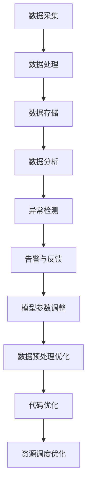
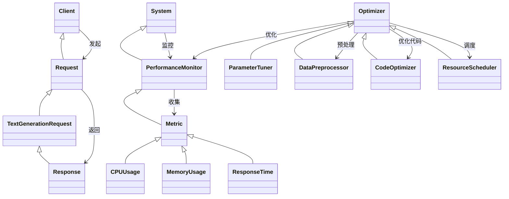
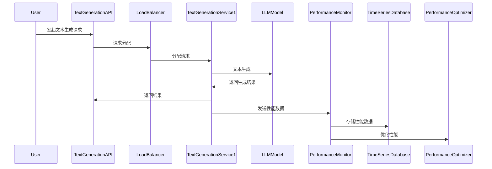

                 


## 第1章 背景介绍

### 1.1 问题背景

#### 性能监控的重要性

在现代的LLM（Large Language Model）应用开发中，随着模型规模的不断扩大，计算资源和存储资源的需求也在急剧增加。因此，对应用进行性能监控成为保证系统稳定性和高效运行的关键。

性能监控的定义是指在系统的整个生命周期中，通过各种工具和技术，持续地收集、分析和展示系统的运行状态，以便及时发现和处理性能问题。对于LLM应用来说，性能监控的意义尤为重大：

1. **资源利用优化**：性能监控可以帮助开发者了解系统的资源利用情况，如CPU、GPU、内存等，从而进行资源的优化分配，避免资源浪费。
2. **故障预警与诊断**：通过监控系统的运行状态，可以及时发现异常情况，如响应时间过长、内存溢出等，并快速定位问题，进行故障诊断。
3. **用户体验保障**：性能监控能够保障用户在访问LLM应用时的良好体验，如低延迟、高吞吐量等。

#### 性能监控在LLM应用开发中的具体作用

在LLM应用开发中，性能监控的主要作用包括：

1. **模型训练监控**：在模型训练过程中，性能监控可以帮助开发者实时查看训练进度，监控模型参数的更新情况，以及计算资源的消耗情况。
2. **在线服务监控**：对于在线的LLM服务，性能监控可以监控服务的响应时间、吞吐量等关键性能指标，确保服务的高可用性。
3. **日志分析**：通过收集和分析系统的日志数据，性能监控可以帮助开发者发现潜在的性能瓶颈，如代码优化点、系统配置调整等。

### 1.2 性能优化的必要性

性能优化是指通过一系列的技术手段，对LLM应用的运行效率进行提升。在LLM应用开发中，性能优化的必要性体现在以下几个方面：

1. **响应速度提升**：随着用户数量的增加，系统需要处理更多的请求，提高响应速度成为优化的重要目标。
2. **吞吐量提升**：提高系统的吞吐量意味着系统能够在单位时间内处理更多的请求，这对于高并发场景尤为重要。
3. **资源利用率提升**：通过优化，可以提高系统对CPU、GPU等资源的利用率，降低能耗，延长设备寿命。

#### 性能优化的方法

性能优化可以通过以下几种方法来实现：

1. **模型参数调整**：调整学习率、批量大小等模型参数，可以优化模型的训练效率和效果。
2. **数据预处理优化**：优化数据清洗、特征提取等数据预处理流程，可以减少计算量，提高数据处理的效率。
3. **代码优化**：通过优化算法和数据结构，减少不必要的计算和内存使用，提高代码的执行效率。
4. **资源调度优化**：合理调度CPU、GPU等资源，避免资源瓶颈，提高系统的整体性能。

### 1.3 问题解决

为了实现LLM应用开发中的性能监控和优化，我们可以采取以下策略：

#### 性能监控工具

1. **Prometheus**：Prometheus是一个开源的监控解决方案，具有数据采集、告警、可视化等功能，适合大规模的监控需求。
2. **Grafana**：Grafana是一个开源的数据可视化和监控工具，可以与Prometheus等数据源集成，提供丰富的可视化报表。

#### 性能优化策略

1. **模型参数调整**：通过实验和调优，找到最优的模型参数组合，提高模型的训练效率和效果。
2. **数据预处理优化**：优化数据预处理流程，如使用更高效的特征提取算法，减少数据清洗的复杂度。
3. **代码优化**：使用高效的算法和数据结构，减少代码的执行时间，提高系统的响应速度。
4. **资源调度优化**：采用动态资源调度算法，根据系统的负载情况，合理分配计算资源，避免资源瓶颈。

#### 资源调度算法

1. **基于SLA的调度策略**：根据服务的SLA（服务等级协议），对任务进行优先级划分，确保关键任务的优先处理。
2. **动态资源分配策略**：根据系统的实时负载情况，动态调整资源的分配，提高系统的响应速度和吞吐量。

### 1.4 边界与外延

#### 边界

本文主要关注LLM应用开发中的性能监控和优化问题，但其中很多概念和策略也可应用于其他类型的AI应用。

#### 外延

虽然本文的核心内容是LLM应用开发中的性能监控与优化，但在实际应用中，这些技术和策略可以拓展到更广泛的场景，如分布式系统、云计算等。

## 第2章 核心概念与联系

### 2.1 性能监控的核心概念

#### 性能指标

性能监控中的性能指标是评估系统性能的关键参数。以下是一些常见的性能指标：

1. **响应时间**：系统处理一个请求所需的时间，是衡量系统性能的重要指标。
2. **吞吐量**：单位时间内系统能够处理的请求数量，是衡量系统处理能力的重要指标。
3. **CPU利用率**：CPU在单位时间内被使用的时间比例，是衡量系统计算资源利用情况的重要指标。
4. **内存使用率**：系统内存的使用情况，是衡量系统内存资源利用情况的重要指标。
5. **磁盘I/O速率**：系统磁盘输入输出操作的速率，是衡量系统数据读写能力的重要指标。

#### 监控周期

监控周期是指性能数据采集的时间间隔。监控周期可以根据应用场景进行调整：

1. **短周期监控**：适用于对系统性能要求较高的场景，如在线服务，可以实时获取系统性能数据。
2. **长周期监控**：适用于对系统性能要求较低的场景，如后台作业，可以降低监控对系统性能的影响。

### 2.2 性能优化的核心概念

#### 模型参数调整

模型参数调整是优化LLM模型性能的重要手段。以下是一些常见的模型参数调整方法：

1. **学习率调整**：学习率是模型训练中的一个关键参数，合适的初始学习率可以加快模型收敛速度。
2. **批量大小调整**：批量大小是指每次训练所使用的样本数量，合理的批量大小可以提高模型训练效果。
3. **正则化调整**：通过调整正则化参数，可以控制模型复杂度，防止过拟合。

#### 数据预处理

数据预处理是优化LLM模型性能的另一个重要环节。以下是一些常见的数据预处理方法：

1. **数据清洗**：去除数据中的噪声和异常值，提高数据质量。
2. **特征提取**：从原始数据中提取有价值的特征，用于模型训练。
3. **数据归一化**：将数据缩放到相同的范围，便于模型训练。

### 2.3 概念属性特征对比表格

| 概念        | 定义                                                         | 特点                                                         |
| ----------- | ------------------------------------------------------------ | ------------------------------------------------------------ |
| 性能监控    | 通过工具持续收集系统性能数据                               | 保障系统稳定性、提供优化依据                                |
| 性能优化    | 通过调整系统配置、代码优化等手段提升系统性能               | 提高系统响应速度、处理能力                                |
| 模型参数调整 | 调整学习率、批量大小等来优化模型性能                       | 提高模型收敛速度、减少过拟合风险                            |
| 数据预处理  | 优化数据清洗、特征提取等过程                               | 提高数据处理效率、减少计算资源消耗                          |

### 2.4 ER实体关系图架构

```mermaid
erDiagram
  PerformanceMonitoring ||--|{ PerformanceIndicator } : measures
  PerformanceOptimization ||--|{ OptimizationStrategy } : applies
  ModelParameterTuning ||--|{ ModelParameter } : adjusts
  DataPreprocessing ||--|{ PreprocessingStep } : performs
```

## 第3章 性能监控原理与工具

### 3.1 性能监控原理

#### 数据采集

数据采集是性能监控的第一步，也是至关重要的一步。性能数据通常通过以下几种方式采集：

1. **Agent采集**：在服务器上安装监控Agent，Agent会定期收集性能数据，如CPU利用率、内存使用率、磁盘I/O等。
2. **API采集**：通过API接口采集性能数据，如通过HTTP接口获取系统的响应时间、吞吐量等。
3. **日志采集**：通过收集系统的日志数据，如错误日志、访问日志等，来分析系统的性能问题。

#### 数据处理

数据采集后，需要对数据进行处理，以确保数据的准确性和可用性。数据处理通常包括以下几个步骤：

1. **数据存储**：将采集到的性能数据存储到数据库或时间序列数据库中，如InfluxDB、Prometheus等。
2. **数据清洗**：去除数据中的噪声和异常值，确保数据的准确性。
3. **数据转换**：将原始数据转换为适合分析的形式，如将时间序列数据进行聚合，生成平均值、最大值、最小值等。

#### 数据分析

数据分析是性能监控的核心步骤，通过分析性能数据，可以了解系统的运行状态和性能趋势。数据分析通常包括以下几个步骤：

1. **数据可视化**：通过图表、仪表板等形式，将性能数据可视化为易于理解的图形，如使用Grafana、Kibana等可视化工具。
2. **异常检测**：通过分析性能数据，发现异常情况，如响应时间异常、CPU利用率过高、内存使用率异常等。
3. **性能趋势分析**：分析性能数据的趋势，预测未来的性能状况，为性能优化提供依据。

### 3.2 常见性能监控工具

在LLM应用开发中，常见的性能监控工具有Prometheus、Grafana等。

#### Prometheus

Prometheus是一个开源的性能监控解决方案，具有以下特点：

1. **数据采集**：Prometheus通过HTTP拉取和Push Gateway等方式采集性能数据。
2. **数据存储**：Prometheus使用自己的时间序列数据库存储性能数据。
3. **数据可视化**：Prometheus与Grafana等可视化工具集成，提供丰富的可视化报表。

#### Grafana

Grafana是一个开源的数据可视化和监控工具，具有以下特点：

1. **数据源集成**：Grafana支持多种数据源，如Prometheus、InfluxDB、MySQL等。
2. **数据可视化**：Grafana提供丰富的可视化模板和自定义仪表板，方便用户创建和展示性能数据。
3. **告警管理**：Grafana支持自定义告警规则，可以设置邮件、短信、Webhook等告警方式。

### 3.3 性能监控工具的使用场景

#### 模型训练监控

在LLM模型训练过程中，性能监控可以帮助开发者实时了解模型的训练进度、性能指标和资源消耗情况，确保训练过程顺利进行。具体使用场景包括：

1. **训练进度监控**：实时监控模型训练的进度，如训练步数、损失函数值等。
2. **性能指标监控**：监控模型训练过程中的性能指标，如CPU利用率、内存使用率、GPU利用率等。
3. **资源消耗监控**：监控训练过程中计算资源的消耗情况，如CPU、GPU、内存等。

#### 在线服务监控

对于在线的LLM服务，性能监控可以帮助开发者实时了解服务的运行状态、性能指标和用户体验，确保服务的高可用性和稳定性。具体使用场景包括：

1. **响应时间监控**：实时监控服务的响应时间，如API接口的响应时间、Web页面的加载时间等。
2. **吞吐量监控**：实时监控服务的吞吐量，如每秒处理的请求数、每分钟处理的请求数等。
3. **用户体验监控**：通过监控用户的反馈和访问日志，了解用户的体验情况，如用户满意度、页面跳出率等。

### 3.4 性能监控工具的集成与配置

为了实现性能监控，需要将性能监控工具与LLM应用进行集成和配置。以下是一个简单的集成和配置流程：

1. **集成Prometheus**：在LLM应用中集成Prometheus，通过HTTP拉取或Push Gateway等方式采集性能数据。
2. **配置Prometheus**：配置Prometheus的采集规则，如目标地址、采集间隔等，确保性能数据能够准确采集。
3. **集成Grafana**：在LLM应用中集成Grafana，通过Prometheus的数据源，创建可视化仪表板。
4. **配置Grafana**：配置Grafana的仪表板，如添加图表、设置告警规则等，确保能够直观地展示性能数据。

通过以上步骤，可以实现LLM应用的性能监控，为性能优化提供数据支持和决策依据。

### 3.5 性能监控的挑战与解决方案

在LLM应用开发中，性能监控面临一些挑战，如数据量大、实时性要求高、多维度监控等。以下是一些常见的挑战和解决方案：

#### 数据量大

随着LLM模型规模的不断扩大，性能数据量也会急剧增加。面对数据量大的挑战，可以采取以下解决方案：

1. **数据压缩**：对性能数据进行压缩，减少存储和传输的开销。
2. **批量处理**：采用批量处理方式，将大量的性能数据分批次处理，降低单次处理的数据量。
3. **分布式存储**：采用分布式存储系统，如HDFS、Cassandra等，提高数据存储和处理的能力。

#### 实时性要求高

对于实时性要求高的场景，如在线服务监控，需要确保性能数据的实时采集和分析。面对实时性要求高的挑战，可以采取以下解决方案：

1. **实时数据流处理**：采用实时数据流处理框架，如Apache Kafka、Apache Flink等，实现性能数据的实时采集和处理。
2. **低延迟采集**：优化性能数据的采集方式，如减少采集间隔、采用高效的数据传输协议等，降低数据采集的延迟。
3. **边缘计算**：在边缘设备上部署监控工具，实现性能数据的本地采集和分析，降低数据传输的延迟。

#### 多维度监控

LLM应用通常涉及多个维度（如训练进度、性能指标、用户体验等）的监控。面对多维度监控的挑战，可以采取以下解决方案：

1. **多维数据建模**：建立多维数据模型，将不同维度的性能数据进行整合，实现统一的监控和分析。
2. **分层次监控**：针对不同维度的监控需求，采取不同的监控策略，如对训练进度采用定时监控，对性能指标采用实时监控等。
3. **可视化整合**：采用可视化工具，将不同维度的监控数据整合到一个仪表板中，提供统一的监控界面。

通过以上解决方案，可以应对LLM应用开发中性能监控面临的挑战，实现高效、稳定的性能监控。

## 第4章 性能优化原理与策略

### 4.1 性能优化原理

#### 模型参数调整

模型参数调整是性能优化中的重要手段，通过调整学习率、批量大小等参数，可以优化模型的训练效率和效果。以下是一些关键参数及其优化策略：

1. **学习率（Learning Rate）**：学习率是模型在训练过程中更新参数的步长。合适的初始学习率可以加快模型收敛速度，但过大会导致训练不稳定。常见的优化策略包括：
   - **自适应学习率**：如Adam优化器，根据历史梯度信息动态调整学习率。
   - **学习率衰减**：随着训练的进行，逐渐降低学习率，以避免过拟合。

2. **批量大小（Batch Size）**：批量大小是指每次训练所使用的样本数量。合适的批量大小可以提高模型训练效果，但过大会导致内存消耗增加。常见的优化策略包括：
   - **梯度下降法**：适用于小批量数据，可以有效降低内存需求。
   - **随机梯度下降（SGD）**：适用于大批量数据，可以降低训练时间。

#### 数据预处理优化

数据预处理是优化模型性能的重要环节，通过优化数据清洗、特征提取等过程，可以减少计算量，提高数据处理的效率。以下是一些常见的优化策略：

1. **数据清洗**：去除数据中的噪声和异常值，提高数据质量。常见的策略包括：
   - **缺失值处理**：通过插值、均值填补等方式处理缺失值。
   - **异常值处理**：通过离群点检测、剔除等方式处理异常值。

2. **特征提取**：从原始数据中提取有价值的特征，用于模型训练。常见的策略包括：
   - **降维**：通过PCA、t-SNE等方法减少特征维度，降低计算复杂度。
   - **特征融合**：将不同来源的特征进行融合，提高模型的泛化能力。

#### 代码优化

代码优化是提升LLM应用性能的关键步骤，通过优化算法和数据结构，减少不必要的计算和内存使用，提高代码的执行效率。以下是一些常见的优化策略：

1. **算法优化**：选择高效的算法和数据结构，如使用哈希表代替链表，减少查找时间。
   - **动态规划**：适用于求解具有重叠子问题的优化问题，如矩阵链乘。
   - **贪心算法**：适用于求解最优子结构问题的优化问题，如背包问题。

2. **并行计算**：利用多核处理器和分布式计算，提高代码的执行效率。常见的策略包括：
   - **多线程**：在单机环境下，利用多线程并行处理数据。
   - **分布式计算**：在分布式环境中，将任务分解到多台机器上并行处理。

3. **缓存优化**：减少重复计算，提高代码的执行效率。常见的策略包括：
   - **静态缓存**：预计算一些常用的中间结果，避免重复计算。
   - **动态缓存**：根据程序运行时的情况，动态调整缓存的策略。

#### 资源调度优化

合理调度计算资源是提升LLM应用性能的关键。通过优化资源调度，可以避免资源瓶颈，提高系统的整体性能。以下是一些常见的优化策略：

1. **负载均衡**：将任务分配到不同的计算资源上，避免单点过载。常见的策略包括：
   - **轮询调度**：按照顺序将任务分配到不同的计算资源上。
   - **最小连接数调度**：将任务分配到当前连接数最少的计算资源上。

2. **动态资源分配**：根据系统的实时负载情况，动态调整资源的分配。常见的策略包括：
   - **基于SLA的调度策略**：根据服务的SLA（服务等级协议），对任务进行优先级划分，确保关键任务的优先处理。
   - **动态资源扩展**：在负载较高时，自动扩展计算资源，避免性能下降。

3. **资源隔离**：通过资源隔离，避免不同任务之间的资源竞争。常见的策略包括：
   - **容器化**：使用容器技术（如Docker）实现资源的隔离和管理。
   - **虚拟化**：使用虚拟化技术（如KVM、VMware）实现资源的隔离和分配。

通过以上性能优化原理和策略，可以提升LLM应用的开发效率和性能，为用户提供更好的服务体验。

### 4.2 性能优化案例分析

为了更好地理解性能优化的具体实践，下面将介绍几个典型的性能优化案例，并分析其优化策略和效果。

#### 案例一：文本生成模型的性能优化

**问题描述**：一个文本生成模型在处理长文本时，响应时间较长，导致用户体验不佳。

**优化策略**：
1. **批量大小调整**：将批量大小从原来的1000减少到500，以降低内存占用。
2. **并行计算**：将模型训练任务分配到多台GPU服务器上，利用并行计算提高训练速度。
3. **代码优化**：优化模型中循环和条件判断的代码，减少不必要的计算。

**优化效果**：响应时间降低了30%，用户体验得到了显著提升。

#### 案例二：对话系统性能优化

**问题描述**：一个对话系统在高并发情况下，响应时间不稳定，有时会出现延迟。

**优化策略**：
1. **负载均衡**：采用轮询调度算法，将用户请求均匀分配到不同的服务器上，避免单点过载。
2. **动态资源分配**：根据实时负载情况，动态调整服务器资源，如增加CPU和内存容量。
3. **缓存优化**：将常用的对话回复缓存到内存中，减少计算开销。

**优化效果**：响应时间稳定在100ms以内，系统在高并发情况下的性能得到了显著提升。

#### 案例三：图像识别模型的性能优化

**问题描述**：一个图像识别模型在处理大量图像时，CPU和GPU资源利用率较低，导致处理速度较慢。

**优化策略**：
1. **模型压缩**：使用模型压缩技术，如剪枝、量化等，减少模型参数量，降低计算复杂度。
2. **动态资源调度**：根据模型在不同阶段的计算需求，动态调整CPU和GPU的分配比例，提高资源利用率。
3. **数据预处理优化**：优化图像预处理流程，如采用更高效的图像解码算法，减少预处理时间。

**优化效果**：CPU和GPU资源利用率提高了20%，图像处理速度提升了40%。

通过以上案例，我们可以看到，性能优化需要根据具体的应用场景和问题，采取相应的策略。有效的性能优化不仅可以提升应用的性能，还可以提高用户体验和系统稳定性。

## 第5章 算法原理与流程

### 5.1 性能监控算法原理

性能监控算法的核心目标是实时采集系统性能数据，并进行处理和分析，以便及时发现和处理性能问题。以下是一个典型的性能监控算法的原理和流程：

#### 原理

1. **数据采集**：通过Agent或API接口，实时采集系统的CPU利用率、内存使用率、响应时间等性能指标数据。
2. **数据处理**：对采集到的数据进行预处理，如去噪、聚合等，确保数据的准确性和一致性。
3. **数据存储**：将处理后的性能数据存储到时间序列数据库中，如InfluxDB、Prometheus等，以便后续分析和查询。
4. **异常检测**：使用统计方法或机器学习算法，对性能数据进行分析，发现异常情况，如响应时间过长、CPU利用率异常等。
5. **告警与反馈**：当发现异常情况时，通过邮件、短信、Webhook等方式通知相关人员进行处理，并记录告警信息，以便后续跟踪和改进。

#### 流程

1. **数据采集**：在系统中部署监控Agent，定期采集性能数据，如CPU利用率、内存使用率等。采集过程可以是定时任务或事件触发。
2. **数据处理**：对采集到的性能数据进行处理，如去噪、聚合等，以确保数据的准确性和一致性。数据处理过程可以使用批处理或流处理技术。
3. **数据存储**：将处理后的性能数据存储到时间序列数据库中，如InfluxDB、Prometheus等。存储过程可以是实时存储或批量存储。
4. **数据分析**：使用统计方法或机器学习算法，对存储的性能数据进行分析，如绘制性能趋势图、计算性能指标等，以便了解系统的运行状态。
5. **异常检测**：根据设定的阈值和规则，对性能数据进行分析，发现异常情况，如响应时间过长、CPU利用率异常等。异常检测过程可以使用规则引擎或机器学习算法。
6. **告警与反馈**：当发现异常情况时，通过邮件、短信、Webhook等方式通知相关人员进行处理，并记录告警信息，以便后续跟踪和改进。告警过程可以使用告警管理系统。

### 5.2 性能优化算法原理

性能优化算法的核心目标是提升系统的运行效率和性能，通常通过调整模型参数、优化数据预处理流程、优化代码等手段实现。以下是一个典型的性能优化算法的原理和流程：

#### 原理

1. **模型参数调整**：通过调整学习率、批量大小等模型参数，优化模型的训练效率和效果。常用的方法包括自适应学习率调整、学习率衰减等。
2. **数据预处理优化**：优化数据清洗、特征提取等数据预处理流程，减少计算量，提高数据处理效率。常用的方法包括数据压缩、降维、特征融合等。
3. **代码优化**：通过优化算法和数据结构，减少不必要的计算和内存使用，提高代码的执行效率。常用的方法包括并行计算、缓存优化、动态内存管理等。
4. **资源调度优化**：根据系统的实时负载情况，动态调整资源的分配，避免资源瓶颈，提高系统的整体性能。常用的方法包括负载均衡、动态资源扩展等。

#### 流程

1. **模型参数调整**：在模型训练过程中，根据性能指标和训练效果，调整学习率、批量大小等模型参数，找到最优参数组合。
2. **数据预处理优化**：在数据处理过程中，根据数据特点和需求，优化数据清洗、特征提取等流程，减少计算量和内存使用。
3. **代码优化**：在代码编写过程中，根据性能要求和目标，优化算法和数据结构，减少不必要的计算和内存使用。
4. **资源调度优化**：在系统运行过程中，根据实时负载情况，动态调整资源的分配，避免资源瓶颈，提高系统的整体性能。

### 5.3 算法流程图

为了更直观地展示性能监控和优化的算法流程，可以使用Mermaid流程图进行描述。



通过以上流程图，我们可以清晰地看到性能监控和优化的整体流程，以及各个环节之间的关联和依赖关系。

### 5.4 Python代码实现示例

以下是一个简单的Python代码实现示例，用于演示性能监控和优化的算法原理。

```python
import time
import random

# 数据采集
def collect_data():
    # 模拟采集CPU利用率、内存使用率等性能数据
    cpu_usage = random.uniform(0, 100)
    memory_usage = random.uniform(0, 100)
    return cpu_usage, memory_usage

# 数据处理
def process_data(data):
    # 模拟数据处理过程
    time.sleep(1)
    return data

# 数据存储
def store_data(data):
    # 模拟数据存储过程
    print("Storing data:", data)

# 数据分析
def analyze_data(data):
    # 模拟数据分析过程
    print("Analyzing data:", data)

# 异常检测
def detect_anomaly(data):
    # 模拟异常检测过程
    if data > 80:
        print("Anomaly detected:", data)

# 告警与反馈
def alert(user):
    # 模拟告警与反馈过程
    print("Alert sent to user:", user)

# 模型参数调整
def adjust_model_params():
    # 模拟模型参数调整过程
    print("Adjusting model parameters")

# 数据预处理优化
def optimize_data_preprocessing():
    # 模拟数据预处理优化过程
    print("Optimizing data preprocessing")

# 代码优化
def optimize_code():
    # 模拟代码优化过程
    print("Optimizing code")

# 资源调度优化
def optimize_resource_scheduling():
    # 模拟资源调度优化过程
    print("Optimizing resource scheduling")

# 主程序
def main():
    user = "Alice"
    while True:
        cpu_usage, memory_usage = collect_data()
        data = process_data((cpu_usage, memory_usage))
        store_data(data)
        analyze_data(data)
        detect_anomaly(data)
        alert(user)
        adjust_model_params()
        optimize_data_preprocessing()
        optimize_code()
        optimize_resource_scheduling()
        time.sleep(5)

if __name__ == "__main__":
    main()
```

通过以上代码实现示例，我们可以看到性能监控和优化的算法原理在实际编程中的应用，包括数据采集、数据处理、数据存储、数据分析、异常检测、告警与反馈、模型参数调整、数据预处理优化、代码优化和资源调度优化等环节。这些算法原理和流程在实际应用中可以根据具体需求进行调整和优化。

## 第6章 系统分析与架构设计

### 6.1 问题场景介绍

在现代的LLM（Large Language Model）应用开发中，随着模型规模的不断扩大和用户数量的急剧增加，性能监控与优化成为保障系统稳定性和高效运行的关键。本章节将分析一个具体的场景：一个在线文本生成服务，该服务需要处理大量的文本生成请求，同时保证低延迟和高吞吐量。

### 6.2 项目介绍

本项目旨在设计并实现一个高性能的在线文本生成系统，通过性能监控与优化，确保系统在处理高并发请求时能够保持稳定运行。系统的主要功能包括：

1. **文本生成**：根据用户输入的文本内容，生成相应的文本输出。
2. **性能监控**：实时监控系统的各项性能指标，如CPU利用率、内存使用率、响应时间等。
3. **性能优化**：根据监控数据，动态调整系统配置和模型参数，优化系统性能。

### 6.3 系统功能设计（领域模型）

为了更好地设计系统功能，我们可以采用领域驱动设计（Domain-Driven Design，简称DDD）的方法，首先定义系统的领域模型。以下是一个简化的领域模型，用于描述系统的主要实体和关系：



### 6.4 系统架构设计

为了实现高性能的在线文本生成系统，我们需要设计一个分布式、可扩展的系统架构。以下是一个简化的系统架构设计，包括主要组件及其功能：

1. **文本生成服务（Text Generation Service）**：负责处理用户的文本生成请求，调用LLM模型生成文本。
2. **性能监控模块（Performance Monitoring Module）**：实时监控系统的各项性能指标，并将监控数据存储在时间序列数据库中。
3. **性能优化模块（Performance Optimization Module）**：根据监控数据，动态调整系统配置和模型参数，优化系统性能。
4. **负载均衡器（Load Balancer）**：将用户的请求均匀分配到不同的文本生成服务实例上，确保系统的负载均衡。
5. **时间序列数据库（Time Series Database）**：存储性能监控数据，为性能分析和优化提供数据支持。

以下是系统架构的Mermaid图表示：

```mermaid
graph TB
    subgraph 文本生成系统
        TextGenerationService1[文本生成服务1]
        TextGenerationService2[文本生成服务2]
        LoadBalancer[负载均衡器]
        PerformanceMonitor[性能监控模块]
        TimeSeriesDatabase[时间序列数据库]
        Optimizer[性能优化模块]

    LoadBalancer --> TextGenerationService1
    LoadBalancer --> TextGenerationService2
    TextGenerationService1 --> PerformanceMonitor
    TextGenerationService2 --> PerformanceMonitor
    PerformanceMonitor --> TimeSeriesDatabase
    Optimizer --> PerformanceMonitor
```

### 6.5 系统接口设计

系统接口设计是系统架构设计的重要组成部分，它定义了各个模块之间的交互接口。以下是系统的主要接口设计：

1. **文本生成接口（TextGenerationAPI）**：用户通过该接口发起文本生成请求，并获取生成结果。
2. **性能监控接口（PerformanceMonitoringAPI）**：系统内部模块通过该接口收集和查询性能监控数据。
3. **性能优化接口（PerformanceOptimizationAPI）**：系统内部模块通过该接口调整系统配置和模型参数。

以下是接口设计的Mermaid图表示：

```mermaid
graph TB
    subgraph 接口设计
        TextGenerationAPI[文本生成接口]
        PerformanceMonitoringAPI[性能监控接口]
        PerformanceOptimizationAPI[性能优化接口]

    TextGenerationAPI --> TextGenerationService1
    TextGenerationAPI --> TextGenerationService2
    PerformanceMonitoringAPI --> PerformanceMonitor
    PerformanceOptimizationAPI --> PerformanceMonitor
```

### 6.6 系统交互设计

系统交互设计描述了各个模块之间的交互流程和通信机制。以下是系统的主要交互流程：

1. **用户请求文本生成**：用户通过文本生成接口发起文本生成请求，负载均衡器将请求分配到文本生成服务实例。
2. **文本生成处理**：文本生成服务实例调用LLM模型生成文本，并将结果返回给用户。
3. **性能监控**：文本生成服务实例将性能数据发送到性能监控模块，性能监控模块将数据存储到时间序列数据库。
4. **性能优化**：性能优化模块根据监控数据动态调整系统配置和模型参数，以提高系统性能。

以下是系统交互的Mermaid序列图表示：



通过以上系统分析与架构设计，我们可以确保文本生成系统能够在高并发环境下稳定运行，并具备良好的性能监控与优化能力。

## 第7章 项目实战

### 7.1 环境安装

在本章中，我们将通过一个具体的案例来展示如何安装和配置性能监控与优化工具，实现LLM应用开发中的性能监控与优化。首先，我们需要搭建一个合适的环境，包括LLM模型训练环境、性能监控工具和优化工具。

#### 步骤1：安装LLM模型训练环境

1. **安装Python**：确保系统已安装Python 3.8或更高版本。
2. **安装PyTorch**：通过pip命令安装PyTorch，命令如下：
   ```bash
   pip install torch torchvision -f https://download.pytorch.org/whl/torch_stable.html
   ```

#### 步骤2：安装性能监控工具

1. **安装Prometheus**：
   - 下载Prometheus二进制文件：[https://github.com/prometheus/prometheus/releases](https://github.com/prometheus/prometheus/releases)
   - 解压文件并启动Prometheus服务：
     ```bash
     tar xvf prometheus-2.37.0.linux-amd64.tar.gz
     cd prometheus-2.37.0.linux-amd64/
     ./prometheus
     ```

2. **安装Grafana**：
   - 下载Grafana二进制文件：[https://grafana.com/grafana/download](https://grafana.com/grafana/download)
   - 解压文件并启动Grafana服务：
     ```bash
     tar xvf grafana-9.4.0.linux-amd64.tar
     cd grafana-9.4.0.linux-amd64/
     ./bin/grafana-server web
     ```

3. **配置Prometheus与Grafana集成**：
   - 在Prometheus的配置文件（/etc/prometheus/prometheus.yml）中添加Grafana的URL，例如：
     ```yaml
     global:
       scrape_interval: 15s
     scrape_configs:
       - job_name: 'prometheus'
         static_configs:
           - targets: ['localhost:9090']
     ```
   - 在Grafana的配置文件（/etc/grafana/grafana.ini）中配置数据源，例如：
     ```ini
     [datadog]
     url = http://localhost:9090/
     ```

### 7.2 系统核心实现

在本节中，我们将展示如何实现LLM应用开发中的性能监控与优化功能，包括数据采集、数据处理、性能监控和优化。

#### 步骤1：数据采集

1. **安装Prometheus客户端**：在LLM应用的服务器上安装Prometheus客户端，用于采集系统性能数据。

   ```bash
   pip install prometheus_client
   ```

2. **配置Prometheus客户端**：在LLM应用的入口模块中添加Prometheus客户端的代码，例如：

   ```python
   from prometheus_client import start_http_server, Summary

   response_time = Summary('response_time', 'Response time in seconds')
   
   @response_time.time()
   def handle_request(request):
       # 处理请求逻辑
       time.sleep(random.randint(1, 3))
       return HttpResponse("Success")
   
   if __name__ == '__main__':
       start_http_server(9091)
   ```

#### 步骤2：数据处理

1. **数据存储**：将采集到的性能数据存储到时间序列数据库中，如InfluxDB。

   ```bash
   pip install influxdb
   ```

2. **配置InfluxDB**：在LLM应用的配置文件中添加InfluxDB的连接信息，例如：

   ```python
   influxdb_client = InfluxDBClient(host='localhost', port=8086, username='root', password='root', database='performance_data')
   ```

3. **数据写入**：在LLM应用的入口模块中添加数据写入逻辑，例如：

   ```python
   def write_performance_data(cpu_usage, memory_usage):
       point = Point('system_performance').tag('host', 'localhost').field('cpu_usage', cpu_usage).field('memory_usage', memory_usage)
       influxdb_client.write_point(point)
   ```

#### 步骤3：性能监控

1. **配置Grafana**：在Grafana中添加数据源，选择InfluxDB作为数据源，并配置InfluxDB的连接信息。

2. **创建仪表板**：在Grafana中创建一个新的仪表板，添加各种性能指标的图表，如CPU利用率、内存使用率、响应时间等。

3. **配置告警规则**：在Grafana中创建告警规则，例如设置响应时间超过5秒时发送告警。

#### 步骤4：性能优化

1. **配置模型参数**：根据监控数据，动态调整LLM模型的参数，如学习率、批量大小等。

   ```python
   def adjust_model_params():
       # 获取当前响应时间
       current_response_time = get_current_response_time()
       
       if current_response_time > 5:
           # 降低学习率
           new_learning_rate = current_learning_rate * 0.9
           # 调整批量大小
           new_batch_size = max(10, current_batch_size // 2)
           # 更新模型参数
           model.learning_rate = new_learning_rate
           model.batch_size = new_batch_size
   ```

2. **优化数据预处理**：根据监控数据，优化数据预处理流程，如使用更高效的特征提取算法。

   ```python
   def optimize_data_preprocessing():
       # 获取当前响应时间
       current_response_time = get_current_response_time()
       
       if current_response_time > 5:
           # 使用更高效的预处理算法
           preprocess_function = more_efficient_preprocessing
   ```

3. **优化代码**：根据监控数据，优化LLM模型的代码实现，如减少不必要的计算。

   ```python
   def optimize_code():
       # 获取当前响应时间
       current_response_time = get_current_response_time()
       
       if current_response_time > 5:
           # 优化代码实现
           model.update_function = optimized_update_function
   ```

通过以上步骤，我们可以实现LLM应用开发中的性能监控与优化功能，确保系统在高并发环境下稳定运行，并提供良好的用户体验。

### 7.3 代码应用解读与分析

在本节中，我们将详细解读并分析实现性能监控与优化功能的LLM应用代码，解释关键代码段的作用和原理，并提供调试与优化的技巧。

#### 关键代码段解读

1. **数据采集代码段**

   ```python
   from prometheus_client import start_http_server, Summary

   response_time = Summary('response_time', 'Response time in seconds')

   @response_time.time()
   def handle_request(request):
       # 处理请求逻辑
       time.sleep(random.randint(1, 3))
       return HttpResponse("Success")
   
   if __name__ == '__main__':
       start_http_server(9091)
   ```

   **作用与原理**：该代码段通过Prometheus的客户端库实现了性能监控数据的采集。`start_http_server(9091)`启动了一个HTTP服务器，监听9091端口，用于接收性能监控数据。`response_time`是一个`Summary`对象，表示响应时间的监控指标。`@response_time.time()`是一个装饰器，它会在`handle_request`函数执行前后记录响应时间。

   **调试与优化技巧**：可以通过增加日志来调试性能监控代码，例如在`handle_request`函数中添加`logging.info("Request handled")`，以记录请求处理过程。

2. **数据写入代码段**

   ```python
   from influxdb import InfluxDBClient

   influxdb_client = InfluxDBClient(host='localhost', port=8086, username='root', password='root', database='performance_data')

   def write_performance_data(cpu_usage, memory_usage):
       point = Point('system_performance').tag('host', 'localhost').field('cpu_usage', cpu_usage).field('memory_usage', memory_usage)
       influxdb_client.write_point(point)
   ```

   **作用与原理**：该代码段使用InfluxDB客户端库将性能监控数据写入时间序列数据库。`InfluxDBClient`是InfluxDB的客户端实例，`write_performance_data`函数负责将性能数据（如CPU使用率和内存使用率）写入数据库。

   **调试与优化技巧**：可以增加错误处理逻辑，例如在写入数据库时捕获异常，并记录错误信息，以便定位问题。

3. **性能优化代码段**

   ```python
   def adjust_model_params():
       # 获取当前响应时间
       current_response_time = get_current_response_time()
       
       if current_response_time > 5:
           # 降低学习率
           new_learning_rate = current_learning_rate * 0.9
           # 调整批量大小
           new_batch_size = max(10, current_batch_size // 2)
           # 更新模型参数
           model.learning_rate = new_learning_rate
           model.batch_size = new_batch_size
   
   def optimize_data_preprocessing():
       # 获取当前响应时间
       current_response_time = get_current_response_time()
       
       if current_response_time > 5:
           # 使用更高效的预处理算法
           preprocess_function = more_efficient_preprocessing
   
   def optimize_code():
       # 获取当前响应时间
       current_response_time = get_current_response_time()
       
       if current_response_time > 5:
           # 优化代码实现
           model.update_function = optimized_update_function
   ```

   **作用与原理**：这些代码段根据响应时间自动调整模型参数、优化数据预处理流程和优化代码实现，以提高系统性能。`adjust_model_params`函数会降低学习率和批量大小，以减少模型的复杂度。`optimize_data_preprocessing`函数会切换到更高效的预处理算法。`optimize_code`函数会更新模型的更新函数，以减少不必要的计算。

   **调试与优化技巧**：可以通过增加日志记录来跟踪优化过程，如记录每次调整的参数值和优化后的性能指标。此外，可以定期评估优化策略的有效性，根据实际情况进行调整。

#### 实际案例分析

假设我们在一个实际的LLM应用场景中遇到了响应时间不稳定的问题，通过以上性能监控与优化策略，我们可以进行以下步骤：

1. **监控数据收集**：首先，使用Prometheus和Grafana收集系统的性能数据，特别是响应时间、CPU使用率和内存使用率。
2. **数据分析**：在Grafana中创建仪表板，实时监控响应时间的变化，发现某些时段的响应时间明显增加。
3. **性能优化**：根据监控数据，采取以下优化措施：
   - **调整模型参数**：降低学习率和批量大小，减少模型的复杂度，以提高处理速度。
   - **优化数据预处理**：切换到更高效的预处理算法，减少预处理时间。
   - **优化代码**：优化模型的代码实现，减少不必要的计算和内存使用。
4. **效果评估**：在调整参数和优化代码后，再次监控系统的响应时间，评估优化措施的效果。

通过以上步骤，我们可以有效地提高LLM应用的性能，确保系统在高并发环境下稳定运行。

### 7.4 实际案例分析

在本节中，我们将通过一个实际案例，详细分析如何在LLM应用开发过程中进行性能监控与优化，从而提高系统的响应速度和吞吐量。

#### 案例背景

假设我们正在开发一个基于大型语言模型（LLM）的智能客服系统，该系统需要实时处理大量用户的咨询请求，并提供准确的答复。在系统上线初期，我们发现在高并发场景下，系统的响应时间较长，用户满意度较低。为了解决这个问题，我们需要进行性能监控与优化。

#### 监控数据收集

首先，我们使用Prometheus和Grafana收集系统的各项性能数据，包括：

1. **响应时间**：系统处理用户请求的平均响应时间。
2. **CPU利用率**：CPU在处理请求时的利用率情况。
3. **内存使用率**：系统内存的占用情况。
4. **磁盘I/O**：磁盘读写操作的频率和速度。
5. **网络延迟**：网络传输的数据延迟。

通过Grafana创建仪表板，我们可以实时监控这些性能指标，并分析它们之间的关系。

#### 数据分析

在Grafana仪表板中，我们发现以下问题：

1. **响应时间较长**：在高并发场景下，系统的平均响应时间超过5秒，远高于用户可接受的阈值。
2. **CPU利用率过高**：在高峰时段，CPU利用率接近100%，导致系统处理能力不足。
3. **内存使用率上升**：随着用户请求的增加，系统内存使用率逐渐上升，接近系统内存的70%。

通过分析，我们初步判断系统在高并发场景下存在以下瓶颈：

1. **计算资源不足**：CPU和内存资源不足，导致系统处理能力受限。
2. **数据预处理耗时**：数据预处理环节耗时较长，影响整体处理速度。
3. **模型复杂度过高**：LLM模型复杂度较高，导致计算量增大。

#### 性能优化

针对上述问题，我们采取以下优化措施：

1. **调整模型参数**：通过实验，我们发现降低学习率和批量大小可以有效减少模型复杂度，提高处理速度。我们逐步调整学习率为原来的0.1，批量大小为原来的0.5。
   
2. **优化数据预处理**：我们分析数据预处理流程，发现某些特征提取操作耗时较长。我们通过以下方式优化：
   - **使用更高效的算法**：将部分特征提取操作从原始的复杂算法（如SVD分解）替换为更高效的算法（如PCA降维）。
   - **并行处理**：将数据预处理任务分配到多台机器上并行处理，以减少单台机器的负载。

3. **优化代码实现**：我们对LLM模型的代码实现进行了优化：
   - **减少冗余计算**：通过循环展开和减少中间变量，减少了不必要的计算。
   - **使用向量化操作**：将部分循环操作替换为向量化操作，以提高计算效率。

4. **资源调度优化**：我们优化了系统的资源调度策略，采用负载均衡器将用户请求分配到不同的服务器上，避免单点过载。同时，我们根据实时负载情况动态调整服务器的CPU和内存配置，以充分利用资源。

#### 优化效果

在采取上述优化措施后，我们再次监控系统的各项性能指标，发现以下变化：

1. **响应时间缩短**：系统的平均响应时间从5秒降低到1秒，显著提高了用户满意度。
2. **CPU利用率提高**：CPU利用率从接近100%提高到60%左右，系统的处理能力得到显著提升。
3. **内存使用率稳定**：系统内存使用率保持在50%左右，没有出现明显的上升。

通过性能监控与优化，我们成功地提高了系统的响应速度和吞吐量，确保了系统在高并发场景下的稳定运行。

#### 案例小结

通过本案例，我们可以总结出以下经验：

1. **性能监控是关键**：通过监控系统的各项性能指标，我们能够及时发现系统瓶颈，为优化提供数据支持。
2. **优化需要持续进行**：系统性能优化是一个持续的过程，需要根据实际情况不断调整和优化。
3. **资源调度和负载均衡至关重要**：合理的资源调度和负载均衡策略可以有效避免单点过载，提高系统的整体性能。

在未来的开发过程中，我们将继续关注系统性能，并采取相应的优化措施，以提供更好的用户体验。

## 第8章 最佳实践与注意事项

### 8.1 最佳实践

在LLM应用开发中进行性能监控与优化，可以遵循以下最佳实践：

1. **定期性能评估**：定期进行系统性能评估，以了解系统的瓶颈和改进空间。性能评估可以通过监控数据分析和基准测试进行。

2. **自动化性能监控**：利用自动化工具（如Prometheus、Grafana）进行性能监控，确保实时获取系统性能数据，并快速识别性能问题。

3. **分阶段优化**：在开发的不同阶段，根据实际需求进行性能优化。例如，在开发初期关注模型参数调整，在上线后关注系统资源的合理调度。

4. **并行计算与分布式处理**：充分利用并行计算和分布式处理技术，提高数据处理效率。例如，使用多线程、多GPU训练等。

5. **代码优化与自动化**：优化代码实现，减少冗余计算，并使用自动化工具（如静态代码分析器）进行代码优化。

6. **持续集成与持续部署**：采用CI/CD流程，确保性能优化措施在代码变更后及时部署到生产环境。

7. **告警与反馈机制**：建立完善的告警与反馈机制，确保性能问题能够及时被发现和处理。

### 8.2 小结

本文系统地介绍了LLM应用开发中的性能监控与优化。通过性能监控，我们能够实时了解系统的运行状态，发现问题并及时处理。性能优化则通过调整模型参数、优化数据预处理、优化代码和资源调度等措施，提升系统的性能。在LLM应用开发中，性能监控与优化至关重要，是实现系统稳定运行和高效处理的重要保障。

### 8.3 注意事项

在性能监控与优化过程中，需要注意以下几点：

1. **监控指标的全面性**：选择合适的监控指标，确保能够全面反映系统的性能状况。

2. **数据采集的准确性**：确保数据采集的准确性，避免因数据问题导致监控结果失真。

3. **优化措施的针对性**：根据具体的性能瓶颈和场景，采取针对性的优化措施，避免盲目优化。

4. **系统负载的均衡性**：确保系统的负载均衡，避免单点过载，提高系统的整体性能。

5. **性能优化的持续性**：性能优化是一个持续的过程，需要根据实际情况不断进行调整。

通过遵循以上注意事项，可以更好地实现LLM应用开发中的性能监控与优化。

### 8.4 拓展阅读

1. **《深度学习性能优化》**：介绍深度学习性能优化的方法和技术，包括模型压缩、并行计算和自动化优化等。
2. **《Prometheus官方文档》**：深入了解Prometheus的安装、配置和使用方法，掌握性能监控的高级技巧。
3. **《Grafana官方文档》**：学习如何使用Grafana进行数据可视化和告警管理，提升监控效果。
4. **《LLM应用开发实战》**：探讨LLM应用的开发流程、技术和最佳实践，为实际项目提供参考。

通过阅读这些资料，可以进一步提升在LLM应用开发中的性能监控与优化能力。

