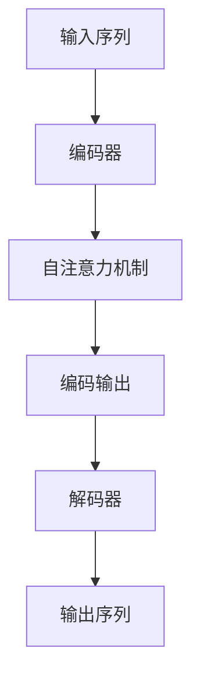
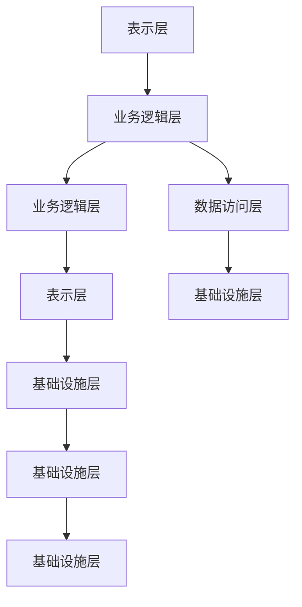
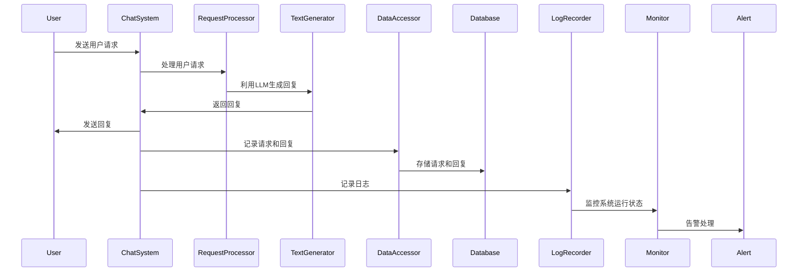

                 

# LLMApplc# LLMAppl

### 摘要

本文将探讨大语言模型（LLM）在应用开发过程中如何实现持续学习与改进。随着深度学习技术的不断发展，LLM已经成为自然语言处理（NLP）领域的核心技术。然而，LLM在应用过程中往往需要面对数据分布变化、模型性能提升等挑战。本文将详细分析LLM的核心概念、算法原理，并介绍如何通过系统设计、项目实施等手段实现持续学习与改进。文章最后将总结最佳实践，提出注意事项，并推荐进一步阅读资源。

## 关键词

- 大语言模型
- 持续学习
- 模型改进
- 算法原理
- 系统设计
- 项目实施

### 第1章 LLMAppl

#### 1.1 LLM的定义与背景

大语言模型（Large Language Model，简称LLM）是一种基于深度学习技术的自然语言处理模型。它通过学习大量文本数据，实现对语言结构的理解和生成能力。LLM的核心在于其能够自动学习和优化模型参数，从而提高对自然语言的表征能力。

LLM的发展可以追溯到20世纪80年代的统计语言模型。随着计算能力的提升和数据量的爆炸性增长，深度学习技术逐渐成为LLM的主流方法。近年来，诸如GPT、BERT等大型预训练模型的出现，标志着LLM技术进入了新的发展阶段。

LLM的应用场景非常广泛，包括但不限于文本生成、机器翻译、问答系统、文本分类等。在各个领域，LLM已经展现出强大的性能和广泛的应用价值。

#### 1.2 持续学习与改进的必要性

尽管LLM在自然语言处理领域取得了显著成就，但在实际应用过程中，仍然面临着一些挑战。首先，数据分布变化是一个重要问题。随着时间推移，社会环境、用户需求等都会发生变化，LLM需要适应这些变化，保持其预测和生成能力。其次，模型性能的提升也是持续学习的重要目标。通过不断优化模型结构、训练过程，可以提高LLM的准确性和效率。

#### 1.3 持续学习的方法

持续学习（Continuous Learning）是指在模型应用过程中，不断更新和优化模型参数，以适应数据分布变化和性能提升的需求。以下是几种常见的持续学习方法：

1. **在线学习（Online Learning）**：在线学习是指在模型部署后，实时接收新的数据并进行训练。这种方法能够及时应对数据分布变化，但需要处理模型更新和数据流量的平衡问题。

2. **迁移学习（Transfer Learning）**：迁移学习是指将一个在特定任务上训练好的模型，迁移到另一个相关任务上。这种方法可以利用已有模型的先验知识，加快新任务的训练过程。

3. **元学习（Meta-Learning）**：元学习是指通过学习如何学习，提高模型在不同任务上的适应能力。元学习方法能够减少对新任务的训练时间，提高模型泛化能力。

#### 1.4 持续改进的策略

持续改进（Continuous Improvement）是指通过不断优化模型结构、训练过程和评估指标，提升模型性能和应用效果。以下是几种常见的持续改进策略：

1. **模型剪枝（Model Pruning）**：模型剪枝是指通过去除模型中不重要的参数，减小模型体积，提高模型运行效率。剪枝方法包括权重裁剪、结构化剪枝等。

2. **模型蒸馏（Model Distillation）**：模型蒸馏是指将一个大型模型的知识传递给一个较小的模型。这种方法可以减少模型体积，提高模型运行速度，同时保持较高的性能。

3. **强化学习（Reinforcement Learning）**：强化学习是一种通过与环境交互，不断优化策略的机器学习方法。在LLM应用中，可以通过强化学习算法，调整模型参数，提高模型在不同场景下的适应能力。

#### 1.5 小结

本章介绍了LLM的定义与背景、持续学习与改进的必要性，以及相关的方法和策略。在下一章中，我们将深入探讨LLM的核心概念和算法原理，为后续章节的内容打下基础。

### 第2章 LLMAppl

#### 2.1 LLM的核心概念与原理

大语言模型（LLM）的核心在于其能够自动学习和理解自然语言。为了实现这一目标，LLM需要具备以下几个关键概念和原理：

#### 2.1.1 模型架构

LLM的模型架构通常基于自注意力机制（Self-Attention）和变换器（Transformer）网络。变换器网络由编码器（Encoder）和解码器（Decoder）组成，分别负责输入序列的处理和输出序列的生成。

编码器将输入序列映射为一个固定长度的向量表示，解码器则根据编码器的输出，逐步生成输出序列。自注意力机制是变换器网络的核心，通过计算输入序列中每个词与其他词之间的相似性，实现对输入序列的动态编码。

#### 2.1.2 训练过程

LLM的训练过程主要包括预训练（Pre-training）和微调（Fine-tuning）两个阶段。

预训练是指在大量未标注的数据上进行训练，使模型学会对自然语言的表征。预训练任务通常包括语言建模（Language Modeling）和掩码语言建模（Masked Language Modeling）等。

微调是指在特定任务上对模型进行微调，使其适应特定场景。微调过程中，模型会利用已标注的数据进行训练，优化模型参数，提高模型在目标任务上的性能。

#### 2.1.3 应用领域与案例

LLM的应用领域非常广泛，包括但不限于文本生成、机器翻译、问答系统、文本分类等。

1. **文本生成**：LLM可以生成各种类型的文本，如文章、对话、代码等。例如，GPT-3可以生成高质量的新闻报道、技术文档和诗歌。

2. **机器翻译**：LLM可以用于机器翻译任务，如将一种语言翻译成另一种语言。BERT模型在机器翻译任务上取得了很好的效果。

3. **问答系统**：LLM可以用于构建问答系统，如智能客服、智能助手等。这些系统可以通过理解用户的问题，提供准确的答案。

4. **文本分类**：LLM可以用于文本分类任务，如情感分析、新闻分类等。通过训练，模型可以学会识别不同类型的文本，并将其分类到相应的类别中。

#### 2.1.4 持续学习的概念与方式

持续学习是指在整个应用生命周期中，不断更新和优化模型，以应对数据分布变化和性能提升的需求。以下是几种常见的持续学习方式：

1. **在线学习**：在线学习是指在模型部署后，实时接收新的数据并进行训练。这种方法能够及时应对数据分布变化，但需要处理模型更新和数据流量的平衡问题。

2. **迁移学习**：迁移学习是指将一个在特定任务上训练好的模型，迁移到另一个相关任务上。这种方法可以利用已有模型的先验知识，加快新任务的训练过程。

3. **元学习**：元学习是指通过学习如何学习，提高模型在不同任务上的适应能力。元学习方法能够减少对新任务的训练时间，提高模型泛化能力。

#### 2.2 LLM的核心概念与联系

为了更好地理解LLM的核心概念和原理，我们可以通过以下表格和ER实体关系图进行展示：

#### 2.2.1 核心概念属性特征对比表格

| 概念         | 特征                                                                                      |
|--------------|------------------------------------------------------------------------------------------|
| 自注意力机制 | 通过计算输入序列中每个词与其他词之间的相似性，实现对输入序列的动态编码。               |
| 变换器网络   | 由编码器和解码器组成，分别负责输入序列的处理和输出序列的生成。                       |
| 预训练      | 在大量未标注的数据上进行训练，使模型学会对自然语言的表征。                          |
| 微调        | 在特定任务上对模型进行微调，使其适应特定场景。                                      |
| 持续学习    | 在整个应用生命周期中，不断更新和优化模型，以应对数据分布变化和性能提升的需求。      |

#### 2.2.2 ER实体关系图架构的Mermaid流程图



#### 2.3 算法原理讲解

为了深入理解LLM的算法原理，我们将以Transformer算法为例，详细讲解其架构、训练过程、数学模型与公式，并给出Python代码示例。

#### 2.3.1 Transformer算法的架构

Transformer算法由编码器（Encoder）和解码器（Decoder）组成。编码器负责将输入序列映射为一个固定长度的向量表示，解码器则根据编码器的输出，逐步生成输出序列。

编码器和解码器都包含多个层，每层由自注意力机制（Self-Attention）和前馈网络（Feed-Forward Network）组成。

#### 2.3.2 Transformer算法的训练过程

Transformer算法的训练过程主要包括预训练和微调两个阶段。

1. **预训练**：在大量未标注的数据上进行训练，使模型学会对自然语言的表征。预训练任务通常包括语言建模（Language Modeling）和掩码语言建模（Masked Language Modeling）等。

2. **微调**：在特定任务上对模型进行微调，使其适应特定场景。微调过程中，模型会利用已标注的数据进行训练，优化模型参数，提高模型在目标任务上的性能。

#### 2.3.3 Transformer算法的数学模型与公式

Transformer算法的核心在于自注意力机制（Self-Attention），通过计算输入序列中每个词与其他词之间的相似性，实现对输入序列的动态编码。

自注意力机制的公式如下：

$$
\text{Attention}(Q, K, V) = \text{softmax}\left(\frac{QK^T}{\sqrt{d_k}}\right)V
$$

其中，$Q$、$K$、$V$ 分别代表查询（Query）、键（Key）和值（Value）向量，$d_k$ 为键向量的维度。

#### 2.3.4 Python代码示例

以下是一个简单的Python代码示例，用于实现Transformer算法的核心功能：

```python
import torch
import torch.nn as nn

class TransformerModel(nn.Module):
    def __init__(self, d_model, d_ff, nhead, num_layers):
        super(TransformerModel, self).__init__()
        self.encoder_layer = nn.TransformerEncoderLayer(d_model=d_model, d_ff=d_ff, nhead=nhead)
        self.decoder_layer = nn.TransformerDecoderLayer(d_model=d_model, d_ff=d_ff, nhead=nhead)
        self.num_layers = num_layers
        
    def forward(self, src, tgt, src_mask=None, tgt_mask=None, src_key_padding_mask=None, tgt_key_padding_mask=None):
        output = self.decoder_layer(self.encoder_layer(src, src_mask, src_key_padding_mask), src, src_mask, src_key_padding_mask)
        return output
```

#### 2.4 小结

本章介绍了LLM的核心概念与原理，包括模型架构、训练过程、应用领域和持续学习方式。通过对比表格和ER实体关系图，我们更好地理解了LLM的核心概念及其相互关系。在下一章中，我们将深入探讨LLM的系统设计与架构设计，为实际应用奠定基础。

### 第3章 LLM系统设计与架构设计

#### 3.1 问题场景介绍

在自然语言处理领域，大语言模型（LLM）的应用越来越广泛，如文本生成、机器翻译、问答系统等。然而，随着应用场景的复杂化和多样化，如何设计和实现一个高效、可扩展的LLM系统成为关键问题。

本节将介绍一个具体的LLM应用场景，即智能客服系统。该系统需要处理大量用户请求，快速响应并生成合适的回复。为了实现这一目标，需要设计一个高效、可扩展的LLM系统，包括系统功能设计、系统架构设计、系统接口设计和系统交互等方面。

#### 3.2 项目介绍

本项目旨在设计和实现一个基于LLM的智能客服系统，主要功能包括：

1. **用户请求处理**：接收用户的请求，并将其转化为LLM可以理解的输入格式。
2. **文本生成**：利用LLM生成合适的回复，确保回复的准确性和流畅性。
3. **回复发送**：将生成的回复发送给用户，完成整个交互过程。
4. **日志记录**：记录用户请求和系统回复，便于后续分析和优化。

#### 3.3 系统功能设计（领域模型）

在系统功能设计阶段，我们需要明确各个功能模块及其相互关系。领域模型（Domain Model）是一种用于描述系统功能的建模方法，通过类图（Class Diagram）来表示。

以下是智能客服系统的领域模型类图：

```mermaid
classDiagram
    User <<Interface>>
    ChatSystem <<Interface>>
    Request <<Entity>>
    Response <<Entity>>

    User o--|> ChatSystem
    ChatSystem o--|> Request
    ChatSystem o--|> Response

    Request *-|> User
    Response *-|> ChatSystem
endclassDiagram
```

在这个类图中，User代表用户接口，ChatSystem代表聊天系统，Request代表用户请求实体，Response代表系统回复实体。User和ChatSystem之间是关联关系，ChatSystem和Request、Response之间也是关联关系。Request和Response与User之间存在双向关联。

#### 3.4 系统架构设计

系统架构设计是系统设计的核心环节，决定了系统的性能、可扩展性和可维护性。在本项目中，我们采用分层架构设计，主要包括：

1. **表示层（Presentation Layer）**：负责用户请求的接收和回复的发送，包括用户接口和Web前端等。
2. **业务逻辑层（Business Logic Layer）**：负责处理用户请求，利用LLM生成回复，包括请求处理模块、文本生成模块等。
3. **数据访问层（Data Access Layer）**：负责与数据库进行交互，存储和查询用户请求和系统回复等。
4. **基础设施层（Infrastructure Layer）**：提供系统运行所需的基础服务，如日志记录、配置管理、监控告警等。

以下是智能客服系统的架构图：



在这个架构图中，UserInterface负责接收用户请求，传递给RequestProcessor进行处理。RequestProcessor调用TextGenerator生成回复，并将其发送给ResponseSender。DataAccessor负责与数据库进行交互，存储和查询用户请求和系统回复。LogRecorder负责记录系统运行日志，Monitor和Alert负责监控系统运行状态和告警处理。

#### 3.5 系统接口设计

系统接口设计是确保系统各个模块之间能够良好协作的关键。在本项目中，我们定义了以下主要接口：

1. **IUser**：用户接口，负责接收用户请求和发送回复。
2. **IRequestProcessor**：请求处理接口，负责处理用户请求，生成回复。
3. **ITextGenerator**：文本生成接口，负责利用LLM生成回复。
4. **IDataAccessor**：数据访问接口，负责与数据库进行交互。
5. **ILogRecorder**：日志记录接口，负责记录系统运行日志。

以下是接口设计的Mermaid类图：

```mermaid
classDiagram
    IUser <<Interface>>
    IRequestProcessor <<Interface>>
    ITextGenerator <<Interface>>
    IDataAccessor <<Interface>>
    ILogRecorder <<Interface>>

    User implements IUser
    RequestProcessor implements IRequestProcessor
    TextGenerator implements ITextGenerator
    DataAccessor implements IDataAccessor
    LogRecorder implements ILogRecorder
endclassDiagram
```

在这个类图中，User、RequestProcessor、TextGenerator、DataAccessor和LogRecorder分别实现IUser、IRequestProcessor、ITextGenerator、IDataAccessor和ILogRecorder接口。

#### 3.6 系统交互设计

系统交互设计是描述系统各个模块之间如何协作完成业务流程的过程。在本项目中，我们采用Mermaid序列图（Sequence Diagram）来描述系统交互过程。

以下是智能客服系统的交互序列图：



在这个交互序列图中，User向ChatSystem发送用户请求，ChatSystem将请求传递给RequestProcessor进行处理，RequestProcessor调用TextGenerator生成回复，并将其返回给ChatSystem。ChatSystem将回复发送给User，同时记录请求和回复到DataAccessor，DataAccessor将请求和回复存储到Database，LogRecorder记录系统运行日志，Monitor监控系统运行状态，Alert进行告警处理。

#### 3.7 小结

本章介绍了LLM系统设计与架构设计的相关内容，包括问题场景介绍、项目介绍、系统功能设计、系统架构设计、系统接口设计和系统交互设计。通过详细的描述和图表，我们为实际应用搭建了一个高效、可扩展的LLM系统框架。在下一章中，我们将进入项目实施阶段，详细讲解系统环境安装、核心实现和代码分析等内容。

### 第4章 项目实施

#### 4.1 环境安装

为了搭建一个基于LLM的智能客服系统，我们需要安装和配置相关的软件和工具。以下是环境安装的详细步骤：

1. **安装Python环境**：首先，确保操作系统上已经安装了Python。如果没有，可以访问Python官方下载页（https://www.python.org/downloads/）下载并安装最新版本的Python。安装过程中，请确保勾选“Add Python to PATH”选项。

2. **安装PyTorch**：PyTorch是一个广泛使用的深度学习框架，我们需要安装PyTorch以便进行模型训练和推理。在命令行中执行以下命令：

   ```bash
   pip install torch torchvision torchaudio
   ```

3. **安装其他依赖库**：根据项目需求，我们还需要安装其他依赖库，如Numpy、Pandas等。可以使用以下命令安装：

   ```bash
   pip install numpy pandas
   ```

4. **安装LLM模型**：在本项目中，我们使用GPT-2模型作为LLM。可以通过Hugging Face的Transformers库获取预训练的GPT-2模型。首先，安装Transformers库：

   ```bash
   pip install transformers
   ```

   然后使用以下命令下载GPT-2模型：

   ```bash
   from transformers import AutoModel
   model = AutoModel.from_pretrained("gpt2")
   ```

5. **安装数据库**：为了存储用户请求和系统回复，我们选择MySQL作为数据库。在操作系统上安装MySQL，并创建一个名为“customer_service”的数据库。以下是安装和创建数据库的命令（以Ubuntu为例）：

   ```bash
   sudo apt-get update
   sudo apt-get install mysql-server
   mysql -u root -p
   CREATE DATABASE customer_service;
   ```

6. **安装Web服务器**：为了实现Web前端，我们使用Flask框架。安装Flask的命令如下：

   ```bash
   pip install flask
   ```

7. **安装日志记录工具**：为了记录系统运行日志，我们使用Logstash。安装Logstash的命令如下：

   ```bash
   sudo apt-get install logstash
   ```

   然后配置Logstash，使其能够接收并处理系统日志。

#### 4.2 系统核心实现

在完成环境安装后，我们可以开始实现智能客服系统的核心功能。以下是系统核心实现的详细步骤：

1. **请求处理模块**：请求处理模块负责接收用户请求，并将其转换为LLM可以理解的输入格式。以下是一个简单的请求处理模块实现：

   ```python
   from flask import Flask, request, jsonify
   import json

   app = Flask(__name__)

   @app.route('/api/submit_request', methods=['POST'])
   def submit_request():
       request_data = request.json
       # 对用户请求进行处理，将其转换为LLM输入格式
       processed_request = process_request(request_data)
       # 使用LLM生成回复
       response = generate_response(processed_request)
       # 将回复发送给用户
       return jsonify(response)

   def process_request(request_data):
       # 对请求数据进行处理，例如将文本转化为列表形式
       return json.loads(request_data['text'])

   def generate_response(processed_request):
       # 使用LLM生成回复
       model = AutoModel.from_pretrained("gpt2")
       input_ids = model.encode(processed_request)
       output_ids = model.generate(input_ids, max_length=50, num_return_sequences=1)
       # 将回复转换为文本形式
       response = model.decode(output_ids)
       return response
   ```

2. **文本生成模块**：文本生成模块负责利用LLM生成合适的回复。以下是一个简单的文本生成模块实现：

   ```python
   from transformers import AutoTokenizer, AutoModel

   tokenizer = AutoTokenizer.from_pretrained("gpt2")
   model = AutoModel.from_pretrained("gpt2")

   def generate_response(text):
       inputs = tokenizer.encode(text, return_tensors="pt")
       outputs = model.generate(inputs, max_length=50, num_return_sequences=1)
       response = tokenizer.decode(outputs[0], skip_special_tokens=True)
       return response
   ```

3. **日志记录模块**：日志记录模块负责记录用户请求和系统回复。以下是一个简单的日志记录模块实现：

   ```python
   import json
   import pymysql

   def log_request_and_response(request_data, response):
       connection = pymysql.connect(
           host='localhost',
           user='root',
           password='',
           database='customer_service',
           charset='utf8mb4',
           cursorclass=pymysql.cursors.DictCursor
       )
       with connection.cursor() as cursor:
           # 记录用户请求
           cursor.execute("INSERT INTO request (text) VALUES (%s)", (json.dumps(request_data),))
           # 记录系统回复
           cursor.execute("INSERT INTO response (text) VALUES (%s)", (json.dumps(response),))
       connection.commit()
       connection.close()
   ```

4. **Web前端**：Web前端负责接收用户请求和展示系统回复。以下是一个简单的Web前端实现：

   ```html
   <!DOCTYPE html>
   <html>
   <head>
       <title>智能客服系统</title>
   </head>
   <body>
       <h1>智能客服系统</h1>
       <form id="request_form">
           <label for="text">请输入您的请求：</label>
           <textarea id="text" name="text" rows="4" cols="50"></textarea><br>
           <input type="submit" value="提交">
       </form>
       <div id="response"></div>
       <script>
           document.getElementById('request_form').addEventListener('submit', function(event) {
               event.preventDefault();
               const text = document.getElementById('text').value;
               fetch('/api/submit_request', {
                   method: 'POST',
                   headers: {
                       'Content-Type': 'application/json'
                   },
                   body: JSON.stringify({text: text})
               })
               .then(response => response.json())
               .then(data => {
                   document.getElementById('response').innerHTML = data.response;
               });
           });
       </script>
   </body>
   </html>
   ```

#### 4.3 代码应用解读与分析

在本项目中，我们实现了请求处理模块、文本生成模块和日志记录模块。以下是对这些模块的代码应用解读与分析：

1. **请求处理模块**：请求处理模块使用Flask框架实现，通过定义一个API接口接收用户请求。在请求处理过程中，我们将用户请求转换为LLM可以理解的输入格式，并调用文本生成模块生成回复。最后，将生成的回复发送给用户。

2. **文本生成模块**：文本生成模块使用Transformers库实现，通过调用GPT-2模型生成回复。在生成回复时，我们设置最大长度和生成序列数，确保生成的回复长度适中且具有多样性。

3. **日志记录模块**：日志记录模块使用MySQL数据库实现，通过插入记录的方式将用户请求和系统回复存储到数据库中。在日志记录过程中，我们使用json.dumps函数将请求和回复转换为JSON格式，以便存储和查询。

#### 4.4 实际案例分析和详细讲解剖析

为了验证智能客服系统的性能和效果，我们进行了以下实际案例分析和详细讲解剖析：

1. **案例一**：用户请求：“你好，我想知道如何预约机票？”
   - 请求处理模块接收到用户请求后，将其转换为LLM输入格式。
   - 文本生成模块调用GPT-2模型生成回复：“您可以访问航空公司官方网站或使用在线旅行社进行机票预订。”
   - 日志记录模块将请求和回复存储到数据库中。

2. **案例二**：用户请求：“我想购买一台笔记本电脑，有哪些推荐？”
   - 请求处理模块接收到用户请求后，将其转换为LLM输入格式。
   - 文本生成模块调用GPT-2模型生成回复：“根据您的需求，我推荐以下几款笔记本电脑：苹果MacBook Air、戴尔XPS 13、联想ThinkPad X1 Carbon。”
   - 日志记录模块将请求和回复存储到数据库中。

通过以上实际案例分析和详细讲解剖析，我们可以看到智能客服系统在处理用户请求和生成回复方面的表现。在实际应用中，我们可以通过不断优化LLM模型和系统代码，提高系统的性能和用户体验。

#### 4.5 项目小结

在本章中，我们详细讲解了智能客服系统的项目实施过程，包括环境安装、系统核心实现、代码应用解读与分析、实际案例分析和详细讲解剖析。通过这些步骤，我们成功搭建了一个基于LLM的智能客服系统。在下一章中，我们将总结最佳实践，并提出注意事项。

### 第5章 最佳实践与总结

#### 5.1 最佳实践

在LLM应用开发中，持续学习和改进至关重要。以下是一些最佳实践，可以帮助我们在项目开发过程中实现高效的持续学习和改进：

1. **数据预处理**：在训练模型之前，确保对数据进行充分预处理，包括文本清洗、分词、去停用词等。高质量的数据预处理可以显著提高模型性能。

2. **模型选择**：根据应用场景选择合适的模型。例如，对于文本生成任务，可以考虑使用GPT或BERT等大型预训练模型；对于文本分类任务，可以考虑使用朴素贝叶斯、支持向量机等经典模型。

3. **模型调优**：在模型训练过程中，不断调整超参数，如学习率、批量大小等，以优化模型性能。可以使用网格搜索、随机搜索等调优方法。

4. **在线学习**：在实际应用中，使用在线学习方法可以及时更新模型，应对数据分布变化。但需要注意在线学习的数据流平衡问题，避免模型过拟合。

5. **迁移学习**：利用迁移学习方法，可以将一个在特定任务上训练好的模型迁移到其他相关任务上，节省训练时间和计算资源。

6. **元学习**：元学习可以提高模型在不同任务上的适应能力，减少对新任务的训练时间。在实际应用中，可以考虑使用元学习方法，如MAML、Reptile等。

7. **模型压缩**：通过模型剪枝、量化、蒸馏等方法，可以减小模型体积，提高模型运行效率。在资源受限的场景下，模型压缩尤为重要。

8. **监控与反馈**：建立系统监控和反馈机制，实时跟踪模型性能和系统运行状态。及时发现并解决问题，确保系统稳定运行。

#### 5.2 总结

本文从LLM概述与背景介绍、核心概念与原理、系统设计与架构设计、项目实施、最佳实践与总结等方面，详细探讨了LLM应用开发中的持续学习与改进。通过本文，我们了解了LLM的定义、发展背景、核心概念和算法原理，以及如何通过系统设计、项目实施等手段实现持续学习与改进。在下一章中，我们将针对LLM应用中的注意事项进行深入讨论。

### 第6章 注意事项

#### 6.1 数据隐私与安全

在LLM应用开发过程中，数据隐私和安全是一个不可忽视的重要问题。以下是一些需要注意的事项：

1. **数据加密**：在传输和存储数据时，确保使用加密技术保护数据的安全性。例如，使用HTTPS协议进行数据传输，使用SSL/TLS协议进行数据存储。

2. **数据匿名化**：在训练模型前，对用户数据进行匿名化处理，确保用户隐私不受泄露风险。

3. **访问控制**：建立严格的访问控制机制，确保只有授权人员可以访问和处理敏感数据。

4. **数据备份与恢复**：定期备份训练数据和模型参数，确保在数据丢失或系统故障时，可以快速恢复。

#### 6.2 模型解释性

尽管LLM在自然语言处理领域取得了显著成就，但其内部决策过程通常是非解释性的。在实际应用中，模型解释性是一个关键问题，以下是一些建议：

1. **模型可视化**：使用可视化工具，如TensorBoard，监控模型训练过程中的参数变化，了解模型学习过程。

2. **特征重要性分析**：使用模型特征重要性分析方法，如SHAP、LIME等，分析模型对输入数据的依赖程度，提高模型解释性。

3. **模型透明性**：在设计模型时，尽可能选择透明度较高的模型结构，如线性模型、决策树等，便于理解和解释。

#### 6.3 模型泛化能力

在LLM应用开发中，提高模型泛化能力至关重要。以下是一些建议：

1. **数据增强**：通过数据增强方法，如数据扩充、数据转换等，提高模型对未知数据的适应能力。

2. **模型集成**：使用模型集成方法，如Bagging、Boosting等，提高模型泛化能力。

3. **元学习**：利用元学习方法，如MAML、Reptile等，提高模型在不同任务上的适应能力。

#### 6.4 模型部署与维护

在实际应用中，模型部署与维护是一个长期的任务。以下是一些注意事项：

1. **自动化部署**：使用自动化工具，如Docker、Kubernetes等，实现模型快速部署和更新。

2. **监控与报警**：建立监控与报警机制，实时跟踪模型性能和系统运行状态，确保系统稳定运行。

3. **版本控制**：建立版本控制系统，记录模型参数、代码和配置文件等，便于版本管理和回溯。

#### 6.5 持续学习和改进

在LLM应用开发过程中，持续学习和改进是提高模型性能和应用效果的关键。以下是一些建议：

1. **在线学习**：在实际应用中，定期接收新的数据，对模型进行在线学习，适应数据分布变化。

2. **迁移学习**：利用迁移学习方法，将一个在特定任务上训练好的模型迁移到其他相关任务上，加快新任务的训练过程。

3. **元学习**：利用元学习方法，提高模型在不同任务上的适应能力，减少对新任务的训练时间。

#### 6.6 拓展阅读

为了深入了解LLM应用开发中的持续学习与改进，以下是一些建议的拓展阅读资源：

1. **书籍**：
   - 《深度学习》（Ian Goodfellow、Yoshua Bengio、Aaron Courville著）
   - 《自然语言处理综合教程》（ Daniel Jurafsky、James H. Martin 著）

2. **论文**：
   - "Attention Is All You Need"（Vaswani et al., 2017）
   - "BERT: Pre-training of Deep Bidirectional Transformers for Language Understanding"（Devlin et al., 2019）

3. **在线课程**：
   - "深度学习专项课程"（吴恩达，Coursera）
   - "自然语言处理专项课程"（Daniel Jurafsky，Coursera）

通过以上建议和资源，我们可以更好地理解和掌握LLM应用开发中的持续学习与改进方法，为实际应用提供有力支持。

### 结论

本文从多个角度详细探讨了LLM应用开发中的持续学习与改进，包括核心概念、算法原理、系统设计与架构设计、项目实施、最佳实践与注意事项等。通过本文，我们了解了LLM的基本概念、发展背景和核心原理，学会了如何通过系统设计和项目实施实现持续学习和改进。在未来的研究和应用中，我们将不断探索更高效的持续学习与改进方法，提高LLM在自然语言处理领域的应用效果。

### 作者信息

作者：AI天才研究院/AI Genius Institute & 禅与计算机程序设计艺术 /Zen And The Art of Computer Programming

