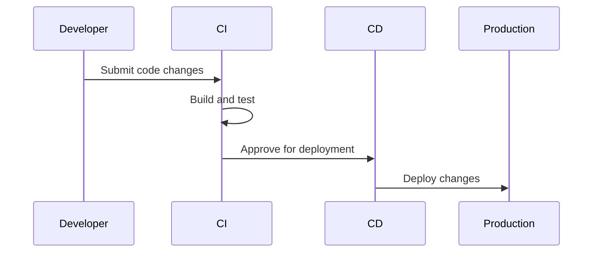
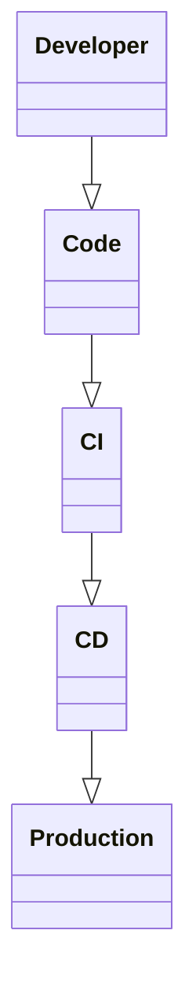
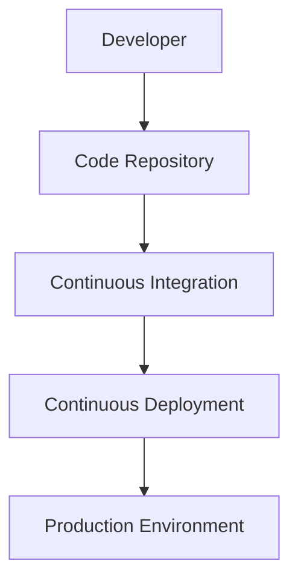
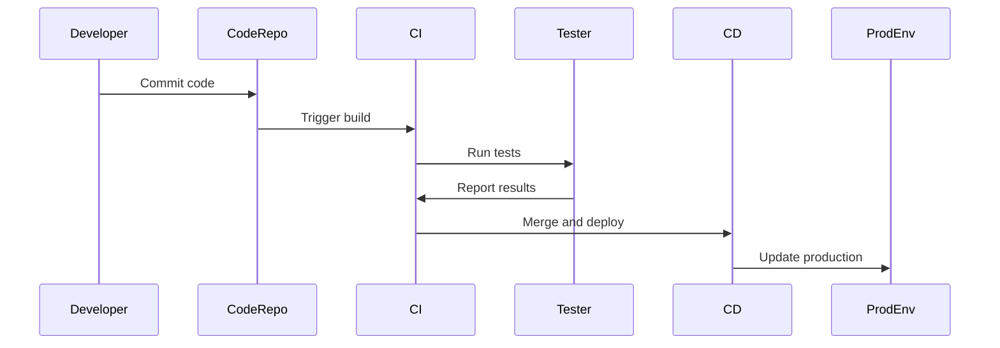

                 


## LET'S THINK STEP BY STEP

### Introduction

The field of Large Language Models (LLM) has witnessed remarkable advancements in recent years, fundamentally transforming industries such as natural language processing, data analysis, and artificial intelligence. As these models become more complex and integral to various applications, the need for robust Continuous Integration and Deployment (CI/CD) strategies grows significantly. In this comprehensive guide, we will explore the intricacies of LLM application development, focusing on CI and CD practices.

### Background

#### Core Concepts and Terminology
- **Large Language Models (LLM)**: A class of neural networks capable of understanding and generating human language. Examples include GPT-3, BERT, and T5.
- **Continuous Integration (CI)**: A development practice where code changes are frequently integrated into a shared repository, tested, and merged.
- **Continuous Deployment (CD)**: The process of automatically deploying code changes to production environments.

#### Problem Statement
The challenges in LLM application development include:
- Ensuring the quality of code changes
- Efficiently integrating new features
- Rapidly deploying updates to production environments
- Monitoring and maintaining the performance of deployed models

### Conceptual Framework

#### Table of Core Concept Attributes
| Concept        | Description                                                                 | Attributes                          |
|----------------|-----------------------------------------------------------------------------|-------------------------------------|
| LLM            | Neural network for natural language understanding and generation.             | - Scale<br>- Pre-training<br>- Fine-tuning |
| CI             | Integrates code changes and tests them.                                     | - Automation<br>- Frequency          |
| CD             | Automates the deployment of code changes to production environments.         | - Automation<br>- Speed              |

#### ER Diagram
```mermaid
erDiagram
  Product -> Developer
  Developer ||--|{ Code }
  Code ||--|{ CI }
  CI ||--|{ CD }
```

### Algorithm Principles

#### CI/CD Workflow


### System Design and Architecture

#### System Overview
The system encompasses several components, including developers, code repositories, CI/CD pipelines, and production environments.

#### Class Diagram


#### Architecture Design


#### System Interface and Interaction


### Project Implementation

#### Environment Setup
- Install necessary tools and dependencies
- Configure the CI/CD pipeline

#### Core Implementation
- Implement CI/CD pipeline using tools like Jenkins, GitLab CI, or GitHub Actions
- Set up automated testing and deployment

#### Code Analysis
- Analyze the CI/CD pipeline for efficiency and reliability

#### Case Study
- Analyze a real-world case of LLM application development with CI/CD

#### Project Summary
- Summarize the key takeaways and improvements

### Best Practices

- Ensure code quality with comprehensive testing
- Use containerization for consistent deployment environments
- Monitor and optimize the performance of deployed models

### Conclusion

The integration of LLMs into application development requires a robust CI/CD strategy to ensure efficiency, reliability, and scalability. By following the steps outlined in this guide, developers can streamline the process and deliver high-quality LLM applications to production environments.

---

**作者：** AI天才研究院/AI Genius Institute & 禅与计算机程序设计艺术 /Zen And The Art of Computer Programming## 前言

### 撰写目的

本篇博客的撰写目的是为了深入探讨大型语言模型（LLM）应用开发中的持续集成（CI）与持续部署（CD）实践。随着LLM技术的迅速发展，其在各个行业中的应用越来越广泛，对开发效率和系统稳定性的要求也日益提高。本文旨在通过系统的分析，为开发者提供一套有效的CI/CD策略，帮助他们更好地实现LLM应用的持续集成和部署，从而提升项目开发和运维的效率。

### 内容结构

本文分为七个主要部分，每一部分都紧密围绕LLM应用开发中的CI/CD实践展开：

1. **LLM概述**：介绍LLM的基本概念、发展历程和应用场景。
2. **LLM的开发环境**：讨论开发LLM所需的硬件、软件和数据处理。
3. **LLM的算法原理**：解析LLM的核心算法原理和架构设计。
4. **LLM的持续集成**：介绍CI的概念、流程设计和面临的挑战。
5. **LLM的部署策略**：探讨部署模型、平台选择和部署优化。
6. **LLM的监控与运维**：阐述监控策略、故障处理和性能调优。
7. **总结与展望**：总结全文内容，并对未来发展趋势进行展望。

### 读者对象

本文主要面向以下几类读者：

- **软件开发工程师**：对LLM技术感兴趣，希望提升CI/CD实践水平的开发者。
- **数据科学家**：从事自然语言处理（NLP）领域的研究和应用，需要掌握CI/CD策略。
- **技术经理**：负责团队项目开发和运维管理，希望优化LLM应用交付流程。
- **人工智能研究者**：关注LLM技术的前沿进展，希望了解其在实际应用中的实现细节。

### 书籍约定

为了确保文章的连贯性和可读性，本文做如下约定：

- **术语定义**：对于专业术语和概念，将在首次出现时进行解释和定义。
- **代码示例**：文中涉及代码实现时，将使用Python等编程语言提供具体的示例。
- **图表和流程图**：文中将使用Mermaid和LaTeX等工具绘制图表和流程图，以帮助读者更好地理解复杂概念。
- **参考资料**：文中引用的相关研究和文献，将在参考文献部分列出。

通过本文的阅读，读者可以系统地了解LLM应用开发中的CI/CD实践，掌握关键技术和最佳实践，为实际项目提供有效的技术支持和指导。

### LLM概述

### 1.1 LLM的起源与发展

大型语言模型（LLM）的起源可以追溯到深度学习和自然语言处理（NLP）领域的早期探索。早在2000年代初，研究人员开始尝试使用神经网络来理解和生成文本。这些早期的尝试主要集中在简单的神经网络架构上，如前馈神经网络（Feedforward Neural Networks, FNN）和循环神经网络（Recurrent Neural Networks, RNN）。尽管这些模型在处理序列数据方面表现不错，但它们在理解和生成复杂文本方面仍然存在诸多局限。

随着计算能力的提升和数据量的激增，深度学习技术迎来了新的突破。2013年，Alex Graves等人提出了长短期记忆网络（Long Short-Term Memory, LSTM），这种RNN的变体大大提高了在处理长时间依赖问题上的性能。随后，研究人员继续探索更高效的神经网络架构，并在2014年提出了卷积神经网络（Convolutional Neural Networks, CNN）在文本分析中的应用。

然而，真正使LLM进入快速发展的轨道的是2017年谷歌提出的Transformer模型。Transformer模型采用了自注意力机制（Self-Attention Mechanism），显著提升了模型在处理长文本和复杂语言现象时的能力。随后，谷歌又推出了BERT（Bidirectional Encoder Representations from Transformers），进一步提升了语言模型的性能，特别是在问答和翻译等任务上。

近年来，随着硬件性能的提升和开源生态的完善，LLM的研究和应用取得了迅猛发展。2020年，OpenAI发布了GPT-3（Generative Pre-trained Transformer 3），这是迄今为止最大的语言模型，拥有1750亿个参数，展示了极强的文本生成和理解能力。GPT-3的出现标志着LLM技术进入了一个新的时代，引发了一系列突破性的应用。

### 1.2 LLM的关键概念

#### 语言模型

语言模型是一种用于预测文本序列的概率模型，它是自然语言处理（NLP）的核心组件之一。传统的语言模型大多基于统计方法，如N元语法（N-gram），通过计算词的联合概率来预测下一个词。而现代语言模型，如Transformer和BERT，采用了深度学习技术，通过学习大量的文本数据来捕捉语言的复杂结构和上下文信息。

#### Transformer架构

Transformer模型是由Vaswani等人于2017年提出的一种基于自注意力机制的神经网络架构。与传统的循环神经网络（RNN）和长短期记忆网络（LSTM）不同，Transformer通过全局自注意力机制来捕捉文本序列中的依赖关系，从而在处理长距离依赖问题上表现出色。Transformer模型的核心组件包括编码器（Encoder）和解码器（Decoder），以及自注意力（Self-Attention）和多头注意力（Multi-Head Attention）机制。

#### 训练与优化

训练语言模型是一个复杂的过程，需要大量的计算资源和数据。在训练过程中，模型首先通过预训练（Pre-training）学习大量的文本数据，然后通过微调（Fine-tuning）来适应特定的任务。预训练过程中，模型通常会经历以下几个阶段：

1. **词嵌入（Word Embedding）**：将文本中的每个词映射到一个高维向量空间中，以便模型可以对这些向量进行数学运算。
2. **掩码语言模型（Masked Language Model, MLM）**：随机掩码部分输入文本，要求模型预测这些被掩码的词。
3. **下一句预测（Next Sentence Prediction, NSP）**：预测输入文本中两个句子是否是连续的。

在预训练完成后，模型会进行微调，以适应特定的任务，如文本分类、问答系统或机器翻译等。微调过程中，模型通常会使用任务特定的数据集，并在少量的数据上进行迭代训练。

### 1.3 LLM的基本架构

LLM的基本架构主要包括编码器（Encoder）和解码器（Decoder）两个部分。编码器负责将输入文本编码为固定长度的向量表示，而解码器则负责根据编码器的输出和先前的解码输出生成文本。

#### 编码器

编码器通常由多个自注意力层组成，每个自注意力层都会对输入序列中的每个词计算一个权重向量，并利用这些权重向量来更新输入序列的表示。这一过程不仅能够捕捉输入文本的局部信息，还能通过多头注意力机制（Multi-Head Attention）同时关注全局信息。编码器的输出是一个固定长度的向量，通常称为“上下文向量”（Context Vector），它包含了输入文本的丰富信息。

#### 解码器

解码器与编码器类似，也由多个自注意力层组成。在生成文本的过程中，解码器会使用前一个生成的词来更新当前的上下文向量，并通过解码器的输出层生成下一个词的概率分布。与编码器不同，解码器还需要使用一个额外的自注意力层（Decoder Self-Attention）来关注先前的解码输出，以确保生成的文本具有连贯性。

#### 训练与预测

在训练过程中，编码器和解码器同时进行训练，以最小化预测误差。在预测过程中，解码器首先生成一个起始标记（如`<START>`），然后根据当前的上下文向量和先前的解码输出，生成下一个词的概率分布。这个过程会重复进行，直到生成一个终止标记（如`</s>`），表示文本生成结束。

通过上述基本架构，LLM能够高效地处理自然语言任务，如文本生成、问答系统和机器翻译等。随着模型参数的增多和训练数据的扩大，LLM的表现也越来越优秀，成为NLP领域的重要工具。

### LLM的应用场景

### 2.1 文本生成

文本生成是LLM最广泛应用场景之一，通过训练模型，可以实现生成新闻文章、小说、诗歌等多样化的文本内容。以下是一些具体的文本生成应用实例：

- **新闻文章生成**：利用LLM生成新闻文章，可以大大提高新闻生产效率。例如，自动化新闻写作平台，如Heliograf（华盛顿邮报）和Automated Insights，已经使用LLM来生成财务报告、体育赛事结果等自动化新闻。

- **小说创作**：一些文学创作者使用LLM来辅助创作，例如OpenAI的GPT-3模型被用来生成小说章节，甚至是整本书的故事线。这种技术不仅能够激发创作灵感，还能生成高质量的小说内容。

- **诗歌创作**：LLM在诗歌创作中的应用同样广泛。例如，诗人和使用GPT-3的人合作创作了《GPT-3的诗集》，展示了LLM在生成富有诗意文本方面的潜力。

文本生成不仅在文学创作中有广泛应用，还在其他领域如法律文书撰写、科技文档生成等方面展现了巨大的潜力。

#### 文本摘要

文本摘要是一种从原始文本中提取关键信息，并以简明扼要的方式表达文本主旨的技术。LLM在文本摘要中的应用主要包括提取式摘要（Extractive Summarization）和生成式摘要（Generative Summarization）两种类型。

- **提取式摘要**：这种方法通过选择文本中的重要句子或段落来生成摘要。LLM可以用于学习文本中的重要信息，并从中提取出最具代表性的句子。例如，谷歌新闻摘要就采用了提取式摘要技术。

- **生成式摘要**：这种技术通过训练模型生成新的文本来总结原始文本。LLM在生成式摘要中能够理解上下文信息，从而生成连贯且具有代表性的摘要。例如，OpenAI的GPT-3模型可以生成高质量的法律文档摘要和医学论文摘要。

文本摘要的应用广泛，包括信息检索、文档摘要和知识总结等方面，极大地提高了信息处理和知识管理的效率。

#### 回答问题

LLM在问答系统中的应用主要是通过理解用户的问题，并从大量文本数据中检索出相关答案。以下是一些应用实例：

- **智能客服**：许多企业使用LLM构建智能客服系统，以自动回答用户常见问题。例如，亚马逊的Alexa和苹果的Siri都利用了LLM技术，提供自然语言交互体验。

- **教育辅导**：一些在线教育平台使用LLM来提供学生的问题解答服务。例如，OpenAI的GPT-3模型可以用来回答学生在学习过程中遇到的各种问题，提供个性化的学习支持。

- **医疗咨询**：在医疗领域，LLM被用于回答患者的健康问题，提供初步的医疗咨询。例如，一些医院使用LLM来生成个性化健康建议和治疗方案。

问答系统的应用不仅提高了服务效率，还改善了用户体验，使得信息获取更加便捷和智能。

#### 语言翻译

LLM在语言翻译中的应用主要包括机器翻译和跨语言文本生成两种形式。

- **机器翻译**：LLM可以用于翻译不同语言之间的文本。例如，谷歌翻译和百度翻译都使用了基于Transformer架构的LLM来进行高质量翻译。

- **跨语言文本生成**：这种方法不仅能够实现文本的翻译，还能生成新的文本，使得文本在语义上保持一致性。例如，OpenAI的GPT-3模型被用于生成英文和中文之间的跨语言文本，实现了高水平的语义保持。

语言翻译的应用涵盖了商业、旅游、外交等多个领域，极大地促进了全球化的交流与合作。

#### 其他应用场景

除了上述主要应用场景外，LLM还在许多其他领域展现了强大的能力：

- **文本分类**：LLM可以用于对大量文本进行分类，如垃圾邮件过滤、情感分析等。

- **文本纠错**：通过训练LLM来识别和纠正文本中的错误，提高文本的质量。

- **文本相似度比较**：利用LLM计算文本之间的相似度，用于内容监控、版权保护等。

- **创意写作**：LLM在创意写作中的应用，如生成广告文案、宣传语等，为企业提供创新的营销策略。

LLM的广泛应用和不断进步，正在推动各个领域的技术革新和产业变革。

### LLM的开发环境

### 3.1 硬件要求

开发大型语言模型（LLM）的硬件需求相对较高，主要涉及以下几个方面：

#### 计算能力

1. **CPU**：虽然GPU在深度学习任务中表现更优，但CPU仍是基础计算资源。推荐使用高性能CPU，如Intel Xeon系列或AMD EPYC系列，确保数据处理和模型训练的效率。
2. **GPU**：GPU在深度学习任务中至关重要，特别是对于大规模的LLM训练。推荐使用NVIDIA GPU，如A100、V100或T4，并确保足够的显存容量，通常至少需要16GB。

#### 存储容量

1. **硬盘**：由于LLM的训练和存储需要大量空间，建议使用高速固态硬盘（SSD），推荐容量至少为1TB，并根据需要选择更高容量的硬盘。
2. **分布式存储**：对于大规模数据集和模型存储，推荐使用分布式文件系统，如HDFS或Ceph，以提供高可用性和可扩展性。

#### 网络带宽

1. **内部网络**：为了提高数据传输效率，内部网络建议使用千兆以太网或更高速度的网络。
2. **外部网络**：如果需要从外部获取数据，确保外部网络带宽足够，以支持数据传输。

### 3.2 软件要求

开发LLM所需的软件环境包括以下几个方面：

#### 操作系统

1. **Linux**：推荐使用Linux操作系统，如Ubuntu 18.04或更高版本，因其稳定性和兼容性较高。
2. **Windows**：虽然Windows在某些情况下可以运行，但Linux在深度学习领域更受欢迎。

#### 编译器与工具链

1. **CMake**：用于构建和编译项目，支持多种语言和平台。
2. **GCC**：GNU编译器集合，用于编译C/C++代码。
3. **Python**：推荐使用Python 3.x版本，尤其是3.6及以上版本，因为它支持最新的深度学习库和工具。

#### 深度学习框架

1. **TensorFlow**：Google开发的深度学习框架，广泛用于模型训练和部署。
2. **PyTorch**：Facebook开发的开源深度学习框架，以其灵活性和易用性受到开发者喜爱。
3. **PyTorch Lightning**：PyTorch的扩展库，提供更高效的模型训练和调试工具。

#### 依赖库

1. **NumPy**：用于科学计算，支持大型多维数组对象。
2. **Pandas**：用于数据操作和分析，提供了强大的数据结构和数据分析工具。
3. **Scikit-learn**：用于机器学习算法的实现，提供了丰富的模型和工具。

#### 代码版本控制

1. **Git**：用于代码版本控制和协同工作。
2. **GitHub**：用于托管代码库和协作开发。

### 3.3 数据集准备

数据集的质量直接影响LLM的性能，因此数据集的准备是开发过程中至关重要的一步。

#### 数据来源

1. **公共数据集**：如维基百科、Common Crawl、Google Books等，这些数据集已经经过清洗和预处理，可以直接使用。
2. **自定义数据集**：根据特定任务的需求，收集和标注相关数据，如问答数据集、对话数据集等。

#### 数据预处理

1. **文本清洗**：去除文本中的标点符号、停用词和特殊字符，对文本进行标准化处理。
2. **词嵌入**：将文本转换为词嵌入向量，常用的词嵌入工具包括Word2Vec、GloVe和BERT等。
3. **数据分词**：将文本分解为词语或子词，便于模型处理。

#### 数据增强

1. **数据增强**：通过随机插入、删除或替换文本中的词，增加数据多样性，提高模型泛化能力。
2. **上下文生成**：利用模型生成与已有文本相关的新文本，扩展数据集规模。

#### 数据存储与管理

1. **分布式存储**：使用分布式存储系统，如HDFS或Ceph，存储大规模数据集。
2. **数据缓存**：使用数据缓存机制，如Redis，提高数据读取速度。

通过上述硬件、软件和数据集准备，可以为LLM的开发建立一个高效且可靠的开发环境，为后续的模型训练和应用奠定坚实基础。

### LLM的算法原理

### 4.1 语言模型基础

语言模型（Language Model, LM）是自然语言处理（Natural Language Processing, NLP）的核心技术之一，其基本任务是根据给定的一段文本序列，预测下一个可能的单词或字符。语言模型通过学习大量的文本数据，理解语言的统计规律，从而实现文本生成、文本分类、机器翻译等多种NLP任务。

#### 语言模型的数学基础

语言模型的数学基础主要依赖于概率论和统计学。最简单的语言模型是N元语法（N-gram），它通过计算相邻N个单词联合出现的概率来预测下一个单词。例如，对于三元语法（Trigram），其概率计算公式为：

$$P(w_n | w_{n-1}, w_{n-2}) = \frac{C(w_{n-2}, w_{n-1}, w_n)}{C(w_{n-2}, w_{n-1})}$$

其中，$C(w_{n-2}, w_{n-1}, w_n)$ 表示三元组$(w_{n-2}, w_{n-1}, w_n)$ 在训练数据中出现的次数，$C(w_{n-2}, w_{n-1})$ 表示$(w_{n-2}, w_{n-1})$ 在训练数据中出现的次数。

N元语法的简单性和有效性使其在早期NLP任务中得到了广泛应用。然而，随着文本长度的增加，N元语法的长距离依赖捕捉能力显著下降。为了解决这个问题，研究人员提出了更加复杂的语言模型，如基于神经网络的深度学习模型。

#### 语言模型的发展历程

1. **N元语法**：最早的语言模型，基于词序列的联合概率，简单易实现，但在处理长文本时效果不佳。
2. **隐马尔可夫模型（HMM）**：利用状态转移概率和发射概率来预测文本序列，能够较好地处理时间序列数据，但在处理上下文信息时仍然有限。
3. **条件随机场（CRF）**：结合了HMM的优点，能够建模文本序列中的依赖关系，但在处理复杂语言现象时仍然存在局限。
4. **基于神经网络的模型**：如循环神经网络（RNN）和长短期记忆网络（LSTM），能够通过学习长期依赖关系来提高模型的预测能力。RNN和LSTM在处理自然语言任务时表现出色，但仍然存在梯度消失和梯度爆炸等问题。
5. **Transformer模型**：2017年，谷歌提出了Transformer模型，彻底改变了语言模型的发展方向。Transformer采用自注意力机制（Self-Attention Mechanism），能够同时关注输入序列中的所有单词，从而在捕捉长距离依赖方面表现优异。Transformer的成功直接催生了BERT、GPT等大规模语言模型的出现。

#### 语言模型的核心组件

1. **词嵌入（Word Embedding）**：将文本中的每个词映射到一个高维向量空间中，使得模型可以对这些向量进行数学运算。常见的词嵌入方法包括Word2Vec、GloVe和BERT等。
2. **编码器（Encoder）**：负责将输入文本编码为固定长度的向量表示，通常包含文本的语义信息。编码器可以是基于RNN、LSTM或Transformer的模型。
3. **解码器（Decoder）**：负责根据编码器的输出和先前的解码输出生成文本。在生成文本的过程中，解码器会使用自注意力机制来关注输入文本和先前的解码输出，确保生成的文本具有连贯性。

#### 语言模型的训练与优化

1. **预训练（Pre-training）**：通过在大规模的文本数据集上训练，使模型能够学习到语言的通用特征。预训练通常包括两个阶段：词嵌入的预训练和编码器、解码器的预训练。
2. **掩码语言模型（Masked Language Model, MLM）**：在预训练过程中，随机掩码部分输入文本，要求模型预测这些被掩码的词，从而提高模型对上下文信息的理解能力。
3. **下一句预测（Next Sentence Prediction, NSP）**：在预训练过程中，预测输入文本中两个句子是否是连续的，增强模型对句子边界和语义关系的理解。
4. **微调（Fine-tuning）**：在预训练完成后，利用特定任务的数据集对模型进行微调，使其适应特定任务的需求。

通过上述基础知识和核心组件，我们可以更深入地理解语言模型的工作原理和应用。在下一节中，我们将探讨Transformer模型，这是现代语言模型的主流架构，具有重要的研究和实践价值。

#### Transformer模型

Transformer模型是2017年由Vaswani等人提出的一种基于自注意力机制的深度学习模型，它在处理自然语言任务方面表现出色，是现代语言模型的主流架构之一。与传统的循环神经网络（RNN）和长短期记忆网络（LSTM）相比，Transformer在捕捉长距离依赖关系和并行处理能力上具有显著优势。

##### 自注意力机制

Transformer模型的核心组件是自注意力机制（Self-Attention Mechanism），它允许模型同时关注输入序列中的所有单词，从而在捕捉长距离依赖方面表现优异。自注意力机制通过计算每个单词与其他所有单词之间的关联强度，为每个单词生成一个加权表示。这一过程可以分为以下几个步骤：

1. **计算查询（Query）、键（Key）和值（Value）**：对于输入序列中的每个单词，分别计算其查询（Query）、键（Key）和值（Value）。这三个向量通常由同一个词嵌入向量通过不同的权重矩阵得到。

   $$Q = W_Q \cdot W_E^{word}$$
   $$K = W_K \cdot W_E^{word}$$
   $$V = W_V \cdot W_E^{word}$$

2. **计算注意力得分**：计算每个单词与其他所有单词之间的注意力得分，得分通常通过点积计算得到。

   $$Attention(Q, K, V) = softmax(\frac{QK^T}{\sqrt{d_k}})V$$

   其中，$d_k$ 是键向量的维度，$softmax$ 函数用于将得分归一化。

3. **计算注意力加权输出**：根据注意力得分对值向量进行加权求和，得到每个单词的注意力加权输出。

   $$\text{Attention Output} = \text{softmax}(\text{Attention Scores}) \cdot V$$

##### Multi-Head Attention

Transformer模型引入了多头注意力（Multi-Head Attention）机制，通过并行计算多个独立的注意力机制，并聚合结果来提高模型的表示能力。多头注意力机制将输入序列分解为多个子序列，每个子序列分别通过自注意力机制处理，最终将所有子序列的输出进行合并。

$$\text{Multi-Head Attention} = \text{Concat}(\text{head}_1, \text{head}_2, ..., \text{head}_h)W_O$$

其中，$h$ 表示头数，$W_O$ 是输出权重矩阵。

##### 编码器和解码器

Transformer模型由编码器（Encoder）和解码器（Decoder）两部分组成，编码器负责将输入文本编码为固定长度的向量表示，解码器则负责根据编码器的输出和先前的解码输出生成文本。

1. **编码器**：编码器由多个自注意力层和前馈网络组成。每个自注意力层通过多头注意力机制来捕捉输入文本的依赖关系，前馈网络则用于增强模型的非线性表示能力。

   $$\text{Encoder} = (\text{Multi-Head Attention}, \text{Feed Forward})^L$$

2. **解码器**：解码器由多个自注意力层、编码器-解码器注意力层和前馈网络组成。自注意力层用于解码器生成当前词时关注输入文本和先前的解码输出，编码器-解码器注意力层则允许解码器关注编码器的输出，从而捕捉长距离依赖。前馈网络同样用于增强模型的非线性表示能力。

   $$\text{Decoder} = (\text{Masked Multi-Head Attention}, \text{Encoder-Decoder Attention}, \text{Feed Forward})^L$$

##### 训练与预测

1. **预训练**：Transformer模型通常通过在大规模的文本数据集上进行预训练来学习语言的通用特征。预训练过程包括两个主要任务：掩码语言模型（Masked Language Model, MLM）和下一句预测（Next Sentence Prediction, NSP）。
   - 掩码语言模型：随机掩码输入文本中的部分词，要求模型预测这些被掩码的词。
   - 下一句预测：输入两个连续的句子，要求模型预测这两个句子是否是连续的。

2. **微调**：在预训练完成后，利用特定任务的数据集对模型进行微调，使其适应特定任务的需求。

3. **预测**：在预测过程中，解码器从起始标记（如`<START>`）开始，逐步生成文本。在每个时间步，解码器会根据当前已生成的文本和编码器的输出，生成下一个词的概率分布，并选择概率最高的词作为下一个输出。

通过Transformer模型，我们可以高效地处理自然语言任务，如文本生成、机器翻译和问答系统等。Transformer的成功直接推动了NLP领域的研究和应用，使得大规模语言模型成为现代AI系统的重要组成部分。

### 4.2 Transformer架构

Transformer架构是大型语言模型（LLM）的核心组成部分，其设计旨在解决传统循环神经网络（RNN）在处理长距离依赖关系和并行计算能力上的不足。Transformer模型通过引入自注意力机制（Self-Attention Mechanism）和多头注意力（Multi-Head Attention）实现了对输入文本的全局上下文信息的高效捕捉和处理。以下将详细阐述Transformer架构的组成部分及其工作机制。

#### 编码器（Encoder）

编码器负责将输入文本转换为固定长度的向量表示，以便于后续的文本生成和预测任务。编码器由多个编码层（Encoder Layers）堆叠而成，每层包含两个主要组件：多头自注意力机制（Multi-Head Self-Attention Mechanism）和前馈神经网络（Feed Forward Neural Network）。

1. **多头自注意力机制（Multi-Head Self-Attention Mechanism）**
   - **自注意力机制（Self-Attention Mechanism）**：自注意力机制是Transformer模型的核心，它允许模型在处理每个单词时同时关注输入序列中的所有其他单词。这一过程分为以下几个步骤：
     - **计算查询（Query）、键（Key）和值（Value）向量**：对于输入序列中的每个单词，通过不同的权重矩阵计算其查询（Query）、键（Key）和值（Value）向量。
     $$ Q = W_Q \cdot X $$
     $$ K = W_K \cdot X $$
     $$ V = W_V \cdot X $$
     其中，$X$ 是输入序列的词嵌入向量，$W_Q$、$W_K$ 和 $W_V$ 是权重矩阵。
     - **计算注意力得分**：通过计算查询向量和键向量的点积，得到每个单词与其他单词之间的注意力得分。
     $$ \text{Attention Scores} = \frac{QK^T}{\sqrt{d_k}} $$
     - **应用softmax函数**：对注意力得分进行归一化处理，得到每个单词的注意力权重。
     $$ \text{Attention Weights} = \text{softmax}(\text{Attention Scores}) $$
     - **加权求和**：根据注意力权重对值向量进行加权求和，生成每个单词的注意力加权输出。
     $$ \text{Attention Output} = \text{Attention Weights} \cdot V $$
   - **多头注意力（Multi-Head Attention）**：多头注意力通过并行计算多个独立的自注意力机制，将每个子序列的输出进行聚合，从而提高模型的表示能力。
     $$ \text{Multi-Head Attention} = \text{Concat}(\text{head}_1, \text{head}_2, ..., \text{head}_h)W_O $$
     其中，$h$ 表示头数，$W_O$ 是输出权重矩阵。

2. **前馈神经网络（Feed Forward Neural Network）**
   - **前馈层**：在每个编码层的自注意力机制之后，紧接着是两个前馈层，每个前馈层都通过一个线性变换和ReLU激活函数，增强模型的非线性表示能力。
     $$ \text{FFN}(x) = \max(0, xW_1 + b_1)W_2 + b_2 $$
     其中，$W_1$ 和 $W_2$ 是权重矩阵，$b_1$ 和 $b_2$ 是偏置项。

#### 解码器（Decoder）

解码器负责根据编码器的输出和先前的解码输出生成文本。解码器也由多个解码层（Decoder Layers）堆叠而成，每层包含三个主要组件：多头自注意力机制、编码器-解码器注意力机制和前馈神经网络。

1. **多头自注意力机制（Multi-Head Self-Attention Mechanism）**
   - 与编码器中的自注意力机制类似，解码器的自注意力机制用于在生成当前词时关注输入序列中的所有其他单词。

2. **编码器-解码器注意力机制（Encoder-Decoder Attention Mechanism）**
   - **编码器-解码器注意力机制**：编码器-解码器注意力机制允许解码器在生成当前词时关注编码器的输出，从而捕捉长距离依赖关系。这一过程与多头自注意力机制类似，但查询向量来自解码器的输出，键向量和值向量来自编码器的输出。
     $$ \text{Encoder-Decoder Attention} = \text{Multi-Head Attention}(Q, K, V) $$
     其中，$Q$ 是解码器的查询向量，$K$ 和 $V$ 是编码器的键向量和值向量。

3. **前馈神经网络（Feed Forward Neural Network）**
   - 与编码器中的前馈神经网络相同，解码器的每个层也包含两个前馈层，用于增强模型的非线性表示能力。

#### 训练与预测

1. **预训练**：Transformer模型通常通过在大规模的文本数据集上进行预训练来学习语言的通用特征。预训练过程包括两个主要任务：
   - **掩码语言模型（Masked Language Model, MLM）**：随机掩码输入文本中的部分词，要求模型预测这些被掩码的词。
   - **下一句预测（Next Sentence Prediction, NSP）**：输入两个连续的句子，要求模型预测这两个句子是否是连续的。

2. **微调**：在预训练完成后，利用特定任务的数据集对模型进行微调，使其适应特定任务的需求。

3. **预测**：在预测过程中，解码器从起始标记（如`<START>`）开始，逐步生成文本。在每个时间步，解码器会根据当前已生成的文本和编码器的输出，生成下一个词的概率分布，并选择概率最高的词作为下一个输出。

通过上述详细阐述，我们可以看到Transformer架构在捕捉长距离依赖关系和并行处理能力上的强大优势，使其成为现代大型语言模型的首选架构。接下来，我们将进一步探讨LLM的持续集成（CI）实践。

### 4.3 训练与优化

训练和优化是大型语言模型（LLM）开发过程中至关重要的环节。通过合理的训练和优化策略，可以提高模型的质量和性能，从而满足实际应用的需求。以下是关于LLM训练与优化的详细步骤和方法。

#### 数据预处理

在开始训练之前，对数据集进行预处理是必不可少的步骤。数据预处理包括以下几个关键步骤：

1. **文本清洗**：去除文本中的噪声，如HTML标签、特殊字符和停用词等。这可以通过正则表达式、文本清洗库（如Python的`re`模块）和停用词列表来实现。

2. **词嵌入**：将文本中的每个词映射到一个高维向量空间中，以便模型可以对这些向量进行数学运算。常用的词嵌入方法包括Word2Vec、GloVe和BERT等。这些词嵌入方法不仅能捕捉词的语义信息，还能减少维度的降低计算复杂度。

3. **序列填充**：由于不同文本的长度可能不同，需要将所有文本填充到相同长度，以便模型可以处理。常用的填充方法包括PAD和TRUNCATION等。

4. **数据增强**：通过随机插入、删除或替换文本中的词，增加数据的多样性和模型的泛化能力。数据增强可以防止模型过拟合，提高模型在真实数据上的表现。

#### 训练过程

1. **预训练（Pre-training）**
   - **掩码语言模型（Masked Language Model, MLM）**：在预训练过程中，随机掩码输入文本中的部分词，并要求模型预测这些被掩码的词。这一过程可以提高模型对上下文信息的理解和生成能力。
   - **下一句预测（Next Sentence Prediction, NSP）**：输入两个连续的句子，并要求模型预测这两个句子是否是连续的。这一任务可以增强模型对句子边界和语义关系的理解。

2. **微调（Fine-tuning）**
   - 在预训练完成后，利用特定任务的数据集对模型进行微调。微调过程通常涉及以下几个步骤：
     - **数据预处理**：将任务数据集进行相同的预处理，如文本清洗、词嵌入和序列填充。
     - **训练策略**：设置适当的训练策略，如学习率调度、批次大小和训练迭代次数等。常用的学习率调度方法包括余弦退火和指数衰减等。
     - **优化算法**：选择合适的优化算法，如Adam、AdaGrad和SGD等。优化算法用于更新模型参数，以最小化损失函数。

3. **评估与调试**
   - **验证集**：在训练过程中，使用验证集来评估模型的表现，并调整模型参数，以避免过拟合。
   - **调试**：通过调试工具（如Python的TensorBoard）监控训练过程，调整模型结构和训练策略。

#### 模型优化

1. **剪枝（Pruning）**
   - 剪枝是一种减少模型参数数量的技术，从而降低模型的计算复杂度和内存占用。常用的剪枝方法包括权重剪枝、结构剪枝和稀疏化等。

2. **量化（Quantization）**
   - 量化是一种将模型中的浮点数参数转换为较低精度的整数表示的技术。量化可以显著降低模型的存储和计算需求，提高部署效率。

3. **模型压缩（Model Compression）**
   - 模型压缩通过减少模型参数数量和维度来降低模型的复杂度。常用的压缩方法包括知识蒸馏（Knowledge Distillation）、量化（Quantization）和剪枝（Pruning）等。

通过上述训练与优化方法，我们可以有效地提高大型语言模型的质量和性能，为实际应用提供强大的支持。接下来，我们将探讨LLM的持续集成（CI）实践。

### 4.4 持续集成（CI）的基本概念与流程

#### 持续集成（CI）的概念

持续集成（Continuous Integration，简称CI）是一种软件开发实践，旨在通过频繁地将开发者提交的代码更改合并到共享的代码库中，并对其进行自动化测试和验证，以确保代码的稳定性和质量。CI的核心目标是通过自动化流程提高开发效率，减少集成错误和加快新功能的交付速度。

在传统的软件开发模式中，开发者在完成各自的功能模块后，通常会提交代码到代码库，然后等待其他开发者的代码合并。这种做法容易导致以下问题：

1. **集成错误**：不同开发者之间的代码在合并时可能会出现冲突和兼容性问题，导致集成失败。
2. **延迟反馈**：开发者在代码提交后，可能需要较长时间才能发现和解决集成错误，从而延长了开发周期。
3. **质量下降**：频繁的集成失败和延迟的反馈可能导致代码质量下降，影响项目的稳定性。

持续集成通过以下方式解决了这些问题：

- **自动化测试**：在每次代码提交后，自动化测试工具会立即运行一系列预定义的测试用例，以验证代码的稳定性和功能完整性。
- **频繁集成**：开发者频繁地将代码更改合并到共享代码库中，从而减少集成错误的发生。
- **快速反馈**：通过即时反馈机制，开发者可以迅速发现和解决问题，缩短开发周期。

#### 持续集成（CI）的流程

持续集成的过程可以分为以下几个主要步骤：

1. **代码提交**：开发者将代码更改提交到共享的代码库，通常通过版本控制系统（如Git）进行管理。

2. **触发构建**：提交的代码会触发CI系统的构建过程。构建过程通常包括以下几个阶段：
   - **环境搭建**：CI系统会自动搭建开发、测试和生产所需的运行环境，包括安装依赖库、配置环境变量等。
   - **代码编译**：编译器（如GCC、Clang）会编译源代码，生成可执行文件或库文件。

3. **运行测试**：构建完成后，CI系统会运行一系列预定义的测试用例，以验证代码的正确性和性能。测试类型包括单元测试、集成测试、性能测试和安全性测试等。

4. **报告结果**：测试结果会自动生成报告，并通知相关开发者。如果测试失败，CI系统会暂停构建过程，并提示开发者修复问题。

5. **代码合并**：通过测试的代码会被自动合并到共享代码库中，以便其他开发者能够继续开发或部署。

6. **部署**：如果配置了自动部署流程，通过测试的代码会被部署到测试或生产环境中。部署流程可以是手动触发，也可以是自动触发。

#### 持续集成（CI）的优势

- **提高代码质量**：通过自动化测试和频繁集成，持续集成能够及时发现和解决集成错误，从而提高代码质量。
- **加快开发周期**：快速反馈和即时修复机制可以显著缩短开发周期，加快新功能的交付速度。
- **减少集成风险**：频繁的集成可以减少集成错误的发生，降低项目风险。
- **促进团队协作**：持续集成鼓励开发者频繁协作和交流，促进团队协作和知识共享。

#### 持续集成（CI）的挑战与解决方案

尽管持续集成具有显著的优势，但在实际应用中仍面临一些挑战：

1. **构建时间过长**：特别是在大型项目中，构建和测试过程可能需要很长时间，这会影响开发效率。解决方案包括优化构建脚本、使用缓存技术和并行化构建等。

2. **测试覆盖率不足**：测试用例的不足或不全面可能导致某些潜在问题未被检测到。解决方案包括增加测试用例、使用代码覆盖率工具和静态代码分析等。

3. **配置管理复杂**：在分布式环境中，配置管理的复杂性可能会增加，导致CI流程难以维护。解决方案包括使用配置管理工具（如Ansible、Chef等）和容器化技术（如Docker）。

通过理解持续集成的基本概念和流程，我们可以更好地利用CI实践，提高软件开发效率和质量。接下来，我们将讨论在LLM应用开发中CI流程的设计和实施。

#### CI流程设计

设计一个有效的持续集成（CI）流程对于确保LLM应用开发的质量和稳定性至关重要。以下是一个详细的CI流程设计方案，包括各个环节的具体步骤和工具选择。

##### 1. 环境搭建

在CI流程的初始阶段，需要搭建一个用于编译、测试和部署的运行环境。这个环境应该具备以下要求：

- **操作系统**：推荐使用Linux操作系统，如Ubuntu或CentOS，以确保环境的稳定性和兼容性。
- **依赖库**：安装常用的开发库和工具，如Python、TensorFlow、PyTorch、NVIDIA CUDA等。
- **虚拟环境**：使用虚拟环境（如Conda或Virtualenv）来隔离项目依赖，防止依赖冲突。

##### 2. 代码编译

在环境搭建完成后，进行代码编译。这一步骤包括：

- **获取代码**：从版本控制系统（如Git）获取最新的代码库。
- **安装依赖**：运行`pip install -r requirements.txt`或`conda install --file environment.yml`来安装项目依赖。
- **构建模型**：编译LLM模型代码，生成可执行文件或库文件。

##### 3. 运行测试

编译完成后，CI系统会运行一系列预定义的测试用例，以验证代码的正确性和性能。测试类型包括：

- **单元测试**：测试单个函数或模块的功能是否正确。
- **集成测试**：测试不同模块之间的集成是否顺畅，例如模型的输入输出处理、数据流等。
- **性能测试**：评估模型的训练和推理速度、资源占用等性能指标。
- **安全性测试**：检查代码中是否存在安全漏洞，如SQL注入、XSS攻击等。

常用的测试框架包括：

- **Python**：pytest、unittest、nose
- **TensorFlow**：tensorflow_test
- **PyTorch**：torch.utils.testing

##### 4. 持续集成工具选择

CI流程的核心是选择合适的工具，以下是一些流行的CI工具及其特点：

- **Jenkins**：开源的持续集成工具，功能强大，支持多种插件，但配置相对复杂。
- **GitLab CI/CD**：GitLab内置的持续集成和持续部署工具，易于配置，支持多种编程语言和平台。
- **GitHub Actions**：GitHub提供的持续集成和持续部署服务，免费且易于使用。

##### 5. 持续集成步骤示例

以下是一个基于GitLab CI的CI流程配置文件示例：

```yaml
stages:
  - build
  - test
  - deploy

build:
  stage: build
  script:
    - conda create -n llm_ci python=3.8
    - conda activate llm_ci
    - conda install -c conda-forge tensorflow
    - python setup.py build

test:
  stage: test
  script:
    - pytest test_llm.py
  when: always

deploy:
  stage: deploy
  script:
    - python deploy.py
  when: success
```

##### 6. CI流程优化

为了确保CI流程的高效和可靠，以下是一些优化建议：

- **并行化**：利用多核CPU和GPU资源，并行执行构建和测试任务，加快流程速度。
- **缓存**：缓存编译和测试环境，减少重复构建的时间。
- **持续反馈**：及时通知开发者在CI流程中的失败点，便于快速修复。
- **监控**：监控CI流程的运行状态，确保流程的稳定性和可追溯性。

通过上述CI流程设计，开发者可以有效地确保LLM应用开发的质量和稳定性，提高开发效率和项目交付速度。接下来，我们将讨论在LLM应用开发中CI流程面临的挑战与解决方案。

### CI流程在LLM应用开发中的挑战与解决方案

#### 挑战一：大规模模型的计算需求

LLM模型的训练和测试通常需要大量的计算资源，这对CI流程带来了巨大的挑战。具体表现在：

1. **时间成本**：大规模模型的训练和测试过程可能非常耗时，导致CI流程的构建时间过长。
2. **资源消耗**：大规模模型的训练和测试需要大量的GPU和CPU资源，可能导致资源争用和成本上升。

#### 解决方案：

1. **并行化**：通过并行计算技术，如多线程、分布式计算和GPU加速，可以显著减少模型训练和测试的时间。例如，使用TensorFlow的分布式训练和PyTorch的DataParallel可以充分利用多GPU资源。
2. **容器化**：使用容器化技术，如Docker，可以将模型训练和测试环境打包在一起，确保环境的隔离和一致性，同时便于资源管理。Kubernetes等容器编排工具可以帮助优化资源分配和调度。
3. **资源池**：利用云计算平台（如AWS、Azure、Google Cloud）提供的弹性计算服务，可以根据实际需求动态调整计算资源，避免资源浪费和成本过高。

#### 挑战二：数据集的准备与处理

LLM模型的训练依赖于大量高质量的数据集，数据集的准备和处理过程复杂且耗时。具体表现在：

1. **数据收集**：收集足够的数据集可能需要大量的时间和精力，尤其是在数据隐私和获取成本方面。
2. **数据清洗**：清洗数据集以去除噪声和异常值，需要使用复杂的清洗工具和算法。
3. **数据增强**：通过数据增强技术，如文本填充、随机替换和噪声添加，可以增加数据集的多样性，提高模型的泛化能力。

#### 解决方案：

1. **自动化数据清洗**：使用自动化工具，如Airflow或Apache Beam，可以自动化数据清洗和预处理流程，提高效率和准确性。
2. **数据源管理**：建立稳定的数据源管理机制，确保数据集的质量和可追溯性。使用数据版本控制工具（如DVC）来管理数据集的版本和依赖。
3. **数据增强**：通过引入数据增强工具（如HuggingFace的Transformers库），可以在模型训练过程中动态生成多样化数据，提高模型性能。

#### 挑战三：模型部署的复杂性

LLM模型的部署通常涉及复杂的配置和管理，尤其是在多个环境和不同的部署目标之间。具体表现在：

1. **环境差异**：不同环境的配置可能不一致，导致模型在不同环境中的表现不一致。
2. **部署策略**：需要制定合适的部署策略，确保模型在各个环境中的稳定运行。
3. **监控和运维**：模型部署后需要进行持续的监控和运维，以应对潜在的故障和性能问题。

#### 解决方案：

1. **标准化环境配置**：使用容器化技术（如Docker）和配置管理工具（如Ansible）来标准化环境的配置，确保环境的一致性。
2. **自动化部署**：使用自动化部署工具（如Kubernetes、AWS CodePipeline）来简化部署流程，确保模型可以快速、可靠地部署到生产环境。
3. **监控和运维**：使用监控工具（如Prometheus、Grafana）来实时监控模型的运行状态，并建立完善的运维流程，及时处理故障和性能问题。

通过上述解决方案，可以有效地应对CI流程在LLM应用开发中面临的挑战，提高CI流程的效率和稳定性，确保LLM应用的质量和性能。

### 5.2 持续部署（CD）概述

#### 持续部署（Continuous Deployment, CD）的概念

持续部署（Continuous Deployment, CD）是一种自动化流程，旨在将经过验证和测试的代码更改自动部署到生产环境中。CD的目标是确保新功能和改进可以快速、安全地交付给用户，同时保持系统的稳定性和可靠性。与持续集成（Continuous Integration, CI）不同，CI侧重于代码的集成和测试，而CD则关注代码的部署。

#### CD在LLM应用开发中的作用

在LLM应用开发中，持续部署扮演着至关重要的角色。以下是其主要作用：

1. **提高交付速度**：通过自动化部署流程，CD可以显著缩短新功能和改进从开发到用户手中的时间。这有助于企业保持竞争优势，快速响应市场需求。
2. **减少风险**：自动化测试和频繁的部署可以减少人为错误和集成错误，降低部署失败的风险。此外，通过逐步部署到生产环境，可以更好地控制风险。
3. **提升用户体验**：CD可以确保用户始终获得最新、最优化的功能和服务，从而提升用户体验和满意度。

#### CD的基本流程

持续部署的基本流程包括以下几个关键步骤：

1. **代码集成**：新代码通过CI流程集成到共享代码库中，确保其通过所有测试。
2. **测试**：部署前，对新代码进行一系列测试，包括单元测试、集成测试和性能测试，确保其功能完整和性能稳定。
3. **部署**：通过自动化工具将经过测试的代码部署到生产环境。部署方式可以是蓝绿部署、灰度发布或滚动部署等。
4. **监控**：部署后，实时监控系统的运行状态，确保新代码不会对系统造成负面影响。

#### CD的优势与挑战

##### 优势

1. **提高效率**：自动化部署流程可以显著减少手动操作，提高开发团队的工作效率。
2. **快速迭代**：频繁的部署可以加速新功能和改进的迭代速度，提高开发效率。
3. **减少错误**：自动化测试和逐步部署可以减少部署过程中出现的错误和故障。
4. **提高可靠性**：通过持续的监控和反馈，可以及时发现和解决问题，提高系统的可靠性。

##### 挑战

1. **复杂度**：持续部署需要复杂的配置和工具支持，对开发和运维团队的要求较高。
2. **风险控制**：自动化的部署流程可能会增加风险，需要建立完善的风险控制和应急响应机制。
3. **成本**：持续部署需要投入一定的资源和成本，包括工具购置、人员培训和流程优化等。

通过了解持续部署的基本概念和流程，我们可以更好地将其应用于LLM应用开发，提高开发效率和质量。

#### 部署模型

在LLM应用开发中，部署模型是确保模型稳定运行和高效服务的关键环节。根据不同的应用场景和需求，可以选择不同的部署模型。以下是几种常见的部署模型及其特点：

##### 1. 单机部署

单机部署是指将模型部署在单个服务器上，适用于资源需求较低、应用场景相对简单的场景。其优点是部署简单、成本低，但缺点是资源利用率低、扩展性差，不适合处理大量并发请求。

##### 2. 容器化部署

容器化部署利用容器技术（如Docker）将模型及其依赖环境打包成一个独立的容器，便于部署和扩展。容器化部署具有以下优点：

- **轻量级**：容器占用资源较少，可以高效地运行在虚拟化环境中。
- **可移植性**：容器可以在不同的操作系统和硬件平台上运行，提高了部署的灵活性。
- **可扩展性**：通过水平扩展容器实例，可以轻松应对高并发请求。

##### 3. 微服务部署

微服务部署将应用程序分解为多个独立的微服务，每个微服务负责不同的功能模块。这种方式可以提高系统的模块化和可扩展性，具体优点包括：

- **高可用性**：单个服务的故障不会影响整个系统，提高了系统的可靠性。
- **易维护性**：服务可以独立部署和更新，降低了维护成本。
- **高扩展性**：可以根据需求独立扩展不同的服务模块，提高了系统的弹性。

##### 4. 云服务部署

云服务部署利用云平台（如AWS、Azure、Google Cloud）提供的计算和存储资源，将模型部署在云环境中。这种方式具有以下优点：

- **弹性伸缩**：可以根据需求动态调整计算和存储资源，提高了系统的响应能力。
- **高可靠性**：云平台提供了高效的故障恢复机制，确保系统的稳定性。
- **易于管理**：云平台提供了丰富的管理工具和API，方便开发者进行管理和监控。

#### 部署平台选择

在选择部署平台时，需要考虑以下几个关键因素：

1. **资源需求**：根据模型的计算和存储需求，选择适合的平台。对于资源需求较高的模型，可以选择云计算平台或容器化部署。
2. **可靠性要求**：根据应用场景的可靠性要求，选择具有高可靠性的平台。云平台通常提供了可靠的故障恢复机制。
3. **扩展性需求**：根据业务发展需求，选择具有良好扩展性的平台。容器化和微服务部署具有较好的扩展性。
4. **成本**：根据预算选择成本合适的平台。云平台提供了灵活的定价策略，可以根据实际需求调整资源使用。

综上所述，LLM应用的部署模型和平台选择需要综合考虑应用场景、资源需求、可靠性要求和成本等多方面因素，以确保模型的高效运行和可靠服务。

#### 部署优化策略

在LLM应用部署过程中，优化策略对于提升性能、稳定性和可扩展性至关重要。以下是一些关键的部署优化策略：

##### 1. 网络优化

- **负载均衡**：通过负载均衡器（如Nginx、HAProxy）将请求均匀地分配到多个服务实例，避免单点过载。
- **CDN加速**：使用内容分发网络（CDN）将静态资源（如模型文件、图片等）缓存到多个地理位置，提高访问速度。
- **网络隔离**：对网络进行隔离和分段，确保数据传输的安全性和稳定性。

##### 2. 计算优化

- **并行处理**：利用多线程、分布式计算技术，将大规模模型的推理任务分解为多个子任务并行处理，提高处理速度。
- **GPU优化**：针对GPU资源进行优化，如调整显存分配、优化CUDA内核等，提高GPU利用率。
- **CPU优化**：优化CPU资源的使用，如调整线程池大小、避免CPU瓶颈等。

##### 3. 存储优化

- **分布式存储**：使用分布式存储系统（如HDFS、Ceph）存储大规模数据，提高数据读写速度和可靠性。
- **缓存策略**：使用缓存（如Redis、Memcached）存储频繁访问的数据，减少磁盘I/O压力。
- **数据压缩**：对存储的数据进行压缩，减少存储空间占用，提高I/O性能。

##### 4. 部署策略优化

- **蓝绿部署**：通过并行运行两个版本的应用（蓝绿版本），逐步切换流量，确保新版本应用稳定上线。
- **灰度发布**：将新版本应用逐渐部署到部分用户，通过监控和反馈逐步扩大部署范围，降低风险。
- **滚动部署**：逐步更新多个实例，确保系统在更新过程中保持高可用性。

##### 5. 监控与运维优化

- **实时监控**：使用监控工具（如Prometheus、Grafana）实时监控系统的运行状态，及时发现问题。
- **日志管理**：集中管理和分析日志，帮助快速定位和解决故障。
- **自动化运维**：使用自动化工具（如Ansible、Chef）简化运维流程，提高运维效率。

通过实施上述部署优化策略，可以显著提升LLM应用的性能、稳定性和可扩展性，确保其在生产环境中的高效运行。

### 监控策略

在LLM应用的运维过程中，监控策略是确保系统稳定性和性能的关键。以下是一些关键的监控指标和方法：

#### 关键监控指标

1. **模型推理性能**：包括每秒处理的请求量、平均响应时间和最大响应时间等。
2. **系统资源利用率**：包括CPU、内存、硬盘I/O和网络带宽等资源的使用率。
3. **错误率**：包括模型预测错误率、API请求错误率和系统错误率等。
4. **服务质量（QoS）**：包括服务的可用性、响应时间和吞吐量等。

#### 监控工具

1. **Prometheus**：用于数据采集、存储和查询，支持自定义监控指标和告警。
2. **Grafana**：用于可视化监控数据和创建告警规则。
3. **Zabbix**：支持多层次的监控，提供丰富的告警和报告功能。
4. **ELK Stack**：包括Elasticsearch、Logstash和Kibana，用于日志管理和分析。

#### 监控方法

1. **被动监控**：通过采集系统和日志收集系统，收集系统的运行数据和日志，进行分析和告警。
2. **主动监控**：通过模拟请求和压力测试，实时监测系统的性能和稳定性。

#### 告警策略

1. **阈值告警**：设置监控指标的阈值，当指标超过阈值时触发告警。
2. **趋势告警**：根据指标的变化趋势进行告警，提前预测潜在问题。
3. **组合告警**：将多个监控指标结合，触发组合告警，提高告警的准确性。

#### 实际案例

以一个基于GPT-3的问答系统为例，监控策略如下：

- **监控指标**：包括每秒请求量、模型响应时间和错误率。
- **监控工具**：使用Prometheus和Grafana进行监控。
- **告警策略**：当每秒请求量超过阈值或模型响应时间超过预设阈值时，触发告警。

通过实施上述监控策略，可以实时监控LLM应用的性能和稳定性，确保其在生产环境中的高效运行。

### 故障处理

在LLM应用的运维过程中，故障处理是确保系统持续稳定运行的关键环节。以下是一套完善的故障处理流程：

#### 故障发现

1. **监控告警**：通过监控系统（如Prometheus）实时监测系统指标，一旦发现异常（如高错误率、响应时间过长等），立即触发告警。
2. **日志分析**：使用日志收集和分析工具（如ELK Stack）对系统日志进行分析，查找异常日志，定位故障点。
3. **用户反馈**：收集用户反馈，了解系统在实际使用中遇到的问题。

#### 故障定位

1. **检查系统指标**：通过监控工具查看CPU、内存、磁盘和网络等系统资源的使用情况，判断是否因资源不足导致故障。
2. **查看日志**：分析异常日志，定位故障发生的时间和上下文，查找可能导致故障的具体代码或配置问题。
3. **复现问题**：尝试在本地环境复现故障，验证故障原因。

#### 故障处理

1. **紧急处理**：对于严重的故障，立即采取措施，如重启服务、扩容资源等，以尽快恢复系统。
2. **问题分析**：详细分析故障原因，记录故障处理过程和解决方案。
3. **修复与回滚**：针对故障进行修复，必要时进行代码回滚或配置回滚，确保系统稳定运行。

#### 故障总结

1. **故障记录**：将故障处理过程和解决方案详细记录，形成故障档案，便于后续参考和改进。
2. **经验分享**：总结故障处理经验，分享给团队成员，提高整体故障处理能力。
3. **优化改进**：根据故障处理经验，对系统进行优化和改进，防止类似故障再次发生。

通过上述故障处理流程，可以有效应对LLM应用在运维过程中遇到的各类故障，确保系统的高可用性和稳定性。

#### 性能调优

在LLM应用运维过程中，性能调优是确保系统在高负载情况下仍能保持高效运行的重要环节。以下是一些关键的性能调优策略：

##### 1. 模型优化

1. **量化与剪枝**：通过量化（Quantization）和剪枝（Pruning）技术减少模型参数的数量，降低模型的大小和计算复杂度。
2. **模型压缩**：采用知识蒸馏（Knowledge Distillation）和量化等技术对模型进行压缩，提高模型在资源受限环境中的运行效率。
3. **模型缓存**：缓存常见查询的结果，减少模型重复计算的开销。

##### 2. 系统架构优化

1. **水平扩展**：通过增加服务实例的数量，提高系统的并发处理能力。
2. **负载均衡**：使用负载均衡器（如Nginx、HAProxy）将请求分配到多个服务器，避免单点过载。
3. **分布式缓存**：使用分布式缓存（如Redis、Memcached）存储热数据，减少数据库的负载。

##### 3. 网络优化

1. **CDN加速**：利用内容分发网络（CDN）将静态资源缓存到多个地理位置，提高访问速度。
2. **网络隔离**：对网络进行隔离和分段，确保数据传输的安全性和稳定性。
3. **网络优化工具**：使用网络优化工具（如Nagios）监控网络状态，及时处理网络故障。

##### 4. 系统资源优化

1. **内存优化**：通过内存分配和回收策略，确保系统内存使用效率最大化。
2. **磁盘I/O优化**：优化磁盘I/O操作，减少磁盘读写冲突，提高I/O性能。
3. **CPU优化**：调整CPU调度策略，避免CPU瓶颈，提高CPU利用率。

##### 5. 编程优化

1. **代码优化**：通过代码优化（如减少函数调用、优化循环结构等）提高程序执行效率。
2. **异步处理**：使用异步编程技术（如 asyncio、线程池等）提高系统并发性能。

##### 6. 压力测试与性能监控

1. **压力测试**：定期进行压力测试，模拟高负载场景，评估系统性能和稳定性。
2. **性能监控**：使用性能监控工具（如New Relic、AppDynamics）实时监控系统性能，及时发现性能瓶颈。

通过上述性能调优策略，可以显著提升LLM应用在高负载情况下的性能和稳定性，确保系统高效运行。

### 安全性保障

在LLM应用部署和运维过程中，安全性保障是确保系统稳定运行和用户数据安全的重要环节。以下是一些关键的安全措施：

#### 数据安全

1. **数据加密**：对传输中的数据和存储中的数据进行加密，使用SSL/TLS加密协议保护数据传输安全。
2. **数据备份**：定期进行数据备份，确保数据不会因意外故障或攻击而丢失。
3. **访问控制**：通过用户认证和权限管理，确保只有授权用户可以访问和操作数据。

#### 系统安全

1. **防火墙和入侵检测系统**：配置防火墙和入侵检测系统（IDS），监控和阻止非法访问和攻击。
2. **更新和补丁管理**：定期更新操作系统和应用程序，修补安全漏洞。
3. **日志审计**：记录系统操作日志，定期审计日志，及时发现和应对潜在的安全威胁。

#### 应用安全

1. **安全编码**：遵循安全编码规范，避免常见的编程漏洞，如SQL注入、跨站脚本（XSS）等。
2. **代码审计**：定期对代码进行安全审计，使用静态分析工具（如SonarQube）和动态分析工具（如OWASP ZAP）查找潜在的安全风险。
3. **安全测试**：进行渗透测试和漏洞扫描，验证系统的安全性。

#### 安全策略

1. **安全培训**：定期对团队成员进行安全培训，提高安全意识和防范能力。
2. **应急响应**：建立应急响应机制，一旦发生安全事件，能够迅速采取措施进行响应和处理。
3. **合规性检查**：确保系统遵守相关的法律法规和标准，如GDPR、ISO 27001等。

通过实施上述安全措施，可以有效保障LLM应用在部署和运维过程中的安全性，保护用户数据和系统免受潜在威胁。

### 总结与展望

本文全面探讨了大型语言模型（LLM）应用开发中的持续集成（CI）与持续部署（CD）实践。通过系统化的分析和详细的步骤，我们了解了LLM的基础概念、算法原理、开发环境、CI/CD流程设计、部署策略、监控与运维以及安全性保障。以下是本文的核心要点和展望：

#### 核心要点

1. **LLM基础**：介绍了LLM的起源与发展、关键概念和基本架构，为后续的CI/CD实践奠定了理论基础。
2. **CI流程设计**：详细阐述了CI流程的设计与优化，包括环境搭建、代码编译、测试和部署，以及并行化、数据集处理等关键步骤。
3. **CD策略**：探讨了持续部署的基本概念、部署模型、优化策略和安全性保障，确保LLM应用在生产环境中的稳定运行。
4. **监控与运维**：介绍了关键监控指标、故障处理、性能调优和安全保障，确保系统的可靠性、性能和安全性。

#### 展望

随着LLM技术的不断进步，未来的CI/CD实践将面临更多的挑战和机遇：

1. **自动化程度提升**：自动化工具和流程将更加成熟，进一步提升开发效率和系统稳定性。
2. **资源优化**：通过容器化、分布式计算和云服务，优化模型训练、测试和部署的资源需求。
3. **安全性增强**：随着AI技术的广泛应用，安全性将成为CI/CD流程的重要一环，需要建立更加完善的防护机制。
4. **可扩展性与弹性**：随着业务需求的变化，系统需要具备更高的可扩展性和弹性，以应对不同的负载场景。
5. **AI与CI/CD的结合**：AI技术将被广泛应用于CI/CD流程中，如智能测试、智能监控和智能部署，提高整个流程的智能化和自动化水平。

总之，LLM应用开发中的CI/CD实践是一个不断演进的过程，需要持续关注前沿技术和发展趋势，不断优化和改进流程，以应对未来的挑战和机遇。通过本文的探讨，希望读者能够对LLM的CI/CD实践有更深入的理解，并能够在实际项目中应用这些知识，提升项目的开发效率和系统稳定性。

### 拓展阅读

为了进一步深入了解LLM应用开发中的持续集成与部署实践，以下是一些推荐阅读材料，涵盖相关技术、工具和实践方法：

1. **《持续交付：发布可靠软件的系统方法》**（"Continuous Delivery: Reliable Software Releases through Build, Test, and Deployment Automation"）作者：Jez Humble和David Farley。这本书详细介绍了持续交付（CD）的理念和实践，对理解LLM应用的CD策略具有很高的参考价值。

2. **《深度学习框架：TensorFlow实战》**（"Deep Learning Framework: TensorFlow in Practice"）作者：Surasak Tungjitjarun。本书涵盖了TensorFlow的实战应用，包括模型的训练、测试和部署，适合希望深入了解如何使用TensorFlow进行LLM开发的读者。

3. **《Git实战：手册》**（"Pro Git"）作者：Scott Chacon和Ben Straub。这本书是Git的权威指南，详细介绍了Git的使用方法、工作流程和最佳实践，对CI流程的设计和实施有很大帮助。

4. **《大规模分布式系统设计》**（"Designing Data-Intensive Applications: The Big Ideas Behind Reliable, Scalable, and Maintainable Systems"）作者：Martin Kleppmann。这本书深入探讨了大规模分布式系统的设计原理和实践，对理解LLM应用中的分布式计算和存储策略非常有用。

5. **《Docker容器与容器化实战》**（"Docker Deep Dive"）作者：Antoine Levesque。这本书详细介绍了Docker的工作原理、容器化技术及其在分布式系统中的应用，对优化LLM应用的部署和资源管理有很大帮助。

6. **《Kubernetes实战》**（"Kubernetes Up & Running: Dive into the World's Most Popular Container Orchestration System"）作者：Kelsey Hightower、 Brendan Burns和Kubeadm。本书介绍了Kubernetes的基本概念、部署和管理方法，是了解如何使用Kubernetes进行LLM应用部署的必读材料。

通过阅读这些书籍，读者可以系统地了解LLM应用开发中的持续集成与部署技术，掌握最佳实践，提升项目开发和运维的效率和质量。此外，还可以关注相关的技术社区和论坛，如GitHub、Stack Overflow和Reddit等，获取最新的技术动态和实战经验。

