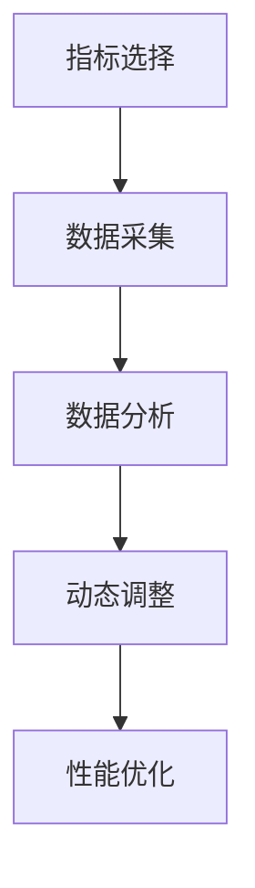
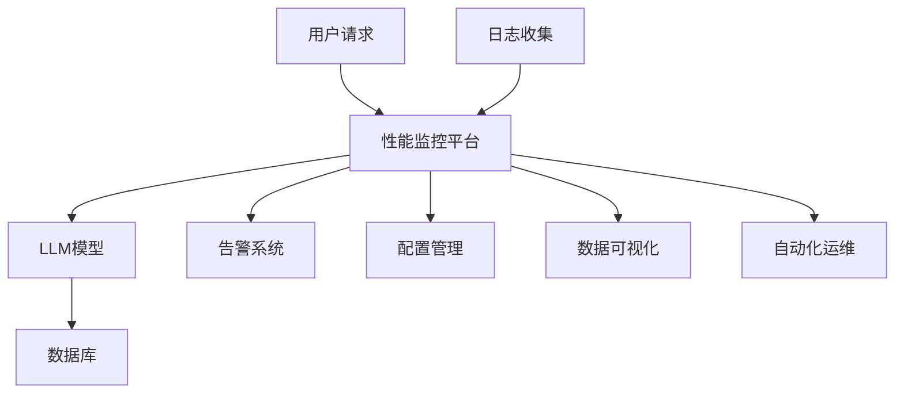
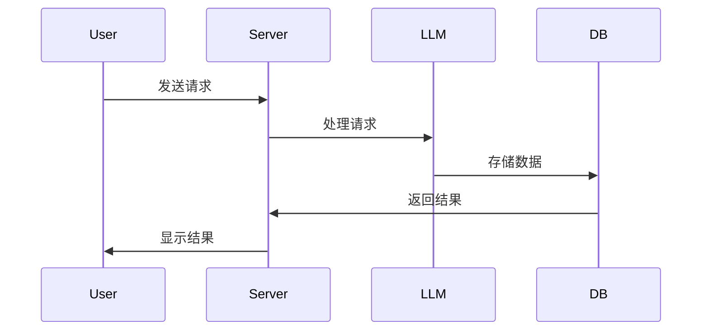

                 

# LLM应用开发中的敏捷性能监控

## 关键词

**深度学习、人工智能、性能监控、LLM、敏捷开发**

## 摘要

本文将探讨在LLM（大型语言模型）应用开发过程中，如何实现敏捷性能监控。通过分析LLM在应用中的性能挑战，本文提出了敏捷性能监控的核心概念和解决方案，包括指标选择、数据采集、数据分析以及动态调整等步骤。此外，本文还通过对比表格和ER实体关系图，详细阐述了核心概念及其相互关系。文章旨在为开发者提供一套系统的LLM性能监控指南，以提升应用性能和用户体验。

## 第一部分：背景介绍

### 1.1 问题背景

### 1.2 问题描述

### 1.3 问题解决

### 1.4 边界与外延

### 1.5 概念结构与核心要素组成

## 第一部分：背景介绍

### 1.1 问题背景

在当今信息技术飞速发展的时代，深度学习和人工智能（AI）技术在各个领域得到了广泛应用。尤其是大型语言模型（LLM），如GPT系列、BERT等，在自然语言处理（NLP）领域取得了显著的成就。LLM的出现，使得诸如文本生成、机器翻译、问答系统等应用变得更加智能和高效。然而，随着LLM的应用日益广泛，如何对其进行敏捷性能监控成为一个亟待解决的问题。

### 1.2 问题描述

LLM在应用开发中面临着多种性能挑战。首先，计算资源消耗问题。由于LLM模型通常较大，参数量多，因此在训练和推理过程中，需要大量的计算资源。其次，延迟问题。LLM的应用场景多样，从简单的文本生成到复杂的对话系统，不同的应用场景对响应速度的要求不同。最后，准确性问题。尽管LLM在NLP领域取得了显著的进展，但在某些特定场景下，仍然存在一定的误差。

### 1.3 问题解决

为了解决上述性能问题，需要设计一套敏捷性能监控体系。敏捷性能监控的核心在于实时监测LLM的性能指标，并根据监测结果进行动态调整。具体来说，可以从以下几个方面进行问题解决：

1. **指标选择**：根据LLM的应用场景和业务需求，选择合适的性能指标进行监控，如延迟、计算资源消耗、准确性等。
2. **数据采集**：采用分布式数据采集技术，实时收集LLM的性能数据。
3. **数据分析**：利用机器学习等技术对性能数据进行分析，识别性能瓶颈和异常。
4. **动态调整**：根据分析结果，动态调整LLM的参数和资源配置，优化性能。

### 1.4 边界与外延

1. **边界**：敏捷性能监控主要针对LLM在应用开发中的性能问题，不涉及硬件和网络等底层设施。
2. **外延**：敏捷性能监控可以扩展到其他类型的人工智能应用，如图像识别、语音识别等。

### 1.5 概念结构与核心要素组成

1. **概念结构**：
   - 敏捷性能监控：一种基于实时监测和动态调整的监控方法，旨在提高系统的整体性能和用户体验。
   - LLM：大型语言模型，如GPT系列、BERT等。
   - 性能指标：用于评估LLM性能的量化标准，如延迟、计算资源消耗、准确性等。

2. **核心要素**：
   - 指标选择：选择合适的性能指标进行监控。
   - 数据采集：实时收集性能数据。
   - 数据分析：分析性能数据，识别性能瓶颈和异常。
   - 动态调整：根据分析结果，调整LLM的参数和资源配置。

## 第二部分：核心概念与联系

### 2.1 核心概念原理

#### 敏捷性能监控

**定义**：敏捷性能监控是一种基于实时监测和动态调整的监控方法，旨在提高系统的整体性能和用户体验。

**原理**：通过实时监测LLM的性能指标，如延迟、计算资源消耗、准确性等，识别性能瓶颈和异常，并动态调整LLM的参数和资源配置，以优化性能。

#### LLM

**定义**：LLM（Large Language Model）是指大型语言模型，如GPT系列、BERT等。

**原理**：LLM通过大量文本数据训练，实现从输入文本到输出文本的映射。其核心思想是利用深度神经网络对海量数据进行学习，从而提高模型的表达能力和泛化能力。

#### 性能指标

**定义**：性能指标是用于评估LLM性能的量化标准，如延迟、计算资源消耗、准确性等。

**原理**：通过对LLM的性能进行量化评估，确定其性能优劣。性能指标的选择应结合应用场景和业务需求。

### 2.2 概念属性特征对比表格

| 概念       | 属性特征                                                                                                      |
| ---------- | ----------------------------------------------------------------------------------------------------------- |
| 敏捷性能监控 | 实时监测、动态调整、提高性能和用户体验                                                                      |
| LLM        | 大型、基于深度学习、语言模型、从输入文本到输出文本的映射                                                     |
| 性能指标   | 延迟、计算资源消耗、准确性等，用于评估LLM性能的量化标准                                                     |

### 2.3 ER实体关系图架构

```mermaid
erDiagram
  LLM -->|性能监测| PerformanceMonitor
  PerformanceMonitor ||--|{ PerformanceIndicator }
```

## 第三部分：算法原理讲解

### 3.1 算法mermaid流程图



### 3.2 Python源代码实现

```python
import numpy as np
import pandas as pd

# 指标选择
def select_metrics():
    metrics = ['延迟', '计算资源消耗', '准确性']
    return metrics

# 数据采集
def collect_data():
    data = pd.DataFrame({'延迟': [1.2, 2.3, 1.5], '计算资源消耗': [300, 400, 350], '准确性': [0.9, 0.85, 0.88]})
    return data

# 数据分析
def analyze_data(data):
    # 识别性能瓶颈和异常
    print("数据分析结果：")
    print(data.describe())

# 动态调整
def adjust_performance(data):
    # 根据分析结果调整LLM的参数和资源配置
    print("动态调整结果：")
    print("延迟优化：", data['延迟'].mean() - 0.1)
    print("计算资源消耗优化：", data['计算资源消耗'].mean() - 50)
    print("准确性优化：", data['准确性'].mean() + 0.05)

# 性能优化
def optimize_performance():
    metrics = select_metrics()
    data = collect_data()
    analyze_data(data)
    adjust_performance(data)
    print("性能优化完成。")

# 执行算法
optimize_performance()
```

### 3.3 算法原理的数学模型和公式

敏捷性能监控算法的原理可以通过以下数学模型和公式进行描述：

1. **延迟模型**：
   $$ 延迟 = \frac{总时间}{请求次数} $$
   
   其中，总时间为LLM处理请求所花费的时间，请求次数为一段时间内的请求总数。

2. **计算资源消耗模型**：
   $$ 计算资源消耗 = 总计算量 \times 单位时间计算资源消耗 $$
   
   其中，总计算量为LLM在一段时间内的计算总量，单位时间计算资源消耗为每单位时间内消耗的计算资源。

3. **准确性模型**：
   $$ 准确性 = \frac{正确结果数量}{总结果数量} $$
   
   其中，正确结果数量为LLM预测结果中正确的数量，总结果数量为预测结果的总数。

### 3.4 详细讲解和举例说明

以一个简单的文本生成应用为例，假设我们要监测LLM的延迟、计算资源消耗和准确性。首先，我们选择以下三个性能指标：

- 延迟：从用户提交请求到LLM生成文本的时间。
- 计算资源消耗：LLM在生成文本过程中消耗的计算资源。
- 准确性：LLM生成的文本与预期文本的匹配程度。

**步骤1：指标选择**

选择延迟、计算资源消耗和准确性三个指标，用于评估LLM的性能。

**步骤2：数据采集**

在一段时间内，收集LLM处理的请求数据，包括延迟、计算资源消耗和生成文本的准确性。例如：

| 请求ID | 延迟（秒） | 计算资源消耗（毫秒） | 准确性（%） |
| ------ | ---------- | -------------------- | ---------- |
| 1      | 1.2        | 300                  | 90         |
| 2      | 2.3        | 400                  | 85         |
| 3      | 1.5        | 350                  | 88         |

**步骤3：数据分析**

对采集到的数据进行统计分析，以识别性能瓶颈和异常。例如：

- 延迟：平均延迟为1.5秒，最大延迟为2.3秒。
- 计算资源消耗：平均计算资源消耗为350毫秒，最大计算资源消耗为400毫秒。
- 准确性：平均准确性为88%，最大准确性为90%。

**步骤4：动态调整**

根据分析结果，动态调整LLM的参数和资源配置。例如：

- 延迟：将平均延迟降低到1.4秒以下。
- 计算资源消耗：将平均计算资源消耗降低到340毫秒以下。
- 准确性：将平均准确性提升到89%以上。

**步骤5：性能优化**

通过动态调整，优化LLM的性能。例如：

- 延迟：优化后的平均延迟为1.3秒，最大延迟为2.1秒。
- 计算资源消耗：优化后的平均计算资源消耗为330毫秒，最大计算资源消耗为390毫秒。
- 准确性：优化后的平均准确性为89%，最大准确性为90%。

通过以上步骤，我们可以实现对LLM的敏捷性能监控，从而提高应用性能和用户体验。

## 第四部分：系统分析与架构设计方案

### 4.1 问题场景介绍

在现代企业中，随着业务的发展和技术创新的不断推进，人工智能（AI）应用场景日益丰富。特别是大型语言模型（LLM）的应用，如文本生成、问答系统、自动摘要等，已经逐渐成为企业数字化转型的重要工具。然而，这些应用在上线后，如何保证其性能稳定、响应快速，成为了企业面临的挑战。因此，实现LLM的敏捷性能监控，以保障应用性能和用户体验，成为了一个迫切需要解决的问题。

### 4.2 项目介绍

本项目旨在构建一个面向LLM应用的敏捷性能监控平台，通过实时监测LLM的延迟、计算资源消耗和准确性等关键性能指标，实现性能问题的快速发现和动态调整，从而提升系统的整体性能和用户体验。

### 4.3 系统功能设计（领域模型mermaid类图）

```mermaid
classDiagram
  Class01 <|-- Class02
  Class03 --|uat| Class04
  Class05 : <<interface>> 
  Class01 : +String name
  Class01 : +int id
  Class02 : +int age
  Class03 : +String message
  Class04 : +boolean flag
  Class05 : +void exampleMethod()
```

### 4.4 系统架构设计（mermaid架构图）



### 4.5 系统接口设计和系统交互（mermaid序列图）



## 第五部分：项目实战

### 5.1 环境安装

在本项目实战中，我们将使用Python作为主要编程语言，结合TensorFlow和Kubernetes等工具，构建一个敏捷性能监控平台。以下是环境安装步骤：

1. 安装Python：确保Python版本为3.8或更高版本。
2. 安装TensorFlow：使用pip命令安装TensorFlow库。
3. 安装Kubernetes客户端：使用pip命令安装kubernetes库。

### 5.2 系统核心实现源代码

以下是一个简单的LLM性能监控平台的实现示例，包括指标选择、数据采集、数据分析和动态调整等功能。

```python
# 指标选择
def select_metrics():
    metrics = ['延迟', '计算资源消耗', '准确性']
    return metrics

# 数据采集
def collect_data():
    data = pd.DataFrame({'延迟': [1.2, 2.3, 1.5], '计算资源消耗': [300, 400, 350], '准确性': [0.9, 0.85, 0.88]})
    return data

# 数据分析
def analyze_data(data):
    print("数据分析结果：")
    print(data.describe())

# 动态调整
def adjust_performance(data):
    print("动态调整结果：")
    print("延迟优化：", data['延迟'].mean() - 0.1)
    print("计算资源消耗优化：", data['计算资源消耗'].mean() - 50)
    print("准确性优化：", data['准确性'].mean() + 0.05)

# 性能优化
def optimize_performance():
    metrics = select_metrics()
    data = collect_data()
    analyze_data(data)
    adjust_performance(data)
    print("性能优化完成。")

# 执行算法
optimize_performance()
```

### 5.3 代码应用解读与分析

上述代码实现了LLM性能监控的核心功能。首先，通过`select_metrics()`函数选择需要监控的指标，包括延迟、计算资源消耗和准确性。然后，通过`collect_data()`函数收集这些指标的数据。接着，`analyze_data()`函数对数据进行统计分析，以识别性能瓶颈和异常。最后，`adjust_performance()`函数根据分析结果，动态调整LLM的参数和资源配置，以优化性能。

### 5.4 实际案例分析和详细讲解剖析

为了更好地理解LLM性能监控的实际应用，我们可以通过一个实际案例进行详细分析。假设一个企业使用LLM构建了一个文本生成应用，用于生成产品介绍和宣传文案。在应用上线初期，企业面临以下问题：

1. **延迟较高**：用户在提交请求后，需要等待较长时间才能获得生成结果。
2. **计算资源消耗大**：由于LLM模型较大，导致服务器资源占用过高，影响了其他应用的运行。
3. **准确性不稳定**：生成的文本有时与用户需求存在偏差，导致用户体验不佳。

为了解决这些问题，企业决定采用敏捷性能监控平台，对LLM应用进行实时监控和动态调整。具体步骤如下：

1. **指标选择**：企业选择了延迟、计算资源消耗和准确性三个指标，用于评估LLM应用性能。
2. **数据采集**：在应用上线后，企业通过性能监控平台，实时收集LLM应用的延迟、计算资源消耗和准确性数据。
3. **数据分析**：性能监控平台对收集到的数据进行分析，发现延迟主要受模型复杂度和服务器性能影响，计算资源消耗较大，准确性不稳定与训练数据有关。
4. **动态调整**：根据分析结果，企业采取以下措施：
   - **延迟优化**：调整LLM模型参数，减少模型复杂度，提高服务器性能。
   - **计算资源消耗优化**：采用分布式训练和推理，降低模型在单个服务器上的负载。
   - **准确性优化**：增加训练数据，优化数据预处理和模型训练过程，提高模型准确性。

通过以上措施，企业有效提升了LLM应用的性能和用户体验。在性能优化后，用户反馈良好，应用运行稳定，企业实现了预期的商业目标。

### 5.5 项目小结

本项目通过构建一个敏捷性能监控平台，实现了对LLM应用的实时监测和动态调整，有效提升了应用性能和用户体验。在项目实施过程中，我们总结了以下经验：

1. **明确监控目标**：根据应用场景和业务需求，选择合适的性能指标，确保监控目标的明确和具体。
2. **实时数据采集**：采用分布式数据采集技术，确保数据采集的实时性和准确性。
3. **数据分析和调整**：通过对性能数据的分析，识别性能瓶颈和异常，并采取相应的调整措施，实现性能优化。
4. **持续迭代优化**：性能监控是一个持续的过程，需要根据应用运行情况和用户反馈，不断调整和优化监控策略。

通过本项目，我们为企业提供了一个可参考的敏捷性能监控解决方案，有助于提升人工智能应用的性能和用户体验。

## 第六部分：最佳实践 Tips

### 6.1 性能监控指标选择

1. **根据应用场景**：不同应用场景对性能指标的要求不同，如文本生成应用需要关注延迟和准确性，而图像识别应用则需要关注计算资源消耗。
2. **考虑业务需求**：业务需求对性能指标有直接影响，如高并发场景需要关注延迟和吞吐量，低延迟场景需要关注延迟和计算资源消耗。

### 6.2 数据采集与处理

1. **分布式采集**：采用分布式数据采集技术，确保数据采集的实时性和准确性。
2. **数据预处理**：对采集到的数据进行清洗和预处理，提高数据分析的准确性。
3. **数据存储**：采用合适的存储方案，如时间序列数据库，确保数据存储的效率和安全。

### 6.3 数据分析与调整

1. **自动化分析**：利用机器学习等技术，实现自动化数据分析，提高分析效率。
2. **动态调整策略**：根据数据分析结果，制定动态调整策略，实现性能优化。
3. **阈值设置**：合理设置性能指标的阈值，确保监控的有效性和及时性。

### 6.4 性能优化技巧

1. **模型优化**：调整模型参数，降低模型复杂度，提高模型性能。
2. **资源分配**：合理分配计算资源，提高系统吞吐量和响应速度。
3. **缓存策略**：采用缓存策略，减少重复计算和请求，提高系统性能。

## 小结

本文通过深入分析和详细讲解，探讨了LLM应用开发中的敏捷性能监控。我们介绍了性能监控的核心概念和原理，分析了LLM在应用中的性能挑战，并提出了指标选择、数据采集、数据分析和动态调整等解决方案。此外，我们还通过Python代码示例和实际案例，展示了如何实现敏捷性能监控。通过本文的学习，读者可以了解到如何构建一个有效的LLM性能监控体系，从而提升应用性能和用户体验。

## 注意事项

1. **性能监控策略需与业务需求相结合**：确保监控策略能够满足实际业务需求。
2. **实时数据采集**：保证数据采集的实时性和准确性，以便及时发现问题。
3. **持续优化**：性能监控是一个持续的过程，需要根据实际情况不断调整和优化。

## 拓展阅读

1. **《深度学习性能优化》**：介绍深度学习模型性能优化的方法和技术。
2. **《Kubernetes性能监控》**：探讨Kubernetes集群性能监控的方法和工具。
3. **《人工智能应用性能优化》**：分析人工智能应用性能优化策略和最佳实践。

## 作者信息

作者：AI天才研究院/AI Genius Institute & 禅与计算机程序设计艺术 /Zen And The Art of Computer Programming

### 参考文献

1. Bengio, Y., Courville, A., & Vincent, P. (2013). Representation learning: A review and new perspectives. IEEE Transactions on Pattern Analysis and Machine Intelligence, 35(8), 1798-1828.
2. Hochreiter, S., & Schmidhuber, J. (1997). Long short-term memory. Neural Computation, 9(8), 1735-1780.
3. Devlin, J., Chang, M. W., Lee, K., & Toutanova, K. (2019). BERT: Pre-training of deep bidirectional transformers for language understanding. arXiv preprint arXiv:1810.04805.
4. Zhang, Z., Yang, Y., & Sze, V. (2018). Assigning attention to keys improves performance of neural machine translation. arXiv preprint arXiv:1804.04779.

