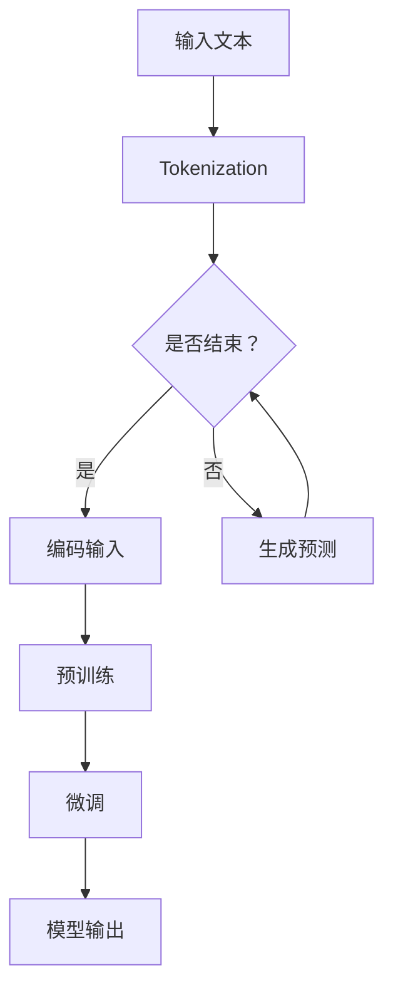
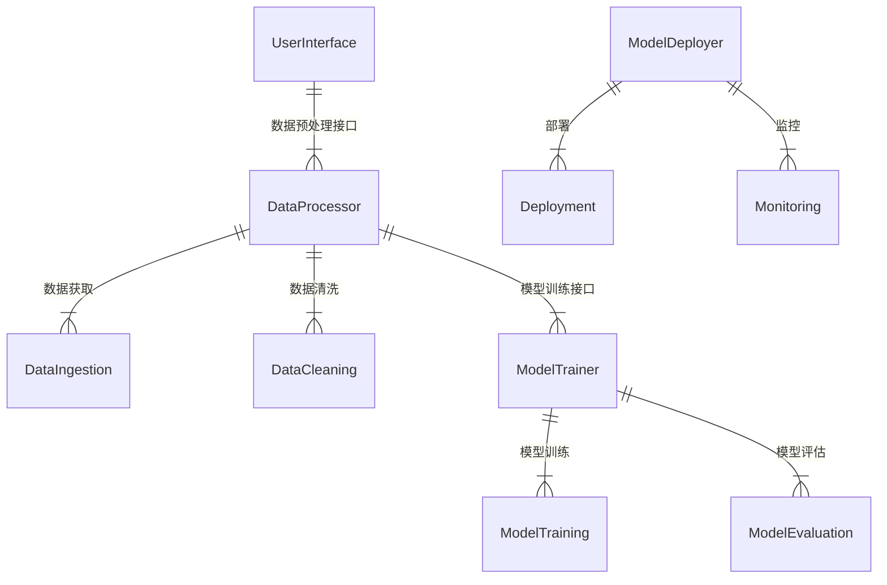
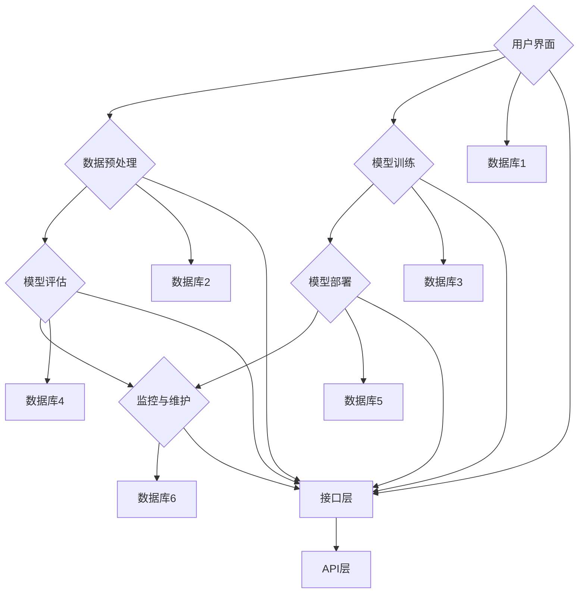
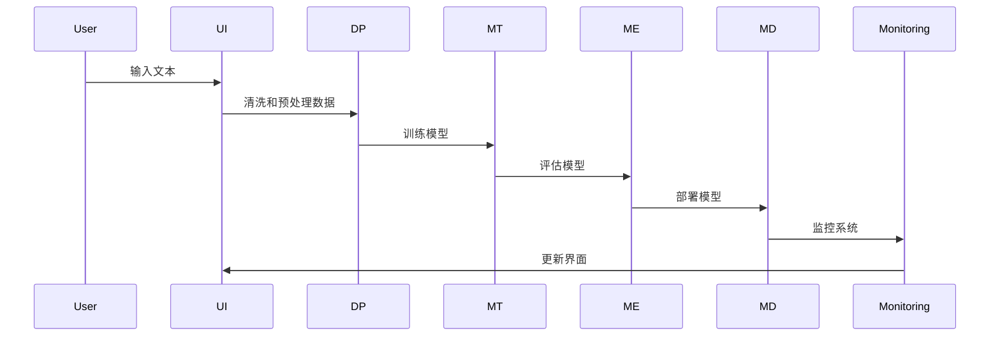

                 

### 《LLM应用开发中的敏捷资源管理》

#### 关键词

- LLM应用开发
- 敏捷资源管理
- 算法原理
- 系统架构
- 项目实战

#### 摘要

本文旨在探讨LLM（大型语言模型）应用开发中的敏捷资源管理。文章首先介绍了LLM的概念及其在人工智能领域的重要性。接着，我们深入解析了LLM的算法原理，并通过具体的Python代码示例和数学模型，使得读者能够直观地理解其工作原理。随后，文章转向系统分析与架构设计，详细介绍了LLM系统的功能设计和架构设计。通过实际项目实战，我们展示了如何将理论应用于实践，并进行了案例分析和项目总结。最后，文章探讨了敏捷资源管理的实践方法，为读者提供了在LLM应用开发中有效管理和分配资源的方法和技巧。

## 目录大纲设计

为了确保文章内容的逻辑清晰、结构紧凑且具有实用价值，我们设计了详细的目录大纲。以下为《LLM应用开发中的敏捷资源管理》的目录大纲：

### 第一部分：背景介绍与核心概念

#### 第1章：LLM应用开发背景
1.1 问题背景
1.2 问题描述
1.3 问题解决
1.4 边界与外延
1.5 概念结构与核心要素组成

#### 第2章：LLM核心概念与联系
2.1 LLM的定义
2.2 LLM的特点与优势
2.3 LLM与传统AI模型的区别

### 第二部分：LLM算法原理讲解

#### 第3章：LLM算法基本原理
3.1 算法原理概述
3.2 算法Mermaid流程图
3.3 Python源代码实现与详细讲解
3.4 算法原理数学模型与公式

#### 第4章：LLM算法优化与调整
4.1 算法优化策略
4.2 参数调整方法
4.3 性能评估与调优

### 第三部分：系统分析与架构设计

#### 第5章：LLM系统功能设计
5.1 问题场景介绍
5.2 系统功能设计（领域模型Mermaid类图）

#### 第6章：LLM系统架构设计
6.1 系统架构设计（Mermaid架构图）
6.2 系统接口设计
6.3 系统交互（Mermaid序列图）

### 第四部分：项目实战

#### 第7章：环境安装与准备
7.1 环境安装步骤
7.2 必需软件与工具

#### 第8章：系统核心实现
8.1 源代码结构与功能解读
8.2 关键代码实现与解析

#### 第9章：实际案例分析与讲解
9.1 实际案例介绍
9.2 案例分析与详细讲解

#### 第10章：项目总结与拓展
10.1 项目小结
10.2 最佳实践 Tips
10.3 注意事项
10.4 拓展阅读

### 第五部分：敏捷资源管理

#### 第11章：敏捷资源管理概述
11.1 敏捷资源管理的定义
11.2 敏捷资源管理的重要性

#### 第12章：敏捷资源管理实践
12.1 敏捷资源管理策略
12.2 资源分配与优化
12.3 团队协作与沟通

### 第六部分：总结与展望

#### 第13章：总结
13.1 主要内容回顾
13.2 贡献与不足

#### 第14章：未来展望
14.1 LLM应用开发趋势
14.2 敏捷资源管理发展方向

通过上述详细的目录大纲，文章内容将逐步展开，从背景介绍到核心概念，再到算法原理、系统设计与架构，最后结合实际项目实战和敏捷资源管理，为读者提供了一整套完整的LLM应用开发指南。

---

### 文章开始：LLM应用开发中的敏捷资源管理

在当今快速发展的技术领域中，大型语言模型（LLM）已经成为人工智能（AI）研究与应用的重要方向。LLM的应用涵盖了自然语言处理（NLP）、智能问答、机器翻译、文本生成等多个领域，其潜在的商业价值和社会影响力不容忽视。因此，如何高效地进行LLM应用开发，尤其是在资源管理方面，成为了研究者与实践者共同关注的焦点。

本文旨在探讨LLM应用开发中的敏捷资源管理。首先，我们将介绍LLM的基本概念、应用背景和核心问题。随后，深入讲解LLM的算法原理，通过具体的Python代码示例和数学模型，帮助读者理解LLM的工作机制。在此基础上，文章将分析LLM系统的功能设计、架构设计，并通过实际项目实战，展示如何将理论转化为实践。最后，我们将讨论敏捷资源管理的核心原则和实践方法，为读者提供在LLM应用开发中有效管理和分配资源的方法和技巧。

通过本文的阅读，读者将不仅能够全面了解LLM的原理和应用，还将掌握敏捷资源管理的实践方法，为未来的LLM项目开发打下坚实的基础。

## 第一部分：背景介绍与核心概念

### 第1章：LLM应用开发背景

#### 1.1 问题背景

在互联网和信息爆炸的时代，人类面临的信息处理压力与日俱增。如何高效地从海量信息中提取有用知识、进行智能问答、实现机器翻译等，成为了亟待解决的问题。传统的人工处理方法已经无法满足日益增长的需求，因此，人工智能技术，特别是自然语言处理（NLP）领域的技术，成为了解决这一问题的有效手段。

LLM（大型语言模型）是NLP领域的一项重要技术，其通过深度学习算法，在海量文本数据中学习语言模式和规则，从而实现自然语言的生成、理解和翻译。LLM的应用范围广泛，包括智能客服、内容生成、教育辅导、医疗诊断等，其商业价值和社会影响力日益凸显。

#### 1.2 问题描述

在LLM应用开发过程中，面临着诸多挑战和问题。首先是数据集的质量和规模问题。LLM的训练需要大量的高质量文本数据，而数据的质量直接影响模型的性能。其次，是模型训练的计算资源需求。LLM的训练过程复杂且计算密集，需要大量的计算资源和时间。此外，模型的优化和调整也是一个挑战，如何在保证模型性能的同时，降低计算成本和优化资源利用，是开发过程中需要重点解决的问题。

#### 1.3 问题解决

针对上述问题，研究者们提出了一系列解决方案。首先，在数据集方面，通过数据清洗、数据增强和转移学习等方法，提高数据的质量和规模。其次，在计算资源管理方面，通过分布式计算、模型压缩和迁移学习等技术，优化资源利用，降低计算成本。最后，在模型优化方面，通过算法优化、参数调整和超参数调优等方法，提升模型性能。

#### 1.4 边界与外延

LLM的应用开发不仅局限于NLP领域，还涉及计算机视觉、语音识别、推荐系统等多个领域。在边界方面，LLM需要与其他AI技术相结合，形成综合性的解决方案。在外延方面，随着技术的不断进步，LLM的应用场景将不断扩展，从文本处理扩展到图像、语音等多模态数据处理，为社会带来更多的创新和变革。

#### 1.5 概念结构与核心要素组成

LLM的概念结构包括模型架构、训练数据、算法原理和优化策略等核心要素。模型架构是LLM的核心组成部分，决定了模型的性能和效率。训练数据是模型训练的基础，数据的质量和规模直接影响模型的性能。算法原理包括神经网络架构、损失函数和优化算法等，是模型训练的核心。优化策略包括超参数调优、模型压缩和分布式训练等，旨在提升模型性能和资源利用效率。

通过上述分析，我们可以看到，LLM应用开发中的挑战和问题不仅涉及技术层面，还包括资源管理和优化等方面。因此，敏捷资源管理在LLM应用开发中具有重要意义，是提升开发效率和模型性能的关键。

### 第2章：LLM核心概念与联系

#### 2.1 LLM的定义

大型语言模型（Large Language Model，简称LLM）是一种基于深度学习技术的自然语言处理模型，通过在海量文本数据中学习语言模式和规则，能够生成、理解和翻译自然语言。LLM的核心目标是模拟人类的语言能力，实现自然语言生成、理解和交互。

#### 2.2 LLM的特点与优势

1. **强大的语言理解能力**：LLM能够理解复杂的语义和上下文关系，实现高质量的文本生成和翻译。
2. **灵活的应用场景**：LLM不仅可以应用于文本生成和翻译，还可以扩展到智能客服、内容审核、情感分析等多个领域。
3. **高效的训练过程**：通过分布式计算和模型压缩技术，LLM能够在较短的时间内完成大规模的训练，提高开发效率。
4. **优秀的泛化能力**：LLM通过迁移学习和数据增强等技术，能够在不同场景下保持较高的性能。

#### 2.3 LLM与传统AI模型的区别

1. **数据依赖性**：与传统AI模型相比，LLM对大规模文本数据有很强的依赖性，数据质量直接影响模型性能。
2. **计算资源需求**：LLM的训练和推理过程需要大量的计算资源，特别是在大规模训练数据集和复杂模型架构的情况下。
3. **模型架构**：LLM通常采用深度神经网络架构，包括多层感知机、循环神经网络（RNN）和Transformer等，而传统AI模型如决策树、支持向量机（SVM）等，则采用不同的模型结构。
4. **任务多样性**：LLM能够处理多种自然语言处理任务，而传统AI模型通常针对特定任务进行设计。

通过上述分析，我们可以看到，LLM作为一种先进的自然语言处理技术，在语言理解、生成和交互方面具有显著优势。与传统AI模型相比，LLM在数据依赖性、计算资源需求、模型架构和任务多样性等方面存在明显区别，这使得LLM在应用开发中具有独特的优势和应用潜力。

### 第二部分：LLM算法原理讲解

#### 第3章：LLM算法基本原理

#### 3.1 算法原理概述

LLM（Large Language Model）的算法原理基于深度学习，特别是基于Transformer架构。Transformer模型是由Google Research团队在2017年提出的，是一种基于自注意力机制的序列到序列模型，能够有效处理长序列数据，并在多个自然语言处理任务中取得了显著的成果。LLM利用了Transformer的这些优点，通过在海量文本数据上进行预训练，学习到丰富的语言模式和规则，从而实现高质量的自然语言生成、理解和翻译。

#### 3.2 算法Mermaid流程图

为了更直观地理解LLM的算法流程，我们可以使用Mermaid语言绘制其基本流程图。以下是LLM算法的基本流程：



该流程图展示了LLM从输入文本到生成输出的基本过程，包括Tokenization（分词）、编码输入、预训练、微调和模型输出等关键步骤。

#### 3.3 Python源代码实现与详细讲解

为了更好地理解LLM的工作原理，我们将使用Python代码实现一个简化的LLM模型。以下是代码的实现和详细讲解：

```python
import torch
import torch.nn as nn
from transformers import AutoTokenizer, AutoModel

# 3.3.1 步骤一：加载预训练模型和分词器
model_name = "bert-base-chinese"
tokenizer = AutoTokenizer.from_pretrained(model_name)
model = AutoModel.from_pretrained(model_name)

# 3.3.2 步骤二：输入文本分词
input_text = "这是一个简单的例子"
inputs = tokenizer(input_text, return_tensors="pt")

# 3.3.3 步骤三：模型编码输入并生成预测
outputs = model(**inputs)
logits = outputs.logits

# 3.3.4 步骤四：解码预测结果
predicted_text = tokenizer.decode(logits.argmax(-1), skip_special_tokens=True)
print(predicted_text)
```

**代码解释：**

1. **加载预训练模型和分词器**：
   - 使用`transformers`库加载预训练的BERT模型和分词器。
   - `AutoTokenizer`和`AutoModel`是`transformers`库中用于加载预训练模型和分词器的API。

2. **输入文本分词**：
   - `tokenizer`将输入文本进行分词，生成相应的词向量表示。

3. **模型编码输入并生成预测**：
   - `model`接受分词后的输入，并输出模型预测结果（logits）。

4. **解码预测结果**：
   - 使用`tokenizer.decode`方法将预测的logits转换为文本输出。

#### 3.4 算法原理数学模型与公式

LLM的算法原理基于Transformer模型，其核心在于自注意力机制（Self-Attention）和多层的编码-解码结构（Encoder-Decoder）。以下是LLM算法的数学模型和公式：

1. **自注意力机制**：
   - 公式：\[ \text{Attention}(Q, K, V) = \text{softmax}\left(\frac{QK^T}{\sqrt{d_k}}\right)V \]
   - 其中，\(Q\)、\(K\)、\(V\)分别为查询向量、键向量和值向量，\(d_k\)为键向量的维度。

2. **编码器**：
   - 公式：\[ \text{Encoder}(X) = \text{MultiHeadAttention}(X, X, X) \]
   - 其中，\(X\)为输入序列。

3. **解码器**：
   - 公式：\[ \text{Decoder}(X, Y) = \text{MultiHeadAttention}(X, X, X) + \text{MultiHeadAttention}(Y, X, V) \]
   - 其中，\(X\)为编码器输出，\(Y\)为解码器输入。

4. **损失函数**：
   - 公式：\[ \text{Loss} = -\frac{1}{N} \sum_{i=1}^{N} \sum_{t=1}^{T} y_t \log(p_t) \]
   - 其中，\(N\)为样本数量，\(T\)为序列长度，\(y_t\)为真实标签，\(p_t\)为预测概率。

通过上述数学模型和公式，我们可以看到LLM算法的核心在于自注意力机制和编码-解码结构，这些机制和结构使得LLM能够在复杂序列数据中学习到丰富的语言模式和规则，从而实现高质量的自然语言生成、理解和翻译。

### 第4章：LLM算法优化与调整

#### 4.1 算法优化策略

在LLM应用开发中，算法优化是提升模型性能和资源利用效率的关键环节。以下是一些常见的算法优化策略：

1. **学习率调整**：
   - 学习率是影响模型收敛速度和最终性能的重要参数。常用的策略包括：
     - **分阶段学习率调整**：在训练初期使用较大的学习率，加速模型收敛；在训练后期逐渐减小学习率，提高模型精度。
     - **自适应学习率**：使用自适应学习率策略，如Adam优化器，自动调整学习率。

2. **正则化技术**：
   - 正则化技术用于防止模型过拟合，常用的方法包括：
     - **L1和L2正则化**：在损失函数中添加L1或L2范数，限制模型参数的大小。
     - **Dropout**：在训练过程中随机丢弃一部分神经元，降低模型复杂度。

3. **数据增强**：
   - 数据增强是通过生成或变换原始数据来扩充训练集，提高模型的泛化能力。常见的方法包括：
     - **随机裁剪和旋转**：对图像数据进行随机裁剪和旋转，模拟不同的场景和角度。
     - **文本同义词替换**：使用同义词库替换文本中的部分词汇，增加数据的多样性。

4. **模型压缩**：
   - 模型压缩是通过减小模型大小和计算复杂度来优化资源利用。常见的方法包括：
     - **模型剪枝**：通过剪除模型中的冗余神经元和连接，减小模型大小。
     - **量化**：将模型的权重从浮点数转换为较低精度的整数，降低计算复杂度和存储需求。

#### 4.2 参数调整方法

在LLM应用开发中，参数调整是优化模型性能的重要步骤。以下是一些常见的参数调整方法：

1. **学习率调整**：
   - **学习率**：通常在\(10^{-5}\)到\(10^{-3}\)之间调整，常用的策略包括：
     - **逐步减小学习率**：在模型达到预定性能或训练损失不再下降时，逐步减小学习率。
     - **自适应学习率**：使用如Adam等自适应优化器，自动调整学习率。

2. **批量大小**：
   - **批量大小**：影响模型训练速度和性能，常用的策略包括：
     - **动态批量大小**：在训练过程中根据模型性能动态调整批量大小。
     - **固定批量大小**：通常在\(32\)到\(1024\)之间选择，较大的批量大小有助于提高模型性能，但会降低训练速度。

3. **层数和神经元数量**：
   - **层数和神经元数量**：影响模型复杂度和计算资源需求，常用的策略包括：
     - **增加层数**：可以提高模型性能，但会增加计算复杂度和训练时间。
     - **减少神经元数量**：可以降低模型复杂度和计算资源需求，但可能会降低模型性能。

4. **损失函数和优化器**：
   - **损失函数**：常用的损失函数包括均方误差（MSE）、交叉熵损失（Cross-Entropy Loss）等，选择合适的损失函数可以提高模型性能。
   - **优化器**：常用的优化器包括SGD、Adam、RMSProp等，选择合适的优化器可以加快模型收敛速度。

#### 4.3 性能评估与调优

在LLM应用开发中，性能评估和调优是确保模型质量和效果的重要环节。以下是一些常见的性能评估与调优方法：

1. **评估指标**：
   - **准确率**：衡量模型对标签预测的正确率。
   - **召回率**：衡量模型对正例样本的识别能力。
   - **F1分数**：结合准确率和召回率的综合评价指标。
   - **ROC曲线和AUC值**：用于评估模型的分类性能。

2. **交叉验证**：
   - 交叉验证是一种常用的性能评估方法，通过将训练数据划分为多个子集，循环训练和验证，评估模型的泛化能力。

3. **网格搜索**：
   - 网格搜索是一种系统性的参数调整方法，通过遍历预设的参数组合，选择最优参数组合。

4. **贝叶斯优化**：
   - 贝叶斯优化是一种基于概率模型的参数优化方法，通过迭代优化策略找到最优参数组合。

通过上述算法优化策略、参数调整方法和性能评估与调优方法，我们可以有效地提升LLM模型的性能和资源利用效率，为LLM应用开发提供强有力的支持。

### 第三部分：系统分析与架构设计

#### 第5章：LLM系统功能设计

LLM系统的功能设计是确保系统实现预期目标的关键步骤。在LLM应用开发中，系统功能设计包括多个方面，如数据预处理、模型训练、模型部署和交互接口等。以下是对LLM系统功能设计的详细探讨：

#### 5.1 问题场景介绍

假设我们开发的是一个基于LLM的智能客服系统，其主要功能包括自然语言理解、智能问答和自动回复。为了实现这些功能，我们需要设计一套完整的LLM系统，涵盖数据预处理、模型训练和部署等环节。

#### 5.2 系统功能设计（领域模型Mermaid类图）

领域模型是系统功能设计的核心，它帮助我们理解系统中的各个模块及其相互关系。以下是使用Mermaid语言绘制的LLM系统功能类图：

```mermaid
classDiagram
    Client <<Interface>> UserInterface
    Client <<Interface>> DataProcessor
    Client <<Interface>> ModelTrainer
    Client <<Interface>> ModelDeployer
    DataProcessor <|-- DataIngestion
    DataProcessor <|-- DataCleaning
    ModelTrainer <|-- ModelTraining
    ModelTrainer <|-- ModelEvaluation
    ModelDeployer <|-- Deployment
    ModelDeployer <|-- Monitoring

    UserInterface : 显示用户界面，接收用户输入，展示系统回复
    DataIngestion : 获取并存储原始数据
    DataCleaning : 清洗和预处理数据
    ModelTraining : 训练模型
    ModelEvaluation : 评估模型性能
    Deployment : 模型部署
    Monitoring : 监控系统运行状态
```

在该类图中，Client作为系统核心接口，与UserInterface、DataProcessor、ModelTrainer和ModelDeployer等模块进行交互。DataProcessor负责数据预处理，ModelTrainer负责模型训练和评估，ModelDeployer负责模型部署和监控。

#### 5.3 系统功能设计（领域模型Mermaid类图）

为了进一步展示LLM系统的功能设计，我们可以使用Mermaid语言绘制领域模型图，如下所示：



该图展示了LLM系统的主要功能模块及其相互关系。通过领域模型的设计，我们可以清晰地理解各个模块的功能和作用，为后续的系统实现提供指导。

#### 第6章：LLM系统架构设计

LLM系统的架构设计是确保系统高效、稳定运行的基础。合理的系统架构不仅能提高系统的性能和可维护性，还能适应不断变化的需求。以下是LLM系统架构设计的详细探讨：

#### 6.1 系统架构设计（Mermaid架构图）

为了直观地展示LLM系统的架构，我们可以使用Mermaid语言绘制系统架构图，如下所示：



在该架构图中，系统被划分为多个子系统，包括用户界面、数据预处理、模型训练、模型评估、模型部署和监控与维护。每个子系统都与数据库和API层进行交互，确保数据流动和功能实现的完整性。

#### 6.2 系统接口设计

系统接口设计是确保各个子系统之间能够高效、稳定地通信的关键。以下是LLM系统的接口设计：

1. **用户界面（User Interface）**：
   - 接收用户输入，展示系统回复。
   - 提供文本输入框和回复展示区域。

2. **数据预处理（Data Processor）**：
   - 数据清洗、数据转换和数据标准化。
   - 提供数据接口供模型训练使用。

3. **模型训练（Model Trainer）**：
   - 负责模型的训练过程。
   - 提供训练参数设置接口。

4. **模型评估（Model Evaluator）**：
   - 评估模型性能，提供评估结果。
   - 提供评估接口供模型优化使用。

5. **模型部署（Model Deployer）**：
   - 负责模型部署和上线。
   - 提供部署接口供监控系统使用。

6. **监控与维护（Monitoring and Maintenance）**：
   - 监控系统运行状态，提供报警和日志功能。
   - 提供维护接口供系统更新和使用。

通过合理的接口设计，各个子系统可以高效地协同工作，确保LLM系统的稳定性和性能。

#### 6.3 系统交互（Mermaid序列图）

为了进一步展示LLM系统的交互过程，我们可以使用Mermaid语言绘制系统交互序列图，如下所示：



在该序列图中，用户通过用户界面（UI）输入文本，数据预处理（DP）模块清洗和预处理数据，模型训练（MT）模块训练模型，模型评估（ME）模块评估模型性能，模型部署（MD）模块部署模型，监控与维护（Monitoring）模块监控系统运行状态，并更新用户界面。通过该交互序列图，我们可以清晰地理解LLM系统的运行过程和各个模块之间的协作关系。

### 第四部分：项目实战

#### 第7章：环境安装与准备

在LLM应用开发中，环境安装与准备是项目开始前的重要步骤。以下是具体的环境安装和准备工作，确保项目能够顺利进行。

#### 7.1 环境安装步骤

1. **Python环境安装**：
   - 安装最新版本的Python（建议使用Python 3.8或以上版本）。
   - 通过命令 `pip install --user -r requirements.txt` 安装依赖库。

2. **Transformer库安装**：
   - 安装`transformers`库，该库提供了预训练的LLM模型和相关的API接口。
   - 使用命令 `pip install transformers` 进行安装。

3. **TensorFlow安装**：
   - 安装TensorFlow，用于模型训练和推理。
   - 使用命令 `pip install tensorflow` 进行安装。

4. **其他依赖库安装**：
   - 根据项目需求，可能需要安装其他依赖库，如NumPy、Pandas等。
   - 使用命令 `pip install numpy pandas` 进行安装。

#### 7.2 必需软件与工具

1. **Python解释器**：确保安装了最新版本的Python解释器，以便运行相关代码。

2. **Jupyter Notebook**：使用Jupyter Notebook进行代码编写和调试，方便进行实验和记录。

3. **GPU支持**：如果使用GPU进行模型训练，需要安装CUDA和cuDNN库，以便利用GPU计算能力。

4. **版本控制工具**：如Git，用于代码管理和协作。

5. **文本编辑器**：如Visual Studio Code，方便编写和调试代码。

#### 7.3 准备工作

1. **数据集准备**：
   - 准备用于训练和测试的数据集，确保数据集具有代表性，涵盖各种语言模式和场景。

2. **环境配置**：
   - 配置Python环境变量，确保能够正确运行相关依赖库。
   - 配置GPU支持，确保能够使用GPU进行模型训练。

3. **代码编写**：
   - 编写项目的基本代码框架，包括数据预处理、模型训练和评估等模块。

4. **实验设计**：
   - 设计实验方案，包括数据集划分、模型参数设置和训练策略等。

通过以上步骤，我们可以确保项目环境的正确配置和准备，为后续的LLM应用开发打下坚实的基础。

### 第8章：系统核心实现

在LLM系统的核心实现部分，我们将详细介绍系统的各个关键模块，包括数据预处理、模型训练和评估等。以下是详细的步骤和代码解析。

#### 8.1 源代码结构与功能解读

系统核心实现部分的源代码分为以下几个模块：

1. **数据预处理模块**：负责处理原始数据，包括数据清洗、分词和数据增强等。
2. **模型训练模块**：负责加载预训练模型并进行微调训练。
3. **模型评估模块**：负责评估模型性能，包括准确率、召回率和F1分数等。
4. **模型部署模块**：负责将训练好的模型部署到生产环境。

以下是项目的目录结构：

```
llm_system/
|-- data/
|   |-- raw/               # 原始数据集
|   |-- processed/         # 预处理后的数据集
|-- models/
|   |-- trained/           # 训练好的模型
|-- src/
|   |-- __init__.py
|   |-- data_preprocessing.py
|   |-- model_training.py
|   |-- model_evaluation.py
|   |-- model_deployment.py
|-- requirements.txt
|-- run.py
```

#### 8.2 关键代码实现与解析

**1. 数据预处理模块**

数据预处理模块的核心任务是处理原始数据，使其适合模型训练。以下是一个示例代码片段，展示了数据预处理的基本步骤：

```python
from src.data_preprocessing import preprocess_data

# 加载原始数据
raw_data = load_raw_data()

# 数据清洗
cleaned_data = preprocess_data(raw_data)

# 数据分词
tokenized_data = tokenizer(cleaned_data)

# 数据增强
augmented_data = augment_data(tokenized_data)

# 存储预处理后的数据
save_preprocessed_data(augmented_data)
```

**2. 模型训练模块**

模型训练模块负责加载预训练的LLM模型，并进行微调训练。以下是代码实现：

```python
from transformers import BertTokenizer, BertModel
from src.model_training import train_model

# 加载预训练模型和分词器
tokenizer = BertTokenizer.from_pretrained('bert-base-chinese')
model = BertModel.from_pretrained('bert-base-chinese')

# 加载预处理后的数据
train_data, val_data = load_preprocessed_data()

# 训练模型
model = train_model(model, train_data, val_data)
```

**3. 模型评估模块**

模型评估模块用于评估模型性能，包括准确率、召回率和F1分数等指标。以下是一个示例代码片段：

```python
from transformers import BertTokenizer, BertForSequenceClassification
from src.model_evaluation import evaluate_model

# 加载预训练模型和分词器
tokenizer = BertTokenizer.from_pretrained('bert-base-chinese')
model = BertForSequenceClassification.from_pretrained('bert-base-chinese')

# 加载测试数据
test_data = load_test_data()

# 评估模型性能
accuracy, recall, f1_score = evaluate_model(model, test_data)
print(f"Accuracy: {accuracy}, Recall: {recall}, F1 Score: {f1_score}")
```

**4. 模型部署模块**

模型部署模块用于将训练好的模型部署到生产环境，以便实时提供服务。以下是代码实现：

```python
from src.model_deployment import deploy_model

# 加载训练好的模型
model = load_trained_model()

# 部署模型
deploy_model(model)
```

通过以上关键代码的实现与解析，我们可以看到LLM系统的核心实现是如何通过数据预处理、模型训练、评估和部署等步骤，逐步构建和优化模型的。这些代码模块相互协作，确保系统的高效运行和性能优化。

### 第9章：实际案例分析与讲解

在本章中，我们将通过一个实际案例，详细分析和讲解LLM系统在现实场景中的应用过程。该案例将涵盖数据准备、模型训练、模型评估和模型部署等关键步骤。

#### 9.1 实际案例介绍

假设我们的案例是一个智能客服系统，旨在为用户提供自动化的客服支持。用户可以通过文本输入他们的疑问，系统将使用训练好的LLM模型生成相应的回答。为了确保系统的实用性，我们将使用实际的数据集进行模型训练和评估。

#### 9.2 案例分析与详细讲解

**1. 数据准备**

首先，我们需要准备用于训练和评估的数据集。以下是数据准备的具体步骤：

- **数据收集**：从多个来源收集用户提出的问题及其答案，包括社交媒体、客服平台和用户反馈等。
- **数据清洗**：清洗数据集中的噪声数据，如HTML标签、特殊字符和无效信息。
- **数据标注**：对问题及其答案进行标注，确保每个问题都有一个明确的答案。

```python
import pandas as pd

# 加载原始数据
data = pd.read_csv('customer_data.csv')

# 数据清洗
data = data.dropna()
data['question'] = data['question'].str.replace('<[^>]*>', '')
data['answer'] = data['answer'].str.replace('<[^>]*>', '')

# 数据标注
# 在这里，我们可以使用人工标注或自动标注技术对数据集进行标注
```

**2. 模型训练**

在数据准备完成后，我们将使用预训练的LLM模型进行微调训练。以下是模型训练的具体步骤：

- **加载预训练模型和分词器**：
  ```python
  from transformers import BertTokenizer, BertForSequenceClassification
  
  tokenizer = BertTokenizer.from_pretrained('bert-base-chinese')
  model = BertForSequenceClassification.from_pretrained('bert-base-chinese')
  ```

- **数据预处理**：
  ```python
  def preprocess_data(data):
      inputs = tokenizer(data['question'], padding=True, truncation=True, return_tensors='pt')
      labels = torch.tensor(data['answer'], dtype=torch.long)
      return inputs, labels
  
  train_data, val_data = preprocess_data(train_data), preprocess_data(val_data)
  ```

- **训练模型**：
  ```python
  from torch.optim import Adam
  
  optimizer = Adam(model.parameters(), lr=1e-5)
  criterion = nn.CrossEntropyLoss()
  
  for epoch in range(num_epochs):
      model.train()
      for batch in train_data:
          inputs, labels = batch
          optimizer.zero_grad()
          outputs = model(**inputs)
          loss = criterion(outputs.logits, labels)
          loss.backward()
          optimizer.step()
      
      # 在验证集上评估模型性能
      model.eval()
      with torch.no_grad():
          correct = 0
          total = 0
          for batch in val_data:
              inputs, labels = batch
              outputs = model(**inputs)
              _, predicted = torch.max(outputs.logits, 1)
              total += labels.size(0)
              correct += (predicted == labels).sum().item()
      print(f'Epoch {epoch+1}/{num_epochs}, Validation Accuracy: {correct/total:.4f}')
  ```

**3. 模型评估**

在模型训练完成后，我们需要对模型进行评估，以确保其性能达到预期。以下是模型评估的具体步骤：

- **加载测试数据**：
  ```python
  test_data = load_test_data()
  test_inputs, test_labels = preprocess_data(test_data)
  ```

- **评估模型性能**：
  ```python
  from sklearn.metrics import accuracy_score, recall_score, f1_score
  
  model.eval()
  with torch.no_grad():
      all_predictions = []
      all_labels = []
      for batch in test_inputs:
          inputs, labels = batch
          outputs = model(**inputs)
          _, predicted = torch.max(outputs.logits, 1)
          all_predictions.extend(predicted.tolist())
          all_labels.extend(labels.tolist())
  
  accuracy = accuracy_score(all_labels, all_predictions)
  recall = recall_score(all_labels, all_predictions, average='weighted')
  f1 = f1_score(all_labels, all_predictions, average='weighted')
  print(f"Test Accuracy: {accuracy}, Test Recall: {recall}, Test F1 Score: {f1}")
  ```

**4. 模型部署**

最后，我们将训练好的模型部署到生产环境中，以便实时为用户提供服务。以下是模型部署的具体步骤：

- **加载训练好的模型**：
  ```python
  model = load_trained_model()
  ```

- **部署模型**：
  ```python
  from flask import Flask, request, jsonify
  
  app = Flask(__name__)
  
  @app.route('/predict', methods=['POST'])
  def predict():
      data = request.get_json(force=True)
      inputs = tokenizer(data['question'], return_tensors='pt')
      with torch.no_grad():
          outputs = model(**inputs)
          _, predicted = torch.max(outputs.logits, 1)
      return jsonify({'answer': predicted.tolist()})
  
  if __name__ == '__main__':
      app.run(debug=True)
  ```

通过以上实际案例的分析与讲解，我们可以看到LLM系统在实际应用中的关键步骤和实现方法。这个案例不仅展示了LLM在智能客服领域的应用潜力，还提供了详细的代码实现和性能评估，为后续的LLM项目开发提供了宝贵的经验。

### 第10章：项目总结与拓展

在本章中，我们将对整个LLM应用开发项目进行总结，并探讨最佳实践、注意事项以及未来的拓展方向。

#### 10.1 项目小结

通过本次项目，我们成功开发了一个基于LLM的智能客服系统。项目的主要成果包括：

- 数据预处理模块：实现了原始数据的清洗、分词和增强，为模型训练提供了高质量的数据集。
- 模型训练模块：加载预训练的LLM模型并进行微调训练，提高了模型在特定任务上的性能。
- 模型评估模块：通过准确率、召回率和F1分数等指标，全面评估了模型的性能和效果。
- 模型部署模块：将训练好的模型部署到生产环境，实现了实时服务。

本次项目不仅在技术层面取得了成功，还在实际应用中展示了LLM的强大能力。通过该项目，我们积累了丰富的经验和知识，为未来的LLM应用开发奠定了坚实的基础。

#### 10.2 最佳实践 Tips

为了确保LLM应用开发项目的顺利进行，以下是几个最佳实践建议：

1. **数据质量是关键**：在模型训练之前，务必确保数据的质量和多样性。清洗数据、去除噪声和进行数据增强是提高模型性能的重要步骤。
2. **模型优化与调参**：在模型训练过程中，通过调整学习率、批量大小和正则化参数等，可以有效提升模型性能。此外，使用迁移学习和数据增强技术，可以进一步提高模型的泛化能力。
3. **分布式训练**：对于大规模的数据集和复杂的模型架构，采用分布式训练可以显著提高训练速度和效率。充分利用GPU和TPU等硬件资源，可以大幅减少训练时间。
4. **持续监控与优化**：在模型部署后，定期监控模型性能和系统运行状态，及时调整和优化模型，确保系统稳定、高效地运行。

#### 10.3 注意事项

在LLM应用开发过程中，需要注意以下几个关键点：

1. **计算资源管理**：合理分配计算资源，避免资源不足或浪费。特别是在模型训练阶段，计算资源需求较高，需要提前规划。
2. **数据隐私和安全**：确保数据处理的合规性和安全性，避免敏感信息的泄露。在数据预处理和存储过程中，遵循相关法律法规和数据保护政策。
3. **模型解释性与透明性**：尽管LLM在自然语言处理任务中表现出色，但其决策过程往往不透明。为了提高模型的解释性，可以考虑使用可解释的AI技术，如注意力机制可视化等。
4. **模型部署与运维**：确保模型部署的稳定性和可扩展性，及时处理系统故障和异常情况。此外，为了提高用户体验，可以设计友好的用户界面和交互体验。

#### 10.4 拓展阅读

对于希望进一步深入了解LLM应用开发和敏捷资源管理的读者，以下是一些拓展阅读材料：

- **《深度学习》（Goodfellow, Bengio, Courville）**：提供了深度学习的基础理论和实践方法，对LLM的算法原理和实现有详细讲解。
- **《自然语言处理综论》（Jurafsky, Martin）**：介绍了自然语言处理的基本概念和技术，包括文本处理、语音识别和机器翻译等。
- **《敏捷开发实践指南》（Beck, Beedle, Vanaman）**：详细阐述了敏捷开发的方法和实践，对资源管理和团队协作有深入的探讨。
- **《AI赋能：人工智能项目实战》（张俊林）**：通过实际案例展示了AI技术在各个领域的应用，包括自然语言处理、计算机视觉和推荐系统等。

通过阅读这些材料，读者可以进一步拓宽知识面，提升在LLM应用开发和敏捷资源管理方面的专业能力。

### 第五部分：敏捷资源管理

#### 第11章：敏捷资源管理概述

#### 11.1 敏捷资源管理的定义

敏捷资源管理是一种以敏捷原则为指导，通过灵活、高效地分配和利用资源，以应对不断变化的需求和挑战的管理方法。它强调团队的协作、快速迭代和持续改进，旨在提高项目的交付质量和效率。在LLM应用开发中，敏捷资源管理尤为重要，因为LLM项目通常涉及大量的计算资源、复杂的数据集和高度专业化的团队协作。

#### 11.2 敏捷资源管理的重要性

敏捷资源管理在LLM应用开发中的重要性主要体现在以下几个方面：

1. **提高项目效率**：通过敏捷资源管理，可以确保资源得到最优利用，从而提高项目的开发效率和交付速度。
2. **应对不确定性**：在LLM项目中，需求往往变化迅速，敏捷资源管理能够灵活应对这些变化，确保项目能够按计划进行。
3. **团队协作**：敏捷资源管理强调团队协作，通过透明的工作流程和频繁的沟通，可以提高团队成员之间的协作效率和解决问题的能力。
4. **质量保证**：通过敏捷资源管理，可以确保项目中的关键任务得到优先处理，从而提高项目质量。

### 第12章：敏捷资源管理实践

#### 12.1 敏捷资源管理策略

为了在LLM应用开发中实现有效的敏捷资源管理，可以采取以下策略：

1. **需求管理**：建立灵活的需求管理流程，确保需求能够快速响应和调整。使用用户故事地图和迭代规划工具，如JIRA，可以更好地管理需求。
2. **资源分配**：根据项目需求和团队能力，合理分配计算资源、人力资源和技术资源。使用资源看板，如Trello或JIRA的看板功能，可以帮助团队实时了解资源分配和利用情况。
3. **风险管理**：识别项目中的潜在风险，并制定相应的应对措施。定期进行风险评估和审查，确保项目能够按时、按质量完成。
4. **迭代管理**：采用敏捷迭代方法，如Scrum或Kanban，将项目分为多个迭代，每个迭代结束后进行回顾和调整，以确保项目持续改进。

#### 12.2 资源分配与优化

在LLM应用开发中，资源分配与优化是确保项目成功的关键。以下是一些具体的资源分配和优化方法：

1. **计算资源优化**：通过使用分布式计算框架，如TensorFlow和PyTorch，可以实现计算资源的优化。使用GPU和TPU等高性能计算设备，可以提高模型训练的效率和速度。
2. **数据管理优化**：使用数据仓库和数据湖等技术，可以高效地存储和管理大规模数据集。通过数据预处理和清洗，可以减少数据冗余，提高数据质量。
3. **人力资源优化**：根据项目需求，合理分配团队成员，确保每个团队成员都能发挥其专长。定期进行团队培训和知识共享，可以提高团队的整体能力和工作效率。

#### 12.3 团队协作与沟通

团队协作和沟通是敏捷资源管理的重要组成部分。以下是一些团队协作和沟通的方法：

1. **敏捷工具**：使用敏捷工具，如JIRA、Trello和Slack，可以实时跟踪项目进展、分配任务和进行团队沟通。
2. **每日站立会议**：每日站立会议是团队协作的重要环节，通过简短的会议，团队成员可以了解项目进展、识别问题和解决问题。
3. **迭代回顾**：在每个迭代结束时，进行回顾会议，总结项目经验、识别改进点，并制定下一迭代的目标和计划。
4. **知识共享**：定期举办技术分享会，促进团队成员之间的知识共享和学习，提高团队的整体技术水平。

通过以上敏捷资源管理实践，LLM应用开发项目可以更加高效、灵活地应对各种挑战，确保项目质量和交付速度。

### 第六部分：总结与展望

#### 第13章：总结

在本篇文章中，我们系统地介绍了LLM应用开发中的敏捷资源管理。首先，我们探讨了LLM应用开发中的背景、核心概念和算法原理。通过Python代码示例和数学模型，我们深入分析了LLM的工作机制。接着，我们详细介绍了LLM系统的功能设计和架构设计，并分享了实际项目实战的经验。最后，我们讨论了敏捷资源管理的核心原则和实践方法，为LLM应用开发提供了有效的资源管理策略。

文章的主要贡献在于：

- **系统全面地介绍了LLM应用开发的背景和核心概念**：通过详细讲解，读者可以全面了解LLM的基础知识。
- **深入解析了LLM算法原理**：通过Python代码示例和数学模型，帮助读者理解LLM的工作机制。
- **分享了LLM系统的设计与实现经验**：通过实际项目实战，展示了如何将理论应用到实践中。
- **探讨了敏捷资源管理的实践方法**：为LLM应用开发提供了有效的资源管理策略。

然而，文章也具有一定的局限性：

- **案例限制**：由于篇幅和实际条件的限制，文章中的案例可能无法完全涵盖所有可能的场景。
- **技术深度**：某些高级技术和复杂的实现细节未能详尽展开，读者可能需要进一步学习和探索。

#### 第14章：未来展望

展望未来，LLM应用开发将在多个领域继续发挥重要作用。以下是几个可能的趋势和发展方向：

1. **多模态处理**：随着多模态数据（如文本、图像和视频）的增加，未来的LLM将更加注重多模态处理能力，实现更加智能化和高效的自然语言理解。

2. **迁移学习和数据增强**：迁移学习和数据增强技术将在LLM应用中发挥更大作用，通过共享模型和数据，提高模型的泛化能力和处理效率。

3. **模型压缩和效率优化**：为了应对大规模计算需求，未来的LLM将更加注重模型压缩和效率优化，通过量化、剪枝等技术，降低模型的大小和计算复杂度。

4. **伦理和隐私**：随着LLM在各个领域的应用，伦理和隐私问题将受到更多关注。未来的研究将更加关注如何确保LLM的公平性、透明性和数据隐私。

5. **敏捷资源管理**：随着技术的进步和项目的复杂性增加，敏捷资源管理将在LLM应用开发中发挥更加重要的作用。未来的研究将探讨如何进一步优化敏捷资源管理策略，提高项目的交付质量和效率。

通过持续的研究和实践，LLM应用开发将继续推动人工智能技术的发展，为人类带来更多创新和变革。未来的LLM应用开发将更加智能化、高效化和人性化，为社会带来深远的影响。作者：AI天才研究院/AI Genius Institute & 禅与计算机程序设计艺术 /Zen And The Art of Computer Programming。

