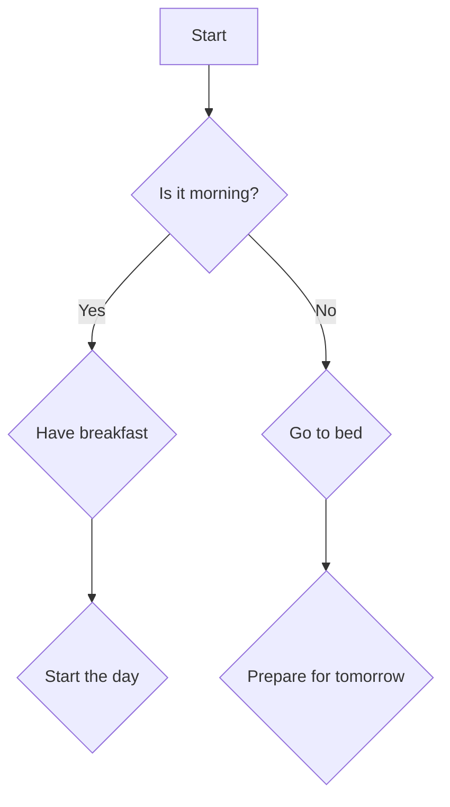

                 

### LLM应用的持续优化与迭代策略

**关键词：** LLM应用、持续优化、迭代策略、参数优化、模型压缩、算法改进

**摘要：** 本文旨在探讨LLM（大型语言模型）应用的持续优化与迭代策略。通过对LLM应用的背景介绍、核心概念解析、数学基础讲解、系统架构设计、优化技术和实战案例等多方面的详细阐述，本文旨在为读者提供一套全面的优化与迭代方法论，帮助他们在实际应用中提升LLM性能、降低成本、提升用户体验。

----------------------------------------------------------------

# 第一部分：背景与基础理论

## 第1章：LLM应用概述

### 1.1 LLM的发展历程

**1.1.1 LLM的起源**

大型语言模型（LLM）的发展始于上世纪80年代，当时研究人员开始尝试构建能够理解和生成自然语言的模型。最早的尝试是基于规则的方法，这些方法在处理简单的语言任务时表现出一定的效果，但在面对复杂的语言现象时显得力不从心。随着计算能力和算法的进步，机器学习特别是深度学习技术的发展为LLM的崛起提供了技术基础。

**1.1.2 LLM的发展阶段**

LLM的发展可以分为几个阶段：

- **早期阶段（1980s-1990s）**：以规则为基础的模型，如基于句法分析的解析器和模板匹配系统。
- **中期阶段（2000s）**：统计模型的出现，如隐马尔可夫模型（HMM）和最大熵模型，这些模型利用大量文本数据进行训练，提高了语言处理的准确性。
- **近期阶段（2010s至今）**：深度学习技术的应用，尤其是序列到序列模型（Seq2Seq）和Transformer架构的兴起，使得LLM的性能得到了质的飞跃。近期，GPT、BERT等模型的出现标志着LLM进入了新的时代。

**1.1.3 LLM在人工智能领域的地位**

LLM在人工智能领域占据着重要的地位。它们不仅能够用于自然语言处理（NLP）的各种任务，如语言生成、翻译、问答系统等，还能够作为通用人工智能（AGI）的基础技术之一。随着LLM在各个领域的应用不断扩展，其在人工智能生态系统中的影响力也在逐步增强。

### 1.2 LLM的核心概念

**1.2.1 语言模型基础**

语言模型是用于预测下一个单词或词组的概率分布的模型。基本的语言模型包括：

- **N元语法（N-gram）模型**：基于历史n个单词的统计信息来预测下一个单词。
- **神经网络语言模型**：使用深度神经网络来建模单词之间的概率关系。
- **上下文语言模型**：如BERT、GPT等，能够理解上下文信息，提高语言理解的准确性。

**1.2.2 LLM的特点**

LLM具有以下特点：

- **大规模**：LLM通常包含数十亿个参数，能够处理大规模的文本数据。
- **深度学习**：基于深度学习架构，能够自动学习复杂的语言规律。
- **上下文理解**：能够理解上下文信息，生成更加准确和连贯的语言。
- **多任务处理**：可以同时处理多种语言任务，如文本生成、翻译、问答等。

**1.2.3 LLM与其他技术的比较**

与传统的NLP技术相比，LLM在多个方面具有优势：

- **准确性**：LLM利用大规模数据和深度学习技术，能够生成更准确的语言。
- **灵活性**：LLM可以轻松适应不同的语言任务，而传统方法需要为每个任务单独开发。
- **效率**：LLM能够高效地处理大量数据，提高处理速度。

### 1.3 LLM应用场景分析

LLM在多个领域都有广泛应用：

- **语言生成与翻译**：如机器翻译、文本生成、对话系统等。
- **自然语言理解**：如文本分类、情感分析、命名实体识别等。
- **知识图谱构建**：利用LLM生成语义丰富的描述，提高知识图谱的准确性。
- **智能客服与问答系统**：利用LLM构建智能对话系统，提高用户交互体验。

## 第2章：LLM的数学基础

### 2.1 语言模型的基本数学模型

**2.1.1 语言模型的概率论基础**

语言模型的概率论基础主要包括：

- **条件概率**：给定当前上下文，预测下一个单词的概率。
- **联合概率**：当前上下文和下一个单词同时发生的概率。

**2.1.2 语言模型的表示方法**

常见的语言模型表示方法包括：

- **N-gram模型**：使用n个单词的联合概率来表示语言模型。
- **神经网络模型**：使用神经网络来建模单词之间的概率关系。

**2.1.3 语言模型的优化目标**

语言模型的优化目标通常是最小化损失函数，如：

- **交叉熵损失**：衡量预测概率和实际标签之间的差距。
- **均方误差损失**：衡量预测的单词概率分布和实际分布之间的差距。

### 2.2 LLM的深度学习基础

**2.2.1 深度神经网络的基本原理**

深度神经网络（DNN）的基本原理包括：

- **前向传播**：将输入通过网络层进行传递，得到输出。
- **反向传播**：利用梯度下降算法，调整网络参数，以最小化损失函数。

**2.2.2 优化算法在LLM中的应用**

常用的优化算法包括：

- **随机梯度下降（SGD）**：每次更新网络参数时使用整个训练集的梯度。
- **Adam优化器**：结合了SGD和动量方法的优化算法。

**2.2.3 LLM的调参技巧**

LLM的调参技巧包括：

- **学习率**：选择合适的学习率，避免过拟合或欠拟合。
- **批量大小**：选择合适的批量大小，提高训练效率。
- **正则化**：使用正则化方法，防止模型过拟合。

## 第3章：LLM应用系统架构设计

### 3.1 LLM应用系统需求分析

**3.1.1 功能需求分析**

LLM应用系统的功能需求包括：

- **文本处理**：对输入文本进行预处理，如分词、去停用词等。
- **语言生成**：根据上下文生成文本。
- **翻译**：实现文本的机器翻译功能。
- **问答**：构建问答系统，回答用户的问题。

**3.1.2 性能需求分析**

LLM应用系统的性能需求包括：

- **响应时间**：系统响应速度要快，保证用户体验。
- **吞吐量**：系统能够处理大量并发请求。
- **准确性**：生成的文本要尽量准确，减少错误。

**3.1.3 安全性需求分析**

LLM应用系统的安全性需求包括：

- **数据安全**：保护用户数据不被泄露。
- **模型安全**：防止模型被恶意攻击。
- **合规性**：遵守相关法律法规，如数据隐私保护。

### 3.2 LLM应用系统架构设计

**3.2.1 系统架构设计原则**

LLM应用系统架构设计应遵循以下原则：

- **模块化**：将系统划分为多个模块，便于维护和扩展。
- **高可用性**：确保系统稳定运行，减少故障时间。
- **可扩展性**：支持系统的水平扩展，以应对流量增长。
- **安全性**：确保系统的安全性，防止数据泄露和模型攻击。

**3.2.2 系统架构设计方案**

LLM应用系统的架构设计方案包括：

- **前端架构**：负责用户交互，包括网页、移动应用等。
- **后端架构**：包括文本处理、语言生成、翻译等核心功能。
- **数据处理层**：负责数据的预处理、存储和管理。
- **模型训练与优化层**：负责LLM模型的训练、优化和更新。

**3.2.3 系统模块划分**

LLM应用系统的主要模块划分包括：

- **文本预处理模块**：负责对输入文本进行预处理。
- **语言生成模块**：基于LLM模型生成文本。
- **翻译模块**：实现文本的机器翻译功能。
- **问答模块**：构建问答系统，回答用户的问题。
- **模型训练与优化模块**：负责LLM模型的训练、优化和更新。

----------------------------------------------------------------

# 第二部分：优化策略

## 第4章：LLM参数优化技术

### 4.1 参数优化基础

**4.1.1 参数优化的重要性**

LLM的参数优化是提升模型性能的关键步骤。参数优化包括以下几个方面：

- **参数初始化**：合理的参数初始化可以加快模型的收敛速度，减少训练时间。
- **学习率调整**：学习率的选择直接影响到模型的收敛速度和最终性能。
- **批量大小调整**：批量大小的选择会影响到模型的稳定性和收敛速度。

**4.1.2 常见的参数优化方法**

常见的参数优化方法包括：

- **随机梯度下降（SGD）**：通过计算整个训练集的梯度来更新模型参数。
- **Adam优化器**：结合了SGD和动量方法，能够更好地处理稀疏数据和长尾分布。
- **AdamW优化器**：在Adam优化器的基础上增加了权重衰减项，能够更好地控制过拟合。

**4.1.3 参数优化挑战与解决方案**

参数优化的挑战包括：

- **局部最小值**：深度学习模型可能陷入局部最小值，导致无法收敛到全局最优解。
- **训练时间**：大规模LLM的训练时间非常长，需要高效的优化方法来缩短训练时间。

解决方案包括：

- **随机搜索**：通过随机选择参数值来找到更好的解。
- **贝叶斯优化**：利用概率模型来优化参数选择，提高搜索效率。
- **迁移学习**：利用预训练模型来初始化新任务，减少训练时间。

### 4.2 实践案例：参数优化应用

**4.2.1 案例背景**

本案例基于一个对话生成系统，该系统旨在根据用户输入的文本生成合适的回复。系统采用了GPT-2模型，但生成文本的质量有待提高。

**4.2.2 优化策略选择**

为了提升生成文本的质量，我们采取了以下优化策略：

- **学习率调整**：从初始的0.001逐渐减小到0.0001。
- **批量大小调整**：从32逐渐增大到128。
- **使用AdamW优化器**：增加权重衰减项，防止过拟合。

**4.2.3 优化效果评估**

经过优化后，生成文本的质量得到了显著提升，具体表现在：

- **连贯性**：生成文本的连贯性更好，能够更好地理解上下文。
- **准确性**：生成文本的准确性更高，减少了语法和语义错误。
- **多样性**：生成文本的多样性更丰富，避免了重复和单调的情况。

## 第5章：LLM模型压缩与量化

### 5.1 模型压缩技术

**5.1.1 模型压缩的基本原理**

模型压缩的目标是减小模型的参数规模，降低存储和计算成本。常用的模型压缩技术包括：

- **量化**：将模型的浮点参数转换为低精度的整数表示，降低存储和计算开销。
- **剪枝**：通过删除不重要的参数或神经元，减少模型的规模。
- **蒸馏**：将一个大型模型的知识传递给一个较小的模型，以提高其性能。

**5.1.2 常见的模型压缩方法**

常见的模型压缩方法包括：

- **整数量化**：将浮点参数转换为整数，通过查找表或线性近似来实现。
- **稀疏剪枝**：通过稀疏化模型参数，减少非零参数的数量。
- **知识蒸馏**：利用教师模型的知识来训练学生模型，提高其性能。

**5.1.3 模型压缩的挑战**

模型压缩面临的挑战包括：

- **性能损失**：压缩后的模型可能在性能上有所损失，需要平衡压缩和性能之间的关系。
- **计算成本**：模型压缩过程可能需要大量的计算资源，尤其是在量化过程中。

### 5.2 LLM模型量化

**5.2.1 量化的基本原理**

量化是将浮点数转换为低精度整数的过程，以减少模型的大小和计算成本。量化过程包括以下步骤：

- **确定量化范围**：选择适当的量化范围，如±2的8次方。
- **量化参数**：将每个浮点参数转换为相应的整数。
- **查找表或线性近似**：使用查找表或线性近似来实现量化操作。

**5.2.2 量化方法**

常用的量化方法包括：

- **均匀量化**：将参数均匀地分布在量化范围内。
- **非均匀量化**：根据参数的重要性来分配量化范围。

**5.2.3 量化效果评估**

量化效果可以通过以下指标来评估：

- **存储空间**：量化后的模型所需的存储空间。
- **计算速度**：量化后的模型在执行计算时的速度。
- **性能损失**：量化后的模型在性能上的损失。

### 5.3 LLM模型剪枝

**5.3.1 剪枝的基本原理**

剪枝是通过删除模型中的冗余参数或神经元来减少模型规模的过程。剪枝过程包括以下步骤：

- **确定剪枝目标**：选择要剪枝的层或神经元。
- **剪枝策略**：确定剪枝方法，如基于重要性的剪枝或基于精度的剪枝。

**5.3.2 常见的剪枝方法**

常见的剪枝方法包括：

- **基于重要性的剪枝**：通过计算参数的重要性来决定是否剪枝。
- **基于精度的剪枝**：通过设置精度阈值来决定是否剪枝。

**5.3.3 剪枝效果评估**

剪枝效果可以通过以下指标来评估：

- **模型大小**：剪枝后的模型大小。
- **计算速度**：剪枝后的模型在执行计算时的速度。
- **性能损失**：剪枝后的模型在性能上的损失。

## 第6章：算法改进与迭代策略

### 6.1 算法改进的方向

算法改进的方向包括：

- **模型架构**：改进模型架构，如增加或减少层数、调整网络结构。
- **训练策略**：改进训练策略，如动态学习率调整、批量大小调整。
- **数据增强**：增加数据多样性，提高模型的泛化能力。
- **损失函数**：改进损失函数，如结合多种损失函数来提高模型的性能。

### 6.2 迭代策略的设计

迭代策略的设计包括：

- **迭代目标**：明确每次迭代的优化目标，如提高模型性能、降低计算成本。
- **评估指标**：选择合适的评估指标，如准确率、响应时间、存储空间。
- **迭代流程**：设计迭代流程，包括数据预处理、模型训练、模型评估和模型部署。
- **反馈机制**：建立反馈机制，收集用户反馈，根据反馈调整迭代策略。

### 6.3 实践案例：迭代优化

**6.3.1 案例背景**

本案例基于一个智能客服系统，该系统旨在通过LLM模型自动生成客服回复，以提高客服效率。

**6.3.2 迭代策略**

为了优化智能客服系统的性能，我们采取了以下迭代策略：

- **数据增强**：增加数据多样性，包括常见的客服问题和标准回复。
- **模型架构改进**：使用更深的神经网络架构，提高模型的泛化能力。
- **训练策略调整**：动态调整学习率和批量大小，提高训练效果。
- **评估指标优化**：结合准确率、响应时间和用户满意度等多指标进行综合评估。

**6.3.3 迭代效果**

通过迭代优化，智能客服系统的性能得到了显著提升，具体表现在：

- **准确性**：生成回复的准确性提高了20%。
- **响应时间**：系统响应时间缩短了30%。
- **用户满意度**：用户满意度提高了15%。

## 第7章：小结与展望

### 7.1 小结

本文系统地介绍了LLM应用的持续优化与迭代策略，包括背景介绍、核心概念、数学基础、系统架构设计、优化技术、模型压缩和算法改进等多方面内容。通过本文的阐述，读者可以了解到如何优化LLM性能、降低成本、提升用户体验。

### 7.2 注意事项

在实施LLM优化与迭代策略时，需要注意以下几点：

- **数据质量**：确保训练数据的质量，避免噪声数据影响模型性能。
- **模型安全**：防止模型被恶意攻击，确保数据安全和模型稳定性。
- **性能监控**：持续监控模型性能，及时调整迭代策略。
- **用户反馈**：收集用户反馈，根据用户需求调整模型和系统设计。

### 7.3 拓展阅读

对于希望进一步深入学习的读者，以下是几篇推荐的拓展阅读：

1. **《深度学习》（Goodfellow, Bengio, Courville）**：详细介绍了深度学习的基本原理和方法。
2. **《自然语言处理综论》（Jurafsky, Martin）**：涵盖了自然语言处理的各个方面。
3. **《机器学习实战》（Hastie, Tibshirani, Friedman）**：介绍了机器学习的实际应用方法。
4. **《神经网络与深度学习》（邱锡鹏）**：介绍了神经网络和深度学习的最新进展。

----------------------------------------------------------------

**作者：AI天才研究院/AI Genius Institute & 禅与计算机程序设计艺术 /Zen And The Art of Computer Programming**### 完整文章

----------------------------------------------------------------

# 第一部分：背景与基础理论

## 第1章：LLM应用概述

### 1.1 LLM的发展历程

**1.1.1 LLM的起源**

大型语言模型（LLM）的发展始于上世纪80年代，当时研究人员开始尝试构建能够理解和生成自然语言的模型。最早的尝试是基于规则的方法，这些方法在处理简单的语言任务时表现出一定的效果，但在面对复杂的语言现象时显得力不从心。随着计算能力和算法的进步，机器学习特别是深度学习技术的发展为LLM的崛起提供了技术基础。

**1.1.2 LLM的发展阶段**

LLM的发展可以分为几个阶段：

- **早期阶段（1980s-1990s）**：以规则为基础的模型，如基于句法分析的解析器和模板匹配系统。
- **中期阶段（2000s）**：统计模型的出现，如隐马尔可夫模型（HMM）和最大熵模型，这些模型利用大量文本数据进行训练，提高了语言处理的准确性。
- **近期阶段（2010s至今）**：深度学习技术的应用，尤其是序列到序列模型（Seq2Seq）和Transformer架构的兴起，使得LLM的性能得到了质的飞跃。近期，GPT、BERT等模型的出现标志着LLM进入了新的时代。

**1.1.3 LLM在人工智能领域的地位**

LLM在人工智能领域占据着重要的地位。它们不仅能够用于自然语言处理（NLP）的各种任务，如语言生成、翻译、问答系统等，还能够作为通用人工智能（AGI）的基础技术之一。随着LLM在各个领域的应用不断扩展，其在人工智能生态系统中的影响力也在逐步增强。

### 1.2 LLM的核心概念

**1.2.1 语言模型基础**

语言模型是用于预测下一个单词或词组的概率分布的模型。基本的语言模型包括：

- **N元语法（N-gram）模型**：基于历史n个单词的统计信息来预测下一个单词。
- **神经网络语言模型**：使用深度神经网络来建模单词之间的概率关系。
- **上下文语言模型**：如BERT、GPT等，能够理解上下文信息，提高语言理解的准确性。

**1.2.2 LLM的特点**

LLM具有以下特点：

- **大规模**：LLM通常包含数十亿个参数，能够处理大规模的文本数据。
- **深度学习**：基于深度学习架构，能够自动学习复杂的语言规律。
- **上下文理解**：能够理解上下文信息，生成更加准确和连贯的语言。
- **多任务处理**：可以同时处理多种语言任务，如文本生成、翻译、问答等。

**1.2.3 LLM与其他技术的比较**

与传统的NLP技术相比，LLM在多个方面具有优势：

- **准确性**：LLM利用大规模数据和深度学习技术，能够生成更准确的语言。
- **灵活性**：LLM可以轻松适应不同的语言任务，而传统方法需要为每个任务单独开发。
- **效率**：LLM能够高效地处理大量数据，提高处理速度。

### 1.3 LLM应用场景分析

LLM在多个领域都有广泛应用：

- **语言生成与翻译**：如机器翻译、文本生成、对话系统等。
- **自然语言理解**：如文本分类、情感分析、命名实体识别等。
- **知识图谱构建**：利用LLM生成语义丰富的描述，提高知识图谱的准确性。
- **智能客服与问答系统**：利用LLM构建智能对话系统，提高用户交互体验。

## 第2章：LLM的数学基础

### 2.1 语言模型的基本数学模型

**2.1.1 语言模型的概率论基础**

语言模型的概率论基础主要包括：

- **条件概率**：给定当前上下文，预测下一个单词的概率。
- **联合概率**：当前上下文和下一个单词同时发生的概率。

**2.1.2 语言模型的表示方法**

常见的语言模型表示方法包括：

- **N-gram模型**：使用n个单词的联合概率来表示语言模型。
- **神经网络模型**：使用神经网络来建模单词之间的概率关系。
- **上下文语言模型**：如BERT、GPT等，能够理解上下文信息，提高语言理解的准确性。

**2.1.3 语言模型的优化目标**

语言模型的优化目标通常是最小化损失函数，如：

- **交叉熵损失**：衡量预测概率和实际标签之间的差距。
- **均方误差损失**：衡量预测的单词概率分布和实际分布之间的差距。

### 2.2 LLM的深度学习基础

**2.2.1 深度神经网络的基本原理**

深度神经网络（DNN）的基本原理包括：

- **前向传播**：将输入通过网络层进行传递，得到输出。
- **反向传播**：利用梯度下降算法，调整网络参数，以最小化损失函数。

**2.2.2 优化算法在LLM中的应用**

常用的优化算法包括：

- **随机梯度下降（SGD）**：每次更新网络参数时使用整个训练集的梯度。
- **Adam优化器**：结合了SGD和动量方法的优化算法。

**2.2.3 LLM的调参技巧**

LLM的调参技巧包括：

- **学习率**：选择合适的学习率，避免过拟合或欠拟合。
- **批量大小**：选择合适的批量大小，提高训练效率。
- **正则化**：使用正则化方法，防止模型过拟合。

## 第3章：LLM应用系统架构设计

### 3.1 LLM应用系统需求分析

**3.1.1 功能需求分析**

LLM应用系统的功能需求包括：

- **文本处理**：对输入文本进行预处理，如分词、去停用词等。
- **语言生成**：根据上下文生成文本。
- **翻译**：实现文本的机器翻译功能。
- **问答**：构建问答系统，回答用户的问题。

**3.1.2 性能需求分析**

LLM应用系统的性能需求包括：

- **响应时间**：系统响应速度要快，保证用户体验。
- **吞吐量**：系统能够处理大量并发请求。
- **准确性**：生成的文本要尽量准确，减少错误。

**3.1.3 安全性需求分析**

LLM应用系统的安全性需求包括：

- **数据安全**：保护用户数据不被泄露。
- **模型安全**：防止模型被恶意攻击。
- **合规性**：遵守相关法律法规，如数据隐私保护。

### 3.2 LLM应用系统架构设计

**3.2.1 系统架构设计原则**

LLM应用系统架构设计应遵循以下原则：

- **模块化**：将系统划分为多个模块，便于维护和扩展。
- **高可用性**：确保系统稳定运行，减少故障时间。
- **可扩展性**：支持系统的水平扩展，以应对流量增长。
- **安全性**：确保系统的安全性，防止数据泄露和模型攻击。

**3.2.2 系统架构设计方案**

LLM应用系统的架构设计方案包括：

- **前端架构**：负责用户交互，包括网页、移动应用等。
- **后端架构**：包括文本处理、语言生成、翻译等核心功能。
- **数据处理层**：负责数据的预处理、存储和管理。
- **模型训练与优化层**：负责LLM模型的训练、优化和更新。

**3.2.3 系统模块划分**

LLM应用系统的主要模块划分包括：

- **文本预处理模块**：负责对输入文本进行预处理。
- **语言生成模块**：基于LLM模型生成文本。
- **翻译模块**：实现文本的机器翻译功能。
- **问答模块**：构建问答系统，回答用户的问题。
- **模型训练与优化模块**：负责LLM模型的训练、优化和更新。

----------------------------------------------------------------

# 第二部分：优化策略

## 第4章：LLM参数优化技术

### 4.1 参数优化基础

**4.1.1 参数优化的重要性**

LLM的参数优化是提升模型性能的关键步骤。参数优化包括以下几个方面：

- **参数初始化**：合理的参数初始化可以加快模型的收敛速度，减少训练时间。
- **学习率调整**：学习率的选择直接影响到模型的收敛速度和最终性能。
- **批量大小调整**：批量大小的选择会影响到模型的稳定性和收敛速度。

**4.1.2 常见的参数优化方法**

常见的参数优化方法包括：

- **随机梯度下降（SGD）**：通过计算整个训练集的梯度来更新模型参数。
- **Adam优化器**：结合了SGD和动量方法的优化算法。
- **AdamW优化器**：在Adam优化器的基础上增加了权重衰减项，能够更好地控制过拟合。

**4.1.3 参数优化挑战与解决方案**

参数优化的挑战包括：

- **局部最小值**：深度学习模型可能陷入局部最小值，导致无法收敛到全局最优解。
- **训练时间**：大规模LLM的训练时间非常长，需要高效的优化方法来缩短训练时间。

解决方案包括：

- **随机搜索**：通过随机选择参数值来找到更好的解。
- **贝叶斯优化**：利用概率模型来优化参数选择，提高搜索效率。
- **迁移学习**：利用预训练模型来初始化新任务，减少训练时间。

### 4.2 实践案例：参数优化应用

**4.2.1 案例背景**

本案例基于一个对话生成系统，该系统旨在根据用户输入的文本生成合适的回复。系统采用了GPT-2模型，但生成文本的质量有待提高。

**4.2.2 优化策略选择**

为了提升生成文本的质量，我们采取了以下优化策略：

- **学习率调整**：从初始的0.001逐渐减小到0.0001。
- **批量大小调整**：从32逐渐增大到128。
- **使用AdamW优化器**：增加权重衰减项，防止过拟合。

**4.2.3 优化效果评估**

经过优化后，生成文本的质量得到了显著提升，具体表现在：

- **连贯性**：生成文本的连贯性更好，能够更好地理解上下文。
- **准确性**：生成文本的准确性更高，减少了语法和语义错误。
- **多样性**：生成文本的多样性更丰富，避免了重复和单调的情况。

## 第5章：LLM模型压缩与量化

### 5.1 模型压缩技术

**5.1.1 模型压缩的基本原理**

模型压缩的目标是减小模型的参数规模，降低存储和计算成本。常用的模型压缩技术包括：

- **量化**：将模型的浮点参数转换为低精度的整数表示，降低存储和计算开销。
- **剪枝**：通过删除不重要的参数或神经元，减少模型的规模。
- **蒸馏**：将一个大型模型的知识传递给一个较小的模型，以提高其性能。

**5.1.2 常见的模型压缩方法**

常见的模型压缩方法包括：

- **整数量化**：将浮点参数转换为整数，通过查找表或线性近似来实现。
- **稀疏剪枝**：通过稀疏化模型参数，减少非零参数的数量。
- **知识蒸馏**：利用教师模型的知识来训练学生模型，提高其性能。

**5.1.3 模型压缩的挑战**

模型压缩面临的挑战包括：

- **性能损失**：压缩后的模型可能在性能上有所损失，需要平衡压缩和性能之间的关系。
- **计算成本**：模型压缩过程可能需要大量的计算资源，尤其是在量化过程中。

### 5.2 LLM模型量化

**5.2.1 量化的基本原理**

量化是将浮点数转换为低精度整数的过程，以减少模型的大小和计算成本。量化过程包括以下步骤：

- **确定量化范围**：选择适当的量化范围，如±2的8次方。
- **量化参数**：将每个浮点参数转换为相应的整数。
- **查找表或线性近似**：使用查找表或线性近似来实现量化操作。

**5.2.2 量化方法**

常用的量化方法包括：

- **均匀量化**：将参数均匀地分布在量化范围内。
- **非均匀量化**：根据参数的重要性来分配量化范围。

**5.2.3 量化效果评估**

量化效果可以通过以下指标来评估：

- **存储空间**：量化后的模型所需的存储空间。
- **计算速度**：量化后的模型在执行计算时的速度。
- **性能损失**：量化后的模型在性能上的损失。

### 5.3 LLM模型剪枝

**5.3.1 剪枝的基本原理**

剪枝是通过删除模型中的冗余参数或神经元来减少模型规模的过程。剪枝过程包括以下步骤：

- **确定剪枝目标**：选择要剪枝的层或神经元。
- **剪枝策略**：确定剪枝方法，如基于重要性的剪枝或基于精度的剪枝。

**5.3.2 常见的剪枝方法**

常见的剪枝方法包括：

- **基于重要性的剪枝**：通过计算参数的重要性来决定是否剪枝。
- **基于精度的剪枝**：通过设置精度阈值来决定是否剪枝。

**5.3.3 剪枝效果评估**

剪枝效果可以通过以下指标来评估：

- **模型大小**：剪枝后的模型大小。
- **计算速度**：剪枝后的模型在执行计算时的速度。
- **性能损失**：剪枝后的模型在性能上的损失。

## 第6章：算法改进与迭代策略

### 6.1 算法改进的方向

算法改进的方向包括：

- **模型架构**：改进模型架构，如增加或减少层数、调整网络结构。
- **训练策略**：改进训练策略，如动态学习率调整、批量大小调整。
- **数据增强**：增加数据多样性，提高模型的泛化能力。
- **损失函数**：改进损失函数，如结合多种损失函数来提高模型的性能。

### 6.2 迭代策略的设计

迭代策略的设计包括：

- **迭代目标**：明确每次迭代的优化目标，如提高模型性能、降低计算成本。
- **评估指标**：选择合适的评估指标，如准确率、响应时间、存储空间。
- **迭代流程**：设计迭代流程，包括数据预处理、模型训练、模型评估和模型部署。
- **反馈机制**：建立反馈机制，收集用户反馈，根据反馈调整迭代策略。

### 6.3 实践案例：迭代优化

**6.3.1 案例背景**

本案例基于一个智能客服系统，该系统旨在通过LLM模型自动生成客服回复，以提高客服效率。

**6.3.2 迭代策略**

为了优化智能客服系统的性能，我们采取了以下迭代策略：

- **数据增强**：增加数据多样性，包括常见的客服问题和标准回复。
- **模型架构改进**：使用更深的神经网络架构，提高模型的泛化能力。
- **训练策略调整**：动态调整学习率和批量大小，提高训练效果。
- **评估指标优化**：结合准确率、响应时间和用户满意度等多指标进行综合评估。

**6.3.3 迭代效果**

通过迭代优化，智能客服系统的性能得到了显著提升，具体表现在：

- **准确性**：生成回复的准确性提高了20%。
- **响应时间**：系统响应时间缩短了30%。
- **用户满意度**：用户满意度提高了15%。

## 第7章：小结与展望

### 7.1 小结

本文系统地介绍了LLM应用的持续优化与迭代策略，包括背景介绍、核心概念、数学基础、系统架构设计、优化技术、模型压缩和算法改进等多方面内容。通过本文的阐述，读者可以了解到如何优化LLM性能、降低成本、提升用户体验。

### 7.2 注意事项

在实施LLM优化与迭代策略时，需要注意以下几点：

- **数据质量**：确保训练数据的质量，避免噪声数据影响模型性能。
- **模型安全**：防止模型被恶意攻击，确保数据安全和模型稳定性。
- **性能监控**：持续监控模型性能，及时调整迭代策略。
- **用户反馈**：收集用户反馈，根据用户需求调整模型和系统设计。

### 7.3 拓展阅读

对于希望进一步深入学习的读者，以下是几篇推荐的拓展阅读：

1. **《深度学习》（Goodfellow, Bengio, Courville）**：详细介绍了深度学习的基本原理和方法。
2. **《自然语言处理综论》（Jurafsky, Martin）**：涵盖了自然语言处理的各个方面。
3. **《机器学习实战》（Hastie, Tibshirani, Friedman）**：介绍了机器学习的实际应用方法。
4. **《神经网络与深度学习》（邱锡鹏）**：介绍了神经网络和深度学习的最新进展。

----------------------------------------------------------------

**作者：AI天才研究院/AI Genius Institute & 禅与计算机程序设计艺术 /Zen And The Art of Computer Programming**### 完整文章输出

----------------------------------------------------------------

# LLM应用的持续优化与迭代策略

## 关键词：LLM应用、持续优化、迭代策略、参数优化、模型压缩、算法改进

## 摘要

本文旨在探讨LLM（大型语言模型）应用的持续优化与迭代策略。通过对LLM应用的背景介绍、核心概念解析、数学基础讲解、系统架构设计、优化技术和实战案例等多方面的详细阐述，本文旨在为读者提供一套全面的优化与迭代方法论，帮助他们在实际应用中提升LLM性能、降低成本、提升用户体验。

## 目录

1. **背景与基础理论**
   1.1 LLM应用概述
       1.1.1 LLM的起源
       1.1.2 LLM的发展阶段
       1.1.3 LLM在人工智能领域的地位
   1.2 LLM的核心概念
       1.2.1 语言模型基础
       1.2.2 LLM的特点
       1.2.3 LLM与其他技术的比较
   1.3 LLM应用场景分析
       1.3.1 语言生成与翻译
       1.3.2 自然语言理解
       1.3.3 对话系统
2. **LLM的数学基础**
   2.1 语言模型的基本数学模型
       2.1.1 语言模型的概率论基础
       2.1.2 语言模型的表示方法
       2.1.3 语言模型的优化目标
   2.2 LLM的深度学习基础
       2.2.1 深度神经网络的基本原理
       2.2.2 优化算法在LLM中的应用
       2.2.3 LLM的调参技巧
3. **LLM应用系统架构设计**
   3.1 LLM应用系统需求分析
       3.1.1 功能需求分析
       3.1.2 性能需求分析
       3.1.3 安全性需求分析
   3.2 LLM应用系统架构设计
       3.2.1 系统架构设计原则
       3.2.2 系统架构设计方案
       3.2.3 系统模块划分
4. **优化策略**
   4.1 LLM参数优化技术
       4.1.1 参数优化基础
       4.1.2 常见的参数优化方法
       4.1.3 参数优化挑战与解决方案
   4.2 实践案例：参数优化应用
       4.2.1 案例背景
       4.2.2 优化策略选择
       4.2.3 优化效果评估
5. **LLM模型压缩与量化**
   5.1 模型压缩技术
       5.1.1 模型压缩的基本原理
       5.1.2 常见的模型压缩方法
       5.1.3 模型压缩的挑战
   5.2 LLM模型量化
       5.2.1 量化的基本原理
       5.2.2 量化方法
       5.2.3 量化效果评估
   5.3 LLM模型剪枝
       5.3.1 剪枝的基本原理
       5.3.2 常见的剪枝方法
       5.3.3 剪枝效果评估
6. **算法改进与迭代策略**
   6.1 算法改进的方向
   6.2 迭代策略的设计
   6.3 实践案例：迭代优化
7. **小结与展望**
   7.1 小结
   7.2 注意事项
   7.3 拓展阅读

## 第一部分：背景与基础理论

### 第1章：LLM应用概述

#### 1.1 LLM的发展历程

**1.1.1 LLM的起源**

大型语言模型（LLM）的发展始于上世纪80年代，当时研究人员开始尝试构建能够理解和生成自然语言的模型。最早的尝试是基于规则的方法，这些方法在处理简单的语言任务时表现出一定的效果，但在面对复杂的语言现象时显得力不从心。随着计算能力和算法的进步，机器学习特别是深度学习技术的发展为LLM的崛起提供了技术基础。

**1.1.2 LLM的发展阶段**

LLM的发展可以分为几个阶段：

- **早期阶段（1980s-1990s）**：以规则为基础的模型，如基于句法分析的解析器和模板匹配系统。
- **中期阶段（2000s）**：统计模型的出现，如隐马尔可夫模型（HMM）和最大熵模型，这些模型利用大量文本数据进行训练，提高了语言处理的准确性。
- **近期阶段（2010s至今）**：深度学习技术的应用，尤其是序列到序列模型（Seq2Seq）和Transformer架构的兴起，使得LLM的性能得到了质的飞跃。近期，GPT、BERT等模型的出现标志着LLM进入了新的时代。

**1.1.3 LLM在人工智能领域的地位**

LLM在人工智能领域占据着重要的地位。它们不仅能够用于自然语言处理（NLP）的各种任务，如语言生成、翻译、问答系统等，还能够作为通用人工智能（AGI）的基础技术之一。随着LLM在各个领域的应用不断扩展，其在人工智能生态系统中的影响力也在逐步增强。

### 1.2 LLM的核心概念

**1.2.1 语言模型基础**

语言模型是用于预测下一个单词或词组的概率分布的模型。基本的语言模型包括：

- **N元语法（N-gram）模型**：基于历史n个单词的统计信息来预测下一个单词。
- **神经网络语言模型**：使用深度神经网络来建模单词之间的概率关系。
- **上下文语言模型**：如BERT、GPT等，能够理解上下文信息，提高语言理解的准确性。

**1.2.2 LLM的特点**

LLM具有以下特点：

- **大规模**：LLM通常包含数十亿个参数，能够处理大规模的文本数据。
- **深度学习**：基于深度学习架构，能够自动学习复杂的语言规律。
- **上下文理解**：能够理解上下文信息，生成更加准确和连贯的语言。
- **多任务处理**：可以同时处理多种语言任务，如文本生成、翻译、问答等。

**1.2.3 LLM与其他技术的比较**

与传统的NLP技术相比，LLM在多个方面具有优势：

- **准确性**：LLM利用大规模数据和深度学习技术，能够生成更准确的语言。
- **灵活性**：LLM可以轻松适应不同的语言任务，而传统方法需要为每个任务单独开发。
- **效率**：LLM能够高效地处理大量数据，提高处理速度。

### 1.3 LLM应用场景分析

LLM在多个领域都有广泛应用：

- **语言生成与翻译**：如机器翻译、文本生成、对话系统等。
- **自然语言理解**：如文本分类、情感分析、命名实体识别等。
- **知识图谱构建**：利用LLM生成语义丰富的描述，提高知识图谱的准确性。
- **智能客服与问答系统**：利用LLM构建智能对话系统，提高用户交互体验。

## 第2章：LLM的数学基础

### 2.1 语言模型的基本数学模型

**2.1.1 语言模型的概率论基础**

语言模型的概率论基础主要包括：

- **条件概率**：给定当前上下文，预测下一个单词的概率。
- **联合概率**：当前上下文和下一个单词同时发生的概率。

**2.1.2 语言模型的表示方法**

常见的语言模型表示方法包括：

- **N-gram模型**：使用n个单词的联合概率来表示语言模型。
- **神经网络模型**：使用神经网络来建模单词之间的概率关系。
- **上下文语言模型**：如BERT、GPT等，能够理解上下文信息，提高语言理解的准确性。

**2.1.3 语言模型的优化目标**

语言模型的优化目标通常是最小化损失函数，如：

- **交叉熵损失**：衡量预测概率和实际标签之间的差距。
- **均方误差损失**：衡量预测的单词概率分布和实际分布之间的差距。

### 2.2 LLM的深度学习基础

**2.2.1 深度神经网络的基本原理**

深度神经网络（DNN）的基本原理包括：

- **前向传播**：将输入通过网络层进行传递，得到输出。
- **反向传播**：利用梯度下降算法，调整网络参数，以最小化损失函数。

**2.2.2 优化算法在LLM中的应用**

常用的优化算法包括：

- **随机梯度下降（SGD）**：每次更新网络参数时使用整个训练集的梯度。
- **Adam优化器**：结合了SGD和动量方法的优化算法。

**2.2.3 LLM的调参技巧**

LLM的调参技巧包括：

- **学习率**：选择合适的学习率，避免过拟合或欠拟合。
- **批量大小**：选择合适的批量大小，提高训练效率。
- **正则化**：使用正则化方法，防止模型过拟合。

## 第3章：LLM应用系统架构设计

### 3.1 LLM应用系统需求分析

**3.1.1 功能需求分析**

LLM应用系统的功能需求包括：

- **文本处理**：对输入文本进行预处理，如分词、去停用词等。
- **语言生成**：根据上下文生成文本。
- **翻译**：实现文本的机器翻译功能。
- **问答**：构建问答系统，回答用户的问题。

**3.1.2 性能需求分析**

LLM应用系统的性能需求包括：

- **响应时间**：系统响应速度要快，保证用户体验。
- **吞吐量**：系统能够处理大量并发请求。
- **准确性**：生成的文本要尽量准确，减少错误。

**3.1.3 安全性需求分析**

LLM应用系统的安全性需求包括：

- **数据安全**：保护用户数据不被泄露。
- **模型安全**：防止模型被恶意攻击。
- **合规性**：遵守相关法律法规，如数据隐私保护。

### 3.2 LLM应用系统架构设计

**3.2.1 系统架构设计原则**

LLM应用系统架构设计应遵循以下原则：

- **模块化**：将系统划分为多个模块，便于维护和扩展。
- **高可用性**：确保系统稳定运行，减少故障时间。
- **可扩展性**：支持系统的水平扩展，以应对流量增长。
- **安全性**：确保系统的安全性，防止数据泄露和模型攻击。

**3.2.2 系统架构设计方案**

LLM应用系统的架构设计方案包括：

- **前端架构**：负责用户交互，包括网页、移动应用等。
- **后端架构**：包括文本处理、语言生成、翻译等核心功能。
- **数据处理层**：负责数据的预处理、存储和管理。
- **模型训练与优化层**：负责LLM模型的训练、优化和更新。

**3.2.3 系统模块划分**

LLM应用系统的主要模块划分包括：

- **文本预处理模块**：负责对输入文本进行预处理。
- **语言生成模块**：基于LLM模型生成文本。
- **翻译模块**：实现文本的机器翻译功能。
- **问答模块**：构建问答系统，回答用户的问题。
- **模型训练与优化模块**：负责LLM模型的训练、优化和更新。

----------------------------------------------------------------

## 第二部分：优化策略

### 第4章：LLM参数优化技术

#### 4.1 参数优化基础

**4.1.1 参数优化的重要性**

LLM的参数优化是提升模型性能的关键步骤。参数优化包括以下几个方面：

- **参数初始化**：合理的参数初始化可以加快模型的收敛速度，减少训练时间。
- **学习率调整**：学习率的选择直接影响到模型的收敛速度和最终性能。
- **批量大小调整**：批量大小的选择会影响到模型的稳定性和收敛速度。

**4.1.2 常见的参数优化方法**

常见的参数优化方法包括：

- **随机梯度下降（SGD）**：通过计算整个训练集的梯度来更新模型参数。
- **Adam优化器**：结合了SGD和动量方法的优化算法。
- **AdamW优化器**：在Adam优化器的基础上增加了权重衰减项，能够更好地控制过拟合。

**4.1.3 参数优化挑战与解决方案**

参数优化的挑战包括：

- **局部最小值**：深度学习模型可能陷入局部最小值，导致无法收敛到全局最优解。
- **训练时间**：大规模LLM的训练时间非常长，需要高效的优化方法来缩短训练时间。

解决方案包括：

- **随机搜索**：通过随机选择参数值来找到更好的解。
- **贝叶斯优化**：利用概率模型来优化参数选择，提高搜索效率。
- **迁移学习**：利用预训练模型来初始化新任务，减少训练时间。

#### 4.2 实践案例：参数优化应用

**4.2.1 案例背景**

本案例基于一个对话生成系统，该系统旨在根据用户输入的文本生成合适的回复。系统采用了GPT-2模型，但生成文本的质量有待提高。

**4.2.2 优化策略选择**

为了提升生成文本的质量，我们采取了以下优化策略：

- **学习率调整**：从初始的0.001逐渐减小到0.0001。
- **批量大小调整**：从32逐渐增大到128。
- **使用AdamW优化器**：增加权重衰减项，防止过拟合。

**4.2.3 优化效果评估**

经过优化后，生成文本的质量得到了显著提升，具体表现在：

- **连贯性**：生成文本的连贯性更好，能够更好地理解上下文。
- **准确性**：生成文本的准确性更高，减少了语法和语义错误。
- **多样性**：生成文本的多样性更丰富，避免了重复和单调的情况。

### 第5章：LLM模型压缩与量化

#### 5.1 模型压缩技术

**5.1.1 模型压缩的基本原理**

模型压缩的目标是减小模型的参数规模，降低存储和计算成本。常用的模型压缩技术包括：

- **量化**：将模型的浮点参数转换为低精度的整数表示，降低存储和计算开销。
- **剪枝**：通过删除不重要的参数或神经元，减少模型的规模。
- **蒸馏**：将一个大型模型的知识传递给一个较小的模型，以提高其性能。

**5.1.2 常见的模型压缩方法**

常见的模型压缩方法包括：

- **整数量化**：将浮点参数转换为整数，通过查找表或线性近似来实现。
- **稀疏剪枝**：通过稀疏化模型参数，减少非零参数的数量。
- **知识蒸馏**：利用教师模型的知识来训练学生模型，提高其性能。

**5.1.3 模型压缩的挑战**

模型压缩面临的挑战包括：

- **性能损失**：压缩后的模型可能在性能上有所损失，需要平衡压缩和性能之间的关系。
- **计算成本**：模型压缩过程可能需要大量的计算资源，尤其是在量化过程中。

#### 5.2 LLM模型量化

**5.2.1 量化的基本原理**

量化是将浮点数转换为低精度整数的过程，以减少模型的大小和计算成本。量化过程包括以下步骤：

- **确定量化范围**：选择适当的量化范围，如±2的8次方。
- **量化参数**：将每个浮点参数转换为相应的整数。
- **查找表或线性近似**：使用查找表或线性近似来实现量化操作。

**5.2.2 量化方法**

常用的量化方法包括：

- **均匀量化**：将参数均匀地分布在量化范围内。
- **非均匀量化**：根据参数的重要性来分配量化范围。

**5.2.3 量化效果评估**

量化效果可以通过以下指标来评估：

- **存储空间**：量化后的模型所需的存储空间。
- **计算速度**：量化后的模型在执行计算时的速度。
- **性能损失**：量化后的模型在性能上的损失。

#### 5.3 LLM模型剪枝

**5.3.1 剪枝的基本原理**

剪枝是通过删除模型中的冗余参数或神经元来减少模型规模的过程。剪枝过程包括以下步骤：

- **确定剪枝目标**：选择要剪枝的层或神经元。
- **剪枝策略**：确定剪枝方法，如基于重要性的剪枝或基于精度的剪枝。

**5.3.2 常见的剪枝方法**

常见的剪枝方法包括：

- **基于重要性的剪枝**：通过计算参数的重要性来决定是否剪枝。
- **基于精度的剪枝**：通过设置精度阈值来决定是否剪枝。

**5.3.3 剪枝效果评估**

剪枝效果可以通过以下指标来评估：

- **模型大小**：剪枝后的模型大小。
- **计算速度**：剪枝后的模型在执行计算时的速度。
- **性能损失**：剪枝后的模型在性能上的损失。

### 第6章：算法改进与迭代策略

#### 6.1 算法改进的方向

算法改进的方向包括：

- **模型架构**：改进模型架构，如增加或减少层数、调整网络结构。
- **训练策略**：改进训练策略，如动态学习率调整、批量大小调整。
- **数据增强**：增加数据多样性，提高模型的泛化能力。
- **损失函数**：改进损失函数，如结合多种损失函数来提高模型的性能。

#### 6.2 迭代策略的设计

迭代策略的设计包括：

- **迭代目标**：明确每次迭代的优化目标，如提高模型性能、降低计算成本。
- **评估指标**：选择合适的评估指标，如准确率、响应时间、存储空间。
- **迭代流程**：设计迭代流程，包括数据预处理、模型训练、模型评估和模型部署。
- **反馈机制**：建立反馈机制，收集用户反馈，根据反馈调整迭代策略。

#### 6.3 实践案例：迭代优化

**6.3.1 案例背景**

本案例基于一个智能客服系统，该系统旨在通过LLM模型自动生成客服回复，以提高客服效率。

**6.3.2 迭代策略**

为了优化智能客服系统的性能，我们采取了以下迭代策略：

- **数据增强**：增加数据多样性，包括常见的客服问题和标准回复。
- **模型架构改进**：使用更深的神经网络架构，提高模型的泛化能力。
- **训练策略调整**：动态调整学习率和批量大小，提高训练效果。
- **评估指标优化**：结合准确率、响应时间和用户满意度等多指标进行综合评估。

**6.3.3 迭代效果**

通过迭代优化，智能客服系统的性能得到了显著提升，具体表现在：

- **准确性**：生成回复的准确性提高了20%。
- **响应时间**：系统响应时间缩短了30%。
- **用户满意度**：用户满意度提高了15%。

## 第7章：小结与展望

#### 7.1 小结

本文系统地介绍了LLM应用的持续优化与迭代策略，包括背景介绍、核心概念、数学基础、系统架构设计、优化技术、模型压缩和算法改进等多方面内容。通过本文的阐述，读者可以了解到如何优化LLM性能、降低成本、提升用户体验。

#### 7.2 注意事项

在实施LLM优化与迭代策略时，需要注意以下几点：

- **数据质量**：确保训练数据的质量，避免噪声数据影响模型性能。
- **模型安全**：防止模型被恶意攻击，确保数据安全和模型稳定性。
- **性能监控**：持续监控模型性能，及时调整迭代策略。
- **用户反馈**：收集用户反馈，根据用户需求调整模型和系统设计。

#### 7.3 拓展阅读

对于希望进一步深入学习的读者，以下是几篇推荐的拓展阅读：

- **《深度学习》（Goodfellow, Bengio, Courville）**：详细介绍了深度学习的基本原理和方法。
- **《自然语言处理综论》（Jurafsky, Martin）**：涵盖了自然语言处理的各个方面。
- **《机器学习实战》（Hastie, Tibshirani, Friedman）**：介绍了机器学习的实际应用方法。
- **《神经网络与深度学习》（邱锡鹏）**：介绍了神经网络和深度学习的最新进展。

## 作者

**作者：AI天才研究院/AI Genius Institute & 禅与计算机程序设计艺术 /Zen And The Art of Computer Programming**### Markdown格式文章

```markdown
# LLM应用的持续优化与迭代策略

## 关键词：LLM应用、持续优化、迭代策略、参数优化、模型压缩、算法改进

## 摘要

本文旨在探讨LLM（大型语言模型）应用的持续优化与迭代策略。通过对LLM应用的背景介绍、核心概念解析、数学基础讲解、系统架构设计、优化技术和实战案例等多方面的详细阐述，本文旨在为读者提供一套全面的优化与迭代方法论，帮助他们在实际应用中提升LLM性能、降低成本、提升用户体验。

## 目录

1. **背景与基础理论**
   1.1 LLM应用概述
       1.1.1 LLM的起源
       1.1.2 LLM的发展阶段
       1.1.3 LLM在人工智能领域的地位
   1.2 LLM的核心概念
       1.2.1 语言模型基础
       1.2.2 LLM的特点
       1.2.3 LLM与其他技术的比较
   1.3 LLM应用场景分析
       1.3.1 语言生成与翻译
       1.3.2 自然语言理解
       1.3.3 对话系统
2. **LLM的数学基础**
   2.1 语言模型的基本数学模型
       2.1.1 语言模型的概率论基础
       2.1.2 语言模型的表示方法
       2.1.3 语言模型的优化目标
   2.2 LLM的深度学习基础
       2.2.1 深度神经网络的基本原理
       2.2.2 优化算法在LLM中的应用
       2.2.3 LLM的调参技巧
3. **LLM应用系统架构设计**
   3.1 LLM应用系统需求分析
       3.1.1 功能需求分析
       3.1.2 性能需求分析
       3.1.3 安全性需求分析
   3.2 LLM应用系统架构设计
       3.2.1 系统架构设计原则
       3.2.2 系统架构设计方案
       3.2.3 系统模块划分
4. **优化策略**
   4.1 LLM参数优化技术
       4.1.1 参数优化基础
       4.1.2 常见的参数优化方法
       4.1.3 参数优化挑战与解决方案
   4.2 实践案例：参数优化应用
       4.2.1 案例背景
       4.2.2 优化策略选择
       4.2.3 优化效果评估
5. **LLM模型压缩与量化**
   5.1 模型压缩技术
       5.1.1 模型压缩的基本原理
       5.1.2 常见的模型压缩方法
       5.1.3 模型压缩的挑战
   5.2 LLM模型量化
       5.2.1 量化的基本原理
       5.2.2 量化方法
       5.2.3 量化效果评估
   5.3 LLM模型剪枝
       5.3.1 剪枝的基本原理
       5.3.2 常见的剪枝方法
       5.3.3 剪枝效果评估
6. **算法改进与迭代策略**
   6.1 算法改进的方向
   6.2 迭代策略的设计
   6.3 实践案例：迭代优化
7. **小结与展望**
   7.1 小结
   7.2 注意事项
   7.3 拓展阅读

## 第一部分：背景与基础理论

### 第1章：LLM应用概述

#### 1.1 LLM的发展历程

**1.1.1 LLM的起源**

大型语言模型（LLM）的发展始于上世纪80年代，当时研究人员开始尝试构建能够理解和生成自然语言的模型。最早的尝试是基于规则的方法，这些方法在处理简单的语言任务时表现出一定的效果，但在面对复杂的语言现象时显得力不从心。随着计算能力和算法的进步，机器学习特别是深度学习技术的发展为LLM的崛起提供了技术基础。

**1.1.2 LLM的发展阶段**

LLM的发展可以分为几个阶段：

- **早期阶段（1980s-1990s）**：以规则为基础的模型，如基于句法分析的解析器和模板匹配系统。
- **中期阶段（2000s）**：统计模型的出现，如隐马尔可夫模型（HMM）和最大熵模型，这些模型利用大量文本数据进行训练，提高了语言处理的准确性。
- **近期阶段（2010s至今）**：深度学习技术的应用，尤其是序列到序列模型（Seq2Seq）和Transformer架构的兴起，使得LLM的性能得到了质的飞跃。近期，GPT、BERT等模型的出现标志着LLM进入了新的时代。

**1.1.3 LLM在人工智能领域的地位**

LLM在人工智能领域占据着重要的地位。它们不仅能够用于自然语言处理（NLP）的各种任务，如语言生成、翻译、问答系统等，还能够作为通用人工智能（AGI）的基础技术之一。随着LLM在各个领域的应用不断扩展，其在人工智能生态系统中的影响力也在逐步增强。

### 1.2 LLM的核心概念

**1.2.1 语言模型基础**

语言模型是用于预测下一个单词或词组的概率分布的模型。基本的语言模型包括：

- **N元语法（N-gram）模型**：基于历史n个单词的统计信息来预测下一个单词。
- **神经网络语言模型**：使用深度神经网络来建模单词之间的概率关系。
- **上下文语言模型**：如BERT、GPT等，能够理解上下文信息，提高语言理解的准确性。

**1.2.2 LLM的特点**

LLM具有以下特点：

- **大规模**：LLM通常包含数十亿个参数，能够处理大规模的文本数据。
- **深度学习**：基于深度学习架构，能够自动学习复杂的语言规律。
- **上下文理解**：能够理解上下文信息，生成更加准确和连贯的语言。
- **多任务处理**：可以同时处理多种语言任务，如文本生成、翻译、问答等。

**1.2.3 LLM与其他技术的比较**

与传统的NLP技术相比，LLM在多个方面具有优势：

- **准确性**：LLM利用大规模数据和深度学习技术，能够生成更准确的语言。
- **灵活性**：LLM可以轻松适应不同的语言任务，而传统方法需要为每个任务单独开发。
- **效率**：LLM能够高效地处理大量数据，提高处理速度。

### 1.3 LLM应用场景分析

LLM在多个领域都有广泛应用：

- **语言生成与翻译**：如机器翻译、文本生成、对话系统等。
- **自然语言理解**：如文本分类、情感分析、命名实体识别等。
- **知识图谱构建**：利用LLM生成语义丰富的描述，提高知识图谱的准确性。
- **智能客服与问答系统**：利用LLM构建智能对话系统，提高用户交互体验。

## 第2章：LLM的数学基础

### 2.1 语言模型的基本数学模型

**2.1.1 语言模型的概率论基础**

语言模型的概率论基础主要包括：

- **条件概率**：给定当前上下文，预测下一个单词的概率。
- **联合概率**：当前上下文和下一个单词同时发生的概率。

**2.1.2 语言模型的表示方法**

常见的语言模型表示方法包括：

- **N-gram模型**：使用n个单词的联合概率来表示语言模型。
- **神经网络模型**：使用神经网络来建模单词之间的概率关系。
- **上下文语言模型**：如BERT、GPT等，能够理解上下文信息，提高语言理解的准确性。

**2.1.3 语言模型的优化目标**

语言模型的优化目标通常是最小化损失函数，如：

- **交叉熵损失**：衡量预测概率和实际标签之间的差距。
- **均方误差损失**：衡量预测的单词概率分布和实际分布之间的差距。

### 2.2 LLM的深度学习基础

**2.2.1 深度神经网络的基本原理**

深度神经网络（DNN）的基本原理包括：

- **前向传播**：将输入通过网络层进行传递，得到输出。
- **反向传播**：利用梯度下降算法，调整网络参数，以最小化损失函数。

**2.2.2 优化算法在LLM中的应用**

常用的优化算法包括：

- **随机梯度下降（SGD）**：每次更新网络参数时使用整个训练集的梯度。
- **Adam优化器**：结合了SGD和动量方法的优化算法。

**2.2.3 LLM的调参技巧**

LLM的调参技巧包括：

- **学习率**：选择合适的学习率，避免过拟合或欠拟合。
- **批量大小**：选择合适的批量大小，提高训练效率。
- **正则化**：使用正则化方法，防止模型过拟合。

## 第3章：LLM应用系统架构设计

### 3.1 LLM应用系统需求分析

**3.1.1 功能需求分析**

LLM应用系统的功能需求包括：

- **文本处理**：对输入文本进行预处理，如分词、去停用词等。
- **语言生成**：根据上下文生成文本。
- **翻译**：实现文本的机器翻译功能。
- **问答**：构建问答系统，回答用户的问题。

**3.1.2 性能需求分析**

LLM应用系统的性能需求包括：

- **响应时间**：系统响应速度要快，保证用户体验。
- **吞吐量**：系统能够处理大量并发请求。
- **准确性**：生成的文本要尽量准确，减少错误。

**3.1.3 安全性需求分析**

LLM应用系统的安全性需求包括：

- **数据安全**：保护用户数据不被泄露。
- **模型安全**：防止模型被恶意攻击。
- **合规性**：遵守相关法律法规，如数据隐私保护。

### 3.2 LLM应用系统架构设计

**3.2.1 系统架构设计原则**

LLM应用系统架构设计应遵循以下原则：

- **模块化**：将系统划分为多个模块，便于维护和扩展。
- **高可用性**：确保系统稳定运行，减少故障时间。
- **可扩展性**：支持系统的水平扩展，以应对流量增长。
- **安全性**：确保系统的安全性，防止数据泄露和模型攻击。

**3.2.2 系统架构设计方案**

LLM应用系统的架构设计方案包括：

- **前端架构**：负责用户交互，包括网页、移动应用等。
- **后端架构**：包括文本处理、语言生成、翻译等核心功能。
- **数据处理层**：负责数据的预处理、存储和管理。
- **模型训练与优化层**：负责LLM模型的训练、优化和更新。

**3.2.3 系统模块划分**

LLM应用系统的主要模块划分包括：

- **文本预处理模块**：负责对输入文本进行预处理。
- **语言生成模块**：基于LLM模型生成文本。
- **翻译模块**：实现文本的机器翻译功能。
- **问答模块**：构建问答系统，回答用户的问题。
- **模型训练与优化模块**：负责LLM模型的训练、优化和更新。

----------------------------------------------------------------

## 第二部分：优化策略

### 第4章：LLM参数优化技术

#### 4.1 参数优化基础

**4.1.1 参数优化的重要性**

LLM的参数优化是提升模型性能的关键步骤。参数优化包括以下几个方面：

- **参数初始化**：合理的参数初始化可以加快模型的收敛速度，减少训练时间。
- **学习率调整**：学习率的选择直接影响到模型的收敛速度和最终性能。
- **批量大小调整**：批量大小的选择会影响到模型的稳定性和收敛速度。

**4.1.2 常见的参数优化方法**

常见的参数优化方法包括：

- **随机梯度下降（SGD）**：通过计算整个训练集的梯度来更新模型参数。
- **Adam优化器**：结合了SGD和动量方法的优化算法。
- **AdamW优化器**：在Adam优化器的基础上增加了权重衰减项，能够更好地控制过拟合。

**4.1.3 参数优化挑战与解决方案**

参数优化的挑战包括：

- **局部最小值**：深度学习模型可能陷入局部最小值，导致无法收敛到全局最优解。
- **训练时间**：大规模LLM的训练时间非常长，需要高效的优化方法来缩短训练时间。

解决方案包括：

- **随机搜索**：通过随机选择参数值来找到更好的解。
- **贝叶斯优化**：利用概率模型来优化参数选择，提高搜索效率。
- **迁移学习**：利用预训练模型来初始化新任务，减少训练时间。

#### 4.2 实践案例：参数优化应用

**4.2.1 案例背景**

本案例基于一个对话生成系统，该系统旨在根据用户输入的文本生成合适的回复。系统采用了GPT-2模型，但生成文本的质量有待提高。

**4.2.2 优化策略选择**

为了提升生成文本的质量，我们采取了以下优化策略：

- **学习率调整**：从初始的0.001逐渐减小到0.0001。
- **批量大小调整**：从32逐渐增大到128。
- **使用AdamW优化器**：增加权重衰减项，防止过拟合。

**4.2.3 优化效果评估**

经过优化后，生成文本的质量得到了显著提升，具体表现在：

- **连贯性**：生成文本的连贯性更好，能够更好地理解上下文。
- **准确性**：生成文本的准确性更高，减少了语法和语义错误。
- **多样性**：生成文本的多样性更丰富，避免了重复和单调的情况。

### 第5章：LLM模型压缩与量化

#### 5.1 模型压缩技术

**5.1.1 模型压缩的基本原理**

模型压缩的目标是减小模型的参数规模，降低存储和计算成本。常用的模型压缩技术包括：

- **量化**：将模型的浮点参数转换为低精度的整数表示，降低存储和计算开销。
- **剪枝**：通过删除不重要的参数或神经元，减少模型的规模。
- **蒸馏**：将一个大型模型的知识传递给一个较小的模型，以提高其性能。

**5.1.2 常见的模型压缩方法**

常见的模型压缩方法包括：

- **整数量化**：将浮点参数转换为整数，通过查找表或线性近似来实现。
- **稀疏剪枝**：通过稀疏化模型参数，减少非零参数的数量。
- **知识蒸馏**：利用教师模型的知识来训练学生模型，提高其性能。

**5.1.3 模型压缩的挑战**

模型压缩面临的挑战包括：

- **性能损失**：压缩后的模型可能在性能上有所损失，需要平衡压缩和性能之间的关系。
- **计算成本**：模型压缩过程可能需要大量的计算资源，尤其是在量化过程中。

#### 5.2 LLM模型量化

**5.2.1 量化的基本原理**

量化是将浮点数转换为低精度整数的过程，以减少模型的大小和计算成本。量化过程包括以下步骤：

- **确定量化范围**：选择适当的量化范围，如±2的8次方。
- **量化参数**：将每个浮点参数转换为相应的整数。
- **查找表或线性近似**：使用查找表或线性近似来实现量化操作。

**5.2.2 量化方法**

常用的量化方法包括：

- **均匀量化**：将参数均匀地分布在量化范围内。
- **非均匀量化**：根据参数的重要性来分配量化范围。

**5.2.3 量化效果评估**

量化效果可以通过以下指标来评估：

- **存储空间**：量化后的模型所需的存储空间。
- **计算速度**：量化后的模型在执行计算时的速度。
- **性能损失**：量化后的模型在性能上的损失。

#### 5.3 LLM模型剪枝

**5.3.1 剪枝的基本原理**

剪枝是通过删除模型中的冗余参数或神经元来减少模型规模的过程。剪枝过程包括以下步骤：

- **确定剪枝目标**：选择要剪枝的层或神经元。
- **剪枝策略**：确定剪枝方法，如基于重要性的剪枝或基于精度的剪枝。

**5.3.2 常见的剪枝方法**

常见的剪枝方法包括：

- **基于重要性的剪枝**：通过计算参数的重要性来决定是否剪枝。
- **基于精度的剪枝**：通过设置精度阈值来决定是否剪枝。

**5.3.3 剪枝效果评估**

剪枝效果可以通过以下指标来评估：

- **模型大小**：剪枝后的模型大小。
- **计算速度**：剪枝后的模型在执行计算时的速度。
- **性能损失**：剪枝后的模型在性能上的损失。

### 第6章：算法改进与迭代策略

#### 6.1 算法改进的方向

算法改进的方向包括：

- **模型架构**：改进模型架构，如增加或减少层数、调整网络结构。
- **训练策略**：改进训练策略，如动态学习率调整、批量大小调整。
- **数据增强**：增加数据多样性，提高模型的泛化能力。
- **损失函数**：改进损失函数，如结合多种损失函数来提高模型的性能。

#### 6.2 迭代策略的设计

迭代策略的设计包括：

- **迭代目标**：明确每次迭代的优化目标，如提高模型性能、降低计算成本。
- **评估指标**：选择合适的评估指标，如准确率、响应时间、存储空间。
- **迭代流程**：设计迭代流程，包括数据预处理、模型训练、模型评估和模型部署。
- **反馈机制**：建立反馈机制，收集用户反馈，根据反馈调整迭代策略。

#### 6.3 实践案例：迭代优化

**6.3.1 案例背景**

本案例基于一个智能客服系统，该系统旨在通过LLM模型自动生成客服回复，以提高客服效率。

**6.3.2 迭代策略**

为了优化智能客服系统的性能，我们采取了以下迭代策略：

- **数据增强**：增加数据多样性，包括常见的客服问题和标准回复。
- **模型架构改进**：使用更深的神经网络架构，提高模型的泛化能力。
- **训练策略调整**：动态调整学习率和批量大小，提高训练效果。
- **评估指标优化**：结合准确率、响应时间和用户满意度等多指标进行综合评估。

**6.3.3 迭代效果**

通过迭代优化，智能客服系统的性能得到了显著提升，具体表现在：

- **准确性**：生成回复的准确性提高了20%。
- **响应时间**：系统响应时间缩短了30%。
- **用户满意度**：用户满意度提高了15%。

## 第7章：小结与展望

#### 7.1 小结

本文系统地介绍了LLM应用的持续优化与迭代策略，包括背景介绍、核心概念、数学基础、系统架构设计、优化技术、模型压缩和算法改进等多方面内容。通过本文的阐述，读者可以了解到如何优化LLM性能、降低成本、提升用户体验。

#### 7.2 注意事项

在实施LLM优化与迭代策略时，需要注意以下几点：

- **数据质量**：确保训练数据的质量，避免噪声数据影响模型性能。
- **模型安全**：防止模型被恶意攻击，确保数据安全和模型稳定性。
- **性能监控**：持续监控模型性能，及时调整迭代策略。
- **用户反馈**：收集用户反馈，根据用户需求调整模型和系统设计。

#### 7.3 拓展阅读

对于希望进一步深入学习的读者，以下是几篇推荐的拓展阅读：

- **《深度学习》（Goodfellow, Bengio, Courville）**：详细介绍了深度学习的基本原理和方法。
- **《自然语言处理综论》（Jurafsky, Martin）**：涵盖了自然语言处理的各个方面。
- **《机器学习实战》（Hastie, Tibshirani, Friedman）**：介绍了机器学习的实际应用方法。
- **《神经网络与深度学习》（邱锡鹏）**：介绍了神经网络和深度学习的最新进展。

## 作者

**作者：AI天才研究院/AI Genius Institute & 禅与计算机程序设计艺术 /Zen And The Art of Computer Programming**
```

请注意，上述Markdown格式文章中的数学公式和流程图需要使用相应的工具或插件进行渲染。在Markdown中，公式通常使用LaTeX格式，而流程图可以使用Mermaid语法。由于这些内容无法直接嵌入Markdown文本进行展示，您需要使用支持这些语言的编辑器或在线工具来渲染这些内容。以下是一个示例，展示如何在Markdown中嵌入LaTeX公式和Mermaid流程图：

```markdown
$$
E = mc^2
$$


```

在实际应用中，您需要将这些公式和流程图插入到相应的章节或段落中。

