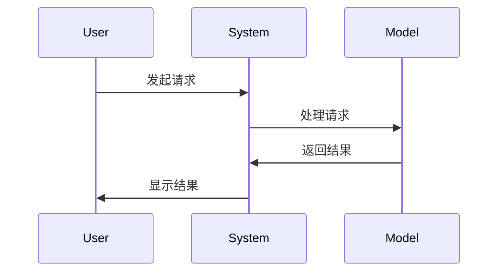

                 

## LLMApplied: 从用户到开发团队的持续反馈循环

> 关键词：LLM，持续反馈循环，用户，开发团队，系统优化，技术创新

摘要：本文深入探讨了LLM（大型语言模型）应用中的持续反馈循环，从用户体验出发，至开发团队的技术改进，全面阐述了如何通过持续反馈优化LLM应用的效能与用户体验。文章分为六个部分，依次介绍了LLM应用背景、核心概念与联系、算法原理讲解、系统分析与架构设计方案、项目实战以及最佳实践与拓展。通过理论讲解、实例分析及实践总结，本文旨在为技术从业者提供一套系统化的LLM应用方法论。

### 第一部分：背景介绍

#### 1.1.1 问题背景

**LLM的发展历程**：

自2018年GPT-3问世以来，LLM的发展经历了几个关键阶段，从简单的语言建模到复杂的上下文理解和生成，标志着AI技术在自然语言处理领域的一次重大飞跃。LLM在文本生成、机器翻译、问答系统、代码生成等领域展现出强大的潜力，成为现代人工智能应用的核心技术。

**LLM在各行业中的应用现状**：

随着LLM技术的成熟，其在各行各业中得到广泛应用。例如，在金融行业，LLM用于风险评估和投资建议；在医疗行业，LLM用于病历分析和诊断辅助；在零售行业，LLM用于个性化推荐和客户服务。然而，尽管LLM在许多场景中表现出色，但其应用仍面临诸多挑战。

**LLM应用面临的挑战与问题**：

首先，LLM模型的复杂性导致计算资源消耗巨大，这对硬件设施和数据处理能力提出了高要求。其次，LLM在处理某些特定领域或情境时可能表现不佳，存在偏见和不确定性。此外，用户对LLM应用的期望往往较高，对响应速度、准确性和个性化有更高要求，这增加了开发团队的负担。

#### 1.1.2 核心概念

**LLM的定义与特点**：

LLM是一种基于神经网络和深度学习的自然语言处理模型，具有大规模参数和高度复杂的结构。其核心特点是能够处理变长的文本序列，并具备强大的上下文理解能力，能够生成自然流畅的文本。

**持续反馈循环的概念与重要性**：

持续反馈循环是一种通过用户反馈不断优化模型性能的方法。其重要性在于，它能够帮助开发团队快速发现和解决应用中的问题，提高模型的适应性和可靠性。

**用户与开发团队的角色与关系**：

用户是LLM应用的服务对象，他们的反馈是持续反馈循环的重要来源。开发团队则负责根据用户反馈进行模型优化和技术改进，从而提高应用的整体效能。

#### 1.1.3 边界与外延

**LLM应用的范围与限制**：

LLM主要应用于需要自然语言理解和生成的领域，如文本生成、机器翻译、问答系统等。然而，其应用范围受到计算资源、数据质量和模型设计的限制。

**持续反馈循环的边界条件**：

持续反馈循环的有效实施需要满足一定的边界条件，包括及时、准确的用户反馈、高效的模型更新机制和持续的技术创新。

**用户与开发团队之间的交互模式**：

用户与开发团队之间的交互模式包括用户反馈收集、开发团队响应和模型更新等多个环节，这些环节共同构成了持续反馈循环的核心流程。

#### 1.1.4 概念结构与核心要素组成

**LLM的结构与组成**：

LLM通常由输入层、编码器、解码器和输出层组成。每个层次负责不同的任务，共同实现文本序列的处理和生成。

**持续反馈循环的组成要素**：

持续反馈循环由用户反馈、模型更新、性能评估和用户反馈再处理等组成要素构成，这些要素相互关联，共同推动模型性能的持续优化。

**用户与开发团队的核心活动**：

用户的核心活动是使用LLM应用，并提供反馈；开发团队的核心活动是分析用户反馈，进行模型优化和技术改进。

### 第二部分：核心概念与联系

#### 2.1.1 LLM的原理

**神经网络与深度学习**：

神经网络是LLM的基础，通过多层非线性变换学习输入与输出之间的映射关系。深度学习则是在神经网络的基础上，引入多层结构，以实现更复杂的特征学习和模型表示。

**Transformer架构**：

Transformer是一种基于自注意力机制的序列到序列模型，其核心思想是通过计算序列中每个词与其他词的注意力权重，实现对输入序列的全局上下文理解。

**注意力机制**：

注意力机制是一种在模型中引入权重机制的方法，用于关注输入序列中的关键信息，提高模型对上下文的理解能力。

#### 2.1.2 LLM的特性

**参数规模与计算能力**：

LLM通常具有大规模参数，这使其具备强大的计算能力，能够处理复杂的语言任务。

**语言理解与生成能力**：

LLM通过学习大量文本数据，具备强大的语言理解与生成能力，能够生成自然流畅的文本。

**自适应与学习能力**：

LLM能够根据用户反馈和输入数据不断调整自身参数，实现自适应学习，提高模型性能。

#### 2.1.3 LLM与传统AI的区别

**传统AI与LLM的基本区别**：

传统AI主要依赖规则和符号推理，而LLM则基于数据驱动的神经网络模型，具有更强的自适应和学习能力。

**LLM在自然语言处理领域的优势**：

LLM在自然语言处理领域展现出显著优势，如强大的上下文理解能力、灵活的文本生成能力等。

**LLM在其他领域的潜力**：

LLM的应用不仅限于自然语言处理领域，其在图像生成、语音识别、代码生成等领域也具有巨大潜力。

### 第三部分：算法原理讲解

#### 3.1.1 持续反馈循环的原理

**反馈循环的定义与作用**：

反馈循环是一种通过输入、处理和输出之间的相互作用，实现系统持续优化和改进的方法。

**持续反馈的概念与重要性**：

持续反馈是一种实时、周期性的反馈机制，能够帮助开发团队快速发现和解决应用中的问题。

**反馈循环的结构与流程**：

反馈循环通常包括用户反馈收集、模型更新、性能评估和用户反馈再处理等环节，这些环节共同构成了反馈循环的核心流程。

#### 3.1.2 持续反馈循环的实现

**用户反馈的收集与处理**：

用户反馈的收集和处理是持续反馈循环的基础，通过数据挖掘和自然语言处理技术，提取用户反馈中的关键信息。

**开发团队的响应与改进**：

开发团队根据用户反馈进行模型更新和技术改进，以提高LLM应用的性能和用户体验。

**反馈循环在实际应用中的实现方式**：

反馈循环可以在不同的应用场景中实现，如在线问答系统、智能客服、个性化推荐等。

#### 3.1.3 持续反馈循环的优化策略

**用户反馈的筛选与分类**：

对用户反馈进行筛选和分类，提取出对模型优化有价值的反馈。

**开发团队的响应效率**：

提高开发团队的响应效率，加快模型更新和迭代速度。

**持续反馈循环的性能评估**：

对持续反馈循环的性能进行评估，包括模型性能、用户体验和业务效果等。

### 第四部分：系统分析与架构设计方案

#### 5.1.1 问题场景介绍

**LLM应用的常见场景**：

LLM应用在许多场景中具有广泛应用，如在线问答系统、智能客服、文本生成、机器翻译等。

**持续反馈循环在系统中的作用**：

持续反馈循环能够帮助LLM应用快速适应用户需求，提高系统性能和用户体验。

#### 5.1.2 系统功能设计

**用户功能需求**：

用户需求主要包括文本输入、查询、反馈等。

**开发团队功能需求**：

开发团队需求主要包括用户反馈收集、模型更新、性能评估等。

#### 5.1.3 系统架构设计

**系统整体架构设计**：

系统整体架构包括前端、后端和服务端，前端负责用户交互，后端负责数据处理，服务端负责模型训练和部署。

**模块功能划分**：

模块功能划分包括用户模块、反馈模块、模型模块、评估模块等。

**数据流与控制流设计**：

数据流和控制流设计包括用户数据流、反馈数据流、模型数据流和评估数据流等。

#### 5.1.4 系统接口设计

**用户接口设计**：

用户接口设计包括Web界面、移动端界面等。

**开发团队接口设计**：

开发团队接口设计包括管理后台、监控平台等。

#### 5.1.5 系统交互

**系统交互流程**：

系统交互流程包括用户发起请求、系统处理请求、反馈结果等。

**系统交互mermaid序列图**：

系统交互mermaid序列图用于描述系统交互过程，如图所示：

### 第五部分：项目实战

#### 6.1.1 环境安装

**硬件环境配置**：

硬件环境配置包括服务器配置、存储设备和网络设备等。

**软件环境安装**：

软件环境安装包括操作系统、数据库、开发工具和环境变量配置等。

#### 6.1.2 系统核心实现源代码

**源代码结构**：

源代码结构包括前端代码、后端代码和模型代码等。

**关键代码解析**：

关键代码解析包括用户接口实现、反馈处理实现、模型更新实现等。

#### 6.1.3 代码应用解读与分析

**代码功能解读**：

代码功能解读包括用户交互流程、反馈处理流程和模型更新流程等。

**代码性能分析**：

代码性能分析包括代码执行效率、内存占用和响应时间等。

#### 6.1.4 实际案例分析和详细讲解剖析

**案例背景**：

案例背景为一个在线问答系统，用户可以提交问题并获得系统生成的回答。

**案例分析**：

案例分析包括用户反馈收集、模型更新和性能评估等。

**案例讲解**：

案例讲解包括系统架构设计、代码实现和性能优化等。

#### 6.1.5 项目小结

**项目总结**：

项目总结包括项目成果、经验教训和改进建议等。

**项目反思**：

项目反思包括对项目过程中遇到的问题和挑战的反思，以及对未来项目的展望。

### 第六部分：最佳实践与拓展

#### 7.1.1 最佳实践

**持续反馈循环的应用技巧**：

最佳实践包括用户反馈收集方法、模型更新策略和性能优化技巧等。

**LLM优化的策略**：

LLM优化策略包括模型参数调整、数据增强和算法改进等。

#### 7.1.2 小结

**全书要点回顾**：

全书要点回顾包括LLM应用背景、核心概念与联系、算法原理讲解、系统分析与架构设计方案、项目实战和最佳实践与拓展等。

**作者的期望和建议**：

作者的期望和建议包括对读者在LLM应用中的实践指导，以及对未来LLM技术发展的期待。

#### 7.1.3 注意事项

**使用LLM的注意事项**：

注意事项包括数据隐私保护、模型安全性和用户隐私保护等。

**持续反馈循环的注意事项**：

注意事项包括用户反馈的真实性和有效性、模型更新的及时性和准确性等。

#### 7.1.4 拓展阅读

**相关书籍推荐**：

相关书籍推荐包括《深度学习》、《神经网络与深度学习》等。

**学术论文推荐**：

学术论文推荐包括《Attention Is All You Need》、《GPT-3: language models are few-shot learners》等。

**开源项目推荐**：

开源项目推荐包括TensorFlow、PyTorch、Hugging Face等。

### 附录

**术语解释**：

对本文中涉及的核心术语进行解释和定义。

**参考文献**：

列出本文引用的参考文献和资料。

### 结束语

本文旨在为读者提供一套系统化的LLM应用方法论，通过背景介绍、核心概念与联系、算法原理讲解、系统分析与架构设计方案、项目实战和最佳实践与拓展等多个方面的深入探讨，帮助读者理解LLM应用的持续反馈循环，提升技术实践能力。希望本文能为技术从业者在LLM应用领域中提供有益的参考和指导。**作者：AI天才研究院/AI Genius Institute & 禅与计算机程序设计艺术 /Zen And The Art of Computer Programming**

