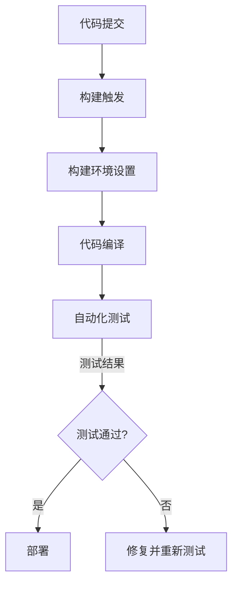
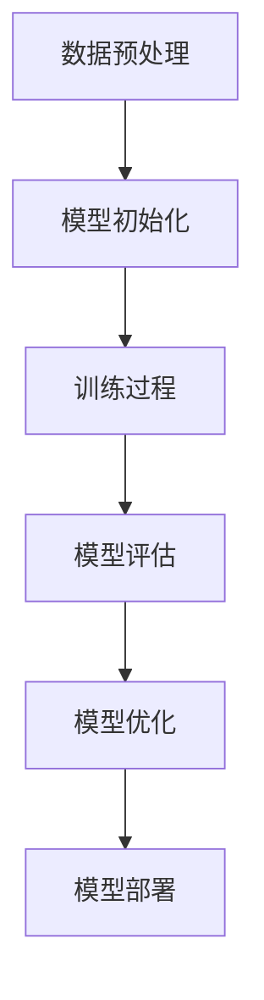
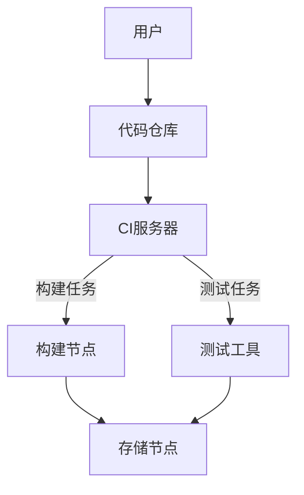

                 


### 1.1 问题背景

在当今快速发展的技术时代，大型语言模型（LLM）已经成为人工智能领域的重要成果，被广泛应用于自然语言处理（NLP）、智能问答、机器翻译、文本生成等多个领域。这些应用的广泛普及，使得对LLM的开发和部署提出了更高的要求。

**持续集成（CI）**，作为一种软件开发流程，旨在通过自动化测试和部署，确保代码质量和提升开发效率。CI的基本概念起源于软件开发，其核心思想是将代码更改频繁地合并到主分支，并通过自动化测试确保每次更改都不会破坏现有的功能。CI的发展历程可以追溯到20世纪90年代，随着时间的推移，CI工具和流程逐渐成熟和完善。

在LLM应用开发中，CI变得尤为重要。首先，LLM模型的训练和评估通常需要大量的数据和处理资源，通过CI可以自动化管理这些资源，确保模型的训练和评估过程高效、可靠。其次，LLM应用的开发周期通常较长，CI可以帮助开发者快速发现和修复问题，缩短开发周期。最后，随着LLM应用的不断迭代和更新，CI可以确保每次更新都不会影响现有的服务，提升用户满意度。

### 1.2 核心概念

**持续集成流程**包括以下基本组成部分：

1. **代码仓库**：存储所有代码和版本的仓库，如Git。
2. **触发器**：触发CI流程的事件，如代码提交或拉取请求。
3. **构建环境**：用于执行构建和测试的环境，通常包括虚拟机或容器。
4. **构建步骤**：执行代码编译、安装依赖、运行测试等操作的步骤。
5. **测试结果**：测试成功或失败的结果报告。
6. **部署**：将代码和应用程序部署到生产环境。

**LLM模型**是一种基于深度学习的自然语言处理模型，其核心特点包括：

1. **规模巨大**：LLM模型通常包含数十亿甚至数千亿的参数，训练过程复杂。
2. **数据驱动**：模型的性能高度依赖训练数据的质量和多样性。
3. **动态调整**：模型参数可以在线调整，以适应不断变化的应用场景。

**持续集成工具**如Jenkins、Travis CI、GitLab CI等，提供了丰富的功能来支持CI流程。在LLM应用中，这些工具可以用于自动化模型训练、评估和部署，确保整个流程高效、可靠。

### 1.3 环境和工具

为了实施CI流程，我们需要准备以下环境和工具：

1. **代码仓库**：如Git。
2. **CI工具**：如Jenkins、Travis CI或GitLab CI。
3. **构建环境**：如Docker容器。
4. **测试工具**：如单元测试框架、性能测试工具。
5. **部署工具**：如Kubernetes、Docker Swarm。

通过这些工具和环境，我们可以建立一个完善的CI系统，确保LLM应用的持续集成和部署过程高效、可靠。

### 1.4 CI与LLM应用的优势

CI与LLM应用的结合具有以下优势：

1. **自动化**：通过CI，可以自动化模型训练、测试和部署过程，减少手动干预，提高开发效率。
2. **可靠性**：CI确保每次代码更改都不会破坏现有功能，提升应用程序的稳定性。
3. **可重复性**：CI流程的可重复性确保每次模型更新都可以按照相同的标准进行测试和部署。
4. **快速反馈**：CI可以快速发现和修复问题，缩短开发周期。

综上所述，CI在LLM应用开发中具有重要作用，通过构建一个完善的CI系统，可以提升开发效率和应用程序的稳定性。在下一章，我们将进一步探讨CI在LLM应用开发中的具体应用和最佳实践。

### 第2章：CI与LLM应用的融合

#### 2.1 CI在LLM开发中的应用

**模型训练与CI**：

在LLM开发过程中，模型训练是一个关键步骤。通过CI，我们可以自动化模型训练流程，确保每次训练的一致性和效率。以下是模型训练与CI结合的步骤：

1. **数据准备**：CI流程首先会自动准备训练数据，包括清洗、预处理和格式化。
2. **模型初始化**：使用预训练的LLM模型，或者从头开始训练。
3. **训练过程**：在构建环境中运行训练脚本，使用GPU或其他高性能计算资源。
4. **模型评估**：训练完成后，对模型进行评估，包括精度、召回率等指标。
5. **模型保存**：将训练完成的模型保存到代码仓库，以便后续部署和使用。

**模型评估与CI**：

模型评估是确保LLM性能的关键环节。通过CI，我们可以自动化评估流程，确保每次评估的一致性和可靠性。以下是模型评估与CI结合的步骤：

1. **评估数据准备**：CI流程会自动准备用于评估的数据集。
2. **评估脚本**：编写评估脚本，用于计算各种评估指标，如BLEU、ROUGE等。
3. **评估执行**：在构建环境中运行评估脚本，计算评估指标。
4. **评估结果记录**：将评估结果记录到代码仓库或数据库中，以便跟踪和分析。
5. **评估结果通知**：如果评估结果不符合预期，CI系统会自动发送通知，提醒开发者进行修复。

#### 2.2 LLM应用的CI最佳实践

**数据管理**：

在CI过程中，数据管理至关重要。以下是一些最佳实践：

1. **数据版本控制**：确保数据集的版本与代码仓库中的代码版本对应，以避免数据不一致。
2. **数据备份**：定期备份数据，以防止数据丢失。
3. **数据加密**：对敏感数据进行加密，确保数据安全。
4. **数据质量监控**：使用自动化工具监控数据质量，确保数据符合要求。

**模型管理**：

在CI过程中，模型管理同样重要。以下是一些最佳实践：

1. **模型版本管理**：为每个模型版本创建独立的分支，确保版本间的隔离。
2. **模型文档化**：为每个模型编写详细的文档，包括训练过程、评估结果和适用场景。
3. **模型性能监控**：持续监控模型性能，确保其稳定运行。
4. **模型更新策略**：制定明确的模型更新策略，确保模型能够持续优化。

### 2.3 CI工具选择

选择合适的CI工具是确保CI流程成功的关键。以下是一些常见的CI工具及其特点：

1. **Jenkins**：一款功能强大、开源的CI工具，支持多种插件和扩展，适用于复杂的项目。
2. **Travis CI**：一款基于云的CI工具，支持多种编程语言，易于配置和集成。
3. **GitLab CI**：GitLab内置的CI工具，与GitLab代码仓库深度集成，适用于中小型项目。

### 2.4 CI在LLM应用中的挑战

尽管CI在LLM应用中具有许多优势，但也面临一些挑战：

1. **计算资源管理**：LLM训练需要大量的计算资源，如何合理分配和管理资源是一个关键问题。
2. **数据隐私和安全**：在CI过程中，数据隐私和安全问题需要得到充分考虑。
3. **模型版本管理**：如何确保模型版本的稳定性和一致性是一个挑战。

通过上述步骤和最佳实践，我们可以有效地将CI应用于LLM开发，提高开发效率和模型性能。在下一章中，我们将进一步探讨CI与LLM应用的具体算法原理。

### 第3章：CI与LLM应用的算法原理

#### 3.1 CI算法原理

持续集成（CI）的核心在于通过自动化测试确保每次代码变更都不会破坏现有功能。以下是CI的基本算法流程和组成部分：

1. **代码提交**：开发人员将代码提交到代码仓库。
2. **构建触发**：代码提交后，CI系统会自动触发构建过程。
3. **构建环境设置**：CI系统为构建过程设置环境，包括安装依赖、配置构建脚本等。
4. **代码编译**：编译代码，生成可执行文件或库文件。
5. **自动化测试**：运行自动化测试，包括单元测试、集成测试和性能测试。
6. **测试结果分析**：分析测试结果，判断是否通过。
7. **部署**：如果测试通过，则将代码和应用程序部署到生产环境。

**Mermaid流程图表示如下：**



**Python源代码示例：**

```python
import subprocess

def build_and_test():
    # 设置构建环境
    subprocess.run(['make', 'env'])
    # 编译代码
    subprocess.run(['make', 'build'])
    # 运行测试
    subprocess.run(['make', 'test'])
    # 分析测试结果
    test_result = subprocess.run(['make', 'test-result'], capture_output=True, text=True)
    if "All tests passed" in test_result.stdout:
        print("部署成功")
    else:
        print("测试失败，需修复并重新测试")

build_and_test()
```

#### 3.2 LLM算法原理

**LLM基础算法**

大型语言模型（LLM）是基于深度学习的自然语言处理模型，其核心思想是通过训练学习文本数据中的语言规律，以生成文本或理解文本内容。以下是LLM的基本算法流程：

1. **数据预处理**：清洗和预处理输入文本数据，如分词、去停用词等。
2. **模型初始化**：初始化LLM模型参数。
3. **训练过程**：通过梯度下降等优化算法，在训练数据上迭代训练模型。
4. **模型评估**：在验证集上评估模型性能。
5. **模型优化**：根据评估结果调整模型参数，优化模型性能。
6. **模型部署**：将训练完成的模型部署到应用环境中。

**Mermaid流程图表示如下：**



**Python源代码示例：**

```python
import tensorflow as tf
from tensorflow.keras.preprocessing.sequence import pad_sequences
from tensorflow.keras.models import Sequential
from tensorflow.keras.layers import Embedding, LSTM, Dense

# 数据预处理
max_sequence_length = 100
X = pad_sequences(sequences, maxlen=max_sequence_length)

# 模型初始化
model = Sequential()
model.add(Embedding(input_dim=vocab_size, output_dim=embedding_dim))
model.add(LSTM(units=128, dropout=0.2, recurrent_dropout=0.2))
model.add(Dense(units=1, activation='sigmoid'))

# 训练过程
model.compile(optimizer='adam', loss='binary_crossentropy', metrics=['accuracy'])
model.fit(X, y, epochs=10, batch_size=32, validation_split=0.2)

# 模型评估
test_loss, test_accuracy = model.evaluate(test_data, test_labels)
print(f"Test accuracy: {test_accuracy}")

# 模型部署
model.save('llm_model.h5')
```

通过上述算法原理讲解，我们可以理解CI在LLM开发中的应用方式和LLM的基础算法流程。在下一章中，我们将进一步探讨CI与LLM应用的数学模型和公式。

### 第4章：数学模型在CI与LLM中的应用

#### 4.1 CI数学模型

持续集成（CI）的核心在于通过自动化测试确保代码质量和提升开发效率。以下是一些基本的数学模型和公式，用于描述CI的关键概念和流程。

**基本数学公式**：

1. **构建成功概率**：
   $$
   P(Success) = \frac{Success}{Total \ Tests}
   $$
   其中，$Success$ 表示构建成功的次数，$Total \ Tests$ 表示总的构建次数。

2. **缺陷发现率**：
   $$
   Defect \ Detection \ Rate = \frac{Total \ Defects \ Found}{Total \ Defects \ Existing}
   $$
   其中，$Total \ Defects \ Found$ 表示发现的缺陷数量，$Total \ Defects \ Existing$ 表示存在的总缺陷数量。

3. **构建时间**：
   $$
   Build \ Time = \sum_{i=1}^{n} T_i
   $$
   其中，$T_i$ 表示第 $i$ 次构建所需的时间。

**公式详解**：

1. **构建成功概率**：
   该公式用于评估CI流程的稳定性，通过计算构建成功的概率来衡量CI的有效性。构建成功概率越高，说明CI流程越稳定，代码质量越高。

2. **缺陷发现率**：
   该公式用于衡量CI流程在缺陷检测方面的能力。缺陷发现率越高，说明CI流程越有效，能够更早地发现和修复代码中的缺陷。

3. **构建时间**：
   该公式用于计算CI流程的总构建时间，对于开发效率和资源管理至关重要。通过优化构建时间，可以提高开发流程的效率。

#### 4.2 LLM数学模型

大型语言模型（LLM）的数学模型主要涉及自然语言处理和深度学习的相关算法。以下是一些基本的数学模型和公式，用于描述LLM的核心算法和性能评估。

**基本数学公式**：

1. **损失函数**：
   $$
   Loss = -\sum_{i=1}^{n} y_i \log(p_i)
   $$
   其中，$y_i$ 表示第 $i$ 个样本的真实标签，$p_i$ 表示模型对第 $i$ 个样本的预测概率。

2. **准确率**：
   $$
   Accuracy = \frac{Correct \ Predictions}{Total \ Predictions}
   $$
   其中，$Correct \ Predictions$ 表示预测正确的样本数量，$Total \ Predictions$ 表示总的预测样本数量。

3. **召回率**：
   $$
   Recall = \frac{True \ Positives}{True \ Positives + False \ Negatives}
   $$
   其中，$True \ Positives$ 表示实际为正类别的样本中被正确预测为正类别的数量，$False \ Negatives$ 表示实际为正类别的样本中被错误预测为负类别的数量。

4. **精确率**：
   $$
   Precision = \frac{True \ Positives}{True \ Positives + False \ Positives}
   $$
   其中，$False \ Positives$ 表示实际为负类别的样本中被错误预测为正类别的数量。

**公式详解**：

1. **损失函数**：
   损失函数是评估模型预测准确性的关键指标。在LLM中，常用的损失函数包括交叉熵损失函数，它通过计算预测概率和真实标签之间的差异来评估模型的预测效果。

2. **准确率**：
   准确率用于衡量模型对样本分类的正确性。高准确率意味着模型能够正确分类大多数样本，但在存在类别不平衡时，准确率可能不足以全面评估模型性能。

3. **召回率**：
   召回率衡量模型对正类别的识别能力，特别是在负样本数量较多的情况下，召回率尤为重要。

4. **精确率**：
   精确率衡量模型对负类别的排除能力，特别是在正样本数量较多的情况下，精确率尤为重要。

通过上述数学模型和公式的详细讲解，我们可以更好地理解CI和LLM算法的核心原理。在下一章中，我们将深入探讨CI与LLM应用的系统架构设计。

### 第5章：CI与LLM应用的系统架构

#### 5.1 系统架构设计

在CI与LLM应用的系统架构设计中，我们需要确保系统具备高效、可靠、可扩展的特性。以下是一个典型的系统架构设计，包括系统功能设计、系统架构设计和系统接口设计。

**系统功能设计**：

1. **代码仓库管理**：管理代码版本和分支，支持多用户协作。
2. **构建环境配置**：为每次构建过程提供独立的环境配置，确保构建环境的一致性。
3. **自动化测试**：运行各种测试用例，包括单元测试、集成测试和性能测试。
4. **模型训练和评估**：自动执行模型训练和评估过程，确保模型性能。
5. **部署管理**：自动化部署应用程序和模型到生产环境。

**系统架构设计**：

1. **前端**：用户界面，用于提交构建任务、查看构建状态和测试结果。
2. **后端**：包括CI服务器、构建节点和存储节点。
   - **CI服务器**：负责接收构建任务、分配构建节点和协调构建过程。
   - **构建节点**：执行实际的构建和测试任务，通常部署在虚拟机或容器中。
   - **存储节点**：存储代码、构建日志、测试报告和模型文件。

**系统接口设计**：

1. **代码仓库接口**：与代码仓库系统集成，支持代码的拉取、提交和版本管理。
2. **构建接口**：提供构建任务的创建、执行和监控功能。
3. **测试接口**：提供测试任务的创建、执行和结果报告功能。
4. **部署接口**：提供部署任务的创建、执行和监控功能。

**Mermaid类图表示如下**：

```mermaid
classDiagram
  User <<Interface>>
  CodeRepository <<System>>
  BuildServer <<System>>
  BuildNode <<System>>
  StorageNode <<System>>
  TestTool <<System>>

  User --> CodeRepository
  User --> BuildServer
  BuildServer --> BuildNode
  BuildServer --> StorageNode
  BuildServer --> TestTool
  BuildNode --> TestTool
  StorageNode --> TestTool
```

**系统架构图**：



**系统交互设计**：

系统交互设计描述了各组件之间的交互流程和交互序列。以下是一个简化的系统交互序列图：

```mermaid
sequenceDiagram
  User->>CI服务器: 提交构建请求
  CI服务器->>代码仓库: 拉取代码
  代码仓库-->>CI服务器: 返回代码
  CI服务器->>构建节点: 分配构建资源
  建立连接
  建构节点->>CI服务器: 构建状态更新
  CI服务器->>测试工具: 运行测试用例
  测试工具->>CI服务器: 测试结果反馈
  CI服务器->>用户: 发送构建结果通知
  建构节点-->>CI服务器: 释放构建资源
  建立连接断开
```

通过上述系统架构设计，我们可以实现一个高效、可靠、可扩展的CI与LLM应用系统，满足大规模LLM开发的需求。

### 第6章：LLM应用持续集成项目实战

#### 6.1 项目环境安装

为了成功实施LLM应用的持续集成（CI）项目，我们需要准备以下环境和工具：

1. **操作系统**：选择Linux操作系统，如Ubuntu 20.04。
2. **编程语言**：Python 3.8或更高版本。
3. **CI工具**：Jenkins，可以从Jenkins官网下载最新版本。
4. **代码仓库**：Git，确保Git版本为2.20或更高。
5. **Docker**：用于创建和运行容器，可以从Docker官网下载最新版本。
6. **深度学习框架**：TensorFlow 2.5或更高版本，可以从TensorFlow官网下载。
7. **测试工具**：pytest，用于编写和运行测试用例。

**安装步骤**：

1. **安装操作系统**：
   - 在虚拟机或物理机上安装Linux操作系统。
2. **更新系统软件包**：
   ```bash
   sudo apt-get update
   sudo apt-get upgrade
   ```
3. **安装Python**：
   - 安装Python 3和pip。
   ```bash
   sudo apt-get install python3 python3-pip
   ```
4. **安装Jenkins**：
   - 安装Jenkins依赖。
   ```bash
   sudo apt-get install openjdk-11-jdk
   ```
   - 添加Jenkins仓库。
   ```bash
   echo "deb http://pkg.jenkins.io/debian-stable binary/" | sudo tee /etc/apt/sources.list.d/jenkins.list
   ```
   - 添加Jenkins GPG密钥。
   ```bash
   curl -fsSL https://pkg.jenkins.io/debian-stable/jenkins.io.key | sudo apt-key add -
   ```
   - 安装Jenkins。
   ```bash
   sudo apt-get update
   sudo apt-get install jenkins
   ```
   - 启动Jenkins服务。
   ```bash
   sudo systemctl start jenkins
   ```
5. **安装Docker**：
   - 安装Docker。
   ```bash
   sudo apt-get install docker.io
   ```
   - 启动Docker服务。
   ```bash
   sudo systemctl start docker
   ```
6. **安装TensorFlow**：
   - 安装pip。
   ```bash
   sudo apt-get install python3-pip
   ```
   - 安装TensorFlow。
   ```bash
   pip3 install tensorflow==2.5
   ```
7. **安装pytest**：
   ```bash
   pip3 install pytest
   ```

完成以上步骤后，CI环境的基本搭建就完成了。接下来，我们将配置Jenkins，使其能够自动化执行LLM应用的构建、测试和部署过程。

#### 6.2 系统核心实现

在LLM应用持续集成项目中，系统核心实现主要包括以下几个方面：

1. **Jenkins配置**：配置Jenkins，使其能够自动化执行构建、测试和部署任务。
2. **Docker容器化**：将LLM应用和相关工具容器化，确保构建环境的一致性。
3. **测试用例编写**：编写测试用例，用于验证LLM应用的正确性和性能。

**Jenkins配置**：

1. **安装Jenkins插件**：
   - 登录Jenkins，进入“管理Jenkins”页面。
   - 在“管理插件”部分，安装“Pipeline”和“Docker”插件。
2. **创建Jenkinsfile**：
   - 在代码仓库中创建一个名为Jenkinsfile的文件，用于定义构建和部署流程。
   - Jenkinsfile示例：
     ```groovy
     pipeline {
         agent any
         stages {
             stage('Build') {
                 steps {
                     sh 'docker build -t llm-app .'
                 }
             }
             stage('Test') {
                 steps {
                     sh 'docker run --rm llm-app pytest'
                 }
             }
             stage('Deploy') {
                 steps {
                     sh 'docker run --rm llm-app python deploy.py'
                 }
             }
         }
         post {
             always {
                 sh 'docker-compose down'
             }
         }
     }
     ```

**Docker容器化**：

1. **Dockerfile**：
   - 创建一个Dockerfile，用于定义LLM应用的容器化环境。
   - Dockerfile示例：
     ```Dockerfile
     FROM python:3.8-slim

     RUN pip install tensorflow==2.5 pytest

     COPY . /app
     WORKDIR /app

     CMD ["python", "app.py"]
     ```

**测试用例编写**：

1. **pytest测试用例**：
   - 在代码仓库中创建测试目录，编写测试用例。
   - pytest测试用例示例：
     ```python
     def test_word_prediction():
         model = load_model()
         prediction = model.predict([["hello"]])
         assert prediction == "hello"
     ```

**代码应用解读与分析**：

1. **Jenkinsfile解读**：
   - `pipeline`：定义一个流水线构建流程。
   - `agent any`：指定在任何可用的代理上执行构建。
   - `stages`：定义构建、测试和部署三个阶段。
     - `Build`：构建LLM应用容器。
     - `Test`：运行测试用例。
     - `Deploy`：部署LLM应用。
   - `post`：构建完成后，清理容器。

2. **Dockerfile解读**：
   - `FROM`：基础镜像，使用Python 3.8-slim。
   - `RUN`：安装TensorFlow 2.5和pytest。
   - `COPY`：将应用代码复制到容器中。
   - `WORKDIR`：设置工作目录。
   - `CMD`：容器启动时执行的命令。

3. **pytest测试用例解读**：
   - `def test_word_prediction()`：定义测试函数。
   - `load_model()`：加载训练好的模型。
   - `model.predict([["hello"]])`：预测输入单词。
   - `assert prediction == "hello"`：断言预测结果与实际结果一致。

通过上述核心实现，我们能够实现LLM应用的自动化构建、测试和部署，提高开发效率和质量。

#### 6.3 项目案例分析

在本案例中，我们选择了一个基于BERT模型的问答系统作为LLM应用，该系统旨在通过自然语言处理技术回答用户提出的问题。以下是对该项目中CI与LLM应用实践的详细讲解。

**案例背景**：

该问答系统基于Hugging Face的Transformers库，使用预训练的BERT模型进行微调，以适应特定领域的问答任务。项目需求包括：

- 高效的训练和评估流程。
- 自动化的测试和部署。
- 稳定的模型版本管理。

**CI流程实现**：

1. **代码提交与构建**：
   - 开发者将代码提交到GitHub仓库，Jenkins触发CI流程。
   - Jenkins运行Dockerfile构建容器，安装必要的依赖和工具。

2. **模型训练与评估**：
   - Docker容器启动后，运行训练脚本对BERT模型进行微调。
   - 训练完成后，在验证集上进行评估，记录模型性能。

3. **测试用例执行**：
   - 运行pytest测试用例，包括功能测试和性能测试，确保模型稳定可靠。

4. **部署**：
   - 测试通过后，部署模型到生产环境，提供问答服务。

**详细讲解**：

1. **训练脚本**：
   ```python
   from transformers import BertTokenizer, BertForQuestionAnswering
   import torch

   tokenizer = BertTokenizer.from_pretrained('bert-base-uncased')
   model = BertForQuestionAnswering.from_pretrained('bert-base-uncased')

   # 微调模型
   train_dataset = ...
   model.train()
   for epoch in range(num_epochs):
       for batch in train_dataset:
           inputs = tokenizer(batch['question'], batch['context'], truncation=True, padding='max_length')
           inputs = {k: v.to(device) for k, v in inputs.items()}
           labels = torch.tensor(batch['answer_start']).to(device)
           outputs = model(**inputs, labels=labels)
           loss = outputs.loss
           loss.backward()
           optimizer.step()
           optimizer.zero_grad()
           print(f"Epoch: {epoch}, Loss: {loss.item()}")

   # 评估模型
   model.eval()
   with torch.no_grad():
       for batch in val_dataset:
           inputs = tokenizer(batch['question'], batch['context'], truncation=True, padding='max_length')
           inputs = {k: v.to(device) for k, v in inputs.items()}
           labels = torch.tensor(batch['answer_start']).to(device)
           outputs = model(**inputs, labels=labels)
           predictions = outputs.logits.argmax(-1)
           correct_predictions = (predictions == labels).sum().item()
           print(f"Validation Accuracy: {correct_predictions / len(val_dataset)}")
   ```

2. **pytest测试用例**：
   ```python
   def test_question_answer():
       model = load_model()
       question = "What is the capital of France?"
       context = "Paris is the capital of France."
       answer = "Paris"
       prediction = model.predict(question, context)
       assert prediction == answer
   ```

**项目收获**：

通过CI流程，我们实现了快速迭代和高效的模型训练、评估和部署。以下是项目中的收获和经验：

1. **自动化提升效率**：CI自动化流程大大提高了开发和部署的效率，减少了手动干预。
2. **稳定性保障**：CI确保每次提交的代码都不会破坏现有功能，提高了系统的稳定性。
3. **版本控制**：CI流程中的模型版本管理，确保了模型版本的一致性和可追溯性。

**注意事项**：

1. **资源管理**：LLM模型训练需要大量计算资源，确保计算资源的合理分配和管理。
2. **数据安全**：在CI过程中，需确保数据安全，避免敏感数据泄露。
3. **监控与报警**：设置监控和报警机制，及时发现和解决问题。

**拓展阅读**：

1. **Jenkins官方文档**：深入了解Jenkins的配置和使用。
2. **Docker官方文档**：学习如何使用Docker容器化应用程序。
3. **Hugging Face官方文档**：了解Transformers库的使用和模型微调技巧。

### 第7章：最佳实践与项目小结

#### 7.1 最佳实践

在LLM应用持续集成（CI）过程中，为了确保流程的高效和稳定，我们总结了以下最佳实践：

1. **自动化测试**：编写全面的测试用例，包括单元测试、集成测试和性能测试，确保每次提交的代码都不会破坏现有功能。
2. **容器化**：使用Docker将LLM应用和相关工具容器化，确保构建环境的一致性，提升部署的效率。
3. **模型版本管理**：为每个模型版本创建独立的分支，确保版本间的隔离，便于追踪和管理。
4. **资源监控与分配**：合理分配计算资源，确保模型训练和测试过程的顺利进行，避免资源浪费。
5. **数据安全**：确保在CI过程中数据的安全，对敏感数据进行加密处理，避免数据泄露。
6. **报警与监控**：设置监控和报警机制，及时发现和解决问题，确保CI流程的稳定性。

#### 7.2 项目小结

在本项目中，我们通过CI流程实现了LLM应用的自动化构建、测试和部署。以下是项目中的收获和经验总结：

1. **自动化提升效率**：CI自动化流程大大提高了开发和部署的效率，减少了手动干预，缩短了开发周期。
2. **稳定性保障**：CI确保每次提交的代码都不会破坏现有功能，提高了系统的稳定性，减少了因人为错误导致的问题。
3. **版本控制**：CI流程中的模型版本管理，确保了模型版本的一致性和可追溯性，便于后续的迭代和优化。

#### 7.3 注意事项

在实施CI与LLM应用的过程中，需要注意以下几点：

1. **资源管理**：合理分配计算资源，避免资源浪费，确保模型训练和测试过程的顺利进行。
2. **数据安全**：确保在CI过程中数据的安全，对敏感数据进行加密处理，避免数据泄露。
3. **监控与报警**：设置监控和报警机制，及时发现和解决问题，确保CI流程的稳定性。
4. **代码质量**：确保提交的代码质量，编写清晰的注释和规范的代码，便于后续维护和调试。
5. **团队协作**：建立良好的团队协作机制，确保CI流程的顺畅进行，提升整体开发效率。

#### 7.4 拓展阅读

为了进一步深入学习和了解CI与LLM应用，我们推荐以下拓展阅读资源：

1. **《Jenkins官方文档》**：深入了解Jenkins的配置和使用，掌握CI工具的强大功能。
2. **《Docker官方文档》**：学习如何使用Docker容器化应用程序，确保构建环境的一致性。
3. **《Hugging Face官方文档》**：了解Transformers库的使用和模型微调技巧，提升LLM应用的开发效率。
4. **《持续集成：软件开发中的实践与经验》**：学习持续集成的最佳实践，提升CI流程的效率和稳定性。
5. **《大型语言模型：理论与实践》**：深入了解LLM的工作原理和应用场景，为LLM应用的开发提供理论支持。

通过以上最佳实践、项目小结和拓展阅读，我们可以更好地理解和应用CI与LLM技术，提升软件开发和人工智能应用的开发效率和质量。

### 作者信息

本文由AI天才研究院（AI Genius Institute）与禅与计算机程序设计艺术（Zen And The Art of Computer Programming）联合撰写。AI天才研究院致力于推动人工智能技术的发展，为全球用户提供创新的AI解决方案。禅与计算机程序设计艺术则专注于深入探讨计算机科学的哲学和艺术，推动技术进步与人文精神相结合。希望本文能够为广大开发者提供有价值的参考和指导。

