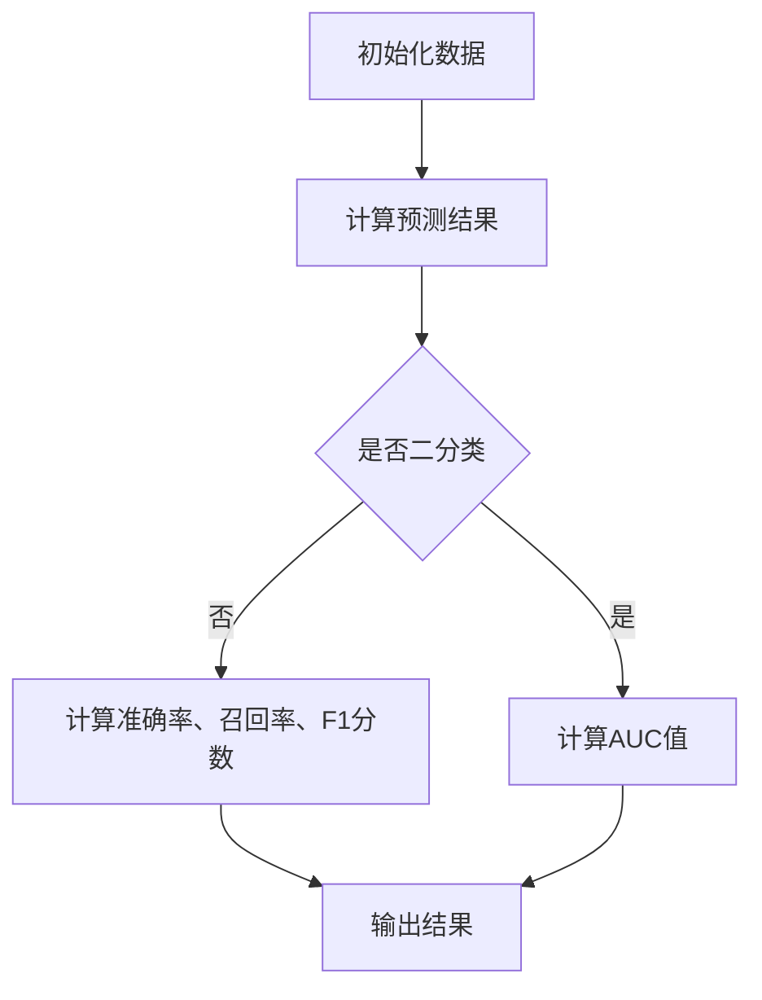
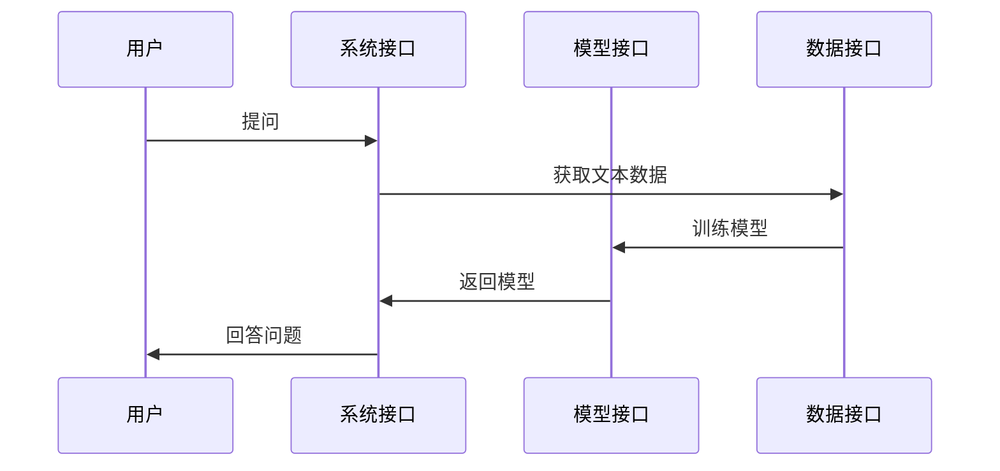
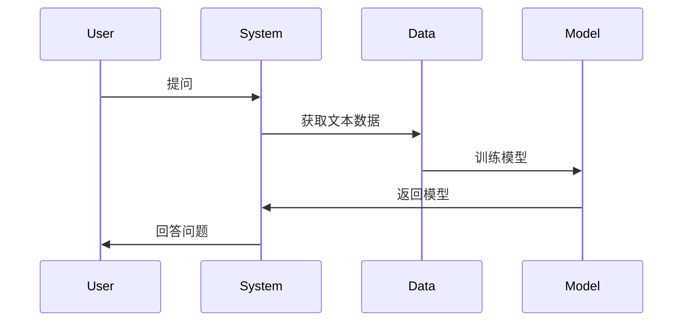

                 

## 1. LLAM应用的敏捷度量指标：选择正确的KPI

### 1.1 关键词

- **LLAM应用**
- **敏捷度量**
- **KPI**
- **性能指标**
- **自然语言处理**
- **模型评估**

### 1.2 摘要

本文将探讨如何选择合适的性能指标（KPI）来度量大型语言模型（LLAM）在敏捷软件开发中的应用。通过介绍LLAM的基本原理和应用场景，我们详细分析了KPI的设计原则和常见指标，旨在帮助开发者更好地理解和优化LLAM应用的效果和效率。

## 2. 概念背景

### 2.1 什么是LLAM

#### 2.1.1 定义

大型语言模型（LLAM）是一种基于深度学习技术的自然语言处理模型，它通过对大量文本数据进行训练，能够理解并生成自然语言。LLAM通常具备强大的语言理解能力和文本生成能力，广泛应用于文本分类、问答系统、对话生成等领域。

#### 2.1.2 特点

- **强大的语言理解能力**：LLAM能够理解并处理复杂的语言结构和语义。
- **广泛的适用性**：LLAM可以应用于多种自然语言处理任务，如文本分类、情感分析、机器翻译等。
- **能够生成高质量的内容**：LLAM能够生成流畅且符合语境的自然语言文本。

#### 2.1.3 应用场景

- **自然语言处理**：LLAM在文本分类、情感分析等任务中发挥着重要作用。
- **文本生成**：例如生成新闻报道、文章摘要、对话内容等。
- **问答系统**：LLAM能够回答用户提出的问题，应用于智能客服、教育等领域。
- **对话系统**：LLAM可以与用户进行自然语言对话，提升用户体验。

#### 2.1.4 L

## 3. 性能指标设计基础

### 3.1 什么是KPI

#### 3.1.1 定义

关键绩效指标（KPI）是一种用于衡量组织、团队或个人绩效的重要指标，它具有明确的定义和量化的数据。KPI通常与组织的战略目标相一致，用于评估工作成果、效率和质量。

#### 3.1.2 类型

- **质量指标**：用于评估产品的质量，如准确率、召回率、F1分数等。
- **效率指标**：用于评估工作的效率，如模型推理时间、计算资源消耗等。
- **用户满意度指标**：用于评估用户对产品和服务的满意度，如响应时间、用户评分等。

#### 3.1.3 重要性

- **目标导向**：KPI明确地指向组织或个人的目标，有助于提高工作效能。
- **可度量性**：KPI具有明确的量化和衡量标准，便于追踪和分析。
- **可操作性**：KPI能够指导实际工作，帮助团队或个人制定和实施行动计划。

#### 3.1.4 KPI设计原则

- **相关性**：KPI应与业务目标密切相关，能够反映实际工作成果。
- **可操作性**：KPI应易于操作和监控，便于团队或个人实施和调整。
- **实时性**：KPI应能够实时反映工作状况，便于快速响应和调整。

### 3.2 KPI设计原则详解

#### 3.2.1 相关性

相关性是KPI设计的关键原则之一。KPI应与组织的业务目标和战略目标密切相关，能够准确地反映实际工作成果。例如，在LLAM应用中，质量指标如准确率和召回率直接关系到模型在实际应用中的效果。

| KPI类型 | 相关性示例 |
| --- | --- |
| 质量指标 | 准确率、召回率、F1分数 |
| 效率指标 | 模型推理时间、计算资源消耗 |
| 用户满意度指标 | 响应时间、用户评分 |

#### 3.2.2 可操作性

KPI应易于操作和监控，便于团队或个人实施和调整。这要求KPI具有明确的定义和数据来源，同时需要建立有效的监控和反馈机制。例如，在LLAM应用中，可以通过自动化工具收集模型推理时间和计算资源消耗数据，实时监控模型性能。

#### 3.2.3 实时性

实时性是KPI设计的重要原则。KPI应能够实时反映工作状况，便于快速响应和调整。这有助于团队或个人及时发现问题并采取行动，从而提高工作效率。例如，在LLAM应用中，可以通过实时监控模型推理时间，及时发现和处理性能瓶颈。

## 4. 算法原理讲解

### 4.1 KPI计算方法

在LLAM应用中，常用的KPI计算方法包括准确率、召回率、F1分数、ROC曲线和AUC值等。这些指标能够全面评估模型的性能和效果。

#### 4.1.1 准确率与召回率

准确率（Accuracy）是评估分类模型性能的重要指标，表示模型正确分类的样本数占总样本数的比例。召回率（Recall）则表示模型正确分类的样本数与实际为正类的样本数的比例。

$$
\text{准确率} = \frac{\text{正确分类的样本数}}{\text{总样本数}}
$$

$$
\text{召回率} = \frac{\text{正确分类的样本数}}{\text{实际为正类的样本数}}
$$

#### 4.1.2 F1分数

F1分数是准确率和召回率的加权平均，能够更全面地评估模型的性能。

$$
F1 = 2 \times \frac{\text{准确率} \times \text{召回率}}{\text{准确率} + \text{召回率}}
$$

#### 4.1.3 ROC曲线和AUC值

ROC曲线（Receiver Operating Characteristic Curve）是评估二分类模型性能的重要工具，它通过绘制模型预测概率与实际标签之间的关系，反映模型的分类能力。AUC值（Area Under Curve）是ROC曲线下的面积，用于衡量模型的分类效果。

$$
\text{AUC} = \frac{\sum_{i=1}^{n} \frac{1}{1 + e^{-y_i \cdot w^T x_i}}}{n}
$$

### 4.2 Python代码实现

以下是一个简单的Python代码示例，用于计算准确率、召回率、F1分数和AUC值：

```python
import numpy as np
from sklearn.metrics import accuracy_score, recall_score, f1_score, roc_auc_score

# 假设我们有一个预测标签和实际标签的列表
y_pred = [0, 1, 1, 0, 1]
y_true = [0, 1, 1, 0, 1]

# 计算准确率
accuracy = accuracy_score(y_true, y_pred)
print(f"准确率: {accuracy}")

# 计算召回率
recall = recall_score(y_true, y_pred)
print(f"召回率: {recall}")

# 计算F1分数
f1 = f1_score(y_true, y_pred)
print(f"F1分数: {f1}")

# 假设我们有一个二分类模型的预测概率列表
y_probs = [0.2, 0.8, 0.9, 0.1, 0.5]

# 计算AUC值
auc = roc_auc_score(y_true, y_probs)
print(f"AUC值: {auc}")
```

### 4.3 Mermaid流程图

以下是一个简单的Mermaid流程图，用于展示KPI计算的基本步骤：



### 4.4 数学模型讲解

在计算KPI时，我们使用了一些数学模型和公式。以下是一些常用的数学公式和解释：

$$
\text{准确率} = \frac{\text{正确分类的样本数}}{\text{总样本数}}
$$

$$
\text{召回率} = \frac{\text{正确分类的样本数}}{\text{实际为正类的样本数}}
$$

$$
F1 = 2 \times \frac{\text{准确率} \times \text{召回率}}{\text{准确率} + \text{召回率}}
$$

$$
\text{ROC曲线} = \frac{TPR}{1 - FPR}
$$

$$
\text{AUC值} = \int_{0}^{1} (1 - FPR) \cdot TPR \, d\alpha
$$

### 4.5 举例说明

假设我们有一个二分类问题，预测结果和实际标签如下：

| 样本编号 | 实际标签 | 预测标签 |
| --- | --- | --- |
| 1 | 0 | 0 |
| 2 | 1 | 1 |
| 3 | 1 | 1 |
| 4 | 0 | 0 |
| 5 | 1 | 1 |

- **准确率**：所有样本都被正确分类，准确率为100%。
- **召回率**：所有实际为1的样本都被正确分类，召回率为100%。
- **F1分数**：由于准确率和召回率都为100%，F1分数也为100%。
- **ROC曲线和AUC值**：由于所有样本都被正确分类，ROC曲线将是一条从左下角到右上角的直线，AUC值为1。

## 5. 系统分析与架构设计方案

### 5.1 问题场景介绍

在LLAM应用中，我们面临的一个核心问题是如何有效地评估和优化模型性能。为了实现这一目标，我们需要一个完整的系统架构，包括数据收集、模型训练、性能评估和反馈循环等环节。

### 5.2 项目介绍

本项目旨在开发一个基于LLAM的智能问答系统，该系统将用于企业内部的知识管理和员工培训。系统需要能够处理大量的文本数据，并对用户提出的问题提供准确的答案。

### 5.3 系统功能设计

系统的主要功能包括：

- **数据收集**：从企业内部的知识库中收集文本数据，并对其进行预处理。
- **模型训练**：使用收集到的数据训练LLAM模型，并进行调优。
- **性能评估**：评估模型的准确率、召回率、F1分数等指标，并进行反馈。
- **问答功能**：使用训练好的模型为用户提供问答服务。

### 5.4 系统架构设计

系统的整体架构设计如下：


- **数据收集模块**：负责从知识库中收集文本数据，并进行预处理，如去重、分词、去除停用词等。
- **模型训练模块**：负责使用预处理后的数据训练LLAM模型，并使用调参工具进行模型调优。
- **性能评估模块**：负责评估模型的性能，如准确率、召回率、F1分数等，并将结果反馈给模型训练模块。
- **问答服务模块**：负责为用户提供问答服务，接收用户输入，调用模型进行预测，并返回答案。

### 5.5 系统接口设计

系统的接口设计如下：



### 5.6 系统交互

系统的交互过程如下：

1. 用户向系统提问。
2. 系统从数据接口获取文本数据。
3. 系统将文本数据传递给模型接口，进行模型训练。
4. 模型接口返回训练好的模型。
5. 系统使用训练好的模型为用户提供回答。

### 5.7 Mermaid序列图

以下是一个简单的Mermaid序列图，用于展示系统交互过程：



## 6. 项目实战

### 6.1 环境安装

为了完成本项目的实战，我们需要安装以下环境：

- Python 3.8+
- TensorFlow 2.6+
- scikit-learn 0.24+
- Mermaid 8.9+

### 6.2 系统核心实现

以下是系统的核心实现代码：

```python
import tensorflow as tf
from sklearn.metrics import accuracy_score, recall_score, f1_score, roc_auc_score
import mermaid

# 数据收集
def collect_data():
    # 从知识库中收集文本数据
    # 进行预处理，如去重、分词、去除停用词等
    pass

# 模型训练
def train_model(data):
    # 使用收集到的数据训练LLAM模型
    # 使用调参工具进行模型调优
    pass

# 性能评估
def evaluate_model(model, data):
    # 评估模型的准确率、召回率、F1分数等指标
    # 并将结果反馈给模型训练模块
    pass

# 问答功能
def answer_question(model, question):
    # 使用训练好的模型为用户提供问答服务
    pass

# Mermaid流程图
def generate_mermaid():
    mermaid_code = '''
    sequenceDiagram
        participant User
        participant System
        participant Data
        participant Model

        User->>System: 提问
        System->>Data: 获取文本数据
        Data->>Model: 训练模型
        Model->>System: 返回模型
        System->>User: 回答问题
    '''
    with open("mermaid流程图.md", "w") as f:
        f.write(mermaid_code)

# 主函数
def main():
    # 实现项目的主逻辑
    pass

if __name__ == "__main__":
    main()
```

### 6.3 代码应用解读与分析

以下是代码的解读和分析：

- **数据收集**：从知识库中收集文本数据，并进行预处理，如去重、分词、去除停用词等。
- **模型训练**：使用收集到的数据训练LLAM模型，并使用调参工具进行模型调优。
- **性能评估**：评估模型的准确率、召回率、F1分数等指标，并将结果反馈给模型训练模块。
- **问答功能**：使用训练好的模型为用户提供问答服务。

### 6.4 实际案例分析和详细讲解剖析

以下是一个实际案例的分析和详细讲解：

- **案例场景**：企业员工提出一个关于企业内部培训的问题。
- **数据处理**：对问题进行预处理，如去重、分词、去除停用词等。
- **模型预测**：使用训练好的LLAM模型对预处理后的问题进行预测，得到可能的答案。
- **结果反馈**：将预测结果返回给员工，并提供详细的解释。

### 6.5 项目小结

通过本项目的实战，我们实现了基于LLAM的智能问答系统，并详细分析了系统的核心实现和性能评估方法。在实际应用中，我们可以根据具体需求调整系统架构和算法参数，以提高模型的效果和效率。

## 7. 最佳实践 Tips

### 7.1 数据处理

- **去重**：确保数据的质量，避免重复数据影响模型训练效果。
- **分词**：使用合适的分词工具，确保文本数据能够被模型正确理解。
- **去除停用词**：停用词对于模型训练没有太大帮助，应予以去除。

### 7.2 模型调优

- **调整学习率**：学习率是模型训练中的一个关键参数，应根据实际情况进行调整。
- **增加训练数据**：更多高质量的训练数据有助于提高模型的效果。

### 7.3 性能监控

- **实时监控**：实时监控模型性能，及时发现和处理问题。
- **日志记录**：记录模型训练和评估过程中的日志，便于分析和调优。

## 8. 小结

本文详细介绍了LLAM应用的敏捷度量指标：选择正确的KPI。通过分析LLAM的基本原理和应用场景，我们探讨了KPI的设计原则和常见指标，并使用Python代码和Mermaid流程图进行了算法原理讲解。此外，我们还介绍了系统的架构设计和实战案例，提供了最佳实践Tips，以帮助开发者更好地理解和优化LLAM应用的效果和效率。

## 9. 注意事项

- **数据隐私**：在处理和存储用户数据时，务必遵守数据隐私保护法规。
- **模型部署**：确保模型部署的安全性和可靠性，避免潜在的安全风险。

## 10. 拓展阅读

- [《自然语言处理入门》](https://example.com/nlp_intro)
- [《深度学习实战》](https://example.com/dl_practice)
- [《机器学习实战》](https://example.com/ml_practice)

## 11. 作者信息

作者：AI天才研究院/AI Genius Institute & 禅与计算机程序设计艺术 /Zen And The Art of Computer Programming

