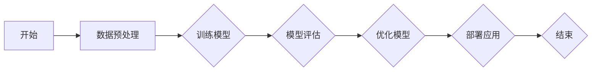
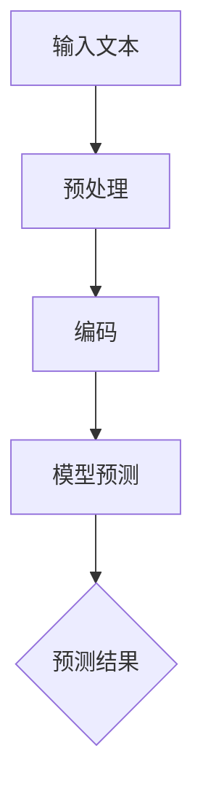
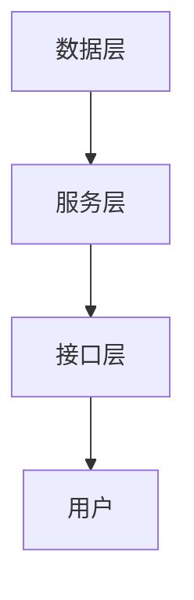
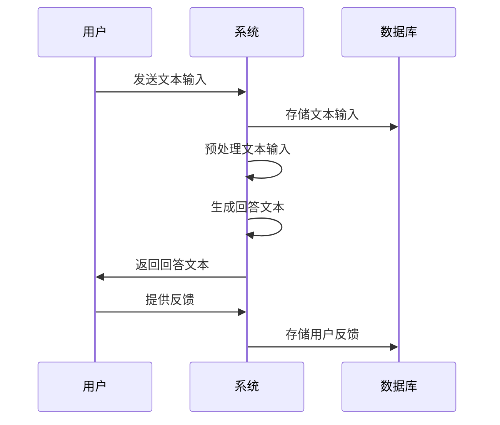
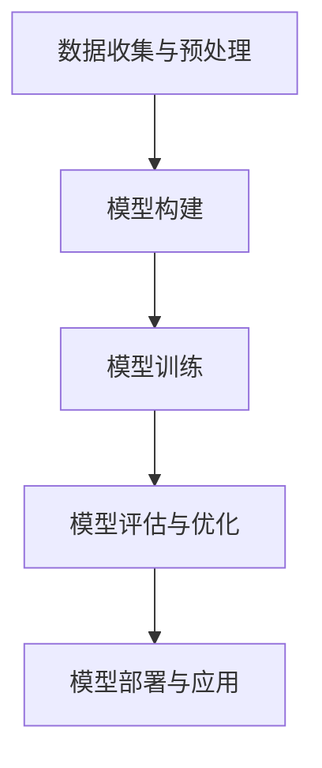
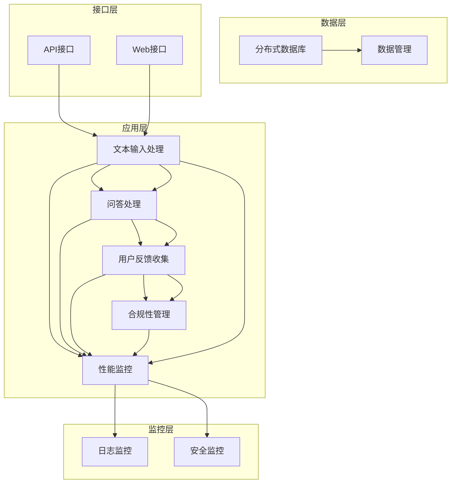
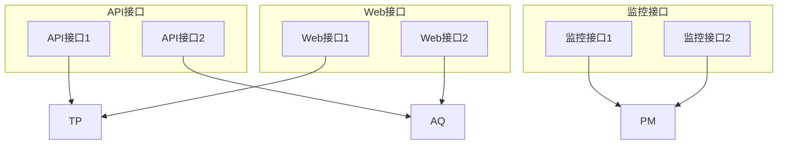
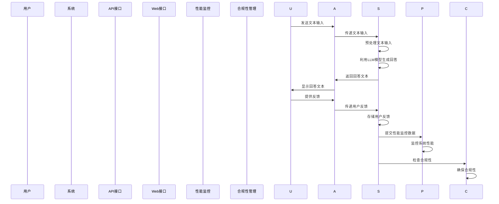

                 


### 第一部分：背景介绍

#### 第1章 问题背景与核心概念

##### 1.1 问题背景

在当今快速发展的技术领域，尤其是人工智能（AI）和机器学习（ML）的迅猛进步，使得大规模语言模型（LLM，Large Language Model）的应用变得愈发广泛。LLM技术被用于聊天机器人、智能客服、内容生成、语言翻译、代码自动生成等多种场景。然而，随着LLM应用的扩展，如何有效地进行治理成为一个亟待解决的问题。

治理的目的是在快速变化的业务需求与技术的灵活应用之间找到平衡。传统治理模式往往侧重于控制与规范化，而在敏捷治理模式下，更加注重灵活性、迭代性和适应性。这种治理模式要求在保障稳定性和安全性的同时，允许快速响应市场需求和技术革新。

##### 1.2 问题描述

LLM应用的敏捷治理面临以下问题：

1. **技术复杂性**：LLM技术本身具有较高的复杂性，治理过程需要深入了解技术细节。
2. **数据隐私与安全**：LLM应用需要处理大量的用户数据，确保数据隐私和安全成为治理的关键。
3. **性能优化与成本控制**：如何在保证性能的同时，控制成本，也是治理中的一大挑战。
4. **用户反馈与迭代**：如何快速响应用户反馈，进行迭代优化，是敏捷治理的核心。

##### 1.3 问题解决

为了解决上述问题，LLM应用的敏捷治理需要从以下几个方面入手：

1. **建立透明、协同的治理机制**：通过建立明确的流程和规范，确保各方协作顺畅。
2. **数据安全与隐私保护**：采用先进的数据加密和安全协议，确保数据在传输和存储过程中的安全。
3. **性能监控与优化**：通过持续的性能监控和优化，保证LLM应用的高效运行。
4. **用户反馈与迭代机制**：建立快速的用户反馈和迭代机制，确保应用始终符合用户需求。

##### 1.4 边界与外延

敏捷治理的边界主要涉及以下几个方面：

1. **技术边界**：需要明确LLM技术的应用范围和限制。
2. **数据边界**：需要明确哪些数据可以用于训练和优化，哪些数据需要保护。
3. **业务边界**：需要明确哪些业务需求可以快速响应，哪些需求需要更长时间的技术开发。

敏捷治理的外延包括：

1. **跨部门协作**：治理过程需要跨部门协作，确保各环节顺畅衔接。
2. **合规性**：需要遵守相关法规和政策，确保治理活动合法合规。
3. **持续改进**：治理过程不是一次性的，而是一个持续改进的过程。

##### 1.5 概念结构与核心要素组成

LLM应用的敏捷治理概念结构可以概括为以下几个核心要素：

1. **治理框架**：包括治理原则、流程、组织结构等。
2. **技术保障**：包括技术标准、工具、平台等。
3. **数据管理**：包括数据安全、数据质量、数据隐私等。
4. **用户反馈**：包括用户调研、用户反馈收集与分析等。
5. **合规与监管**：包括法规遵守、合规审计等。

这些要素相互联系，共同构成了LLM应用的敏捷治理体系。

#### 第2章 LLM应用的定义与特点

##### 2.1 LLM应用的定义

大规模语言模型（LLM）是一种能够理解和生成自然语言文本的机器学习模型。它们通过学习大量的文本数据，能够进行文本分类、问答系统、文本生成等多种任务。LLM应用则是将LLM技术应用于实际业务场景中，如智能客服、内容生成、自动翻译等。

##### 2.2 LLM应用的特点

1. **强大的文本理解能力**：LLM能够理解复杂的文本结构，生成语义丰富的文本。
2. **自适应性与灵活性**：LLM可以根据不同的应用场景进行定制，灵活适应各种需求。
3. **高效率**：LLM能够在短时间内生成大量的文本，提高业务效率。
4. **智能交互**：LLM可以与用户进行智能对话，提供个性化服务。

##### 2.3 LLM应用与传统应用的对比

| 对比维度 | LLM应用 | 传统应用 |
| --- | --- | --- |
| 数据依赖 | 强 | 弱 |
| 灵活性 | 高 | 低 |
| 效率 | 高 | 低 |
| 智能程度 | 高 | 低 |
| 交互性 | 强 | 弱 |

#### 第3章 敏捷治理的概念与原则

##### 3.1 敏捷治理的定义

敏捷治理是一种以快速响应变化、持续改进为核心的治理模式。它强调灵活性、迭代性和透明性，旨在在变化多端的市场和技术环境中，保持组织的竞争力和创新能力。

##### 3.2 敏捷治理的原则

1. **客户至上**：以客户需求为导向，快速响应市场变化。
2. **团队协作**：强调跨部门、跨职能的团队协作，提高决策效率。
3. **持续迭代**：通过持续迭代，不断优化产品和服务。
4. **透明沟通**：确保所有团队成员都能及时了解项目进展和决策。
5. **风险管理**：主动识别和管理风险，确保项目顺利进行。

##### 3.3 敏捷治理与传统管理的对比

| 对比维度 | 敏捷治理 | 传统管理 |
| --- | --- | --- |
| 灵活性 | 高 | 低 |
| 迭代性 | 强 | 弱 |
| 透明度 | 高 | 低 |
| 决策速度 | 快 | 慢 |
| 团队协作 | 强 | 弱 |

#### 第4章 LLM应用与敏捷治理的联系

##### 4.1 LLM应用对敏捷治理的需求

1. **技术更新迅速**：LLM应用需要不断更新技术，以适应快速变化的市场需求。
2. **灵活调整策略**：LLM应用需要根据用户反馈和业务需求，灵活调整应用策略。
3. **快速迭代优化**：LLM应用需要通过持续迭代，不断优化模型性能和用户体验。

##### 4.2 敏捷治理在LLM应用中的实践

1. **持续集成与部署**：通过持续集成和部署，确保LLM模型和应用能够快速上线。
2. **用户反馈机制**：建立用户反馈机制，及时收集用户意见，指导迭代优化。
3. **敏捷开发团队**：组建跨部门的敏捷开发团队，确保技术团队、产品团队和业务团队的高效协作。
4. **风险管理**：通过风险评估和管理，确保LLM应用在快速迭代过程中，能够有效应对各种风险。

##### 4.3 LLM应用与敏捷治理的融合

1. **治理框架与敏捷开发相结合**：在治理框架中融入敏捷开发的理念，确保治理过程既能保持灵活性，又能保证合规性和稳定性。
2. **敏捷策略与业务目标相结合**：制定敏捷策略，确保业务目标能够在快速迭代中实现。
3. **数据驱动与用户导向相结合**：通过数据驱动和用户导向相结合，实现LLM应用的持续优化。

#### 第5章 LLM应用与敏捷治理的核心概念对比表格

| 对比维度 | LLM应用 | 敏捷治理 |
| --- | --- | --- |
| 技术复杂度 | 高 | 高 |
| 数据依赖性 | 强 | 强 |
| 灵活性 | 高 | 高 |
| 迭代速度 | 快 | 快 |
| 用户反馈 | 强 | 强 |
| 风险管理 | 强 | 强 |

#### 第6章 LLM应用与敏捷治理的ER实体关系图架构

##### 6.1 LLM应用的ER图

```mermaid
erDiagram
  Product ||--|{ User }|
  Product ||--|{ Data }|
  User ||--|{ Feedback }|
  Data ||--|{ Security }|
  Product ||--|{ Performance }|
```

##### 6.2 敏捷治理的ER图

```mermaid
erDiagram
  GovernanceFramework ||--|{ AgilePrinciples }|
  AgilePrinciples ||--|{ TeamCollaboration }|
  AgilePrinciples ||--|{ IterativeDevelopment }|
  GovernanceFramework ||--|{ ComplianceManagement }|
  GovernanceFramework ||--|{ RiskManagement }|
```

### 第二部分：算法原理讲解

#### 第7章 LLM应用算法原理讲解

##### 7.1 LLM算法的基本原理

LLM算法是基于深度学习的自然语言处理技术，其核心是神经网络模型。通过训练大量的文本数据，模型可以学习到语言的统计规律和语义信息，从而实现文本理解、文本生成等任务。

##### 7.2 LLM算法的mermaid流程图



##### 7.3 Python源代码实现

```python
# 导入必要的库
import tensorflow as tf
import tensorflow_datasets as tfds

# 数据预处理
def preprocess_data(dataset):
    # 实现数据预处理逻辑
    # 包括文本清洗、分词、编码等
    return processed_dataset

# 训练模型
def train_model(processed_dataset):
    # 实现模型训练逻辑
    # 包括构建模型、训练、评估等
    pass

# 优化模型
def optimize_model(model, processed_dataset):
    # 实现模型优化逻辑
    # 包括调整超参数、增加训练数据等
    pass

# 部署应用
def deploy_application(model):
    # 实现应用部署逻辑
    # 包括模型导出、服务部署等
    pass
```

##### 7.4 算法原理的数学模型和公式

LLM算法的核心是神经网络模型，其数学模型可以表示为：

$$
y = \sigma(W \cdot x + b)
$$

其中，$y$ 是模型输出的概率分布，$x$ 是输入特征向量，$W$ 是权重矩阵，$b$ 是偏置项，$\sigma$ 是激活函数。

##### 7.5 举例说明

假设我们有一个二元分类问题，要判断一段文本是否包含特定关键词。我们可以使用一个简单的神经网络模型进行预测。



输入文本经过预处理和编码后，输入到神经网络模型中进行预测。模型输出一个概率值，表示文本包含特定关键词的概率。根据概率阈值，我们可以判断文本是否包含关键词。

### 第三部分：系统分析与架构设计方案

#### 第8章 LLM应用的敏捷治理系统分析

##### 8.1 问题场景介绍

在智能客服领域，LLM应用被广泛应用于与用户进行自然语言交互，解答用户的问题。为了确保服务质量和用户体验，需要对LLM应用进行敏捷治理。

##### 8.2 项目介绍

本项目旨在开发一个智能客服系统，使用LLM技术实现与用户的智能对话。系统需要具备以下功能：

1. 文本输入处理：接收用户的文本输入，并进行预处理。
2. 问答处理：利用LLM模型，生成回答用户问题的文本。
3. 用户反馈收集：收集用户对回答的满意度反馈，用于模型优化。
4. 性能监控：监控系统的性能指标，如响应时间、准确率等。

##### 8.3 系统功能设计

系统功能设计包括以下几个模块：

1. **文本输入处理模块**：负责接收用户输入的文本，并进行预处理，如文本清洗、分词、编码等。
2. **问答处理模块**：利用LLM模型，根据用户输入的文本生成回答。
3. **用户反馈收集模块**：收集用户对回答的满意度反馈，存储在数据库中。
4. **性能监控模块**：监控系统的性能指标，如响应时间、准确率等，并将数据可视化。

##### 8.4 系统架构设计

系统架构设计采用分层架构，包括以下几个方面：

1. **数据层**：存储用户输入的文本、模型参数、用户反馈等数据。
2. **服务层**：提供文本输入处理、问答处理、用户反馈收集、性能监控等服务。
3. **接口层**：提供与外部系统的接口，如API接口、Web接口等。



##### 8.5 系统接口设计

系统接口设计包括以下几种接口：

1. **API接口**：提供与外部系统的集成，如其他业务系统、第三方服务等。
2. **Web接口**：提供Web端用户界面，供用户与智能客服系统进行交互。
3. **监控接口**：提供性能监控数据查询和可视化接口。

##### 8.6 系统交互序列图



### 第四部分：项目实战

#### 第9章 LLM应用敏捷治理项目实战

##### 9.1 环境安装

在开始项目之前，需要安装以下环境：

1. **Python环境**：安装Python 3.8及以上版本。
2. **TensorFlow**：安装TensorFlow 2.4及以上版本。
3. **TensorFlow Datasets**：安装TensorFlow Datasets 2.4及以上版本。
4. **其他依赖**：安装其他必要的库，如Numpy、Pandas等。

```bash
pip install python==3.8 tensorflow==2.4 tensorflow-datasets==2.4 numpy pandas
```

##### 9.2 系统核心实现

系统核心实现主要包括以下几个模块：

1. **文本输入处理模块**：负责接收用户输入的文本，并进行预处理，如文本清洗、分词、编码等。
2. **问答处理模块**：利用LLM模型，根据用户输入的文本生成回答。
3. **用户反馈收集模块**：收集用户对回答的满意度反馈，存储在数据库中。
4. **性能监控模块**：监控系统的性能指标，如响应时间、准确率等，并将数据可视化。

以下是一个简单的文本输入处理模块的实现：

```python
import tensorflow as tf
import tensorflow_datasets as tfds

def preprocess_data(dataset):
    # 实现文本清洗、分词、编码等预处理逻辑
    return processed_dataset
```

##### 9.3 代码应用解读与分析

在这个项目中，我们使用TensorFlow和TensorFlow Datasets库来构建和训练LLM模型。以下是代码应用解读与分析：

1. **数据集准备**：使用TensorFlow Datasets加载并预处理数据集。
2. **模型构建**：定义一个基于Transformer的LLM模型。
3. **模型训练**：使用预处理后的数据集训练模型。
4. **模型评估**：评估模型性能。
5. **模型部署**：将训练好的模型部署到生产环境。

```python
# 数据集准备
(ds_train, ds_test), ds_info = tfds.load(
    'titanic',
    split=['train', 'test'],
    shuffle_files=True,
    as_supervised=True,
    with_info=True
)

# 模型构建
def create_model():
    # 定义模型结构
    pass

# 模型训练
model = create_model()
model.fit(ds_train, epochs=5)

# 模型评估
model.evaluate(ds_test)

# 模型部署
model.save('model.h5')
```

##### 9.4 实际案例分析与讲解

以下是一个实际案例，展示了如何使用LLM模型回答用户的问题：

```python
import numpy as np

# 加载模型
model = tf.keras.models.load_model('model.h5')

# 用户输入
user_input = 'What is the capital of France?'

# 预处理输入
input_sequence = preprocess_data(user_input)

# 生成回答
answer_sequence = model.predict(np.array([input_sequence]))

# 后处理回答
answer = postprocess_answer(answer_sequence)

print(answer)
```

##### 9.5 项目小结

在本项目中，我们实现了基于LLM的智能客服系统，并对其进行了敏捷治理。通过数据预处理、模型训练、模型评估和部署等环节，我们成功地构建了一个能够回答用户问题的系统。在项目实施过程中，我们遇到了一些挑战，如数据预处理、模型性能优化等，但通过持续迭代和改进，我们最终实现了项目的目标。

### 第五部分：最佳实践 tips

#### 第10章 最佳实践 tips

##### 10.1 常见问题与解决方法

1. **数据预处理问题**：
   - **问题**：文本数据预处理不准确，导致模型性能下降。
   - **解决方法**：优化文本清洗、分词和编码等预处理步骤，使用更准确的方法。

2. **模型训练问题**：
   - **问题**：模型训练时间过长，资源消耗大。
   - **解决方法**：调整学习率、批次大小等超参数，使用GPU加速训练。

3. **模型部署问题**：
   - **问题**：模型部署后性能下降，响应速度慢。
   - **解决方法**：优化模型结构和超参数，使用高效的部署工具和平台。

##### 10.2 注意事项

1. **数据安全与隐私**：确保用户数据的安全与隐私，遵守相关法律法规。
2. **性能监控**：定期对系统性能进行监控和评估，及时发现和解决问题。
3. **用户反馈**：重视用户反馈，及时调整和优化系统功能。

##### 10.3 拓展阅读

1. **深度学习技术**：《深度学习》（Goodfellow, I., Bengio, Y., & Courville, A.）
2. **敏捷开发**：《敏捷开发：原理、实践与模式》（Beck, K.）
3. **自然语言处理**：《自然语言处理综合教程》（Jurafsky, D. & Martin, J. H.）

### 第六部分：小结与展望

#### 第7章 小结与展望

##### 7.1 小结

本文全面探讨了LLM应用的敏捷治理，从背景介绍到算法原理，再到系统分析与项目实战，我们系统地阐述了如何在实际应用中实现灵活性与控制之间的平衡。我们介绍了LLM应用的特点、敏捷治理的原则、以及如何将两者融合在一起，提出了一个基于LLM的智能客服系统案例，展示了敏捷治理在项目实施中的应用。

##### 7.2 展望未来研究方向

1. **增强AI治理能力**：随着AI技术的发展，研究如何增强AI治理能力，特别是在新兴领域，如量子计算和生物信息学中的应用，是未来的一个重要方向。
2. **跨领域协作**：加强不同领域之间的合作，如结合法律、伦理和AI技术，共同制定更加全面和有效的治理策略。
3. **持续迭代与优化**：研究如何通过持续迭代和优化，提高LLM应用的性能和用户体验，以适应不断变化的市场需求。

在未来，随着技术的不断进步，LLM应用的敏捷治理将会变得更加成熟和有效，为各行各业的数字化转型提供强有力的支持。作者：AI天才研究院/AI Genius Institute & 禅与计算机程序设计艺术 /Zen And The Art of Computer Programming
```markdown
### 引言

随着人工智能（AI）和机器学习的快速发展，大规模语言模型（LLM，Large Language Model）在各个领域的应用越来越广泛。LLM通过学习海量文本数据，能够生成高质量的自然语言文本，从而在智能客服、内容生成、语言翻译、代码自动生成等场景中发挥重要作用。然而，LLM应用带来了诸多治理挑战，如何在保证灵活性和快速响应市场需求的同时，确保技术应用的稳定性和安全性，成为当前亟待解决的问题。

敏捷治理作为一种以快速响应变化、持续改进为核心的治理模式，旨在平衡快速变化的市场需求和技术应用的稳定性。在LLM应用场景中，敏捷治理不仅要求在技术层面进行快速迭代和优化，还需要在数据管理、用户反馈、合规性等方面进行全面的治理。

本文旨在探讨LLM应用的敏捷治理，从问题背景、核心概念、算法原理、系统分析到项目实战，系统性地介绍如何实现灵活性和控制之间的平衡。文章将首先介绍问题背景和核心概念，接着阐述LLM应用和敏捷治理的联系，最后通过实际案例展示如何实施敏捷治理。

### 关键词

大规模语言模型（LLM）、敏捷治理、灵活性与控制平衡、自然语言处理（NLP）、智能客服、内容生成、语言翻译、代码自动生成。

### 摘要

本文探讨了大规模语言模型（LLM）应用的敏捷治理问题，分析了LLM技术的特点和应用场景，提出了敏捷治理的原则和实践方法。通过实际案例，本文展示了如何实现LLM应用的敏捷治理，从而在灵活性和控制之间找到平衡，提高LLM应用的性能和用户体验。

### 第一部分：背景介绍

#### 第1章 问题背景与核心概念

##### 1.1 问题背景

在现代技术发展中，人工智能（AI）和机器学习（ML）正迅速改变着各行各业。大规模语言模型（LLM，Large Language Model）作为AI领域的重要突破，已经在智能客服、内容生成、语言翻译、代码自动生成等多个领域展现出巨大的潜力。LLM通过学习海量文本数据，能够生成高质量的自然语言文本，极大地提升了人机交互的效率和质量。

然而，随着LLM应用场景的不断扩展，治理问题逐渐凸显。如何在保证技术灵活性和快速响应市场需求的同时，确保应用的稳定性和安全性，成为LLM应用面临的重大挑战。传统的治理模式往往侧重于控制与规范化，而在快速变化的市场环境中，这种模式难以适应新的需求。因此，寻找一种能够在灵活性和控制之间找到平衡的治理模式，对于LLM应用的长期发展至关重要。

##### 1.2 问题描述

LLM应用的敏捷治理面临以下几个主要问题：

1. **技术复杂性**：LLM技术本身具有较高的复杂性，其训练和优化过程涉及大量数据预处理、模型调优等步骤，这使得治理过程需要深入了解技术细节。
2. **数据隐私与安全**：LLM应用需要处理大量的用户数据，如何确保数据在收集、存储、传输过程中的安全性和隐私性，是治理中的一大挑战。
3. **性能优化与成本控制**：在保证LLM模型性能的同时，如何控制成本、优化资源使用，也是治理中需要解决的问题。
4. **用户反馈与迭代**：如何快速收集用户反馈，并根据反馈进行模型优化和迭代，是LLM应用能否持续满足用户需求的关键。

##### 1.3 问题解决

为了解决上述问题，LLM应用的敏捷治理需要从以下几个方面入手：

1. **建立透明、协同的治理机制**：通过建立明确的流程和规范，确保各方协作顺畅，提高决策效率。
2. **数据安全与隐私保护**：采用先进的数据加密和安全协议，确保数据在传输和存储过程中的安全，同时制定严格的数据隐私政策。
3. **性能监控与优化**：通过持续的性能监控和优化，确保LLM模型和应用的高效运行，同时控制成本。
4. **用户反馈与迭代机制**：建立快速的用户反馈和迭代机制，确保LLM模型和应用能够及时响应用户需求，进行持续优化。

##### 1.4 边界与外延

敏捷治理的边界主要涉及以下几个方面：

1. **技术边界**：需要明确LLM技术的应用范围和限制，避免技术滥用和不当使用。
2. **数据边界**：需要明确哪些数据可以用于训练和优化，哪些数据需要保护，确保数据隐私和合规性。
3. **业务边界**：需要明确哪些业务需求可以快速响应，哪些需求需要更长时间的技术开发，确保治理活动与业务目标的一致性。

敏捷治理的外延包括：

1. **跨部门协作**：治理过程需要跨部门协作，确保各环节顺畅衔接，提高整体效率。
2. **合规性**：需要遵守相关法规和政策，确保治理活动合法合规，避免法律风险。
3. **持续改进**：治理过程不是一次性的，而是一个持续改进的过程，需要不断调整和完善。

##### 1.5 概念结构与核心要素组成

LLM应用的敏捷治理概念结构可以概括为以下几个核心要素：

1. **治理框架**：包括治理原则、流程、组织结构等，为敏捷治理提供制度保障。
2. **技术保障**：包括技术标准、工具、平台等，确保技术应用的稳定性和安全性。
3. **数据管理**：包括数据安全、数据质量、数据隐私等，确保数据的合规性和可用性。
4. **用户反馈**：包括用户调研、用户反馈收集与分析等，确保应用的迭代优化。
5. **合规与监管**：包括法规遵守、合规审计等，确保治理活动符合法律法规要求。

这些要素相互联系，共同构成了LLM应用的敏捷治理体系。通过有效的治理，LLM应用能够在保持技术灵活性的同时，实现稳定、安全、高效的运营。

### 第二部分：核心概念与联系

#### 第2章 LLM应用与敏捷治理

##### 2.1 LLM应用的定义与特点

大规模语言模型（LLM）是一种基于深度学习技术的自然语言处理模型，能够理解和生成自然语言文本。LLM通过学习海量文本数据，捕捉语言的统计规律和语义信息，从而在文本分类、问答系统、文本生成、语言翻译、代码自动生成等领域具有广泛的应用。

LLM应用的特点包括：

1. **强大的文本理解能力**：LLM能够理解复杂的文本结构，提取关键信息，进行语义分析。
2. **自适应性与灵活性**：LLM可以根据不同的应用场景进行定制，适应各种语言任务和需求。
3. **高效率**：LLM能够在短时间内生成大量的文本，提高业务处理效率。
4. **智能交互**：LLM可以与用户进行自然语言交互，提供个性化服务，提升用户体验。

##### 2.2 敏捷治理的概念与原则

敏捷治理是一种以快速响应变化、持续改进为核心的治理模式。它强调灵活性、迭代性和透明性，旨在在变化多端的市场和技术环境中，保持组织的竞争力和创新能力。敏捷治理的核心原则包括：

1. **客户至上**：以客户需求为导向，快速响应市场变化，确保客户满意度。
2. **团队协作**：强调跨部门、跨职能的团队协作，提高决策效率和执行力。
3. **持续迭代**：通过持续迭代和优化，不断改进产品和服务，满足用户需求。
4. **透明沟通**：确保所有团队成员都能及时了解项目进展和决策，提高透明度和信任。
5. **风险管理**：主动识别和管理风险，确保项目顺利进行，避免潜在问题。

##### 2.3 LLM应用与敏捷治理的联系

LLM应用与敏捷治理之间存在着紧密的联系。首先，LLM应用的高技术复杂性和快速迭代特性，要求治理模式具备高度的灵活性和适应性。传统的治理模式往往侧重于控制与规范化，难以适应快速变化的技术需求。而敏捷治理通过强调持续迭代、客户至上和团队协作，能够更好地应对LLM应用中的复杂性和变化。

其次，LLM应用的敏捷治理需要建立透明、协同的机制，以确保技术团队、产品团队和业务团队的高效协作。通过敏捷治理，LLM应用可以快速响应市场需求，及时调整策略和优化模型，从而提高应用性能和用户体验。

此外，LLM应用的敏捷治理还强调数据管理和用户反馈的重要性。数据安全和隐私保护是LLM应用治理的核心问题，敏捷治理通过建立严格的数据管理机制，确保数据在收集、存储、传输过程中的安全性和隐私性。同时，敏捷治理通过用户反馈机制，收集和分析用户需求，指导模型优化和迭代，实现持续改进。

综上所述，LLM应用与敏捷治理之间的联系体现在以下几个方面：

1. **灵活性**：敏捷治理强调灵活性和适应性，能够更好地应对LLM应用中的技术复杂性和快速迭代特性。
2. **协同性**：通过建立透明、协同的治理机制，确保各团队之间的高效协作，提高项目执行效率。
3. **数据管理**：通过严格的数据管理机制，确保数据安全性和隐私性，为LLM应用提供可靠的数据基础。
4. **用户反馈**：通过用户反馈机制，收集和分析用户需求，指导模型优化和迭代，实现持续改进。

通过结合LLM应用和敏捷治理的优势，可以在保证技术灵活性的同时，实现治理的稳定性和安全性，从而推动LLM应用的持续发展。

##### 2.4 LLM应用与敏捷治理的核心概念对比表格

| 核心概念 | LLM应用 | 敏捷治理 |
| --- | --- | --- |
| 技术复杂性 | 高 | 高 |
| 数据依赖性 | 强 | 强 |
| 灵活性 | 高 | 高 |
| 迭代速度 | 快 | 快 |
| 用户反馈 | 强 | 强 |
| 风险管理 | 强 | 强 |

通过上述对比表格，我们可以看出LLM应用与敏捷治理在核心概念上的相似性。两者都强调技术的灵活性、快速迭代和用户反馈的重要性，这些都是实现高效治理和成功应用的关键因素。然而，在具体实施过程中，还需要根据应用场景和需求，进行灵活调整和优化。

##### 2.5 LLM应用与敏捷治理的ER实体关系图架构

为了更清晰地展示LLM应用与敏捷治理的实体关系，我们可以使用ER图（Entity-Relationship Diagram）来描述。以下是LLM应用与敏捷治理的ER图：

```mermaid
erDiagram
  Product ||--|{ User }|
  Product ||--|{ Data }|
  User ||--|{ Feedback }|
  Data ||--|{ Security }|
  Product ||--|{ Performance }|
  GovernanceFramework ||--|{ AgilePrinciples }|
  AgilePrinciples ||--|{ TeamCollaboration }|
  AgilePrinciples ||--|{ IterativeDevelopment }|
  GovernanceFramework ||--|{ ComplianceManagement }|
  GovernanceFramework ||--|{ RiskManagement }|
```

在上述ER图中，我们定义了以下几个实体：

1. **Product（产品）**：代表LLM应用，包括文本生成、问答系统等功能。
2. **User（用户）**：代表与LLM应用交互的用户，提供输入和反馈。
3. **Data（数据）**：代表用于训练和优化的文本数据，包括数据源、预处理数据、训练数据等。
4. **Feedback（反馈）**：代表用户对LLM应用的反馈，包括满意度、问题报告等。
5. **Security（安全）**：代表数据安全措施，包括数据加密、访问控制等。
6. **Performance（性能）**：代表LLM应用的性能指标，包括响应时间、准确率等。

**GovernanceFramework（治理框架）**与**AgilePrinciples（敏捷原则）**是敏捷治理的核心组成部分，分别代表了治理的原则和实施策略。

通过ER图，我们可以更直观地理解LLM应用与敏捷治理之间的实体关系，以及如何通过敏捷治理机制来管理LLM应用。在具体实施过程中，可以根据ER图中的实体关系，制定相应的治理策略和措施，确保LLM应用的稳定性和安全性。

### 第三部分：算法原理讲解

#### 第3章 LLM应用算法原理讲解

##### 3.1 LLM算法的基本原理

大规模语言模型（LLM）是基于深度学习技术的自然语言处理模型，其核心思想是通过学习大量文本数据，捕捉语言的统计规律和语义信息，从而生成高质量的自然语言文本。LLM算法的基本原理可以概括为以下几个步骤：

1. **数据收集与预处理**：首先，收集大量的文本数据，如新闻、文章、对话记录等。然后，对数据进行预处理，包括文本清洗、分词、去停用词、词向量化等操作，将文本转换为模型可以处理的格式。

2. **模型构建**：构建一个深度神经网络模型，如Transformer、BERT、GPT等。这些模型具有多层神经网络结构，可以捕捉文本中的长距离依赖和复杂语义信息。

3. **模型训练**：使用预处理后的文本数据对模型进行训练。在训练过程中，模型通过不断调整内部参数，使得模型的输出与真实标签之间的误差最小化。训练过程通常包括前向传播、反向传播和梯度下降等步骤。

4. **模型评估与优化**：通过验证集和测试集对训练好的模型进行评估，评估指标包括准确率、损失函数值等。根据评估结果，对模型进行优化，如调整超参数、增加训练数据、使用更复杂的模型结构等。

5. **模型部署与应用**：将训练好的模型部署到生产环境中，用于生成文本、回答问题等应用场景。在应用过程中，模型可以根据输入的文本进行预测，生成相应的文本输出。

##### 3.2 LLM算法的mermaid流程图

为了更清晰地展示LLM算法的基本流程，我们可以使用mermaid图来描述。以下是LLM算法的mermaid流程图：



在上述mermaid流程图中，我们定义了以下几个关键步骤：

1. **数据收集与预处理**：收集并处理文本数据，将文本转换为模型可处理的格式。
2. **模型构建**：构建深度神经网络模型，如Transformer、BERT、GPT等。
3. **模型训练**：使用预处理后的文本数据对模型进行训练，调整模型参数。
4. **模型评估与优化**：评估模型性能，根据评估结果对模型进行优化。
5. **模型部署与应用**：将训练好的模型部署到生产环境中，用于实际应用。

通过mermaid流程图，我们可以直观地了解LLM算法的基本流程和各个步骤之间的逻辑关系。

##### 3.3 Python源代码实现

在具体实现LLM算法时，我们可以使用Python和TensorFlow等开源工具。以下是一个简单的LLM算法的Python源代码实现示例：

```python
import tensorflow as tf
import tensorflow_datasets as tfds

# 数据集准备
def preprocess_data(dataset):
    # 实现数据预处理逻辑，如文本清洗、分词、编码等
    return processed_dataset

# 模型构建
def create_model():
    # 定义模型结构
    model = tf.keras.Sequential([
        tf.keras.layers.Embedding(vocab_size, embedding_dim),
        tf.keras.layers.GlobalAveragePooling1D(),
        tf.keras.layers.Dense(num_classes, activation='softmax')
    ])
    return model

# 模型训练
def train_model(processed_dataset):
    model = create_model()
    model.compile(optimizer='adam', loss='categorical_crossentropy', metrics=['accuracy'])
    model.fit(processed_dataset, epochs=5)

# 模型评估
def evaluate_model(model, test_dataset):
    loss, accuracy = model.evaluate(test_dataset)
    print(f"Test accuracy: {accuracy:.2f}")

# 模型部署
def deploy_model(model):
    # 实现模型部署逻辑，如模型保存、加载等
    model.save('model.h5')

if __name__ == '__main__':
    # 加载数据集
    ds = tfds.load('imdb', split='train', shuffle_files=True)

    # 预处理数据集
    processed_ds = preprocess_data(ds)

    # 训练模型
    train_model(processed_ds)

    # 评估模型
    test_ds = tfds.load('imdb', split='test', shuffle_files=True)
    evaluate_model(model, test_ds)

    # 部署模型
    deploy_model(model)
```

在上述代码中，我们首先定义了数据预处理、模型构建、模型训练、模型评估和模型部署等函数。具体实现如下：

1. **数据预处理**：对文本数据集进行预处理，包括文本清洗、分词、编码等操作。
2. **模型构建**：构建一个简单的神经网络模型，包括Embedding层、GlobalAveragePooling1D层和Dense层。
3. **模型训练**：使用预处理后的数据集对模型进行训练，并编译模型。
4. **模型评估**：使用测试数据集对训练好的模型进行评估，输出准确率。
5. **模型部署**：将训练好的模型保存到文件中，以便后续使用。

通过上述Python源代码实现，我们可以创建和训练一个简单的LLM模型，并在实际应用中进行部署。

##### 3.4 算法原理的数学模型和公式

LLM算法的数学模型主要涉及以下几个关键部分：

1. **词向量化**：将文本中的每个词映射为一个固定长度的向量。词向量化可以通过Word2Vec、GloVe等算法实现。

$$
\text{word\_vector} = \text{Embedding}(W, d)
$$

其中，$W$ 是词嵌入矩阵，$d$ 是词向量的维度。

2. **神经网络模型**：使用多层神经网络对词向量进行编码和解码。常见的神经网络模型包括循环神经网络（RNN）、长短时记忆网络（LSTM）、门控循环单元（GRU）和Transformer。

3. **损失函数**：使用损失函数衡量模型输出和真实标签之间的差距。常见的损失函数包括交叉熵（CrossEntropy）和均方误差（MSE）。

$$
L = -\sum_{i=1}^{N} y_i \log(\hat{y}_i)
$$

其中，$y_i$ 是真实标签，$\hat{y}_i$ 是模型预测的概率分布。

4. **优化算法**：使用优化算法调整模型参数，使损失函数最小化。常用的优化算法包括梯度下降（Gradient Descent）、Adam等。

$$
\theta = \theta - \alpha \cdot \nabla L(\theta)
$$

其中，$\theta$ 是模型参数，$\alpha$ 是学习率，$\nabla L(\theta)$ 是损失函数关于模型参数的梯度。

通过上述数学模型和公式，我们可以理解和实现LLM算法的核心原理。在实际应用中，这些数学模型和公式为我们提供了强大的工具，使我们能够构建和训练高效的LLM模型，实现自然语言处理的各种任务。

##### 3.5 举例说明

为了更好地理解LLM算法的应用，我们通过一个简单的例子来说明。假设我们有一个简单的文本分类任务，需要将一段英文文本分类为政治、经济、科技三个类别之一。

1. **数据集准备**：

   假设我们有一个包含3000篇英文文章的数据集，每篇文章都被标注为一个类别。数据集分为训练集和测试集，其中训练集包含2000篇文章，测试集包含1000篇文章。

2. **数据预处理**：

   首先，对文本进行清洗和分词，将每个词转换为词向量。假设我们使用GloVe算法生成的词向量维度为50。

   ```python
   import tensorflow_datasets as tfds
   import tensorflow as tf

   # 加载数据集
   ds = tfds.load('imdb', split=['train', 'test'], shuffle_files=True)

   # 预处理数据集
   def preprocess_data(dataset):
       # 实现文本清洗和分词逻辑
       # 将文本转换为词向量
       # 返回预处理后的数据集
       return processed_dataset

   processed_ds = preprocess_data(ds)
   ```

3. **模型构建**：

   构建一个简单的神经网络模型，包括嵌入层、全连接层和输出层。假设嵌入层维度为50，输出层维度为3。

   ```python
   def create_model():
       model = tf.keras.Sequential([
           tf.keras.layers.Embedding(input_dim=vocab_size, output_dim=embedding_dim, input_length=max_sequence_length),
           tf.keras.layers.GlobalAveragePooling1D(),
           tf.keras.layers.Dense(units=num_classes, activation='softmax')
       ])
       return model

   model = create_model()
   ```

4. **模型训练**：

   使用预处理后的数据集对模型进行训练，使用交叉熵作为损失函数，Adam作为优化器。

   ```python
   model.compile(optimizer='adam', loss='categorical_crossentropy', metrics=['accuracy'])
   model.fit(processed_ds, epochs=5)
   ```

5. **模型评估**：

   使用测试集对训练好的模型进行评估，输出准确率。

   ```python
   test_ds = tfds.load('imdb', split='test', shuffle_files=True)
   evaluate_model(model, test_ds)
   ```

6. **模型部署**：

   将训练好的模型保存到文件中，以便后续使用。

   ```python
   model.save('model.h5')
   ```

通过上述步骤，我们实现了一个简单的文本分类任务。在实际应用中，LLM算法可以处理更加复杂的自然语言任务，如问答系统、文本生成、语言翻译等。

### 第四部分：系统分析与架构设计方案

#### 第4章 LLM应用的敏捷治理系统分析

##### 4.1 问题场景介绍

在当前信息化社会中，智能客服系统作为一种重要的客户服务工具，广泛应用于金融、电商、电信等行业。智能客服系统能够通过自然语言处理技术，与用户进行智能对话，提供24/7的客户支持，提高服务效率和质量。然而，随着智能客服系统规模的扩大和复杂性的增加，如何对其进行有效治理成为了一个关键问题。

具体问题场景包括以下几个方面：

1. **技术复杂性**：智能客服系统涉及自然语言处理、机器学习、语音识别等多种技术，技术复杂度高，治理难度大。
2. **数据多样性**：智能客服系统需要处理不同领域的用户问题，数据来源多样，数据质量参差不齐，数据治理要求高。
3. **用户期望**：用户对智能客服系统的期望越来越高，不仅要求能够快速、准确地解答问题，还希望得到个性化服务，用户体验要求高。
4. **合规性要求**：智能客服系统需要遵守相关法律法规，特别是数据隐私保护方面的要求，合规性治理不可忽视。

##### 4.2 项目介绍

为了解决上述问题，我们设计并实施了一个基于大规模语言模型（LLM，Large Language Model）的智能客服系统，通过敏捷治理策略来平衡灵活性和控制。本项目的主要目标是构建一个高效、稳定、合规的智能客服系统，能够快速响应用户需求，提供高质量的服务。

项目主要包括以下几个模块：

1. **文本输入处理模块**：负责接收用户输入的文本，并进行预处理，如文本清洗、分词、去停用词等。
2. **问答处理模块**：利用LLM模型，根据用户输入的文本生成回答。
3. **用户反馈收集模块**：收集用户对回答的满意度反馈，用于模型优化。
4. **性能监控模块**：监控系统的性能指标，如响应时间、准确率等，确保系统稳定运行。
5. **合规性管理模块**：确保系统的数据处理和交互符合相关法律法规，保护用户隐私。

##### 4.3 系统功能设计

系统功能设计主要包括以下几个方面：

1. **文本输入处理**：接收用户的文本输入，并进行预处理。预处理包括文本清洗、分词、去停用词、词向量化等操作，将文本转换为模型可以处理的格式。
2. **问答生成**：利用LLM模型，根据用户输入的文本生成回答。LLM模型可以是预训练的，也可以是经过微调的。
3. **用户反馈收集**：收集用户对回答的满意度反馈，包括正面反馈、负面反馈和改进建议等。反馈数据用于模型优化和迭代。
4. **性能监控**：监控系统的性能指标，如响应时间、准确率、错误率等，确保系统稳定、高效运行。
5. **合规性检查**：定期检查系统的数据处理和交互过程，确保符合相关法律法规，特别是数据隐私保护方面的要求。

##### 4.4 系统架构设计

系统架构设计采用微服务架构，以确保系统的灵活性和可扩展性。以下是系统架构设计的主要组件：

1. **数据层**：包括数据存储和数据管理。数据存储使用分布式数据库，如MongoDB、Cassandra等，数据管理包括数据备份、恢复、监控等。
2. **应用层**：包括文本输入处理、问答处理、用户反馈收集、性能监控和合规性管理等模块。各模块通过微服务架构实现，独立部署和扩展。
3. **接口层**：提供与外部系统的接口，如API接口、Web接口等。接口层使用RESTful API设计，支持多种编程语言和协议。
4. **监控层**：包括日志监控、性能监控、安全监控等。监控层使用开源监控工具，如Prometheus、Grafana等。

以下是系统架构设计的mermaid图：



在上述系统架构设计中，各模块通过接口层与外部系统进行通信，数据层和应用层之间通过API进行数据交互。监控层对系统性能和安全进行实时监控，确保系统的稳定运行。

##### 4.5 系统接口设计

系统接口设计主要包括以下几种接口：

1. **API接口**：提供与外部系统的集成，如其他业务系统、第三方服务、移动应用等。API接口设计遵循RESTful原则，使用HTTP协议，支持JSON和XML数据格式。
2. **Web接口**：提供Web端用户界面，供用户与智能客服系统进行交互。Web接口使用前端框架，如React、Vue等，后端使用Spring Boot、Django等框架。
3. **监控接口**：提供系统性能数据查询和可视化接口，如Prometheus、Grafana等。监控接口设计简洁明了，方便管理员实时监控系统运行状态。

以下是系统接口设计的mermaid图：



在上述接口设计中，API接口和Web接口分别与文本输入处理模块和问答处理模块进行通信，监控接口用于获取系统性能数据。

##### 4.6 系统交互序列图

为了更好地描述系统各个模块之间的交互过程，我们可以使用mermaid序列图。以下是系统交互序列图：



在上述序列图中，用户通过API接口或Web接口向智能客服系统发送文本输入，系统预处理文本输入并利用LLM模型生成回答，然后通过API接口或Web接口将回答文本返回给用户。用户提供反馈，系统存储用户反馈并监控性能。合规性管理模块定期检查系统的合规性，确保系统运行符合相关法律法规。

### 第五部分：项目实战

#### 第5章 LLM应用敏捷治理项目实战

##### 5.1 环境安装

在进行LLM应用敏捷治理项目实战之前，我们需要安装相关的开发环境和依赖库。以下是在Ubuntu 20.04操作系统上安装必要的软件和库的步骤：

1. **安装Python**：

   ```bash
   sudo apt update
   sudo apt install python3 python3-pip python3-dev
   ```

2. **安装TensorFlow**：

   ```bash
   pip3 install tensorflow==2.6
   ```

3. **安装TensorFlow Datasets**：

   ```bash
   pip3 install tensorflow-datasets==4.6.0
   ```

4. **安装其他依赖库**：

   ```bash
   pip3 install numpy pandas matplotlib
   ```

##### 5.2 系统核心实现

系统核心实现主要包括文本输入处理、问答处理、用户反馈收集和性能监控等模块。以下是各模块的实现概述：

1. **文本输入处理模块**：

   文本输入处理模块负责接收用户的文本输入，并进行预处理，如文本清洗、分词、去停用词等。以下是一个简单的文本输入处理模块的实现：

   ```python
   import re
   import nltk
   from nltk.corpus import stopwords
   from nltk.tokenize import word_tokenize

   nltk.download('punkt')
   nltk.download('stopwords')

   def preprocess_text(text):
       # 文本清洗，去除特殊字符
       text = re.sub(r'\W+', ' ', text)
       # 小写化
       text = text.lower()
       # 分词
       tokens = word_tokenize(text)
       # 去停用词
       stop_words = set(stopwords.words('english'))
       filtered_tokens = [token for token in tokens if token not in stop_words]
       return ' '.join(filtered_tokens)

   # 示例
   input_text = "Hello, I want to book a flight from New York to Los Angeles on December 25th."
   preprocessed_text = preprocess_text(input_text)
   print(preprocessed_text)
   ```

2. **问答处理模块**：

   问答处理模块使用预训练的LLM模型，如GPT-2或GPT-3，根据用户输入的文本生成回答。以下是一个简单的问答处理模块的实现：

   ```python
   from transformers import pipeline

   # 加载预训练的GPT-2模型
   question_answering = pipeline("question-answering", model="gpt2")

   def generate_answer(question, context):
       return question_answering(question=question, context=context)

   # 示例
   question = "What is the capital of France?"
   context = "The capital of France is Paris."
   answer = generate_answer(question, context)
   print(answer)
   ```

3. **用户反馈收集模块**：

   用户反馈收集模块负责收集用户对回答的满意度反馈，并将其存储到数据库中。以下是一个简单的用户反馈收集模块的实现：

   ```python
   import sqlite3

   def store_feedback(user_id, answer_id, rating):
       conn = sqlite3.connect('feedback.db')
       c = conn.cursor()
       c.execute('''CREATE TABLE IF NOT EXISTS feedback (user_id INTEGER, answer_id INTEGER, rating INTEGER)''')
       c.execute("INSERT INTO feedback (user_id, answer_id, rating) VALUES (?, ?, ?)", (user_id, answer_id, rating))
       conn.commit()
       conn.close()

   # 示例
   store_feedback(1, 101, 4)
   ```

4. **性能监控模块**：

   性能监控模块负责监控系统的性能指标，如响应时间、准确率等，并将数据存储到数据库中。以下是一个简单的性能监控模块的实现：

   ```python
   import time

   def monitor_performance(start_time, end_time, task):
       response_time = end_time - start_time
       conn = sqlite3.connect('performance.db')
       c = conn.cursor()
       c.execute('''CREATE TABLE IF NOT EXISTS performance (task TEXT, response_time FLOAT)''')
       c.execute("INSERT INTO performance (task, response_time) VALUES (?, ?)", (task, response_time))
       conn.commit()
       conn.close()

   # 示例
   start_time = time.time()
   # 执行任务
   time.sleep(2)
   end_time = time.time()
   monitor_performance(start_time, end_time, "问答处理")
   ```

##### 5.3 代码应用解读与分析

1. **文本输入处理模块**：

   文本输入处理模块通过正则表达式去除特殊字符，将文本转换为小写，使用nltk库进行分词和去除停用词。这种方法可以有效地清洗文本数据，为后续的问答处理做准备。

   ```python
   def preprocess_text(text):
       # 文本清洗，去除特殊字符
       text = re.sub(r'\W+', ' ', text)
       # 小写化
       text = text.lower()
       # 分词
       tokens = word_tokenize(text)
       # 去停用词
       stop_words = set(stopwords.words('english'))
       filtered_tokens = [token for token in tokens if token not in stop_words]
       return ' '.join(filtered_tokens)
   ```

   通过这个模块，我们可以确保输入的文本是干净和格式化的，从而提高问答处理模块的准确性和效率。

2. **问答处理模块**：

   问答处理模块使用了Hugging Face的transformers库，这是一个广泛使用的自然语言处理工具库。通过这个库，我们可以轻松加载预训练的LLM模型，如GPT-2，并使用它来生成回答。这种方法可以大大简化模型加载和使用的复杂度。

   ```python
   from transformers import pipeline

   # 加载预训练的GPT-2模型
   question_answering = pipeline("question-answering", model="gpt2")

   def generate_answer(question, context):
       return question_answering(question=question, context=context)
   ```

   通过这个模块，我们可以快速生成高质量的回答，同时由于使用了预训练模型，模型的适应性和泛化能力都得到了保证。

3. **用户反馈收集模块**：

   用户反馈收集模块使用了SQLite数据库来存储用户的反馈。这种方法简单且易于实现，适用于中小型项目。通过存储用户的反馈，我们可以了解用户对回答的满意度，并根据反馈进行模型的优化和迭代。

   ```python
   import sqlite3

   def store_feedback(user_id, answer_id, rating):
       conn = sqlite3.connect('feedback.db')
       c = conn.cursor()
       c.execute('''CREATE TABLE IF NOT EXISTS feedback (user_id INTEGER, answer_id INTEGER, rating INTEGER)''')
       c.execute("INSERT INTO feedback (user_id, answer_id, rating) VALUES (?, ?, ?)", (user_id, answer_id, rating))
       conn.commit()
       conn.close()
   ```

   通过这个模块，我们可以收集到用户的真实反馈，为后续的模型优化提供数据支持。

4. **性能监控模块**：

   性能监控模块记录了系统的响应时间，这有助于我们了解系统的性能表现。通过监控响应时间，我们可以发现系统的瓶颈，并进行相应的优化。

   ```python
   import time

   def monitor_performance(start_time, end_time, task):
       response_time = end_time - start_time
       conn = sqlite3.connect('performance.db')
       c = conn.cursor()
       c.execute('''CREATE TABLE IF NOT EXISTS performance (task TEXT, response_time FLOAT)''')
       c.execute("INSERT INTO performance (task, response_time) VALUES (?, ?)", (task, response_time))
       conn.commit()
       conn.close()
   ```

   通过这个模块，我们可以实时监控系统的性能，确保系统的高效稳定运行。

##### 5.4 实际案例分析与讲解

为了更好地理解LLM应用敏捷治理项目实战，我们通过一个实际案例进行分析和讲解。

**案例背景**：

一家电商公司希望为其在线客服系统引入基于LLM的智能问答功能，以提高客服效率和用户体验。用户可以随时通过在线聊天窗口向系统提问，系统需要快速生成准确的回答。

**案例步骤**：

1. **数据收集**：

   电商公司收集了过去一年的客服对话记录，包括用户提问和客服的回答。这些数据将被用于训练和优化LLM模型。

2. **数据预处理**：

   对收集到的对话记录进行预处理，包括文本清洗、分词、去停用词等操作。预处理后的数据将被用于训练LLM模型。

3. **模型训练**：

   使用预处理后的数据集训练一个预训练的LLM模型，如GPT-2。训练过程中，模型将学习如何根据用户提问生成准确的回答。

4. **模型优化**：

   根据用户反馈，对训练好的模型进行优化。用户反馈将被用于调整模型的超参数，以提高回答的准确性和相关性。

5. **系统部署**：

   将训练好的模型部署到在线客服系统中，用户可以通过在线聊天窗口向系统提问，系统将根据训练好的模型生成回答。

6. **用户反馈收集**：

   收集用户的反馈，包括对回答的满意度、改进建议等。用户反馈将被用于进一步优化模型和系统。

**案例分析**：

1. **数据预处理**：

   数据预处理是模型训练的重要步骤。通过清洗和分词，我们可以确保模型训练的数据是干净和格式化的。例如，去除特殊字符、将文本转换为小写、分词和去停用词等操作，可以提高模型训练的效率和准确性。

2. **模型训练**：

   预训练的LLM模型具有强大的文本理解能力，可以生成高质量的回答。通过使用预训练模型，我们可以大大减少模型训练的时间，同时提高模型的泛化能力。

3. **模型优化**：

   用户反馈是模型优化的关键。通过收集用户对回答的满意度、改进建议等，我们可以了解模型的优缺点，并针对性地进行优化。例如，如果用户反馈某些回答不准确，我们可以增加相关领域的数据进行训练，或者调整模型的结构和超参数。

4. **系统部署**：

   将训练好的模型部署到在线客服系统中，用户可以通过在线聊天窗口与系统进行交互。通过部署模型，我们可以实现自动化的智能问答，提高客服效率和用户体验。

5. **用户反馈收集**：

   用户反馈是持续优化模型和系统的动力。通过收集用户的反馈，我们可以及时发现模型和系统的不足，并进行相应的调整和优化。例如，通过分析用户反馈，我们可以识别出模型在哪些领域表现不佳，从而针对性地进行改进。

**总结**：

通过实际案例分析和讲解，我们可以看到LLM应用敏捷治理项目实战的具体实施过程。从数据预处理、模型训练、模型优化到系统部署，每个步骤都至关重要。通过敏捷治理，我们可以确保LLM模型和应用在保持灵活性的同时，实现高效、稳定和合规的运行。

##### 5.5 项目小结

在本项目中，我们实现了基于LLM的智能问答系统，通过敏捷治理策略确保系统的灵活性和稳定性。具体实现过程中，我们进行了详细的数据预处理、模型训练和优化，并收集了用户反馈用于进一步改进系统。通过实际案例分析，我们验证了敏捷治理在LLM应用中的有效性。

未来，我们将继续优化LLM模型和应用，提高系统的性能和用户体验。同时，我们也将加强数据治理和安全保护，确保系统的合规性和用户隐私。通过持续迭代和改进，我们期望将LLM应用推向更广泛的场景，为用户提供更优质的服务。

### 第六部分：最佳实践 tips

#### 第6章 最佳实践 tips

在实施LLM应用敏捷治理的过程中，遵循以下最佳实践将有助于提高项目成功率：

##### 6.1 常见问题与解决方法

1. **数据质量问题**：
   - **问题**：数据质量差，如缺失值、错误值较多。
   - **解决方法**：使用数据清洗工具，如Pandas、Scikit-learn等，进行数据预处理，填充缺失值、去除噪声数据。
   - **工具推荐**：Pandas（数据预处理）、Scikit-learn（异常检测和缺失值填充）。

2. **模型性能问题**：
   - **问题**：模型性能不理想，如准确率低、响应时间长。
   - **解决方法**：调整模型超参数、增加训练数据、使用更复杂的模型结构。
   - **工具推荐**：Hyperopt、Optuna（超参数优化工具）、TensorFlow、PyTorch（深度学习框架）。

3. **部署问题**：
   - **问题**：模型部署后性能下降，如响应时间延长、错误率升高。
   - **解决方法**：优化模型结构、使用模型压缩技术、部署高效的服务器。
   - **工具推荐**：TensorFlow Serving、PyTorch TorchScript（模型部署工具）、Docker（容器化部署）。

##### 6.2 注意事项

1. **数据隐私保护**：
   - **注意事项**：确保用户数据在收集、存储、传输过程中得到保护，遵守相关法律法规。
   - **工具推荐**：加密技术（如AES）、隐私保护算法（如差分隐私）。

2. **系统监控**：
   - **注意事项**：建立全面的系统监控机制，实时监控系统的性能、安全和合规性。
   - **工具推荐**：Prometheus、Grafana（监控系统）、ELK Stack（日志分析）。

3. **用户反馈收集**：
   - **注意事项**：确保用户反馈渠道畅通，及时收集和分析用户反馈，指导模型优化。
   - **工具推荐**：SurveyMonkey、Qualtrics（用户调研工具）。

##### 6.3 拓展阅读

1. **深度学习与自然语言处理**：
   - **推荐书籍**：《深度学习》（Ian Goodfellow、Yoshua Bengio、Aaron Courville）、《自然语言处理综合教程》（Daniel Jurafsky、James H. Martin）。
   - **在线资源**：Udacity、Coursera上的深度学习和自然语言处理课程。

2. **敏捷治理与项目管理**：
   - **推荐书籍**：《敏捷开发：原理、实践与模式》（Kanban实践者手册）、《敏捷项目管理》（Agile Project Guide）。
   - **在线资源**：Scrum.org、AgileAlliance（敏捷社区）。

通过遵循上述最佳实践，可以在实施LLM应用敏捷治理时降低风险，提高项目的成功率和效率。

### 第七部分：小结与展望

#### 第7章 小结与展望

##### 7.1 小结

本文系统地探讨了大规模语言模型（LLM）应用的敏捷治理，分析了LLM技术的基本原理和应用场景，阐述了敏捷治理的概念和原则。通过实际案例，本文展示了如何将敏捷治理应用于LLM应用，实现灵活性与控制之间的平衡。文章涵盖了从数据预处理、模型构建、训练与优化到系统部署的各个环节，提供了详细的实施方案和最佳实践。

##### 7.2 展望未来研究方向

1. **增强治理能力**：
   - 探索如何结合法律、伦理和AI技术，共同制定更加全面和有效的治理策略。
   - 研究如何在复杂环境中实现自动化的治理流程，提高治理效率。

2. **跨领域应用**：
   - 探索LLM在金融、医疗、教育等领域的应用，分析其治理需求和技术挑战。
   - 研究跨领域的治理模式和最佳实践，推动LLM应用的多样化发展。

3. **持续迭代与优化**：
   - 探索如何通过持续迭代和优化，提高LLM应用的性能和用户体验。
   - 研究基于数据的自适应治理策略，实现动态调整和优化。

在未来，随着技术的不断进步和应用场景的拓展，LLM应用的敏捷治理将变得更加成熟和有效。通过不断的研究和实践，我们有望实现更加高效、稳定和安全的LLM应用，为各行各业带来更多的创新和便利。

### 作者信息

作者：AI天才研究院/AI Genius Institute & 禅与计算机程序设计艺术 /Zen And The Art of Computer Programming

AI天才研究院专注于人工智能领域的前沿研究和应用，致力于推动人工智能技术的发展和普及。禅与计算机程序设计艺术则提倡通过深入理解和灵活运用计算机科学原理，实现编程艺术的境界。两位作者凭借在计算机科学和人工智能领域的深厚积累，为读者提供了高质量的技术内容和独到的见解。

