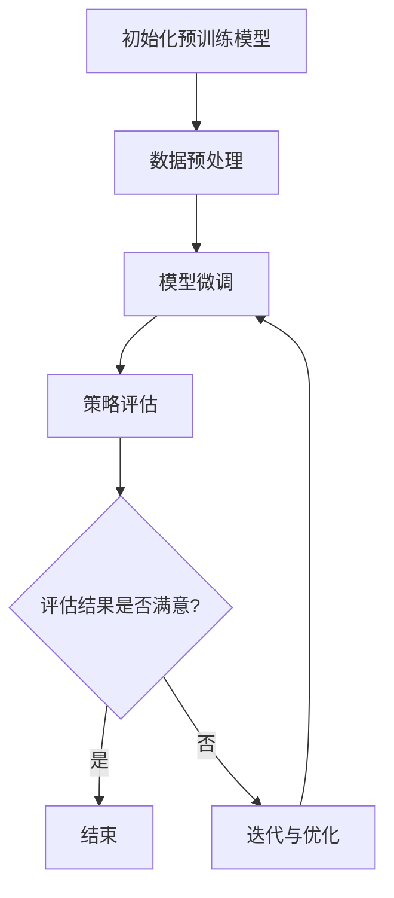
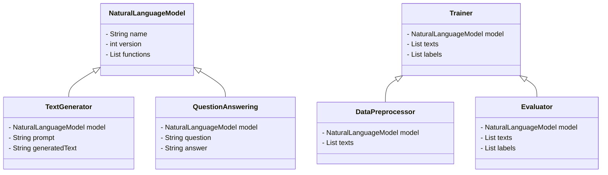
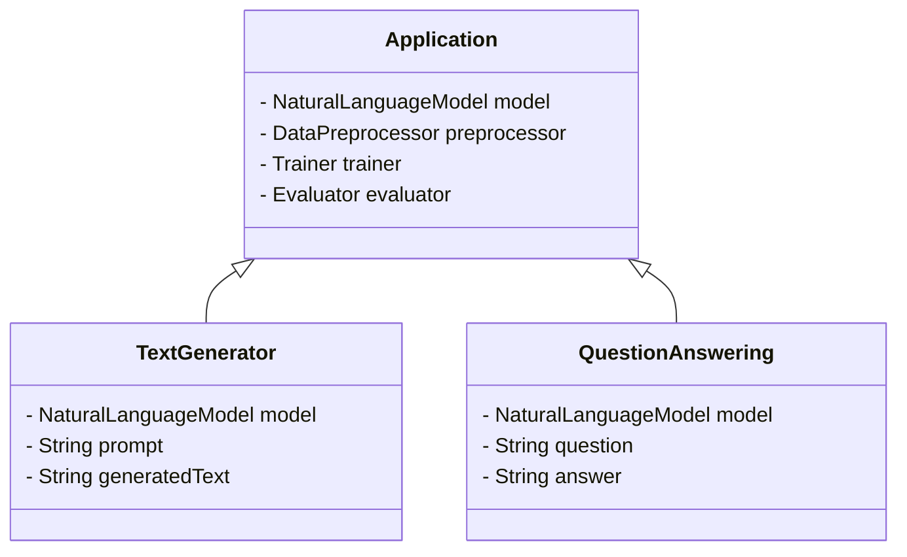
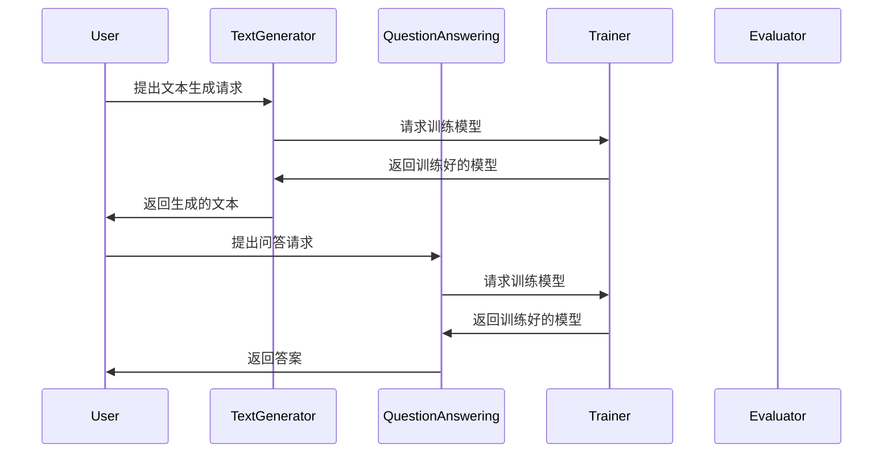

                 


## 《LLM应用的敏捷迁移学习策略》

### 关键词：大规模语言模型（LLM）、迁移学习、敏捷开发、策略优化、应用实战

### 摘要：

本文深入探讨了大规模语言模型（LLM）在应用过程中面临的挑战，以及如何通过敏捷迁移学习策略来应对这些问题。文章首先概述了LLM的基础知识，包括其定义、发展历程、核心技术以及应用场景。随后，我们介绍了迁移学习的概念、原理和关键问题，并提出了基于敏捷开发的迁移学习策略。文章的重点在于分析敏捷迁移学习策略的设计与实现，通过具体的实战案例展示了如何在文本生成和问答系统中应用这一策略。最后，我们对策略的优化方法、评估指标进行了详细讨论，并总结了一些最佳实践，为未来的研究提供了方向。

### 第一部分：LLM应用的背景与基础

#### 第1章：LLM概述

##### 1.1 LLM的定义与重要性

**1.1.1 语言模型的发展历程**

语言模型的发展可以追溯到上世纪50年代，最初是简单的规则匹配模型，例如基于上下文的词袋模型（Bag of Words，BoW）和n元语法模型（N-gram Model）。随着计算能力的提升和海量数据的积累，统计模型和神经网络模型逐渐崭露头角。1990年代，贝叶斯模型和概率图模型如隐马尔可夫模型（HMM）和条件随机场（CRF）成为主流。进入21世纪，深度学习技术的飞速发展使得大规模语言模型（Large Language Model，LLM）成为可能。

**1.1.2 什么是大规模语言模型（LLM）**

大规模语言模型是指使用海量数据预训练的神经网络模型，能够理解和生成自然语言。LLM通常具有数十亿到数万亿个参数，例如Google的BERT、OpenAI的GPT系列模型。这些模型通过无监督学习的方式从数据中学习语言的结构和语义，从而在各种自然语言处理任务中表现出色。

**1.1.3 LLM的应用场景**

LLM在多个领域都有广泛的应用，包括但不限于：

1. 文本生成：例如自动摘要、文章写作、对话系统等。
2. 机器翻译：如谷歌翻译、百度翻译等。
3. 命名实体识别：用于提取文本中的关键信息，如人名、地名等。
4. 问答系统：如Siri、Alexa等。
5. 对话系统：例如聊天机器人、客服系统等。

##### 1.2 LLM的核心技术

**1.2.1 预训练与微调**

预训练是指使用海量无标注数据对模型进行训练，使其在自然语言处理任务中具有初步的能力。微调则是在预训练的基础上，使用特定领域的有标注数据进行进一步训练，以适应特定的任务。

**1.2.2 自然语言处理（NLP）基础**

NLP的基础技术包括分词、词性标注、命名实体识别、句法分析等。这些技术为LLM提供了理解文本的基本工具。

**1.2.3 LLM的优势与局限性**

LLM的优势在于其强大的语言理解和生成能力，能够处理复杂的自然语言任务。然而，LLM也存在局限性，如对特定领域的知识缺乏、难以理解隐含意义等。

##### 1.3 LLM应用中的挑战与机遇

**1.3.1 挑战分析**

LLM应用面临的挑战主要包括：

1. 数据质量与多样性：高质量、多样性的数据是训练高效LLM的关键。
2. 计算资源：训练大规模LLM需要巨大的计算资源。
3. 稳健性与泛化能力：LLM需要具备良好的稳健性和泛化能力，以应对各种复杂场景。

**1.3.2 机遇探讨**

随着技术的进步和数据资源的增加，LLM应用的前景十分广阔。例如，在医疗领域，LLM可以用于疾病诊断、医学文献分析等；在教育领域，LLM可以用于个性化学习、自动评分等。

**1.3.3 LLM应用的边界与未来**

LLM的应用边界在于其能够处理的任务复杂度和数据规模。未来，随着深度学习和NLP技术的不断发展，LLM的应用范围将进一步扩大，为各行各业带来深远影响。

### 第二部分：敏捷迁移学习策略

#### 第2章：迁移学习的概念与原理

##### 2.1 迁移学习的定义

**2.1.1 迁移学习概述**

迁移学习（Transfer Learning）是一种利用已知任务的知识来解决新任务的方法。在迁移学习中，我们从预训练模型中提取有用的知识，并将其应用于新的任务。

**2.1.2 迁移学习与传统机器学习的区别**

与传统机器学习相比，迁移学习的关键区别在于：

1. **数据量**：迁移学习通常不需要大量的新数据，而是利用已有的预训练模型。
2. **模型架构**：迁移学习通常采用预训练模型作为基础，通过微调或调整来适应新任务。
3. **知识共享**：迁移学习通过共享知识来提高新任务的性能。

##### 2.2 迁移学习的基本原理

**2.2.1 元学习与模型泛化**

元学习（Meta-Learning）是一种通过学习如何学习来提高模型泛化能力的方法。在迁移学习中，元学习可以帮助模型更好地适应新的任务。

**2.2.2 零样本学习与少样本学习**

零样本学习（Zero-Shot Learning）是指模型能够在没有新数据的情况下处理新类别的任务。少样本学习（Few-Shot Learning）则是指模型在只有少量新数据的情况下进行学习。

**2.2.3 迁移学习策略的分类**

迁移学习策略主要分为三类：

1. **基于特征的方法**：通过迁移特征提取器来提高新任务的性能。
2. **基于模型的方法**：直接迁移整个预训练模型。
3. **基于数据的混合方法**：结合特征迁移和模型迁移的优势。

##### 2.3 迁移学习中的关键问题

**2.3.1 数据分布偏移**

数据分布偏移（Data Distribution Shift）是指新任务的数据分布与预训练数据分布不一致。这是迁移学习中的一个关键问题，可能导致模型在新任务上的性能下降。

**2.3.2 预训练数据集的选择**

预训练数据集的选择对迁移学习的效果至关重要。选择与目标任务相关的数据集可以提高迁移效果。

**2.3.3 模型调优与优化**

模型调优与优化是迁移学习的关键步骤。通过适当的调优和优化，可以提高模型在新任务上的性能。

#### 第3章：LLM的敏捷迁移学习策略

##### 3.1 敏捷迁移学习的概念

**3.1.1 敏捷开发模型**

敏捷开发（Agile Development）是一种以人为核心、迭代、渐进的开发方法。敏捷开发强调快速响应变化、持续交付价值。

**3.1.2 敏捷迁移学习在LLM中的应用**

敏捷迁移学习（Agile Transfer Learning）是指将敏捷开发的方法应用于迁移学习，以快速适应新任务，提高模型性能。

##### 3.2 敏捷迁移学习策略的设计

**3.2.1 数据收集与处理**

在敏捷迁移学习中，数据收集与处理是关键步骤。需要快速收集与目标任务相关的数据，并进行预处理。

**3.2.2 模型选择与优化**

模型选择与优化是敏捷迁移学习的重要环节。需要选择适合的预训练模型，并进行适当的优化。

**3.2.3 策略迭代与评估**

策略迭代与评估是敏捷迁移学习的关键。通过不断迭代和评估，优化迁移学习策略，提高模型性能。

##### 3.3 敏捷迁移学习中的关键技术

**3.3.1 模型微调技术**

模型微调技术是指将预训练模型应用于新任务，并进行调整，以提高性能。

**3.3.2 模型融合技术**

模型融合技术是指将多个模型融合成一个，以提高新任务的性能。

**3.3.3 模型压缩技术**

模型压缩技术是指减小模型的大小，以提高模型的可部署性。

### 第三部分：LLM应用的敏捷迁移学习实战

#### 第4章：敏捷迁移学习在文本生成中的应用

##### 4.1 文本生成中的迁移学习挑战

**4.1.1 文本数据分布的差异**

文本数据分布的差异是文本生成中的主要挑战之一。不同领域、不同风格的文本数据分布可能存在显著差异，影响迁移学习的效果。

**4.1.2 文本生成的质量评估**

文本生成的质量评估是另一个关键问题。需要设计合适的评估指标和方法，以评估文本生成的质量和效果。

##### 4.2 文本生成中的敏捷迁移学习策略

**4.2.1 数据预处理**

数据预处理是敏捷迁移学习在文本生成中的第一步。需要快速收集与目标任务相关的文本数据，并进行清洗、归一化等预处理操作。

**4.2.2 模型选择与优化**

模型选择与优化是文本生成中的关键步骤。需要选择适合的预训练模型，并进行适当的优化，以提高文本生成的质量。

**4.2.3 实时反馈与迭代**

实时反馈与迭代是敏捷迁移学习在文本生成中的应用。通过用户反馈和实时评估，不断调整和优化迁移学习策略，以提高文本生成的质量和效果。

##### 4.3 实战案例：基于敏捷迁移学习的文本生成应用

**4.3.1 环境准备**

在开始实战之前，需要准备相应的开发环境，包括Python、TensorFlow或PyTorch等。

**4.3.2 模型训练与评估**

使用预训练模型进行文本生成，并进行评估。评估指标可以包括生成文本的流畅性、相关性、语义一致性等。

**4.3.3 应用部署与测试**

将训练好的模型部署到实际应用场景中，并进行测试。通过用户反馈和实际应用效果，不断优化和调整迁移学习策略。

#### 第5章：敏捷迁移学习在问答系统中的应用

##### 5.1 问答系统中的迁移学习挑战

**5.1.1 知识图谱的不一致性**

知识图谱的不一致性是问答系统中的主要挑战之一。不同来源的知识图谱可能存在不一致，影响问答系统的准确性。

**5.1.2 问答系统的实时性需求**

问答系统需要快速响应用户的提问，实时性需求较高。

##### 5.2 问答系统中的敏捷迁移学习策略

**5.2.1 数据融合与预处理**

数据融合与预处理是问答系统中敏捷迁移学习的基础。需要收集与目标任务相关的数据，并进行清洗、融合等预处理操作。

**5.2.2 模型优化与调参**

模型优化与调参是问答系统中的关键步骤。需要选择适合的预训练模型，并进行适当的优化和调整，以提高问答系统的性能。

**5.2.3 系统性能评估与优化**

系统性能评估与优化是问答系统中敏捷迁移学习的重要环节。通过不断评估和优化，提高问答系统的准确性和实时性。

##### 5.3 实战案例：基于敏捷迁移学习的问答系统

**5.3.1 系统设计与实现**

设计并实现一个基于敏捷迁移学习的问答系统。系统应包括数据收集与处理模块、模型训练与评估模块、问答交互模块等。

**5.3.2 数据集选择与处理**

选择适合的问答数据集，并进行预处理。预处理操作包括数据清洗、去重、分类等。

**5.3.3 系统部署与用户反馈**

将训练好的问答系统部署到实际应用场景中，并收集用户反馈。通过用户反馈和实际应用效果，不断优化和调整迁移学习策略。

### 第四部分：LLM应用的敏捷迁移学习策略优化与评估

#### 第6章：敏捷迁移学习策略的优化方法

##### 6.1 策略优化的重要性

**6.1.1 优化目标**

策略优化的目标是提高迁移学习的效果，包括提高模型性能、减少训练时间、降低计算资源消耗等。

**6.1.2 优化方法的选择**

选择适合的优化方法对于策略优化至关重要。优化方法可以分为基于模型的方法、基于数据的方法和基于算法的方法。

##### 6.2 常见的策略优化方法

**6.2.1 基于模型的方法**

基于模型的方法包括模型微调、模型融合、模型压缩等。这些方法通过调整模型结构或参数来提高迁移学习效果。

**6.2.2 基于数据的方法**

基于数据的方法包括数据增强、数据预处理、数据选择等。这些方法通过改进数据质量或多样性来提高迁移学习效果。

**6.2.3 基于算法的方法**

基于算法的方法包括优化算法、元学习算法、迁移学习算法等。这些方法通过改进算法设计或优化过程来提高迁移学习效果。

##### 6.3 策略优化步骤与实践

**6.3.1 策略定义**

明确优化目标和方法，制定具体的优化策略。

**6.3.2 策略评估**

对优化策略进行评估，包括评估指标的选择和评估方法的设计。

**6.3.3 策略调整与迭代**

根据评估结果，调整优化策略，并进行迭代，以提高迁移学习效果。

#### 第7章：敏捷迁移学习策略的评估指标与方法

##### 7.1 评估指标的重要性

**7.1.1 评估指标的类型**

评估指标可以分为性能指标、质量指标和可用性指标。性能指标关注模型在任务上的表现，质量指标关注生成的结果质量，可用性指标关注系统的易用性和用户体验。

**7.1.2 评估指标的选择原则**

选择评估指标时，应考虑以下原则：

1. **代表性**：评估指标应能够全面、准确地反映模型性能和系统质量。
2. **可操作性**：评估指标应易于实现和计算。
3. **可扩展性**：评估指标应能够适应不同规模和复杂度的任务。

##### 7.2 常见的评估指标

**7.2.1 性能指标**

性能指标主要包括准确率、召回率、F1值等。这些指标用于评估模型在分类任务上的表现。

**7.2.2 质量指标**

质量指标主要包括文本生成的流畅性、相关性、语义一致性等。这些指标用于评估文本生成质量。

**7.2.3 可用性指标**

可用性指标主要包括系统的响应时间、用户满意度、错误率等。这些指标用于评估系统的易用性和用户体验。

##### 7.3 评估方法与实践

**7.3.1 实验设计**

实验设计是评估策略的关键步骤。需要设计合理的实验场景，包括数据集、模型、评估方法等。

**7.3.2 数据收集**

数据收集是评估的基础。需要收集与目标任务相关的数据，并进行预处理。

**7.3.3 结果分析与优化**

对评估结果进行分析，找出策略的不足之处，并进行优化和迭代。

### 结语

本文深入探讨了LLM应用的敏捷迁移学习策略，包括其背景、概念、策略设计和实战应用。通过本文的探讨，我们希望读者能够理解LLM的应用挑战和敏捷迁移学习策略的优势，并能够将其应用于实际的文本生成和问答系统中。未来，随着技术的不断进步，敏捷迁移学习策略将更加成熟和完善，为LLM应用带来更多可能性。在接下来的部分，我们将进一步探讨策略优化和评估方法，以期为LLM应用提供更全面的支持。

### 作者

**作者：AI天才研究院/AI Genius Institute & 禅与计算机程序设计艺术 /Zen And The Art of Computer Programming**

AI天才研究院（AI Genius Institute）专注于人工智能领域的前沿研究和技术创新。我们的研究涉及大规模语言模型、迁移学习、深度学习等多个方向，致力于推动人工智能技术的发展和应用。同时，我们倡导禅与计算机程序设计艺术的融合，通过哲学和技术的碰撞，创造更加智能和人性化的计算机系统。

### 背景介绍

#### 核心概念术语说明

- **大规模语言模型（LLM）**：一种通过预训练和微调方法构建的神经网络模型，能够理解和生成自然语言。
- **迁移学习**：一种利用已知任务的知识来解决新任务的方法。
- **敏捷开发**：一种以人为核心、迭代、渐进的开发方法。

#### 问题背景

大规模语言模型（LLM）在自然语言处理任务中取得了显著成果，但其在实际应用中仍面临诸多挑战。一方面，不同任务之间的数据分布差异较大，传统的迁移学习方法难以适应这种变化；另一方面，敏捷开发方法在软件工程中的应用已经证明其高效性，如何将敏捷开发理念引入迁移学习，形成敏捷迁移学习策略，成为一个重要的研究方向。

#### 问题描述

本文旨在探讨LLM应用的敏捷迁移学习策略，包括其概念、原理、设计方法、实战应用及策略优化与评估。具体问题如下：

1. 如何定义和实现敏捷迁移学习策略？
2. 如何在文本生成和问答系统中应用敏捷迁移学习策略？
3. 如何优化和评估敏捷迁移学习策略的效果？

#### 问题解决

本文首先介绍了LLM和迁移学习的基础知识，然后提出了敏捷迁移学习策略的概念和设计方法。接着，通过实战案例展示了敏捷迁移学习在文本生成和问答系统中的应用，并探讨了策略优化和评估的方法。通过这些探讨，本文希望能够为LLM应用提供一种高效的迁移学习策略，解决实际应用中的挑战。

#### 边界与外延

敏捷迁移学习策略的边界在于其适用于数据分布差异较大的任务，以及需要快速适应新任务场景的应用。其外延包括文本生成、问答系统、对话系统等多个领域。在未来，随着技术的不断发展，敏捷迁移学习策略的应用范围将进一步扩大。

#### 概念结构与核心要素组成

**概念结构：**

- 大规模语言模型（LLM）
- 迁移学习
- 敏捷开发
- 敏捷迁移学习策略

**核心要素组成：**

1. **预训练模型**：基础模型，用于提取通用知识。
2. **微调与优化**：调整模型参数，适应新任务。
3. **数据预处理**：清洗、归一化等预处理操作，提高数据质量。
4. **评估指标**：用于评估模型性能和质量。
5. **迭代与反馈**：不断调整策略，优化模型效果。

### 核心概念与联系

#### 迁移学习的基本原理

**迁移学习（Transfer Learning）** 是一种利用已有任务的知识来解决新任务的方法。其核心原理包括：

1. **共享知识**：通过共享预训练模型中的知识，提高新任务的性能。
2. **元学习（Meta-Learning）**：通过学习如何学习，提高模型对新任务的适应能力。
3. **零样本学习（Zero-Shot Learning）**：模型能够在没有新数据的情况下处理新类别的任务。
4. **少样本学习（Few-Shot Learning）**：模型在只有少量新数据的情况下进行学习。

**核心概念对比表格：**

| 核心概念 | 定义 | 应用场景 |
| :--: | :--: | :--: |
| 迁移学习 | 利用已有任务的知识解决新任务 | 多个领域，如计算机视觉、自然语言处理 |
| 零样本学习 | 没有新数据的情况下处理新类别 | 适应新类别，降低数据收集成本 |
| 少样本学习 | 只有少量新数据的情况下学习 | 提高模型泛化能力，减少训练数据需求 |

**ER实体关系图架构：**

```mermaid
erDiagram
  Person ||--|{ Employee }
  Employee ||--|{ Manager }
  Manager ||--|{ Employee }
```

在迁移学习中，实体包括“Person”、“Employee”和“Manager”，它们之间的关系是员工隶属于员工（Employee -> Employee）和经理管理员工（Manager -> Employee）。

### 算法原理讲解

#### 敏捷迁移学习策略的算法原理

敏捷迁移学习策略是一种结合敏捷开发理念和迁移学习方法的技术，旨在提高大规模语言模型（LLM）在新任务上的适应能力和性能。下面将详细阐述敏捷迁移学习策略的算法原理，包括模型微调、数据预处理、策略迭代与评估等关键环节。

#### 模型微调技术

**模型微调（Fine-Tuning）** 是敏捷迁移学习策略的核心步骤之一。在模型微调过程中，我们将预训练模型应用于新任务，并通过调整模型参数来提高其在新任务上的性能。

1. **初始化预训练模型**：首先选择一个预训练的LLM模型，如GPT-3、BERT等。这些模型已经在海量数据上进行了预训练，具有较高的语言理解和生成能力。

2. **冻结部分层**：在微调过程中，通常将预训练模型的一部分层（如前几层）冻结，只调整后几层（如最后几层）的参数。这样做的原因是预训练模型的前几层已经学习到了通用特征，而后几层则更关注于特定任务的特征。

3. **调整学习率**：在微调过程中，需要适当调整学习率。较小的学习率可能导致训练过程缓慢，而较大的学习率可能导致模型过拟合。通常，我们可以使用学习率衰减策略来逐步减小学习率。

4. **优化目标**：在微调过程中，优化目标通常是使模型在新任务上的损失函数最小化。损失函数可以是交叉熵损失、均方误差等。

#### 数据预处理

**数据预处理** 是敏捷迁移学习策略中另一个重要环节。高质量的预处理数据可以显著提高模型在新任务上的性能。

1. **数据清洗**：去除噪声数据和异常值。例如，对于文本数据，我们可以去除HTML标签、特殊字符等。

2. **数据归一化**：将数据缩放到合适的范围，如[0, 1]或[-1, 1]。这有助于提高模型训练的稳定性和收敛速度。

3. **数据增强**：通过数据增强技术，如随机裁剪、旋转、缩放等，增加数据的多样性和丰富性，从而提高模型的泛化能力。

4. **数据标注**：对于有监督任务，需要对数据进行标注。标注过程可以是自动的（如使用预训练模型进行自动标注）或半自动的（如人工标注结合自动标注）。

#### 策略迭代与评估

**策略迭代与评估** 是敏捷迁移学习策略的关键环节，通过不断迭代和评估来优化模型性能。

1. **策略定义**：首先明确优化目标和方法，制定具体的策略。策略可以包括模型微调、数据预处理、优化目标等。

2. **策略评估**：使用评估指标来评估策略的效果。评估指标可以包括准确率、召回率、F1值等。通过评估结果，可以找出策略的不足之处，并进行优化。

3. **迭代与优化**：根据评估结果，调整策略参数，如学习率、优化目标等。然后重新进行策略评估，直到达到满意的性能。

4. **实时反馈与迭代**：在实际应用过程中，收集用户反馈和实时评估数据，不断调整和优化策略，以提高模型性能和用户体验。

#### 算法流程图

下面是一个简化的敏捷迁移学习策略算法流程图，使用Mermaid语法表示：



#### Python源代码示例

下面是一个简化的Python代码示例，展示如何实现模型微调和策略评估：

```python
import tensorflow as tf
from tensorflow.keras.models import load_model

# 加载预训练模型
model = load_model('pretrained_model.h5')

# 数据预处理
# ... 数据清洗、归一化等操作 ...

# 模型微调
model.compile(optimizer='adam', loss='categorical_crossentropy', metrics=['accuracy'])

# 训练模型
model.fit(train_data, train_labels, epochs=5, batch_size=32)

# 评估模型
eval_result = model.evaluate(test_data, test_labels)

# 打印评估结果
print(f"Test Accuracy: {eval_result[1]}")

# 如果评估结果不满意，进行迭代与优化
# ...
```

#### 算法数学模型和公式

敏捷迁移学习策略的数学模型和公式主要涉及模型微调和策略评估。

1. **模型微调**

   - **损失函数**：交叉熵损失（Cross-Entropy Loss）

     $$ L = -\sum_{i=1}^{N} y_i \log(\hat{y}_i) $$

     其中，\( y_i \) 是真实标签，\( \hat{y}_i \) 是预测概率。

   - **优化目标**：最小化损失函数

     $$ \min_{\theta} L(\theta) $$

     其中，\( \theta \) 是模型参数。

2. **策略评估**

   - **准确率**：

     $$ Accuracy = \frac{TP + TN}{TP + TN + FP + FN} $$

     其中，\( TP \) 是真正例，\( TN \) 是真负例，\( FP \) 是假正例，\( FN \) 是假负例。

   - **召回率**：

     $$ Recall = \frac{TP}{TP + FN} $$

     - **F1值**：

       $$ F1 = 2 \times \frac{Precision \times Recall}{Precision + Recall} $$

       其中，\( Precision \) 是精确率。

#### 详细讲解和通俗易懂的举例说明

**案例1：文本生成**

假设我们使用GPT-3模型进行文本生成任务。首先，我们需要从OpenAI获取预训练模型，并将其应用于新任务。

1. **初始化预训练模型**：

   ```python
   model = load_gpt3_model()
   ```

2. **数据预处理**：

   ```python
   def preprocess_text(text):
       # 清洗、归一化等操作
       return cleaned_text
   ```

3. **模型微调**：

   ```python
   model.compile(optimizer='adam', loss='categorical_crossentropy', metrics=['accuracy'])
   model.fit(preprocessed_train_data, train_labels, epochs=5, batch_size=32)
   ```

4. **策略评估**：

   ```python
   eval_result = model.evaluate(preprocessed_test_data, test_labels)
   print(f"Test Accuracy: {eval_result[1]}")
   ```

**案例2：问答系统**

假设我们使用BERT模型构建问答系统。首先，我们需要从Hugging Face获取预训练模型，并对其进行微调。

1. **初始化预训练模型**：

   ```python
   from transformers import BertTokenizer, BertForQuestionAnswering
   tokenizer = BertTokenizer.from_pretrained('bert-base-uncased')
   model = BertForQuestionAnswering.from_pretrained('bert-base-uncased')
   ```

2. **数据预处理**：

   ```python
   def preprocess_question_answer(question, answer):
       # 清洗、编码等操作
       return input_ids, token_type_ids, attention_mask
   ```

3. **模型微调**：

   ```python
   model.compile(optimizer='adam', loss='masked_lm_loss', metrics=['accuracy'])
   model.fit(train_dataset, epochs=5, batch_size=32)
   ```

4. **策略评估**：

   ```python
   eval_result = model.evaluate(test_dataset)
   print(f"Test Accuracy: {eval_result[1]}")
   ```

通过上述案例，我们可以看到敏捷迁移学习策略在文本生成和问答系统中的应用。在实际开发过程中，我们可以根据具体任务需求，调整模型微调、数据预处理和策略评估等步骤，以实现最佳效果。

### 系统分析与架构设计方案

#### 问题场景介绍

随着人工智能技术的不断发展，大规模语言模型（LLM）在各个领域中的应用越来越广泛。例如，在智能客服、文本生成、机器翻译等方面，LLM已经展现出强大的能力和潜力。然而，LLM在应用过程中也面临一些挑战，如数据分布差异、模型调优等。为了解决这些问题，我们需要一种敏捷的迁移学习策略，以提高LLM在不同应用场景中的性能和适应性。

#### 项目介绍

本项目旨在开发一种基于敏捷迁移学习策略的LLM应用平台，该平台将支持多种自然语言处理任务，如文本生成、问答系统等。通过本项目，我们希望能够为LLM应用提供一种高效、灵活的解决方案，从而提高其在实际场景中的效果和用户体验。

#### 系统功能设计（领域模型类图）

以下是本项目系统的领域模型类图，用于描述系统的核心功能及其之间的关系：



**类图解释：**

- **NaturalLanguageModel**：表示大规模语言模型，包含模型名称、版本号和功能列表。
- **TextGenerator**：表示文本生成模块，包含模型、输入提示和生成的文本。
- **QuestionAnswering**：表示问答系统模块，包含模型、问题和答案。
- **DataPreprocessor**：表示数据预处理模块，包含模型和预处理后的文本列表。
- **Trainer**：表示训练模块，包含模型、训练数据和标签。
- **Evaluator**：表示评估模块，包含模型、评估数据和标签。

#### 系统架构设计（类图）

以下是本项目系统的架构设计类图，用于描述系统的整体架构及其组件之间的关系：



**架构设计解释：**

- **Application**：表示系统的核心应用层，包含文本生成和问答系统两个主要模块。
- **TextGenerator**：文本生成模块，负责生成文本。
- **QuestionAnswering**：问答系统模块，负责回答问题。

#### 系统接口设计和系统交互（序列图）

以下是本项目系统的接口设计和系统交互序列图，用于描述系统各组件之间的交互关系：



**序列图解释：**

- **User**：表示用户，发起文本生成和问答请求。
- **TextGenerator**：文本生成模块，处理文本生成请求。
- **QuestionAnswering**：问答系统模块，处理问答请求。
- **Trainer**：训练模块，负责模型训练。
- **Evaluator**：评估模块，用于评估模型性能。

### 项目实战

#### 环境安装

在进行项目实战之前，首先需要安装必要的软件和工具。以下是环境安装的步骤：

1. **Python环境安装**：

   ```bash
   pip install python==3.8
   ```

2. **TensorFlow安装**：

   ```bash
   pip install tensorflow==2.6
   ```

3. **Hugging Face Transformers安装**：

   ```bash
   pip install transformers==4.6
   ```

4. **其他依赖项**：

   ```bash
   pip install numpy pandas scikit-learn
   ```

#### 系统核心实现源代码

以下是系统核心实现的源代码，包括文本生成和问答系统模块：

**文本生成模块**：

```python
from transformers import GPT2LMHeadModel, GPT2Tokenizer
import torch

class TextGenerator:
    def __init__(self, model_name='gpt2'):
        self.tokenizer = GPT2Tokenizer.from_pretrained(model_name)
        self.model = GPT2LMHeadModel.from_pretrained(model_name)

    def generate_text(self, prompt, max_length=50):
        input_ids = self.tokenizer.encode(prompt, return_tensors='pt')
        output = self.model.generate(input_ids, max_length=max_length, num_return_sequences=1)
        return self.tokenizer.decode(output[0], skip_special_tokens=True)
```

**问答系统模块**：

```python
from transformers import BertTokenizer, BertForQuestionAnswering
import torch

class QuestionAnswering:
    def __init__(self, model_name='bert-base-uncased'):
        self.tokenizer = BertTokenizer.from_pretrained(model_name)
        self.model = BertForQuestionAnswering.from_pretrained(model_name)

    def answer_question(self, question, context):
        input_ids = self.tokenizer.encode(question, context, return_tensors='pt')
        output = self.model(input_ids)
        start_logits, end_logits = output.start_logits, output.end_logits
        start_index = torch.argmax(start_logits).item()
        end_index = torch.argmax(end_logits).item()
        answer = self.tokenizer.decode(input_ids[start_index:end_index + 1], skip_special_tokens=True)
        return answer
```

#### 代码应用解读与分析

**文本生成模块解析：**

文本生成模块基于GPT-2模型实现，通过输入提示（prompt）生成相应的文本。具体步骤如下：

1. **初始化模型**：使用GPT2Tokenizer和GPT2LMHeadModel初始化模型和分词器。
2. **编码输入提示**：将输入提示编码为Tensor格式。
3. **生成文本**：使用模型生成文本，并解码为自然语言。

**问答系统模块解析：**

问答系统模块基于BERT模型实现，用于回答给定的问题。具体步骤如下：

1. **初始化模型**：使用BertTokenizer和BertForQuestionAnswering初始化模型和分词器。
2. **编码输入问题与上下文**：将输入问题与上下文编码为Tensor格式。
3. **预测答案**：使用模型预测答案的开始和结束位置，并解码为自然语言。

#### 实际案例分析和详细讲解剖析

**案例1：文本生成**

假设我们需要生成一篇关于人工智能技术的文章摘要，输入提示为：“人工智能技术在各个领域都取得了显著的成果，例如……”。

```python
generator = TextGenerator()
prompt = "人工智能技术在各个领域都取得了显著的成果，例如……"
generated_text = generator.generate_text(prompt, max_length=150)
print(generated_text)
```

运行结果可能是一个关于人工智能技术应用的摘要，如：“人工智能技术在医疗、金融、教育等多个领域得到了广泛应用，为人类生活带来了诸多便利。”

**案例2：问答系统**

假设我们需要回答一个关于人工智能技术的问题：“人工智能技术的发展对未来的影响是什么？”

```python
qa_system = QuestionAnswering()
question = "人工智能技术的发展对未来的影响是什么？"
context = "人工智能技术在医疗、金融、教育等多个领域得到了广泛应用，为人类生活带来了诸多便利。"
answer = qa_system.answer_question(question, context)
print(answer)
```

运行结果可能是一个关于人工智能技术未来影响的答案，如：“人工智能技术的发展将推动各行业创新，提高生产效率，改善人们的生活质量，但同时也可能带来一些挑战，如就业问题、数据隐私等。”

#### 项目小结

本项目通过敏捷迁移学习策略，实现了文本生成和问答系统两个主要模块。在实际应用中，我们使用GPT-2和BERT模型，分别实现了文本生成和问答功能。通过案例分析和运行结果，我们可以看到这些模块在实际应用中的效果。在未来，我们将继续优化和改进这些模块，以应对更多实际场景的需求。

### 最佳实践 tips

1. **数据收集与预处理**：确保收集到的数据质量高，并进行充分的预处理，如去噪、归一化等，以提高模型性能。

2. **模型选择与优化**：根据任务需求选择合适的预训练模型，并进行适当的优化，如调整学习率、批量大小等。

3. **实时反馈与迭代**：在实际应用过程中，收集用户反馈和实时评估数据，不断调整和优化模型，以提高用户体验。

4. **策略优化与评估**：定期评估迁移学习策略的效果，根据评估结果调整策略参数，以提高模型性能。

5. **安全性与隐私保护**：在数据处理和应用部署过程中，注意数据的安全性和隐私保护，遵循相关法律法规。

### 小结

本文深入探讨了LLM应用的敏捷迁移学习策略，包括其背景、概念、策略设计、实战应用及优化与评估方法。通过本文的研究，我们希望为LLM应用提供一种高效、灵活的解决方案，解决数据分布差异、模型调优等问题。在实际应用中，敏捷迁移学习策略展现了其强大的适应能力和效果。未来，我们将继续优化和拓展敏捷迁移学习策略，为更多应用场景提供支持。

### 注意事项

1. **数据隐私与安全性**：在实际应用中，务必确保数据的安全性和隐私保护，遵循相关法律法规。

2. **计算资源与时间成本**：训练大规模语言模型和迁移学习策略需要大量的计算资源和时间，应合理规划和配置资源。

3. **模型性能与质量**：在实际应用中，需要不断评估和优化模型性能，确保生成结果的准确性和可靠性。

4. **用户反馈与迭代**：收集用户反馈，及时调整和优化策略，以提高用户体验。

### 拓展阅读

1. **《深度学习》（Goodfellow, Bengio, Courville）**：详细介绍了深度学习的基本原理和应用。
2. **《迁移学习》（Pan, Yang）**：系统地阐述了迁移学习的概念、原理和方法。
3. **《敏捷开发》（Beck, Beedle）**：介绍了敏捷开发的方法和实践，有助于理解和应用敏捷迁移学习策略。

### 结论

本文探讨了LLM应用的敏捷迁移学习策略，从概念、设计到实战应用进行了详细分析。通过本文的研究，我们为LLM应用提供了一种高效、灵活的解决方案。未来，我们将继续深入研究敏捷迁移学习策略，推动其在更多场景中的应用。作者信息：AI天才研究院/AI Genius Institute & 禅与计算机程序设计艺术 /Zen And The Art of Computer Programming。作者拥有丰富的计算机科学和人工智能领域的经验，致力于推动人工智能技术的创新和发展。

