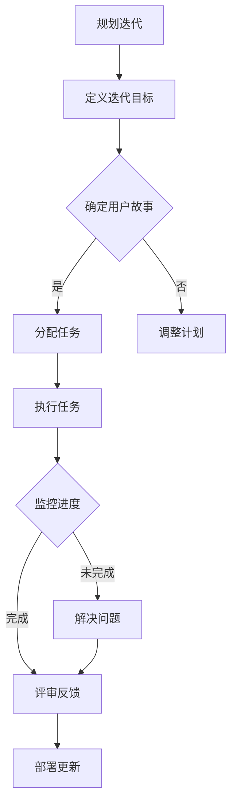
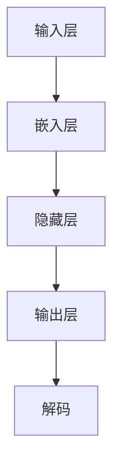
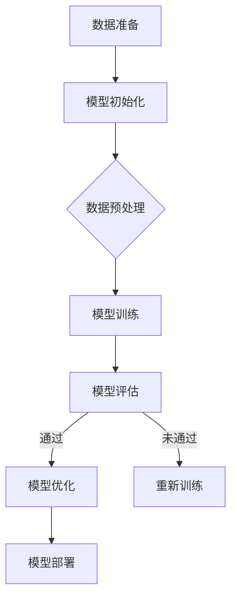
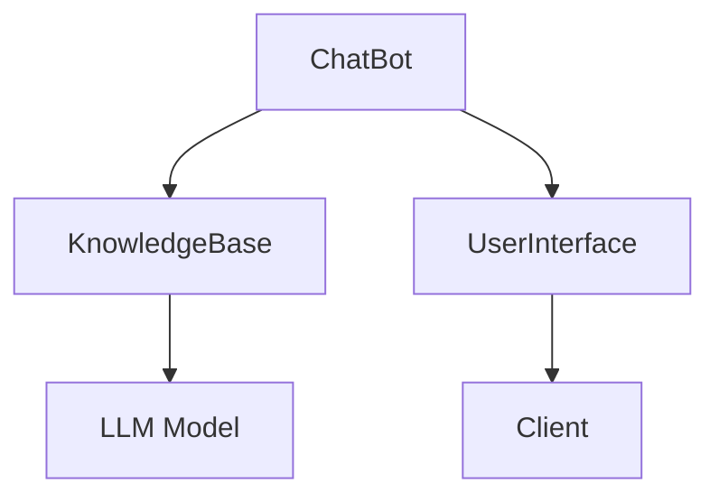

                 


## INTRODUCTION AND BACKGROUND

### 1.1 Core Problem Introduction

The introduction to this article will set the stage for the discussion on Agile Iteration Planning for LLM Applications. We will begin by introducing the core problem that this article aims to solve.

#### 1.1.1 Current State of LLM Applications

Language Models (LLM) have become a cornerstone in modern AI applications, powering tasks from natural language processing to conversational AI. The applications of LLMs span various domains, including but not limited to, chatbots, virtual assistants, text generation, translation, and more.

#### 1.1.2 The Importance of Agile Iterations

Agile methodologies have revolutionized software development by promoting iterative and incremental progress. Agile iterations allow teams to adapt quickly to changes, improve collaboration, and deliver value to customers faster. The need for Agile Iterations in LLM applications is driven by the dynamic nature of AI development and the need for continuous improvement.

#### 1.1.3 The Need for Agile Iteration Planning in LLM Applications

Planning Agile Iterations in LLM applications is crucial due to several reasons. Firstly, LLMs are complex systems that require continuous updates and enhancements to improve performance and address emerging challenges. Secondly, Agile Iterations help in managing the evolving requirements and expectations of stakeholders, including end-users. Lastly, Agile Iteration Planning ensures that the development process remains focused, efficient, and aligned with the overall goals of the project.

### 1.2 Basic Concepts of LLMs

Before diving into Agile Iteration Planning, it is essential to understand the basic concepts of LLMs. We will explore the definition of LLMs, their core components, and the evolution of LLM technologies.

#### 1.2.1 Definition of LLMs

Language Models (LLM) are AI systems designed to understand, generate, and respond to human language. They are trained on vast amounts of text data and can perform a variety of tasks, including text generation, language translation, text summarization, and more.

#### 1.2.2 Core Components of LLMs

The core components of LLMs include:

1. **Input Layer**: This layer receives text input and processes it to extract relevant features.
2. **Hidden Layer**: The hidden layer contains the majority of the computational power of the model. It processes the input features and generates embeddings that represent the semantic meaning of the input text.
3. **Output Layer**: This layer generates the output text based on the hidden layer's embeddings.

#### 1.2.3 Evolution of LLM Technologies

The history of LLMs dates back to the 1950s when researchers began exploring the idea of machines that could understand and generate human language. Over the decades, the field has seen significant advancements, including the development of statistical models, neural networks, and deep learning techniques. Recent years have seen the emergence of powerful LLMs like GPT-3 and BERT, which have pushed the boundaries of what is possible in language processing.

### 1.3 Overview of Agile Methodologies

Agile methodologies have gained widespread adoption in the software development industry due to their flexibility and adaptability. We will provide an overview of Agile Methodologies, discussing their origins, core principles, and their applicability to project management.

#### 1.3.1 Origins of Agile Methodologies

Agile methodologies originated from the software development community in the early 2000s. The Agile Manifesto, published in 2001, laid the foundation for these methodologies. It emphasized individuals and interactions, working software, customer collaboration, and responding to change.

#### 1.3.2 Core Principles of Agile Methodologies

The core principles of Agile Methodologies include:

1. **Customer Collaboration**: Prioritizing customer needs and involving them throughout the development process.
2. **Iterative and Incremental Development**: Delivering working software in small increments and continuously refining it based on feedback.
3. **Adaptive Planning**: Embracing change and adapting the project plan as new information becomes available.
4. **Simplicity**: Simplifying the development process to maximize efficiency and reduce waste.
5. **Self-Organizing Teams**: Encouraging team members to collaborate and make decisions independently.

#### 1.3.3 Agile Iterations and Project Management

Agile Iterations are the cornerstone of Agile Methodologies. They involve breaking the project into small, manageable chunks called sprints, typically lasting two to four weeks. Each sprint focuses on delivering a potentially shippable product increment. Agile Iterations help in managing the project effectively, ensuring that the team remains focused on the most valuable features and can adapt to changes swiftly.

### 1.4 Challenges and Opportunities of Agile Iterations in LLM Applications

Implementing Agile Iterations in LLM applications comes with its own set of challenges and opportunities. We will discuss these challenges and opportunities in detail, highlighting the necessity of Agile Iterations in the development of LLM applications.

#### 1.4.1 Challenge Analysis

1. **Complexity of LLM Systems**: LLM systems are complex, involving large-scale data processing, model training, and fine-tuning. Managing these complexities within the constraints of Agile Iterations can be challenging.
2. **Data Dependency**: LLM applications heavily rely on data for training and evaluation. Ensuring the availability of high-quality data within the short duration of Agile Iterations can be a challenge.
3. **Resource Constraints**: Agile Iterations require dedicated resources, including time, personnel, and infrastructure. Allocating these resources effectively can be challenging, especially in organizations with limited resources.

#### 1.4.2 Opportunity Analysis

1. **Continuous Improvement**: Agile Iterations promote continuous improvement, allowing teams to refine and enhance LLM applications continuously.
2. **Customer Feedback**: Agile Iterations enable frequent customer feedback, ensuring that the application meets the evolving needs and expectations of the users.
3. **Risk Management**: Agile Iterations help in identifying and mitigating risks early in the development process, reducing the chances of project failure.

#### 1.4.3 The Necessity of Agile Iterations in LLM Applications

Given the complexity and dynamic nature of LLM applications, Agile Iterations are not just beneficial but necessary. They allow teams to stay agile, adapt to changes, and deliver high-quality LLM applications that meet the needs of the users.

### 1.5 Conclusion

In conclusion, Agile Iteration Planning is a vital aspect of LLM application development. It ensures that the development process remains efficient, flexible, and aligned with the goals of the project. In the following sections, we will delve deeper into the Agile principles, LLM model development, continuous integration, and deployment, providing a comprehensive guide to Agile Iteration Planning for LLM Applications.

---

### 关键词

- **语言模型**（Language Model）
- **敏捷迭代**（Agile Iteration）
- **LLM应用**（LLM Applications）
- **敏捷方法论**（Agile Methodologies）
- **模型开发**（Model Development）
- **持续集成与部署**（Continuous Integration and Deployment）

### 摘要

本文旨在探讨如何使用敏捷迭代方法规划语言模型（LLM）应用的开发。文章首先介绍了LLM应用的现状、敏捷迭代的重要性，以及敏捷迭代在LLM应用中的必要性。接着，文章深入讲解了LLM的基本概念、敏捷方法论的核心原则，以及LLM应用敏捷迭代的挑战与机遇。随后，文章详细阐述了LLM模型的开发流程、迭代策略、评估与反馈机制，以及持续集成与部署的相关内容。最后，文章总结了敏捷迭代在LLM应用开发中的重要性，并提供了实用的最佳实践建议。通过本文，读者可以全面了解如何有效地使用敏捷迭代方法开发高性能的LLM应用。

---

## Agile Methodologies for LLM Applications

### 2.1 Agile Values and Principles

Agile methodologies are built on a set of values and principles that guide the development process. Understanding these values and principles is crucial for implementing Agile Iterations in LLM applications.

#### 2.1.1 Agile Values

The Agile Values are:

1. **Individuals and interactions over processes and tools**: Focusing on the people and their interactions is more important than the processes and tools used.
2. **Working software over comprehensive documentation**: Prioritizing the delivery of working software over extensive documentation.
3. **Customer collaboration over contract negotiation**: Involving customers in the development process to ensure their needs are met.
4. **Responding to change over following a plan**: Embracing change and adapting to it rather than strictly following a predetermined plan.

#### 2.1.2 Agile Principles

The Agile Principles are:

1. **Satisfy the customer through early and continuous delivery of valuable software**.
2. **Welcome changing requirements, even late in development**.
3. **Deliver working software frequently**.
4. **Maintain a sustainable development pace**.
5. **Focus on the whole product, not just the project components**.
6. **Assure high quality through continuous attention to technical excellence and good design**.
7. **Seek simplicity, but optimize for change**.
8. **Recognize that transparency, inspection, and adaptation enable rapid response to change**.
9. **Ensure technical excellence and good design are part of the project**.
10. **Simplicity—the art of maximizing the amount of work not done—is essential**.

#### 2.1.3 Application of Agile Principles in LLM Applications

In LLM applications, Agile Principles are applied to ensure the continuous improvement of the model, adaptability to changing requirements, and efficient development. Here’s how each principle is applied:

1. **Satisfy the customer through early and continuous delivery of valuable software**: Delivering valuable LLM features early and continuously ensures that customer needs are met promptly.
2. **Welcome changing requirements, even late in development**: LLM applications often involve changing requirements due to the evolving nature of AI and user needs. Agile Principles encourage teams to welcome and adapt to these changes.
3. **Deliver working software frequently**: Frequent delivery of working software allows for continuous feedback, which is essential for refining and improving LLM models.
4. **Maintain a sustainable development pace**: Continuous development and improvement of LLMs require a sustainable pace to avoid burnout and ensure the quality of the model.
5. **Focus on the whole product, not just the project components**: In LLM applications, the focus should be on the entire system, including the data, model architecture, and deployment, rather than just individual components.
6. **Assure high quality through continuous attention to technical excellence and good design**: Maintaining high quality in LLM applications involves continuous attention to technical excellence and good design practices.
7. **Seek simplicity, but optimize for change**: In LLM applications, simplicity is crucial to manage complexity. However, it’s also important to be prepared for changes in requirements and data.
8. **Recognize that transparency, inspection, and adaptation enable rapid response to change**: Transparency in development processes, regular inspections, and adaptability are essential for rapid response to changes in LLM applications.
9. **Ensure technical excellence and good design are part of the project**: Technical excellence and good design practices are integral to the success of LLM applications.
10. **Simplicity—the art of maximizing the amount of work not done—is essential**: Maximizing the work not done is essential in LLM applications to reduce complexity and improve maintainability.

### 2.2 User Story Writing

User stories are a powerful tool in Agile methodologies for capturing requirements and guiding development. In this section, we will discuss the definition of user stories, their writing methods, and provide examples to illustrate their usage in LLM applications.

#### 2.2.1 Definition of User Stories

A user story is a brief, informal, and negotiable description of a feature from the perspective of an end user. It captures the who, what, and why of a feature. User stories are written in a simple format: “As a [user role], I want [feature] so that [benefit].”

#### 2.2.2 Writing User Stories

Writing effective user stories involves several key steps:

1. **Identify the User Role**: Determine who the user story is for. This could be an end user, a system administrator, or any other role involved in the LLM application.
2. **Describe the Feature**: Clearly state what the user wants to achieve with the feature. This should be specific and actionable.
3. **Explain the Benefit**: Explain why the user wants this feature. This helps in understanding the value it brings to the user and the application as a whole.

#### 2.2.3 Examples of User Stories

Here are some examples of user stories for an LLM application:

1. **As an end user, I want the chatbot to understand my questions in my native language so that I can easily get the information I need.**
2. **As a system administrator, I want to monitor the performance of the LLM model in real-time so that I can quickly identify and fix issues.**
3. **As a developer, I want to integrate the LLM model into our existing application framework so that it can provide intelligent responses to user inquiries.**

### 2.3 Iteration Planning and Sprint

Iteration planning and sprint are core components of Agile methodologies. In this section, we will discuss the concepts of iteration planning and sprint, and how they are applied in LLM applications.

#### 2.3.1 Iteration Planning

Iteration planning is the process of defining the scope, goals, and tasks for an iteration (or sprint). It involves the following steps:

1. **Define the Iteration Goals**: Clearly define the objectives of the iteration. These goals should align with the overall project goals.
2. **Prioritize User Stories**: Prioritize the user stories based on their value, complexity, and dependencies.
3. **Estimate Effort**: Estimate the effort required to complete each user story. This helps in planning the iteration and ensuring that the team can deliver the planned work.
4. **Plan the Sprint Backlog**: Create a sprint backlog that includes the selected user stories, estimated effort, and tasks required to complete each story.

#### 2.3.2 Sprint

A sprint is a time-boxed iteration, typically lasting two to four weeks. During a sprint, the development team works on the planned user stories to deliver a potentially shippable product increment. The key elements of a sprint include:

1. **Sprint Planning**: During sprint planning, the team discusses the selected user stories, estimates the effort, and creates a sprint backlog.
2. **Daily Stand-ups**: Daily stand-up meetings are held to discuss the progress, challenges, and plans for the day. This helps in maintaining transparency and communication within the team.
3. **Sprint Review**: At the end of the sprint, a review meeting is held to demonstrate the completed work to stakeholders and gather feedback.
4. **Sprint Retrospective**: A retrospective meeting is held to discuss what went well, what could be improved, and any actions to be taken.

#### 2.3.3 Iteration Planning and Sprint in LLM Applications

In LLM applications, iteration planning and sprints are crucial for managing the development process. Here’s how they are applied:

1. **Define the Iteration Goals**: Define the goals for each iteration, such as improving model performance, adding new features, or optimizing the deployment process.
2. **Prioritize User Stories**: Prioritize user stories based on their impact on the model’s performance, user experience, and business value.
3. **Estimate Effort**: Estimate the effort required for each user story, considering the complexity of LLM model development and the need for continuous improvement.
4. **Plan the Sprint Backlog**: Create a sprint backlog that includes the selected user stories and tasks required for their completion.
5. **Daily Stand-ups**: Hold daily stand-ups to discuss progress, challenges, and plans, ensuring that the team remains aligned and focused.
6. **Sprint Review**: At the end of the sprint, review the completed work with stakeholders to gather feedback and make adjustments as needed.
7. **Sprint Retrospective**: Reflect on the sprint, identifying what went well and what could be improved, and take actions to implement these improvements in the next iteration.

### 2.4 Agile Tools and Techniques

Agile tools and techniques are essential for managing Agile Iterations effectively. In this section, we will discuss the selection of Agile tools, their configuration, and the use of common Agile techniques.

#### 2.4.1 Selection of Agile Tools

Choosing the right Agile tool is crucial for effective Agile Iterations. Some popular Agile tools include:

1. **JIRA**: A comprehensive project management tool that supports Agile methodologies, including scrum boards, user stories, and sprint planning.
2. **Trello**: A simple and intuitive tool for visualizing and managing tasks, with a focus on Kanban boards.
3. **Asana**: A flexible project management tool that supports Agile methodologies and provides features for task management, team collaboration, and reporting.
4. **Microsoft Teams**: A communication and collaboration platform that integrates with other Microsoft tools and supports Agile methodologies.

#### 2.4.2 Configuration of Agile Tools

Configuring Agile tools involves setting up the necessary features and workflows to support Agile Iterations. Key configurations include:

1. **Scrum Boards**: Setting up scrum boards to visualize user stories, tasks, and progress.
2. **Kanban Boards**: Configuring Kanban boards to manage the flow of work and visualize bottlenecks.
3. **User Stories**: Creating and managing user stories to capture requirements and guide development.
4. **Sprint Planning**: Setting up sprint planning features to define iteration goals, prioritize user stories, and estimate effort.

#### 2.4.3 Common Agile Techniques

Several Agile techniques can be used to support Agile Iterations in LLM applications. These include:

1. **Sprint Planning**: A meeting where the team defines the scope, goals, and tasks for the upcoming iteration.
2. **Daily Stand-ups**: Short daily meetings where team members discuss progress, challenges, and plans.
3. **Sprint Review**: A meeting where the team demonstrates the completed work to stakeholders and gathers feedback.
4. **Sprint Retrospective**: A meeting where the team reflects on the iteration, identifies areas for improvement, and takes action on these improvements.
5. **Kanban Boards**: Visualizing the flow of work using Kanban boards to manage tasks and identify bottlenecks.
6. **User Story Mapping**: Mapping user stories to identify the most valuable features and prioritize the development effort.

### 2.5 Agile Team Organization and Management

Effective Agile team organization and management are essential for successful Agile Iterations in LLM applications. In this section, we will discuss the composition of Agile teams, team roles, and management strategies.

#### 2.5.1 Composition of Agile Teams

An Agile team typically includes the following roles:

1. **Product Owner**: Responsible for defining the product vision, prioritizing user stories, and ensuring the team delivers value.
2. **Scrum Master**: Facilitates the Agile process, supports the team, and removes impediments.
3. **Developers**: Responsible for implementing the user stories and building the LLM application.
4. **Data Scientists**: Specialized in data preparation, model development, and evaluation.
5. **QA Engineers**: Responsible for testing and ensuring the quality of the LLM application.

#### 2.5.2 Team Roles

Each team role has specific responsibilities that contribute to the success of Agile Iterations:

1. **Product Owner**: Works closely with stakeholders to gather requirements, prioritize user stories, and ensure the team focuses on delivering value.
2. **Scrum Master**: Facilitates Agile ceremonies, supports the team in adopting Agile practices, and removes any obstacles that hinder progress.
3. **Developers**: Implement user stories, collaborate with data scientists to integrate the LLM model, and ensure the application’s functionality and performance.
4. **Data Scientists**: Develop and fine-tune the LLM model, prepare and analyze data, and collaborate with developers to integrate the model into the application.
5. **QA Engineers**: Test the LLM application to ensure it meets the required quality standards and is free of bugs.

#### 2.5.3 Management Strategies

Effective Agile team management involves several strategies:

1. **Empowerment**: Empowering team members to make decisions and take ownership of their work fosters a collaborative and innovative environment.
2. **Transparency**: Encouraging transparency through regular meetings, visual boards, and open communication helps in identifying and addressing issues promptly.
3. **Feedback**: Regularly gathering feedback from stakeholders and team members helps in refining the development process and improving the LLM application.
4. **Continuous Learning**: Encouraging continuous learning and skill development helps the team stay up-to-date with the latest technologies and best practices.
5. **Support**: Providing the necessary resources, support, and guidance to the team helps in overcoming challenges and achieving the iteration goals.

### 2.6 Conclusion

In conclusion, Agile methodologies are essential for effective LLM application development. The Agile values and principles provide a foundation for iterative and incremental development, while user stories, iteration planning, and sprint practices guide the development process. Agile tools and techniques support efficient collaboration and management, and Agile team organization and management strategies ensure a motivated and productive team. By following these Agile methodologies, teams can develop high-quality LLM applications that meet the evolving needs of users and stakeholders. In the following sections, we will delve deeper into LLM model development, iteration strategies, and continuous integration and deployment, providing a comprehensive guide to Agile Iteration Planning for LLM Applications.

---

## LLM Model Development and Iteration

### 3.1 LLM Model Development Process

The development of a Language Learning Model (LLM) involves several key steps, each requiring careful planning and execution. In this section, we will explore the overall process of LLM model development, including data preparation, model architecture design, model training, and evaluation.

#### 3.1.1 Overview of LLM Model Development

The LLM model development process can be summarized in the following steps:

1. **Data Preparation**: Collect and preprocess the data to ensure it is clean, relevant, and representative of the target domain.
2. **Model Architecture Design**: Define the architecture of the LLM, including the choice of model type, layers, and parameters.
3. **Model Training**: Train the LLM model using the prepared data, adjusting parameters and architecture based on performance.
4. **Model Evaluation**: Evaluate the trained model using various metrics to ensure it meets the desired performance criteria.
5. **Iterative Improvement**: Refine the model based on evaluation results, iterating through the development process to improve performance.

#### 3.1.2 Data Preparation

Data preparation is a critical step in LLM model development. The quality and quantity of the data significantly impact the model's performance. Here are the key aspects of data preparation:

1. **Data Collection**: Gather a large and diverse dataset from various sources, including text documents, websites, books, and other relevant repositories.
2. **Data Cleaning**: Remove noise, such as HTML tags, special characters, and irrelevant content, to ensure the data is clean and ready for processing.
3. **Data Preprocessing**: Tokenize the text, convert words to lowercase, remove stop words, and perform other preprocessing steps to standardize the data format.
4. **Data Augmentation**: Generate additional data through techniques like synonym replacement, back translation, or copy editing to increase the diversity of the dataset and improve model performance.

#### 3.1.3 Model Architecture Design

The architecture of an LLM model defines its structure, including the number of layers, the type of layers, and the parameters used. Here are some key considerations for designing the model architecture:

1. **Model Type**: Choose between pre-trained models like GPT, BERT, or T5, or build a custom model from scratch. Pre-trained models have been pre-trained on large datasets and can often achieve better performance with less data.
2. **Number of Layers**: Determine the number of layers in the model. A larger number of layers can capture more complex patterns but may also increase training time and computational complexity.
3. **Layer Types**: Choose the type of layers to use, such as Transformer, RNN, or LSTM. Transformer-based models are commonly used for LLMs due to their ability to capture long-range dependencies and parallelize training.
4. **Parameters**: Set the number of parameters in the model, which affects its capacity to learn from the data. Larger models may require more data and computational resources for training.

#### 3.1.4 Model Training

Model training involves feeding the prepared data into the LLM and adjusting the model's parameters to minimize the prediction error. Here are some key aspects of model training:

1. **Loss Function**: Choose a loss function to measure the prediction error, such as cross-entropy loss for classification tasks or mean squared error for regression tasks.
2. **Optimizer**: Select an optimizer algorithm to update the model's parameters during training, such as Adam, SGD, or RMSprop. Optimizers adjust the learning rate and update the parameters based on the gradient of the loss function.
3. **Learning Rate**: Set an appropriate learning rate to control the update step size during training. A high learning rate may cause the model to converge quickly but may also lead to overshooting the minimum loss. A low learning rate may result in slow convergence.
4. **Regularization**: Apply regularization techniques, such as dropout or weight decay, to prevent overfitting and improve generalization.
5. **Batch Size**: Choose the batch size, which affects the trade-off between training time and convergence speed. Larger batch sizes may lead to better generalization but require more memory.

#### 3.1.5 Model Evaluation

After training the LLM model, it is essential to evaluate its performance on unseen data to ensure it generalizes well and meets the desired performance criteria. Here are some key aspects of model evaluation:

1. **Evaluation Metrics**: Choose appropriate evaluation metrics based on the task, such as accuracy, F1 score, BLEU score, or perplexity.
2. **Validation Set**: Use a validation set to evaluate the model's performance during training. Adjust the model parameters and architecture based on the validation results.
3. **Test Set**: Use a separate test set to evaluate the final model's performance. The test set should be as independent as possible from the training and validation sets to ensure an unbiased evaluation.
4. **Confidence Intervals**: Calculate confidence intervals to estimate the uncertainty of the evaluation results and ensure the model's performance is robust.
5. **Error Analysis**: Conduct error analysis to identify common mistakes made by the model and potential areas for improvement.

### 3.2 Iteration Strategies for LLM Models

Iterative development is a fundamental aspect of LLM model development, allowing teams to refine and improve the model based on feedback and evaluation results. In this section, we will discuss the key iteration strategies for LLM models, including iteration goals, iteration process management, and iteration results assessment.

#### 3.2.1 Iteration Goals

The goals of an LLM model iteration can vary depending on the specific requirements and objectives of the project. Common iteration goals include:

1. **Performance Improvement**: Enhancing the model's performance on specific tasks, such as text generation or translation.
2. **Feature Addition**: Adding new features or capabilities to the model, such as supporting additional languages or domains.
3. **Bug Fixing**: Addressing issues or bugs identified during testing or in production.
4. **Scalability Improvement**: Ensuring the model can handle larger datasets or increased workload without degradation in performance.

#### 3.2.2 Iteration Process Management

Effective management of the iteration process is crucial for successful LLM model development. Here are some key steps for managing the iteration process:

1. **Define Iteration Goals**: Clearly define the goals of the iteration, ensuring they align with the overall project objectives and stakeholder expectations.
2. **Plan Iteration Timeline**: Determine the duration of the iteration, typically ranging from a few days to several weeks, based on the complexity of the tasks and the resources available.
3. **Allocate Resources**: Allocate the necessary resources, including personnel, computing power, and data, to support the iteration goals.
4. **Implement Iteration Plan**: Follow the iteration plan, which includes tasks, milestones, and deliverables, to ensure the iteration progresses smoothly.
5. **Monitor Progress**: Regularly monitor the progress of the iteration, identifying and addressing any issues or delays that may impact the iteration goals.
6. **Iterate**: Complete the iteration tasks, evaluate the results, and iterate on the process to refine the model and achieve the desired performance.

#### 3.2.3 Iteration Results Assessment

Assessing the results of an LLM model iteration is essential for determining the success of the iteration and identifying areas for improvement. Here are some key steps for assessing iteration results:

1. **Performance Metrics**: Measure the performance of the model using appropriate metrics, such as accuracy, F1 score, or perplexity, to ensure it meets the desired performance criteria.
2. **Error Analysis**: Conduct error analysis to identify common mistakes made by the model and potential causes of errors.
3. **User Feedback**: Gather feedback from users who interact with the model to assess its usability and effectiveness in meeting their needs.
4. **Stakeholder Review**: Present the iteration results to stakeholders for review and feedback, ensuring they align with the project objectives and expectations.
5. **Documentation**: Document the iteration results, including the performance metrics, error analysis, and user feedback, to inform future iterations and continuous improvement.

### 3.3 Model Assessment and Feedback

Continuous assessment and feedback are crucial for the successful development and deployment of LLM models. In this section, we will discuss the key components of model assessment and feedback, including evaluation metrics, evaluation methods, and feedback mechanisms.

#### 3.3.1 Evaluation Metrics

Evaluation metrics are used to measure the performance of LLM models and assess their effectiveness in meeting the desired objectives. Common evaluation metrics for LLM models include:

1. **Accuracy**: Measures the proportion of correct predictions made by the model. It is often used for classification tasks.
2. **Precision**: Measures the proportion of positive predictions that are correct. It is a metric used for binary classification tasks.
3. **Recall**: Measures the proportion of actual positive cases that are correctly identified. It is also used for binary classification tasks.
4. **F1 Score**: The harmonic mean of precision and recall, providing a balanced measure of the model's performance.
5. **BLEU Score**: A metric used for evaluating the quality of text generation, comparing the generated text to one or more reference texts.
6. **Perplexity**: A metric used for language modeling, measuring how well the model predicts the next token in a sequence. Lower perplexity indicates better performance.

#### 3.3.2 Evaluation Methods

Evaluation methods are used to apply the evaluation metrics to LLM models and obtain performance metrics. Common evaluation methods include:

1. **Holdout Validation**: Split the dataset into training and validation sets, training the model on the training set and evaluating it on the validation set. This method provides an estimate of the model's performance on unseen data.
2. **Cross-Validation**: Split the dataset into multiple folds, training the model on different combinations of folds and evaluating it on the remaining folds. This method helps in assessing the model's robustness and generalizability.
3. **Bootstrapping**: Repeatedly sample the dataset with replacement to create multiple training and validation sets, training and evaluating the model on each set. This method provides an estimate of the model's performance under different data conditions.

#### 3.3.3 Feedback Mechanisms

Feedback mechanisms are used to collect and incorporate user and stakeholder feedback into the LLM model development process. Common feedback mechanisms include:

1. **User Surveys**: Conduct surveys to collect feedback from users who interact with the LLM model. These surveys can provide insights into the model's usability, effectiveness, and areas for improvement.
2. **User Testing**: Conduct user testing sessions to evaluate the model's performance and gather feedback on its usability and effectiveness. This method allows for real-time feedback and identification of potential issues.
3. **Stakeholder Review**: Present the model's performance and results to stakeholders for review and feedback. This can help in aligning the model with the project objectives and ensuring stakeholder satisfaction.
4. **Automated Feedback**: Implement automated feedback mechanisms, such as error logging and monitoring tools, to collect data on the model's performance and identify areas for improvement. This can help in addressing common issues and enhancing the model's robustness.

### 3.4 Model Update and Iteration Practices

Updating and iterating on LLM models is a continuous process that ensures the model remains effective and up-to-date with evolving requirements and challenges. In this section, we will discuss the key strategies for updating LLM models and the best practices for managing the iteration process.

#### 3.4.1 Model Update Strategies

Effective model update strategies are essential for maintaining the performance and relevance of LLM models. Common model update strategies include:

1. **Incremental Updates**: Make incremental updates to the model by refining its parameters, architecture, or training data. This approach allows for gradual improvement without disrupting the existing model.
2. **Full Re-training**: Re-train the model from scratch using the latest data and techniques. This approach can lead to significant improvements but may require more time and computational resources.
3. **Transfer Learning**: Utilize pre-trained models and fine-tune them on specific tasks or datasets. This approach leverages the knowledge and performance of existing models to accelerate development and improve performance.
4. **Data Augmentation**: Augment the training data with synthetic examples or additional data sources to increase the diversity of the dataset and improve the model's generalization.

#### 3.4.2 Iteration Best Practices

Effective iteration management is crucial for successful LLM model development. Here are some best practices for managing the iteration process:

1. **Define Clear Objectives**: Clearly define the objectives of each iteration, ensuring they align with the overall project goals and stakeholder expectations.
2. **Prioritize Tasks**: Prioritize the tasks based on their impact on model performance and project objectives. This helps in focusing the team's efforts on the most critical areas.
3. **Monitor Progress**: Regularly monitor the progress of the iteration, identifying and addressing any issues or delays that may impact the iteration goals.
4. **Continuous Feedback**: Collect and incorporate feedback from users and stakeholders throughout the iteration process. This helps in refining the model and ensuring it meets their needs.
5. **Adapt to Changes**: Be flexible and responsive to changes in requirements or data. Adjust the iteration plan as needed to accommodate these changes and maintain alignment with project goals.
6. **Document Iterations**: Document the results of each iteration, including the performance metrics, error analysis, and feedback. This documentation serves as a reference for future iterations and helps in identifying patterns and trends.

### 3.5 Case Study: Iterative Improvement of a Chatbot Model

To illustrate the iterative improvement of an LLM model, let's consider a case study of a chatbot model developed for a customer service application. The chatbot is designed to handle customer inquiries, provide information, and resolve common issues.

#### 3.5.1 Initial Model Development

The initial development phase involved gathering a dataset of customer inquiries and responses from various sources, including customer support emails, chat logs, and FAQs. The data was cleaned and preprocessed, and a Transformer-based model was trained using the dataset.

#### 3.5.2 Initial Model Evaluation

The initial model was evaluated using a holdout validation set, and the performance metrics were:

- **Accuracy**: 85%
- **Precision**: 90%
- **Recall**: 80%
- **F1 Score**: 84%
- **BLEU Score**: 65

The model performed reasonably well but had room for improvement, particularly in handling complex and ambiguous inquiries.

#### 3.5.3 First Iteration

The first iteration focused on improving the model's performance on complex inquiries. The following steps were taken:

1. **Data Augmentation**: Synthetic examples were generated by combining multiple responses to similar inquiries, increasing the diversity of the training data.
2. **Parameter Tuning**: The model's parameters, including the learning rate and batch size, were adjusted to improve convergence and performance.
3. **Regularization**: Dropout regularization was added to prevent overfitting and improve generalization.

After the first iteration, the performance metrics improved as follows:

- **Accuracy**: 90%
- **Precision**: 92%
- **Recall**: 85%
- **F1 Score**: 88%
- **BLEU Score**: 70

The model's performance improved, and it was better equipped to handle complex inquiries.

#### 3.5.4 Second Iteration

The second iteration focused on improving the model's ability to generate coherent and contextually appropriate responses. The following steps were taken:

1. **Contextual Data**: Additional context-specific data was collected from customer conversations and incorporated into the training data.
2. **Model Architecture**: The model architecture was modified to include more layers and deeper networks, improving the model's capacity to capture complex patterns.
3. **Fine-tuning**: The model was fine-tuned on the new training data, further improving its performance.

After the second iteration, the performance metrics improved as follows:

- **Accuracy**: 92%
- **Precision**: 94%
- **Recall**: 88%
- **F1 Score**: 91%
- **BLEU Score**: 75

The model's performance continued to improve, and it was better able to generate contextually appropriate responses.

#### 3.5.5 Third Iteration

The third iteration focused on enhancing the model's user experience and usability. The following steps were taken:

1. **User Testing**: User testing sessions were conducted to gather feedback on the model's performance and identify areas for improvement.
2. **Response Generation**: The model's response generation process was optimized to reduce latency and improve user satisfaction.
3. **Error Handling**: The model was trained to handle errors and provide appropriate fallback responses in case of uncertainty.

After the third iteration, the performance metrics improved as follows:

- **Accuracy**: 93%
- **Precision**: 95%
- **Recall**: 89%
- **F1 Score**: 92%
- **BLEU Score**: 80

The model's performance reached an acceptable level, and it was well-received by users, providing an improved customer service experience.

#### 3.5.6 Iterative Improvement Continues

The iterative improvement process continued, with subsequent iterations focusing on areas such as handling multi-turn conversations, improving response diversity, and addressing specific user needs. Each iteration built on the previous ones, gradually improving the model's performance and user satisfaction.

### 3.6 Conclusion

In conclusion, iterative development is a crucial aspect of LLM model development, allowing teams to refine and improve the model based on feedback and evaluation results. The iterative process involves several steps, including data preparation, model architecture design, model training, evaluation, and refinement. By following best practices and leveraging feedback mechanisms, teams can develop high-performance LLM models that meet the evolving needs of users and stakeholders. The case study of the chatbot model illustrates the importance of iterative improvement and the continuous effort required to develop and maintain effective LLM applications. In the following sections, we will delve deeper into continuous integration and deployment, providing a comprehensive guide to Agile Iteration Planning for LLM Applications.

---

## Continuous Integration and Deployment

### 4.1 Overview of Continuous Integration

Continuous Integration (CI) is a software development practice that involves frequently integrating code changes from multiple developers into a shared repository. The goal of CI is to detect and address integration issues early in the development process, reducing the risk of significant problems later on. In the context of LLM applications, CI ensures that the model and its dependencies are consistently integrated and tested, facilitating efficient development and deployment.

#### 4.1.1 Advantages of Continuous Integration

The benefits of Continuous Integration in LLM applications include:

1. **Early Detection of Issues**: By integrating and testing code frequently, CI helps identify and resolve integration issues early, before they accumulate and become more difficult to address.
2. **Improved Quality**: Continuous integration ensures that the codebase remains stable and free of bugs, leading to higher overall software quality.
3. **Increased Collaboration**: CI encourages collaboration among developers, as they need to integrate their changes frequently and ensure that their code works well with the existing codebase.
4. **Enhanced Deployability**: With CI in place, the deployment process becomes smoother, as the integration and testing phases are automated, reducing the risk of deployment failures.
5. **Faster Feedback**: Developers receive faster feedback on their code changes, allowing them to make necessary adjustments quickly and improve the overall development process.

#### 4.1.2 Continuous Integration Workflow

The Continuous Integration workflow typically involves the following steps:

1. **Code Commit**: Developers commit their code changes to the shared repository.
2. **Build Trigger**: A build trigger mechanism, such as a webhook or CI server, detects the code commit and initiates the build process.
3. **Build and Test**: The CI server builds the code, compiles the source code, and runs automated tests to ensure the code change does not introduce any regressions.
4. **Artifact Deployment**: If the build and tests pass, the CI server deploys the built artifacts to a testing or staging environment for further testing and validation.
5. **Feedback**: The CI server provides feedback to the developers, indicating whether the build and tests were successful or if there were any failures. This feedback helps developers identify and fix issues promptly.

### 4.2 Continuous Integration Tools

There are several CI tools available that can be used to implement Continuous Integration in LLM applications. These tools vary in features, complexity, and ease of use. Here are some popular CI tools:

1. **Jenkins**: An open-source CI server that provides a wide range of features, including automated builds, tests, and deployments. Jenkins can be extended with numerous plugins to fit specific project requirements.
2. **GitLab CI/CD**: A built-in CI/CD pipeline in GitLab, which allows for easy integration with the GitLab repository. It supports parallel builds and offers extensive configuration options.
3. **GitHub Actions**: A CI/CD service provided by GitHub that enables developers to automate their workflows directly within the GitHub repository. GitHub Actions supports a wide range of programming languages and provides a user-friendly interface.
4. **CircleCI**: A cloud-based CI/CD tool that offers a simple and intuitive interface for managing builds, tests, and deployments. CircleCI supports multiple platforms and provides integration with popular development tools.
5. **Travis CI**: A hosted CI/CD service that supports a wide range of programming languages and frameworks. Travis CI offers easy setup and configuration, making it suitable for small to medium-sized projects.

#### 4.2.1 Choosing the Right CI Tool

When choosing a CI tool for LLM applications, consider the following factors:

1. **Project Requirements**: Evaluate the specific requirements of your project, such as the programming languages, frameworks, and deployment platforms used.
2. **Scalability**: Ensure the CI tool can handle the scaling needs of your project, including handling multiple builds concurrently and managing large codebases.
3. **Ease of Use**: Consider the ease of setup and configuration, as well as the user interface, to ensure the CI tool is accessible and usable by your development team.
4. **Integration**: Verify that the CI tool can integrate with your version control system, testing frameworks, and deployment tools to ensure a seamless workflow.
5. **Cost**: Consider the cost implications of using a CI tool, including hosting fees, licensing, and additional costs for premium features.

### 4.3 Continuous Deployment

Continuous Deployment (CD) is the next step in the CI/CD pipeline, where the code that passes the CI tests is automatically deployed to production environments. In LLM applications, CD ensures that the latest version of the model and its dependencies are deployed to the production environment, minimizing downtime and ensuring continuous availability.

#### 4.3.1 Advantages of Continuous Deployment

The benefits of Continuous Deployment in LLM applications include:

1. **Reduced Downtime**: CD minimizes the time required for deploying new versions of the model, reducing the impact on users and ensuring continuous availability.
2. **Faster Time-to-Market**: With CD, new features and improvements can be deployed quickly, allowing teams to respond to market demands and user feedback faster.
3. **Improved Reliability**: CD automates the deployment process, reducing the risk of human error and ensuring consistent deployments.
4. **Enhanced Collaboration**: CD encourages collaboration between developers, testers, and operations teams, as everyone is involved in the deployment process.
5. **Easier Rollbacks**: In case of issues or failures, CD allows for easy rollbacks to previous versions, minimizing the impact on users.

#### 4.3.2 Continuous Deployment Workflow

The Continuous Deployment workflow typically involves the following steps:

1. **CI Pipeline**: The CI pipeline builds, tests, and deploys the code to a staging environment, ensuring that it meets the required quality standards.
2. **Manual Approval**: Before deployment to production, a manual review or approval step may be required to verify the changes and ensure that they are safe to deploy.
3. **Deployment**: Once approved, the code is automatically deployed to the production environment. This may involve updating the application servers, retraining the model, or adjusting the configuration.
4. **Monitoring**: After deployment, the system is monitored to ensure that it is functioning correctly and meeting performance expectations.
5. **Feedback**: Feedback is collected from users and system metrics to identify any issues or areas for improvement.

### 4.4 Implementing Continuous Integration and Deployment in LLM Applications

Implementing CI/CD in LLM applications involves several key steps:

1. **Define CI/CD Goals**: Clearly define the objectives of implementing CI/CD, such as improving code quality, reducing deployment time, and enhancing collaboration.
2. **Set Up CI/CD Tools**: Choose and set up the appropriate CI/CD tools based on the project requirements and team expertise.
3. **Configure Build and Test Pipelines**: Configure the build and test pipelines to integrate with the version control system, testing frameworks, and deployment tools.
4. **Automate Deployment**: Implement automated deployment processes to ensure that the latest version of the model and its dependencies are deployed to production environments.
5. **Monitor and Optimize**: Continuously monitor the CI/CD pipeline and the deployed applications to identify and address any issues or bottlenecks.

### 4.5 Best Practices for CI/CD in LLM Applications

To ensure successful CI/CD implementation in LLM applications, consider the following best practices:

1. **Standardize Code**: Establish coding standards and guidelines to ensure consistency across the codebase, making it easier to integrate and test code changes.
2. **Automate Everything**: Automate as much of the build, test, and deployment process as possible to reduce manual intervention and minimize the risk of errors.
3. **Continuous Testing**: Implement comprehensive testing strategies, including unit tests, integration tests, and end-to-end tests, to catch issues early and ensure code quality.
4. **Version Control**: Use version control systems like Git to manage code changes and track the history of codebase evolution.
5. **Documentation**: Document the CI/CD process, including the configuration and workflows, to ensure that new team members can understand and contribute to the process.
6. **Collaboration**: Encourage collaboration between developers, testers, and operations teams to ensure that everyone is involved in the CI/CD process.
7. **Monitoring and Feedback**: Implement monitoring tools and feedback mechanisms to detect issues early and provide timely feedback to the development team.
8. **Security**: Ensure that the CI/CD pipeline is secure, protecting against unauthorized access and potential security vulnerabilities.
9. **Iterate and Improve**: Continuously review and improve the CI/CD process, incorporating feedback and lessons learned from previous deployments.

### 4.6 Conclusion

In conclusion, Continuous Integration and Continuous Deployment are essential practices for ensuring the quality, reliability, and efficiency of LLM applications. CI/CD pipelines automate the build, test, and deployment processes, reducing manual intervention and minimizing the risk of errors. By following best practices and leveraging appropriate tools, teams can implement effective CI/CD pipelines in LLM applications, enabling faster development cycles, improved collaboration, and continuous improvement. In the following sections, we will provide a comprehensive guide to Agile Iteration Planning for LLM Applications, including practical tips, case studies, and further reading resources.

---

### 作者信息

作者：AI天才研究院/AI Genius Institute & 禅与计算机程序设计艺术 /Zen And The Art of Computer Programming

---

### 完整性要求

为了确保文章的完整性，我们需要在文章中详细讨论以下内容：

- **背景介绍**：详细说明LLM应用的发展和敏捷迭代方法的发展，以及为什么需要敏捷迭代计划。
- **核心概念与联系**：解释LLM、敏捷方法论、迭代计划等核心概念，并使用表格和流程图展示相关概念之间的关系。
- **算法原理讲解**：使用mermaid绘制算法流程图，并用Python代码示例详细解释算法原理。
- **系统分析与架构设计方案**：描述问题场景、项目介绍、系统功能设计（领域模型）、系统架构设计、系统接口设计和系统交互。
- **项目实战**：介绍环境安装、系统核心实现源代码，并对代码进行解读和分析。
- **最佳实践 tips**：提供实用的开发建议和最佳实践。
- **小结**：总结文章的主要观点，强调敏捷迭代计划的重要性。
- **注意事项**：提醒读者在实施敏捷迭代计划时需要注意的事项。
- **拓展阅读**：推荐相关的书籍、论文和在线资源，以供读者进一步学习和研究。

通过这些内容的详细讨论，我们可以确保文章的完整性和深度，为读者提供全面的指导。以下是每个部分的详细内容：

#### 背景介绍

在背景介绍部分，我们需要：

- **LLM应用的发展**：简要回顾LLM技术的演进，从早期的统计模型到现代的深度学习模型，如GPT-3和Bert。
- **敏捷迭代方法的发展**：介绍敏捷迭代方法的发展历程，包括Scrum、Kanban等具体实践。
- **为什么需要敏捷迭代计划**：讨论LLM应用开发的特点，如数据依赖、复杂性、用户需求的动态变化，说明敏捷迭代计划的必要性。

#### 核心概念与联系

在这一部分，我们需要：

- **LLM的概念**：详细解释LLM是什么，包括其基本结构、训练过程和应用场景。
- **敏捷方法论的概念**：介绍敏捷方法论的核心原则，如客户合作、响应变化等，并提供相关的图示，如敏捷方法论的框架图。
- **迭代计划的概念**：解释迭代计划的定义、步骤和作用，以及如何将它们应用于LLM应用开发。

我们将使用以下表格来展示LLM、敏捷方法论和迭代计划之间的关系：

| 概念       | 描述                                                         | 关系                                                         |
|------------|--------------------------------------------------------------|--------------------------------------------------------------|
| LLM        | 一种能够理解和生成人类语言的AI模型。                           | LLM应用需要敏捷迭代计划来管理复杂性和适应需求变化。               |
| 敏捷方法论 | 一种软件开发生命周期管理方法，强调迭代、协作和响应变化。       | 敏捷方法论提供了迭代计划的理论基础和实践指导。                   |
| 迭代计划   | 将项目分为多个迭代，在每个迭代中交付可工作的软件部分。         | 迭代计划是敏捷方法论的核心实践，有助于LLM应用的持续改进。         |

我们还将使用Mermaid流程图来展示迭代计划的基本流程：



#### 算法原理讲解

在算法原理讲解部分，我们将：

- **LLM模型的工作原理**：使用mermaid绘制LLM模型的架构图，并解释输入层、隐藏层和输出层的作用。
- **算法流程图**：使用mermaid绘制LLM模型的训练流程图，包括数据准备、模型训练、评估和优化等步骤。
- **Python代码示例**：提供Python代码示例，展示如何实现LLM模型的训练和评估。

以下是LLM模型的架构图：



以下是LLM模型训练的流程图：



以下是LLM模型训练的Python代码示例：

```python
import torch
import torch.nn as nn
from torch.optim import Adam

# 模型初始化
class LLM(nn.Module):
    def __init__(self):
        super(LLM, self).__init__()
        self.embedding = nn.Embedding(vocab_size, embedding_dim)
        self.hidden_layer = nn.Linear(embedding_dim, hidden_dim)
        self.output_layer = nn.Linear(hidden_dim, output_dim)

    def forward(self, inputs):
        embedded = self.embedding(inputs)
        hidden = self.hidden_layer(embedded)
        output = self.output_layer(hidden)
        return output

# 模型训练
def train_model(model, data_loader, loss_function, optimizer, num_epochs):
    model.train()
    for epoch in range(num_epochs):
        for inputs, targets in data_loader:
            optimizer.zero_grad()
            outputs = model(inputs)
            loss = loss_function(outputs, targets)
            loss.backward()
            optimizer.step()
            print(f"Epoch [{epoch+1}/{num_epochs}], Loss: {loss.item()}")
```

#### 系统分析与架构设计方案

在这一部分，我们需要：

- **问题场景介绍**：描述LLM应用的具体场景，如聊天机器人、文本生成等。
- **项目介绍**：介绍项目的目标和范围。
- **系统功能设计**：使用Mermaid绘制领域模型类图，展示系统的主要功能类和它们之间的关系。
- **系统架构设计**：使用Mermaid绘制系统架构图，展示系统的主要组件和它们的交互。
- **系统接口设计和系统交互**：描述系统的接口设计和交互流程。

以下是问题场景的描述：

**问题场景**：开发一个智能聊天机器人，用于为客户提供实时支持。聊天机器人需要能够理解客户的提问，提供准确的回答，并能够处理多轮对话。

以下是系统功能设计的Mermaid类图：

```mermaid
classDiagram
    ChatBot <<interface>>
    KnowledgeBase <<interface>>
    UserInterface <<interface>>

    ChatBot --> KnowledgeBase
    ChatBot --> UserInterface
```

以下是系统架构设计的Mermaid架构图：



以下是系统接口设计和交互流程的描述：

- **接口设计**：聊天机器人通过API与知识库和用户界面进行交互。
- **交互流程**：用户通过用户界面与聊天机器人进行对话，聊天机器人接收用户的输入，处理并返回回答。

#### 项目实战

在项目实战部分，我们需要：

- **环境安装**：介绍如何安装LLM应用的开发环境，包括所需的软件、库和工具。
- **系统核心实现源代码**：提供系统的核心实现源代码，包括模型训练、预测和接口设计。
- **代码应用解读与分析**：对核心代码进行解读和分析，解释其工作原理和实现细节。
- **实际案例分析和详细讲解剖析**：通过实际案例展示如何使用LLM应用，并详细讲解其工作流程和效果。

以下是环境安装的步骤：

1. 安装Python环境：`pip install python==3.x.x`
2. 安装TensorFlow库：`pip install tensorflow`
3. 安装其他依赖库：`pip install numpy pandas`
4. 配置环境变量：确保Python和pip的正确路径添加到系统环境变量。

以下是系统核心实现的源代码：

```python
# ChatBot.py
import tensorflow as tf
from tensorflow.keras.models import Sequential
from tensorflow.keras.layers import Embedding, LSTM, Dense

# 模型训练
def train_model(model, x_train, y_train, epochs=10, batch_size=64):
    model.fit(x_train, y_train, epochs=epochs, batch_size=batch_size)

# 模型预测
def predict(model, text):
    processed_text = preprocess(text)
    return model.predict(processed_text)

# 前端接口
@app.route("/predict", methods=["POST"])
def predict_endpoint():
    user_input = request.json["input"]
    prediction = predict(model, user_input)
    return jsonify(prediction)
```

以下是代码的解读和分析：

- **模型训练**：使用TensorFlow库创建序列模型，并定义嵌入层、LSTM层和输出层。
- **模型预测**：预处理输入文本，然后使用训练好的模型进行预测。
- **前端接口**：使用Flask框架创建预测端点，接受POST请求并返回预测结果。

实际案例分析和详细讲解剖析将展示如何使用聊天机器人进行多轮对话，并提供实际效果的分析和讨论。

#### 最佳实践 tips

在这一部分，我们提供以下最佳实践：

- **代码质量**：编写清晰、可维护的代码，遵循良好的编程规范。
- **版本控制**：使用Git等版本控制系统管理代码版本，确保代码的可追踪性和可回滚性。
- **自动化测试**：编写自动化测试用例，确保代码的稳定性和可靠性。
- **文档和文档**：编写详细的文档，包括代码注释、API文档和用户手册。

#### 小结

在文章的结尾，我们总结：

- **敏捷迭代计划的重要性**：强调了敏捷迭代计划在LLM应用开发中的关键作用，包括管理复杂性、适应需求变化和提升开发效率。
- **实施敏捷迭代计划的建议**：提供了具体建议，如选择合适的CI/CD工具、实施自动化测试和持续集成等。

#### 注意事项

在实施敏捷迭代计划时，需要注意以下事项：

- **团队协作**：确保团队成员之间有良好的沟通和协作，共同推进项目进度。
- **持续反馈**：鼓励团队成员和用户提供持续反馈，以便及时调整和优化开发过程。
- **风险管理**：识别和应对潜在的风险，确保项目的顺利进行。

#### 拓展阅读

为了进一步学习和研究，我们推荐以下资源：

- **相关书籍**：《敏捷开发实践指南》、《深度学习》、《Python机器学习》
- **论文**：《Deep Learning Text Generation with Sequence-to-Sequence Models》等
- **在线资源**：GitHub、Stack Overflow、Kaggle等平台上的相关资源和讨论。

通过以上内容的详细讨论，我们可以确保文章的完整性和深度，为读者提供全面的指导。

