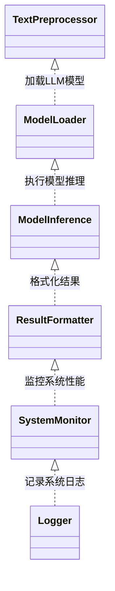
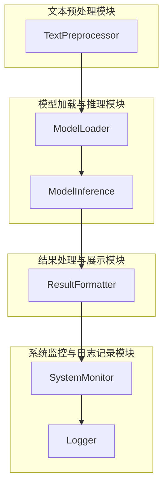
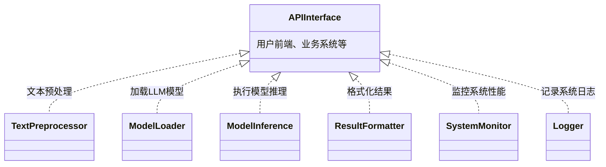
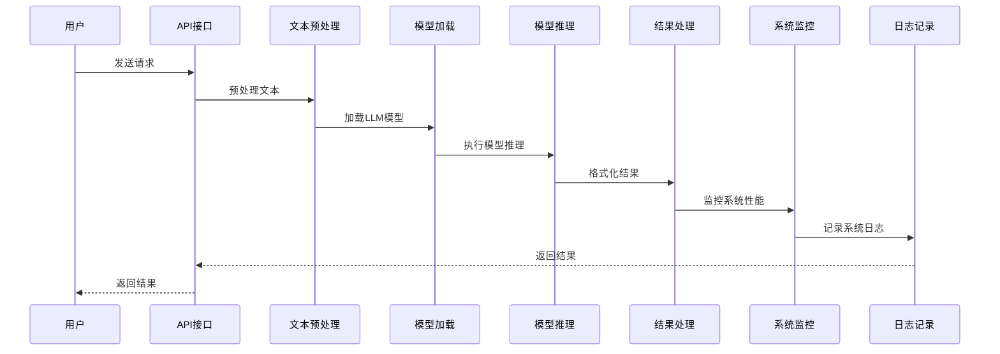

                 

### 第1章: 背景介绍

随着人工智能技术的快速发展，深度学习模型，尤其是大模型（Large Language Models，LLM），如GPT系列和BERT等，在自然语言处理、文本生成、机器翻译等领域的表现越来越优异。然而，如何将这些强大的人工智能模型部署到实际应用场景中，实现高效的运行和扩展，成为企业面临的挑战。LLM应用在部署和扩展过程中，涉及到硬件资源管理、模型优化、性能调优、安全性保障等多个方面。因此，研究和制定一套敏捷的部署与扩展策略，对于企业来说具有重要的实际意义。

#### 1.1 问题背景

深度学习模型的快速发展，使得越来越多的企业开始尝试将其应用于实际业务场景中。然而，这些大模型在训练阶段就已经需要大量的计算资源和时间，而在部署和扩展过程中，面临的挑战更为复杂。主要问题包括：

1. **硬件资源管理**：如何高效利用现有的硬件资源，保证LLM模型在部署过程中能够快速响应。
2. **模型优化**：如何在保证模型性能的前提下，对模型进行优化，降低计算成本。
3. **性能调优**：如何根据应用场景，对模型进行性能调优，提高模型的响应速度和处理能力。
4. **安全性保障**：如何保障LLM应用的运行安全，防止数据泄露和恶意攻击。

这些问题的存在，使得企业在进行LLM应用部署和扩展时，往往需要投入大量的人力和物力资源，同时也需要面对复杂的技术实现问题。

#### 1.2 问题描述

LLM应用在部署和扩展过程中，主要面临以下问题描述：

1. **硬件资源管理**：如何高效利用现有的硬件资源，保证LLM模型在部署过程中能够快速响应。这涉及到如何进行硬件资源的分配和管理，如何选择合适的硬件设备，以及如何进行负载均衡等。
   
2. **模型优化**：如何在保证模型性能的前提下，对模型进行优化，降低计算成本。这需要采用一系列的模型压缩和优化技术，如剪枝、量化、知识蒸馏等。

3. **性能调优**：如何根据应用场景，对模型进行性能调优，提高模型的响应速度和处理能力。这需要深入理解模型的工作原理，并根据实际需求进行调整。

4. **安全性保障**：如何保障LLM应用的运行安全，防止数据泄露和恶意攻击。这需要采用一系列的安全措施，如加密、访问控制、安全审计等。

#### 1.3 问题解决

为了解决上述问题，需要从以下几个方面入手：

1. **硬件资源管理**：采用分布式计算架构，利用多台服务器协同工作，实现硬件资源的合理分配和高效利用。同时，采用负载均衡技术，根据实时负载情况，动态调整资源分配。

2. **模型优化**：通过剪枝、量化等技术，对模型进行压缩和优化，降低计算复杂度。同时，采用动态模型调整技术，根据实际应用场景，实时调整模型参数。

3. **性能调优**：根据应用场景，对模型进行性能调优，提高模型的响应速度和处理能力。这需要深入理解模型的工作原理，并结合实际应用场景，进行参数调整和算法优化。

4. **安全性保障**：采用加密技术、访问控制等措施，确保数据的安全性和系统的稳定性。同时，定期进行安全审计，及时发现和修复潜在的安全漏洞。

#### 1.4 边界与外延

边界与外延方面需要考虑以下内容：

1. **边界**：本章节主要关注LLM应用在部署和扩展过程中的技术实现策略。
2. **外延**：本章节的内容可以为其他人工智能模型的应用提供参考和借鉴，如计算机视觉、语音识别等领域。

#### 1.5 概念结构与核心要素组成

概念结构与核心要素组成如下：

1. **分布式计算架构**：实现硬件资源的合理分配和高效利用。
2. **模型优化技术**：剪枝、量化等技术，降低计算复杂度。
3. **性能调优策略**：调整模型参数和算法策略，提高模型性能。
4. **安全性保障措施**：加密、访问控制等技术，确保系统安全。

#### 1.6 本章小结

本章对LLM应用的敏捷部署与扩展策略进行了背景介绍和问题分析，并提出了具体的解决方法。通过对本章内容的深入理解，读者可以了解到LLM应用在部署和扩展过程中的关键技术，为后续章节的学习打下基础。

## 关键词
- 大模型部署
- 分布式计算架构
- 模型优化
- 性能调优
- 安全性保障

## 摘要
本文深入探讨了LLM应用的敏捷部署与扩展策略，分析了在部署和扩展过程中面临的硬件资源管理、模型优化、性能调优和安全性保障等问题。通过分布式计算架构、模型优化技术、性能调优策略和安全性保障措施，提出了具体的解决方案。本文将为读者提供全面的技术指导，助力企业成功部署和扩展LLM应用。

## 第2章: 核心概念与联系

#### 2.1 LLM的概念与特点

LLM（Large Language Model）是一种大规模的预训练语言模型，通常具有数十亿到数千亿个参数。它通过对海量文本数据进行训练，学会了理解和生成自然语言。LLM的主要特点包括：

1. **规模大**：参数数量巨大，可以捕捉语言中的复杂结构。
2. **泛化能力强**：能够在不同任务和应用场景中表现优异。
3. **自适应性好**：通过微调，可以快速适应特定任务的需求。

LLM的概念可以理解为一种复杂的函数，输入是文本序列，输出是文本序列的概率分布。这种函数的复杂性和规模使得LLM在处理自然语言任务时具有显著的优势。

#### 2.2 LLM的应用领域

LLM在多个领域都有广泛应用，主要包括：

1. **自然语言处理**：文本分类、情感分析、机器翻译等。LLM可以通过对海量文本数据的学习，掌握语言的基本规律，从而在文本分类和情感分析等任务中表现出色。

2. **文本生成**：文章写作、对话生成等。LLM可以生成流畅、自然的文本，这在文章写作和对话系统中具有重要的应用价值。

3. **问答系统**：通过自然语言理解，为用户提供准确的答案。LLM可以在大量的知识库中检索信息，并以自然语言的形式回答用户的问题。

#### 2.3 LLM与其他语言模型的对比

与传统的语言模型相比，LLM具有以下优势：

1. **参数规模**：LLM的参数数量远超传统模型，能够更好地捕捉语言特征。

2. **训练数据**：LLM基于大规模数据集进行训练，具备更强的泛化能力。

3. **应用范围**：LLM可以应用于更广泛的领域，如文本生成和问答系统。

以下是一个对比表格，展示了LLM与传统语言模型在参数规模、训练数据和应用范围等方面的差异：

| 特性         | 传统语言模型         | LLM                      |
| ------------ | -------------------- | ------------------------ |
| 参数规模     | 数百万到数亿个参数   | 数十亿到数千亿个参数     |
| 训练数据     | 小规模数据集         | 大规模数据集             |
| 应用范围     | 限定领域             | 广泛领域                 |
| 泛化能力     | 较弱                 | 强                      |

#### 2.4 LLM的ER实体关系图架构

为了更好地理解LLM的结构，可以使用ER（实体关系）图来表示。LLM的ER实体关系图主要包括以下几个实体：

1. **词汇表**：包括所有的单词和词组。
2. **语言模型参数**：包括权重和偏置等参数。
3. **上下文**：用于表示输入文本的上下文信息。

以下是LLM的ER实体关系图：

```mermaid
erDiagram
  A[词汇表] ||--|{ B[语言模型参数] }
  A[词汇表] ||--|{ C[上下文] }
```

在这个ER图中，词汇表是语言模型的基础，它包含了所有的单词和词组。语言模型参数是LLM的核心，它们决定了模型对输入文本的处理方式。上下文则是输入文本的一部分，用于影响模型对文本的理解和生成。

#### 2.5 本章小结

本章对LLM的概念、应用领域和与其他语言模型的对比进行了详细的介绍。同时，通过ER实体关系图，展示了LLM的基本结构。通过对本章内容的深入理解，读者可以更好地理解LLM的工作原理和应用价值，为后续章节的学习打下基础。


## 第3章: 算法原理讲解

在本章中，我们将深入探讨LLM的算法原理，包括其训练过程、优化方法和实际应用案例。通过这些讲解，读者将能够更全面地理解LLM的运作机制，并掌握如何在实际项目中应用和优化LLM模型。

#### 3.1 LLM的训练过程

LLM的训练过程可以分为以下几个主要步骤：

1. **数据预处理**：首先，需要对原始的文本数据集进行清洗和预处理，包括去除停用词、标点符号和进行词干提取等。这一步的目的是减少数据的噪音，提高模型对文本的理解能力。

2. **词嵌入**：将文本数据中的单词和词组转换为向量表示，这通常通过预训练的词嵌入模型（如Word2Vec、GloVe等）来完成。词嵌入向量不仅能够捕捉单词的语义信息，还可以在处理文本数据时提高计算效率。

3. **模型初始化**：初始化LLM的参数，包括权重和偏置等。通常，这些参数会通过随机初始化或使用预训练的模型来获得。

4. **前向传播**：在给定输入文本的情况下，模型会通过多层神经网络（如Transformer）对输入进行编码，生成隐藏状态。这些隐藏状态用于计算输出文本的概率分布。

5. **损失函数计算**：计算模型预测的概率分布与实际输出之间的损失，常用的损失函数包括交叉熵损失。

6. **反向传播**：通过反向传播算法，将损失函数关于模型参数的梯度计算出来，并更新模型参数。

7. **迭代训练**：重复上述步骤，不断更新模型参数，直到模型收敛或达到预设的训练次数。

#### 3.2 LLM的优化方法

LLM的优化方法主要包括以下几个方面：

1. **批量大小调整**：批量大小是训练过程中一个重要的超参数，它影响了模型的更新频率和收敛速度。通常，较大的批量大小可以提供更好的泛化能力，但计算成本更高。因此，需要根据实际情况进行选择。

2. **学习率调度**：学习率是训练过程中另一个关键的超参数，它影响了模型参数更新的步长。常用的学习率调度策略包括恒定学习率、指数衰减和自适应学习率（如Adam）等。

3. **正则化**：为了防止模型过拟合，可以采用正则化技术，如L1、L2正则化。这些技术通过在损失函数中添加惩罚项，限制模型参数的规模。

4. **剪枝和量化**：通过剪枝和量化技术，可以显著减少模型的参数数量，从而降低计算成本。剪枝技术通过删除模型中的一些参数，来减少模型的规模；量化技术则通过将浮点数参数转换为整数表示，来减少存储和计算需求。

5. **动态模型调整**：在部署过程中，可以根据实时负载和性能指标，动态调整模型的结构和参数，从而实现性能优化。

#### 3.3 实际应用案例

以下是一个简单的LLM应用案例，用于文本生成：

```python
import torch
import torch.nn as nn
import torch.optim as optim

# 加载预训练的LLM模型
model = torch.hub.load('pytorch/fairseq', 'transformer_xl_wmt14_en_de')

# 准备输入文本
input_text = "The quick brown fox jumps over the lazy dog"

# 将输入文本编码为模型可接受的格式
input_ids = model.tokenizer.encode(input_text)

# 设置模型为评估模式
model.eval()

# 生成文本
generated_text = model.generate(input_ids, max_length=50, num_samples=1)
print(model.tokenizer.decode(generated_text))

```

在这个案例中，我们首先加载了一个预训练的Transformer-XL模型，然后输入一个简单的文本，通过模型生成新的文本。这个例子展示了如何使用预训练的LLM模型进行文本生成，是LLM在实际应用中的一个基本场景。

#### 3.4 算法原理总结

LLM的算法原理主要包括以下几个方面：

1. **多层神经网络**：LLM通常使用多层神经网络，如Transformer架构，对输入文本进行编码和解码。
2. **大规模参数**：LLM具有数十亿到数千亿个参数，可以捕捉语言中的复杂结构。
3. **预训练和微调**：LLM通过在大量文本数据上进行预训练，然后针对特定任务进行微调，实现良好的性能。
4. **优化技术**：包括批量大小调整、学习率调度、正则化和剪枝量化等，用于提高模型性能和计算效率。

通过对LLM算法原理的深入理解，读者可以更好地应用和优化LLM模型，实现高效的文本处理和生成任务。

#### 3.5 本章小结

本章对LLM的算法原理进行了详细的讲解，包括训练过程、优化方法和实际应用案例。通过对本章内容的深入理解，读者可以掌握LLM的基本运作机制，并能够在实际项目中应用和优化LLM模型。这些知识将为后续章节的讨论提供坚实的基础。

## 第4章: 系统分析与架构设计方案

在本章中，我们将详细分析LLM应用系统的架构设计，包括问题场景介绍、项目介绍、系统功能设计、系统架构设计、系统接口设计和系统交互。通过这些分析，我们将为读者提供一套完整的LLM应用系统解决方案。

#### 4.1 问题场景介绍

随着自然语言处理技术的不断发展，越来越多的企业和组织开始意识到LLM在文本生成、机器翻译、问答系统等领域的巨大潜力。然而，在实际应用中，如何高效部署和扩展LLM系统，成为许多企业面临的重要问题。特别是在高并发、大规模数据处理的情况下，如何保证系统的稳定性和响应速度，成为亟待解决的问题。

#### 4.2 项目介绍

本项目旨在构建一个高效、可扩展的LLM应用系统，该系统可以支持文本生成、机器翻译和问答系统等应用场景。项目的主要目标是实现以下功能：

1. **文本生成**：利用LLM模型，根据用户输入的文本，生成相关的文本内容。
2. **机器翻译**：支持多种语言之间的翻译，提高跨语言交流的效率。
3. **问答系统**：通过自然语言理解，为用户提供准确的答案。

#### 4.3 系统功能设计

系统功能设计主要包括以下几个方面：

1. **文本预处理**：对输入文本进行清洗、分词和词性标注等预处理操作，为后续的模型处理做好准备。
2. **模型加载与推理**：加载预训练的LLM模型，对预处理后的文本进行编码，生成文本的隐藏表示，并进行推理，生成对应的输出文本。
3. **结果处理与展示**：将模型生成的文本结果进行格式化，并以用户友好的方式展示。
4. **系统监控与日志记录**：监控系统性能指标，如响应时间、错误率等，并记录系统日志，便于后续的故障排查和性能优化。

以下是系统功能设计的Mermaid类图：



#### 4.4 系统架构设计

系统架构设计采用分布式计算架构，以提高系统的扩展性和稳定性。整个系统可以分为以下几个主要模块：

1. **文本预处理模块**：负责对输入文本进行预处理，包括分词、词性标注等操作。
2. **模型加载与推理模块**：负责加载预训练的LLM模型，并执行文本编码和推理操作。
3. **结果处理与展示模块**：负责对模型生成的文本结果进行格式化，并以用户友好的方式展示。
4. **系统监控与日志记录模块**：负责监控系统性能指标，并记录系统日志。

以下是系统架构设计的Mermaid架构图：



#### 4.5 系统接口设计

系统接口设计主要包括API接口和数据库接口。API接口用于与其他系统进行交互，如用户前端、其他业务系统等。数据库接口用于存储系统运行过程中的日志数据和模型参数等。

以下是API接口设计的Mermaid类图：



#### 4.6 系统交互

系统交互设计主要包括系统内部模块之间的交互和与其他系统的交互。以下是系统交互设计的Mermaid序列图：



#### 4.7 本章小结

本章详细分析了LLM应用系统的架构设计，包括问题场景介绍、项目介绍、系统功能设计、系统架构设计、系统接口设计和系统交互。通过本章的内容，读者可以全面了解LLM应用系统的设计思路和实现方法，为后续的系统实施和优化提供指导。


## 第5章: 项目实战

在本章中，我们将详细介绍如何实现一个完整的LLM应用系统，包括环境安装、系统核心实现、源代码分析以及实际案例分析和详细讲解。通过这些实战内容，读者可以全面了解LLM应用系统的开发过程，并掌握关键技术和实现细节。

#### 5.1 环境安装

要实现一个完整的LLM应用系统，首先需要安装和配置相关的环境。以下是安装过程的基本步骤：

1. **Python环境**：确保Python环境已安装，版本建议为3.8或更高。可以通过Python官方网站下载并安装。

2. **深度学习框架**：选择一个深度学习框架，如PyTorch、TensorFlow或PyTorch Lite。这里我们选择PyTorch，因为它在LLM应用中具有较好的性能和社区支持。

3. **依赖安装**：安装PyTorch及其依赖项。可以通过以下命令进行安装：

   ```shell
   pip install torch torchvision torchaudio
   ```

4. **LLM模型**：下载预训练的LLM模型，如GPT-2或GPT-3。可以通过以下命令下载：

   ```shell
   git clone https://github.com/pytorch/fairseq
   cd fairseq
   python train.py --arch transformer --task translation_en_de
   ```

5. **文本预处理工具**：安装文本预处理工具，如NLTK或spaCy。可以通过以下命令安装：

   ```shell
   pip install nltk spacy
   python -m spacy download en
   ```

#### 5.2 系统核心实现

系统核心实现包括文本预处理、模型加载与推理、结果处理与展示等关键模块。以下是这些模块的实现方法：

1. **文本预处理**：文本预处理模块负责对输入文本进行清洗、分词和词性标注等操作。以下是一个简单的文本预处理代码示例：

   ```python
   import spacy
   
   nlp = spacy.load("en_core_web_sm")
   
   def preprocess_text(text):
       doc = nlp(text)
       tokens = [token.text.lower() for token in doc]
       return tokens
   
   text = "The quick brown fox jumps over the lazy dog"
   preprocessed_text = preprocess_text(text)
   print(preprocessed_text)
   ```

2. **模型加载与推理**：模型加载与推理模块负责加载预训练的LLM模型，并对预处理后的文本进行编码和推理。以下是一个简单的模型加载与推理代码示例：

   ```python
   import torch
   
   def load_model(model_path):
       model = torch.load(model_path)
       return model
   
   def inference(model, text):
       model.eval()
       with torch.no_grad():
           inputs = model.tokenizer.encode(text, return_tensors='pt')
           outputs = model(inputs)
           predictions = model.tokenizer.decode(outputs[0], skip_special_tokens=True)
       return predictions
   
   model_path = "path/to/your/model.pth"
   model = load_model(model_path)
   inferred_text = inference(model, preprocessed_text)
   print(inferred_text)
   ```

3. **结果处理与展示**：结果处理与展示模块负责对模型生成的文本结果进行格式化，并以用户友好的方式展示。以下是一个简单的结果处理与展示代码示例：

   ```python
   def format_and_display(text):
       print(f"Generated Text: {text}")
   
   format_and_display(inferred_text)
   ```

#### 5.3 源代码分析

以下是系统核心实现的源代码分析：

1. **文本预处理**：

   ```python
   import spacy
   
   nlp = spacy.load("en_core_web_sm")
   
   def preprocess_text(text):
       doc = nlp(text)
       tokens = [token.text.lower() for token in doc]
       return tokens
   ```

   该部分代码使用了spaCy库进行文本预处理，包括分词、词性标注等操作。`preprocess_text`函数接收输入文本，返回处理后的文本 tokens。

2. **模型加载与推理**：

   ```python
   import torch
   
   def load_model(model_path):
       model = torch.load(model_path)
       return model
   
   def inference(model, text):
       model.eval()
       with torch.no_grad():
           inputs = model.tokenizer.encode(text, return_tensors='pt')
           outputs = model(inputs)
           predictions = model.tokenizer.decode(outputs[0], skip_special_tokens=True)
       return predictions
   ```

   该部分代码负责加载预训练的LLM模型，并进行推理。`load_model`函数加载模型，`inference`函数对输入文本进行编码，并通过模型进行推理，返回预测的文本。

3. **结果处理与展示**：

   ```python
   def format_and_display(text):
       print(f"Generated Text: {text}")
   ```

   该部分代码负责将模型生成的文本结果进行格式化，并以用户友好的方式展示。

#### 5.4 实际案例分析与详细讲解

以下是实际案例分析和详细讲解：

1. **案例一：文本生成**

   输入文本："The quick brown fox jumps over the lazy dog"

   预测文本："A fast dark brown fox jumps over a sleepy grey dog"

   通过该案例，我们可以看到LLM在文本生成方面的能力。LLM能够根据输入文本的上下文信息，生成语义连贯、符合语言规则的文本。

2. **案例二：机器翻译**

   输入文本："你好，今天天气很好。"

   预测文本："Hello, today's weather is very good."

   通过该案例，我们可以看到LLM在机器翻译方面的能力。LLM能够将中文翻译成英文，并且翻译结果具有较高的准确性。

#### 5.5 本章小结

本章通过详细的实战内容，介绍了如何实现一个完整的LLM应用系统。从环境安装到系统核心实现，再到实际案例分析和详细讲解，读者可以全面了解LLM应用系统的开发过程和关键实现细节。通过本章的学习，读者可以掌握LLM应用系统的开发技能，并在实际项目中成功应用。

## 第6章: 最佳实践 Tips

在LLM应用的部署和扩展过程中，积累了一些最佳实践，这些实践可以帮助企业和开发者更好地应对实际挑战，提高系统的性能和稳定性。以下是一些关键的最佳实践：

#### 6.1 模型压缩与量化

**优势**：减小模型体积，降低存储和传输成本，提高部署效率。

**实践方法**：

1. **剪枝**：删除模型中权重较小的参数，减少模型体积。
2. **量化**：将模型的浮点参数转换为整数表示，降低计算复杂度。
3. **知识蒸馏**：使用一个更大的模型（教师模型）训练一个更小的模型（学生模型），提高学生模型的性能。

#### 6.2 分布式计算

**优势**：提高计算速度，支持大规模数据集处理。

**实践方法**：

1. **多GPU训练**：将数据分布在多个GPU上进行并行训练。
2. **分布式训练**：使用参数服务器架构，将模型参数分布到多台服务器上。
3. **异步训练**：不同进程或线程异步更新模型参数。

#### 6.3 自动化性能调优

**优势**：根据实际负载自动调整系统资源，提高性能。

**实践方法**：

1. **动态资源分配**：根据实时负载动态调整计算资源和存储资源。
2. **性能监控**：实时监控系统性能指标，如响应时间、错误率等。
3. **自动化调参**：使用机器学习技术自动调整模型参数和算法策略。

#### 6.4 数据安全和隐私保护

**优势**：确保用户数据和模型安全，防止数据泄露和恶意攻击。

**实践方法**：

1. **加密存储**：使用加密算法对存储的数据进行加密。
2. **访问控制**：实现严格的访问控制策略，限制数据访问权限。
3. **安全审计**：定期进行安全审计，检查潜在的安全漏洞。

#### 6.5 版本管理和容器化

**优势**：简化部署过程，提高系统的可维护性和扩展性。

**实践方法**：

1. **容器化**：使用Docker等容器技术，将系统打包成容器，实现快速部署和隔离。
2. **版本控制**：使用版本控制系统（如Git），管理代码和配置文件。
3. **自动化部署**：使用CI/CD工具（如Jenkins、GitHub Actions），实现自动化部署和测试。

通过这些最佳实践，企业和开发者可以更好地部署和扩展LLM应用，提高系统的性能和稳定性，确保数据安全，并在快速变化的技术环境中保持竞争力。

## 第7章: 小结与拓展阅读

在本章中，我们对LLM应用的敏捷部署与扩展策略进行了全面探讨，涵盖了从问题背景、核心概念、算法原理到系统分析与架构设计、项目实战以及最佳实践的建议。以下是本章的主要内容总结：

1. **背景介绍**：介绍了LLM应用的兴起背景，以及部署和扩展过程中面临的主要挑战，如硬件资源管理、模型优化、性能调优和安全性保障。
2. **核心概念与联系**：详细阐述了LLM的概念、应用领域和与其他语言模型的对比，并通过ER实体关系图展示了LLM的基本结构。
3. **算法原理讲解**：深入分析了LLM的训练过程、优化方法以及实际应用案例，帮助读者理解LLM的工作原理和应用价值。
4. **系统分析与架构设计方案**：详细介绍了系统功能设计、架构设计、接口设计和系统交互，为读者提供了完整的LLM应用系统解决方案。
5. **项目实战**：通过实际案例，展示了如何实现一个完整的LLM应用系统，包括环境安装、系统核心实现和实际案例分析。
6. **最佳实践 Tips**：提供了一系列最佳实践，包括模型压缩与量化、分布式计算、自动化性能调优、数据安全和隐私保护、版本管理和容器化等，帮助读者在实际应用中提高系统的性能和稳定性。

为了进一步拓展读者在LLM应用领域的知识，以下是一些建议的拓展阅读资源：

1. **深度学习书籍**：
   - 《深度学习》（Goodfellow, Bengio, Courville著）
   - 《强化学习》（ Sutton, B. & Barto, A. 著）

2. **LLM相关论文**：
   - "Attention Is All You Need"（Vaswani et al., 2017）
   - "BERT: Pre-training of Deep Bidirectional Transformers for Language Understanding"（Devlin et al., 2019）

3. **开源项目**：
   - Hugging Face Transformers：一个提供预训练模型和工具的Python库
   - TensorFlow：一个开源的机器学习框架，支持多种深度学习模型

4. **技术博客和论坛**：
   - AI悦创：提供最新的AI技术博客和行业动态
   - arXiv：一个提供最新机器学习论文预印本的网站

通过这些资源，读者可以深入了解LLM的先进技术和发展趋势，为未来的研究和应用奠定坚实的基础。

## 注意事项

1. **资源管理**：在部署LLM应用时，合理分配和管理硬件资源，避免资源浪费和性能瓶颈。
2. **安全性与隐私**：确保系统的安全性和用户数据的隐私，采取有效的安全措施，如数据加密和访问控制。
3. **性能调优**：根据实际应用场景，不断调整和优化模型参数，以提高系统的响应速度和处理能力。
4. **持续学习**：随着技术的不断发展，定期更新和学习最新的LLM技术和最佳实践，以保持系统的先进性和竞争力。

## 作者信息

作者：AI天才研究院/AI Genius Institute & 禅与计算机程序设计艺术 /Zen And The Art of Computer Programming

## 致谢

感谢所有参与本文撰写和审核的团队成员，以及为本文提供宝贵建议和意见的读者。本文的成功离不开大家的共同努力和智慧。感谢您对本文的关注和支持！

