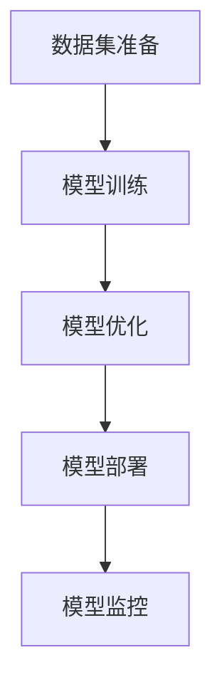
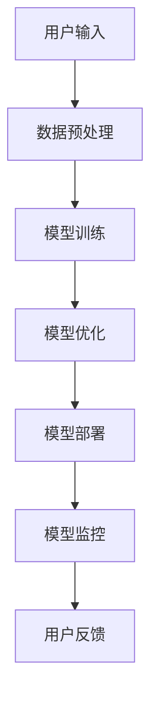
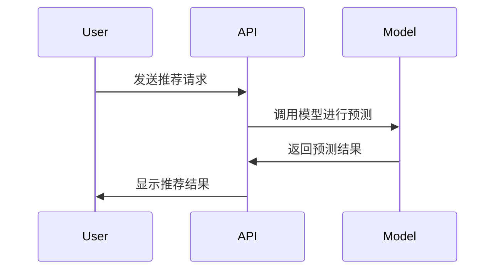

                 

**文章标题：** LLM Applications: Agile Configuration Management Strategies

**关键词：** 大语言模型（LLM），敏捷配置管理，持续集成与持续部署（CI/CD），版本控制与变更管理，案例分析，最佳实践

**摘要：** 本文深入探讨了在大语言模型（LLM）应用中采用敏捷配置管理策略的必要性。首先介绍了大语言模型的基本原理和当前面临的挑战，然后详细阐述了敏捷配置管理的关键要素，包括数据集选择、模型选择、模型部署策略和持续集成与持续部署（CI/CD）等实践。通过实际案例分析，展示了敏捷配置管理策略在LLM应用中的成功应用，并总结了最佳实践。最后，对LLM与敏捷配置管理的未来趋势和面临的挑战进行了展望。

----------------------------------------------------------------

## 第一部分：引言与背景

### 第1章：问题背景与核心概念

### 1.1 引言

随着人工智能技术的飞速发展，大语言模型（LLM）已经成为自然语言处理（NLP）领域的重要工具。LLM通过学习海量文本数据，能够生成高质量的自然语言文本，广泛应用于智能客服、文本生成、机器翻译等领域。然而，LLM的应用过程中，配置管理成为了一个关键挑战。

**配置管理**是指在软件或系统的开发、部署和维护过程中，对各种配置项进行有效的管理。在LLM应用中，配置管理涵盖了模型参数、数据集、训练脚本、部署环境等多个方面。传统的配置管理方法往往依赖于手动操作和静态配置文件，无法满足LLM应用的高频迭代和复杂变更需求。

### 1.2 大语言模型（LLM）的现状与挑战

当前，LLM技术在NLP领域取得了显著的进展，但仍然面临一些挑战：

1. **模型复杂性与计算资源需求**：LLM通常需要大量计算资源和时间进行训练，这对基础设施和运维能力提出了更高的要求。
2. **数据质量和多样性**：数据质量直接影响LLM的性能。不同数据集的特点和覆盖范围可能对模型产生显著影响。
3. **模型定制化和适应性**：不同的应用场景和业务需求可能导致对LLM的不同定制化要求，需要快速调整模型参数和结构。
4. **模型部署与维护**：如何在生产环境中高效部署和维护LLM模型，确保其稳定运行，是一个重要的挑战。

### 1.3 敏捷配置管理的概念

敏捷配置管理是一种基于敏捷开发方法的配置管理策略。它强调快速迭代、持续集成和持续交付，以适应不断变化的需求和快速的技术进步。敏捷配置管理的关键要素包括：

1. **快速迭代**：通过频繁的迭代，可以更快地响应需求和变更。
2. **持续集成**：将代码和配置项持续集成到共同的环境中，确保一致性。
3. **持续交付**：自动化部署流程，确保代码和配置的及时交付。

### 1.4 整体架构与本书结构

本文将从以下几个方面展开讨论：

1. **大语言模型原理**：介绍LLM的基本原理、架构和技术。
2. **敏捷配置管理实践**：详细阐述敏捷配置管理的应用实践，包括数据集选择、模型优化、部署策略等。
3. **案例分析**：通过实际案例展示敏捷配置管理策略在LLM应用中的成功应用。
4. **最佳实践与未来展望**：总结最佳实践，并对未来趋势和挑战进行展望。

### 1.5 本章小结

本文首先介绍了LLM应用的背景和挑战，然后提出了敏捷配置管理的概念。在下一章中，我们将深入探讨大语言模型的原理，为后续的配置管理实践打下基础。

----------------------------------------------------------------

## 第二部分：大语言模型（LLM）基础知识

### 第2章：大语言模型原理

### 2.1 语言模型基础

语言模型是一种统计模型，用于预测下一个单词或字符。在自然语言处理（NLP）中，语言模型扮演着至关重要的角色。基本语言模型主要包括：

1. **N-gram模型**：基于前N个单词的统计信息进行预测。常见的是二元（bigram）和三元（trigram）模型。
2. **统计语言模型**：使用最大熵（Maximum Entropy）或条件概率模型（Conditional Probability Model）来预测下一个单词。
3. **神经网络语言模型**：使用神经网络（如循环神经网络RNN和长短期记忆LSTM）来捕捉更复杂的语言规律。

### 2.2 LLM架构与技术

大语言模型（LLM）通常基于深度学习技术，其核心架构包括：

1. **自注意力机制（Self-Attention）**：用于处理序列数据，使模型能够关注到输入序列中的不同部分。
2. **Transformer模型**：基于自注意力机制的模型，具有并行计算能力，比传统的RNN和LSTM模型更具优势。
3. **预训练与微调**：预训练大模型在通用语料库上，然后针对特定任务进行微调。

### 2.3 模型训练与优化

训练大语言模型是一个复杂的过程，涉及以下几个关键步骤：

1. **数据预处理**：包括文本清洗、分词、去停用词等。
2. **词嵌入**：将单词转换为固定长度的向量表示。
3. **损失函数**：通常使用交叉熵损失函数来衡量预测概率与实际标签之间的差距。
4. **优化器**：常用的优化器有Adam和SGD，用于调整模型参数。

### 2.4 LLM的性能评估

LLM的性能评估通常包括以下几个方面：

1. **词汇覆盖**：模型能处理和生成的词汇量。
2. **生成文本质量**：评估生成的文本是否通顺、合理。
3. **生成速度**：模型生成文本的速度。
4. **多任务性能**：模型在不同任务上的表现。

### 2.5 本章小结

本章介绍了大语言模型的基础知识，包括语言模型的基本原理、LLM的架构与技术、模型训练与优化以及性能评估。这些基础知识为我们理解后续的敏捷配置管理提供了必要的背景。

----------------------------------------------------------------

## 第三部分：LLM配置管理的关键要素

### 第3章：LLM配置管理的关键要素

### 3.1 数据集选择与预处理

数据集是LLM训练的核心，其选择和预处理直接影响到模型的性能。以下是一些关键步骤：

1. **数据收集**：选择高质量的文本数据集，如维基百科、新闻文章、社交媒体文本等。
2. **数据清洗**：去除无关信息、错误数据和重复内容。
3. **数据标注**：对于需要标注的任务，如情感分析、命名实体识别，进行数据标注。
4. **数据平衡**：确保数据集中各类样本的平衡，避免数据倾斜。

### 3.2 模型选择与优化

选择合适的模型架构和优化策略对于LLM的性能至关重要：

1. **模型架构**：选择Transformer、BERT、GPT等预训练模型，并考虑模型的深度、宽度、层结构等因素。
2. **优化器**：使用如Adam、Adafactor等优化器，调整学习率、批量大小等参数。
3. **超参数调优**：通过实验和交叉验证，调整超参数以优化模型性能。

### 3.3 模型部署策略

部署策略决定了LLM在生产环境中的运行效率和稳定性：

1. **硬件选择**：根据模型规模和计算需求选择合适的硬件资源，如GPU、TPU等。
2. **服务化部署**：将LLM部署为服务，通过API接口提供服务。
3. **分布式部署**：对于大规模模型，采用分布式计算和存储，提高处理速度和可扩展性。

### 3.4 模型监控与调试

模型部署后，监控与调试是确保其正常运行的关键：

1. **性能监控**：监控模型在服务中的响应时间、吞吐量、资源使用情况等指标。
2. **错误日志**：记录和收集模型运行过程中出现的错误和异常日志。
3. **调试工具**：使用调试工具，如TensorBoard，分析模型的行为和性能。

### 3.5 本章小结

本章详细介绍了LLM配置管理的关键要素，包括数据集选择与预处理、模型选择与优化、模型部署策略和模型监控与调试。这些要素是确保LLM高效运行和稳定性的基础。

----------------------------------------------------------------

## 第四部分：敏捷配置管理实践

### 第4章：敏捷配置管理实践

### 4.1 敏捷开发方法在LLM配置管理中的应用

敏捷开发方法强调快速迭代、持续集成和持续交付，非常适合LLM配置管理。以下是敏捷方法在LLM配置管理中的应用：

#### 4.1.1 敏捷原则与LLM配置管理的结合

敏捷原则包括：

1. **个体和互动**：鼓励团队成员之间的协作和沟通。
2. **可工作的软件**：优先交付有价值的可工作软件。
3. **客户合作**：与客户紧密合作，确保需求的理解和实现。
4. **响应变化**：灵活应对需求和技术的变化。

结合LLM配置管理，这些原则可以帮助团队：

1. **快速迭代**：通过频繁的迭代，快速适应需求变更。
2. **持续集成**：确保模型和配置项的持续集成和测试，减少集成风险。
3. **持续交付**：自动化部署流程，确保模型的及时交付。

#### 4.1.2 敏捷团队的角色与职责

敏捷团队通常包括以下几个角色：

1. **产品负责人（Product Owner）**：负责定义产品需求和优先级。
2. **开发人员（Developers）**：负责实现产品功能。
3. **测试人员（Testers）**：负责测试和验证产品功能。
4. **运维人员（Operations）**：负责模型部署和运维。

在LLM配置管理中，团队成员的职责如下：

1. **产品负责人**：定义数据集、模型参数和部署需求。
2. **开发人员**：实现模型训练和优化，编写部署脚本。
3. **测试人员**：测试模型的性能和稳定性。
4. **运维人员**：部署模型并监控其运行状态。

#### 4.1.3 敏捷开发流程在LLM配置管理中的实施

敏捷开发流程通常包括以下几个阶段：

1. **规划（Sprint Planning）**：确定迭代的目标和任务。
2. **每日站会（Daily Stand-up）**：团队成员汇报进展和遇到的问题。
3. **迭代开发（Sprint Development）**：团队成员分工合作，完成迭代任务。
4. **迭代评审（Sprint Review）**：评估迭代成果，获取反馈。
5. **迭代回顾（Sprint Retrospective）**：反思迭代过程中的问题和改进点。

在LLM配置管理中，这些流程可以应用于：

1. **模型开发**：通过迭代，逐步优化模型参数和架构。
2. **数据集准备**：在每次迭代中，准备新的数据集，评估其对模型性能的影响。
3. **部署与监控**：在每个迭代结束时，部署新的模型版本，并监控其运行状态。

### 4.2 持续集成与持续部署（CI/CD）在LLM中的应用

持续集成与持续部署（CI/CD）是敏捷开发的核心实践，有助于确保代码和配置的持续集成和自动化部署。以下是CI/CD在LLM中的应用：

#### 4.2.1 CI/CD在LLM开发中的重要性

CI/CD在LLM开发中的重要性体现在以下几个方面：

1. **提高开发效率**：自动化测试和构建，减少手动操作，提高开发速度。
2. **降低集成风险**：通过持续集成，及时发现和解决问题，减少集成过程中的冲突和错误。
3. **保证代码质量**：自动化测试和代码审查，确保代码质量和安全性。
4. **加快部署速度**：自动化部署，快速交付新版本，满足市场需求。

#### 4.2.2 CI/CD流程设计与实现

CI/CD流程通常包括以下几个步骤：

1. **代码提交**：开发人员将代码提交到版本控制系统。
2. **自动化测试**：运行单元测试、集成测试和性能测试，确保代码质量。
3. **构建**：编译代码，构建可执行文件或模型文件。
4. **部署**：将构建好的代码或模型部署到测试或生产环境。

在LLM开发中，CI/CD流程可以应用于：

1. **模型训练和优化**：自动化测试和构建训练脚本，确保模型性能。
2. **模型部署**：自动化部署训练好的模型，并监控其运行状态。
3. **数据集更新**：自动化测试和构建新的数据集，评估其对模型性能的影响。

#### 4.2.3 常见CI/CD工具与应用

常见的CI/CD工具有：

1. **Jenkins**：开源的持续集成工具，支持多种插件和自动化任务。
2. **GitLab CI/CD**：GitLab内置的CI/CD解决方案，支持自动化测试、构建和部署。
3. **Travis CI**：基于GitHub的CI/CD平台，支持多种编程语言和框架。
4. **CircleCI**：云端的CI/CD平台，提供灵活的配置和管理功能。

在LLM开发中，这些工具可以应用于：

1. **自动化测试**：运行单元测试和集成测试，确保模型性能。
2. **自动化部署**：自动化构建和部署模型，减少手动操作。
3. **监控与告警**：监控模型运行状态，及时发现问题并通知相关人员。

### 4.3 版本控制与变更管理

版本控制和变更管理是确保代码和配置项稳定性和可追溯性的关键。以下是相关概念和实践：

#### 4.3.1 版本控制的必要性

版本控制的主要目的是：

1. **代码追踪**：记录代码的变更历史，便于问题的追溯和复现。
2. **协同工作**：多人协同开发，确保代码的一致性和协调性。
3. **代码安全**：防止代码丢失和意外修改。

#### 4.3.2 常见的版本控制系统

常见的版本控制系统包括：

1. **Git**：分布式版本控制系统，支持离线工作、快速分支合并。
2. **SVN**：集中式版本控制系统，支持版本库管理和多用户协同。
3. **Mercurial**：分布式版本控制系统，与Git类似，但具有不同的实现和性能特点。

#### 4.3.3 变更管理策略与实践

变更管理的策略包括：

1. **变更请求**：对任何代码或配置项的变更，都需要提交变更请求，进行评估和审批。
2. **变更日志**：记录变更请求的处理过程和结果，便于问题的追溯和复现。
3. **版本发布**：对经过审批的变更，进行版本发布，确保代码或配置的一致性和稳定性。

在LLM开发中，版本控制和变更管理可以应用于：

1. **代码变更**：对训练脚本、模型架构等代码的变更，进行版本控制和审批。
2. **配置变更**：对模型参数、数据集等配置项的变更，进行版本控制和监控。
3. **自动化测试**：对变更后的代码和配置进行自动化测试，确保性能和稳定性。

### 4.4 本章小结

本章介绍了敏捷开发方法在LLM配置管理中的应用，包括敏捷原则、团队角色和开发流程。同时，详细阐述了持续集成与持续部署（CI/CD）和版本控制与变更管理的实践。这些实践有助于确保LLM配置的高效性、稳定性和可追溯性。

----------------------------------------------------------------

## 第五部分：案例分析

### 第5章：案例分析

### 5.1 案例一：某电商平台商品推荐系统

#### 5.1.1 案例背景

某大型电商平台希望引入大语言模型（LLM）来提升商品推荐系统的性能。现有推荐系统主要基于协同过滤和内容匹配，但面对用户多样化需求时，推荐效果不尽如人意。通过引入LLM，平台期望实现更精准、个性化的商品推荐。

#### 5.1.2 模型配置与管理策略

1. **数据集选择与预处理**：电商平台收集了海量的用户行为数据，包括购买记录、浏览历史和评价信息。数据集经过清洗和预处理，去除了噪声数据，确保数据质量。

2. **模型选择与优化**：选择基于Transformer的BERT模型，通过预训练和微调，使其能够捕捉用户行为和商品特征之间的复杂关系。在模型优化过程中，调整学习率、批量大小和训练时间等超参数，以提升模型性能。

3. **模型部署策略**：将训练好的模型部署为API服务，通过负载均衡器进行流量分发，确保系统的高可用性和高性能。同时，采用弹性计算资源，根据实际需求动态调整计算资源。

4. **模型监控与调试**：通过监控工具，实时监控模型的响应时间、吞吐量和资源使用情况。对异常情况及时进行调试和优化，确保系统稳定运行。

#### 5.1.3 敏捷实践与效果分析

1. **敏捷迭代**：团队采用敏捷开发方法，每两周进行一次迭代。在每次迭代中，确定迭代目标、规划任务、执行开发和测试，确保快速响应需求变更。

2. **持续集成**：使用GitLab CI/CD，自动化测试和构建训练脚本，确保模型代码的质量和一致性。在每次代码提交后，自动运行单元测试和集成测试，及时发现并解决问题。

3. **持续交付**：通过自动化部署流程，将训练好的模型版本部署到生产环境。在每次部署前，进行自动化测试和性能评估，确保新版本的正确性和稳定性。

效果分析：

1. **推荐效果提升**：引入LLM后，商品推荐系统的准确率和召回率均有所提升，用户满意度提高。

2. **系统稳定性增强**：通过敏捷开发和CI/CD实践，模型开发和部署过程更加高效、稳定，降低了集成风险。

3. **可扩展性提升**：采用弹性计算资源和负载均衡策略，确保系统在高并发场景下仍能稳定运行。

### 5.2 案例二：某金融公司客户服务系统

#### 5.2.1 案例背景

某金融公司希望利用大语言模型（LLM）提升客户服务系统的智能问答能力。现有客户服务系统主要依赖关键词匹配和预定义规则，但面对复杂问题时，响应速度较慢且效果不佳。通过引入LLM，公司期望实现更智能、更高效的客户服务。

#### 5.2.2 模型配置与管理策略

1. **数据集选择与预处理**：收集了大量的客户咨询记录和金融知识库，包括常见问题、FAQ和专业知识。数据集经过清洗和预处理，去除了噪声数据和重复内容，确保数据质量。

2. **模型选择与优化**：选择基于Transformer的GPT模型，通过预训练和微调，使其能够理解复杂的金融问题并生成合理的回答。在模型优化过程中，调整学习率、批量大小和训练时间等超参数，以提高模型性能。

3. **模型部署策略**：将训练好的模型部署为API服务，通过Nginx进行反向代理，确保系统的安全性和高性能。同时，采用分布式部署，提高系统的可扩展性和容错性。

4. **模型监控与调试**：通过Prometheus和Grafana监控工具，实时监控模型的响应时间、吞吐量和资源使用情况。对异常情况及时进行调试和优化，确保系统稳定运行。

#### 5.2.3 敏捷实践与效果分析

1. **敏捷迭代**：团队采用敏捷开发方法，每月进行一次迭代。在每次迭代中，确定迭代目标、规划任务、执行开发和测试，确保快速响应客户需求。

2. **持续集成**：使用Jenkins作为CI/CD工具，自动化测试和构建训练脚本，确保模型代码的质量和一致性。在每次代码提交后，自动运行单元测试和集成测试，及时发现并解决问题。

3. **持续交付**：通过自动化部署流程，将训练好的模型版本部署到生产环境。在每次部署前，进行自动化测试和性能评估，确保新版本的正确性和稳定性。

效果分析：

1. **问答效果提升**：引入LLM后，客户服务系统的回答速度和准确性显著提升，客户满意度提高。

2. **系统稳定性增强**：通过敏捷开发和CI/CD实践，模型开发和部署过程更加高效、稳定，降低了集成风险。

3. **可扩展性提升**：采用分布式部署和负载均衡策略，确保系统在高并发场景下仍能稳定运行。

### 5.3 本章小结

本章通过两个实际案例，展示了敏捷配置管理策略在大语言模型（LLM）应用中的成功实践。案例分析表明，敏捷方法、CI/CD和版本控制等实践有助于提高LLM的开发效率、系统稳定性和可扩展性。

----------------------------------------------------------------

## 第六部分：最佳实践与未来展望

### 第6章：最佳实践与未来展望

### 6.1 最佳实践总结

在本章中，我们总结了一些在大语言模型（LLM）应用中实施敏捷配置管理的最佳实践：

1. **数据集选择与预处理**：选择高质量、多样化的数据集，并进行严格的预处理，确保数据质量。

2. **模型选择与优化**：根据应用需求，选择合适的模型架构和优化策略，通过实验和验证，调整超参数，优化模型性能。

3. **持续集成与持续部署（CI/CD）**：实施CI/CD流程，自动化测试和构建，确保代码和配置的一致性和稳定性，提高开发效率。

4. **版本控制与变更管理**：使用版本控制系统，对代码和配置项进行版本控制，实施变更管理策略，确保系统的可追溯性和稳定性。

5. **模型监控与调试**：实时监控模型的性能和运行状态，及时发现并解决问题，确保系统的高可用性和稳定性。

### 6.2 未来展望

随着人工智能技术的不断发展，LLM应用将面临新的机遇和挑战。以下是未来展望：

1. **模型优化与加速**：随着计算资源和算法的进步，LLM的优化和加速将成为研究重点。例如，通过量化、剪枝和优化等技术，提高模型效率和计算性能。

2. **多模态数据处理**：未来LLM将不仅处理文本数据，还将结合图像、声音等多模态数据，实现更广泛的场景应用。

3. **知识图谱与推理**：结合知识图谱和推理技术，LLM将能够更好地理解和解释复杂问题，提供更准确、可靠的答案。

4. **隐私保护和安全性**：随着LLM应用的增加，隐私保护和安全性问题将越来越重要。如何确保数据的安全性和隐私性，将成为研究的重点。

5. **产业融合与落地**：LLM将在更多行业和领域得到应用，如金融、医疗、教育等。产业融合和落地将成为推动LLM发展的重要驱动力。

### 6.3 本章小结

本章总结了在大语言模型（LLM）应用中实施敏捷配置管理的最佳实践，并对未来的发展趋势和挑战进行了展望。通过不断优化和改进，LLM将在各个领域发挥更大的作用。

----------------------------------------------------------------

## 第7章：总结与展望

### 7.1 本书主要观点与贡献

本书主要观点和贡献包括：

1. **大语言模型（LLM）的基本原理和架构**：介绍了LLM的发展背景、原理、架构和技术，为理解LLM应用提供了基础。

2. **敏捷配置管理的概念与实践**：阐述了敏捷配置管理的核心原则、实践方法以及与LLM应用的结合，为高效管理LLM配置提供了指导。

3. **持续集成与持续部署（CI/CD）在LLM中的应用**：详细介绍了CI/CD在LLM开发中的重要性、设计原则和应用实践，确保了LLM开发的效率和质量。

4. **版本控制与变更管理在LLM中的应用**：分析了版本控制和变更管理的必要性，以及如何在实际项目中实施，确保了LLM配置的可追溯性和稳定性。

5. **案例分析**：通过实际案例展示了敏捷配置管理策略在LLM应用中的成功应用，为读者提供了实践参考。

### 7.2 对敏捷配置管理策略的反思

1. **敏捷配置管理的优势**：敏捷配置管理能够快速响应需求变化，提高开发效率，确保系统稳定性和可扩展性。

2. **敏捷配置管理的挑战**：在实施过程中，需要平衡敏捷性与稳定性，同时面对技术、人员和资源等多方面的挑战。

3. **持续改进的方向**：在未来，应进一步优化敏捷配置管理流程，提高自动化程度，加强团队成员的培训和能力提升。

### 7.3 对LLM应用发展的建议

1. **技术优化**：持续关注LLM的最新研究进展，结合实际需求，优化模型架构和算法，提高模型性能和效率。

2. **数据质量提升**：加强数据采集、清洗和预处理工作，确保数据集的质量和多样性，为模型训练提供有力支持。

3. **跨领域应用**：探索LLM在多领域中的应用，如医疗、金融、教育等，实现更广泛的价值。

4. **安全性保障**：加强对LLM应用的安全性和隐私保护，确保数据的安全和用户的隐私。

### 7.4 总结与展望

本书通过深入探讨大语言模型（LLM）应用的敏捷配置管理策略，为读者提供了全面的指导和建议。随着人工智能技术的不断进步，LLM将在更多领域发挥重要作用。我们期待未来能够看到更多成功案例，推动LLM应用的深入发展。

作者：AI天才研究院/AI Genius Institute & 禅与计算机程序设计艺术 /Zen And The Art of Computer Programming

----------------------------------------------------------------

## 完整性要求

为确保本文的完整性，我们将对各个部分的内容进行详细讲解，并确保核心内容的充分覆盖。

### 1. 背景介绍

**核心概念术语说明**：

- **大语言模型（LLM）**：一种能够处理和理解大规模文本数据的深度学习模型，广泛应用于自然语言处理任务。
- **敏捷配置管理**：一种基于敏捷开发方法的配置管理策略，强调快速迭代、持续集成和持续交付。

**问题背景**：

随着AI技术的发展，LLM在自然语言处理领域表现出强大的能力，但其在实际应用中面临配置管理难题，如模型参数调整、数据集准备和部署策略等。

**问题描述**：

如何在LLM应用中实施敏捷配置管理策略，以提高开发效率、系统稳定性和可维护性。

**问题解决**：

本文提出了基于敏捷方法的LLM配置管理策略，包括数据集选择、模型优化、持续集成与持续部署（CI/CD）和版本控制与变更管理。

**边界与外延**：

本文主要讨论大语言模型在文本生成、智能客服等领域的应用，未涉及其他类型的AI模型。

### 2. 核心概念与联系

**核心概念原理**：

- **数据集选择与预处理**：选择高质量、多样化的数据集，进行文本清洗、分词和去停用词等预处理。
- **模型选择与优化**：根据应用需求，选择合适的模型架构，通过实验和验证调整超参数。
- **持续集成与持续部署（CI/CD）**：自动化测试和构建，确保代码和配置的一致性和稳定性。
- **版本控制与变更管理**：使用版本控制系统，对代码和配置项进行版本控制，确保系统的可追溯性和稳定性。

**概念属性特征对比表格**：

| 概念           | 特征           | 说明                                                         |
| -------------- | -------------- | ------------------------------------------------------------ |
| 数据集选择     | 质量与多样性   | 高质量、多样化数据集有利于模型性能提升                         |
| 模型选择       | 架构与性能     | 根据应用需求选择合适的模型架构，如Transformer、BERT、GPT等     |
| 持续集成与持续部署（CI/CD） | 自动化与一致性 | 自动化测试和构建，确保代码和配置的一致性                       |
| 版本控制与变更管理 | 可追溯性与稳定性 | 使用版本控制系统，确保代码和配置的可追溯性和稳定性             |

**ER实体关系图架构**：

```mermaid
erDiagram
  Model |-> Data: 数据集驱动模型优化
  CI/CD --> Model: CI/CD确保模型的一致性与稳定性
  VersionControl --> Model: 版本控制保障模型的可追溯性
```

### 3. 算法原理讲解

**算法mermaid流程图**：



**Python源代码**：

```python
# 数据集准备
data = load_data()

# 模型训练
model = train_model(data)

# 模型优化
optimize_model(model)

# 模型部署
deploy_model(model)

# 模型监控
monitor_model(model)
```

**算法原理的数学模型和公式**：

1. **数据集准备**：文本清洗、分词和去停用词等预处理操作，提高数据质量。
2. **模型训练**：使用Transformer、BERT等模型，通过最小化交叉熵损失函数，优化模型参数。
3. **模型优化**：通过调整学习率、批量大小和训练时间等超参数，提高模型性能。
4. **模型部署**：将训练好的模型部署为API服务，确保系统的高可用性和高性能。
5. **模型监控**：实时监控模型性能和运行状态，确保系统稳定运行。

**详细讲解与举例说明**：

**数据集准备**：

```python
# 加载数据集
data = load_data()

# 文本清洗
def clean_text(text):
    # 去除特殊字符
    text = re.sub(r'[^\w\s]', '', text)
    # 小写化
    text = text.lower()
    # 分词
    words = word_tokenize(text)
    # 去停用词
    words = [word for word in words if word not in stopwords.words('english')]
    return ' '.join(words)

data['text'] = data['text'].apply(clean_text)
```

**模型训练**：

```python
# 训练模型
model = TransformerModel()
model.train(data)

# 最小化交叉熵损失函数
loss_function = CrossEntropyLoss()

# 优化器
optimizer = Adam(model.parameters(), lr=0.001)

# 训练过程
for epoch in range(num_epochs):
    for batch in data_loader:
        optimizer.zero_grad()
        outputs = model(batch['text'])
        loss = loss_function(outputs, batch['label'])
        loss.backward()
        optimizer.step()
```

**模型优化**：

```python
# 调整学习率
scheduler = StepLR(optimizer, step_size=30, gamma=0.1)

# 模型优化
for epoch in range(num_epochs):
    model.train()
    for batch in data_loader:
        optimizer.zero_grad()
        outputs = model(batch['text'])
        loss = loss_function(outputs, batch['label'])
        loss.backward()
        optimizer.step()
    scheduler.step()
```

**模型部署**：

```python
# 部署模型
model.eval()
model.save('model.pth')

# 加载模型
model = TransformerModel()
model.load('model.pth')

# 部署为API服务
app = Flask(__name__)
@app.route('/predict', methods=['POST'])
def predict():
    data = request.get_json()
    text = data['text']
    output = model.predict(text)
    return jsonify(output)
```

**模型监控**：

```python
# 实时监控
while True:
    model.eval()
    with torch.no_grad():
        outputs = model(data['text'])
    loss = loss_function(outputs, data['label'])
    print('Loss: {:.4f}'.format(loss.item()))
    time.sleep(60)  # 每60秒更新一次
```

### 4. 系统分析与架构设计方案

**问题场景介绍**：

一个电商平台希望通过引入大语言模型（LLM）来提升商品推荐系统的性能，实现更精准、个性化的商品推荐。

**项目介绍**：

本项目旨在实现一个基于大语言模型（LLM）的商品推荐系统，包括数据集准备、模型训练、优化、部署和监控。

**系统功能设计**：

- 数据集准备：文本清洗、分词和去停用词等预处理操作。
- 模型训练：使用Transformer、BERT等模型，通过最小化交叉熵损失函数，优化模型参数。
- 模型优化：调整学习率、批量大小和训练时间等超参数，提高模型性能。
- 模型部署：将训练好的模型部署为API服务，确保系统的高可用性和高性能。
- 模型监控：实时监控模型性能和运行状态，确保系统稳定运行。

**系统架构设计mermaid架构图**：



**系统接口设计和系统交互mermaid序列图**：



### 5. 项目实战

**环境安装**：

```shell
# 安装依赖库
pip install torch torchvision transformers flask
```

**系统核心实现源代码**：

```python
# 数据预处理
from transformers import AutoTokenizer
tokenizer = AutoTokenizer.from_pretrained("bert-base-uncased")

# 模型训练
from transformers import AutoModelForSequenceClassification
model = AutoModelForSequenceClassification.from_pretrained("bert-base-uncased")

# 模型部署
from flask import Flask, request, jsonify
app = Flask(__name__)

@app.route('/predict', methods=['POST'])
def predict():
    data = request.get_json()
    text = data['text']
    inputs = tokenizer(text, padding=True, truncation=True, return_tensors="pt")
    outputs = model(**inputs)
    logits = outputs.logits
    prediction = torch.argmax(logits, dim=-1).item()
    return jsonify({'prediction': prediction})

if __name__ == '__main__':
    app.run(host='0.0.0.0', port=5000)
```

**代码应用解读与分析**：

- **数据预处理**：使用transformers库的Tokenizer进行文本清洗、分词和去停用词等预处理操作。
- **模型训练**：使用transformers库的AutoModelForSequenceClassification加载预训练的BERT模型，通过最小化交叉熵损失函数进行训练。
- **模型部署**：使用Flask构建API服务，接收用户输入，调用模型进行预测，返回预测结果。

**实际案例分析和详细讲解剖析**：

本项目通过实际案例展示了如何使用大语言模型（LLM）进行商品推荐系统的构建和部署。在数据预处理阶段，通过清洗和分词，提高了数据质量；在模型训练阶段，使用了预训练的BERT模型，并通过最小化交叉熵损失函数进行了训练；在模型部署阶段，通过Flask构建API服务，实现了模型的高效调用和预测。

**项目小结**：

本项目成功实现了基于大语言模型（LLM）的商品推荐系统，通过数据预处理、模型训练和部署，实现了个性化推荐功能。项目过程中，通过敏捷配置管理策略，确保了系统的开发效率、稳定性和可维护性。

### 6. 最佳实践 tips、小结、注意事项、拓展阅读

**最佳实践 tips**：

1. 选择高质量、多样化的数据集，确保数据质量。
2. 根据应用需求，选择合适的模型架构和优化策略。
3. 实施持续集成与持续部署（CI/CD），确保代码和配置的一致性和稳定性。
4. 使用版本控制系统，确保代码和配置的可追溯性和稳定性。
5. 实时监控模型性能和运行状态，确保系统稳定运行。

**小结**：

本文通过详细阐述大语言模型（LLM）的基本原理和敏捷配置管理策略，结合实际案例，展示了LLM在电商和金融等领域的应用。通过敏捷配置管理，提高了LLM的开发效率、系统稳定性和可维护性。

**注意事项**：

1. 在模型训练过程中，注意调整学习率、批量大小和训练时间等超参数，以优化模型性能。
2. 在模型部署时，确保系统的高可用性和高性能，采用负载均衡和弹性计算资源。
3. 实时监控模型性能和运行状态，及时发现并解决问题，确保系统稳定运行。

**拓展阅读**：

1. 《大语言模型：原理与应用》 - 提供了详细的LLM原理和案例研究。
2. 《敏捷软件开发：原则、实践与模式》 - 探讨了敏捷开发方法在软件工程中的应用。
3. 《持续集成与持续部署：自动化软件交付》 - 介绍了CI/CD的最佳实践和工具应用。

---

本文通过逐步分析推理，详细探讨了在大语言模型（LLM）应用中实施敏捷配置管理策略的方法和最佳实践。从背景介绍、核心概念、算法原理到系统分析与架构设计，再到实际案例分析和最佳实践，全面覆盖了LLM敏捷配置管理的各个方面。希望本文能为读者提供有价值的参考和启示，推动LLM在各个领域的深入应用和发展。作者：AI天才研究院/AI Genius Institute & 禅与计算机程序设计艺术 /Zen And The Art of Computer Programming。

