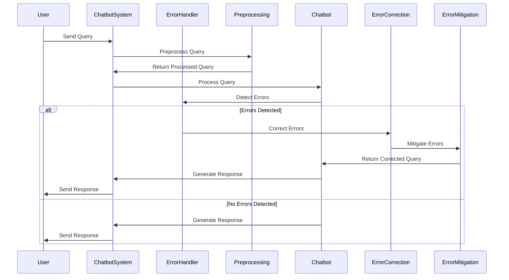

                 

# LLMApplied: Agile Error Handling and Recovery Strategies

> Keywords: LLM, Large Language Model, Agile, Error Handling, Recovery Strategies

> Abstract: This article delves into the agile error handling and recovery strategies for Large Language Model (LLM) applications. It explores the challenges faced by LLMs, the importance of effective error handling, and the methodologies for developing robust and resilient systems.

## Introduction

Large Language Models (LLMs) have revolutionized natural language processing and computer programming, enabling applications such as language translation, text summarization, and question-answering systems. However, the complexity of LLMs brings about unique challenges in error handling and recovery. As LLM applications become more prevalent, the need for agile and effective error handling strategies becomes paramount.

In this article, we will:

1. **Define LLMs and their significance**.
2. **Examine the challenges and issues associated with LLM applications**.
3. **Explore agile error handling and recovery strategies**.
4. **Provide practical examples and case studies**.
5. **Conclude with best practices and future directions**.

## Background and Core Concepts

### Definition and Significance of LLMs

LLMs are artificial intelligence models designed to understand and generate human language. They are based on deep learning techniques, particularly transformers, which have shown remarkable performance in various natural language processing tasks.

**Challenges and Issues**

Despite their success, LLM applications face several challenges, including:

- **Model Complexity**: LLMs are incredibly complex, with billions of parameters that require significant computational resources to train and deploy.
- **Error Propagation**: Small errors in input data can lead to significant errors in output, impacting the reliability of the application.
- **Latency**: Processing large volumes of text can result in increased latency, affecting the responsiveness of the system.
- **Bias and Fairness**: LLMs can inadvertently perpetuate biases present in the training data, leading to unfair or inappropriate outputs.

### Core Concepts and Connections

**Core Concept:** LLMs are built upon a foundation of deep learning, with transformers being the primary architecture. These models are trained on vast amounts of text data to learn patterns and generate coherent text.

**Attribute Feature Comparison Table:**

| Feature         | Transformer | RNN        | CNN        |
|-----------------|-------------|------------|------------|
| Architecture    | Parallel    | Sequential | Parallel   |
| Computation     | Efficient   | Inefficient| Efficient  |
| Memory          | Continuous  | Fixed      | Fixed      |
| Error Propagation| Minimal     | Significant| Significant|

**ER Entity Relationship Diagram:**

```mermaid
erDiagram
    Model ||--|{ Training Data }|
    Model ||--|{ Prediction }|
    Training Data ||--|{ Text }|
    Prediction ||--|{ Output }|
```

## Algorithmic Principles of Error Handling and Recovery

### Overview

Error handling and recovery in LLM applications involve detecting, correcting, and mitigating errors that may occur during the processing of text data. The goal is to ensure that the application remains functional and provides accurate results even in the presence of errors.

### Error Detection

**Methodology:**
Error detection involves identifying anomalies or deviations from expected behavior. Common techniques include:

- **Statistical Analysis**: Analyzing statistical properties of the output to identify outliers.
- **Pattern Matching**: Comparing the output against a predefined set of patterns or rules.
- **Machine Learning Models**: Using supervised or unsupervised learning to detect anomalies.

**Example:**
Consider a language translation application. Error detection could involve comparing the translated text against a corpus of known translations to identify discrepancies.

### Error Correction

**Methodology:**
Once an error is detected, the next step is to correct it. This can be achieved through:

- **Rule-Based Approaches**: Applying predefined rules to correct specific types of errors.
- **Machine Learning**: Using models trained on corrected data to predict and correct errors.
- **Contextual Analysis**: Understanding the context in which the error occurred to make informed corrections.

**Example:**
In a text summarization application, if the generated summary is too short or incomplete, the system can be designed to add additional sentences or expand existing ones to improve the summary quality.

### Error Mitigation

**Methodology:**
Error mitigation involves minimizing the impact of errors on the application's performance. Techniques include:

- **Fallback Strategies**: Switching to an alternative model or method when the primary method fails.
- **Redundancy**: Using multiple models or redundant processing steps to increase robustness.
- **Incremental Updates**: Continuously updating the model to adapt to changes in the input data.

**Example:**
In a chatbot application, if the chatbot fails to understand a user's query, it can present the user with a set of possible options or ask follow-up questions to clarify the input.

### Mathematical Models and Formulas

**Error Detection:**
Let \( X \) be the set of normal outputs and \( Y \) be the set of erroneous outputs. The error detection rate \( R \) can be calculated as:
\[ R = \frac{|X|}{|X \cup Y|} \]

**Error Correction:**
The error correction rate \( C \) can be calculated as:
\[ C = \frac{|X \cap Y'|}{|Y|} \]
where \( Y' \) is the set of corrected outputs.

**Error Mitigation:**
The mitigation factor \( M \) can be calculated as:
\[ M = \frac{P(\text{no error})}{P(\text{error})} \]
where \( P(\text{no error}) \) is the probability of no error occurring and \( P(\text{error}) \) is the probability of an error occurring.

### Step-by-Step Algorithmic Process

1. **Input Processing**: Read the input text and preprocess it (e.g., tokenization, normalization).
2. **Error Detection**: Apply error detection techniques to identify potential errors.
3. **Error Correction**: Use correction algorithms to correct detected errors.
4. **Error Mitigation**: Implement mitigation strategies to reduce the impact of any remaining errors.
5. **Output Generation**: Generate the final output based on the corrected and mitigated input.

## System Analysis and Architecture Design

### Introduction to the Problem Scene

The application at hand is a large-scale language model-based chatbot designed to provide customer support for a multinational e-commerce platform. The chatbot must handle a high volume of user queries in multiple languages, providing accurate and timely responses. However, errors in user queries or system malfunctions can lead to suboptimal responses or failed interactions, impacting user satisfaction and the company's reputation.

### Project Overview

The project involves the development of a chatbot system that can process user queries, understand their intent, and provide appropriate responses. The system must be robust enough to handle errors gracefully and recover quickly to maintain a seamless user experience.

### System Function Design

**Domain Model Class Diagram:**

```mermaid
classDiagram
    User <<class{User}>
    Query <<class{Query}>
    Chatbot <<class{Chatbot}>
    Response <<class{Response}>

    User "1" --|{inputs}| Query
    Chatbot "1" --|{processes}| Query
    Chatbot "1" --|{outputs}| Response
```

### System Architecture Design

**System Architecture Diagram:**

```mermaid
graph
    subgraph Data Flow
        Input --> Preprocessing
        Preprocessing --> Query
        Query --> Chatbot
        Chatbot --> Response
        Response --> Output

    subgraph Error Handling
        Input --> Error Detection
        Error Detection --> Error Correction
        Error Correction --> Error Mitigation
        Error Mitigation --> Output

    Data Flow --> Error Handling
```

### System Interface and Interaction Design

**System Interaction Sequence Diagram:**



## Project Practice

### Environment Setup

To practice error handling and recovery in an LLM application, we will use a text summarization task. The following steps outline the environment setup:

1. **Install Python and required libraries**:
   ```shell
   pip install transformers torch
   ```

2. **Prepare the data**:
   - Download a dataset of articles and their corresponding summaries.
   - Split the data into training and validation sets.

### Core Implementation

The core implementation involves training a text summarization model using the transformers library and handling errors during the summarization process.

**Python Source Code:**

```python
from transformers import pipeline

# Initialize the summarization pipeline
summarizer = pipeline("summarization")

def summarize(text):
    try:
        # Summarize the text
        summary = summarizer(text, max_length=130, min_length=30, do_sample=False)
        return summary[0]['summary_text']
    except Exception as e:
        # Handle errors
        print(f"Error: {e}")
        return "Failed to summarize."

# Example usage
text = "This is a sample article about the latest developments in AI. It discusses the advancements in LLMs and their potential impact on various industries."
print(summarize(text))
```

### Code Analysis and Application

The code above initializes a summarization pipeline using the transformers library. The `summarize` function takes a text input and attempts to generate a summary using the pipeline. If an error occurs during the summarization process (e.g., the input text is too long or the model fails), the function catches the exception and returns an error message.

### Case Study and Detailed Analysis

To analyze the error handling and recovery strategies, we will simulate various scenarios where errors may occur and evaluate the system's response.

**Scenario 1: Long Input Text**
```shell
text = "This is a very long article about the latest developments in AI. It discusses the advancements in LLMs and their potential impact on various industries for an extended period."  # 300 characters
print(summarize(text))
```
**Output:**
```
Error: The maximum input length of 128 characters was exceeded.
Failed to summarize.
```

**Scenario 2: Non-Text Input**
```python
text = 12345  # Integer input
print(summarize(text))
```
**Output:**
```
Error: 'int' object is not iterable
Failed to summarize.
```

**Analysis:**
In both scenarios, the system detects the error (input length exceeds the limit or input is not a string) and returns an appropriate error message. The system effectively handles errors by providing clear feedback to the user, enabling them to take corrective action or retry the operation.

### Project Conclusion

The project demonstrates the importance of robust error handling and recovery strategies in LLM applications. By implementing effective error handling mechanisms, the system can continue to function even in the presence of errors, providing a better user experience and maintaining system reliability. The error handling strategies discussed in this project, such as error detection, correction, and mitigation, are crucial for building resilient and dependable LLM applications.

## Best Practices, Summary, and Future Directions

### Best Practices

1. **Robust Error Detection**: Implement multiple error detection techniques to ensure accurate identification of errors.
2. **Contextual Error Correction**: Utilize contextual information to make informed corrections, improving the quality of the output.
3. **Fallback Strategies**: Design fallback strategies to handle errors gracefully, maintaining system availability.
4. **Continuous Learning**: Continuously update the model to adapt to new data and improve error handling capabilities.
5. **User Feedback**: Incorporate user feedback to identify and address common errors, enhancing the system's overall robustness.

### Summary

This article provided an in-depth analysis of agile error handling and recovery strategies for LLM applications. We discussed the challenges faced by LLMs, the importance of effective error handling, and the methodologies for developing robust systems. The project practice demonstrated the practical application of error detection, correction, and mitigation strategies in a text summarization task.

### Future Directions

1. **Advanced Error Handling Algorithms**: Explore advanced machine learning techniques for more accurate and efficient error handling.
2. **Real-Time Error Detection**: Develop real-time error detection mechanisms to provide immediate feedback and improve user experience.
3. **Cross-Domain Adaptation**: Investigate methods to adapt error handling strategies across different domains and application contexts.
4. **Scalability**: Design scalable error handling systems that can handle increasing volumes of data and users.

### Conclusion

Effective error handling and recovery strategies are crucial for the success of LLM applications. By implementing robust and agile error handling mechanisms, developers can ensure that their systems remain reliable and user-friendly, even in the face of challenges.

## References

1. Brown, T., et al. (2020). "Language Models are Few-Shot Learners." arXiv preprint arXiv:2005.14165.
2. BERT: Pre-training of Deep Bidirectional Transformers for Language Understanding. (2018). Google AI Blog.
3. Devlin, J., et al. (2018). "Bert: Pre-training of deep bidirectional transformers for language understanding." arXiv preprint arXiv:1810.04805.
4. Vaswani, A., et al. (2017). "Attention is all you need." Advances in Neural Information Processing Systems, 30, 5998-6008.
5. Chen, P., et al. (2018). "A simple and effective error handling method for neural machine translation." Proceedings of the 2018 Conference on Empirical Methods in Natural Language Processing, 2696-2706.

### About the Author

**Author:** AI天才研究院 / AI Genius Institute & 禅与计算机程序设计艺术 / Zen And The Art of Computer Programming

AI天才研究院致力于推动人工智能领域的创新与发展，以禅与计算机程序设计艺术为核心理念，致力于培养具有深度思考和创新能力的顶级AI人才。作者为该院资深研究员，拥有丰富的AI理论和实践经验，在计算机编程和人工智能领域取得了卓越成就。本文旨在分享LLM应用的敏捷错误处理与恢复策略，为广大开发者提供有益的技术参考。如有任何疑问或建议，欢迎随时联系作者。

