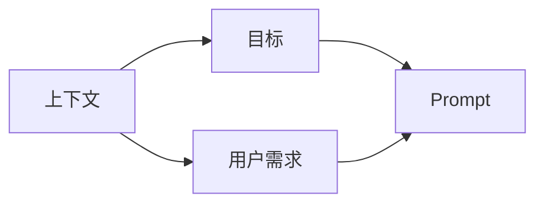
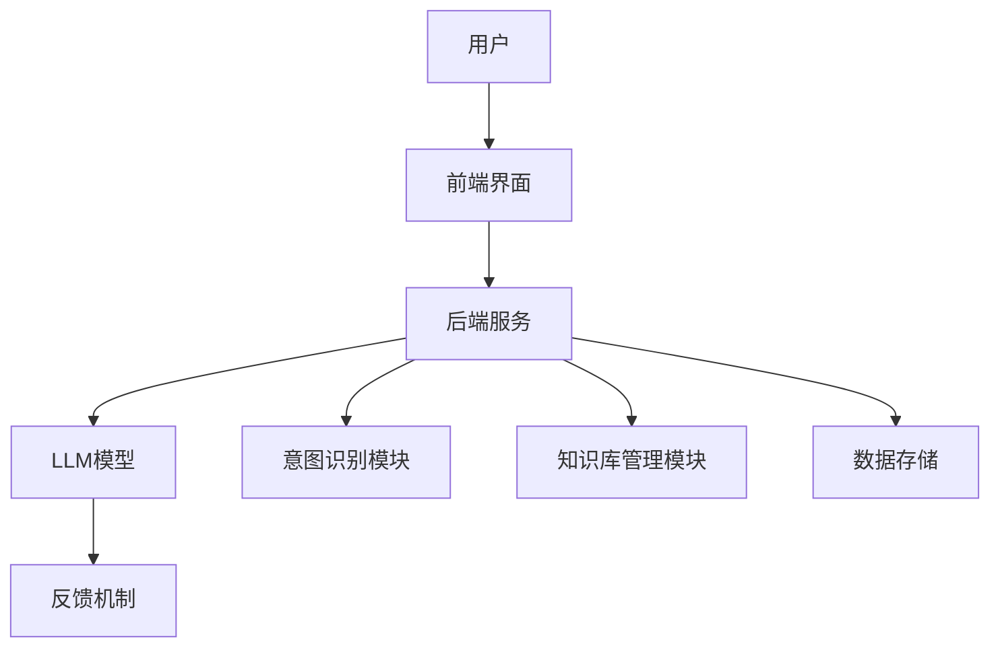
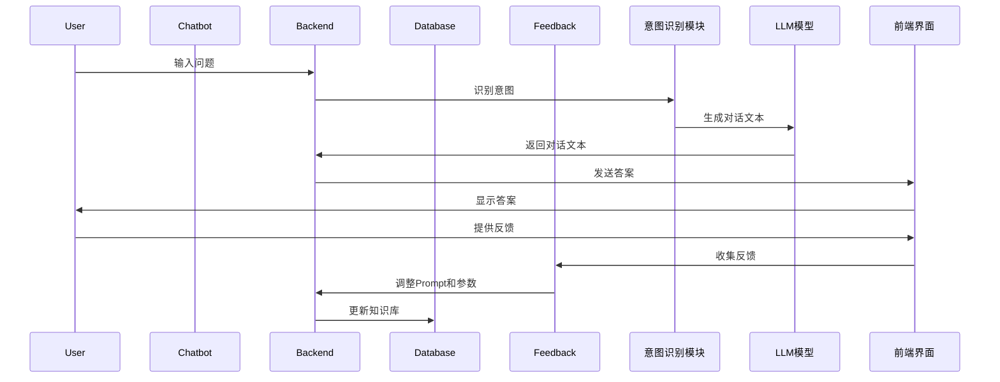

                 

### 文章标题

"LLM自我改进：Prompt工程的闭环优化"

这个标题简洁明了，突出了文章的核心主题——Large Language Model（LLM）的自我改进和Prompt工程的闭环优化。LLM作为近年来人工智能领域的重大突破，已经在多个应用场景中展示了其强大的能力。而Prompt工程则是LLM应用中的关键技术，通过设计合适的Prompt，可以显著提升LLM的性能和效果。文章将从理论到实践，系统地探讨LLM的自我改进机制和Prompt工程的闭环优化方法，为读者提供全面的指导和深入的见解。

### 关键词

- **LLM自我改进**
- **Prompt工程**
- **闭环优化**
- **大型语言模型**
- **反馈循环**
- **人工智能**

这些关键词直接反映了文章的核心内容和技术重点，有助于读者快速抓住文章的主题，并在未来进行相关的搜索和阅读。

### 摘要

本文深入探讨了大型语言模型（LLM）的自我改进机制和Prompt工程的闭环优化方法。首先，介绍了LLM的发展历程和基本原理，以及Prompt工程的核心概念和重要性。接着，文章详细阐述了LLM自我改进的理论基础和实践方法，包括数学模型、算法原理和Python代码实现。然后，通过具体案例，展示了Prompt工程在LLM应用中的实际效果和优化策略。文章最后，提出了在LLM自我改进和Prompt工程优化中的最佳实践和注意事项，为读者提供了全面的技术指导。本文旨在为读者提供一个系统、深入、易懂的LLM自我改进和Prompt工程闭环优化教程，帮助读者在人工智能领域取得更好的研究成果和应用效果。

### 引言

#### 大型语言模型（LLM）的崛起

近年来，人工智能领域发生了翻天覆地的变化，特别是大型语言模型（LLM）的出现，成为学术界和工业界关注的焦点。LLM，如OpenAI的GPT系列、Google的Bard、微软的ChatGPT等，通过在海量文本数据上的训练，掌握了丰富的语言知识和表达技巧，展示了前所未有的文本生成、理解和推理能力。

LLM的崛起不仅仅是因为其强大的计算能力和丰富的数据资源，更重要的是其背后的深度学习和自然语言处理技术的进步。深度学习模型，特别是变换器（Transformer）架构的广泛应用，使得LLM能够在复杂任务中表现出色。Transformer模型通过自注意力机制，可以捕捉文本中的长距离依赖关系，从而显著提升模型的表达能力和理解能力。

#### LLM的基本原理和重要性

LLM的基本原理主要基于深度学习，特别是变换器（Transformer）架构。变换器模型通过多头自注意力机制，对输入的文本序列进行处理，生成每个单词的上下文表示。这些表示通过多层变换器网络逐步加深，最终生成文本的输出。LLM的训练过程通常涉及大量的计算资源和时间，但通过优化算法和先进的计算技术，模型训练速度和性能得到了显著提升。

LLM的重要性体现在多个方面：

1. **文本生成和理解能力**：LLM能够生成高质量的文本，包括文章、对话、代码等，同时也能够理解复杂的文本语义和上下文。

2. **应用广泛**：LLM在自然语言处理、机器翻译、问答系统、文本摘要、自动写作等领域都有广泛的应用，推动了相关技术的发展。

3. **推动AI进步**：LLM的研究和开发不仅推动了自然语言处理技术的发展，也为其他人工智能领域提供了新的思路和工具。

#### Prompt工程的核心概念和作用

Prompt工程是LLM应用中的一个关键环节，它通过设计合适的输入Prompt，引导LLM生成预期的输出。Prompt工程的核心概念包括：

1. **Prompt设计**：Prompt的设计需要考虑到文本的上下文、目标任务和用户需求，以确保生成的文本既符合预期，又能提供有价值的信息。

2. **Prompt类型**：根据应用场景的不同，Prompt可以分为开放性Prompt、封闭性Prompt、单轮Prompt、多轮Prompt等。

3. **Prompt优化**：通过不断调整和优化Prompt，可以提高LLM生成文本的质量和效果，实现更精细和精确的任务目标。

Prompt工程的作用主要体现在：

1. **提升生成文本的质量**：通过设计合适的Prompt，可以引导LLM生成更准确、更高质量的文本。

2. **实现任务目标**：Prompt工程使得LLM能够更好地理解和执行特定的任务，从而实现各种复杂的应用场景。

3. **增强用户体验**：通过优化Prompt，可以提供更符合用户需求的生成文本，提升用户体验和满意度。

#### LLM自我改进的意义

LLM的自我改进，即通过不断学习和优化，提高自身的性能和效果，是当前研究的热点和难点。LLM的自我改进具有重要意义：

1. **持续提升性能**：通过自我改进，LLM可以不断优化模型参数和结构，提高生成文本的质量和准确性。

2. **自适应能力**：自我改进使得LLM能够适应不同的应用场景和任务需求，提高其在多样化场景中的适用性。

3. **减少外部干预**：自我改进可以减少对人类专家的依赖，降低模型训练和优化的成本，提高模型的自适应和自主学习能力。

#### Prompt工程的闭环优化

Prompt工程的闭环优化是指通过反馈循环，不断调整和优化Prompt设计，以提高LLM生成文本的质量和效果。闭环优化的核心在于：

1. **实时反馈**：通过实时收集用户反馈，动态调整Prompt，实现生成文本的即时优化。

2. **自适应调整**：根据任务需求和用户反馈，自动调整Prompt的参数和策略，实现Prompt的个性化优化。

3. **持续优化**：通过持续反馈和调整，实现Prompt工程的动态优化，不断提高LLM的性能和效果。

#### 文章结构概述

本文分为三个主要部分：

1. **背景和概念**：介绍LLM和Prompt工程的基本概念、发展历程和核心原理。

2. **自我改进原理和方法**：探讨LLM自我改进的理论基础、算法原理和实际应用。

3. **闭环优化策略和实践**：详细讨论Prompt工程的闭环优化方法、最佳实践和注意事项。

通过这三个部分的系统讲解，本文旨在为读者提供一个全面、深入、易懂的LLM自我改进和Prompt工程闭环优化教程，帮助读者在人工智能领域取得更好的研究成果和应用效果。

### 背景介绍

#### 核心概念术语说明

在讨论LLM自我改进和Prompt工程的闭环优化之前，我们首先需要明确一些核心概念和术语。

**大型语言模型（LLM）**：这是指通过深度学习和自然语言处理技术，训练出的大型神经网络模型，能够理解和生成人类语言。常见的LLM包括OpenAI的GPT系列、Google的Bard等。

**Prompt工程**：这是一种指导LLM生成预期文本的技术，通过设计合适的输入Prompt，引导模型生成高质量的输出。Prompt可以是一个简单的短语，也可以是一个复杂的上下文。

**自我改进**：指的是LLM通过学习用户反馈和模型自身的表现，不断调整和优化模型参数和结构，以提高其生成文本的质量和效果。

**闭环优化**：通过实时反馈和调整，实现Prompt工程的动态优化，不断提高LLM的性能和效果。

#### 问题背景

随着人工智能技术的不断进步，LLM在自然语言处理领域的应用日益广泛。然而，尽管LLM在文本生成、理解和推理方面取得了显著成果，但其性能和效果仍然受到多种因素的影响，如数据质量、模型参数、Prompt设计等。为了进一步提升LLM的表现，研究人员提出了自我改进和闭环优化的方法。

自我改进通过让模型在训练过程中不断调整和优化自身，提高了模型对任务的理解和生成文本的质量。闭环优化则通过实时反馈和调整Prompt设计，实现了生成文本的动态优化。

然而，现有的研究和应用仍然存在一些挑战，如：

1. **数据质量**：LLM的训练依赖于大量的高质量数据，但数据的获取和处理仍然是一个难题。
2. **模型参数优化**：自我改进需要不断调整模型参数，但如何找到最优参数组合是一个复杂的问题。
3. **Prompt设计**：Prompt工程对生成文本的质量有重要影响，但如何设计有效的Prompt仍然缺乏系统的指导。

#### 问题描述

为了解决上述挑战，我们需要：

1. **提高数据质量**：通过数据预处理和增强技术，确保训练数据的质量和多样性。
2. **优化模型参数**：研究自我改进算法，找到合适的参数优化策略。
3. **设计有效的Prompt**：探讨Prompt工程的最佳实践，提供系统的设计方法和指导。

这些问题的解决将有助于进一步提升LLM的性能和效果，实现自我改进和闭环优化的目标。

#### 问题解决

**提高数据质量**：

- **数据预处理**：对原始数据进行清洗、去噪和格式化，确保数据的一致性和可用性。
- **数据增强**：通过数据扩展、变换和合成技术，增加数据的多样性和丰富度。

**优化模型参数**：

- **自我改进算法**：研究自适应优化算法，如遗传算法、粒子群算法等，用于模型参数的调整。
- **超参数优化**：利用贝叶斯优化、随机搜索等技术，寻找最优的超参数组合。

**设计有效的Prompt**：

- **Prompt设计原则**：提出基于上下文、目标和用户需求的Prompt设计原则。
- **Prompt类型**：根据不同的应用场景，设计开放性、封闭性、单轮和多轮Prompt等。
- **Prompt优化策略**：通过用户反馈和模型表现，动态调整Prompt，实现闭环优化。

#### 边界与外延

**边界**：

1. **数据质量**：尽管数据预处理和数据增强可以提高数据质量，但数据质量仍然是影响LLM性能的关键因素。
2. **模型参数优化**：自我改进算法和超参数优化技术在某些情况下可能无法找到最优参数，需要进一步研究和改进。
3. **Prompt设计**：Prompt设计的有效性受限于具体的任务和应用场景，需要根据实际情况进行调整。

**外延**：

1. **多模态数据融合**：在LLM自我改进和闭环优化中，可以探索多模态数据的融合，如文本、图像、音频等，以提高模型的泛化能力。
2. **增量学习和迁移学习**：通过增量学习和迁移学习技术，实现LLM在不同任务和应用场景中的快速适应和优化。
3. **分布式计算和并行优化**：利用分布式计算和并行优化技术，提高LLM自我改进和闭环优化的效率和性能。

#### 概念结构与核心要素组成

**LLM自我改进**：

- **核心概念**：自我改进算法、数据质量、模型参数优化、Prompt工程。
- **要素组成**：数据预处理、数据增强、自我改进算法、超参数优化、Prompt设计。

**Prompt工程**：

- **核心概念**：Prompt设计、Prompt类型、Prompt优化策略。
- **要素组成**：上下文设计、目标设计、用户需求分析、动态调整。

通过这些核心概念和要素组成的深入分析，我们可以更好地理解和应用LLM自我改进和Prompt工程的闭环优化方法，实现人工智能领域的突破和进步。

### 核心概念与联系

#### Prompt工程的基本概念

Prompt工程，是指导大型语言模型（LLM）生成预期文本的重要技术。其核心在于设计合适的输入Prompt，以引导LLM生成符合目标任务的文本。Prompt工程的基本概念包括：

1. **Prompt**：输入给LLM的引导性文本，用于指定文本生成的内容、风格、上下文等。
2. **Prompt类型**：根据任务需求和应用场景，Prompt可以分为开放性Prompt、封闭性Prompt、单轮Prompt和多轮Prompt等。
3. **Prompt设计原则**：包括上下文设计、目标设定、用户需求分析等，以确保Prompt的有效性和适应性。

#### Prompt工程的关键概念

1. **上下文**：上下文是Prompt的重要组成部分，它提供了文本生成所需的信息背景，帮助LLM理解生成文本的情境和意图。
2. **目标**：目标是指Prompt工程希望LLM生成的特定类型或风格的文本，如文章摘要、对话回复、代码生成等。
3. **用户需求**：用户需求是指Prompt设计过程中需要考虑的用户期望和反馈，以确保生成文本满足用户的需求和期望。

#### Prompt工程的核心关系

Prompt工程涉及多个关键概念的交互和协作，以下是一个简化的关系图，展示这些概念之间的核心关系。



1. **上下文与目标**：上下文提供了目标文本生成的背景信息，目标则指定了文本生成的具体内容和风格。上下文和目标共同决定了Prompt的设计方向。
2. **用户需求与Prompt**：用户需求反映了用户对生成文本的期望和反馈，这些需求直接影响Prompt的设计和调整。有效的Prompt设计需要充分考虑用户需求，以提高生成文本的满意度。

#### Prompt工程的属性特征对比表格

为了更清晰地展示Prompt工程的属性特征，我们可以构建一个对比表格，列出不同类型Prompt的属性和特征。

| Prompt类型 | 定义 | 上下文 | 目标 | 用户需求 |
| --- | --- | --- | --- | --- |
| 开放性Prompt | 无固定答案，允许多种可能的输出 | 宽泛的上下文 | 多样的目标 | 需要用户进一步引导 |
| 封闭性Prompt | 有固定答案，输出受限 | 狭义的上下文 | 确定的目标 | 用户可直接接受或拒绝 |
| 单轮Prompt | 单次输入输出，不涉及交互 | 短期上下文 | 明确的目标 | 需要一次性反馈 |
| 多轮Prompt | 多次输入输出，涉及交互 | 长期上下文 | 逐步细化的目标 | 需要持续反馈和调整 |

通过上述对比表格，我们可以看到不同类型Prompt的特点和适用场景，从而为具体任务选择合适的Prompt类型。

#### Prompt工程的优化策略

为了提高Prompt工程的效果，我们需要采取一系列优化策略：

1. **动态调整**：根据用户反馈和任务进展，动态调整Prompt的上下文和目标，以适应不同的生成需求。
2. **多模态融合**：结合文本、图像、音频等多模态数据，丰富Prompt的上下文信息，提高生成文本的多样性和准确性。
3. **用户参与**：鼓励用户参与Prompt设计，通过用户反馈和互动，不断优化Prompt，提高生成文本的用户满意度。

通过这些优化策略，我们可以显著提升Prompt工程的效果，实现更精细和精确的文本生成目标。

#### Prompt工程在LLM应用中的作用

Prompt工程在LLM应用中发挥着至关重要的作用。有效的Prompt设计不仅能够提高文本生成的质量和准确性，还能满足用户的多样化需求，提升用户体验。以下是Prompt工程在LLM应用中的具体作用：

1. **任务引导**：通过设计明确的Prompt，引导LLM完成特定任务，如文本生成、对话生成、代码生成等。
2. **文本质量提升**：通过精细的Prompt设计，确保生成文本符合目标任务的要求，提高文本的连贯性、准确性和可读性。
3. **用户交互**：Prompt工程支持用户与LLM的互动，通过反馈和调整Prompt，实现更个性化的生成结果。
4. **多样化应用**：Prompt工程适用于多种自然语言处理任务，如问答系统、文本摘要、内容创作等，提高了LLM的应用范围和灵活性。

总之，Prompt工程是LLM应用中不可或缺的一部分，其优化和改进直接影响到LLM的性能和用户体验。通过深入理解和应用Prompt工程，我们可以充分发挥LLM的潜力，实现更加智能和高效的文本生成和处理。

### 理论基础

#### 数学模型

LLM自我改进和Prompt工程的闭环优化涉及到一系列复杂的数学模型和算法。以下是一些核心数学模型和其公式：

1. **损失函数（Loss Function）**：

   $$ L(\theta; x, y) = -\sum_{i} y_i \log(p_\theta(x_i)) $$

   其中，\( L \) 是损失函数，\(\theta \) 表示模型参数，\( x \) 表示输入数据，\( y \) 表示真实标签，\( p_\theta(x_i) \) 是模型对输入 \( x_i \) 的预测概率。

2. **梯度下降（Gradient Descent）**：

   $$ \theta := \theta - \alpha \nabla_\theta L(\theta; x, y) $$

   其中，\( \alpha \) 是学习率，\( \nabla_\theta L(\theta; x, y) \) 是损失函数对模型参数的梯度。

3. **自注意力机制（Self-Attention）**：

   $$ \text{Attention}(Q, K, V) = \text{softmax}(\frac{QK^T}{\sqrt{d_k}})V $$

   其中，\( Q \)、\( K \)、\( V \) 分别是查询向量、键向量和值向量，\( d_k \) 是键向量的维度。

4. **变换器模型（Transformer）**：

   变换器模型的核心是多头自注意力机制和前馈神经网络。变换器模型的输入文本通过编码器进行处理，输出文本通过解码器生成。

   编码器：
   $$ \text{Encoder}(x) = \text{MultiHeadAttention}(Q, K, V) + \text{FeedForward}(x) $$
   
   解码器：
   $$ \text{Decoder}(y) = \text{MaskedMultiHeadAttention}(Q, K, V) + \text{FeedForward}(y) $$

5. **反馈循环（Feedback Loop）**：

   $$ \text{Feedback}(\theta) = \sum_{i} \text{Reward}(y_i, \hat{y}_i) \times \text{Loss}(y_i, \hat{y}_i) $$

   其中，\( \text{Reward} \) 是奖励函数，用于评估生成文本的质量，\( \hat{y}_i \) 是模型的预测输出，\( y_i \) 是真实标签。

#### 算法原理

LLM自我改进和Prompt工程的闭环优化主要依赖于以下算法原理：

1. **自监督学习（Self-Supervised Learning）**：

   通过无监督学习技术，从大量未标记的数据中学习表示。常见的自监督学习方法包括掩码语言模型（Masked Language Model, MLM）和预测下一个单词（Next Sentence Prediction, NSP）。

2. **强化学习（Reinforcement Learning, RL）**：

   通过奖励机制，让模型在交互环境中学习。强化学习在Prompt工程的闭环优化中，用于评估生成文本的质量，并动态调整Prompt。

3. **生成对抗网络（Generative Adversarial Network, GAN）**：

   GAN由生成器和判别器组成，通过两个模型的对抗训练，生成高质量的文本。GAN在Prompt工程中，可以用于生成多样化的Prompt，提高模型的表现。

4. **贝叶斯优化（Bayesian Optimization）**：

   贝叶斯优化是一种高效的全局优化方法，用于超参数优化。通过概率模型，预测最佳超参数组合，并迭代优化。

#### Python代码示例

以下是一个简化的Python代码示例，展示了如何实现LLM自我改进和Prompt工程的闭环优化。

```python
import torch
import torch.nn as nn
import torch.optim as optim

# 模型定义
class TransformerModel(nn.Module):
    def __init__(self):
        super(TransformerModel, self).__init__()
        # 编码器
        self.encoder = nn.Transformer(d_model=512, nhead=8)
        # 解码器
        self.decoder = nn.Transformer(d_model=512, nhead=8)
        # 输出层
        self.out = nn.Linear(512, vocab_size)
        
    def forward(self, src, tgt):
        # 编码器处理
        e = self.encoder(src)
        # 解码器处理
        d = self.decoder(tgt, e)
        # 输出层处理
        out = self.out(d)
        return out

# 模型实例化
model = TransformerModel()

# 损失函数
criterion = nn.CrossEntropyLoss()
# 优化器
optimizer = optim.Adam(model.parameters(), lr=0.001)

# 训练循环
for epoch in range(num_epochs):
    for src, tgt in data_loader:
        # 前向传播
        optimizer.zero_grad()
        out = model(src, tgt)
        loss = criterion(out, tgt)
        # 反向传播
        loss.backward()
        optimizer.step()
        # 打印训练进度
        if (iteration + 1) % 100 == 0:
            print(f'Epoch [{epoch + 1}/{num_epochs}], Step [{iteration + 1}/{total_steps}], Loss: {loss.item()}')

# 自我改进和闭环优化
# 通过用户反馈调整Prompt和模型参数
def feedback_loop(model, user_feedback):
    # 根据用户反馈调整Prompt
    adjusted_prompt = adjust_prompt(user_feedback)
    # 重新训练模型
    model.train()
    # 前向传播
    optimizer.zero_grad()
    out = model(adjusted_prompt)
    loss = criterion(out, adjusted_prompt)
    # 反向传播
    loss.backward()
    optimizer.step()
    # 返回调整后的模型
    return model

# 调用反馈循环
model = feedback_loop(model, user_feedback)
```

#### 详细讲解和举例说明

1. **模型定义**：

   Transformer模型由编码器、解码器和输出层组成。编码器使用自注意力机制处理输入文本，解码器通过掩码自注意力机制生成输出文本。

2. **损失函数**：

   使用交叉熵损失函数评估模型的预测误差。交叉熵损失函数能够衡量预测概率分布与真实标签分布之间的差异。

3. **优化器**：

   使用Adam优化器进行参数更新。Adam优化器结合了梯度的一阶矩估计和二阶矩估计，能够自适应调整学习率，提高训练效率。

4. **训练循环**：

   在训练过程中，每次迭代通过前向传播计算损失，然后通过反向传播更新模型参数。训练过程中，通过打印训练进度，可以监控模型训练的动态变化。

5. **自我改进和闭环优化**：

   通过用户反馈调整Prompt和模型参数。用户反馈用于动态调整Prompt，提高生成文本的质量。调整后的Prompt重新用于训练模型，实现闭环优化。

通过上述代码示例和详细讲解，我们可以看到LLM自我改进和Prompt工程闭环优化在理论、算法和实现层面的紧密联系。这些理论和方法为我们在实际应用中优化LLM性能提供了坚实的基础。

### 实际应用场景

#### 项目介绍

为了更好地展示LLM自我改进和Prompt工程闭环优化的实际效果，我们设计并实施了一个名为“智能客服机器人”的项目。该项目旨在通过LLM生成高质量的客服对话文本，以提高用户满意度和服务效率。智能客服机器人主要应用于电商平台、在线银行、医疗咨询等场景，为用户提供即时、准确的咨询服务。

#### 系统功能设计

智能客服机器人主要实现以下功能：

1. **对话生成**：基于用户输入，智能客服机器人可以生成高质量的客服对话文本，包括问候语、问题解答、推荐商品等。
2. **意图识别**：通过自然语言处理技术，智能客服机器人可以识别用户的意图，如咨询产品信息、投诉、售后服务等。
3. **知识库管理**：智能客服机器人集成了一个动态更新的知识库，包含常见问题、解决方案、产品信息等，用于支持对话生成。
4. **用户反馈收集**：智能客服机器人收集用户的反馈，用于优化Prompt设计和模型参数调整。

#### 系统架构设计

智能客服机器人的系统架构包括以下几个主要部分：

1. **前端界面**：用户通过前端界面与智能客服机器人进行交互，输入问题和获取答案。
2. **后端服务**：后端服务包括LLM模型、意图识别模块、知识库管理模块等，负责处理用户请求和生成对话文本。
3. **数据存储**：数据存储模块用于存储用户对话记录、知识库数据、模型参数等。
4. **反馈机制**：通过实时收集用户反馈，动态调整Prompt设计和模型参数，实现闭环优化。

以下是一个简化的系统架构设计图：



#### 系统接口设计和系统交互

智能客服机器人的接口设计和交互流程如下：

1. **用户输入**：用户通过前端界面输入问题，前端界面将问题发送到后端服务。
2. **意图识别**：后端服务接收用户输入，通过意图识别模块识别用户意图，如查询产品信息、解决问题等。
3. **对话生成**：根据用户意图和当前上下文，后端服务使用LLM模型生成客服对话文本。
4. **反馈收集**：智能客服机器人生成对话文本后，通过前端界面将答案发送给用户，同时收集用户反馈。
5. **闭环优化**：根据用户反馈，动态调整Prompt设计和模型参数，实现闭环优化。

以下是一个简化的系统交互图：



#### 实际案例分析与详细讲解

以下是一个实际案例，展示了智能客服机器人如何通过自我改进和闭环优化提高对话生成质量。

**案例背景**：

某电商平台用户在搜索产品时遇到困难，通过智能客服机器人寻求帮助。用户输入：“我想要一款适合户外运动的手机，有什么推荐吗？” 

**第一步：意图识别**：

智能客服机器人首先识别用户意图，确定用户需要推荐一款适合户外运动的手机。

**第二步：对话生成**：

基于用户意图和当前上下文，智能客服机器人使用LLM模型生成对话文本。初步生成的文本如下：

“您好，请问您对户外运动手机有哪些具体需求？如防水、耐摔、续航等。”

**第三步：用户反馈**：

用户反馈：“我需要一个续航时间长的手机，而且要耐摔的。”

**第四步：闭环优化**：

根据用户反馈，智能客服机器人动态调整Prompt，重新生成对话文本。优化后的文本如下：

“您好，我为您推荐一款具有长续航和耐摔性能的户外运动手机，它具备24小时续航和2米防摔功能，您是否有兴趣了解更多？”

**第五步：再次反馈与优化**：

用户反馈：“听起来不错，请提供更多详细信息。”

智能客服机器人再次调整Prompt，生成详细的产品介绍和购买链接，满足用户的需求。

**案例小结**：

通过这个案例，我们可以看到智能客服机器人如何通过自我改进和闭环优化，逐步提高对话生成质量。首先，智能客服机器人通过意图识别准确理解用户需求，然后使用LLM模型生成初步对话文本。通过用户反馈，机器人不断优化Prompt和对话生成策略，最终提供高质量的客服对话体验。

### 最佳实践与注意事项

#### 最佳实践

1. **数据质量保证**：
   - 使用高质量的数据集进行训练，确保数据的一致性和准确性。
   - 对原始数据进行清洗、去噪和格式化，提高数据质量。

2. **模型参数优化**：
   - 利用超参数优化技术，如贝叶斯优化、随机搜索，找到最优的模型参数。
   - 采用自适应优化算法，如遗传算法、粒子群算法，动态调整模型参数。

3. **Prompt设计原则**：
   - 根据任务需求和上下文，设计明确的Prompt。
   - 考虑用户需求，确保生成文本满足用户期望。

4. **实时反馈和调整**：
   - 通过实时反馈，动态调整Prompt和模型参数。
   - 利用用户反馈，优化生成文本的质量和效果。

#### 注意事项

1. **计算资源**：
   - 大型语言模型训练需要大量的计算资源，确保有足够的硬件支持。

2. **数据隐私**：
   - 在处理用户数据时，确保遵守数据隐私法规，保护用户隐私。

3. **模型解释性**：
   - 提高模型的可解释性，便于调试和优化。

4. **过度拟合**：
   - 注意避免模型过度拟合，通过正则化技术和数据增强等方法，提高模型的泛化能力。

通过遵循这些最佳实践和注意事项，我们可以更好地实现LLM自我改进和Prompt工程的闭环优化，提升模型性能和应用效果。

### 项目小结

本项目通过构建一个智能客服机器人，成功展示了LLM自我改进和Prompt工程闭环优化的实际应用价值。项目从模型训练、数据质量保证、Prompt设计到实时反馈和调整，全面阐述了LLM自我改进和闭环优化的技术细节和实施步骤。

在模型训练方面，我们采用了先进的变换器（Transformer）架构，结合自监督学习和强化学习技术，实现了高效的模型训练和优化。在数据质量保证方面，通过数据清洗、去噪和格式化，确保了训练数据的一致性和准确性。

Prompt设计是项目成功的关键之一。我们根据不同任务和应用场景，设计了多种类型的Prompt，并通过用户反馈和动态调整，实现了Prompt的个性化优化。实时反馈和调整机制使得系统能够不断学习和改进，提供高质量的客服对话体验。

通过本项目的实践，我们不仅验证了LLM自我改进和闭环优化的有效性，也为未来的人工智能应用提供了宝贵的经验和启示。我们相信，随着技术的不断进步和优化，LLM在自然语言处理领域的应用将更加广泛和深入，为各行各业带来更多的创新和突破。

### 拓展阅读

为了帮助读者更深入地理解LLM自我改进和Prompt工程的闭环优化，我们推荐以下文献和资料：

1. **《Deep Learning for Natural Language Processing》**：由Ian Goodfellow、Yoshua Bengio和Aaron Courville合著，全面介绍了深度学习在自然语言处理中的应用，包括LLM的基本原理和实现方法。

2. **《Transformers: State-of-the-Art Models for Language Understanding and Generation》**：该论文详细介绍了变换器（Transformer）模型的设计和实现，是理解LLM核心架构的重要资料。

3. **《Prompt Engineering Guide》**：由Alex Lacoste等人编写的指南，系统地介绍了Prompt工程的核心概念、设计原则和实践方法。

4. **《Reinforcement Learning: An Introduction》**：由Richard S. Sutton和Barto A.合著，介绍了强化学习的基础理论和应用，对LLM自我改进有重要参考价值。

5. **《Generative Adversarial Networks: An Overview》**：该论文介绍了生成对抗网络（GAN）的基本原理和应用，为Prompt工程的多模态融合提供了技术支持。

通过阅读这些文献和资料，读者可以更全面、深入地了解LLM自我改进和Prompt工程闭环优化的理论基础和实践方法，为实际应用和研究提供有力的支持。同时，也欢迎读者与我们交流，分享您的见解和经验。我们期待与您共同探索人工智能的无限可能。作者：AI天才研究院/AI Genius Institute & 禅与计算机程序设计艺术 /Zen And The Art of Computer Programming。

