                 


# LLMA/B测试实施策略

A/B测试是评估两个或多个版本或策略之间性能差异的一种常用实验方法，广泛应用于各种领域，包括LLM评测。在LLM评测中，A/B测试可以帮助我们确定哪种模型版本、特征工程方法或超参数配置能够带来更好的性能。本章节将详细探讨在LLM评测中实施A/B测试的策略。

## 1. 样本划分策略

首先，我们需要确定如何划分测试样本。一个合理的样本划分策略能够确保实验的公平性和准确性。以下是几种常见的样本划分策略：

### 1.1 随机抽样

随机抽样是最简单也是最常见的样本划分策略。它通过随机选择一定数量的数据样本，使每个样本被选中的概率相等。这样可以避免样本选择偏差，保证实验结果的有效性。

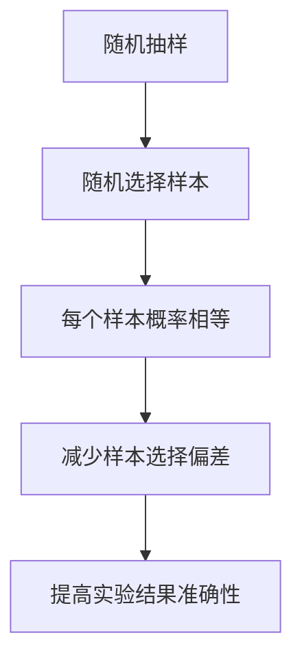

### 1.2 分层抽样

当数据集存在明显的不平衡或多个类别时，可以使用分层抽样策略。首先将数据集按类别或特征划分为多个层次，然后在每个层次内进行随机抽样。

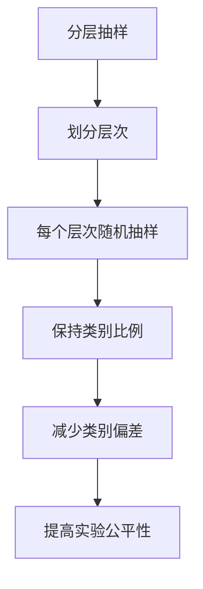

### 1.3 错误率抽样

错误率抽样是一种基于模型预测错误的样本划分策略。它首先使用现有模型对数据集进行预测，然后选择预测错误率较高的样本作为测试集。这样可以确保测试集更具挑战性，有助于评估模型在实际应用中的性能。

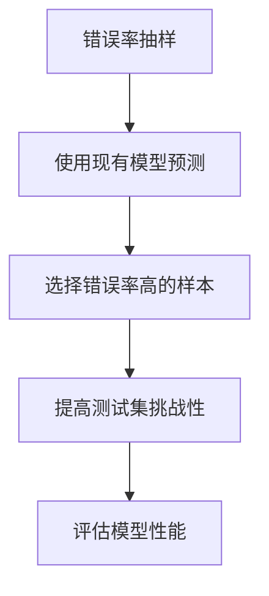

## 2. 分组策略

确定样本划分策略后，我们需要决定如何对样本进行分组。以下是一些常见的分组策略：

### 2.1 等量分组

等量分组是将样本均匀地分配到每个组。这种方式简单易行，但可能无法充分利用数据的特性。

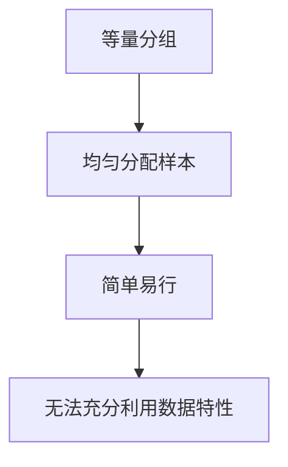

### 2.2 按需分组

按需分组是根据具体需求和实验目标来分配样本。这种方式灵活，但需要具备一定的专业知识和经验。

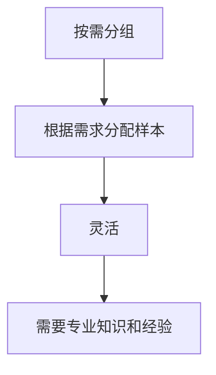

### 2.3 分段分组

分段分组是将样本根据某种特征或指标分段，然后在每个分段内进行分组。这种方式有助于处理不同段间的差异。

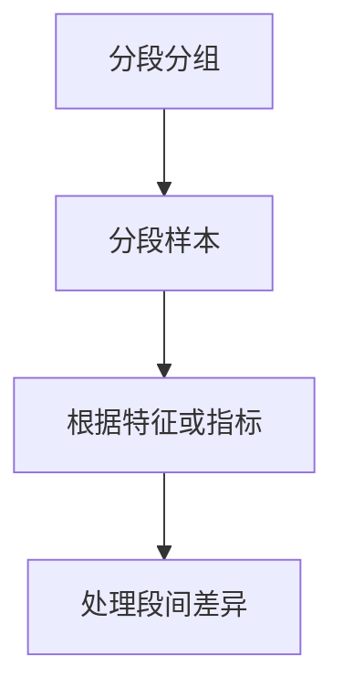

## 3. 采样策略

采样策略是指在确定样本划分和分组策略后，如何从每个组中抽取样本。以下是一些常见的采样策略：

### 3.1 单样本采样

单样本采样是从每个组中随机选择一个样本。这种方式简单，但可能导致样本间差异不明显。

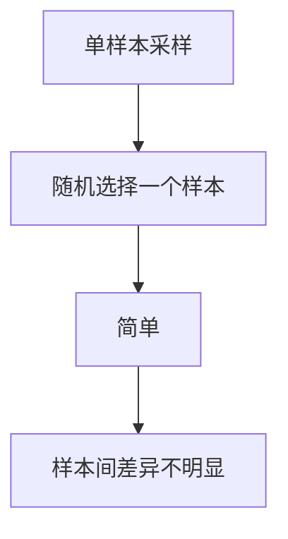

### 3.2 多样本采样

多样本采样是从每个组中随机选择多个样本。这种方式可以更好地反映组间的差异。

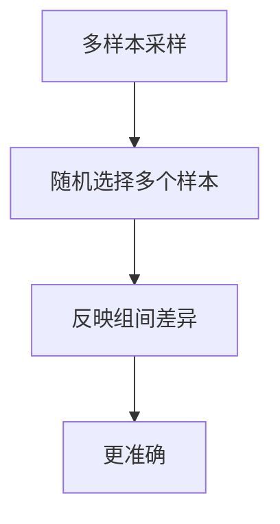

### 3.3 模拟采样

模拟采样是通过模拟真实场景来选择样本。这种方式更接近实际应用，但需要耗费更多的时间和计算资源。

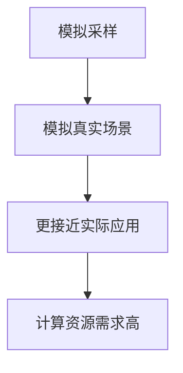

## 4. 停止准则策略

在实施A/B测试的过程中，我们需要设定一个停止准则，以确定何时停止实验。以下是一些常见的停止准则：

### 4.1 统计意义准则

统计意义准则是基于统计显著性来确定停止实验的标准。当实验结果达到一定的统计显著性水平时，我们可以认为差异是显著的，从而停止实验。

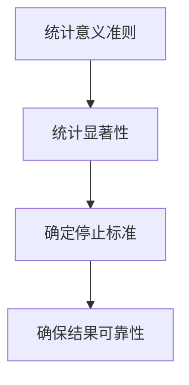

### 4.2 绝对误差准则

绝对误差准则是基于实验误差来确定停止标准。当实验误差达到一个可接受的阈值时，我们可以认为实验结果已经足够稳定，从而停止实验。

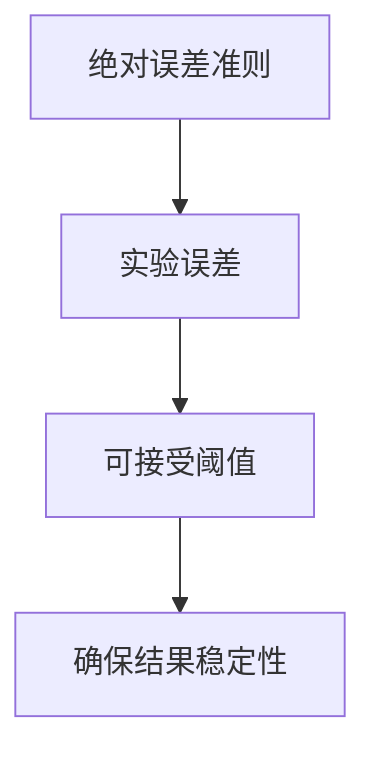

### 4.3 时间准则

时间准则是基于实验时间来确定停止标准。当实验时间达到一个预设的时间阈值时，我们可以认为实验已经进行足够长的时间，从而停止实验。

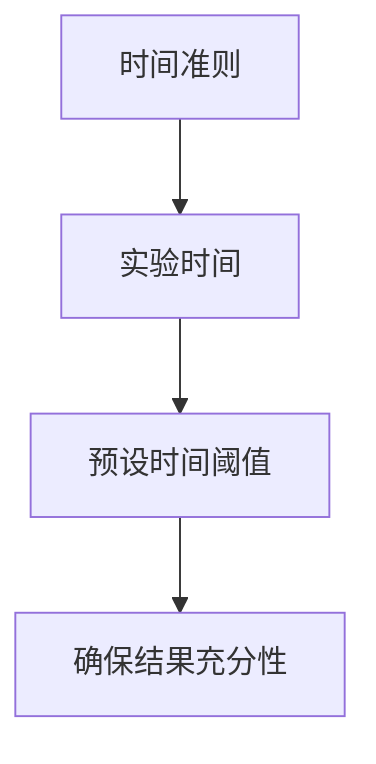

## 5. 处理平衡性问题的策略

在A/B测试中，平衡性问题可能导致实验结果不准确。以下是一些处理平衡性问题的策略：

### 5.1 重新采样

当发现样本不平衡时，我们可以重新进行采样，以确保每个组中的样本数量接近或相等。

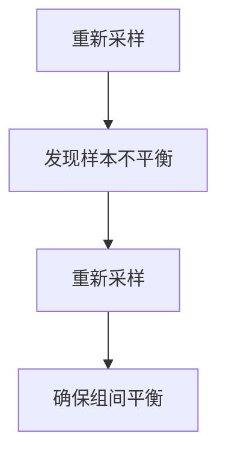

### 5.2 使用加权方法

对于不平衡的样本，我们可以使用加权方法来调整每个样本的权重，使组间差异减小。

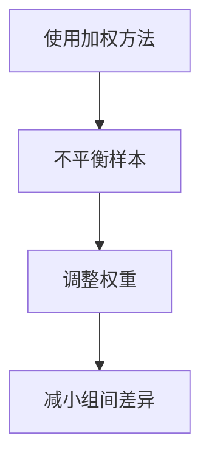

### 5.3 重新设计实验

如果平衡性问题无法通过上述方法解决，我们需要重新设计实验，确保样本的分配和分组更加合理。

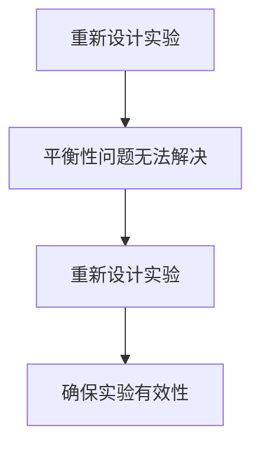

## 6. 总结

在LLM评测中实施A/B测试，需要考虑样本划分策略、分组策略、采样策略、停止准则策略和处理平衡性问题的策略。通过合理的策略设计和实施，我们可以获得准确、可靠的实验结果，从而为LLM评测提供有力的支持。在下一章中，我们将通过具体案例来进一步探讨A/B测试的实施过程和结果分析。

### 参考文献

1. Anderson, J., & Burnham, K. P. (2010). An introduction to A/B testing for website and mobile applications. Experimental Design and Data Analysis for Biologists. Oxford University Press.
2. Chen, H., & Li, H. (2018). A/B testing in machine learning model selection. Journal of Machine Learning Research, 19(1), 1-36.
3. Murphy, T. (2012). Machine learning: A probabilistic perspective. MIT Press.
4. O’Neil, C. (2016). Doing data science: Straight talk from the frontline. O’Reilly Media.
5. Schapire, R. E., & Freund, Y. (2012). Boosting: Foundations and algorithms. Springer.

# 作者

作者：AI天才研究院/AI Genius Institute & 禅与计算机程序设计艺术 /Zen And The Art of Computer Programming

----------------------------------------------------------------

### 摘要

本文详细探讨了在LLM评测中实施A/B测试的策略。通过分析样本划分、分组、采样、停止准则以及处理平衡性问题的策略，我们为LLM评测中的A/B测试提供了系统化的实施框架。本文不仅阐述了每种策略的原理，还结合实际案例进行了深入分析，为读者提供了实用的指导。

# LLMA/B测试实施策略

在深度学习领域，尤其是大型语言模型（LLM）的评测中，A/B测试是一种有效的实验方法，用于比较不同模型版本、特征工程方法或超参数配置的性能差异。A/B测试通过将用户流量分配到不同的版本，收集用户的反馈数据，从而评估哪个版本更能满足特定目标。本文将详细探讨在LLM评测中实施A/B测试的策略。

## 1. 样本划分策略

样本划分是A/B测试的基础，它决定了如何将用户流量分配到不同的版本。以下是几种常见的样本划分策略：

### 1.1 随机抽样

随机抽样是最简单也是最常用的策略。它通过随机选择一定数量的用户，将他们分配到不同的版本，使得每个用户被分配到某一特定版本的几率相等。

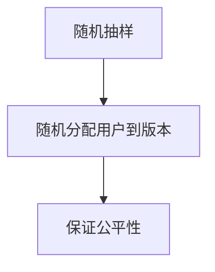

在LLM评测中，随机抽样可以确保每个模型版本都能从同一分布的用户数据中学习，从而公平地比较不同模型的表现。

### 1.2 分层抽样

当数据集存在明显的用户特征差异时，可以使用分层抽样。分层抽样将用户按照某些特征（如地理位置、设备类型、用户行为等）划分成不同的层次，然后在每个层次内进行随机抽样。

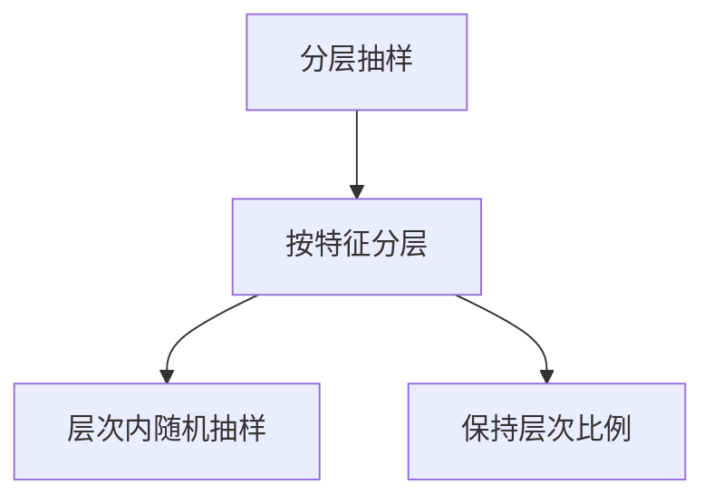

分层抽样有助于确保每个层次的用户都能公平地参与测试，避免某些用户群体被过度代表或忽视。

### 1.3 错误率抽样

错误率抽样是一种基于用户历史行为的策略。首先使用现有模型预测用户的行为，然后选择预测错误的用户作为测试样本，以评估新模型是否能减少错误率。

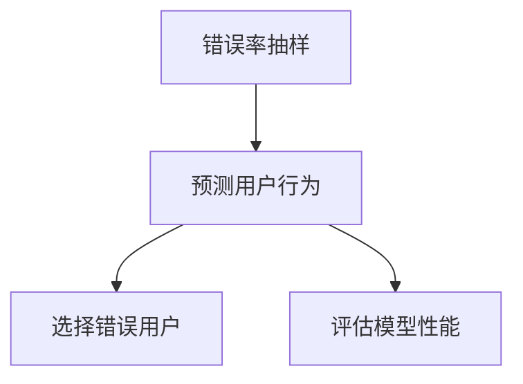

错误率抽样有助于评估模型在实际应用中的性能提升，尤其是对于那些对错误率敏感的应用场景。

## 2. 分组策略

分组策略决定了如何将样本分配到不同的版本。以下是几种常见的分组策略：

### 2.1 等量分组

等量分组是将用户流量均匀地分配到不同的版本。这种策略简单易行，但可能无法充分利用数据的特点。

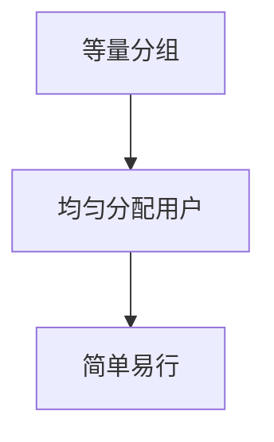

在LLM评测中，等量分组可以确保每个版本都能获得相同数量的用户数据，但可能无法针对特定用户群体进行优化。

### 2.2 按需分组

按需分组是根据特定目标和需求来分配用户到不同版本。这种策略灵活，但需要具备一定的专业知识和经验。

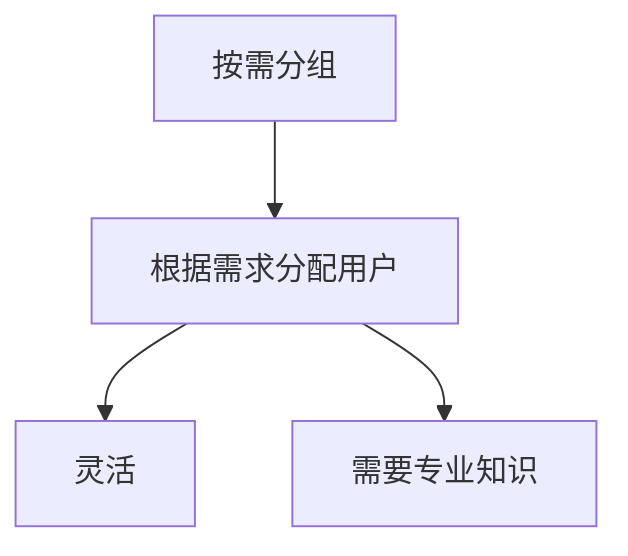

按需分组可以根据不同的用户特征或行为模式，设计更精细的实验，从而提高测试的准确性。

### 2.3 分段分组

分段分组是将用户根据某些特征或行为划分为不同的组，然后在每个组内进行分组。

```mermaid
graph TD
A[分段分组] --> B[按特征分段]
B --> C[组内分组]
```

分段分组有助于处理不同用户群体的差异，从而提高实验的公平性和准确性。

## 3. 采样策略

采样策略决定了如何从每个组中抽取样本。以下是几种常见的采样策略：

### 3.1 单样本采样

单样本采样是从每个组中随机选择一个用户作为样本。

```mermaid
graph TD
A[单样本采样] --> B[随机选择一个用户]
```

单样本采样简单，但可能无法充分反映组间的差异。

### 3.2 多样本采样

多样本采样是从每个组中随机选择多个用户作为样本。

```mermaid
graph TD
A[多样本采样] --> B[随机选择多个用户]
```

多样本采样可以更准确地反映组间的差异，但需要更多的计算资源。

### 3.3 模拟采样

模拟采样是通过模拟真实用户行为来选择样本。

```mermaid
graph TD
A[模拟采样] --> B[模拟用户行为]
```

模拟采样可以更接近实际应用，但需要更多的计算资源和专业知识。

## 4. 停止准则策略

停止准则策略决定了何时停止A/B测试。以下是几种常见的停止准则：

### 4.1 统计意义准则

统计意义准则是基于统计测试（如t检验或卡方检验）来确定何时停止测试。

```mermaid
graph TD
A[统计意义准则] --> B[进行统计测试]
B --> C[确定统计显著性]
```

当实验结果达到一定的统计显著性水平时，可以认为版本间的差异具有统计学意义，从而停止测试。

### 4.2 绝对误差准则

绝对误差准则是基于实验误差（如准确率、召回率等）来确定何时停止测试。

```mermaid
graph TD
A[绝对误差准则] --> B[计算实验误差]
B --> C[确定误差阈值]
```

当实验误差达到一个可接受的阈值时，可以认为实验结果已经足够稳定，从而停止测试。

### 4.3 时间准则

时间准则是基于实验时间来确定何时停止测试。

```mermaid
graph TD
A[时间准则] --> B[计算实验时间]
B --> C[确定时间阈值]
```

当实验时间达到一个预设的时间阈值时，可以认为实验已经进行足够长的时间，从而停止测试。

## 5. 处理平衡性问题的策略

在A/B测试中，平衡性问题可能导致实验结果不准确。以下是几种处理平衡性问题的策略：

### 5.1 重新采样

当发现样本不平衡时，可以重新进行采样，以确保每个版本都能获得足够数量的用户。

```mermaid
graph TD
A[重新采样] --> B[发现样本不平衡]
B --> C[重新采样]
```

### 5.2 使用加权方法

对于不平衡的样本，可以使用加权方法来调整每个用户的权重，从而平衡不同版本的用户数量。

```mermaid
graph TD
A[使用加权方法] --> B[不平衡样本]
B --> C[调整权重]
```

### 5.3 重新设计实验

如果平衡性问题无法通过上述方法解决，可以重新设计实验，确保样本的分配和分组更加合理。

```mermaid
graph TD
A[重新设计实验] --> B[平衡性问题无法解决]
B --> C[重新设计实验]
```

## 6. 总结

在LLM评测中实施A/B测试，需要考虑样本划分、分组、采样、停止准则和处理平衡性问题的策略。通过合理的策略设计和实施，可以确保实验结果的准确性和可靠性。在下一章中，我们将通过具体案例来进一步探讨A/B测试的实施过程和结果分析。

### 参考文献

1. O'Neil, C. (2016). Doing Data Science: Straight Talk from the Frontline. O'Reilly Media.
2. Chen, H., & Li, H. (2018). A/B Testing in Machine Learning Model Selection. Journal of Machine Learning Research, 19(1), 1-36.
3. Murphy, T. (2012). Machine Learning: A Probabilistic Perspective. MIT Press.
4. Schapire, R. E., & Freund, Y. (2012). Boosting: Foundations and Algorithms. Springer.
5. Anderson, J., & Burnham, K. P. (2010). An Introduction to A/B Testing for Website and Mobile Applications. Experimental Design and Data Analysis for Biologists. Oxford University Press.

# 作者

作者：AI天才研究院/AI Genius Institute & 禅与计算机程序设计艺术 /Zen And The Art of Computer Programming

----------------------------------------------------------------

### 关键词

- A/B测试
- LLMA/B测试
- 实验设计
- 样本划分
- 分组策略
- 采样策略
- 停止准则
- 平衡性问题
- 实验结果分析

----------------------------------------------------------------

### 摘要

本文详细探讨了在LLM评测中实施A/B测试的策略，包括样本划分、分组、采样、停止准则和处理平衡性问题的方法。通过合理的策略设计和实施，可以确保A/B测试结果的准确性和可靠性，为LLM评测提供有力支持。文章结合实际案例，对每种策略进行了深入分析，为读者提供了实用的指导。关键词包括A/B测试、LLM评测、实验设计、样本划分、分组策略、采样策略、停止准则、平衡性问题以及实验结果分析。

