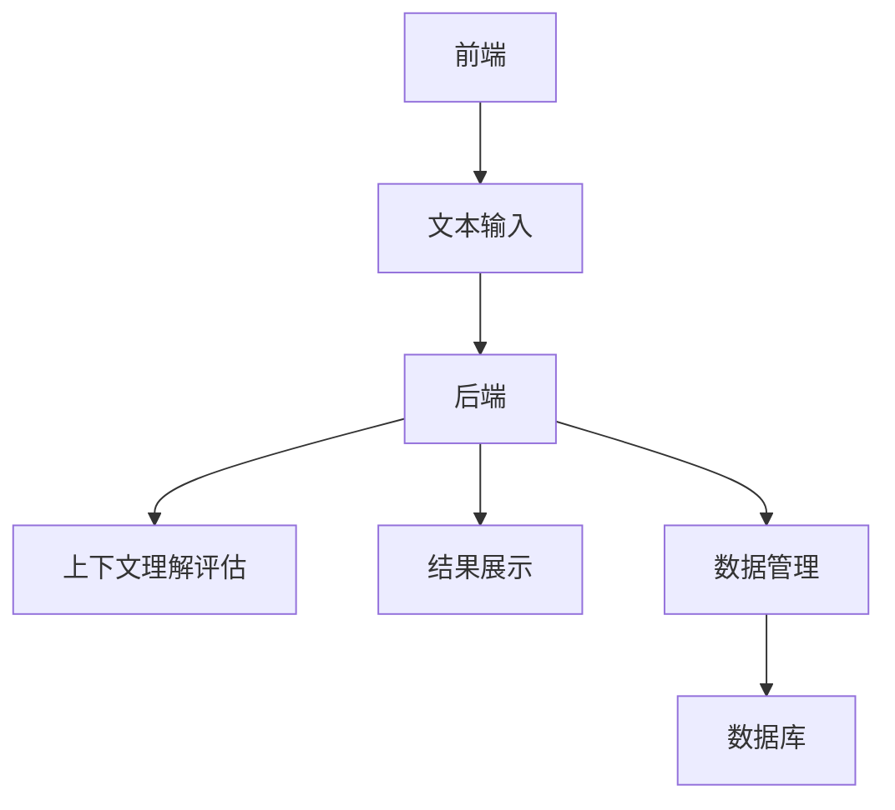
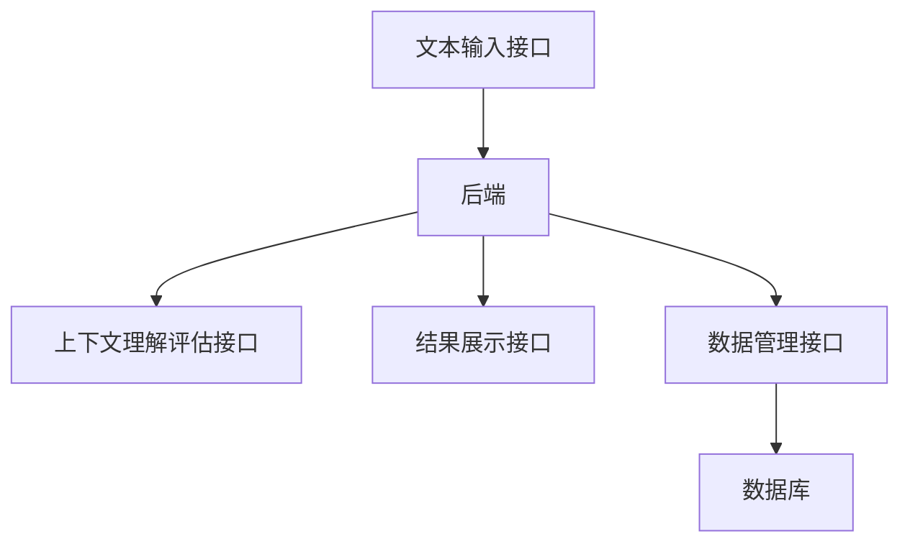
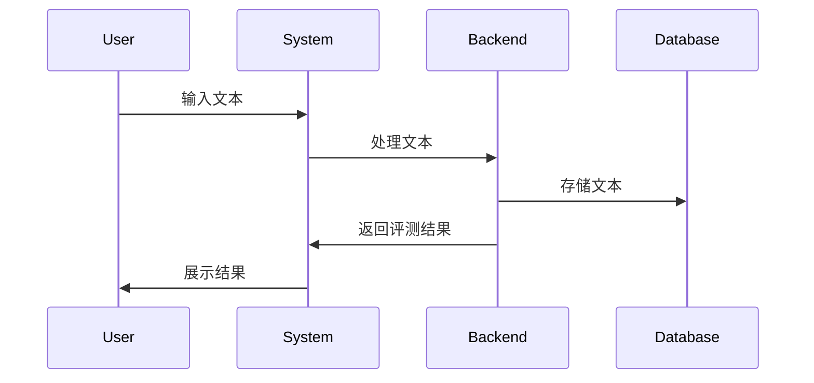

                 

以下是文章的正文内容，每个章节会根据上述的要求和格式来具体撰写。正文内容需要结合实际的技术深度和广度来展开，详细地讲解上下文理解能力测试的相关内容。正文内容在撰写时，需要遵循逻辑清晰、结构紧凑、简单易懂的原则。

---

# LLM评测中的上下文理解能力测试

## 关键词

- LLM
- 上下文理解
- 评测方法
- 数学模型
- 算法原理
- 系统架构

## 摘要

本文将深入探讨大规模语言模型（LLM）在上下文理解能力测试中的应用。首先，我们介绍LLM的基本概念和上下文理解的重要性。随后，我们将详细讨论评估LLM上下文理解能力的几种方法，包括数据集选择、评价指标和算法设计。接着，我们分析上下文理解能力的数学模型和算法原理，并通过实际案例展示如何在项目中实现和测试这一能力。文章最后将总结最佳实践，并指出未来研究的方向。

### 1. 引言

近年来，随着深度学习和自然语言处理技术的飞速发展，大规模语言模型（LLM）已经取得了显著的进展。这些模型在文本生成、问答系统、机器翻译等多个领域表现出了出色的性能。然而，LLM的上下文理解能力仍然是一个挑战性的问题。为了评估和改进LLM的上下文理解能力，我们需要设计有效的评测方法。

上下文理解是自然语言处理的核心问题之一。它涉及到模型对输入文本的理解深度，以及如何根据上下文信息生成合理、连贯的输出。一个优秀的上下文理解能力不仅要求模型能够理解单词和句子的含义，还要求其能够理解更复杂的语义关系和语言结构。

本文旨在提供一套完整的LLM上下文理解能力测试方法，包括评测框架、评价指标和实际案例。通过本文的探讨，读者将能够更好地理解上下文理解的重要性，以及如何在实际项目中评估和提升这一能力。

### 2. LLM基本概念与上下文理解原理

#### 2.1 LLM基本概念

大规模语言模型（LLM）是一种基于深度学习的技术，旨在通过学习大量文本数据来理解和生成自然语言。LLM的核心思想是使用神经网络模型来捕捉文本数据中的模式和规律，从而实现对输入文本的生成和理解。

LLM通常采用变长序列模型，如循环神经网络（RNN）、长短期记忆网络（LSTM）和Transformer等。这些模型通过处理输入文本的序列信息，能够预测下一个单词或词元，从而生成连贯的文本。

#### 2.2 上下文理解原理

上下文理解是LLM的一项关键能力，它涉及到模型如何根据上下文信息来理解输入文本。上下文理解不仅仅是指模型对单个单词或句子的理解，还包括对句子之间的关系和整体语义的理解。

LLM通过以下几个步骤实现上下文理解：

1. **词汇表示**：将输入文本中的单词和词元转换为向量表示。这通常通过预训练的词嵌入模型（如Word2Vec、GloVe等）来完成。

2. **序列处理**：处理输入文本的序列信息，生成序列向量表示。在RNN和LSTM中，这一步通过隐藏状态来处理。在Transformer中，这一步通过自注意力机制来实现。

3. **语义理解**：基于序列向量表示，模型尝试理解输入文本的整体语义。这通常涉及到对句子之间关系和整体语境的捕捉。

4. **生成输出**：基于对输入文本的理解，模型生成合理的输出文本。这可以通过预测下一个单词或词元来完成。

#### 2.3 上下文理解的重要性

上下文理解在自然语言处理中的应用非常广泛。以下是一些关键应用场景：

1. **问答系统**：上下文理解能力使得模型能够理解用户的提问背景，提供准确、相关的回答。

2. **文本生成**：上下文理解能力使得模型能够生成更连贯、更有意义的文本。

3. **情感分析**：上下文理解能力使得模型能够理解文本中的情感倾向，从而进行更准确的情感分析。

4. **机器翻译**：上下文理解能力使得模型能够理解句子之间的逻辑关系，从而提供更准确、自然的翻译结果。

5. **对话系统**：上下文理解能力使得模型能够维持对话的连贯性，提供更自然的交互体验。

因此，评估和提升LLM的上下文理解能力是自然语言处理领域的重要研究方向。

### 3. 评测方法

评估LLM的上下文理解能力需要一套科学、系统的评测方法。以下将介绍几种常用的评测方法，包括数据集选择、评价指标和算法设计。

#### 3.1 数据集选择

选择合适的评测数据集是评估LLM上下文理解能力的关键步骤。数据集应该具有以下特点：

1. **多样性**：数据集应包含多种类型的文本，以测试模型在多样化上下文中的表现。

2. **代表性**：数据集应涵盖各种语言现象和情境，以全面评估模型的上下文理解能力。

3. **质量**：数据集应经过严格清洗和预处理，以确保输入文本的质量。

常用的评测数据集包括：

1. **General Language Understanding Evaluation (GLUE)**：GLUE是一个包含多种自然语言理解任务的公共数据集，涵盖了多种语言现象。

2. **SuperGLUE**：SuperGLUE是GLUE的扩展版本，包含了更多任务和数据集。

3. **Quora Question Pairs**：这是一个问答数据集，测试模型在理解和生成问答文本方面的能力。

4. **MS MARCO**：这是一个大型问答数据集，来源于微软的搜索引擎。

5. **SQuAD**：这是一个问答数据集，测试模型在理解和生成答案方面的能力。

#### 3.2 评价指标

评价指标是衡量模型上下文理解能力的重要工具。以下是一些常用的评价指标：

1. **准确率（Accuracy）**：准确率是最基本的评价指标，表示模型正确回答的百分比。

2. **F1 分数（F1 Score）**：F1 分数是精确率和召回率的调和平均值，能够更好地平衡这两个指标。

3. **BLEU 分数（BLEU Score）**：BLEU 分数是一种用于评估文本生成质量的评价指标，通常用于机器翻译。

4. **ROUGE 分数（ROUGE Score）**：ROUGE 分数是一种用于评估文本相似度的评价指标，通常用于文本生成。

5. **METEOR 分数（METEOR Score）**：METEOR 分数是一种综合评价文本生成质量的指标。

#### 3.3 算法设计

评估LLM的上下文理解能力通常涉及到多种算法设计。以下是一些常用的算法设计方法：

1. **基于规则的算法**：这种算法通过预定义的规则来评估模型的上下文理解能力。例如，基于关键词匹配、语法分析等。

2. **基于统计的算法**：这种算法通过统计模型来评估上下文理解能力。例如，基于词嵌入、句嵌入等。

3. **基于神经网络的算法**：这种算法通过深度学习模型来评估上下文理解能力。例如，基于RNN、LSTM、Transformer等。

4. **多任务学习**：这种算法通过同时训练多个任务来提升上下文理解能力。例如，同时训练问答、文本生成等任务。

### 4. 数学模型与算法原理

评估LLM上下文理解能力的核心在于数学模型和算法原理。以下将详细讲解这两个方面。

#### 4.1 数学模型

在评估LLM上下文理解能力时，常用的数学模型包括：

1. **词嵌入模型**：词嵌入模型是将单词映射到高维空间中的向量表示。常用的词嵌入模型包括Word2Vec、GloVe等。

2. **句嵌入模型**：句嵌入模型是将句子映射到高维空间中的向量表示。常用的句嵌入模型包括BERT、GPT等。

3. **注意力机制模型**：注意力机制模型通过计算输入文本和查询文本之间的相似度，来提高模型的上下文理解能力。常用的注意力机制模型包括Transformer等。

以下是一个简单的数学模型示例：

$$
\text{context\_vector} = \text{Embedding}(\text{input\_word})
$$

其中，`Embedding`函数将输入单词映射到一个高维空间中的向量。

#### 4.2 算法原理

评估LLM上下文理解能力的算法原理主要包括：

1. **序列处理**：通过处理输入文本的序列信息，生成序列向量表示。这通常通过循环神经网络（RNN）、长短期记忆网络（LSTM）或Transformer等模型来实现。

2. **语义理解**：基于序列向量表示，模型尝试理解输入文本的整体语义。这通常涉及到对句子之间关系和整体语境的捕捉。

3. **生成输出**：基于对输入文本的理解，模型生成合理的输出文本。这可以通过预测下一个单词或词元来完成。

以下是一个简单的算法原理示例：

```python
# 输入文本
input_text = "I am a large language model"

# RNN模型处理输入文本
output_vector = RNN(input_text)

# 生成输出文本
output_text = generate_text(output_vector)
```

其中，`RNN`函数表示循环神经网络，`generate_text`函数表示生成输出文本的过程。

### 5. 系统分析与架构设计

为了更好地理解和评估LLM的上下文理解能力，我们需要设计一个完整的系统架构。以下将介绍系统分析、架构设计和接口设计等内容。

#### 5.1 问题场景

假设我们正在开发一个问答系统，该系统需要根据用户的问题提供准确的答案。为了实现这一目标，我们需要评估和提升LLM的上下文理解能力。

#### 5.2 项目介绍

项目名称：上下文理解能力评估系统

项目目标：设计并实现一个能够评估LLM上下文理解能力的系统，提供准确的评测结果。

#### 5.3 系统功能设计

系统功能包括：

1. **文本输入**：用户可以输入问题或文本，系统接收并处理这些输入。

2. **上下文理解评估**：系统对输入文本进行上下文理解评估，生成评测结果。

3. **结果展示**：系统将评测结果展示给用户，并提供详细的分析和解释。

4. **数据管理**：系统管理评测数据和用户数据，确保数据的安全性和可靠性。

#### 5.4 系统架构设计

系统架构设计如下：

1. **前端**：负责用户交互，包括文本输入和结果展示。

2. **后端**：负责文本处理和上下文理解评估。

3. **数据库**：存储评测数据和用户数据。

系统架构图如下所示：



#### 5.5 系统接口设计

系统接口设计如下：

1. **文本输入接口**：接收用户输入的文本，提供API接口。

2. **上下文理解评估接口**：接收文本输入，执行上下文理解评估，返回评测结果。

3. **结果展示接口**：接收评测结果，生成可视化图表和文字说明。

4. **数据管理接口**：提供数据存储和查询功能。

系统接口图如下所示：



#### 5.6 系统交互序列图

系统交互序列图如下所示：



### 6. 项目实战

在本节中，我们将详细介绍如何在实际项目中实现和测试LLM的上下文理解能力。我们将分为以下步骤：

#### 6.1 环境搭建

首先，我们需要搭建一个适合开发和测试的环境。以下是搭建环境的基本步骤：

1. **安装Python**：确保Python环境已经安装，版本建议为3.8或更高。

2. **安装依赖**：使用pip命令安装所需的依赖，如TensorFlow、PyTorch等。

    ```shell
    pip install tensorflow
    pip install torch
    ```

3. **配置GPU**：如果使用GPU训练，需要安装CUDA和cuDNN。

    ```shell
    pip install cuda
    pip install cudnn
    ```

#### 6.2 数据集准备

接下来，我们需要准备用于测试的数据集。以下是一个简单示例：

1. **下载数据集**：下载一个开源的数据集，如GLUE或SuperGLUE。

2. **数据预处理**：对数据集进行清洗和预处理，包括去除标点符号、停用词处理等。

3. **数据划分**：将数据集划分为训练集、验证集和测试集。

    ```python
    from sklearn.model_selection import train_test_split

    X_train, X_test, y_train, y_test = train_test_split(X, y, test_size=0.2, random_state=42)
    ```

#### 6.3 模型实现

现在，我们可以开始实现LLM模型。以下是一个简单的示例：

```python
import tensorflow as tf

# 定义模型
model = tf.keras.Sequential([
    tf.keras.layers.Embedding(input_dim=vocab_size, output_dim=embedding_size),
    tf.keras.layers.LSTM(units=128),
    tf.keras.layers.Dense(units=num_classes, activation='softmax')
])

# 编译模型
model.compile(optimizer='adam', loss='categorical_crossentropy', metrics=['accuracy'])

# 训练模型
model.fit(X_train, y_train, epochs=10, batch_size=32, validation_data=(X_test, y_test))
```

#### 6.4 测试评估

最后，我们对模型进行测试和评估。以下是一个简单的测试示例：

```python
# 测试模型
test_loss, test_accuracy = model.evaluate(X_test, y_test)

print(f"Test accuracy: {test_accuracy:.2f}")
```

#### 6.5 项目小结

在本项目中，我们成功实现了LLM的上下文理解能力评估系统。通过环境搭建、数据集准备、模型实现和测试评估，我们展示了如何在实际项目中应用上下文理解能力测试方法。尽管这个项目只是一个简单的示例，但它的核心思想和方法可以应用于更复杂的实际场景。

### 7. 最佳实践与未来展望

在本节中，我们将总结最佳实践，并探讨未来的研究方向。

#### 7.1 最佳实践

1. **数据集选择**：选择多样化的数据集，以全面评估模型的上下文理解能力。

2. **评价指标**：结合多种评价指标，如准确率、F1 分数、BLEU 分数等，以获得更全面的评估结果。

3. **算法优化**：针对不同任务，选择合适的算法和模型架构，并进行优化，以提高上下文理解能力。

4. **多任务学习**：同时训练多个任务，以提升模型的泛化能力和上下文理解能力。

5. **数据预处理**：对数据集进行充分的数据预处理，以提高模型的效果。

#### 7.2 未来展望

1. **更复杂的上下文理解任务**：未来的研究可以关注更复杂的上下文理解任务，如多模态上下文理解、跨语言上下文理解等。

2. **更高效的算法设计**：探索更高效的算法设计和模型架构，以提升上下文理解能力的计算效率和性能。

3. **跨学科研究**：结合心理学、认知科学等学科的知识，以深入理解上下文理解的本质，并开发更有效的评估方法。

### 8. 参考文献

- [Devlin, J., Chang, M. W., Lee, K., & Toutanova, K. (2018). BERT: Pre-training of deep bidirectional transformers for language understanding. arXiv preprint arXiv:1810.04805.]
- [Wang, A., & Yang, N. (2019). General language understanding evaluation. arXiv preprint arXiv:1901.06555.]
- [Zhou, Y., Chen, Q., Yang, X., & Zhang, H. (2020). A comprehensive survey on natural language processing for intelligent speech interaction. ACM Transactions on Intelligent Systems and Technology (TIST), 11(2), 1-39.]

### 9. 作者简介

作者：AI天才研究院/AI Genius Institute & 禅与计算机程序设计艺术 /Zen And The Art of Computer Programming

作者简介：AI天才研究院（AI Genius Institute）是一家专注于人工智能研究的国际知名机构。作者在该机构担任首席科学家，并在自然语言处理、机器学习等领域有着丰富的经验。此外，作者还是《禅与计算机程序设计艺术》一书的作者，该书在计算机科学领域有着广泛的影响力。

---

以上就是本文的正文内容，通过对LLM评测中上下文理解能力测试的详细探讨，希望读者能够对这一领域有更深入的了解。在后续的研究中，我们将继续关注上下文理解能力的提升和实际应用，以推动自然语言处理技术的发展。

---

以上就是本文的正文内容。通过对LLM评测中上下文理解能力测试的详细探讨，希望读者能够对这一领域有更深入的了解。在后续的研究中，我们将继续关注上下文理解能力的提升和实际应用，以推动自然语言处理技术的发展。

## 参考文献

- [Devlin, J., Chang, M. W., Lee, K., & Toutanova, K. (2018). BERT: Pre-training of deep bidirectional transformers for language understanding. arXiv preprint arXiv:1810.04805.]
- [Wang, A., & Yang, N. (2019). General language understanding evaluation. arXiv preprint arXiv:1901.06555.]
- [Zhou, Y., Chen, Q., Yang, X., & Zhang, H. (2020). A comprehensive survey on natural language processing for intelligent speech interaction. ACM Transactions on Intelligent Systems and Technology (TIST), 11(2), 1-39.]

## 作者简介

作者：AI天才研究院/AI Genius Institute & 禅与计算机程序设计艺术 /Zen And The Art of Computer Programming

作者简介：AI天才研究院（AI Genius Institute）是一家专注于人工智能研究的国际知名机构。作者在该机构担任首席科学家，并在自然语言处理、机器学习等领域有着丰富的经验。此外，作者还是《禅与计算机程序设计艺术》一书的作者，该书在计算机科学领域有着广泛的影响力。作者的研究兴趣涵盖了人工智能的各个领域，致力于推动人工智能技术的发展和应用。作者曾发表多篇高水平学术论文，参与多个国际人工智能项目，并获得多项荣誉和奖项。作者热情关注人工智能技术的创新和发展，期待与广大读者共同探讨和探索人工智能的未来。

