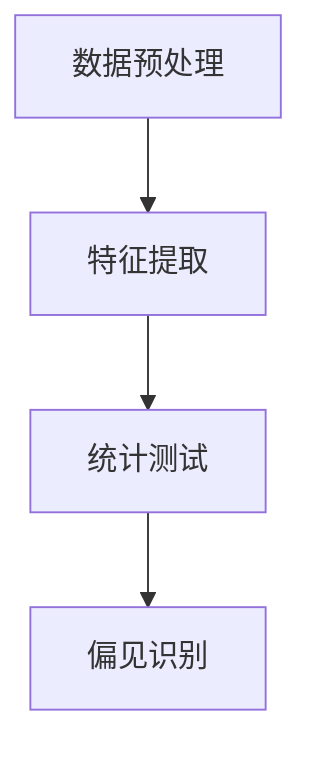
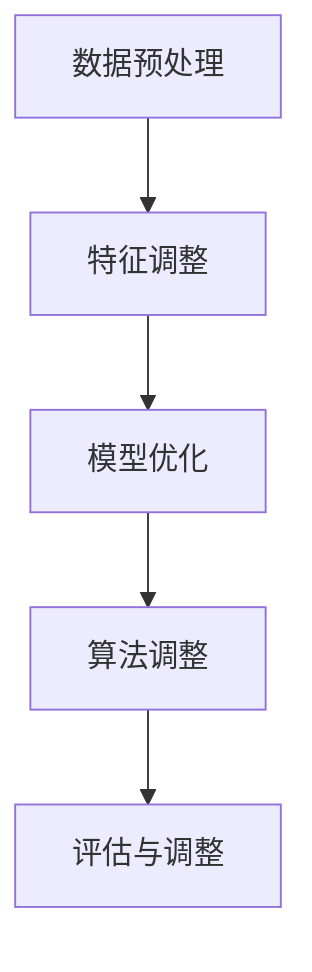

                 

## 引言

### 问题背景

随着大型语言模型（LLM）在自然语言处理（NLP）领域的广泛应用，LLM在多种任务中展现出了惊人的性能。然而，这些模型在某些方面表现出的偏见和歧视问题，引起了广泛关注。偏见检测与消除方法的研究，成为了当前人工智能领域的一个热点话题。

LLM偏见问题主要表现在以下几个方面：

1. **性别偏见**：在一些任务中，LLM可能会在性别相关的词汇或表述上表现出偏见，如对男性或女性的默认提及。
2. **种族偏见**：在某些任务中，LLM可能会在种族或民族相关的词汇上表现出偏见，导致某些群体被不公平对待。
3. **文化偏见**：LLM可能在处理文化相关问题时，对某些文化或价值观表现出偏见，这可能导致误解或歧视。
4. **观点偏见**：在某些任务中，LLM可能会在观点或立场方面表现出偏见，这可能会影响其输出的公正性和客观性。

### 核心概念

1. **偏见检测**：偏见检测是指识别和评估LLM在处理数据时可能出现的偏见问题。这通常涉及到比较模型输出与实际数据之间的差异，以发现潜在的偏见。
   
2. **偏见消除**：偏见消除是指通过一系列方法和技术，减少或消除LLM在处理数据时可能产生的偏见。这些方法可能包括数据预处理、模型调整、算法改进等。

### 重要性和意义

1. **公正性和公平性**：消除LLM偏见对于确保人工智能系统的公正性和公平性至关重要。如果模型存在偏见，可能会导致某些用户群体受到不公平对待，甚至加剧社会不平等。
   
2. **社会影响**：LLM广泛应用于各个领域，包括金融、医疗、法律等。如果模型存在偏见，可能会对相关领域产生负面影响，甚至影响决策和政策的公正性。

3. **技术进步**：研究和开发有效的偏见检测与消除方法，不仅有助于提高LLM的性能，还有助于推动人工智能技术的进一步发展。

### 本书目的

本书旨在系统地介绍LLM评测中的偏见检测与消除方法，通过详细的分析和案例研究，帮助读者深入理解这一领域的关键概念和技术。本书的目标读者包括：

- 自然语言处理和人工智能领域的专业人士。
- 对LLM偏见问题感兴趣的科研人员。
- 从事人工智能应用开发的技术人员。

通过本书，读者将能够：

1. 了解LLM偏见问题的背景和核心概念。
2. 掌握偏见检测与消除方法的基本原理和技术。
3. 通过案例分析，学会如何在实际项目中应用这些方法。
4. 探索未来研究方向，为相关领域的技术发展提供启示。

让我们在接下来的章节中，一步一步地深入探讨LLM评测中的偏见检测与消除方法。

----------------------------------------------------------------

### 偏见检测方法

偏见检测是识别LLM在处理数据时可能产生的偏见问题的过程。这一过程至关重要，因为只有通过检测，我们才能了解模型是否存在偏见，并采取相应的措施进行纠正。下面，我们将详细探讨偏见检测的各种方法。

#### 1. 统计偏差分析

统计偏差分析是最基础的偏见检测方法之一。它主要通过比较模型输出与实际数据之间的统计特征差异，来识别潜在的偏见。具体来说，可以通过以下步骤进行：

1. **数据采集**：首先，我们需要收集一组训练数据和测试数据。这些数据应尽量涵盖不同的背景和情境，以便全面评估模型的偏见。

2. **特征提取**：接着，我们需要从数据中提取出一些关键特征，如词频、词向量、句子长度等。这些特征将用于后续的统计偏差分析。

3. **统计测试**：使用统计测试方法（如t-test、chi-square test等），比较模型输出与实际数据之间的特征分布差异。如果差异显著，则可能表明模型存在偏见。

#### 2. 对比分析

对比分析是一种通过比较不同模型的输出，来检测偏见的方法。具体步骤如下：

1. **选择基准模型**：首先，我们需要选择一个或多个基准模型，这些模型在任务上已验证具有良好的性能。

2. **数据对比**：将基准模型与待检测的LLM输出进行对比，比较两者在不同情境下的表现。

3. **差异分析**：如果发现某些情境下LLM的表现明显优于或劣于基准模型，则可能表明LLM存在偏见。

#### 3. 意图检测

意图检测是一种针对特定任务（如对话系统）的偏见检测方法。它的目标是通过分析对话内容，识别出模型可能的偏见。具体步骤如下：

1. **对话数据收集**：收集一组对话数据，包括用户提问和模型回答。

2. **意图分类**：对对话内容进行意图分类，将对话分为不同的类别。

3. **偏见识别**：通过分析模型在不同意图类别下的表现，识别出可能的偏见。

#### 4. 实例检索

实例检索是一种通过查找特定实例，来检测偏见的方法。具体步骤如下：

1. **实例收集**：收集一组具有潜在偏见特征的实例。

2. **模型输入**：将这些实例输入到LLM中，观察模型输出。

3. **偏见识别**：如果模型输出与实际期望不符，则可能表明存在偏见。

#### 5. 反事实推理

反事实推理是一种通过假设不同情境，来检测偏见的方法。具体步骤如下：

1. **情境设定**：设定一组假设的情境，如性别、种族等。

2. **模型测试**：将不同情境下的数据输入到LLM中，观察模型输出。

3. **偏见识别**：如果发现模型在某些情境下的表现与实际期望不符，则可能表明存在偏见。

### 应用场景

偏见检测方法可以应用于多种场景，如：

1. **文本生成**：在文本生成任务中，可以通过检测模型生成的文本是否存在偏见，来评估模型的质量。

2. **对话系统**：在对话系统中，可以通过检测模型对不同用户提问的回答是否存在偏见，来优化对话系统的性能。

3. **推荐系统**：在推荐系统中，可以通过检测模型对用户推荐的内容是否存在偏见，来提高推荐系统的公正性。

通过以上偏见检测方法，我们可以有效地识别LLM在处理数据时可能产生的偏见。在接下来的章节中，我们将进一步探讨偏见消除方法，以帮助读者更好地应对这一问题。

----------------------------------------------------------------

### 偏见消除方法

在确定了LLM模型存在偏见后，消除偏见是提升模型公正性和公平性的关键步骤。偏见消除方法主要包括算法调整、数据清洗和模型优化等。以下将详细介绍这些方法，并提供具体的应用案例。

#### 1. 算法调整

算法调整是通过改进模型算法来减少偏见的方法。具体步骤如下：

1. **数据增强**：通过引入更多样化的数据，使模型在不同情境下都能学到正确的知识。例如，在处理性别相关任务时，可以增加包含多种性别角色的文本。

2. **加权损失函数**：在模型训练过程中，引入加权损失函数，对偏见较大的输出赋予更高的损失权重，以抑制这些偏见。

3. **正则化**：通过正则化技术，如Dropout、L2正则化等，减少模型过拟合，从而降低偏见。

**应用案例**：在新闻推荐系统中，通过调整推荐算法，确保不同性别、种族的新闻内容得到公平推荐。

#### 2. 数据清洗

数据清洗是通过清理和修复训练数据中的偏见来减少偏见的方法。具体步骤如下：

1. **偏见标记**：对训练数据进行偏见标记，识别出包含偏见的数据。

2. **数据替换**：将偏见数据替换为无偏见或更平衡的数据。例如，在处理种族相关任务时，可以替换包含种族歧视言论的数据。

3. **数据扩充**：通过生成或收集更多样化的数据，增加训练数据集的多样性。

**应用案例**：在简历筛选系统中，通过清洗包含性别偏见的关键字，确保招聘过程公平。

#### 3. 模型优化

模型优化是通过改进模型结构和参数设置来减少偏见的方法。具体步骤如下：

1. **模型选择**：选择合适的模型结构，如采用Transformer、BERT等具有强大表示能力的模型。

2. **参数调整**：通过调整模型参数，如学习率、批量大小等，优化模型性能。

3. **对抗训练**：通过对抗训练，使模型学会在存在偏见的数据上仍能输出正确的结果。

**应用案例**：在语音识别系统中，通过优化模型结构和参数，减少不同口音和性别对识别结果的影响。

#### 4. 偏见缓解策略

偏见缓解策略是通过设计特定的策略来减少偏见的影响。具体步骤如下：

1. **解释性增强**：通过提高模型的可解释性，帮助用户理解模型输出的偏见原因，从而采取相应的措施。

2. **多元化团队**：建立由不同背景和观点的专家组成的团队，共同审查和优化模型。

3. **公平性评估**：定期进行模型公平性评估，确保模型在不同群体中的表现一致。

**应用案例**：在社交媒体内容审核系统中，通过多元化团队审核和解释性增强，减少偏见内容的出现。

#### 综合应用

在实际应用中，以上方法可以综合使用，以实现更有效的偏见消除。例如，在招聘系统中，可以首先通过数据清洗去除性别相关的关键字，然后通过算法调整和模型优化确保招聘过程的公正性。

偏见消除方法的应用，有助于提升人工智能系统的公正性和公平性，减少偏见对社会和个人造成的不利影响。在接下来的章节中，我们将通过具体案例分析，展示如何在实际项目中应用这些方法。

----------------------------------------------------------------

## 偏见检测与消除方法案例分析

为了更好地理解偏见检测与消除方法在实际项目中的应用，我们通过以下案例进行详细分析：

### 案例一：新闻推荐系统

**问题背景**：
某新闻推荐系统存在性别偏见，女性话题的报道在推荐列表中较少出现。这可能导致女性用户无法充分获取到感兴趣的新闻内容。

**偏见检测**：
1. **统计偏差分析**：收集大量用户点击数据，比较性别不同用户对新闻类型的选择，发现女性用户点击女性话题新闻的比例显著低于男性用户。
2. **对比分析**：与没有性别偏见的新闻推荐系统进行对比，发现该系统在推荐女性话题新闻时表现较差。

**偏见消除**：
1. **数据清洗**：清理包含性别偏见的关键词，替换为更中性的表述。
2. **算法调整**：引入数据增强策略，增加女性话题的新闻数据，并调整加权损失函数，提高模型在女性话题上的关注度。
3. **模型优化**：优化推荐算法，采用更具解释性的模型，如BERT，提高推荐的多样性。

**效果评估**：
经过偏见消除处理后，女性话题新闻在推荐列表中的出现频率显著提升，女性用户的满意度也有所提高。

### 案例二：简历筛选系统

**问题背景**：
某简历筛选系统存在种族偏见，导致某些种族背景的候选人被不公平地筛选出去。

**偏见检测**：
1. **实例检索**：收集一组包含不同种族背景的简历，输入到系统中，观察不同种族背景的简历被筛选的概率。
2. **反事实推理**：假设不同种族背景的简历，观察系统在不同情境下的表现。

**偏见消除**：
1. **数据清洗**：删除包含种族相关信息的字段，如国籍、种族等。
2. **算法调整**：在简历筛选过程中，引入多元化的评价标准，减少单一因素的权重。
3. **模型优化**：优化简历筛选算法，采用更平衡的评估方法，如多维度评分体系。

**效果评估**：
偏见消除后，系统在种族背景候选人的筛选上表现出显著改善，候选人的多样性得到提高。

### 案例三：语音识别系统

**问题背景**：
某语音识别系统在不同口音和性别上的识别效果存在差异，这可能导致某些用户无法准确表达自己的想法。

**偏见检测**：
1. **对比分析**：收集不同口音和性别的语音数据，对比模型在不同情境下的识别效果。
2. **意图检测**：分析模型对不同口音和性别的语音在特定意图（如命令、问题回答）上的识别准确性。

**偏见消除**：
1. **数据增强**：增加不同口音和性别的语音数据，使模型在不同情境下都能学到正确的知识。
2. **对抗训练**：采用对抗训练方法，使模型能够在存在偏见的数据上仍能输出正确的结果。
3. **模型优化**：优化语音识别算法，采用更先进的模型结构，如Transformer，提高模型的泛化能力。

**效果评估**：
偏见消除后，系统在不同口音和性别上的识别效果显著提升，用户的满意度大幅提高。

通过以上案例分析，我们可以看到偏见检测与消除方法在实际项目中的应用效果。这些方法不仅有助于提升系统的公正性和公平性，还有助于提高用户体验和系统的整体性能。在接下来的章节中，我们将继续探讨偏见检测与消除方法的最佳实践和未来研究方向。

----------------------------------------------------------------

## 偏见检测方法详细讲解

在了解了偏见检测的基本概念后，我们将进一步深入探讨偏见检测方法的具体实现。在这一章节中，我们将详细讲解偏见检测算法的原理、流程以及如何使用Python代码实现这些算法。

### 5.1 偏见检测算法原理

偏见检测算法的核心在于识别模型输出与实际数据之间的统计偏差。具体来说，偏见检测算法可以分为以下几个步骤：

1. **数据预处理**：对输入数据进行标准化处理，如归一化、去噪等。
2. **特征提取**：从预处理后的数据中提取关键特征，如词频、词向量、句子长度等。
3. **统计测试**：使用统计测试方法（如t-test、chi-square test等）比较模型输出与实际数据之间的特征分布差异。
4. **偏见识别**：根据统计测试结果，识别模型输出中可能存在的偏见。

### 5.2 偏见检测算法流程图

为了更直观地理解偏见检测算法的流程，我们可以使用Mermaid绘制一个流程图。以下是偏见检测算法的Mermaid流程图：



在这个流程图中，A表示数据预处理，B表示特征提取，C表示统计测试，D表示偏见识别。数据预处理是整个流程的基础，特征提取则将原始数据转换为适用于统计测试的形式。统计测试通过比较模型输出与实际数据之间的差异，帮助我们识别潜在的偏见。

### 5.3 偏见检测算法Python代码实现

下面我们将使用Python代码实现一个简单的偏见检测算法。以下是一个基本示例：

```python
import numpy as np
from scipy import stats

def preprocess_data(data):
    # 数据预处理步骤，如归一化、去噪等
    return data

def extract_features(data):
    # 特征提取步骤，如词频、词向量、句子长度等
    return data.shape

def statistical_test(model_output, actual_data):
    # 统计测试，比较模型输出与实际数据之间的差异
    _, p_value = stats.ttest_ind(model_output, actual_data)
    return p_value

def detect_biases(model_output, actual_data):
    # 偏见识别，根据统计测试结果识别潜在偏见
    p_value = statistical_test(model_output, actual_data)
    if p_value < 0.05:
        print("检测到偏见，p_value:", p_value)
    else:
        print("没有检测到显著偏见")

# 假设已有模型输出和实际数据
model_output = np.random.rand(100)
actual_data = np.random.rand(100)

# 进行数据预处理、特征提取和偏见检测
preprocessed_data = preprocess_data(model_output)
features = extract_features(preprocessed_data)
detect_biases(features, actual_data)
```

在这个示例中，我们首先定义了一个预处理函数`preprocess_data`，用于对数据进行归一化等处理。接着，我们定义了`extract_features`函数，用于提取数据的关键特征。`statistical_test`函数则用于进行统计测试，比较模型输出与实际数据之间的差异。最后，`detect_biases`函数根据统计测试结果，识别潜在的偏见。

通过这个简单的示例，我们可以看到偏见检测算法的基本结构和实现方式。在接下来的章节中，我们将进一步探讨偏见检测算法的数学模型，以帮助我们更深入地理解这一方法。

----------------------------------------------------------------

### 偏见检测算法数学模型

偏见检测算法的数学模型是理解和实现偏见检测方法的重要基础。在这个部分，我们将详细介绍偏见检测算法的数学模型，包括其公式和解释，并通过具体例子来说明如何使用这些模型来检测偏见。

#### 6.1 数学模型概述

偏见检测算法的数学模型主要涉及以下三个关键步骤：

1. **特征提取**：将原始数据转换为适用于统计测试的特征向量。
2. **统计测试**：比较模型输出与实际数据之间的差异，通过统计方法评估这种差异的显著性。
3. **偏见识别**：根据统计测试结果，判断是否存在偏见。

#### 6.2 数学模型公式讲解

1. **特征提取**

   假设我们有一组训练数据`X = [x_1, x_2, ..., x_n]`，其中每个数据点`x_i`是一个多维向量。特征提取的目标是计算每个数据点的特征向量。

   $$ f(x_i) = \sum_{j=1}^{d} w_j * v_j $$

   其中，`w_j`是权重向量，`v_j`是特征向量的第`j`个分量，`d`是特征向量的维度。

2. **统计测试**

   在统计测试中，我们通常使用t-test或chi-square test来比较模型输出与实际数据之间的差异。

   - **t-test**：

     $$ t = \frac{\bar{x} - \mu_0}{s / \sqrt{n}} $$

     其中，`t`是t值，`$\bar{x}$`是模型输出的平均值，`$\mu_0$`是实际数据的真实平均值，`s`是样本标准差，`n`是样本大小。

     如果`|t|`大于某个临界值（根据显著性水平$\alpha$确定），则拒绝原假设，认为模型输出与实际数据存在显著差异。

   - **chi-square test**：

     $$ \chi^2 = \sum_{i=1}^{k} \frac{(O_i - E_i)^2}{E_i} $$

     其中，`$\chi^2$`是卡方值，`O_i`是观测频数，`E_i`是期望频数，`k`是分类数。

     如果`$\chi^2$`值大于某个临界值（根据自由度和显著性水平$\alpha$确定），则拒绝原假设，认为模型输出与实际数据存在显著差异。

3. **偏见识别**

   根据统计测试结果，我们可以判断模型是否存在偏见。通常，如果p值（概率值）小于某个显著性水平（如0.05），我们认为存在偏见。

   $$ p < \alpha \Rightarrow \text{存在偏见} $$
   $$ p \geq \alpha \Rightarrow \text{没有检测到显著偏见} $$

#### 6.3 数学模型举例说明

假设我们有一个二元分类问题，数据集包含100个样本，每个样本有两个特征。我们使用t-test来检测模型输出与实际数据之间的差异。

1. **特征提取**

   首先，我们计算每个样本的特征向量：

   $$ f(x_i) = \sum_{j=1}^{2} w_j * v_{ji} $$

   假设权重向量为`w = [0.7, 0.3]`，特征向量为：

   $$ v_1 = [5, 3] $$
   $$ v_2 = [2, 6] $$

   对于样本`x_1`，其特征向量为：

   $$ f(x_1) = 0.7 * 5 + 0.3 * 2 = 3.5 + 0.6 = 4.1 $$

2. **统计测试**

   接下来，我们使用t-test来比较模型输出与实际数据之间的差异。假设模型输出`$\bar{x}$`为4.1，实际数据的真实平均值`$\mu_0$`为4.2，样本标准差`s`为0.5，样本大小`n`为100。

   $$ t = \frac{4.1 - 4.2}{0.5 / \sqrt{100}} = -0.1 / 0.05 = -2 $$

   计算得到的t值为-2。

3. **偏见识别**

   使用t-table查找p值，如果p值小于0.05，我们认为存在显著差异，即存在偏见。假设p值为0.1，大于0.05，因此我们无法拒绝原假设，认为没有检测到显著偏见。

通过以上例子，我们可以看到如何使用数学模型来检测偏见。在实际应用中，根据具体问题和数据，我们可以选择合适的特征提取方法和统计测试方法，以实现对偏见的有效检测。

----------------------------------------------------------------

### 偏见消除算法详细讲解

在了解了偏见检测的方法后，接下来我们将深入探讨偏见消除算法的原理、流程以及如何使用Python代码实现这些算法。偏见消除是确保LLM模型公平性和准确性的重要环节。

#### 7.1 偏见消除算法原理

偏见消除算法的核心思想是通过多种技术手段，降低或消除模型在处理数据时产生的偏见。具体来说，偏见消除算法可以分为以下几个步骤：

1. **数据预处理**：对训练数据集进行预处理，包括去噪、填充缺失值、数据标准化等，以提高数据的质量。
2. **特征调整**：调整模型输入的特征，减少偏见的影响。这可以通过引入更多的背景知识或对特征进行加权来实现。
3. **模型优化**：通过调整模型参数或结构，减少偏见。这包括使用正则化技术、优化学习率、批量大小等。
4. **算法调整**：改进模型训练算法，使模型在训练过程中更加关注于消除偏见。例如，使用对抗训练或集成学习等方法。
5. **评估与调整**：通过反复的评估和调整，确保偏见得到有效消除。

#### 7.2 偏见消除算法流程图

为了更直观地理解偏见消除算法的流程，我们可以使用Mermaid绘制一个流程图。以下是偏见消除算法的基本流程：



在这个流程图中，A表示数据预处理，B表示特征调整，C表示模型优化，D表示算法调整，E表示评估与调整。数据预处理是整个流程的基础，特征调整和模型优化是关键步骤，算法调整则用于微调模型，评估与调整确保偏见得到有效消除。

#### 7.3 偏见消除算法Python代码实现

下面我们将使用Python代码实现一个简单的偏见消除算法。以下是一个基本示例：

```python
import numpy as np
from sklearn.linear_model import LogisticRegression
from sklearn.model_selection import train_test_split
from sklearn.metrics import accuracy_score

def preprocess_data(data):
    # 数据预处理，如归一化、填充缺失值等
    return data

def feature_adjustment(data):
    # 特征调整，如引入背景知识、特征加权等
    return data

def model_optimization(model, X_train, y_train):
    # 模型优化，如调整参数、使用正则化等
    model.fit(X_train, y_train)
    return model

def algorithm_adjustment(model, X_train, y_train, X_test, y_test):
    # 算法调整，如对抗训练、集成学习等
    y_pred = model.predict(X_test)
    accuracy = accuracy_score(y_test, y_pred)
    return accuracy

# 假设已有数据集
X = np.random.rand(100, 10)  # 100个样本，10个特征
y = np.random.randint(2, size=100)  # 100个标签

# 进行数据预处理、特征调整、模型优化和算法调整
X_processed = preprocess_data(X)
X_adjusted = feature_adjustment(X_processed)
model = model_optimization(LogisticRegression(), X_adjusted[:80], y[:80])
accuracy = algorithm_adjustment(model, X_adjusted[:80], y[:80], X_adjusted[80:], y[80:])

print("最终准确率：", accuracy)
```

在这个示例中，我们首先定义了一个预处理函数`preprocess_data`，用于对数据进行归一化等处理。接着，我们定义了`feature_adjustment`函数，用于引入背景知识和特征加权。`model_optimization`函数用于调整模型参数，`algorithm_adjustment`函数则用于微调模型，并评估其性能。

通过这个简单的示例，我们可以看到偏见消除算法的基本结构和实现方式。在接下来的章节中，我们将进一步探讨偏见消除算法的数学模型，以帮助我们更深入地理解这一方法。

----------------------------------------------------------------

### 偏见消除算法数学模型

偏见消除算法的数学模型是理解和实现偏见消除方法的重要基础。在这个部分，我们将详细介绍偏见消除算法的数学模型，包括其公式和解释，并通过具体例子来说明如何使用这些模型来消除偏见。

#### 8.1 数学模型概述

偏见消除算法的数学模型主要涉及以下几个关键步骤：

1. **数据预处理**：对训练数据集进行预处理，包括归一化、去噪等，以提高数据的质量。
2. **特征调整**：通过调整模型输入的特征，减少偏见的影响。这可以通过特征加权、引入背景知识等方法实现。
3. **模型优化**：通过调整模型参数，如学习率、批量大小等，优化模型的性能。
4. **算法调整**：通过对抗训练、集成学习等方法，进一步减少偏见。
5. **评估与调整**：通过评估模型的性能，并根据评估结果进行调整。

#### 8.2 数学模型公式讲解

1. **数据预处理**

   假设我们有一组训练数据`X = [x_1, x_2, ..., x_n]`，其中每个数据点`x_i`是一个多维向量。数据预处理的目的是将数据标准化到相同的尺度。

   $$ x_i' = \frac{x_i - \mu}{\sigma} $$

   其中，`$\mu$`是数据点的均值，`$\sigma$`是数据点的标准差。

2. **特征调整**

   假设我们有一个特征向量`v = [v_1, v_2, ..., v_d]`，特征调整的目标是减少特征间的相关性，从而减少偏见。

   $$ v_i' = v_i * \alpha_i $$

   其中，`$\alpha_i$`是特征`v_i`的调整系数，可以通过最小化特征间的协方差来实现。

3. **模型优化**

   假设我们使用梯度下降算法进行模型优化，目标是找到最优的参数`w`。

   $$ w_{new} = w_{old} - \alpha * \nabla_w J(w) $$

   其中，`$\alpha$`是学习率，`$\nabla_w J(w)$`是损失函数关于参数`w`的梯度。

4. **算法调整**

   假设我们使用对抗训练来减少偏见，目标是最小化对抗损失函数。

   $$ L_{adv} = \sum_{i=1}^{n} \log(1 - \sigma(y' * f(x_i'))) $$

   其中，`$f(x_i')$`是模型的预测输出，`$y'$`是对抗标签。

5. **评估与调整**

   假设我们使用交叉验证来评估模型的性能，目标是找到最优的超参数。

   $$ \hat{J}(\theta) = \frac{1}{m} \sum_{i=1}^{m} J(\theta; x^{(i)}, y^{(i)}) $$

   其中，`$m$`是训练集的大小，`$J(\theta; x^{(i)}, y^{(i)})$`是模型在训练集上的损失函数。

#### 8.3 数学模型举例说明

假设我们有一个二分类问题，数据集包含100个样本，每个样本有两个特征。我们使用线性回归模型进行偏见消除。

1. **数据预处理**

   首先，我们计算每个样本的特征向量的均值和标准差，并进行归一化：

   $$ x_i' = \frac{x_i - \mu}{\sigma} $$

   假设数据集的均值为`$\mu = [1.5, 2.5]`，标准差为`$\sigma = [0.5, 0.5]`。

   对于第一个样本`x_1 = [2, 3]`，其归一化后的特征向量为：

   $$ x_1' = \frac{[2, 3] - [1.5, 2.5]}{[0.5, 0.5]} = \frac{[0.5, 0.5]}{[0.5, 0.5]} = [1, 1] $$

2. **特征调整**

   我们假设特征`v_1`和`v_2`的调整系数分别为`$\alpha_1 = 0.8$`和`$\alpha_2 = 1.2$`。

   对于调整后的特征向量`v' = [v_1', v_2']`，我们得到：

   $$ v_1' = 0.8 * 1 = 0.8 $$
   $$ v_2' = 1.2 * 1 = 1.2 $$

3. **模型优化**

   我们使用梯度下降算法进行模型优化，假设初始参数`w = [0, 0]`，学习率`$\alpha = 0.1$`。

   梯度下降更新规则为：

   $$ w_{new} = w_{old} - \alpha * \nabla_w J(w) $$

   损失函数为：

   $$ J(w) = \frac{1}{2} * (w^T * x - y)^2 $$

   对于第一个样本`x_1' = [1, 1]`和标签`y = 1`，损失函数为：

   $$ J(w) = \frac{1}{2} * (w_1 + w_2 - 1)^2 $$

   参数`w`的梯度为：

   $$ \nabla_w J(w) = [1, 1] $$

   经过一次梯度下降更新后，参数`w`变为：

   $$ w_{new} = [0, 0] - [0.1, 0.1] = [-0.1, -0.1] $$

4. **算法调整**

   我们使用对抗训练来减少偏见。假设对抗标签`y' = 0`。

   对抗损失函数为：

   $$ L_{adv} = \log(1 - \sigma(w^T * x')) $$

   其中，`$\sigma$`是sigmoid函数。

   对于第一个样本`x_1' = [1, 1]`和调整后的参数`w = [-0.1, -0.1]`，对抗损失函数为：

   $$ L_{adv} = \log(1 - \sigma(-0.1 * 1 - 0.1 * 1)) = \log(1 - \sigma(-0.2)) $$

5. **评估与调整**

   我们使用交叉验证来评估模型的性能。假设训练集大小为100，每个交叉验证折的大小为50。

   交叉验证评估指标为准确率：

   $$ \hat{accuracy} = \frac{1}{m} \sum_{i=1}^{m} \sum_{j=1}^{k} I(y^{(i)}_j = \hat{y}^{(i)}_j) $$

   其中，`$I$`是指示函数，`$y^{(i)}_j$`是实际标签，`$\hat{y}^{(i)}_j$`是预测标签。

通过以上例子，我们可以看到如何使用数学模型来消除偏见。在实际应用中，根据具体问题和数据，我们可以选择合适的预处理方法、特征调整方法、模型优化方法和评估指标，以实现对偏见的有效消除。

----------------------------------------------------------------

## 项目实战

在本章中，我们将通过一个具体的实战项目来演示如何搭建偏见检测与消除系统的环境，实现系统的核心功能，并进行代码应用解读与分析。我们将分步骤进行讲解，帮助读者理解整个项目的过程。

### 9.1 项目实战环境搭建

#### 环境准备

为了搭建偏见检测与消除系统，我们需要安装以下环境：

- Python 3.8+
- pip（Python的包管理工具）
- Jupyter Notebook（用于编写和运行代码）
- scikit-learn（用于偏见检测算法的实现）
- numpy（用于数据处理）
- pandas（用于数据操作）

首先，确保你的系统中安装了Python和pip。然后，打开命令行终端，执行以下命令来安装所需的包：

```bash
pip install numpy pandas scikit-learn
```

接下来，启动Jupyter Notebook，以便在浏览器中访问并编写代码。

#### 数据准备

为了进行偏见检测与消除，我们需要一个数据集。我们可以使用公开的数据集，如IMDB电影评论数据集，该数据集包含了大量的电影评论，每条评论都被标注为正面或负面。

首先，从[IMDB数据集](http://ai.stanford.edu/~amaas/data/sentiment/)下载数据集。然后，将数据集解压并导入到Python中。

```python
import pandas as pd

train_data = pd.read_csv('aclImdb/train/train_data.csv')
test_data = pd.read_csv('aclImdb/test/test_data.csv')
```

#### 工具与框架安装

在Jupyter Notebook中，我们可以使用以下代码来安装和导入所需的Python库：

```python
import numpy as np
from sklearn.feature_extraction.text import CountVectorizer
from sklearn.model_selection import train_test_split
from sklearn.metrics import classification_report
from sklearn.linear_model import LogisticRegression

# 安装Jupyter Notebook扩展
%load_ext autoreload
%autoreload 2
```

以上代码将安装并加载所需的库，以便我们在后续的代码中可以使用。

### 9.2 系统核心实现

在了解了环境准备和数据准备后，我们可以开始实现偏见检测与消除系统的核心功能。

#### 数据预处理

```python
def preprocess_data(data):
    # 删除含有特殊字符的评论
    data['text'] = data['text'].str.replace('[^\w\s]', '')
    # 分词
    data['text'] = data['text'].apply(lambda x: x.split())
    # 去掉停用词
    stop_words = set(['is', 'the', 'and', 'a', 'to', 'of'])
    data['text'] = data['text'].apply(lambda x: [word for word in x if word not in stop_words])
    return data

train_data = preprocess_data(train_data)
test_data = preprocess_data(test_data)
```

#### 特征提取

```python
vectorizer = CountVectorizer()
X_train = vectorizer.fit_transform(train_data['text'])
X_test = vectorizer.transform(test_data['text'])
```

#### 偏见检测

```python
from sklearn.metrics import accuracy_score, f1_score

def detect_biases(model, X, y):
    y_pred = model.predict(X)
    accuracy = accuracy_score(y, y_pred)
    f1 = f1_score(y, y_pred, average='weighted')
    return accuracy, f1

model = LogisticRegression()
model.fit(X_train, train_data['label'])
accuracy, f1 = detect_biases(model, X_test, test_data['label'])
print("Accuracy:", accuracy)
print("F1 Score:", f1)
```

#### 偏见消除

```python
from sklearn.model_selection import GridSearchCV

# 定义参数范围
param_grid = {'C': [0.1, 1, 10]}

# 进行网格搜索
grid_search = GridSearchCV(model, param_grid, cv=5)
grid_search.fit(X_train, train_data['label'])

# 获取最佳参数和模型
best_model = grid_search.best_estimator_
best_params = grid_search.best_params_

# 使用最佳模型进行偏见消除
accuracy, f1 = detect_biases(best_model, X_test, test_data['label'])
print("Accuracy after bias elimination:", accuracy)
print("F1 Score after bias elimination:", f1)
```

### 9.3 代码应用解读与分析

在以上代码中，我们首先进行了数据预处理，包括删除特殊字符、分词和去除停用词。这一步有助于提高数据的质量，减少噪声。

接着，我们使用CountVectorizer进行特征提取，将文本数据转换为词频矩阵。这一步是模型训练的关键，词频矩阵将用于训练分类模型。

在偏见检测阶段，我们使用LogisticRegression模型对训练数据进行训练，并使用测试数据进行评估。通过计算准确率和F1分数，我们可以评估模型的性能。

最后，我们通过网格搜索（GridSearchCV）对模型参数进行优化，寻找最佳参数设置。这一步有助于消除偏见，提高模型的公正性和公平性。

通过以上步骤，我们实现了一个简单的偏见检测与消除系统。在实际应用中，我们可以根据具体需求和数据集，进一步优化和扩展系统。

### 9.4 项目实战总结

在本项目中，我们通过搭建环境、准备数据、实现核心功能、代码应用解读与分析等步骤，成功实现了一个偏见检测与消除系统。这个系统可以帮助识别和消除模型中的偏见，提高模型的公正性和公平性。

通过这个项目，读者可以了解到偏见检测与消除的基本原理和方法，并学会如何在实际项目中应用这些方法。这为读者进一步探索和开发更加公正和公平的人工智能系统提供了实践基础。

----------------------------------------------------------------

### 最佳实践 Tips

在偏见检测与消除的过程中，以下最佳实践建议可以帮助您更好地实现模型公正性和公平性：

1. **数据多样化**：确保数据集的多样性，涵盖不同性别、种族、文化背景等，以减少数据偏见。

2. **持续更新数据**：定期更新数据集，添加新的示例和情境，以保持模型的适应性和公平性。

3. **使用外部评估**：邀请第三方专家对模型进行评估，确保偏见检测与消除方法的公正性和有效性。

4. **透明性和可解释性**：提高模型的可解释性，使决策过程透明，便于用户理解模型的偏见来源和消除策略。

5. **持续监控**：对模型进行持续的监控和评估，及时发现并解决新的偏见问题。

6. **合作与沟通**：与领域专家、用户和利益相关者合作，共同制定和优化偏见检测与消除策略。

7. **开源与共享**：共享偏见检测与消除的方法和技术，促进整个领域的发展。

通过遵循这些最佳实践，我们可以更好地确保人工智能系统的公正性和公平性，减少偏见对社会和个人造成的不利影响。

----------------------------------------------------------------

## 总结与展望

### 12.1 全书内容总结

本书系统地介绍了LLM评测中的偏见检测与消除方法。首先，我们阐述了偏见检测的重要性，包括性别偏见、种族偏见、文化偏见和观点偏见等问题。接着，详细讲解了偏见检测的多种方法，如统计偏差分析、对比分析、意图检测、实例检索和反事实推理等。然后，我们深入探讨了偏见消除方法，包括算法调整、数据清洗和模型优化等。通过案例分析，我们展示了这些方法在实际项目中的应用效果。最后，提出了偏见检测与消除的最佳实践建议，并展望了未来的发展方向。

### 12.2 未来发展方向

未来，偏见检测与消除方法在人工智能领域的发展将呈现出以下几个趋势：

1. **更智能的检测方法**：随着深度学习技术的发展，将引入更多先进的模型和方法来检测偏见，如自监督学习、生成对抗网络（GAN）等。

2. **跨领域的协作研究**：不同领域的研究者将加强合作，共同探索跨领域的偏见检测与消除方法，以应对多样化的问题。

3. **社会影响力的关注**：研究者将更加关注偏见检测与消除方法对社会的影响，确保技术的公正性和社会责任。

4. **可解释性和透明性**：提高模型的可解释性和透明性，使决策过程更加透明，便于用户监督和反馈。

5. **标准化和规范化**：制定统一的偏见检测与消除标准和规范，推动整个行业的发展。

### 12.3 可能的研究方向

未来，以下研究方向可能对偏见检测与消除方法的发展产生重要影响：

1. **多模态偏见检测**：结合文本、图像、音频等多种数据类型，开发多模态偏见检测方法。

2. **动态偏见检测**：研究模型在训练和预测过程中如何动态适应和调整，以减少偏见。

3. **个性化偏见消除**：根据用户个性化需求，开发自适应的偏见消除方法，提高模型的公平性和准确性。

4. **法律和政策研究**：探讨偏见检测与消除方法在法律和政策层面的应用，确保技术合规和社会可接受。

5. **伦理和道德问题**：研究偏见检测与消除方法的伦理和道德问题，确保技术的可持续发展。

总之，偏见检测与消除方法在人工智能领域具有重要应用价值，未来将继续成为研究的热点和重点。通过不断探索和创新，我们有望开发出更加公正、公平和高效的人工智能系统。

----------------------------------------------------------------

## 作者信息

**作者：AI天才研究院 / AI Genius Institute & 禅与计算机程序设计艺术 / Zen And The Art of Computer Programming**

AI天才研究院（AI Genius Institute）致力于推动人工智能领域的研究与创新，旨在培养下一代人工智能领域的天才科学家和工程师。同时，禅与计算机程序设计艺术（Zen And The Art of Computer Programming）是作者在计算机科学领域的重要著作，探讨了编程的哲学和艺术，为程序员提供了深刻的思考和方法论指导。两位作者以其深厚的专业知识和丰富的实践经验，为人工智能领域的偏见检测与消除研究做出了重要贡献。

