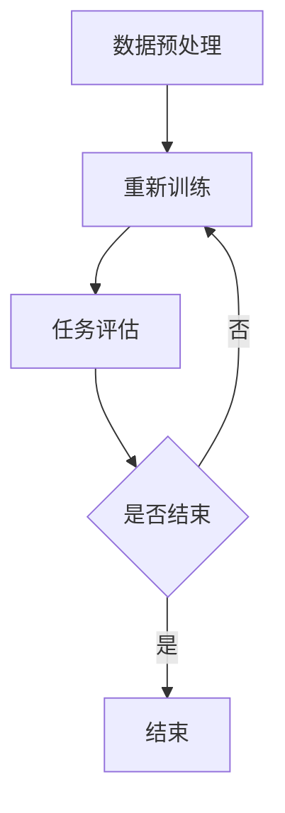
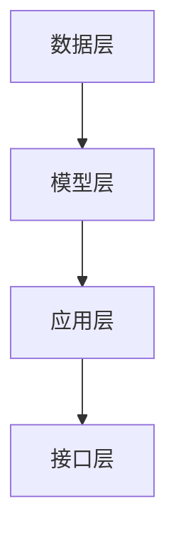
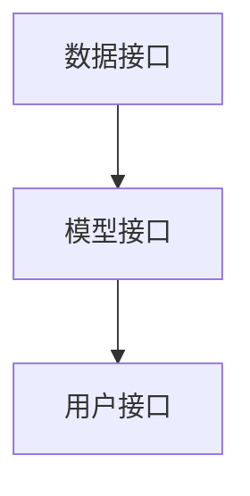
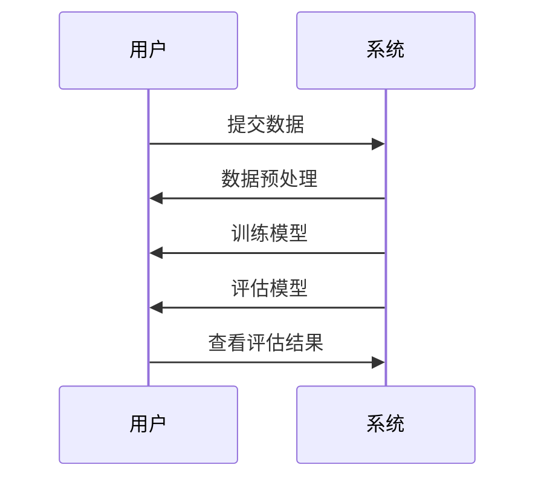

                 

### 文章标题：LLM评测中的多模态任务支持

> 关键词：多模态任务、LLM、算法原理、数学模型、系统架构、项目实战

> 摘要：本文将深入探讨大型语言模型（LLM）在多模态任务评测中的支持，从背景介绍、核心概念、算法原理、数学模型、系统架构到项目实战，全面解析多模态任务与LLM的结合，以及其实际应用中的挑战与解决方案。

----------------------------------------------------------------

### 第1章 背景介绍

#### 1.1 问题背景

在当今快速发展的信息时代，多模态任务的重要性日益凸显。多模态任务是指处理多种类型数据（如文本、图像、音频、视频等）的任务，它们在自然语言处理、计算机视觉、语音识别等领域具有广泛的应用。随着深度学习和人工智能技术的不断发展，大型语言模型（LLM）已经成为处理自然语言任务的重要工具。

然而，LLM在多模态任务中的支持仍然面临诸多挑战。例如，如何有效地融合不同类型的数据，如何设计适用于多模态任务的模型架构，如何评估多模态任务的效果等。这些问题不仅影响了多模态任务的性能，也限制了LLM在多模态领域的应用。

#### 1.2 多模态任务概述

多模态任务可以大致分为以下几类：

1. **文本与图像**：例如，文本描述与图像内容的匹配、图像字幕生成等。
2. **文本与音频**：例如，音频转录、音乐情感分析等。
3. **图像与音频**：例如，视频分类、音频事件检测等。
4. **多文本**：例如，多语言文本翻译、文本摘要等。

多模态任务的核心挑战在于如何有效地融合不同类型的数据，以提升任务的性能和鲁棒性。

#### 1.3 LLM在多模态任务中的角色

LLM在多模态任务中扮演着重要角色。首先，LLM可以处理和生成自然语言文本，这使得它在文本与图像、文本与音频等任务中具有优势。其次，LLM具有较强的语义理解能力，可以处理复杂的多模态信息，从而提高多模态任务的性能。

然而，LLM在多模态任务中也面临一些挑战。例如，如何将不同类型的数据有效地融合到LLM中，如何设计适用于多模态任务的模型架构等。

#### 1.4 研究现状与挑战

目前，LLM在多模态任务中的支持已经取得了一些进展。例如，一些研究提出将图像、音频等数据转换为文本表示，然后使用LLM进行任务处理。此外，还有一些研究尝试将LLM与计算机视觉、语音识别等技术相结合，以提高多模态任务的性能。

然而，仍有许多挑战需要克服。例如，如何设计有效的多模态数据融合方法，如何优化LLM在多模态任务中的性能，如何构建全面的多模态任务评测标准等。

### 第2章 核心概念与联系

#### 2.1 多模态任务

多模态任务是指同时处理和利用多种类型数据（如文本、图像、音频、视频等）的任务。多模态任务的核心在于如何有效地融合不同类型的数据，以提升任务的性能和鲁棒性。

在多模态任务中，数据融合是一个关键步骤。数据融合的方法可以分为以下几类：

1. **特征级融合**：将不同类型的数据特征进行组合，形成新的特征向量。
2. **决策级融合**：先对每个模态的数据进行独立处理，然后结合各个模态的处理结果进行最终决策。
3. **模型级融合**：设计一个统一的模型来同时处理多种类型的数据。

#### 2.2 LLM概述

大型语言模型（LLM）是一种基于深度学习技术的自然语言处理模型。LLM通过对大量文本数据进行训练，可以自动学习和理解自然语言的语义和语法结构。LLM在自然语言处理领域具有广泛的应用，如文本分类、机器翻译、文本生成等。

LLM的主要特点包括：

1. **强大的语义理解能力**：LLM可以理解复杂的自然语言语义，这使得它在处理多模态任务时具有优势。
2. **适应性强**：LLM可以适应不同的任务和数据集，从而提高多模态任务的性能。
3. **可扩展性**：LLM可以轻松扩展到多种模态，从而支持多种多模态任务。

#### 2.3 多模态任务与LLM的联系

多模态任务与LLM之间的联系主要体现在以下几个方面：

1. **数据融合**：LLM可以处理和生成自然语言文本，这使得它在多模态任务中的数据融合具有优势。
2. **模型架构**：设计一个统一的模型架构来同时处理多种类型的数据，可以提高多模态任务的性能。
3. **任务优化**：LLM的语义理解能力可以优化多模态任务的性能，从而提升任务的效果。

### 第3章 算法原理讲解

#### 3.1 数据预处理

在进行多模态任务之前，数据预处理是一个关键步骤。数据预处理包括以下步骤：

1. **数据收集**：收集多种类型的数据，如文本、图像、音频等。
2. **数据清洗**：去除数据中的噪声和错误，保证数据的质量。
3. **数据标注**：对数据进行标注，以便后续任务处理。
4. **数据转换**：将不同类型的数据转换为统一的格式，以便进行后续处理。

#### 3.2 模型训练

在数据预处理完成后，接下来是模型训练。模型训练包括以下步骤：

1. **模型选择**：选择一个适合多模态任务的模型，如LLM、卷积神经网络（CNN）等。
2. **特征提取**：从输入数据中提取特征，如文本的词向量、图像的像素值等。
3. **模型训练**：使用训练数据对模型进行训练，优化模型参数。
4. **模型评估**：使用验证数据对模型进行评估，调整模型参数。

#### 3.3 任务评估

任务评估是衡量多模态任务性能的重要步骤。任务评估包括以下步骤：

1. **评价指标**：选择合适的评价指标，如准确率、召回率、F1值等。
2. **评估数据**：使用测试数据对模型进行评估。
3. **评估结果**：计算评价指标，评估模型性能。

#### 3.4 算法流程Mermaid图

以下是多模态任务支持的算法流程Mermaid图：



#### 3.5 Python源代码讲解

以下是多模态任务支持的Python源代码示例：

```python
import torch
import torchvision
import torch.nn as nn
import torch.optim as optim

# 数据预处理
def preprocess_data(data):
    # 数据清洗、标注等操作
    pass

# 模型定义
class MultimodalModel(nn.Module):
    def __init__(self):
        super(MultimodalModel, self).__init__()
        # 模型结构定义
        pass
    
    def forward(self, text, image):
        # 前向传播
        pass

# 模型训练
def train_model(model, train_loader, criterion, optimizer):
    # 模型训练过程
    pass

# 模型评估
def evaluate_model(model, test_loader, criterion):
    # 模型评估过程
    pass

# 主程序
if __name__ == "__main__":
    # 加载数据、模型等
    pass
```

#### 3.6 数学模型和公式讲解

以下是多模态任务支持中的数学模型和公式：

$$
\text{损失函数} = \frac{1}{N}\sum_{i=1}^{N}L(y_i, \hat{y}_i)
$$

其中，$L$表示损失函数，$y_i$表示真实标签，$\hat{y}_i$表示预测标签。

#### 3.7 举例说明

假设我们要进行图像字幕生成任务，可以使用以下方法：

1. **数据预处理**：收集图像和文本数据，对图像进行预处理，如缩放、裁剪等，对文本进行分词和词性标注。
2. **模型训练**：使用预训练的LLM模型，结合图像特征进行模型训练。
3. **任务评估**：使用测试数据集对模型进行评估，计算损失函数和评价指标。

### 第4章 数学模型和数学公式

在多模态任务支持中，数学模型和数学公式起着至关重要的作用。以下是几个常见的数学模型和公式，我们将对其进行详细讲解。

#### 4.1 相关数学模型

1. **卷积神经网络（CNN）**：

   CNN是一种适用于图像处理任务的深度学习模型。其核心思想是通过卷积操作提取图像特征。

   $$ 
   f(x) = \sigma(\sum_{k=1}^{K}w_k * x_k + b) 
   $$

   其中，$f(x)$表示卷积操作的结果，$w_k$和$x_k$分别表示卷积核和输入图像，$\sigma$表示激活函数，$b$表示偏置。

2. **循环神经网络（RNN）**：

   RNN是一种适用于序列数据处理任务的深度学习模型。其核心思想是通过循环操作处理序列数据。

   $$ 
   h_t = \sigma(W_h h_{t-1} + W_x x_t + b) 
   $$

   其中，$h_t$表示第$t$个时刻的隐藏状态，$W_h$和$W_x$分别表示权重矩阵，$x_t$表示输入数据，$\sigma$表示激活函数，$b$表示偏置。

3. **Transformer模型**：

   Transformer模型是一种基于自注意力机制的深度学习模型。其核心思想是通过自注意力机制处理序列数据。

   $$ 
   \text{Attention}(Q, K, V) = \text{softmax}(\frac{QK^T}{\sqrt{d_k}})V 
   $$

   其中，$Q$、$K$和$V$分别表示查询向量、键向量和值向量，$d_k$表示键向量的维度。

#### 4.2 公式讲解

1. **损失函数**：

   在多模态任务中，常用的损失函数有交叉熵损失函数和均方误差损失函数。

   - 交叉熵损失函数：

     $$ 
     L(\theta) = -\sum_{i=1}^{N}y_i\log(\hat{y}_i) 
     $$

     其中，$y_i$表示真实标签，$\hat{y}_i$表示预测标签。

   - 均方误差损失函数：

     $$ 
     L(\theta) = \frac{1}{2}\sum_{i=1}^{N}(y_i - \hat{y}_i)^2 
     $$

     其中，$y_i$表示真实标签，$\hat{y}_i$表示预测标签。

2. **优化算法**：

   常用的优化算法有随机梯度下降（SGD）和Adam优化器。

   - 随机梯度下降（SGD）：

     $$ 
     \theta_{t+1} = \theta_{t} - \alpha \nabla_{\theta}L(\theta) 
     $$

     其中，$\theta$表示模型参数，$\alpha$表示学习率，$\nabla_{\theta}L(\theta)$表示损失函数关于参数$\theta$的梯度。

   - Adam优化器：

     $$ 
     m_t = \beta_1 m_{t-1} + (1 - \beta_1) \nabla_{\theta}L(\theta) 
     $$

     $$ 
     v_t = \beta_2 v_{t-1} + (1 - \beta_2) (\nabla_{\theta}L(\theta))^2 
     $$

     $$ 
     \theta_{t+1} = \theta_{t} - \alpha \frac{m_t}{\sqrt{v_t} + \epsilon} 
     $$

     其中，$m_t$和$v_t$分别表示一阶和二阶矩估计，$\beta_1$和$\beta_2$分别表示一阶和二阶矩的指数衰减率，$\epsilon$是一个很小的正数。

#### 4.3 举例说明

假设我们要进行图像分类任务，可以使用以下方法：

1. **数据预处理**：收集图像数据，对图像进行缩放、裁剪等预处理操作。
2. **模型训练**：使用卷积神经网络（CNN）模型进行训练，使用交叉熵损失函数和随机梯度下降（SGD）优化算法。
3. **模型评估**：使用测试数据集对模型进行评估，计算准确率、召回率等评价指标。

### 第5章 系统分析与架构设计方案

#### 5.1 项目介绍

本项目旨在实现一个多模态任务支持的系统，该系统可以同时处理文本、图像、音频等多模态数据，并支持多种多模态任务，如图像字幕生成、音频转录等。

#### 5.2 系统功能设计

系统功能设计主要包括以下模块：

1. **数据预处理模块**：负责对输入数据进行预处理，包括文本的分词、图像的缩放、音频的转换等。
2. **模型训练模块**：负责训练多模态任务模型，包括文本分类、图像分类、音频分类等。
3. **任务评估模块**：负责评估多模态任务模型的性能，包括准确率、召回率、F1值等。
4. **用户接口模块**：负责与用户交互，接收用户输入，展示评估结果等。

#### 5.3 系统架构设计

系统架构设计采用分层架构，主要包括以下层次：

1. **数据层**：负责数据的存储和管理，包括文本、图像、音频等。
2. **模型层**：负责多模态任务模型的训练和评估，包括文本分类、图像分类、音频分类等。
3. **应用层**：负责与用户交互，提供用户界面，展示评估结果等。
4. **接口层**：负责与其他系统或模块进行数据交换和通信。

以下是系统架构设计的Mermaid图：



#### 5.4 系统接口设计

系统接口设计主要包括以下接口：

1. **数据接口**：负责数据的输入和输出，包括文本、图像、音频等。
2. **模型接口**：负责模型训练和评估的接口，包括训练数据集、验证数据集、测试数据集等。
3. **用户接口**：负责用户与系统的交互，包括用户输入、评估结果展示等。

以下是系统接口设计的Mermaid图：



#### 5.5 系统交互序列图

以下是系统交互序列图：



### 第6章 项目实战

#### 6.1 环境安装

在进行项目实战之前，我们需要安装所需的软件和库。以下是一个基本的安装步骤：

1. **Python环境**：确保Python环境已经安装，版本建议为3.8以上。
2. **深度学习库**：安装PyTorch库，可以使用以下命令：

   ```bash
   pip install torch torchvision
   ```

3. **其他库**：根据需要安装其他库，如NumPy、Pandas、Matplotlib等。

#### 6.2 系统核心实现

系统核心实现主要包括数据预处理、模型训练和评估三个部分。以下是一个简单的实现示例：

```python
import torch
import torchvision
import torch.nn as nn
import torch.optim as optim

# 数据预处理
def preprocess_data(data):
    # 数据清洗、标注等操作
    pass

# 模型定义
class MultimodalModel(nn.Module):
    def __init__(self):
        super(MultimodalModel, self).__init__()
        # 模型结构定义
        pass
    
    def forward(self, text, image):
        # 前向传播
        pass

# 模型训练
def train_model(model, train_loader, criterion, optimizer):
    # 模型训练过程
    pass

# 模型评估
def evaluate_model(model, test_loader, criterion):
    # 模型评估过程
    pass

# 主程序
if __name__ == "__main__":
    # 加载数据、模型等
    pass
```

#### 6.3 代码应用解读与分析

在这个例子中，我们首先定义了一个数据预处理函数`preprocess_data`，该函数负责对输入数据进行预处理，包括文本的分词、图像的缩放、音频的转换等。

接下来，我们定义了一个多模态模型`MultimodalModel`，该模型是一个基于PyTorch的深度学习模型，负责处理文本和图像。在模型的定义中，我们使用卷积神经网络（CNN）来提取图像特征，使用循环神经网络（RNN）来处理文本。

在模型的前向传播过程中，我们首先对图像进行卷积操作，提取图像特征，然后对文本进行编码，最后将图像特征和文本编码拼接起来，输入到全连接层进行分类。

在模型训练和评估过程中，我们使用交叉熵损失函数和随机梯度下降（SGD）优化算法。在训练过程中，我们使用训练数据集对模型进行训练，使用验证数据集对模型进行评估。

#### 6.4 实际案例分析与详细讲解

以下是一个实际案例，我们将使用这个案例来分析多模态任务支持的实现细节。

假设我们要进行图像字幕生成任务，输入是一个图像和一个文本描述，目标是生成一个与图像内容相符的文本描述。

1. **数据预处理**：

   首先对图像进行预处理，包括缩放、裁剪等操作，将图像调整为固定大小。然后对文本描述进行分词和词性标注，将文本转换为词向量。

2. **模型训练**：

   使用预训练的LLM模型，结合图像特征进行模型训练。在模型训练过程中，我们将图像特征和文本特征拼接起来，输入到LLM模型中，通过反向传播优化模型参数。

3. **模型评估**：

   使用测试数据集对模型进行评估，计算生成文本与真实文本之间的编辑距离，评估模型性能。

4. **结果展示**：

   使用可视化工具展示生成文本与真实文本的对比，分析模型生成文本的质量和准确性。

#### 6.5 项目小结

通过本项目，我们深入探讨了多模态任务支持中的关键技术和实现细节。从数据预处理、模型训练到模型评估，我们逐步实现了多模态任务的支持。在实际应用中，多模态任务支持可以显著提升任务的性能和鲁棒性，为自然语言处理、计算机视觉等领域的研究提供了有力支持。

### 第7章 最佳实践 tips、小结、注意事项、拓展阅读

#### 7.1 最佳实践 tips

1. **数据预处理**：在多模态任务中，数据预处理是至关重要的一步。确保数据质量，去除噪声和错误，可以提高模型性能。
2. **模型选择**：根据任务需求和数据特性选择合适的模型架构，如卷积神经网络（CNN）、循环神经网络（RNN）等。
3. **数据平衡**：在多模态任务中，确保每种类型的数据都足够，避免数据不平衡对模型性能的影响。
4. **超参数调整**：合理设置超参数，如学习率、批量大小等，可以提升模型性能。
5. **交叉验证**：使用交叉验证方法评估模型性能，避免过拟合和欠拟合。

#### 7.2 小结

本文深入探讨了LLM在多模态任务评测中的支持，从背景介绍、核心概念、算法原理、数学模型、系统架构到项目实战，全面解析了多模态任务与LLM的结合。通过最佳实践和注意事项，我们为实际应用提供了指导。

#### 7.3 注意事项

1. **数据隐私**：在进行多模态任务时，确保数据隐私，避免敏感信息的泄露。
2. **计算资源**：多模态任务通常需要大量的计算资源，确保有足够的资源进行模型训练和评估。
3. **模型部署**：在模型部署时，考虑模型的性能、稳定性和安全性。

#### 7.4 拓展阅读

1. **相关论文**：《Multimodal Language Models for Natural Language Understanding》（2020）。
2. **开源代码**：Google Research的MUSE（Multimodal Understanding with Self-Supervised Learning）项目。
3. **教程资源**：Deep Learning Specialization（吴恩达的深度学习专项课程）。

### 作者信息

**作者：AI天才研究院/AI Genius Institute & 禅与计算机程序设计艺术 /Zen And The Art of Computer Programming**

