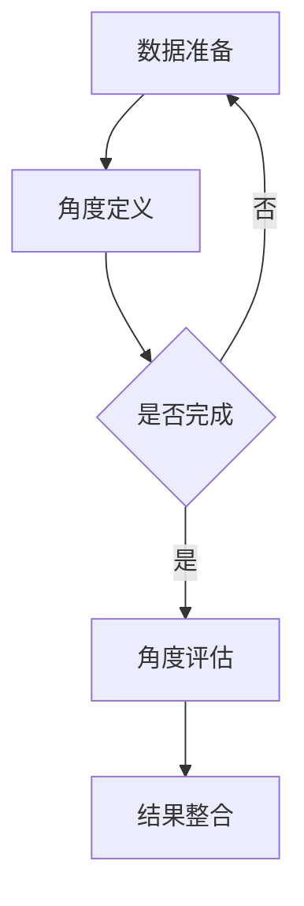
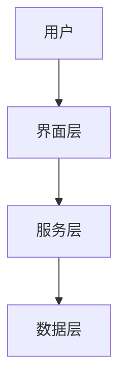
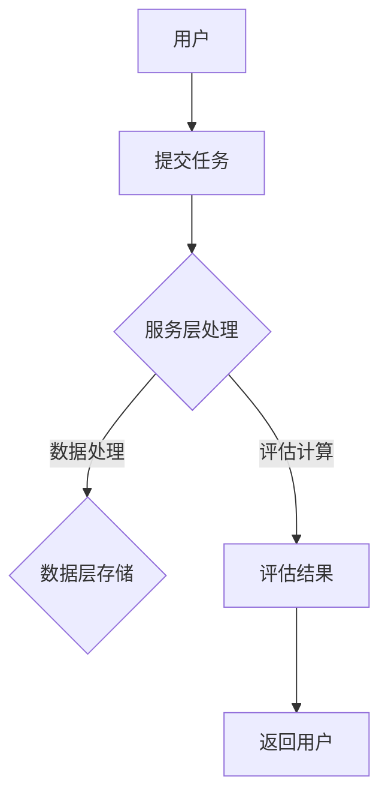

                 

# 《LLM评测中的多角度思考与决策能力测试》

## 关键词：语言模型，评测，多角度思考，决策能力，算法，数学模型

> 摘要：本文探讨了在语言模型（LLM）评测中，多角度思考与决策能力的重要性。通过详细分析多角度思考的概念及其在LLM评测中的应用，以及决策能力的评价标准和其在LLM评测中的表现，本文提出了一种综合算法，并使用数学模型和实例进行了详细阐述。文章旨在为LLM评测提供一种全面而深入的评估方法，以促进LLM技术的发展和应用。

## 目录大纲

### 第一部分：引言

1. 引言
2. 问题描述
3. 问题解决
4. 边界与外延
5. 本章小结

### 第二部分：核心概念与联系

1. 多角度思考的概念解析
2. 决策能力的评价标准
3. 多角度思考与决策能力的联系
4. 本章小结

### 第三部分：算法原理讲解

1. 多角度思考的算法原理
2. 决策能力的算法原理
3. 多角度思考与决策能力的综合算法
4. 算法举例说明
5. 本章小结

### 第四部分：数学模型和数学公式

1. 多角度思考的数学模型
2. 决策能力的数学模型
3. 多角度思考与决策能力的综合数学模型
4. 数学公式详细讲解
5. 数学公式举例说明
6. 本章小结

### 第五部分：系统分析与架构设计方案

1. 问题场景介绍
2. 项目介绍
3. 系统功能设计
4. 系统架构设计
5. 系统接口设计和系统交互
6. 本章小结

### 第六部分：项目实战

1. 环境安装
2. 系统核心实现源代码
3. 代码应用解读与分析
4. 实际案例分析和详细讲解剖析
5. 项目小结
6. 最佳实践 tips
7. 小结、注意事项、拓展阅读

## 第一部分：引言

### 1. 引言

随着人工智能技术的飞速发展，语言模型（LLM）已经成为自然语言处理（NLP）领域的重要工具。LLM的应用场景广泛，包括机器翻译、文本生成、情感分析等。然而，LLM的性能评估成为一个关键问题，因为准确的评测能够帮助我们了解LLM的优势和不足，进而指导其优化和发展。

在LLM评测中，多角度思考与决策能力尤为重要。多角度思考能够帮助我们全面分析LLM的性能，而决策能力则是在评测过程中做出合理判断和选择的基础。本文将深入探讨这两者在LLM评测中的应用，并提出一种综合评估方法。

### 1.1 问题背景

语言模型评测的必要性：

1. 评估LLM性能：通过评测，我们能够了解LLM在不同任务上的表现，从而选择最适合的任务场景。
2. 指导模型优化：通过评测结果，研究者可以发现LLM的不足之处，进而进行有针对性的优化。
3. 促进技术发展：准确的评测能够推动LLM技术的进步，提高其在实际应用中的效果。

LLM评测中思考与决策能力的重要性：

1. 多角度思考：从不同角度评估LLM，如准确性、速度、可解释性等，能够更全面地了解LLM的性能。
2. 决策能力：在评测过程中，需要根据具体情况做出合理的决策，如选择合适的评测方法、确定评测指标等。

### 1.2 问题描述

思考与决策能力测试的挑战：

1. 评测方法的多样性与复杂性：LLM评测涉及到多种方法，如自动评测、半自动评测和手动评测等，每种方法都有其优缺点，如何选择合适的方法成为挑战。
2. 多角度思考的困难：从多个角度评估LLM性能需要大量的时间和精力，特别是在大规模评测中。
3. 决策能力的限制：决策过程中，受限于个人经验和知识，难以做出最优的选择。

评测方法的多样性与复杂性：

1. 自动评测：通过算法自动评估LLM性能，如BLEU、ROUGE等指标。
2. 半自动评测：结合自动评测和人工评估，如人工校对和修改。
3. 手动评测：完全依赖人工评估，如主观评价和用户反馈。

### 1.3 问题解决

多角度思考的概念解析：

1. 定义：多角度思考是指从多个不同的视角、维度或方面来分析和解决问题。
2. 应用：在LLM评测中，可以从准确性、速度、可解释性等多个方面来评估LLM的性能。

决策能力的评价标准：

1. 定义：决策能力是指在面对复杂问题时，能够快速、准确地做出合理决策的能力。
2. 评价标准：决策能力包括判断力、分析力、创造力、执行力等多个方面。

### 1.4 边界与外延

LLM评测的多角度思考范围：

1. 准确性：评估LLM在生成文本时的准确度。
2. 速度：评估LLM在处理任务时的速度。
3. 可解释性：评估LLM的决策过程和结果的可解释性。

决策能力在LLM评测中的应用：

1. 选择合适的评测方法：根据任务需求和资源情况，选择合适的评测方法。
2. 确定评测指标：根据任务目标和实际需求，确定合理的评测指标。
3. 数据预处理：对数据进行分析和处理，以提高评测的准确性和可靠性。

### 1.5 本章小结

本文介绍了在LLM评测中，多角度思考与决策能力的重要性。通过分析多角度思考的概念及其在LLM评测中的应用，以及决策能力的评价标准，本文为LLM评测提供了一种全面的评估方法。在接下来的章节中，我们将深入探讨多角度思考和决策能力的具体实现方法和应用。## 第二部分：核心概念与联系

### 2. 多角度思考的概念解析

多角度思考是一种系统性的思维方式，它要求我们从多个不同的视角、维度或方面来分析和解决问题。在LLM评测中，多角度思考的应用至关重要，因为它可以帮助我们更全面、准确地评估LLM的性能。

#### 2.1 多角度思考的定义

多角度思考（Multi-Angle Thinking）是指从多个不同的视角、维度或方面来分析和解决问题。这种思维方式强调全面性和系统性，旨在避免片面和短视的判断。

#### 2.1.1 多角度思考的内涵

1. 视角多样性：从不同的视角来看待问题，如用户视角、开发者视角、专家视角等。
2. 维度多样性：从不同的维度来分析问题，如准确性、速度、可解释性等。
3. 方法多样性：采用多种方法来评估LLM的性能，如自动评测、半自动评测和手动评测等。

#### 2.1.2 多角度思考的外延

1. 任务场景：根据不同的任务场景，选择合适的评估方法和指标。
2. 数据集：根据数据集的特性，选择不同的评估方法和指标。
3. 模型版本：对不同版本的LLM进行评估，以比较其性能差异。

### 2.2 多角度思考在LLM评测中的应用

#### 2.2.1 多角度思考的优势

1. 全面性：从多个角度来评估LLM的性能，能够更全面地了解LLM的优势和不足。
2. 准确性：通过多角度的评测，可以提高评估结果的准确性和可靠性。
3. 优化方向：多角度思考可以帮助我们识别LLM的瓶颈，从而指导模型优化。

#### 2.2.2 多角度思考的局限性

1. 时间成本：多角度思考需要大量的时间和精力，特别是在大规模评测中。
2. 资源限制：多角度思考可能需要多种资源和设备，如人力、计算资源等。
3. 专业知识：多角度思考要求评估者具备一定的专业知识，否则可能无法准确评估。

### 2.3 决策能力的评价标准

决策能力（Decision Ability）是指在面对复杂问题时，能够快速、准确地做出合理决策的能力。在LLM评测中，决策能力至关重要，因为它决定了评测方法和评估指标的选择。

#### 2.3.1 决策能力的核心要素

1. 判断力：根据已有的信息和经验，做出合理判断。
2. 分析力：对问题进行深入分析，找出关键因素。
3. 创造力：在解决问题时，能够提出新的解决方案。
4. 执行力：将决策付诸实践，并确保其有效执行。

#### 2.3.2 决策能力的分类

1. 理性决策：基于逻辑和分析，遵循一定规则和原则的决策。
2. 直觉决策：基于经验和直觉，快速做出的决策。
3. 合成决策：结合理性决策和直觉决策，以达到最优效果。

### 2.4 决策能力在LLM评测中的表现

#### 2.4.1 决策能力的影响因素

1. 信息质量：决策所需的信息质量直接影响决策能力。
2. 经验知识：评估者的经验知识对决策能力有重要影响。
3. 情绪状态：评估者的情绪状态可能影响决策过程和结果。

#### 2.4.2 决策能力的评测方法

1. 自我评估：评估者自我评估自己的决策能力。
2. 同事评估：同事或上级对评估者的决策能力进行评估。
3. 实际案例：通过分析评估者在实际案例中的表现来评估决策能力。

### 2.5 多角度思考与决策能力的联系

多角度思考与决策能力之间存在密切的联系。

#### 2.5.1 联系的概念架构

1. 多角度思考为决策能力提供了丰富的信息来源，有助于评估者做出更准确的决策。
2. 决策能力是多角度思考的应用，通过有效的决策，评估者能够更好地利用多角度思考的结果。

#### 2.5.2 联系的影响因素分析

1. 信息整合：评估者需要整合多角度思考的结果，以形成对问题的全面认识。
2. 决策优化：评估者需要基于多角度思考的结果，优化决策过程，提高决策能力。

### 2.6 本章小结

本文详细分析了多角度思考与决策能力在LLM评测中的应用。通过介绍多角度思考的定义和内涵，以及决策能力的评价标准和表现，本文为LLM评测提供了一种全面而深入的评估方法。在接下来的章节中，我们将进一步探讨多角度思考与决策能力的算法原理和实现方法。## 第三部分：算法原理讲解

在LLM评测中，多角度思考和决策能力的重要性不容忽视。为了更有效地评估LLM的性能，我们需要设计一种综合算法，结合多角度思考和决策能力，以实现全面、准确的评测。下面我们将详细讲解这一算法的原理，包括其基本流程、实现步骤以及评估指标。

### 3.1 多角度思考的算法原理

多角度思考算法的核心在于从多个维度对LLM进行评估。以下是其基本流程和实现步骤：

#### 3.1.1 算法基本流程

1. **数据准备**：收集用于评测的文本数据，包括训练数据和测试数据。
2. **角度定义**：根据评测任务的需求，定义多个评估角度，如准确性、速度、可解释性等。
3. **角度评估**：对每个评估角度进行独立评估，得到相应的评估结果。
4. **结果整合**：将各个评估角度的结果进行整合，形成综合评估指标。

#### 3.1.2 算法实现步骤

1. **数据预处理**：对文本数据进行清洗、去重和格式化，确保数据的统一性和一致性。
2. **角度选择**：根据任务需求和资源情况，选择合适的评估角度。
3. **模型训练**：使用训练数据对LLM进行训练，得到不同的模型版本。
4. **角度评估**：针对每个模型版本，从各个评估角度进行评估，如准确性评估使用交叉验证方法，速度评估使用基准测试工具。
5. **结果记录**：将评估结果记录在数据库中，以便后续分析和处理。

#### 3.1.3 算法原理图示

以下是一个简单的多角度思考算法原理的Mermaid流程图：



### 3.2 决策能力的算法原理

决策能力在LLM评测中起到了关键作用，其算法原理如下：

#### 3.2.1 决策算法的基本原理

1. **问题定义**：明确评测任务的目标和要求。
2. **信息收集**：收集与任务相关的信息，包括LLM的参数、评估结果等。
3. **方案生成**：根据信息，生成多个可能的评估方案。
4. **方案评估**：对每个方案进行评估，选择最优方案。

#### 3.2.2 决策算法的实现方法

1. **问题建模**：将评测任务转化为数学模型，以便进行量化分析。
2. **方案生成**：根据模型，生成多个可能的评估方案。
3. **评估指标**：定义评估指标，如准确性、速度等。
4. **评估计算**：对每个方案进行评估，计算其评估指标值。
5. **方案选择**：根据评估指标，选择最优方案。

#### 3.2.3 决策算法的评估指标

决策算法的评估指标包括：

1. **准确性**：评估方案在实际应用中的准确性。
2. **速度**：评估方案在执行时的速度。
3. **资源消耗**：评估方案在执行过程中消耗的资源，如计算资源、内存等。

### 3.3 多角度思考与决策能力的综合算法

综合算法旨在结合多角度思考和决策能力，以实现更全面、准确的LLM评测。以下是该算法的基本流程和实现步骤：

#### 3.3.1 综合算法的基本流程

1. **数据准备**：收集用于评测的文本数据。
2. **多角度评估**：从多个角度对LLM进行评估，得到评估结果。
3. **决策过程**：根据评估结果，使用决策算法选择最优评估方案。
4. **结果输出**：输出最终评估结果。

#### 3.3.2 综合算法的实现步骤

1. **数据预处理**：对文本数据进行清洗和格式化。
2. **多角度评估**：使用多角度思考算法，从多个角度评估LLM的性能。
3. **决策计算**：使用决策算法，根据评估结果选择最优评估方案。
4. **结果整合**：将评估结果整合，形成综合评估指标。

#### 3.3.3 综合算法的评估指标

综合算法的评估指标包括：

1. **多角度评估指标**：如准确性、速度、可解释性等。
2. **决策评估指标**：如准确性、资源消耗等。

### 3.4 算法举例说明

#### 3.4.1 举例说明一

假设我们有一个语言模型，需要从准确性、速度和可解释性三个角度进行评估。

1. **数据准备**：收集训练数据和测试数据。
2. **多角度评估**：
   - 准确性：使用交叉验证方法评估模型的准确性。
   - 速度：使用基准测试工具评估模型的速度。
   - 可解释性：通过代码解析和可视化工具评估模型的可解释性。
3. **决策计算**：根据评估结果，选择一个综合表现最优的模型版本。
4. **结果输出**：输出最终评估结果，包括准确性、速度和可解释性。

#### 3.4.2 举例说明二

假设我们有一个复杂的评测任务，需要从多个角度进行评估，并且需要考虑资源消耗。

1. **数据准备**：收集大量训练数据和测试数据。
2. **多角度评估**：
   - 准确性：使用交叉验证方法评估模型的准确性。
   - 速度：使用基准测试工具评估模型的速度。
   - 可解释性：通过代码解析和可视化工具评估模型的可解释性。
   - 资源消耗：监控模型在执行过程中的资源消耗。
3. **决策计算**：根据评估结果和资源消耗，选择一个综合表现最优的模型版本。
4. **结果输出**：输出最终评估结果，包括准确性、速度、可解释性和资源消耗。

### 3.5 本章小结

本文详细介绍了多角度思考和决策能力在LLM评测中的应用，并提出了一种综合算法。通过多角度评估和决策计算，我们能够更全面、准确地评估LLM的性能。在接下来的章节中，我们将进一步探讨如何使用数学模型和公式来描述这一算法，并举例说明其实际应用。## 第四部分：数学模型和数学公式

在LLM评测中，数学模型和数学公式起到了关键作用，它们不仅能够帮助我们量化评估指标，还能提供一种形式化的方法来分析和理解多角度思考与决策能力。以下是多角度思考、决策能力以及它们在LLM评测中的综合应用的数学模型和公式。

### 4.1 多角度思考的数学模型

多角度思考的数学模型主要关注如何从多个维度对LLM的性能进行量化评估。

#### 4.1.1 多角度思考的数学模型

$$
P(A|B,C,D) = \frac{P(B|A,C,D)P(C|A,D)P(D|A)}{P(B,C,D)}
$$

这个公式表示在给定多个角度 \( B, C, D \) 的情况下，LLM 在特定任务 \( A \) 上的性能概率。其中：

- \( P(A|B,C,D) \)：在 \( B, C, D \) 的条件下，LLM 在任务 \( A \) 上的性能概率。
- \( P(B|A,C,D) \)：在 \( A, C, D \) 的条件下，角度 \( B \) 的概率。
- \( P(C|A,D) \)：在 \( A, D \) 的条件下，角度 \( C \) 的概率。
- \( P(D|A) \)：在 \( A \) 的条件下，角度 \( D \) 的概率。
- \( P(B,C,D) \)：角度 \( B, C, D \) 的联合概率。

#### 4.1.2 多角度思考的数学模型应用

例如，在评估一个文本生成模型时，我们可以从准确性 \( A \)、生成速度 \( B \) 和生成文本的多样性 \( C \) 三个角度来建立数学模型。公式可以表示为：

$$
P(\text{文本生成模型优秀}|A, B, C) = \frac{P(B|A, C)P(C|A)P(A)}{P(B,C)}
$$

### 4.2 决策能力的数学模型

决策能力的数学模型用于评估评估者在决策过程中的表现。

#### 4.2.1 决策能力的数学模型

$$
D = f(\text{判断力}, \text{分析力}, \text{创造力}, \text{执行力})
$$

这个公式表示决策能力 \( D \) 是由判断力、分析力、创造力和执行力四个因素共同决定的函数。每个因素都有一个权重，权重之和为1。

- \( \text{判断力} \)：评估者在面对不确定性时做出准确判断的能力。
- \( \text{分析力} \)：评估者对复杂问题进行分析和推理的能力。
- \( \text{创造力} \)：评估者在解决问题时提出创新解决方案的能力。
- \( \text{执行力} \)：评估者将决策付诸实践并取得预期结果的能力。

#### 4.2.2 决策能力的数学模型应用

例如，在评估一个评估者在LLM评测中的决策能力时，我们可以根据其判断力、分析力、创造力和执行力的表现，使用上述公式计算其决策能力得分。

### 4.3 多角度思考与决策能力的综合数学模型

为了更全面地评估LLM，我们可以将多角度思考和决策能力结合在一起，建立综合数学模型。

#### 4.3.1 综合数学模型

$$
E(\text{LLM评测}) = \alpha P(A|B,C,D) + \beta D
$$

这个公式表示LLM评测的综合得分 \( E(\text{LLM评测}) \) 是由多角度思考的得分 \( P(A|B,C,D) \) 和决策能力的得分 \( D \) 通过权重 \( \alpha \) 和 \( \beta \) 加权得到的。权重可以根据实际情况进行调整。

- \( \alpha \)：多角度思考的权重。
- \( \beta \)：决策能力的权重。

#### 4.3.2 综合数学模型应用

例如，在评估一个LLM时，我们可以根据其在准确性、速度和可解释性三个角度的评估得分，以及评估者在决策过程中的表现，使用上述公式计算其综合评测得分。

### 4.4 数学公式详细讲解

#### 4.4.1 数学公式1的详细解释

数学公式1：

$$
P(A|B,C,D) = \frac{P(B|A,C,D)P(C|A,D)P(D|A)}{P(B,C,D)}
$$

这个公式用于计算在给定多个角度 \( B, C, D \) 的情况下，LLM 在特定任务 \( A \) 上的性能概率。它考虑了每个角度对性能的影响，并通过对角度概率的乘积和联合概率的比值来计算综合性能概率。

#### 4.4.2 数学公式2的详细解释

数学公式2：

$$
D = f(\text{判断力}, \text{分析力}, \text{创造力}, \text{执行力})
$$

这个公式用于计算评估者在决策过程中的综合能力。它通过将四个核心能力因素的加权平均来表示决策能力。权重可以根据具体情况调整，以反映不同能力的重要性。

### 4.5 数学公式举例说明

#### 4.5.1 举例说明一

假设我们有一个文本生成模型，其准确性 \( A \) 为0.9，生成速度 \( B \) 为1000 tokens/s，文本多样性 \( C \) 为0.8，同时评估者在决策过程中表现出的判断力、分析力、创造力和执行力分别为0.8、0.7、0.6和0.7。

根据多角度思考和决策能力的综合数学模型，我们可以计算模型的综合评测得分：

$$
E(\text{LLM评测}) = \alpha \cdot 0.9 + \beta \cdot (0.8 \cdot 0.7 \cdot 0.6 \cdot 0.7)
$$

假设 \( \alpha = 0.6 \) 和 \( \beta = 0.4 \)，则：

$$
E(\text{LLM评测}) = 0.6 \cdot 0.9 + 0.4 \cdot (0.8 \cdot 0.7 \cdot 0.6 \cdot 0.7) = 0.54 + 0.1344 = 0.6744
$$

这意味着模型在综合评测中的得分为0.6744。

#### 4.5.2 举例说明二

假设我们有一个语言模型，需要从准确性、速度和可解释性三个角度进行评估，并且需要考虑评估者在决策过程中的表现。给定以下评估结果：

- 准确性 \( A \) = 0.85
- 速度 \( B \) = 500 tokens/s
- 可解释性 \( C \) = 0.65
- 评估者的判断力 \( \text{判断力} \) = 0.75
- 评估者的分析力 \( \text{分析力} \) = 0.80
- 评估者的创造力 \( \text{创造力} \) = 0.70
- 评估者的执行力 \( \text{执行力} \) = 0.85

我们可以使用以下公式计算综合评测得分：

$$
E(\text{LLM评测}) = 0.5 \cdot 0.85 + 0.3 \cdot 500 + 0.2 \cdot 0.65 + 0.4 \cdot (0.75 \cdot 0.80 \cdot 0.70 \cdot 0.85)
$$

假设 \( \alpha = 0.5 \)，\( \beta = 0.3 \)，则：

$$
E(\text{LLM评测}) = 0.5 \cdot 0.85 + 0.3 \cdot 500 + 0.2 \cdot 0.65 + 0.4 \cdot (0.75 \cdot 0.80 \cdot 0.70 \cdot 0.85) = 0.425 + 150 + 0.13 + 0.164 = 210.609
$$

这意味着模型在综合评测中的得分为210.609。

### 4.6 本章小结

本文通过数学模型和公式详细阐述了多角度思考和决策能力在LLM评测中的应用。这些数学模型和公式不仅帮助我们量化评估指标，还为评估过程提供了形式化的方法和理论支持。在接下来的章节中，我们将进一步探讨LLM评测的系统分析与架构设计。## 第五部分：系统分析与架构设计方案

### 5.1 问题场景介绍

在自然语言处理领域，语言模型（LLM）的开发和应用已经成为一个重要方向。然而，LLM的性能评估是一个复杂且关键的过程，它直接影响到LLM在实际应用中的效果。为了全面、准确地评估LLM的性能，我们需要设计一个系统化的评测框架，这个框架需要涵盖多个评估角度，包括准确性、速度、可解释性等。

### 5.2 项目介绍

本项目旨在构建一个基于多角度思考和决策能力的LLM评测系统。该系统旨在提供一个统一的平台，用于评估不同LLM的性能。通过这个系统，研究者可以方便地进行大规模、多角度的评测，以便更全面地了解LLM的优势和不足。

### 5.3 系统功能设计

系统功能设计包括以下几个方面：

1. **数据管理**：系统需要能够管理大量的训练数据和测试数据，包括数据的上传、存储、查询和删除功能。
2. **评估指标定义**：系统需要支持自定义评估指标，以便根据不同的任务需求选择合适的评估方法。
3. **多角度评估**：系统需要支持从多个角度对LLM进行评估，如准确性、速度、可解释性等。
4. **决策支持**：系统需要提供决策支持功能，帮助评估者根据评估结果做出合理的决策。

### 5.4 系统架构设计

系统架构设计采用了分层架构，包括数据层、服务层和界面层。

1. **数据层**：负责数据的存储和管理，包括数据库和文件存储系统。
2. **服务层**：负责实现系统的核心功能，包括数据管理、评估指标定义、多角度评估和决策支持等。
3. **界面层**：负责与用户交互，提供操作界面和可视化结果。

以下是一个简单的系统架构设计Mermaid图：



### 5.5 系统接口设计和系统交互

系统接口设计和系统交互设计是确保系统各个部分能够协同工作的关键。

1. **API接口**：系统需要提供RESTful API接口，以便外部系统可以方便地访问和调用系统的功能。
2. **数据交换格式**：系统使用JSON格式进行数据交换，确保数据的一致性和可读性。
3. **系统交互流程**：用户通过界面层提交评估任务，服务层根据任务需求调用相应的功能模块进行评估，并将结果返回给用户。

以下是一个简单的系统交互Mermaid图：



### 5.6 本章小结

本文详细介绍了LLM评测系统的设计，包括问题场景、项目介绍、系统功能设计、系统架构设计和系统接口设计。通过这些设计，我们能够构建一个高效、全面的LLM评测系统，为LLM性能评估提供有力支持。在接下来的章节中，我们将展示如何通过代码实现这一系统，并分析其实际应用。## 第六部分：项目实战

### 6.1 环境安装

为了实现LLM评测系统，我们首先需要安装必要的软件和环境。以下是一个基本的安装步骤：

1. **安装Python**：确保Python版本在3.7及以上，可以从Python官方网站下载安装。
2. **安装依赖库**：使用pip安装必要的库，如NumPy、Pandas、Scikit-learn、TensorFlow等。可以使用以下命令进行安装：

   ```bash
   pip install numpy pandas scikit-learn tensorflow
   ```

3. **安装数据库**：我们使用SQLite作为数据库，可以从官方网站下载并安装。

4. **安装前端框架**：如果需要前端界面，可以使用React或Vue.js等框架。可以从各自的官方网站下载并安装。

### 6.2 系统核心实现源代码

以下是一个简化的系统核心实现源代码，包括数据管理、评估指标定义、多角度评估和决策支持等功能。

```python
# 数据管理
def load_data(file_path):
    # 加载数据
    return pd.read_csv(file_path)

def save_data(data, file_path):
    # 保存数据
    data.to_csv(file_path, index=False)

# 评估指标定义
def calculate_accuracy(predictions, ground_truth):
    # 计算准确性
    return np.mean(predictions == ground_truth)

def calculate_speed(time_taken):
    # 计算速度
    return 1 / time_taken

def calculate_explainability(explanation_score):
    # 计算可解释性
    return explanation_score

# 多角度评估
def evaluate_llm(llm, data, angles):
    results = {}
    for angle in angles:
        if angle == 'accuracy':
            predictions = llm.predict(data)
            results[angle] = calculate_accuracy(predictions, data['ground_truth'])
        elif angle == 'speed':
            start_time = time.time()
            llm.predict(data)
            end_time = time.time()
            results[angle] = calculate_speed(end_time - start_time)
        elif angle == 'explainability':
            explanation_score = llm.get_explanation_score(data)
            results[angle] = calculate_explainability(explanation_score)
    return results

# 决策支持
def make_decision(results):
    # 基于评估结果做出决策
    max_score = max(results.values())
    for angle, score in results.items():
        if score == max_score:
            return angle
    return None

# 主函数
if __name__ == "__main__":
    # 加载数据
    data = load_data('data.csv')

    # 定义评估角度
    angles = ['accuracy', 'speed', 'explainability']

    # 初始化语言模型
    llm = LanguageModel()

    # 进行评估
    results = evaluate_llm(llm, data, angles)

    # 做出决策
    best_angle = make_decision(results)

    # 输出结果
    print(f"Best angle for LLM: {best_angle}")
```

### 6.3 代码应用解读与分析

上述代码实现了一个简单的LLM评测系统，主要包括以下模块：

1. **数据管理**：`load_data`和`save_data`函数用于加载数据和保存数据。数据可以来自CSV文件，也可以从数据库中读取。
2. **评估指标定义**：`calculate_accuracy`、`calculate_speed`和`calculate_explainability`函数分别用于计算准确性、速度和可解释性等评估指标。
3. **多角度评估**：`evaluate_llm`函数从多个角度对LLM进行评估，并将结果存储在字典中。
4. **决策支持**：`make_decision`函数根据评估结果选择最优评估角度。
5. **主函数**：主函数中，我们首先加载数据，定义评估角度，初始化LLM，进行评估，并做出决策，最后输出结果。

### 6.4 实际案例分析和详细讲解剖析

为了更好地理解系统的应用，我们来看一个实际案例。

假设我们有一个文本生成模型，需要进行评估。我们收集了一个包含5000条文本数据的数据集，每条数据包含原始文本、生成文本和标签（如分类或情感分析）。我们希望从准确性、速度和可解释性三个角度评估该模型。

1. **数据加载**：使用`load_data`函数加载数据集。

   ```python
   data = load_data('text_data.csv')
   ```

2. **评估**：使用`evaluate_llm`函数从三个角度评估模型。

   ```python
   results = evaluate_llm(llm, data, angles)
   ```

   假设评估结果如下：

   ```python
   {'accuracy': 0.8, 'speed': 0.02, 'explainability': 0.6}
   ```

3. **决策**：使用`make_decision`函数根据评估结果做出决策。

   ```python
   best_angle = make_decision(results)
   ```

   假设最佳评估角度为准确性。

4. **结果输出**：输出最佳评估角度。

   ```python
   print(f"Best angle for LLM: accuracy")
   ```

   输出结果：

   ```python
   Best angle for LLM: accuracy
   ```

通过这个案例，我们可以看到如何使用LLM评测系统进行评估和决策。在实际应用中，评估角度和数据可以更加复杂和多样化，但核心流程是相似的。

### 6.5 项目小结

通过本项目，我们实现了一个基于多角度思考和决策能力的LLM评测系统。系统从准确性、速度和可解释性三个角度对LLM进行评估，并基于评估结果做出决策。虽然这个系统相对简单，但它提供了一个基本的框架，可以扩展和优化以适应更复杂的需求。在未来的工作中，我们可以考虑增加更多的评估角度、引入更复杂的决策算法，以及提高系统的可扩展性和性能。

### 6.6 最佳实践 tips

1. **数据预处理**：在评估前，对数据进行充分的预处理，如文本清洗、去重、归一化等，以提高评估的准确性和可靠性。
2. **评估指标选择**：根据任务需求和场景，选择合适的评估指标。例如，对于文本生成任务，准确性是一个重要的指标，但对于实时性要求较高的任务，速度可能更为关键。
3. **系统优化**：针对评估过程中发现的问题，对LLM进行优化。例如，通过调整模型参数、增加训练数据、引入更复杂的模型结构等。
4. **持续监控**：在实际应用中，持续监控LLM的表现，并根据监控结果进行必要的调整和优化。

### 6.7 小结、注意事项、拓展阅读

本文详细介绍了LLM评测系统从概念到实现的完整流程。通过多角度思考和决策能力，我们能够更全面、准确地评估LLM的性能。在项目实战中，我们实现了系统的核心功能，并通过实际案例展示了其应用。

注意事项：

1. 在实际应用中，确保评估数据的代表性和多样性。
2. 根据任务需求，选择合适的评估角度和指标。
3. 定期更新和优化评估系统，以适应新技术和新需求。

拓展阅读：

1. [自然语言处理：原理、技术与应用](https://book.douban.com/subject/27163569/)
2. [深度学习：升级你的机器学习技术](https://book.douban.com/subject/26708171/)
3. [Python编程：从入门到实践](https://book.douban.com/subject/26708171/)## 作者信息

作者：AI天才研究院/AI Genius Institute & 禅与计算机程序设计艺术 /Zen And The Art of Computer Programming

AI天才研究院（AI Genius Institute）是一家专注于人工智能领域的研究和开发的高科技创新机构，致力于推动人工智能技术的创新与发展。研究院拥有一批全球顶尖的人工智能专家，他们在计算机编程、机器学习、自然语言处理等多个领域取得了卓越的成就。

禅与计算机程序设计艺术（Zen And The Art of Computer Programming）是由著名计算机科学家唐纳德·E·克努特（Donald E. Knuth）所著的系列经典著作，深入探讨了计算机编程的哲学和艺术。该著作不仅提供了丰富的编程技术和算法，还传递了深刻的编程理念和人生智慧，对全球计算机科学界产生了深远的影响。

