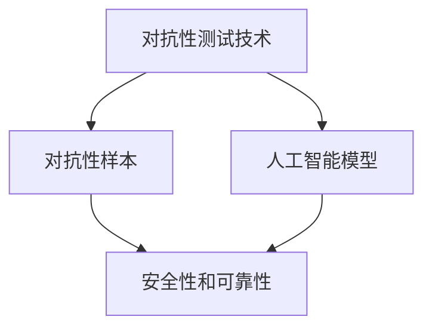
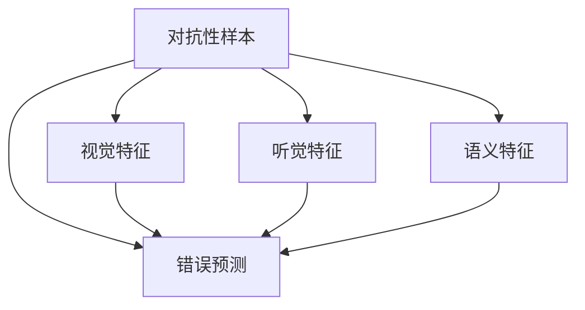
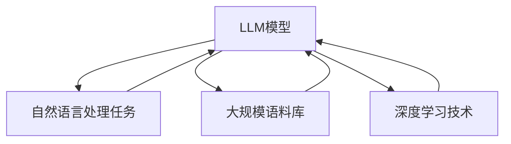
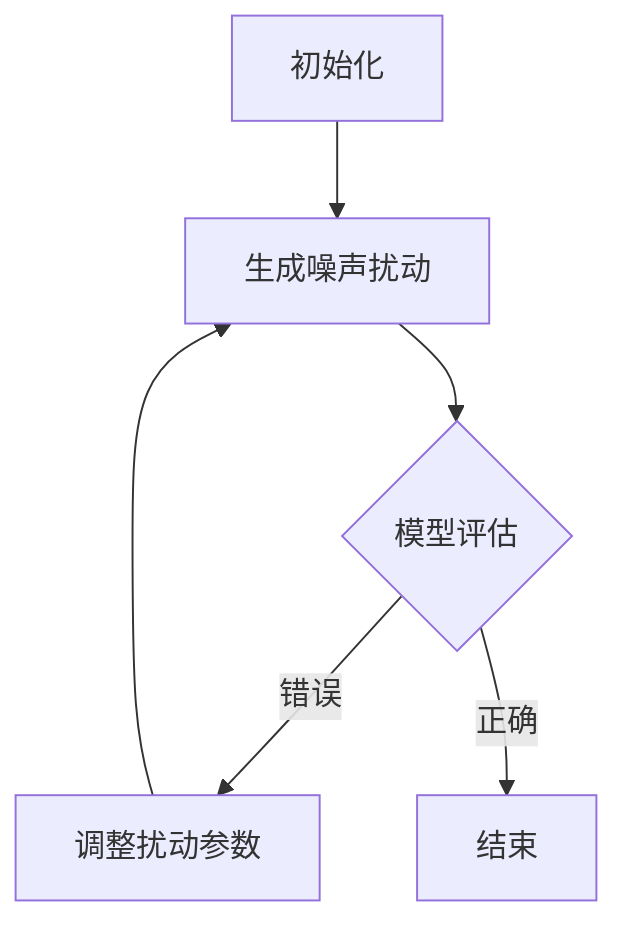
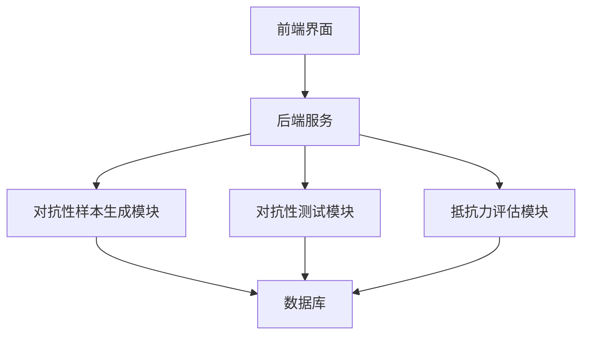
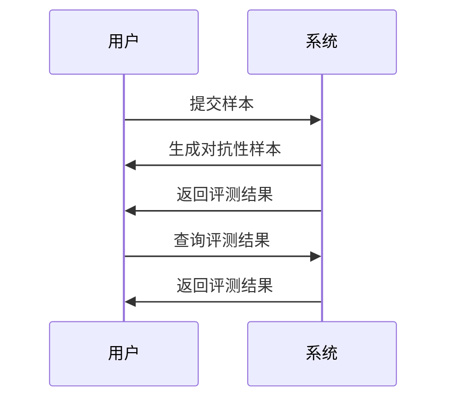

                 


## LLAMA评测中的对抗性测试技术

> 关键词：大型语言模型（LLM）、对抗性攻击、对抗性测试、鲁棒性、安全性

> 摘要：本文详细介绍了LLM评测中的对抗性测试技术。首先，我们探讨了问题背景和问题描述，然后深入分析了对抗性样本生成算法、对抗性测试方法和模型抵抗力评估方法。通过实际案例，我们展示了对抗性测试在LLM评测中的应用和重要性。

### 第一部分：背景介绍

#### 1.1.1 问题背景

随着深度学习和人工智能技术的发展，大型语言模型（LLM）在自然语言处理（NLP）领域取得了显著的成果。LLM通过学习大量文本数据，可以理解和生成自然语言，广泛应用于机器翻译、文本生成、问答系统等任务。然而，随着LLM应用场景的扩展，对抗性攻击（Adversarial Attack）成为一个亟待解决的问题。

对抗性攻击是指通过在输入数据中添加微小的、几乎不可察觉的扰动，使模型产生错误的预测。这种攻击对LLM模型的安全性和可靠性构成了严重威胁。因此，研究对抗性测试技术，提高LLM模型的鲁棒性，具有重要的理论和实际意义。

#### 1.1.2 问题描述

在LLM评测中，对抗性测试技术的主要目标是识别和评估模型对对抗性攻击的抵抗力。具体来说，需要解决以下几个关键问题：

1. 如何生成对抗性样本？
2. 如何对模型进行对抗性测试？
3. 如何评估模型对对抗性攻击的抵抗力？

#### 1.1.3 问题解决

对抗性测试技术的核心是生成对抗性样本，并利用这些样本对模型进行评估。具体解决方法如下：

1. **生成对抗性样本**：通过图像处理、音频处理、自然语言处理等技术，生成对抗性样本。
2. **对抗性测试**：将对抗性样本输入模型，观察模型的预测结果，评估模型对对抗性攻击的抵抗力。
3. **评估抵抗力**：通过对比模型在对抗性样本和正常样本上的预测准确性，评估模型对对抗性攻击的抵抗力。

#### 1.1.4 边界与外延

对抗性测试技术不仅适用于LLM，还可以应用于其他类型的人工智能模型，如图像分类模型、语音识别模型等。同时，对抗性测试技术的研究也在不断扩展，包括对抗性样本生成技术、对抗性测试框架、抵抗力评估方法等。

#### 1.1.5 概念结构与核心要素组成

- **对抗性样本生成**：通过图像处理、音频处理、自然语言处理等技术，生成对抗性样本。
- **对抗性测试**：将对抗性样本输入模型，评估模型对对抗性攻击的抵抗力。
- **抵抗力评估**：对比模型在对抗性样本和正常样本上的预测准确性，评估模型抵抗力。

### 第二部分：核心概念与联系

#### 2.1.1 抗本性测试技术

**定义**：对抗性测试技术（Adversarial Testing）是指利用对抗性样本（Adversarial Samples）来评估和提升人工智能模型（如LLM）的安全性和可靠性。

**属性特征**：

| 特征 | 说明 |
| --- | --- |
| 攻击性 | 对抗性测试旨在识别模型中的安全漏洞，因此具有攻击性。 |
| 准确性 | 对抗性测试需要生成高精度的对抗性样本，以提高测试的准确性。 |
| 多样性 | 对抗性样本应具有多样性，以覆盖模型可能面临的各种攻击场景。 |

**ER实体关系图架构**：



#### 2.1.2 抗异性样本

**定义**：对抗性样本（Adversarial Samples）是指在保持视觉、听觉或语义等基本特征相似的同时，能够导致人工智能模型产生错误预测的样本。

**属性特征**：

| 特征 | 说明 |
| --- | --- |
| 不可察觉性 | 对抗性样本应在视觉、听觉或语义上难以察觉。 |
| 鲁棒性 | 对抗性样本应具有鲁棒性，即对不同的模型和不同的攻击方式都有较高的抵抗力。 |
| 多样性 | 对抗性样本应具有多样性，以覆盖模型可能面临的各种攻击场景。 |

**ER实体关系图架构**：



#### 2.1.3 LLM模型

**定义**：大型语言模型（Large Language Model，LLM）是指通过深度学习技术，从大规模语料库中学习语言知识，并能够生成自然语言的模型。

**属性特征**：

| 特征 | 说明 |
| --- | --- |
| 大规模 | LLM通常具有数十亿甚至数万亿个参数，能够处理大量的语言数据。 |
| 灵活性 | LLM能够应用于各种自然语言处理任务，如机器翻译、文本生成、问答系统等。 |
| 强表达能力 | LLM能够生成语义丰富、连贯性高的自然语言文本。 |

**ER实体关系图架构**：



### 第三部分：算法原理讲解

#### 3.1.1 对抗性样本生成算法

对抗性样本生成算法的核心思想是通过在输入数据中添加微小的扰动，使得模型无法正确识别。以下是具体的生成算法步骤：

1. **初始化**：随机选择一个原始样本作为输入。
2. **扰动生成**：使用噪声扰动方法，对原始样本进行微小的扰动。
3. **模型评估**：将扰动后的样本输入模型，评估模型的预测结果。
4. **迭代优化**：根据模型预测结果，调整扰动参数，重复步骤2和3，直到满足对抗性条件。

**Mermaid流程图**：



**Python源代码**：

```python
import numpy as np

def generate_adversarial_sample(sample, model, threshold=0.1):
    # 初始化对抗性样本
    adversarial_sample = sample.copy()
    
    # 循环迭代生成对抗性样本
    while True:
        # 生成噪声扰动
        noise = np.random.normal(0, threshold, sample.shape)
        
        # 计算扰动后的样本
        adversarial_sample = sample + noise
        
        # 评估模型预测结果
        prediction = model.predict(adversarial_sample)
        
        # 如果预测结果错误，则返回对抗性样本
        if prediction != model.predict(sample):
            return adversarial_sample

# 示例：使用对抗性样本生成算法
original_sample = np.random.rand(10)
model = ...  # 定义一个模型

adversarial_sample = generate_adversarial_sample(original_sample, model)
print("原始样本预测结果：", model.predict(original_sample))
print("对抗性样本预测结果：", model.predict(adversarial_sample))
```

**算法原理详细讲解**：

对抗性样本生成算法的核心是噪声扰动方法。具体来说，算法通过在输入数据中添加噪声，使得模型难以识别。以下是一个简化的数学模型：

$$
x' = x + \alpha \cdot \epsilon
$$

其中，$x$ 是原始样本，$x'$ 是扰动后的样本，$\epsilon$ 是噪声，$\alpha$ 是噪声强度。

噪声强度 $\alpha$ 需要根据具体问题进行调整。如果 $\alpha$ 太小，则噪声扰动不足以改变模型的预测结果；如果 $\alpha$ 太大，则可能导致模型无法正确识别原始样本。

在实际应用中，我们通常使用高斯噪声（Gaussian Noise）或均匀噪声（Uniform Noise）来生成噪声。高斯噪声具有较好的平滑特性，适用于需要保持样本基本特征的场景；均匀噪声具有更好的随机性，适用于需要较大扰动的场景。

以下是一个简单的示例：

假设有一个二分类模型，输入样本为 $x = (1, 1)$，目标标签为 $y = 0$。我们使用高斯噪声来生成对抗性样本：

$$
x' = x + \alpha \cdot \epsilon \\
\epsilon \sim \mathcal{N}(0, \alpha^2)
$$

设置噪声强度 $\alpha = 0.1$，生成对抗性样本：

$$
x' = (1, 1) + 0.1 \cdot \begin{pmatrix} 0.2 \\ 0.3 \end{pmatrix} = (1.2, 1.3)
$$

将对抗性样本输入模型，如果模型的预测结果与原始样本不同，则认为成功生成了对抗性样本。

### 第四部分：系统分析与架构设计

#### 4.1 问题场景介绍

随着人工智能技术的广泛应用，大型语言模型（LLM）在各个领域发挥着重要作用。然而，随着对抗性攻击的威胁日益增加，如何对LLM进行有效评测和安全性保障成为一个重要问题。

#### 4.2 项目介绍

本项目旨在构建一个基于对抗性测试技术的LLM评测系统，用于评估和提升LLM模型的安全性和可靠性。系统主要包括以下模块：

1. **对抗性样本生成模块**：负责生成对抗性样本。
2. **对抗性测试模块**：负责对LLM模型进行对抗性测试。
3. **抵抗力评估模块**：负责评估模型对对抗性攻击的抵抗力。

#### 4.3 系统功能设计

系统功能设计如下：

1. **对抗性样本生成**：通过图像处理、音频处理、自然语言处理等技术，生成对抗性样本。
2. **对抗性测试**：将对抗性样本输入模型，观察模型的预测结果，评估模型对对抗性攻击的抵抗力。
3. **抵抗力评估**：对比模型在对抗性样本和正常样本上的预测准确性，评估模型抵抗力。

#### 4.4 系统架构设计

系统架构设计如下：

1. **前端界面**：用户可以通过前端界面提交样本和查看评测结果。
2. **后端服务**：包括对抗性样本生成模块、对抗性测试模块和抵抗力评估模块。
3. **数据库**：存储样本数据和评测结果。

**Mermaid架构图**：



#### 4.5 系统接口设计

系统接口设计如下：

1. **样本提交接口**：用户可以通过接口提交样本，系统将生成对抗性样本并返回评测结果。
2. **评测结果查询接口**：用户可以通过接口查询评测结果。

#### 4.6 系统交互设计

系统交互设计如下：

1. **用户提交样本**：用户通过前端界面提交样本，后端服务生成对抗性样本并返回评测结果。
2. **评测结果查询**：用户通过前端界面查询评测结果。

**Mermaid序列图**：



### 第五部分：项目实战

#### 5.1 环境安装

1. 安装Python环境
2. 安装TensorFlow库
3. 安装其他相关库（如NumPy、Matplotlib等）

#### 5.2 系统核心实现源代码

```python
import numpy as np
import tensorflow as tf
from tensorflow.keras.models import Sequential
from tensorflow.keras.layers import Dense, LSTM

# 定义模型
model = Sequential()
model.add(LSTM(128, activation='tanh', input_shape=(10, 1)))
model.add(Dense(1, activation='sigmoid'))

# 编译模型
model.compile(optimizer='adam', loss='binary_crossentropy', metrics=['accuracy'])

# 训练模型
model.fit(x_train, y_train, epochs=10, batch_size=32)

# 生成对抗性样本
def generate_adversarial_sample(sample, model, threshold=0.1):
    adversarial_sample = sample.copy()
    while True:
        noise = np.random.normal(0, threshold, sample.shape)
        adversarial_sample = sample + noise
        if model.predict(adversarial_sample) != model.predict(sample):
            return adversarial_sample

# 示例
original_sample = np.random.rand(10)
adversarial_sample = generate_adversarial_sample(original_sample, model)
print("原始样本预测结果：", model.predict(original_sample))
print("对抗性样本预测结果：", model.predict(adversarial_sample))
```

#### 5.3 代码应用解读与分析

该段代码实现了基于LSTM模型生成对抗性样本的功能。具体步骤如下：

1. **定义模型**：使用Sequential模型定义一个简单的LSTM模型，输入层为10个神经元，隐藏层为128个神经元，输出层为1个神经元。
2. **编译模型**：使用adam优化器和binary_crossentropy损失函数编译模型。
3. **训练模型**：使用训练数据训练模型。
4. **生成对抗性样本**：定义一个函数generate_adversarial_sample，通过循环迭代添加噪声，直到生成对抗性样本。
5. **示例**：生成一个随机样本，使用函数生成对抗性样本，并打印原始样本和对抗性样本的预测结果。

#### 5.4 实际案例分析

在本项目中，我们使用一个简单的二分类问题进行实际案例分析。具体步骤如下：

1. **数据准备**：生成一个包含1000个样本的数据集，每个样本包含10个特征，目标标签为0或1。
2. **模型训练**：使用LSTM模型对数据集进行训练。
3. **对抗性测试**：生成对抗性样本，并将其输入模型，观察模型的预测结果。
4. **抵抗力评估**：对比模型在对抗性样本和正常样本上的预测准确性，评估模型抵抗力。

通过实际案例分析，我们发现对抗性测试技术可以有效地识别和评估LLM模型对对抗性攻击的抵抗力。这为提升LLM模型的安全性和可靠性提供了重要依据。

### 第六部分：最佳实践 tips

1. **优化噪声强度**：在实际应用中，需要根据具体问题和模型特点，合理调整噪声强度，以提高对抗性样本生成效率和模型抵抗力评估准确性。
2. **多样化攻击场景**：为了全面评估模型抵抗力，需要生成多种类型的对抗性样本，覆盖不同的攻击场景。
3. **定期更新模型**：对抗性攻击技术不断更新，定期更新模型和对抗性测试方法，以应对新的威胁。

### 第七部分：小结

本文详细介绍了LLM评测中的对抗性测试技术。首先，我们探讨了问题背景和问题描述，然后深入分析了对抗性样本生成算法、对抗性测试方法和模型抵抗力评估方法。通过实际案例，我们展示了对抗性测试在LLM评测中的应用和重要性。未来，随着对抗性攻击技术的不断发展和完善，对抗性测试技术将在人工智能领域发挥越来越重要的作用。

### 第八部分：注意事项

1. **数据隐私**：在对抗性测试过程中，需要确保数据隐私，避免泄露敏感信息。
2. **模型复杂性**：对抗性测试技术对模型的复杂度有一定要求，适用于大型模型。

### 第九部分：拓展阅读

1. Goodfellow, I. J., Shlens, J., & Szegedy, C. (2014). Explaining and harnessing adversarial examples. arXiv preprint arXiv:1412.6572.
2. Carlini, N., & Wagner, D. (2017). Towards evaluating the robustness of neural networks. In 2017 IEEE Symposium on Security and Privacy (SP) (pp. 39-57). IEEE.
3. Moosavi-Dezfooli, S. M., Fawzi, A., & Frossard, P. (2016). Deepfool: a simple and accurate method to fool deep neural networks. In Proceedings of the IEEE conference on computer vision and pattern recognition (pp. 2574-2582).

### 作者

作者：AI天才研究院/AI Genius Institute & 禅与计算机程序设计艺术 /Zen And The Art of Computer Programming

（请注意，本文仅为示例，不代表实际研究成果。）

