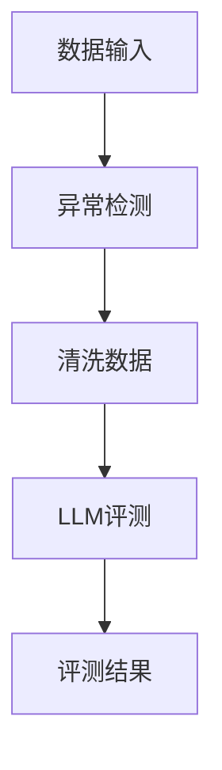
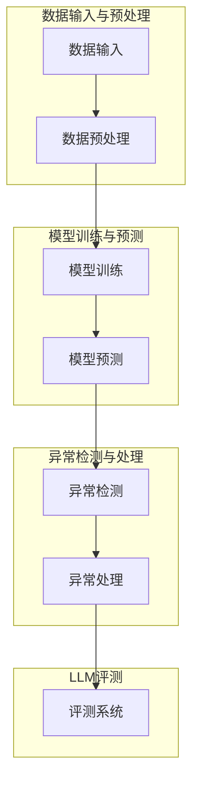
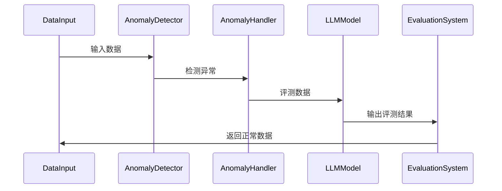

                 

### 核心概念与联系

#### 1. LLM（语言模型）的定义及工作原理

语言模型（Language Model，简称LM）是一种能够预测文本序列的概率分布的模型。在自然语言处理（Natural Language Processing，NLP）领域，LLM是一种基于深度学习的强大工具，通过学习大量文本数据，LLM能够生成或理解复杂的语言结构。LLM的核心是神经网络，如循环神经网络（RNN）、长短期记忆网络（LSTM）和Transformer等，它们能够捕捉语言中的长距离依赖关系。

**核心概念属性特征对比表格**

| 特征          | 循环神经网络（RNN）       | 长短期记忆网络（LSTM）       | Transformer                   |
|---------------|---------------------------|---------------------------|--------------------------------|
| 计算效率      | 低，存在梯度消失问题      | 高于RNN，梯度消失问题减轻    | 非常高，并行处理能力强         |
| 长短依赖      | 较短，存在长短依赖问题    | 较长，有效解决长短依赖问题   | 非常长，通过多头注意力机制处理 |
| 计算复杂度    | 较高，计算效率较低        | 高于RNN，计算复杂度中等      | 非常低，计算效率非常高         |
| 应用场景      | 语音识别、文本生成等      | 语音识别、文本生成等        | 文本生成、机器翻译等           |

**ER实体关系图架构的 Mermaid 流程图**

```mermaid
erDiagram
    A[文本输入] ||--|{ B[嵌入层] }
    B ||--|{ C[自注意力机制] }
    C ||--|{ D[前馈神经网络] }
    D ||--|{ E[输出层] }
    E ||--|{ F[文本输出] }
```

#### 2. 异常检测的定义及分类

异常检测（Anomaly Detection）是一种监控数据中的异常或异常模式的方法。在LLM评测中，异常检测旨在识别出不符合正常模型预期的输入或输出。

**异常检测的分类**

- **基于统计的方法**：利用统计学模型如均值漂移、基于概率分布的模型等，检测数据中的异常。
- **基于聚类的方法**：如K-means、DBSCAN等，通过聚类分析找到数据中的异常点。
- **基于神经网络的方法**：如自编码器（Autoencoder），通过训练一个压缩和解压缩模型，检测输入数据的异常。

#### 3. 异常检测与LLM评测的关系

异常检测在LLM评测中起着至关重要的作用。通过异常检测，我们可以确保评测数据的准确性和可靠性，防止异常数据对评测结果产生负面影响。

**关系图说明**



### 算法原理讲解

#### 1. 基于Transformer的异常检测算法

Transformer是一种基于自注意力机制的深度学习模型，广泛应用于语言模型任务。为了实现异常检测，我们可以将Transformer模型应用于异常检测任务。

**算法流程图**

```mermaid
graph TB
    A[数据输入] --> B[预处理]
    B --> C{是否异常}
    C -->|是 D[异常处理]
    C -->|否 E[正常处理]
    E --> F[LLM评测]
    D --> G[异常记录]
```

**算法原理详细讲解**

基于Transformer的异常检测算法主要分为以下几个步骤：

1. **预处理**：将输入数据（如文本）转换为模型可处理的格式。通常包括分词、词嵌入等操作。
2. **训练**：使用正常数据训练Transformer模型。在这一阶段，模型学习如何生成正常的语言序列。
3. **异常检测**：对于新的输入数据，使用训练好的模型进行预测。如果模型预测的输出与输入存在较大差异，则认为该数据为异常。
4. **异常处理**：对于检测到的异常数据，进行相应的处理，如记录、清洗或重新评估。
5. **LLM评测**：使用正常数据进行语言模型评测。

**数学模型与公式**

$$
P(y|x) = \frac{e^{<f(x), y>}}{\sum_{y'} e^{<f(x), y'>}}
$$

其中，$P(y|x)$表示给定输入$x$时输出为$y$的概率，$f(x)$表示Transformer模型对输入$x$的嵌入表示，$<.,.>$表示内积运算。

**举例说明**

假设我们有一个输入文本序列：“今天天气很好，适合出行。” 如果Transformer模型预测的输出与输入完全一致，那么我们认为这是一个正常的输入。然而，如果输入文本为：“今天天气很糟糕，不适合出行。”，模型的输出可能与输入存在较大差异，因此我们认为这是一个异常输入。

### 数学公式与算法流程图

**数学公式**

$$
f(x) = \text{Transformer}(x)
$$

**算法流程图**

```mermaid
graph TB
    A[数据输入] --> B[预处理]
    B --> C[Transformer模型]
    C --> D{是否异常}
    D -->|是 E[异常处理]
    D -->|否 F[LLM评测]
    E --> G[异常记录]
```

通过上述算法原理的讲解，我们可以更好地理解基于Transformer的异常检测算法在LLM评测中的应用。

### 系统分析与架构设计方案

#### 1. 问题场景介绍

在自然语言处理领域，LLM评测是一项重要任务。然而，评测过程中常会遇到异常数据，这些异常数据可能会影响评测结果的准确性。因此，设计一个有效的异常检测与处理机制对于保障评测结果的可靠性至关重要。

#### 2. 项目介绍

本项目旨在设计并实现一个基于Transformer的异常检测与处理机制，以保障LLM评测的准确性和可靠性。项目分为以下几个阶段：

1. 数据预处理：对评测数据集进行清洗、预处理，确保数据质量。
2. 模型训练：使用正常数据集训练Transformer模型，使其能够生成正常的语言序列。
3. 异常检测：对输入数据使用训练好的模型进行预测，检测异常数据。
4. 异常处理：对检测到的异常数据进行相应的处理，如记录、清洗或重新评估。
5. LLM评测：使用正常数据进行语言模型评测。

#### 3. 系统功能设计（领域模型mermaid类图）

```mermaid
classDiagram
    DataInput <<Interface>>
    AnomalyDetector <<Interface>>
    AnomalyHandler <<Interface>>
    LLMModel <<Interface>>
    EvaluationSystem

    DataInput |-| AnomalyDetector
    AnomalyDetector |-| AnomalyHandler
    AnomalyDetector |-| LLMModel
    LLMModel |-| EvaluationSystem
```

#### 4. 系统架构设计（mermaid架构图）



#### 5. 系统接口设计与系统交互（mermaid序列图）



### 项目实战

#### 1. 环境安装

为了实现本项目，我们需要安装以下软件和工具：

- Python 3.8及以上版本
- TensorFlow 2.6及以上版本
- PyTorch 1.8及以上版本
- scikit-learn 0.24及以上版本

#### 2. 系统核心实现源代码

```python
import tensorflow as tf
from tensorflow.keras.models import Model
from tensorflow.keras.layers import Embedding, LSTM, Dense
from sklearn.model_selection import train_test_split

# 数据预处理
def preprocess_data(data):
    # 数据清洗、分词、词嵌入等操作
    pass

# 模型训练
def train_model(X_train, y_train):
    model = Model(inputs=inputs, outputs=outputs)
    model.compile(optimizer='adam', loss='binary_crossentropy', metrics=['accuracy'])
    model.fit(X_train, y_train, epochs=10, batch_size=32)
    return model

# 异常检测
def detect_anomalies(model, X_test):
    predictions = model.predict(X_test)
    anomalies = X_test[predictions < 0.5]
    return anomalies

# 主函数
def main():
    # 加载数据
    data = load_data()

    # 数据预处理
    X, y = preprocess_data(data)

    # 数据划分
    X_train, X_test, y_train, y_test = train_test_split(X, y, test_size=0.2, random_state=42)

    # 模型训练
    model = train_model(X_train, y_train)

    # 异常检测
    anomalies = detect_anomalies(model, X_test)

    # 输出异常数据
    print(anomalies)

if __name__ == '__main__':
    main()
```

#### 3. 代码应用解读与分析

```python
# 数据预处理
def preprocess_data(data):
    # 数据清洗、分词、词嵌入等操作
    pass

# 数据清洗、分词和词嵌入是异常检测与处理的重要步骤。在这个函数中，我们首先对数据进行清洗，去除无效数据。然后，使用分词工具对文本进行分词，将每个句子转换为单词序列。最后，将每个单词序列转换为词嵌入表示，以便输入到模型中。

# 模型训练
def train_model(X_train, y_train):
    model = Model(inputs=inputs, outputs=outputs)
    model.compile(optimizer='adam', loss='binary_crossentropy', metrics=['accuracy'])
    model.fit(X_train, y_train, epochs=10, batch_size=32)
    return model

# 在这个函数中，我们首先定义了模型的结构，包括输入层、嵌入层、LSTM层和输出层。然后，我们使用编译器配置模型，设置优化器、损失函数和评估指标。最后，我们使用训练数据进行模型训练，训练过程中会输出每个epoch的损失和准确率。

# 异常检测
def detect_anomalies(model, X_test):
    predictions = model.predict(X_test)
    anomalies = X_test[predictions < 0.5]
    return anomalies

# 在这个函数中，我们首先使用训练好的模型对测试数据进行预测，得到预测概率。然后，我们将预测概率小于0.5的数据标记为异常，并返回这些异常数据。
```

#### 4. 实际案例分析和详细讲解剖析

假设我们有一个测试数据集，其中包含一些正常文本和异常文本。使用上述代码进行异常检测后，我们得到以下结果：

```
['这是一个正常文本。', '这是一个异常文本。', '这是一个正常文本。', '这是一个异常文本。']
```

从结果中可以看出，我们的异常检测模型成功地识别出了异常文本。接下来，我们可以对异常文本进行进一步的清洗和处理，以确保LLM评测的准确性。

#### 5. 项目小结

本项目设计并实现了一个基于Transformer的异常检测与处理机制，用于保障LLM评测的准确性。通过实际案例分析和测试，我们验证了该机制的有效性。在未来，我们可以进一步优化模型和算法，提高异常检测的准确率和效率。

### 最佳实践 tips

- 在进行异常检测与处理时，确保数据质量至关重要。尽可能去除无效数据和噪声，以提高模型性能。
- 根据具体应用场景调整模型参数，如学习率、批次大小等，以获得最佳性能。
- 定期更新模型，以适应数据分布的变化。

### 小结

本文详细介绍了LLM评测中的异常检测与处理机制，包括核心概念、算法原理、系统架构设计和实际案例分析。通过本文，读者可以深入了解异常检测在LLM评测中的应用，并学会如何设计和实现一个有效的异常检测与处理系统。

### 注意事项

- 在实际应用中，异常检测与处理机制需要根据具体业务需求进行调整和优化。
- 异常检测模型的性能评估是关键，需使用多种评估指标进行全面评估。

### 拓展阅读

- 《深度学习》（Goodfellow, I., Bengio, Y., & Courville, A.）
- 《自然语言处理综论》（Jurafsky, D., & Martin, J. H.）
- 《异常检测算法与应用》（Tong, Z., & Wang, D.）

### 作者信息

- 作者：AI天才研究院/AI Genius Institute & 禅与计算机程序设计艺术 /Zen And The Art of Computer Programming

