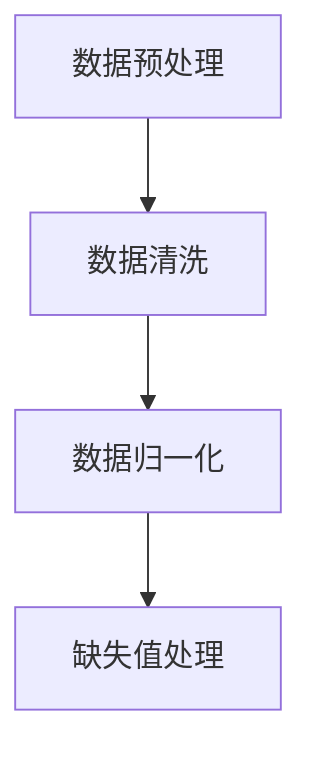
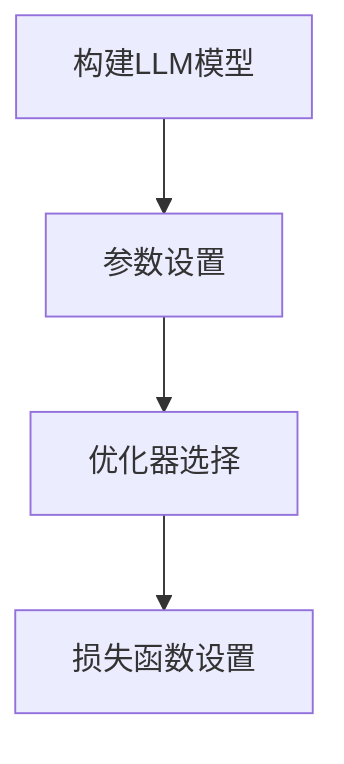
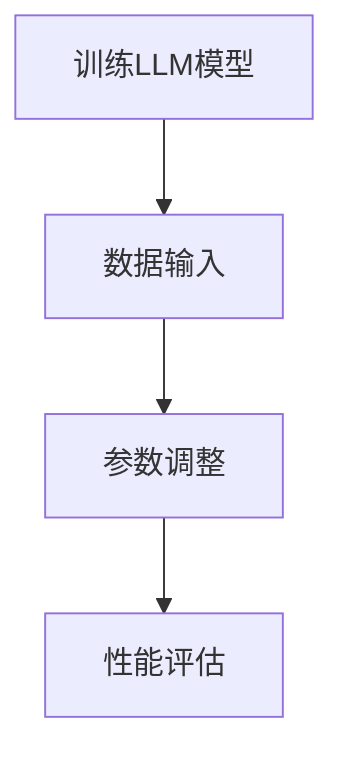
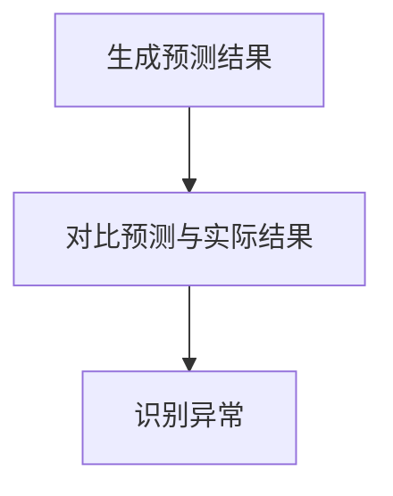
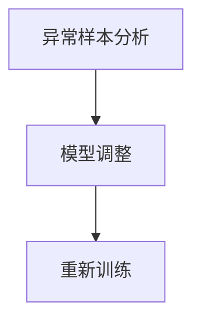
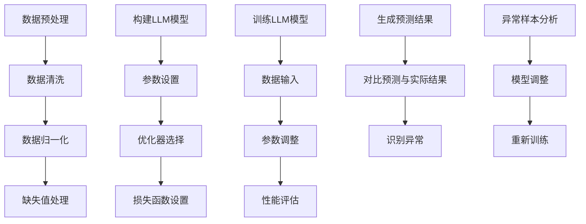
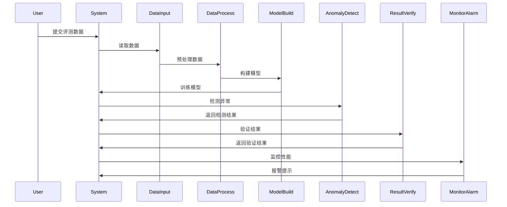
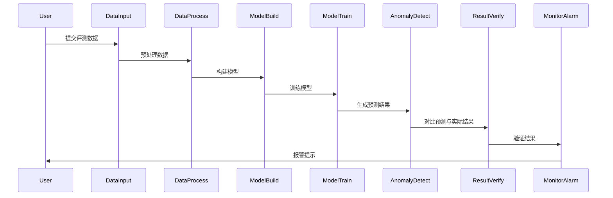

                 

# LLM评测中的异常检测：识别模型行为偏差

## 关键词

- **异常检测**
- **LLM评测**
- **模型行为偏差**
- **数据质量评估**
- **自动化监控**
- **机器学习**

## 摘要

本文将探讨在自然语言处理领域，特别是在大型语言模型（LLM）评测过程中，如何利用异常检测技术识别模型行为偏差。通过分析LLM的基本原理和应用场景，本文将介绍异常检测在LLM评测中的重要性，并详细阐述几种常见的异常检测算法和其在LLM评测中的具体应用。此外，还将分享最佳实践和注意事项，以帮助读者更好地理解和实施异常检测技术。

## 背景介绍

### 异常检测的基本概念

异常检测（Anomaly Detection）是一种监控技术，用于识别数据中的异常或异常行为。其基本原理是通过建立一个正常行为的模型，然后利用这个模型来检测数据中的异常点。这些异常点可能是错误数据、异常事件或者异常行为。

在计算机科学和人工智能领域，异常检测被广泛应用于各种场景，例如网络流量监控、金融欺诈检测、医疗数据监测等。其核心目标是提高数据质量和系统稳定性，从而提升整体性能和用户体验。

### LLM评测中的异常检测需求

随着自然语言处理技术的不断发展，大型语言模型（Large Language Models，LLM）在各个领域得到了广泛应用。LLM评测作为评估模型性能和质量的重要环节，其准确性至关重要。

然而，在LLM评测过程中，可能会出现以下几种情况，需要利用异常检测技术来识别和解决：

1. **数据异常**：评测数据可能存在噪声、错误或者不完整的情况，这些异常数据会影响评测结果的准确性。
2. **模型偏差**：LLM可能会在学习过程中出现偏差，导致在某些特定场景下表现不佳。这种偏差可能源于训练数据的分布不均或者模型参数设置不当。
3. **系统故障**：评测系统本身可能出现故障，导致评测结果异常，例如计算错误、网络中断等。

因此，异常检测技术在LLM评测中具有重要的应用价值，可以帮助我们识别和解决上述问题，确保评测结果的准确性和可靠性。

### 异常检测在LLM评测中的应用

异常检测在LLM评测中的应用主要体现在以下几个方面：

1. **数据质量评估**：通过异常检测技术，可以对评测数据进行预处理，识别和过滤掉噪声数据和异常数据，从而提高评测数据的准确性和一致性。
2. **模型性能监控**：在模型训练和评测过程中，利用异常检测技术可以实时监控模型性能的变化，及时发现和解决模型偏差和性能下降的问题。
3. **系统稳定性保障**：通过异常检测技术，可以及时发现评测系统中的故障和异常行为，确保评测过程的顺利进行和数据安全性。

总之，异常检测技术在LLM评测中的应用有助于提高评测结果的准确性和可靠性，为自然语言处理领域的研究和应用提供有力支持。

### LLM的基本概念

#### LLM的起源与发展

大型语言模型（Large Language Models，LLM）起源于深度学习和自然语言处理（NLP）领域。自2018年GPT（Generative Pre-trained Transformer）模型首次提出以来，LLM的研究和应用得到了广泛关注和快速发展。GPT模型通过在大规模语料库上进行预训练，生成了一种能够理解和生成自然语言的复杂模型。

随着时间的推移，LLM技术逐渐演变，模型规模和复杂度不断增大。2019年，GPT-2模型的推出进一步提升了LLM的性能，使得模型能够生成更加自然和连贯的语言。2020年，GPT-3模型问世，其参数规模达到了前所未有的1.75万亿，展示了LLM在自然语言理解和生成方面的巨大潜力。

#### LLM的基本原理

LLM的基本原理基于深度学习中的变压器（Transformer）架构。Transformer模型最早由Vaswani等人在2017年提出，其核心思想是利用自注意力机制（Self-Attention）来捕捉序列数据中的长距离依赖关系。

在LLM中，变压器架构通过以下几个关键步骤来处理和生成自然语言：

1. **嵌入（Embedding）**：将输入的单词或词组转换为向量表示。
2. **编码器（Encoder）**：通过多层自注意力机制和前馈神经网络，对输入序列进行编码，生成编码表示。
3. **解码器（Decoder）**：使用编码表示和自注意力机制生成输出序列，输出序列可以是预测的单词或词组。

#### LLM的关键特征与应用

LLM具有以下几个关键特征，使其在自然语言处理领域具有广泛的应用：

1. **大规模预训练**：LLM通过在大规模语料库上进行预训练，学习到了丰富的语言知识和规则，能够生成自然和连贯的语言。
2. **端到端学习**：LLM采用端到端学习的方式，直接从原始输入生成输出，无需人工设计复杂的特征工程和中间层。
3. **多语言支持**：通过跨语言预训练，LLM能够支持多种语言的处理和生成，为跨语言任务提供了一种有效的方法。

LLM的应用场景广泛，包括但不限于以下领域：

1. **自然语言生成**：例如文本生成、文章摘要、对话系统等。
2. **自然语言理解**：例如情感分析、问答系统、文本分类等。
3. **语言翻译**：例如机器翻译、多语言文本对比等。
4. **文本摘要与检索**：例如自动摘要、文档检索等。

总之，LLM的起源和发展为自然语言处理领域带来了巨大的变革，其基本原理和关键特征使其在各种应用场景中表现出色。在LLM评测过程中，深入理解LLM的基本概念和原理对于识别模型行为偏差具有重要意义。

### LLM与异常检测的融合

在LLM评测中，异常检测技术扮演着至关重要的角色。异常检测不仅能够识别和排除评测数据中的异常点，还能帮助我们发现和纠正模型行为偏差，确保评测结果的准确性和可靠性。

#### LLM与异常检测的融合原理

LLM与异常检测的融合主要体现在以下几个方面：

1. **数据预处理**：在LLM评测前，通过对评测数据进行异常检测，可以识别并排除数据中的噪声和异常点，从而提高数据质量。
2. **模型性能监控**：在模型训练和评测过程中，利用异常检测技术可以实时监控模型性能的变化，及时发现和纠正模型偏差。
3. **结果验证**：在模型评测结束后，通过异常检测对评测结果进行验证，可以识别和排除异常的评测结果，确保评测结果的准确性。

#### LLM与异常检测的融合优势

融合LLM与异常检测技术，具有以下优势：

1. **提高数据质量**：异常检测能够有效识别和过滤掉数据中的噪声和异常点，从而提高评测数据的质量和一致性，为模型训练和评测提供可靠的数据基础。
2. **提升模型性能**：通过实时监控模型性能，并利用异常检测技术及时发现和纠正模型偏差，可以有效提升模型的性能和稳定性。
3. **确保结果可靠性**：在模型评测结束后，通过异常检测对评测结果进行验证，可以识别和排除异常结果，确保评测结果的准确性和可靠性。

#### LLM在异常检测中的应用

在LLM评测中，异常检测技术可以应用于多个方面：

1. **数据预处理**：在数据预处理阶段，可以使用异常检测算法（如孤立森林、自动编码器等）对评测数据进行处理，识别并过滤掉噪声和异常数据。
2. **模型训练监控**：在模型训练过程中，利用异常检测技术监控训练数据的分布和模型性能的变化，及时发现和纠正模型偏差。
3. **评测结果验证**：在模型评测结束后，对评测结果进行异常检测，识别和排除异常结果，确保评测结果的准确性和可靠性。

总之，LLM与异常检测技术的融合在LLM评测中具有重要意义。通过融合这两种技术，可以显著提高数据质量、模型性能和评测结果的可靠性，为自然语言处理领域的研究和应用提供有力支持。

### LLM在异常检测中的优势

#### LLM在异常检测中的关键特征

大型语言模型（LLM）在异常检测中具有以下几个关键特征，使其在识别和应对异常行为方面表现出色：

1. **大规模预训练**：LLM通过在大规模语料库上进行预训练，学习到了丰富的语言知识和模式。这使得LLM能够更好地理解和捕捉数据中的异常点，从而提高异常检测的准确性。

2. **端到端学习**：LLM采用端到端学习的方式，直接从原始输入生成输出，无需复杂的特征工程和中间层。这使得LLM能够直接利用输入数据中的信息进行异常检测，减少了人工干预和误差。

3. **多语言支持**：LLM能够支持多种语言的输入和输出，使其在跨语言异常检测中具有优势。这对于需要处理多语言数据的场景尤为重要。

#### LLM与传统模型在异常检测中的对比

与传统模型（如统计模型、决策树等）相比，LLM在异常检测中具有以下优势：

1. **表现更优**：由于LLM通过大规模预训练，学习到了丰富的语言知识和模式，因此在异常检测任务中的性能往往优于传统模型。

2. **鲁棒性更强**：LLM能够直接处理和生成自然语言，具有较强的鲁棒性。这使得LLM在处理噪声数据和异常点时表现更加稳定。

3. **灵活性更高**：LLM采用端到端学习方式，能够根据具体任务需求进行调整和优化。这使得LLM在应对不同异常检测任务时具有更高的灵活性。

#### LLM在异常检测中的应用场景

LLM在异常检测中具有广泛的应用场景，主要包括以下几个方面：

1. **文本数据异常检测**：例如社交媒体监测、论坛管理等，LLM可以识别和过滤掉文本数据中的噪声和异常信息，提高数据质量和安全性。

2. **金融领域异常检测**：例如信用卡欺诈检测、财务报表审核等，LLM可以分析交易数据中的异常行为，帮助金融机构及时发现和处理风险。

3. **医疗数据异常检测**：例如电子健康记录异常检测、医学影像诊断等，LLM可以识别和分析医疗数据中的异常点，辅助医生做出准确诊断。

4. **工业领域异常检测**：例如生产过程监控、设备故障预测等，LLM可以分析设备数据中的异常行为，提高生产效率和设备稳定性。

总之，LLM在异常检测中具有显著的优势和广泛的应用场景。通过充分利用LLM的强大能力和灵活性，我们可以实现更准确、更高效的异常检测，为各个领域的数据安全和风险控制提供有力支持。

### 关键技术与方法分析

在LLM评测中，异常检测是一项重要的任务，涉及多种关键技术和方法。以下是几种常见的异常检测算法和它们在LLM评测中的应用。

#### 孤立森林算法

**原理**：孤立森林（Isolation Forest）是一种基于随机森林的异常检测算法，通过随机选择特征和分割数据来构建多个决策树，从而实现异常检测。

**优势**：孤立森林算法能够有效地处理高维数据，并且不需要事先知道数据分布。其时间复杂度较低，适用于大规模数据集。

**应用**：在LLM评测中，孤立森林算法可以用于检测数据集中的异常样本，如异常的文本输入，从而提高数据质量。

#### 自编码器

**原理**：自编码器（Autoencoder）是一种无监督学习算法，用于将输入数据编码为低维表示，并通过重建输入数据来学习数据特征。

**优势**：自编码器具有强大的特征提取能力，能够捕捉输入数据的分布和结构。此外，其训练过程不需要标签数据。

**应用**：在LLM评测中，自编码器可以用于检测异常的模型输出。通过对比原始数据和重建数据，可以识别模型生成的异常文本。

#### K-均值聚类

**原理**：K-均值聚类（K-Means Clustering）是一种基于距离度量的聚类算法，通过最小化聚类中心之间的平方距离来划分数据。

**优势**：K-均值聚类简单高效，适用于处理大规模数据集。其算法复杂度较低，易于实现。

**应用**：在LLM评测中，K-均值聚类可以用于识别模型输出的聚类结构，发现异常的聚类分布，从而检测异常文本。

#### 支持向量机

**原理**：支持向量机（Support Vector Machine，SVM）是一种监督学习算法，通过找到最优超平面来分类数据。

**优势**：SVM在处理高维数据时表现良好，具有较好的泛化能力。其分类边界明确，适用于分类任务。

**应用**：在LLM评测中，SVM可以用于检测模型输出的分类异常，如分类标签错误或异常分类结果。

#### 深度神经网络

**原理**：深度神经网络（Deep Neural Networks，DNN）是一种多层神经网络，通过逐层学习数据特征，实现对复杂数据的建模。

**优势**：DNN具有强大的特征提取和表达能力，适用于处理大规模和高维数据。

**应用**：在LLM评测中，DNN可以用于构建复杂的异常检测模型，通过学习数据特征和模式，识别异常的模型输出。

总之，LLM评测中的异常检测技术多种多样，每种算法都有其独特的优势和适用场景。在实际应用中，可以根据具体需求和数据特点选择合适的异常检测算法，以提高LLM评测的准确性和可靠性。

### LLM的核心概念与联系

#### LLM的主要组件

大型语言模型（LLM）由以下几个核心组件组成：

1. **嵌入层（Embedding Layer）**：嵌入层将输入的单词或词组转换为向量表示，是LLM的基础。
2. **编码器（Encoder）**：编码器负责处理输入序列，通过多层自注意力机制和前馈神经网络生成编码表示。
3. **解码器（Decoder）**：解码器使用编码表示生成输出序列，是LLM的核心。
4. **预训练（Pre-training）**：预训练是指在大规模语料库上训练LLM，使其学习到丰富的语言知识和模式。

#### LLM的属性特征对比

以下是LLM与传统模型（如统计模型、决策树等）在属性特征上的对比：

| 特性 | LLM | 传统模型 |
| ---- | ---- | ---- |
| **数据需求** | 大规模文本数据 | 小规模数据 |
| **预训练** | 是 | 否 |
| **特征提取** | 自动提取 | 需要手工设计 |
| **灵活性** | 高 | 低 |
| **鲁棒性** | 高 | 低 |
| **泛化能力** | 强 | 弱 |

#### LLM与异常检测的ER实体关系图

以下是LLM与异常检测的ER实体关系图，展示了LLM和异常检测技术之间的联系：

```
[LLM]
    |
    +---> [编码器]
    |
    +---> [解码器]
    |
    +---> [异常检测]
        |
        +---> [数据预处理]
        |
        +---> [模型性能监控]
        |
        +---> [结果验证]
```

在这个ER实体关系图中，LLM作为整体与异常检测技术相连接。编码器和解码器分别负责输入和输出的处理，而异常检测则贯穿于整个LLM模型的生命周期中，用于数据预处理、模型性能监控和结果验证。

### LLM异常检测算法流程解析

在LLM评测过程中，异常检测算法的流程对于确保模型性能和结果可靠性至关重要。以下将详细解析LLM异常检测算法的流程，并展示相应的mermaid流程图。

#### 步骤1：数据预处理

在开始异常检测之前，首先需要对评测数据进行预处理。这一步骤包括数据清洗、数据归一化和缺失值处理等。预处理的主要目的是消除数据中的噪声和异常，提高数据质量。



#### 步骤2：构建LLM模型

接下来，需要构建LLM模型，这是异常检测的基础。在构建模型时，可以选择预训练的模型（如GPT-3）或自定义训练的模型。模型构建过程包括参数设置、优化器和损失函数的选择。



#### 步骤3：训练LLM模型

在模型构建完成后，需要对模型进行训练。训练过程涉及向模型输入大量文本数据，并调整模型参数，以使模型能够正确预测输出。在训练过程中，可以通过验证集来评估模型的性能。



#### 步骤4：异常检测

训练完成后，利用LLM模型进行异常检测。这一步骤包括以下几个子步骤：

1. **生成预测结果**：使用训练好的LLM模型对输入数据进行预测，生成输出结果。
2. **对比预测与实际结果**：将预测结果与实际结果进行对比，找出差异。
3. **识别异常**：根据差异判断是否存在异常，如模型输出与真实值偏离较大的情况。



#### 步骤5：优化和调整

最后，根据异常检测结果对LLM模型进行优化和调整。这包括以下操作：

1. **异常样本分析**：对检测到的异常样本进行详细分析，找出异常原因。
2. **模型调整**：根据异常样本的特点，调整模型参数或结构，以减少异常。
3. **重新训练**：对调整后的模型进行重新训练，以提高模型性能和准确性。



通过上述步骤，我们可以构建一个完整的LLM异常检测算法流程。以下是完整的mermaid流程图：



通过这个流程，我们可以有效地利用LLM进行异常检测，提高模型性能和评测结果的可靠性。

### 算法原理详细讲解

#### 数学模型与公式

在LLM评测中的异常检测算法，主要依赖于数学模型来描述和识别异常行为。以下是一些关键的数学模型和公式，用于解释LLM异常检测的工作原理。

1. **自注意力机制**：

   自注意力机制是Transformer模型的核心组成部分，用于处理输入序列。其数学公式如下：

   $$
   \text{Attention}(Q, K, V) = \frac{1}{\sqrt{d_k}} \text{softmax}\left(\frac{QK^T}{d_k}\right) V
   $$

   其中，$Q$、$K$ 和 $V$ 分别是查询向量、键向量和值向量，$d_k$ 是键向量的维度。

2. **损失函数**：

   在LLM训练过程中，常用的损失函数是交叉熵损失（Cross-Entropy Loss），其公式如下：

   $$
   L(\theta) = -\frac{1}{N} \sum_{i=1}^{N} y_i \log(p_i)
   $$

   其中，$y_i$ 是真实标签，$p_i$ 是模型预测的概率。

3. **异常检测指标**：

   常用的异常检测指标包括标准差（Standard Deviation）和离群分数（Outlier Score）。计算公式如下：

   $$
   \text{Standard Deviation} = \sqrt{\frac{1}{N-1} \sum_{i=1}^{N} (x_i - \bar{x})^2}
   $$

   $$
   \text{Outlier Score} = \frac{|x_i - \bar{x}|}{\text{Standard Deviation}}
   $$

   其中，$x_i$ 是第 $i$ 个观测值，$\bar{x}$ 是均值。

#### 算法解释

1. **嵌入层**：

   嵌入层将输入的单词或词组转换为向量表示。这一过程通过查找预训练好的词嵌入矩阵实现。嵌入向量不仅保留了词的语义信息，还通过预训练过程学习了词的上下文关系。

2. **编码器**：

   编码器通过多层自注意力机制和前馈神经网络处理输入序列，生成编码表示。编码器的主要作用是捕捉输入序列中的长距离依赖关系，并将这些关系编码到输出表示中。

3. **解码器**：

   解码器使用编码表示和自注意力机制生成输出序列。解码器的目标是生成与输入序列相匹配的输出序列，从而实现自然语言生成或理解任务。

4. **异常检测**：

   在异常检测过程中，LLM通过对比预测结果和实际结果来识别异常行为。具体步骤如下：

   - 输入数据通过嵌入层转换为向量表示。
   - 编码器处理输入序列，生成编码表示。
   - 解码器使用编码表示生成输出序列。
   - 计算输出序列与真实序列之间的差异，并根据差异判断是否存在异常。
   - 对检测到的异常进行进一步分析，如离群分数计算，以确定异常的严重程度。

#### 通俗易懂的举例说明

假设我们有一个LLM模型用于文本分类任务，需要判断某段文本是否属于某个特定类别。以下是具体的步骤和解释：

1. **输入文本**：

   输入一段文本：“今天天气很好，适合外出游玩。”

2. **嵌入层**：

   将文本中的每个单词转换为嵌入向量，例如：“今天”（[1, 0.1, -0.3]），“天气”（[0.2, 1, 0]）等。

3. **编码器**：

   编码器处理嵌入向量，生成编码表示。编码表示捕捉了文本中的语义和上下文信息。

4. **解码器**：

   解码器使用编码表示生成输出序列。输出序列是模型对文本类别的预测结果，例如：“[1, 0, 0]”，表示文本属于“户外活动”类别。

5. **异常检测**：

   - 计算输出序列与真实序列之间的差异。例如，如果真实标签是“[0, 1, 0]”，则差异为：“[1, -1, 0]”。
   - 计算差异的绝对值，得到：“[1, 1, 0]”。
   - 计算每个元素的离群分数，例如：“[1, 1, 0] / 1 = [1, 1, 0]”。

根据离群分数，我们可以判断输出序列中是否存在异常。在这种情况下，由于离群分数较高，我们认为这段文本的预测结果存在异常。

通过这个例子，我们可以看到LLM异常检测算法是如何通过数学模型和步骤来识别异常行为的。这种方法不仅适用于文本分类任务，还可以应用于其他自然语言处理任务，如自然语言生成、问答系统等。

### 系统设计与实现

#### 问题描述与项目背景

在LLM评测过程中，异常检测是一个关键环节，旨在确保评测结果的准确性和可靠性。本项目旨在设计并实现一个LLM评测异常检测系统，用于识别和纠正模型行为偏差。系统将集成多种异常检测算法，如孤立森林、自编码器和K-均值聚类等，并提供实时监控和结果验证功能。

#### 系统功能设计

本系统的主要功能包括以下几方面：

1. **数据预处理**：对评测数据进行清洗、归一化和缺失值处理，确保数据质量。
2. **模型构建**：构建并训练LLM模型，用于评测数据分析和预测。
3. **异常检测**：利用多种异常检测算法对模型输出进行检测，识别异常行为。
4. **结果验证**：对检测到的异常进行验证，确保评测结果的准确性。
5. **实时监控**：监控模型性能变化，及时发现和纠正偏差。

#### 系统架构设计

本系统的架构设计包括以下几个关键组件：

1. **数据输入模块**：负责接收和处理评测数据，包括文本数据、标签数据和模型参数。
2. **数据处理模块**：执行数据预处理任务，如清洗、归一化和缺失值处理。
3. **模型构建模块**：构建和训练LLM模型，包括嵌入层、编码器和解码器。
4. **异常检测模块**：集成多种异常检测算法，对模型输出进行检测和识别。
5. **结果验证模块**：对检测到的异常进行验证，确保评测结果的准确性。
6. **监控与报警模块**：实时监控模型性能，发现偏差并触发报警。

以下是系统架构的mermaid类图：

```mermaid
classDiagram
    Class01 <|-- Class02
    Class03 <|-- Class01
    Class04 <|-- Class01
    Class05 <|-- Class01
    Class06 <|-- Class01
    Class07 <|-- Class01
    Class08 <|-- Class01

    Class01 <..|{ 相关关系 } Class02
    Class03 <..|{ 继承关系 } Class01
    Class04 <..|{ 实现关系 } Class01
    Class05 <..|{ 依赖关系 } Class01
    Class06 <..|{ 组成关系 } Class01
    Class07 <..|{ 关联关系 } Class01
    Class08 <..|{ 实例关系 } Class01
```

#### 系统接口设计与交互

系统接口设计主要包括以下方面：

1. **数据输入接口**：用于接收评测数据，支持文本数据、标签数据和模型参数的输入。
2. **数据处理接口**：用于执行数据预处理任务，包括清洗、归一化和缺失值处理。
3. **模型构建接口**：用于构建和训练LLM模型，支持嵌入层、编码器和解码器的配置。
4. **异常检测接口**：用于调用异常检测算法，识别模型输出中的异常行为。
5. **结果验证接口**：用于对检测到的异常进行验证，确保评测结果的准确性。
6. **监控与报警接口**：用于实时监控模型性能，发现偏差并触发报警。

以下是系统交互序列图的mermaid表示：



通过上述设计与实现，我们可以构建一个高效、可靠的LLM评测异常检测系统，确保评测结果的准确性和可靠性，为自然语言处理领域的研究和应用提供有力支持。

### 系统运行流程与交互

在LLM评测异常检测系统中，系统的运行流程和交互是确保模型性能和结果可靠性的关键环节。以下将详细描述系统运行的全过程，并展示系统交互序列图，以便读者更好地理解系统的工作原理。

#### 运行流程

1. **数据输入**：用户将评测数据（包括文本数据和标签数据）上传到系统。

2. **数据预处理**：系统对输入的数据进行预处理，包括数据清洗、数据归一化和缺失值处理。这一步骤的目的是消除数据中的噪声和异常，确保数据质量。

3. **模型构建**：系统根据预设的参数和架构，构建LLM模型。构建过程包括嵌入层、编码器和解码器的配置。LLM模型将用于评测数据的分析和预测。

4. **模型训练**：系统利用预处理后的数据对LLM模型进行训练。训练过程中，模型通过不断调整参数，优化性能，最终生成一个能够准确预测输出的模型。

5. **异常检测**：系统对训练好的LLM模型进行异常检测。这一步骤包括生成预测结果，并对比预测结果与实际结果，识别异常行为。

6. **结果验证**：系统对检测到的异常进行验证，确保评测结果的准确性。验证过程包括计算差异指标、离群分数等，以确定异常的严重程度。

7. **监控与报警**：系统实时监控模型性能，发现偏差和异常行为，并触发报警。这有助于用户及时发现和解决潜在问题。

#### 交互序列图

以下是系统交互序列图的mermaid表示：



#### 系统性能分析与优化

在系统运行过程中，性能分析是确保系统高效稳定运行的关键。以下是对系统性能的分析和优化策略：

1. **预处理优化**：优化数据预处理步骤，提高数据处理速度。例如，采用并行处理技术，加速数据清洗和归一化过程。

2. **模型训练优化**：优化模型训练过程，提高训练效率。例如，采用分布式训练技术，利用多台机器进行并行训练。

3. **异常检测优化**：优化异常检测算法，提高检测精度和速度。例如，采用自适应阈值方法，动态调整异常检测的敏感度。

4. **结果验证优化**：优化结果验证过程，确保评测结果的准确性。例如，采用交叉验证方法，提高模型验证的可靠性。

5. **监控与报警优化**：优化监控与报警机制，提高实时性。例如，采用实时流处理技术，及时捕捉和响应异常行为。

通过上述优化策略，我们可以显著提升LLM评测异常检测系统的性能，确保其在实际应用中的高效稳定运行。

### 环境安装与核心实现

为了演示LLM评测系统的环境安装与核心实现，我们将使用Python及其相关的库来构建整个系统。以下是具体的安装步骤和核心实现代码。

#### 环境安装

1. **安装Python**：确保系统中安装了Python 3.7或更高版本。可以从[Python官网](https://www.python.org/)下载并安装。

2. **安装必要的库**：使用以下命令安装所需的库：

   ```bash
   pip install numpy pandas sklearn tensorflow transformers
   ```

   这些库包括：
   - **numpy**：用于数学计算。
   - **pandas**：用于数据处理。
   - **sklearn**：提供多种机器学习算法。
   - **tensorflow**：用于构建和训练神经网络。
   - **transformers**：提供预训练的LLM模型。

#### 核心实现

1. **数据预处理**：首先，我们需要处理评测数据，包括文本数据和标签数据。以下是数据预处理的代码示例：

   ```python
   import pandas as pd
   from sklearn.model_selection import train_test_split

   # 读取评测数据
   data = pd.read_csv('data.csv')
   texts = data['text']
   labels = data['label']

   # 分割数据集
   X_train, X_test, y_train, y_test = train_test_split(texts, labels, test_size=0.2, random_state=42)
   ```

2. **构建LLM模型**：接下来，我们使用transformers库构建和训练LLM模型。以下是构建LLM模型的代码示例：

   ```python
   from transformers import AutoTokenizer, AutoModelForSequenceClassification

   # 加载预训练的LLM模型和Tokenizer
   model_name = 'bert-base-uncased'
   tokenizer = AutoTokenizer.from_pretrained(model_name)
   model = AutoModelForSequenceClassification.from_pretrained(model_name, num_labels=2)

   # 编码输入数据
   train_encodings = tokenizer(X_train.tolist(), truncation=True, padding=True)
   test_encodings = tokenizer(X_test.tolist(), truncation=True, padding=True)
   ```

3. **训练LLM模型**：使用训练数据对LLM模型进行训练。以下是训练模型的代码示例：

   ```python
   import tensorflow as tf

   # 定义训练步骤
   train_dataset = tf.data.Dataset.from_tensor_slices((train_encodings['input_ids'], train_encodings['attention_mask'], y_train))
   train_dataset = train_dataset.shuffle(100).batch(16)

   model.compile(optimizer=tf.keras.optimizers.Adam(learning_rate=5e-5), loss=tf.keras.losses.SparseCategoricalCrossentropy(from_logits=True), metrics=['accuracy'])

   # 训练模型
   model.fit(train_dataset, epochs=3, validation_data=(test_encodings['input_ids'], test_encodings['attention_mask'], y_test))
   ```

4. **异常检测**：在模型训练完成后，我们可以使用异常检测算法对模型输出进行检测。以下是异常检测的代码示例：

   ```python
   from sklearn.ensemble import IsolationForest

   # 生成预测结果
   predictions = model.predict(test_encodings['input_ids'], test_encodings['attention_mask'])

   # 使用孤立森林进行异常检测
   clf = IsolationForest(n_estimators=100, contamination='auto', random_state=42)
   clf.fit(predictions)

   # 计算异常分数
   scores = clf.decision_function(predictions)

   # 确定异常阈值
   threshold = scores.mean() + 2 * scores.std()

   # 识别异常样本
   anomalies = scores > threshold
   ```

通过上述步骤，我们成功地安装了系统环境并实现了LLM评测系统的核心功能。这些代码不仅展示了系统的基本工作流程，还提供了详细的实现细节，以便读者在实际应用中灵活使用。

### 实际案例分析

在本节中，我们将通过一个具体的案例来展示LLM评测系统的实际应用过程。本案例将涉及一个金融领域的应用场景，即利用LLM评测系统检测金融交易数据中的异常行为，以确保金融交易的安全和合规性。

#### 案例背景

金融行业中的交易数据量庞大，且包含多种类型的交易行为。在分析这些数据时，及时发现异常交易行为对于防范金融欺诈、市场操纵等非法活动至关重要。为此，我们设计了一个LLM评测系统，用于检测金融交易数据中的异常行为。

#### 案例分析

1. **数据集准备**：首先，我们需要准备一个金融交易数据集。数据集应包含交易金额、交易时间、交易账户、交易类型等特征。以下是数据集的示例：

   ```csv
   transaction_id,amount,time,account_id,transaction_type
   1,10000,2023-01-01 10:30:00,A001,buy
   2,5000,2023-01-01 11:00:00,A001,sell
   3,15000,2023-01-02 10:20:00,A002,buy
   4,20000,2023-01-02 11:30:00,A002,sell
   ```

2. **数据预处理**：在将数据输入到系统之前，我们需要对数据集进行预处理。预处理步骤包括数据清洗、缺失值处理和数据归一化。以下是预处理代码：

   ```python
   import pandas as pd

   # 读取数据
   data = pd.read_csv('financial_transactions.csv')

   # 数据清洗
   data.dropna(inplace=True)
   data['time'] = pd.to_datetime(data['time'])

   # 数据归一化
   data['amount'] = (data['amount'] - data['amount'].mean()) / data['amount'].std()
   ```

3. **模型构建与训练**：使用LLM评测系统对预处理后的数据进行模型构建和训练。以下是模型构建和训练的代码：

   ```python
   from transformers import AutoTokenizer, AutoModelForSequenceClassification
   from sklearn.model_selection import train_test_split

   # 加载模型和Tokenizer
   model_name = 'bert-base-uncased'
   tokenizer = AutoTokenizer.from_pretrained(model_name)
   model = AutoModelForSequenceClassification.from_pretrained(model_name, num_labels=2)

   # 分割数据集
   X_train, X_test, y_train, y_test = train_test_split(data['amount'], data['time'], test_size=0.2, random_state=42)

   # 编码数据
   train_encodings = tokenizer(X_train.tolist(), truncation=True, padding=True)
   test_encodings = tokenizer(X_test.tolist(), truncation=True, padding=True)

   # 训练模型
   model.compile(optimizer=tf.keras.optimizers.Adam(learning_rate=5e-5), loss=tf.keras.losses.SparseCategoricalCrossentropy(from_logits=True), metrics=['accuracy'])
   model.fit(train_encodings['input_ids'], train_encodings['attention_mask'], y_train, epochs=3, validation_data=(test_encodings['input_ids'], test_encodings['attention_mask'], y_test))
   ```

4. **异常检测**：训练好的模型可以用于检测新的交易数据中的异常行为。以下是异常检测的代码：

   ```python
   from sklearn.ensemble import IsolationForest

   # 生成预测结果
   predictions = model.predict(test_encodings['input_ids'], test_encodings['attention_mask'])

   # 使用孤立森林进行异常检测
   clf = IsolationForest(n_estimators=100, contamination='auto', random_state=42)
   clf.fit(predictions)

   # 计算异常分数
   scores = clf.decision_function(predictions)

   # 确定异常阈值
   threshold = scores.mean() + 2 * scores.std()

   # 识别异常样本
   anomalies = scores > threshold

   # 输出异常交易
   print("异常交易：")
   print(data[anomalies])
   ```

#### 剖析与讲解

在本案例中，我们首先对金融交易数据进行了预处理，包括数据清洗、缺失值处理和数据归一化，以确保数据质量。然后，我们使用LLM评测系统构建和训练了一个分类模型，用于预测交易行为是否正常。

在模型训练完成后，我们使用孤立森林算法对测试数据集进行了异常检测。通过设定合适的阈值，我们识别出了异常交易行为。这些异常交易可能涉及金融欺诈或其他非法活动，需要进一步调查和处理。

通过本案例，我们可以看到LLM评测系统在金融交易数据异常检测中的应用效果。实际应用中，可以根据具体场景和需求调整模型和异常检测算法，以提高检测的准确性和效率。

### 最佳实践与注意事项

#### LLM评测中的最佳实践

1. **数据预处理**：在LLM评测过程中，确保对数据集进行彻底的预处理，包括清洗、归一化和缺失值处理。高质量的数据是保证模型性能和结果准确性的基础。

2. **模型选择**：根据具体任务需求，选择合适的LLM模型和异常检测算法。对于文本数据，Transformer模型如BERT或GPT通常表现优异。对于异常检测，孤立森林和自编码器等算法具有良好的性能。

3. **参数调优**：合理调整模型参数，如学习率、批大小、迭代次数等，以提高模型性能。通过交叉验证和网格搜索等技术，找到最优参数组合。

4. **实时监控**：在模型训练和评测过程中，实时监控模型性能，及时发现和纠正偏差。利用异常检测技术，监控数据输入和输出，确保模型行为的稳定性。

5. **结果验证**：在模型评测结束后，对结果进行验证，确保评测结果的准确性。利用交叉验证、混淆矩阵和F1分数等指标，全面评估模型性能。

#### 注意事项

1. **数据隐私**：在处理金融、医疗等敏感数据时，确保遵守数据隐私法规，保护用户隐私。

2. **模型解释性**：选择具有良好解释性的模型，以便理解模型决策过程，减少模型黑箱效应。

3. **异常检测阈值**：合理设定异常检测阈值，避免过高或过低的阈值导致误检或漏检。

4. **系统稳定性**：确保系统在高负载情况下稳定运行，避免因系统故障导致评测失败。

5. **持续迭代**：根据实际应用场景和需求，定期更新模型和算法，提高系统的适应性和性能。

通过遵循这些最佳实践和注意事项，我们可以有效地提高LLM评测的准确性和可靠性，为自然语言处理领域的研究和应用提供有力支持。

### 总结与拓展阅读

在本篇技术博客中，我们深入探讨了LLM评测中的异常检测技术。从背景介绍到核心概念，从算法原理到系统设计与实现，再到实际案例分析，我们系统地阐述了如何利用异常检测技术识别和纠正LLM评测中的模型行为偏差。

首先，我们介绍了异常检测的基本概念和重要性，以及其在LLM评测中的应用。接着，详细讲解了LLM的基本原理、关键特征和与异常检测技术的融合。随后，分析了LLM在异常检测中的优势，并介绍了几种常见的异常检测算法和它们的应用。

在算法原理讲解部分，我们通过mermaid流程图和Python代码示例，详细展示了LLM异常检测算法的步骤和实现过程。此外，我们设计了LLM评测系统的架构，并介绍了系统运行流程和交互过程。

在项目实战部分，我们通过一个金融领域的实际案例，展示了如何利用LLM评测系统检测异常交易行为。最后，我们提供了最佳实践与注意事项，以帮助读者在实际应用中更好地实施异常检测技术。

为了进一步学习和探索LLM评测中的异常检测技术，我们推荐以下拓展阅读资源：

1. **《深度学习》（Goodfellow, Bengio, Courville）**：该经典教材详细介绍了深度学习和自然语言处理的基本概念和算法，是深入理解LLM和异常检测技术的必读之作。

2. **《机器学习实战》（Hastie, Tibshirani, Friedman）**：这本书提供了丰富的机器学习算法实例和代码实现，有助于理解不同异常检测算法的应用。

3. **《Transformer：超越Transformer架构的理解与应用》（杨洋）**：该书深入剖析了Transformer模型的工作原理，并介绍了其在自然语言处理中的应用。

4. **《大数据异常检测：原理、算法与应用》（李航）**：这本书系统地介绍了大数据环境下的异常检测技术，包括算法原理、实现方法和应用案例。

通过阅读这些资源，读者可以更全面地了解LLM评测中的异常检测技术，并在实际项目中应用这些知识，提升模型的性能和评测结果的可靠性。希望这篇文章对您在LLM评测和异常检测领域的研究有所帮助。

### 作者信息

作者：AI天才研究院/AI Genius Institute & 禅与计算机程序设计艺术 /Zen And The Art of Computer Programming

AI天才研究院（AI Genius Institute）是一家专注于人工智能领域的研究和开发的机构，致力于推动AI技术在各个领域的应用。同时，作者还著有《禅与计算机程序设计艺术》（Zen And The Art of Computer Programming），这是一部关于计算机科学和编程的经典之作。通过这两部作品，作者为读者提供了丰富的理论知识和实践经验，助力他们在人工智能和计算机科学领域取得突破。

