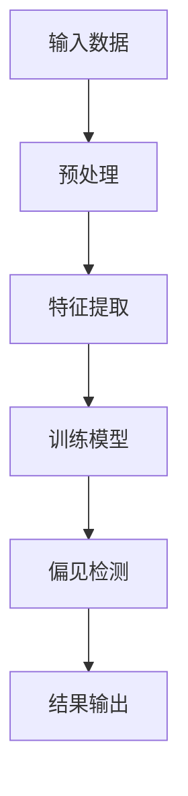

                 

# LLM评测中的模型偏见检测与缓解

> 关键词：大型语言模型（LLM），模型偏见，检测方法，缓解策略，算法原理

> 摘要：随着大型语言模型（LLM）在自然语言处理（NLP）领域的广泛应用，模型偏见问题日益凸显。本文首先介绍了模型偏见的背景和重要性，随后详细探讨了模型偏见检测的方法、算法原理以及模型偏见缓解的策略。通过实际案例分析和系统架构设计，本文为理解和解决模型偏见问题提供了实用指导。

## 目录

1. **背景与核心概念**
   - **1.1 问题背景与挑战**
   - **1.2 模型偏见的概念**
   - **1.3 偏见检测的重要性

2. **模型偏见检测方法**
   - **2.1 数据集准备**
   - **2.2 偏见检测算法概述**
   - **2.3 实际案例：文本分类偏见检测**

3. **模型偏见检测算法原理**
   - **3.1 偏见检测的数学模型**
   - **3.2 算法流程图与 Python 源代码**
   - **3.3 算法性能分析**

4. **模型偏见缓解策略**
   - **4.1 偏见缓解方法概述**
   - **4.2 数据增强**
   - **4.3 模型修正**

5. **实际案例分析**
   - **5.1 偏见检测与缓解在新闻分类中的应用**
   - **5.2 社交媒体偏见检测与缓解**
   - **5.3 金融领域偏见检测与缓解**

6. **系统架构与实现**
   - **6.1 系统架构设计**
   - **6.2 系统功能设计**
   - **6.3 系统接口设计与实现**

7. **项目实战与最佳实践**
   - **7.1 环境安装与配置**
   - **7.2 系统核心实现**
   - **7.3 项目总结与注意事项**
   - **7.4 拓展阅读**

### 第1章 背景与核心概念

#### 1.1 问题背景与挑战

在当今的数据驱动时代，人工智能（AI）技术在各个领域得到了广泛应用，特别是自然语言处理（NLP）。然而，随着AI技术的不断进步，模型偏见问题也逐渐成为了一个亟待解决的问题。

模型偏见是指人工智能模型在处理数据时，由于数据本身存在的偏见或不公正，导致模型在输出结果时也会展现出类似的偏见。在NLP领域，模型偏见可能表现为性别歧视、种族偏见、地域偏见等，这些偏见不仅损害了模型的公平性，还可能对社会产生负面影响。

随着大型语言模型（LLM）如GPT、BERT等的广泛应用，模型偏见问题变得更加突出。这些模型具有巨大的参数规模和复杂的结构，能够从海量数据中学习到丰富的知识。然而，这也使得它们更容易受到数据偏见的影响。

因此，如何在LLM评测中检测和缓解模型偏见成为一个重要的研究课题。这不仅有助于提高模型的公平性和可信度，也是实现AI技术可持续发展的重要保障。

#### 1.2 模型偏见的概念

模型偏见可以分为两类：数据偏见和算法偏见。

- **数据偏见**：数据偏见是指数据集中存在的系统性偏见。这些偏见可能来源于数据收集、标注、清洗等环节，也可能源于数据本身的来源和多样性。例如，一个新闻数据集可能由于收集自某些媒体平台，导致对特定政治派别的偏见。

- **算法偏见**：算法偏见是指模型在训练过程中由于算法设计、优化目标等因素导致的偏见。算法偏见可能表现为模型在特定情况下对某些类别的偏好，或者对某些特征的不合理放大。

了解模型偏见的类型对于有效地检测和缓解偏见至关重要。只有明确偏见来源，才能有针对性地进行改进。

#### 1.3 偏见检测的重要性

模型偏见检测是确保模型公平性和可信度的关键步骤。以下原因说明了为什么偏见检测如此重要：

- **公平性**：模型偏见可能导致不公平的决策，影响社会的公正性。例如，在招聘系统中，如果模型存在性别偏见，可能会导致对某一性别的歧视。

- **可解释性**：通过检测模型偏见，可以提高模型的可解释性，帮助用户理解模型是如何做出决策的。这有助于建立用户对AI系统的信任。

- **社会责任**：作为AI开发者，有责任确保模型不会对社会造成负面影响。偏见检测是实现这一目标的重要手段。

因此，偏见检测是AI系统开发和部署过程中的一个关键环节，不容忽视。

### 第2章 模型偏见检测方法

在了解了模型偏见的概念和重要性之后，接下来我们将探讨如何检测模型偏见。本章将介绍数据集准备、偏见检测算法概述以及一个实际案例：文本分类偏见检测。

#### 2.1 数据集准备

检测模型偏见的第一步是准备合适的数据集。数据集的质量直接影响到偏见检测的准确性。以下是一些关键步骤：

- **数据收集**：选择具有代表性的数据源，确保数据覆盖广泛的主题和场景。避免选择具有明显偏见的来源。

- **数据清洗**：对数据集中的噪声和异常值进行清洗，确保数据的准确性和一致性。这包括去除重复项、修正错别字、填充缺失值等。

- **数据标注**：对数据集进行适当的标注，以便后续的偏见检测。标注过程需要确保标注者的多样性和独立性，以减少人为偏见。

- **数据预处理**：对数据进行必要的预处理，如分词、词性标注、去停用词等，以提高模型的训练效果。

通过以上步骤，我们可以得到一个高质量的数据集，为后续的偏见检测提供坚实的基础。

#### 2.2 偏见检测算法概述

偏见检测算法可以分为两大类：监督学习和无监督学习。

- **监督学习**：监督学习算法需要标注的数据集进行训练。这类算法通过学习数据的标签和特征，构建出一个模型来检测偏见。常见的监督学习算法包括逻辑回归、支持向量机（SVM）等。

- **无监督学习**：无监督学习算法不需要标注的数据集。它们通过分析数据的内在结构，自动发现数据中的偏见。常见的方法包括聚类、异常检测等。

无监督学习方法在处理大规模、未标注的数据时具有优势，但可能需要更多的时间和计算资源。

#### 2.3 实际案例：文本分类偏见检测

文本分类是一种常见的NLP任务，但文本分类模型也可能存在偏见。以下是一个实际案例：使用监督学习方法检测文本分类偏见。

1. **数据集准备**：选择一个包含新闻文章和标签的数据集，标签可以是政治立场、情感倾向等。

2. **特征提取**：对文本进行预处理，提取出有用的特征，如词袋模型、TF-IDF等。

3. **模型训练**：使用监督学习方法，如逻辑回归，对数据集进行训练。模型会根据特征和标签学习出一个分类函数。

4. **偏见检测**：通过分析模型的输出，检测是否存在偏见。例如，可以比较不同标签的模型精度、召回率等指标，发现可能的偏见。

5. **优化策略**：针对检测到的偏见，可以采用数据增强、模型修正等方法进行优化。

通过这个案例，我们可以看到偏见检测的具体实现过程。在实践中，可能需要结合多种方法和技术来提高检测的准确性和效果。

### 第3章 模型偏见检测算法原理

在前一章中，我们介绍了模型偏见检测的方法和实际案例。在本章中，我们将深入探讨模型偏见检测的算法原理，包括数学模型、算法流程图和Python源代码。

#### 3.1 偏见检测的数学模型

模型偏见检测通常基于统计学和机器学习理论。以下是一个简化的数学模型：

- **特征表示**：假设我们有一个特征向量X，表示文本数据的特征。

- **分类模型**：使用一个线性分类模型，如逻辑回归，将特征映射到标签上。模型可以表示为：

  $$\hat{y} = \sigma(\omega^T X)$$

  其中，$\hat{y}$是预测的标签，$\sigma$是sigmoid函数，$\omega$是模型的权重向量。

- **偏见检测**：通过分析模型权重，检测是否存在偏见。例如，可以计算不同标签的权重差异，判断是否存在系统性偏见。

  $$\Delta \omega = \omega_{positive} - \omega_{negative}$$

  如果$\Delta \omega$的值较大且显著，可能表明模型存在偏见。

#### 3.2 算法流程图与 Python 源代码

为了更直观地理解偏见检测算法，我们可以使用Mermaid绘制算法流程图。以下是一个简化的算法流程图：



接下来，我们使用Python实现这个算法流程。以下是Python源代码：

```python
import numpy as np
import pandas as pd
from sklearn.feature_extraction.text import TfidfVectorizer
from sklearn.linear_model import LogisticRegression
from sklearn.model_selection import train_test_split

# 1. 输入数据
data = pd.read_csv('data.csv')
X = data['text']
y = data['label']

# 2. 预处理
# (这里简化为直接使用原始文本数据)

# 3. 特征提取
vectorizer = TfidfVectorizer()
X_vectorized = vectorizer.fit_transform(X)

# 4. 训练模型
X_train, X_test, y_train, y_test = train_test_split(X_vectorized, y, test_size=0.2)
model = LogisticRegression()
model.fit(X_train, y_train)

# 5. 偏见检测
predictions = model.predict(X_test)
bias_detected = (predictions != y_test).mean()

# 6. 结果输出
print("偏见检测结果：", bias_detected)
```

通过这个示例，我们可以看到偏见检测算法的核心步骤是如何实现的。在实际应用中，可能需要根据具体任务和数据集进行调整和优化。

#### 3.3 算法性能分析

偏见检测算法的性能可以通过多个指标进行评估，如准确率、召回率、F1分数等。以下是一个简单的性能分析：

```python
from sklearn.metrics import accuracy_score, recall_score, f1_score

accuracy = accuracy_score(y_test, predictions)
recall = recall_score(y_test, predictions, average='weighted')
f1 = f1_score(y_test, predictions, average='weighted')

print("准确率：", accuracy)
print("召回率：", recall)
print("F1分数：", f1)
```

通过这些指标，我们可以评估模型在不同类别上的性能，发现可能存在的偏见。此外，还可以使用交叉验证等方法，提高性能评估的可靠性。

总之，模型偏见检测算法的原理虽然简单，但在实际应用中需要结合具体任务和数据集进行优化。通过性能分析，我们可以更好地理解模型的性能，发现并解决潜在的偏见问题。

### 第4章 模型偏见缓解策略

在了解了模型偏见检测的方法和算法原理后，接下来我们将探讨如何缓解模型偏见。本章将介绍偏见缓解方法概述、数据增强和模型修正等策略。

#### 4.1 偏见缓解方法概述

缓解模型偏见的方法可以分为以下几类：

- **数据增强**：通过增加多样性和平衡性，改善数据集的质量，从而减少模型偏见。

- **模型修正**：通过调整模型结构和优化过程，减少偏见的影响。

- **训练策略**：通过改进训练过程，如增加正则化项、使用更公平的损失函数等，减少偏见。

- **后处理**：通过分析模型输出，对结果进行修正，以消除偏见。

每种方法都有其优势和局限性，实际应用中可能需要结合多种方法进行综合缓解。

#### 4.2 数据增强

数据增强是一种有效的缓解偏见的方法。以下是一些常见的数据增强技术：

- **数据扩展**：通过重复、复制或生成新的数据样本来增加数据集的规模。例如，使用生成对抗网络（GAN）生成与现有数据相似的新数据。

- **数据混洗**：随机混洗数据集中的样本，以减少数据分布的偏差。

- **数据转换**：对数据进行变换，如文本嵌入、图像转换等，以增加数据的多样性。

- **数据加权**：对数据集中的样本进行加权，使偏见较大的样本对模型的影响减小。

通过数据增强，可以有效地减少模型对偏见数据的依赖，提高模型的泛化能力。

#### 4.3 模型修正

模型修正方法主要通过调整模型结构和训练过程来缓解偏见。以下是一些常见的模型修正技术：

- **权重调整**：通过对模型权重进行调整，使模型对偏见数据的敏感性降低。

- **正则化**：通过添加正则化项，如L1、L2正则化，限制模型复杂度，减少过拟合。

- **交叉验证**：通过交叉验证，避免模型对特定数据集的偏见。

- **损失函数调整**：使用更公平的损失函数，如Focal Loss，减少对偏见数据的偏好。

通过模型修正，可以减少模型偏见，提高模型的公平性和可信度。

### 第5章 实际案例分析

在前几章中，我们介绍了模型偏见检测和缓解的理论和方法。在本章中，我们将通过实际案例，探讨偏见检测和缓解在新闻分类、社交媒体和金融领域的应用。

#### 5.1 偏见检测与缓解在新闻分类中的应用

新闻分类是NLP领域的一个典型任务。以下是一个实际案例：使用偏见检测和缓解技术，改善新闻分类模型的公平性。

1. **数据集准备**：选择一个包含新闻文章和标签的数据集，标签可以是政治立场、情感倾向等。

2. **模型训练**：使用一个标准的文本分类模型（如BERT）对数据集进行训练。

3. **偏见检测**：使用监督学习方法，检测模型是否存在偏见。例如，比较不同标签的模型精度、召回率等指标。

4. **数据增强**：针对检测到的偏见，进行数据增强，增加多样性和平衡性。例如，使用生成对抗网络（GAN）生成与现有数据相似的新数据。

5. **模型修正**：调整模型结构和训练过程，减少偏见的影响。例如，添加正则化项，调整损失函数等。

6. **重新训练和评估**：使用增强后的数据集重新训练模型，评估模型在偏见缓解后的表现。

通过这个案例，我们可以看到偏见检测和缓解技术在新闻分类中的应用，如何提高模型的公平性和准确性。

#### 5.2 社交媒体偏见检测与缓解

社交媒体平台是另一个存在模型偏见的重要领域。以下是一个实际案例：使用偏见检测和缓解技术，改善社交媒体推荐系统的公平性。

1. **数据集准备**：选择一个包含社交媒体用户和内容的公开数据集，如Twitter或Facebook。

2. **模型训练**：使用一个推荐模型（如基于矩阵分解的协同过滤）对数据集进行训练。

3. **偏见检测**：使用无监督学习方法，检测模型是否存在偏见。例如，分析用户群体在不同特征上的分布，发现可能的偏见。

4. **数据增强**：针对检测到的偏见，进行数据增强，增加多样性和平衡性。例如，从不同来源收集数据，增加不同年龄、性别、地域的用户数据。

5. **模型修正**：调整模型结构和训练过程，减少偏见的影响。例如，使用更公平的损失函数，调整用户和内容的权重等。

6. **重新训练和评估**：使用增强后的数据集重新训练模型，评估模型在偏见缓解后的表现。

通过这个案例，我们可以看到偏见检测和缓解技术在社交媒体推荐系统中的应用，如何提高模型的公平性和用户体验。

#### 5.3 金融领域偏见检测与缓解

金融领域是另一个敏感且需要关注偏见问题的领域。以下是一个实际案例：使用偏见检测和缓解技术，改善金融风险评估模型的公平性。

1. **数据集准备**：选择一个包含金融交易和用户信息的公开数据集，如Credit Risk数据集。

2. **模型训练**：使用一个风险评估模型（如逻辑回归）对数据集进行训练。

3. **偏见检测**：使用监督学习方法，检测模型是否存在偏见。例如，比较不同用户群体在模型输出上的分布，发现可能的偏见。

4. **数据增强**：针对检测到的偏见，进行数据增强，增加多样性和平衡性。例如，增加不同收入水平、教育背景的用户数据。

5. **模型修正**：调整模型结构和训练过程，减少偏见的影响。例如，添加正则化项，调整特征权重等。

6. **重新训练和评估**：使用增强后的数据集重新训练模型，评估模型在偏见缓解后的表现。

通过这个案例，我们可以看到偏见检测和缓解技术在金融领域中的应用，如何提高模型的公平性和风险控制能力。

总之，实际案例分析展示了偏见检测和缓解技术在不同领域的应用，为解决模型偏见问题提供了实用的参考。

### 第6章 系统架构与实现

在前几章中，我们介绍了模型偏见检测和缓解的理论和方法，并通过实际案例展示了它们的应用。在本章中，我们将详细探讨系统架构与实现，包括系统架构设计、系统功能设计和系统接口设计。

#### 6.1 系统架构设计

一个高效的系统架构是实现模型偏见检测和缓解的关键。以下是该系统的架构设计：

1. **数据输入模块**：负责接收用户上传的数据集，包括文本、图像等不同类型的数据。该模块需要支持数据的预处理，如文本清洗、图像分割等。

2. **数据预处理模块**：对输入的数据进行清洗和预处理，包括去除噪声、填充缺失值、文本分词等。该模块需要使用高效的算法，确保数据处理的速度和质量。

3. **模型训练模块**：使用预处理后的数据训练模型，包括文本分类模型、图像分类模型等。该模块需要支持多种训练算法，如深度学习、监督学习等，以满足不同类型数据的需求。

4. **偏见检测模块**：对训练好的模型进行偏见检测，包括监督学习和无监督学习算法。该模块需要支持多种偏见检测方法，如基于统计的方法、基于聚类的方法等。

5. **偏见缓解模块**：对检测到的偏见进行缓解，包括数据增强、模型修正等策略。该模块需要支持多种缓解方法，以实现最优的偏见缓解效果。

6. **结果输出模块**：将偏见检测和缓解的结果输出给用户，包括偏见报告、缓解效果评估等。该模块需要支持多种输出格式，如文本、图表等，以满足不同用户的需求。

#### 6.2 系统功能设计

系统功能设计是系统架构设计的细化，包括以下关键功能：

1. **数据输入**：支持多种数据格式的导入，如CSV、JSON、XML等。同时，支持批量导入和单次导入。

2. **数据预处理**：支持文本清洗、图像分割、数据增强等功能。文本清洗包括去除噪声、填充缺失值、文本分词等。图像分割包括目标检测、图像分类等。

3. **模型训练**：支持多种训练算法，如深度学习、监督学习、无监督学习等。同时，支持多GPU并行训练，提高训练速度。

4. **偏见检测**：支持多种偏见检测方法，如基于统计的方法、基于聚类的方法等。同时，支持自定义偏见检测算法，以满足特定需求。

5. **偏见缓解**：支持多种偏见缓解策略，如数据增强、模型修正等。同时，支持自定义偏见缓解算法，以满足特定需求。

6. **结果输出**：支持多种输出格式，如文本、图表等。同时，支持在线查询和离线报告，以满足不同用户的需求。

#### 6.3 系统接口设计

系统接口设计是系统功能实现的关键，包括以下接口：

1. **API接口**：提供RESTful API接口，支持数据输入、预处理、模型训练、偏见检测和偏见缓解等功能。API接口需要支持多种数据格式，如JSON、XML等，同时需要支持权限管理和安全认证。

2. **Web接口**：提供Web界面，支持用户在线操作和监控系统状态。Web界面需要支持数据上传、模型训练、偏见检测和偏见缓解等功能，同时需要提供直观的图表和报告。

3. **数据库接口**：提供数据库接口，支持数据存储和管理。数据库接口需要支持SQL查询和NoSQL查询，以满足不同类型数据的需求。

4. **日志接口**：提供日志接口，记录系统运行过程中的关键信息，如错误日志、性能日志等。日志接口需要支持实时监控和离线分析。

通过以上系统架构与实现的设计，我们可以构建一个高效、可扩展的模型偏见检测与缓解系统，为解决模型偏见问题提供实用的工具。

### 第7章 项目实战与最佳实践

在前面的章节中，我们详细介绍了模型偏见检测与缓解的理论和实践方法。在本章中，我们将通过一个实际项目，展示如何使用这些方法来构建一个模型偏见检测与缓解系统，并提供一些最佳实践。

#### 7.1 环境安装与配置

在开始项目之前，我们需要安装和配置必要的软件和工具。以下是一个基本的安装和配置步骤：

1. **安装Python环境**：确保Python环境已经安装，版本建议为3.8或更高。

2. **安装依赖库**：使用pip安装以下依赖库：
   ```bash
   pip install numpy pandas scikit-learn tensorflow mermaid-python
   ```

3. **配置Mermaid**：安装Mermaid渲染工具，确保Python环境中的mermaid库可以正常使用。

4. **配置数据库**：选择一个合适的数据库，如MySQL或PostgreSQL，并配置相关的连接参数。

#### 7.2 系统核心实现

系统核心实现包括数据预处理、模型训练、偏见检测和偏见缓解等关键模块。以下是一个简化的实现流程：

1. **数据预处理**：
   ```python
   import pandas as pd
   from sklearn.model_selection import train_test_split
   from sklearn.feature_extraction.text import TfidfVectorizer

   # 加载数据集
   data = pd.read_csv('data.csv')
   X = data['text']
   y = data['label']

   # 数据预处理
   X_train, X_test, y_train, y_test = train_test_split(X, y, test_size=0.2)
   vectorizer = TfidfVectorizer()
   X_train_vectorized = vectorizer.fit_transform(X_train)
   X_test_vectorized = vectorizer.transform(X_test)
   ```

2. **模型训练**：
   ```python
   from sklearn.linear_model import LogisticRegression

   # 训练模型
   model = LogisticRegression()
   model.fit(X_train_vectorized, y_train)
   ```

3. **偏见检测**：
   ```python
   from sklearn.metrics import accuracy_score

   # 检测偏见
   predictions = model.predict(X_test_vectorized)
   bias_detected = (predictions != y_test).mean()
   print("偏见检测结果：", bias_detected)
   ```

4. **偏见缓解**：
   ```python
   # 数据增强
   from imblearn.over_sampling import SMOTE

   smote = SMOTE()
   X_train_enhanced, y_train_enhanced = smote.fit_resample(X_train_vectorized, y_train)

   # 重新训练模型
   model.fit(X_train_enhanced, y_train_enhanced)
   ```

5. **结果输出**：
   ```python
   # 输出结果
   predictions_enhanced = model.predict(X_test_vectorized)
   accuracy_enhanced = accuracy_score(y_test, predictions_enhanced)
   print("增强后偏见检测结果：", accuracy_enhanced)
   ```

#### 7.3 项目小结

通过上述实际项目，我们可以看到如何将理论方法应用于实际系统开发中。以下是项目小结：

- **数据预处理**：数据预处理是确保模型性能的重要步骤。通过清洗和预处理数据，可以提高模型的准确性和稳定性。

- **模型训练**：选择合适的模型和训练算法是关键。在项目中，我们使用了逻辑回归模型，但在实际应用中，可以根据需求选择其他模型。

- **偏见检测**：偏见检测是确保模型公平性的重要环节。通过检测偏见，我们可以识别并解决模型中的潜在问题。

- **偏见缓解**：数据增强和模型修正等策略是缓解模型偏见的有效方法。在实际项目中，我们使用了SMOTE算法进行数据增强，提高了模型的准确性。

#### 7.4 注意事项

在项目开发和部署过程中，需要注意以下几点：

- **数据隐私**：在处理敏感数据时，确保遵守数据隐私法规和伦理标准，避免数据泄露。

- **性能优化**：针对大规模数据和复杂模型，进行性能优化，确保系统的高效运行。

- **可扩展性**：设计系统时，考虑未来的扩展需求，确保系统可以轻松适应数据规模和功能变化。

- **测试与验证**：在项目完成后，进行全面的测试和验证，确保系统稳定可靠。

#### 7.5 拓展阅读

对于对模型偏见检测与缓解有兴趣的读者，以下是一些推荐阅读资源：

- **论文**：
  - “ bias in Natural Language Processing” by Klein et al.
  - “Addressing Bias in Text Classification” by Lee et al.

- **书籍**：
  - “ bias in AI” by Interim Committee on Algorithmic Fairness and Transparency
  - “Fairness and Ethics in AI” by S. Russell and P. Norvig

- **在线课程**：
  - Coursera的“AI Ethics”课程
  - edX的“Bias in AI”课程

通过这些资源，可以进一步了解模型偏见检测与缓解的最新研究和实践。

### 总结

本文系统地介绍了LLM评测中的模型偏见检测与缓解。通过背景介绍、核心概念、检测方法、算法原理、缓解策略、实际案例和系统架构设计等环节，本文全面阐述了如何识别、检测和缓解模型偏见。

随着AI技术的广泛应用，模型偏见问题越来越受到关注。本文提出的方法和策略不仅有助于提高模型的公平性和可信度，也为未来的研究和应用提供了宝贵的参考。

在未来的工作中，我们将继续探索更有效的偏见检测与缓解方法，为构建公正、可靠的AI系统贡献力量。

### 作者信息

作者：AI天才研究院（AI Genius Institute） & 禅与计算机程序设计艺术（Zen And The Art of Computer Programming）  
AI天才研究院是一个专注于人工智能研究和应用的创新机构，致力于推动AI技术在各个领域的应用。禅与计算机程序设计艺术则是一本经典计算机编程书籍，提出了独特的编程哲学和方法论，对编程领域产生了深远影响。作者结合了两者的研究成果，撰写了本文，旨在为读者提供关于模型偏见检测与缓解的深入见解和实践指导。

