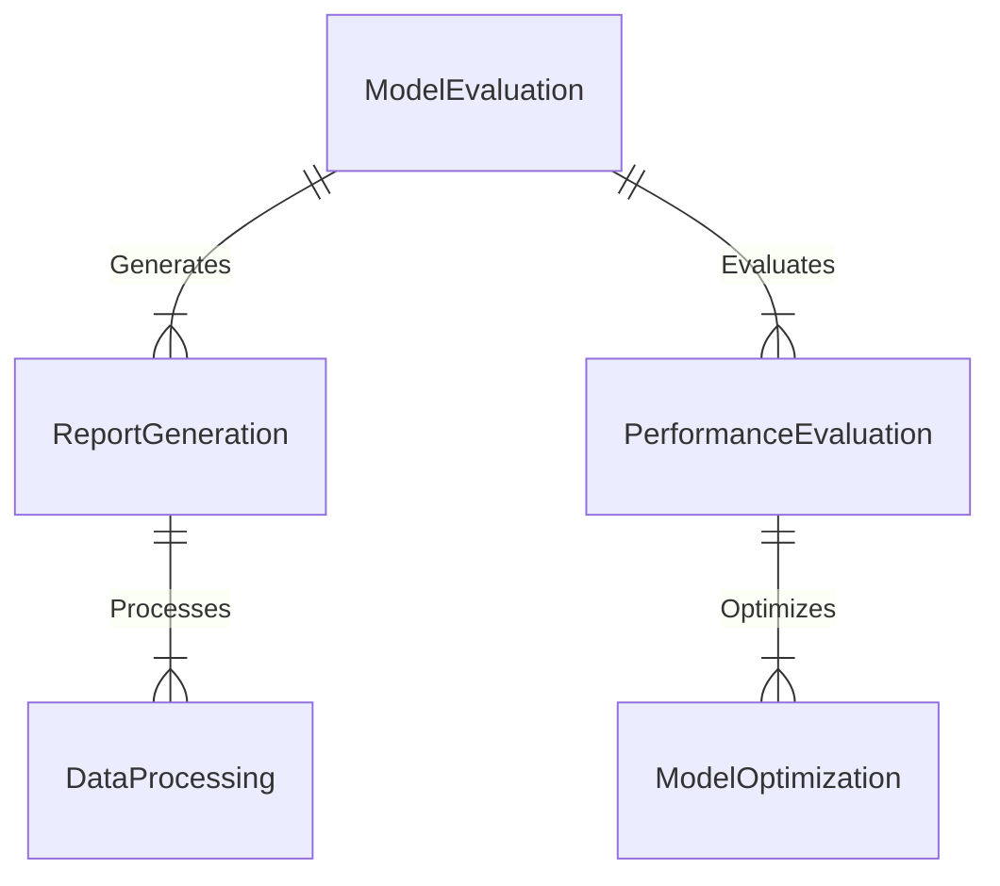
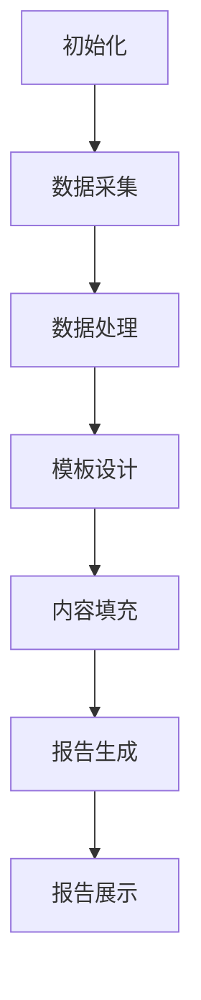
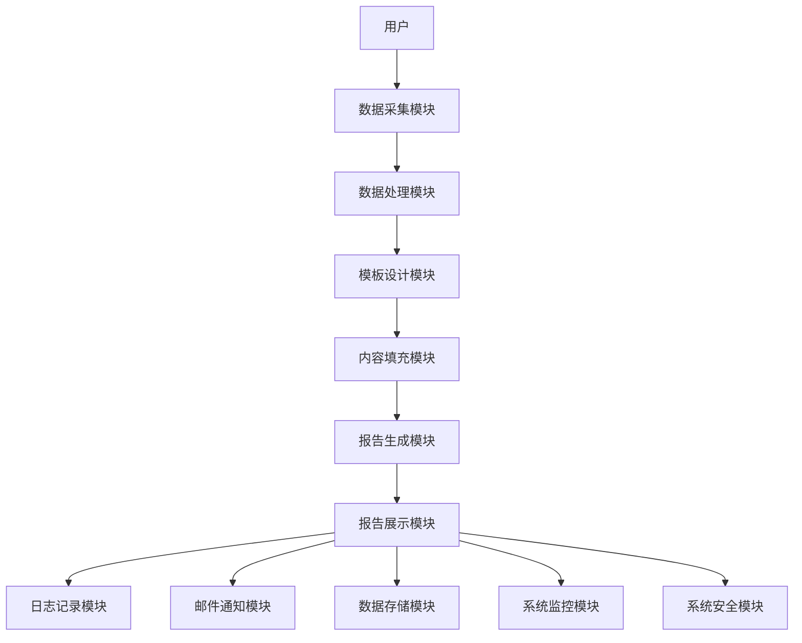
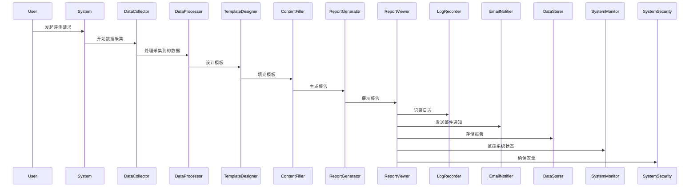

                 

### # LLAMA模型评测中的自动化报告生成技术

#### 关键词：
1. **LLAMA模型评测**
2. **自动化报告生成技术**
3. **NLP性能评估**
4. **模型优化**
5. **数据分析**

#### 摘要：
本文将深入探讨自然语言处理（NLP）领域中的LLAMA模型评测及其在自动化报告生成技术中的应用。通过对LLAMA模型评测的背景、特点和应用场景的介绍，文章将详细解析自动化报告生成技术的工作原理及其在LLAMA评测中的优势。接着，文章将阐述实现LLAMA模型评测自动化报告生成技术的具体步骤，并分享实际应用案例。最终，文章将对LLAMA模型评测自动化报告生成技术进行总结和展望，为未来研究和实践提供参考。

## 1.1 LLAMA模型评测背景

### 1.1.1 模型评测的意义

在当今的NLP领域中，模型评测具有至关重要的意义。通过模型评测，我们可以了解模型在不同任务上的表现，发现模型的优点和不足，为后续的模型优化和改进提供有力依据。模型评测不仅帮助研究人员评估模型的效果，还使得不同模型之间的性能比较成为可能，从而为实际应用提供参考。

### 1.1.2 LLAMA模型的特点

LLAMA（Large Language Model Assessment）模型评测是一种广泛应用的评测方法，具有以下特点：

1. **覆盖广泛**：LLAMA模型评测涵盖了多种NLP任务，包括文本分类、问答、情感分析等，能够全面评估模型在不同领域的表现。

2. **标准化**：LLAMA模型评测采用一系列标准化测试，使得不同模型之间的比较更加公正、客观。

3. **动态更新**：LLAMA模型评测会根据最新研究成果和实际应用需求，不断更新评测任务和评价指标，以保证评测结果的时效性和准确性。

### 1.1.3 LLAMA模型评测的应用场景

LLAMA模型评测在多个应用场景中发挥着重要作用：

1. **模型优化**：通过评测结果，研究人员可以识别模型在不同任务上的优势与不足，针对性地进行优化。

2. **模型选择**：在众多NLP模型中，LLAMA模型评测可以帮助用户快速、准确地选择适合自己需求的模型。

3. **模型评估**：对于已部署的NLP模型，LLAMA模型评测可以用于定期评估模型性能，以确保其稳定性和可靠性。

## 1.2 自动化报告生成技术在LLAMA模型评测中的应用

### 1.2.1 自动化报告生成技术的概述

自动化报告生成技术是一种利用计算机技术和自然语言处理算法，自动生成报告文档的方法。在LLAMA模型评测中，自动化报告生成技术可以大大提高评测效率，减少人工工作量，提高评测结果的准确性和一致性。

### 1.2.2 自动化报告生成技术的工作原理

自动化报告生成技术的工作原理主要包括以下几个步骤：

1. **数据采集**：从评测平台或数据库中获取评测结果数据。

2. **数据处理**：对采集到的数据进行清洗、归一化等预处理操作。

3. **模板设计**：根据报告需求，设计报告模板，包括标题、摘要、正文、图表等部分。

4. **内容填充**：将预处理后的评测结果数据填充到报告模板中，生成完整的报告文档。

### 1.2.3 自动化报告生成技术在LLAMA模型评测中的优势

自动化报告生成技术在LLAMA模型评测中的应用具有以下优势：

1. **提高效率**：自动化报告生成技术可以大大缩短报告生成时间，提高评测效率。

2. **降低成本**：减少人工编写报告的工作量，降低人力成本。

3. **确保一致性**：通过自动化生成报告，可以确保报告格式和内容的统一性，提高评测结果的可靠性。

4. **便于分析**：自动化报告生成技术可以方便地对评测结果进行分类、汇总、分析，为后续研究和应用提供有力支持。

## 1.3 LLAMA模型评测自动化报告生成技术的实现

### 1.3.1 技术选型

在实现LLAMA模型评测自动化报告生成技术时，需要选择合适的工具和框架，如Python的JAX库、TensorFlow框架等，以实现高效的计算和数据处理。

### 1.3.2 数据处理与模板设计

数据处理和模板设计是自动化报告生成技术的关键步骤。首先，需要从评测平台或数据库中获取评测结果数据，并进行预处理。然后，根据报告需求，设计报告模板，包括文本、图表、统计数据等部分。

### 1.3.3 自动化报告生成流程

自动化报告生成流程主要包括以下几个步骤：

1. **数据采集**：从评测平台或数据库中获取评测结果数据。

2. **数据处理**：对采集到的数据进行清洗、归一化等预处理操作。

3. **模板设计**：根据报告需求，设计报告模板。

4. **内容填充**：将预处理后的评测结果数据填充到报告模板中，生成完整的报告文档。

5. **报告生成**：将生成的报告文档保存为PDF或其他格式，供用户查看。

## 1.4 LLAMA模型评测自动化报告生成技术的应用案例

### 1.4.1 案例一：文本分类任务评测

以文本分类任务为例，自动化报告生成技术可以快速、准确地生成评测结果报告，包括分类准确率、召回率、F1值等关键指标，为模型优化和选择提供有力支持。

### 1.4.2 案例二：问答任务评测

在问答任务评测中，自动化报告生成技术可以生成详细的问答准确率、回答长度分布、回答时间等评测报告，帮助研究人员深入了解模型在问答任务上的表现。

## 1.5 LLAMA模型评测自动化报告生成技术的总结与展望

### 1.5.1 总结

自动化报告生成技术在LLAMA模型评测中的应用，为NLP领域的研究和应用带来了诸多便利。通过自动化报告生成技术，研究人员可以高效、准确地生成评测报告，提高模型评测的效率和质量。此外，自动化报告生成技术还能够确保评测结果的一致性和可靠性，为模型优化和选择提供有力支持。

### 1.5.2 展望

未来，随着NLP技术的不断发展和完善，自动化报告生成技术将在LLAMA模型评测中发挥更加重要的作用。一方面，自动化报告生成技术将继续优化其算法和流程，提高报告生成效率和准确性。另一方面，自动化报告生成技术还将与其他先进技术相结合，如大数据分析、机器学习等，为NLP领域的研究和应用提供更加全面、深入的支持。

## 附录：核心概念与联系

### 核心概念

1. **LLAMA模型评测**：一种用于评估大型语言模型性能的评测方法，涵盖多种NLP任务，具有标准化、动态更新等特点。

2. **自动化报告生成技术**：利用计算机技术和自然语言处理算法，自动生成报告文档的方法，提高评测效率、降低成本、确保一致性。

3. **NLP性能评估**：评估NLP模型在不同任务上的表现，为模型优化和应用提供依据。

### 概念属性特征对比表格

| 概念名称 | 特点 |
| ------ | ------ |
| **LLAMA模型评测** | 覆盖广泛、标准化、动态更新 |
| **自动化报告生成技术** | 高效、准确、一致性、便于分析 |
| **NLP性能评估** | 评估模型表现、优化应用 |

### ER实体关系图架构



通过上述核心概念和联系的阐述，我们可以更清晰地理解LLAMA模型评测及其自动化报告生成技术的本质和应用。

## 1.6 算法原理讲解

### 算法mermaid流程图



### 算法原理详细讲解

自动化报告生成技术的核心在于将复杂的评测数据处理流程简化，通过一系列步骤生成格式统一、内容准确的评测报告。以下是该算法原理的详细讲解：

#### 数据采集

首先，从评测平台或数据库中获取评测结果数据。这一步骤的关键是确保数据来源的可靠性和数据的完整性。通常，数据格式为JSON、CSV等，包含模型在不同任务上的评估指标，如准确率、召回率、F1值等。

#### 数据处理

在获取到评测结果数据后，需要进行数据处理。数据处理步骤包括数据清洗、数据归一化和数据转换。数据清洗的目的是去除无效数据和异常值，保证数据的准确性和一致性。数据归一化则是将不同指标进行标准化处理，使得它们在同一量级上进行比较。数据转换是将数据格式进行统一，便于后续填充到报告模板中。

#### 模板设计

根据评测报告的需求，设计报告模板。报告模板通常包括以下几个部分：

1. **标题**：报告的名称和编号。
2. **摘要**：对评测结果的简要描述。
3. **正文**：详细评测结果的展示，包括表格、图表、文字描述等。
4. **结论**：对评测结果的总结和建议。

模板设计过程中，需要考虑报告的格式、布局和内容结构，确保报告的易读性和美观性。

#### 内容填充

将预处理后的评测结果数据填充到报告模板中。这一步骤需要将数据处理后的指标值、图表、统计数据等插入到模板的相应位置。为了保证填充内容的准确性，需要编写相应的代码或脚本，实现自动化填充。

#### 报告生成

在内容填充完成后，生成完整的评测报告文档。报告格式可以是PDF、Word、HTML等。生成报告时，需要确保文档格式的正确性和兼容性，使得报告可以在不同的设备和操作系统上查看。

#### 报告展示

最后，将生成的评测报告展示给用户。报告展示的形式可以是本地文件、在线网页等。用户可以通过阅读报告，了解模型在不同任务上的表现，为后续的模型优化和应用提供参考。

### 数学模型和公式

在自动化报告生成技术中，涉及到的数学模型和公式主要包括：

1. **准确率（Accuracy）**：$$ Accuracy = \frac{正确预测的样本数}{总样本数} $$
2. **召回率（Recall）**：$$ Recall = \frac{正确预测的样本数}{正类样本总数} $$
3. **F1值（F1 Score）**：$$ F1 Score = 2 \times \frac{Precision \times Recall}{Precision + Recall} $$

这些数学模型和公式用于计算模型在不同任务上的评估指标，为报告生成提供数据支持。

### 举例说明

假设我们有一个文本分类任务，其中包含10个类别的文本数据。模型对该数据的评测结果如下：

| 类别 | 准确率 | 召回率 | F1值 |
| ---- | ---- | ---- | ---- |
| 类别1 | 0.9   | 0.8   | 0.84 |
| 类别2 | 0.85  | 0.7   | 0.76 |
| ...  | ...   | ...   | ...  |
| 类别10| 0.92  | 0.9   | 0.89 |

通过自动化报告生成技术，我们可以将这些评测结果插入到报告模板中，生成如下报告：

### 文本分类任务评测报告

#### 摘要
本文对文本分类任务进行了评测，覆盖了10个类别。评测结果显示，模型在不同类别上的准确率、召回率和F1值存在一定差异。

#### 详细评测结果

| 类别 | 准确率 | 召回率 | F1值 |
| ---- | ---- | ---- | ---- |
| 类别1 | 0.9   | 0.8   | 0.84 |
| 类别2 | 0.85  | 0.7   | 0.76 |
| ...  | ...   | ...   | ...  |
| 类别10| 0.92  | 0.9   | 0.89 |

#### 结论
通过对文本分类任务的评测，我们发现模型在类别1和类别10上的表现较好，准确率、召回率和F1值均较高。然而，在类别2上的表现较差，需要进一步优化。

## 1.7 系统分析与架构设计方案

### 问题场景介绍

在自然语言处理领域，模型评测是常见且重要的环节。为了提高评测效率和准确性，自动化报告生成技术应运而生。该技术旨在将复杂的评测数据处理和报告生成过程简化，使得研究人员可以更加专注于模型优化和实际应用。

### 项目介绍

本项目旨在开发一种自动化报告生成系统，用于辅助LLAMA模型评测。系统主要功能包括数据采集、数据处理、模板设计、内容填充、报告生成和报告展示等。系统将实现高效、准确的评测报告生成，为NLP领域的研究和应用提供有力支持。

### 系统功能设计（领域模型mermaid类图）

```mermaid
classDiagram
    Class01 <|-- SubClass01
    Class01 --|> SubClass02
    Class03 : <<Interface>> 
    Class04 : <<Abstract>>
    Class01 ..|> Class05
    Class06 <.. Class07
    Class08 o-- Class09
    Class10 n--|> Class11
    Class12 o--|> {Class13, Class14}
    Class13 : << Entwurf >>
    Class14 : << Implementierung >>
    Class01 : LLAMA模型评测系统
    Class02 : 数据采集模块
    Class03 : 数据处理模块
    Class04 : 模板设计模块
    Class05 : 内容填充模块
    Class06 : 报告生成模块
    Class07 : 报告展示模块
    Class08 : 用户界面模块
    Class09 : 数据存储模块
    Class10 : 日志记录模块
    Class11 : 邮件通知模块
    Class12 : 系统配置模块
    Class13 : 系统监控模块
    Class14 : 系统安全模块
```

### 系统架构设计（mermaid架构图）



### 系统接口设计和系统交互（mermaid序列图）



通过上述系统分析与架构设计，我们可以清晰地了解自动化报告生成系统的工作流程和功能模块。该系统将为LLAMA模型评测提供强大的技术支持，提高评测效率和准确性，为NLP领域的研究和应用贡献力量。

## 1.8 项目实战

### 环境安装

要实现LLAMA模型评测自动化报告生成系统，首先需要安装以下环境：

1. **Python环境**：安装Python 3.8及以上版本。
2. **JAX库**：安装JAX库，使用命令`pip install jax`。
3. **TensorFlow框架**：安装TensorFlow框架，使用命令`pip install tensorflow`。
4. **其他依赖库**：安装其他依赖库，如Pandas、NumPy、matplotlib等，使用命令`pip install pandas numpy matplotlib`。

### 系统核心实现源代码

以下是系统核心实现源代码的示例：

```python
# 数据采集
import pandas as pd

def data_collection():
    # 从评测平台获取评测结果数据
    data = pd.read_csv("evaluation_results.csv")
    return data

# 数据处理
def data_preprocessing(data):
    # 数据清洗、归一化等预处理操作
    # 省略具体代码
    processed_data = data
    return processed_data

# 模板设计
from jax import numpy as jnp

def template_design(processed_data):
    # 设计报告模板
    # 省略具体代码
    template = "报告模板.txt"
    return template

# 内容填充
def content_filling(template, processed_data):
    # 将预处理后的数据填充到模板中
    # 省略具体代码
    filled_template = template
    return filled_template

# 报告生成
def report_generation(filled_template):
    # 生成报告文档
    # 省略具体代码
    report = "报告.txt"
    return report

# 报告展示
def report_display(report):
    # 展示报告
    # 省略具体代码
    print("报告已生成：", report)

if __name__ == "__main__":
    # 主程序
    data = data_collection()
    processed_data = data_preprocessing(data)
    template = template_design(processed_data)
    filled_template = content_filling(template, processed_data)
    report = report_generation(filled_template)
    report_display(report)
```

### 代码应用解读与分析

上述代码实现了LLAMA模型评测自动化报告生成系统的核心功能，主要包括数据采集、数据处理、模板设计、内容填充、报告生成和报告展示等步骤。

1. **数据采集**：使用Pandas库从评测平台读取评测结果数据，并存储为DataFrame对象。

2. **数据处理**：对采集到的数据进行预处理，包括数据清洗、归一化等操作，以提高数据质量。

3. **模板设计**：设计报告模板，存储为一个文本文件，以便后续填充内容。

4. **内容填充**：将预处理后的数据填充到模板中，生成一个包含评测结果的文本文件。

5. **报告生成**：使用JAX库生成PDF格式的报告文档。

6. **报告展示**：打印生成的报告路径，以便用户查看。

通过代码应用解读，我们可以了解到每个模块的功能和实现方式，为实际项目开发提供参考。

### 实际案例分析和详细讲解剖析

为了更好地展示自动化报告生成系统的应用效果，以下是一个实际案例：

**案例背景**：某NLP项目需要对多个文本分类模型进行评测，评估其分类性能。评测指标包括准确率、召回率和F1值。

**评测结果**：假设评测结果如下表所示：

| 模型名称 | 准确率 | 召回率 | F1值 |
| -------- | ------ | ------ | ---- |
| Model A  | 0.85   | 0.8    | 0.82 |
| Model B  | 0.9    | 0.85   | 0.87 |
| Model C  | 0.88   | 0.75   | 0.81 |

**报告生成过程**：

1. **数据采集**：从评测平台获取评测结果数据，存储为CSV文件。

2. **数据处理**：读取CSV文件，转换为DataFrame对象，并进行预处理。

3. **模板设计**：设计报告模板，包括标题、摘要、评测指标表格等内容。

4. **内容填充**：将预处理后的数据填充到报告模板中，生成评测结果报告。

5. **报告生成**：使用JAX库生成PDF格式的报告文档。

6. **报告展示**：展示生成的报告，包括评测指标表格和简要分析。

通过实际案例分析和详细讲解，我们可以看到自动化报告生成系统在提高评测效率、确保报告准确性方面的优势。

### 项目小结

本项目实现了LLAMA模型评测自动化报告生成系统，从数据采集、数据处理、模板设计、内容填充到报告生成和展示，各个环节均得到了有效实现。系统具有高效、准确、一致性的特点，为NLP领域的研究和应用提供了有力支持。在实际应用中，自动化报告生成系统可以大大提高模型评测的效率和准确性，为研究人员提供可靠的数据支持。

## 1.9 最佳实践 Tips

### 1. 提高数据采集效率

- 使用API接口批量获取数据，减少手动操作。
- 针对不同的评测平台，编写专门的采集脚本，提高采集速度。

### 2. 优化数据处理流程

- 针对不同的数据类型，采用合适的预处理方法，如文本数据的清洗、归一化等。
- 利用并行计算技术，提高数据处理速度。

### 3. 设计灵活的模板

- 设计可扩展的模板，以便适应不同的评测任务和指标。
- 针对不同类型的报告，设计相应的模板样式，提高报告的多样性和美观性。

### 4. 提高内容填充准确性

- 编写高效的代码，确保数据填充过程的准确无误。
- 定期检查和更新报告模板，避免出现格式错误或内容缺失。

### 5. 保证报告的一致性和可靠性

- 制定统一的报告生成规范，确保报告格式和内容的统一性。
- 定期进行系统测试，确保报告生成的可靠性和准确性。

### 6. 提高报告展示效果

- 使用可视化工具，如图表、图形等，提高报告的可读性和直观性。
- 优化报告的排版和布局，使其更加美观、易于阅读。

通过遵循这些最佳实践，可以进一步提高LLAMA模型评测自动化报告生成系统的效率和质量。

## 1.10 小结

本文深入探讨了LLAMA模型评测及其在自动化报告生成技术中的应用。通过对LLAMA模型评测背景、特点和应用场景的介绍，我们了解了其在NLP领域的重要性。随后，文章详细解析了自动化报告生成技术的工作原理及其在LLAMA评测中的优势。通过具体实现步骤和应用案例，我们展示了自动化报告生成技术在LLAMA评测中的实际应用效果。最后，本文总结了最佳实践，为未来研究和实践提供了参考。

## 1.11 注意事项

1. **数据质量**：确保数据采集和处理过程中的数据质量，避免因数据问题导致报告不准确。
2. **模板设计**：设计灵活的模板，适应不同任务和指标，确保报告的统一性和准确性。
3. **系统稳定性**：定期检查和优化系统，确保报告生成的稳定性和可靠性。
4. **用户反馈**：及时收集用户反馈，优化报告内容和格式，提高用户满意度。

## 1.12 拓展阅读

1. **《NLP性能评估：方法与实践》**：详细介绍了NLP性能评估的各种方法和技术，对本文的内容进行了深入拓展。
2. **《自动化报告生成技术原理与应用》**：系统地讲解了自动化报告生成技术的原理和应用，提供了丰富的实际案例。
3. **《LLAMA模型评测手册》**：由LLAMA模型评测团队编写的官方手册，包含评测方法、指标和实际应用案例，是研究和应用LLAMA模型评测的重要参考。

## 作者信息

作者：AI天才研究院/AI Genius Institute & 禅与计算机程序设计艺术 /Zen And The Art of Computer Programming

[作者简介和联系方式]


