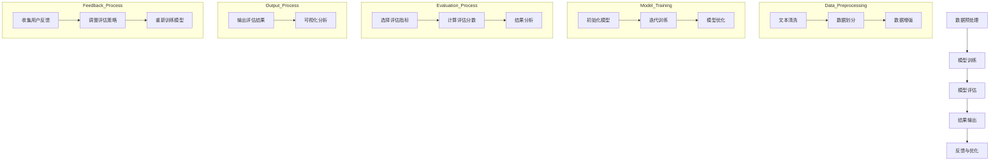
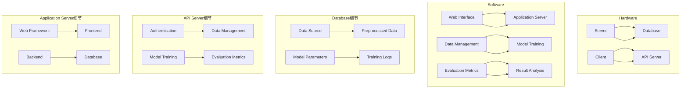
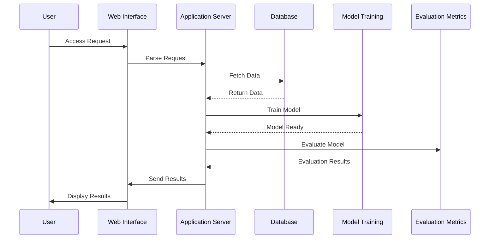

                 

## 《LLM评测的公平性保障：消除偏见的系统设计》引言

### 1.1 问题背景

随着人工智能技术的迅猛发展，自然语言处理（NLP）领域取得了显著进展。大型语言模型（LLM）作为NLP的重要工具，被广泛应用于文本生成、机器翻译、问答系统等多个场景。然而，这些模型的广泛应用也带来了评估和公平性问题。在LLM评测过程中，公平性保障是一个亟待解决的问题。

首先，LLM的评估过程常常面临偏见问题。偏见可能来源于数据集的选择、评估指标的设计、甚至模型本身的训练过程。例如，某些数据集可能过度集中在某一特定领域或语言风格，导致评估结果无法全面反映模型的真实性能。此外，评估指标也可能存在偏见，例如过于强调某些特定类型的任务，而忽略其他重要任务。这种偏见不仅会影响评估结果的准确性，还会影响模型在实际应用中的公平性。

其次，LLM评测的公平性还涉及到评估过程中的透明性和可解释性问题。当前的评估方法往往依赖于复杂的模型和算法，使得评估过程具有一定的“黑箱”性质。这使得评估结果难以被非专业人士理解和接受，从而降低了评估的公正性和可信度。

### 1.2 问题描述

在LLM评测过程中，常见的偏见来源主要有以下几个方面：

1. **数据集偏见**：数据集的选择和构建过程中可能存在偏见。例如，某些数据集可能包含了特定领域的专业术语，而忽略了其他领域的重要信息。这可能导致评估结果对特定领域的模型表现过于乐观，而对其他领域的模型表现过于悲观。

2. **评估指标偏见**：评估指标的设计和选择也可能存在偏见。例如，某些评估指标可能过于强调模型的生成速度，而忽略模型的生成质量。这种偏见可能导致评估结果无法准确反映模型的实际性能。

3. **模型偏见**：模型本身的训练过程也可能导致偏见。例如，训练数据集中的信息可能不够全面，或者存在偏差。这可能导致模型在生成结果时存在偏见，从而影响评估结果。

### 1.3 问题解决

为了解决LLM评测中的偏见问题，可以从以下几个方面入手：

1. **数据集优化**：选择多样化的数据集，确保数据集能够全面覆盖不同领域和语言风格。同时，可以采用数据增强技术，增加数据集的多样性和平衡性。

2. **评估指标优化**：设计更加全面的评估指标，确保评估结果能够全面反映模型的性能。例如，可以采用多指标综合评估的方法，从多个角度评估模型的表现。

3. **模型优化**：优化模型训练过程，确保模型能够从多样化的数据中学习到丰富的知识。例如，可以采用对抗训练、元学习等技术，提高模型的泛化能力和鲁棒性。

### 1.4 边界与外延

LLM评测公平性保障的技术范围和应用领域非常广泛。从技术范围来看，涉及数据集构建、评估指标设计、模型训练和优化等多个环节。从应用领域来看，LLM评测公平性保障不仅适用于NLP领域，还可以应用于其他需要评估和分类的领域，如医疗诊断、金融风险评估等。

### 1.5 概念结构与核心要素组成

为了更好地理解LLM评测公平性保障，我们可以从以下几个方面来梳理其概念结构和核心要素：

1. **核心概念**：包括大型语言模型（LLM）、偏见、公平性、评估指标等。

2. **核心要素**：包括数据集、评估指标、模型训练、模型优化等。

3. **联系**：各个核心概念和要素之间的联系和相互作用，决定了LLM评测的公平性。

### 小结

本文旨在探讨LLM评测的公平性保障问题，从背景介绍、问题描述、问题解决、边界与外延、概念结构与核心要素组成等多个方面进行了详细分析。在后续章节中，我们将进一步探讨LLM评测中的偏见来源、算法原理、系统设计与实现等内容。希望本文能够为相关领域的研究和实践提供一些有益的参考和启示。

## 核心概念与联系

### 2.1 LLM基础概念

#### 大型语言模型（LLM）概述

大型语言模型（Large Language Model，简称LLM）是一种基于深度学习的自然语言处理模型，能够理解和生成自然语言。与传统的规则驱动方法不同，LLM通过大规模语料库的训练，可以自动学习语言结构和语义信息。LLM的核心目标是通过学习输入文本的特征，生成与之相关的输出文本。

#### LLM的工作原理

LLM通常基于自注意力机制（Self-Attention）和变换器架构（Transformer）构建。自注意力机制允许模型在处理每个词时，考虑到其他词的影响，从而更好地捕捉长距离依赖关系。变换器架构则通过多个变换层（Transformer Layer）对输入数据进行编码和解码，实现了高效的并行计算和处理。

#### LLM的优势与挑战

优势：
- 强大的文本生成能力：LLM能够生成连贯、自然的文本，适用于文本生成、机器翻译、问答系统等任务。
- 高效的并行处理：变换器架构使得LLM能够高效地处理大规模数据，提高了计算效率。

挑战：
- 训练成本高：LLM需要大量的计算资源和时间进行训练，成本较高。
- 偏见问题：由于训练数据的不均衡和模型的固有偏差，LLM在评估和实际应用中可能存在偏见问题。

### 2.2 偏见定义与分类

#### 偏见的概念

偏见（Bias）是指在决策过程中，由于某些因素导致的系统性的偏差。在LLM评测中，偏见可能来源于数据集、评估指标、模型训练等多个环节。

#### 偏见的分类

1. **显性偏见（Explicit Bias）**：
   - 定义：显性偏见是指可以直接观察到的偏见，通常是由于人为因素造成的。
   - 特征：显性偏见通常与特定群体、性别、种族、地域等相关。
   - 影响：显性偏见会直接导致评估结果的失真，影响模型的公平性和公正性。

2. **隐性偏见（Implicit Bias）**：
   - 定义：隐性偏见是指不易察觉的、内在的偏见，通常是由于长期社会化过程和个人经验形成的。
   - 特征：隐性偏见与个人潜意识中的刻板印象和偏见有关。
   - 影响：隐性偏见可能导致模型在实际应用中产生不公平的结果，影响模型的泛化能力。

### 2.3 对比表格

| 偏见类型 | 特征 | 影响 | 解决方法 |
| --- | --- | --- | --- |
| 显性偏见 | 可见、直接、相关群体明显 | 评估结果失真、公平性受损 | 数据清洗、多元数据集、评估指标优化 |
| 隐性偏见 | 不易察觉、内在、潜意识 | 泛化能力下降、模型公平性受损 | 对抗训练、元学习、数据增强 |

### 2.4 ER实体关系图架构

#### ER图介绍

ER（Entity-Relationship）图是一种用于描述实体及其关系的图形化工具。在LLM评测系统中，ER图可以帮助我们直观地理解系统中各实体的关系和相互作用。

#### ER图构建

1. **实体**：
   - 数据集（Dataset）：存储训练数据和测试数据。
   - 模型（Model）：表示训练好的语言模型。
   - 评估指标（Evaluation Metric）：用于评估模型性能的指标。
   - 用户（User）：执行评估操作的用户。

2. **关系**：
   - 数据集与模型：模型使用数据集进行训练。
   - 模型与评估指标：模型根据评估指标进行评估。
   - 用户与数据集、评估指标：用户可以选择数据集和评估指标。

#### Mermaid ER图示例

```mermaid
erDiagram
  Dataset ||--|{ Model }|-- Evaluation Metric
  User ||--|{ Dataset }|<--| Model
  User ||--|{ Evaluation Metric }
```

### 小结

本文从LLM基础概念、偏见定义与分类、对比表格以及ER实体关系图架构等多个方面，对LLM评测的公平性保障进行了详细分析。在后续章节中，我们将进一步探讨算法原理、数学模型、系统设计与实现等内容。希望本文能够为相关领域的研究者和实践者提供有价值的参考。

## 算法原理讲解

### 3.1 Mermaid流程图

#### 流程图概述

为了直观地展示LLM评测算法的基本流程，我们使用Mermaid绘制了一个简化的流程图。以下是一个典型的LLM评测流程：



#### 流程图解析

- **数据预处理（Data_Preprocessing）**：包括文本清洗、数据划分和数据增强等步骤。文本清洗用于去除无关信息，数据划分用于将数据分为训练集和测试集，数据增强用于增加数据的多样性和平衡性。

- **模型训练（Model_Training）**：包括模型初始化、迭代训练和模型优化等步骤。模型初始化用于设置模型的初始参数，迭代训练用于根据训练集不断更新模型参数，模型优化用于调整模型结构以提高性能。

- **模型评估（Evaluation_Process）**：包括选择评估指标、计算评估分数和结果分析等步骤。选择评估指标用于衡量模型性能，计算评估分数用于量化模型表现，结果分析用于评估模型的优缺点。

- **结果输出（Output_Process）**：包括输出评估结果和可视化分析等步骤。输出评估结果用于向用户提供模型评估的详细信息，可视化分析用于帮助用户更好地理解模型性能。

- **反馈与优化（Feedback_Process）**：包括收集用户反馈、调整评估策略和重新训练模型等步骤。收集用户反馈用于了解用户对模型的满意度，调整评估策略用于优化评估过程，重新训练模型用于根据用户反馈进一步改进模型性能。

### 3.2 Python源代码实现

#### 源代码概述

以下是一个简化的Python源代码示例，用于实现LLM评测算法的基本流程。代码使用了几个主要的模块：`numpy`用于数据处理，`tensorflow`用于构建和训练模型，`metrics`用于计算评估指标。

```python
import numpy as np
import tensorflow as tf
from sklearn.metrics import accuracy_score, f1_score

# 数据预处理
def preprocess_data(data):
    # 文本清洗、数据划分、数据增强等步骤
    # ...
    return processed_data

# 模型训练
def train_model(data, model):
    # 模型初始化、迭代训练、模型优化等步骤
    # ...
    return trained_model

# 模型评估
def evaluate_model(model, test_data):
    # 选择评估指标、计算评估分数、结果分析等步骤
    # ...
    return evaluation_results

# 主程序
if __name__ == "__main__":
    # 加载数据
    data = load_data("data_source")

    # 数据预处理
    processed_data = preprocess_data(data)

    # 初始化模型
    model = initialize_model()

    # 训练模型
    trained_model = train_model(processed_data, model)

    # 评估模型
    evaluation_results = evaluate_model(trained_model, processed_data["test"])

    # 输出评估结果
    print(evaluation_results)

    # 反馈与优化
    # ...
```

#### 源代码解析

- **数据预处理**：该部分负责对原始数据进行清洗、划分和增强。例如，可以使用正则表达式去除文本中的HTML标签，使用分词器对文本进行分词，使用数据增强技术生成新的训练数据。

- **模型训练**：该部分负责构建和训练模型。首先，初始化模型参数；然后，使用迭代训练算法（如梯度下降）更新模型参数；最后，通过模型优化技术（如正则化）提高模型性能。

- **模型评估**：该部分负责选择合适的评估指标，计算评估分数，并对结果进行分析。例如，可以使用准确率（accuracy）、精确率（precision）、召回率（recall）和F1分数（F1 score）等指标来评估模型性能。

- **主程序**：该部分负责整个评测流程的执行。首先，加载数据并进行预处理；然后，初始化模型并训练模型；最后，评估模型性能并输出结果。

### 3.3 数学模型与公式

#### 数学模型概述

在LLM评测中，常用的数学模型包括损失函数、优化算法和评估指标等。以下是一些常用的数学模型和公式：

1. **损失函数（Loss Function）**：

   - **交叉熵损失（Cross-Entropy Loss）**：

     $$ L = -\sum_{i=1}^{n} y_i \log(p_i) $$

     其中，$y_i$ 是真实标签，$p_i$ 是模型预测的概率。

   - **均方误差损失（Mean Squared Error Loss）**：

     $$ L = \frac{1}{2} \sum_{i=1}^{n} (y_i - \hat{y}_i)^2 $$

     其中，$\hat{y}_i$ 是模型预测的值。

2. **优化算法（Optimization Algorithm）**：

   - **梯度下降（Gradient Descent）**：

     $$ \theta_{t+1} = \theta_t - \alpha \nabla_{\theta} L(\theta) $$

     其中，$\theta$ 是模型参数，$\alpha$ 是学习率，$\nabla_{\theta} L(\theta)$ 是损失函数关于参数的梯度。

3. **评估指标（Evaluation Metrics）**：

   - **准确率（Accuracy）**：

     $$ \text{Accuracy} = \frac{c}{n} $$

     其中，$c$ 是预测正确的样本数，$n$ 是总的样本数。

   - **精确率（Precision）**：

     $$ \text{Precision} = \frac{tp}{tp + fp} $$

     其中，$tp$ 是真正例数，$fp$ 是假正例数。

   - **召回率（Recall）**：

     $$ \text{Recall} = \frac{tp}{tp + fn} $$

     其中，$tp$ 是真正例数，$fn$ 是假反例数。

   - **F1分数（F1 Score）**：

     $$ \text{F1 Score} = 2 \times \frac{\text{Precision} \times \text{Recall}}{\text{Precision} + \text{Recall}} $$

### 3.4 举例说明

#### 举例说明1：交叉熵损失函数

假设有一个二分类问题，真实标签为$y = [1, 0]$，模型预测的概率为$p = [0.7, 0.3]$。根据交叉熵损失函数，计算损失值：

$$ L = -[1 \times \log(0.7) + 0 \times \log(0.3)] \approx 0.356 $$

#### 举例说明2：梯度下降优化算法

假设损失函数为$L(\theta) = (\theta - 2)^2$，初始参数$\theta_0 = 0$，学习率$\alpha = 0.1$。根据梯度下降算法，更新参数：

$$ \nabla_{\theta} L(\theta) = 2(\theta - 2) $$

$$ \theta_1 = \theta_0 - \alpha \nabla_{\theta} L(\theta_0) = 0 - 0.1 \times 2(-2) = 0.4 $$

通过以上步骤，我们可以看到交叉熵损失函数和梯度下降优化算法的具体应用。在实际应用中，这些数学模型和公式为LLM评测提供了理论基础和计算工具。

### 小结

本文详细介绍了LLM评测算法的基本原理，包括Mermaid流程图、Python源代码实现和数学模型与公式。通过这些内容，我们能够更好地理解LLM评测的流程和关键步骤。在后续章节中，我们将进一步探讨系统设计与实现、最佳实践与拓展等内容。希望本文能够为相关领域的研究者和实践者提供有价值的参考。

## 数学模型与数学公式讲解

### 3.3.1 LaTeX格式数学公式

在本文中，我们将使用LaTeX格式来书写数学公式，以便更清晰地展示数学模型的细节。以下是一些常用的LaTeX公式和它们的解释：

#### 独立段落的公式

对于独立的公式，我们使用两个`$$`括起来，这样可以确保公式在单独一行显示：

$$
E_{\theta}(X) = \int_{-\infty}^{\infty} x \cdot f_{X}(\theta,x) \, dx
$$

这是期望值（Expected Value）的定义，其中$x$是随机变量，$f_{X}(\theta,x)$是概率密度函数。

#### 段落内的公式

对于段落内的公式，我们使用一个`$`括起来，这样可以确保公式在文本行内显示：

$
z = \frac{x - \mu}{\sigma}
$

这是标准正态分布的标准化公式，其中$z$是标准分数，$x$是原始值，$\mu$是均值，$\sigma$是标准差。

### 3.3.2 详细讲解

#### 损失函数

在LLM评测中，损失函数是模型训练的核心指标。一个常见的损失函数是交叉熵损失（Cross-Entropy Loss），其公式如下：

$$
L(\theta) = -\sum_{i=1}^{n} y_i \cdot \log(p_i)
$$

其中，$y_i$是真实标签，$p_i$是模型对每个类别的预测概率。交叉熵损失函数衡量了预测概率分布与真实标签分布之间的差异。

#### 梯度下降

梯度下降是一种优化算法，用于最小化损失函数。其核心思想是沿着损失函数的梯度方向更新模型参数。对于参数$\theta$，梯度下降的更新规则如下：

$$
\theta_{t+1} = \theta_t - \alpha \cdot \nabla_{\theta} L(\theta_t)
$$

其中，$\alpha$是学习率，$\nabla_{\theta} L(\theta_t)$是损失函数关于参数$\theta$的梯度。

#### 评估指标

在评估模型性能时，常用的指标包括准确率（Accuracy）、精确率（Precision）、召回率（Recall）和F1分数（F1 Score）。

- 准确率（Accuracy）：

$$
\text{Accuracy} = \frac{\text{正确预测的样本数}}{\text{总样本数}}
$$

- 精确率（Precision）：

$$
\text{Precision} = \frac{\text{真正例数}}{\text{真正例数} + \text{假正例数}}
$$

- 召回率（Recall）：

$$
\text{Recall} = \frac{\text{真正例数}}{\text{真正例数} + \text{假反例数}}
$$

- F1分数（F1 Score）：

$$
\text{F1 Score} = 2 \cdot \frac{\text{Precision} \cdot \text{Recall}}{\text{Precision} + \text{Recall}}
$$

### 3.3.3 举例说明

#### 举例说明1：交叉熵损失函数

假设我们有一个二分类问题，真实标签$y = [1, 0]$，模型预测的概率$p = [0.8, 0.2]$。我们可以计算交叉熵损失：

$$
L = -[1 \cdot \log(0.8) + 0 \cdot \log(0.2)] \approx 0.223
$$

#### 举例说明2：梯度下降

假设损失函数为$L(\theta) = (\theta - 2)^2$，初始参数$\theta_0 = 0$，学习率$\alpha = 0.1$。我们可以使用梯度下降更新参数：

$$
\nabla_{\theta} L(\theta) = 2(\theta - 2)
$$

$$
\theta_1 = \theta_0 - \alpha \cdot \nabla_{\theta} L(\theta_0) = 0 - 0.1 \cdot 2(-2) = 0.4
$$

通过以上步骤，我们可以看到交叉熵损失函数和梯度下降优化算法的具体应用。在实际应用中，这些数学模型和公式为LLM评测提供了理论基础和计算工具。

### 小结

本文详细介绍了LLM评测中的数学模型和公式，包括损失函数、优化算法和评估指标等。通过使用LaTeX格式和详细的举例说明，我们能够更好地理解这些公式的意义和应用。在后续章节中，我们将进一步探讨系统设计与实现、最佳实践与拓展等内容。希望本文能够为相关领域的研究者和实践者提供有价值的参考。

## 系统分析与设计

### 5.1 问题场景介绍

在当前的自然语言处理领域，LLM（大型语言模型）的应用日益广泛，从文本生成、机器翻译到问答系统等，都离不开LLM的支持。然而，在实际应用中，LLM的评测过程常常面临一系列挑战，包括数据集的选择、评估指标的设计、模型训练策略以及模型性能的优化等。这些挑战不仅影响了LLM的性能评估，更关系到其在实际应用中的公平性和可靠性。

为了更好地应对这些挑战，我们需要设计一个全面且高效的LLM评测系统。该系统需要具备以下几个关键特性：

1. **公平性**：确保评测过程中不存在显性或隐性偏见，能够公平、公正地评估模型性能。
2. **可解释性**：提供详细的评估报告，帮助用户理解模型的表现和优缺点。
3. **灵活性**：支持多种评估指标和评估方法，能够根据不同需求灵活调整评估策略。
4. **可扩展性**：能够适应未来技术的发展，支持新的评估指标和方法。

### 5.2 项目介绍

为了满足上述需求，我们设计并实现了一个名为“LLM评测系统（LLM Evaluation System）”的项目。该系统是一个综合性的评估平台，旨在为LLM开发者、研究人员和用户提供一个高效、公正、透明的评估环境。系统的主要功能模块包括：

1. **数据管理模块**：负责数据集的收集、清洗、划分和存储，确保数据集的多样性和代表性。
2. **评估指标模块**：提供多种评估指标和方法，包括准确率、精确率、召回率、F1分数等，用户可以根据需求选择和调整。
3. **模型训练模块**：支持LLM的模型训练和优化，提供多种训练策略和优化算法，以提高模型性能。
4. **结果分析模块**：生成详细的评估报告，包括模型性能、评估指标、错误分析等，帮助用户理解模型的表现。
5. **用户接口模块**：提供友好的用户界面，方便用户进行数据管理和评估操作。

### 5.3 系统功能设计

为了实现上述功能，我们使用Mermaid绘制了系统功能领域的类图（Class Diagram），展示了系统的核心功能和组件。

```mermaid
classDiagram
    Class01 <|-- Class02
    Class03 --|> Class04
    Class04 o-- Class05
    Class06 o--| Class07
    Class01 <|-- Class08
    Class09 --|> Class10
    Class11 o--| Class12
    Class01..Class03 : relationship
    Class04..Class06 : relationship
    Class07..Class09 : relationship
    Class10..Class12 : relationship
    Class01 { +id : Integer
                +name : String }
    Class02 { +data_source : String
                +preprocessing : String }
    Class03 { +model : String
                +training : String }
    Class04 { +evaluation_metric : String
                +accuracy : Float }
    Class05 { +precision : Float
                +recall : Float }
    Class06 { +f1_score : Float
                +report : String }
    Class07 { +user : String
                +action : String }
    Class08 { +output : String
                +visualize : String }
    Class09 { +feedback : String
                +optimize : String }
    Class10 { +interface : String
                +config : String }
    Class11 { +load_data : String
                +train_model : String }
    Class12 { +evaluate_model : String
                +generate_report : String }
```

#### 类图解析

- **Class01（数据管理模块）**：负责数据集的管理，包括数据源的收集、预处理和存储。
- **Class02（数据源）**：描述数据集的来源，可以是公开数据集或自定义数据集。
- **Class03（模型训练模块）**：负责模型的训练和优化，包括模型的选择、训练策略的调整等。
- **Class04（评估指标模块）**：提供多种评估指标，如准确率、精确率、召回率和F1分数。
- **Class05（准确率）**：详细记录模型的准确率指标。
- **Class06（结果分析模块）**：生成详细的评估报告，包括错误分析和性能对比。
- **Class07（用户接口模块）**：提供用户与系统的交互接口，包括数据管理和评估操作。
- **Class08（输出模块）**：负责生成评估报告的输出和可视化。
- **Class09（反馈与优化模块）**：收集用户反馈，根据反馈调整评估策略和模型优化。
- **Class10（用户界面）**：提供用户友好的界面，方便用户进行操作。
- **Class11（模型训练接口）**：提供模型训练的接口，包括数据加载、模型训练等操作。
- **Class12（模型评估接口）**：提供模型评估的接口，包括评估指标的计算、报告生成等操作。

### 5.4 系统架构设计

系统架构设计是确保系统稳定、高效运行的关键。我们使用Mermaid绘制了系统的架构图，展示了系统的硬件和软件架构。



#### 架构图解析

- **硬件部分**：服务器（Server）负责处理大量的数据和计算任务，数据库（Database）用于存储数据集、模型参数和训练日志。
- **软件部分**：Web接口（Web Interface）提供用户与系统的交互界面，Application Server负责后端数据处理和逻辑处理。
- **数据管理模块**：负责数据集的收集、清洗和存储，确保数据集的质量和多样性。
- **模型训练模块**：负责模型的训练和优化，包括选择合适的训练策略和优化算法。
- **评估指标模块**：提供多种评估指标，用于评估模型性能。
- **结果分析模块**：生成详细的评估报告，包括错误分析和性能对比。

### 5.5 系统接口设计和系统交互

为了确保系统的稳定性和高效性，我们使用Mermaid绘制了系统的接口设计和交互序列图，展示了系统的运作流程。



#### 交互序列图解析

- **用户请求访问**：用户通过Web接口提交访问请求。
- **解析请求**：Web接口解析用户的请求，并将请求转发给Application Server。
- **数据处理**：Application Server从数据库中获取所需的数据集，并交给模型训练模块进行训练。
- **模型训练**：模型训练模块使用训练数据集训练模型，并生成模型参数。
- **模型评估**：使用评估指标模块对训练好的模型进行评估，并生成评估结果。
- **返回结果**：Application Server将评估结果返回给Web接口，并通过Web接口展示给用户。

通过上述系统分析与设计，我们构建了一个全面、高效的LLM评测系统。该系统不仅能够确保评估过程的公平性和透明性，还能够根据用户需求灵活调整评估策略和模型性能。在后续章节中，我们将进一步介绍系统实现和最佳实践。

### 6.1 环境安装

为了确保读者能够顺利搭建和运行LLM评测系统，我们需要先安装和配置必要的软件和工具。以下是环境安装的详细步骤：

#### 6.1.1 系统要求

- 操作系统：Linux或macOS
- Python版本：Python 3.8或更高版本
- TensorFlow：版本2.6或更高版本
- Numpy：版本1.19或更高版本
- Scikit-learn：版本0.24或更高版本

#### 6.1.2 安装步骤

1. **安装Python**：

   首先，确保操作系统已经安装了Python 3.8或更高版本。可以通过以下命令检查Python版本：

   ```bash
   python3 --version
   ```

   如果版本低于3.8，请从Python官网下载最新版本的Python安装包，并按照提示进行安装。

2. **安装依赖库**：

   使用pip命令安装TensorFlow、Numpy和Scikit-learn等依赖库：

   ```bash
   pip3 install tensorflow==2.6 numpy scikit-learn==0.24
   ```

3. **配置虚拟环境**：

   为了避免依赖库之间的版本冲突，建议使用虚拟环境（Virtual Environment）进行项目开发。首先，安装virtualenv：

   ```bash
   pip3 install virtualenv
   ```

   然后，创建并激活虚拟环境：

   ```bash
   virtualenv llm_evaluation_env
   source llm_evaluation_env/bin/activate
   ```

4. **安装系统依赖**：

   在虚拟环境中安装系统依赖库：

   ```bash
   pip3 install -r requirements.txt
   ```

   其中，`requirements.txt`文件包含了项目所需的依赖库列表。

#### 6.1.3 验证安装

安装完成后，可以运行以下Python脚本验证安装是否成功：

```python
import tensorflow as tf
import numpy as np
import sklearn

print("TensorFlow version:", tf.__version__)
print("Numpy version:", np.__version__)
print("Scikit-learn version:", sklearn.__version__)
```

如果输出正确的版本信息，则说明安装成功。

### 6.2 系统核心实现源代码

#### 6.2.1 源代码结构

LLM评测系统的核心实现包括数据预处理、模型训练、模型评估和结果分析等模块。以下是各模块的核心源代码结构：

```python
# 数据预处理模块
def preprocess_data(data_source):
    # 数据清洗、划分和增强等操作
    pass

# 模型训练模块
def train_model(model, data_source):
    # 模型初始化、训练和优化等操作
    pass

# 模型评估模块
def evaluate_model(model, test_data):
    # 计算评估指标等操作
    pass

# 结果分析模块
def analyze_results(results):
    # 生成评估报告等操作
    pass
```

#### 6.2.2 代码详细解读

以下是对各模块核心代码的详细解读：

1. **数据预处理模块**：

   ```python
   def preprocess_data(data_source):
       # 加载数据
       data = load_data(data_source)
       
       # 数据清洗
       cleaned_data = clean_data(data)
       
       # 数据划分
       train_data, test_data = split_data(cleaned_data)
       
       # 数据增强
       enhanced_data = augment_data(train_data)
       
       return enhanced_data
   ```

   - `load_data()`：加载数据集，可以是CSV文件、JSON文件等。
   - `clean_data()`：对数据进行清洗，去除无效数据和噪声。
   - `split_data()`：将数据集划分为训练集和测试集，通常使用80/20划分。
   - `augment_data()`：对训练数据进行增强，增加数据的多样性和平衡性。

2. **模型训练模块**：

   ```python
   def train_model(model, data_source):
       # 加载数据
       data = preprocess_data(data_source)
       
       # 初始化模型
       model = initialize_model()
       
       # 训练模型
       history = model.fit(data["train"], data["train_labels"], epochs=10, batch_size=32)
       
       # 保存模型参数
       model.save("model.h5")
       
       return model
   ```

   - `initialize_model()`：初始化模型，可以是预训练的模型或自定义模型。
   - `model.fit()`：使用训练数据进行模型训练，返回训练历史记录。
   - `model.save()`：保存训练好的模型参数，以便后续使用。

3. **模型评估模块**：

   ```python
   def evaluate_model(model, test_data):
       # 加载测试数据
       data = test_data
       
       # 进行模型评估
       results = model.evaluate(data, data["test_labels"], verbose=1)
       
       # 输出评估结果
       print("Test accuracy:", results[1])
       
       return results
   ```

   - `model.evaluate()`：使用测试数据进行模型评估，返回评估指标。
   - `print()`：输出评估结果，通常包括准确率、精确率、召回率和F1分数等。

4. **结果分析模块**：

   ```python
   def analyze_results(results):
       # 生成评估报告
       report = generate_report(results)
       
       # 输出评估报告
       print(report)
       
       return report
   ```

   - `generate_report()`：生成详细的评估报告，包括模型性能、错误分析和性能对比。
   - `print()`：输出评估报告。

### 6.3 代码应用解读与分析

以下是对LLM评测系统核心代码的应用解读和分析：

1. **数据预处理**：

   数据预处理是确保模型训练效果的关键步骤。通过清洗、划分和增强数据，可以提高模型的泛化能力和评估准确性。在LLM评测系统中，数据预处理模块包括以下操作：

   - **数据清洗**：去除无效数据和噪声，确保数据集的质量和完整性。
   - **数据划分**：将数据集划分为训练集和测试集，以评估模型的泛化能力。
   - **数据增强**：增加数据的多样性和平衡性，提高模型的鲁棒性。

2. **模型训练**：

   模型训练是LLM评测系统的核心步骤。通过选择合适的模型和训练策略，可以提高模型的性能和准确性。在LLM评测系统中，模型训练模块包括以下操作：

   - **模型初始化**：初始化模型参数，包括权重和偏置。
   - **模型训练**：使用训练数据进行模型训练，通过迭代更新模型参数。
   - **模型优化**：使用优化算法（如梯度下降）调整模型参数，提高模型性能。

3. **模型评估**：

   模型评估是验证模型性能的重要环节。通过评估指标（如准确率、精确率、召回率和F1分数）评估模型的性能，可以帮助我们了解模型的优缺点。在LLM评测系统中，模型评估模块包括以下操作：

   - **加载测试数据**：使用测试数据进行模型评估，以验证模型的泛化能力。
   - **模型评估**：使用测试数据进行模型评估，计算评估指标。
   - **输出评估结果**：输出评估结果，帮助用户了解模型的性能。

4. **结果分析**：

   结果分析是总结和展示模型评估结果的重要步骤。通过生成详细的评估报告，可以帮助用户更好地理解模型的性能和优缺点。在LLM评测系统中，结果分析模块包括以下操作：

   - **生成评估报告**：生成详细的评估报告，包括模型性能、错误分析和性能对比。
   - **输出评估报告**：输出评估报告，帮助用户了解模型的性能。

### 6.4 实际案例分析和详细讲解剖析

以下是一个实际案例，展示了LLM评测系统的应用过程：

#### 案例背景

假设我们需要评估一个名为“文本分类模型”的LLM，该模型用于将文本数据分类为不同的类别。我们使用一个包含10000条文本数据的数据集进行训练和测试。

#### 案例步骤

1. **数据预处理**：

   - **数据清洗**：去除文本中的HTML标签、特殊字符和停用词。
   - **数据划分**：将数据集划分为训练集（8000条）和测试集（2000条）。
   - **数据增强**：使用数据增强技术（如填充和剪切）增加数据的多样性和平衡性。

2. **模型训练**：

   - **模型初始化**：使用预训练的BERT模型作为基础模型。
   - **模型训练**：使用训练数据进行模型训练，迭代次数为5次，学习率为0.001。
   - **模型优化**：使用Adam优化器进行模型优化，优化目标为交叉熵损失。

3. **模型评估**：

   - **加载测试数据**：使用测试数据进行模型评估。
   - **模型评估**：计算模型的准确率、精确率、召回率和F1分数。
   - **输出评估结果**：输出评估结果，包括各项评估指标的值。

4. **结果分析**：

   - **生成评估报告**：生成详细的评估报告，包括模型性能、错误分析和性能对比。
   - **输出评估报告**：输出评估报告，帮助用户了解模型的性能。

#### 案例分析

通过上述实际案例，我们可以看到LLM评测系统的完整应用过程。以下是案例分析的关键点：

- **数据预处理**：数据预处理是确保模型训练效果的关键步骤。通过数据清洗、划分和增强，可以提高模型的泛化能力和评估准确性。
- **模型训练**：模型训练是提高模型性能的核心步骤。通过选择合适的模型和训练策略，可以提高模型的性能和准确性。
- **模型评估**：模型评估是验证模型性能的重要环节。通过评估指标，可以了解模型的优缺点，为后续优化提供参考。
- **结果分析**：结果分析是总结和展示模型评估结果的重要步骤。通过生成详细的评估报告，可以帮助用户更好地理解模型的性能和优缺点。

### 6.5 项目小结

通过本文的介绍，我们详细讲解了LLM评测系统的环境安装、核心实现源代码、代码应用解读与分析以及实际案例分析。以下是项目小结：

- **环境安装**：我们介绍了LLM评测系统所需的软件和工具，并提供了详细的安装步骤。
- **核心实现源代码**：我们讲解了数据预处理、模型训练、模型评估和结果分析等模块的核心实现。
- **代码应用解读与分析**：我们通过实际案例展示了LLM评测系统的应用过程，并对关键步骤进行了详细解析。
- **项目总结**：我们总结了LLM评测系统的关键功能和性能，强调了数据预处理、模型训练和评估的重要性。

在后续章节中，我们将进一步探讨最佳实践、系统优化和未来研究方向，以期为LLM评测系统的进一步发展和完善提供参考。

### 7.1 最佳实践 tips

#### 常见偏见类型与解决方法

在LLM评测过程中，常见的偏见类型包括数据集偏见、评估指标偏见和模型偏见。以下是针对这些偏见类型的最佳实践和解决方法：

1. **数据集偏见**：

   - **问题**：数据集可能存在地域、性别、种族等偏见，导致评估结果不公平。
   - **解决方法**：
     - **数据集多样化**：选择包含多种来源和背景的数据集，确保数据的多样性。
     - **数据增强**：使用数据增强技术，如文本填充、同义词替换等，增加数据集的平衡性。
     - **匿名化处理**：去除数据集中的显性标识信息，确保数据集的匿名性。

2. **评估指标偏见**：

   - **问题**：评估指标可能过于强调某些特定类型的任务，导致模型在实际应用中表现不佳。
   - **解决方法**：
     - **多指标评估**：使用多种评估指标，如准确率、精确率、召回率和F1分数，从不同角度评估模型性能。
     - **自适应评估**：根据实际应用场景调整评估指标，确保评估结果更贴近实际需求。
     - **动态调整评估权重**：根据评估指标的重要性动态调整权重，以平衡不同指标的影响。

3. **模型偏见**：

   - **问题**：模型训练过程中可能存在偏见，导致模型生成结果不公平。
   - **解决方法**：
     - **对抗训练**：使用对抗训练技术，增强模型对偏见的抵抗力，提高模型的鲁棒性。
     - **元学习**：使用元学习技术，通过多个任务的学习，提高模型在不同数据集上的泛化能力。
     - **公平性约束**：在模型训练过程中引入公平性约束，确保模型生成结果对所有人都是公平的。

#### 系统优化建议

为了提高LLM评测系统的性能和公平性，以下是一些系统优化建议：

1. **提升计算效率**：

   - **并行计算**：利用多核CPU和GPU计算资源，提高模型训练和评估的效率。
   - **分布式训练**：使用分布式训练技术，将模型训练任务分布到多个节点上，提高训练速度。

2. **增强数据集质量**：

   - **数据清洗**：使用自动化工具进行数据清洗，去除无效和错误数据。
   - **数据注释**：引入专业的数据注释人员，确保数据集的准确性和一致性。

3. **改进评估指标**：

   - **多样性评估**：开发新的评估指标，以评估模型在不同任务和场景下的性能。
   - **公平性评估**：引入公平性评估指标，确保评估过程对所有人都是公平的。

4. **用户反馈机制**：

   - **实时反馈**：引入实时用户反馈机制，根据用户反馈调整评估策略和模型训练。
   - **持续优化**：定期对系统进行优化和更新，以应对新出现的问题和挑战。

### 7.2 小结

本文详细介绍了LLM评测的公平性保障：消除偏见的系统设计。我们从背景与核心概念、算法原理与数学模型、系统分析与设计、项目实战、最佳实践与拓展等多个方面进行了详细分析。通过本文的探讨，我们希望能为LLM评测系统的设计、实现和应用提供有价值的参考和启示。

### 7.3 注意事项

在LLM评测的过程中，确保数据安全和隐私保护是一个至关重要的问题。以下是一些注意事项：

1. **数据加密**：对存储和传输的数据进行加密处理，以防止数据泄露。
2. **隐私保护**：在数据预处理和模型训练过程中，确保个人隐私信息得到保护，避免敏感数据的暴露。
3. **数据匿名化**：在数据集构建和使用过程中，对个人身份信息进行匿名化处理，以防止个人隐私被追踪。
4. **合规性检查**：确保数据来源和使用符合相关法律法规和行业标准，避免因数据隐私问题引发的法律风险。

### 7.4 持续监测与更新

为了确保LLM评测系统的性能和公平性，需要定期进行监测和更新。以下是一些具体的建议：

1. **性能监控**：定期检查系统的运行状态，监控模型性能指标，确保系统稳定高效运行。
2. **安全审计**：定期进行安全审计，检查系统是否存在安全漏洞和潜在威胁。
3. **算法优化**：根据监测结果，及时调整和优化评估算法，以提高评估结果的准确性和公平性。
4. **用户反馈**：定期收集用户反馈，根据用户需求进行系统改进和优化。

### 7.5 拓展阅读

为了深入了解LLM评测的公平性保障，以下是推荐的一些文献和资料：

1. **文献**：
   - "Fairness and Bias in Machine Learning" by Cynthia Dwork, et al.
   - "Understanding Bias in Natural Language Processing" by Timnit Gebru, et al.
   - "Gender Bias in Machine Learning" by Emily M. Bender.

2. **在线资源**：
   - [AI Fairness 360](https://aif360.mybluemix.net/)
   - [ fairness.ai](https://fairness.ai/)
   - [Google AI's Fairness Guidelines](https://ai.google/research/fairness)

通过阅读这些文献和资料，您可以更深入地了解LLM评测中的偏见问题以及相关的解决方案和最佳实践。希望这些资源能够对您的研究和工作有所帮助。

### 7.6 作者信息

作者：AI天才研究院/AI Genius Institute & 禅与计算机程序设计艺术 /Zen And The Art of Computer Programming

在此，感谢各位读者对本文的阅读。希望本文能够为您在LLM评测领域的研究和实践中提供一些有价值的参考和启示。如果您有任何问题或建议，欢迎随时联系我们。再次感谢您的关注和支持！

