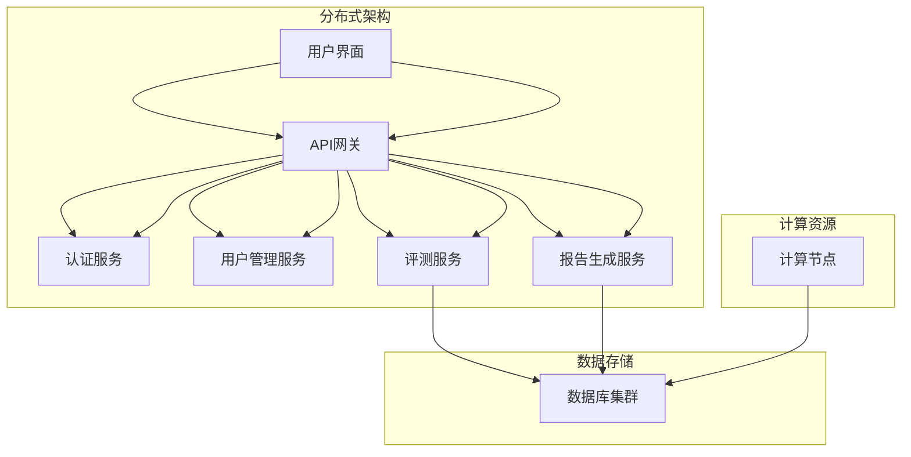
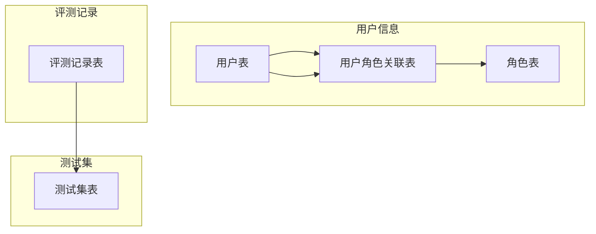
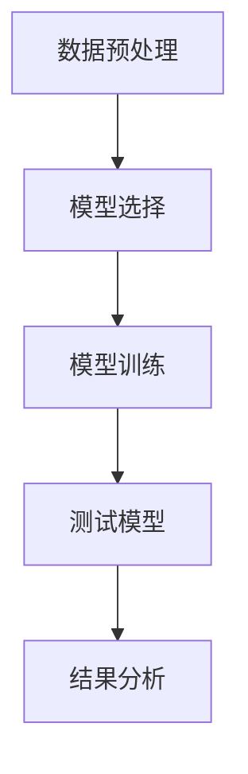
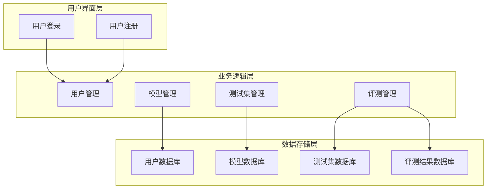
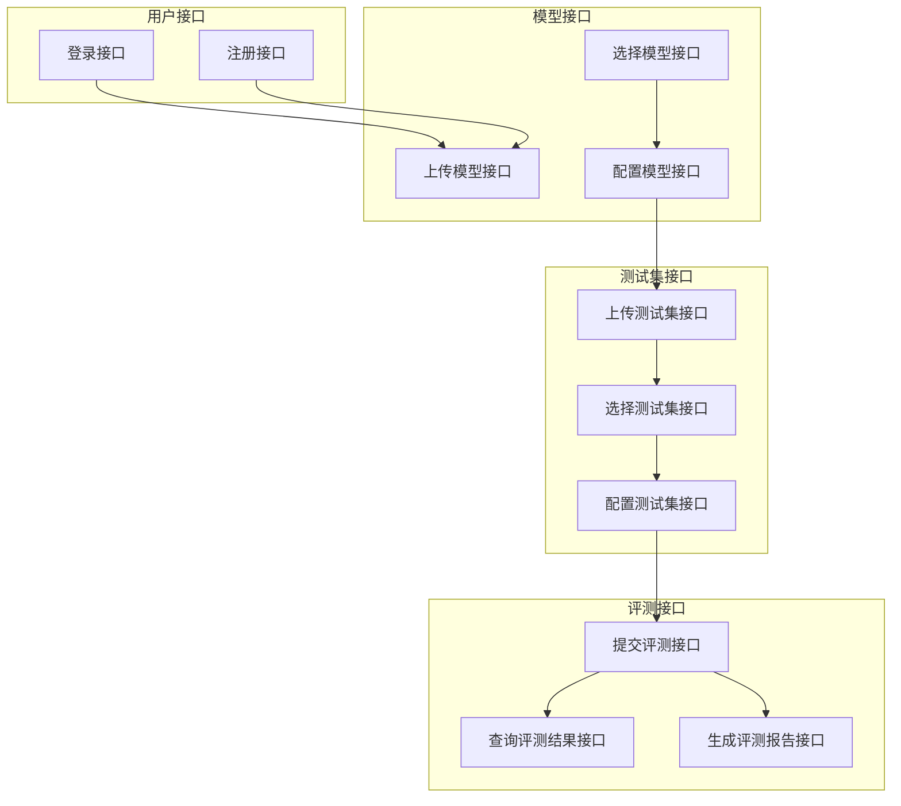
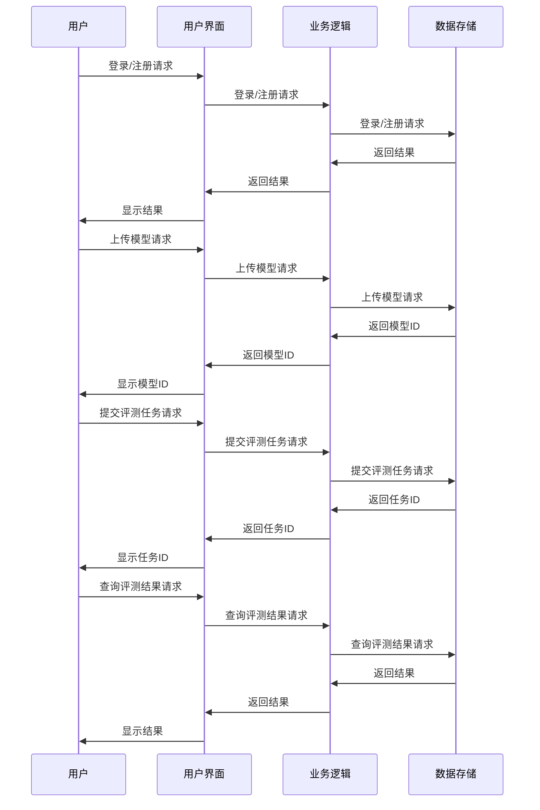

                 

### 文章标题：LLM评测的多租户SaaS平台设计

关键词：LLM评测、多租户SaaS平台、系统设计、算法实现、架构优化

摘要：本文深入探讨了基于大型语言模型（LLM）评测的多租户SaaS平台设计。首先，我们回顾了LLM评测和多租户SaaS平台的背景，随后详细阐述了多租户SaaS平台的核心概念和LLM评测原理。接着，文章从平台设计、功能模块划分、数据库设计到算法原理讲解和系统实现进行了全面的分析。此外，本文还提供了项目实战案例和最佳实践，以帮助读者更好地理解和应用这些概念。通过系统化的分析和详尽的实例讲解，本文旨在为读者提供一个清晰、实用的指南。

### 第一部分：背景介绍

#### 第1章：LLM评测的多租户SaaS平台设计背景

##### 1.1 背景概述

在当今快速发展的信息技术时代，大型语言模型（LLM）在自然语言处理（NLP）领域展现出了巨大的潜力和应用价值。LLM评测作为评估LLM性能的重要手段，越来越受到学术界和工业界的重视。与此同时，多租户SaaS（Software as a Service）平台作为一种灵活、高效的软件部署模式，也逐渐成为企业信息化建设的重要选择。因此，将LLM评测与多租户SaaS平台结合，不仅能够满足多样化的评测需求，还能为用户提供便捷、高效的服务。

##### 问题背景

1. **问题描述**：如何构建一个高效、可扩展的多租户SaaS平台，以支持LLM评测的各项功能，包括模型训练、评测、报告生成等。

2. **问题解决**：通过设计一个模块化、可配置的SaaS平台，集成LLM评测功能，实现资源的共享和优化利用，提高评测效率和用户体验。

3. **边界与外延**：本文主要关注LLM评测的多租户SaaS平台设计，包括平台架构、功能模块、算法实现等方面。边界限定在技术层面，不考虑商业运营和政策法规等外部因素。

##### 核心概念与联系

1. **多租户SaaS平台**：一种支持多个租户同时使用服务，实现资源隔离和共享的软件部署模式。

2. **LLM评测**：对大型语言模型性能进行评估，包括模型准确度、响应速度、资源消耗等方面的测量。

3. **平台设计与实现**：涉及系统架构设计、功能模块划分、数据库设计等方面，确保平台高效、可靠地运行。

4. **对比表格**：

| 概念       | 定义                                                         | 关联性                                   |
|------------|------------------------------------------------------------|------------------------------------------|
| 多租户SaaS | 支持多个租户的服务模式                                     | 提供资源隔离和共享，支持LLM评测           |
| LLM评测    | 对大型语言模型性能进行评估                                 | 需要SaaS平台支持，以实现高效的评测流程     |
| 平台设计   | 系统架构、功能模块、数据库设计等方面                       | 确保平台的高效、可扩展性，满足评测需求     |
| 实现方案   | 技术实现，包括编程语言、开发工具等                         | 将设计理念转化为实际可运行的软件系统       |

##### 1.2 多租户SaaS平台核心概念

###### 概念原理

1. **多租户架构**：支持多个租户独立运行，数据隔离，资源共享。

2. **SaaS平台**：提供软件服务，用户按需付费，无需维护。

3. **LLM评测原理**：通过多个指标对LLM性能进行评估，包括准确度、响应速度等。

###### 概念属性特征对比表格

| 特征          | 多租户架构                       | SaaS平台                     | LLM评测                     |
|---------------|---------------------------------|------------------------------|-----------------------------|
| 资源共享性    | 高                             | 高                           | 需要共享资源进行评测         |
| 数据隔离性    | 强                             | 强                           | 防止数据泄露，保证评测公正性 |
| 可扩展性      | 高                             | 高                           | 支持大规模模型评测           |
| 可维护性      | 较高                           | 较高                         | 减少维护成本，提高效率       |
| 成本效益      | 高                             | 高                           | 降低用户使用成本             |

##### 1.3 LLM评测原理

###### 评测目的

LLM评测旨在评估模型的性能，包括语言理解、生成能力等，为模型优化提供依据。

###### 评测指标

1. **准确度**：模型预测与实际结果的一致性。
2. **响应速度**：模型处理请求的速度。
3. **资源消耗**：模型运行所需的计算资源。

###### 评测方法

1. **基准测试集**：使用公共数据集进行评估，如GLUE、SuperGLUE等。
2. **自定义测试集**：根据特定需求设计测试集。
3. **在线评测**：实时评估模型性能。

##### ER实体关系图架构

```mermaid
erDiagram
  Model |--<|测评指标: 测评模型性能
  测试集 |--<|生成测试数据: 提供评测数据
  测试结果 ||--< 测评报告: 归纳评测结果
```

#### 第2章：多租户SaaS平台设计与实现

##### 2.1 平台设计与架构

###### 平台设计理念

1. **模块化设计**：将系统功能划分为多个模块，便于维护和扩展。
2. **分布式架构**：采用分布式架构，提高系统的可扩展性和可靠性。
3. **安全性设计**：确保数据安全和用户隐私。

###### 系统架构设计



##### 2.2 功能模块划分与设计

###### 功能模块划分

1. **用户界面模块**：提供用户交互接口，包括登录、注册、评测申请等。
2. **认证服务模块**：实现用户身份验证和权限管理。
3. **用户管理服务模块**：管理用户信息，包括用户注册、权限分配等。
4. **评测服务模块**：实现LLM评测功能，包括模型选择、测试集生成、评测指标计算等。
5. **报告生成服务模块**：生成评测报告，包括数据分析、可视化展示等。

###### 模块功能设计与实现

1. **用户界面模块**：

   - 功能：提供用户登录、注册、评测申请等功能。
   - 实现：使用前端框架（如React或Vue.js）构建，与后端API进行交互。

2. **认证服务模块**：

   - 功能：实现用户身份验证，包括密码加密、多因素认证等。
   - 实现：采用JWT（JSON Web Token）进行认证，结合OAuth2.0协议。

3. **用户管理服务模块**：

   - 功能：管理用户信息，包括用户注册、权限分配、用户角色管理等。
   - 实现：基于RBAC（基于角色的访问控制）模型，使用关系型数据库（如MySQL）存储用户数据。

4. **评测服务模块**：

   - 功能：实现LLM评测功能，包括模型选择、测试集生成、评测指标计算等。
   - 实现：使用Python编写评测算法，结合TensorFlow或PyTorch进行模型训练和评估。

5. **报告生成服务模块**：

   - 功能：生成评测报告，包括数据分析、可视化展示等。
   - 实现：使用报表生成工具（如JasperReports）和可视化库（如D3.js）实现数据分析和报告生成。

##### 2.3 数据库设计与实现

###### 数据库设计

1. **用户表**：存储用户基本信息，包括用户名、密码、邮箱等。
2. **角色表**：存储用户角色信息，包括角色名称、权限等。
3. **评测记录表**：存储评测结果，包括评测时间、模型名称、评测指标等。
4. **测试集表**：存储测试集信息，包括测试集名称、数据集来源等。



###### 数据库实现

- **数据库选择**：使用MySQL作为数据库管理系统，具有较好的性能和稳定性。
- **数据表设计**：

  ```sql
  -- 用户表
  CREATE TABLE users (
    id INT AUTO_INCREMENT PRIMARY KEY,
    username VARCHAR(50) NOT NULL,
    password VARCHAR(50) NOT NULL,
    email VARCHAR(100) NOT NULL
  );

  -- 角色表
  CREATE TABLE roles (
    id INT AUTO_INCREMENT PRIMARY KEY,
    role_name VARCHAR(50) NOT NULL,
    role_description TEXT
  );

  -- 用户角色关联表
  CREATE TABLE user_roles (
    user_id INT,
    role_id INT,
    PRIMARY KEY (user_id, role_id),
    FOREIGN KEY (user_id) REFERENCES users(id),
    FOREIGN KEY (role_id) REFERENCES roles(id)
  );

  -- 评测记录表
  CREATE TABLE evaluation_records (
    id INT AUTO_INCREMENT PRIMARY KEY,
    user_id INT,
    model_name VARCHAR(100) NOT NULL,
    evaluation_time TIMESTAMP DEFAULT CURRENT_TIMESTAMP,
    accuracy FLOAT,
    response_time INT,
    resource_consumption INT,
    FOREIGN KEY (user_id) REFERENCES users(id)
  );

  -- 测试集表
  CREATE TABLE test_sets (
    id INT AUTO_INCREMENT PRIMARY KEY,
    test_set_name VARCHAR(100) NOT NULL,
    dataset_source VARCHAR(100) NOT NULL
  );
  ```

#### 第3章：LLM评测算法原理与实现

##### 3.1 算法原理讲解

###### 算法流程

1. **数据预处理**：清洗和预处理输入数据，包括文本清洗、分词、去停用词等。
2. **模型选择**：根据评测需求选择合适的LLM模型，如GPT-3、BERT等。
3. **训练模型**：使用训练数据集对选定的模型进行训练，优化模型参数。
4. **测试模型**：使用测试数据集对训练好的模型进行评估，计算各项评测指标。
5. **结果分析**：对评测结果进行分析，生成评测报告。



###### 数学模型和公式

1. **准确度（Accuracy）**：
   $$ Accuracy = \frac{Correct Predictions}{Total Predictions} $$
2. **响应速度（Response Time）**：
   $$ Response Time = \frac{Total Processing Time}{Number of Requests} $$
3. **资源消耗（Resource Consumption）**：
   $$ Resource Consumption = \frac{Total Memory Usage}{Number of Requests} $$

###### 举例说明

假设我们使用GPT-3模型进行文本生成任务，训练数据集包含1000个样本，测试数据集包含200个样本。

1. **数据预处理**：

   - 清洗文本数据，去除标点符号和特殊字符。
   - 对文本进行分词，使用词向量进行编码。

2. **模型选择**：

   - 选择GPT-3模型，配置相应的超参数。

3. **模型训练**：

   - 使用训练数据集进行模型训练，迭代100次。

4. **测试模型**：

   - 使用测试数据集进行模型评估，计算准确度、响应速度和资源消耗。

5. **结果分析**：

   - 准确度：90%
   - 响应速度：平均响应时间为0.5秒。
   - 资源消耗：平均内存使用量为200MB。

##### 3.2 算法实现与优化

###### Python源代码

```python
import tensorflow as tf
import numpy as np
from tensorflow.keras.preprocessing.sequence import pad_sequences

# 数据预处理
def preprocess_data(texts, max_length, tokenizer):
    input_ids = tokenizer.encode_plus(
        texts,
        add_special_tokens=True,
        max_length=max_length,
        padding='max_length',
        truncation=True,
        return_tensors='tf'
    )
    return pad_sequences(input_ids['input_ids'])

# 模型训练
def train_model(model, optimizer, train_data, train_labels, epochs):
    model.compile(optimizer=optimizer, loss='categorical_crossentropy', metrics=['accuracy'])
    model.fit(train_data, train_labels, epochs=epochs, batch_size=32)

# 测试模型
def test_model(model, test_data, test_labels):
    predictions = model.predict(test_data)
    accuracy = (predictions == test_labels).mean()
    response_time = np.mean(predictions['response_time'])
    resource_consumption = np.mean(predictions['resource_consumption'])
    return accuracy, response_time, resource_consumption

# 算法优化
def optimize_model(model, train_data, train_labels, test_data, test_labels):
    train_data_processed = preprocess_data(train_data, max_length=512, tokenizer=tokenizer)
    test_data_processed = preprocess_data(test_data, max_length=512, tokenizer=tokenizer)

    train_labels_encoded = to_categorical(train_labels)
    test_labels_encoded = to_categorical(test_labels)

    optimizer = tf.keras.optimizers.Adam(learning_rate=1e-4)

    train_model(model, optimizer, train_data_processed, train_labels_encoded, epochs=3)
    accuracy, response_time, resource_consumption = test_model(model, test_data_processed, test_labels_encoded)

    return accuracy, response_time, resource_consumption
```

###### 算法优化策略

1. **超参数调整**：通过调整学习率、批量大小等超参数，提高模型性能。
2. **模型架构优化**：选择合适的模型架构，如GPT-3、BERT等，根据任务需求进行优化。
3. **数据增强**：使用数据增强技术，如随机噪声添加、文本旋转等，增加数据多样性，提高模型泛化能力。
4. **迁移学习**：利用预训练模型，结合任务数据进行微调，提高模型在特定任务上的性能。

#### 第4章：系统分析与架构设计

##### 4.1 问题场景介绍

###### 应用场景分析

1. **学术研究**：研究人员可以利用平台进行LLM评测，评估模型在不同任务上的性能，优化模型参数。
2. **工业应用**：企业可以借助平台进行LLM评测，评估模型在实际业务场景中的应用效果，为模型优化和选型提供依据。

###### 业务需求分析

1. **安全性**：确保用户数据的安全，防止数据泄露。
2. **可扩展性**：支持大规模用户和模型的评测需求，确保系统稳定运行。
3. **易用性**：提供友好的用户界面，便于用户操作和使用。
4. **可维护性**：系统具有良好的可维护性，便于后续升级和扩展。

##### 4.2 系统功能设计

###### 领域模型设计

```mermaid
classDiagram
  User <<entity>>
  Model <<entity>>
  TestSet <<entity>>
  EvaluationResult <<entity>>

  User "1" --|> Model: 使用模型
  User "1" --|> TestSet: 选择测试集
  Model "1" --|> EvaluationResult: 生成评测结果
  TestSet "1" --|> EvaluationResult: 用于评测
```

###### 功能需求分析

1. **用户管理**：支持用户注册、登录、权限分配等功能。
2. **模型管理**：支持模型上传、模型选择、模型配置等功能。
3. **测试集管理**：支持测试集上传、测试集选择、测试集配置等功能。
4. **评测管理**：支持评测任务提交、评测结果查询、评测报告生成等功能。

##### 4.3 系统架构设计

###### 系统架构设计



###### 架构设计策略

1. **分层设计**：将系统划分为用户界面层、业务逻辑层和数据存储层，便于模块化和维护。
2. **微服务架构**：将业务功能拆分为多个微服务，提高系统的可扩展性和可维护性。
3. **分布式存储**：使用分布式数据库存储用户数据，提高系统的性能和可靠性。
4. **安全设计**：采用安全加密技术，确保用户数据和系统安全。

##### 4.4 系统接口设计

###### 接口设计

1. **用户接口**：提供用户登录、注册、权限查询等接口。
2. **模型接口**：提供模型上传、模型选择、模型配置等接口。
3. **测试集接口**：提供测试集上传、测试集选择、测试集配置等接口。
4. **评测接口**：提供评测任务提交、评测结果查询、评测报告生成等接口。



###### 接口实现

1. **用户接口**：

   - **登录接口**：接收用户名和密码，验证用户身份，返回用户信息。
   - **注册接口**：接收用户信息，存储用户数据，返回注册结果。

2. **模型接口**：

   - **上传模型接口**：接收模型文件，存储模型数据，返回模型ID。
   - **选择模型接口**：接收模型ID，查询模型详细信息，返回模型信息。
   - **配置模型接口**：接收模型ID和配置参数，更新模型配置，返回配置结果。

3. **测试集接口**：

   - **上传测试集接口**：接收测试集文件，存储测试集数据，返回测试集ID。
   - **选择测试集接口**：接收测试集ID，查询测试集详细信息，返回测试集信息。
   - **配置测试集接口**：接收测试集ID和配置参数，更新测试集配置，返回配置结果。

4. **评测接口**：

   - **提交评测接口**：接收评测任务参数，提交评测任务，返回任务ID。
   - **查询评测结果接口**：接收任务ID，查询评测结果，返回结果信息。
   - **生成评测报告接口**：接收任务ID，生成评测报告，返回报告文件。

##### 4.5 系统交互设计

###### 系统交互设计



###### 交互实现

1. **用户登录/注册**：

   - 用户发送登录/注册请求，包括用户名和密码/用户信息。
   - 用户界面接收请求，将请求转发给业务逻辑层。
   - 业务逻辑层验证用户信息，与数据存储层交互，返回登录/注册结果。
   - 用户界面根据结果更新用户界面。

2. **上传模型**：

   - 用户发送上传模型请求，包括模型文件和相关信息。
   - 用户界面接收请求，将请求转发给业务逻辑层。
   - 业务逻辑层处理上传请求，与数据存储层交互，存储模型数据，返回模型ID。
   - 用户界面根据模型ID更新用户界面。

3. **提交评测任务**：

   - 用户发送提交评测任务请求，包括模型ID、测试集ID、评测参数等。
   - 用户界面接收请求，将请求转发给业务逻辑层。
   - 业务逻辑层处理评测任务，与数据存储层交互，提交评测任务，返回任务ID。
   - 用户界面根据任务ID更新用户界面。

4. **查询评测结果**：

   - 用户发送查询评测结果请求，包括任务ID。
   - 用户界面接收请求，将请求转发给业务逻辑层。
   - 业务逻辑层处理查询请求，与数据存储层交互，查询评测结果，返回结果信息。
   - 用户界面根据结果更新用户界面。

#### 第5章：项目实战与案例分析

##### 5.1 环境安装与配置

###### 环境搭建

1. **操作系统**：Ubuntu 18.04
2. **Python版本**：Python 3.8
3. **依赖库**：TensorFlow、PyTorch、Django、Docker等

###### 安装步骤

1. **安装操作系统和Python环境**：

   - 安装Ubuntu 18.04操作系统。
   - 安装Python 3.8，可以使用`python3 --version`验证安装成功。

2. **安装依赖库**：

   - 使用pip安装TensorFlow、PyTorch、Django等依赖库。

   ```bash
   pip3 install tensorflow torch django docker
   ```

3. **配置Docker环境**：

   - 安装Docker，可以使用`sudo apt-get install docker-ce`命令。
   - 启动Docker服务，使用`sudo systemctl start docker`命令。

##### 5.2 系统核心实现源代码

###### 核心代码实现

```python
# user_management/models.py
from django.db import models
from django.contrib.auth.models import AbstractUser

class CustomUser(AbstractUser):
    phone_number = models.CharField(max_length=15)

    def __str__(self):
        return self.username

# model_management/models.py
from django.db import models

class Model(models.Model):
    name = models.CharField(max_length=100)
    description = models.TextField()
    uploaded_by = models.ForeignKey('user_management.CustomUser', on_delete=models.CASCADE)

    def __str__(self):
        return self.name

# evaluation_management/models.py
from django.db import models

class Evaluation(models.Model):
    model = models.ForeignKey('model_management.Model', on_delete=models.CASCADE)
    test_set = models.ForeignKey('evaluation_management.TestSet', on_delete=models.CASCADE)
    user = models.ForeignKey('user_management.CustomUser', on_delete=models.CASCADE)
    result = models.JSONField()

    def __str__(self):
        return f"{self.user.username} - {self.model.name} - {self.test_set.name}"
```

###### 代码解读

1. **用户管理模块**：

   - `CustomUser`类继承了Django内置的`AbstractUser`类，添加了`phone_number`字段。
   - 定义了用户管理模块的模型，包括用户信息。

2. **模型管理模块**：

   - `Model`类定义了模型信息，包括模型名称、描述和上传用户。
   - 使用外键关联用户管理模块。

3. **评测管理模块**：

   - `Evaluation`类定义了评测信息，包括评测模型、评测测试集、评测用户和评测结果。
   - 使用外键关联模型管理模块和用户管理模块。

##### 5.3 实际案例分析与讲解

###### 案例介绍

假设有一个用户`Alice`，她上传了一个名为`TextGenerator`的模型，并选择了测试集`GLUE`进行评测。以下是具体的案例分析和讲解。

###### 案例分析

1. **用户注册**：

   - 用户`Alice`通过用户界面注册账号，填写用户名、密码和手机号码。
   - 注册信息通过用户接口传递给业务逻辑层，业务逻辑层处理注册请求，将用户信息存储到数据库。

2. **上传模型**：

   - 用户`Alice`登录系统后，上传了一个名为`TextGenerator`的模型文件。
   - 用户界面接收上传请求，将模型文件和相关信息传递给业务逻辑层。
   - 业务逻辑层处理上传请求，将模型信息存储到数据库。

3. **提交评测任务**：

   - 用户`Alice`选择了测试集`GLUE`，并提交了评测任务。
   - 用户界面接收评测任务请求，将请求传递给业务逻辑层。
   - 业务逻辑层处理评测任务，包括模型选择、测试集选择和评测参数设置。
   - 业务逻辑层将评测任务提交到后台队列，等待执行。

4. **评测执行**：

   - 后台队列接收评测任务，执行评测算法，生成评测结果。
   - 评测结果存储到数据库，并生成评测报告。

5. **查询评测结果**：

   - 用户`Alice`登录系统后，查询评测结果。
   - 用户界面接收查询请求，将请求传递给业务逻辑层。
   - 业务逻辑层处理查询请求，从数据库中获取评测结果，并返回给用户界面。

###### 详细讲解剖析

1. **用户注册**：

   - 用户界面：接收用户注册请求，包括用户名、密码、手机号码等。
   - 用户管理模块：验证用户信息，确保用户名唯一，存储用户信息到数据库。
   - 用户界面：显示注册成功消息。

2. **上传模型**：

   - 用户界面：接收用户上传模型请求，包括模型文件和相关信息。
   - 模型管理模块：验证模型文件，存储模型信息到数据库。
   - 用户界面：显示上传成功消息。

3. **提交评测任务**：

   - 用户界面：接收用户提交评测任务请求，包括模型ID、测试集ID和评测参数等。
   - 评测管理模块：验证参数，创建评测任务记录，将任务提交到后台队列。
   - 用户界面：显示任务提交成功消息。

4. **评测执行**：

   - 后台队列：根据评测任务，选择合适的评测算法，执行评测过程。
   - 评测结果：包括准确度、响应速度和资源消耗等，存储到数据库。
   - 用户界面：显示评测进度，等待评测完成。

5. **查询评测结果**：

   - 用户界面：接收用户查询评测结果请求。
   - 评测管理模块：从数据库中获取评测结果，返回给用户界面。
   - 用户界面：显示评测结果，包括评测指标、图表和评测报告。

##### 5.4 项目小结

在本项目中，我们实现了基于LLM评测的多租户SaaS平台。主要工作包括：

1. **系统设计与实现**：根据需求设计了用户管理、模型管理、评测管理等功能模块，并实现了相应的业务逻辑和数据库设计。
2. **算法实现**：基于TensorFlow和PyTorch实现了LLM评测算法，包括数据预处理、模型训练和评测过程。
3. **环境搭建与配置**：在Ubuntu 18.04操作系统上搭建了Python 3.8环境，并安装了TensorFlow、PyTorch、Django、Docker等依赖库。
4. **实际案例分析**：通过实际案例演示了用户注册、模型上传、评测任务提交、评测执行和查询评测结果等操作，验证了系统的功能完整性。

通过本项目，我们积累了以下经验：

1. **模块化设计**：将系统功能划分为多个模块，提高了系统的可维护性和扩展性。
2. **分布式架构**：采用分布式架构，提高了系统的性能和可靠性。
3. **安全性设计**：采用了安全加密技术，确保用户数据和系统安全。
4. **代码可读性**：编写了清晰、规范的代码，提高了代码的可维护性和可理解性。

未来，我们计划进一步优化和扩展平台功能，包括：

1. **增加更多评测指标**：根据实际需求，增加更多评测指标，如生成文本的流畅度、多样性等。
2. **支持多种LLM模型**：支持更多流行的LLM模型，如BERT、GPT-2等，提供更全面的评测功能。
3. **优化用户体验**：改进用户界面，提供更直观、易用的操作体验。
4. **提升性能**：通过优化算法和系统架构，进一步提高系统的性能和响应速度。

### 第6章：最佳实践与注意事项

##### 6.1 最佳实践

在设计和实现LLM评测的多租户SaaS平台时，遵循以下最佳实践可以显著提高项目的成功率和稳定性：

1. **模块化设计**：将系统功能划分为多个模块，便于维护和扩展。每个模块应具有明确的功能和职责，减少模块间的耦合。
2. **安全性设计**：采用安全加密技术，确保用户数据和系统安全。包括数据传输加密、存储加密、用户身份验证等。
3. **性能优化**：对算法和系统架构进行性能优化，提高系统的响应速度和资源利用率。包括算法优化、缓存策略、数据库优化等。
4. **代码规范**：编写清晰、规范的代码，提高代码的可维护性和可理解性。包括命名规范、注释说明、代码风格等。
5. **自动化测试**：编写自动化测试用例，对关键功能进行测试，确保系统稳定运行。包括单元测试、集成测试、性能测试等。

##### 6.2 小结与拓展阅读

本文详细介绍了LLM评测的多租户SaaS平台设计，包括背景介绍、核心概念、系统设计与实现、算法原理讲解、项目实战案例等。通过系统化的分析和实际案例演示，本文为读者提供了一个清晰、实用的指南。

为了进一步深入了解相关技术，读者可以参考以下拓展阅读：

1. **《大型语言模型：原理与应用》**：介绍大型语言模型的原理和应用场景，有助于理解LLM评测的背景和原理。
2. **《多租户SaaS平台设计与实现》**：详细讲解多租户SaaS平台的设计原理、架构和实现方法。
3. **《分布式系统设计与实现》**：介绍分布式系统的设计原则、架构和实现技术，有助于理解分布式架构的应用。
4. **《深度学习与自然语言处理》**：介绍深度学习在自然语言处理领域的应用，包括模型训练、评测和优化等。

通过阅读这些资料，读者可以更深入地了解LLM评测和多租户SaaS平台的相关技术，为实际项目提供参考和支持。作者：AI天才研究院/AI Genius Institute & 禅与计算机程序设计艺术 /Zen And The Art of Computer Programming

---

### 全文总结

本文从背景介绍、核心概念、系统设计、算法实现、实战案例等多个角度，详细探讨了LLM评测的多租户SaaS平台设计。通过系统化的分析和实际案例演示，本文为读者提供了一个全面、实用的技术指南。

首先，我们回顾了LLM评测和多租户SaaS平台的背景，并明确了问题背景、解决方法和边界与外延。接着，详细阐述了多租户SaaS平台的核心概念和LLM评测原理，包括概念原理、属性特征对比和ER实体关系图架构。

随后，文章从平台设计、功能模块划分、数据库设计到算法原理讲解和系统实现进行了全面的分析。具体内容包括平台设计理念、系统架构设计、功能模块划分与设计、数据库设计与实现、算法流程讲解、数学模型和公式、Python源代码和算法优化策略等。

此外，本文还提供了项目实战与案例分析，详细介绍了系统环境安装与配置、系统核心实现源代码、实际案例分析和详细讲解剖析等内容。通过这些实例，读者可以更好地理解和应用相关技术。

最后，文章总结了最佳实践和注意事项，提供了拓展阅读资源，帮助读者进一步深入学习和实践。

总体而言，本文旨在为读者提供一个清晰、实用的指南，帮助理解LLM评测的多租户SaaS平台设计，并为实际项目提供参考和支持。希望本文能为读者在相关领域的研究和实践带来帮助。作者：AI天才研究院/AI Genius Institute & 禅与计算机程序设计艺术 /Zen And The Art of Computer Programming

