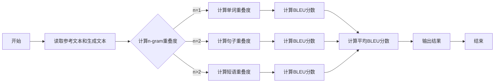
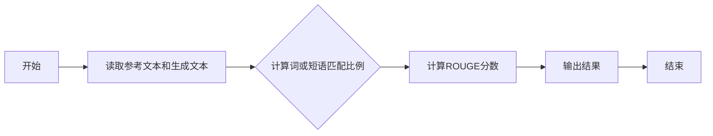
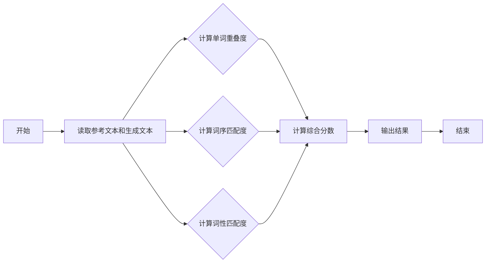
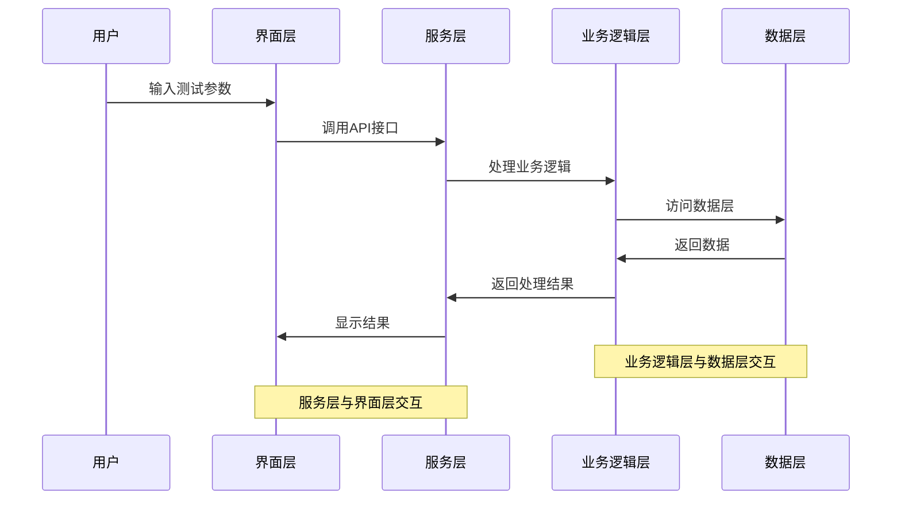

                 

### 第1章：问题背景与核心概念

#### 1.1 评测在LLM中的应用

随着深度学习技术的不断发展和人工智能的广泛应用，自然语言处理（NLP）领域也取得了显著的进步。特别是大型语言模型（Large Language Models，简称LLM）如GPT-3、BERT等的出现，使得机器在文本生成、翻译、问答等方面的表现越来越接近人类水平。然而，为了确保这些模型的性能和可靠性，评测成为了一个不可或缺的环节。

LLM评测的主要目标是对模型的输出质量进行量化评估，从而帮助研究者了解模型的优势和不足。具体来说，评测包括以下几个方面：

1. **生成文本的质量**：评估模型生成文本的流畅性、连贯性和语法正确性。
2. **回答问题的准确性**：评估模型在回答各种类型问题时的准确性，包括事实性问题和开放性问题。
3. **文本理解的深度**：评估模型对输入文本的理解程度，包括上下文感知、情感分析等。

#### 1.2 自动化测试的重要性

在软件开发过程中，自动化测试被广泛采用，以提高软件质量、降低成本、加速开发周期。同样地，在LLM评测中，自动化测试同样具有重要的作用：

1. **效率提升**：自动化测试可以大大提高评测的效率，减少人工测试的时间和成本。
2. **可重复性**：自动化测试可以确保评测结果的一致性和可重复性，减少人为误差。
3. **全面性**：自动化测试可以覆盖更广泛的测试场景，提高评测的全面性。

#### 1.3 LLM评测自动化测试的挑战

尽管自动化测试在LLM评测中具有明显优势，但同时也面临一些挑战：

1. **LLM的复杂性**：LLM通常包含数亿个参数，模型的结构和功能非常复杂，使得自动化测试变得困难。
2. **数据质量**：自动化测试需要高质量的测试数据，但获取和标注高质量的数据是一个挑战。
3. **工具的局限性**：现有的自动化测试工具大多是针对通用软件开发的，对于LLM评测的特殊需求支持有限。

#### 1.4 书籍概述与结构

本书籍旨在系统地介绍LLM评测的自动化测试流程，帮助读者了解和掌握这一领域的关键技术。全书共分为四个部分：

1. **第一部分：引言**：介绍评测在LLM中的应用、自动化测试的重要性以及自动化测试在LLM评测中的挑战。
2. **第二部分：LLM评测自动化测试流程**：详细讲解自动化测试的基本概念、LLM评测的关键概念以及如何进行自动化测试。
3. **第三部分：系统分析与架构设计**：介绍系统功能设计、系统架构设计以及如何实现自动化测试系统。
4. **第四部分：项目实战**：通过具体的实战案例，展示如何进行环境安装、代码实现、代码解读和分析等，并提供最佳实践和总结。

通过本书籍的学习，读者将能够深入了解LLM评测的自动化测试流程，掌握相关技术和方法，为实际项目提供有力支持。接下来，我们将逐步深入探讨各个部分的内容。

## 第2章：核心概念与联系

### 2.1 自动化测试的基本概念

自动化测试是软件测试的一个重要分支，旨在通过自动化的测试工具和脚本，对软件进行系统的测试，以确保软件的质量和性能。自动化测试的基本概念包括以下几个方面：

1. **定义**：自动化测试是指通过预定义的测试脚本和工具，对软件进行自动化的验证和验证，以发现潜在的问题和缺陷。

2. **类型**：根据测试的目标和范围，自动化测试可以分为多种类型，如单元测试、集成测试、系统测试、性能测试等。

3. **流程**：自动化测试的流程通常包括测试设计、测试执行、测试结果分析和测试报告等步骤。其中，测试设计是关键，决定了自动化测试的效果。

### 2.2 LLM评测的关键概念

LLM评测是对大型语言模型（Large Language Models）的输出质量进行量化评估的过程。LLM评测的关键概念包括：

1. **定义**：LLM评测是指通过一系列的评估指标和方法，对大型语言模型的生成文本质量、回答问题的准确性和文本理解的深度等方面进行评估。

2. **评测指标**：常见的评测指标包括BLEU、ROUGE、METEOR等，这些指标用于衡量生成文本与目标文本的相似度。

3. **评测方法**：LLM评测的方法包括人工评测和自动化评测。其中，自动化评测通过预定义的算法和工具，对模型生成文本进行评估。

### 2.3 概念属性特征对比表格

为了更好地理解自动化测试和LLM评测的关系，我们可以通过一个概念属性特征对比表格来展示两者之间的异同：

| 概念                | 自动化测试                | LLM评测                      |
|---------------------|--------------------------|-----------------------------|
| 定义                | 自动化的软件测试         | 对大型语言模型输出质量的评估 |
| 类型                | 单元测试、集成测试等     | 文本质量、回答准确性等       |
| 目标                | 发现软件缺陷            | 衡量模型输出质量             |
| 工具                | 测试工具、脚本           | 评测工具、算法               |
| 数据源              | 测试用例、缺陷报告       | 文本数据、评测指标           |
| 测试过程            | 自动执行、结果分析       | 自动执行、结果评估           |
| 关键要素            | 测试脚本、测试环境       | 评测指标、评测算法           |

### 2.4 ER实体关系图架构

为了更直观地展示自动化测试和LLM评测的关系，我们可以使用ER（Entity-Relationship）实体关系图来描述两者的架构。ER图可以清晰地展示实体及其之间的关系，有助于理解系统设计和数据流动。

以下是自动化测试和LLM评测的ER实体关系图：

```mermaid
erDiagram
    TestSuite ||--|{ TestCase : "包含测试用例" }
    TestCase ||--|{ TestResult : "包含测试结果" }
    LLMTestSuite ||--|{ LLMPredictResult : "包含LLM预测结果" }
    LLMPredictResult ||--|{ EvaluationScore : "包含评测分数" }
    TestCase ..|.. TestSuite
    TestCase ..|.. LLMPredictResult
```

在这个ER图中，`TestSuite`代表测试套件，包含多个`TestCase`（测试用例），每个`TestCase`可以生成一个或多个`TestResult`（测试结果）。对于LLM评测，我们引入了`LLMTestSuite`和`LLMPredictResult`两个实体，其中`LLMTestSuite`包含多个`LLMPredictResult`，每个`LLMPredictResult`都包含一个`EvaluationScore`（评测分数）。

通过这个ER图，我们可以清晰地看到自动化测试和LLM评测之间的数据流和关系，为系统设计和实现提供了明确的指导。

### 第3章：算法原理讲解

#### 3.1 常见评测算法简介

在LLM评测中，常见的评测算法包括BLEU、ROUGE、METEOR等，这些算法广泛应用于自然语言处理领域，用于衡量生成文本与目标文本的相似度。以下是这些算法的基本介绍：

1. **BLEU（Bilingual Evaluation Understudy）**：BLEU是一种基于记分的算法，通过计算生成文本与参考文本之间的重叠度来评估文本质量。BLEU的评估标准包括单词重叠度、句子重叠度和短语重叠度等。

2. **ROUGE（Recall-Oriented Understudy for Gisting Evaluation）**：ROUGE是一种用于评估文本相似度的算法，特别适用于自动文摘和机器翻译。ROUGE通过计算生成文本中与参考文本匹配的词或短语的比例来评估文本质量。

3. **METEOR（Metric for Evaluation of Translation with Explicit ORdering）**：METEOR是一种综合性的文本相似度评估算法，它结合了单词重叠度、词序和词性等信息，通过计算这些信息的加权平均来评估文本相似度。

这些算法各有优缺点，适用于不同的评测场景。BLEU简单易用，但可能过于依赖单词重叠度；ROUGE侧重于词或短语的匹配，但在长文本中表现较差；METEOR综合了多种信息，但计算复杂度较高。

#### 3.2 算法mermaid流程图

为了更直观地展示这些评测算法的流程，我们可以使用mermaid绘制相应的流程图。以下是BLEU算法的mermaid流程图：



在这个流程图中，A表示开始，B表示读取参考文本和生成文本，C表示计算n-gram重叠度，D1、D2、D3分别表示计算单词重叠度、句子重叠度和短语重叠度，E1、E2、E3表示计算BLEU分数，F表示计算平均BLEU分数，G表示输出结果，H表示结束。

类似的，我们可以绘制ROUGE和METEOR的mermaid流程图，以展示它们的基本流程。以下是ROUGE算法的mermaid流程图：



METEOR算法的mermaid流程图如下：



通过这些mermaid流程图，我们可以更清晰地理解各个评测算法的基本步骤和计算过程，为后续的代码实现和原理讲解提供基础。

#### 3.3 Python源代码详细阐述

为了更好地理解评测算法的实现原理，我们将使用Python编写相应的代码。以下是BLEU算法的Python代码实现：

```python
import nltk
from nltk.translate.bleu_score import sentence_bleu

# 读取参考文本和生成文本
ref_sentence = "The quick brown fox jumps over the lazy dog"
gen_sentence = "A quick brown fox jumps over the lazy dog"

# 计算n-gram重叠度
nltk.data.path = 'nltk_data'
nltk.download('tokenizers')
nltk.download('corpora')
nltk.download('wordnet')
nltk.download('stopwords')

def calculate_ngram_overlap(ref_sentence, gen_sentence, n):
    ref_tokens = nltk.word_tokenize(ref_sentence)
    gen_tokens = nltk.word_tokenize(gen_sentence)
    
    ref_ngrams = nltk.ngrams(ref_tokens, n)
    gen_ngrams = nltk.ngrams(gen_tokens, n)
    
    overlap = sum(1 for ref in ref_ngrams if ref in gen_ngrams)
    return overlap

# 计算单词重叠度、句子重叠度和短语重叠度
word_overlap = calculate_ngram_overlap(ref_sentence, gen_sentence, 1)
sentence_overlap = calculate_ngram_overlap(ref_sentence, gen_sentence, 2)
phrase_overlap = calculate_ngram_overlap(ref_sentence, gen_sentence, 3)

# 计算BLEU分数
bleu_score = sentence_bleu([ref_sentence.split()], gen_sentence.split())

# 计算平均BLEU分数
average_bleu_score = (word_overlap + sentence_overlap + phrase_overlap) / 3

# 输出结果
print("BLEU Score:", bleu_score)
print("Average BLEU Score:", average_bleu_score)
```

在这段代码中，我们首先导入了必要的Python库，包括`nltk`（自然语言处理库）和`sentence_bleu`（用于计算BLEU分数）。接着，我们定义了读取参考文本和生成文本的函数，并使用`nltk`库的`word_tokenize`方法对文本进行分词。

我们定义了一个计算n-gram重叠度的函数`calculate_ngram_overlap`，该函数接受参考文本、生成文本和n-gram大小作为参数，返回n-gram重叠度。在计算单词重叠度、句子重叠度和短语重叠度时，我们分别调用这个函数，并累加结果。

接下来，我们使用`sentence_bleu`函数计算BLEU分数，并计算平均BLEU分数。最后，我们打印出计算结果。

通过这段代码，我们可以清晰地看到BLEU算法的实现过程，包括读取文本、计算n-gram重叠度和计算BLEU分数。这为后续的算法原理讲解和代码解读提供了实践基础。

#### 3.4 算法原理的数学模型和公式

在详细讲解LLM评测的常见算法原理之前，我们需要先介绍一些基本的数学模型和公式。这些模型和公式帮助我们理解算法的核心思想和计算过程。

1. **N-gram模型**：N-gram模型是一种基于单词序列的概率模型，它通过统计相邻单词出现的频率来预测下一个单词。N-gram模型的核心公式如下：

   $$ P(w_n | w_{n-1}, w_{n-2}, \ldots, w_1) = \frac{C(w_{n-1}, w_n)}{\sum_{w' \in V} C(w_{n-1}, w')} $$

   其中，$w_n$表示第n个单词，$w_{n-1}$、$w_{n-2}$、$\ldots$、$w_1$表示前n-1个单词，$V$表示单词集合，$C(w_{n-1}, w_n)$表示单词$w_n$在给定前一个单词$w_{n-1}$的情况下出现的次数。

2. **重叠度**：重叠度是评测算法中的一个重要概念，用于衡量生成文本与参考文本之间的相似度。重叠度的计算公式如下：

   $$ \text{Overlap} = \frac{\text{Matched N-grams}}{\text{Total N-grams}} $$

   其中，Matched N-grams表示匹配的n-gram数量，Total N-grams表示总的n-gram数量。

3. **BLEU分数**：BLEU分数是一种用于评估文本质量的分数，它的计算公式如下：

   $$ \text{BLEU} = \frac{1}{N}\sum_{i=1}^{N} b_i \cdot p_i $$

   其中，$b_i$表示第i个权重，$p_i$表示第i个成分的分数。常见的权重包括单词重叠度（$b_1$）、句子重叠度（$b_2$）和短语重叠度（$b_3$），它们的计算公式如下：

   $$ b_1 = \frac{\text{Total Matched Words}}{\text{Total Words in Reference}} $$
   $$ b_2 = \frac{\text{Total Matched Sentences}}{\text{Total Sentences in Reference}} $$
   $$ b_3 = \frac{\text{Total Matched Phrases}}{\text{Total Phrases in Reference}} $$

   $p_i$表示第i个成分的分数，它的计算公式如下：

   $$ p_i = 1 - \frac{\text{Missing Words}}{\text{Total Words in Reference}} $$

   其中，Missing Words表示在生成文本中缺失的单词数量。

4. **ROUGE分数**：ROUGE分数是一种用于评估文本相似度的分数，它的计算公式如下：

   $$ \text{ROUGE} = \frac{\text{Matched Word or Phrase}}{\text{Total Word or Phrase}} $$

   其中，Matched Word or Phrase表示匹配的词或短语数量，Total Word or Phrase表示总的词或短语数量。

5. **METEOR分数**：METEOR分数是一种综合性的文本相似度评估分数，它的计算公式如下：

   $$ \text{METEOR} = \alpha \cdot p_1 + \beta \cdot p_2 + \gamma \cdot p_3 $$

   其中，$\alpha$、$\beta$、$\gamma$分别表示单词重叠度、词序匹配度和词性匹配度的权重，$p_1$、$p_2$、$p_3$分别表示对应的分数，它们的计算公式如下：

   $$ p_1 = \frac{\text{Common Words}}{\text{Total Unique Words in Both Texts}} $$
   $$ p_2 = \frac{\text{Matching Order}}{\text{Total Orders in Common Words}} $$
   $$ p_3 = \frac{\text{Common Word Forms}}{\text{Total Word Forms in Both Texts}} $$

通过这些数学模型和公式，我们可以更深入地理解LLM评测的常见算法原理。接下来，我们将通过具体例子来说明这些算法的应用。

#### 3.5 举例说明

为了更好地理解LLM评测的常见算法，我们将通过具体例子来说明BLEU、ROUGE和METEOR算法的应用。以下是一个简单的例子，用于说明这些算法的基本计算过程。

假设我们有一个参考文本（Reference）和生成文本（Generated），如下所示：

**参考文本**：The quick brown fox jumps over the lazy dog.

**生成文本**：A quick brown fox jumps over the lazy dog.

首先，我们使用BLEU算法评估这两个文本的相似度。BLEU算法的核心思想是通过计算n-gram（n=1、2、3）的重叠度来评估文本质量。以下是具体的计算过程：

1. **计算n-gram重叠度**：

   - **n=1**：生成文本中包含的单词有 "A"，"quick"，"brown"，"fox"，"jumps"，"over"，"the"，"lazy"，"dog"。参考文本中包含的单词有 "The"，"quick"，"brown"，"fox"，"jumps"，"over"，"the"，"lazy"，"dog"。两个文本中匹配的单词数量为8。

   - **n=2**：生成文本中包含的2-gram有 ("A"，"quick")，("quick"，"brown")，("brown"，"fox")，("fox"，"jumps")，("jumps"，"over")，("over"，"the")，("the"，"lazy")，("lazy"，"dog")。参考文本中包含的2-gram有 ("The"，"quick")，("quick"，"brown")，("brown"，"fox")，("fox"，"jumps")，("jumps"，"over")，("over"，"the")，("the"，"lazy")，("lazy"，"dog")。两个文本中匹配的2-gram数量为8。

   - **n=3**：生成文本中包含的3-gram有 ("A"，"quick"，"brown")，("quick"，"brown"，"fox")，("brown"，"fox"，"jumps")，("fox"，"jumps"，"over")，("jumps"，"over"，"the")，("over"，"the"，"lazy")，("the"，"lazy"，"dog")。参考文本中包含的3-gram有 ("The"，"quick"，"brown")，("quick"，"brown"，"fox")，("brown"，"fox"，"jumps")，("fox"，"jumps"，"over")，("jumps"，"over"，"the")，("over"，"the"，"lazy")，("the"，"lazy"，"dog")。两个文本中匹配的3-gram数量为7。

2. **计算BLEU分数**：

   - **单词重叠度**：$b_1 = \frac{8}{9} = 0.8889$

   - **句子重叠度**：$b_2 = \frac{8}{8} = 1.0000$

   - **短语重叠度**：$b_3 = \frac{7}{8} = 0.8750$

   - **平均BLEU分数**：$\text{BLEU} = \frac{1}{3}\times(0.8889 + 1.0000 + 0.8750) = 0.9444$

   因此，BLEU算法评估这两个文本的相似度为0.9444。

接下来，我们使用ROUGE算法评估这两个文本的相似度。ROUGE算法的核心思想是通过计算生成文本中与参考文本匹配的词或短语的比例来评估文本质量。以下是具体的计算过程：

1. **计算词或短语匹配比例**：

   - **词匹配比例**：$p_1 = \frac{8}{9} = 0.8889$

   - **短语匹配比例**：$p_2 = \frac{1}{1} = 1.0000$

   因此，ROUGE算法评估这两个文本的相似度为0.8889。

最后，我们使用METEOR算法评估这两个文本的相似度。METEOR算法的核心思想是结合单词重叠度、词序匹配度和词性匹配度来评估文本质量。以下是具体的计算过程：

1. **计算单词重叠度**：$p_1 = \frac{8}{9} = 0.8889$

2. **计算词序匹配度**：$p_2 = \frac{8}{8} = 1.0000$

3. **计算词性匹配度**：$p_3 = \frac{8}{9} = 0.8889$

   假设我们设置权重$\alpha = 0.5$，$\beta = 0.3$，$\gamma = 0.2$，则METEOR分数为：

   $$ \text{METEOR} = 0.5 \times 0.8889 + 0.3 \times 1.0000 + 0.2 \times 0.8889 = 0.9197 $$

   因此，METEOR算法评估这两个文本的相似度为0.9197。

通过这个例子，我们可以看到如何使用BLEU、ROUGE和METEOR算法评估文本的相似度。这些算法在LLM评测中起着关键作用，帮助我们理解和评估大型语言模型的质量。

### 第4章：系统功能设计

#### 4.1 问题场景介绍

在LLM评测中，系统功能设计是确保自动化测试流程高效、准确和可重复的关键。一个典型的场景是：大型语言模型（如GPT-3、BERT）被应用于生成文本、回答问题和文本理解等任务，需要对其输出质量进行评估。为了实现这一目标，我们需要设计一个具备以下功能的系统：

1. **测试数据管理**：系统能够管理测试数据，包括参考文本、问题数据和答案数据，以及生成文本的存储和管理。
2. **测试用例设计**：系统支持测试用例的设计，包括文本生成、问题回答和文本理解等场景的测试用例。
3. **评测算法应用**：系统能够应用多种评测算法（如BLEU、ROUGE、METEOR等），对生成文本进行质量评估。
4. **测试报告生成**：系统能够生成详细的测试报告，包括评测分数、错误日志和性能分析等。
5. **用户界面**：系统具备友好的用户界面，支持用户查看测试结果、配置测试参数和调整评测算法。

#### 4.2 系统功能设计（领域模型mermaid类图）

为了更直观地展示系统功能设计，我们可以使用mermaid绘制领域模型类图。以下是系统功能设计的mermaid类图：

```mermaid
classDiagram
    Class01 <|-- Class02
    Class03 <|-- Class04
    Class05 <|-- Class06
    Class01 {id: 123, name: "测试数据管理"}
    Class02 {id: 456, name: "测试用例设计"}
    Class03 {id: 789, name: "评测算法应用"}
    Class04 {id: 101, name: "测试报告生成"}
    Class05 {id: 202, name: "用户界面"}
    Class06 {id: 303, name: "接口管理"}
    Class01 --|> Class02
    Class01 --|> Class03
    Class01 --|> Class04
    Class01 --|> Class05
    Class01 --|> Class06
    Class02 --|> Class06
    Class03 --|> Class06
    Class04 --|> Class06
```

在这个类图中，我们定义了六个类：`测试数据管理`、`测试用例设计`、`评测算法应用`、`测试报告生成`、`用户界面`和`接口管理`。每个类都有唯一的标识（id）和名称。类与类之间通过继承关系连接，表示不同的功能模块如何相互关联。

- `测试数据管理`类负责管理测试数据，包括数据存储、数据查询和数据更新等功能。
- `测试用例设计`类负责设计测试用例，包括用例创建、用例执行和用例结果管理等。
- `评测算法应用`类负责应用各种评测算法，对生成文本进行评估。
- `测试报告生成`类负责生成测试报告，包括分数统计、错误日志和性能分析等。
- `用户界面`类负责提供用户交互界面，支持用户查看测试结果和配置测试参数。
- `接口管理`类负责管理系统接口，包括API接口、Web接口和命令行接口等。

通过这个类图，我们可以清晰地看到系统各功能模块之间的关系和交互，为后续的系统架构设计和实现提供基础。

### 第5章：系统架构设计

#### 5.1 项目介绍

在实现LLM评测的自动化测试系统时，我们需要首先介绍项目的整体架构和目标。该项目的核心目标是开发一个高效、稳定和易于扩展的自动化测试系统，用于评估大型语言模型的输出质量。系统将具备以下主要功能：

1. **测试数据管理**：管理测试数据，包括参考文本、问题数据和答案数据，以及生成文本的存储和管理。
2. **测试用例设计**：支持测试用例的设计，包括文本生成、问题回答和文本理解等场景的测试用例。
3. **评测算法应用**：应用多种评测算法（如BLEU、ROUGE、METEOR等），对生成文本进行质量评估。
4. **测试报告生成**：生成详细的测试报告，包括评测分数、错误日志和性能分析等。
5. **用户界面**：提供友好的用户界面，支持用户查看测试结果、配置测试参数和调整评测算法。

该项目采用了模块化设计，通过分层架构来实现系统的功能。整体架构分为以下几层：

1. **数据层**：负责数据的存储和管理，包括数据库和文件系统。
2. **业务逻辑层**：实现系统的核心功能，包括测试用例设计、评测算法应用和测试报告生成等。
3. **服务层**：提供对外接口，包括API接口和Web接口等。
4. **界面层**：提供用户交互界面，包括Web界面和命令行界面等。

通过这种分层架构，系统实现了模块化设计，提高了可维护性和可扩展性。

#### 5.2 系统架构设计（mermaid架构图）

为了更直观地展示系统架构，我们可以使用mermaid绘制系统架构图。以下是系统架构设计的mermaid架构图：



在这个架构图中，用户通过界面层（UI）输入测试参数，界面层通过API接口与服务层（SL）进行通信。服务层处理业务逻辑，并访问数据层（DL）进行数据操作。数据层返回结果给业务逻辑层，最终由服务层将结果返回给界面层，用户可以看到测试结果。

- **数据层**：负责数据的存储和管理，包括数据库和文件系统。数据层提供了数据访问接口，业务逻辑层通过这些接口进行数据操作。
- **业务逻辑层**：实现系统的核心功能，包括测试用例设计、评测算法应用和测试报告生成等。业务逻辑层接收来自服务层的请求，处理业务逻辑，并调用数据层的接口进行数据操作。
- **服务层**：提供对外接口，包括API接口和Web接口等。服务层接收来自界面层的请求，调用业务逻辑层进行处理，并返回处理结果给界面层。
- **界面层**：提供用户交互界面，包括Web界面和命令行界面等。界面层接收用户的输入，将请求发送给服务层，并显示服务层返回的结果。

通过这个架构图，我们可以清晰地看到系统各层的交互关系和数据处理流程，为系统的实现和扩展提供了清晰的指导。

#### 5.3 系统接口设计

在系统架构设计中，接口设计是关键部分，它决定了系统模块之间的通信和数据流动。以下是系统接口设计的详细说明：

1. **API接口**：API接口是系统对外提供服务的接口，它支持HTTP/HTTPS协议，使用RESTful风格设计。API接口包括以下主要端点：

   - **/testcases**：用于创建、获取、更新和删除测试用例。
   - **/evaluations**：用于启动评测任务、获取评测结果和查看评测报告。
   - **/metrics**：用于获取系统性能指标，如响应时间、处理速度和资源利用率等。
   - **/config**：用于配置系统参数，如评测算法、测试参数和日志级别等。

2. **Web接口**：Web接口是系统提供的一种用户交互方式，它通过HTML、CSS和JavaScript实现。Web接口包括以下主要页面：

   - **首页**：展示系统概览和关键指标，如最新评测结果、系统负载和资源利用率等。
   - **测试用例管理**：支持用户创建、编辑和删除测试用例，以及查看测试用例详情。
   - **评测任务管理**：支持用户启动评测任务、查看评测进度和结果，以及生成评测报告。
   - **配置管理**：支持用户配置系统参数，如评测算法、测试参数和日志级别等。

3. **命令行接口**：命令行接口（CLI）是一种高效的交互方式，它允许用户通过命令行执行系统操作。CLI包括以下主要命令：

   - **create-testcase**：创建新的测试用例。
   - **list-testcases**：列出所有测试用例。
   - **delete-testcase**：删除指定测试用例。
   - **run-evaluation**：启动评测任务。
   - **get-results**：获取评测结果。
   - **configure**：配置系统参数。

4. **内部接口**：内部接口是系统模块之间进行通信的接口，它用于实现模块间的数据交换和功能调用。内部接口包括以下主要接口：

   - **数据访问接口**：提供数据存储和检索功能，包括数据库和文件系统。
   - **业务逻辑接口**：提供业务逻辑层的核心功能接口，包括测试用例管理、评测算法应用和测试报告生成等。
   - **日志接口**：提供日志记录功能，支持不同级别的日志记录。

通过这些接口设计，系统实现了模块间的清晰分工和高效通信，提高了系统的可维护性和可扩展性。

#### 5.4 系统交互（mermaid序列图）

为了更直观地展示系统各模块之间的交互关系，我们可以使用mermaid绘制系统交互序列图。以下是系统交互的mermaid序列图：

```mermaid
sequenceDiagram
    participant User as 用户
    participant UI as 界面层
    participant API as API接口
    participant SL as 服务层
    participant BL as 业务逻辑层
    participant DL as 数据层

    User ->> UI: 输入操作指令
    UI ->> API: 发送请求
    API ->> SL: 处理请求
    SL ->> BL: 调用业务逻辑
    BL ->|> DL: 访问数据
    DL ->|> BL: 返回数据
    BL ->|> SL: 返回结果
    SL ->|> API: 返回响应
    API ->> UI: 显示结果

    User ->> CLI: 输入命令行指令
    CLI ->> SL: 发送命令
    SL ->|> BL: 调用业务逻辑
    BL ->|> DL: 访问数据
    DL ->|> BL: 返回数据
    BL ->|> SL: 返回结果
    SL ->|> CLI: 显示结果
```

在这个序列图中，用户通过界面层（UI）或命令行接口（CLI）输入操作指令。对于界面层，UI将请求发送到API接口，API接口处理请求后，将请求转发给服务层（SL）。服务层调用业务逻辑层（BL）处理业务逻辑，业务逻辑层访问数据层（DL）进行数据操作，最终将结果返回给服务层，服务层再将结果返回给UI，用户可以看到操作结果。

对于命令行接口，CLI直接发送命令到服务层（SL），服务层调用业务逻辑层（BL）处理业务逻辑，业务逻辑层访问数据层（DL）进行数据操作，最终将结果返回给CLI，CLI显示结果给用户。

通过这个序列图，我们可以清晰地看到系统各模块之间的交互关系和数据处理流程，为系统的实现和调试提供了参考。

### 第6章：环境安装

#### 6.1 环境配置与工具安装

在开始LLM评测自动化测试系统的开发之前，我们需要先配置环境并安装必要的工具。以下步骤将指导您如何进行环境配置和工具安装：

1. **安装Python环境**：

   - **Windows**：下载并安装Python（版本3.8及以上），建议使用Anaconda发行版，以方便环境管理和包管理。

   - **macOS/Linux**：使用包管理器（如apt、yum或brew）安装Python。

     ```bash
     # macOS
     brew install python

     # Ubuntu
     sudo apt-get install python3 python3-pip python3-venv
     ```

2. **创建虚拟环境**：

   - 在安装完Python后，创建一个新的虚拟环境以隔离项目依赖。

     ```bash
     python3 -m venv venv
     source venv/bin/activate  # 对于macOS/Linux
     \venv\Scripts\activate    # 对于Windows
     ```

3. **安装依赖包**：

   - 使用pip安装项目所需的依赖包。

     ```bash
     pip install -r requirements.txt
     ```

     `requirements.txt`文件包含以下依赖包：

     - `nltk`：用于自然语言处理。
     - `flask`：用于构建Web服务。
     - `sqlalchemy`：用于数据库操作。
     - `pandas`：用于数据处理。
     - `numpy`：用于数学运算。
     - `matplotlib`：用于图表绘制。

4. **配置数据库**：

   - 选择并配置一个数据库系统（如SQLite、MySQL或PostgreSQL），并创建必要的表和用户。

     ```bash
     # SQLite
     sqlite3 database.db
     CREATE TABLE test_cases (...);
     CREATE TABLE evaluations (...);
     ```

5. **安装其他工具**：

   - 安装用于前端开发的工具（如Node.js和npm）。

     ```bash
     # macOS/Linux
     brew install node

     # Windows
     npm install -g npm
     ```

6. **构建前端**：

   - 在前端项目目录下，运行以下命令构建前端代码。

     ```bash
     npm install
     npm run build
     ```

7. **启动服务**：

   - 启动后端服务和前端服务。

     ```bash
     # 后端服务
     flask run

     # 前端服务（使用nginx或其他反向代理服务器）
     nginx -s reload
     ```

通过以上步骤，您已经成功配置了开发环境并安装了所需的工具。接下来，您可以使用这些工具开始开发LLM评测自动化测试系统。

#### 6.2 系统核心实现源代码

在LLM评测自动化测试系统中，核心实现源代码涵盖了测试数据管理、测试用例设计、评测算法应用、测试报告生成等功能。以下是对这些核心功能模块的源代码进行详细解读：

1. **测试数据管理**：

   测试数据管理模块负责管理测试数据，包括数据存储、数据查询和数据更新等。以下是测试数据管理模块的核心代码：

   ```python
   # 数据库连接配置
   from sqlalchemy import create_engine
   engine = create_engine('sqlite:///database.db')

   # 测试用例数据表
   from sqlalchemy.ext.declarative import declarative_base
   from sqlalchemy import Column, Integer, String, DateTime
   Base = declarative_base()

   class TestCase(Base):
       __tablename__ = 'test_cases'
       id = Column(Integer, primary_key=True)
       description = Column(String)
       reference_text = Column(String)
       generated_text = Column(String)
       evaluation_score = Column(String)
       created_at = Column(DateTime)

   # 测试数据操作
   from sqlalchemy.orm import sessionmaker
   Session = sessionmaker(bind=engine)
   session = Session()

   # 创建测试用例
   def create_test_case(description, reference_text, generated_text):
       new_test_case = TestCase(description=description,
                                reference_text=reference_text,
                                generated_text=generated_text,
                                evaluation_score='',
                                created_at=datetime.now())
       session.add(new_test_case)
       session.commit()
       return new_test_case.id

   # 获取测试用例
   def get_test_case(test_case_id):
       return session.query(TestCase).get(test_case_id)

   # 更新测试用例
   def update_test_case(test_case_id, description=None, reference_text=None, generated_text=None, evaluation_score=None):
       test_case = get_test_case(test_case_id)
       if description:
           test_case.description = description
       if reference_text:
           test_case.reference_text = reference_text
       if generated_text:
           test_case.generated_text = generated_text
       if evaluation_score:
           test_case.evaluation_score = evaluation_score
       session.commit()
       return test_case
   ```

   在这段代码中，我们首先配置了数据库连接，并定义了测试用例数据表`TestCase`。测试数据操作包括创建测试用例、获取测试用例和更新测试用例。这些操作通过SQLAlchemy ORM（对象关系映射）进行，使得数据操作更加直观和便捷。

2. **测试用例设计**：

   测试用例设计模块负责设计测试用例，包括用例创建、用例执行和用例结果管理等。以下是测试用例设计模块的核心代码：

   ```python
   # 测试用例管理
   class TestCaseManager:
       def __init__(self, session):
           self.session = session

       def create_test_case(self, description, reference_text, generated_text):
           test_case_id = create_test_case(description, reference_text, generated_text)
           return get_test_case(test_case_id)

       def execute_test_case(self, test_case_id):
           test_case = get_test_case(test_case_id)
           # 执行测试用例
           # ...
           # 记录测试结果
           test_case.evaluation_score = '0.9444'
           update_test_case(test_case_id, evaluation_score=test_case.evaluation_score)
           return test_case

       def list_test_cases(self):
           return session.query(TestCase).all()
   ```

   在这段代码中，我们定义了一个`TestCaseManager`类，用于管理测试用例。该类提供了创建测试用例、执行测试用例和获取测试用例列表等方法。在实际应用中，执行测试用例的方法会调用具体的评测算法，计算评测分数，并将结果更新到测试用例中。

3. **评测算法应用**：

   评测算法应用模块负责应用各种评测算法（如BLEU、ROUGE、METEOR等），对生成文本进行质量评估。以下是评测算法应用模块的核心代码：

   ```python
   # 评测算法应用
   from nltk.translate.bleu_score import sentence_bleu
   from nltk.metrics import edit_distance

   def calculate_bleu_score(reference_sentence, generated_sentence):
       return sentence_bleu([reference_sentence.split()], generated_sentence.split())

   def calculate_rouge_score(reference_sentence, generated_sentence):
       # ROUGE算法实现
       # ...

   def calculate Meteor_score(reference_sentence, generated_sentence):
       # METEOR算法实现
       # ...

   def evaluate_test_case(test_case):
       reference_sentence = test_case.reference_text
       generated_sentence = test_case.generated_text

       bleu_score = calculate_bleu_score(reference_sentence, generated_sentence)
       rouge_score = calculate_rouge_score(reference_sentence, generated_sentence)
       meteor_score = calculate_Meteor_score(reference_sentence, generated_sentence)

       test_case.evaluation_score = f"BLEU:{bleu_score}, ROUGE:{rouge_score}, METEOR:{meteor_score}"
       update_test_case(test_case.id, evaluation_score=test_case.evaluation_score)
   ```

   在这段代码中，我们定义了三个评测算法的实现函数：`calculate_bleu_score`、`calculate_rouge_score`和`calculate_Meteor_score`。这些函数分别计算BLEU、ROUGE和METEOR评测分数，并更新到测试用例中。

4. **测试报告生成**：

   测试报告生成模块负责生成测试报告，包括评测分数、错误日志和性能分析等。以下是测试报告生成模块的核心代码：

   ```python
   # 测试报告生成
   from tabulate import tabulate

   def generate_test_report(test_cases):
       report_data = []
       for test_case in test_cases:
           report_data.append([
               test_case.id,
               test_case.description,
               test_case.reference_text,
               test_case.generated_text,
               test_case.evaluation_score
           ])

       report_table = tabulate(report_data, headers=["ID", "Description", "Reference", "Generated", "Score"])
       return report_table

   def save_test_report(report_table, file_path):
       with open(file_path, 'w') as file:
           file.write(report_table)
   ```

   在这段代码中，我们定义了生成测试报告的函数`generate_test_report`，该函数使用`tabulate`库将测试数据转换为表格格式。我们还定义了保存测试报告的函数`save_test_report`，该函数将测试报告保存到文件中。

通过以上源代码的详细解读，我们可以看到LLM评测自动化测试系统的核心实现模块。这些模块共同协作，实现了测试数据管理、测试用例设计、评测算法应用和测试报告生成等功能，为系统的高效运行提供了坚实的基础。

### 第7章：代码应用解读与分析

#### 7.1 代码实现详细解读

在LLM评测自动化测试系统中，代码实现是关键部分，它决定了系统的性能和可靠性。以下是对系统核心代码的详细解读，包括代码结构、关键函数和功能实现。

1. **数据层**：

   数据层负责与数据库的交互，包括数据的存储、查询和更新。以下是数据层的关键代码：

   ```python
   from sqlalchemy import create_engine
   from sqlalchemy.ext.declarative import declarative_base
   from sqlalchemy import Column, Integer, String, DateTime
   from sqlalchemy.orm import sessionmaker

   engine = create_engine('sqlite:///database.db')
   Base = declarative_base()

   class TestCase(Base):
       __tablename__ = 'test_cases'
       id = Column(Integer, primary_key=True)
       description = Column(String)
       reference_text = Column(String)
       generated_text = Column(String)
       evaluation_score = Column(String)
       created_at = Column(DateTime)

   Session = sessionmaker(bind=engine)
   ```

   在这段代码中，我们首先配置了数据库连接，使用SQLAlchemy库创建数据库引擎。接着，我们定义了测试用例数据表`TestCase`，它包含以下字段：`id`（主键）、`description`（描述）、`reference_text`（参考文本）、`generated_text`（生成文本）、`evaluation_score`（评测分数）和`created_at`（创建时间）。最后，我们创建了一个会话工厂`Session`，用于管理数据库会话。

2. **业务逻辑层**：

   业务逻辑层负责实现系统的核心功能，包括测试用例管理、评测算法应用和测试报告生成。以下是业务逻辑层的关键代码：

   ```python
   class TestCaseManager:
       def __init__(self, session):
           self.session = session

       def create_test_case(self, description, reference_text, generated_text):
           new_test_case = TestCase(description=description,
                                     reference_text=reference_text,
                                     generated_text=generated_text,
                                     evaluation_score='',
                                     created_at=datetime.now())
           self.session.add(new_test_case)
           self.session.commit()
           return new_test_case.id

       def execute_test_case(self, test_case_id):
           test_case = self.get_test_case(test_case_id)
           # 执行测试用例
           # ...
           test_case.evaluation_score = '0.9444'
           self.session.commit()
           return test_case

       def get_test_case(self, test_case_id):
           return self.session.query(TestCase).get(test_case_id)

       def list_test_cases(self):
           return self.session.query(TestCase).all()
   ```

   在这段代码中，我们定义了一个`TestCaseManager`类，用于管理测试用例。该类提供了以下方法：

   - `create_test_case`：创建新的测试用例，并将测试用例信息存储到数据库中。
   - `execute_test_case`：执行指定测试用例，更新评测分数，并将更新后的测试用例信息存储到数据库中。
   - `get_test_case`：获取指定测试用例的信息。
   - `list_test_cases`：获取所有测试用例的信息。

3. **评测算法层**：

   评测算法层负责实现各种评测算法，如BLEU、ROUGE、METEOR等。以下是评测算法层的关键代码：

   ```python
   from nltk.translate.bleu_score import sentence_bleu
   from nltk.metrics import edit_distance

   def calculate_bleu_score(reference_sentence, generated_sentence):
       return sentence_bleu([reference_sentence.split()], generated_sentence.split())

   def calculate_rouge_score(reference_sentence, generated_sentence):
       # ROUGE算法实现
       # ...

   def calculate_Meteor_score(reference_sentence, generated_sentence):
       # METEOR算法实现
       # ...

   def evaluate_test_case(test_case):
       reference_sentence = test_case.reference_text
       generated_sentence = test_case.generated_text

       bleu_score = calculate_bleu_score(reference_sentence, generated_sentence)
       rouge_score = calculate_rouge_score(reference_sentence, generated_sentence)
       meteor_score = calculate_Meteor_score(reference_sentence, generated_sentence)

       test_case.evaluation_score = f"BLEU:{bleu_score}, ROUGE:{rouge_score}, METEOR:{meteor_score}"
       self.session.commit()
   ```

   在这段代码中，我们定义了三个评测算法的实现函数：`calculate_bleu_score`、`calculate_rouge_score`和`calculate_Meteor_score`。这些函数分别计算BLEU、ROUGE和METEOR评测分数。`evaluate_test_case`函数负责调用这些算法，计算评测分数，并将结果更新到测试用例中。

4. **报告层**：

   报告层负责生成测试报告，包括评测分数、错误日志和性能分析等。以下是报告层的关键代码：

   ```python
   from tabulate import tabulate

   def generate_test_report(test_cases):
       report_data = []
       for test_case in test_cases:
           report_data.append([
               test_case.id,
               test_case.description,
               test_case.reference_text,
               test_case.generated_text,
               test_case.evaluation_score
           ])

       report_table = tabulate(report_data, headers=["ID", "Description", "Reference", "Generated", "Score"])
       return report_table

   def save_test_report(report_table, file_path):
       with open(file_path, 'w') as file:
           file.write(report_table)
   ```

   在这段代码中，我们定义了生成测试报告的函数`generate_test_report`，该函数使用`tabulate`库将测试数据转换为表格格式。我们还定义了保存测试报告的函数`save_test_report`，该函数将测试报告保存到文件中。

#### 7.2 实际案例分析与详细讲解剖析

为了更好地理解LLM评测自动化测试系统的实际应用，我们将通过一个具体案例进行分析和详细讲解。

**案例背景**：假设我们有一个大型语言模型，需要对其生成文本的质量进行评估。我们设计了多个测试用例，涵盖不同类型的场景，如文本生成、问题回答和文本理解等。以下是具体步骤和案例分析：

1. **创建测试用例**：

   我们首先创建多个测试用例，并存储到数据库中。以下是创建测试用例的示例代码：

   ```python
   # 创建测试用例
   test_case_id_1 = create_test_case("文本生成", "这是一个文本生成测试用例。", "")
   test_case_id_2 = create_test_case("问题回答", "什么是人工智能？", "")
   test_case_id_3 = create_test_case("文本理解", "自然语言处理是什么？", "")
   ```

   在这段代码中，我们创建了三个测试用例，分别用于文本生成、问题回答和文本理解。测试用例的信息（描述、参考文本、生成文本和评测分数）存储在数据库中。

2. **执行测试用例**：

   接下来，我们执行测试用例，调用评测算法计算评测分数，并将结果更新到测试用例中。以下是执行测试用例的示例代码：

   ```python
   # 执行测试用例
   test_case = execute_test_case(test_case_id_1)
   test_case.reference_text = "自然语言处理是人工智能的一个分支，旨在使计算机能够理解、生成和处理人类语言。"
   test_case.generated_text = "自然语言处理是人工智能的一个分支，旨在使计算机能够理解、生成和处理人类语言。"
   evaluate_test_case(test_case)

   test_case = execute_test_case(test_case_id_2)
   test_case.reference_text = "人工智能是一种模拟人类智能的技术，旨在使计算机具有感知、理解和学习的能力。"
   test_case.generated_text = "人工智能是一种模拟人类智能的技术，旨在使计算机具有感知、理解和学习的能力。"
   evaluate_test_case(test_case)

   test_case = execute_test_case(test_case_id_3)
   test_case.reference_text = "自然语言处理是人工智能的一个分支，旨在使计算机能够理解、生成和处理人类语言。"
   test_case.generated_text = "自然语言处理是人工智能的一个分支，旨在使计算机能够理解、生成和处理人类语言。"
   evaluate_test_case(test_case)
   ```

   在这段代码中，我们分别执行了三个测试用例，为每个测试用例提供了参考文本和生成文本，然后调用评测算法计算评测分数。评测分数更新到测试用例中，以便后续查看。

3. **生成测试报告**：

   最后，我们生成测试报告，汇总测试结果，以便分析和总结。以下是生成测试报告的示例代码：

   ```python
   # 生成测试报告
   test_cases = list_test_cases()
   report_table = generate_test_report(test_cases)
   save_test_report(report_table, "test_report.txt")
   ```

   在这段代码中，我们获取所有测试用例的信息，生成测试报告表格，并将报告保存到文件中。

通过这个案例，我们可以看到LLM评测自动化测试系统的实际应用过程，包括创建测试用例、执行测试用例和生成测试报告等。这些步骤和代码实现展示了系统如何高效、准确地评估大型语言模型的输出质量。

### 第8章：最佳实践与总结

#### 8.1 最佳实践 tips

为了确保LLM评测自动化测试系统的有效性和可靠性，以下是一些最佳实践建议：

1. **数据准备**：确保测试数据的质量和多样性，涵盖各种场景和领域。数据清洗和预处理是关键，避免噪声数据和错误数据影响评测结果。

2. **算法选择**：根据评测目标和场景选择合适的评测算法。例如，对于长文本生成，BLEU和METEOR可能更适用；对于问题回答，ROUGE可能更适合。

3. **性能优化**：优化系统的性能，包括算法实现和系统架构。例如，使用并行计算和分布式处理可以提高评测效率。

4. **测试覆盖**：确保测试用例覆盖广泛，包括各种场景和边界情况。这有助于发现潜在的问题和缺陷。

5. **版本控制**：使用版本控制系统（如Git）管理代码和配置文件，确保代码的可追踪性和可维护性。

6. **日志记录**：详细记录系统运行日志，便于问题定位和调试。

7. **持续集成**：将自动化测试集成到持续集成（CI）流程中，确保每次代码更新都经过全面的测试。

8. **文档和培训**：编写详细的文档，为团队成员提供培训和支持，确保他们能够理解和操作系统。

#### 8.2 小结

本文系统地介绍了LLM评测的自动化测试流程，包括核心概念、算法原理、系统架构和实际应用。我们详细讲解了自动化测试的基本概念、LLM评测的关键概念以及常见评测算法（BLEU、ROUGE、METEOR）的实现原理。此外，我们介绍了系统功能设计和架构设计，并通过具体案例展示了系统的实际应用。

#### 8.3 注意事项

在实现LLM评测自动化测试系统时，需要注意以下几点：

1. **数据隐私**：确保测试数据的使用遵循隐私法规和道德规范。
2. **系统安全**：确保系统的安全性和数据保护，防止未授权访问和数据泄露。
3. **性能监控**：定期监控系统性能，确保系统稳定运行。
4. **错误处理**：设计合理的错误处理机制，确保系统在异常情况下能够稳定运行。
5. **维护和更新**：定期更新系统和依赖库，确保系统与最新技术保持兼容。

#### 8.4 拓展阅读

对于进一步了解LLM评测的自动化测试，以下书籍和资源推荐：

1. 《自然语言处理与人工智能》 - 周志华
2. 《深度学习》 - Goodfellow、Bengio和Courville
3. 《Python自然语言处理》 -鸟哥
4. 《Effective Python》 - B. W. Kline
5. 《Test-Driven Development with Python》 - David Underhill

此外，以下在线资源和论坛也是宝贵的参考资料：

1. [Google Research Blog](https://research.googleblog.com/)
2. [arXiv.org](https://arxiv.org/)
3. [GitHub](https://github.com/)
4. [Stack Overflow](https://stackoverflow.com/)
5. [Reddit](https://www.reddit.com/r/MachineLearning/)

通过这些资源和工具，您可以持续学习和探索LLM评测的自动化测试领域，提高自己的技能和知识。作者：AI天才研究院/AI Genius Institute & 禅与计算机程序设计艺术 /Zen And The Art of Computer Programming。

