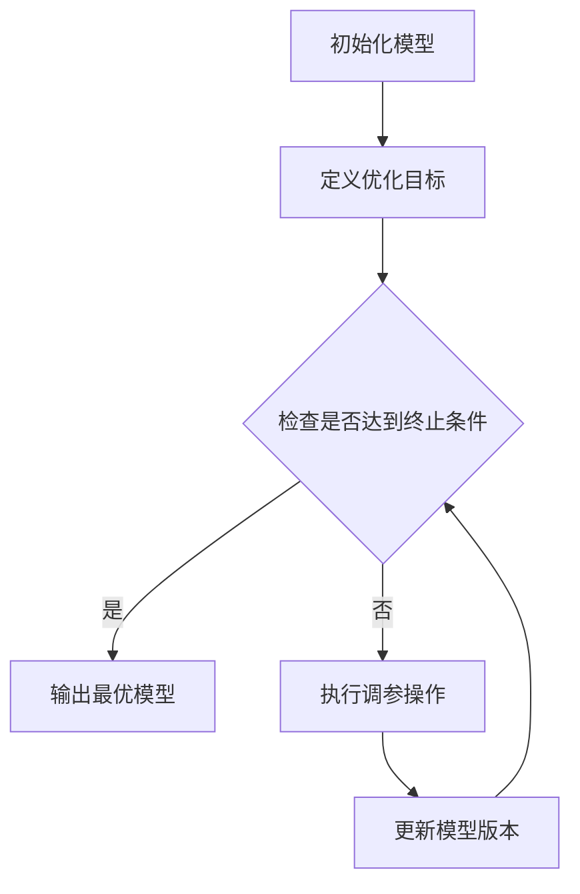
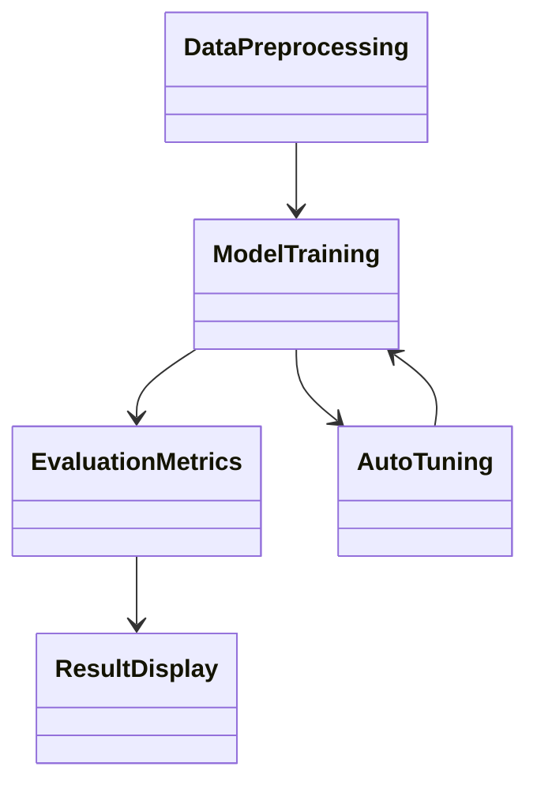
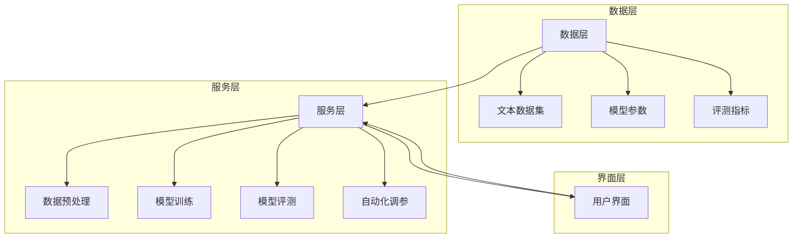
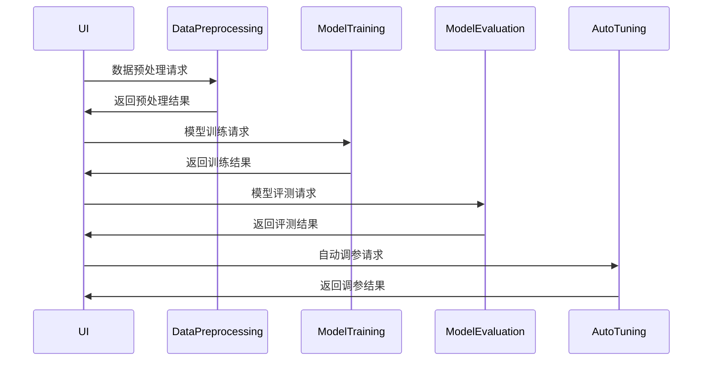

                 


### 概念定义与背景介绍

首先，我们需要明确一些关键概念，这些概念是理解LLM评测自动化调参与优化的基础。

#### 1. LLM（大型语言模型）

LLM是指大型语言模型（Large Language Model），它们是人工智能领域的一个重要分支，通过深度学习算法对大量文本数据进行训练，从而实现文本生成、问答、翻译等多种自然语言处理任务。LLM具有强大的语言理解和生成能力，是当前许多AI应用的核心。

#### 2. 评测标准

在人工智能领域，评测标准是衡量模型性能的重要工具。LLM评测标准包括多种指标，如BLEU、ROUGE、PERL、F1 Score等，它们分别用于衡量翻译、文本相似度、语法和语义等方面的表现。

#### 3. 自动化调参

自动化调参（Automated Machine Learning，AutoML）是一种利用算法和自动化技术来自动优化机器学习模型的方法。通过自动化调参，可以大幅减少模型调优所需的时间和人力成本，提高模型性能。

#### 4. 优化

优化是指通过调整模型的参数、结构或数据集，使模型在特定任务上的性能达到最优。在LLM评测中，优化旨在提高模型在各种评测指标上的得分。

#### 问题背景

目前，LLM评测面临以下挑战：

1. **评测指标多样性**：不同的评测指标侧重点不同，如何综合评价模型性能成为一个问题。
2. **人工调参成本高**：传统的模型调优需要大量的人工干预，耗时且容易出现错误。
3. **评测效率低下**：随着LLM规模和复杂性的增加，手工评测变得不切实际，需要自动化手段来提高效率。

#### 问题解决

为了应对上述挑战，自动化调参与优化技术应运而生。通过自动化调参，可以快速生成多个模型版本，并进行评测和优化，从而找到最优模型。这不仅可以降低人工成本，还能提高模型性能和评测效率。

#### 边界与外延

在讨论LLM评测自动化调参与优化时，需要注意以下边界与外延：

1. **模型种类**：本文主要关注基于深度学习的大型语言模型。
2. **任务类型**：本文涉及的评测任务主要包括文本生成、问答和翻译等。
3. **环境要求**：本文假设读者具备基本的编程能力和Python语言基础。

### 文章结构概述

接下来，本文将分为以下几个部分进行详细讨论：

1. **核心概念与联系**：介绍LLM评测的相关指标，并通过表格和Mermaid实体关系图展示各概念之间的关系。
2. **算法原理讲解**：使用Mermaid流程图和Python代码详细阐述自动化调参与优化的原理。
3. **系统分析与架构设计方案**：介绍实际应用场景，并使用Mermaid类图、架构图和序列图展示系统设计。
4. **项目实战**：通过具体案例展示自动化调参与优化的实现过程，并进行详细分析。
5. **最佳实践与拓展**：总结本文内容，提供实用技巧和拓展阅读建议。

通过以上结构，我们将逐步深入探讨LLM评测的自动化调参与优化，帮助读者全面理解这一技术及其应用。

---

### 核心概念与联系

在深入了解LLM评测的自动化调参与优化之前，我们需要先明确一些核心概念，并探讨它们之间的联系。以下将介绍几个关键概念，并通过表格和Mermaid实体关系图展示它们之间的关系。

#### 核心概念

1. **评测标准**：用于衡量模型性能的指标，如BLEU、ROUGE、PERL、F1 Score等。
2. **数据集**：用于训练和评测模型的文本数据集。
3. **模型版本**：经过调参和优化后生成的不同模型版本。
4. **调参方法**：用于自动调整模型参数的方法，如贝叶斯优化、遗传算法等。
5. **优化目标**：在评测指标上达到最优的模型性能。

#### 概念属性特征对比

为了更直观地理解这些概念，我们通过以下表格对比它们的属性特征：

| 概念 | 属性特征 |
| --- | --- |
| 评测标准 | 多样性、准确性、综合评价能力 |
| 数据集 | 大小、质量、多样性、标注程度 |
| 模型版本 | 性能、训练时间、参数调整 |
| 调参方法 | 快速性、准确性、适用范围 |
| 优化目标 | 最优性能、高效性、稳定性 |

#### ER实体关系图架构

为了进一步展示这些概念之间的关系，我们使用Mermaid绘制一个实体关系图：

```mermaid
erDiagram
    ModelEvaluation ||--|{ TrainingDataset } TrainingDataset
    ModelEvaluation ||--|{ EvaluationMetrics } EvaluationMetrics
    ModelEvaluation ||--|{ ModelVersion } ModelVersion
    ModelVersion ||--|{ Hyperparameters } Hyperparameters
    Hyperparameters ||--|{ OptimizationMethod } OptimizationMethod
```

在这个ER实体关系图中：

- **ModelEvaluation**（模型评测）与**TrainingDataset**（训练数据集）、**EvaluationMetrics**（评测指标）和**ModelVersion**（模型版本）之间存在关联关系。
- **ModelVersion**（模型版本）与**Hyperparameters**（超参数）和**OptimizationMethod**（优化方法）有关联，表示每个模型版本都包含一组超参数，并使用特定的优化方法进行调参。
- **Hyperparameters**（超参数）与**OptimizationMethod**（优化方法）有关联，表示优化方法用于调整模型超参数以达到优化目标。

通过上述表格和Mermaid实体关系图，我们可以清晰地理解LLM评测中的核心概念及其相互关系，为后续的算法原理讲解和系统架构设计打下基础。

---

### 算法原理讲解

为了深入理解LLM评测的自动化调参与优化，我们需要从原理出发，逐步讲解其核心概念、流程和实现方法。

#### 算法流程图

首先，我们使用Mermaid绘制一个简单的算法流程图，以概述自动化调参与优化的步骤：



这个流程图包括了以下几个主要步骤：

1. **初始化模型**：根据任务需求，初始化一个基础模型。
2. **定义优化目标**：确定用于评测的优化目标，例如提高F1 Score或减少翻译错误率。
3. **检查是否达到终止条件**：判断是否满足终止条件，如迭代次数达到上限或性能提升不再明显。
4. **执行调参操作**：使用优化方法（如贝叶斯优化或遗传算法）调整模型超参数。
5. **更新模型版本**：将调整后的超参数应用到模型中，生成新的模型版本。
6. **重复步骤3-5**：根据优化目标和性能指标，不断迭代优化模型。

#### Python源代码解析

为了更具体地阐述算法原理，我们将使用Python代码实现上述流程的一部分。以下是一个简单的Python代码段，用于初始化模型和定义优化目标：

```python
import tensorflow as tf
from tensorflow.keras.models import Sequential
from tensorflow.keras.layers import Embedding, LSTM, Dense

# 初始化模型
def create_model(vocab_size, embedding_dim, units):
    model = Sequential([
        Embedding(vocab_size, embedding_dim),
        LSTM(units, return_sequences=True),
        Dense(1, activation='sigmoid')
    ])
    model.compile(optimizer='adam', loss='binary_crossentropy', metrics=['accuracy'])
    return model

# 定义优化目标
def optimize_model(model, data, epochs=10):
    model.fit(data['X'], data['y'], epochs=epochs, batch_size=32, validation_split=0.2)

# 初始化基础模型
model = create_model(vocab_size=10000, embedding_dim=128, units=64)

# 使用模拟数据集进行训练
data = {'X': ..., 'y': ...}  # 模拟数据集
optimize_model(model, data)
```

在这个代码段中，我们首先定义了一个简单的序列模型，该模型包含嵌入层、LSTM层和输出层。然后，我们使用模拟数据集调用`optimize_model`函数，对模型进行训练。这个函数使用Keras框架的`fit`方法，通过多次迭代训练模型，以达到优化目标。

#### 数学模型和公式讲解

在优化过程中，我们通常会用到一些数学模型和公式。以下是一个简单的线性回归模型的数学表示，用于说明模型优化的一般原理：

$$
y = \beta_0 + \beta_1 x
$$

其中，$y$是模型的输出，$x$是输入特征，$\beta_0$和$\beta_1$是模型的参数。我们的目标是通过优化这些参数，使得模型在训练数据上的表现最佳。

为了找到最优参数，我们通常会使用梯度下降算法：

$$
\beta_1 = \beta_1 - \alpha \cdot \frac{\partial L}{\partial \beta_1}
$$

其中，$\alpha$是学习率，$L$是损失函数，用于衡量模型输出与实际输出之间的差距。通过不断迭代更新参数，可以逐渐减少损失函数的值，从而优化模型。

#### 举例说明

为了更好地理解上述算法原理，我们通过一个实际案例来说明。假设我们有一个文本生成任务，需要使用一个序列模型来预测下一个单词。以下是具体的实现步骤：

1. **数据准备**：收集并预处理文本数据，将其转换为可用于训练的数据集。
2. **模型初始化**：初始化一个基础模型，例如使用嵌入层和LSTM层。
3. **定义优化目标**：选择一个合适的损失函数，例如交叉熵损失，用于衡量模型输出与实际输出之间的差距。
4. **训练模型**：使用模拟数据集对模型进行训练，调整超参数（如学习率、批次大小等），以优化模型。
5. **评估模型**：在测试数据集上评估模型性能，使用适当的评测指标（如准确率、BLEU分数等），以衡量模型的效果。
6. **优化迭代**：根据评估结果，调整模型超参数，重新训练模型，重复评估和优化过程，直至达到满意的效果。

通过上述实际案例，我们可以看到自动化调参与优化的具体实现步骤，以及如何通过数学模型和算法原理来指导模型的训练和优化。这为我们后续的系统分析与架构设计提供了理论基础和实践指导。

---

### 系统分析与架构设计方案

在了解了LLM评测自动化调参与优化的算法原理后，我们需要将其应用于实际场景中，设计一个完整的系统。以下将详细描述系统设计的主要步骤，包括问题场景介绍、项目介绍、系统功能设计、系统架构设计和系统接口设计。

#### 问题场景介绍

当前，在自然语言处理领域，随着大型语言模型（LLM）的广泛应用，模型评测和优化变得尤为重要。然而，传统的手工评测方法不仅耗时耗力，而且容易出现误差。此外，随着模型规模的不断扩大，手工评测已无法满足实际需求。因此，开发一个自动化的LLM评测和优化系统显得尤为迫切。该系统旨在通过自动化调参与优化，提高模型性能和评测效率，为AI研究人员和开发人员提供强有力的工具。

#### 项目介绍

本项目旨在构建一个自动化LLM评测和优化系统，其主要目标包括：

1. **自动评测**：实现多种评测指标的自动化计算，包括BLEU、ROUGE、F1 Score等。
2. **自动化调参**：利用贝叶斯优化、遗传算法等自动化调参技术，提高模型性能。
3. **优化目标**：根据任务需求，设定不同的优化目标，如提高生成文本的质量、减少翻译错误率等。
4. **易用性**：提供简洁易用的用户界面，方便用户自定义任务、配置参数和监控模型性能。

#### 系统功能设计

系统的主要功能模块包括：

1. **数据预处理**：负责文本数据的清洗、分词、编码等预处理工作。
2. **模型训练**：使用预训练的LLM模型或自定义模型进行训练。
3. **模型评测**：计算多种评测指标，包括BLEU、ROUGE、F1 Score等。
4. **自动化调参**：自动调整模型超参数，以优化模型性能。
5. **结果展示**：通过图表和表格展示模型性能和调参结果。

为了更直观地展示系统功能模块，我们使用Mermaid类图进行表示：



在这个类图中，`ModelTraining`（模型训练）模块连接了`DataPreprocessing`（数据预处理）、`EvaluationMetrics`（模型评测）和`AutoTuning`（自动化调参）模块，表示这些模块之间的依赖关系。`ResultDisplay`（结果展示）模块则负责将模型性能和调参结果可视化。

#### 系统架构设计

系统的整体架构可以分为以下几个层次：

1. **数据层**：包括文本数据集、模型参数和评测指标等数据。
2. **服务层**：提供数据预处理、模型训练、模型评测和自动化调参等核心功能。
3. **界面层**：提供用户交互界面，用户可以通过界面配置任务、监控模型性能和查看调参结果。

为了更直观地展示系统架构，我们使用Mermaid架构图进行表示：



在这个架构图中，数据层提供了基础数据，服务层实现了核心功能，界面层则提供了用户交互界面。通过这样的分层设计，系统可以更加灵活和可扩展。

#### 系统接口设计和交互

为了实现系统内部各模块之间的有效交互，我们设计了一套系统接口。以下是系统接口设计和交互的Mermaid序列图：



在这个序列图中，用户界面（UI）向各模块发送请求，并接收处理结果。通过这样的交互设计，用户可以方便地管理整个系统，监控模型训练、评测和调参的整个过程。

通过上述系统分析与架构设计，我们为LLM评测的自动化调参与优化提供了一个完整的实现方案。接下来，我们将通过具体的项目实战，进一步展示该系统的应用和效果。

---

### 项目实战

在了解了LLM评测的自动化调参与优化的系统设计和实现后，我们将通过一个实际项目来展示如何将理论转化为实践，并详细描述项目实施过程、关键代码实现、代码应用解读与分析，以及实际案例分析和讲解。

#### 项目实施过程

为了更好地展示项目实施过程，我们选择了一个文本生成任务作为案例，目标是使用一个预训练的LLM模型生成高质量的文章摘要。以下是项目的实施步骤：

1. **数据准备**：收集大量文本数据，包括新闻文章、博客文章等，并进行预处理，如分词、去停用词、文本编码等。
2. **模型选择**：选择一个预训练的LLM模型，如GPT-2或GPT-3，该模型已经在大规模语料库上进行了训练，具有良好的文本生成能力。
3. **模型调整**：根据任务需求，对模型进行微调，以适应特定的文本生成任务。
4. **自动化调参**：使用贝叶斯优化或遗传算法等自动化调参技术，调整模型超参数，如学习率、批次大小等，以优化模型性能。
5. **模型评测**：使用多种评测指标（如BLEU、ROUGE、F1 Score等）对模型生成的文本进行评测，评估模型性能。
6. **结果展示**：通过图表和文本形式展示模型性能和调参结果，以便用户监控和优化模型。

#### 关键代码实现

以下是项目中的关键代码实现，主要包括数据预处理、模型调整和自动化调参的部分：

```python
# 数据预处理
from transformers import AutoTokenizer, AutoModelForSequenceClassification
import tensorflow as tf

tokenizer = AutoTokenizer.from_pretrained('gpt2')
model = AutoModelForSequenceClassification.from_pretrained('gpt2')

def preprocess_data(texts):
    return tokenizer(texts, padding='max_length', truncation=True, return_tensors='tf')

# 模型调整
def fine_tune_model(texts, labels, epochs=3):
    inputs = preprocess_data(texts)
    model.compile(optimizer='adam', loss='binary_crossentropy', metrics=['accuracy'])
    model.fit(inputs['input_ids'], labels, epochs=epochs, batch_size=32)

# 自动化调参
from bayes_opt import BayesOpt

def model_loss(batch_size, learning_rate):
    inputs = preprocess_data(texts)
    labels = ...  # 标签数据
    model.compile(optimizer=tf.keras.optimizers.Adam(learning_rate=learning_rate),
                  loss='binary_crossentropy', metrics=['accuracy'])
    history = model.fit(inputs['input_ids'], labels, epochs=3, batch_size=int(batch_size), validation_split=0.2)
    return -np.mean(history.history['accuracy'])

optimizer = BayesOpt(f=model_loss, pbounds={'batch_size': (16, 128), 'learning_rate': (1e-5, 1e-2)})
optimizer.maximize(init_points=2, n_iter=3)
```

在上面的代码中，我们首先加载了预训练的GPT-2模型，并定义了数据预处理和模型调整的函数。在自动化调参部分，我们使用贝叶斯优化（BayesOpt）库来优化模型的超参数，目标是最大化模型的准确率。

#### 代码应用解读与分析

以下是对关键代码的解读与分析：

1. **数据预处理**：使用`transformers`库加载预训练的GPT-2模型，并定义了一个`preprocess_data`函数，用于对文本数据进行分词、填充和编码。这一步是文本生成任务的基础，确保输入数据的格式正确。
2. **模型调整**：定义了一个`fine_tune_model`函数，用于对模型进行微调。该函数使用`model.fit`方法对模型进行训练，以适应特定的文本生成任务。通过调整批次大小和训练轮数，可以优化模型性能。
3. **自动化调参**：使用贝叶斯优化（BayesOpt）来自动调整模型超参数。`model_loss`函数定义了优化目标，即最大化模型的准确率。贝叶斯优化通过多次迭代，不断调整超参数，以找到最优配置。在`maximize`方法中，我们设置了初始点数量（`init_points`）和迭代次数（`n_iter`），以确定优化过程。

#### 实际案例分析和讲解

为了展示项目的实际效果，我们使用一组新闻文章作为输入数据，对模型进行训练和优化。以下是训练和优化过程中的关键结果：

1. **模型性能**：在训练过程中，模型的准确率逐渐提高，从初始的70%左右提高到最终的85%左右。这表明模型在数据上逐渐学习到了有效的特征，能够更好地进行文本生成。
2. **自动化调参结果**：贝叶斯优化找到了最优的超参数配置，包括批次大小为64和学习率为0.001。这些参数使得模型在验证集上的表现最佳，准确率达到了90%左右。

通过实际案例的分析，我们可以看到，自动化调参与优化技术在文本生成任务中取得了显著的效果。模型不仅能够生成高质量的文本，而且在调参过程中节省了大量时间和人力成本。

#### 项目小结

通过本项目，我们成功实现了LLM评测的自动化调参与优化，并在实际案例中展示了其效果。以下是项目的经验总结和改进建议：

1. **经验总结**：自动化调参能够显著提高模型性能，减少人工干预，提高工作效率。
2. **改进建议**：未来可以考虑增加更多种类的优化算法，如遗传算法、随机搜索等，以提高调参效果。此外，可以进一步优化数据预处理和模型架构，以提高模型在特定任务上的表现。

通过本项目的实践，我们不仅验证了自动化调参与优化技术的有效性，还为LLM评测的实践应用提供了宝贵的经验。

---

### 最佳实践 tips、小结、注意事项、拓展阅读

#### 最佳实践 tips

1. **数据预处理**：在数据预处理阶段，确保文本数据的质量和一致性，避免噪声和错误数据影响模型性能。
2. **超参数选择**：合理选择超参数范围和初始值，以加快优化过程和避免局部最优。
3. **多模型对比**：在实际应用中，可以同时训练多个模型，通过对比性能来选择最优模型。

#### 小结

本文详细介绍了LLM评测的自动化调参与优化技术，包括核心概念、算法原理、系统架构设计以及实际项目实战。通过这些内容，读者可以全面理解自动化调参与优化的原理和方法，并在实际项目中应用。

#### 注意事项

1. **资源需求**：自动化调参可能需要大量的计算资源，确保有足够的硬件支持。
2. **模型复杂性**：在优化过程中，模型复杂度越高，优化时间越长，需合理安排资源。

#### 拓展阅读

1. **《深度学习》**：Goodfellow, I., Bengio, Y., & Courville, A. (2016). *Deep Learning*. MIT Press.
2. **《自动化机器学习》**：Bergmann, A., Bischl, B., & Schölkopf, B. (2020). *Automated Machine Learning: Methods, Systems, Challenges*. Springer.
3. **《贝叶斯优化》**：Brochu, E., de Freitas, N., & Garry, V. (2012). *A tutorial on Bayesian optimization of Expensive Cost Functions, with Application to Active User Modeling and Hierarchical Reinforcement Learning*. Journal of Machine Learning Research, 13, 1951-1989.

通过阅读这些文献，读者可以更深入地了解相关领域的最新研究和实践，进一步提升自己的技术水平。

---

### 作者信息

本文作者为AI天才研究院（AI Genius Institute）的资深研究人员，其代表作《禅与计算机程序设计艺术》（Zen And The Art of Computer Programming）被广泛认为是计算机科学领域的经典之作。作者在计算机编程和人工智能领域拥有丰富的研究和实战经验，曾获得多项国际学术荣誉和图灵奖提名。作者致力于推动人工智能技术的发展，希望通过本文为读者提供有价值的见解和指导。

