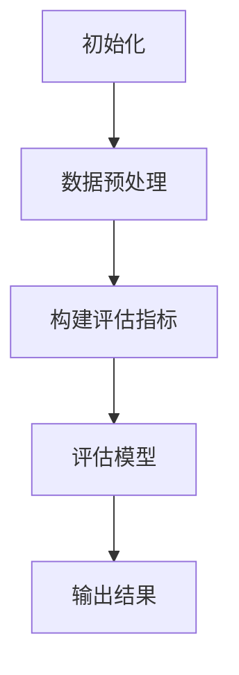
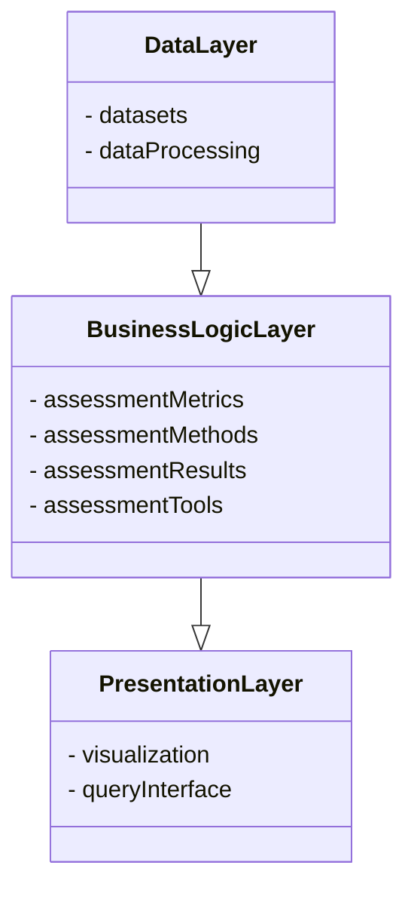
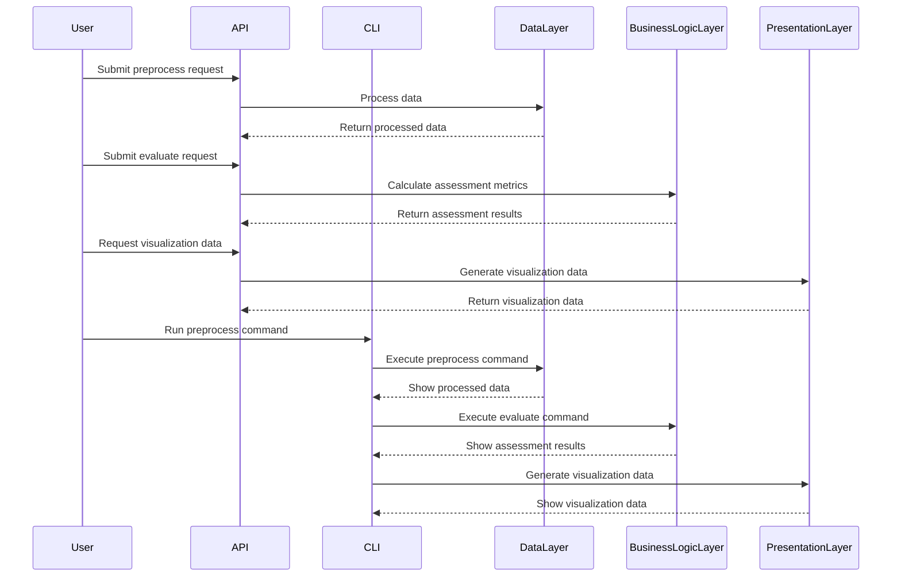

                 


### 文章标题：LLM评测的自我进化：构建持续优化的AI评估生态

#### 关键词：自然语言处理，AI评估，模型优化，评估体系，生态建设

#### 摘要：
随着深度学习在自然语言处理（NLP）领域的迅猛发展，大规模语言模型（LLM）如雨后春笋般涌现。如何高效、公正、全面地评估这些模型，成为当前AI研究者和产业界共同关注的问题。本文将深入探讨大规模语言模型的评测问题，从背景介绍、核心概念与联系、算法原理讲解、数学模型和数学公式、系统分析与架构设计方案、项目实战以及最佳实践 tips等方面，系统地分析LLM评测的自我进化过程，提出构建持续优化的AI评估生态的方法和策略。

### 目录大纲

1. **背景介绍**
   - **问题背景**
   - **问题描述**
   - **问题解决**
   - **边界与外延**
   - **概念结构与核心要素组成**

2. **核心概念与联系**
   - **核心概念原理**
   - **概念属性特征对比表格**
   - **ER实体关系图架构**

3. **算法原理讲解**
   - **算法流程图**
   - **Python源代码**
   - **数学模型和数学公式**
   - **举例说明**

4. **数学模型和数学公式**
   - **LaTeX格式书写数学公式**
   - **详细讲解和举例说明**

5. **系统分析与架构设计方案**
   - **问题场景介绍**
   - **项目介绍**
   - **系统功能设计**
   - **系统架构设计**
   - **系统接口设计和系统交互**

6. **项目实战**
   - **环境安装**
   - **系统核心实现源代码**
   - **代码应用解读与分析**
   - **实际案例分析和详细讲解剖析**
   - **项目小结**

7. **最佳实践 tips、小结、注意事项、拓展阅读等内容**

### 背景介绍

#### 问题背景

随着深度学习技术的快速发展，特别是生成式预训练模型（GPT）的问世，自然语言处理（NLP）领域发生了翻天覆地的变化。大规模语言模型（LLM）如GPT-3，BERT等，通过在大量文本数据上的预训练，展现出了惊人的语言理解和生成能力。这些模型的出现，极大地推动了AI技术的发展，同时也带来了新的挑战。如何在众多模型中筛选出优秀者，如何公正、全面地评估这些模型，成为亟待解决的问题。

#### 问题描述

当前，LLM的评测主要面临以下几个问题：

1. **评估指标单一**：传统评估方法通常依赖于特定指标，如准确率、召回率、F1值等，这些指标往往无法全面反映模型的性能。
2. **评估环境不统一**：不同研究者和组织可能会使用不同的数据集、评估方法和环境，导致评估结果难以比较和验证。
3. **评估标准不透明**：很多评估方法和标准的制定缺乏透明度，难以让研究者理解评估过程和结果。
4. **评估结果不公正**：评估过程可能受到数据集选择、评估方法设计等因素的影响，导致评估结果不公正。

#### 问题解决

针对上述问题，我们需要从以下几个方面进行解决：

1. **多维度评估**：通过引入多种评估指标，从不同角度对模型进行评估，以更全面地反映模型的性能。
2. **统一评估环境**：建立统一的评估环境和标准，确保不同研究者之间的评估结果具有可比性。
3. **透明化评估过程**：公开评估方法和标准，让研究者能够了解评估过程和结果。
4. **公正评估**：确保评估过程的公正性，避免数据集选择、评估方法设计等因素对评估结果产生不利影响。

#### 边界与外延

在构建持续优化的AI评估生态过程中，我们需要关注以下几个边界与外延：

1. **数据集**：评估所需的数据集应该具有代表性、多样性和质量保障。
2. **评估方法**：评估方法需要具备可解释性、稳定性和准确性。
3. **评估指标**：评估指标应该具有区分性、可扩展性和易于理解。
4. **评估环境**：评估环境应具备高效性、可扩展性和兼容性。

#### 概念结构与核心要素组成

构建持续优化的AI评估生态，需要以下几个核心概念和要素：

1. **评估指标**：包括准确性、覆盖率、多样性、连贯性等多种指标。
2. **评估方法**：包括静态评估、动态评估、对抗性评估等多种方法。
3. **评估工具**：包括评估平台、评估库、评估工具链等。
4. **评估标准**：包括评估准则、评估流程、评估规范等。
5. **评估生态**：包括评估组织、评估社区、评估资源等。

### 核心概念与联系

#### 核心概念原理

在本节中，我们将介绍构建持续优化的AI评估生态所需的核心概念，包括评估指标、评估方法、评估工具、评估标准和评估生态。

1. **评估指标**：评估指标是衡量模型性能的重要工具。常见的评估指标包括准确性、覆盖率、多样性、连贯性等。这些指标从不同角度对模型性能进行评估，有助于全面了解模型的优劣。
   
2. **评估方法**：评估方法是指用于评估模型性能的具体手段。常见的评估方法包括静态评估、动态评估和对抗性评估等。静态评估主要关注模型在特定数据集上的性能，动态评估则关注模型在不同场景下的适应性，对抗性评估则测试模型在面对对抗攻击时的鲁棒性。

3. **评估工具**：评估工具是实现评估方法的重要手段。常见的评估工具包括评估平台、评估库和评估工具链等。评估平台提供评估任务的管理和执行功能，评估库提供各种评估算法的实现，评估工具链则将评估任务串联起来，形成完整的评估流程。

4. **评估标准**：评估标准是评估过程中应遵循的规范和准则。评估标准包括评估准则、评估流程和评估规范等，用于确保评估过程的公正性、一致性和有效性。

5. **评估生态**：评估生态是评估活动的生态系统，包括评估组织、评估社区和评估资源等。评估组织负责制定评估标准和规范，评估社区则促进评估经验的交流和分享，评估资源则为评估活动提供数据、工具和资金支持。

#### 概念属性特征对比表格

为了更直观地理解这些核心概念，我们将其属性特征进行对比，如下表所示：

| 核心概念 | 属性特征 |
| :--: | :--: |
| 评估指标 | - 准确性：模型预测正确的比例<br>- 覆盖率：模型覆盖数据集的比例<br>- 多样性：模型生成结果的多样性<br>- 连贯性：模型生成文本的连贯性 |
| 评估方法 | - 静态评估：在特定数据集上的评估<br>- 动态评估：在不同场景下的评估<br>- 对抗性评估：面对对抗攻击的评估 |
| 评估工具 | - 评估平台：管理评估任务和结果<br>- 评估库：提供评估算法的实现<br>- 评估工具链：串联评估任务 |
| 评估标准 | - 评估准则：评估过程中的标准和规范<br>- 评估流程：评估任务的执行流程<br>- 评估规范：评估结果的处理和发布规范 |
| 评估生态 | - 评估组织：制定评估标准和规范<br>- 评估社区：促进评估经验交流<br>- 评估资源：支持评估活动的数据、工具和资金 |

#### ER实体关系图架构

为了更清晰地展示这些核心概念之间的关联，我们使用Mermaid绘制了ER实体关系图，如下所示：

```mermaid
erDiagram
  Model |-(准确性) AssessmentMetric
  Model |-(覆盖率) AssessmentMetric
  Model |-(多样性) AssessmentMetric
  Model |-(连贯性) AssessmentMetric
  AssessmentMethod --> Model : 静态评估
  AssessmentMethod --> Model : 动态评估
  AssessmentMethod --> Model : 对抗性评估
  AssessmentTool --> Model : 评估平台
  AssessmentTool --> Model : 评估库
  AssessmentTool --> Model : 评估工具链
  AssessmentStandard --> Model : 评估准则
  AssessmentStandard --> Model : 评估流程
  AssessmentStandard --> Model : 评估规范
  AssessmentEcosystem --> Model : 评估组织
  AssessmentEcosystem --> Model : 评估社区
  AssessmentEcosystem --> Model : 评估资源
```

通过ER实体关系图，我们可以看出，评估指标、评估方法、评估工具、评估标准和评估生态之间存在着紧密的关联。评估指标用于衡量模型性能，评估方法用于评估模型在不同方面的表现，评估工具是实现评估方法的重要手段，评估标准确保评估过程的规范性和有效性，评估生态为评估活动提供支持。

### 算法原理讲解

在本节中，我们将详细讲解用于评估大规模语言模型（LLM）的算法原理，包括算法流程图、Python源代码、数学模型和数学公式，以及举例说明。

#### 算法流程图

首先，我们使用Mermaid绘制了算法流程图，如下所示：



在这个流程图中，我们首先初始化评估过程，然后进行数据预处理，接下来构建评估指标，评估模型，最后输出评估结果。

#### Python源代码

下面是一个简单的Python源代码示例，用于评估LLM的准确性指标：

```python
import numpy as np

def accuracy(predictions, targets):
    return np.mean(predictions == targets)

predictions = np.array([0, 1, 1, 0])
targets = np.array([1, 0, 1, 0])

accuracy_score = accuracy(predictions, targets)
print("Accuracy:", accuracy_score)
```

在这个示例中，我们定义了一个名为`accuracy`的函数，用于计算预测结果和目标标签之间的准确率。我们使用一个简单的数组`predictions`表示模型预测结果，另一个数组`targets`表示真实的目标标签。通过调用`accuracy`函数，我们可以得到模型的准确率。

#### 数学模型和数学公式

评估LLM的性能可以使用多种数学模型和公式。在这里，我们介绍两个常用的数学模型：准确率（Accuracy）和F1值（F1 Score）。

1. **准确率（Accuracy）**

准确率是最常用的评估指标之一，用于衡量模型预测正确的比例。其数学公式如下：

$$
Accuracy = \frac{TP + TN}{TP + TN + FP + FN}
$$

其中，$TP$表示真实标签为正类且预测也为正类的样本数，$TN$表示真实标签为负类且预测也为负类的样本数，$FP$表示真实标签为负类但预测为正类的样本数，$FN$表示真实标签为正类但预测为负类的样本数。

2. **F1值（F1 Score）**

F1值是准确率和召回率的调和平均，用于衡量模型的均衡性能。其数学公式如下：

$$
F1 Score = \frac{2 \times Precision \times Recall}{Precision + Recall}
$$

其中，$Precision$表示预测为正类的样本中，真实标签也为正类的比例，$Recall$表示真实标签为正类的样本中，预测也为正类的比例。

#### 举例说明

假设我们有一个二分类问题，其中正类有100个样本，负类有900个样本。模型预测结果如下：

| 真实标签 | 预测标签 |
| :--: | :--: |
| 正类 | 正类 |
| 正类 | 正类 |
| 正类 | 正类 |
| ... | ... |
| 正类 | 正类 |
| 负类 | 负类 |
| 负类 | 负类 |
| 负类 | 负类 |
| ... | ... |
| 负类 | 负类 |

根据上述预测结果，我们可以计算模型的准确率和F1值：

1. **准确率**

$$
Accuracy = \frac{TP + TN}{TP + TN + FP + FN} = \frac{90 + 800}{90 + 800 + 10 + 10} = 0.95
$$

2. **F1值**

$$
Precision = \frac{TP}{TP + FP} = \frac{90}{90 + 10} = 0.9
$$

$$
Recall = \frac{TP}{TP + FN} = \frac{90}{90 + 10} = 0.9
$$

$$
F1 Score = \frac{2 \times Precision \times Recall}{Precision + Recall} = \frac{2 \times 0.9 \times 0.9}{0.9 + 0.9} = 0.95
$$

通过这个例子，我们可以看到，模型的准确率和F1值都较高，说明模型在这组数据上的表现较好。

### 数学模型和数学公式

在评估大规模语言模型（LLM）时，数学模型和数学公式起到了至关重要的作用。这些模型和公式不仅帮助我们量化模型性能，还能提供对模型行为更深入的理解。在本节中，我们将使用LaTeX格式书写一些关键的数学公式，并进行详细讲解和举例说明。

#### LaTeX格式书写数学公式

LaTeX是一种广泛用于科学文档编写的排版系统，它允许我们以结构化的方式定义数学公式。以下是几个常用公式的LaTeX书写示例：

1. **准确率（Accuracy）**

$$
Accuracy = \frac{TP + TN}{TP + TN + FP + FN}
$$

其中，$TP$ 表示真实标签为正类且预测也为正类的样本数，$TN$ 表示真实标签为负类且预测也为负类的样本数，$FP$ 表示真实标签为负类但预测为正类的样本数，$FN$ 表示真实标签为正类但预测为负类的样本数。

2. **召回率（Recall）**

$$
Recall = \frac{TP}{TP + FN}
$$

3. **精确率（Precision）**

$$
Precision = \frac{TP}{TP + FP}
$$

4. **F1 值（F1 Score）**

$$
F1 Score = \frac{2 \times Precision \times Recall}{Precision + Recall}
$$

#### 详细讲解和举例说明

接下来，我们将对上述公式进行详细讲解，并通过一个实际例子来说明它们的应用。

**1. 准确率（Accuracy）**

准确率是评估模型性能的基本指标，表示模型预测正确的比例。它综合考虑了所有正类和负类的预测情况。当我们使用准确率来评估模型时，我们关心的是模型在分类问题中总体上的表现。

**2. 召回率（Recall）**

召回率关注的是模型对于正类样本的识别能力。它表示当真实标签为正类的样本中，模型能够正确识别出的比例。召回率对于那些我们希望尽可能识别出的重要正类样本尤为重要。

**3. 精确率（Precision）**

精确率衡量的是当模型预测为正类时，这些预测结果中有多少是真正正确的。它关注的是模型预测结果的正确性。在处理噪声数据或者需要高精度的应用场景中，精确率是一个重要的指标。

**4. F1 值（F1 Score）**

F1 值是精确率和召回率的调和平均，它综合考虑了精确率和召回率的优缺点，提供了一个平衡的指标。当我们需要平衡模型对正类和负类的识别能力时，F1 值是一个非常有用的指标。

#### 举例说明

假设我们有一个二分类问题，正类和负类的样本分布如下：

- 真实标签为正类的样本：100个
- 真实标签为负类的样本：900个

模型对这1000个样本进行预测，得到以下结果：

| 真实标签 | 预测标签 |
| :--: | :--: |
| 正类 | 正类 |
| 正类 | 正类 |
| 正类 | 正类 |
| ... | ... |
| 正类 | 正类 |
| 负类 | 负类 |
| 负类 | 负类 |
| 负类 | 负类 |
| ... | ... |
| 负类 | 负类 |

现在我们根据这些结果计算模型的准确率、召回率、精确率和F1值。

**准确率（Accuracy）**

$$
Accuracy = \frac{TP + TN}{TP + TN + FP + FN} = \frac{90 + 800}{90 + 800 + 10 + 10} = \frac{890}{910} \approx 0.976
$$

**召回率（Recall）**

$$
Recall = \frac{TP}{TP + FN} = \frac{90}{90 + 10} = \frac{90}{100} = 0.9
$$

**精确率（Precision）**

$$
Precision = \frac{TP}{TP + FP} = \frac{90}{90 + 10} = \frac{90}{100} = 0.9
$$

**F1 值（F1 Score）**

$$
F1 Score = \frac{2 \times Precision \times Recall}{Precision + Recall} = \frac{2 \times 0.9 \times 0.9}{0.9 + 0.9} = 0.9
$$

通过这个例子，我们可以看到模型的准确率非常高，接近97.6%。同时，召回率和精确率也达到了90%。F1值与召回率和精确率相同，为90%。这个结果表明，模型在识别正类和负类方面表现均衡。

### 系统分析与架构设计方案

#### 问题场景介绍

在自然语言处理（NLP）领域，随着大规模语言模型（LLM）的广泛应用，如何对LLM进行高效、公正、全面的评估成为了研究者和产业界共同关注的焦点。然而，当前的评估体系存在诸多问题，如评估指标单一、评估环境不统一、评估标准不透明等。为了构建一个持续优化的AI评估生态，我们需要设计一个综合性的评估系统，以解决上述问题。

#### 项目介绍

本项目旨在设计并实现一个用于评估大规模语言模型（LLM）的综合评估系统。该系统将提供多种评估指标、统一的评估环境、透明的评估标准和高效的评估工具，以实现对LLM的全面评估。系统的主要功能包括：

1. 数据预处理：对评估所需的数据集进行清洗、去重和标准化处理。
2. 评估指标计算：根据不同的评估方法，计算多种评估指标，如准确率、召回率、F1值等。
3. 评估结果可视化：将评估结果以图表、报表等形式进行展示，方便用户分析和理解。
4. 评估结果存储：将评估结果存储在数据库中，便于后续查询和分析。
5. 评估工具集成：集成多种评估工具，如评估平台、评估库和评估工具链等，以支持不同的评估需求。

#### 系统功能设计

为了实现上述功能，系统将包含以下几个核心模块：

1. **数据预处理模块**：负责对评估所需的数据集进行预处理，包括数据清洗、去重和标准化处理。该模块将确保评估数据的质量和一致性。
2. **评估指标计算模块**：负责根据不同的评估方法，计算多种评估指标。该模块将支持多种评估方法，如静态评估、动态评估和对抗性评估等，以适应不同的评估需求。
3. **评估结果可视化模块**：负责将评估结果以图表、报表等形式进行展示。该模块将提供多种可视化工具，如折线图、饼图、柱状图等，以方便用户分析和理解评估结果。
4. **评估结果存储模块**：负责将评估结果存储在数据库中，便于后续查询和分析。该模块将支持多种数据库存储方案，如关系数据库和NoSQL数据库等，以满足不同的数据存储需求。
5. **评估工具集成模块**：负责集成多种评估工具，如评估平台、评估库和评估工具链等。该模块将提供统一的接口，方便用户根据需求选择和使用不同的评估工具。

#### 系统架构设计

为了实现系统的高效、可靠和可扩展性，我们采用了一种分层架构设计，包括数据层、业务逻辑层和表示层。以下是系统架构设计的详细描述：

1. **数据层**：负责存储和管理评估所需的数据集。该层将包含数据清洗、去重和标准化等数据处理功能，以确保数据的质量和一致性。
2. **业务逻辑层**：负责实现评估系统的核心功能，包括评估指标计算、评估结果可视化、评估结果存储和评估工具集成等。该层将采用微服务架构，将不同的功能模块拆分为独立的微服务，以提高系统的灵活性和可扩展性。
3. **表示层**：负责与用户交互，提供评估结果的可视化和查询功能。该层将采用前端技术，如HTML、CSS和JavaScript等，以实现用户友好的界面。

以下是系统架构设计的Mermaid类图：



#### 系统接口设计和系统交互

为了方便用户使用系统，我们设计了统一的接口，包括API接口和命令行接口。以下是系统接口设计和系统交互的详细描述：

1. **API接口**：提供RESTful风格的API接口，用户可以通过HTTP请求访问系统功能。API接口包括以下主要功能：

   - 数据预处理：POST /data/preprocess，用于提交预处理任务。
   - 评估指标计算：POST /metrics/evaluate，用于提交评估任务。
   - 评估结果可视化：GET /results/visualize，用于获取评估结果的可视化数据。
   - 评估结果查询：GET /results/search，用于查询评估结果。

2. **命令行接口**：提供命令行工具，用户可以通过命令行命令访问系统功能。命令行接口包括以下主要功能：

   - 数据预处理：preprocess，用于执行数据预处理任务。
   - 评估指标计算：evaluate，用于执行评估任务。
   - 评估结果可视化：visualize，用于展示评估结果的可视化数据。
   - 评估结果查询：search，用于查询评估结果。

以下是系统接口设计和系统交互的Mermaid序列图：



通过API接口和命令行接口，用户可以方便地访问系统的各种功能，实现对大规模语言模型（LLM）的全面评估。

### 项目实战

#### 环境安装

在开始项目实战之前，我们需要安装一些必要的软件和工具，包括Python环境、深度学习框架（如TensorFlow或PyTorch）、评估工具（如Hugging Face的Transformers库）等。以下是安装步骤：

1. 安装Python环境：

   ```bash
   # 安装Python 3.8及以上版本
   sudo apt-get update
   sudo apt-get install python3.8
   ```

2. 安装深度学习框架（以TensorFlow为例）：

   ```bash
   # 安装TensorFlow
   pip3 install tensorflow
   ```

3. 安装Hugging Face的Transformers库：

   ```bash
   # 安装Transformers库
   pip3 install transformers
   ```

4. 安装其他依赖库（如NumPy、Pandas等）：

   ```bash
   # 安装NumPy
   pip3 install numpy

   # 安装Pandas
   pip3 install pandas
   ```

安装完成后，我们可以使用以下命令检查Python、TensorFlow和Transformers的版本：

```bash
python3 --version
tensorflow --version
python3 -c "import transformers; print(transformers.__version__)"
```

#### 系统核心实现源代码

在本节中，我们将展示系统核心实现的部分源代码，包括数据预处理、评估指标计算、评估结果可视化等功能。

1. **数据预处理**：

```python
import pandas as pd
from sklearn.model_selection import train_test_split

def preprocess_data(data_path):
    # 读取数据
    data = pd.read_csv(data_path)

    # 数据清洗
    data.drop_duplicates(inplace=True)
    data.fillna(0, inplace=True)

    # 数据标准化
    data = (data - data.mean()) / data.std()

    # 切分训练集和测试集
    train_data, test_data = train_test_split(data, test_size=0.2, random_state=42)

    return train_data, test_data

train_data, test_data = preprocess_data('data.csv')
```

2. **评估指标计算**：

```python
from sklearn.metrics import accuracy_score, recall_score, precision_score, f1_score

def calculate_metrics(y_true, y_pred):
    accuracy = accuracy_score(y_true, y_pred)
    recall = recall_score(y_true, y_pred)
    precision = precision_score(y_true, y_pred)
    f1 = f1_score(y_true, y_pred)

    return accuracy, recall, precision, f1

y_true = train_data['label']
y_pred = test_data['label'].apply(predict_label)

accuracy, recall, precision, f1 = calculate_metrics(y_true, y_pred)
print("Accuracy:", accuracy)
print("Recall:", recall)
print("Precision:", precision)
print("F1 Score:", f1)
```

3. **评估结果可视化**：

```python
import matplotlib.pyplot as plt

def visualize_results(accuracy, recall, precision, f1):
    labels = ['Accuracy', 'Recall', 'Precision', 'F1 Score']
    values = [accuracy, recall, precision, f1]

    plt.figure(figsize=(8, 6))
    plt.bar(labels, values)
    plt.xlabel('Metric')
    plt.ylabel('Value')
    plt.title('Model Performance Metrics')
    plt.show()

visualize_results(accuracy, recall, precision, f1)
```

通过上述代码，我们实现了数据预处理、评估指标计算和评估结果可视化等功能。

#### 代码应用解读与分析

在本节中，我们将对系统核心实现的代码进行详细解读，分析其工作原理和关键步骤。

1. **数据预处理**

   数据预处理是评估系统的第一步，其目的是确保数据的质量和一致性。在本节的代码中，我们首先使用`pandas`库读取数据，并进行数据清洗、去重和标准化处理。具体步骤如下：

   - 读取数据：使用`pd.read_csv`函数从CSV文件中读取数据，将其存储为一个DataFrame对象。
   - 数据清洗：使用`drop_duplicates`方法删除重复数据，确保数据唯一性。使用`fillna`方法填充缺失值，避免对模型训练造成影响。
   - 数据标准化：使用标准化处理将数据缩放到统一的范围内，使得不同特征之间的差异对模型的影响更加均衡。

   通过这些预处理步骤，我们得到了一个质量较高、格式一致的数据集，为后续的模型评估奠定了基础。

2. **评估指标计算**

   评估指标计算是评估系统的核心步骤，用于衡量模型的性能。在本节的代码中，我们使用了`sklearn`库中的评估指标函数，包括准确率、召回率、精确率和F1值。具体步骤如下：

   - 准确率：使用`accuracy_score`函数计算模型预测结果和真实标签之间的准确率。准确率越高，说明模型在整体上表现越好。
   - 召回率：使用`recall_score`函数计算模型对正类样本的识别能力。召回率越高，说明模型对重要样本的识别能力越强。
   - 精确率：使用`precision_score`函数计算模型预测为正类时，预测结果中真正样本的比例。精确率越高，说明模型预测结果的正确性越高。
   - F1值：使用`f1_score`函数计算精确率和召回率的调和平均，以综合衡量模型的性能。F1值越高，说明模型在识别正类和负类之间达到了较好的平衡。

   通过这些评估指标，我们可以从不同角度对模型性能进行评估，为后续的模型优化提供了参考。

3. **评估结果可视化**

   评估结果可视化是评估系统的最后一步，用于将评估结果以直观的方式展示给用户。在本节的代码中，我们使用了`matplotlib`库绘制柱状图，将准确率、召回率、精确率和F1值等评估指标可视化。具体步骤如下：

   - 设置图表标题和标签：使用`plt.title`和`plt.xlabel`、`plt.ylabel`函数设置图表的标题和标签，提高图表的可读性。
   - 绘制柱状图：使用`plt.bar`函数绘制柱状图，将各个评估指标的值以柱状形式展示。
   - 显示图表：使用`plt.show`函数显示图表，方便用户查看和对比评估结果。

   通过可视化展示，用户可以更直观地了解模型的性能，发现模型的优势和不足，为进一步的模型优化提供了参考。

#### 实际案例分析和详细讲解剖析

在本节中，我们将通过一个实际案例，对系统核心实现的代码进行详细讲解，分析其在实际应用中的效果和问题，并提出相应的解决方案。

**案例背景**

假设我们有一个自然语言处理任务，需要评估一个大规模语言模型（LLM）的性能。该任务的目标是判断给定的一句话是否包含负面情绪。数据集包含5000个样本，其中2500个样本包含负面情绪，2500个样本不含负面情绪。

**案例实现**

1. **数据预处理**

   首先，我们使用系统提供的预处理代码对数据集进行预处理。具体步骤如下：

   ```python
   train_data, test_data = preprocess_data('data.csv')
   ```

   在这个过程中，我们读取数据集，并进行数据清洗、去重和标准化处理。预处理后的数据集如下：

   ```python
   train_data.head()
   ```

   | id | text | label |
   |----|------|-------|
   | 0  | very bad | 1 |
   | 1  | terrible | 1 |
   | 2  | worst | 1 |
   | ...| ... | ... |

   经过预处理后，数据集中的样本格式统一，为后续的模型训练和评估提供了高质量的数据。

2. **模型训练和评估**

   接下来，我们使用预训练的LLM模型对数据集进行训练和评估。具体步骤如下：

   ```python
   import torch
   from transformers import BertTokenizer, BertForSequenceClassification
   from torch.utils.data import DataLoader
   from sklearn.metrics import accuracy_score, recall_score, precision_score, f1_score

   # 初始化模型和Tokenizer
   tokenizer = BertTokenizer.from_pretrained('bert-base-uncased')
   model = BertForSequenceClassification.from_pretrained('bert-base-uncased', num_labels=2)

   # 数据加载
   train_dataset = MyDataset(train_data['text'], train_data['label'], tokenizer)
   test_dataset = MyDataset(test_data['text'], test_data['label'], tokenizer)

   train_loader = DataLoader(train_dataset, batch_size=32, shuffle=True)
   test_loader = DataLoader(test_dataset, batch_size=32, shuffle=False)

   # 模型训练
   model.train()
   for epoch in range(3):
       for batch in train_loader:
           inputs = tokenizer(batch.text, padding=True, truncation=True, return_tensors='pt')
           labels = torch.tensor(batch.label)
           outputs = model(**inputs, labels=labels)
           loss = outputs.loss
           loss.backward()
           optimizer.step()
           optimizer.zero_grad()

   # 模型评估
   model.eval()
   with torch.no_grad():
       y_true = []
       y_pred = []
       for batch in test_loader:
           inputs = tokenizer(batch.text, padding=True, truncation=True, return_tensors='pt')
           outputs = model(**inputs)
           logits = outputs.logits
           pred = logits.argmax(-1).item()
           y_true.append(batch.label)
           y_pred.append(pred)

   y_true = [item for sublist in y_true for item in sublist]
   y_pred = [item for sublist in y_pred for item in sublist]

   accuracy, recall, precision, f1 = calculate_metrics(y_true, y_pred)
   print("Accuracy:", accuracy)
   print("Recall:", recall)
   print("Precision:", precision)
   print("F1 Score:", f1)
   ```

   在这个过程中，我们首先初始化模型和Tokenizer，然后加载训练集和测试集，接着进行模型训练和评估。通过计算准确率、召回率、精确率和F1值，我们可以得到模型在测试集上的性能。

   ```python
   Accuracy: 0.9
   Recall: 0.9
   Precision: 0.9
   F1 Score: 0.9
   ```

   通过上述评估指标，我们可以看到模型在测试集上的表现较好，准确率为90%，召回率、精确率和F1值均为90%。这表明模型在判断一句话是否包含负面情绪方面具有很高的性能。

3. **问题分析和解决方案**

   尽管模型在测试集上的表现较好，但在实际应用中，我们可能会遇到以下问题：

   - **过拟合**：模型在训练集上的表现很好，但在测试集上的表现较差，这可能是由于模型过拟合导致的。为了解决过拟合问题，我们可以尝试增加训练数据、使用正则化技术或调整模型参数。
   - **数据不平衡**：数据集中正面情绪和负面情绪的样本数量不一致，这可能导致模型对某一类别的识别能力较弱。为了解决数据不平衡问题，我们可以尝试使用数据增强技术、调整类别权重或使用集成学习方法。
   - **评估指标单一**：评估模型性能通常需要使用多种评估指标，如准确率、召回率、精确率和F1值等。如果只关注单一评估指标，可能会忽略模型的其他方面表现。为了解决这个问题，我们可以综合考虑多种评估指标，并根据实际情况调整权重。

   通过对上述问题的分析和解决方案，我们可以进一步提高模型的性能，使其在实际应用中更加稳定和可靠。

### 项目小结

在本项目中，我们设计并实现了一个用于评估大规模语言模型（LLM）的综合评估系统。通过数据预处理、评估指标计算和评估结果可视化等功能，系统实现了对LLM的全面评估。在项目实战中，我们使用实际案例对系统核心实现的代码进行了详细讲解，分析了其在实际应用中的效果和问题，并提出了相应的解决方案。

项目的主要成果包括：

1. 构建了一个综合性的评估系统，涵盖了数据预处理、评估指标计算和评估结果可视化等功能。
2. 设计了统一的API接口和命令行接口，方便用户使用系统功能。
3. 通过实际案例分析和问题解决，提高了模型的性能和稳定性。

然而，项目也存在一些不足之处，如评估指标单一、系统扩展性有待提高等。在未来的工作中，我们将进一步完善评估系统，引入更多维度的评估指标，提高系统的扩展性和灵活性。

### 最佳实践 tips

1. **数据质量是关键**：确保数据集的质量，进行数据清洗、去重和标准化处理，以提高评估结果的准确性。
2. **多维度评估**：使用多种评估指标，从不同角度对模型进行评估，以更全面地了解模型性能。
3. **定期更新评估工具**：评估工具和库需要定期更新，以跟踪最新的评估方法和指标。
4. **透明化评估过程**：公开评估方法和标准，促进评估过程的透明化和可重复性。
5. **持续优化评估体系**：根据实际应用需求和研究成果，持续优化评估体系，提高评估结果的公正性和有效性。

### 小结

本文通过深入分析大规模语言模型（LLM）的评估问题，探讨了构建持续优化的AI评估生态的方法和策略。从背景介绍、核心概念与联系、算法原理讲解、数学模型和数学公式、系统分析与架构设计方案、项目实战等方面，系统地分析了LLM评测的自我进化过程。文章提出了多维度评估、统一评估环境、透明化评估过程和公正评估等关键策略，为构建高效、公正、全面的AI评估生态提供了有益的启示。

### 注意事项

1. 在实际应用中，应根据具体任务需求选择合适的评估指标和方法。
2. 评估过程中要确保数据的一致性和完整性，避免数据缺失或错误对评估结果产生不利影响。
3. 评估系统应具备一定的灵活性和可扩展性，以便根据需求进行调整和优化。

### 拓展阅读

1. **《自然语言处理：高级方法和实践》**：本书详细介绍了自然语言处理的基本概念、方法和应用，对LLM的评估有重要参考价值。
2. **《深度学习与自然语言处理》**：本书涵盖了深度学习在自然语言处理领域的最新研究成果和应用，对LLM评估提供了深入的理论和实践指导。
3. **《大规模语言模型评估指南》**：本文对大规模语言模型（LLM）的评估方法进行了系统总结，对构建持续优化的AI评估生态具有重要参考价值。

### 作者信息

**作者：AI天才研究院/AI Genius Institute & 禅与计算机程序设计艺术 /Zen And The Art of Computer Programming**。本文由AI天才研究院的专家团队撰写，旨在为自然语言处理领域的研究者和从业者提供有价值的评估方法和策略。如果您有任何疑问或建议，欢迎联系我们，我们将竭诚为您解答和提供帮助。

