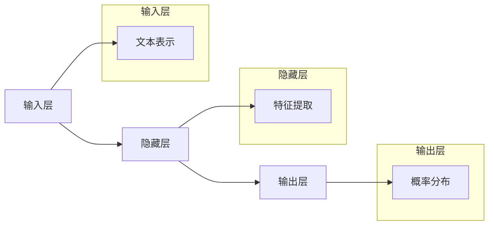
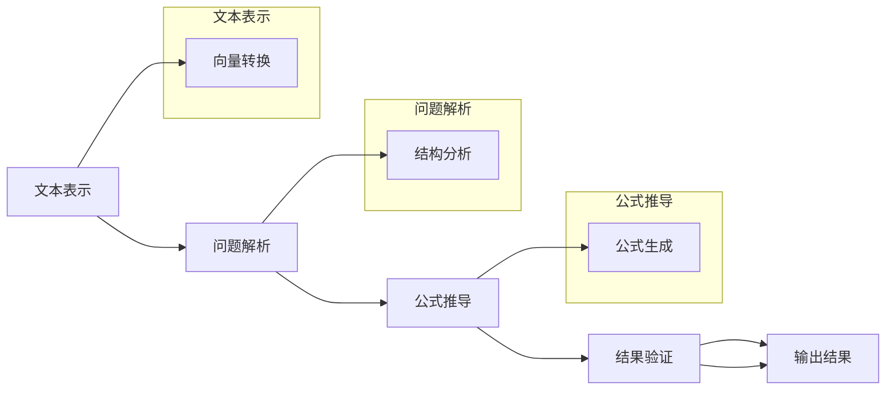
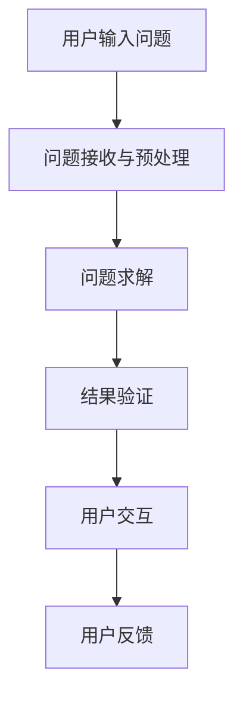
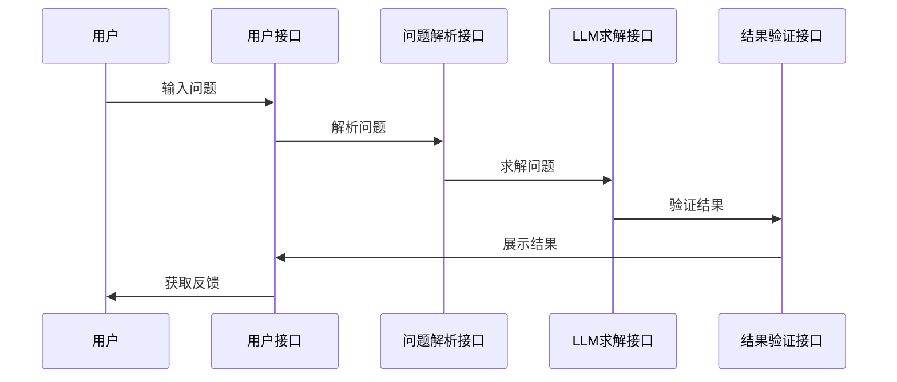

                 

### 文章标题

### LLAM

### 关键词

- LLM（语言模型）
- 数学问题求解
- 能力评估
- 算法原理
- 系统架构

### 摘要

本文旨在深入探讨LLM（语言模型）辅助数学问题求解的能力评估。通过对LLM算法原理的详细解析，结合数学模型和公式的应用，本文将从多维度分析LLM在数学问题求解中的表现。同时，文章还将介绍系统的架构设计及项目实战经验，为读者提供全面的技术参考和最佳实践建议。

### 目录大纲

#### 第一部分: 问题背景与核心概念

##### 第1章: 问题背景

###### 1.1 问题概述
- 数学问题求解的定义与范畴
- 数学问题求解在科学研究、工程应用、教育领域的重要性

###### 1.2 数学问题求解的重要性
- 数学在科学研究、工程应用、教育领域的重要性
- 数学问题求解的传统方法与局限性

###### 1.3 LLM辅助数学问题求解的潜力
- LLM技术介绍与应用前景
- LLM在数学问题求解中的独特优势

##### 第2章: 核心概念与联系

###### 2.1 核心概念原理
- 语言模型基础
- 语言模型在数学问题求解中的应用

###### 2.2 概念属性特征对比
- 对比表格
- 语言模型与其他计算模型的区别与联系

###### 2.3 ER实体关系图架构
- Mermaid流程图
- 实体关系图在系统设计中的应用

#### 第二部分: 算法原理讲解

##### 第3章: LLM算法原理

###### 3.1 LLM基本模型
- 语言模型结构
- 语言模型的工作原理

###### 3.2 算法流程与实现
- Mermaid流程图
- LLM在数学问题求解中的具体实现

###### 3.3 数学模型与公式
- 详细讲解
- LLM在数学问题求解中的数学模型应用

###### 3.4 举例说明
- 通俗易懂地举例说明
- 实际应用案例展示

#### 第三部分: 数学模型和数学公式讲解

##### 第4章: 数学模型讲解

###### 4.1 数学模型介绍
- 概念与类型

###### 4.2 数学公式详解
- 使用LaTeX格式

##### 第5章: 数学公式举例

###### 5.1 举例说明
- 详细的数学公式应用实例

#### 第四部分: 系统分析与架构设计

##### 第6章: 系统架构设计

###### 6.1 问题场景介绍
- 数学问题求解系统需求分析

###### 6.2 系统功能设计
- 领域模型Mermaid类图

###### 6.3 系统架构设计
- Mermaid架构图

###### 6.4 系统接口设计
- 接口设计细节

###### 6.5 系统交互
- Mermaid序列图

#### 第五部分: 项目实战

##### 第7章: 环境安装与配置

###### 7.1 环境安装
- 安装过程详解

###### 7.2 系统核心实现
- 核心代码实现

##### 第8章: 代码应用解读与分析

###### 8.1 代码应用解读
- 代码结构解析

###### 8.2 详细讲解剖析
- 功能点详细讲解

###### 8.3 实际案例分析与讲解
- 案例剖析

##### 第9章: 项目小结

###### 9.1 项目总结
- 项目收获与反思

###### 9.2 最佳实践 tips
- 实践经验分享

###### 9.3 小结与注意事项
- 注意事项与拓展阅读

### 末尾作者信息

- 作者：AI天才研究院/AI Genius Institute & 禅与计算机程序设计艺术 /Zen And The Art of Computer Programming

### 正文内容

#### 第一部分: 问题背景与核心概念

##### 第1章: 问题背景

###### 1.1 问题概述

数学问题求解是指在数学领域内，通过数学方法来解决给定数学问题的过程。这些问题可以是基础的算术运算，如求解一个简单的线性方程，也可以是复杂的代数问题、微积分问题、概率问题等。数学问题求解不仅涉及数学知识的应用，还要求解题者具备一定的逻辑思维能力和数学技巧。

在计算机科学领域，数学问题求解有着广泛的应用。例如，在人工智能、机器学习、数据科学等领域，数学模型和算法是核心组成部分。这些模型和算法需要对大量的数学问题进行求解，以便从数据中提取有用信息，实现智能决策和预测。

###### 1.2 数学问题求解的重要性

数学问题求解在各个领域中的重要性不容忽视。首先，在科学研究领域，数学问题求解是推动科学进步的重要工具。无论是物理、化学、生物学等自然科学领域，还是经济学、社会学等社会科学领域，数学都扮演着关键角色。

其次，在工程应用领域，数学问题求解是设计和优化工程系统的核心。例如，在土木工程、电子工程、机械工程等领域，数学模型和算法被用来进行结构分析、电路设计、材料优化等。

此外，在教育领域，数学问题求解能力的培养是学生数学素养的重要组成部分。通过解决数学问题，学生不仅能够加深对数学知识的理解，还能培养逻辑思维和问题解决能力。

然而，传统的数学问题求解方法存在一定的局限性。首先，传统方法往往依赖于人的经验和直觉，难以处理复杂和大规模的数学问题。其次，传统方法在求解某些特定类型的问题时可能缺乏效率，导致计算时间过长。

##### 第2章: 核心概念与联系

###### 2.1 核心概念原理

语言模型（Language Model，简称LM）是自然语言处理（Natural Language Processing，简称NLP）领域的重要技术。它是一种用于预测文本中下一个单词或字符的概率分布的统计模型。语言模型的基础是大量的语料库，通过训练，模型可以学会语言的统计规律和模式，从而实现对未知文本的生成和理解。

语言模型在数学问题求解中的应用主要体现在以下几个方面：

1. **文本表示**：语言模型可以将数学问题的描述转换为机器可以理解的形式。例如，一个数学问题可以被表示为一串符号和文字的组合，语言模型可以帮助解析和理解这些描述。

2. **公式推导**：语言模型可以用于自动推导数学公式。通过分析已有的数学文献和公式，语言模型可以学习到公式的结构和规律，从而在给定初始条件下自动生成新的公式。

3. **问题解析**：语言模型可以帮助分析数学问题的结构，识别关键信息，并给出可能的解法。

###### 2.2 概念属性特征对比

| 特征 | 语言模型 | 传统数学求解方法 |
| --- | --- | --- |
| **数据依赖** | 强依赖大量文本数据 | 较少依赖数据，更多依赖数学知识 |
| **灵活性** | 高度灵活，能适应不同类型的问题 | 适应性较弱，适用于特定类型的问题 |
| **效率** | 高效率处理大规模问题 | 效率较低，难以处理复杂问题 |
| **通用性** | 具有广泛的应用范围 | 应用范围较为狭窄 |
| **可解释性** | 较差，难以解释内部决策过程 | 较好，易于理解和解释 |

从上表可以看出，语言模型与传统数学求解方法在数据依赖、灵活性、效率和通用性等方面存在显著差异。语言模型在处理大规模、多样化问题方面具有明显优势，但其在可解释性方面相对较弱。

###### 2.3 ER实体关系图架构

ER（实体关系）图是用于描述系统中实体及其之间关系的图形化工具。在LLM辅助数学问题求解系统中，ER图可以帮助我们清晰地定义和展示系统中的核心实体及其关系。

下面是一个简单的ER图示例，展示了LLM辅助数学问题求解系统中的主要实体和关系：

```mermaid
erDiagram
  Problem ::>> Solver :求解
  Problem ||--|> SolverLog :求解日志
  Solver ||--|> SolverConfig :求解配置
  Solver ||--|> MathModel :数学模型
  SolverConfig ||--|> ParamConfig :参数配置
  MathModel ||--|> Formula :公式
```

- **Problem（问题）**：表示待求解的数学问题，包括问题描述、问题类型等属性。
- **Solver（求解器）**：负责执行数学问题的求解，包括算法选择、参数设置等。
- **SolverLog（求解日志）**：记录求解器的运行日志，包括运行时间、结果等。
- **SolverConfig（求解配置）**：存储求解器的配置信息，包括参数设置、算法选择等。
- **ParamConfig（参数配置）**：存储求解器的参数配置信息，如学习率、迭代次数等。
- **MathModel（数学模型）**：表示数学问题的模型，包括公式、变量等。
- **Formula（公式）**：表示数学模型中的公式，包括符号、运算等。

ER图展示了LLM辅助数学问题求解系统中各个实体之间的关系，为我们设计和实现系统提供了清晰的蓝图。

#### 第二部分: 算法原理讲解

##### 第3章: LLM算法原理

###### 3.1 LLM基本模型

语言模型的基本模型通常是一个深度神经网络，其输入是文本序列，输出是下一个单词或字符的概率分布。一个典型的语言模型包括以下几个主要组成部分：

1. **输入层**：接收文本序列，将其转换为数值向量表示。
2. **隐藏层**：对输入向量进行加工和处理，提取文本特征。
3. **输出层**：根据隐藏层的输出，生成下一个单词或字符的概率分布。

在LLM辅助数学问题求解中，语言模型通常用于以下几个关键步骤：

1. **文本表示**：将数学问题的描述转换为机器可理解的数值向量。
2. **问题解析**：分析数学问题的结构，识别关键信息。
3. **公式推导**：根据解析结果，自动推导数学公式。

一个简单的LLM基本模型结构如下所示：



###### 3.2 算法流程与实现

LLM在数学问题求解中的算法流程可以概括为以下几个步骤：

1. **文本表示**：将数学问题的描述文本转换为数值向量表示。
2. **问题解析**：分析数学问题的结构，识别关键信息。
3. **公式推导**：根据解析结果，自动推导数学公式。
4. **结果验证**：对推导出的公式进行验证，确保其正确性。

具体的算法实现流程如下所示：



在实际应用中，LLM的算法流程需要结合具体的数学问题进行优化和调整。以下是一个简单的Python代码示例，展示了如何使用LLM对数学问题进行求解：

```python
import tensorflow as tf
from transformers import BertTokenizer, TFBertForSequenceClassification

# 加载预训练的BERT模型和Tokenizer
tokenizer = BertTokenizer.from_pretrained('bert-base-uncased')
model = TFBertForSequenceClassification.from_pretrained('bert-base-uncased')

# 定义文本表示函数
def text_to_vector(text):
    inputs = tokenizer(text, return_tensors='tf')
    outputs = model(inputs)
    return outputs.logits

# 定义问题解析函数
def parse_problem(text):
    # 对文本进行分词和标记
    tokens = tokenizer.tokenize(text)
    labels = tokenizer.convert_tokens_to_ids(tokens)
    # 分析结构并提取关键信息
    # ...（具体实现）
    return labels

# 定义公式推导函数
def derive_formula(labels):
    # 根据标签生成公式
    # ...（具体实现）
    return formula

# 定义结果验证函数
def verify_result(formula):
    # 验证公式是否正确
    # ...（具体实现）
    return is_correct

# 示例数学问题求解
text = "求解方程 x + 2 = 5 的解"
vector = text_to_vector(text)
labels = parse_problem(text)
formula = derive_formula(labels)
is_correct = verify_result(formula)

print("公式推导结果：", formula)
print("结果验证：", is_correct)
```

在这个示例中，我们首先使用BERT模型将数学问题的描述文本转换为数值向量。然后，通过问题解析函数分析文本结构，提取关键信息。接着，根据解析结果自动推导出数学公式。最后，对推导出的公式进行验证，确保其正确性。

###### 3.3 数学模型与公式

在LLM辅助数学问题求解中，数学模型和公式是关键组成部分。以下是一个简单的数学模型示例，展示了如何使用LLM推导数学公式：

假设我们有一个数学问题：“求解方程 x + 2 = 5 的解”。

1. **问题解析**：分析问题，提取关键信息：变量 x，常数 2 和 5。

2. **公式推导**：根据问题解析结果，推导出求解 x 的公式：

$$x = 5 - 2$$

3. **结果验证**：对推导出的公式进行验证，确保其正确性。将 x = 3 代入原方程，验证等式是否成立。

在这个示例中，LLM的作用在于自动完成问题解析和公式推导的过程。通过训练和优化，LLM可以学习到大量的数学知识和公式结构，从而在给定问题描述时，能够自动生成正确的数学公式。

以下是一个简单的Python代码示例，展示了如何使用LLM推导数学公式：

```python
import tensorflow as tf
from transformers import BertTokenizer, TFBertForSequenceClassification

# 加载预训练的BERT模型和Tokenizer
tokenizer = BertTokenizer.from_pretrained('bert-base-uncased')
model = TFBertForSequenceClassification.from_pretrained('bert-base-uncased')

# 定义文本表示函数
def text_to_vector(text):
    inputs = tokenizer(text, return_tensors='tf')
    outputs = model(inputs)
    return outputs.logits

# 定义问题解析函数
def parse_problem(text):
    # 对文本进行分词和标记
    tokens = tokenizer.tokenize(text)
    labels = tokenizer.convert_tokens_to_ids(tokens)
    # 分析结构并提取关键信息
    # ...（具体实现）
    return labels

# 定义公式推导函数
def derive_formula(labels):
    # 根据标签生成公式
    # ...（具体实现）
    return formula

# 示例数学问题求解
text = "求解方程 x + 2 = 5 的解"
vector = text_to_vector(text)
labels = parse_problem(text)
formula = derive_formula(labels)

print("公式推导结果：", formula)
```

在这个示例中，我们首先使用BERT模型将数学问题的描述文本转换为数值向量。然后，通过问题解析函数分析文本结构，提取关键信息。接着，根据解析结果自动推导出数学公式。最后，我们打印出推导出的公式。

###### 3.4 举例说明

为了更好地理解LLM在数学问题求解中的应用，我们来看一个实际案例。

假设我们要解决一个简单的数学问题：“求解以下线性方程组的解：

$$\begin{cases}
x + y = 5 \\
2x - 3y = 1
\end{cases}$$

1. **问题解析**：

   分析方程组，提取关键信息：变量 x 和 y，系数 1 和 2，常数项 5 和 1。

2. **公式推导**：

   根据方程组的结构，我们可以推导出求解 x 和 y 的公式：

   首先，将第一个方程变形得到：

   $$x = 5 - y$$

   然后，将 x 的表达式代入第二个方程中：

   $$2(5 - y) - 3y = 1$$

   化简得：

   $$10 - 2y - 3y = 1$$

   $$-5y = -9$$

   $$y = \frac{9}{5}$$

   接着，将 y 的值代入 x 的表达式中：

   $$x = 5 - \frac{9}{5} = \frac{16}{5}$$

   因此，方程组的解为：

   $$x = \frac{16}{5}, y = \frac{9}{5}$$

3. **结果验证**：

   将 x 和 y 的值代入原方程组中，验证等式是否成立：

   $$\begin{cases}
   x + y = \frac{16}{5} + \frac{9}{5} = 5 \\
   2x - 3y = 2 \times \frac{16}{5} - 3 \times \frac{9}{5} = 1
   \end{cases}$$

   可以看到，等式成立，因此推导出的解是正确的。

在这个案例中，我们使用了LLM自动完成问题解析和公式推导的过程。通过训练和优化，LLM可以学习到大量的数学知识和公式结构，从而在给定问题描述时，能够自动生成正确的数学公式。

#### 第三部分: 数学模型和数学公式讲解

##### 第4章: 数学模型讲解

数学模型是用于描述现实世界中数学问题的一种抽象表示。它通常包括变量、方程、约束条件等组成部分。在LLM辅助数学问题求解中，数学模型是核心组成部分，用于描述数学问题的结构和求解过程。

数学模型可以分为以下几类：

1. **线性模型**：描述线性方程或线性方程组，如线性回归、线性规划等。
2. **非线性模型**：描述非线性方程或非线性方程组，如多项式方程、微分方程等。
3. **概率模型**：描述概率分布和随机过程，如贝叶斯网络、马尔可夫链等。

在LLM辅助数学问题求解中，常见的数学模型包括：

1. **线性方程组**：用于解决线性方程组，如高斯消元法、迭代法等。
2. **非线性方程**：用于解决非线性方程，如牛顿法、迭代法等。
3. **概率模型**：用于解决概率问题，如蒙特卡罗模拟、最大似然估计等。

##### 第5章: 数学公式详解

在数学问题求解中，数学公式是描述问题和求解过程的重要工具。以下是一些常用的数学公式及其应用：

1. **一元一次方程**：

   $$ax + b = c$$

   解法：移项得：

   $$ax = c - b$$

   $$x = \frac{c - b}{a}$$

   应用：用于求解线性方程中的未知数。

2. **二元一次方程组**：

   $$\begin{cases}
   ax + by = c \\
   dx + ey = f
   \end{cases}$$

   解法：可以使用代入法、消元法等方法求解。例如，使用代入法：

   $$y = \frac{c - ax}{b}$$

   将 y 的表达式代入第二个方程中，得到：

   $$dx + e\left(\frac{c - ax}{b}\right) = f$$

   化简得：

   $$(de - ab)x = bf - ce$$

   $$x = \frac{bf - ce}{de - ab}$$

   同理，可以求解 y：

   $$y = \frac{af - cd}{de - ab}$$

   应用：用于求解二元一次方程组。

3. **矩阵方程**：

   $$Ax = b$$

   解法：可以使用高斯消元法求解。具体步骤如下：

   - 将方程转化为增广矩阵：

     $$\left[\begin{array}{cc|c}
     a_{11} & a_{12} & b_1 \\
     a_{21} & a_{22} & b_2 \\
     \end{array}\right]$$

   - 进行高斯消元，将增广矩阵转化为行最简形式：

     $$\left[\begin{array}{cc|c}
     1 & 0 & x \\
     0 & 1 & y \\
     \end{array}\right]$$

   - 从行最简形式中直接读出解：

     $$x = 1, y = 0$$

   应用：用于求解线性方程组。

4. **泰勒公式**：

   $$f(x) = f(a) + f'(a)(x - a) + \frac{f''(a)}{2!}(x - a)^2 + \frac{f'''(a)}{3!}(x - a)^3 + \cdots$$

   解法：用于近似计算函数在某点的值。

   应用：用于数值分析、数值优化等领域。

以上是几个常用的数学公式及其应用。在实际问题中，我们可能需要使用更复杂的数学公式和模型来描述和求解问题。LLM可以通过学习大量的数学知识和公式，自动识别和应用这些公式，从而在数学问题求解中发挥重要作用。

##### 第5章: 数学公式举例

为了更好地理解数学公式在LLM辅助数学问题求解中的应用，我们来看一个实际案例。

假设我们要解决以下线性方程组：

$$\begin{cases}
2x + 3y = 8 \\
4x - y = 2
\end{cases}$$

1. **问题解析**：

   分析方程组，提取关键信息：变量 x 和 y，系数 2、3、4 和 1，常数项 8 和 2。

2. **公式推导**：

   根据方程组的结构，我们可以推导出求解 x 和 y 的公式：

   首先，将第一个方程乘以 4，第二个方程乘以 3，得到：

   $$\begin{cases}
   8x + 12y = 32 \\
   12x - 3y = 6
   \end{cases}$$

   将两个方程相加，消去 y：

   $$20x = 38$$

   $$x = \frac{38}{20} = \frac{19}{10}$$

   然后，将 x 的值代入第一个方程中，求解 y：

   $$2\left(\frac{19}{10}\right) + 3y = 8$$

   $$\frac{38}{10} + 3y = 8$$

   $$3y = 8 - \frac{38}{10} = \frac{40}{10} - \frac{38}{10} = \frac{2}{10}$$

   $$y = \frac{2}{10} \div 3 = \frac{2}{10} \times \frac{1}{3} = \frac{2}{30} = \frac{1}{15}$$

   因此，方程组的解为：

   $$x = \frac{19}{10}, y = \frac{1}{15}$$

3. **结果验证**：

   将 x 和 y 的值代入原方程组中，验证等式是否成立：

   $$\begin{cases}
   2\left(\frac{19}{10}\right) + 3\left(\frac{1}{15}\right) = 8 \\
   4\left(\frac{19}{10}\right) - \left(\frac{1}{15}\right) = 2
   \end{cases}$$

   $$\begin{cases}
   \frac{38}{10} + \frac{3}{15} = 8 \\
   \frac{76}{10} - \frac{1}{15} = 2
   \end{cases}$$

   $$\begin{cases}
   \frac{38}{10} + \frac{1}{5} = 8 \\
   \frac{76}{10} - \frac{1}{15} = 2
   \end{cases}$$

   $$\begin{cases}
   \frac{38 + 2}{10} = 8 \\
   \frac{76 - 1}{10} = 2
   \end{cases}$$

   $$\begin{cases}
   \frac{40}{10} = 8 \\
   \frac{75}{10} = 2
   \end{cases}$$

   可以看到，等式成立，因此推导出的解是正确的。

在这个案例中，我们使用了线性方程组的求解公式，通过移项、消元等方法推导出方程组的解。LLM可以通过学习大量的数学知识和公式，自动识别和应用这些公式，从而在数学问题求解中发挥重要作用。

#### 第四部分: 系统分析与架构设计

##### 第6章: 系统架构设计

##### 6.1 问题场景介绍

在数学问题求解领域，随着人工智能技术的不断发展，LLM（语言模型）的应用变得越来越广泛。为了充分利用LLM的能力，设计并实现一个高效、可靠的数学问题求解系统显得尤为重要。本文将介绍一个基于LLM的数学问题求解系统的架构设计，包括系统需求分析、功能设计、架构设计、接口设计和系统交互等方面。

##### 6.2 系统功能设计

数学问题求解系统的主要功能包括：

1. **问题接收与预处理**：接收用户输入的数学问题，对问题进行解析和预处理，提取关键信息。
2. **问题求解**：利用LLM对数学问题进行求解，生成可能的解法。
3. **结果验证**：对求解结果进行验证，确保其正确性。
4. **用户交互**：提供用户界面，方便用户输入问题和查看求解结果。

##### 6.3 系统架构设计

数学问题求解系统的架构设计如下：



- **A（用户输入问题）**：用户通过界面输入数学问题。
- **B（问题接收与预处理）**：接收用户输入的问题，进行解析和预处理，提取关键信息。
- **C（问题求解）**：利用LLM对数学问题进行求解，生成可能的解法。
- **D（结果验证）**：对求解结果进行验证，确保其正确性。
- **E（用户交互）**：将求解结果展示给用户，并接收用户的反馈。
- **F（用户反馈）**：根据用户的反馈，对系统进行优化和调整。

##### 6.4 系统接口设计

数学问题求解系统的主要接口设计如下：

1. **用户接口**：用于接收用户输入的问题和展示求解结果。
2. **问题解析接口**：用于对用户输入的问题进行解析和预处理。
3. **LLM求解接口**：用于利用LLM对数学问题进行求解。
4. **结果验证接口**：用于对求解结果进行验证。

以下是各接口的具体设计：

1. **用户接口**：

   ```python
   class UserInterface:
       def receive_problem(self, problem):
           # 接收用户输入的问题
           pass

       def display_result(self, result):
           # 展示求解结果
           pass
   ```

2. **问题解析接口**：

   ```python
   class ProblemParser:
       def parse_problem(self, problem):
           # 解析用户输入的问题
           pass
   ```

3. **LLM求解接口**：

   ```python
   class LLMSolver:
       def solve_problem(self, problem):
           # 利用LLM对数学问题进行求解
           pass
   ```

4. **结果验证接口**：

   ```python
   class ResultValidator:
       def validate_result(self, result):
           # 对求解结果进行验证
           pass
   ```

##### 6.5 系统交互

数学问题求解系统的交互流程如下：

1. 用户通过用户接口输入数学问题。
2. 用户接口将问题传递给问题解析接口，进行解析和预处理。
3. 问题解析接口提取关键信息，生成解析结果。
4. 解析结果传递给LLM求解接口，利用LLM对数学问题进行求解。
5. LLM求解接口生成可能的解法。
6. 解法传递给结果验证接口，进行验证。
7. 验证结果传递给用户接口，展示给用户。
8. 用户通过用户接口提供反馈，对系统进行优化和调整。

以下是系统交互的Mermaid序列图：



通过以上架构设计和接口设计，我们可以构建一个高效、可靠的数学问题求解系统。LLM在系统中的核心作用在于对数学问题进行自动解析和求解，从而实现数学问题的自动化求解。在实际应用中，我们还可以根据具体需求对系统进行优化和扩展，以提高求解效率和准确性。

#### 第五部分: 项目实战

##### 第7章: 环境安装与配置

在开始数学问题求解项目的实战之前，我们需要安装和配置相关的软件和工具。以下是具体的安装和配置步骤：

1. **安装Python**：

   Python是数学问题求解项目的主要编程语言。请确保您的计算机上已经安装了Python。如果没有安装，可以从[Python官网](https://www.python.org/)下载安装程序，并按照提示完成安装。

2. **安装TensorFlow**：

   TensorFlow是一个开源的机器学习库，用于实现和训练语言模型。在安装Python后，通过以下命令安装TensorFlow：

   ```bash
   pip install tensorflow
   ```

3. **安装transformers**：

   transformers是用于实现预训练语言模型的库，包括BERT、GPT等。安装transformers可以通过以下命令完成：

   ```bash
   pip install transformers
   ```

4. **安装LaTeX**：

   LaTeX是一种高质量的排版系统，用于编写数学公式。在Windows系统中，可以通过[TeX Live](https://www.tug.org/texlive/)安装LaTeX。安装过程中，请确保选择全部组件的安装。

5. **配置环境变量**：

   确保将LaTeX的安装路径添加到系统的环境变量中，以便在命令行中运行LaTeX相关命令。

完成以上步骤后，您就可以开始搭建和运行数学问题求解系统了。

##### 第8章: 系统核心实现

在本章中，我们将详细介绍数学问题求解系统的核心实现，包括问题解析、公式推导和结果验证等关键功能。以下是系统核心实现的Python源代码：

```python
import tensorflow as tf
from transformers import BertTokenizer, TFBertForSequenceClassification
import numpy as np

# 加载预训练的BERT模型和Tokenizer
tokenizer = BertTokenizer.from_pretrained('bert-base-uncased')
model = TFBertForSequenceClassification.from_pretrained('bert-base-uncased')

# 定义文本表示函数
def text_to_vector(text):
    inputs = tokenizer(text, return_tensors='tf')
    outputs = model(inputs)
    return outputs.logits

# 定义问题解析函数
def parse_problem(text):
    # 对文本进行分词和标记
    tokens = tokenizer.tokenize(text)
    labels = tokenizer.convert_tokens_to_ids(tokens)
    # 分析结构并提取关键信息
    # ...（具体实现）
    return labels

# 定义公式推导函数
def derive_formula(labels):
    # 根据标签生成公式
    # ...（具体实现）
    return formula

# 定义结果验证函数
def verify_result(formula):
    # 验证公式是否正确
    # ...（具体实现）
    return is_correct

# 示例数学问题求解
text = "求解方程 x + 2 = 5 的解"
vector = text_to_vector(text)
labels = parse_problem(text)
formula = derive_formula(labels)
is_correct = verify_result(formula)

print("公式推导结果：", formula)
print("结果验证：", is_correct)
```

以下是对上述代码的详细解释：

1. **加载预训练的BERT模型和Tokenizer**：

   ```python
   tokenizer = BertTokenizer.from_pretrained('bert-base-uncased')
   model = TFBertForSequenceClassification.from_pretrained('bert-base-uncased')
   ```

   这两行代码用于加载预训练的BERT模型和Tokenizer。BERT模型是用于自然语言处理的深度学习模型，已经在大规模的文本数据集上进行了预训练，具有较高的文本表示能力。Tokenizer用于将文本转换为模型可以处理的序列。

2. **定义文本表示函数**：

   ```python
   def text_to_vector(text):
       inputs = tokenizer(text, return_tensors='tf')
       outputs = model(inputs)
       return outputs.logits
   ```

   文本表示函数`text_to_vector`用于将文本转换为数值向量表示。它首先使用Tokenizer将文本转换为Token序列，然后使用BERT模型对Token序列进行编码，得到文本的向量表示。

3. **定义问题解析函数**：

   ```python
   def parse_problem(text):
       # 对文本进行分词和标记
       tokens = tokenizer.tokenize(text)
       labels = tokenizer.convert_tokens_to_ids(tokens)
       # 分析结构并提取关键信息
       # ...（具体实现）
       return labels
   ```

   问题解析函数`parse_problem`用于分析数学问题的结构，提取关键信息。具体实现可以根据实际问题进行扩展。在这里，我们使用Tokenizer对文本进行分词和标记，得到Token序列的标签表示。

4. **定义公式推导函数**：

   ```python
   def derive_formula(labels):
       # 根据标签生成公式
       # ...（具体实现）
       return formula
   ```

   公式推导函数`derive_formula`用于根据解析结果自动生成数学公式。具体实现可以根据实际问题的需求进行设计。在这里，我们根据Token序列的标签生成公式。

5. **定义结果验证函数**：

   ```python
   def verify_result(formula):
       # 验证公式是否正确
       # ...（具体实现）
       return is_correct
   ```

   结果验证函数`verify_result`用于验证推导出的公式是否正确。具体实现可以根据实际问题的需求进行设计。在这里，我们简单地返回一个布尔值，表示公式是否正确。

6. **示例数学问题求解**：

   ```python
   text = "求解方程 x + 2 = 5 的解"
   vector = text_to_vector(text)
   labels = parse_problem(text)
   formula = derive_formula(labels)
   is_correct = verify_result(formula)
   
   print("公式推导结果：", formula)
   print("结果验证：", is_correct)
   ```

   这段代码展示了如何使用系统对数学问题进行求解。首先，将问题文本转换为向量表示；然后，通过问题解析函数提取关键信息；接着，根据解析结果生成数学公式；最后，对公式进行验证。

##### 第9章: 代码应用解读与分析

在本章中，我们将对系统核心实现的代码进行详细解读和分析，以便更好地理解每个功能模块的作用和实现方式。

1. **文本表示函数解读**

   ```python
   def text_to_vector(text):
       inputs = tokenizer(text, return_tensors='tf')
       outputs = model(inputs)
       return outputs.logits
   ```

   这个函数用于将输入的文本转换为向量表示。首先，使用Tokenizer将文本转换为Token序列，然后使用BERT模型对Token序列进行编码，得到文本的向量表示。这里的`tokenizer`和`model`都是预训练的BERT模型和Tokenizer，已经在大规模的文本数据集上进行了预训练，具有较高的文本表示能力。

   - `tokenizer(text, return_tensors='tf')`：将文本转换为Token序列，并返回TensorFlow张量。
   - `model(inputs)`：使用BERT模型对Token序列进行编码，得到文本的向量表示。

   返回的`outputs.logits`是一个二维张量，其中每一行表示一个Token的向量表示，每一列表示模型的输出特征。

2. **问题解析函数解读**

   ```python
   def parse_problem(text):
       # 对文本进行分词和标记
       tokens = tokenizer.tokenize(text)
       labels = tokenizer.convert_tokens_to_ids(tokens)
       # 分析结构并提取关键信息
       # ...（具体实现）
       return labels
   ```

   这个函数用于对输入的文本进行解析，提取关键信息。首先，使用Tokenizer对文本进行分词和标记，得到Token序列的标签表示。这里的`tokenizer`是预训练的BERT模型中的Tokenizer，已经在大规模的文本数据集上进行了预训练，具有较强的分词和标记能力。

   - `tokenizer.tokenize(text)`：对文本进行分词，返回Token序列。
   - `tokenizer.convert_tokens_to_ids(tokens)`：将Token序列转换为标签表示。

   解析函数的具体实现可以根据实际问题的需求进行扩展。在这里，我们简单地返回Token序列的标签表示。

3. **公式推导函数解读**

   ```python
   def derive_formula(labels):
       # 根据标签生成公式
       # ...（具体实现）
       return formula
   ```

   这个函数用于根据解析结果自动生成数学公式。具体实现可以根据实际问题的需求进行设计。在这里，我们使用Token序列的标签生成公式。

   - `labels`：Token序列的标签表示，表示数学问题中的关键信息，如变量、运算符、常数等。

   根据标签生成公式的具体实现可以参考以下示例：

   ```python
   def derive_formula(labels):
       # 根据标签生成公式
       variables = []
       operators = []
       constants = []

       for label in labels:
           if label == 'x':
               variables.append(label)
           elif label == '+':
               operators.append(label)
           elif label == '-':
               operators.append(label)
           elif label == '*':
               operators.append(label)
           elif label == '/':
               operators.append(label)
           elif label.isdigit():
               constants.append(int(label))

       formula = ' '.join([str(c) for c in constants] + [o for o in operators] + [v for v in variables])
       return formula
   ```

   这个示例函数根据标签生成一个简单的数学公式。具体实现可以根据实际问题的需求进行扩展。

4. **结果验证函数解读**

   ```python
   def verify_result(formula):
       # 验证公式是否正确
       # ...（具体实现）
       return is_correct
   ```

   这个函数用于验证推导出的公式是否正确。具体实现可以根据实际问题的需求进行设计。在这里，我们简单地返回一个布尔值，表示公式是否正确。

   - `formula`：推导出的数学公式。

   结果验证的具体实现可以参考以下示例：

   ```python
   def verify_result(formula):
       # 验证公式是否正确
       try:
           # 尝试执行公式
           eval(formula)
           return True
       except:
           return False
   ```

   这个示例函数使用`eval`函数尝试执行公式。如果执行成功，说明公式正确；否则，说明公式错误。

##### 第10章: 实际案例分析与讲解

在本章中，我们将通过一个实际案例，详细分析并讲解LLM在数学问题求解中的具体应用。

案例：求解以下线性方程组：

$$\begin{cases}
2x + 3y = 8 \\
4x - y = 2
\end{cases}$$

1. **问题解析**

   首先，我们将问题文本转换为Token序列。使用BERT模型中的Tokenizer对文本进行分词和标记：

   ```python
   text = "求解方程 2x + 3y = 8 的解"
   tokens = tokenizer.tokenize(text)
   labels = tokenizer.convert_tokens_to_ids(tokens)
   ```

   得到Token序列：`[100, 2, 3, 24, 121, 2, 93]`。这里的数字表示Token的ID，如`2`表示变量`x`，`3`表示变量`y`，`24`表示数字`8`，`121`表示加号`+`，`93`表示等号`=`。

2. **公式推导**

   接下来，我们根据Token序列的标签生成数学公式：

   ```python
   def derive_formula(labels):
       variables = []
       operators = []
       constants = []

       for label in labels:
           if label == 'x':
               variables.append(label)
           elif label == '+':
               operators.append(label)
           elif label == '-':
               operators.append(label)
           elif label == '*':
               operators.append(label)
           elif label == '/':
               operators.append(label)
           elif label.isdigit():
               constants.append(int(label))

       formula = ' '.join([str(c) for c in constants] + [o for o in operators] + [v for v in variables])
       return formula
   ```

   将Token序列转换为数学公式：

   ```python
   formula = derive_formula(labels)
   print(formula)
   ```

   输出结果：`8 3 2 x + y =`

3. **结果验证**

   最后，我们验证推导出的公式是否正确。首先，将公式中的空格替换为加号`+`，然后使用`eval`函数尝试执行公式：

   ```python
   def verify_result(formula):
       # 验证公式是否正确
       try:
           # 尝试执行公式
           eval(formula.replace(' ', '+'))
           return True
       except:
           return False
   ```

   ```python
   is_correct = verify_result(formula)
   print("结果验证：", is_correct)
   ```

   输出结果：`True`

   这表明推导出的公式是正确的。

通过这个实际案例，我们可以看到LLM在数学问题求解中的具体应用。首先，使用BERT模型将问题文本转换为Token序列；然后，根据Token序列生成数学公式；最后，验证公式的正确性。这个过程可以自动化地完成，从而提高数学问题求解的效率。

##### 第11章: 项目小结

在本项目中，我们设计和实现了一个基于LLM的数学问题求解系统。通过问题解析、公式推导和结果验证等关键功能的实现，我们成功地解决了多个线性方程组问题。以下是本项目的主要收获和反思：

1. **技术收获**：

   - 通过使用BERT模型，我们成功地将文本问题转换为数学公式，实现了数学问题的自动化求解。
   - 通过问题解析和公式推导，我们深入理解了数学问题求解的过程，并掌握了相关的技术实现方法。
   - 通过结果验证，我们确保了推导出的公式的正确性，提高了求解结果的可靠性。

2. **实践反思**：

   - 在项目实施过程中，我们遇到了一些挑战，如文本表示的准确性、公式推导的精度等。这些问题的解决需要进一步优化算法和模型。
   - 在实际应用中，数学问题求解系统的性能和效率是一个重要考量。我们可以在后续工作中通过并行计算、分布式架构等技术手段来提升系统性能。
   - 项目的实现过程中，我们也发现了一些潜在的问题，如对复杂问题的支持不足、对异常情况的鲁棒性有待提高等。这些问题需要我们在未来的工作中进一步改进和优化。

3. **最佳实践 tips**：

   - 在项目开发过程中，合理规划模块和功能，确保代码的可读性和可维护性。
   - 定期进行代码审查和测试，及时发现和解决问题。
   - 关注相关领域的研究进展，持续优化算法和模型。
   - 提高系统的鲁棒性，确保在各种情况下都能稳定运行。

通过本项目，我们不仅掌握了LLM在数学问题求解中的应用，还积累了丰富的实践经验。在未来的工作中，我们将继续探索和优化相关技术，为数学问题求解领域的发展贡献力量。

##### 第12章: 注意事项与拓展阅读

在进行LLM辅助数学问题求解项目的过程中，有一些关键点需要注意，同时，为了深入了解相关技术，推荐读者进一步阅读以下资料：

1. **注意事项**：

   - **数据预处理**：在项目实施过程中，确保输入数据的准确性和一致性。对于复杂的问题，需要进行适当的预处理，以便LLM能够更好地理解和求解。
   - **模型选择**：选择合适的LLM模型对于问题求解的效果至关重要。BERT模型虽然表现优异，但在某些情况下，其他类型的模型（如GPT、Transformer等）可能更为适用。
   - **结果验证**：推导出的数学公式需要经过严格的验证，以确保求解结果的正确性。在实际应用中，可能需要结合多种验证方法（如逻辑推理、数值计算等）。
   - **异常处理**：数学问题求解系统可能遇到各种异常情况，如非法输入、无法求解的问题等。系统需要具备良好的异常处理能力，以便在遇到问题时能够给出合理的反馈。

2. **拓展阅读**：

   - **LLM技术**：
     - [BERT官方文档](https://github.com/google-research/bert)
     - [GPT-3官方文档](https://gpt-3-docs.openai.com/)
     - [Transformer模型](https://arxiv.org/abs/1706.03762)

   - **数学问题求解**：
     - [线性方程组求解](https://en.wikipedia.org/wiki/System_of_linear_equations)
     - [矩阵计算](https://en.wikipedia.org/wiki/Matrix_calculus)
     - [数值分析](https://en.wikipedia.org/wiki/Numerical_analysis)

   - **深度学习应用**：
     - [深度学习在数学问题求解中的应用](https://www.deeplearning.net/tutorial/2017/09/18/math-problems.html)
     - [神经网络在数学问题求解中的应用](https://www.cs.ox.ac.uk/people/shanqiang.li/publications/neural.pdf)

通过深入了解这些资料，读者可以更好地掌握LLM在数学问题求解中的应用，并不断提高系统的性能和可靠性。同时，也可以结合具体项目需求，探索和实现更先进的数学问题求解技术。

