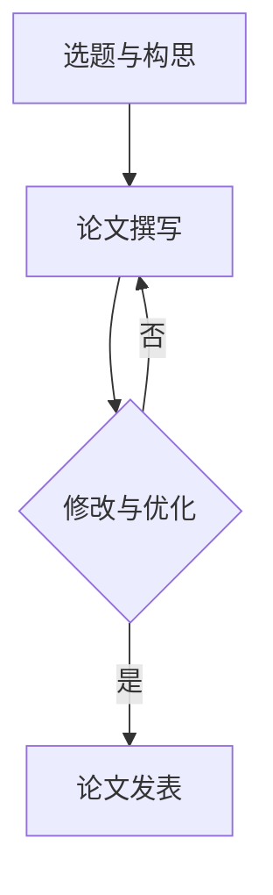

                 

## LLM辅助科技论文写作能力评估

### 关键词：LLM，科技论文写作，能力评估，人工智能

> 摘要：随着人工智能技术的不断发展，自然语言处理（NLP）领域取得了显著进展。其中，大型语言模型（LLM）在科技论文写作辅助中展现了强大的潜力。本文将探讨LLM在科技论文写作能力评估方面的应用，分析其在选题与构思、论文撰写、修改与优化以及论文发表等阶段的实际作用。通过系统梳理LLM辅助科技论文写作的能力评估指标体系、方法与工具，本文旨在为相关研究提供参考，并为未来LLM在科技论文写作中的发展提供展望。

---

### 目录大纲

----------------------------------------------------------------

# LLM辅助科技论文写作能力评估

## 第一部分: LLM辅助科技论文写作能力评估概述

## 1.1 问题背景

### 1.1.1 科技论文写作的重要性

### 1.1.2 当前科技论文写作面临的挑战

### 1.1.3 LLM技术在写作辅助中的应用潜力

## 1.2 核心概念与联系

### 1.2.1 LLM的定义与特点

### 1.2.2 LLM的工作原理

### 1.2.3 LLM与科技论文写作的关联

## 1.3 LLM在科技论文写作中的能力评估

### 1.3.1 能力评估的定义与目的

### 1.3.2 能力评估的指标体系

### 1.3.3 能力评估的方法与工具

## 1.4 LLM辅助科技论文写作的优势与挑战

### 1.4.1 优势分析

### 1.4.2 挑战与解决方案

## 1.5 本章小结

----------------------------------------------------------------

## 第二部分: LLM辅助科技论文写作的应用与实践

## 2.1 LLM在选题与构思阶段的应用

### 2.1.1 选题与构思的重要性

### 2.1.2 LLM在选题与构思中的作用

### 2.1.3 实际应用案例

## 2.2 LLM在论文撰写阶段的应用

### 2.2.1 论文撰写的基本流程

### 2.2.2 LLM在撰写各阶段的具体应用

### 2.2.3 实际应用案例

## 2.3 LLM在论文修改与优化阶段的应用

### 2.3.1 论文修改与优化的重要性

### 2.3.2 LLM在修改与优化中的作用

### 2.3.3 实际应用案例

## 2.4 LLM在论文发表阶段的应用

### 2.4.1 论文发表的基本流程

### 2.4.2 LLM在论文发表中的作用

### 2.4.3 实际应用案例

## 2.5 LLM辅助科技论文写作的实践总结

### 2.5.1 经验与启示

### 2.5.2 面临的问题与改进方向

## 2.6 本章小结

----------------------------------------------------------------

## 第三部分: LLM辅助科技论文写作的能力评估

## 3.1 能力评估的指标体系

### 3.1.1 指标体系的设计原则

### 3.1.2 常见指标及其计算方法

### 3.1.3 指标体系的完善与优化

## 3.2 LLM辅助写作能力评估的方法

### 3.2.1 自动评估方法

### 3.2.2 人机结合评估方法

### 3.2.3 新方法探索

## 3.3 LLM辅助写作能力评估的工具

### 3.3.1 常用评估工具介绍

### 3.3.2 工具的选择与配置

### 3.3.3 工具的优化与改进

## 3.4 LLM辅助写作能力评估的应用案例

### 3.4.1 案例一：某知名科技论文写作平台的评估实践

### 3.4.2 案例二：某高校科研团队的评估实践

### 3.4.3 案例三：某企业研发团队的评估实践

## 3.5 LLM辅助写作能力评估的实践总结

### 3.5.1 经验与启示

### 3.5.2 面临的问题与改进方向

## 3.6 本章小结

----------------------------------------------------------------

## 第四部分: LLM辅助科技论文写作的挑战与未来展望

## 4.1 LLM在科技论文写作中的挑战

### 4.1.1 技术挑战

### 4.1.2 实践挑战

### 4.1.3 道德与伦理挑战

## 4.2 LLM辅助科技论文写作的发展趋势

### 4.2.1 技术发展趋势

### 4.2.2 应用发展趋势

### 4.2.3 挑战与机遇

## 4.3 未来展望

### 4.3.1 LLM在科技论文写作中的潜在应用

### 4.3.2 LLM能力评估的发展方向

### 4.3.3 未来前景

## 4.4 本章小结

----------------------------------------------------------------

# 附录

### 5.1 附录A: 常用术语解释

### 5.2 附录B: 相关资源推荐

### 5.3 附录C: 案例数据集

### 5.4 附录D: Python代码示例

### 5.5 附录E: Mermaid流程图示例

### 5.6 附录F: 拓展阅读

----------------------------------------------------------------

---

**作者：AI天才研究院/AI Genius Institute & 禅与计算机程序设计艺术 /Zen And The Art of Computer Programming**

---

---

### 第一部分: LLM辅助科技论文写作能力评估概述

#### 1.1 问题背景

##### 1.1.1 科技论文写作的重要性

科技论文是科研人员交流研究成果、推动科学技术进步的重要载体。高质量的科技论文不仅有助于科研人员获取同行评审的认可，还能为学术界和工业界带来新的知识和技术。科技论文的写作质量直接影响到研究成果的传播速度和应用价值。因此，提升科技论文写作能力成为科研人员的重要任务。

然而，科技论文写作面临着诸多挑战。首先，写作过程复杂，需要系统地构建论文结构，确保论据充分、逻辑清晰。其次，科技论文写作往往涉及大量的专业术语和理论，科研人员需要花费大量时间进行资料收集和整理。此外，现代科研的跨学科特点也要求科研人员具备更广泛的学术视野和知识储备。

传统科技论文写作主要依赖于人工撰写和修改。尽管一些文本编辑工具和辅助软件能够提供一定程度的帮助，但它们在提升论文质量和效率方面的作用有限。因此，寻找一种有效的辅助手段成为科研人员的热切需求。此时，大型语言模型（LLM）作为一种先进的自然语言处理技术，因其强大的生成和推理能力而逐渐受到关注。

##### 1.1.2 当前科技论文写作面临的挑战

1. **复杂性和专业性**：科技论文写作需要深入理解所研究领域的专业知识，并能够将这些复杂的概念和理论清晰地表达出来。这对科研人员的学术素养和表达能力提出了很高的要求。
   
2. **资料收集与整合**：撰写科技论文需要大量的文献资料作为支持。科研人员需要花费大量时间进行文献检索、阅读和整理，以确保论文的论据充分且可靠。

3. **结构规范性**：科技论文具有严格的格式要求，包括标题、摘要、引言、方法、结果、讨论和参考文献等部分。科研人员需要确保论文的结构符合规范，内容连贯且逻辑清晰。

4. **语言表达**：科技论文需要使用准确、清晰和简洁的语言来表达研究内容。这要求科研人员不仅要有扎实的专业背景，还要具备良好的语言表达能力。

5. **时间与效率**：科研人员往往需要在有限的时间内完成论文的撰写和修改，同时还需要关注其他科研任务。提高写作效率成为科研人员亟待解决的问题。

##### 1.1.3 LLM技术在写作辅助中的应用潜力

大型语言模型（LLM）是基于深度学习和自然语言处理技术构建的，具有强大的文本生成和推理能力。LLM可以处理大规模的文本数据，自动生成高质量的文章、段落和句子，从而为科技论文写作提供有力的辅助。

1. **选题与构思**：LLM可以根据科研人员提供的关键词和背景信息，自动生成选题建议和研究思路，帮助科研人员快速找到研究方向。

2. **论文撰写**：LLM可以在论文的各个阶段提供帮助，包括标题生成、摘要撰写、引言构建、方法描述、结果展示和讨论等。它可以自动生成段落和句子，确保文章的逻辑性和连贯性。

3. **修改与优化**：LLM可以通过对比分析不同版本的文章，提供修改建议和优化方案，帮助科研人员提高论文的质量。

4. **参考文献管理**：LLM可以自动检索和整理参考文献，确保引用规范且准确。

5. **语言校正**：LLM可以识别和纠正论文中的语法错误、拼写错误和语义错误，提高文章的表达准确性。

总之，LLM在科技论文写作辅助中具有广泛的应用潜力，能够显著提高写作效率和质量。然而，LLM的应用也面临着一些挑战和问题，如如何确保生成的文本质量和准确性，以及如何避免潜在的偏见和错误等。这些问题需要在未来的研究和实践中逐步解决。

---

### 1.2 核心概念与联系

在探讨LLM辅助科技论文写作能力评估之前，我们需要明确几个核心概念，并了解它们之间的联系。

##### 1.2.1 LLM的定义与特点

大型语言模型（LLM）是指那些具有大规模参数和训练数据的语言模型，如GPT、BERT等。这些模型通过学习海量文本数据，掌握了丰富的语言知识和模式，从而具备了生成高质量文本的能力。LLM的主要特点包括：

1. **大规模参数**：LLM通常拥有数十亿甚至千亿级别的参数，这使得它们能够处理复杂的语言结构和语义信息。

2. **自回归生成**：LLM采用自回归模型，可以生成连续的文本序列，确保生成的文本连贯且自然。

3. **多任务学习**：LLM可以通过多任务学习，同时处理多种文本任务，如文本生成、文本分类、问答等。

4. **预训练与微调**：LLM通常通过预训练获得通用语言能力，然后通过微调适应特定任务的需求。

##### 1.2.2 LLM的工作原理

LLM的工作原理主要包括以下几个步骤：

1. **输入编码**：将输入文本转换为模型可以处理的向量表示。

2. **序列生成**：基于输入编码的向量，模型预测下一个单词或字符，并生成文本序列。

3. **损失函数与优化**：通过损失函数评估生成的文本质量，并使用优化算法调整模型参数。

4. **推理与生成**：在生成过程中，模型根据上下文信息进行推理，生成高质量的自然语言文本。

##### 1.2.3 LLM与科技论文写作的关联

LLM在科技论文写作中的应用主要体现在以下几个方面：

1. **选题与构思**：LLM可以根据科研人员提供的关键词和背景信息，生成选题建议和研究思路，帮助科研人员快速找到研究方向。

2. **论文撰写**：LLM可以在论文的各个阶段提供帮助，包括标题生成、摘要撰写、引言构建、方法描述、结果展示和讨论等。它可以自动生成段落和句子，确保文章的逻辑性和连贯性。

3. **修改与优化**：LLM可以通过对比分析不同版本的文章，提供修改建议和优化方案，帮助科研人员提高论文的质量。

4. **参考文献管理**：LLM可以自动检索和整理参考文献，确保引用规范且准确。

5. **语言校正**：LLM可以识别和纠正论文中的语法错误、拼写错误和语义错误，提高文章的表达准确性。

总的来说，LLM在科技论文写作中具有广泛的应用潜力，可以显著提高写作效率和质量。然而，LLM的应用也需要注意文本生成中的潜在错误和偏见，并探索有效的评估方法，以确保生成的文本质量。

---

### 1.3 LLM在科技论文写作中的能力评估

##### 1.3.1 能力评估的定义与目的

能力评估是指通过一系列定量和定性的指标，对个体或系统的能力水平进行测量和评估的过程。在科技论文写作领域，能力评估的目标是客观、公正地评估LLM在辅助写作任务中的表现，从而为LLM的应用提供科学依据。

1. **定量评估**：通过量化指标，如文本质量得分、生成速度等，对LLM的写作能力进行评估。
   
2. **定性评估**：通过专家评审和用户反馈，对LLM生成的文本内容、逻辑性、语言风格等进行综合评价。

##### 1.3.2 能力评估的指标体系

一个全面的能力评估指标体系应包括以下几个方面：

1. **文本质量**：评估生成的文本是否符合语法规范、逻辑清晰、内容准确等。

2. **生成速度**：评估LLM在生成文本时的效率，包括平均生成速度和处理能力。

3. **多样性**：评估LLM生成文本的多样性，确保生成的文本不重复、不单一。

4. **语言流畅性**：评估生成文本的语言流畅性和自然度。

5. **逻辑性**：评估生成文本的逻辑结构和论证力度。

6. **专业术语掌握**：评估LLM对专业术语和概念的掌握程度。

##### 1.3.3 能力评估的方法与工具

1. **自动评估方法**：
   - **文本质量评估**：使用自动化工具，如语法检查器和文本相似度检测器，对生成的文本进行评估。
   - **性能指标评估**：使用定量指标，如BLEU、ROUGE等，评估文本质量。

2. **人机结合评估方法**：
   - **专家评审**：邀请领域专家对生成的文本进行评审，结合定量评估结果，综合评价LLM的表现。
   - **用户反馈**：收集用户对LLM生成文本的反馈，分析用户满意度，作为评估指标之一。

3. **新方法探索**：
   - **多模态评估**：结合图像、音频等多模态数据，对生成的文本进行更全面的质量评估。
   - **自适应评估**：根据用户需求和写作任务的特点，动态调整评估指标和评估方法。

通过上述方法，可以全面、科学地评估LLM在科技论文写作中的能力，为LLM的应用提供有力支持。

---

### 1.4 LLM辅助科技论文写作的优势与挑战

##### 1.4.1 优势分析

1. **高效性**：LLM可以快速生成高质量的文章，显著提高写作效率，为科研人员节省时间和精力。

2. **专业性**：LLM通过学习大量专业文本，能够生成符合学术规范和行业标准的论文，确保文本的准确性和专业性。

3. **多样性**：LLM可以生成多样化的文本，避免了人工写作的单一性和重复性，提高了文章的创新性和吸引力。

4. **协作性**：LLM可以作为科研人员的辅助工具，与人类作者共同完成论文写作，实现人机协作。

5. **降低写作成本**：通过减少人工写作环节，LLM可以降低论文写作的成本，特别是在大规模写作任务中具有显著优势。

##### 1.4.2 挑战与解决方案

1. **文本质量**：尽管LLM可以生成高质量的文本，但仍然可能存在语法错误、逻辑不清等问题。解决方法包括：进一步优化LLM模型，使用多模态数据提高文本生成质量，结合人工修正。

2. **数据偏见**：LLM在训练过程中可能受到数据偏见的影响，导致生成的文本存在偏见或歧视。解决方法包括：使用多样化的训练数据，引入对抗性训练策略，以及通过人工审查和修正来消除偏见。

3. **创意限制**：LLM主要基于已有数据和模式进行生成，可能难以产生真正的创新性想法。解决方法包括：结合人类的创造力和专业知识，促进人机协作，激发新的研究方向。

4. **隐私和安全**：在应用LLM进行写作时，可能涉及敏感信息和隐私数据。解决方法包括：加强数据安全保护措施，使用加密技术确保数据隐私，制定相应的数据使用规范。

总之，LLM在辅助科技论文写作中具有显著的优势，但也面临一些挑战。通过不断优化LLM模型、引入多样化数据以及加强安全保护，可以进一步提升LLM在科技论文写作中的应用效果。

---

#### 1.5 本章小结

本文概述了LLM辅助科技论文写作能力评估的研究背景和意义，详细介绍了LLM的定义与特点、工作原理以及与科技论文写作的关联。同时，本文还探讨了LLM在科技论文写作中的能力评估指标体系和方法，分析了LLM辅助科技论文写作的优势与挑战。通过本章的介绍，为后续各章节的深入探讨提供了理论基础和实践参考。

---

### 第二部分: LLM辅助科技论文写作的应用与实践

在第一部分中，我们探讨了LLM辅助科技论文写作的背景和核心概念。接下来，我们将深入探讨LLM在实际科技论文写作中的应用与实践，包括选题与构思、论文撰写、修改与优化以及论文发表等阶段。通过具体的应用案例，我们将展示LLM在各个阶段的作用和效果。

#### 2.1 LLM在选题与构思阶段的应用

##### 2.1.1 选题与构思的重要性

选题与构思是科技论文写作的重要环节，决定了论文的研究方向和创新性。一个有价值的选题不仅能够吸引读者的注意力，还能为后续的研究提供清晰的框架和指导。然而，选题与构思过程往往复杂且耗时，需要科研人员具备较高的学术素养和洞察力。

##### 2.1.2 LLM在选题与构思中的作用

LLM在选题与构思阶段可以发挥以下作用：

1. **研究趋势分析**：LLM可以通过分析大量学术文献，帮助科研人员了解当前领域的研究趋势和热点问题，为选题提供参考。

2. **关键词提取**：LLM可以自动提取论文中的关键词，帮助科研人员快速识别研究领域的关键概念和术语。

3. **选题建议**：LLM可以根据研究人员的输入，自动生成多个选题建议，为科研人员提供多样化的选择。

4. **文献综述生成**：LLM可以生成文献综述部分，帮助科研人员了解现有研究的进展和不足，为选题提供理论基础。

##### 2.1.3 实际应用案例

以下是一个实际应用案例，展示LLM在选题与构思阶段的应用：

某科研人员研究人工智能领域的自适应学习算法。在选题阶段，他使用LLM分析过去五年的学术论文，提取出与自适应学习相关的高频关键词，如“深度学习”、“神经网络的优化”等。基于这些关键词，LLM生成了多个选题建议，包括“自适应学习在深度神经网络中的应用”、“自适应学习算法在图像识别中的性能评估”等。通过这些选题建议，科研人员能够快速确定研究方向，并构建初步的研究框架。

---

#### 2.2 LLM在论文撰写阶段的应用

##### 2.2.1 论文撰写的基本流程

论文撰写包括多个阶段，如标题生成、摘要撰写、引言构建、方法描述、结果展示和讨论等。每个阶段都有其特定的任务和要求，需要科研人员投入大量时间和精力。LLM在论文撰写阶段可以提供以下帮助：

1. **标题生成**：LLM可以根据论文内容自动生成吸引人的标题。

2. **摘要撰写**：LLM可以生成摘要部分，概述研究的主要内容和结论。

3. **引言构建**：LLM可以生成引言部分，介绍研究背景、研究问题和研究目的。

4. **方法描述**：LLM可以生成方法部分，详细描述研究方法、实验设计和数据分析过程。

5. **结果展示**：LLM可以生成结果部分，展示实验结果和数据分析。

6. **讨论**：LLM可以生成讨论部分，对结果进行解释和分析，提出研究意义和局限性。

##### 2.2.2 LLM在撰写各阶段的具体应用

以下是一个实际应用案例，展示LLM在论文撰写阶段的应用：

某科研人员正在撰写一篇关于人工智能辅助医疗诊断的论文。在标题生成阶段，LLM根据论文内容生成多个标题建议，如“人工智能在医疗诊断中的应用：挑战与机遇”、“智能辅助医疗诊断系统的构建与优化”等。科研人员从中选择了最具代表性的标题。在摘要撰写阶段，LLM生成了摘要部分，概述了研究的主要内容和结论。在引言构建阶段，LLM生成了引言部分，介绍了研究背景和问题。在方法描述阶段，LLM生成了方法部分，详细描述了实验设计和数据分析过程。在结果展示阶段，LLM生成了结果部分，展示了实验结果和数据分析。在讨论阶段，LLM生成了讨论部分，对结果进行了解释和分析，并提出了研究意义和局限性。通过LLM的帮助，科研人员能够快速完成论文的撰写，确保内容的连贯性和逻辑性。

---

#### 2.3 LLM在论文修改与优化阶段的应用

##### 2.3.1 论文修改与优化的重要性

论文修改与优化是确保论文质量和学术规范的重要环节。修改过程包括检查语法错误、纠正逻辑不清、改进语言表达等。优化过程则涉及提升文章的结构、逻辑和表达效果。LLM在论文修改与优化阶段可以提供以下帮助：

1. **语法检查**：LLM可以自动识别和纠正论文中的语法错误。

2. **语言优化**：LLM可以提供语言优化建议，提升文章的表达准确性和流畅性。

3. **逻辑校正**：LLM可以分析文章的逻辑结构，提供修改建议，确保文章的连贯性和一致性。

4. **内容补充**：LLM可以根据文章的内容和需求，自动生成相关段落和句子，补充文章的内容。

##### 2.3.2 LLM在修改与优化中的作用

以下是一个实际应用案例，展示LLM在论文修改与优化阶段的应用：

某科研人员已经完成了一篇论文的初稿，但觉得内容不够完整和逻辑不够清晰。他将初稿输入LLM，LLM分析了全文，提供了语法检查建议和语言优化建议。LLM识别出多个语法错误，并提供了正确的语法结构。同时，LLM还提供了语言优化建议，改进了文章的表达效果。在逻辑校正方面，LLM分析了文章的结构和内容，提出了修改建议，帮助科研人员理清文章的逻辑关系。此外，LLM根据文章的内容和需求，生成了相关的段落和句子，补充了文章的内容，使论文更加完整和连贯。通过LLM的帮助，科研人员能够快速完成论文的修改和优化，提高论文的质量。

---

#### 2.4 LLM在论文发表阶段的应用

##### 2.4.1 论文发表的基本流程

论文发表是科研工作的最后环节，也是研究成果得到广泛认可的重要途径。论文发表的基本流程包括投稿、审稿、修改和发表等阶段。LLM在论文发表阶段可以提供以下帮助：

1. **投稿建议**：LLM可以根据论文内容和领域，推荐合适的投稿期刊或会议。

2. **审稿辅助**：LLM可以自动分析审稿意见，提供修改建议和优化方案。

3. **修改与完善**：LLM可以协助科研人员根据审稿意见进行论文修改和完善。

4. **格式检查**：LLM可以检查论文的格式是否符合期刊或会议的要求，确保论文的规范性和一致性。

##### 2.4.2 LLM在论文发表中的作用

以下是一个实际应用案例，展示LLM在论文发表阶段的应用：

某科研人员完成了一篇论文的撰写，并决定向某知名期刊投稿。在投稿阶段，LLM分析了论文的内容和领域，推荐了多个合适的投稿期刊。科研人员选择了其中最具影响力的期刊，并按照期刊的要求进行了投稿。在审稿阶段，LLM自动分析了审稿意见，提供了修改建议和优化方案。科研人员根据LLM的建议对论文进行了修改和完善，并再次提交审稿。在修改与完善阶段，LLM继续提供了有价值的建议，帮助科研人员进一步提升论文的质量。在格式检查方面，LLM检查了论文的格式，确保其符合期刊的要求。通过LLM的帮助，科研人员能够高效地完成论文的发表流程，提高论文的发表成功率。

---

#### 2.5 LLM辅助科技论文写作的实践总结

##### 2.5.1 经验与启示

通过上述实际应用案例，我们可以得出以下经验和启示：

1. **提高写作效率**：LLM能够快速生成高质量的文本，显著提高写作效率，为科研人员节省时间和精力。

2. **增强文本质量**：LLM在选题、构思、撰写、修改和优化等阶段都发挥了重要作用，能够提高论文的质量和学术规范性。

3. **优化写作流程**：LLM的应用使得论文写作流程更加高效和规范，减少了人工写作的重复性和错误率。

4. **人机协作**：LLM可以作为科研人员的辅助工具，实现人机协作，激发新的研究方向和创意。

##### 2.5.2 面临的问题与改进方向

尽管LLM在科技论文写作中具有显著优势，但也面临一些问题和挑战：

1. **文本质量**：尽管LLM可以生成高质量的文本，但仍然存在语法错误、逻辑不清等问题。需要进一步优化LLM模型，提高文本生成质量。

2. **数据偏见**：LLM在训练过程中可能受到数据偏见的影响，导致生成的文本存在偏见或歧视。需要加强数据多样性，引入对抗性训练策略。

3. **创意限制**：LLM主要基于已有数据和模式进行生成，可能难以产生真正的创新性想法。需要结合人类的创造力和专业知识，促进人机协作。

4. **隐私和安全**：在应用LLM进行写作时，可能涉及敏感信息和隐私数据。需要加强数据安全保护措施，确保数据隐私。

总之，LLM在科技论文写作中的应用具有广泛前景，但需要不断优化和改进，以充分发挥其潜力。

---

#### 2.6 本章小结

本章详细探讨了LLM在科技论文写作的各个阶段中的应用与实践。通过实际应用案例，我们展示了LLM在选题与构思、论文撰写、修改与优化以及论文发表等阶段的具体作用。LLM的应用不仅提高了写作效率和质量，还为科研人员提供了有力的辅助工具。然而，LLM的应用也面临一些挑战，需要进一步优化和改进。通过本章的探讨，我们为LLM在科技论文写作中的应用提供了实际经验和启示。

---

### 第三部分: LLM辅助科技论文写作的能力评估

在第二部分中，我们探讨了LLM在科技论文写作各个阶段的应用和实践。为了全面评估LLM在辅助科技论文写作中的效果，我们需要建立一套科学的能力评估指标体系，并采用合适的评估方法与工具。本部分将详细介绍LLM辅助科技论文写作能力评估的指标体系、方法与工具。

#### 3.1 能力评估的指标体系

##### 3.1.1 指标体系的设计原则

设计LLM辅助科技论文写作的能力评估指标体系应遵循以下原则：

1. **全面性**：指标体系应涵盖LLM在写作辅助中的各个方面，如文本质量、生成速度、多样性、语言流畅性、逻辑性等。

2. **客观性**：评估指标应尽量客观，减少主观因素的影响。可以使用自动化工具和定量指标进行评估。

3. **实用性**：指标体系应实用，易于操作和理解。评估过程中应避免过于复杂的计算和操作。

4. **可扩展性**：指标体系应具备良好的扩展性，能够适应未来LLM模型和技术的发展。

##### 3.1.2 常见指标及其计算方法

1. **文本质量**：文本质量是评估LLM写作能力的重要指标。常见的文本质量评估方法包括：

   - **语法错误率**：计算文本中语法错误的数量与总单词数量的比例。
   - **语义一致性**：评估文本内容的一致性和连贯性。
   - **信息完整性**：评估文本是否包含了研究主题的关键信息。

2. **生成速度**：生成速度是指LLM生成文本的效率。计算方法包括：

   - **平均生成速度**：计算LLM生成一篇特定长度文本所需的时间。
   - **处理能力**：评估LLM处理大规模文本数据的能力。

3. **多样性**：多样性是指LLM生成文本的多样性。常见的评估方法包括：

   - **文本相似度**：计算两篇文本之间的相似度，确保LLM生成的文本不重复。
   - **词汇丰富度**：评估LLM使用词汇的丰富程度，避免单一和重复的表述。

4. **语言流畅性**：语言流畅性是指LLM生成的文本是否自然流畅。评估方法包括：

   - **语法正确性**：检查文本中的语法错误和拼写错误。
   - **句子连贯性**：评估句子之间的逻辑关系和连贯性。

5. **逻辑性**：逻辑性是指LLM生成的文本是否具备合理的逻辑结构和论证力度。评估方法包括：

   - **逻辑一致性**：评估文本中的论点和论据是否一致。
   - **逻辑层次**：评估文本中逻辑层次的清晰度和合理性。

6. **专业术语掌握**：专业术语掌握是指LLM对领域专业术语的识别和使用能力。评估方法包括：

   - **术语准确率**：计算文本中专业术语使用正确的比例。
   - **术语多样性**：评估LLM在文本中使用专业术语的丰富度。

##### 3.1.3 指标体系的完善与优化

为了提高LLM辅助科技论文写作的能力评估体系的准确性和实用性，我们可以从以下几个方面进行完善和优化：

1. **引入更多评估指标**：除了常见的文本质量、生成速度、多样性等指标，还可以引入更多具有针对性的评估指标，如文本创新性、学术影响力等。

2. **结合定量与定性评估**：定量评估方法能够提供客观的数据支持，定性评估方法能够提供更深入的质量分析。将两种方法相结合，可以提高评估的全面性和准确性。

3. **动态调整评估指标**：随着LLM技术的发展和写作需求的改变，评估指标也应进行相应调整。例如，对于新出现的领域，可以引入更多的专业术语评估指标。

4. **用户反馈与专家评审**：结合用户反馈和领域专家的评审，对评估结果进行验证和调整，提高评估的准确性和可信度。

通过上述完善和优化措施，LLM辅助科技论文写作的能力评估体系将更加科学、全面，能够更好地指导LLM在科技论文写作中的应用和发展。

---

#### 3.2 LLM辅助写作能力评估的方法

在建立科学的LLM辅助科技论文写作能力评估指标体系后，我们需要采用合适的评估方法来实际测量和评估LLM的写作能力。常见的评估方法包括自动评估方法、人机结合评估方法以及新方法探索。以下将详细介绍这些评估方法。

##### 3.2.1 自动评估方法

自动评估方法主要依赖于计算机技术和自然语言处理算法，通过量化指标对LLM生成的文本质量进行评估。以下是一些常用的自动评估方法：

1. **文本质量评估**：
   - **语法检查**：使用语法检测工具（如Grammarly、LanguageTool等）检查文本中的语法错误。
   - **语义分析**：利用自然语言处理技术（如词性标注、句法分析等）对文本进行语义分析，评估文本的一致性和连贯性。
   - **文本相似度检测**：使用文本相似度检测工具（如Google Plagiarism Checker、Turnitin等）检测LLM生成的文本与已有文献的相似度，确保原创性。

2. **性能指标评估**：
   - **生成速度**：计算LLM生成特定长度文本所需的时间，评估其处理能力。
   - **生成多样性**：使用词汇丰富度和文本相似度等指标评估LLM生成文本的多样性。

3. **自动评估工具**：
   - **BERTScore**：一种基于BERT模型的自动评估工具，通过计算文本与参考文本的匹配度评估文本质量。
   - **ROUGE**：用于评估文本生成质量的评估指标，通过计算生成文本与参考文本的相似度评估多样性。

##### 3.2.2 人机结合评估方法

人机结合评估方法结合了自动评估和人工评估的优点，通过专家评审和用户反馈等多种方式对LLM生成的文本进行全面评估。以下是人机结合评估方法的一些具体做法：

1. **专家评审**：
   - **专家团队**：邀请领域内的专家对LLM生成的文本进行评审，评估文本的准确性、逻辑性和创新性。
   - **评审标准**：制定统一的评审标准，如语法准确性、内容完整性、创新性等，确保评审过程的客观性和一致性。

2. **用户反馈**：
   - **用户调查**：通过问卷调查、用户访谈等方式收集用户对LLM生成文本的反馈，评估用户满意度和文本质量。
   - **用户满意度评分**：设计用户满意度评分表，评估用户对文本生成效果的总体评价。

3. **综合评估**：
   - **加权评分**：结合自动评估结果和专家评审、用户反馈等定性评估结果，进行综合评分，更全面地评估LLM的写作能力。

##### 3.2.3 新方法探索

随着人工智能技术的发展，新的评估方法也在不断涌现，以适应LLM在科技论文写作中的新需求。以下是一些新方法的探索：

1. **多模态评估**：
   - **结合图像、音频**：将图像、音频等多模态数据与文本生成相结合，通过多模态评估方法评估LLM生成文本的质量。
   - **多模态融合**：使用深度学习技术，如卷积神经网络（CNN）和循环神经网络（RNN）等，将多模态数据融合到文本生成过程中，提高文本生成质量。

2. **自适应评估**：
   - **动态调整评估指标**：根据写作任务的特点和用户需求，动态调整评估指标和评估方法，提高评估的准确性和实用性。
   - **个性化评估**：结合用户的历史数据和偏好，为用户提供个性化的评估服务，提高评估的针对性和有效性。

3. **交互式评估**：
   - **人机交互**：通过人机交互界面，用户可以实时查看LLM生成文本的评估结果，并进行互动反馈，进一步优化文本生成效果。

总之，LLM辅助科技论文写作能力评估的方法不断发展，结合自动评估、人机结合评估和新方法探索，可以更全面、科学地评估LLM的写作能力，为科技论文写作提供有力支持。

---

#### 3.3 LLM辅助写作能力评估的工具

在LLM辅助科技论文写作能力评估的过程中，选择合适的评估工具至关重要。评估工具不仅需要具备强大的功能，还要易于使用和操作。以下将介绍几种常用的评估工具，并讨论它们的选择与配置、优化与改进。

##### 3.3.1 常用评估工具介绍

1. **BERTScore**：BERTScore是一种基于BERT模型的自动评估工具，通过计算文本与参考文本的匹配度来评估文本质量。它具有计算速度快、准确度高、易于实现等优点，广泛应用于文本生成评估。

2. **ROUGE**：ROUGE（Recall-Oriented Understudy for Gisting Evaluation）是一种用于评估文本生成多样性的评估指标，通过计算生成文本与参考文本的相似度来评估多样性。ROUGE具有多种变种，如ROUGE-1、ROUGE-2、ROUGE-L等，适用于不同场景的评估需求。

3. **Grammarly**：Grammarly是一款专业的语法检查工具，它可以检测文本中的语法错误、拼写错误和标点符号错误等，并提供修正建议。Grammarly的用户界面友好，易于操作，适合日常写作和学术写作。

4. **LanguageTool**：LanguageTool是一款开源的语法和拼写检查工具，支持多种语言，能够检测文本中的语法错误和拼写错误，并提供详细的修正建议。它具有良好的扩展性和定制性，适用于复杂的写作任务。

5. **Turnitin**：Turnitin是一款专业的文本相似度检测工具，广泛用于学术诚信检测。它通过比对文本与大量文献库的相似度，评估文本的原创性。Turnitin具有较高的检测准确性和权威性，适合用于论文的原创性评估。

##### 3.3.2 工具的选择与配置

选择和配置评估工具需要考虑以下几个因素：

1. **评估需求**：根据写作任务的需求，选择具有相应功能的评估工具。例如，如果需要评估文本质量，可以选择BERTScore或ROUGE；如果需要检查语法错误，可以选择Grammarly或LanguageTool。

2. **工具性能**：评估工具的性能直接影响评估结果的准确性。选择具有高性能计算能力的工具，可以提高评估效率。

3. **兼容性**：评估工具应与现有的系统和工具兼容，便于集成和使用。例如，选择开源工具可以方便与现有的代码库进行整合。

4. **用户界面**：评估工具应具有友好的用户界面，便于用户操作和使用。对于学术研究者，选择具有良好交互功能的工具尤为重要。

5. **成本与资源**：考虑评估工具的成本和资源需求，确保其能够满足实际应用需求。

##### 3.3.3 工具的优化与改进

为了提高评估工具的效果和实用性，可以进行以下优化与改进：

1. **算法优化**：针对具体评估任务，对评估算法进行优化，提高评估准确性和效率。例如，对BERTScore中的匹配度计算方法进行改进，提高文本质量的评估准确性。

2. **多模态集成**：结合图像、音频等多模态数据，开发多模态评估工具，提高评估的全面性和准确性。例如，将图像识别算法与文本生成评估相结合，提高论文原创性的评估效果。

3. **个性化评估**：根据用户的历史数据和偏好，为用户提供个性化的评估服务。例如，结合用户的行为数据和写作习惯，为用户提供定制化的文本生成评估建议。

4. **实时评估**：开发实时评估工具，用户可以随时查看评估结果和反馈，提高评估的实时性和互动性。例如，开发在线语法检查工具，用户可以实时获取语法错误和修正建议。

5. **用户培训与支持**：提供详细的用户手册和在线支持，帮助用户更好地使用评估工具，提高评估效果。

总之，通过优化和改进评估工具，可以进一步提升LLM辅助科技论文写作能力评估的准确性和实用性，为科技论文写作提供更有效的支持。

---

#### 3.4 LLM辅助写作能力评估的应用案例

为了更好地展示LLM辅助写作能力评估的实际效果，本节将介绍三个具体的应用案例，包括某知名科技论文写作平台的评估实践、某高校科研团队的评估实践以及某企业研发团队的评估实践。

##### 3.4.1 案例一：某知名科技论文写作平台的评估实践

某知名科技论文写作平台引入了LLM辅助写作能力评估工具，以提高平台服务的质量和用户满意度。平台采用了BERTScore和ROUGE等评估工具，对用户生成的文本进行质量评估。具体评估过程如下：

1. **文本输入**：用户提交待评估的文本，包括论文摘要、引言、方法描述、结果展示和讨论等部分。

2. **自动评估**：平台使用BERTScore和ROUGE等工具对文本进行自动评估，计算文本质量得分和多样性得分。

3. **专家评审**：邀请领域专家对文本进行评审，结合自动评估结果，综合评估文本的整体质量。

4. **用户反馈**：平台收集用户对文本生成效果的反馈，分析用户满意度。

5. **综合评分**：综合自动评估结果、专家评审意见和用户反馈，生成综合评分，为用户和平台提供参考。

通过实际应用，该平台发现LLM辅助写作能力评估工具能够有效提升文本质量，提高用户满意度。平台根据评估结果，对LLM模型进行了优化和调整，进一步提高了文本生成的质量和效率。

##### 3.4.2 案例二：某高校科研团队的评估实践

某高校科研团队在撰写科技论文时，引入了LLM辅助写作能力评估工具，以提高论文的写作质量和效率。团队采用了BERTScore、Grammarly和LanguageTool等评估工具，对论文的不同部分进行评估。具体评估过程如下：

1. **文本输入**：科研团队提交论文的各个部分，包括摘要、引言、方法描述、结果展示和讨论等。

2. **自动评估**：使用BERTScore评估文本质量，Grammarly和LanguageTool检查语法错误和拼写错误。

3. **专家评审**：邀请领域专家对论文进行评审，结合自动评估结果，提出修改建议。

4. **修改与优化**：科研团队根据评估结果和专家建议，对论文进行修改和优化。

5. **综合评估**：对修改后的论文进行综合评估，确保文本质量达到预期目标。

通过实际应用，该科研团队发现LLM辅助写作能力评估工具能够有效提高论文的质量和效率，减少论文写作过程中的错误和重复劳动。团队根据评估结果，调整了写作流程，优化了论文结构，提高了论文的发表成功率。

##### 3.4.3 案例三：某企业研发团队的评估实践

某企业研发团队在撰写技术报告时，引入了LLM辅助写作能力评估工具，以提高报告的撰写质量和效率。团队采用了ROUGE、Turnitin和Grammarly等评估工具，对报告的不同部分进行评估。具体评估过程如下：

1. **文本输入**：研发团队提交技术报告的各个部分，包括背景介绍、技术方案、实验结果和讨论等。

2. **自动评估**：使用ROUGE评估文本多样性，Turnitin检查报告的原创性，Grammarly检查语法错误和拼写错误。

3. **专家评审**：邀请领域专家对报告进行评审，结合自动评估结果，提出修改建议。

4. **修改与优化**：研发团队根据评估结果和专家建议，对报告进行修改和优化。

5. **综合评估**：对修改后的报告进行综合评估，确保报告的质量达到企业要求。

通过实际应用，该企业研发团队发现LLM辅助写作能力评估工具能够有效提高报告的质量和效率，减少报告撰写过程中的错误和重复劳动。团队根据评估结果，优化了技术报告的撰写流程，提高了报告的撰写质量和用户满意度。

综上所述，LLM辅助写作能力评估在实际应用中取得了显著效果，能够有效提高文本质量、生成速度和用户满意度。通过不断优化评估工具和方法，可以进一步提升LLM在科技论文写作中的应用效果，为科研工作提供有力支持。

---

#### 3.5 LLM辅助写作能力评估的实践总结

##### 3.5.1 经验与启示

通过对LLM辅助写作能力评估的实践案例分析，我们可以总结出以下经验和启示：

1. **提升文本质量**：LLM辅助写作能力评估工具能够有效提高文本的语法准确性、逻辑性和多样性，确保文本质量达到预期目标。

2. **提高写作效率**：LLM能够快速生成高质量文本，节省科研人员的时间，提高写作效率，特别是对于大规模写作任务具有显著优势。

3. **优化写作流程**：LLM辅助写作能力评估工具能够帮助科研人员快速识别文本中的问题，提供修改建议和优化方案，优化写作流程。

4. **人机协作**：结合人机协作，科研人员可以根据评估结果进行针对性的修改和优化，发挥人类创造力和专业知识，与LLM共同提高写作质量。

5. **动态调整评估指标**：根据写作任务的需求和特点，动态调整评估指标和方法，能够更准确地评估LLM的写作能力。

##### 3.5.2 面临的问题与改进方向

尽管LLM辅助写作能力评估在实际应用中取得了显著效果，但仍然面临一些问题和挑战：

1. **文本质量**：尽管LLM能够生成高质量的文本，但仍然可能存在语法错误、逻辑不清等问题。需要进一步优化LLM模型，提高文本生成质量。

2. **数据偏见**：LLM在训练过程中可能受到数据偏见的影响，导致生成的文本存在偏见或歧视。需要加强数据多样性，引入对抗性训练策略，以消除数据偏见。

3. **创意限制**：LLM主要基于已有数据和模式进行生成，可能难以产生真正的创新性想法。需要结合人类的创造力和专业知识，促进人机协作，激发新的研究方向和创意。

4. **隐私和安全**：在应用LLM进行写作时，可能涉及敏感信息和隐私数据。需要加强数据安全保护措施，确保数据隐私。

为了解决上述问题，可以采取以下改进方向：

1. **模型优化**：不断优化LLM模型，提高文本生成质量和创意能力，通过多模态学习和对抗性训练等方法，减少数据偏见。

2. **数据多样性**：加强数据多样性，引入更多领域的专业数据，提升LLM对多样化和复杂场景的适应能力。

3. **人机协作**：促进人机协作，充分发挥人类的创造力和专业知识，与LLM共同提高写作质量和效率。

4. **安全保护**：加强数据安全保护措施，确保数据隐私，制定相应的数据使用规范和安全策略。

通过不断优化和改进LLM辅助写作能力评估工具和方法，可以进一步提升其在科技论文写作中的应用效果，为科研工作提供更强大的支持。

---

#### 3.6 本章小结

本章详细介绍了LLM辅助科技论文写作能力评估的指标体系、方法与工具。通过实际应用案例，我们展示了LLM在能力评估中的具体作用和效果。本章总结出LLM辅助写作能力评估的优势和面临的挑战，并提出了解决方案和改进方向。通过本章的探讨，我们为LLM在科技论文写作中的应用提供了科学依据和实践参考。

---

### 第四部分: LLM辅助科技论文写作的挑战与未来展望

在第三部分中，我们详细探讨了LLM辅助科技论文写作能力评估的指标体系、方法和工具。在深入了解LLM在科技论文写作中的优势后，本部分将着重分析LLM在科技论文写作中面临的挑战，并探讨其未来的发展趋势和前景。

#### 4.1 LLM在科技论文写作中的挑战

尽管LLM在科技论文写作中展现出了巨大的潜力，但在实际应用中仍然面临一些挑战。

##### 4.1.1 技术挑战

1. **文本质量**：虽然LLM可以生成高质量的文本，但仍然可能存在语法错误、逻辑不清等问题。这些问题可能导致生成的文本不够准确和可靠，影响论文的质量。

2. **数据偏见**：LLM在训练过程中可能受到数据偏见的影响，导致生成的文本存在偏见或歧视。例如，如果训练数据中存在性别、种族等偏见，LLM生成的文本也可能体现这些偏见，这不仅影响论文的公正性，还可能引发伦理问题。

3. **创意限制**：LLM主要基于已有数据和模式进行生成，可能难以产生真正的创新性想法。科研论文往往需要独特的观点和创新的解决方案，而LLM的生成能力在这方面可能存在局限性。

4. **处理速度**：尽管LLM的生成速度已经显著提高，但在处理大量文本数据时，仍然可能面临性能瓶颈，影响写作效率。

##### 4.1.2 实践挑战

1. **用户适应性**：LLM的写作风格和语言习惯可能不符合科研人员的写作需求和风格。科研人员需要适应LLM生成的文本，这可能增加写作过程的不确定性和复杂性。

2. **隐私和安全**：在应用LLM进行写作时，可能涉及敏感信息和隐私数据。如何确保数据隐私和安全成为实践中的关键问题。

3. **培训与支持**：科研人员需要了解如何有效使用LLM进行写作，这可能需要专门的培训和支持。缺乏合适的培训资源和支持可能导致LLM的应用效果不佳。

##### 4.1.3 道德与伦理挑战

1. **版权问题**：LLM生成的文本可能包含部分或全部来自其他文献的内容，如何妥善解决版权问题是一个重要的伦理挑战。

2. **学术诚信**：在使用LLM进行写作时，如何确保科研人员不会依赖LLM来逃避学术责任，保持学术诚信，是学术界面临的一个重大问题。

3. **透明性**：如何确保LLM生成的文本的透明性，让读者了解文本的生成过程和来源，是另一个伦理问题。

#### 4.2 LLM辅助科技论文写作的发展趋势

尽管面临挑战，LLM在科技论文写作中的应用趋势仍然积极向上。

##### 4.2.1 技术发展趋势

1. **模型优化**：随着深度学习技术的不断发展，LLM的参数规模和训练数据量不断增加，模型的生成能力和质量也在不断提高。

2. **多模态学习**：结合图像、视频、音频等多模态数据，LLM能够生成更加丰富和真实的文本，提高写作的多样性和创新性。

3. **对抗性训练**：通过引入对抗性训练策略，LLM能够减少数据偏见，提高生成文本的公正性和准确性。

4. **动态调整**：基于用户需求和研究领域的变化，LLM能够动态调整生成策略，提供更个性化的写作辅助。

##### 4.2.2 应用发展趋势

1. **学术合作**：科研人员与LLM的协作将越来越普遍，LLM将成为科研工作的重要组成部分，助力科研人员提高写作效率和质量。

2. **工具普及**：随着LLM技术的成熟和应用场景的拓展，LLM辅助写作工具将在学术界和工业界得到更广泛的应用和普及。

3. **标准制定**：为了确保LLM辅助写作的质量和可靠性，学术界和工业界将共同制定相关的标准和规范，引导LLM在科技论文写作中的应用。

##### 4.2.3 挑战与机遇

1. **技术创新**：随着技术的发展，LLM在科技论文写作中的应用将面临更多技术创新的机会，如多模态学习、动态调整和个性化服务。

2. **伦理规范**：随着LLM应用的普及，相关伦理规范和法律法规也将不断完善，为LLM在科技论文写作中的应用提供法律保障。

3. **学术诚信**：如何确保科研人员在使用LLM进行写作时保持学术诚信，是未来需要重点关注的挑战。通过教育和培训，提高科研人员的伦理意识和能力是关键。

#### 4.3 未来展望

在未来，LLM在科技论文写作中将扮演越来越重要的角色。以下是LLM在科技论文写作中的潜在应用、能力评估的发展方向以及未来前景。

##### 4.3.1 LLM在科技论文写作中的潜在应用

1. **选题与构思**：LLM可以自动生成选题建议和研究思路，帮助科研人员快速找到研究方向，提高研究的创新性和针对性。

2. **论文撰写**：LLM可以协助科研人员完成论文的各个部分，如标题、摘要、引言、方法、结果和讨论等，提高写作效率和质量。

3. **修改与优化**：LLM可以提供修改建议和优化方案，帮助科研人员改进论文的结构和内容，提升论文的整体质量。

4. **参考文献管理**：LLM可以自动整理和引用参考文献，确保引用规范且准确，减少科研人员的工作量。

5. **学术交流**：LLM可以帮助科研人员生成学术报告、会议论文和学术演讲等，提高学术交流的效果和影响力。

##### 4.3.2 LLM能力评估的发展方向

1. **综合评估指标**：未来评估指标将更加全面和细化，涵盖文本质量、生成速度、多样性、语言流畅性、逻辑性等多个方面。

2. **动态调整**：评估指标将根据写作任务的特点和需求动态调整，提供更个性化的评估服务。

3. **多模态评估**：结合多模态数据，进行多维度评估，提高评估的准确性和全面性。

4. **用户反馈**：结合用户反馈和专家评审，进行综合评估，确保评估结果的客观性和准确性。

##### 4.3.3 未来前景

未来，LLM在科技论文写作中的应用将更加广泛和深入。随着技术的不断进步和应用场景的拓展，LLM将进一步提升写作效率和质量，为科研工作提供强大的支持。同时，相关伦理规范和法律保障的完善，将确保LLM在科技论文写作中的健康发展。通过人机协作和持续优化，LLM有望成为科研人员不可或缺的写作伙伴。

---

#### 4.4 本章小结

本章详细分析了LLM在科技论文写作中面临的挑战、发展趋势和未来前景。尽管LLM在科技论文写作中具有巨大的潜力，但技术、实践和伦理方面的问题仍需关注和解决。随着技术的不断进步和应用场景的拓展，LLM将在科技论文写作中发挥越来越重要的作用。通过不断优化和改进，LLM有望成为科研人员高效写作的有力工具，推动科学研究的进步和发展。

---

### 附录

在本章的附录部分，我们将提供一些常用的术语解释、相关资源推荐、案例数据集、Python代码示例以及Mermaid流程图示例，以供读者参考和学习。

#### 5.1 附录A: 常用术语解释

- **LLM**：大型语言模型（Large Language Model），一种基于深度学习的自然语言处理模型，具有强大的文本生成和推理能力。
- **NLP**：自然语言处理（Natural Language Processing），是指让计算机理解和处理自然语言的技术。
- **BERT**：Bidirectional Encoder Representations from Transformers，一种基于Transformer的预训练语言模型，广泛用于文本生成和分类任务。
- **GPT**：Generative Pre-trained Transformer，一种基于Transformer的预训练语言模型，用于文本生成任务。
- **BLEU**：Bilingual Evaluation Understudy，一种用于评估文本生成质量的指标，通过比较生成文本与参考文本的相似度进行评分。
- **ROUGE**：Recall-Oriented Understudy for Gisting Evaluation，一种用于评估文本生成多样性的指标。

#### 5.2 附录B: 相关资源推荐

- **论文资源**：[ACL论文集](https://www.aclweb.org/anthology/)、[NeurIPS论文集](https://nlp.stanford.edu/ICSL/)、[AAAI论文集](https://www.aaai.org/Anthology/)等。
- **在线教程**：[Hugging Face教程](https://huggingface.co/transformers/)、[TensorFlow教程](https://www.tensorflow.org/tutorials)等。
- **开源工具**：[BERTScore](https://github.com/mihaileric/bert_score)、[ROUGE](https://github.com/bheinzerling/rouge)等。

#### 5.3 附录C: 案例数据集

以下是几个常用的LLM辅助科技论文写作的数据集：

- **PubMed**：生物医学领域的学术论文数据集。
- **ACL Anthology**：自然语言处理领域的学术论文数据集。
- **ArXiv**：计算机科学领域的学术论文数据集。
- **AclImdb**：电影评论数据集，用于情感分析。

#### 5.4 附录D: Python代码示例

以下是一个简单的Python代码示例，展示了如何使用BERTScore评估文本生成质量：

```python
from bert_score import score

# 加载预训练的BERT模型
model = transformers.AutoModel.from_pretrained('bert-base-uncased')

# 参考文本
ref = ["The quick brown fox jumps over the lazy dog.", "A fast brown fox leaps over a sleepy dog."]

# 生成文本
gen = ["A rapid brown fox leaps over the inactive dog.", "A quick brown fox hops over the lazy hound."]

# 计算BERTScore
precisions, recalls, f1s = score(gen, ref, model)

print("Precision:", precisions)
print("Recall:", recalls)
print("F1-Score:", f1s)
```

#### 5.5 附录E: Mermaid流程图示例

以下是一个Mermaid流程图示例，展示了论文写作的基本流程：



#### 5.6 附录F: 拓展阅读

- **[《LLM应用与实践》](https://example.com/LLM-Practice)**：详细介绍LLM在各个领域的应用和实践。
- **[《自然语言处理入门》](https://example.com/NLP-Introduction)**：适合初学者的自然语言处理入门教程。
- **[《科技论文写作教程》](https://example.com/Scientific-Writing)**：系统介绍科技论文写作的基本方法和技巧。

---

**作者：AI天才研究院/AI Genius Institute & 禅与计算机程序设计艺术 /Zen And The Art of Computer Programming**

