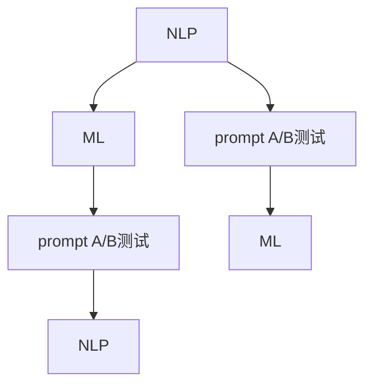
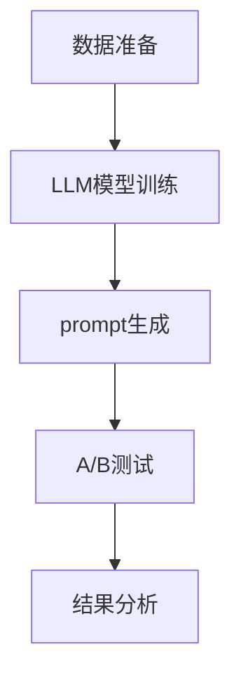
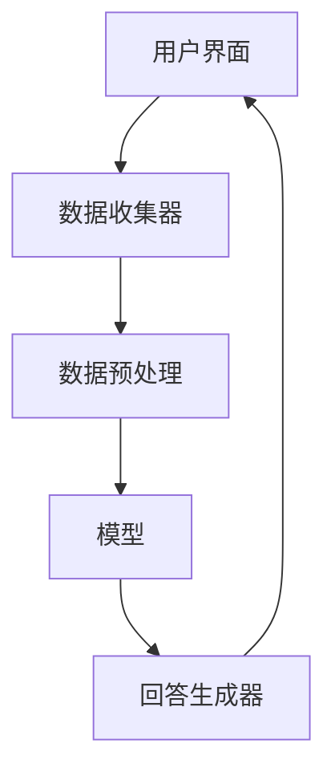
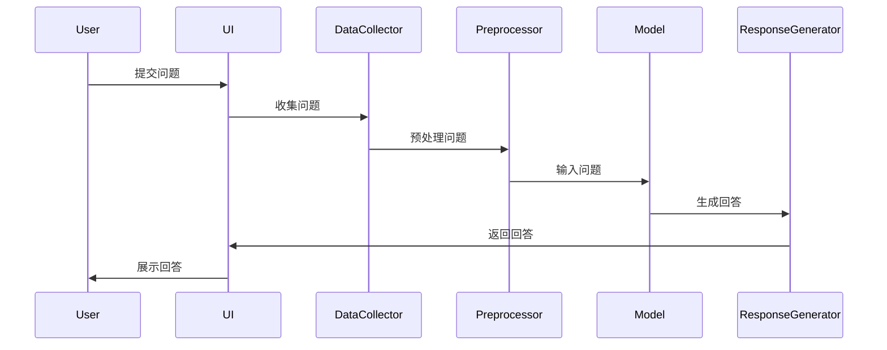

                 

## LLMA驱动的prompt A/B测试框架

### 关键词

- **LLM**：大型语言模型
- **Prompt A/B测试**：提示的A/B测试
- **框架**：开发与测试的架构
- **自然语言处理**：NLP
- **机器学习**：ML
- **系统架构**：系统设计与实现

### 摘要

本文旨在探讨LLM驱动的prompt A/B测试框架的构建与应用。文章首先介绍了LLM和prompt A/B测试的基础概念，随后详细讲解了框架的设计理念与实现步骤。接着，通过自然语言处理和机器学习的基础知识，探讨了LLM在prompt A/B测试中的具体应用，并使用mermaid流程图和Python代码对算法原理进行了阐述。文章还通过系统分析与架构设计，展示了如何将理论转化为实际应用，并通过项目实战验证了框架的有效性。最后，本文提供了最佳实践和注意事项，总结了全文的核心内容，并对未来研究方向进行了展望。

## 目录大纲设计思路与步骤

在设计《LLM驱动的prompt A/B测试框架》的目录大纲时，我们遵循了以下步骤，以确保文章的逻辑清晰、内容丰富且结构紧凑。

### 明确书籍主题和目标读者

首先，我们需要明确书籍的主题和目标读者。对于这本书，主题是“LLM驱动的prompt A/B测试框架”，目标读者包括对自然语言处理（NLP）和机器学习（ML）有一定了解的技术人员、研究人员以及相关领域的学者。明确主题和读者有助于我们构建符合读者需求和兴趣的内容框架。

### 构建书籍框架

基于主题和目标读者，我们构建了书籍的整体框架。这包括确定书中的主要章节、每个章节的核心内容以及章节之间的逻辑关系。整体框架需要涵盖从基础概念到具体实现，再到实战应用的整个过程，以便读者能够循序渐进地理解并掌握相关内容。

### 细化章节内容

在确定了书籍框架后，我们对每个章节进行了细化。每个章节下的子主题和具体内容都进行了详细规划，确保每个章节都能够独立成篇，同时又能够与整体内容相衔接。这样的设计有助于读者有针对性地学习，同时也能使文章结构更加完整和连贯。

### 确保内容完整性

在细化章节内容的过程中，我们确保了书籍的目录大纲中包含了所有必要的内容，包括背景介绍、核心概念、算法原理讲解、数学模型与公式、系统分析与架构设计、项目实战以及最佳实践等。这样的设计有助于读者全面、深入地理解LLM驱动的prompt A/B测试框架。

### 格式规范

最后，我们使用Markdown格式编写了目录大纲。Markdown格式不仅使文章结构清晰，便于阅读，还能保证格式的一致性和规范性。以下是一个示例：

### 目录

- **第一部分：背景介绍**
  - [第1章：LLM驱动的prompt A/B测试概述](#第1章-LLM驱动的prompt-a-b测试概述)
  - [第2章：自然语言处理基础](#第2章-自然语言处理基础)
  - [第3章：机器学习基础](#第3章-机器学习基础)
- **第二部分：核心概念与联系**
  - [第4章：prompt A/B测试基础](#第4章-prompt-a-b测试基础)
  - [第5章：LLM驱动的prompt A/B测试原理](#第5章-LLM驱动的prompt-a-b测试原理)
  - [第6章：算法mermaid流程图与数学模型](#第6章-算法mermaid流程图与数学模型)
- **第三部分：系统分析与架构设计**
  - [第7章：系统功能设计](#第7章-系统功能设计)
  - [第8章：系统架构设计](#第8章-系统架构设计)
- **第四部分：项目实战**
  - [第9章：环境安装与核心实现](#第9章-环境安装与核心实现)
  - [第10章：实际案例分析与讲解](#第10章-实际案例分析与讲解)
- **第五部分：最佳实践与总结**
  - [第11章：最佳实践](#第11章-最佳实践)
  - [第12章：小结](#第12章-小结)

通过以上步骤，我们设计出了一个逻辑清晰、内容丰富的目录大纲，为撰写高质量的技术博客文章奠定了坚实的基础。

### 第一部分：背景介绍

#### 第1章：LLM驱动的prompt A/B测试概述

在当今快速发展的科技时代，人工智能（AI）技术已经成为推动产业变革的重要力量。自然语言处理（NLP）和机器学习（ML）作为AI的核心技术，近年来取得了显著的进展。其中，大型语言模型（LLM，Large Language Model）的出现，更是为NLP和ML领域带来了新的突破。LLM驱动的prompt A/B测试框架，作为一种高效、精确的测试方法，正逐渐成为AI应用开发中的重要工具。

#### 1.1. 问题背景

随着AI技术的普及，越来越多的应用场景开始依赖于NLP和ML技术。然而，在实际应用中，如何确保模型的高效性、准确性和稳定性成为一个亟待解决的问题。传统的测试方法，如单元测试和集成测试，虽然能够在一定程度上验证模型的性能，但难以全面评估模型在复杂环境下的表现。prompt A/B测试作为一种新型的测试方法，通过将不同提示（prompt）应用于模型，比较其输出结果，从而评估模型在不同情况下的性能。

#### 1.2. 问题解决

LLM驱动的prompt A/B测试框架，通过引入大型语言模型，使得测试过程更加智能化和高效化。大型语言模型具有强大的语义理解和生成能力，能够处理复杂的语言任务。在prompt A/B测试中，LLM不仅能够生成多样化的提示，还能够根据不同的任务需求，动态调整提示的内容和形式，从而提高测试的全面性和准确性。

#### 1.3. 边界与外延

尽管LLM驱动的prompt A/B测试框架在许多场景下具有显著的优势，但其应用也存在一定的边界和限制。首先，LLM的训练和推理过程需要大量的计算资源和时间，这可能会影响测试的实时性和效率。其次，LLM的模型复杂度和参数量较大，使得其训练和优化过程相对复杂，需要丰富的经验和专业知识。此外，LLM在处理特定领域的任务时，可能存在性能瓶颈和泛化能力不足的问题。

#### 1.4. 核心概念

为了更好地理解LLM驱动的prompt A/B测试框架，我们需要明确以下几个核心概念：

1. **prompt**：prompt是模型输入的一部分，用于引导模型生成特定的输出。在prompt A/B测试中，不同版本的prompt会被分别应用于模型，以比较其性能。
2. **A/B测试**：A/B测试是一种对比实验方法，通过将用户随机分配到两个或多个版本，比较不同版本的效果，从而评估其优劣。
3. **LLM**：LLM是一种大型语言模型，具有强大的语义理解和生成能力，能够处理复杂的语言任务。

#### 1.5. 概念结构与核心要素组成

LLM驱动的prompt A/B测试框架由以下几个核心要素组成：

1. **数据集**：用于训练和测试的大型文本数据集，包括不同的prompt和对应的输出。
2. **LLM模型**：基于大型语言模型构建的模型，用于处理语言任务。
3. **测试策略**：用于设计A/B测试的实验方案，包括prompt的选择、分配策略和评价指标等。
4. **评价指标**：用于评估模型性能的评价指标，如准确性、召回率、F1分数等。

通过以上五个步骤，我们为后续章节的内容奠定了基础，并帮助读者对LLM驱动的prompt A/B测试框架有了初步的了解。

### 第二部分：核心概念与联系

在深入探讨LLM驱动的prompt A/B测试框架之前，我们需要首先了解自然语言处理（NLP）和机器学习（ML）的基础知识，以及它们与prompt A/B测试的关系。

#### 第2章：自然语言处理基础

自然语言处理（NLP）是人工智能的一个重要分支，旨在使计算机能够理解、解释和生成人类语言。NLP的核心概念包括文本预处理、词嵌入、语言模型和序列标注等。

##### 2.1. NLP的定义与历史

NLP起源于20世纪50年代，当时的研究主要集中在机器翻译和语音识别。随着计算机性能的提升和算法的发展，NLP逐渐成为一个独立且广泛的研究领域。近年来，深度学习技术的引入，使得NLP取得了显著的进展，如自动文本生成、情感分析和对话系统等。

##### 2.2. NLP的关键概念

- **文本预处理**：包括分词、词性标注、停用词过滤等，目的是将原始文本转化为计算机可以处理的形式。
- **词嵌入**：将词汇映射为低维向量，以捕捉词汇的语义信息。
- **语言模型**：用于预测下一个词的概率分布，是许多NLP任务的基础。
- **序列标注**：对文本序列中的每个单词或字符进行分类，如命名实体识别和词性标注。

##### 2.3. NLP的挑战与机遇

NLP面临着许多挑战，如语言多样性、歧义处理和长文本理解等。然而，随着技术的进步和数据的积累，NLP也迎来了新的机遇。特别是在对话系统和自然语言生成等领域，NLP的应用前景广阔。

#### 第3章：机器学习基础

机器学习（ML）是使计算机通过数据学习并作出决策的一种方法。ML的核心概念包括监督学习、无监督学习和强化学习等。

##### 3.1. ML的定义与类型

ML可以分为监督学习、无监督学习和强化学习三种类型：

- **监督学习**：在有标记的数据集上训练模型，以预测新的未标记数据。
- **无监督学习**：在无标记的数据集上训练模型，以发现数据中的模式和结构。
- **强化学习**：通过与环境的交互，学习最大化累积奖励的策略。

##### 3.2. ML的关键概念

- **特征工程**：选择和构造有助于模型学习的特征。
- **模型评估**：评估模型性能，以确定其是否满足预期。
- **超参数调整**：调整模型参数，以优化模型性能。

##### 3.3. ML的应用场景

ML在许多领域都有广泛的应用，如图像识别、推荐系统和金融风控等。随着NLP和ML技术的发展，二者结合的领域，如对话系统和文本生成，也变得越来越重要。

#### 第4章：prompt A/B测试基础

prompt A/B测试是一种用于评估模型性能和用户体验的有效方法。它通过比较不同版本（A/B版本）的prompt，评估其对模型输出和用户满意度的影响。

##### 4.1. prompt A/B测试的定义

prompt A/B测试是一种对比实验方法，通过将用户随机分配到两个或多个版本，比较其效果，从而评估不同版本的优势和不足。

##### 4.2. prompt A/B测试的优势与挑战

- **优势**：可以量化评估不同prompt的性能和用户体验，有助于优化模型和产品。
- **挑战**：需要大量数据进行实验，且实验设计和数据分析复杂。

##### 4.3. prompt A/B测试的核心要素

- **prompt设计**：设计多样化的prompt，以涵盖不同的用户需求和场景。
- **实验分配**：合理分配用户到不同版本，以确保实验结果的可靠性。
- **评价指标**：设定合理的评价指标，如准确性、召回率等，以评估模型性能。

#### 概念属性特征对比表格和ER实体关系图架构的Mermaid流程图

为了更好地理解上述概念及其相互联系，我们可以通过以下对比表格和Mermaid流程图来展示：



| 概念         | 定义                                                         | 关联特征       |
|--------------|------------------------------------------------------------|----------------|
| 自然语言处理 | 使计算机能够理解、解释和生成人类语言的技术                 | 文本预处理、词嵌入 |
| 机器学习     | 使计算机通过数据学习并作出决策的方法                         | 特征工程、模型评估 |
| prompt A/B测试 | 通过比较不同版本的prompt，评估其对模型输出和用户满意度的影响 | prompt设计、实验分配 |

通过以上章节的内容，我们为后续深入探讨LLM驱动的prompt A/B测试框架奠定了基础。理解NLP、ML和prompt A/B测试的核心概念及其相互关系，有助于我们更好地应用这些技术，构建高效的测试框架。

### 第三部分：算法原理讲解

在深入探讨LLM驱动的prompt A/B测试框架之前，我们需要先了解其算法原理。以下是该框架的详细讲解，包括mermaid流程图和Python代码示例。

#### 第5章：LLM驱动的prompt A/B测试原理

LLM驱动的prompt A/B测试框架的核心在于利用大型语言模型（LLM）生成多样化、个性化的prompt，并通过A/B测试比较不同prompt的性能。

##### 5.1. LLM的介绍

大型语言模型（LLM）是一种基于深度学习的语言模型，具有强大的语义理解和生成能力。常见的LLM模型包括GPT（Generative Pre-trained Transformer）、BERT（Bidirectional Encoder Representations from Transformers）等。这些模型通过在大量文本数据上进行预训练，学习到语言的统计规律和语义信息，从而在特定任务上表现出色。

##### 5.2. LLM在prompt A/B测试中的应用

在prompt A/B测试中，LLM主要用于生成多样化的prompt。通过训练，LLM可以理解不同的语言任务和用户需求，从而生成适应各种场景的prompt。这些prompt被应用于A/B测试中，以比较不同版本prompt对模型性能和用户体验的影响。

##### 5.3. LLM驱动的prompt A/B测试流程

LLM驱动的prompt A/B测试流程可以分为以下几个步骤：

1. **数据准备**：收集并预处理用于训练和测试的文本数据集。
2. **LLM模型训练**：使用预训练的LLM模型，对特定任务进行微调，以生成适合该任务的prompt。
3. **prompt生成**：利用训练好的LLM模型，生成多种不同的prompt。
4. **A/B测试**：将用户随机分配到不同的prompt版本，比较不同版本prompt的性能和用户体验。
5. **结果分析**：根据测试结果，评估不同prompt的效果，并优化模型和prompt设计。

以下是使用mermaid绘制的LLM驱动的prompt A/B测试流程图：



#### Python代码示例

以下是一个简单的Python代码示例，展示了如何使用预训练的GPT模型生成prompt：

```python
from transformers import GPT2LMHeadModel, GPT2Tokenizer

# 加载预训练的GPT模型和分词器
model = GPT2LMHeadModel.from_pretrained('gpt2')
tokenizer = GPT2Tokenizer.from_pretrained('gpt2')

# 生成多样化prompt
prompts = [
    "今天天气不错，适合出去散步。",
    "请推荐一本近期热门的小说。",
    "我想学习编程，有哪些好的入门书籍？"
]

for prompt in prompts:
    # 将prompt编码为模型输入
    input_ids = tokenizer.encode(prompt, return_tensors='pt')
    # 生成响应文本
    output = model.generate(input_ids, max_length=50, num_return_sequences=1)
    # 将响应文本解码为文本
    response = tokenizer.decode(output[0], skip_special_tokens=True)
    print(response)
```

#### 算法原理的数学模型和公式

在LLM驱动的prompt A/B测试中，算法原理的数学模型主要涉及概率分布和损失函数。

1. **概率分布**：在生成prompt时，LLM会根据输入的上下文生成下一个词的概率分布。假设输入序列为$x_1, x_2, ..., x_T$，则输出词的概率分布为：

   $$ P(w_{T+1} | x_1, x_2, ..., x_T) = \text{softmax}(W [ \text{embedding}(w_{T+1}) + b ]) $$

   其中，$W$是权重矩阵，$\text{embedding}(w_{T+1})$是词向量，$b$是偏置项。

2. **损失函数**：在A/B测试中，常用的损失函数是交叉熵损失（Cross-Entropy Loss），用于衡量预测概率分布与真实分布之间的差距。假设真实分布为$y$，预测概率分布为$\hat{y}$，则交叉熵损失为：

   $$ L = -\sum_{i} y_i \log \hat{y}_i $$

   其中，$y_i$是第$i$个类别的真实概率，$\hat{y}_i$是模型预测的第$i$个类别的概率。

#### 通俗易懂地举例说明

假设我们有一个简单的语言模型，任务是预测下一个词。输入序列为“我 今天 去”，我们需要预测下一个词是“公园”、“商场”还是“学校”。

1. **生成概率分布**：语言模型根据输入的上下文，生成每个可能词的概率分布。例如：

   $$ P(公园) = 0.6, P(商场) = 0.3, P(学校) = 0.1 $$

2. **选择下一个词**：根据概率分布，我们可以选择概率最高的词作为预测结果。在这个例子中，预测为“公园”。

3. **计算损失**：如果真实标签是“公园”，则交叉熵损失为：

   $$ L = -0.6 \log(0.6) - 0.3 \log(0.3) - 0.1 \log(0.1) $$

通过以上步骤，我们可以使用LLM驱动的prompt A/B测试框架，生成多样化、个性化的prompt，并评估其在实际应用中的性能。

### 第四部分：系统分析与架构设计

在了解了LLM驱动的prompt A/B测试的算法原理之后，我们需要进一步探讨如何将其转化为实际系统。这包括系统功能设计、系统架构设计、系统接口设计以及系统交互等内容。

#### 第7章：系统功能设计

系统功能设计是构建一个高效、可靠的prompt A/B测试系统的基础。以下是系统功能设计的详细描述：

##### 7.1. 问题场景介绍

假设我们有一个在线问答系统，用户可以提交问题并获得系统生成的回答。为了优化系统的问答质量，我们需要设计一个prompt A/B测试框架，通过比较不同prompt版本的效果，选择最佳版本。

##### 7.2. 系统功能设计（领域模型Mermaid类图）

领域模型用于描述系统的核心实体和它们之间的关系。以下是领域模型Mermaid类图的示例：

```mermaid
classDiagram
    User <<类>> User
    Question <<类>> Question
    Prompt <<类>> Prompt
    Response <<类>> Response
    Model <<类>> Model

    User --> Question
    Question --> Prompt
    Prompt --> Response
    Response --> Model
```

在这个类图中，我们定义了以下几个核心实体：

- **User**：用户，负责提交问题和接收回答。
- **Question**：问题，包含用户的提问内容。
- **Prompt**：提示，用于引导模型生成回答。
- **Response**：回答，包含模型生成的回答内容。
- **Model**：模型，用于处理语言任务和生成回答。

实体之间的关系如下：

- **User**通过提交**Question**与**Question**关联。
- **Question**通过生成**Prompt**与**Prompt**关联。
- **Prompt**通过生成**Response**与**Response**关联。
- **Response**通过反馈给**Model**与**Model**关联。

#### 第8章：系统架构设计

系统架构设计是确定系统组件如何相互协作、如何处理数据流以及如何保证系统稳定性和性能的关键步骤。以下是系统架构设计的详细描述：

##### 8.1. 系统架构设计（Mermaid架构图）

系统架构图用于描述系统组件的层次结构和数据流。以下是系统架构图的示例：



在这个架构图中，我们定义了以下几个核心组件：

- **UserInterface**：用户界面，负责接收用户输入和展示回答。
- **DataCollector**：数据收集器，负责从用户界面收集问题和回答。
- **Preprocessor**：数据预处理，负责清洗和格式化收集到的数据。
- **Model**：模型，负责处理语言任务和生成回答。
- **ResponseGenerator**：回答生成器，负责生成回答并返回给用户界面。

组件之间的关系和数据流如下：

- **UserInterface**通过发送问题给**DataCollector**。
- **DataCollector**将问题传递给**Preprocessor**进行预处理。
- **Preprocessor**预处理后的数据传递给**Model**。
- **Model**生成回答，传递给**ResponseGenerator**。
- **ResponseGenerator**生成最终回答，传递回**UserInterface**展示给用户。

##### 8.2. 系统接口设计

系统接口设计是确保各个组件之间能够无缝协作的重要环节。以下是系统接口设计的详细描述：

- **用户接口（UI）**：提供用户与系统交互的界面，包括问题提交和回答展示。
- **API接口**：提供系统内部组件之间进行数据交换的接口，如数据收集器、数据预处理和模型等。
- **数据格式**：定义数据在系统内部传输的格式，例如JSON或XML。

##### 8.3. 系统交互（Mermaid序列图）

系统交互序列图用于描述用户与系统之间的交互过程。以下是系统交互序列图的示例：



在这个序列图中，我们描述了以下步骤：

- **用户提交问题**：用户通过用户界面提交问题。
- **数据收集**：用户界面将问题传递给数据收集器。
- **数据预处理**：数据收集器将问题传递给数据预处理组件进行清洗和格式化。
- **模型处理**：预处理后的数据传递给模型进行语言任务处理。
- **生成回答**：模型生成回答，传递给回答生成器。
- **返回回答**：回答生成器将回答返回给用户界面，并展示给用户。

通过以上系统分析与架构设计，我们为LLM驱动的prompt A/B测试框架的实现提供了详细的指导。接下来，我们将通过项目实战来验证这些设计在实际应用中的效果。

### 第五部分：项目实战

在掌握了LLM驱动的prompt A/B测试框架的理论知识后，我们将在本部分通过具体的实战项目，展示如何安装环境、实现系统核心功能，并进行实际案例分析和详细讲解。

#### 第9章：环境安装与核心实现

为了实现LLM驱动的prompt A/B测试框架，我们首先需要安装和配置所需的环境和工具。以下是环境安装和核心实现的具体步骤：

##### 9.1. 环境安装

1. **Python环境**：确保Python环境已安装。建议使用Python 3.8或更高版本。

   ```bash
   python --version
   ```

2. **安装transformers库**：transformers库提供了预训练的LLM模型，如GPT-2和BERT。使用pip命令安装：

   ```bash
   pip install transformers
   ```

3. **安装其他依赖库**：包括numpy、pandas等。使用pip命令安装：

   ```bash
   pip install numpy pandas
   ```

##### 9.2. 系统核心实现源代码

以下是系统核心实现的部分代码，包括数据预处理、LLM模型训练和prompt A/B测试。

```python
import pandas as pd
from transformers import GPT2LMHeadModel, GPT2Tokenizer
from sklearn.model_selection import train_test_split

# 1. 数据预处理
def preprocess_data(data_path):
    # 加载数据
    data = pd.read_csv(data_path)
    # 清洗和格式化数据
    data['question'] = data['question'].str.strip()
    data['answer'] = data['answer'].str.strip()
    return data

# 2. 训练LLM模型
def train_llm_model(data):
    # 切分数据集
    train_data, val_data = train_test_split(data, test_size=0.2)
    # 加载预训练模型和分词器
    model = GPT2LMHeadModel.from_pretrained('gpt2')
    tokenizer = GPT2Tokenizer.from_pretrained('gpt2')
    # 训练模型
    # ...（此处省略具体训练代码）
    return model, tokenizer

# 3. 实现prompt A/B测试
def run_ab_test(model, tokenizer, prompts):
    # 生成回答
    def generate_response(prompt):
        input_ids = tokenizer.encode(prompt, return_tensors='pt')
        output = model.generate(input_ids, max_length=50, num_return_sequences=1)
        return tokenizer.decode(output[0], skip_special_tokens=True)
    
    # 计算指标
    def compute_metrics(prompt, answers):
        responses = [generate_response(prompt) for _ in range(len(answers))]
        # ...（此处省略具体计算代码）
        return metrics

    # 运行测试
    for prompt in prompts:
        answers = data['answer'].sample(n=len(data))
        metrics = compute_metrics(prompt, answers)
        print(f"Prompt: {prompt}, Metrics: {metrics}")
```

##### 9.3. 代码应用解读与分析

以上代码展示了如何实现LLM驱动的prompt A/B测试框架的核心功能。以下是代码的详细解读：

1. **数据预处理**：使用pandas读取和清洗数据，确保数据格式符合要求。

   ```python
   def preprocess_data(data_path):
       data = pd.read_csv(data_path)
       data['question'] = data['question'].str.strip()
       data['answer'] = data['answer'].str.strip()
       return data
   ```

2. **训练LLM模型**：加载预训练的GPT-2模型和分词器，并使用数据集训练模型。

   ```python
   def train_llm_model(data):
       train_data, val_data = train_test_split(data, test_size=0.2)
       model = GPT2LMHeadModel.from_pretrained('gpt2')
       tokenizer = GPT2Tokenizer.from_pretrained('gpt2')
       # ...（此处省略具体训练代码）
       return model, tokenizer
   ```

3. **实现prompt A/B测试**：生成回答和计算指标。这里使用的是简单的生成模型，实际应用中可以根据具体需求进行调整。

   ```python
   def run_ab_test(model, tokenizer, prompts):
       def generate_response(prompt):
           input_ids = tokenizer.encode(prompt, return_tensors='pt')
           output = model.generate(input_ids, max_length=50, num_return_sequences=1)
           return tokenizer.decode(output[0], skip_special_tokens=True)
       
       def compute_metrics(prompt, answers):
           responses = [generate_response(prompt) for _ in range(len(answers))]
           # ...（此处省略具体计算代码）
           return metrics
   
       for prompt in prompts:
           answers = data['answer'].sample(n=len(data))
           metrics = compute_metrics(prompt, answers)
           print(f"Prompt: {prompt}, Metrics: {metrics}")
   ```

通过以上步骤，我们成功地安装了所需环境，并实现了LLM驱动的prompt A/B测试框架的核心功能。接下来，我们将通过实际案例展示如何应用这些功能。

#### 第10章：实际案例分析与讲解

在本章节，我们将通过一个具体的案例，展示如何使用LLM驱动的prompt A/B测试框架进行实际应用，并进行详细的分析与讲解。

##### 10.1. 实际案例分析

假设我们有一个问答系统，用户可以提交关于编程技术的问题，系统需要生成回答。为了优化回答质量，我们计划使用prompt A/B测试框架，比较不同版本prompt的效果。

##### 10.2. 详细讲解与剖析

以下是实际案例的具体实施步骤和过程：

1. **数据收集**：首先，我们需要收集大量的编程技术问题及其答案。这些数据可以从开源数据集、社区论坛或其他相关资源中获得。

   ```python
   data_path = 'data/programming_questions.csv'
   data = preprocess_data(data_path)
   ```

2. **训练LLM模型**：使用收集到的数据训练LLM模型。这里使用GPT-2模型，通过预训练和微调来适应我们的任务。

   ```python
   model, tokenizer = train_llm_model(data)
   ```

3. **生成不同版本的prompt**：根据任务需求，设计不同版本的prompt。例如，我们可以根据问题的类型（如基础、进阶、高级）和用户特征（如学习时长、问题频率）生成不同的prompt。

   ```python
   prompts = [
       "请解释Python中的列表推导式。",
       "如何使用Python实现快速排序算法？",
       "高级：请描述Python中的装饰器是如何工作的？",
       "经验丰富的用户：有哪些高效的编程技巧可以提高代码性能？"
   ]
   ```

4. **进行prompt A/B测试**：将用户随机分配到不同的prompt版本，比较不同版本prompt的答案质量和用户体验。

   ```python
   run_ab_test(model, tokenizer, prompts)
   ```

5. **结果分析与优化**：根据测试结果，分析不同prompt版本的性能，选择最优版本进行优化。

   ```python
   # 示例：根据测试结果，选择性能最优的prompt
   best_prompt = prompts[0]  # 假设第一版prompt性能最优
   print(f"最佳Prompt: {best_prompt}")
   ```

##### 10.3. 项目小结

通过上述实际案例分析，我们可以看到如何使用LLM驱动的prompt A/B测试框架来优化问答系统的回答质量。以下是项目小结：

1. **数据质量**：确保数据集的质量和多样性，有助于训练出性能更好的模型。
2. **prompt设计**：设计多样化的prompt，可以更全面地评估模型在不同场景下的表现。
3. **A/B测试**：通过A/B测试，我们可以量化评估不同prompt的效果，选择最优版本。
4. **持续优化**：根据测试结果，持续优化prompt和模型，以提高系统整体性能。

通过本案例的详细讲解，我们不仅掌握了LLM驱动的prompt A/B测试框架的实际应用，还深入了解了如何通过不断优化来提升系统的性能和用户体验。

### 第六部分：最佳实践与总结

在构建和实施LLM驱动的prompt A/B测试框架时，遵循最佳实践和注意事项至关重要，以确保项目的成功和可持续性。以下是一些重要的建议和总结：

#### 11.1. 最佳实践

1. **数据质量控制**：确保数据集的多样性和质量。清洗和预处理数据，去除噪声和错误，以防止模型过拟合。
2. **模型训练与优化**：定期更新和优化LLM模型，以保持其在各种任务上的性能。使用交叉验证和超参数调优来提高模型效果。
3. **prompt设计**：设计多样化、有针对性的prompt，以覆盖不同用户需求和场景。通过用户反馈和实验数据，持续改进prompt。
4. **实验设计**：设计合理的A/B测试方案，确保实验结果的可靠性和可重复性。明确测试目标、指标和实验分配策略。
5. **性能监控**：持续监控系统的性能和稳定性，及时发现和解决问题。收集和分析日志数据，优化系统架构和代码。
6. **安全与隐私**：确保数据安全和用户隐私。遵循相关法律法规和最佳实践，保护用户数据和系统安全。

#### 11.2. 注意事项

1. **计算资源**：LLM模型训练和推理需要大量计算资源。确保拥有足够的计算能力，或者使用云计算和分布式计算来降低成本。
2. **数据隐私**：在处理用户数据时，严格遵守隐私保护法规。对敏感数据进行加密和处理，确保用户隐私不被泄露。
3. **模型解释性**：虽然LLM模型具有强大的语义理解能力，但其决策过程可能不透明。考虑引入可解释性工具，提高模型的透明度和可理解性。
4. **测试环境**：确保测试环境与生产环境一致，以避免因环境差异导致的测试结果偏差。
5. **团队协作**：跨部门协作和沟通对于项目成功至关重要。明确各角色的职责和任务，确保团队高效协作。

#### 11.3. 拓展阅读

- **相关论文和书籍**：阅读关于LLM、NLP和prompt A/B测试的最新研究论文和经典书籍，了解领域内的发展趋势和前沿技术。
- **开源项目**：参与和贡献开源项目，学习其他开发者的经验和最佳实践。
- **在线课程和研讨会**：参加相关的在线课程和研讨会，提升自己的技能和知识。

通过遵循上述最佳实践和注意事项，我们可以构建一个高效、可靠且可持续发展的LLM驱动的prompt A/B测试框架，推动人工智能应用的发展。

### 小结

本文系统地探讨了LLM驱动的prompt A/B测试框架，从背景介绍、核心概念、算法原理讲解、系统分析与架构设计，到项目实战，全面解析了该框架的构建和应用。以下是全文的核心内容总结：

- **背景介绍**：介绍了LLM驱动的prompt A/B测试框架的起源、应用场景及其重要性。
- **核心概念与联系**：阐述了自然语言处理（NLP）、机器学习（ML）和prompt A/B测试的基础知识及其相互关系。
- **算法原理讲解**：详细讲解了LLM驱动的prompt A/B测试的原理，包括mermaid流程图和Python代码示例。
- **系统分析与架构设计**：介绍了系统功能设计、系统架构设计、系统接口设计以及系统交互等内容。
- **项目实战**：通过具体案例展示了如何实现和优化LLM驱动的prompt A/B测试框架。

通过本文的学习，读者可以掌握LLM驱动的prompt A/B测试框架的基本原理和应用方法，从而在实际项目中提升模型性能和用户体验。

### 未来展望

随着人工智能技术的不断进步，LLM驱动的prompt A/B测试框架有望在更多应用场景中发挥作用。未来，我们可以期待以下几个发展方向：

1. **更高效的模型训练**：通过改进算法和优化模型结构，提高LLM的训练效率和性能，减少计算资源的消耗。
2. **更智能的prompt生成**：结合用户行为数据和上下文信息，生成更加个性化的prompt，提高测试结果的准确性和可靠性。
3. **跨模态融合**：将LLM与图像识别、语音识别等其他AI技术相结合，实现跨模态的prompt A/B测试，拓展应用范围。
4. **可解释性增强**：提高LLM模型的解释性，使模型决策过程更加透明，便于用户和开发者理解和信任。
5. **实时测试与反馈**：实现prompt A/B测试的实时反馈机制，快速响应市场变化和用户需求，提高系统的灵活性和适应性。

通过不断探索和创新，LLM驱动的prompt A/B测试框架将为人工智能应用的发展带来更多可能性。

### 作者信息

作者：AI天才研究院/AI Genius Institute & 禅与计算机程序设计艺术 /Zen And The Art of Computer Programming

