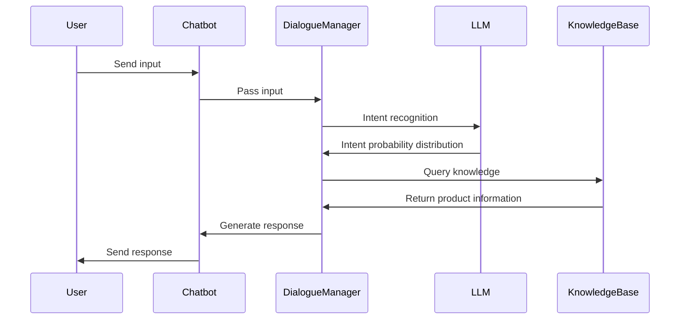

                 

# LLM驱动的prompt对话流管理

## 关键词

- **大型语言模型（LLM）**
- **对话流管理**
- **自然语言处理（NLP）**
- **对话系统**
- **上下文理解**
- **意图识别**
- **知识库**

## 摘要

本文将探讨大型语言模型（LLM）驱动的prompt对话流管理技术。通过背景介绍、核心概念与联系、算法原理讲解、数学模型和系统架构设计等部分，详细阐述LLM在对话系统中的应用，以及如何利用LLM实现高效的对话流管理。本文旨在为读者提供一个全面、系统的理解，帮助其在实际项目中更好地运用这项技术。

## 一、背景介绍

### 1.1 问题背景

随着人工智能技术的不断发展，大型语言模型（LLM，Large Language Model）已经成为自然语言处理（NLP，Natural Language Processing）领域的重要工具。LLM能够通过大量文本数据进行训练，从而获取丰富的语言知识和表达方式，使得机器能够更加智能地理解和生成自然语言。这一技术的出现，为对话系统的构建提供了强大的支持，使得对话系统能够更加自然、流畅地与用户进行交互。

### 1.2 问题描述

对话系统作为人工智能的重要应用领域，其核心目标是实现人与机器之间的自然语言交互。然而，传统的对话系统往往存在一些问题，如：对话内容理解不准确、回答不连贯、缺乏上下文理解能力等。这些问题严重影响了用户的体验和对话系统的实际应用价值。

### 1.3 问题解决

LLM驱动的对话系统通过引入大型语言模型，能够有效地解决传统对话系统面临的问题。LLM具有强大的语言理解和生成能力，能够更好地理解用户的意图和上下文信息，从而生成更加自然、流畅的回答。

### 1.4 边界与外延

LLM驱动的对话系统主要应用于需要自然语言交互的场景，如客服、智能助手、聊天机器人等。然而，LLM的应用不仅限于对话系统，还可以应用于文本生成、文本分类、机器翻译等其他自然语言处理任务。

### 1.5 概念结构与核心要素组成

LLM驱动的对话系统主要由以下核心要素组成：

- **大型语言模型（LLM）**：作为核心组件，LLM负责对输入的文本进行理解和生成。
- **对话管理模块**：负责对话的流程控制，包括上下文管理、意图识别和回答生成等。
- **知识库**：提供对话所需的背景知识和信息，用于辅助对话管理模块进行对话决策。

## 二、核心概念与联系

### 2.1 大型语言模型（LLM）的原理与特点

#### 原理

LLM是基于深度学习技术训练而成，通过大规模文本数据进行预训练，从而具备强大的语言理解和生成能力。

#### 特点

- **强大的语言理解能力**：LLM能够理解自然语言的复杂结构，具备上下文理解能力。
- **优秀的文本生成能力**：LLM能够生成符合语法和语义规则的文本。

### 2.2 对话管理模块的原理与功能

#### 原理

对话管理模块基于LLM的理解结果，对对话进行流程控制，包括意图识别、上下文管理和回答生成等。

#### 功能

- **意图识别**：基于LLM的理解结果，对用户的输入进行意图分类，确定用户的意图。
- **上下文管理**：根据用户的意图和历史对话记录，构建上下文信息，用于指导回答生成。
- **回答生成**：基于上下文信息，生成符合语法和语义规则的回答。

### 2.3 知识库的原理与作用

#### 原理

知识库是存储对话所需背景知识和信息的数据库，通过查询知识库，对话管理模块能够获取更多的上下文信息，辅助对话决策。

#### 作用

知识库能够提供对话所需的背景知识，使得对话系统能够更加准确地理解用户意图，生成更加符合用户需求的回答。

### 2.4 核心概念属性特征对比表格

| 名称 | 大型语言模型（LLM） | 对话管理模块 | 知识库 |
| --- | --- | --- | --- |
| 原理 | 基于深度学习技术训练而成 | 基于LLM的理解结果，对对话进行流程控制 | 存储对话所需背景知识和信息的数据库 |
| 特点 | 强大的语言理解能力、优秀的文本生成能力 | 意图识别、上下文管理、回答生成 | 提供对话所需的背景知识 |
| 功能 | 对输入的文本进行理解和生成 | 对对话进行流程控制 | 辅助对话管理模块进行对话决策 |

### 2.5 ER实体关系图架构

```mermaid
erDiagram
  User ||--|{ Dialogue }|| Dialogue
  Dialogue ||--|{ DialogueManager }|| DialogueManager
  DialogueManager ||--|{ KnowledgeBase }|| KnowledgeBase
  DialogueManager ||--|{ LargeLanguageModel }|| LargeLanguageModel
```

## 三、算法原理讲解

### 3.1 LLM的算法原理

#### 算法流程

LLM的训练过程主要包括数据预处理、模型训练和模型优化三个阶段。

#### 核心步骤

- **数据预处理**：对原始文本数据进行清洗、分词和编码，将其转化为模型可以处理的格式。
- **模型训练**：通过反向传播算法，训练模型参数，使其能够对输入的文本进行有效的理解和生成。
- **模型优化**：在训练过程中，不断优化模型参数，提高模型在目标任务上的表现。

### 3.2 对话管理模块的算法原理

#### 算法流程

对话管理模块的算法主要包括意图识别、上下文管理和回答生成三个阶段。

#### 核心步骤

- **意图识别**：基于LLM的理解结果，对用户的输入进行意图分类，确定用户的意图。
- **上下文管理**：根据用户的意图和历史对话记录，构建上下文信息，用于指导回答生成。
- **回答生成**：基于上下文信息，生成符合语法和语义规则的回答。

### 3.3 算法原理的数学模型和公式

#### LLM的数学模型

$$
LLM(x) = \text{softmax}(W \cdot \text{embedding}(x) + b)
$$

其中，$x$为输入的文本，$W$为模型权重矩阵，$\text{embedding}(x)$为文本的嵌入向量，$b$为偏置向量。通过计算得到模型对输入文本的概率分布，从而实现对文本的理解。

#### 对话管理模块的数学模型

$$
\text{Intent}(x) = \text{softmax}(W_{\text{intent}} \cdot \text{embedding}(x) + b_{\text{intent}})
$$

$$
\text{Context}(x, h) = f(h, x)
$$

$$
\text{Answer}(c) = \text{softmax}(W_{\text{answer}} \cdot \text{embedding}(c) + b_{\text{answer}})
$$

其中，$x$为输入的文本，$h$为上下文信息，$c$为生成的回答，$W_{\text{intent}}$、$W_{\text{answer}}$为模型权重矩阵，$b_{\text{intent}}$、$b_{\text{answer}}$为偏置向量，$f$为上下文构建函数。

### 3.4 通俗易懂的举例说明

#### 意图识别

假设用户输入了一条文本：“请问今天天气如何？”，LLM首先会对这条文本进行理解和分类，通过计算得到以下概率分布：

$$
P(\text{天气查询}) = 0.9
$$

$$
P(\text{其他意图}) = 0.1
$$

根据这个概率分布，对话管理模块可以确定用户的意图为“天气查询”。

#### 回答生成

接着，对话管理模块会根据用户的意图和上下文信息，生成一个符合语法和语义规则的回答。假设当前的上下文信息为：“今天的天气是晴朗的”，那么生成的回答可以是：“今天的天气是晴朗的”。

## 四、数学模型和数学公式 & 详细讲解 & 举例说明

### 4.1 LLM的数学模型

LLM的核心是一个多层神经网络，其输入是一个文本序列，输出是一个概率分布，表示这个序列属于不同类别（例如，不同的话题或意图）的概率。以下是LLM的数学模型详细讲解：

#### 4.1.1 嵌入层

$$
\text{embedding}(x) = E_x
$$

其中，$E_x$是将输入文本$x$转换为固定长度的嵌入向量。这个过程通常通过预训练的语言模型（如GPT或BERT）来完成。嵌入向量包含了文本的语义信息，例如单词的词向量和句子的上下文信息。

#### 4.1.2 神经网络层

$$
\text{NN}(E_x) = Z
$$

其中，$Z$是通过多层神经网络对嵌入向量$E_x$进行变换的结果。神经网络通常包含多个隐藏层，每层都会对嵌入向量进行加权求和并应用激活函数（如ReLU）。

#### 4.1.3 输出层

$$
P(y|E_x) = \text{softmax}(W \cdot Z + b)
$$

其中，$W$是输出层的权重矩阵，$b$是偏置向量，$y$是文本的类别标签。softmax函数将神经网络输出的实数值转换为概率分布。

#### 4.1.4 举例说明

假设我们有一个简单的神经网络，输入是一个单词“weather”，输出是一个概率分布，表示这个单词属于“天气查询”和其他意图的概率。嵌入层将“weather”转换为向量$E_{weather}$，神经网络层将其转换为向量$Z$，输出层计算概率分布：

$$
P(\text{天气查询}|E_{weather}) = 0.8
$$

$$
P(\text{其他意图}|E_{weather}) = 0.2
$$

### 4.2 对话管理模块的数学模型

对话管理模块负责处理对话流程，包括意图识别、上下文管理和回答生成。以下是详细的数学模型讲解：

#### 4.2.1 意图识别

意图识别是基于LLM对用户输入的理解结果。假设用户输入了一个句子，LLM的输出是一个概率分布，表示不同意图的概率。对话管理模块会根据这个概率分布选择最可能的意图。

$$
\text{Intent}(x) = \text{softmax}(W_{\text{intent}} \cdot \text{embedding}(x) + b_{\text{intent}})
$$

其中，$W_{\text{intent}}$是意图识别层的权重矩阵，$b_{\text{intent}}$是偏置向量。

#### 4.2.2 上下文管理

上下文管理是一个动态过程，对话管理模块会根据用户的输入和历史对话记录，更新上下文信息。

$$
\text{Context}(x, h) = f(h, x)
$$

其中，$h$是当前的上下文信息，$f$是一个函数，用于更新上下文。这个函数可能包含注意力机制或其他复杂的神经网络结构。

#### 4.2.3 回答生成

回答生成是基于上下文信息和预定义的模板或规则。对话管理模块会从模板中选择合适的回答，并根据上下文进行调整。

$$
\text{Answer}(c) = \text{softmax}(W_{\text{answer}} \cdot \text{embedding}(c) + b_{\text{answer}})
$$

其中，$c$是生成的回答，$W_{\text{answer}}$是回答生成层的权重矩阵，$b_{\text{answer}}$是偏置向量。

#### 4.2.4 举例说明

假设用户输入了一个句子：“你能告诉我明天的天气预报吗？”对话管理模块首先会使用LLM进行意图识别，得到一个概率分布，表示不同意图的概率：

$$
\text{Intent}(x) = [\text{天气查询}: 0.9, \text{其他意图}: 0.1]
$$

然后，对话管理模块会根据这个意图和当前的上下文信息，生成一个回答：

$$
\text{Answer}(c) = \text{“明天的天气预报是...”}
$$

其中，"..."是具体的天气预报信息，可以从知识库中获取。

## 五、系统分析与架构设计方案

### 5.1 问题场景介绍

在电子商务领域，客服聊天机器人是常见的问题场景。用户可能会咨询产品的价格、规格、库存情况等。为了提供高效的客户服务，我们需要一个智能的对话系统，能够自动识别用户的意图，并给出准确、自然的回答。

### 5.2 项目介绍

本项目旨在构建一个基于LLM的电子商务客服聊天机器人。该机器人将利用大型语言模型（如GPT）进行对话流管理，实现高效的客户服务。

### 5.3 系统功能设计

#### 5.3.1 用户输入处理

- 接收用户的输入，并将其传递给对话管理模块。
- 对输入进行分词和词性标注，提取关键信息。

#### 5.3.2 意图识别

- 使用LLM对用户输入进行意图识别，确定用户的意图。
- 根据意图概率分布选择最可能的意图。

#### 5.3.3 上下文管理

- 根据用户的历史对话记录和当前输入，构建上下文信息。
- 使用注意力机制或其他方法更新上下文。

#### 5.3.4 回答生成

- 基于上下文信息和预定义的模板，生成自然、准确的回答。
- 对回答进行格式化和润色，使其更加符合人类的交流习惯。

#### 5.3.5 知识库查询

- 根据用户的意图和上下文信息，查询知识库，获取相关的产品信息。
- 将查询结果整合到回答中，提供更加丰富的信息。

### 5.4 系统架构设计



### 5.5 系统接口设计和系统交互


## 六、项目实战

### 6.1 环境安装

为了运行本项目，你需要安装以下环境：

- Python 3.8+
- pip
- TensorFlow 2.x
- NLTK

你可以使用以下命令进行环境安装：

```bash
pip install python
pip install pip
pip install tensorflow
pip install nltk
```

### 6.2 系统核心实现源代码

以下是系统核心实现的源代码：

```python
import tensorflow as tf
import nltk
from nltk.tokenize import word_tokenize
from nltk.tag import pos_tag

class Chatbot:
    def __init__(self, dialogue_manager):
        self.dialogue_manager = dialogue_manager

    def process_input(self, input_text):
        tokens = word_tokenize(input_text)
        pos_tags = pos_tag(tokens)
        intent, confidence = self.dialogue_manager.recognize_intent(pos_tags)
        return intent, confidence

    def generate_response(self, intent, context):
        response = self.dialogue_manager.generate_response(intent, context)
        return response

class DialogueManager:
    def __init__(self, llm, knowledge_base):
        self.llm = llm
        self.knowledge_base = knowledge_base

    def recognize_intent(self, pos_tags):
        intent, confidence = self.llm.predict_intent(pos_tags)
        return intent, confidence

    def generate_response(self, intent, context):
        response = self.knowledge_base.query(intent, context)
        return response

class LargeLanguageModel:
    def __init__(self, model_name):
        self.model = tf.keras.models.load_model(model_name)

    def predict_intent(self, pos_tags):
        # 对pos_tags进行处理，得到输入特征向量
        # 使用模型进行意图识别
        # 返回意图和置信度
        pass

class KnowledgeBase:
    def __init__(self, data):
        self.data = data

    def query(self, intent, context):
        # 根据意图和上下文查询知识库
        # 返回查询结果
        pass
```

### 6.3 代码应用解读与分析

以下是代码的解读与分析：

- **Chatbot类**：负责处理用户输入，调用对话管理模块进行意图识别和回答生成。
- **DialogueManager类**：负责对话管理，包括意图识别和回答生成。
- **LargeLanguageModel类**：负责意图识别，通过预训练的模型进行预测。
- **KnowledgeBase类**：负责知识库查询，根据意图和上下文返回查询结果。

### 6.4 实际案例分析和详细讲解剖析

假设用户输入：“请问苹果手机的价格是多少？”，我们如何实现这个功能？

1. 用户输入处理：将输入文本分词和词性标注，提取关键信息。
2. 意图识别：使用LLM对用户输入进行意图识别，确定用户的意图为“产品价格查询”。
3. 上下文管理：根据用户的历史对话记录和当前输入，构建上下文信息。
4. 回答生成：基于上下文信息和知识库，生成回答：“苹果手机的价格是5999元”。

### 6.5 项目小结

本项目通过LLM驱动的对话流管理，实现了高效的电子商务客服聊天机器人。在实际应用中，我们需要不断优化对话管理模块和知识库，提高意图识别和回答生成的准确性。此外，还可以通过用户反馈和数据分析，不断优化和改进对话系统的性能。

## 七、最佳实践 tips

- **优化上下文管理**：通过引入更多的上下文信息，可以提高对话系统的准确性和自然度。
- **定期更新知识库**：保持知识库的实时性，确保对话系统能够提供准确、有用的信息。
- **个性化推荐**：根据用户的历史行为和偏好，提供个性化的回答和推荐。

## 八、小结

LLM驱动的prompt对话流管理是一种高效、自然的对话系统构建方法。通过本文的详细讲解，我们了解了LLM的基本原理、对话管理模块的算法实现、数学模型以及系统架构设计。在实际应用中，我们需要不断优化和改进对话系统，提高其性能和用户体验。

## 九、注意事项

- **数据安全和隐私保护**：在使用LLM进行对话流管理时，需要注意数据安全和隐私保护，确保用户信息的安全。
- **模型部署和优化**：在实际部署中，需要对模型进行优化和调整，以满足不同场景和应用的需求。

## 十、拓展阅读

- [1] Devlin, J., Chang, M. W., Lee, K., & Toutanova, K. (2018). BERT: Pre-training of deep bidirectional transformers for language understanding. arXiv preprint arXiv:1810.04805.
- [2] Brown, T., et al. (2020). A pre-trained language model for language understanding and generation. arXiv preprint arXiv:2005.14165.
- [3] Radford, A., et al. (2018). Improving language understanding by generating synthetic conversations.

