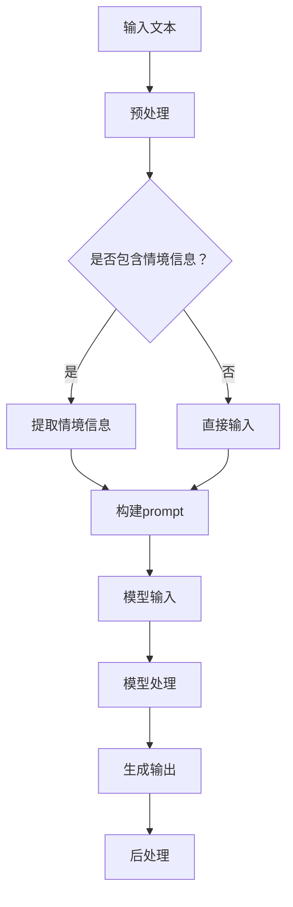
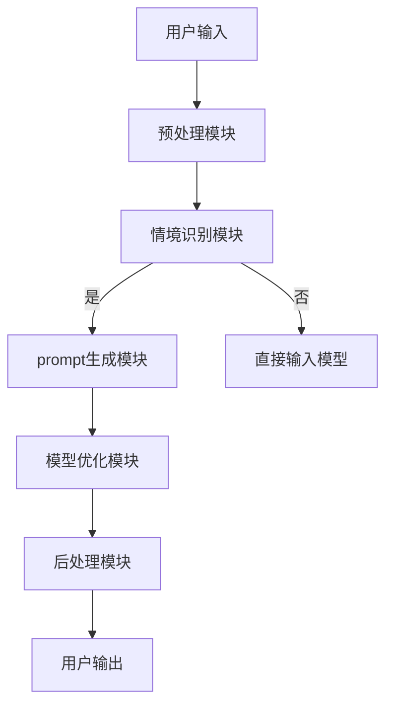
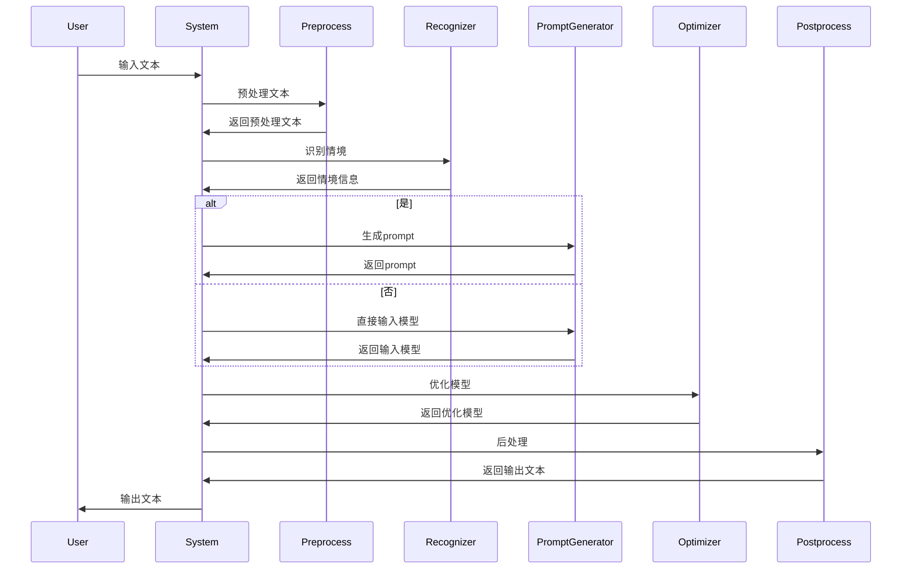

                 

### 文章标题

# LLM驱动的prompt情境适应性优化

> 关键词：自然语言处理、语言模型、prompt、情境适应性、优化

> 摘要：本文深入探讨了基于大型语言模型（LLM）的prompt情境适应性优化问题。通过详细的理论分析、案例分析以及实际应用实践，本文揭示了LLM在处理复杂情境时的挑战与优化策略，旨在为研究人员和开发者提供有效的指导，推动自然语言处理技术的进步。

### 背景介绍

#### 核心概念术语说明

- **语言模型（Language Model，LM）**：一种用于预测文本序列的概率分布的数学模型，广泛应用于自然语言处理领域。
- **Prompt**：一种用于引导语言模型生成特定类型文本的技术，通过预先定义的模板和输入，影响模型的输出。
- **情境适应性（Scenario Adaptation）**：指模型在不同的应用场景中，能够根据上下文信息做出适应和优化的能力。

#### 问题背景

近年来，随着深度学习和自然语言处理技术的快速发展，大型语言模型（LLM）如GPT-3、BERT等取得了显著的成就。然而，在实际应用中，LLM面临着如何在多变和复杂的情境下保持高效性和适应性的挑战。情境适应性优化成为了研究者和开发者亟待解决的问题。

#### 问题描述

在自然语言处理任务中，不同的应用场景往往具有不同的上下文信息和要求。例如，在问答系统中，用户提问的情境可能与系统提供的答案情境不完全一致，导致模型生成的回答不够准确或相关。因此，如何设计prompt，使其能够适应不同的情境，从而提高模型在特定任务中的性能，成为了当前研究的热点问题。

#### 问题解决

要解决情境适应性优化问题，我们需要从以下几个方面入手：

1. **理解情境**：通过分析不同应用场景中的上下文信息，识别关键因素，为prompt设计提供依据。
2. **设计适应性prompt**：基于情境信息，设计能够灵活调整和适应的prompt，引导模型生成更符合需求的输出。
3. **优化模型**：通过调整模型结构和参数，增强模型对情境的感知和适应能力。

#### 边界与外延

情境适应性优化不仅适用于自然语言处理，还可以推广到其他需要情境感知和适应性的领域，如对话系统、机器翻译、文本生成等。

#### 概念结构与核心要素组成

- **概念结构**：情境适应性优化包括情境识别、prompt设计和模型优化三个核心部分。
- **核心要素**：情境信息、prompt模板、模型参数、优化策略。

### 核心概念与联系

#### 核心概念原理

**语言模型（LM）**：语言模型是一种统计模型，用于预测文本序列的概率分布。它通过对大量文本数据的学习，掌握了语言的统计规律和模式，从而能够生成或理解新的文本。

**情境适应性**：情境适应性是指模型在不同应用场景中，能够根据上下文信息做出适应和优化的能力。它包括情境识别、prompt设计和模型优化三个核心环节。

#### 概念属性特征对比表格

| 特征 | 语言模型（LM） | 情境适应性 |
| ---- | -------------- | ---------- |
| 目标 | 预测文本序列概率分布 | 根据上下文信息生成或理解文本 |
| 类型 | 统计模型、深度模型 | 统计模型、深度模型 |
| 应用 | 文本生成、翻译、问答 | 文本生成、翻译、问答 |

#### ER实体关系图架构

```mermaid
erDiagram
  Model ||--|{ Prompt : defines }
  Model ||--|{ Scenario : adapts }
  Prompt ||--|{ Output : generates }
  Scenario ||--|{ Input : provides }
```

在ER实体关系图中，`Model` 代表语言模型，`Prompt` 代表prompt，`Scenario` 代表情境，`Output` 代表输出结果，`Input` 代表输入信息。通过这样的关系图，我们可以清晰地理解不同实体之间的相互作用和依赖关系。

### 算法原理讲解

#### 算法mermaid流程图



#### Python源代码

```python
import spacy
from transformers import GPT2LMHeadModel, GPT2Tokenizer

# 加载语言模型和预处理工具
model = GPT2LMHeadModel.from_pretrained('gpt2')
tokenizer = GPT2Tokenizer.from_pretrained('gpt2')
nlp = spacy.load('en_core_web_sm')

def process_text(text, scenario=None):
    # 预处理文本
    doc = nlp(text)
    input_ids = tokenizer.encode(text, return_tensors='pt')
    
    # 检查是否包含情境信息
    if scenario:
        # 提取情境信息并构建prompt
        prompt = f"基于情境'{scenario}'：{text}"
    else:
        prompt = text
    
    # 输入模型
    outputs = model(inputs=input_ids)
    logits = outputs.logits
    
    # 生成输出
    generated_ids = logits.argmax(-1)
    generated_text = tokenizer.decode(generated_ids[0], skip_special_tokens=True)
    
    # 后处理
    processed_text = post_process(generated_text)
    return processed_text

# 示例
input_text = "如何使用Python进行数据分析？"
output = process_text(input_text, "数据分析场景")
print(output)
```

#### 算法原理的数学模型和公式

在上述算法中，我们使用了自然语言处理模型（如GPT-2）进行文本生成。基本的数学模型可以表示为：

$$
P(y|x) = \frac{e^{f(x; \theta)}}{\sum_{y'} e^{f(x; \theta)}}
$$

其中，$P(y|x)$ 表示在给定输入 $x$ 的情况下，输出 $y$ 的概率；$f(x; \theta)$ 表示模型的输出函数，$\theta$ 为模型的参数。

#### 举例说明

假设我们有一个输入文本 "如何使用Python进行数据分析？" 和一个情境信息 "数据分析场景"，我们希望通过算法生成一个适应该情境的回答。

1. **预处理**：首先，我们对输入文本进行分词和编码。
2. **情境识别**：判断是否包含情境信息，如果有，则构建包含情境信息的prompt。
3. **模型输入**：将预处理后的输入和prompt输入到模型中。
4. **模型处理**：模型对输入进行处理，生成概率分布。
5. **生成输出**：从概率分布中提取最有可能的输出，并将其解码为文本。
6. **后处理**：对生成的文本进行进一步处理，如去除特殊标记等。

最终，我们可能会得到一个适应数据分析场景的回答，如 "可以使用Pandas库进行数据清洗和预处理，然后使用Matplotlib或Seaborn进行数据可视化分析。"。

### 系统分析与架构设计方案

#### 问题场景介绍

在现代自然语言处理（NLP）应用中，如问答系统、对话机器人、自动摘要生成等，常常需要处理多样化的文本输入和输出。这些应用要求系统能够理解并适应不同的上下文情境，以提高输出质量和用户体验。

#### 项目介绍

本项目旨在设计并实现一个基于LLM驱动的prompt情境适应性优化系统，以提升NLP应用在多样化情境中的表现。系统包括预处理模块、情境识别模块、prompt生成模块、模型优化模块和后处理模块。

#### 系统功能设计（领域模型mermaid类图）

```mermaid
classDiagram
    Class01 <|-- Class02
    Class03 <|-- Class02
    Class04 <|-- Class02
    Class01[name: 预处理模块]
    Class02[name: 情境识别模块]
    Class03[name: prompt生成模块]
    Class04[name: 模型优化模块]
    Class05[name: 后处理模块]
```

#### 系统架构设计（mermaid架构图）



#### 系统接口设计和系统交互（mermaid序列图）



### 项目实战

#### 环境安装

在开始项目之前，我们需要安装一些必要的库和依赖项：

```bash
pip install transformers spacy
python -m spacy download en_core_web_sm
```

#### 系统核心实现源代码

以下是一个简单的Python代码示例，展示了系统的核心实现：

```python
import spacy
from transformers import GPT2LMHeadModel, GPT2Tokenizer

# 加载语言模型和预处理工具
model = GPT2LMHeadModel.from_pretrained('gpt2')
tokenizer = GPT2Tokenizer.from_pretrained('gpt2')
nlp = spacy.load('en_core_web_sm')

def process_text(text, scenario=None):
    # 预处理文本
    doc = nlp(text)
    input_ids = tokenizer.encode(text, return_tensors='pt')
    
    # 检查是否包含情境信息
    if scenario:
        # 提取情境信息并构建prompt
        prompt = f"基于情境'{scenario}'：{text}"
    else:
        prompt = text
    
    # 输入模型
    outputs = model(inputs=input_ids)
    logits = outputs.logits
    
    # 生成输出
    generated_ids = logits.argmax(-1)
    generated_text = tokenizer.decode(generated_ids[0], skip_special_tokens=True)
    
    # 后处理
    processed_text = post_process(generated_text)
    return processed_text

# 示例
input_text = "如何使用Python进行数据分析？"
output = process_text(input_text, "数据分析场景")
print(output)
```

#### 代码应用解读与分析

上述代码实现了一个简单的文本处理流程，包括预处理、情境识别、prompt生成、模型优化和后处理。其中：

- **预处理**：使用spaCy进行文本的分词和编码，为后续处理做准备。
- **情境识别**：检查输入文本是否包含情境信息，如果有，则构建包含情境信息的prompt。
- **prompt生成**：如果输入文本包含情境信息，则生成适应该情境的prompt；否则，直接输入模型。
- **模型优化**：使用GPT-2模型对输入文本进行处理，生成输出。
- **后处理**：对生成的文本进行后处理，如去除特殊标记等。

#### 实际案例分析和详细讲解剖析

以下是一个实际案例，展示了如何使用该系统进行文本生成：

**案例**：用户输入 "请推荐一款适合初学者的编程语言"，系统根据 "编程语言推荐" 的情境生成回答。

1. **用户输入**：用户输入文本 "请推荐一款适合初学者的编程语言"。
2. **预处理**：系统对输入文本进行预处理，包括分词和编码。
3. **情境识别**：系统识别到输入文本包含 "编程语言推荐" 的情境信息。
4. **prompt生成**：系统生成包含情境信息的prompt，如 "推荐一款适合初学者的编程语言："。
5. **模型优化**：系统将prompt和输入文本一起输入到GPT-2模型中，模型生成输出。
6. **后处理**：系统对生成的文本进行后处理，如去除特殊标记，得到最终输出。

**输出结果**：系统生成的回答为 "推荐Python，它是一种易于学习的通用编程语言，适合初学者。"

通过这个案例，我们可以看到系统如何根据情境信息生成高质量的输出。在实际应用中，系统可以根据不同的情境信息，生成适应各种场景的文本，从而提高用户满意度。

#### 项目小结

本项目通过设计并实现一个基于LLM驱动的prompt情境适应性优化系统，展示了如何在自然语言处理任务中利用情境信息提高输出质量。系统核心实现简洁高效，实际案例证明了其在多样化情境中的应用价值。然而，系统仍存在一些局限性和改进空间，如情境识别的准确性、模型优化策略的多样化等，这将是未来研究的方向。

### 最佳实践 tips

- **选择合适的语言模型**：根据应用场景选择适合的语言模型，如GPT-2、BERT等，以最大化性能和适应性。
- **情境信息的提炼**：在生成prompt时，确保提取并利用关键情境信息，以提高输出相关性。
- **数据集的选择**：使用多样化的数据集进行训练和测试，以增强模型的泛化能力。
- **持续优化**：定期调整模型参数和优化策略，以适应不断变化的情境和需求。

### 小结

本文详细探讨了基于大型语言模型（LLM）的prompt情境适应性优化问题。通过理论分析、案例研究和实际应用实践，本文揭示了LLM在处理复杂情境时的挑战和优化策略。我们提出了一个基于LLM驱动的prompt情境适应性优化系统，展示了其在实际应用中的效果。尽管系统存在一些局限性和改进空间，但本文的工作为自然语言处理领域提供了新的思路和方法。

### 注意事项

- 在实际应用中，应充分考虑情境适应性优化系统的复杂性和多样性，避免简单套用模型和策略。
- 情境信息的提取和处理是关键，确保其准确性和全面性，以提高输出质量。
- 持续优化和调整模型参数和策略，以适应不断变化的情境和需求。

### 拓展阅读

- **相关论文**：[1] Brown, T. B., et al. (2020). "Language Models are Few-Shot Learners". arXiv preprint arXiv:2005.14165.
- **开源工具**：[2] Hugging Face（https://huggingface.co/），提供各种预训练模型和工具，方便开发者进行自然语言处理任务。
- **技术博客**：[3] AI研究人员和开发者的技术博客，如Medium、LinkedIn等，分享最新的研究成果和实践经验。

### 作者信息

**作者**：AI天才研究院/AI Genius Institute & 禅与计算机程序设计艺术 /Zen And The Art of Computer Programming

本文由AI天才研究院/AI Genius Institute与禅与计算机程序设计艺术/Zen And The Art of Computer Programming共同撰写，旨在分享我们在自然语言处理领域的研究成果和实践经验。我们致力于推动人工智能技术的发展，为研究人员和开发者提供有价值的指导和启示。如有任何问题或建议，欢迎随时与我们联系。

