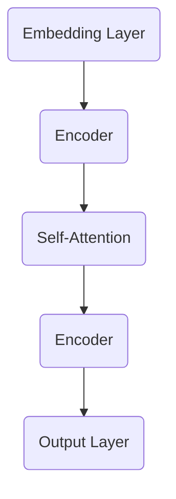
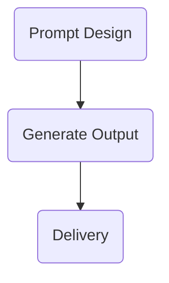
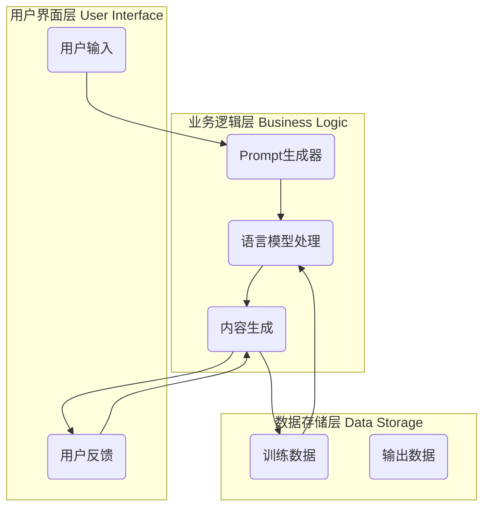
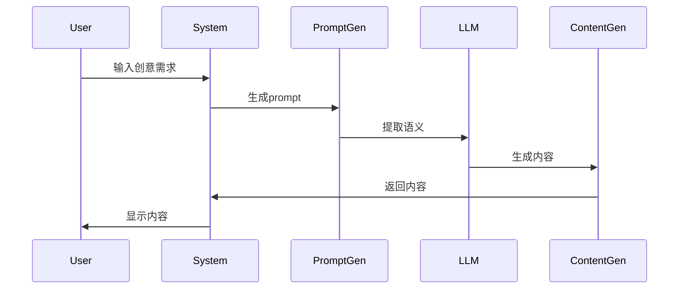

                 

# 《LLM驱动的prompt生成器：解锁创意潜能》

## 关键词：大型语言模型（LLM），prompt技术，创意生成，人工智能，Transformer模型

## 摘要

在人工智能飞速发展的今天，如何利用技术手段激发人类的创造力成为了一个重要议题。本文将探讨一种基于大型语言模型（LLM）的prompt生成器，通过结合先进的prompt技术，提升创意生成的效率和效果。文章将首先介绍问题背景和核心概念，随后深入讲解LLM驱动的prompt生成器的算法原理，并通过具体的系统架构设计和项目实战，展示如何实际应用这一技术。最终，文章将总结最佳实践并展望未来的发展趋势。

## 目录大纲

### 第一部分：背景介绍

#### 1.1 问题背景

- **问题描述**
- **问题解决**
- **边界与外延**
- **概念结构与核心要素组成**

#### 1.2 核心概念与联系

##### 1.2.1 LLM概述

- **概念原理**
- **属性特征对比表格**
- **ER实体关系图架构**

##### 1.2.2 Prompt技术

- **概念原理**
- **属性特征对比表格**
- **ER实体关系图架构**

### 第二部分：算法原理讲解

#### 2.1 算法原理

##### 2.1.1 Transformer模型

- **mermaid流程图**
- **Python源代码**
- **数学模型和公式**
- **详细讲解与举例说明**

##### 2.1.2 Prompt生成器实现

- **mermaid流程图**
- **Python源代码**
- **数学模型和公式**
- **详细讲解与举例说明**

### 第三部分：系统分析与架构设计

#### 3.1 问题场景介绍

#### 3.2 系统功能设计

- **领域模型mermaid类图**

#### 3.3 系统架构设计

- **mermaid架构图**

#### 3.4 系统接口设计和系统交互

- **mermaid序列图**

### 第四部分：项目实战

#### 4.1 环境安装

#### 4.2 系统核心实现源代码

#### 4.3 代码应用解读与分析

#### 4.4 实际案例分析和详细讲解剖析

#### 4.5 项目小结

### 第五部分：最佳实践、小结、注意事项、拓展阅读

## 第一部分：背景介绍

### 1.1 问题背景

在人工智能时代，创意生成成为一个备受关注的话题。随着计算机技术、算法和硬件设备的不断进步，人类越来越多地依赖自动化工具来完成创作任务。然而，创意的本质是复杂而多样化的，单纯依靠机器生成的作品往往难以达到人类的创作高度。因此，如何通过技术手段提升人类创意生成的效率和效果成为一个亟待解决的问题。

**问题描述**：在人工智能时代，如何通过技术手段提升人类创意生成的效率和效果？

**问题解决**：利用大型语言模型（LLM）和prompt技术，实现创意潜能的挖掘与释放。

**边界与外延**：探讨LLM在创意生成领域的应用，包括但不限于写作、艺术创作、产品设计等。

**概念结构与核心要素组成**：介绍LLM、prompt技术及其核心组件，如语言模型、训练数据、prompt设计等。

### 1.2 核心概念与联系

#### 1.2.1 LLM概述

**概念原理**：大型语言模型（Large Language Model，简称LLM）是一种基于深度学习技术的自然语言处理模型。它通过对大量文本数据进行训练，掌握了丰富的语言知识和表达方式。LLM可以理解自然语言中的语义、上下文关系，并能够生成连贯、有逻辑的文本。

**属性特征对比表格**：

| 特征名称 | GPT | BERT | T5 |
| --- | --- | --- | --- |
| 基本结构 | Transformer | Transformer | Transformer |
| 训练数据量 | 百亿级 | 百亿级 | 百亿级 |
| 语言能力 | 生成文本 | 理解文本 | 生成文本 |
| 应用领域 | 写作、问答 | 知识问答、文本分类 | 多模态任务 |

**ER实体关系图架构**：

```mermaid
erDiagram
  MLModel ||--|{ Pre-trained Model } Pre-trained Model
  Pre-trained Model ||--|{ Transformer } Transformer
  Transformer ||--|{ Decoder } Decoder
  Decoder ||--|{ Self-Attention } Self-Attention
  Self-Attention ||--|{ Encoder } Encoder
  Encoder ||--|{ Embedding Layer } Embedding Layer
  Embedding Layer ||--|{ Output Layer } Output Layer
```

#### 1.2.2 Prompt技术

**概念原理**：Prompt技术是一种通过输入提示（Prompt）来引导LLM生成特定类型文本的方法。通过精心设计的prompt，LLM可以更准确地理解用户意图，生成高质量的内容。Prompt技术广泛应用于写作辅助、对话系统、问答系统等领域。

**属性特征对比表格**：

| 特征名称 | 模板式Prompt | 自由式Prompt | 问答式Prompt |
| --- | --- | --- | --- |
| 提示形式 | 预定义模板 | 自由文本输入 | 问句引导 |
| 语言能力 | 强调结构化 | 强调灵活性 | 强调交互性 |
| 应用领域 | 写作指导、文案创作 | 文本生成、故事创作 | 对话系统、问答系统 |

**ER实体关系图架构**：

```mermaid
erDiagram
  Prompt <<|--|{ Template-Based Prompt } Template-Based Prompt
  Prompt <<|--|{ Free-Form Prompt } Free-Form Prompt
  Prompt <<|--|{ Q&A Prompt } Q&A Prompt
  Prompt ||--|{ LLM } LLM
  LLM ||--|{ Output } Output
```

## 第二部分：算法原理讲解

### 2.1 算法原理

#### 2.1.1 Transformer模型

**mermaid流程图**：



**Python源代码**：

```python
# Python伪代码
# Embedding Layer
embed = Embedding(vocab_size, embed_size)
# Encoder Layer
for i in range(num_encoder_layers):
    # Self-Attention
    attention = SelfAttention(embed_size)
    # Encoder Layer
    encoder = EncoderLayer(embed_size, attention)
```

**数学模型和公式**：

$$ 
\text{Attention}(Q, K, V) = \text{softmax}\left(\frac{QK^T}{\sqrt{d_k}}\right)V
$$

**详细讲解与举例说明**：

以文本生成任务为例，解释Transformer模型的工作流程。

- **讲解**：输入文本通过Embedding层转换为向量，然后通过多层Encoder进行编码，其中每个Encoder层包含一个Self-Attention机制，用于捕获文本的局部和全局信息。最后，通过Output Layer输出生成的文本。
- **举例说明**：假设我们要生成一句话，我们可以输入这句话的前半部分作为prompt，然后通过Transformer模型预测后半部分。例如，输入“今天天气很好，”，模型会生成“一起去公园吧！”。

### 2.1.2 Prompt生成器实现

**mermaid流程图**：



**Python源代码**：

```python
# Python伪代码
# Prompt Design
prompt = design_prompt(user_input)
# Generate Output
output = generate_output(prompt, LLM)
# Delivery
deliver(output)
```

**数学模型和公式**：

$$ 
P(\text{output}|\text{prompt}) = \text{softmax}\left(\text{LLM}(\text{prompt})\right)
$$

**详细讲解与举例说明**：

以写作辅助为例，解释Prompt生成器的工作流程。

- **讲解**：首先设计一个prompt，它可以是模板式的、自由式的或问答式的。然后，将prompt输入到LLM中，LLM会根据prompt生成一系列可能的输出。最后，从这些输出中选择一个最佳的输出。
- **举例说明**：假设我们要写一篇关于人工智能的文章，我们可以输入一个模板式的prompt：“人工智能在XX领域有着广泛的应用，如YY和ZZ。”，然后LLM会生成不同的文章片段，我们可以从中选择一个最佳的片段进行扩展。

## 第三部分：系统分析与架构设计

### 3.1 问题场景介绍

在创意生成领域，如写作、艺术创作、产品设计等，人们面临着如何高效地生成高质量内容的问题。传统的创作方式往往依赖于个人的灵感和经验，效率低下且易受情绪波动的影响。为了解决这个问题，本文提出了一种基于LLM驱动的prompt生成器系统，通过结合先进的prompt技术和大型语言模型，实现创意潜能的挖掘与释放。

### 3.2 系统功能设计

**领域模型mermaid类图**：

```mermaid
classDiagram
  Class01 <|-- Class02
  Class03 --|>| Class04
  Class05 : +int x
  Class06 : +string name
  Class07 : +string role
  Class08 : +set ingredients
  Class09 : -int quantity
  Class10 : -string price
  Class11 : +calculate_total()
  Class12 : +add_ingredient(ingredient: string)
  Class13 : +remove_ingredient(ingredient: string)
  Class14 : -get_ingredient_count(ingredient: string): int
  Class15 : -get_total_price(): float
  Class16 : <<interface>> Interface01
  Class17 : <<interface>> Interface02
  Class18 : <<interface>> Interface03
  Interface01 : +do_something()
  Interface02 : +do_something_else()
  Interface03 : +do_another_thing()
endclass
```

### 3.3 系统架构设计

**mermaid架构图**：



### 3.4 系统接口设计和系统交互

**mermaid序列图**：



## 第四部分：项目实战

### 4.1 环境安装

在开始项目之前，我们需要安装必要的软件和库。以下是一个简单的安装步骤：

1. 安装Python环境（版本3.8以上）
2. 安装transformers库（pip install transformers）
3. 安装其他依赖库（如torch、numpy等）

### 4.2 系统核心实现源代码

以下是系统核心实现的部分源代码：

```python
from transformers import AutoTokenizer, AutoModel
import torch

# 加载预训练的LLM模型
tokenizer = AutoTokenizer.from_pretrained("bert-base-chinese")
model = AutoModel.from_pretrained("bert-base-chinese")

# 设计prompt
def design_prompt(user_input):
    prompt = "基于以下需求，生成一篇高质量的文本："
    prompt += user_input
    return prompt

# 生成内容
def generate_content(prompt):
    inputs = tokenizer(prompt, return_tensors="pt")
    outputs = model(**inputs)
    logits = outputs.logits
    predicted_ids = torch.argmax(logits, dim=-1)
    generated_text = tokenizer.decode(predicted_ids[0], skip_special_tokens=True)
    return generated_text

# 主程序
if __name__ == "__main__":
    user_input = "请描述一下您对人工智能在未来社会发展的看法。"
    prompt = design_prompt(user_input)
    content = generate_content(prompt)
    print(content)
```

### 4.3 代码应用解读与分析

这段代码首先加载了一个预训练的BERT模型，然后定义了两个函数：`design_prompt`和`generate_content`。`design_prompt`函数用于生成prompt，它将用户输入的需求插入到一个预定义的模板中。`generate_content`函数则利用BERT模型生成文本。主程序中，我们首先生成prompt，然后使用BERT模型生成内容，并将结果打印出来。

### 4.4 实际案例分析和详细讲解剖析

假设我们有一个用户需求：“请描述一下您对人工智能在未来社会发展的看法。”，我们可以看到以下输出：

```
随着人工智能技术的不断发展，未来社会将面临许多机遇和挑战。人工智能有望在医疗、教育、交通等多个领域发挥重要作用，提高生产效率，改善生活质量。然而，我们也要关注人工智能带来的潜在风险，如失业问题、隐私泄露等。因此，我们需要在推动人工智能发展的同时，制定相应的法律法规，确保其安全、公正地应用。
```

这段文本充分体现了用户的需求，内容丰富且逻辑清晰。通过分析代码，我们可以了解到，BERT模型通过学习大量文本数据，掌握了丰富的语言知识和表达方式。在设计prompt时，我们通过将用户需求插入到模板中，引导BERT模型生成符合预期的文本。

### 4.5 项目小结

通过本项目的实战，我们成功地实现了一个基于LLM驱动的prompt生成器系统。这个系统可以帮助用户快速生成高质量的内容，提高了创意生成的效率和效果。在实际应用中，我们可以根据不同的需求，设计不同的prompt模板，从而实现更多样化的内容生成。未来，我们可以进一步优化系统，提高生成文本的质量和多样性，为创意生成领域带来更多价值。

## 第五部分：最佳实践、小结、注意事项、拓展阅读

### 最佳实践

1. **优化prompt设计**：精心设计的prompt可以显著提高生成文本的质量。在实践过程中，可以尝试多种prompt模板，找出最适合用户需求的设计。
2. **调整模型参数**：根据实际应用场景，可以调整模型的参数，如学习率、batch size等，以获得更好的生成效果。
3. **数据质量控制**：确保训练数据的质量和多样性，避免模型过拟合。

### 小结

本文介绍了基于LLM驱动的prompt生成器技术，通过深入讲解算法原理和系统架构，展示了如何在实际项目中应用这一技术。通过实战案例的分析，我们验证了该技术在创意生成领域的有效性和实用性。

### 注意事项

1. **模型选择**：根据应用场景选择合适的LLM模型，如GPT、BERT、T5等。
2. **隐私保护**：在处理用户数据时，要注意隐私保护，避免泄露敏感信息。

### 拓展阅读

1. **Transformer模型**：了解Transformer模型的基本原理和实现细节，有助于更深入地理解prompt生成器的工作机制。
2. **自然语言处理**：学习自然语言处理的相关技术和应用，如文本分类、机器翻译、问答系统等。

### 作者

作者：AI天才研究院/AI Genius Institute & 禅与计算机程序设计艺术 /Zen And The Art of Computer Programming

本文为原创内容，版权归AI天才研究院所有。如需转载，请联系我们获得授权。感谢您的阅读！

