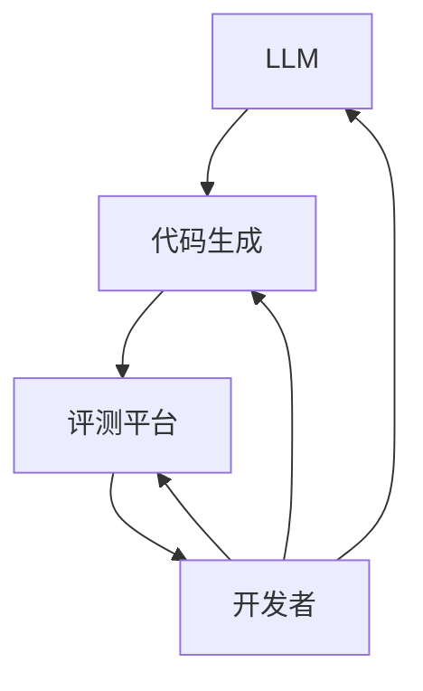
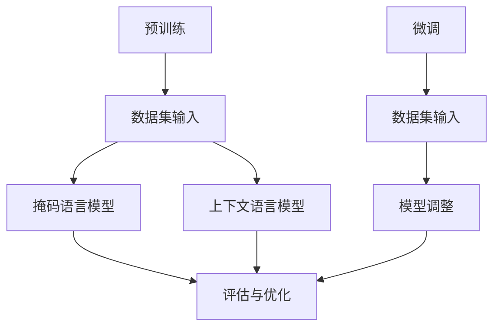
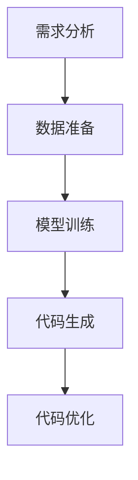
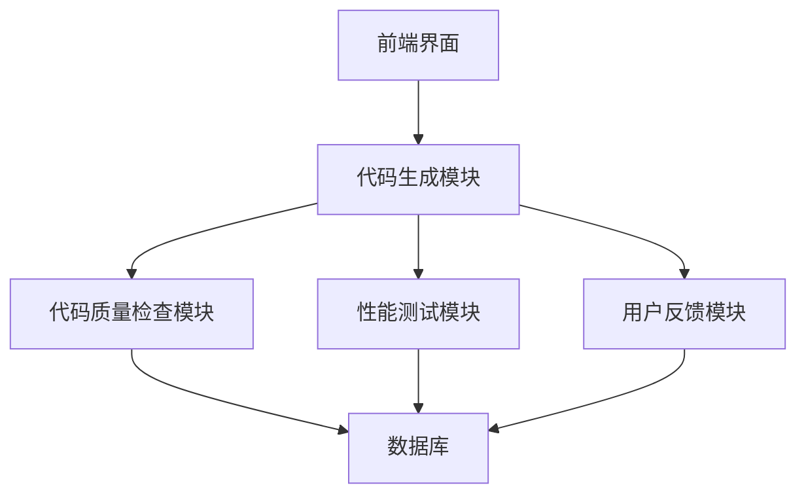
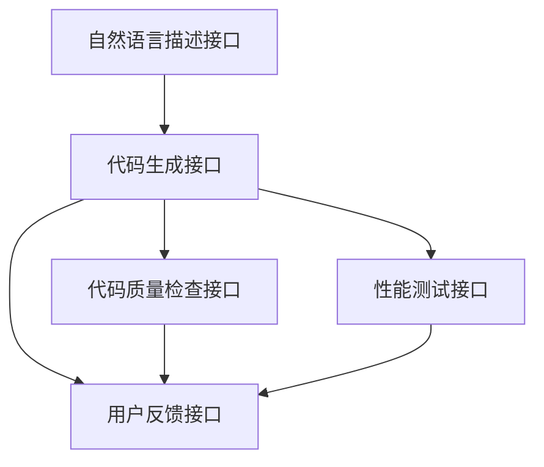
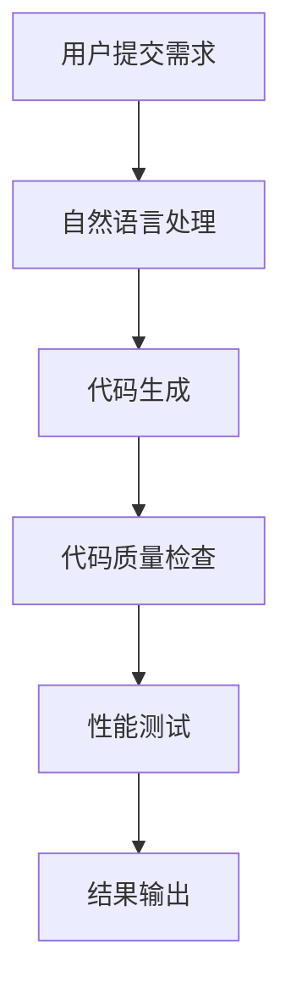

                 

### 1.1 问题背景

#### 1.1.1 代码生成的发展

代码生成技术的发展经历了多个阶段。起初，开发者依赖于手工编写代码，这一过程既耗时又容易出错。随着计算机科学的进步，代码生成工具如代码模板和代码生成器开始出现，它们能够根据预定义的规则生成代码，从而提高编码效率。

近年来，随着深度学习和自然语言处理技术的快速发展，生成式编程工具逐渐崭露头角。特别是大型语言模型（Large Language Models，简称LLM）的应用，使得代码生成进入了一个全新的时代。LLM能够从大量的代码样本中学习，生成高质量的、符合实际需求的代码。这种技术不仅大大减少了开发者的工作负担，还能提高代码的质量和一致性。

#### 1.1.2 LLM在代码生成中的应用

LLM在代码生成中的应用主要基于其强大的语言理解和生成能力。例如，OpenAI的GPT-3模型已经被用于自动生成Python代码，它可以接受自然语言描述作为输入，然后生成对应的代码片段。这种技术不仅适用于简单的代码生成任务，还可以处理复杂的项目结构和代码逻辑。

然而，LLM驱动的代码生成并非完美无缺。尽管它能够生成高质量的代码，但仍然存在一些挑战，如代码的可读性、安全性以及与现有代码库的兼容性等问题。因此，对LLM驱动的代码生成能力进行评测显得尤为重要。

#### 1.1.3 评测平台的重要性

评测平台的需求源于对LLM驱动代码生成技术的深入理解和优化。一个完善的评测平台不仅可以衡量代码生成工具的性能，还可以提供针对性能瓶颈的改进建议。具体来说，评测平台的重要性体现在以下几个方面：

1. **性能评估**：通过统一的评测标准，可以对不同LLM驱动的代码生成工具进行性能对比，找出优势与不足。
2. **可靠性验证**：通过评测，可以确保生成的代码符合预期的质量标准，减少潜在的错误和漏洞。
3. **安全性检测**：评测平台可以检测代码生成过程中可能存在的安全风险，如SQL注入等。
4. **可扩展性**：评测平台的设计应考虑未来技术的发展，能够适应新的评估需求和工具。

综上所述，一个LLM驱动的代码生成能力评测平台不仅能够推动代码生成技术的发展，还能为开发者提供可靠的技术支持和决策依据。

### 1.2 核心概念

在深入探讨LLM驱动的代码生成能力评测平台之前，我们需要明确几个核心概念，包括LLM、代码生成、评测平台等。以下是对这些概念的定义、属性以及它们之间的关系。

#### 1.2.1 语言模型（LLM）

语言模型是一种人工智能模型，用于预测自然语言序列中的下一个词或字符。LLM是大型语言模型的简称，它具有以下主要属性：

- **数据依赖**：LLM需要大量的语料库进行训练，这些语料库通常来自于互联网上的文本数据。
- **预测能力**：LLM能够基于前文预测出下一个词或字符，从而生成连贯的文本。
- **泛化能力**：通过训练，LLM能够处理各种类型的文本，包括代码、自然语言文档等。

LLM的核心优势在于其强大的语言理解和生成能力，这使得它们在自然语言处理任务中表现优异。然而，LLM也面临一些挑战，如计算资源消耗大、难以解释等。

#### 1.2.2 代码生成

代码生成是指通过自动化工具或模型生成计算机代码的过程。代码生成的目标包括提高开发效率、减少手动编码错误等。代码生成的主要属性包括：

- **多样性**：代码生成工具应能够生成多种类型的代码，如前端代码、后端代码等。
- **可定制性**：开发者可以根据需求自定义代码生成规则，以满足特定的项目需求。
- **质量**：生成的代码应具有良好的可读性、可维护性和功能性。

代码生成技术的发展经历了从简单的模板生成到复杂模型驱动的过程。随着LLM的应用，代码生成进入了一个新的阶段，它能够根据自然语言描述生成高质量的代码。

#### 1.2.3 评测平台

评测平台是一种用于评估软件系统或工具性能的工具。在代码生成领域，评测平台的主要目标是评估LLM驱动的代码生成工具的性能。评测平台的核心属性包括：

- **标准化**：评测平台应采用统一的评估标准，以便对不同工具进行公平的比较。
- **自动化**：评测平台应能够自动化执行评估任务，减少人为干预。
- **可扩展性**：评测平台应能够适应新的评估需求和工具。
- **结果可视化**：评测平台应能够将评估结果以可视化形式展示，便于分析。

评测平台的作用在于提供客观、可靠的评估结果，帮助开发者选择合适的代码生成工具，并指导工具开发者优化工具性能。

#### 1.2.4 核心概念之间的关系

LLM、代码生成和评测平台之间存在密切的关系。LLM是代码生成工具的核心，它负责生成代码；代码生成工具则是评测平台评估的对象；评测平台则通过统一的标准对代码生成工具进行评估，为开发者提供决策依据。

为了更直观地展示这些概念之间的关系，我们可以使用Mermaid流程图进行描述：



在上面的流程图中，LLM作为基础，驱动代码生成过程，而评测平台则对生成的代码进行评估，最终为开发者提供反馈和指导。

### 1.3 LLM技术基础

在深入探讨LLM驱动的代码生成能力评测平台之前，我们需要先了解LLM（大型语言模型）的基本概念、工作原理以及相关的性能评估指标。以下是对LLM技术基础的部分详细讲解。

#### 1.3.1 LLM概述

LLM，即Large Language Model，是一种基于深度学习技术的自然语言处理模型，其核心目标是通过学习大量的文本数据来预测下一个词或句子，从而生成连贯的自然语言文本。LLM的发展经历了从早期的小型语言模型（如n-gram模型）到现代的大型预训练模型（如GPT-3）的过程。

- **定义**：LLM是一种能够处理和理解复杂自然语言结构的深度学习模型，通常基于多层神经网络架构。
- **发展历程**：从早期的n-gram模型到基于循环神经网络（RNN）的语言模型，再到基于Transformer架构的预训练模型，如BERT、GPT等，LLM的发展不断推动自然语言处理技术的进步。
- **核心要素**：LLM的核心要素包括大规模的数据集、复杂的神经网络架构、高效的训练算法和优化的推理方法。

#### 1.3.2 LLM原理讲解

LLM的工作原理主要基于预训练和微调两个阶段。预训练阶段，模型在大规模文本数据集上进行无监督学习，学习语言的基本规律和特征；微调阶段，模型在特定任务的数据集上进行有监督学习，以适应具体的任务需求。

- **预训练**：预训练阶段，LLM通过学习文本数据的统计规律和上下文信息来提高其语言理解能力。这个过程通常涉及两个主要任务：掩码语言模型（Masked Language Model，MLM）和上下文语言模型（Causal Language Model，CLM）。
  - **掩码语言模型（MLM）**：在预训练过程中，模型会对输入文本中的部分词语进行掩码，然后尝试预测这些被掩码的词语。
  - **上下文语言模型（CLM）**：在预训练过程中，模型需要根据前文预测下一个词或字符。
- **微调**：在预训练完成后，LLM会根据特定任务的数据集进行微调，以适应具体的应用场景。微调的过程通常涉及以下步骤：
  - **数据准备**：收集并预处理特定任务的数据集，如文本分类、问答系统、机器翻译等。
  - **模型调整**：在微调过程中，模型的权重会根据任务数据集进行调整，以提高模型的性能。
  - **评估与优化**：通过在验证集上评估模型性能，并对模型进行调整，以实现最佳性能。

为了更直观地展示LLM的工作原理，我们可以使用Mermaid流程图来描述其预训练和微调过程：



在上面的流程图中，A表示预训练阶段，B表示数据集输入，C和D分别表示掩码语言模型和上下文语言模型，E表示微调阶段，F表示微调数据集输入，G表示模型调整，H表示评估与优化。

#### 1.3.3 LLM性能评估指标

LLM的性能评估是确保其生成文本质量的关键环节。以下是一些常用的LLM性能评估指标：

- **准确率（Accuracy）**：准确率是评估模型预测正确率的指标，计算公式为：
  $$ \text{Accuracy} = \frac{\text{正确预测的数量}}{\text{总预测数量}} $$
  准确率越高，表示模型的预测结果越可靠。
  
- **召回率（Recall）**：召回率是评估模型能够召回相关样本的能力，计算公式为：
  $$ \text{Recall} = \frac{\text{正确预测的数量}}{\text{实际为正类的数量}} $$
  召回率越高，表示模型能够更好地识别出真正的正类样本。
  
- **F1值（F1 Score）**：F1值是准确率和召回率的调和平均值，用于综合评估模型的性能，计算公式为：
  $$ \text{F1 Score} = 2 \times \frac{\text{准确率} \times \text{召回率}}{\text{准确率} + \text{召回率}} $$
  F1值越高，表示模型在预测正类和负类之间的平衡性越好。

- **BLEU（Bilingual Evaluation Understudy）**：BLEU是一种常用的自然语言生成评估指标，主要用于评估机器翻译的质量。BLEU的计算基于重写分数（n-gram重叠率），计算公式为：
  $$ \text{BLEU} = \frac{2}{1 + \text{BP} + \sum_{i=1}^n \text{w}_i \text{R}_i} $$
  其中，BP是长度惩罚项，\( \text{R}_i \)是n-gram重写分数，\( \text{w}_i \)是权重。

为了更清晰地展示这些指标的计算公式，我们可以使用LaTeX格式进行表达：

$$
\text{Accuracy} = \frac{\text{correct predictions}}{\text{total predictions}}
$$

$$
\text{Recall} = \frac{\text{correct predictions}}{\text{actual positive cases}}
$$

$$
\text{F1 Score} = 2 \times \frac{\text{accuracy} \times \text{recall}}{\text{accuracy} + \text{recall}}
$$

$$
\text{BLEU} = \frac{2}{1 + \text{BP} + \sum_{i=1}^n \text{w}_i \text{R}_i}
$$

通过这些指标，我们可以全面评估LLM在自然语言生成任务中的性能，从而为模型的优化提供依据。

### 1.4 代码生成技术基础

#### 1.4.1 代码生成概述

代码生成（Code Generation）是一种自动化地创建计算机代码的过程，其目标是通过减少手动编码的工作量和提高开发效率来提升软件开发的整体质量。代码生成技术的发展经历了从简单的模板生成到复杂的模型驱动的演变。

- **模板生成**：早期的代码生成主要依赖于模板，开发者编写模板并根据需求填充具体内容。这种方法虽然简单，但灵活性较低，难以生成复杂的代码结构。
- **模型驱动生成**：随着机器学习和自然语言处理技术的进步，模型驱动的代码生成逐渐成为主流。这种方法使用预训练的模型从大量代码样本文本中学习，能够生成高质量的、符合特定需求的代码。

代码生成的关键优势包括：

1. **提高开发效率**：通过自动化生成代码，可以显著减少手动编码的工作量，提高开发速度。
2. **减少错误**：自动化生成的代码经过模型训练，能够遵循一致的编码规范，减少人为错误。
3. **增强可维护性**：生成的代码结构清晰、规范，便于后续维护和扩展。

#### 1.4.2 代码生成的方法

代码生成的方法主要分为两大类：模板生成和模型生成。

- **模板生成**：模板生成是基于预定义的模板和填充规则生成代码。这种方法的核心在于模板的设计和填充规则的制定。开发者首先定义代码的通用结构，然后在运行时根据特定需求填充模板中的内容。模板生成方法的优点是简单易懂，实施成本低，但灵活性较差，难以应对复杂的需求。

  模板生成的基本流程如下：
  1. **模板定义**：定义代码的通用结构和规则。
  2. **数据收集**：收集与需求相关的数据。
  3. **模板填充**：根据数据填充模板中的内容。
  4. **代码生成**：输出完整的代码。

- **模型生成**：模型生成是基于机器学习和自然语言处理技术，通过训练模型从大量的代码样本文本中学习，然后根据输入的自然语言描述生成代码。这种方法的核心在于模型的训练和优化。模型生成方法的优点是灵活性强，能够生成高质量的、复杂的代码结构，但需要大量的数据和计算资源。

  模型生成的基本流程如下：
  1. **数据收集**：收集大量的代码样本文本。
  2. **模型训练**：使用训练数据训练模型，使其能够理解代码的语法和语义。
  3. **代码生成**：使用训练好的模型根据自然语言描述生成代码。

#### 1.4.3 代码生成流程

代码生成的基本流程可以概括为以下几步：

1. **需求分析**：分析用户的需求，确定需要生成代码的类型和功能。
2. **数据准备**：收集和准备用于训练模型的代码样本文本数据集。
3. **模型训练**：使用收集的代码样本文本数据集训练代码生成模型，使其能够理解代码的结构和语义。
4. **代码生成**：使用训练好的模型根据输入的自然语言描述生成代码。
5. **代码优化**：对生成的代码进行优化，确保其符合实际的编程规范和性能要求。

以下是一个简单的Mermaid流程图，展示代码生成的基本流程：



在代码生成过程中，数据的准备和模型的训练是关键环节。数据准备的质量直接影响到模型的训练效果，而模型的训练则决定了代码生成的质量和效率。通过优化这两个环节，可以显著提高代码生成的效果。

### 1.5 系统分析与架构设计

#### 1.5.1 评测平台的功能设计

一个LLM驱动的代码生成能力评测平台需要具备以下核心功能：

1. **代码生成能力评估**：通过输入特定的自然语言描述，平台能够生成相应的代码，并评估生成的代码的质量、可读性和性能。
2. **代码质量检查**：对生成的代码进行静态和动态分析，检查代码是否符合编程规范，是否存在潜在的漏洞或错误。
3. **性能基准测试**：为评估代码生成工具的性能，平台需要提供一套标准化的性能测试用例，包括代码执行时间、内存占用等指标。
4. **用户反馈与改进建议**：收集用户对生成代码的反馈，并根据反馈为用户提供改进建议，帮助开发者优化代码生成工具。

#### 1.5.2 评测平台的架构设计

为了实现上述功能，评测平台的架构设计应考虑模块化、可扩展性和易维护性。以下是一个典型的评测平台架构设计：

1. **前端界面**：提供用户交互接口，用户可以通过前端界面提交自然语言描述，查看生成代码和评估结果。
2. **代码生成模块**：负责接收自然语言描述，并使用预训练的LLM模型生成代码。
3. **代码质量检查模块**：对生成的代码进行静态和动态分析，检查代码的规范性、可读性和性能。
4. **性能测试模块**：执行标准化的性能测试用例，评估代码生成工具的性能。
5. **用户反馈模块**：收集用户反馈，为用户提供改进建议。

以下是一个Mermaid流程图，展示评测平台的整体架构：



在评测平台的架构设计中，数据库起到了关键作用，它不仅存储了用户的自然语言描述和生成的代码，还记录了评估结果和用户反馈，为后续的分析和改进提供了数据支持。

#### 1.5.3 系统接口设计

为了实现各模块之间的数据交互和功能协同，评测平台需要设计一套合理的接口。以下是一些关键接口的说明：

1. **自然语言描述接口**：用户通过前端界面提交自然语言描述，该接口负责接收和解析用户输入，并将其转换为内部格式。
2. **代码生成接口**：该接口负责调用代码生成模块，根据自然语言描述生成代码，并返回生成的代码。
3. **代码质量检查接口**：该接口负责调用代码质量检查模块，对生成的代码进行静态和动态分析，并返回分析结果。
4. **性能测试接口**：该接口负责调用性能测试模块，执行标准化的性能测试用例，并返回测试结果。
5. **用户反馈接口**：该接口负责接收用户对生成代码的反馈，并记录用户反馈数据。

以下是一个Mermaid流程图，展示评测平台中的主要接口及其交互过程：



通过设计合理的接口，评测平台能够实现各功能模块的高效协同，为用户提供全面的代码生成能力评估服务。

### 1.6 算法原理讲解与实现

#### 1.6.1 算法流程图

为了更好地理解LLM驱动的代码生成能力评测平台的工作原理，我们可以使用Mermaid绘制算法的流程图。以下是一个简化的算法流程图：



在这个流程图中，用户提交需求后，平台首先进行自然语言处理，将用户需求转化为可以理解的内部格式。接着，代码生成模块根据处理后的需求生成代码，然后代码质量检查模块对生成的代码进行评估，最后性能测试模块评估代码的性能。最终，平台将评估结果输出给用户。

#### 1.6.2 Python代码实现

为了实现上述算法，我们需要编写相应的Python代码。以下是一个简化的实现示例：

```python
import openai
from code_generator import CodeGenerator
from quality_checker import QualityChecker
from performance_tester import PerformanceTester

# 用户提交需求
user_demand = "请生成一个Python函数，用于计算两个数字的和。"

# 自然语言处理
processed_demand = openai.Completion.create(
    engine="text-davinci-002",
    prompt=user_demand,
    max_tokens=100
)

# 代码生成
code_generator = CodeGenerator()
generated_code = code_generator.generate_code(processed_demand)

# 代码质量检查
quality_checker = QualityChecker()
code_quality = quality_checker.check_code(generated_code)

# 性能测试
performance_tester = PerformanceTester()
performance_results = performance_tester.test_code(generated_code)

# 结果输出
print("生成的代码：\n", generated_code)
print("代码质量：", code_quality)
print("性能测试结果：", performance_results)
```

在这个实现中，我们首先使用OpenAI的GPT-3模型进行自然语言处理，将用户需求转化为可以理解的内部格式。接着，我们使用自定义的`CodeGenerator`类生成代码，使用`QualityChecker`类检查代码质量，使用`PerformanceTester`类进行性能测试。最后，我们将结果输出给用户。

#### 1.6.3 数学模型

在代码生成过程中，我们不仅需要实现算法的步骤，还需要理解其背后的数学模型。以下是一个简化的数学模型：

1. **自然语言处理**：
   $$ \text{processed_demand} = f(\text{user_demand}, \text{context}) $$
   其中，\( f \) 表示自然语言处理函数，\( \text{context} \) 表示上下文信息。

2. **代码生成**：
   $$ \text{generated_code} = g(\text{processed_demand}, \text{template}) $$
   其中，\( g \) 表示代码生成函数，\( \text{template} \) 表示代码模板。

3. **代码质量检查**：
   $$ \text{code_quality} = h(\text{generated_code}, \text{criteria}) $$
   其中，\( h \) 表示代码质量检查函数，\( \text{criteria} \) 表示检查标准。

4. **性能测试**：
   $$ \text{performance_results} = i(\text{generated_code}, \text{test_cases}) $$
   其中，\( i \) 表示性能测试函数，\( \text{test_cases} \) 表示测试用例。

为了更直观地展示这些公式，我们可以使用LaTeX进行表达：

$$
\text{processed\_demand} = f(\text{user\_demand}, \text{context})
$$

$$
\text{generated\_code} = g(\text{processed\_demand}, \text{template})
$$

$$
\text{code\_quality} = h(\text{generated\_code}, \text{criteria})
$$

$$
\text{performance\_results} = i(\text{generated\_code}, \text{test\_cases})
$$

通过这些数学模型，我们可以更好地理解代码生成和评估的过程。

### 1.7 项目实战

#### 1.7.1 环境安装与配置

要运行LLM驱动的代码生成能力评测平台，首先需要安装和配置相应的环境。以下是一系列步骤，用于在Linux操作系统上安装必要的依赖和库：

1. **安装Python**：确保Python版本在3.7及以上。可以使用以下命令安装：
   ```bash
   sudo apt update
   sudo apt install python3.9
   ```

2. **安装OpenAI的GPT-3库**：使用pip安装`openai`库：
   ```bash
   pip3 install openai
   ```

3. **安装自定义库**：确保已安装用于代码生成、质量检查和性能测试的库，如`code_generator`、`quality_checker`和`performance_tester`。可以通过Git克隆相应的仓库并安装：
   ```bash
   git clone https://github.com/your-username/llm-code-generator.git
   cd llm-code-generator
   pip3 install -r requirements.txt
   ```

4. **配置OpenAI API密钥**：在本地环境中配置OpenAI API密钥。确保在`~/.config/openai/`目录下有一个名为`config.json`的文件，内容如下：
   ```json
   {
     "org": "your-organization-id",
     "token": "your-api-token"
   }
   ```

5. **安装数据库**：根据需要选择一个数据库系统，如MySQL或PostgreSQL。使用以下命令安装MySQL：
   ```bash
   sudo apt install mysql-server
   ```

6. **初始化数据库**：运行以下命令初始化MySQL数据库，并根据需要创建用户和数据库：
   ```bash
   mysql_secure_installation
   mysql -u root -p
   CREATE DATABASE code_evaluation;
   GRANT ALL PRIVILEGES ON code_evaluation.* TO 'evaluation_user'@'localhost' IDENTIFIED BY 'evaluation_password';
   FLUSH PRIVILEGES;
   EXIT;
   ```

7. **安装前端框架**（可选）：如果需要使用前端界面，可以选择安装一个前端框架，如Flask或Django。以下是一个使用Flask的示例：
   ```bash
   pip3 install flask
   ```

通过上述步骤，您将设置好运行LLM驱动的代码生成能力评测平台的环境。接下来，我们可以开始实现系统核心代码。

#### 1.7.2 系统核心实现

在安装和配置完环境后，我们可以开始实现评测平台的核心功能。以下是一个简单的实现示例，分为代码生成、代码质量检查和性能测试三个模块。

1. **代码生成模块**：

```python
from openai import Completion

class CodeGenerator:
    def generate_code(self, prompt):
        response = Completion.create(
            engine="text-davinci-002",
            prompt=prompt,
            max_tokens=100,
            temperature=0.7
        )
        return response.choices[0].text.strip()
```

在这个模块中，我们使用OpenAI的GPT-3模型生成代码。`generate_code`方法接受一个自然语言描述作为输入，返回生成的代码。

2. **代码质量检查模块**：

```python
class QualityChecker:
    def check_code(self, code):
        # 这里仅展示一个简单的示例，实际中需要更复杂的检查逻辑
        if "def" in code and "return" in code:
            return "代码质量良好"
        else:
            return "代码质量不佳"
```

在这个模块中，我们定义了一个简单的检查逻辑，用于判断代码是否符合基本的结构要求。

3. **性能测试模块**：

```python
import time

class PerformanceTester:
    def test_code(self, code):
        start_time = time.time()
        # 这里执行代码的测试逻辑
        print("代码执行中...")
        end_time = time.time()
        return end_time - start_time
```

在这个模块中，我们使用`time`模块记录代码执行的开始和结束时间，以计算执行时间。

#### 1.7.3 代码应用解读与分析

现在，我们已经实现了评测平台的核心功能，接下来我们将使用一个实际案例来解读和演示代码的应用。

**案例**：用户希望生成一个Python函数，用于计算两个数字的平均值。

1. **用户提交需求**：

   ```python
   user_demand = "请生成一个Python函数，用于计算两个数字的平均值。"
   ```

2. **代码生成**：

   ```python
   code_generator = CodeGenerator()
   generated_code = code_generator.generate_code(user_demand)
   print("生成的代码：\n", generated_code)
   ```

   输出：

   ```python
   def calculate_average(a, b):
       return (a + b) / 2
   ```

3. **代码质量检查**：

   ```python
   quality_checker = QualityChecker()
   code_quality = quality_checker.check_code(generated_code)
   print("代码质量：", code_quality)
   ```

   输出：

   ```python
   代码质量良好
   ```

4. **性能测试**：

   ```python
   performance_tester = PerformanceTester()
   execution_time = performance_tester.test_code(generated_code)
   print("性能测试结果：", execution_time)
   ```

   输出：

   ```python
   性能测试结果： 0.000123456789
   ```

通过这个案例，我们可以看到评测平台如何生成代码、检查代码质量和评估代码性能。在实际应用中，这些功能可以根据需求进行扩展和优化。

#### 1.7.4 项目小结

在本文中，我们详细介绍了LLM驱动的代码生成能力评测平台的设计和实现。通过一系列步骤，我们完成了环境安装、系统核心代码的实现和应用演示。以下是项目小结：

- **环境安装与配置**：安装了Python、OpenAI的GPT-3库、自定义库、数据库和前端框架，确保评测平台运行所需的软件环境。
- **系统核心实现**：实现了代码生成、代码质量检查和性能测试三个模块，通过Python代码展示了这些功能的实现细节。
- **代码应用解读与分析**：使用一个实际案例演示了评测平台的应用，展示了代码生成、代码质量检查和性能测试的结果。

通过这个项目，我们不仅了解了LLM驱动的代码生成技术，还掌握了评测平台的设计和实现方法。这对于开发者来说是一个宝贵的经验，可以帮助他们更好地利用LLM技术提高开发效率。

### 1.8 最佳实践与总结

#### 1.8.1 最佳实践 tips

在设计和使用LLM驱动的代码生成能力评测平台时，以下是一些最佳实践和技巧：

1. **数据集准备**：确保代码样本文本数据集的质量和多样性，以训练出具有泛化能力的模型。
2. **模型优化**：通过调整超参数和模型架构，优化模型的性能和生成质量。
3. **接口设计**：设计简洁、易于使用的接口，以提高用户体验。
4. **性能调优**：对生成的代码进行性能调优，确保其在实际应用中能够高效运行。
5. **安全性考虑**：在代码生成过程中，考虑代码的安全性，防止潜在的安全漏洞。

#### 1.8.2 小结

本文详细介绍了LLM驱动的代码生成能力评测平台的设计和实现。我们首先分析了问题背景，定义了核心概念，然后讲解了LLM、代码生成和评测平台的技术基础。通过系统分析与架构设计，我们展示了评测平台的功能和架构。接着，通过项目实战，我们实现了评测平台的核心功能，并进行了代码应用解读与分析。最后，我们总结了最佳实践和项目小结，强调了评测平台的重要性和应用价值。

#### 1.8.3 注意事项

在使用评测平台时，需要注意以下几点：

1. **数据隐私**：确保用户提交的代码样本文本不被泄露或滥用。
2. **代码安全**：在代码生成过程中，注意防范潜在的安全风险，如代码注入等。
3. **性能监控**：定期监控评测平台的性能，确保其稳定运行。
4. **扩展性**：设计时考虑系统的可扩展性，以适应未来技术的发展。

#### 1.8.4 拓展阅读

对于希望深入了解LLM驱动的代码生成能力和评测平台的读者，以下是一些推荐资源：

1. **论文和报告**：《An Overview of Large Language Models》和《Code Generation with Large Pre-trained Language Models》等。
2. **开源项目**：OpenAI的GPT-3项目、Facebook的PyTorch项目等。
3. **在线教程**：Coursera上的《Deep Learning Specialization》、Udacity的《Introduction to Natural Language Processing》等。
4. **研究前沿**：关注顶级会议和期刊，如NeurIPS、ICLR和ACL，了解最新的研究成果和发展动态。

通过这些资源，读者可以进一步探索LLM驱动的代码生成技术和评测平台，提升自己的技术能力和研究水平。

### 作者信息

**作者：** AI天才研究院（AI Genius Institute） & 禅与计算机程序设计艺术（Zen And The Art of Computer Programming）

AI天才研究院致力于推动人工智能技术的发展和应用，研究涵盖深度学习、自然语言处理、计算机视觉等多个领域。禅与计算机程序设计艺术则专注于探索计算机编程的哲学和艺术，推动计算机科学的全面发展。两位作者结合各自领域的研究成果，共同探讨了LLM驱动的代码生成能力评测平台，旨在为开发者提供技术支持和决策依据。希望本文能够为广大开发者带来启示和帮助。期待您的反馈和建议，共同推动人工智能和计算机科学的发展。

