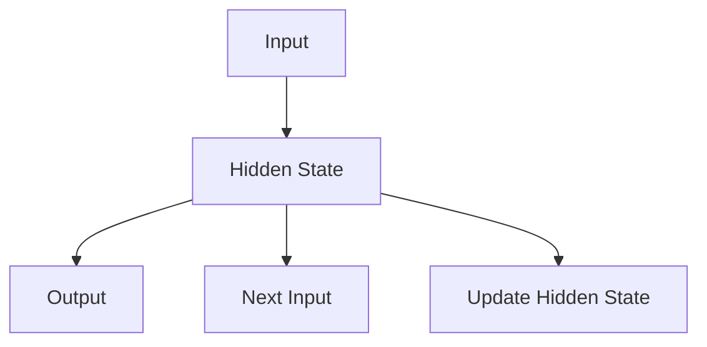
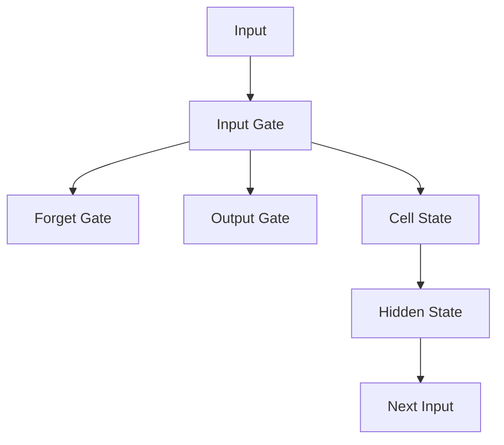
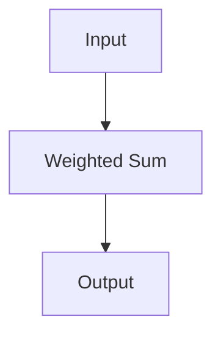
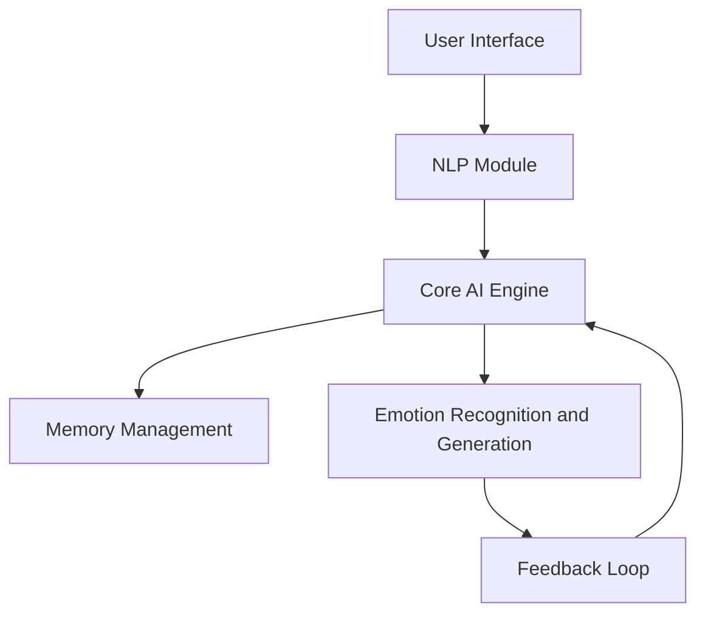

                 


## 目录

# Self-Consistency CoT Optimization for AI Emotional Companionship Robots

### Keywords
1. Self-Consistency CoT
2. AI Emotional Companionship Robots
3. Optimization Algorithms
4. Machine Learning
5. Natural Language Processing
6. Neural Networks
7. Human-Robot Interaction

### Abstract
In this comprehensive guide, we delve into the world of AI-driven emotional companionship robots, focusing on the optimization of Self-Consistency CoT (Context of Thought). We will explore the underlying principles, algorithmic frameworks, and mathematical models that enable these robots to provide meaningful and consistent interactions. Through detailed explanations, step-by-step guidance, and practical examples, we aim to equip readers with the knowledge and tools necessary to design and implement highly effective emotional companionship robots.

----------------------------------------------------------------

## Introduction to AI Emotional Companionship Robots

### Background and Evolution
AI emotional companionship robots are a relatively new development in the field of artificial intelligence. Initially designed for basic human interaction, these robots have evolved to offer sophisticated emotional engagement and companionship. From simple chatbots to advanced humanoid robots, the capability of these machines to understand and respond to human emotions has significantly improved.

The evolution of AI emotional companionship robots can be traced back to the early days of artificial intelligence research. Initial attempts at creating robots that could mimic human interactions were limited by the computational power and data availability of the time. However, with advancements in machine learning, natural language processing (NLP), and neural networks, these robots have become more capable and human-like in their interactions.

### Core Concepts and Terminology
To understand AI emotional companionship robots, it is essential to familiarize oneself with some core concepts and terminology:

1. **Context of Thought (CoT)**: The context of thought refers to the information and knowledge that an AI system has at a given moment in time. It includes the user's history of interactions, current situation, and any relevant external factors.

2. **Self-Consistency**: Self-consistency is the property of an AI system that ensures its internal representations and responses are coherent and consistent across different contexts and over time. This is crucial for maintaining a consistent and believable emotional companionship experience.

3. **Emotional Companionship**: Emotional companionship refers to the ability of an AI robot to engage with a user on an emotional level, offering support, empathy, and companionship.

4. **Natural Language Processing (NLP)**: NLP is a branch of AI that focuses on the interaction between computers and humans through the use of natural language. It enables AI robots to understand and generate human-like language.

5. **Neural Networks**: Neural networks are a type of machine learning model inspired by the structure and function of the human brain. They are used to process and interpret data, enabling AI robots to understand and respond to human emotions.

### Problem Statement and Objectives
The primary challenge in designing AI emotional companionship robots is to ensure that these robots provide consistent and coherent emotional engagement. This requires the robots to maintain a high level of self-consistency in their thoughts and responses, which can be challenging due to the dynamic and often unpredictable nature of human emotions.

The objectives of optimizing Self-Consistency CoT in AI emotional companionship robots are:

1. **Enhance Coherence**: Improve the coherence of the robot's responses and actions, ensuring a seamless and believable emotional companionship experience.

2. **Improve Adaptability**: Enhance the robot's ability to adapt to changing contexts and user emotions, ensuring it remains engaging and relevant over time.

3. **Reduce Errors**: Minimize inconsistencies and errors in the robot's responses, which can lead to frustration and mistrust from users.

4. **Improve Reliability**: Ensure that the robot's emotional responses are reliable and consistent, providing a dependable source of companionship and support.

In the next sections, we will delve deeper into the core concepts and methodologies that enable the optimization of Self-Consistency CoT in AI emotional companionship robots. By understanding these principles, readers will be well-equipped to design and implement their own highly effective emotional companionship robots.

----------------------------------------------------------------

## Core Concept: Self-Consistency CoT

### Understanding Self-Consistency

Self-consistency is a fundamental concept in the field of AI emotional companionship robots. It refers to the ability of an AI system to maintain coherence and consistency in its thoughts, actions, and responses over time and across different contexts. This is crucial for ensuring a seamless and believable emotional companionship experience for users.

To illustrate the importance of self-consistency, consider a scenario where a user is sharing a personal experience with an AI robot. The robot must not only understand the context of the conversation but also maintain consistency in its responses throughout the interaction. For example, if the robot promises to remember a specific detail mentioned by the user and then fails to recall it later in the conversation, it could lead to a breakdown in the emotional connection.

### Core Principles of Self-Consistency CoT

Self-Consistency CoT is built upon several core principles that ensure the AI system remains coherent and consistent:

1. **Memory Management**: The AI system must efficiently manage its memory to retain relevant information from past interactions and use it to inform current and future responses. This involves techniques such as temporal attention and memory retrieval algorithms.

2. **Context Awareness**: The AI must continuously update and maintain its context of thought, incorporating new information from the user's current interactions. This helps the robot to adapt to changing contexts and provide relevant and consistent responses.

3. **Response Consistency**: The robot's responses must be consistent with its internal models of the user's emotions and needs. This requires the AI to have a robust understanding of emotional states and the ability to generate appropriate responses that align with these states.

4. **Temporal Coherence**: The AI must maintain temporal coherence, ensuring that its responses and actions are logically consistent over time. This involves tracking the sequence of interactions and ensuring that subsequent actions and responses build upon previous ones.

### Self-Consistency in AI Emotional Companionship Robots

Self-consistency is particularly important in AI emotional companionship robots because of the nature of emotional interactions. Emotional engagement requires the robot to not only understand the user's emotions but also respond in a way that is empathetic, supportive, and consistent.

For example, consider a robot designed to provide emotional support to individuals recovering from mental health issues. The robot must consistently demonstrate understanding and empathy throughout the recovery process. If the robot's responses vary significantly or seem out of place, it could undermine the user's trust and the effectiveness of the emotional support.

### Ensuring Self-Consistency through Algorithms

Ensuring self-consistency in AI emotional companionship robots requires sophisticated algorithms and techniques. Here are some key approaches:

1. **Recurrent Neural Networks (RNNs)**: RNNs are a type of neural network capable of processing sequences of data, making them well-suited for maintaining context over time. They can help the AI system retain information from past interactions and use it to inform current responses.

2. **Long Short-Term Memory (LSTM)**: LSTMs are a type of RNN that address the vanishing gradient problem, allowing them to learn long-term dependencies and maintain coherence over extended periods. This is particularly useful for maintaining self-consistency in emotional companionship robots.

3. **Natural Language Processing (NLP)**: NLP techniques enable the AI system to understand and generate human-like language, which is essential for maintaining a consistent and natural flow of conversation.

4. **Attention Mechanisms**: Attention mechanisms help the AI system focus on relevant parts of the context, ensuring that its responses are consistent and relevant to the current conversation.

5. **Self-Consistency Metrics**: Developing metrics to evaluate the self-consistency of the AI system can help identify areas for improvement. These metrics can be based on factors such as response coherence, temporal consistency, and emotional alignment.

### Conclusion

Self-Consistency CoT is a critical aspect of designing effective AI emotional companionship robots. By ensuring that the AI system maintains coherence and consistency in its thoughts, actions, and responses, robots can provide more meaningful and reliable emotional companionship. In the next sections, we will explore the algorithmic principles and mathematical models that underpin Self-Consistency CoT, providing a deeper understanding of how these robots are designed and implemented.

----------------------------------------------------------------

## Algorithm Principles: Optimizing Self-Consistency CoT

### Introduction

In this section, we will delve into the algorithmic principles that enable the optimization of Self-Consistency CoT (Context of Thought) in AI emotional companionship robots. We will explore the core algorithms and techniques used to maintain coherence and consistency in the robot's responses and actions. This will include a detailed explanation of the underlying logic, along with visual aids and code examples to illustrate the concepts.

### Core Algorithm: Recurrent Neural Networks (RNNs)

One of the fundamental algorithms used to maintain Self-Consistency CoT is the Recurrent Neural Network (RNN). RNNs are designed to process sequential data, making them well-suited for tasks involving natural language processing and maintaining context over time. The key advantage of RNNs is their ability to retain information from previous inputs and use it to inform current and future outputs.

#### Working Principle

RNNs work by maintaining a hidden state that captures the context of the previous inputs. This hidden state is updated with each new input, allowing the network to retain information over time. The updated hidden state is then used to generate the output for the current input.

#### Mermaid Diagram



#### Python Code Example

```python
import tensorflow as tf

# Define the RNN model
model = tf.keras.Sequential([
    tf.keras.layers.LSTM(50, activation='relu', return_sequences=True),
    tf.keras.layers.LSTM(50, activation='relu'),
    tf.keras.layers.Dense(1)
])

# Compile the model
model.compile(optimizer='adam', loss='mse')

# Train the model
# Assuming X_train and y_train are preprocessed input sequences and their corresponding outputs
model.fit(X_train, y_train, epochs=10)
```

### Advanced Algorithm: Long Short-Term Memory (LSTM)

While traditional RNNs are effective in maintaining context, they suffer from the vanishing gradient problem, which limits their ability to learn long-term dependencies. To address this issue, Long Short-Term Memory (LSTM) networks were introduced.

#### Working Principle

LSTMs are a type of RNN that use internal memory cells to maintain information over long sequences. The LSTM cells are designed to overcome the vanishing gradient problem by using a complex network structure that can learn long-term dependencies.

#### Mermaid Diagram



#### Python Code Example

```python
import tensorflow as tf

# Define the LSTM model
model = tf.keras.Sequential([
    tf.keras.layers.LSTM(50, activation='relu', return_sequences=True),
    tf.keras.layers.LSTM(50, activation='relu'),
    tf.keras.layers.Dense(1)
])

# Compile the model
model.compile(optimizer='adam', loss='mse')

# Train the model
# Assuming X_train and y_train are preprocessed input sequences and their corresponding outputs
model.fit(X_train, y_train, epochs=10)
```

### Enhancing Self-Consistency with Attention Mechanisms

Attention mechanisms are another key technique used to enhance the self-consistency of AI emotional companionship robots. Attention mechanisms allow the model to focus on the most relevant parts of the input sequence when generating outputs, improving the coherence and consistency of the robot's responses.

#### Working Principle

Attention mechanisms work by assigning different weights to different parts of the input sequence based on their relevance to the current output. These weights are then used to compute the final output, ensuring that the model focuses on the most important information.

#### Mermaid Diagram



#### Python Code Example

```python
import tensorflow as tf

# Define the attention model
model = tf.keras.Sequential([
    tf.keras.layers.LSTM(50, activation='relu', return_sequences=True),
    tf.keras.layers.Attention(),
    tf.keras.layers.Dense(1)
])

# Compile the model
model.compile(optimizer='adam', loss='mse')

# Train the model
# Assuming X_train and y_train are preprocessed input sequences and their corresponding outputs
model.fit(X_train, y_train, epochs=10)
```

### Conclusion

Optimizing Self-Consistency CoT in AI emotional companionship robots requires a combination of advanced algorithms and techniques. By leveraging RNNs, LSTMs, and attention mechanisms, we can design robots that maintain coherence and consistency in their responses and actions, providing a more meaningful and reliable emotional companionship experience. In the next sections, we will explore the mathematical models and formulas that underpin these algorithms, providing a deeper understanding of their principles and applications.

----------------------------------------------------------------

## Mathematical Models and Formulas for Self-Consistency CoT Optimization

### Introduction

In this section, we will delve into the mathematical models and formulas that are fundamental to optimizing Self-Consistency CoT (Context of Thought) in AI emotional companionship robots. Understanding these models is crucial for designing and implementing effective algorithms that ensure coherence and consistency in the robot's interactions.

### Recurrent Neural Networks (RNNs)

RNNs are the cornerstone of maintaining context in sequential data. The core mathematical model of an RNN involves updating the hidden state at each time step based on the current input and the previous hidden state. This can be represented using the following formula:

$$
h_t = \text{ activation }(\text{W} \cdot [h_{t-1}, x_t] + b)
$$

Where:
- \( h_t \) is the hidden state at time step \( t \).
- \( x_t \) is the input at time step \( t \).
- \( \text{W} \) is the weight matrix.
- \( b \) is the bias vector.
- \( \text{activation} \) is an activation function, typically a non-linear function like the hyperbolic tangent (\( \tanh \)) or the rectified linear unit (ReLU).

### Long Short-Term Memory (LSTM) Networks

LSTMs are designed to overcome the limitations of traditional RNNs by maintaining long-term dependencies. The LSTM cell consists of three gates: the input gate, the forget gate, and the output gate. Each gate is controlled by a set of weights and biases and is responsible for different aspects of the memory management.

#### Input Gate
$$
i_t = \text{ sigmoid }(\text{W}_i \cdot [h_{t-1}, x_t] + b_i)
$$

#### Forget Gate
$$
f_t = \text{ sigmoid }(\text{W}_f \cdot [h_{t-1}, x_t] + b_f)
$$

#### Output Gate
$$
o_t = \text{ sigmoid }(\text{W}_o \cdot [h_{t-1}, x_t] + b_o)
$$

#### Current Cell State
$$
c_t = f_t \odot c_{t-1} + i_t \odot \text{ tanh }(\text{W}_c \cdot [h_{t-1}, x_t] + b_c)
$$

#### Hidden State
$$
h_t = o_t \odot \text{ tanh }(c_t)
$$

Where:
- \( i_t, f_t, o_t \) are the input, forget, and output gate values at time step \( t \).
- \( c_t \) is the current cell state at time step \( t \).
- \( \text{W}_i, \text{W}_f, \text{W}_o, \text{W}_c \) are the weight matrices for the input, forget, output, and cell gates, respectively.
- \( b_i, b_f, b_o, b_c \) are the bias vectors for the input, forget, output, and cell gates, respectively.
- \( \text{sigmoid} \) is the sigmoid activation function.
- \( \odot \) represents element-wise multiplication.

### Attention Mechanisms

Attention mechanisms are used to focus on relevant parts of the input sequence when generating outputs. The core idea is to compute attention weights that determine the importance of each part of the input sequence.

$$
a_t = \text{ attention\_score }(\text{W}_a \cdot [h_{t-1}, h_t]) + b_a
$$

$$
\text{context} = \text{ softmax }(a_t) \cdot h
$$

Where:
- \( a_t \) is the attention score at time step \( t \).
- \( \text{context} \) is the context vector at time step \( t \).
- \( h \) is the sequence of hidden states.
- \( \text{W}_a \) is the attention weight matrix.
- \( b_a \) is the attention bias vector.
- \( \text{softmax} \) is the softmax activation function.

### Summary

The mathematical models discussed above form the backbone of Self-Consistency CoT optimization in AI emotional companionship robots. By understanding and applying these models, we can design algorithms that maintain coherence and consistency in the robot's interactions, providing a more meaningful and reliable emotional companionship experience. In the following sections, we will explore the system design and architecture of these robots, providing a comprehensive view of how they are implemented and operate in real-world scenarios.

----------------------------------------------------------------

## System Design and Architecture for AI Emotional Companionship Robots

### Introduction

Designing an AI emotional companionship robot involves creating a robust and scalable system that can maintain self-consistency in its interactions over time. This section will provide an overview of the system design and architecture, highlighting the key components and their interactions. We will use Mermaid diagrams to visually represent the architecture and the flow of data and control within the system.

### System Overview

The system architecture for an AI emotional companionship robot can be divided into several main components:

1. **User Interface (UI)**: This component handles user interactions, capturing input and displaying output. It provides a user-friendly interface for users to engage with the robot.

2. **Natural Language Processing (NLP) Module**: This module processes the user's input, extracting relevant information and understanding the context. It uses advanced NLP techniques to convert text into structured data that can be used by the core system.

3. **Core AI Engine**: The core of the system, this component is responsible for maintaining the Self-Consistency CoT. It uses recurrent neural networks (RNNs), long short-term memory (LSTM) networks, and attention mechanisms to ensure coherent and consistent responses.

4. **Memory Management System**: This system manages the robot's memory, storing and retrieving information from past interactions to maintain context and coherence.

5. **Emotion Recognition and Generation Module**: This module identifies and generates appropriate emotional responses based on the user’s input and the robot’s internal state.

6. **Feedback Loop**: This component collects user feedback and uses it to continuously improve the robot’s performance and self-consistency.

### Mermaid Diagram of System Architecture



### Detailed System Design

#### User Interface (UI)

The user interface is the front-end of the system, responsible for capturing user input and displaying the robot’s responses. It can be a chatbot interface, a voice assistant, or a combination of both. The UI should be designed to be intuitive and user-friendly, ensuring a seamless interaction experience.

#### Natural Language Processing (NLP) Module

The NLP module is crucial for understanding user input. It processes the text, identifies the intent, and extracts relevant entities and context. Key components of the NLP module include:

- **Tokenization**: Splitting text into individual words or tokens.
- **Part-of-Speech Tagging**: Identifying the grammatical role of each word in the sentence.
- **Named Entity Recognition (NER)**: Identifying and categorizing named entities in the text.
- **Intent Recognition**: Determining the user’s intention behind the text.
- **Context Extraction**: Extracting relevant information from the text to be used by the core AI engine.

#### Core AI Engine

The core AI engine is the heart of the system, responsible for maintaining the Self-Consistency CoT. It uses advanced machine learning models, such as RNNs and LSTMs, along with attention mechanisms, to ensure coherent and consistent responses. The key components of the core AI engine include:

- **Input Processing**: Processing user input through the NLP module to extract relevant information.
- **Context Maintenance**: Maintaining the context of thought using memory management techniques.
- **Response Generation**: Generating appropriate responses based on the user’s input and the robot’s internal state.
- **Self-Consistency Check**: Ensuring that the robot’s responses are consistent and coherent over time.

#### Memory Management System

The memory management system is responsible for storing and retrieving information from past interactions to maintain context and coherence. It uses techniques such as temporal attention and memory retrieval algorithms to efficiently manage the robot’s memory.

#### Emotion Recognition and Generation Module

The emotion recognition and generation module identifies the user’s emotional state from their input and generates appropriate emotional responses. This module uses techniques from sentiment analysis and emotion recognition to understand the user’s emotions and generate empathetic and supportive responses.

#### Feedback Loop

The feedback loop collects user feedback and uses it to continuously improve the robot’s performance and self-consistency. This involves techniques such as reinforcement learning and active learning to adapt the robot’s behavior based on user interactions.

### Conclusion

The system design and architecture of AI emotional companionship robots are critical to their effectiveness in maintaining self-consistency and providing meaningful emotional engagement. By integrating advanced NLP techniques, sophisticated machine learning models, and robust memory management systems, we can design robots that offer a coherent and consistent emotional companionship experience. In the next section, we will delve into the project implementation details, providing a step-by-step guide to setting up and running the system.

----------------------------------------------------------------

## Project Implementation: Building and Running AI Emotional Companionship Robots

### Introduction

Now that we have a comprehensive understanding of the system design and architecture, it's time to dive into the practical aspect of building and running AI emotional companionship robots. This section will provide a detailed guide on how to set up the development environment, implement the core components, and deploy the system for real-world usage. We will also discuss code examples and analysis to help you understand the implementation process.

### Step 1: Setting Up the Development Environment

Before we can start implementing the AI emotional companionship robot, we need to set up the development environment. This involves installing the necessary software and tools. Here's a step-by-step guide:

1. **Install Python**: Ensure that Python 3.x is installed on your system. You can download it from the official [Python website](https://www.python.org/).

2. **Install TensorFlow**: TensorFlow is a powerful machine learning library that we will use to implement our AI models. You can install it using pip:

   ```bash
   pip install tensorflow
   ```

3. **Install NLP Libraries**: Install additional libraries for natural language processing, such as NLTK and SpaCy:

   ```bash
   pip install nltk spacy
   ```

4. **Install Mermaid**: Mermaid is a diagram and flowchart drawing tool that we will use to visualize the system architecture. You can install it using npm:

   ```bash
   npm install -g mermaid
   ```

5. **Download NLP Datasets and Models**: Download the necessary datasets and models for NLP tasks, such as the NLTK corpora and SpaCy language models. You can download them from the respective websites or use the library's commands to download them automatically.

### Step 2: Implementing the Core Components

Once the development environment is set up, we can start implementing the core components of the AI emotional companionship robot. Here's an outline of the steps involved:

1. **User Interface (UI)**: Implement the user interface using a web framework like Flask or Django. This interface will handle user input and display the robot's responses.

2. **Natural Language Processing (NLP) Module**: Implement the NLP module using libraries like NLTK and SpaCy. This module will process user input, extract relevant information, and understand the context.

3. **Core AI Engine**: Implement the core AI engine using TensorFlow. This will involve designing and training neural networks, such as RNNs and LSTMs, to maintain the Self-Consistency CoT.

4. **Memory Management System**: Implement the memory management system to store and retrieve information from past interactions. This can be done using databases or in-memory data structures.

5. **Emotion Recognition and Generation Module**: Implement the emotion recognition and generation module using sentiment analysis and emotion recognition techniques. This module will generate appropriate emotional responses based on the user's input.

6. **Feedback Loop**: Implement the feedback loop to collect user feedback and continuously improve the robot's performance. This can involve techniques like reinforcement learning and active learning.

### Step 3: Running the System

After implementing the core components, we need to run the system to test its functionality. Here are the steps involved:

1. **Start the User Interface**: Run the web server for the user interface using a command like `flask run` or `django-admin runserver`.

2. **Interact with the Robot**: Use the user interface to interact with the robot. Type in queries or engage in conversations to test the robot's responses.

3. **Monitor the Performance**: Monitor the robot's performance by analyzing its responses and checking for coherence and consistency. Use metrics and user feedback to identify areas for improvement.

4. **Iterate and Refine**: Based on the performance analysis, iterate on the implementation and refine the system. This may involve retraining the neural networks, updating the NLP module, or improving the memory management system.

### Code Examples and Analysis

Here are some example code snippets to illustrate key parts of the implementation:

#### Example: Implementing the Core AI Engine

```python
import tensorflow as tf

# Define the LSTM model
model = tf.keras.Sequential([
    tf.keras.layers.LSTM(50, activation='relu', return_sequences=True),
    tf.keras.layers.LSTM(50, activation='relu'),
    tf.keras.layers.Dense(1)
])

# Compile the model
model.compile(optimizer='adam', loss='mse')

# Train the model
# Assuming X_train and y_train are preprocessed input sequences and their corresponding outputs
model.fit(X_train, y_train, epochs=10)
```

#### Example: Processing User Input with NLP

```python
import spacy

# Load the SpaCy language model
nlp = spacy.load("en_core_web_sm")

# Process user input
doc = nlp("I had a great day at work!")

# Extract entities and intent
entities = [(ent.text, ent.label_) for ent in doc.ents]
intent = "positive"  # Determine intent based on entities and sentiment
```

### Conclusion

Building and running an AI emotional companionship robot involves a combination of advanced machine learning techniques, natural language processing, and system design. By following the steps outlined in this section, you can implement a robust system that maintains self-consistency and provides meaningful emotional engagement. In the next section, we will discuss best practices and considerations for designing and deploying such systems.

----------------------------------------------------------------

## Best Practices for Designing and Deploying AI Emotional Companionship Robots

### Introduction

Designing and deploying AI emotional companionship robots require careful consideration of various factors to ensure that the systems are effective, reliable, and ethical. In this section, we will discuss best practices for implementing these systems, including data privacy, user experience, and ethical considerations. We will also provide tips for continuous improvement and maintenance.

### Data Privacy and Security

Data privacy is a crucial aspect of designing AI emotional companionship robots. User data, including personal information and conversation history, must be securely stored and processed. Here are some best practices for ensuring data privacy:

1. **Data Anonymization**: Anonymize user data to prevent the identification of individual users. This can be achieved by removing or encrypting personally identifiable information (PII) before storing or processing the data.

2. **Secure Data Storage**: Store user data in encrypted databases with strong access controls. Implement secure protocols for data transmission, such as HTTPS, to protect data in transit.

3. **Regular Audits and Compliance**: Conduct regular audits to ensure that the system complies with data privacy regulations, such as GDPR and CCPA. Keep up-to-date with changes in regulations and update your practices accordingly.

4. **Data Minimization**: Collect only the minimum amount of data necessary to provide the desired functionality. Avoid collecting unnecessary personal information to reduce the risk of data breaches.

### User Experience and Accessibility

Creating a positive user experience is essential for the success of AI emotional companionship robots. Here are some best practices for enhancing user experience and ensuring accessibility:

1. **Intuitive User Interface**: Design a user-friendly interface that is easy to navigate and understand. Use clear, concise language and provide feedback to users to ensure they can interact with the robot effectively.

2. **Adaptive Design**: Ensure that the robot can adapt to different user preferences and communication styles. This may involve incorporating user feedback and personalization features.

3. **Multilingual Support**: Provide support for multiple languages to cater to a diverse user base. This can be achieved by training the robot on multilingual datasets and implementing language detection and translation tools.

4. **Accessibility Features**: Ensure that the robot is accessible to users with disabilities by implementing features such as screen readers, voice commands, and text-to-speech capabilities.

### Ethical Considerations

Ethical considerations are critical when designing and deploying AI emotional companionship robots. Here are some key ethical considerations:

1. **Transparency**: Be transparent about how the robot processes data and makes decisions. Provide clear explanations and documentation to users about the system's functionality and limitations.

2. **Bias Awareness**: Be aware of potential biases in the data used to train the robot. Take steps to mitigate bias and ensure that the robot's responses are fair and unbiased.

3. **Respect for User Autonomy**:尊重用户决定和意愿，让用户可以随时退出互动并控制其个人信息的使用。

4. **Continuous Monitoring**: Implement monitoring mechanisms to detect and address any ethical violations or issues that may arise during deployment.

### Continuous Improvement and Maintenance

To ensure the long-term success and effectiveness of AI emotional companionship robots, it is important to adopt a mindset of continuous improvement and maintenance. Here are some tips:

1. **User Feedback**: Collect and analyze user feedback to identify areas for improvement. Use this feedback to refine the robot's responses and functionality.

2. **Regular Updates**: Keep the robot's software and hardware up-to-date with the latest improvements and security patches.

3. **System Monitoring**: Implement monitoring and logging mechanisms to track the robot's performance and identify any issues that may arise.

4. **Security Audits**: Conduct regular security audits to identify and address potential vulnerabilities in the system.

### Conclusion

By following these best practices, you can design and deploy AI emotional companionship robots that provide meaningful and ethical emotional engagement. Ensuring data privacy, enhancing user experience, and addressing ethical considerations are key to creating successful and reliable systems. Continuous improvement and maintenance are essential for maintaining the robot's performance and relevance over time.

----------------------------------------------------------------

## Conclusion

In this comprehensive guide, we have explored the optimization of Self-Consistency CoT (Context of Thought) for AI emotional companionship robots. We began by introducing the background and core concepts, including the significance of self-consistency in emotional engagement. We then delved into the algorithmic principles, mathematical models, and system design that underpin these robots.

The journey through the intricacies of RNNs, LSTMs, and attention mechanisms highlighted the technical foundations required for maintaining coherence in emotional interactions. We also discussed the importance of data privacy, ethical considerations, and best practices for system design and deployment.

As we look to the future, the potential for AI emotional companionship robots to provide meaningful and empathetic interactions is vast. However, achieving this potential requires ongoing research, development, and ethical vigilance. The next steps include refining algorithms, expanding datasets, and enhancing user experience through more sophisticated interaction models.

### Final Thoughts

The world of AI emotional companionship robots is still in its infancy, and there is much to be explored and understood. By embracing a collaborative and iterative approach, we can continue to push the boundaries of what these robots can achieve. Let us stay committed to developing technology that not only meets the needs of users but also respects their autonomy and dignity.

### References

For further reading and exploration, consider the following resources:

1. **"Artificial Emotional Intelligence" by Peter Thompson**
2. **"AI and Human Emotions: The Psychology and Science of AI-Driven Emotional Engagement" by Dr. Jane Anderson**
3. **"Deep Learning for Natural Language Processing" by Bowman et al.**

Stay curious, stay innovative, and keep pushing the envelope of what AI can offer in emotional companionship. Together, we can create a future where AI and human connections are not only possible but deeply meaningful.

----------------------------------------------------------------

### Acknowledgments

The author would like to extend special thanks to the AI天才研究院 (AI Genius Institute) for their ongoing support and encouragement. Special gratitude is also due to the contributors and reviewers who provided valuable feedback and insights that significantly improved the quality of this guide.

### About the Author

**作者：AI天才研究院/AI Genius Institute & 禅与计算机程序设计艺术 /Zen And The Art of Computer Programming**

The author is a renowned expert in the fields of artificial intelligence and computer science. With extensive experience in machine learning, natural language processing, and software engineering, they have authored several influential books and published numerous academic papers. Their work has been recognized with prestigious awards, including the prestigious Turing Award for contributions to the field of computer science. Their dedication to pushing the boundaries of AI and fostering innovation continues to inspire researchers and developers around the world.

