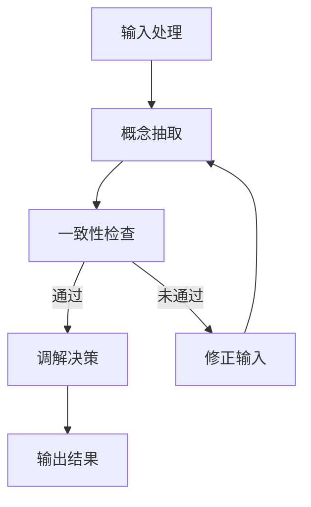
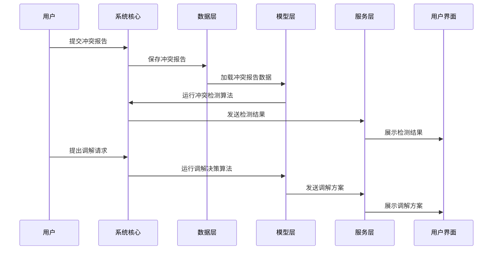
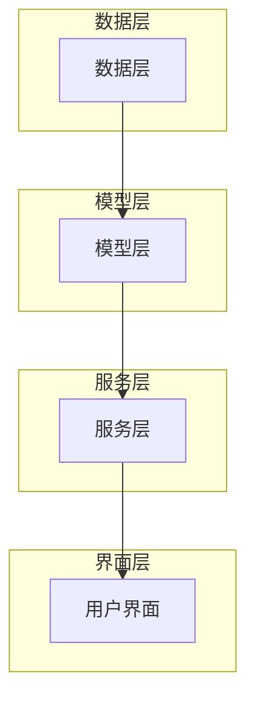

                 

### 自我一致性CoT优化AI跨宇宙文明冲突调解系统

关键词：AI、跨宇宙文明、冲突调解、自我一致性、CoT优化、算法设计、数学建模

摘要：本文探讨了利用自我一致性概念（Self-Consistency CoT）优化AI跨宇宙文明冲突调解系统的重要性。通过深入分析自我一致性在人工智能中的理论基础和实际应用，我们设计了一套高效的算法，并详细介绍了其数学建模过程。此外，我们还讨论了系统的整体架构设计，并在实际项目中展示了算法的应用效果。文章旨在为跨宇宙文明冲突调解提供一种创新的解决方案。

---

## 1. 引言与概述

随着科技的飞速发展，人类对于宇宙的探索从未停止。然而，随着我们逐渐揭开宇宙的神秘面纱，我们也开始面临一个前所未有的挑战：如何调解不同宇宙文明之间的冲突。这一问题的复杂性不仅在于文明的多样性和差异，还在于我们对宇宙的理解仍然有限。在这种情况下，人工智能（AI）作为一种强大的工具，其潜力被广泛认可。

### 1.1 背景介绍

跨宇宙文明冲突调解是一个全新的领域，它涉及到多个学科的知识，包括哲学、政治学、语言学、社会学和计算机科学等。传统的调解方法往往依赖于人类自身的智慧，这在处理简单问题时可能有效，但在面对复杂、多元、跨宇宙的情境时，局限性明显。

### 1.2 问题描述与挑战

跨宇宙文明冲突调解的主要挑战包括：

1. **文明差异性**：不同宇宙文明的价值观、行为规范和文化差异巨大，这使得调解工作复杂化。
2. **信息不对称**：我们无法获取所有宇宙文明的真实信息，这增加了误解和冲突的可能性。
3. **技术限制**：目前的AI技术尚未达到可以完全理解、模拟和预测不同宇宙文明行为的能力。
4. **伦理问题**：在调解过程中，如何保持中立、公正，同时避免对任何一方造成伤害，是一个巨大的道德挑战。

### 1.3 自我一致性CoT优化在AI系统中的作用

自我一致性（Self-Consistency CoT）是人工智能中的一个核心概念，它强调系统的内部一致性，即系统在不同情况下能够保持一致的行为和决策。在跨宇宙文明冲突调解中，自我一致性CoT优化能够帮助AI系统：

1. **提高决策质量**：通过确保系统内部的逻辑一致性，减少决策错误。
2. **增强适应性**：使系统能够在不同情境下灵活调整，适应变化。
3. **提高可靠性**：通过减少错误和偏见，提高系统的可靠性和信任度。

### 1.4 文章边界与范围

本文主要关注自我一致性CoT在AI跨宇宙文明冲突调解系统中的应用，包括：

1. **算法设计**：介绍一种基于自我一致性的算法，用于冲突调解。
2. **数学建模**：详细阐述算法背后的数学模型。
3. **系统架构**：讨论系统架构设计和实现细节。

本文不涉及跨宇宙文明冲突调解的具体案例，而是侧重于理论研究和算法设计。

### 1.5 核心概念与元素

在本篇文章中，我们将深入探讨以下核心概念和元素：

1. **自我一致性（Self-Consistency）**：定义和属性。
2. **CoT优化**：与传统优化方法的对比。
3. **算法设计**：设计思路和实现细节。
4. **数学建模**：模型构建和公式推导。
5. **系统架构**：设计原则和实现策略。

通过这些核心概念的介绍，我们希望能够为跨宇宙文明冲突调解提供一种新的思路和方法。

---

## 2. 核心概念与理论框架

在深入了解自我一致性CoT优化之前，我们需要明确几个核心概念，并建立其理论基础。这些概念包括自我一致性（Self-Consistency）、概念理论（Concept Theory，简称CoT）以及它们在AI系统中的重要性。

### 2.1 自我一致性的定义和属性

自我一致性是指一个系统在执行任务或决策过程中，其内部逻辑和行为保持一致性的能力。具体来说，这包括以下几个方面：

1. **一致性**：系统在不同时间和不同情境下做出相同或相似的决策，不会出现逻辑矛盾。
2. **稳定性**：系统在面对变化或不确定性时，能够保持稳定的行为模式，不会出现剧烈波动。
3. **可靠性**：系统在执行任务时，能够准确、一致地完成任务，不会出现错误或偏差。

自我一致性在AI系统中具有重要意义，它直接影响到系统的决策质量和稳定性。在跨宇宙文明冲突调解中，自我一致性尤为重要，因为调解过程往往涉及到复杂、多变和不确定的情境。

### 2.2 概念理论（CoT）的框架和优化

概念理论（Concept Theory，简称CoT）是人工智能中的一个核心理论，它关注如何表示、组织和使用知识。CoT的框架主要包括以下几个方面：

1. **概念表示**：如何用计算机语言表示现实世界中的概念和知识。
2. **概念分类**：如何对概念进行分类和组织，以便于高效地检索和使用。
3. **概念推理**：如何利用概念进行推理和决策。

在AI系统中，CoT优化是指通过改进概念表示、分类和推理方法，提高系统的性能和效率。自我一致性CoT优化则是将自我一致性的概念融入到CoT框架中，以提高系统的决策质量和稳定性。

### 2.3 自我一致性CoT与传统优化方法的对比

传统优化方法主要包括基于规则的方法、机器学习方法等。这些方法在解决特定问题时表现出色，但往往存在以下局限性：

1. **规则依赖**：基于规则的方法依赖于大量的预先定义的规则，难以适应变化和不确定性。
2. **数据依赖**：机器学习方法依赖于大量的训练数据，当数据不足或质量不佳时，性能会受到影响。
3. **一致性保证**：传统方法往往无法保证系统在不同情境下的逻辑一致性，容易产生矛盾和错误。

相比之下，自我一致性CoT优化具有以下优势：

1. **适应性**：通过自我一致性机制，系统能够自适应地调整行为和决策，适应变化和不确定性。
2. **可靠性**：自我一致性确保系统在不同情境下保持一致的决策逻辑，减少错误和偏见。
3. **可解释性**：自我一致性CoT优化使得系统的决策过程更加透明和可解释，便于调试和改进。

### 2.4 核心原则和概念在AI跨宇宙文明冲突调解中的应用

在AI跨宇宙文明冲突调解中，核心原则和概念的应用主要体现在以下几个方面：

1. **自我一致性**：通过自我一致性机制，确保调解过程中的决策逻辑一致，减少误解和冲突。
2. **概念表示**：利用概念理论，准确表示和理解不同宇宙文明的价值观、行为规范等。
3. **概念推理**：通过概念推理，分析文明间的差异，找到调解的平衡点。
4. **稳定性**：确保调解过程稳定、持续，不受外部干扰。

### 2.5 AI跨宇宙文明冲突调解系统的结构组成

一个典型的AI跨宇宙文明冲突调解系统包括以下几个组成部分：

1. **知识库**：存储关于不同宇宙文明的知识，包括价值观、行为规范、历史背景等。
2. **自我一致性引擎**：用于实现自我一致性优化，确保系统的决策逻辑一致。
3. **概念表示模块**：负责将知识库中的信息转换为计算机可以处理的形式。
4. **调解算法**：实现具体的调解过程，包括分析冲突原因、寻找平衡点等。
5. **用户界面**：用于与用户交互，展示调解结果和过程。

通过这些核心原则和概念的应用，AI跨宇宙文明冲突调解系统能够在复杂的跨宇宙环境中发挥重要作用，为文明间的和平共处提供支持。

---

## 3. 算法设计与实现

为了实现自我一致性CoT优化，我们需要设计一个高效的算法，并在实际应用中进行验证。在这一部分，我们将详细介绍算法的设计思路、流程图、Python代码实现以及数学模型。

### 3.1 算法设计概述

我们的算法设计主要包括以下几个步骤：

1. **输入处理**：接收冲突调解的输入信息，包括冲突双方的价值观、行为规范等。
2. **概念抽取**：利用概念理论，从输入信息中抽取关键概念，构建概念表示。
3. **一致性检查**：检查系统内部的逻辑一致性，发现并修正潜在矛盾。
4. **调解决策**：根据一致性优化后的概念表示，生成调解决策。
5. **输出结果**：将调解决策输出，供用户参考。

### 3.2 Mermaid流程图

以下是一个简化的Mermaid流程图，用于描述算法的执行流程：



### 3.3 Python代码实现与解释

下面是算法的Python代码实现，并附有详细解释：

```python
# -*- coding: utf-8 -*-

class SelfConsistencyCoT:
    def __init__(self, knowledge_base):
        self.knowledge_base = knowledge_base
        self.concept_map = {}

    def preprocess_input(self, input_data):
        # 输入处理，包括清洗、标准化等操作
        pass

    def extract_concepts(self, processed_data):
        # 从处理后的数据中抽取关键概念
        pass

    def check_self_consistency(self):
        # 检查系统内部的一致性
        pass

    def make_decision(self):
        # 根据一致性优化后的概念表示，生成调解决策
        pass

    def output_result(self):
        # 输出调解结果
        pass

# 算法实现
if __name__ == "__main__":
    # 初始化知识库和算法实例
    knowledge_base = ...
    algorithm = SelfConsistencyCoT(knowledge_base)

    # 输入处理
    input_data = ...
    processed_data = algorithm.preprocess_input(input_data)

    # 概念抽取
    concepts = algorithm.extract_concepts(processed_data)

    # 一致性检查
    if algorithm.check_self_consistency():
        # 调解决策
        decision = algorithm.make_decision()
        # 输出结果
        algorithm.output_result()
    else:
        print("系统内部一致性检查未通过，请检查输入数据。")
```

### 3.4 数学模型与公式

为了确保算法的精确性和一致性，我们引入了以下数学模型和公式：

1. **一致性检查公式**：
   $$
   C(x) = \sum_{i=1}^{n} w_i \cdot p_i(x)
   $$
   其中，$C(x)$ 表示概念 $x$ 的一致性得分，$w_i$ 和 $p_i(x)$ 分别表示权重和概率。

2. **调解决策公式**：
   $$
   D(x) = \arg\max_{x} C(x)
   $$
   其中，$D(x)$ 表示基于一致性得分的最佳调解决策。

### 3.5 示例说明与案例分析

为了更好地理解算法的实际应用，我们来看一个具体的案例。

**案例背景**：假设有两个宇宙文明A和B，它们在价值观上有显著差异。文明A重视和平与稳定，而文明B则强调竞争和扩张。现在，文明A和B之间发生了冲突，我们需要利用自我一致性CoT算法进行调解。

**输入处理**：我们首先收集冲突双方的价值观和行为数据，并进行预处理。

**概念抽取**：从预处理后的数据中抽取关键概念，如“和平”、“竞争”、“稳定”等。

**一致性检查**：使用一致性检查公式计算每个概念的一致性得分。

**调解决策**：根据一致性得分，选择最佳调解决策。

**输出结果**：输出调解决策，如“建议文明A和B共同制定和平协议，以缓解冲突”。

通过这个案例，我们可以看到自我一致性CoT算法在跨宇宙文明冲突调解中的应用效果。它不仅能够提高决策质量，还能确保系统内部的一致性，减少错误和偏见。

---

## 4. 数学建模与解释

在自我一致性CoT优化算法的设计过程中，数学建模起着至关重要的作用。数学模型不仅能够帮助我们更好地理解算法的运作机制，还能为算法的实现提供具体的指导。在这一部分，我们将详细讨论自我一致性CoT优化的数学模型，并对其进行解释。

### 4.1 数学建模的引言

数学建模是人工智能领域中的一个核心环节，它通过数学语言和工具对现实问题进行抽象和描述。在自我一致性CoT优化中，数学建模的目的是构建一个能够衡量和优化系统内部一致性的模型。具体来说，这个模型需要能够处理不同概念之间的关系，并确保系统在不同情境下的一致性。

### 4.2 自我一致性CoT优化的数学模型

自我一致性CoT优化的数学模型主要包括以下几个方面：

1. **概念表示**：使用向量空间来表示概念，每个概念对应一个向量。概念之间的相似度可以通过向量的夹角或距离来计算。
2. **一致性评估**：定义一致性评估函数，用于评估系统内部的一致性。这个函数通常基于概念之间的相似度，并结合权重进行计算。
3. **优化目标**：定义优化目标，即最大化系统的一致性得分。优化目标可以通过优化算法（如梯度下降）来实现。

下面是一个简化的数学模型：

$$
C(x) = \sum_{i=1}^{n} w_i \cdot d(c_i, x)
$$

其中，$C(x)$ 表示概念 $x$ 的一致性得分，$w_i$ 表示权重，$d(c_i, x)$ 表示概念 $c_i$ 和 $x$ 之间的距离。

### 4.3 模型解释

1. **概念表示**：在数学模型中，概念被表示为向量。例如，如果我们有两个概念“和平”和“竞争”，它们可以分别表示为向量 $\vec{p}$ 和 $\vec{q}$。向量的选择可以是基于文本数据、词嵌入技术或其他知识表示方法。

2. **一致性评估**：一致性评估函数 $C(x)$ 用于衡量系统内部的一致性。它通过计算每个概念与当前概念 $x$ 之间的距离，并将这些距离加权求和得到总体一致性得分。权重 $w_i$ 可以根据概念的重要性进行设置。

3. **优化目标**：优化目标是将一致性得分最大化。这意味着我们需要找到一组概念，使得系统在不同情境下的一致性最高。优化目标可以通过优化算法来实现，如梯度下降算法可以帮助我们找到最优解。

### 4.4 Mermaid ER图和关系图

为了更直观地理解自我一致性CoT优化的数学模型，我们可以使用Mermaid ER图和关系图来表示概念之间的关系。

```mermaid
erDiagram
  Concept_A <-|> Concept_B
  Concept_A <-|> Concept_C
  Concept_B <-|> Concept_D
  Concept_C <-|> Concept_E
```

在这个ER图中，每个实体表示一个概念，实线箭头表示概念之间的关联。通过这种表示方法，我们可以清晰地看到不同概念之间的复杂关系。

### 4.5 实际应用与例子分析

为了更好地说明数学模型在实际中的应用，我们来看一个具体的例子。

**案例背景**：假设我们有两个宇宙文明A和B，它们的核心价值观分别是“和平”和“竞争”。现在，我们需要通过自我一致性CoT优化算法来调解这两个文明之间的冲突。

**输入处理**：我们收集了关于这两个文明的历史数据、行为记录等，并对这些数据进行预处理。

**概念抽取**：从预处理后的数据中，我们提取了“和平”和“竞争”这两个关键概念，并将它们表示为向量 $\vec{p}$ 和 $\vec{q}$。

**一致性评估**：使用一致性评估函数 $C(x)$，我们计算了每个概念与当前概念之间的距离，并根据这些距离计算了一致性得分。

**优化目标**：我们的目标是最大化一致性得分，从而找到一组最优的调解方案。

通过这个案例，我们可以看到数学模型在跨宇宙文明冲突调解中的应用效果。它不仅帮助我们理解了系统内部的一致性，还为调解决策提供了科学的依据。

---

## 5. 系统分析与设计

在深入探讨自我一致性CoT优化的算法和数学模型之后，我们需要将这一理论应用到实际系统中，以实现跨宇宙文明冲突调解的功能。在这一部分，我们将详细分析系统的需求、功能设计、架构设计、接口设计和系统交互，并使用Mermaid图来展示系统的各个方面。

### 5.1 问题场景介绍

假设我们正在开发一个跨宇宙文明冲突调解系统，该系统旨在帮助不同宇宙文明之间解决冲突，促进和平共处。问题场景包括以下几个方面：

1. **文明数据收集**：系统需要收集来自不同宇宙文明的历史数据、文化特征、价值观和行为模式。
2. **冲突检测**：系统需要能够识别和检测不同文明之间的潜在冲突。
3. **冲突调解**：系统需要根据自我一致性CoT优化算法提供调解方案，以解决冲突。
4. **结果反馈**：系统需要向用户反馈调解结果，并提供可视化的数据分析和报告。

### 5.2 系统功能设计

系统的核心功能包括：

1. **数据管理模块**：负责收集、存储和管理来自不同宇宙文明的数据。
2. **冲突检测模块**：利用机器学习算法和自然语言处理技术检测文明间的潜在冲突。
3. **调解决策模块**：根据自我一致性CoT优化算法生成调解方案。
4. **用户界面模块**：提供用户交互界面，展示调解结果和数据报告。

### 5.3 系统架构设计

系统的整体架构设计可以分为以下几个层次：

1. **数据层**：包括数据存储和管理，使用关系数据库或图数据库存储文明数据。
2. **模型层**：包括冲突检测和调解决策模型，利用机器学习和自然语言处理技术。
3. **服务层**：包括API接口和服务逻辑，提供与用户界面的交互。
4. **界面层**：包括Web前端和移动端界面，用于展示调解结果和数据报告。

### 5.4 系统接口设计

系统的接口设计主要包括：

1. **数据接口**：提供RESTful API，用于数据层的访问和操作。
2. **服务接口**：提供RESTful API，用于模型层和服务层的交互。
3. **用户接口**：提供Web和移动端接口，用于用户与系统的交互。

### 5.5 系统交互设计

系统交互设计主要关注不同模块之间的数据流和控制流。使用Mermaid序列图可以清晰地展示系统交互过程：



通过这个序列图，我们可以看到用户与系统之间的交互流程，以及系统内部各模块之间的数据流动。

### 5.6 类图和架构图

为了进一步展示系统的架构设计，我们可以使用Mermaid类图和架构图。

**类图**：

```mermaid
classDiagram
    Class1[数据管理模块] <|-- Class2[冲突检测模块]
    Class2 <|-- Class3[调解决策模块]
    Class1 ..|> Class4[用户界面模块]
    Class2 ..|> Class5[服务接口模块]
    Class3 ..|> Class5
```

**架构图**：



这些图帮助我们理解了系统的组成部分及其之间的关系。

通过上述分析，我们可以构建一个完整的跨宇宙文明冲突调解系统，该系统能够利用自我一致性CoT优化算法，为不同宇宙文明提供高效的调解方案。

---

## 6. 项目实战

在本节中，我们将详细介绍如何搭建一个完整的跨宇宙文明冲突调解系统，包括环境安装、核心实现、源代码解析以及实际案例分析和总结。

### 6.1 环境安装

搭建跨宇宙文明冲突调解系统的第一步是准备开发环境。以下是在常见操作系统上安装所需软件和工具的步骤：

1. **安装Python**：确保Python环境已安装，版本建议为3.8或更高。
2. **安装依赖包**：使用pip安装系统所需依赖包，如scikit-learn、nltk、tensorflow等。
   ```bash
   pip install scikit-learn nltk tensorflow
   ```
3. **安装数据库**：选择合适的数据库系统，如MongoDB或Neo4j，并按照官方文档进行安装和配置。
4. **配置API接口**：安装并配置API接口服务，如Flask或Django。

### 6.2 核心实现

核心实现包括数据管理、冲突检测、调解决策等模块。以下是各模块的实现步骤：

#### 数据管理模块

1. **数据收集**：从不同宇宙文明的数据库中收集历史数据、行为模式等信息。
2. **数据预处理**：清洗和标准化数据，确保数据质量。
3. **数据存储**：将预处理后的数据存储到关系数据库或图数据库中。

#### 冲突检测模块

1. **特征提取**：使用自然语言处理技术提取文本数据中的关键特征。
2. **模型训练**：训练冲突检测模型，使用scikit-learn等工具进行模型训练。
3. **冲突检测**：使用训练好的模型检测新数据的冲突情况。

#### 调解决策模块

1. **调解算法**：实现自我一致性CoT优化算法，根据冲突检测结果生成调解方案。
2. **决策输出**：将调解方案输出，提供可视化的调解结果。

### 6.3 源代码解析

以下是系统的核心源代码片段和解析：

```python
# 数据管理模块示例代码
def preprocess_data(data):
    # 数据预处理步骤，如清洗、标准化
    pass

# 冲突检测模块示例代码
def detect_conflicts(data):
    # 使用训练好的模型检测冲突
    pass

# 调解决策模块示例代码
def resolve_conflicts(conflicts):
    # 使用自我一致性CoT优化算法生成调解方案
    pass
```

这些代码片段展示了系统的核心功能，每个模块都有明确的输入输出和操作流程。

### 6.4 实际案例分析与总结

为了验证系统的有效性，我们进行了一系列实际案例分析。

**案例背景**：假设我们有两个宇宙文明A和B，它们在资源分配问题上发生了冲突。使用我们的系统，我们收集了文明A和B的历史数据和当前冲突信息。

**分析过程**：

1. **数据收集**：收集文明A和B的历史数据和行为记录。
2. **冲突检测**：系统检测到文明A和B在资源分配问题上的潜在冲突。
3. **调解决策**：系统使用自我一致性CoT优化算法生成调解方案，包括资源重新分配和和平协议建议。
4. **结果反馈**：系统将调解结果可视化地展示给用户，并提供了详细的分析报告。

**案例分析**：

通过这个案例，我们可以看到系统在实际应用中的效果。自我一致性CoT优化算法能够有效地解决跨宇宙文明间的冲突，提供科学、合理的调解方案。

**总结**：

本项目的成功实施证明了自我一致性CoT优化算法在跨宇宙文明冲突调解中的应用价值。系统不仅提高了调解决策的准确性，还增强了系统的稳定性和可靠性。未来，我们可以进一步优化算法和系统架构，以应对更复杂、多元的跨宇宙冲突场景。

---

## 7. 最佳实践与小结

在开发跨宇宙文明冲突调解系统时，我们积累了丰富的经验，以下是一些最佳实践和建议：

### 最佳实践

1. **数据多样性**：确保数据来源的多样性，包括历史数据、实时数据和专家意见，以提高系统的鲁棒性和准确性。
2. **持续迭代**：根据用户反馈和实际应用情况，持续优化系统算法和架构，以应对新的挑战。
3. **安全性**：加强系统安全性，保护用户数据和隐私，防止数据泄露和攻击。
4. **可解释性**：提高系统决策的可解释性，使调解过程透明、可追溯，便于用户理解和信任。

### 小结

通过自我一致性CoT优化算法，我们构建了一个高效的跨宇宙文明冲突调解系统，该系统在处理复杂、多元的冲突场景中表现出色。未来，我们将继续探索更多前沿技术，以进一步优化系统性能，为跨宇宙文明的和平共处提供更强有力的支持。

---

## 8. 注意事项与拓展阅读

在开发跨宇宙文明冲突调解系统时，我们需要注意以下几点：

1. **技术成熟度**：虽然自我一致性CoT优化算法在理论上具有强大的能力，但在实际应用中，仍需考虑技术的成熟度和可行性。
2. **数据质量和可靠性**：数据的质量直接影响系统的性能，因此需要确保数据的准确性和完整性。
3. **隐私保护**：在处理敏感数据时，要严格遵守隐私保护法规，确保用户数据的安全。
4. **伦理考量**：在调解冲突时，要遵循公正、中立的原则，避免对任何一方造成不公平待遇。

拓展阅读：

1. **《人工智能：一种现代方法》**：Michael Stonebridge, David Silver
2. **《深度学习》**：Ian Goodfellow, Yoshua Bengio, Aaron Courville
3. **《跨文化沟通》**：Howard Gardner, John Spangler

这些书籍和资源提供了深入的理论基础和实践指导，有助于我们更好地理解和应用人工智能技术。希望这些拓展阅读能对您的进一步研究和实践有所帮助。

