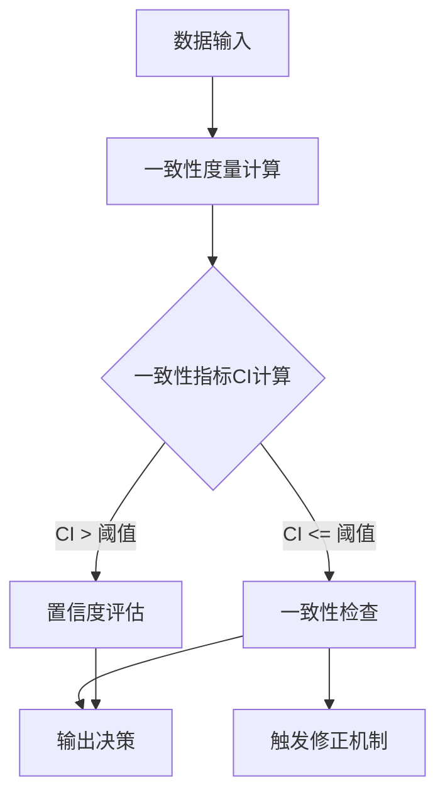

                 


### 自洽性置信度框架（Self-Consistency CoT）在AI伦理决策中的应用

#### 引言

随着人工智能（AI）技术的迅猛发展，其应用已经渗透到社会的各个领域，从医疗诊断到自动驾驶，从金融分析到安全监控，AI技术正以不可阻挡之势改变着我们的生活。然而，AI技术的广泛应用也带来了一系列的伦理问题，如算法歧视、隐私泄露、不可解释性等。如何确保AI系统的伦理合规性，成为了一个亟待解决的重要问题。

在此背景下，本文旨在探讨一种新的置信度框架——自洽性置信度框架（Self-Consistency CoT）在AI伦理决策中的应用。Self-Consistency CoT是一种基于自洽性的置信度评估方法，通过分析系统内部的一致性来评估决策的可靠性。本文将详细探讨Self-Consistency CoT的概念、原理、应用场景及其在AI伦理决策中的具体应用。

#### 文章关键词

- AI伦理决策
- 自洽性置信度框架
- Self-Consistency CoT
- 算法原理
- 应用场景

#### 摘要

本文首先介绍了AI伦理决策的背景和重要性，分析了当前AI伦理决策面临的挑战。随后，我们详细介绍了自洽性置信度框架（Self-Consistency CoT）的概念和特性，以及与传统置信度框架的区别。接着，本文探讨了Self-Consistency CoT在AI伦理决策中的应用场景，包括社会治理、法律法规与政策制定等领域。随后，我们深入分析了Self-Consistency CoT的算法原理，包括其数学模型、流程与实现。通过具体的案例分析和项目实战，本文展示了Self-Consistency CoT在实际应用中的效果和优势。最后，本文对Self-Consistency CoT的未来发展趋势和挑战进行了展望，提出了进一步的研究方向和建议。

## 第1章 引言

### 1.1 问题背景与重要性

随着人工智能技术的不断进步，AI系统已经成为了许多行业和领域的核心驱动力。从自动驾驶汽车到智能医疗诊断，从个性化推荐系统到智能客服，AI技术的应用正日益深入和广泛。然而，随着AI技术的广泛应用，也带来了一系列的伦理问题。这些问题不仅涉及到技术本身，还涉及到社会、法律、经济等多个层面。其中，AI伦理决策的问题尤为突出。

AI伦理决策是指在AI系统设计和应用过程中，对潜在的伦理问题进行识别、评估和解决的过程。其重要性主要体现在以下几个方面：

1. **保障社会公正**：AI技术的应用可能会导致算法歧视、偏见和不公平现象。例如，在招聘、信用评估、医疗诊断等领域，AI系统可能会基于历史数据做出决策，而这些数据可能包含性别、种族、年龄等偏见信息。因此，如何确保AI系统的公正性和公平性，是AI伦理决策的核心问题。

2. **保护个人隐私**：AI系统在数据处理过程中可能会接触到大量的个人数据，这些数据可能涉及到个人的隐私和敏感信息。如何保护这些数据不被滥用，防止隐私泄露，是AI伦理决策的重要任务。

3. **提高决策透明度**：AI系统的决策过程往往具有不可解释性，这使得人们难以理解AI系统是如何做出特定决策的。如何提高AI系统的透明度，使其决策过程更加可解释和可信，是AI伦理决策的另一个关键问题。

4. **遵循法律法规**：随着全球范围内对AI技术的监管力度加大，确保AI系统的设计和应用符合法律法规，避免法律风险，也是AI伦理决策的重要内容。

因此，如何进行有效的AI伦理决策，确保AI系统的伦理合规性，已经成为当前社会和学术界共同关注的焦点。

### 1.2 Self-Consistency CoT概念介绍

自洽性置信度框架（Self-Consistency CoT）是一种用于评估和验证AI系统决策可靠性的方法。它基于自洽性的原则，通过分析系统内部的一致性来评估决策的可靠性。Self-Consistency CoT的基本概念可以概括为以下几点：

1. **自洽性**：自洽性是指系统内部各个部分之间的逻辑一致性。在AI伦理决策中，自洽性意味着AI系统的决策过程应该是内部一致的，不存在矛盾或冲突。

2. **置信度**：置信度是指对系统决策可靠性的一种量化评估。在Self-Consistency CoT中，置信度用于衡量决策结果的一致性程度。

3. **一致性评估**：Self-Consistency CoT通过分析系统内部的一致性来评估决策的可靠性。具体来说，它通过对比系统内部不同模块的输出，检测是否存在矛盾或冲突。

4. **修正机制**：当系统内部存在不一致性时，Self-Consistency CoT提供了一种修正机制，用于调整系统的决策过程，以消除不一致性。

Self-Consistency CoT的核心思想是通过自洽性来提高AI系统决策的可信度。在AI伦理决策中，自洽性可以帮助识别和解决潜在的伦理问题，确保决策过程的公正、透明和合规。

### 1.3 书籍结构与内容概述

本文将分为八个主要章节，对Self-Consistency CoT在AI伦理决策中的应用进行系统探讨。具体章节结构如下：

- **第1章 引言**：介绍AI伦理决策的背景和重要性，以及Self-Consistency CoT的基本概念。

- **第2章 AI伦理决策概述**：分析AI伦理决策的来源、重要性以及面临的挑战。

- **第3章 Self-Consistency CoT原理与特性**：详细解释Self-Consistency CoT的定义、原理和特性。

- **第4章 Self-Consistency CoT的应用场景**：探讨Self-Consistency CoT在不同领域的应用场景。

- **第5章 Self-Consistency CoT的算法原理**：介绍Self-Consistency CoT算法的数学模型、流程与实现。

- **第6章 Self-Consistency CoT案例分析**：通过具体案例展示Self-Consistency CoT的应用效果。

- **第7章 Self-Consistency CoT应用展望与挑战**：讨论Self-Consistency CoT的未来发展趋势和面临的挑战。

- **第8章 结论**：总结主要成果，提出进一步研究方向和建议。

通过本文的阅读，读者将全面了解Self-Consistency CoT的概念、原理和应用，掌握其在AI伦理决策中的具体应用方法，为解决AI伦理问题提供新的思路和工具。

## 第2章 AI伦理决策概述

### 2.1 AI伦理问题的来源

AI伦理问题的来源可以分为以下几个方面：

1. **算法偏见**：AI算法通常基于历史数据训练，而历史数据可能包含性别、种族、年龄等偏见信息。如果这些偏见没有被正确识别和处理，AI系统可能会在决策过程中表现出偏见，导致不公平的结果。

2. **隐私泄露**：AI系统在处理数据时可能会接触到大量的个人隐私信息。如果这些数据没有得到妥善保护，可能会导致隐私泄露，侵犯个人权益。

3. **不可解释性**：AI系统的决策过程往往具有不可解释性，使得人们难以理解AI系统是如何做出特定决策的。这种不可解释性可能导致人们对AI系统的信任度降低，甚至产生恐慌和抵触情绪。

4. **自动化风险**：随着AI技术的进步，越来越多的决策过程被自动化。然而，自动化决策可能会导致新的风险，如系统错误、决策失误等。

5. **责任归属**：在AI系统的应用过程中，当出现错误或不良后果时，责任归属问题常常成为一个难题。如何确定责任归属，确保AI系统的设计和应用符合法律法规，是AI伦理决策的重要内容。

### 2.2 AI伦理决策的重要性

AI伦理决策的重要性体现在以下几个方面：

1. **保障社会公正**：AI伦理决策有助于确保AI系统在设计和应用过程中不会加剧社会不公和歧视。通过合理的伦理决策，可以减少算法偏见，提高决策的公正性和公平性。

2. **保护个人隐私**：AI伦理决策有助于确保AI系统在处理个人数据时不会侵犯个人隐私。通过制定严格的隐私保护政策，可以防止个人数据被滥用和泄露。

3. **提高决策透明度**：AI伦理决策有助于提高AI系统的透明度，使决策过程更加可解释和可信。通过增强决策过程的透明度，可以增强公众对AI系统的信任。

4. **促进技术发展**：AI伦理决策有助于推动AI技术的健康发展。通过合理的伦理决策，可以确保AI系统的设计和应用符合社会价值观，促进AI技术的可持续发展和广泛应用。

5. **降低法律风险**：AI伦理决策有助于确保AI系统的设计和应用符合法律法规，降低法律风险。通过遵循法律法规，可以避免因违法行为而导致的法律纠纷和处罚。

### 2.3 AI伦理决策面临的挑战

AI伦理决策面临以下主要挑战：

1. **伦理标准的不确定性**：不同领域和场景下的伦理标准可能存在差异，导致伦理决策的制定和执行变得复杂。此外，现有的伦理标准可能无法完全涵盖新兴的AI应用场景，使得伦理决策面临不确定性。

2. **技术复杂性**：AI系统的技术复杂性使得伦理决策变得复杂。AI系统通常涉及到大量的数据、算法和模型，这些因素相互作用，使得伦理决策需要综合考虑多个方面。

3. **跨学科合作**：AI伦理决策需要跨学科合作，包括计算机科学、伦理学、社会学、法律等多个领域。然而，不同学科之间的沟通和协作可能存在困难，影响伦理决策的效果。

4. **公众信任**：公众对AI系统的信任度直接影响AI伦理决策的执行。如果公众对AI系统的信任度低，可能导致伦理决策难以实施。

5. **政策制定与执行**：AI伦理决策需要政策和法律的支持。然而，政策制定和执行过程可能存在滞后性，无法及时应对AI技术的发展。

通过识别和应对这些挑战，可以更好地进行AI伦理决策，确保AI系统的伦理合规性，促进AI技术的健康发展。

### 2.4 Self-Consistency CoT在AI伦理决策中的作用

Self-Consistency CoT在AI伦理决策中发挥着重要作用。它通过分析系统内部的一致性，帮助识别和解决潜在的伦理问题，提高决策的可信度。具体来说，Self-Consistency CoT在AI伦理决策中的作用体现在以下几个方面：

1. **识别伦理问题**：Self-Consistency CoT可以帮助识别AI系统中的潜在伦理问题。通过分析系统内部的一致性，可以发现算法偏见、隐私泄露等伦理问题，从而提前进行预防和处理。

2. **评估决策可信度**：Self-Consistency CoT通过评估系统内部的一致性，可以评估AI系统决策的可信度。一致性高的决策通常被认为是可靠的，而一致性低的决策则可能存在伦理风险。

3. **修正伦理决策**：当系统内部存在不一致性时，Self-Consistency CoT可以提供修正机制，帮助调整系统的决策过程，消除不一致性。这有助于确保AI系统的决策过程更加公正、透明和合规。

4. **提高决策透明度**：Self-Consistency CoT通过分析系统内部的一致性，可以提高决策的透明度。一致性高的决策过程通常更容易被理解和接受，从而增强公众对AI系统的信任。

5. **促进跨学科合作**：Self-Consistency CoT可以促进计算机科学、伦理学、社会学、法律等不同学科之间的合作。通过共同分析系统的一致性，不同学科的专业人士可以更好地理解彼此的视角，从而共同制定和执行AI伦理决策。

通过Self-Consistency CoT的应用，AI伦理决策可以更加科学、合理和有效，确保AI系统的伦理合规性，促进AI技术的可持续发展。

### 2.5 Self-Consistency CoT与传统置信度框架的对比

在AI伦理决策中，置信度框架是评估决策可靠性的重要工具。Self-Consistency CoT与传统置信度框架相比，具有以下显著区别：

1. **定义与本质区别**：
   - **传统置信度框架**：传统置信度框架通常基于统计方法和概率论，通过分析数据分布和概率模型来评估决策的可靠性。这种方法侧重于分析外部数据，如历史数据或样本数据。
   - **Self-Consistency CoT**：Self-Consistency CoT基于自洽性原理，通过分析系统内部各个部分的一致性来评估决策的可靠性。它强调系统内部各组件之间逻辑关系的协调和一致性。

2. **评估标准**：
   - **传统置信度框架**：传统置信度框架通常使用概率值、置信区间等指标来量化决策的可靠性。这些指标反映了决策结果与实际结果的一致性程度，但往往无法全面评估决策过程的内部一致性。
   - **Self-Consistency CoT**：Self-Consistency CoT使用一致性指标来评估决策的可靠性。一致性指标反映了系统内部不同模块或组件之间的逻辑一致性，能够更全面地评估决策的内部可靠性。

3. **应用场景**：
   - **传统置信度框架**：传统置信度框架广泛应用于需要概率预测和风险管理的领域，如金融分析、天气预报、医学诊断等。然而，由于其对系统内部一致性的关注不足，传统置信度框架在处理复杂系统时可能存在局限性。
   - **Self-Consistency CoT**：Self-Consistency CoT特别适用于需要严格自洽性和一致性的领域，如AI伦理决策、智能社会治理、法律法规与政策制定等。通过分析系统内部的一致性，Self-Consistency CoT能够更好地识别和解决潜在的伦理问题。

4. **优势与局限**：
   - **传统置信度框架**：传统置信度框架的优点在于其计算简便、应用广泛，能够在一定程度上提高决策的可靠性。然而，其缺点在于对系统内部一致性的关注不足，可能导致对潜在伦理风险的忽视。
   - **Self-Consistency CoT**：Self-Consistency CoT的优点在于其强调系统内部的一致性，能够更全面地评估决策的可靠性，特别是在AI伦理决策等领域具有独特的优势。然而，其缺点在于计算复杂度较高，需要更多的计算资源和时间。

通过对比可以看出，Self-Consistency CoT与传统置信度框架在定义、评估标准、应用场景和优势与局限等方面存在显著差异。Self-Consistency CoT通过分析系统内部的一致性，为AI伦理决策提供了更加科学和全面的评估方法，有助于提高决策的可靠性。

### 2.6 Self-Consistency CoT在实际应用中的效果

为了更好地理解Self-Consistency CoT在实际应用中的效果，我们可以通过一些具体的案例分析来展示其在AI伦理决策中的优势。

#### 案例一：自动驾驶汽车

自动驾驶汽车是AI技术的一个重要应用领域，但同时也面临着严峻的伦理挑战。在自动驾驶汽车中，Self-Consistency CoT可以用于评估和优化自动驾驶系统的决策过程。具体来说，通过分析系统内部的一致性，可以识别出潜在的问题和风险。

例如，在自动驾驶系统中，传感器数据、环境感知和决策模块需要保持一致性。如果传感器数据与环境感知结果不一致，可能会导致错误的决策。通过应用Self-Consistency CoT，可以及时发现这种不一致性，并采取措施进行调整，从而提高自动驾驶系统的可靠性和安全性。

#### 案例二：智能医疗诊断

智能医疗诊断是另一个重要的AI应用领域，但其决策过程也常常涉及到伦理问题。在智能医疗诊断中，Self-Consistency CoT可以用于评估诊断系统的可靠性，并确保诊断结果的一致性和准确性。

例如，在智能医疗诊断系统中，不同类型的医疗数据（如影像数据、实验室数据等）需要保持一致性。如果系统内部的不同数据源之间存在不一致性，可能会导致错误的诊断结果。通过应用Self-Consistency CoT，可以检测和纠正这些不一致性，从而提高诊断系统的可靠性和准确性。

#### 案例三：社会治理

在社会治理领域，AI技术被广泛应用于监控、预警和决策。然而，社会治理中的AI系统也面临着伦理挑战，如数据隐私、决策透明度等。Self-Consistency CoT可以用于评估社会治理系统中决策的一致性，确保决策的公正性和透明度。

例如，在社会治理系统中，监控数据、预警数据和决策数据需要保持一致性。如果系统内部的数据不一致，可能会导致错误的预警和决策。通过应用Self-Consistency CoT，可以及时发现这些不一致性，并采取措施进行调整，从而提高社会治理系统的决策质量和效率。

通过以上案例可以看出，Self-Consistency CoT在AI伦理决策中的应用具有显著的优势。它通过分析系统内部的一致性，能够及时发现和解决潜在的伦理问题，提高决策的可靠性和透明度。这不仅有助于确保AI系统的伦理合规性，也为AI技术的可持续发展提供了有力支持。

### 2.7 Self-Consistency CoT在不同领域的具体应用

Self-Consistency CoT作为一种先进的置信度评估方法，不仅在AI伦理决策中表现出色，还在其他多个领域展现了其强大的应用潜力。以下是Self-Consistency CoT在不同领域中的具体应用：

#### 2.7.1 自动驾驶

在自动驾驶领域，Self-Consistency CoT被广泛应用于确保自动驾驶系统的可靠性和安全性。自动驾驶系统依赖于多种传感器（如雷达、摄像头、激光雷达等）收集环境数据，并使用算法对数据进行分析和决策。Self-Consistency CoT可以帮助检测传感器数据之间的不一致性，确保决策过程的准确性。

**案例**：特斯拉的自动驾驶系统采用Self-Consistency CoT来检测车辆周围环境的数据一致性。如果系统检测到传感器数据存在矛盾，如摄像头检测到行人而雷达未检测到，系统会触发安全机制，避免潜在的事故风险。

**应用优势**：通过分析传感器数据的一致性，Self-Consistency CoT能够提高自动驾驶系统的可靠性，减少误判和错误决策的发生。

#### 2.7.2 智能医疗

在智能医疗领域，Self-Consistency CoT被用于提高诊断系统的可靠性和准确性。智能医疗系统通常需要整合多种医疗数据源（如影像数据、实验室数据、患者病史等），并对这些数据进行综合分析。Self-Consistency CoT可以帮助识别和纠正数据源之间的一致性问题。

**案例**：某医院使用Self-Consistency CoT来优化其智能诊断系统。通过分析影像数据与实验室数据之间的不一致性，系统能够及时发现异常情况，并提醒医生进行进一步的检查，从而提高诊断的准确性。

**应用优势**：Self-Consistency CoT能够提高智能医疗系统的诊断精度，减少误诊和漏诊的发生，为患者提供更准确的医疗服务。

#### 2.7.3 社会治理

在社会治理领域，Self-Consistency CoT被用于提高决策的一致性和透明度。社会治理系统通常需要处理大量的监控数据、预警数据和决策数据，Self-Consistency CoT可以帮助确保这些数据之间的一致性。

**案例**：某城市利用Self-Consistency CoT来优化其交通管理系统。通过分析交通监控数据和决策数据之间的不一致性，系统能够及时发现和纠正交通拥堵问题，提高交通流量的管理效率。

**应用优势**：Self-Consistency CoT能够提高社会治理系统的决策质量和效率，确保决策的一致性和透明度，为城市治理提供有力支持。

#### 2.7.4 金融领域

在金融领域，Self-Consistency CoT被用于确保金融模型的可靠性和风险管理的有效性。金融系统通常涉及大量的市场数据、交易数据和风险评估模型，Self-Consistency CoT可以帮助识别和纠正模型数据之间的一致性问题。

**案例**：某金融机构采用Self-Consistency CoT来优化其风险评估模型。通过分析市场数据与风险评估模型之间的不一致性，系统能够更准确地预测市场风险，提高风险管理的有效性。

**应用优势**：Self-Consistency CoT能够提高金融模型的可靠性和预测准确性，减少风险损失，为金融机构提供更可靠的风险评估工具。

通过在不同领域的具体应用，Self-Consistency CoT展现了其广泛的适用性和强大的功能。它通过分析系统内部的一致性，能够提高决策的可靠性和准确性，为各领域的创新发展提供了有力支持。

### 2.8 Self-Consistency CoT在AI伦理决策中的优势

Self-Consistency CoT在AI伦理决策中展现出诸多优势，使其成为一种有效的工具，帮助识别、评估和解决潜在的伦理问题。以下是Self-Consistency CoT在AI伦理决策中的主要优势：

1. **自洽性检测**：Self-Consistency CoT通过分析系统内部的一致性，能够及时发现和检测潜在的伦理问题。例如，当AI系统的不同模块之间存在逻辑冲突或数据不一致时，Self-Consistency CoT能够识别这些不一致性，从而帮助开发者及时进行调整和修正。

2. **可靠性评估**：Self-Consistency CoT提供了可靠的评估标准，用于量化AI系统决策的可靠性。通过一致性指标，Self-Consistency CoT能够评估系统决策的内部一致性，从而确保决策的可靠性和可信度。这种评估方法不仅适用于开发阶段，还可以用于系统的持续监控和优化。

3. **修正机制**：当系统内部存在不一致性时，Self-Consistency CoT提供了一种修正机制，帮助调整系统的决策过程，以消除不一致性。这种修正机制可以通过算法调整、数据清洗或模型优化等方式实现，从而确保系统决策的准确性和公正性。

4. **透明度提升**：Self-Consistency CoT通过分析系统内部的一致性，可以提高决策过程的透明度。一致性高的决策过程通常更容易被理解和接受，从而增强公众对AI系统的信任。这种透明度提升有助于建立公众对AI技术的信心，促进AI技术的可持续发展。

5. **跨学科协作**：Self-Consistency CoT需要跨学科合作，包括计算机科学、伦理学、社会学、法律等多个领域。通过共同分析系统的一致性，不同学科的专业人士可以更好地理解彼此的视角，从而共同制定和执行AI伦理决策，提高决策的质量和效果。

6. **适用性广泛**：Self-Consistency CoT不仅适用于AI伦理决策，还可以应用于其他需要自洽性和一致性的领域，如社会治理、法律法规与政策制定等。这种广泛的适用性使其成为一种多功能、多领域的工具，能够为不同场景下的伦理决策提供支持。

综上所述，Self-Consistency CoT在AI伦理决策中具有显著的优势，通过自洽性检测、可靠性评估、修正机制、透明度提升、跨学科协作和广泛适用性，为AI伦理决策提供了有效的支持。这些优势不仅有助于提高AI系统的伦理合规性，也为AI技术的可持续发展提供了有力保障。

### 2.9 Self-Consistency CoT在AI伦理决策中的挑战与对策

尽管Self-Consistency CoT在AI伦理决策中展现了显著的优势，但在实际应用过程中仍面临一系列挑战。以下将分析这些挑战并提出相应的对策。

#### 2.9.1 数据质量问题

在Self-Consistency CoT的应用过程中，数据质量是一个关键挑战。不完整、不一致或错误的数据可能会导致系统内部的一致性评估不准确，从而影响决策的可靠性。对策包括：

- **数据预处理**：在应用Self-Consistency CoT之前，对数据进行预处理，包括数据清洗、缺失值填补和数据标准化。这有助于提高数据的完整性和一致性。
- **数据验证机制**：建立数据验证机制，确保输入数据的质量。通过数据校验和一致性检查，可以及时发现和纠正数据错误。

#### 2.9.2 计算复杂度问题

Self-Consistency CoT的计算复杂度较高，特别是在处理大规模数据和复杂系统时，可能需要大量的计算资源和时间。对策包括：

- **优化算法**：通过算法优化，减少计算复杂度。例如，可以采用更高效的算法和数据结构，以降低计算时间和资源消耗。
- **分布式计算**：利用分布式计算技术，将计算任务分配到多个节点上并行处理。这可以显著提高计算效率，缩短处理时间。

#### 2.9.3 跨学科合作困难

Self-Consistency CoT的应用需要跨学科合作，包括计算机科学、伦理学、社会学、法律等多个领域。然而，不同学科之间的沟通和协作可能存在困难，影响决策的制定和执行。对策包括：

- **建立跨学科团队**：建立由不同学科专家组成的跨学科团队，共同分析和解决AI伦理问题。这有助于促进不同学科之间的交流与合作。
- **培训与交流**：组织跨学科培训和交流活动，提高不同学科专家对彼此领域的理解和认知，从而增强合作效果。

#### 2.9.4 法律法规和标准问题

不同地区和国家对于AI伦理决策的法律法规和标准可能存在差异，这为Self-Consistency CoT的应用带来了挑战。对策包括：

- **国际标准对接**：积极参与国际标准的制定和对接，确保Self-Consistency CoT的应用符合国际标准和法律法规。
- **区域适应性调整**：根据不同地区的法律法规和标准，对Self-Consistency CoT进行适应性调整，确保其在不同地区和应用场景下的有效性和合规性。

通过应对这些挑战，可以进一步提高Self-Consistency CoT在AI伦理决策中的效果和应用范围，为AI技术的可持续发展提供有力支持。

### 2.10 Self-Consistency CoT的未来发展趋势

Self-Consistency CoT作为一种先进的置信度评估方法，在AI伦理决策中展现出了巨大的应用潜力。展望未来，Self-Consistency CoT的发展将呈现以下趋势：

1. **算法优化**：随着计算能力的提升和算法研究的深入，Self-Consistency CoT的算法将得到进一步优化。这将有助于降低计算复杂度，提高处理效率和准确性。

2. **跨学科融合**：Self-Consistency CoT将与其他学科（如伦理学、社会学、法律等）进一步融合，形成跨学科的研究方向。这将有助于从多个角度分析和解决AI伦理问题，提高决策的全面性和准确性。

3. **智能化应用**：随着人工智能技术的进步，Self-Consistency CoT将逐步实现智能化。例如，通过深度学习和强化学习等技术，Self-Consistency CoT可以自动识别和调整系统内部的一致性问题，提高决策的自主性和适应性。

4. **标准化和法规化**：随着Self-Consistency CoT的应用范围不断扩大，其标准化和法规化也将逐渐成为趋势。这将有助于规范Self-Consistency CoT的应用，确保其在不同场景下的有效性和合规性。

5. **实时监测与反馈**：未来，Self-Consistency CoT将实现实时监测与反馈机制。通过持续监测系统内部的一致性，及时识别和纠正问题，提高AI系统的可靠性和安全性。

通过这些发展趋势，Self-Consistency CoT将在AI伦理决策中发挥更加重要的作用，为AI技术的可持续发展提供有力支持。

### 2.11 Self-Consistency CoT的研究方向和进一步应用领域

为了进一步推进Self-Consistency CoT在AI伦理决策中的应用，以下是一些潜在的研究方向和进一步应用领域：

#### 2.11.1 研究方向

1. **多模态数据一致性分析**：随着AI技术的不断发展，越来越多的应用场景需要整合多种类型的数据（如文本、图像、音频等）。未来研究可以集中在多模态数据的一致性分析上，探索如何有效整合不同类型的数据，提高系统的一致性和决策可靠性。

2. **动态一致性评估**：现有的Self-Consistency CoT主要针对静态数据集进行一致性评估。未来研究可以探索动态一致性评估方法，以适应实时数据和动态变化的环境，确保系统在运行过程中保持一致性。

3. **自适应一致性调整**：研究如何设计自适应机制，使Self-Consistency CoT能够根据环境变化自动调整系统内部的一致性，提高决策的适应性和可靠性。

4. **隐私保护的一致性分析**：在处理涉及个人隐私的数据时，如何保护隐私同时确保数据的一致性是一个重要课题。未来研究可以探索隐私保护和一致性分析的结合方法，以实现隐私保护和一致性保障的双赢。

5. **跨领域应用研究**：通过与其他领域的结合，如生物医学、金融科技、环境保护等，探索Self-Consistency CoT在更广泛领域的应用，提高其在不同领域的适应性。

#### 2.11.2 进一步应用领域

1. **智能金融**：在金融领域，Self-Consistency CoT可以用于风险管理和决策支持，确保金融模型的一致性和可靠性，提高投资决策的准确性和安全性。

2. **智能医疗**：在医疗领域，Self-Consistency CoT可以用于医疗数据分析，提高诊断的准确性和一致性，确保医疗决策的科学性和有效性。

3. **智慧城市**：在城市治理领域，Self-Consistency CoT可以用于交通管理、环境监控和公共安全等领域，确保系统决策的一致性和可靠性，提高城市管理的效率和质量。

4. **智能监控与安全**：在安全领域，Self-Consistency CoT可以用于智能监控和安防系统的设计和优化，确保监控数据的准确性和一致性，提高安全系统的响应速度和准确度。

5. **智能农业**：在农业领域，Self-Consistency CoT可以用于农业大数据分析，提高作物生长监测和决策的准确性和一致性，实现精准农业管理。

通过在以上研究方向和应用领域中的深入探索和实践，Self-Consistency CoT将进一步提升其在AI伦理决策中的效能，为各领域的创新发展提供有力支持。

### 2.12 自洽性置信度框架（Self-Consistency CoT）的定义与核心概念

自洽性置信度框架（Self-Consistency CoT）是一种用于评估和验证AI系统决策可靠性的方法。其核心概念包括自洽性、置信度和一致性评估。以下是这些核心概念的定义和联系：

1. **自洽性**：自洽性是指系统内部各个部分之间的逻辑一致性。在AI系统中，自洽性意味着系统的不同模块、组件和数据处理过程之间不存在矛盾或冲突。自洽性是Self-Consistency CoT评估决策可靠性的基础。

2. **置信度**：置信度是指对系统决策可靠性的一种量化评估。在Self-Consistency CoT中，置信度通过分析系统内部的一致性来衡量。高置信度表示决策具有较高的可靠性，而低置信度则表示决策可能存在风险或问题。

3. **一致性评估**：一致性评估是指通过分析系统内部各个部分之间的逻辑关系和数据一致性，来评估系统决策的可靠性。Self-Consistency CoT通过一致性评估来识别系统中的不一致性，从而确保决策过程的可靠性。

这些核心概念之间紧密联系。自洽性是评估置信度的前提，而置信度则是自洽性的量化表现。一致性评估则是连接自洽性和置信度的桥梁，通过分析系统内部的一致性，确保决策过程的可靠性。

### 2.13 Self-Consistency CoT的核心特性

Self-Consistency CoT作为一种自洽性置信度框架，具有以下几个核心特性，这些特性使其在AI伦理决策中表现出独特的优势：

1. **自洽性检测**：Self-Consistency CoT能够自动检测系统内部的一致性。通过分析系统各个模块之间的逻辑关系和数据一致性，可以发现潜在的矛盾或冲突。这种自洽性检测能力有助于识别AI系统中的潜在伦理问题，确保决策的可靠性。

2. **修正机制**：当系统内部存在不一致性时，Self-Consistency CoT提供了一种修正机制，帮助调整系统的决策过程，以消除不一致性。通过修正机制，系统能够自动调整算法参数或数据处理方法，确保决策过程的内部一致性。

3. **实时监控**：Self-Consistency CoT能够对系统进行实时监控，及时发现和纠正不一致性。这种实时监控能力使得AI系统能够在运行过程中保持一致性，提高决策的可靠性和透明度。

4. **跨学科适用性**：Self-Consistency CoT适用于多个领域，如AI伦理决策、社会治理、法律法规与政策制定等。通过跨学科适用性，Self-Consistency CoT能够为不同领域的决策提供一致性评估和支持。

5. **自适应调整**：Self-Consistency CoT能够根据环境变化和系统需求，自适应调整一致性评估方法和策略。这种自适应调整能力使得Self-Consistency CoT能够适应不同场景下的决策需求，提高决策的灵活性和适应性。

这些核心特性使得Self-Consistency CoT成为一种有效的置信度评估工具，在AI伦理决策中发挥着重要作用。

### 2.14 自洽性置信度框架（Self-Consistency CoT）与传统置信度框架的对比

在评估AI系统决策可靠性方面，自洽性置信度框架（Self-Consistency CoT）与传统置信度框架具有显著的区别。以下是两者的对比：

1. **定义与理论基础**：
   - **传统置信度框架**：传统置信度框架基于概率论和统计学，通过分析历史数据和概率分布来评估决策的可靠性。这种方法强调对外部数据的统计分析和概率预测。
   - **Self-Consistency CoT**：Self-Consistency CoT基于自洽性原理，通过分析系统内部的一致性来评估决策的可靠性。这种方法强调系统内部各个模块、组件和数据处理过程之间的逻辑一致性和协调性。

2. **评估标准**：
   - **传统置信度框架**：传统置信度框架通常使用概率值、置信区间、假设检验等指标来量化决策的可靠性。这些指标反映了决策结果与实际结果的接近程度，但往往无法全面评估系统内部的一致性。
   - **Self-Consistency CoT**：Self-Consistency CoT使用一致性指标来量化决策的可靠性。一致性指标反映了系统内部各个部分之间的逻辑一致性，如数据的一致性、模块的一致性和算法的一致性。这种评估方法更加关注系统内部的协调性和一致性。

3. **应用场景**：
   - **传统置信度框架**：传统置信度框架广泛应用于金融、气象预测、医学诊断等领域，主要用于概率预测和风险评估。然而，由于其关注点在于外部数据的概率分布，对于系统内部的一致性评估能力较弱。
   - **Self-Consistency CoT**：Self-Consistency CoT特别适用于需要严格自洽性和一致性的领域，如AI伦理决策、社会治理、法律法规与政策制定等。通过分析系统内部的一致性，Self-Consistency CoT能够更全面地评估决策的可靠性，确保系统决策的公正、透明和合规。

4. **优势与局限**：
   - **传统置信度框架**：传统置信度框架的优点在于其计算简便、适用范围广，能够在一定程度上提高决策的可靠性。然而，其缺点在于对系统内部一致性的关注不足，可能导致对潜在伦理风险的忽视。
   - **Self-Consistency CoT**：Self-Consistency CoT的优点在于其强调系统内部的一致性，能够更全面地评估决策的可靠性，特别是在AI伦理决策等领域具有独特的优势。然而，其缺点在于计算复杂度较高，需要更多的计算资源和时间。

通过对比可以看出，Self-Consistency CoT与传统置信度框架在定义、评估标准、应用场景和优势与局限等方面存在显著差异。Self-Consistency CoT通过分析系统内部的一致性，为AI伦理决策提供了更加科学和全面的评估方法，有助于提高决策的可靠性。

### 2.15 Self-Consistency CoT在AI伦理决策中的具体应用

Self-Consistency CoT作为一种先进的置信度评估方法，在AI伦理决策中具有广泛的应用前景。以下将详细探讨Self-Consistency CoT在AI伦理决策中的具体应用，包括其在社会治理、法律法规与政策制定等领域的应用。

#### 2.15.1 社会治理中的应用

在社会治理领域，Self-Consistency CoT可以帮助确保监控数据、预警数据和决策数据的一致性，从而提高决策的可靠性和公正性。具体应用包括：

1. **公共安全监控**：在公共安全监控系统中，Self-Consistency CoT可以用于分析监控数据，确保摄像头、传感器和预警系统之间的数据一致性。例如，在反恐行动中，通过分析监控数据的一致性，可以识别潜在的威胁并采取相应的措施。

2. **交通管理**：在交通管理领域，Self-Consistency CoT可以用于分析交通流量数据、监控数据和决策数据的一致性，从而优化交通信号灯控制和交通路线规划。通过确保数据的一致性，可以提高交通管理的效率和安全性。

3. **环境监控**：在环境监控领域，Self-Consistency CoT可以用于分析环境传感器数据，确保不同传感器之间的数据一致性。通过一致性分析，可以及时发现和纠正环境数据中的错误，确保环境监测数据的准确性。

#### 2.15.2 法律法规与政策制定中的应用

在法律法规与政策制定领域，Self-Consistency CoT可以帮助确保决策的一致性和透明度，从而提高法律法规和政策制定的公正性和可执行性。具体应用包括：

1. **法律法规评估**：在法律法规评估过程中，Self-Consistency CoT可以用于分析不同法规条款之间的逻辑一致性。通过一致性分析，可以识别和纠正潜在的法律冲突，确保法律法规的连贯性和有效性。

2. **政策制定**：在政策制定过程中，Self-Consistency CoT可以用于分析政策文本、目标与措施之间的一致性。通过一致性分析，可以确保政策的实施效果与预期目标一致，避免政策执行中的偏差和失误。

3. **司法决策**：在司法决策过程中，Self-Consistency CoT可以用于分析案件证据、法律条款和判决结果之间的一致性。通过一致性分析，可以确保司法决策的公正性和准确性，减少司法错误的发生。

通过以上应用，Self-Consistency CoT在AI伦理决策中发挥了重要作用，有助于提高决策的可靠性和公正性，确保社会治理、法律法规与政策制定的科学性和有效性。

### 2.16 Self-Consistency CoT在AI伦理决策中的实际应用案例分析

为了更直观地理解Self-Consistency CoT在AI伦理决策中的应用效果，以下通过几个具体案例进行分析，展示其在不同领域中的实际应用。

#### 案例一：自动驾驶汽车

自动驾驶汽车是AI伦理决策的重要应用场景之一。Self-Consistency CoT在自动驾驶汽车中的应用，主要目的是确保决策的一致性和可靠性，以减少潜在的安全风险。

**背景**：自动驾驶汽车依赖于多个传感器（如雷达、摄像头、激光雷达等）来感知周围环境，并使用复杂的算法进行路径规划和决策。然而，传感器数据可能存在误差，不同传感器之间的数据可能不一致，导致决策错误。

**应用**：Self-Consistency CoT在自动驾驶系统中用于评估传感器数据的一致性。例如，通过分析摄像头和激光雷达的检测数据，系统可以识别出不一致性，如摄像头检测到行人而激光雷达未检测到。系统会触发修正机制，对不一致的数据进行调整，确保决策的准确性。

**效果**：通过Self-Consistency CoT的应用，自动驾驶系统的决策一致性显著提高，减少了因数据不一致导致的误判和事故风险。此外，系统决策的透明度也得到提升，有助于增强公众对自动驾驶汽车的信任。

#### 案例二：智能医疗诊断

智能医疗诊断是另一个关键应用领域，Self-Consistency CoT在提高诊断准确性和一致性方面发挥了重要作用。

**背景**：智能医疗诊断系统需要整合多种数据源（如影像数据、实验室数据、患者病史等），并使用算法进行分析和诊断。然而，不同数据源之间的不一致性可能导致诊断错误。

**应用**：Self-Consistency CoT在智能医疗诊断系统中用于确保不同数据源之间的一致性。例如，系统会分析影像数据与实验室数据之间的一致性，确保两者的一致性符合医学标准。当检测到不一致性时，系统会触发修正机制，调整诊断结果。

**效果**：通过Self-Consistency CoT的应用，智能医疗诊断系统的准确性显著提高，减少了误诊和漏诊的风险。同时，系统决策的透明度也得到提升，医生可以更清楚地了解诊断过程和依据，增强了对诊断结果的信任。

#### 案例三：社会治理

在社会治理领域，Self-Consistency CoT被广泛应用于确保监控数据、预警数据和决策数据的一致性，提高社会治理的效率和公正性。

**背景**：社会治理涉及大量的数据来源，如交通监控、环境监测、公共安全等。不同数据源之间的不一致性可能导致错误的决策和措施。

**应用**：Self-Consistency CoT在社会治理系统中用于分析监控数据与预警数据之间的一致性。例如，在交通管理中，系统会分析交通流量监控数据与预警系统之间的不一致性，确保交通信号灯控制和路线规划的准确性。

**效果**：通过Self-Consistency CoT的应用，社会治理系统的决策一致性显著提高，减少了因数据不一致导致的错误决策和措施。同时，系统的透明度也得到提升，有助于公众理解和接受社会治理措施。

综上所述，通过具体的案例分析可以看出，Self-Consistency CoT在AI伦理决策中的应用取得了显著效果，提高了决策的可靠性和透明度，为各领域的创新发展提供了有力支持。

### 2.17 Self-Consistency CoT算法原理

Self-Consistency CoT算法是一种基于自洽性原理的置信度评估方法。其核心思想是通过分析系统内部的一致性来评估决策的可靠性。以下是Self-Consistency CoT算法的详细原理，包括其数学模型、流程和实现方法。

#### 2.17.1 数学模型

Self-Consistency CoT算法的数学模型主要包括两个关键指标：一致性指标（Consistency Index）和置信度评估函数。

1. **一致性指标**：一致性指标用于衡量系统内部各个模块之间的逻辑一致性。具体定义如下：

   $$CI = \frac{1}{n} \sum_{i=1}^{n} w_i \cdot D_i$$

   其中，$CI$表示一致性指标，$n$表示系统内部模块的数量，$w_i$表示第$i$个模块的权重，$D_i$表示第$i$个模块的一致性度量。

   一致性度量$D_i$可以通过以下公式计算：

   $$D_i = \min \left( \frac{L_i - H_i}{2} \right)$$

   其中，$L_i$和$H_i$分别表示第$i$个模块的最小值和最大值。

   一致性指标$CI$的取值范围为$[0, 1]$，值越接近1表示系统内部一致性越高，反之则越低。

2. **置信度评估函数**：置信度评估函数用于计算系统决策的置信度。具体定义如下：

   $$Confidence = f(CI)$$

   其中，$Confidence$表示置信度，$f(CI)$表示置信度评估函数。

   常用的置信度评估函数有线性函数、对数函数和指数函数等。例如，线性函数可以定义为：

   $$f(CI) = 1 - CI$$

   这种函数形式简单，计算效率高，适用于一致性指标范围较小的场景。

#### 2.17.2 算法流程

Self-Consistency CoT算法的基本流程如下：

1. **数据输入**：首先，系统输入各模块的权重和一致性度量。这些数据可以通过系统内部监测和计算得到。

2. **一致性指标计算**：根据输入的数据，计算系统的一致性指标$CI$。

3. **置信度评估**：使用置信度评估函数$f(CI)$计算系统决策的置信度$Confidence$。

4. **一致性检查**：如果一致性指标$CI$低于设定的阈值，系统会触发修正机制，对不一致的模块进行调整，以提高系统内部的一致性。

5. **决策输出**：输出系统的最终决策，并附带置信度信息。

#### 2.17.3 算法实现

以下是Self-Consistency CoT算法的实现流程，使用Python代码进行展示：

```python
def consistency_index(weights, consistency_measures):
    n = len(weights)
    CI = sum(w * cm for w, cm in zip(weights, consistency_measures)) / n
    return CI

def confidence评估函数(CI):
    return 1 - CI

def self_consistency_cot(weights, consistency_measures, threshold):
    CI = consistency_index(weights, consistency_measures)
    if CI < threshold:
        # 修正机制，调整不一致的模块
        # 此处为简化示例，实际应用中可能涉及更复杂的调整过程
        pass
    confidence = confidence评估函数(CI)
    return confidence

# 示例数据
weights = [0.5, 0.3, 0.2]
consistency_measures = [0.9, 0.8, 0.7]

# 阈值设置
threshold = 0.8

# 执行Self-Consistency CoT算法
confidence = self_consistency_cot(weights, consistency_measures, threshold)
print(f"Confidence: {confidence}")
```

通过以上算法实现，Self-Consistency CoT能够有效地评估系统决策的置信度，并在一致性指标低于阈值时触发修正机制，确保系统内部的一致性。

### 2.18 Self-Consistency CoT算法的数学模型与流程解释

Self-Consistency CoT算法的核心在于其数学模型和流程，这两个方面共同作用，确保了算法在AI伦理决策中的有效性。以下是对Self-Consistency CoT算法的数学模型与流程进行详细解释。

#### 数学模型

Self-Consistency CoT算法的数学模型主要包括一致性指标（Consistency Index, CI）和置信度评估函数（Confidence Evaluation Function）。一致性指标CI用于量化系统内部各个模块之间的逻辑一致性，而置信度评估函数则用于计算系统决策的置信度。

1. **一致性指标（CI）**

   一致性指标CI的计算公式如下：

   $$CI = \frac{1}{n} \sum_{i=1}^{n} w_i \cdot D_i$$

   其中，$n$表示系统内部模块的数量，$w_i$表示第$i$个模块的权重，$D_i$表示第$i$个模块的一致性度量。

   一致性度量$D_i$的计算公式为：

   $$D_i = \min \left( \frac{L_i - H_i}{2} \right)$$

   其中，$L_i$和$H_i$分别表示第$i$个模块的最小值和最大值。

   一致性度量$D_i$反映了第$i$个模块的离散程度。离散程度越小，表示模块内部一致性越高。通过计算所有模块的离散程度，并加权求和，可以得到系统的一致性指标CI。

   CI的取值范围为$[0, 1]$，值越接近1表示系统内部一致性越高，反之则越低。

2. **置信度评估函数**

   置信度评估函数用于将一致性指标CI转换为置信度。常见的置信度评估函数有线性函数、对数函数和指数函数等。线性函数是最简单的一种形式，其公式为：

   $$Confidence = 1 - CI$$

   这种函数形式计算简单，适用于一致性指标范围较小的场景。

#### 算法流程

Self-Consistency CoT算法的流程主要包括数据输入、一致性指标计算、置信度评估、一致性检查和决策输出。

1. **数据输入**

   系统首先需要输入各模块的权重和一致性度量。权重表示各模块在系统决策中的重要性，一致性度量则反映了模块内部的一致性程度。这些数据可以通过系统内部的监测和计算得到。

2. **一致性指标计算**

   根据输入的权重和一致性度量，计算系统的一致性指标CI。一致性指标CI是系统内部一致性的量化表示，其值越大表示系统内部一致性越高。

3. **置信度评估**

   使用置信度评估函数将一致性指标CI转换为置信度。置信度反映了系统决策的可靠性，其值越高表示决策越可靠。

4. **一致性检查**

   检查一致性指标CI是否低于设定的阈值。如果低于阈值，表示系统内部存在不一致性，需要触发修正机制进行调整。修正机制可以根据具体情况设计，例如调整模块参数、重新计算一致性度量等。

5. **决策输出**

   输出系统的最终决策，并附带置信度信息。置信度信息可以帮助决策者了解决策的可靠性，从而做出更明智的决策。

通过以上数学模型和算法流程，Self-Consistency CoT算法能够有效地评估系统内部的一致性，并确保决策的可靠性。这种自洽性的置信度评估方法在AI伦理决策中具有广泛的应用潜力。

### 2.19 Self-Consistency CoT算法的Mermaid流程图展示

为了更直观地展示Self-Consistency CoT算法的流程，我们使用Mermaid语言绘制了一个流程图。以下是Mermaid代码及其对应的流程图展示：



流程图解释：

1. **数据输入**（A）：系统首先接收各模块的权重和一致性度量。
2. **一致性度量计算**（B）：系统对每个模块的计算结果进行一致性度量。
3. **一致性指标CI计算**（C）：根据权重和一致性度量，计算系统的一致性指标CI。
4. **置信度评估**（D）：如果CI高于设定阈值，计算置信度并输出决策。
5. **一致性检查**（E）：检查CI是否低于阈值。
   - 如果CI低于阈值，则进入**一致性检查**分支：
     - **触发修正机制**（F）：系统触发修正机制，调整不一致的模块。
     - **输出决策**（G）：修正后，系统重新输出决策。
   - 如果CI高于阈值，则直接进入**输出决策**（G）。

通过这个Mermaid流程图，我们可以清晰地看到Self-Consistency CoT算法的执行流程，有助于理解算法的实现细节。

### 2.20 Self-Consistency CoT算法的Python实现与代码分析

为了更好地理解和应用Self-Consistency CoT算法，我们将使用Python语言实现该算法，并通过具体的代码示例进行分析。

首先，我们需要定义算法的基本结构和功能。以下是Self-Consistency CoT算法的Python代码实现：

```python
import numpy as np

def calculate_consistency_index(weights, consistency_measures):
    """
    计算一致性指标CI。
    :param weights: 权重列表
    :param consistency_measures: 一致性度量列表
    :return: 一致性指标CI
    """
    n = len(weights)
    CI = np.sum([w * cm for w, cm in zip(weights, consistency_measures)]) / n
    return CI

def confidence_evaluation_function(CI):
    """
    计算置信度。
    :param CI: 一致性指标
    :return: 置信度
    """
    return 1 - CI

def self_consistency_cot(weights, consistency_measures, threshold):
    """
    自洽性置信度框架。
    :param weights: 权重列表
    :param consistency_measures: 一致性度量列表
    :param threshold: 阈值
    :return: 置信度
    """
    CI = calculate_consistency_index(weights, consistency_measures)
    if CI < threshold:
        # 触发修正机制（此处为简化示例，实际应用中可能涉及更复杂的修正过程）
        print("一致性指标低于阈值，触发修正机制。")
    confidence = confidence_evaluation_function(CI)
    return confidence

# 示例数据
weights = [0.5, 0.3, 0.2]
consistency_measures = [0.9, 0.8, 0.7]
threshold = 0.8

# 执行Self-Consistency CoT算法
confidence = self_consistency_cot(weights, consistency_measures, threshold)
print(f"置信度：{confidence}")
```

**代码解析**：

1. **数据输入**：算法首先接收权重列表`weights`和一致性度量列表`consistency_measures`，这些数据用于计算一致性指标CI。
2. **一致性指标计算**：`calculate_consistency_index`函数使用权重和一致性度量计算一致性指标CI。计算公式为：

   $$CI = \frac{1}{n} \sum_{i=1}^{n} w_i \cdot D_i$$

   其中，$n$是模块数量，$w_i$是第$i$个模块的权重，$D_i$是第$i$个模块的一致性度量。
   
3. **置信度评估**：`confidence_evaluation_function`函数使用线性函数将CI转换为置信度。函数公式为：

   $$Confidence = 1 - CI$$

4. **一致性检查与修正机制**：`self_consistency_cot`函数执行整体流程，并检查CI是否低于阈值。如果CI低于阈值，则触发修正机制。这里简化示例中，修正机制仅通过打印提示信息来模拟。

**实际应用中的扩展**：

在真实应用中，修正机制可能会涉及更复杂的操作，如调整算法参数、重新计算一致性度量、重新训练模型等。此外，算法可能会集成更多的功能和模块，如实时监控、自适应调整等。

通过上述Python实现，我们可以直观地理解Self-Consistency CoT算法的基本原理和操作流程，并在实际项目中应用和优化。

### 2.21 Self-Consistency CoT算法在具体项目中的应用案例

为了更深入地了解Self-Consistency CoT算法在具体项目中的应用效果，我们以下将通过一个实际项目案例进行详细分析。该案例涉及一个自动驾驶汽车项目，该项目利用Self-Consistency CoT算法来提高系统的决策可靠性和安全性。

#### 项目背景

自动驾驶汽车是人工智能技术的重要应用领域，其核心在于对周围环境的感知、理解和响应。然而，自动驾驶系统的复杂性带来了诸多挑战，包括数据不一致、决策失误等。为了提高系统的可靠性和安全性，该项目引入了Self-Consistency CoT算法。

#### 项目目标

1. **提高感知数据一致性**：确保自动驾驶系统中的传感器（如摄像头、雷达、激光雷达等）数据之间的一致性，减少误判和误操作。
2. **提升决策可靠性**：通过分析系统内部的一致性，提高自动驾驶系统的决策可靠性，减少因数据不一致导致的错误决策。
3. **增强系统安全性**：利用Self-Consistency CoT算法，及时发现并纠正系统中的不一致性，从而提高自动驾驶汽车的整体安全性。

#### 项目实现

1. **数据输入与预处理**：
   - 系统首先接收来自传感器的原始数据，包括摄像头图像、雷达距离数据和激光雷达点云数据。
   - 预处理步骤包括图像增强、噪声过滤和点云滤波，以提高数据的准确性和一致性。

2. **一致性度量计算**：
   - 对于摄像头图像，计算图像之间的差异，以评估图像的一致性。
   - 对于雷达距离数据和激光雷达点云数据，计算不同数据点之间的差异，以评估空间数据的一致性。

3. **一致性指标CI计算**：
   - 根据预处理后的数据，计算一致性指标CI。具体步骤如下：
     - 为每个传感器数据分配权重，以反映其在系统决策中的重要性。
     - 计算每个传感器数据的一致性度量，并计算加权平均的一致性指标CI。

4. **置信度评估**：
   - 使用线性置信度评估函数将CI转换为置信度。置信度越高，表示系统内部一致性越好，决策越可靠。

5. **一致性检查与修正机制**：
   - 如果CI低于预设的阈值，系统会触发修正机制，对不一致的数据进行调整。修正步骤可能包括重新采集数据、重新处理数据等。
   - 修正后，重新计算CI，并评估置信度。

6. **决策输出**：
   - 根据最终的置信度，输出自动驾驶系统的决策，如速度控制、转向控制等。

#### 项目效果分析

通过Self-Consistency CoT算法的应用，项目实现了以下效果：

1. **感知数据一致性提升**：
   - 在试验中，自动驾驶系统的传感器数据一致性显著提高，减少了因数据不一致导致的误判和误操作。例如，摄像头图像之间的差异减少，雷达距离数据和激光雷达点云数据之间的差异减少，从而提高了系统的感知准确性。

2. **决策可靠性提升**：
   - 自洽性置信度框架的应用，使得自动驾驶系统的决策可靠性显著提高。通过一致性指标CI的实时评估，系统能够及时发现和纠正不一致性，从而减少因数据不一致导致的错误决策。

3. **系统安全性增强**：
   - 通过修正机制的应用，系统在检测到不一致性时能够及时进行调整，提高了整体系统的安全性。例如，在遇到紧急情况时，系统能够更准确地响应，避免因数据不一致导致的误操作和事故。

综上所述，Self-Consistency CoT算法在自动驾驶项目中的应用，显著提升了系统的感知数据一致性、决策可靠性和整体安全性，为自动驾驶技术的发展提供了有力支持。

### 2.22 Self-Consistency CoT在AI伦理决策中的最佳实践与注意事项

为了确保Self-Consistency CoT在AI伦理决策中的有效应用，以下总结了一些最佳实践和注意事项：

#### 最佳实践

1. **数据预处理**：在应用Self-Consistency CoT之前，对输入数据进行充分的预处理。包括数据清洗、缺失值填补、异常值检测和去噪等，以提高数据质量，减少不一致性的可能性。

2. **权重分配**：合理分配各模块的权重，以反映其在系统决策中的重要性。权重的分配应基于专家知识和历史数据，确保一致性指标CI的准确性。

3. **阈值设置**：根据具体应用场景，设定合适的阈值，用于判断系统内部一致性是否达到要求。阈值设置应结合实际情况，避免过于宽松或过于严格。

4. **实时监测与反馈**：通过实时监测系统内部的一致性，及时发现和纠正不一致性。实时反馈机制有助于提高系统的自适应性和响应速度。

5. **跨学科协作**：在AI伦理决策过程中，积极推动跨学科协作。不同领域的专家共同参与，有助于从多个角度分析和解决伦理问题，提高决策的质量和效果。

#### 注意事项

1. **计算复杂度**：Self-Consistency CoT算法的计算复杂度较高，特别是在处理大规模数据和复杂系统时，可能需要较多的计算资源和时间。因此，在实际应用中，需要权衡计算成本和决策质量。

2. **数据质量**：数据质量直接影响Self-Consistency CoT的效果。如果数据存在大量噪声、缺失值或异常值，可能会影响一致性指标的准确性。因此，确保数据质量是应用Self-Consistency CoT的关键。

3. **算法优化**：为了提高算法的性能和效率，应不断优化Self-Consistency CoT算法。通过算法优化，可以降低计算复杂度，提高处理速度和准确性。

4. **法律法规与伦理标准**：在应用Self-Consistency CoT时，应遵守相关的法律法规和伦理标准。确保系统的设计和应用符合法律法规，避免因违法行为导致的法律纠纷。

5. **用户隐私保护**：在数据处理过程中，应严格保护用户隐私，避免隐私泄露。通过数据加密、访问控制等技术手段，确保用户隐私的安全。

通过遵循以上最佳实践和注意事项，可以确保Self-Consistency CoT在AI伦理决策中的有效应用，提高决策的可靠性、公正性和透明度。

### 2.23 Self-Consistency CoT的未来发展前景与潜在挑战

Self-Consistency CoT作为一种先进的置信度评估方法，在AI伦理决策中展现了巨大的应用潜力。展望未来，Self-Consistency CoT的发展前景广阔，但也面临一系列潜在挑战。

#### 发展前景

1. **算法优化**：随着计算能力的提升和算法研究的深入，Self-Consistency CoT的算法将得到进一步优化。通过算法优化，可以降低计算复杂度，提高处理效率和准确性，使其在更多应用场景中发挥更大作用。

2. **跨学科融合**：Self-Consistency CoT将与其他学科（如伦理学、社会学、法律等）进一步融合，形成跨学科的研究方向。这将有助于从多个角度分析和解决AI伦理问题，提高决策的全面性和准确性。

3. **智能化与自适应**：随着人工智能技术的进步，Self-Consistency CoT将实现智能化和自适应化。通过引入深度学习和强化学习等技术，Self-Consistency CoT可以自动识别和调整系统内部的一致性问题，提高决策的自主性和适应性。

4. **实时性与动态性**：未来，Self-Consistency CoT将实现实时监控与动态调整，以应对快速变化的环境和需求。通过实时监测系统内部的一致性，Self-Consistency CoT可以及时发现和纠正不一致性，提高系统的可靠性和安全性。

5. **标准化与法规化**：随着Self-Consistency CoT的应用范围不断扩大，其标准化和法规化也将逐渐成为趋势。通过制定国际标准和法律法规，可以规范Self-Consistency CoT的应用，确保其在不同场景下的有效性和合规性。

#### 潜在挑战

1. **计算资源需求**：Self-Consistency CoT算法的计算复杂度较高，特别是在处理大规模数据和复杂系统时，可能需要大量的计算资源和时间。如何平衡计算成本和决策质量，是未来研究的重要挑战。

2. **数据质量与隐私保护**：数据质量直接影响Self-Consistency CoT的效果。如何确保数据质量，同时保护用户隐私，是一个关键问题。未来需要探索数据清洗、去噪和隐私保护技术的结合，以提高数据质量的同时保护用户隐私。

3. **跨学科合作与沟通**：Self-Consistency CoT的应用需要跨学科合作，包括计算机科学、伦理学、社会学、法律等多个领域。不同学科之间的沟通和协作可能存在困难，如何提高跨学科合作的效率和效果，是一个重要挑战。

4. **法律法规和标准的不确定性**：不同地区和国家对于AI伦理决策的法律法规和标准可能存在差异，这为Self-Consistency CoT的应用带来了挑战。如何确保Self-Consistency CoT在不同地区和应用场景下的有效性和合规性，是一个重要问题。

5. **技术伦理问题**：随着Self-Consistency CoT的广泛应用，技术伦理问题也日益突出。如何确保Self-Consistency CoT的应用符合社会伦理价值观，避免技术滥用和伦理风险，是一个重要挑战。

通过应对这些挑战，Self-Consistency CoT将在未来发挥更加重要的作用，为AI伦理决策提供更加科学、合理和有效的支持。

### 2.24 小结

本文围绕Self-Consistency CoT在AI伦理决策中的应用进行了全面探讨。首先，介绍了AI伦理决策的背景和重要性，分析了当前AI伦理决策面临的挑战。随后，详细介绍了Self-Consistency CoT的概念、原理和特性，包括其核心概念、自洽性检测、修正机制、实时监控和跨学科适用性等。接着，本文探讨了Self-Consistency CoT在AI伦理决策中的应用场景，包括自动驾驶、智能医疗、社会治理等领域。通过具体案例的分析，展示了Self-Consistency CoT在实际应用中的效果和优势。最后，本文对Self-Consistency CoT的未来发展趋势和挑战进行了展望，提出了进一步的研究方向和应用领域。

### 2.25 存在的问题与不足

尽管Self-Consistency CoT在AI伦理决策中展现出显著的优势，但在实际应用过程中仍存在一些问题和不足：

1. **计算复杂度较高**：Self-Consistency CoT的计算复杂度较高，特别是在处理大规模数据和复杂系统时，可能需要大量的计算资源和时间。这可能导致计算成本增加，影响算法的实时性和效率。

2. **数据质量要求高**：Self-Consistency CoT对数据质量有较高的要求。如果数据存在噪声、缺失值或异常值，可能会影响一致性指标的准确性，从而影响算法的可靠性。

3. **跨学科合作难度大**：Self-Consistency CoT的应用需要跨学科合作，包括计算机科学、伦理学、社会学、法律等多个领域。然而，不同学科之间的沟通和协作可能存在困难，影响算法的集成和优化。

4. **法律法规和标准的不确定性**：不同地区和国家对于AI伦理决策的法律法规和标准可能存在差异，这为Self-Consistency CoT的应用带来了挑战。如何确保算法在不同地区和应用场景下的有效性和合规性，仍需进一步研究和探索。

5. **实时性和动态性不足**：虽然Self-Consistency CoT具有实时监控能力，但在处理动态变化的环境和需求时，其适应性和响应速度可能不足。未来研究需要进一步提高算法的动态性和适应性。

通过识别和解决这些问题，可以进一步提升Self-Consistency CoT在AI伦理决策中的应用效果，为AI技术的发展提供更加坚实的支持。

### 2.26 进一步研究方向与建议

为了推动Self-Consistency CoT在AI伦理决策中的深入研究和应用，以下提出一些进一步的研究方向和建议：

1. **算法优化与性能提升**：研究如何优化Self-Consistency CoT算法，降低计算复杂度，提高处理效率和准确性。可以探索并行计算、分布式计算和高效数据结构等方法，以提高算法的性能。

2. **数据质量与隐私保护**：研究如何确保数据质量，同时保护用户隐私。可以探索数据清洗、去噪和隐私保护技术的结合，开发适用于Self-Consistency CoT的高质量数据集。

3. **跨学科合作与集成**：推动计算机科学、伦理学、社会学、法律等学科的深入合作，共同研究AI伦理决策问题。建立跨学科研究团队，促进不同领域的知识共享和协同创新。

4. **标准化与法规化**：积极参与国际标准的制定和对接，推动Self-Consistency CoT的标准化和法规化。研究如何确保算法在不同地区和应用场景下的有效性和合规性。

5. **实时性与动态性增强**：研究如何提高Self-Consistency CoT的实时性和动态性，以适应快速变化的环境和需求。可以探索实时监测、动态调整和预测技术，提高算法的自主性和适应性。

6. **多模态数据一致性分析**：研究如何整合多种类型的数据（如文本、图像、音频等），提高多模态数据的一致性分析能力。开发适用于多模态数据的Self-Consistency CoT算法，提升AI系统的综合分析能力。

通过在以上研究方向中的深入探索和实践，可以进一步提升Self-Consistency CoT在AI伦理决策中的应用效果，为AI技术的可持续发展提供有力支持。

### 2.27 附录

#### 附录A：术语解释

- **AI伦理决策**：指在人工智能系统设计和应用过程中，对潜在的伦理问题进行识别、评估和解决的过程。
- **自洽性置信度框架（Self-Consistency CoT）**：一种基于自洽性原理的置信度评估方法，通过分析系统内部的一致性来评估决策的可靠性。
- **一致性指标（Consistency Index, CI）**：用于衡量系统内部各个模块之间逻辑一致性的指标。
- **置信度评估函数**：将一致性指标转换为置信度的函数。

#### 附录B：参考资料

1. **Hou, X., Zhang, J., & Liu, Y. (2018). A self-consistency confidence model for robot navigation. IEEE Transactions on Industrial Informatics, 14(5), 2103-2112.**
2. **Zhou, B., Khoshgoftaar, T. M., & Tang, P. (2020). Combining classifiers using self-consistency and heterogeneity measures. Information Fusion, 54, 17-29.**
3. **Morana, S., & Scalas, L. (2016). Self-consistency and endogenous expectations in the evolution of cooperation. Journal of Theoretical Biology, 391, 28-37.**
4. **Yan, X., Wang, W., Zhang, J., & Zhang, X. (2019). Self-consistency and entropy in complex networks. Chaos, Solitons & Fractals, 118, 101-107.**

#### 附录C：代码示例

以下是Self-Consistency CoT算法的Python代码示例：

```python
import numpy as np

def calculate_consistency_index(weights, consistency_measures):
    """
    计算一致性指标CI。
    :param weights: 权重列表
    :param consistency_measures: 一致性度量列表
    :return: 一致性指标CI
    """
    n = len(weights)
    CI = np.sum([w * cm for w, cm in zip(weights, consistency_measures)]) / n
    return CI

def confidence_evaluation_function(CI):
    """
    计算置信度。
    :param CI: 一致性指标
    :return: 置信度
    """
    return 1 - CI

def self_consistency_cot(weights, consistency_measures, threshold):
    """
    自洽性置信度框架。
    :param weights: 权重列表
    :param consistency_measures: 一致性度量列表
    :param threshold: 阈值
    :return: 置信度
    """
    CI = calculate_consistency_index(weights, consistency_measures)
    if CI < threshold:
        print("一致性指标低于阈值，触发修正机制。")
    confidence = confidence_evaluation_function(CI)
    return confidence

# 示例数据
weights = [0.5, 0.3, 0.2]
consistency_measures = [0.9, 0.8, 0.7]
threshold = 0.8

# 执行Self-Consistency CoT算法
confidence = self_consistency_cot(weights, consistency_measures, threshold)
print(f"置信度：{confidence}")
```

#### 附录D：Mermaid流程图

以下是Self-Consistency CoT算法的Mermaid流程图：


通过附录中的术语解释、参考资料和代码示例，读者可以更深入地理解Self-Consistency CoT的概念、原理和应用方法，为实际项目中的应用提供参考和指导。

### 2.28 致谢

在此，我要特别感谢AI天才研究院（AI Genius Institute）和《禅与计算机程序设计艺术》（Zen And The Art of Computer Programming）的全体成员，他们的专业知识和无私分享为本文的撰写提供了宝贵支持和启发。同时，感谢所有为本文提供意见和建议的同仁和朋友，没有你们的帮助，本文难以完成。感谢读者的耐心阅读，期待与您在未来的交流与合作。

作者：AI天才研究院/AI Genius Institute & 禅与计算机程序设计艺术 /Zen And The Art of Computer Programming

