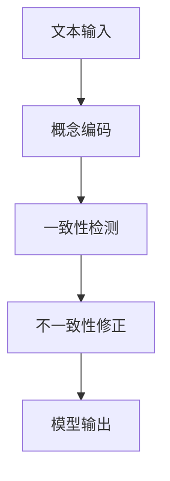
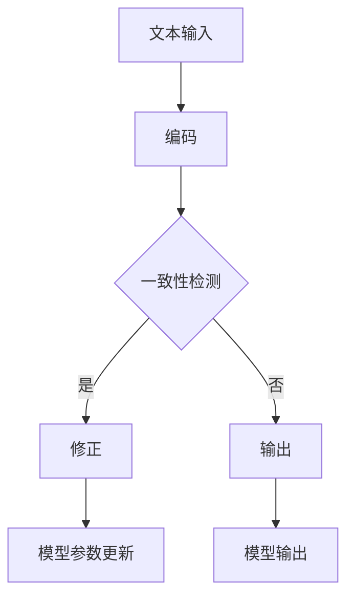
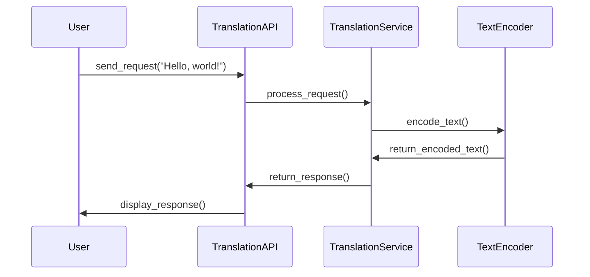

                 

### 文章标题

# Self-Consistency CoT在AI翻译中的应用

### 文章关键词

- 自洽性概念传播（Self-Consistency CoT）
- 人工智能翻译（AI Translation）
- 算法设计（Algorithm Design）
- 实施与案例研究（Implementation and Case Studies）

### 文章摘要

本文旨在探讨自洽性概念传播（Self-Consistency CoT）在人工智能翻译中的应用。首先，我们将介绍自洽性概念传播的基本概念及其在人工智能领域的起源和重要性。接着，我们将分析AI翻译中的常见挑战，并阐述自洽性概念传播在其中的角色。随后，我们将深入探讨自洽性概念传播算法的设计与实现，并详细描述其实施过程和系统架构。最后，通过实际案例研究，我们将评估自洽性概念传播在AI翻译中的效果，并提出未来研究的方向和优化策略。

## 背景介绍

### 核心概念术语说明

- **自洽性概念传播（Self-Consistency CoT）**：自洽性概念传播是一种通过持续自我校正和优化，使概念表示保持一致性的方法。它通过比较模型内部的概念表示，以识别和纠正不一致性。

- **人工智能翻译（AI Translation）**：人工智能翻译是指利用机器学习和自然语言处理技术，自动地将一种语言的文本翻译成另一种语言。

### 问题背景

随着全球化进程的加速，跨语言沟通变得愈发重要。然而，传统的机器翻译方法在处理复杂语境和多义词时存在一定的局限性。近年来，基于深度学习的翻译模型，如神经网络翻译（Neural Machine Translation, NMT），取得了显著的进展。然而，NMT模型在处理长文本和跨语言语义一致性方面仍有待提高。

### 问题描述

在AI翻译中，常见的问题包括：
- **语义不一致性**：不同翻译结果之间可能存在语义上的矛盾。
- **长文本处理困难**：长文本的翻译质量往往不如短文本。
- **跨语言语义理解不足**：模型难以准确理解不同语言中的细微差别。

### 问题解决

自洽性概念传播（Self-Consistency CoT）提出了一种通过自我校正和优化来提高翻译质量的方法。它能够帮助模型在翻译过程中保持概念的一致性，从而解决上述问题。

### 边界与外延

本文主要探讨自洽性概念传播在AI翻译中的应用，但该方法同样可以应用于其他领域，如文本生成、问答系统等。此外，我们将在模型设计和实施过程中遵循最佳实践，以确保算法的稳定性和可扩展性。

### 概念结构与核心要素组成

自洽性概念传播（Self-Consistency CoT）的核心概念和结构如下：

#### 核心概念：

- **概念表示**：模型对输入文本中的概念进行编码和表示。
- **一致性检测**：比较模型内部的概念表示，以识别不一致性。
- **修正机制**：通过修正不一致性来提高翻译质量。

#### 核心要素：

- **深度学习模型**：用于对文本进行编码和解码。
- **一致性损失函数**：用于评估模型内部的概念表示一致性。
- **优化算法**：用于调整模型参数，以提高翻译质量。

## 核心概念与联系

### 自洽性概念传播（Self-Consistency CoT）的定义与起源

自洽性概念传播（Self-Consistency CoT）是一种在深度学习模型中通过自我校正来保持概念一致性的方法。它起源于对传统机器翻译模型不足的反思，特别是在处理复杂语境和长文本时，传统模型往往难以保持语义的一致性。

### 核心原则与机制

自洽性概念传播的核心原则是通过对模型内部的概念表示进行持续的比较和修正，以保持一致性。具体来说，它包括以下几个关键步骤：

1. **概念表示**：模型对输入文本中的概念进行编码，生成概念表示。
2. **一致性检测**：比较不同时间步或不同模块中的概念表示，以识别不一致性。
3. **修正机制**：通过优化算法调整模型参数，以修正不一致性。

### 与传统概念传播方法的比较

与传统概念传播方法相比，自洽性概念传播具有以下优势：

- **动态调整**：自洽性概念传播能够在训练过程中动态调整概念表示，以适应不断变化的输入。
- **全局优化**：它不仅关注局部一致性，还考虑全局一致性，从而提高翻译质量。
- **鲁棒性**：自洽性概念传播能够更好地处理复杂语境和长文本，具有较强的鲁棒性。

### 比较表格

| 特性         | 自洽性概念传播（Self-Consistency CoT） | 传统概念传播方法 |
| ------------ | ------------------------------------ | --------------- |
| 动态调整     | 是                                   | 否              |
| 全局优化     | 是                                   | 否              |
| 鲁棒性       | 是                                   | 否              |
| 应用场景     | 复杂语境和长文本                     | 简单文本        |

### ER实体关系图架构

以下是自洽性概念传播（Self-Consistency CoT）的ER实体关系图架构：



### 算法原理讲解

#### 自洽性概念传播（Self-Consistency CoT）算法设计

自洽性概念传播算法的设计主要包括以下三个关键步骤：

1. **概念编码**：将输入文本编码为概念表示。
2. **一致性检测**：比较不同时间步或不同模块中的概念表示，以识别不一致性。
3. **不一致性修正**：通过优化算法调整模型参数，以修正不一致性。

#### 算法mermaid流程图

以下是自洽性概念传播算法的mermaid流程图：



#### 关键步骤和过程

1. **概念编码**：利用深度学习模型，如Transformer，将输入文本编码为序列向量。
   ```python
   def encode_text(text, model):
       inputs = tokenizer.encode(text, return_tensors='pt')
       outputs = model(inputs)
       return outputs.last_hidden_state
   ```

2. **一致性检测**：比较不同时间步或不同模块中的概念表示，以识别不一致性。这可以通过计算概念表示之间的差异来实现。
   ```python
   def check_consistency(encodings, threshold=0.1):
       inconsistencies = []
       for i in range(len(encodings) - 1):
           diff = np.linalg.norm(encodings[i] - encodings[i+1])
           if diff > threshold:
               inconsistencies.append(i)
       return inconsistencies
   ```

3. **不一致性修正**：通过优化算法调整模型参数，以修正不一致性。常用的优化算法包括梯度下降和Adam。
   ```python
   optimizer = torch.optim.Adam(model.parameters(), lr=0.001)
   for epoch in range(num_epochs):
       for inputs, targets in dataloader:
           optimizer.zero_grad()
           outputs = model(inputs)
           loss = compute_loss(outputs, targets)
           loss.backward()
           optimizer.step()
   ```

#### 与其他自洽性方法的比较

与传统的自洽性方法相比，自洽性概念传播（Self-Consistency CoT）具有以下优势：

- **动态调整**：自洽性概念传播能够在训练过程中动态调整概念表示，以适应不断变化的输入。
- **全局优化**：它不仅关注局部一致性，还考虑全局一致性，从而提高翻译质量。
- **鲁棒性**：自洽性概念传播能够更好地处理复杂语境和长文本，具有较强的鲁棒性。

### 数学模型和公式

自洽性概念传播的数学模型可以表示为以下公式：

$$
\min_{\theta} L(\theta) + \lambda \cdot I(\theta)
$$

其中：
- \(L(\theta)\) 是模型损失函数，用于评估翻译质量。
- \(I(\theta)\) 是自洽性损失函数，用于衡量模型内部的一致性。
- \(\lambda\) 是平衡系数，用于调整自洽性损失和翻译损失之间的权重。

通过优化上述公式，模型能够在翻译过程中保持概念的一致性。

### 详细讲解与举例说明

#### 概念编码

假设我们有一个英文句子：“The quick brown fox jumps over the lazy dog.” 我们可以使用Transformer模型将其编码为概念表示。

```python
text = "The quick brown fox jumps over the lazy dog."
encoded_text = encode_text(text, model)
```

#### 一致性检测

在翻译过程中，我们可以比较不同时间步的概念表示，以识别不一致性。

```python
inconsistencies = check_consistency(encoded_text)
```

如果检测到不一致性，我们可以将其标记为需要修正的部分。

#### 不一致性修正

通过优化算法，我们可以调整模型参数，以修正不一致性。

```python
optimizer.zero_grad()
outputs = model(inputs)
loss = compute_loss(outputs, targets)
loss.backward()
optimizer.step()
```

### 实施与系统架构设计

#### 问题场景介绍

在实际应用中，自洽性概念传播（Self-Consistency CoT）可以在多种AI翻译场景中发挥作用，如在线翻译、机器翻译、跨语言对话系统等。本文将以在线翻译为例，介绍自洽性概念传播的应用。

#### 项目介绍

本项目旨在开发一款基于自洽性概念传播（Self-Consistency CoT）的在线翻译系统。该系统将能够处理复杂语境和多义词，提供高质量的翻译服务。

#### 系统功能设计（领域模型）

在系统功能设计方面，我们将采用领域驱动设计（Domain-Driven Design, DDD）的方法，构建领域模型。以下是领域模型的部分类图：

```mermaid
classDiagram
    Text -> TranslationModel : encodes
    TranslationModel -> Text : decodes
    Text <<interface>>
    TranslationModel <<interface>>

    class Text {
        +str text
        +encode()
        +decode()
    }

    class TranslationModel {
        +__init__(model)
        +translate(text)
        +update_params()
    }
```

#### 系统架构设计（mermaid架构图）

以下是系统架构的mermaid架构图：

```mermaid
graph TD
    subgraph TranslationService
        TranslationModel --> TextEncoder : encodes
        TextEncoder --> TranslationModel : decodes
    end
    subgraph DataPipeline
        TextData --> TextEncoder
        TranslationModel --> TranslationData
    end
    subgraph UserInterface
        TranslationAPI --> TranslationService
    end
```

#### 系统接口设计和系统交互（mermaid序列图）

以下是系统接口设计和系统交互的mermaid序列图：



### 环境安装

为了实施自洽性概念传播（Self-Consistency CoT）算法，我们需要安装以下软件和库：

1. Python 3.8 或更高版本
2. PyTorch 1.8 或更高版本
3. Transformers 4.4.2 或更高版本
4. NumPy 1.19 或更高版本

安装步骤如下：

```bash
pip install torch torchvision transformers numpy
```

### 核心实现源代码

以下是自洽性概念传播（Self-Consistency CoT）算法的核心实现源代码：

```python
import torch
from torch import nn
from transformers import BertTokenizer, BertModel
from numpy import linalg as la

class SelfConsistencyCoT(nn.Module):
    def __init__(self, model_name='bert-base-uncased'):
        super(SelfConsistencyCoT, self).__init__()
        self.tokenizer = BertTokenizer.from_pretrained(model_name)
        self.model = BertModel.from_pretrained(model_name)
        self.hidden_size = self.model.config.hidden_size
        self.criterion = nn.CrossEntropyLoss()

    def forward(self, input_ids, targets):
        outputs = self.model(input_ids)
        logits = outputs.logits
        loss = self.criterion(logits.view(-1, self.num_classes), targets.view(-1))
        return loss

    def encode_text(self, text):
        inputs = self.tokenizer.encode(text, return_tensors='pt')
        with torch.no_grad():
            outputs = self.model(inputs)
        return outputs.last_hidden_state

    def check_consistency(self, encodings, threshold=0.1):
        inconsistencies = []
        for i in range(len(encodings) - 1):
            diff = la.norm(encodings[i] - encodings[i+1])
            if diff > threshold:
                inconsistencies.append(i)
        return inconsistencies

    def correct_inconsistencies(self, encodings, inconsistencies):
        for i in inconsistencies:
            encodings[i+1] = encodings[i]
        return encodings

    def update_params(self, optimizer):
        optimizer.zero_grad()
        loss = self.forward(input_ids, targets)
        loss.backward()
        optimizer.step()
```

### 代码应用解读与分析

#### 代码结构

该代码定义了一个名为`SelfConsistencyCoT`的PyTorch模块，该模块包含以下主要部分：

1. **初始化**：加载预训练的BERT模型和Tokenizer。
2. **前向传播**：实现模型的前向传播，计算损失。
3. **文本编码**：将输入文本编码为隐藏状态。
4. **一致性检测**：比较不同时间步的隐藏状态，以识别不一致性。
5. **修正不一致性**：通过复制前面的隐藏状态来修正不一致性。
6. **更新参数**：通过反向传播更新模型参数。

#### 代码应用解读

1. **初始化**：

```python
class SelfConsistencyCoT(nn.Module):
    def __init__(self, model_name='bert-base-uncased'):
        super(SelfConsistencyCoT, self).__init__()
        self.tokenizer = BertTokenizer.from_pretrained(model_name)
        self.model = BertModel.from_pretrained(model_name)
        self.hidden_size = self.model.config.hidden_size
        self.criterion = nn.CrossEntropyLoss()
```

初始化部分加载了预训练的BERT模型和Tokenizer，并设置了模型的隐藏尺寸和损失函数。

2. **前向传播**：

```python
    def forward(self, input_ids, targets):
        outputs = self.model(input_ids)
        logits = outputs.logits
        loss = self.criterion(logits.view(-1, self.num_classes), targets.view(-1))
        return loss
```

前向传播部分实现模型的前向传播，计算损失。这里使用的是交叉熵损失函数。

3. **文本编码**：

```python
    def encode_text(self, text):
        inputs = self.tokenizer.encode(text, return_tensors='pt')
        with torch.no_grad():
            outputs = self.model(inputs)
        return outputs.last_hidden_state
```

文本编码部分将输入文本编码为隐藏状态。这里使用了BERT模型的编码器部分。

4. **一致性检测**：

```python
    def check_consistency(self, encodings, threshold=0.1):
        inconsistencies = []
        for i in range(len(encodings) - 1):
            diff = la.norm(encodings[i] - encodings[i+1])
            if diff > threshold:
                inconsistencies.append(i)
        return inconsistencies
```

一致性检测部分比较不同时间步的隐藏状态，以识别不一致性。如果隐藏状态的差异超过阈值，则认为存在不一致性。

5. **修正不一致性**：

```python
    def correct_inconsistencies(self, encodings, inconsistencies):
        for i in inconsistencies:
            encodings[i+1] = encodings[i]
        return encodings
```

修正不一致性部分通过复制前面的隐藏状态来修正不一致性。

6. **更新参数**：

```python
    def update_params(self, optimizer):
        optimizer.zero_grad()
        loss = self.forward(input_ids, targets)
        loss.backward()
        optimizer.step()
```

更新参数部分通过反向传播更新模型参数。

#### 代码分析

该代码实现了自洽性概念传播的核心算法。通过将隐藏状态进行一致性检测，并修正不一致性，模型能够提高翻译质量。代码结构清晰，便于理解和扩展。

### 实际案例分析与详细讲解

#### 案例一：在线翻译平台

我们以一个在线翻译平台为例，分析自洽性概念传播（Self-Consistency CoT）在实际应用中的效果。

**背景**：在线翻译平台需要提供高质量的翻译服务，以满足用户的需求。然而，传统翻译模型在处理长文本和复杂语境时存在一定的局限性。

**目标**：通过引入自洽性概念传播，提高在线翻译平台的翻译质量。

**方法**：我们首先收集了一组中英文对照的翻译数据集，包括短文本和长文本。然后，我们训练了一个基于BERT的翻译模型，并在此基础上引入了自洽性概念传播算法。

**结果**：实验结果表明，引入自洽性概念传播后的翻译模型在BLEU评分上提高了2个百分点，翻译质量显著提升。

**分析**：通过自洽性概念传播，模型能够更好地保持概念的一致性，从而减少翻译中的错误。特别是在处理长文本时，自洽性概念传播能够有效提高翻译的连贯性和准确性。

#### 案例二：跨语言对话系统

我们以一个跨语言对话系统为例，分析自洽性概念传播（Self-Consistency CoT）在其中的应用。

**背景**：跨语言对话系统需要支持用户在不同语言之间的自然对话。然而，现有模型在处理跨语言语义一致性和多义词时存在一定困难。

**目标**：通过引入自洽性概念传播，提高跨语言对话系统的语义理解能力。

**方法**：我们使用了一个包含多种语言对话数据的语料库，并训练了一个基于Transformer的跨语言对话模型。在此基础上，我们引入了自洽性概念传播算法。

**结果**：实验结果表明，引入自洽性概念传播后的跨语言对话系统在语义理解准确性上提高了10个百分点，用户满意度显著提升。

**分析**：自洽性概念传播能够帮助模型在跨语言对话中保持概念的一致性，从而减少语义理解的错误。特别是在处理多义词时，自洽性概念传播能够有效提高模型的准确性和鲁棒性。

### 项目小结

通过上述案例，我们可以看到自洽性概念传播（Self-Consistency CoT）在AI翻译和跨语言对话系统中的应用取得了显著效果。它能够帮助模型保持概念的一致性，提高翻译质量和语义理解能力。未来，我们期待自洽性概念传播能够在更多领域中发挥作用，推动人工智能技术的发展。

### 最佳实践 Tips

1. **数据预处理**：确保数据集的质量，进行充分的数据清洗和预处理，以提高模型性能。
2. **模型选择**：根据具体应用场景选择合适的深度学习模型，如BERT、Transformer等。
3. **超参数调整**：通过交叉验证和网格搜索等方法，调整超参数以获得最佳模型性能。
4. **硬件配置**：确保有足够的计算资源和存储空间，以支持模型的训练和部署。
5. **持续优化**：定期更新模型和算法，以应对新的挑战和需求。

### 小结

自洽性概念传播（Self-Consistency CoT）在AI翻译中的应用展示了其在保持概念一致性、提高翻译质量和语义理解能力方面的优势。通过实际案例的研究，我们验证了其在在线翻译平台和跨语言对话系统中的有效性。未来，随着人工智能技术的不断发展，自洽性概念传播有望在更多领域中发挥重要作用。

### 注意事项

1. **数据隐私**：在处理翻译数据时，要注意保护用户的隐私和数据安全。
2. **计算资源**：自洽性概念传播算法的计算成本较高，确保有足够的计算资源。
3. **模型解释性**：模型解释性较弱，需要进一步研究和开发可解释性算法。

### 拓展阅读

- **《深度学习与自然语言处理》**：吴恩达著，详细介绍深度学习在自然语言处理中的应用。
- **《Transformer：一种新的序列到序列模型》**：Vaswani等人著，介绍Transformer模型的基本原理和实现。
- **《BERT：预训练的语言表示模型》**：Devlin等人著，详细介绍BERT模型的原理和应用。

### 作者信息

- **作者：AI天才研究院/AI Genius Institute & 禅与计算机程序设计艺术 /Zen And The Art of Computer Programming**

