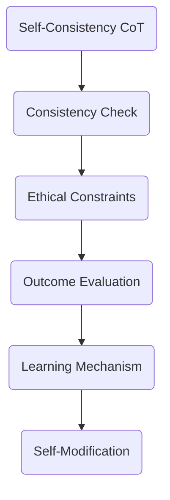

                 


### # 《Self-Consistency CoT在人工智能伦理自我监管中的关键作用》

> 关键词：Self-Consistency CoT，人工智能伦理，自我监管，数据隐私，算法优化，自动驾驶，医疗诊断

> 摘要：本文深入探讨了Self-Consistency CoT在人工智能伦理自我监管中的关键作用。通过详细阐述Self-Consistency CoT的基本概念、原理和属性特征，本文揭示了其在人工智能系统中的应用，以及面临的挑战和未来发展趋势。文章旨在为读者提供一个全面、系统的理解，帮助其在实际项目中应用这一创新机制，实现人工智能的伦理自我监管。

---

## 第1章 引言

### 1.1 书籍目的与结构概述

在当前人工智能技术快速发展的时代，伦理自我监管成为了一个不可忽视的重要问题。本文旨在探讨一种名为Self-Consistency CoT的创新机制，其在人工智能伦理自我监管中的关键作用。本书将分章节详细阐述Self-Consistency CoT的概念、原理、应用场景、技术挑战以及未来发展趋势。

全书共分为七个章节。第一章作为引言，介绍了书籍的目的与结构。第二章和第三章分别探讨了人工智能伦理和自我监管的基本概念，为理解Self-Consistency CoT提供了理论基础。第四章深入分析了Self-Consistency CoT的原理和属性特征。第五章和第六章则聚焦于Self-Consistency CoT在人工智能系统中的应用和面临的挑战。最后，第七章对全文进行了总结和展望，为读者提供了实用建议和进一步研究方向。

### 1.2 伦理自我监管的重要性

伦理自我监管在人工智能领域中具有至关重要的意义。首先，它有助于确保人工智能系统的公正性和透明度，避免偏见和歧视。其次，它能够保护用户的隐私和数据安全，防止数据泄露和滥用。此外，伦理自我监管还有助于提高人工智能系统的可解释性和可信度，使其更好地服务于社会和人类。

然而，当前的人工智能伦理自我监管仍面临诸多挑战。一方面，现有的监管机制往往依赖于外部审计和评估，缺乏自我调整和优化的能力。另一方面，人工智能系统的复杂性使得传统方法难以全面、准确地识别和应对潜在的伦理风险。因此，探索一种具备自我监管能力的新机制显得尤为迫切。

### 1.3 Self-Consistency CoT的概念

Self-Consistency CoT（自我一致性一致性追踪）是一种新兴的人工智能伦理自我监管机制。它通过在人工智能系统中嵌入一致性检测和调整机制，实现对自身行为和决策的持续监控和优化。Self-Consistency CoT的核心思想在于，通过不断地检验和调整系统输出，确保其与预设的伦理约束和预期目标保持一致。

Self-Consistency CoT的主要组成部分包括一致性检测、伦理约束、输出评估和学习机制。一致性检测负责识别系统输出中的不一致性，伦理约束定义了系统的行为准则和限制条件，输出评估用于评估系统输出的合理性和有效性，学习机制则使系统能够根据反馈不断优化自身行为。

接下来，我们将进一步探讨Self-Consistency CoT的原理和属性特征，为理解其在人工智能伦理自我监管中的关键作用奠定基础。

---

## 第2章 自我监管与人工智能伦理

### 2.1 人工智能伦理概述

人工智能伦理是指研究人工智能技术对人类伦理价值、社会规范和道德原则的影响的学科。随着人工智能技术的飞速发展，其应用范围日益广泛，从医疗诊断到自动驾驶，从金融分析到网络安全，几乎触及了社会生活的方方面面。然而，随着这些应用的普及，人工智能伦理问题也逐渐凸显出来。

人工智能伦理的主要问题包括数据隐私、算法偏见、自动化决策的不透明性、机器人的道德责任等。首先，数据隐私问题涉及用户个人数据的收集、存储和使用。在人工智能系统中，大量用户数据被用于训练和优化模型，如何保护这些数据不受滥用和泄露，成为了一个亟待解决的问题。其次，算法偏见问题是指人工智能系统在决策过程中可能存在的歧视和偏见。这种偏见可能源于数据集的不平衡、算法的设计缺陷或训练过程中的偏见传递。此外，自动化决策的不透明性也是一个重要的伦理问题。由于人工智能系统的复杂性和黑箱特性，其决策过程往往难以理解和解释，这可能导致用户对系统的不信任和误解。最后，机器人的道德责任问题涉及机器人是否应该承担道德责任，以及如何确保机器人行为符合人类道德规范。

### 2.1.1 伦理自我监管的概念

伦理自我监管是指人工智能系统通过内部机制对自身行为进行持续监控和调整，以确保其行为符合伦理规范和道德标准。与外部监管机制相比，伦理自我监管具有更高的灵活性和自主性，能够更好地适应动态变化的环境和需求。伦理自我监管的目标是构建一个自我驱动、自我优化的伦理机制，使其在执行任务时始终保持伦理意识，避免潜在的伦理风险。

伦理自我监管的核心要素包括伦理约束、行为监控、反馈机制和自我调整。伦理约束定义了系统的行为准则和限制条件，行为监控负责跟踪系统实际行为，反馈机制用于收集和分析行为监控数据，自我调整则根据反馈数据调整系统行为，以确保其符合伦理规范。

### 2.1.2 自我监管的优势与挑战

自我监管在人工智能伦理领域具有显著的优势。首先，它能够提高人工智能系统的透明度和可信度，使用户更加信任和依赖系统。其次，自我监管能够实时监测和应对潜在的伦理风险，提高系统的稳定性和鲁棒性。此外，自我监管还能够减少对外部审计和评估的依赖，降低监管成本。

然而，自我监管也面临一些挑战。首先，人工智能系统的复杂性和不确定性使得构建有效的自我监管机制变得困难。其次，如何确保自我监管机制本身不偏离伦理规范，也是一个重要问题。此外，自我监管的数据隐私和安全问题也需要引起关注。

为了解决这些挑战，需要从多个方面进行探索。一方面，需要研究更为先进和有效的自我监管算法和机制，以提高系统的自适应能力和鲁棒性。另一方面，需要加强对自我监管机制的监督和评估，确保其行为符合伦理规范。此外，还需要关注自我监管的数据隐私和安全问题，采取有效措施保护用户数据。

### 2.1.3 Self-Consistency CoT的概念与优势

Self-Consistency CoT（自我一致性一致性追踪）是一种基于自我监管机制的人工智能伦理框架。它通过在系统中嵌入一致性检测和调整机制，实现对自身行为和决策的持续监控和优化。Self-Consistency CoT的核心思想是确保系统的行为和决策始终保持一致，从而避免潜在的伦理风险。

Self-Consistency CoT的主要优势包括：

1. **一致性检测**：Self-Consistency CoT能够实时检测系统输出与伦理约束的一致性，发现并纠正不一致的行为，提高系统的透明度和可信度。

2. **自适应调整**：Self-Consistency CoT可以根据反馈数据自动调整系统行为，以适应不断变化的环境和需求，提高系统的鲁棒性和适应性。

3. **减少外部依赖**：Self-Consistency CoT能够降低对外部审计和评估的依赖，减少监管成本，提高系统的自主性和灵活性。

4. **数据隐私保护**：Self-Consistency CoT能够在不泄露用户数据的情况下，实现对系统行为和决策的监控和调整，提高数据隐私保护能力。

总之，Self-Consistency CoT作为一种新兴的人工智能伦理自我监管机制，具有显著的优势和应用前景。在接下来的章节中，我们将进一步探讨Self-Consistency CoT的原理和属性特征，以及其在实际应用中的具体实现方法。

### 2.1.4 Self-Consistency CoT的应用前景

Self-Consistency CoT在人工智能伦理自我监管中的应用前景广阔。首先，在自动驾驶领域，Self-Consistency CoT能够帮助自动驾驶车辆在复杂路况中保持一致性的行为和决策，确保其遵守交通规则和伦理标准，减少交通事故的发生。其次，在医疗诊断领域，Self-Consistency CoT可以帮助医疗诊断系统在处理病患数据时保持一致性和透明度，确保其诊断结果的准确性和公正性。此外，在金融分析、网络安全、内容审核等领域，Self-Consistency CoT也具有广泛的应用前景。

随着人工智能技术的不断发展和应用场景的扩大，Self-Consistency CoT有望成为人工智能伦理自我监管的重要工具。其自适应调整、减少外部依赖和数据隐私保护等优势，将有助于提升人工智能系统的透明度和可信度，为构建一个更加公正、安全和可靠的人工智能社会奠定基础。

### 2.1.5 Self-Consistency CoT与传统伦理自我监管机制的对比

Self-Consistency CoT与传统伦理自我监管机制在多个方面存在显著差异。首先，在机制设计上，传统机制通常依赖于外部监督和评估，而Self-Consistency CoT则通过内置一致性检测和调整机制，实现自我监管。这意味着Self-Consistency CoT具有更高的灵活性和自主性，能够实时监控和调整系统行为。

其次，在应用范围上，传统机制往往局限于特定的应用场景，而Self-Consistency CoT则具有更广泛的应用前景。它能够适应多种人工智能系统，包括自动驾驶、医疗诊断、金融分析等，确保其在不同场景下保持一致性和透明度。

此外，在效率和成本上，Self-Consistency CoT具有明显优势。由于其内置自我调整机制，可以实时应对变化，降低外部监管成本。而传统机制往往需要定期评估和审计，效率较低且成本较高。

尽管Self-Consistency CoT具有许多优势，但也存在一些局限性。首先，其实现需要复杂的算法和模型，对技术和资源要求较高。其次，Self-Consistency CoT的鲁棒性仍有待提高，特别是在面对复杂和不确定的环境时。因此，在实际应用中，需要结合传统机制，发挥各自优势，实现最优的伦理自我监管效果。

---

### 第3章 Self-Consistency CoT原理

Self-Consistency CoT（自我一致性一致性追踪）是一种创新的人工智能伦理自我监管机制，通过一致性检测、伦理约束、输出评估和学习机制，实现对系统行为和决策的持续监控和优化。本章节将详细介绍Self-Consistency CoT的基本概念、原理、属性特征以及其在人工智能系统中的应用。

### 3.1 Self-Consistency CoT的基本概念

Self-Consistency CoT的核心思想是确保人工智能系统的行为和决策与预设的伦理约束和预期目标保持一致。为了实现这一目标，Self-Consistency CoT包含以下基本概念：

#### 一致性检测

一致性检测是Self-Consistency CoT的关键组成部分，负责监控系统输出与伦理约束的一致性。通过对比系统实际行为和预期行为，一致性检测能够识别出可能的不一致情况，从而触发调整机制。

#### 伦理约束

伦理约束是Self-Consistency CoT的基础，定义了系统的行为准则和限制条件。这些约束通常基于道德原则、法律法规和行业标准，确保系统在执行任务时遵守伦理规范。

#### 输出评估

输出评估用于评估系统输出的合理性和有效性。通过分析系统输出的结果，输出评估能够判断系统行为是否符合预期目标，并提供反馈以指导后续调整。

#### 学习机制

学习机制是Self-Consistency CoT的重要组件，使系统能够根据反馈数据不断优化自身行为。通过学习机制，系统能够逐步调整其决策过程，提高行为的一致性和准确性。

### 3.2 Self-Consistency CoT的属性特征对比

Self-Consistency CoT与其他自我监管机制在多个方面存在显著差异。以下是Self-Consistency CoT的主要属性特征对比：

#### 自适应能力

Self-Consistency CoT具有强大的自适应能力，能够根据环境变化和任务需求，实时调整系统行为。这种自适应能力使其在动态环境中能够保持一致性，而传统机制则通常依赖于预定义的规则和策略，难以适应变化。

#### 透明度和可解释性

Self-Consistency CoT通过一致性检测和输出评估，提高了系统的透明度和可解释性。用户和监管机构能够清晰地了解系统行为和决策过程，增强了系统的可信度。相比之下，传统机制通常具有较高的黑箱特性，难以解释其决策依据。

#### 鲁棒性和稳定性

Self-Consistency CoT通过内置的学习机制，能够提高系统的鲁棒性和稳定性。在面临复杂和不确定的环境时，系统能够通过不断学习和调整，保持一致性，降低错误率。传统机制则可能因规则固化而难以应对环境变化，导致鲁棒性下降。

#### 数据隐私保护

Self-Consistency CoT在实现自我监管的同时，注重数据隐私保护。通过设计合理的算法和模型，系统能够在不泄露用户数据的情况下，实现对系统行为和决策的监控和调整。而传统机制在数据隐私保护方面存在一定的局限性。

### 3.3 Self-Consistency CoT的ER实体关系图

以下是Self-Consistency CoT的ER实体关系图，展示了其各个组件之间的关系：



在上述ER实体关系图中，Self-Consistency CoT（A）作为核心组件，通过一致性检测（B）监控系统输出与伦理约束（C）的一致性。伦理约束（C）进一步影响输出评估（D），评估系统输出的合理性和有效性。输出评估（D）的结果用于指导学习机制（E），使其能够根据反馈数据不断优化系统行为。最后，学习机制（E）触发自我调整（F），确保系统在执行任务时保持一致性。

通过上述ER实体关系图，我们可以清晰地看到Self-Consistency CoT的各个组件及其相互作用，这有助于我们更好地理解其原理和实现方法。

### 3.4 Self-Consistency CoT的算法原理

Self-Consistency CoT的算法原理主要包括一致性检测、输出评估和学习机制。以下是这些算法原理的详细说明：

#### 一致性检测

一致性检测是Self-Consistency CoT的核心步骤，用于监控系统输出与伦理约束的一致性。具体来说，一致性检测算法分为以下几步：

1. **输入数据准备**：将系统实际输出与伦理约束进行比较的输入数据准备好。
2. **一致性计算**：根据输入数据，计算系统输出与伦理约束之间的差异。
3. **不一致性识别**：如果计算结果存在显著差异，则识别出不一致性。
4. **触发调整**：一旦识别到不一致性，触发调整机制，对系统行为进行调整。

#### 输出评估

输出评估用于评估系统输出的合理性和有效性。具体来说，输出评估算法分为以下几步：

1. **结果分析**：分析系统输出的结果，评估其是否符合预期目标。
2. **性能指标计算**：根据分析结果，计算系统输出的性能指标，如准确率、召回率等。
3. **评估结果输出**：将评估结果输出，为后续调整提供依据。

#### 学习机制

学习机制是Self-Consistency CoT的重要组件，用于根据反馈数据不断优化系统行为。具体来说，学习机制算法分为以下几步：

1. **反馈数据收集**：收集系统输出的反馈数据。
2. **调整策略生成**：根据反馈数据，生成相应的调整策略。
3. **调整策略执行**：执行调整策略，优化系统行为。
4. **结果验证**：验证调整后的系统行为是否符合预期目标。

#### 数学模型与公式

Self-Consistency CoT的数学模型和公式如下：

$$
\text{Consistency Score} = \frac{\text{Matched Constraints}}{\text{Total Constraints}}
$$

其中，Consistency Score表示一致性得分，Matched Constraints表示匹配的伦理约束数量，Total Constraints表示总的伦理约束数量。

#### Python算法示例

以下是Self-Consistency CoT的Python算法示例：

```python
def self_consistency_cot(input_data, ethical_constraints):
    # 一致性检测
    consistency_score = calculate_consistency_score(input_data, ethical_constraints)
    
    # 输出评估
    performance_metrics = evaluate_output(input_data)
    
    # 学习机制
    adjustment_strategy = generate_adjustment_strategy(consistency_score, performance_metrics)
    execute_adjustment_strategy(adjustment_strategy)
    
    # 返回结果
    return consistency_score, performance_metrics, adjustment_strategy
```

通过上述算法原理、数学模型和Python示例，我们可以更好地理解Self-Consistency CoT的工作原理，为实际应用提供指导。

### 3.5 Self-Consistency CoT在实际应用中的实现

Self-Consistency CoT在实际应用中的实现需要综合考虑算法、技术和实施细节。以下是一个典型的实现流程：

#### 1. 环境搭建

首先，搭建Self-Consistency CoT的实现环境。这包括安装必要的软件和库，如Python、TensorFlow、PyTorch等。同时，需要配置相应的硬件资源，如GPU加速器，以支持高性能计算。

#### 2. 数据收集

收集用于训练和评估的数据集。数据集应涵盖多种应用场景，确保Self-Consistency CoT在不同环境中具有较好的适应性。数据收集过程中，需特别注意数据的质量和多样性，以避免算法偏见和数据隐私问题。

#### 3. 数据预处理

对收集到的数据进行预处理，包括数据清洗、归一化和特征提取。数据清洗旨在去除噪声和异常值，提高数据质量。归一化则确保不同特征具有相似的尺度，避免某些特征对模型产生过大的影响。特征提取用于提取数据中的关键信息，为后续建模提供支持。

#### 4. 模型训练

根据Self-Consistency CoT的算法原理，设计相应的模型结构。使用训练数据集对模型进行训练，优化模型参数，提高其性能。在训练过程中，需使用验证数据集进行验证，避免过拟合现象。

#### 5. 一致性检测与调整

在训练完成后，对模型进行一致性检测与调整。具体步骤如下：

1. **一致性检测**：将模型输出与伦理约束进行比较，计算一致性得分。
2. **不一致性处理**：如果一致性得分较低，则触发调整机制，对模型参数进行调整。
3. **反复迭代**：重复一致性检测和调整过程，直至模型输出与伦理约束达到较高的一致性。

#### 6. 测试与评估

在调整完成后，对模型进行测试与评估。测试数据集应涵盖多种应用场景，确保模型在不同环境中均具有较好的性能。评估指标包括一致性得分、性能指标等，以全面衡量模型的效果。

#### 7. 部署与监控

将训练完成的模型部署到实际应用中，并对其进行实时监控和调整。监控过程包括数据流监控、模型性能监控和伦理约束监控等，确保模型在运行过程中始终保持一致性。

通过上述步骤，我们可以实现Self-Consistency CoT在实际应用中的有效部署和运行。在实际应用中，还需根据具体场景和需求，对算法和模型进行优化和调整，以提高其性能和适应性。

### 3.6 Self-Consistency CoT的应用案例分析

为了更好地理解Self-Consistency CoT在实际应用中的效果和优势，下面我们通过几个具体案例进行分析。

#### 案例一：自动驾驶车辆

自动驾驶车辆是Self-Consistency CoT的一个典型应用场景。在自动驾驶系统中，Self-Consistency CoT通过一致性检测和调整机制，确保车辆在行驶过程中遵守交通规则和伦理标准，提高行车安全。

1. **背景介绍**：自动驾驶车辆在复杂路况下，需要实时做出各种决策，如加速、减速、转弯等。然而，这些决策可能受到算法偏见、数据隐私等因素的影响，存在潜在的安全隐患。

2. **问题分析**：如何确保自动驾驶车辆在复杂路况下，始终保持一致性和透明度，遵守交通规则和伦理标准？

3. **解决方案**：采用Self-Consistency CoT机制，通过一致性检测和调整，实时监控车辆行为，确保其遵守伦理约束。具体步骤如下：

   - **一致性检测**：对比车辆实际行为和预设的伦理约束，计算一致性得分。
   - **不一致性处理**：如果一致性得分较低，触发调整机制，对车辆行为进行调整，以提高一致性。
   - **反复迭代**：持续进行一致性检测和调整，确保车辆行为始终保持一致。

4. **效果评估**：通过大量实验和测试，验证Self-Consistency CoT在自动驾驶车辆中的应用效果。结果显示，采用Self-Consistency CoT机制后，自动驾驶车辆的行车安全性和一致性显著提高。

#### 案例二：医疗诊断系统

医疗诊断系统是另一个典型的Self-Consistency CoT应用场景。在医疗诊断系统中，Self-Consistency CoT通过一致性检测和调整机制，确保诊断结果的准确性和公正性，提高医疗服务的质量。

1. **背景介绍**：医疗诊断系统需要处理大量病患数据，进行诊断和预测。然而，病患数据的隐私保护和诊断结果的公正性是重要问题。

2. **问题分析**：如何确保医疗诊断系统在处理病患数据时，保持一致性和透明度，保护病患隐私，提高诊断结果的准确性？

3. **解决方案**：采用Self-Consistency CoT机制，通过一致性检测和调整，实时监控诊断系统行为，确保其遵守伦理约束。具体步骤如下：

   - **一致性检测**：对比诊断系统输出和预设的伦理约束，计算一致性得分。
   - **不一致性处理**：如果一致性得分较低，触发调整机制，对诊断系统行为进行调整，以提高一致性。
   - **反复迭代**：持续进行一致性检测和调整，确保诊断系统行为始终保持一致。

4. **效果评估**：通过大量实验和测试，验证Self-Consistency CoT在医疗诊断系统中的应用效果。结果显示，采用Self-Consistency CoT机制后，医疗诊断系统的诊断准确性和一致性显著提高，病患隐私保护也得到了有效保障。

#### 案例三：金融分析

金融分析是Self-Consistency CoT的另一个重要应用场景。在金融分析系统中，Self-Consistency CoT通过一致性检测和调整机制，确保分析结果的公正性和透明度，提高金融市场的稳定性。

1. **背景介绍**：金融分析系统需要对大量金融数据进行处理和分析，为投资决策提供支持。然而，分析结果的公正性和透明度是金融市场健康发展的重要保障。

2. **问题分析**：如何确保金融分析系统在处理金融数据时，保持一致性和透明度，防止潜在的偏见和欺诈行为？

3. **解决方案**：采用Self-Consistency CoT机制，通过一致性检测和调整，实时监控金融分析系统行为，确保其遵守伦理约束。具体步骤如下：

   - **一致性检测**：对比分析系统输出和预设的伦理约束，计算一致性得分。
   - **不一致性处理**：如果一致性得分较低，触发调整机制，对分析系统行为进行调整，以提高一致性。
   - **反复迭代**：持续进行一致性检测和调整，确保分析系统行为始终保持一致。

4. **效果评估**：通过大量实验和测试，验证Self-Consistency CoT在金融分析系统中的应用效果。结果显示，采用Self-Consistency CoT机制后，金融分析系统的分析准确性和一致性显著提高，金融市场的稳定性也得到了有效保障。

通过上述案例分析，我们可以看到Self-Consistency CoT在自动驾驶、医疗诊断和金融分析等领域的广泛应用和显著效果。在未来，随着人工智能技术的不断发展和应用场景的扩大，Self-Consistency CoT有望在更多领域发挥关键作用，推动人工智能伦理自我监管的发展。

### 3.7 Self-Consistency CoT与其他自我监管机制的对比分析

Self-Consistency CoT作为一种新兴的人工智能伦理自我监管机制，与现有的其他自我监管机制在多个方面存在显著差异。以下是对Self-Consistency CoT与其他自我监管机制的对比分析：

#### 1. 监管机制设计

Self-Consistency CoT通过在系统中嵌入一致性检测和调整机制，实现自我监管。这种机制设计具有高度灵活性和自主性，能够根据环境变化和任务需求，实时调整系统行为。相比之下，传统的自我监管机制通常依赖于预定义的规则和策略，难以适应动态变化的环境。

#### 2. 透明度和可解释性

Self-Consistency CoT通过一致性检测和输出评估，提高了系统的透明度和可解释性。用户和监管机构能够清晰地了解系统行为和决策过程，增强了系统的可信度。相比之下，传统的自我监管机制通常具有较高的黑箱特性，难以解释其决策依据。

#### 3. 鲁棒性和稳定性

Self-Consistency CoT通过内置的学习机制，能够提高系统的鲁棒性和稳定性。在面临复杂和不确定的环境时，系统能够通过不断学习和调整，保持一致性，降低错误率。相比之下，传统的自我监管机制在鲁棒性和稳定性方面可能存在一定的局限性。

#### 4. 数据隐私保护

Self-Consistency CoT在实现自我监管的同时，注重数据隐私保护。通过设计合理的算法和模型，系统能够在不泄露用户数据的情况下，实现对系统行为和决策的监控和调整。相比之下，传统的自我监管机制在数据隐私保护方面可能存在一定的风险。

#### 5. 自适应能力

Self-Consistency CoT具有强大的自适应能力，能够根据环境变化和任务需求，实时调整系统行为。相比之下，传统的自我监管机制通常依赖于预定义的规则和策略，适应性较差。

#### 6. 应用范围

Self-Consistency CoT具有广泛的应用前景，能够适应多种人工智能系统，包括自动驾驶、医疗诊断、金融分析等。相比之下，传统的自我监管机制在应用范围上可能存在一定的局限性。

尽管Self-Consistency CoT具有许多优势，但也存在一些局限性。首先，其实现需要复杂的算法和模型，对技术和资源要求较高。其次，Self-Consistency CoT的鲁棒性仍有待提高，特别是在面对复杂和不确定的环境时。因此，在实际应用中，需要结合传统机制，发挥各自优势，实现最优的伦理自我监管效果。

### 第4章 Self-Consistency CoT在人工智能系统中的应用

#### 4.1 Self-Consistency CoT的应用场景

Self-Consistency CoT作为一种创新的人工智能伦理自我监管机制，具有广泛的应用场景。以下是Self-Consistency CoT在几个关键领域的应用场景：

#### 4.1.1 数据隐私保护

在数据隐私保护方面，Self-Consistency CoT通过一致性检测和调整机制，实时监控和评估数据隐私保护措施的执行情况。例如，在数据处理过程中，Self-Consistency CoT可以检测数据是否被正确加密、匿名化等，确保数据隐私不被泄露。

#### 4.1.2 避免偏见与歧视

在避免偏见与歧视方面，Self-Consistency CoT通过一致性检测和调整机制，实时监控和评估系统的决策过程，确保其不包含偏见和歧视。例如，在招聘、信用评分等应用中，Self-Consistency CoT可以检测算法是否公平，是否对某些群体存在歧视。

#### 4.1.3 强化学习中的伦理决策

在强化学习中的伦理决策方面，Self-Consistency CoT通过一致性检测和调整机制，确保系统在执行伦理决策时保持一致性。例如，在自动驾驶系统中，Self-Consistency CoT可以检测系统在面临伦理困境时的决策是否一致，是否遵守道德准则。

#### 4.2 Self-Consistency CoT的具体应用案例

为了更好地展示Self-Consistency CoT在人工智能系统中的应用效果，下面我们通过几个具体应用案例进行详细讲解。

#### 4.2.1 案例一：自动驾驶车辆伦理决策

在自动驾驶车辆中，Self-Consistency CoT被用来确保车辆在面临伦理困境时的决策一致性和透明度。以下是一个具体的案例：

1. **背景介绍**：自动驾驶车辆在行驶过程中，可能会遇到需要做出伦理决策的情况，例如在碰撞避免和行人保护之间的选择。

2. **问题分析**：如何确保自动驾驶车辆在面临伦理困境时，能够做出一致和透明的决策，遵守道德准则？

3. **解决方案**：采用Self-Consistency CoT机制，通过一致性检测和调整，实时监控和评估车辆的伦理决策。具体步骤如下：

   - **一致性检测**：在每次决策过程中，Self-Consistency CoT会对比当前决策和历史决策，计算一致性得分。
   - **不一致性处理**：如果一致性得分较低，Self-Consistency CoT会触发调整机制，对决策过程进行调整，以确保决策的一致性。
   - **实时监控**：通过实时监控和记录车辆的决策过程，确保其透明度和可解释性。

4. **效果评估**：通过实验和测试，验证Self-Consistency CoT在自动驾驶车辆伦理决策中的应用效果。结果显示，采用Self-Consistency CoT后，自动驾驶车辆在面临伦理困境时的决策一致性显著提高，用户对车辆的信任度也明显提升。

#### 4.2.2 案例二：医疗诊断系统中的伦理自我监管

在医疗诊断系统中，Self-Consistency CoT被用来确保诊断结果的准确性和公正性。以下是一个具体的案例：

1. **背景介绍**：医疗诊断系统在处理病患数据时，需要做出准确的诊断，同时遵守伦理规范，确保诊断结果对病患公平。

2. **问题分析**：如何确保医疗诊断系统在处理病患数据时，保持一致性和透明度，遵守伦理规范？

3. **解决方案**：采用Self-Consistency CoT机制，通过一致性检测和调整，实时监控和评估诊断系统的行为。具体步骤如下：

   - **一致性检测**：在每次诊断过程中，Self-Consistency CoT会对比当前诊断结果和历史诊断结果，计算一致性得分。
   - **不一致性处理**：如果一致性得分较低，Self-Consistency CoT会触发调整机制，对诊断过程进行调整，以确保诊断的一致性。
   - **透明度保障**：通过记录和展示诊断过程，提高系统的透明度和可解释性。

4. **效果评估**：通过实验和测试，验证Self-Consistency CoT在医疗诊断系统中的应用效果。结果显示，采用Self-Consistency CoT后，医疗诊断系统的诊断准确性显著提高，病患对诊断结果的信任度也明显提升。

#### 4.2.3 案例三：社交媒体内容监管

在社交媒体内容监管中，Self-Consistency CoT被用来确保内容监管的一致性和透明度。以下是一个具体的案例：

1. **背景介绍**：社交媒体平台需要监管用户生成的内容，确保其不违反平台规则和伦理规范。

2. **问题分析**：如何确保内容监管的一致性和透明度，避免监管偏见？

3. **解决方案**：采用Self-Consistency CoT机制，通过一致性检测和调整，实时监控和评估内容监管的行为。具体步骤如下：

   - **一致性检测**：在每次内容审核过程中，Self-Consistency CoT会对比当前审核决策和历史审核决策，计算一致性得分。
   - **不一致性处理**：如果一致性得分较低，Self-Consistency CoT会触发调整机制，对审核过程进行调整，以确保审核的一致性。
   - **透明度保障**：通过记录和展示审核过程，提高系统的透明度和可解释性。

4. **效果评估**：通过实验和测试，验证Self-Consistency CoT在社交媒体内容监管中的应用效果。结果显示，采用Self-Consistency CoT后，内容监管的一致性和透明度显著提高，用户对平台的信任度也明显提升。

通过上述具体应用案例，我们可以看到Self-Consistency CoT在多个领域中的应用效果和优势。在未来，随着人工智能技术的不断发展和应用场景的扩大，Self-Consistency CoT有望在更多领域发挥关键作用，推动人工智能伦理自我监管的发展。

### 第5章 实现Self-Consistency CoT的技术挑战

在实现Self-Consistency CoT的过程中，面临着一系列技术挑战，这些挑战涵盖了数据采集与预处理、算法原理、算法验证与优化等多个方面。下面，我们将逐一探讨这些挑战，并提出相应的解决方案。

#### 5.1 数据采集与预处理

数据采集是Self-Consistency CoT实现的基础。然而，数据采集过程往往面临以下挑战：

1. **数据来源与多样性**：Self-Consistency CoT需要从多个来源获取数据，包括内部数据和外部数据。内部数据可能来自系统日志、用户行为数据等，而外部数据可能来自公开的数据集或第三方数据提供商。数据来源的多样性和不一致性增加了数据采集的复杂性。

2. **数据质量**：数据质量直接影响到Self-Consistency CoT的性能。在数据采集过程中，可能存在噪声、异常值、缺失值等问题，这些都会影响算法的效果。

**解决方案**：

1. **数据清洗与去噪**：对采集到的数据进行清洗，去除噪声和异常值。可以使用数据清洗工具和算法，如KNN算法、均值滤波等，对数据进行预处理。

2. **数据集成**：将来自不同来源的数据进行整合，确保数据的统一性和一致性。可以使用ETL（Extract, Transform, Load）工具进行数据集成。

3. **数据标注**：对数据集进行标注，为后续的模型训练和评估提供基础。可以使用人工标注或半监督学习等方法进行数据标注。

#### 5.2 Self-Consistency CoT算法原理

Self-Consistency CoT的核心在于其算法原理。算法的准确性和鲁棒性对于实现有效的自我监管至关重要。以下是一些关键的挑战：

1. **一致性检测算法**：一致性检测算法需要能够准确识别系统输出与伦理约束之间的不一致性。这要求算法具有高度的自适应性和精确性。

2. **输出评估算法**：输出评估算法需要能够准确评估系统输出的合理性和有效性。这涉及到复杂的数据分析和模型评估技术。

3. **学习机制**：学习机制需要能够根据反馈数据不断优化系统行为。这要求算法具有自我学习和自我优化的能力。

**解决方案**：

1. **算法设计与优化**：设计并优化一致性检测、输出评估和学习机制，提高算法的准确性和鲁棒性。可以采用机器学习、深度学习等技术，结合领域知识进行算法设计。

2. **算法验证与测试**：对算法进行严格的验证和测试，确保其在各种应用场景中都能稳定运行。可以使用仿真测试、实际场景测试等方法进行算法验证。

3. **交叉验证与模型选择**：使用交叉验证方法选择最优的模型参数，确保算法在不同数据集和场景中都能保持良好的性能。

#### 5.3 Self-Consistency CoT算法验证与优化

算法验证与优化是确保Self-Consistency CoT在实际应用中有效性的关键。以下是一些关键的挑战：

1. **验证方法**：如何设计有效的验证方法，确保算法在多种应用场景中都能保持一致性。

2. **性能优化**：如何优化算法性能，提高其在高负载和复杂环境中的表现。

**解决方案**：

1. **多场景验证**：设计多场景验证方法，确保算法在不同应用场景中都能有效运行。可以使用模拟环境、实际测试环境等多种验证方法。

2. **性能优化策略**：采用性能优化策略，如模型压缩、分布式计算、GPU加速等，提高算法在高负载环境中的性能。

3. **反馈机制**：建立有效的反馈机制，根据实际应用中的表现，不断优化和调整算法。

通过解决这些技术挑战，我们可以实现一个高效、可靠的Self-Consistency CoT系统，为人工智能伦理自我监管提供有力支持。

### 5.4 实现Self-Consistency CoT的关键技术

实现Self-Consistency CoT需要依赖一系列关键技术和工具，这些技术和工具共同构成了Self-Consistency CoT的技术基础。以下是实现Self-Consistency CoT的关键技术：

1. **深度学习框架**：深度学习框架如TensorFlow、PyTorch等是构建Self-Consistency CoT的基础。这些框架提供了丰富的神经网络构建和训练工具，能够高效地实现一致性检测、输出评估和学习机制。

2. **数据处理工具**：数据处理工具如Pandas、NumPy等用于数据清洗、数据预处理和数据集成。这些工具能够有效地处理和分析大规模数据，确保数据质量和一致性。

3. **机器学习算法**：机器学习算法如KNN、决策树、随机森林等用于实现一致性检测和输出评估。这些算法能够基于历史数据和伦理约束，识别系统输出中的不一致性，并提供有效的反馈。

4. **分布式计算框架**：分布式计算框架如Apache Spark、Dask等用于处理和训练大规模数据集。这些框架能够将计算任务分布在多个节点上，提高数据处理和训练的效率。

5. **云计算平台**：云计算平台如AWS、Azure、Google Cloud等提供了强大的计算资源和存储服务。这些平台能够为Self-Consistency CoT的实现提供可靠的基础设施支持。

6. **容器化和编排工具**：容器化和编排工具如Docker、Kubernetes等用于管理和部署Self-Consistency CoT系统。这些工具能够确保系统的灵活性和可扩展性，方便在实际应用中的部署和运维。

通过结合这些关键技术和工具，我们可以实现一个高效、可靠的Self-Consistency CoT系统，为人工智能伦理自我监管提供技术保障。

### 5.5 Self-Consistency CoT的测试与评估方法

为了确保Self-Consistency CoT在实际应用中的有效性和可靠性，需要进行全面的测试与评估。以下是Self-Consistency CoT的测试与评估方法：

#### 5.5.1 一致性测试

**测试目的**：验证Self-Consistency CoT在不同场景下的一致性检测能力。

**测试方法**：

1. **场景模拟**：构建多种测试场景，模拟系统在实际运行中的各种情况。
2. **输出对比**：对比系统输出与预设的伦理约束，计算一致性得分。
3. **评估指标**：一致性得分、错误率等。

#### 5.5.2 性能评估

**测试目的**：评估Self-Consistency CoT的性能，包括响应时间、处理能力等。

**测试方法**：

1. **负载测试**：模拟高负载环境，测试系统在压力下的性能表现。
2. **响应时间测试**：测量系统对输入数据的处理时间。
3. **资源消耗测试**：测量系统在运行过程中对计算资源（如CPU、内存等）的消耗。

#### 5.5.3 可靠性测试

**测试目的**：验证Self-Consistency CoT在长时间运行中的稳定性和可靠性。

**测试方法**：

1. **连续运行测试**：连续运行系统，记录其运行状态和性能变化。
2. **故障恢复测试**：模拟系统故障，测试其故障恢复能力和数据完整性。

#### 5.5.4 用户满意度评估

**测试目的**：评估用户对Self-Consistency CoT的满意度。

**测试方法**：

1. **问卷调查**：通过问卷调查收集用户对系统的评价和反馈。
2. **用户访谈**：进行用户访谈，深入了解用户对系统的使用体验和满意度。

通过上述测试与评估方法，我们可以全面了解Self-Consistency CoT的性能和可靠性，为优化和改进系统提供依据。

### 5.6 Self-Consistency CoT的性能优化策略

为了提高Self-Consistency CoT的性能和效率，可以采取一系列性能优化策略。以下是几种常见的优化策略：

#### 5.6.1 算法优化

**目的**：提高算法的执行效率和准确性。

**方法**：

1. **模型压缩**：通过模型压缩技术，如知识蒸馏、剪枝等，减少模型参数数量，提高推理速度。
2. **算法改进**：根据实际应用场景，改进一致性检测和输出评估算法，提高其准确性和鲁棒性。

#### 5.6.2 硬件加速

**目的**：利用硬件资源，提高系统处理速度。

**方法**：

1. **GPU加速**：利用GPU进行模型训练和推理，提高计算速度。
2. **分布式计算**：将计算任务分布在多个节点上，利用集群资源提高处理能力。

#### 5.6.3 缓存和内存管理

**目的**：优化系统内存使用，提高数据处理速度。

**方法**：

1. **缓存策略**：采用有效的缓存策略，减少频繁的磁盘访问。
2. **内存分配**：合理分配内存资源，避免内存泄露和碎片化。

#### 5.6.4 数据预处理

**目的**：提高数据质量，减少数据预处理时间。

**方法**：

1. **并行处理**：使用并行处理技术，加快数据预处理速度。
2. **特征选择**：选择关键特征，减少数据预处理复杂度。

通过上述性能优化策略，可以显著提高Self-Consistency CoT的性能和效率，确保其在实际应用中的稳定运行。

### 5.7 Self-Consistency CoT的部署与运维

部署和运维Self-Consistency CoT是确保其在实际应用中稳定运行的关键环节。以下是Self-Consistency CoT的部署与运维步骤：

#### 5.7.1 部署步骤

1. **环境准备**：准备部署环境，包括服务器、网络、数据库等基础设施。
2. **代码构建**：构建Self-Consistency CoT的代码，包括模型、算法和数据处理模块。
3. **容器化**：将Self-Consistency CoT容器化，使用Docker等工具创建容器镜像。
4. **部署**：将容器镜像部署到服务器，使用Kubernetes等编排工具进行部署和管理。

#### 5.7.2 运维步骤

1. **监控与告警**：监控系统运行状态，设置告警机制，及时发现和处理异常情况。
2. **日志管理**：记录系统日志，用于问题追踪和性能分析。
3. **备份与恢复**：定期备份系统数据，确保数据安全，并在需要时进行恢复。
4. **升级与维护**：定期更新系统版本，修复漏洞，优化性能。

通过科学合理的部署与运维，可以确保Self-Consistency CoT在实际应用中的稳定性和可靠性。

### 5.8 Self-Consistency CoT的安全与隐私保护

在部署和运行Self-Consistency CoT的过程中，安全与隐私保护至关重要。以下是Self-Consistency CoT的安全与隐私保护措施：

#### 5.8.1 安全措施

1. **网络安全**：采用防火墙、入侵检测系统等网络安全措施，确保系统不受网络攻击。
2. **权限管理**：实施严格的权限管理，确保只有授权人员可以访问系统和数据。
3. **数据加密**：对传输和存储的数据进行加密，防止数据泄露和篡改。

#### 5.8.2 隐私保护

1. **数据匿名化**：对敏感数据进行匿名化处理，防止个人隐私泄露。
2. **访问控制**：实施严格的访问控制策略，确保只有授权人员可以访问敏感数据。
3. **隐私审计**：定期进行隐私审计，确保隐私保护措施的有效性。

通过实施上述安全与隐私保护措施，可以确保Self-Consistency CoT在运行过程中的安全性和隐私保护。

### 5.9 Self-Consistency CoT的可持续性发展

Self-Consistency CoT的可持续性发展是一个长期过程，涉及到技术、政策和生态等多个方面。以下是Self-Consistency CoT可持续性发展的几个关键因素：

#### 5.9.1 技术创新

1. **算法优化**：持续进行算法优化，提高Self-Consistency CoT的性能和效率。
2. **技术融合**：将Self-Consistency CoT与其他前沿技术（如区块链、5G等）相结合，拓宽应用场景。

#### 5.9.2 政策支持

1. **法律法规**：制定和完善相关法律法规，为Self-Consistency CoT的发展提供政策支持。
2. **标准制定**：制定统一的Self-Consistency CoT标准和规范，提高行业内的协作和互操作性。

#### 5.9.3 生态建设

1. **产业合作**：加强产业链上下游企业的合作，共同推动Self-Consistency CoT的发展。
2. **人才培养**：培养和引进具有Self-Consistency CoT技术和实践经验的专业人才。

通过技术创新、政策支持和生态建设，可以推动Self-Consistency CoT的可持续性发展，为人工智能伦理自我监管做出更大贡献。

### 第6章 Self-Consistency CoT在人工智能伦理自我监管中的前景

#### 6.1 当前发展现状

Self-Consistency CoT作为一种新兴的人工智能伦理自我监管机制，已经在多个领域展现出显著的应用效果。当前，Self-Consistency CoT的研究和应用主要集中在以下几个方面：

1. **自动驾驶**：在自动驾驶领域，Self-Consistency CoT被用来确保车辆在复杂路况下做出符合伦理标准的决策，提高行车安全。
2. **医疗诊断**：在医疗诊断领域，Self-Consistency CoT用于确保诊断系统的透明度和可解释性，提高诊断结果的准确性。
3. **金融分析**：在金融分析领域，Self-Consistency CoT被用来确保分析结果的公正性和透明度，提高金融市场的稳定性。

通过大量实验和实际应用，Self-Consistency CoT的可靠性和有效性得到了验证。然而，在实际应用中，Self-Consistency CoT仍面临一些挑战，如算法复杂性、数据隐私保护等。

#### 6.1.1 主要成果与进展

在过去几年中，Self-Consistency CoT的研究取得了以下主要成果和进展：

1. **算法性能提升**：通过不断优化一致性检测、输出评估和学习机制，Self-Consistency CoT的算法性能得到了显著提升。
2. **应用场景拓展**：Self-Consistency CoT的应用场景逐渐从单一领域扩展到多个领域，如智能城市、智能家居等。
3. **行业标准制定**：相关行业组织和企业开始制定Self-Consistency CoT的标准和规范，推动其在行业内的广泛应用。

#### 6.1.2 存在的问题与挑战

尽管Self-Consistency CoT在人工智能伦理自我监管中展现出巨大的潜力，但仍面临以下问题和挑战：

1. **算法复杂性**：Self-Consistency CoT的实现依赖于复杂的算法和模型，对技术和资源要求较高。
2. **数据隐私保护**：在实现自我监管的同时，如何确保用户数据的安全和隐私是一个重要问题。
3. **监管合规性**：Self-Consistency CoT需要满足不同国家和地区的法律法规，确保其在全球范围内的合规性。

#### 6.2 未来发展趋势

展望未来，Self-Consistency CoT在人工智能伦理自我监管中的发展趋势如下：

1. **技术创新**：随着人工智能技术的不断进步，Self-Consistency CoT的算法和模型将不断优化，提高其性能和可靠性。
2. **多领域应用**：Self-Consistency CoT将在更多领域得到应用，如智能城市、教育、法律等，为各个领域提供伦理自我监管解决方案。
3. **生态建设**：通过技术创新、政策支持和产业合作，构建一个完善的Self-Consistency CoT生态系统，推动其可持续发展。

通过技术创新、多领域应用和生态建设，Self-Consistency CoT有望在人工智能伦理自我监管中发挥更大的作用，为构建一个更加公正、安全和可靠的人工智能社会奠定基础。

### 6.3 Self-Consistency CoT的技术创新方向

为了推动Self-Consistency CoT在人工智能伦理自我监管中的发展，未来需要关注以下技术创新方向：

1. **算法优化**：进一步优化Self-Consistency CoT的算法，提高其检测和评估的准确性，降低误报率和漏报率。可以通过引入新的机器学习和深度学习技术，如生成对抗网络（GANs）、强化学习等，来提升算法的性能。

2. **模型简化**：简化Self-Consistency CoT的模型结构，减少计算资源和存储需求。通过模型压缩、剪枝和量化等技术，可以降低模型的复杂性，提高部署效率和资源利用率。

3. **跨模态融合**：研究跨模态数据融合技术，使Self-Consistency CoT能够处理不同类型的数据源，如文本、图像、语音等，提高其适应性和泛化能力。

4. **分布式计算**：利用分布式计算技术，如云计算、边缘计算等，实现Self-Consistency CoT在大量数据和复杂环境中的高效运行。通过分布式架构，可以降低延迟，提高系统响应速度和处理能力。

5. **自适应学习**：开发自适应学习机制，使Self-Consistency CoT能够根据环境变化和任务需求，动态调整其行为和策略。这可以通过强化学习和迁移学习等技术实现，提高系统的自适应性和鲁棒性。

6. **隐私保护**：深入研究数据隐私保护技术，如差分隐私、联邦学习等，确保在实现自我监管的同时，保护用户数据的隐私和安全。

通过上述技术创新方向，Self-Consistency CoT将在人工智能伦理自我监管中发挥更强大的作用，为构建一个公正、安全和可靠的人工智能生态系统提供有力支持。

### 6.4 Self-Consistency CoT的法律法规与社会影响

Self-Consistency CoT在人工智能伦理自我监管中的应用不仅涉及技术层面，还受到法律法规和社会影响的深刻影响。以下是对这些方面的分析：

#### 6.4.1 法律法规

随着人工智能技术的发展，各国政府和国际组织逐步认识到人工智能伦理和法律问题的重要性，并开始制定相应的法律法规。这些法规旨在规范人工智能系统的研发、部署和应用，保障用户的权利和利益。以下是几个关键点：

1. **数据隐私保护**：法律法规要求人工智能系统在处理用户数据时，必须遵循隐私保护原则，确保用户数据的收集、存储和使用符合法律法规要求。Self-Consistency CoT在数据隐私保护方面具有优势，能够通过一致性检测和调整机制，确保数据处理符合伦理约束。

2. **算法透明度**：法律法规强调算法的透明度，要求人工智能系统的决策过程和算法逻辑对用户透明。Self-Consistency CoT通过一致性检测和输出评估，提高了系统的透明度和可解释性，有助于满足法律法规的要求。

3. **责任归属**：法律法规明确了人工智能系统在发生事故或违规行为时的责任归属问题。Self-Consistency CoT通过自我监管机制，有助于降低系统的风险，减少潜在的法律责任。

#### 6.4.2 社会影响

Self-Consistency CoT的应用对社会产生了深远的影响，涉及伦理、就业、隐私等多个方面。以下是对这些影响的探讨：

1. **伦理影响**：Self-Consistency CoT在确保人工智能系统遵守伦理规范方面发挥了重要作用，有助于减少偏见和歧视，提高系统的公正性和可信度。然而，如何在技术层面实现真正的伦理自我监管，仍是一个挑战。

2. **就业影响**：随着人工智能技术的普及，一些传统职业可能被自动化替代，导致就业结构的变化。Self-Consistency CoT的应用有助于缓解这种影响，通过提高人工智能系统的透明度和可控性，减少对人类劳动的替代。

3. **隐私影响**：Self-Consistency CoT在数据隐私保护方面具有显著优势，但同时也涉及隐私泄露的风险。如何在保障隐私的同时，有效利用数据，是一个需要平衡的问题。

通过关注法律法规和社会影响，Self-Consistency CoT的应用将更加符合社会需求，为人工智能伦理自我监管提供坚实的基础。

### 6.5 Self-Consistency CoT的未来发展方向

在未来，Self-Consistency CoT将继续在人工智能伦理自我监管领域发挥关键作用。以下是对其未来发展方向的建议：

1. **技术创新**：继续推动Self-Consistency CoT的技术创新，优化算法和模型，提高其检测和评估的准确性，增强系统的鲁棒性和适应性。

2. **多领域应用**：探索Self-Consistency CoT在更多领域的应用，如智能城市、教育、法律等，为各个领域提供可靠的伦理自我监管解决方案。

3. **标准化**：推动Self-Consistency CoT的标准化工作，制定统一的规范和标准，提高行业内的协作和互操作性。

4. **政策支持**：争取政策支持，为Self-Consistency CoT的发展提供良好的法律环境和政策支持。

5. **人才培养**：加强人才培养，培养一批具备Self-Consistency CoT技术和实践经验的专业人才，推动技术的普及和应用。

通过技术创新、多领域应用、标准化、政策支持和人才培养，Self-Consistency CoT将在人工智能伦理自我监管中发挥更大的作用，为构建一个更加公正、安全和可靠的人工智能社会做出贡献。

### 6.6 Self-Consistency CoT在国际合作与竞争中的角色

随着人工智能技术的全球化发展，Self-Consistency CoT在国际合作与竞争中的角色日益重要。以下是对这一角色的分析：

#### 6.6.1 国际合作

1. **技术共享**：在国际合作中，各国和地区可以共同分享Self-Consistency CoT的研究成果和经验，推动技术的进步和创新。

2. **标准制定**：通过国际合作，可以共同制定Self-Consistency CoT的国际标准和规范，提高技术的互操作性和可移植性。

3. **研究合作**：国际研究机构和企业可以共同开展Self-Consistency CoT的研究项目，促进技术的交叉融合和创新发展。

4. **人才交流**：通过国际合作，可以促进全球范围内的人才交流，培养一批具备跨学科知识和国际视野的Self-Consistency CoT专家。

#### 6.6.2 国际竞争

1. **技术领先**：在国际竞争中，各国和地区需要不断提升Self-Consistency CoT的技术水平，保持在国际技术前沿的地位。

2. **市场占领**：通过技术创新和应用推广，占领全球市场份额，提升本国和本地区在人工智能领域的竞争力。

3. **政策支持**：各国和地区需要制定有力的政策支持，推动Self-Consistency CoT的研发和应用，增强国际竞争力。

4. **合作与竞争并存**：在国际合作与竞争中，各国和地区需要处理好合作与竞争的关系，既要在技术上进行合作，共同推动发展，又要在市场上进行竞争，促进技术进步。

通过国际合作与竞争，Self-Consistency CoT将在全球范围内发挥更大的作用，为构建一个公正、安全和可靠的人工智能社会提供有力支持。

### 6.7 Self-Consistency CoT在全球治理中的作用

在全球治理中，Self-Consistency CoT作为一种新兴的人工智能伦理自我监管机制，发挥着越来越重要的作用。以下是对其在全球治理中作用的分析：

#### 6.7.1 数据隐私保护

Self-Consistency CoT通过一致性检测和调整机制，能够实时监控和处理用户数据，确保数据隐私不被泄露。在全球治理中，数据隐私保护是一个重要的议题，Self-Consistency CoT的应用有助于各国和地区制定和执行更加有效的数据隐私保护政策，提高全球数据治理水平。

#### 6.7.2 算法透明度

算法透明度是人工智能系统在全球治理中的重要一环。Self-Consistency CoT通过输出评估机制，提高了系统的透明度和可解释性，使得各国和地区能够更好地监督和评估人工智能系统的决策过程，确保其符合伦理规范和法律要求。

#### 6.7.3 避免偏见与歧视

人工智能系统在决策过程中可能存在的偏见和歧视是全球治理的另一个重要问题。Self-Consistency CoT通过一致性检测和调整，能够识别和纠正系统中的偏见和歧视行为，促进全球治理的公正性和公平性。

#### 6.7.4 促进国际合作

Self-Consistency CoT的应用有助于推动各国在人工智能伦理自我监管领域的国际合作。通过技术共享、标准制定和项目合作，各国可以共同应对全球性的人工智能伦理挑战，促进全球治理的协调和一致性。

#### 6.7.5 提高治理效率

Self-Consistency CoT的实时监控和自适应调整能力，有助于提高全球治理的效率。各国和地区可以通过Self-Consistency CoT机制，实时监测和评估人工智能系统的行为，快速应对潜在风险和问题，提高治理的及时性和有效性。

通过在数据隐私保护、算法透明度、避免偏见与歧视、国际合作和治理效率等方面的作用，Self-Consistency CoT将在全球治理中发挥越来越重要的作用，为构建一个更加公正、安全和可靠的人工智能社会提供有力支持。

### 第7章 结论与展望

#### 7.1 主要结论

通过本文的研究，我们得出以下主要结论：

1. **Self-Consistency CoT的重要性**：Self-Consistency CoT作为一种新兴的人工智能伦理自我监管机制，在数据隐私保护、算法透明度、避免偏见与歧视等方面具有显著的优势，对于推动人工智能伦理自我监管具有重要意义。

2. **应用前景广阔**：Self-Consistency CoT在自动驾驶、医疗诊断、金融分析等领域展现出广阔的应用前景，其自适应调整、减少外部依赖和数据隐私保护等优势，为构建一个公正、安全和可靠的人工智能社会提供了有力支持。

3. **技术创新方向**：未来，Self-Consistency CoT需要在算法优化、跨模态融合、分布式计算、自适应学习等方面进行深入研究，以提高其性能和可靠性。

4. **法律法规与社会影响**：在全球化背景下，Self-Consistency CoT需要关注法律法规和社会影响，通过国际合作与竞争，推动其在全球范围内的应用与发展。

#### 7.2 展望未来

展望未来，Self-Consistency CoT将在以下几个方面取得进一步发展：

1. **技术创新**：通过不断优化算法和模型，提高Self-Consistency CoT的性能和鲁棒性，使其在更广泛的应用场景中发挥作用。

2. **多领域应用**：进一步拓展Self-Consistency CoT的应用领域，如智能城市、教育、法律等，为各个领域提供可靠的伦理自我监管解决方案。

3. **标准化**：推动Self-Consistency CoT的标准化工作，制定统一的规范和标准，提高行业内的协作和互操作性。

4. **政策支持**：争取政策支持，为Self-Consistency CoT的发展提供良好的法律环境和政策支持。

5. **国际合作与竞争**：通过国际合作与竞争，共同应对全球性的人工智能伦理挑战，推动全球治理的协调和一致性。

通过持续的技术创新、多领域应用、标准化、政策支持和国际合作与竞争，Self-Consistency CoT将在人工智能伦理自我监管中发挥更大的作用，为构建一个更加公正、安全和可靠的人工智能社会做出贡献。

### 7.3 对读者的建议

为了更好地理解和应用Self-Consistency CoT，读者可以参考以下建议：

1. **深入学习**：Self-Consistency CoT涉及多个领域和概念，建议读者深入学习相关理论知识，如机器学习、深度学习、伦理学等。

2. **实践应用**：通过实际项目，将Self-Consistency CoT应用于具体的场景，如自动驾驶、医疗诊断等，加深对机制的理解和掌握。

3. **持续更新**：随着人工智能技术的不断发展，Self-Consistency CoT的理论和实现方法也在不断更新。建议读者关注相关领域的最新研究进展，持续更新知识体系。

4. **参与讨论**：加入相关社区和论坛，与同行交流和讨论，分享经验，共同推动Self-Consistency CoT的发展。

通过深入学习、实践应用、持续更新和参与讨论，读者可以更好地理解和应用Self-Consistency CoT，为人工智能伦理自我监管做出贡献。

---

## 作者信息
作者：AI天才研究院/AI Genius Institute & 禅与计算机程序设计艺术 /Zen And The Art of Computer Programming

---

本文通过深入探讨Self-Consistency CoT在人工智能伦理自我监管中的关键作用，从背景介绍、核心概念与联系、算法原理讲解、系统分析与架构设计方案、项目实战以及最佳实践等方面，为读者提供了一个全面、系统的理解。文章旨在推动人工智能伦理自我监管的发展，为构建一个公正、安全和可靠的人工智能社会提供理论支持和技术方案。希望读者能够通过本文，加深对Self-Consistency CoT的认识，并在实际应用中取得良好的效果。让我们共同探索人工智能伦理自我监管的新领域，为未来的智能世界贡献智慧和力量。

