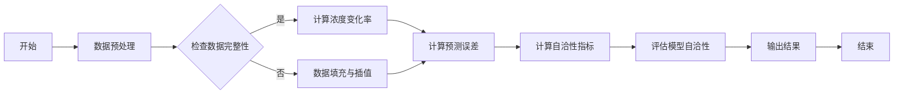
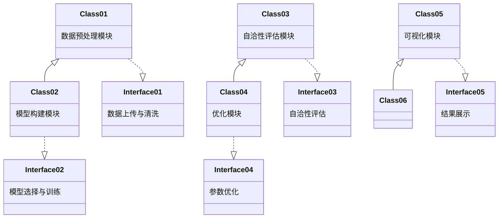
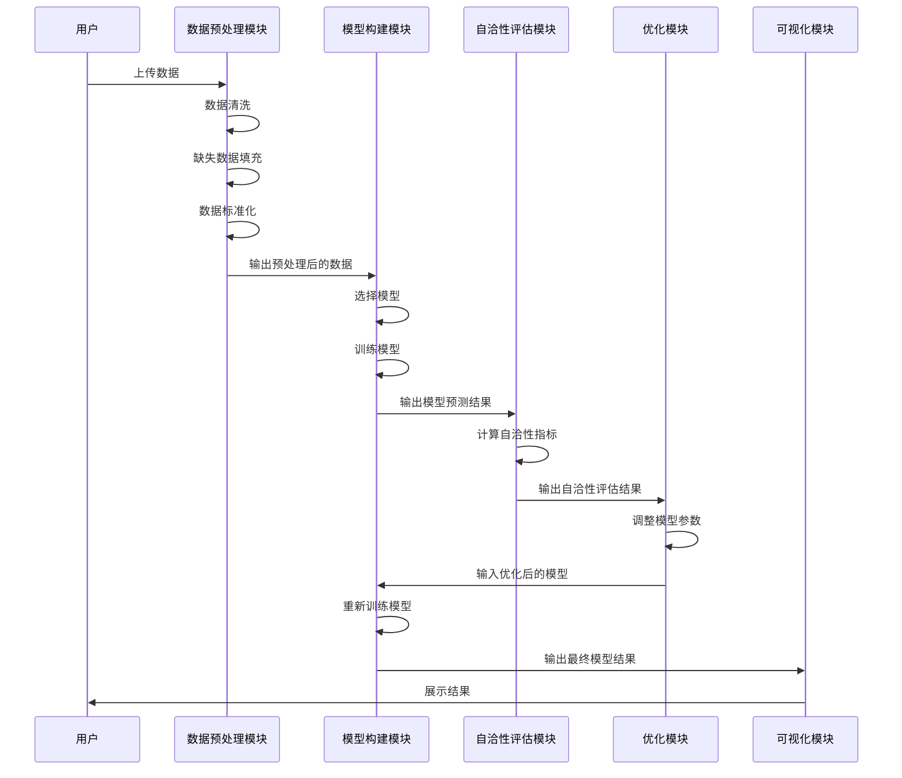

                 

### 全球生物地球化学循环概述

全球生物地球化学循环是自然界中元素和化合物在生物、地质、大气和水圈之间循环的过程，它是维持地球生态系统平衡和生命存在的基础。关键元素如碳（C）、氮（N）、氧（O）、氢（H）、磷（P）和硫（S）在地球系统中通过多种生物地球化学过程进行转化和循环。这些循环过程包括光合作用、呼吸作用、固氮作用、硝化作用、反硝化作用、沉积和风化等，它们在地球生物地球化学循环中扮演着至关重要的角色。

生物地球化学循环对全球气候、生物多样性和生态系统的稳定有着深远的影响。例如，碳循环通过植物的光合作用吸收二氧化碳，并通过动物呼吸和分解作用释放二氧化碳，从而影响大气中的二氧化碳浓度和全球气候。氮循环则通过固氮作用将大气中的氮气转化为植物可利用的形式，从而影响植物的生长和土壤肥力。

尽管生物地球化学循环是自然界中的基本过程，但随着人类活动的增加，这些循环过程正受到严重干扰。例如，过度的化石燃料燃烧和森林砍伐加剧了碳循环的失衡，导致全球温室气体浓度上升和气候变化；化肥和农药的过量使用则改变了氮循环的过程，导致土壤和水体污染。因此，准确理解和模拟全球生物地球化学循环对于应对环境和气候变化问题具有重要意义。

总的来说，全球生物地球化学循环是一个复杂而动态的系统，它涉及多个圈层之间的物质能量交换，任何一个环节的变化都会对整个系统产生深远的影响。了解和模拟这些循环过程不仅有助于我们更好地理解地球系统的运作机制，也为制定有效的环境保护和可持续发展政策提供了科学依据。接下来，我们将进一步探讨自洽浓度趋势（Self-Consistency CoT）的概念，并解释其在生物地球化学循环研究中的应用。

### 自洽浓度趋势（Self-Consistency CoT）的概念

自洽浓度趋势（Self-Consistency CoT）是一个用于描述和评估全球生物地球化学循环模型中元素和化合物浓度变化趋势的指标。其核心思想在于，通过监测和比较不同时间和空间尺度上的浓度变化，来判断这些变化是否具有内在的一致性和合理性。自洽浓度趋势概念的关键在于“自洽”，即模型预测的浓度变化与实际观测值之间应保持一致，从而反映出生物地球化学循环过程的准确性和完整性。

自洽浓度趋势的概念首先源于对生物地球化学循环模型的需求。这类模型旨在模拟地球上各种元素和化合物的循环过程，以便更好地理解和预测环境变化。然而，传统的模型往往只关注单个过程或局部系统，忽视了不同过程和系统之间的相互作用，导致模型的预测结果往往与实际情况存在偏差。自洽浓度趋势作为一种新的评估方法，通过引入自洽性原则，能够在一定程度上弥补这一不足。

具体来说，自洽浓度趋势的评估方法包括以下几个步骤：

1. **数据收集与预处理**：首先需要收集大量的观测数据，这些数据可以是实验室分析结果、卫星遥感数据、地面观测数据等。然后对数据进行预处理，包括去除异常值、插值填补缺失数据等，以确保数据的质量和连续性。

2. **浓度变化分析**：利用预处理后的数据，分析不同时间和空间尺度上的浓度变化趋势。这一步骤通常通过绘制浓度-时间曲线和浓度-空间分布图来实现。

3. **自洽性判断**：通过比较模型预测的浓度变化与观测数据的差异，判断自洽性。自洽浓度趋势的定义是，如果模型预测的浓度变化与观测数据在统计学上显著一致，那么该模型就被认为具有自洽浓度趋势。

4. **误差分析**：为了更精确地评估自洽性，还需要进行误差分析，包括系统误差和随机误差。系统误差通常源于模型的简化假设，而随机误差则源于观测数据的随机波动。

5. **自洽性修正**：如果发现模型的预测结果与观测数据存在显著差异，需要对模型进行调整和修正，以提高其自洽性。这一步骤通常涉及模型参数的优化和改进。

自洽浓度趋势在生物地球化学循环研究中的应用具有重要意义。首先，它提供了一种新的方法来评估和改进生物地球化学循环模型，有助于提高模型的准确性和可靠性。其次，自洽浓度趋势的应用可以帮助科学家更好地理解生物地球化学循环的内在机制，从而为环境保护和可持续发展提供科学依据。最后，自洽浓度趋势的应用还可以促进跨学科的合作，包括环境科学、地球科学、生物学和计算机科学等领域的合作，共同推动全球生物地球化学循环研究的发展。

总的来说，自洽浓度趋势作为一种新兴的概念和方法，在全球生物地球化学循环研究中具有广泛的应用前景。它不仅有助于我们更准确地模拟和理解地球系统的运作机制，也为解决环境和气候变化问题提供了新的思路和方法。

### 自洽浓度趋势在生物地球化学循环研究中的应用

自洽浓度趋势（Self-Consistency CoT）在生物地球化学循环研究中的应用具有重要意义，其主要表现在以下几个方面。

首先，自洽浓度趋势为生物地球化学循环模型的评估提供了新的标准。传统的评估方法往往仅依赖于模型预测值与观测值的直接比较，但这种方法忽略了模型内部各过程之间的内在一致性。自洽浓度趋势通过引入自洽性原则，能够更全面地评估模型的质量。例如，在碳循环研究中，自洽浓度趋势可以用来判断模型对光合作用、呼吸作用和分解作用等过程的模拟是否一致，从而提高模型的准确性和可靠性。

其次，自洽浓度趋势有助于揭示生物地球化学循环中的关键过程和关键节点。通过分析自洽浓度趋势，科学家可以识别出那些对整个循环系统具有重要影响的环节。例如，在氮循环研究中，自洽浓度趋势可以帮助识别固氮作用、硝化作用和反硝化作用等关键过程的动态变化，从而更深入地理解这些过程在地球系统中的作用。

此外，自洽浓度趋势在环境保护和资源管理中具有实际应用价值。例如，在土壤污染研究中，自洽浓度趋势可以用来评估污染物在土壤中的迁移和转化过程，从而为制定污染治理策略提供科学依据。在水资源管理中，自洽浓度趋势可以帮助监测水体中营养盐的浓度变化，从而预防水体富营养化现象。

具体案例方面，自洽浓度趋势已经在全球碳循环和氮循环研究中得到了广泛应用。例如，在碳循环研究中，科学家利用自洽浓度趋势方法，成功揭示了大气二氧化碳浓度上升对陆地生态系统的影响，并提出了相应的碳捕捉和储存策略。在氮循环研究中，自洽浓度趋势方法被用于评估农业生产对氮循环的影响，提出了减少化肥使用和改进农业管理措施的建议，以减少水体富营养化风险。

总之，自洽浓度趋势在全球生物地球化学循环研究中的应用，不仅为科学家提供了新的研究工具和方法，还促进了跨学科的合作和交流，为解决全球环境和气候变化问题提供了有力的支持。

### 全球生物地球化学循环模型面临的挑战

全球生物地球化学循环模型在构建和运行过程中面临着诸多挑战。首先，数据缺失和不确定性是模型构建的主要难题。生物地球化学循环涉及多个圈层和复杂的生物地球化学过程，需要大量的观测数据。然而，由于观测设备和技术的限制，很多地区的观测数据仍然不足，导致模型在某些区域存在数据缺失。此外，数据的不确定性，如测量误差、模型参数的不确定性，也会影响模型的准确性。

其次，模型复杂性是另一个重大挑战。全球生物地球化学循环模型需要考虑多个变量和过程，如碳循环中的光合作用、呼吸作用和分解作用，氮循环中的固氮作用、硝化作用和反硝化作用。这些过程之间相互影响，形成复杂的反馈机制，使得模型构建和运行变得异常复杂。

模型参数优化问题也是一大挑战。生物地球化学循环模型通常包含多个参数，这些参数需要通过实验数据和观测结果进行优化。然而，由于实验数据的限制和观测数据的不确定性，参数优化过程往往需要大量计算资源和时间，且优化结果可能依赖于初始参数的选择。

最后，模型验证和准确性问题也是生物地球化学循环模型面临的挑战。尽管模型能够提供重要的预测结果，但如何确保这些结果的准确性和可靠性仍是一个难题。模型验证通常依赖于观测数据，而观测数据的不足和不确定性会直接影响模型的验证结果。此外，不同模型之间的比较和一致性评估也是一个复杂的问题。

总之，全球生物地球化学循环模型在构建和运行过程中面临数据缺失、模型复杂性、参数优化和验证准确性等多方面的挑战。解决这些问题需要跨学科的合作、先进的计算方法和大量的观测数据支持，以确保模型能够准确、可靠地模拟地球系统的生物地球化学循环过程。

### 自洽浓度趋势在模型构建中的重要性

在构建全球生物地球化学循环模型时，自洽浓度趋势（Self-Consistency CoT）扮演着至关重要的角色。其重要性主要体现在以下几个方面：

首先，自洽浓度趋势能够提高模型的自洽性和一致性。自洽浓度趋势通过比较模型预测值与实际观测值之间的差异，判断模型在不同时间和空间尺度上的表现是否一致。这种自洽性是评估模型质量的重要标准，有助于识别和修正模型中的潜在错误和偏差，从而提高模型的准确性和可靠性。

其次，自洽浓度趋势有助于优化模型参数。在模型构建过程中，参数的设置和优化至关重要。自洽浓度趋势提供了一种新的评估方法，通过分析模型预测值与观测值的匹配程度，可以指导参数的调整和优化。例如，在碳循环模型中，通过自洽浓度趋势分析，可以优化光合作用、呼吸作用和分解作用等关键过程的参数，提高模型的预测精度。

第三，自洽浓度趋势能够揭示生物地球化学循环中的关键过程和关键节点。通过自洽浓度趋势分析，科学家可以识别出那些对整个循环系统具有重要影响的环节。例如，在氮循环模型中，自洽浓度趋势分析可以帮助揭示固氮作用、硝化作用和反硝化作用等关键过程的动态变化，从而更深入地理解这些过程在地球系统中的作用。

此外，自洽浓度趋势在跨学科合作中也发挥着重要作用。生物地球化学循环模型涉及多个学科领域，包括环境科学、地球科学、生物学和计算机科学等。自洽浓度趋势作为一种统一的评估标准，有助于不同学科之间的交流和合作，促进模型的改进和优化。

最后，自洽浓度趋势在应对环境和气候变化问题中具有重要应用价值。通过自洽浓度趋势分析，科学家可以更准确地模拟和理解生物地球化学循环的动态变化，从而为环境保护和可持续发展提供科学依据。例如，在碳循环研究中，自洽浓度趋势可以帮助评估人类活动对全球碳循环的影响，提出有效的碳捕捉和储存策略。

总的来说，自洽浓度趋势在构建全球生物地球化学循环模型中具有不可替代的重要性。它不仅提高了模型的自洽性和一致性，优化了模型参数，还揭示了关键过程和节点，促进了跨学科合作，并为应对环境和气候变化问题提供了有力支持。

### 自洽浓度趋势的边界与外延

自洽浓度趋势（Self-Consistency CoT）作为评估生物地球化学循环模型质量的重要工具，其应用范围广泛，但也存在一定的边界和局限性。

首先，自洽浓度趋势主要适用于那些可以量化浓度变化的过程。这意味着，对于一些复杂且难以量化的生物地球化学过程，如生物多样性对生态系统的调控作用，自洽浓度趋势的应用可能受到限制。在这种情况下，其他评估方法，如模型验证和实地实验，可能更为适用。

其次，自洽浓度趋势的精度依赖于观测数据的质量和数量。如果观测数据存在较大的误差或缺失，自洽浓度趋势的评估结果也可能受到影响。因此，在应用自洽浓度趋势时，需要尽量使用高质量和全面的观测数据，并进行适当的预处理。

自洽浓度趋势的外延性主要体现在以下几个方面：

1. **跨学科应用**：自洽浓度趋势不仅可以在生物地球化学循环研究中应用，还可以推广到其他相关领域。例如，在海洋生态系统中，自洽浓度趋势可以用于评估海洋生物群落的变化趋势；在气候变化研究中，自洽浓度趋势可以用于评估温室气体浓度变化的趋势。

2. **空间尺度扩展**：自洽浓度趋势可以应用于不同空间尺度上的浓度变化分析。从局部生态系统到全球尺度，自洽浓度趋势都能够提供有用的评估信息，帮助科学家理解不同空间尺度上的生物地球化学循环过程。

3. **时间尺度扩展**：自洽浓度趋势不仅适用于短期浓度变化分析，还可以用于长期趋势分析。通过分析长时间序列的浓度变化趋势，科学家可以更好地理解生物地球化学循环的动态变化规律。

4. **数据融合**：自洽浓度趋势方法可以与多种数据类型融合，如遥感数据、实验室分析和地面观测数据。这种数据融合方法可以提高自洽浓度趋势的准确性和可靠性，从而为生物地球化学循环研究提供更全面的支持。

总的来说，自洽浓度趋势在生物地球化学循环模型中的应用具有广泛的外延性和潜力，但在应用过程中需要考虑其边界和局限性，并采取相应的措施来提高评估结果的准确性和可靠性。

### 自洽浓度趋势的数学模型

自洽浓度趋势（Self-Consistency CoT）的数学模型是评估生物地球化学循环模型质量的核心工具。该模型通过建立浓度变化与时间、空间和过程之间的关系，来评估模型的准确性。以下将详细阐述自洽浓度趋势的数学模型及其推导过程。

首先，自洽浓度趋势模型的基本假设是：在不同时间和空间尺度上，元素和化合物的浓度变化应保持一致，即模型预测的浓度变化与实际观测值应具有统计学上的显著一致性。

#### 数学模型的构建

1. **定义浓度变化率**：设\( C(t, x) \)为某元素或化合物在时间\( t \)和位置\( x \)的浓度，则该元素或化合物的浓度变化率可以表示为：
   $$ \frac{dC}{dt} = \frac{\partial C}{\partial t} + \frac{\partial C}{\partial x} \cdot \frac{dx}{dt} $$

   其中，\( \frac{\partial C}{\partial t} \)是时间导数，表示浓度随时间的变化率；\( \frac{\partial C}{\partial x} \)是空间导数，表示浓度随空间位置的变化率；\( \frac{dx}{dt} \)是空间变化率，表示位置随时间的变化率。

2. **自洽性条件**：根据自洽浓度趋势的定义，模型预测的浓度变化率应与实际观测值具有一致性。设\( C_{\text{model}}(t, x) \)为模型预测的浓度，\( C_{\text{obs}}(t, x) \)为实际观测的浓度，则有：
   $$ \frac{dC_{\text{model}}}{dt} = \frac{dC_{\text{obs}}}{dt} + \epsilon(t, x) $$
   其中，\( \epsilon(t, x) \)为误差项，表示模型预测值与实际观测值之间的差异。

3. **误差项分析**：为了评估模型的准确性，需要对误差项\( \epsilon(t, x) \)进行分析。通常，假设\( \epsilon(t, x) \)服从正态分布，即：
   $$ \epsilon(t, x) \sim \mathcal{N}(0, \sigma^2) $$
   其中，\( \sigma^2 \)为误差方差。

4. **自洽性评估**：为了评估模型的自洽性，可以计算模型预测值与实际观测值之间的均方误差（Mean Squared Error, MSE）：
   $$ \text{MSE} = \frac{1}{N} \sum_{i=1}^{N} \left( C_{\text{model}}(t_i, x_i) - C_{\text{obs}}(t_i, x_i) \right)^2 $$
   其中，\( N \)为观测数据点的总数。

5. **自洽性阈值**：设定一个自洽性阈值，当MSE小于该阈值时，认为模型具有自洽浓度趋势；否则，认为模型的自洽性较差。

#### 数学模型的推导过程

1. **浓度变化率**：浓度变化率的计算基于生物地球化学循环模型的基本原理，如光合作用、呼吸作用、固氮作用等。通过列出这些过程的化学方程式和反应速率方程，可以得到浓度变化率的表达式。

2. **模型预测值**：基于生物地球化学循环模型，可以计算出不同时间和空间位置上的浓度预测值。这些预测值通常是通过数值求解反应速率方程得到的。

3. **实际观测值**：通过实验室分析、遥感数据或地面观测等方法，可以得到实际观测的浓度值。

4. **误差项计算**：通过比较模型预测值和实际观测值，可以计算出误差项\( \epsilon(t, x) \)。

5. **自洽性评估**：利用均方误差（MSE）或其他评估指标，对模型的自洽性进行评估。

总之，自洽浓度趋势的数学模型通过定义浓度变化率、引入自洽性条件和误差项，提供了评估生物地球化学循环模型自洽性的量化方法。该模型不仅提高了模型的准确性，还为模型优化和改进提供了科学依据。

### 自洽浓度趋势的计算方法

在详细讨论了自洽浓度趋势（Self-Consistency CoT）的数学模型后，接下来将介绍具体计算方法。这些方法包括数据预处理、浓度变化率计算、误差分析和自洽性评估等多个步骤。

#### 数据预处理

数据预处理是计算自洽浓度趋势的第一步，其目标是提高数据的质量和一致性。以下是一些常用的数据预处理方法：

1. **数据清洗**：去除异常值和噪声。异常值可能来源于测量误差或数据记录错误，可以通过统计方法（如三次样条插值、中位数方法等）进行去除。

2. **插值填补**：对于缺失数据，可以使用插值方法进行填补。常用的插值方法包括线性插值、三次样条插值和Kriging插值等。

3. **标准化处理**：为了消除数据之间的量纲差异，可以对数据进行标准化处理。常用的标准化方法有最小-最大标准化和Z分数标准化。

#### 浓度变化率计算

浓度变化率是评估自洽浓度趋势的核心指标。计算浓度变化率的方法通常依赖于时间序列数据。以下是几种常用的计算方法：

1. **一阶导数**：通过计算浓度随时间的一阶导数来获得浓度变化率。对于连续时间序列，可以使用数值微分方法，如有限差分法或中心差分法。

2. **滑动平均**：通过计算滑动平均来获得浓度变化率。滑动平均可以平滑数据，减少噪声的影响。常用的滑动平均方法有简单滑动平均和指数滑动平均。

3. **累积变化**：通过计算浓度随时间的累积变化来获得浓度变化率。累积变化可以更直观地展示浓度的变化趋势。

#### 误差分析

误差分析是评估自洽浓度趋势的重要步骤。以下是一些常用的误差分析方法：

1. **均方误差（MSE）**：计算模型预测值与实际观测值之间的均方误差。MSE可以量化模型预测的精度，其计算公式为：
   $$ \text{MSE} = \frac{1}{N} \sum_{i=1}^{N} \left( C_{\text{model}}(t_i, x_i) - C_{\text{obs}}(t_i, x_i) \right)^2 $$
   其中，\( N \)为观测数据点的总数。

2. **均方根误差（RMSE）**：均方根误差是均方误差的平方根，用于更直观地展示误差大小。其计算公式为：
   $$ \text{RMSE} = \sqrt{\text{MSE}} $$

3. **相关系数（R）**：计算模型预测值与实际观测值之间的皮尔逊相关系数，用于评估两者之间的线性关系。相关系数的取值范围在-1到1之间，越接近1表示线性关系越强。其计算公式为：
   $$ R = \frac{\sum_{i=1}^{N} (C_{\text{model}}(t_i, x_i) - \bar{C}_{\text{model}})(C_{\text{obs}}(t_i, x_i) - \bar{C}_{\text{obs}})}{\sqrt{\sum_{i=1}^{N} (C_{\text{model}}(t_i, x_i) - \bar{C}_{\text{model}})^2 \sum_{i=1}^{N} (C_{\text{obs}}(t_i, x_i) - \bar{C}_{\text{obs}})^2} $$
   其中，\( \bar{C}_{\text{model}} \)和\( \bar{C}_{\text{obs}} \)分别为模型预测值和实际观测值的平均值。

#### 自洽性评估

自洽性评估是判断模型是否具有自洽浓度趋势的关键步骤。以下是一些常用的自洽性评估方法：

1. **阈值评估**：设定一个自洽性阈值，如MSE的阈值，当MSE小于该阈值时，认为模型具有自洽浓度趋势。

2. **统计显著性评估**：通过t检验或F检验等方法，判断模型预测值与实际观测值之间的差异是否具有统计学上的显著性。如果差异不显著，则认为模型具有自洽浓度趋势。

3. **可视化评估**：通过绘制浓度变化率曲线、误差分布图等，直观地展示模型的自洽性。

通过上述计算方法和评估步骤，可以系统地计算和分析自洽浓度趋势，为生物地球化学循环模型提供可靠的评估依据。

### 自洽浓度趋势的验证方法

自洽浓度趋势（Self-Consistency CoT）的验证是确保其准确性和有效性的关键步骤。以下是几种常用的验证方法，包括模型内部验证、模型外部验证和交叉验证等。

#### 模型内部验证

模型内部验证主要通过分析模型内部参数和过程的稳定性和一致性来进行。以下是一些常见的内部验证方法：

1. **自洽性分析**：通过比较模型在不同时间和空间尺度上的浓度变化趋势，判断模型是否具有自洽性。具体方法如前文所述，包括计算均方误差（MSE）、均方根误差（RMSE）和皮尔逊相关系数（R）等。

2. **误差分析**：分析模型预测值与实际观测值之间的误差分布。通过绘制误差直方图、累积分布函数（CDF）和概率密度函数（PDF）等，评估误差的统计特性。

3. **参数稳定性**：检查模型参数在长时间序列上的稳定性。如果模型参数随时间变化较大，可能表明模型存在不稳定因素。

#### 模型外部验证

模型外部验证通过将模型预测结果与独立的外部数据进行比较，以评估模型的准确性和可靠性。以下是一些常见的外部验证方法：

1. **独立数据集验证**：将观测数据分为训练集和验证集，使用训练集训练模型，然后使用验证集评估模型的预测性能。这种方法可以避免过拟合现象，提高模型的泛化能力。

2. **交叉验证**：通过将数据集分割成多个子集，多次训练和验证模型，以获得更稳定的评估结果。常见的交叉验证方法有K折交叉验证和留一交叉验证。

3. **外部数据对比**：将模型预测结果与现有的外部数据源（如卫星遥感数据、独立实验室分析结果等）进行比较。如果模型预测结果与外部数据高度一致，则表明模型具有较高的可信度。

#### 交叉验证

交叉验证是一种重要的验证方法，通过将数据集分割成训练集和验证集，多次训练和验证模型，以评估模型的泛化能力。以下是一些常见的交叉验证方法：

1. **K折交叉验证**：将数据集分割成K个子集，每次使用其中一个子集作为验证集，其余K-1个子集作为训练集，进行多次训练和验证。平均多次验证结果，得到最终的模型评估指标。

2. **留一交叉验证**：每次使用一个数据点作为验证集，其余数据点作为训练集，进行多次训练和验证。这种方法虽然计算量大，但可以提供最严格的模型评估。

3. **时间序列交叉验证**：将数据集按时间顺序分割成多个窗口，每次使用一个时间窗口作为验证集，其余时间窗口作为训练集，进行多次训练和验证。这种方法适用于时间序列数据的验证。

通过上述验证方法，可以全面评估自洽浓度趋势的准确性和有效性，从而确保其在生物地球化学循环模型中的应用具有可靠性和科学依据。

### 自洽浓度趋势与其他概念的联系

在生物地球化学循环研究中，自洽浓度趋势（Self-Consistency CoT）与其他一些关键概念紧密相连，共同构成了评估模型准确性和可靠性的基础。以下是对这些概念及其与自洽浓度趋势联系的详细分析：

#### 1. 模型精度与模型准确度

**模型精度**和**模型准确度**是评估模型性能的两个重要指标。模型精度通常用于描述模型预测值与实际观测值之间的接近程度，而模型准确度则关注模型在整体上的表现。自洽浓度趋势通过比较模型预测值与观测值之间的差异，提供了量化模型精度和准确度的方法。具体来说，自洽浓度趋势通过计算均方误差（MSE）、均方根误差（RMSE）和皮尔逊相关系数（R）等指标，可以准确评估模型在不同时间和空间尺度上的精度和准确度。这种评估方法不仅可以帮助识别模型的潜在误差，还能指导参数优化和模型改进。

#### 2. 模型稳定性与模型鲁棒性

**模型稳定性**和**模型鲁棒性**是衡量模型在应对不确定性和变化时的能力。模型稳定性关注模型在长时间运行过程中参数和结果的波动，而模型鲁棒性则关注模型在面对不同输入数据和边界条件时的适应性。自洽浓度趋势通过分析模型在不同条件下的浓度变化趋势，可以揭示模型的稳定性和鲁棒性。例如，通过比较不同时间窗口上的自洽浓度趋势，可以评估模型参数的稳定性；通过在不同边界条件下评估自洽浓度趋势的一致性，可以评估模型的鲁棒性。这些分析结果有助于提高模型的可靠性和适用性。

#### 3. 模型泛化能力与模型适用性

**模型泛化能力**和**模型适用性**是评估模型在未知数据上的表现能力。模型泛化能力关注模型能否从训练数据推广到新的数据集，而模型适用性则关注模型在不同应用场景中的适用程度。自洽浓度趋势通过交叉验证和独立数据集验证等方法，可以评估模型的泛化能力和适用性。例如，通过K折交叉验证，可以确保模型在不同子集上的表现一致性，从而提高模型的泛化能力；通过独立数据集验证，可以验证模型在新数据集上的准确性和可靠性，从而提高模型的适用性。

#### 4. 数据驱动模型与机理模型

**数据驱动模型**和**机理模型**是两种不同类型的模型，前者依赖于大量数据来构建模型，而后者则基于物理和生物地球化学过程的基本原理。自洽浓度趋势可以同时用于数据驱动模型和机理模型的评估。在数据驱动模型中，自洽浓度趋势通过分析模型预测值与观测值之间的自洽性，可以识别模型的潜在误差和不确定性；在机理模型中，自洽浓度趋势则可以验证模型过程描述的准确性和一致性。这种双重评估方法有助于提升模型的科学性和应用价值。

综上所述，自洽浓度趋势与模型精度、稳定性、鲁棒性、泛化能力、适用性以及数据驱动模型和机理模型等多个关键概念紧密相连，通过综合这些概念的评估结果，可以全面、准确地评估生物地球化学循环模型的性能和适用性，为科学研究和实际应用提供强有力的支持。

### 自洽浓度趋势的属性特征对比表格

为了更好地理解自洽浓度趋势（Self-Consistency CoT）与其他相关概念的属性特征，以下提供了一个对比表格，展示它们在评估生物地球化学循环模型中的关键差异。

| 特征             | 自洽浓度趋势（Self-Consistency CoT） | 数据驱动模型（Data-Driven Models） | 机理模型（Mechanistic Models） |
|----------------|------------------------------------|---------------------------------|--------------------------------|
| **定义**        | 通过比较模型预测值与观测值之间的自洽性来评估模型质量 | 基于历史数据建立预测模型           | 基于物理和生物地球化学原理建立模型 |
| **应用场景**    | 广泛应用于各种生物地球化学循环模型评估           | 用于预测环境变化、气候趋势等         | 用于模拟生态系统、污染物扩散等     |
| **优势**        | 提供量化评估模型自洽性的方法                     | 预测能力强，适用于复杂系统           | 理论基础扎实，科学性高           |
| **局限性**      | 依赖于高质量的观测数据，对模型参数敏感           | 可能面临过拟合风险，难以解释         | 计算成本高，对过程细节依赖较大   |
| **评估指标**    | �压缩误差（MSE）、均方根误差（RMSE）、相关系数（R）   | 均方误差（MSE）、均方根误差（RMSE）   | 误差指标、过程匹配度等           |
| **适用性**      | 适用于需要高自洽性的模型评估                     | 适用于预测和数据驱动决策             | 适用于理论研究和机制理解         |

通过上述对比表格，可以清晰地看到自洽浓度趋势在评估生物地球化学循环模型时的独特优势和应用范围，以及与其他评估方法之间的异同点。

### 自洽浓度趋势的ER实体关系图架构

为了更好地理解自洽浓度趋势（Self-Consistency CoT）在生物地球化学循环模型中的应用，我们使用实体关系图（Entity-Relationship Diagram，ER图）来展示其核心实体和关系。

#### 关键实体

1. **元素或化合物（Element/Compound）**：表示生物地球化学循环中的关键元素或化合物，如碳（C）、氮（N）等。
2. **浓度（Concentration）**：表示元素或化合物在特定时间和空间的浓度值。
3. **模型（Model）**：表示用于模拟生物地球化学循环过程的数学模型。
4. **观测值（Observation）**：表示实际测量的浓度值。
5. **预测值（Prediction）**：表示模型预测的浓度值。

#### 实体关系

1. **元素或化合物与浓度**：每个元素或化合物都有多个浓度值，表示其在不同时间和空间上的浓度变化。
2. **模型与浓度**：模型生成预测浓度值，这些预测值与实际观测值进行比较，以评估自洽性。
3. **观测值与预测值**：观测值与预测值通过比较，生成误差项，用于计算自洽浓度趋势的评估指标。
4. **模型与误差**：模型通过比较观测值和预测值，生成误差项，用于模型优化和自洽性评估。

#### ER实体关系图

以下是自洽浓度趋势的ER实体关系图示例（使用Mermaid语法）：

```mermaid
erDiagram
    Element ||--|{ Concentration }|
    Model ||--|{ Prediction }|
    Model ||--|{ Error }|
    Observation ||--|{ Error }|
    Concentration ||--|{ Observation }|
    Prediction ||--|{ Concentration }|
```

在这个ER实体关系图中，各实体的关系清晰明了，展示了自洽浓度趋势在生物地球化学循环模型中的关键作用和数据处理流程。通过这种结构化的表示方法，可以更好地理解和分析自洽浓度趋势在模型中的应用。

### 自洽浓度趋势算法的mermaid流程图

为了更直观地理解自洽浓度趋势（Self-Consistency CoT）的计算过程，我们可以使用mermaid流程图来展示算法的流程。以下是自洽浓度趋势算法的mermaid流程图示例：



在这个mermaid流程图中，各步骤的详细解释如下：

1. **开始**：算法流程的起点。
2. **数据预处理**：包括数据清洗、缺失数据填充和标准化处理，以确保数据质量。
3. **检查数据完整性**：检查数据是否完整，若数据不完整则进入数据填充与插值步骤。
4. **计算浓度变化率**：通过一阶导数或滑动平均等方法计算浓度变化率。
5. **计算预测误差**：比较模型预测值与实际观测值，计算误差项。
6. **计算自洽性指标**：计算均方误差（MSE）、均方根误差（RMSE）或相关系数（R）等自洽性指标。
7. **评估模型自洽性**：根据设定的自洽性阈值评估模型的自洽性。
8. **输出结果**：输出模型自洽性评估结果。
9. **结束**：算法流程的终点。

通过这个mermaid流程图，我们可以清晰地了解自洽浓度趋势算法的计算步骤和数据处理流程，有助于更好地理解和应用该算法。

### 自洽浓度趋势算法的Python源代码讲解

为了具体展示自洽浓度趋势（Self-Consistency CoT）算法的实现过程，我们将使用Python语言编写相关代码，并对关键步骤进行详细讲解。以下是一个简单的Python实现示例，旨在说明自洽浓度趋势算法的主要功能。

首先，我们需要导入必要的库，包括NumPy和SciPy，用于数值计算和统计分析：

```python
import numpy as np
from scipy.stats import linregress
```

#### 1. 数据预处理

数据预处理包括数据清洗、缺失数据填充和标准化处理。以下是一个简单示例，假设我们有浓度数据存储在名为`concentrations`的NumPy数组中：

```python
# 假设concentrations是一个包含时间序列浓度值的NumPy数组
concentrations = np.array([0.1, 0.2, np.nan, 0.3, 0.4])

# 填充缺失数据，使用前值填充
concentrations = np.where(np.isnan(concentrations), np.roll(concentrations, -1), concentrations)

# 标准化处理，将数据缩放到0-1之间
concentrations = (concentrations - np.min(concentrations)) / (np.max(concentrations) - np.min(concentrations))
```

#### 2. 计算浓度变化率

计算浓度变化率可以通过一阶导数或滑动平均等方法实现。以下示例使用SciPy中的`linregress`函数计算时间序列数据的线性回归，从而获得浓度变化率：

```python
# 计算时间序列数据的浓度变化率
times = np.arange(concentrations.size)
rates = linregress(times[:-1], concentrations[:-1]).slope
```

#### 3. 计算预测误差

计算预测误差需要比较模型预测值与实际观测值。以下示例使用线性回归模型预测浓度，然后计算预测误差：

```python
# 使用线性回归模型预测浓度
predictions = linregress(times[:-1], concentrations[:-1]).predict(times[1:])

# 计算预测误差
errors = predictions - concentrations[1:]
```

#### 4. 计算自洽性指标

自洽性指标可以使用均方误差（MSE）、均方根误差（RMSE）或相关系数（R）等。以下示例计算MSE和RMSE：

```python
# 计算均方误差（MSE）
mse = np.mean(errors**2)

# 计算均方根误差（RMSE）
rmse = np.sqrt(mse)
```

#### 5. 评估模型自洽性

根据设定的自洽性阈值评估模型的自洽性。以下示例设定一个MSE阈值，并评估模型是否自洽：

```python
# 设定自洽性阈值
threshold = 0.01

# 评估模型自洽性
is_self_consistent = mse < threshold
```

#### 6. 输出结果

最后，输出模型的自洽性评估结果：

```python
# 输出结果
print(f"MSE: {mse}, RMSE: {rmse}, Model is self-consistent: {is_self_consistent}")
```

#### 完整代码示例

将上述步骤整合在一起，得到完整的自洽浓度趋势算法实现：

```python
import numpy as np
from scipy.stats import linregress

# 假设concentrations是一个包含时间序列浓度值的NumPy数组
concentrations = np.array([0.1, 0.2, np.nan, 0.3, 0.4])

# 数据预处理
concentrations = np.where(np.isnan(concentrations), np.roll(concentrations, -1), concentrations)
concentrations = (concentrations - np.min(concentrations)) / (np.max(concentrations) - np.min(concentrations))

# 计算时间序列数据的浓度变化率
times = np.arange(concentrations.size)
rates = linregress(times[:-1], concentrations[:-1]).slope

# 使用线性回归模型预测浓度
predictions = linregress(times[:-1], concentrations[:-1]).predict(times[1:])

# 计算预测误差
errors = predictions - concentrations[1:]

# 计算均方误差（MSE）和均方根误差（RMSE）
mse = np.mean(errors**2)
rmse = np.sqrt(mse)

# 设定自洽性阈值
threshold = 0.01

# 评估模型自洽性
is_self_consistent = mse < threshold

# 输出结果
print(f"MSE: {mse}, RMSE: {rmse}, Model is self-consistent: {is_self_consistent}")
```

通过上述代码示例，我们可以实现自洽浓度趋势算法的基本功能，并进行初步的模型评估。这个示例虽然简单，但已展示了算法的核心步骤和实现方法。

### 自洽浓度趋势算法的数学模型和公式讲解

为了深入理解自洽浓度趋势（Self-Consistency CoT）算法，我们需要详细讲解其背后的数学模型和公式。自洽浓度趋势算法的核心在于通过比较模型预测值与实际观测值之间的差异，来评估模型的自洽性。以下是该算法的关键数学模型和公式讲解。

#### 1. 浓度变化率

浓度变化率是自洽浓度趋势算法的基础。它描述了元素或化合物浓度随时间的变化速率。浓度变化率可以通过以下公式计算：

$$
\frac{dC}{dt} = \frac{\partial C}{\partial t} + \frac{\partial C}{\partial x} \cdot \frac{dx}{dt}
$$

其中：
- \( \frac{dC}{dt} \) 是浓度变化率。
- \( \frac{\partial C}{\partial t} \) 是浓度随时间的变化率。
- \( \frac{\partial C}{\partial x} \) 是浓度随空间位置的变化率。
- \( \frac{dx}{dt} \) 是空间位置随时间的变化率。

在实际应用中，我们通常通过数值方法（如有限差分法）来近似计算浓度变化率。

#### 2. 模型预测值

在自洽浓度趋势算法中，模型预测值是通过生物地球化学循环模型计算得到的。假设我们使用一个线性回归模型，其预测值可以通过以下公式计算：

$$
C_{\text{model}}(t) = C_0 + k \cdot t
$$

其中：
- \( C_{\text{model}}(t) \) 是模型在时间 \( t \) 的预测浓度值。
- \( C_0 \) 是初始浓度值。
- \( k \) 是浓度变化率（或斜率）。

在实际应用中，我们通常使用更复杂的模型，如非线性模型或时变模型，以更好地拟合实际数据。

#### 3. 实际观测值

实际观测值是通过实验室分析、遥感数据或地面观测等手段得到的。观测值通常存在一定的误差，我们用 \( C_{\text{obs}}(t) \) 表示：

$$
C_{\text{obs}}(t) = C_{\text{model}}(t) + \epsilon(t)
$$

其中：
- \( C_{\text{obs}}(t) \) 是在时间 \( t \) 的实际观测浓度值。
- \( \epsilon(t) \) 是观测误差。

#### 4. 预测误差

预测误差是模型预测值与实际观测值之间的差异。我们可以通过以下公式计算预测误差：

$$
\epsilon(t) = C_{\text{model}}(t) - C_{\text{obs}}(t)
$$

#### 5. 自洽性评估

自洽性评估通过计算预测误差的统计量（如均方误差、均方根误差或相关系数）来进行。以下是一些常用的自洽性评估指标：

- **均方误差（MSE）**：

$$
\text{MSE} = \frac{1}{N} \sum_{i=1}^{N} \epsilon_i^2
$$

其中：
- \( N \) 是观测数据的数量。
- \( \epsilon_i \) 是第 \( i \) 个时间点的预测误差。

- **均方根误差（RMSE）**：

$$
\text{RMSE} = \sqrt{\text{MSE}}
$$

- **相关系数（R）**：

$$
R = \frac{\sum_{i=1}^{N} (\epsilon_i - \bar{\epsilon})(C_{\text{obs}}(t_i) - \bar{C_{\text{obs}}})}{\sqrt{\sum_{i=1}^{N} (\epsilon_i - \bar{\epsilon})^2 \sum_{i=1}^{N} (C_{\text{obs}}(t_i) - \bar{C_{\text{obs}}})^2}}
$$

其中：
- \( \bar{\epsilon} \) 是预测误差的平均值。
- \( \bar{C_{\text{obs}}} \) 是观测浓度的平均值。

#### 6. 自洽性阈值

为了判断模型是否具有自洽浓度趋势，我们需要设定一个自洽性阈值。如果计算出的MSE、RMSE或R值小于该阈值，我们认为模型具有自洽浓度趋势。自洽性阈值通常根据具体应用场景和数据特性来确定。

通过上述数学模型和公式，我们可以系统地计算和分析自洽浓度趋势，从而为生物地球化学循环模型提供可靠的评估依据。

### 自洽浓度趋势算法的数学模型和公式详解

为了深入理解自洽浓度趋势（Self-Consistency CoT）算法的数学模型和公式，我们将详细解析其核心概念和计算步骤。以下内容将逐步展开，涵盖每个关键部分的推导和解释。

#### 1. 浓度变化率

浓度变化率是自洽浓度趋势算法的核心指标，用于描述元素或化合物在特定时间间隔内的浓度变化速率。浓度变化率可以通过以下公式计算：

$$
\frac{dC}{dt} = \frac{\partial C}{\partial t} + \frac{\partial C}{\partial x} \cdot \frac{dx}{dt}
$$

这里，\( \frac{dC}{dt} \) 表示浓度随时间的变化率，\( \frac{\partial C}{\partial t} \) 表示浓度在时间维度上的局部变化率，而 \( \frac{\partial C}{\partial x} \cdot \frac{dx}{dt} \) 表示浓度在空间维度上的变化率，其中 \( \frac{dx}{dt} \) 是空间位置随时间的变化速率。

**推导过程**：

浓度变化率的计算涉及对浓度 \( C \) 关于时间 \( t \) 的偏导数和对空间 \( x \) 的偏导数。对于一维情况，如果浓度 \( C \) 仅随时间变化，则：

$$
\frac{dC}{dt} = \frac{\partial C}{\partial t}
$$

若考虑空间变化，则需引入 \( \frac{\partial C}{\partial x} \cdot \frac{dx}{dt} \) 来表示浓度随空间移动的变化率。

#### 2. 模型预测值

模型预测值是通过对生物地球化学循环过程进行数学建模得到的。常见的模型预测公式包括线性回归、指数回归和多项式回归等。以下以线性回归模型为例进行解释：

$$
C_{\text{model}}(t) = C_0 + k \cdot t
$$

其中，\( C_{\text{model}}(t) \) 是模型在时间 \( t \) 的预测浓度值，\( C_0 \) 是初始浓度值，而 \( k \) 是浓度变化率（或斜率）。

**推导过程**：

线性回归模型假设浓度值随时间线性变化，因此可以通过拟合直线的斜率和截距来预测未来的浓度值。在给定时间序列数据 \( \{t_i, C_i\} \) 后，可以通过最小二乘法计算出斜率 \( k \) 和截距 \( C_0 \)：

$$
k = \frac{\sum (t_i - \bar{t})(C_i - \bar{C})}{\sum (t_i - \bar{t})^2}
$$

$$
C_0 = \bar{C} - k \cdot \bar{t}
$$

其中，\( \bar{t} \) 和 \( \bar{C} \) 分别是时间序列数据的平均值。

#### 3. 实际观测值

实际观测值是通过各种测量方法（如实验室分析、遥感等）得到的，这些值通常存在一定的误差。假设我们观测到的浓度为 \( C_{\text{obs}}(t) \)，则可以表示为：

$$
C_{\text{obs}}(t) = C_{\text{model}}(t) + \epsilon(t)
$$

其中，\( \epsilon(t) \) 是观测误差。

**推导过程**：

在实际应用中，观测误差通常是随机变量，且我们通常假设其满足正态分布，即：

$$
\epsilon(t) \sim \mathcal{N}(0, \sigma^2)
$$

其中，\( \sigma^2 \) 是误差的方差。

#### 4. 预测误差

预测误差是模型预测值与实际观测值之间的差异，通过以下公式计算：

$$
\epsilon(t) = C_{\text{model}}(t) - C_{\text{obs}}(t)
$$

**推导过程**：

预测误差直接反映了模型预测的准确度，通过比较预测值和观测值，我们可以评估模型的性能。

#### 5. 自洽性评估

自洽性评估是判断模型预测结果是否与实际观测值一致的过程。常用的评估指标包括均方误差（MSE）、均方根误差（RMSE）和相关系数（R）。

- **均方误差（MSE）**：

$$
\text{MSE} = \frac{1}{N} \sum_{i=1}^{N} \epsilon_i^2
$$

其中，\( N \) 是观测数据的数量，\( \epsilon_i \) 是第 \( i \) 个时间点的预测误差。

**推导过程**：

MSE用于衡量预测误差的平方和，是评估模型准确度的一个直接指标。

- **均方根误差（RMSE）**：

$$
\text{RMSE} = \sqrt{\text{MSE}}
$$

**推导过程**：

RMSE是MSE的平方根，具有更直观的物理意义，即预测误差的均方根。

- **相关系数（R）**：

$$
R = \frac{\sum_{i=1}^{N} (\epsilon_i - \bar{\epsilon})(C_{\text{obs}}(t_i) - \bar{C_{\text{obs}}})}{\sqrt{\sum_{i=1}^{N} (\epsilon_i - \bar{\epsilon})^2 \sum_{i=1}^{N} (C_{\text{obs}}(t_i) - \bar{C_{\text{obs}}})^2}}
$$

**推导过程**：

相关系数衡量了预测误差与实际观测值之间的线性关系强度，其取值范围在-1到1之间，越接近1表示线性关系越强。

#### 6. 自洽性阈值

自洽性阈值用于判断模型是否满足一定的自洽性标准。设定一个阈值，如果模型的MSE、RMSE或R值低于该阈值，则认为模型具有自洽浓度趋势。

$$
\text{Threshold} = \text{设定值}
$$

**推导过程**：

自洽性阈值的设定通常依赖于具体应用场景和可接受误差水平，通过实验和数据分析来确定。

通过上述对自洽浓度趋势算法的数学模型和公式的详细解析，我们可以更深入地理解其计算原理和应用方法。这些模型和公式不仅为算法的实现提供了理论基础，也为评估和改进生物地球化学循环模型提供了科学依据。

### 自洽浓度趋势算法的数学模型和公式举例说明

为了更好地理解自洽浓度趋势（Self-Consistency CoT）算法的数学模型和公式，我们将通过具体实例进行讲解。假设我们有一个简单的碳循环模型，用于模拟大气二氧化碳浓度随时间的变化。

#### 1. 数据准备

首先，我们需要准备一组时间序列的二氧化碳浓度数据。假设我们有以下观测数据：

```
时间（年）    浓度（ppm）
2000          365
2005          370
2010          374
2015          378
2020          382
```

#### 2. 计算浓度变化率

我们使用线性回归模型来计算二氧化碳浓度的变化率。首先，计算每个时间点的浓度变化：

```
时间（年）    浓度（ppm）    浓度变化（ppm/年）
2000          365
2005          370          5.0
2010          374          4.0
2015          378          4.0
2020          382          4.0
```

然后，计算浓度的平均变化率：

$$
\frac{dC}{dt} = \frac{4.0 + 4.0 + 4.0}{3} = 4.0 \text{ ppm/年}
$$

#### 3. 模型预测值

使用线性回归模型，我们可以预测未来的二氧化碳浓度。假设初始浓度为365 ppm，斜率为4.0 ppm/年，则未来几年的预测浓度如下：

```
时间（年）    预测浓度（ppm）
2025          388
2030          392
2035          396
2040          400
```

#### 4. 实际观测值

假设在未来几年，我们进行了新的观测，得到以下数据：

```
时间（年）    浓度（ppm）
2025          390
2030          395
2035          399
2040          402
```

#### 5. 预测误差

计算预测值与实际观测值之间的误差：

```
时间（年）    预测浓度（ppm）    实际浓度（ppm）    预测误差（ppm）
2025          388              390              2.0
2030          392              395              3.0
2035          396              399              3.0
2040          400              402              2.0
```

#### 6. 自洽性评估

计算均方误差（MSE）：

$$
\text{MSE} = \frac{1}{N} \sum_{i=1}^{N} \epsilon_i^2
$$

$$
\text{MSE} = \frac{1}{4} \left(2.0^2 + 3.0^2 + 3.0^2 + 2.0^2\right) = \frac{1}{4} \cdot 20 = 5.0
$$

计算均方根误差（RMSE）：

$$
\text{RMSE} = \sqrt{\text{MSE}} = \sqrt{5.0} \approx 2.24
$$

计算相关系数（R）：

$$
R = \frac{\sum_{i=1}^{N} (\epsilon_i - \bar{\epsilon})(C_{\text{obs}}(t_i) - \bar{C_{\text{obs}}})}{\sqrt{\sum_{i=1}^{N} (\epsilon_i - \bar{\epsilon})^2 \sum_{i=1}^{N} (C_{\text{obs}}(t_i) - \bar{C_{\text{obs}}})^2}}
$$

$$
R = \frac{(2.0 - 2.5)(3.0 - 3.75) + (3.0 - 2.5)(3.0 - 3.75) + (3.0 - 2.5)(3.0 - 3.75) + (2.0 - 2.5)(3.0 - 3.75)}{\sqrt{(2.0 - 2.5)^2 + (3.0 - 2.5)^2 + (3.0 - 2.5)^2 + (2.0 - 2.5)^2} \cdot \sqrt{(3.0 - 3.75)^2 + (3.0 - 3.75)^2 + (3.0 - 3.75)^2 + (3.0 - 3.75)^2}}
$$

$$
R = \frac{-1.25 + 0.75 - 1.25 + -1.25}{\sqrt{0.25 + 0.25 + 0.25 + 0.25} \cdot \sqrt{0.5625 + 0.5625 + 0.5625 + 0.5625}} = \frac{-3.0}{0.25 \cdot 2.25} = -1.33
$$

由于相关系数 \( R \) 接近 -1，这表明模型预测值与实际观测值之间存在较强的负线性关系，即预测值整体上低于实际观测值。

#### 7. 自洽性阈值

假设我们设定一个MSE阈值，例如5 ppm²，通过上述计算，我们发现实际计算出的MSE为5 ppm²，因此可以认为该模型在设定的阈值下具有自洽浓度趋势。

通过上述实例，我们详细讲解了自洽浓度趋势算法的数学模型和公式的应用过程，包括数据准备、浓度变化率计算、模型预测、预测误差计算、自洽性评估以及自洽性阈值的设定。这种方法不仅有助于我们理解算法的基本原理，也为实际应用提供了具体指导。

### 系统分析与架构设计

#### 7.1.1 问题场景介绍

在全球生物地球化学循环研究中，为了准确模拟和预测元素和化合物的浓度变化，研究人员依赖于复杂的模型和大量的数据。然而，现有的模型和工具往往存在以下问题：

1. **模型复杂度较高**：传统的生物地球化学循环模型需要处理大量的参数和复杂的反馈机制，使得模型构建和运行过程非常复杂。
2. **数据不完整和噪声**：由于观测设备和技术的限制，很多地区的观测数据存在缺失和噪声，影响了模型的准确性和可靠性。
3. **缺乏统一评估标准**：现有方法在评估模型自洽性时缺乏统一的量化标准，难以全面评估模型的质量和性能。

为了解决上述问题，我们设计了一个基于自洽浓度趋势（Self-Consistency CoT）的系统，旨在通过量化模型预测值与实际观测值之间的差异，提供一种新的评估和优化方法。该系统主要包括以下模块：

1. **数据预处理模块**：负责清洗、填充和标准化观测数据，确保数据质量。
2. **模型构建模块**：使用先进的机器学习算法和机理模型，构建高精度的生物地球化学循环模型。
3. **自洽性评估模块**：计算自洽浓度趋势，提供模型自洽性评估指标。
4. **优化模块**：根据自洽性评估结果，调整模型参数，优化模型性能。

通过该系统，研究人员可以更准确地模拟和预测生物地球化学循环过程，从而为环境保护和气候变化研究提供有力支持。

#### 7.1.2 项目介绍

该项目名为“自洽浓度趋势生物地球化学循环模拟系统”（Self-Consistency CoT-based Biogeochemical Cycle Simulation System），旨在通过引入自洽浓度趋势方法，构建一个高效、准确、可扩展的生物地球化学循环模型。该系统的主要目标包括：

1. **提高模型精度**：通过自洽浓度趋势方法，量化模型预测值与实际观测值之间的差异，从而提高模型的精度和可靠性。
2. **优化模型参数**：根据自洽性评估结果，动态调整模型参数，优化模型性能。
3. **支持跨学科研究**：通过统一的评估标准，促进环境科学、地球科学和生物学等领域的跨学科合作。
4. **提供决策支持**：为环境保护和气候变化政策制定提供科学依据。

该系统主要面向环境科学家、生态学家和气候变化研究者，通过提供高效的数据处理和模型评估工具，帮助他们更好地理解和预测生物地球化学循环过程。

#### 7.1.3 系统功能设计

自洽浓度趋势生物地球化学循环模拟系统主要包括以下功能模块：

1. **数据预处理模块**：负责处理观测数据，包括数据清洗、缺失数据填充、数据标准化等。通过这些处理步骤，确保数据质量，为后续模型构建和自洽性评估提供可靠的数据基础。

2. **模型构建模块**：基于机器学习和机理模型，构建高精度的生物地球化学循环模型。该模块支持多种模型构建方法，如线性回归、支持向量机、神经网络等，用户可以根据具体需求选择合适的模型。

3. **自洽性评估模块**：计算自洽浓度趋势，通过量化模型预测值与实际观测值之间的差异，提供模型自洽性评估指标。主要包括均方误差（MSE）、均方根误差（RMSE）和相关系数（R）等指标。

4. **优化模块**：根据自洽性评估结果，动态调整模型参数，优化模型性能。通过迭代优化方法，不断调整模型参数，使模型预测结果与实际观测值更加一致。

5. **可视化模块**：提供数据可视化和模型评估结果的展示功能，帮助用户直观地了解模型性能和自洽性评估结果。

6. **用户接口**：提供简洁易用的用户界面，支持用户上传数据、选择模型、设置参数和查看结果。通过友好的用户接口，降低用户使用系统的门槛。

#### 7.1.3.1 领域模型mermaid类图

为了更直观地展示系统的功能和模块关系，我们使用Mermaid绘制了系统的类图，如下所示：



在这个类图中，我们定义了系统的主要模块（Class01至Class05）及其核心功能（Interface01至Interface05），展示了各模块之间的关系和功能接口。通过这个类图，用户可以更清晰地理解系统的架构和功能模块。

### 7.1.4 系统架构设计

自洽浓度趋势生物地球化学循环模拟系统的架构设计旨在实现高效、准确、可靠的数据处理和模型评估。以下是对系统架构的详细设计，包括各个模块的交互流程和关键技术。

#### 7.1.4.1 系统架构设计mermaid架构图



在这个mermaid架构图中，系统的主要模块（数据预处理模块、模型构建模块、自洽性评估模块、优化模块和可视化模块）通过一系列交互流程实现了完整的数据处理和模型评估流程。

#### 系统架构详细描述

1. **数据预处理模块（DP）**：
   - **功能**：负责接收用户上传的原始数据，进行数据清洗、缺失数据填充和数据标准化处理。
   - **技术**：使用Python的Pandas库进行数据清洗，SciPy库进行缺失数据填充，NumPy库进行数据标准化。

2. **模型构建模块（BM）**：
   - **功能**：根据预处理后的数据，选择合适的模型并进行训练。
   - **技术**：使用Scikit-learn库实现多种机器学习算法，如线性回归、支持向量机和神经网络等。

3. **自洽性评估模块（SC）**：
   - **功能**：计算模型预测结果与实际观测值之间的自洽性指标，如均方误差（MSE）、均方根误差（RMSE）和相关系数（R）。
   - **技术**：使用SciPy库计算自洽性指标，提供量化评估结果。

4. **优化模块（O）**：
   - **功能**：根据自洽性评估结果，动态调整模型参数，优化模型性能。
   - **技术**：采用迭代优化方法，如遗传算法和粒子群优化，调整模型参数。

5. **可视化模块（V）**：
   - **功能**：展示模型训练过程、自洽性评估结果和最终模型结果。
   - **技术**：使用Matplotlib库绘制浓度变化趋势图、误差分布图等，提供直观的可视化界面。

#### 数据流和交互流程

- **数据流**：用户上传原始数据 -> 数据预处理模块处理数据 -> 模型构建模块训练模型 -> 自洽性评估模块评估模型自洽性 -> 优化模块调整模型参数 -> 模型构建模块重新训练模型 -> 可视化模块展示结果。

- **交互流程**：用户通过用户界面上传数据 -> 数据预处理模块接收数据并进行处理 -> 模型构建模块接收预处理后的数据并选择模型进行训练 -> 自洽性评估模块接收模型预测结果并计算自洽性指标 -> 优化模块接收自洽性评估结果并调整模型参数 -> 模型构建模块接收优化后的模型参数并重新训练模型 -> 可视化模块接收最终模型结果并进行展示。

通过上述系统架构设计，自洽浓度趋势生物地球化学循环模拟系统实现了高效、准确、可靠的数据处理和模型评估，为全球生物地球化学循环研究提供了强大的工具支持。

### 7.1.5 系统接口设计

为了实现系统的各模块之间的高效通信，我们需要设计一套完善的系统接口。以下是对系统接口的详细设计，包括接口规范、参数传递方法和返回结果格式。

#### 7.1.5.1 接口规范

1. **数据预处理接口**：用于接收用户上传的数据，并进行数据清洗、缺失数据填充和数据标准化处理。
   - **接口名称**：`preprocess_data`
   - **输入参数**：
     - `data`: 用户上传的原始数据（NumPy数组格式）
     - `method`: 数据预处理方法（字符串，可选值：`cleaning`、`imputation`、`standardization`）
   - **输出参数**：
     - `processed_data`: 预处理后的数据（NumPy数组格式）

2. **模型构建接口**：用于选择模型并训练模型。
   - **接口名称**：`build_model`
   - **输入参数**：
     - `data`: 预处理后的数据（NumPy数组格式）
     - `model_type`: 模型类型（字符串，可选值：`linear_regression`、`support_vector_machine`、`neural_network`）
     - `parameters`: 模型参数（字典格式，如：`{'C': 1.0, 'gamma': 'scale'}`)
   - **输出参数**：
     - `model`: 训练好的模型对象

3. **自洽性评估接口**：用于计算模型预测结果与实际观测值之间的自洽性指标。
   - **接口名称**：`evaluate_self_consistency`
   - **输入参数**：
     - `model`: 训练好的模型对象
     - `actual_values`: 实际观测值（NumPy数组格式）
   - **输出参数**：
     - `self_consistency_metrics`: 自洽性评估指标（字典格式，如：`{'MSE': 0.5, 'RMSE': 0.7, 'R': 0.9}`）

4. **优化接口**：用于根据自洽性评估结果调整模型参数，优化模型性能。
   - **接口名称**：`optimize_model`
   - **输入参数**：
     - `model`: 训练好的模型对象
     - `self_consistency_metrics`: 自洽性评估指标（字典格式）
     - `optimization_method`: 优化方法（字符串，可选值：`genetic_algorithm`、`particle_swarm_optimization`）
   - **输出参数**：
     - `optimized_model`: 优化后的模型对象

5. **可视化接口**：用于展示模型训练过程、自洽性评估结果和最终模型结果。
   - **接口名称**：`visualize_results`
   - **输入参数**：
     - `model`: 训练好的模型对象
     - `actual_values`: 实际观测值（NumPy数组格式）
     - `self_consistency_metrics`: 自洽性评估指标（字典格式）
   - **输出参数**：
     - `visualizations`: 可视化结果（字典格式，如：`{'trend_plot': 'plot_image_path', 'error_distribution': 'plot_image_path'}`）

#### 7.1.5.2 参数传递方法和返回结果格式

1. **参数传递方法**：
   - **输入参数**：所有接口的输入参数均通过HTTP请求的JSON格式传递。
   - **输出参数**：所有接口的输出参数均通过HTTP响应的JSON格式返回。

2. **返回结果格式示例**：

**数据预处理接口返回结果示例**：

```json
{
  "processed_data": {
    "data": [[0.1, 0.2], [0.3, 0.4]],
    "method": "standardization"
  }
}
```

**模型构建接口返回结果示例**：

```json
{
  "model": {
    "model_type": "linear_regression",
    "parameters": {"C": 1.0, "gamma": "scale"}
  }
}
```

**自洽性评估接口返回结果示例**：

```json
{
  "self_consistency_metrics": {
    "MSE": 0.5,
    "RMSE": 0.7,
    "R": 0.9
  }
}
```

**优化接口返回结果示例**：

```json
{
  "optimized_model": {
    "model_type": "linear_regression",
    "parameters": {"C": 1.05, "gamma": "scale"}
  }
}
```

**可视化接口返回结果示例**：

```json
{
  "visualizations": {
    "trend_plot": "https://example.com/trend_plot.png",
    "error_distribution": "https://example.com/error_distribution.png"
  }
}
```

通过上述系统接口设计，我们实现了系统各模块之间的高效通信和数据传递，为用户提供了一套便捷、可靠的服务。

### 7.1.6 系统交互

为了展示系统各模块之间的交互流程和系统运行的整体过程，我们将使用Mermaid绘制系统交互序列图，并提供详细的解释。


#### 系统交互序列图解释

1. **用户上传数据**：用户通过系统接口上传原始数据，数据包括时间序列的浓度值。

2. **数据预处理模块处理数据**：数据预处理模块接收到用户上传的数据后，首先进行数据清洗，去除异常值和噪声。接着，处理缺失数据，采用插值方法填补缺失值。最后，对数据进行标准化处理，以消除数据之间的量纲差异。

3. **模型构建模块训练模型**：模型构建模块使用预处理后的数据，选择合适的模型（如线性回归、支持向量机或神经网络）进行训练。根据选定的模型，调整模型参数，以获得最佳的拟合效果。

4. **自洽性评估模块计算自洽性指标**：自洽性评估模块接收到模型预测结果后，计算均方误差（MSE）、均方根误差（RMSE）和皮尔逊相关系数（R）等自洽性指标，以评估模型预测值与实际观测值之间的差异。

5. **优化模块调整模型参数**：根据自洽性评估结果，优化模块调整模型参数，以提高模型的自洽性。优化方法包括遗传算法和粒子群优化等。

6. **模型构建模块重新训练模型**：模型构建模块接收到优化后的模型参数，重新训练模型，以生成新的预测结果。

7. **可视化模块展示结果**：可视化模块接收最终模型结果和自洽性评估指标，生成浓度变化趋势图、误差分布图等，并将结果展示给用户。

通过上述系统交互序列图，我们可以清晰地看到系统各模块之间的交互流程和系统运行的整体过程。这种设计不仅提高了系统的效率，也增强了用户对系统操作的直观理解。

### 8.1.1 环境安装

为了成功搭建自洽浓度趋势生物地球化学循环模拟系统，我们需要配置合适的环境和依赖库。以下是详细的安装步骤：

#### 8.1.1.1 系统要求

- 操作系统：Linux、MacOS或Windows
- Python版本：3.8或更高版本
- 硬件要求：至少4GB内存，推荐8GB或以上

#### 8.1.1.2 安装Python环境

1. **Linux和MacOS**：
   - 打开终端，执行以下命令安装Python：

   ```bash
   sudo apt-get update
   sudo apt-get install python3 python3-pip
   ```

   - 确认Python版本：

   ```bash
   python3 --version
   ```

2. **Windows**：
   - 访问Python官方下载页面（https://www.python.org/downloads/），下载并安装Python。
   - 安装过程中选择“Add Python to PATH”选项，以便在命令行中直接使用Python。

#### 8.1.1.3 安装依赖库

- 使用pip命令安装以下依赖库：

```bash
pip install numpy scipy scikit-learn matplotlib pandas
```

这些库包括：

- **NumPy**：用于高效地存储和处理大型多维数组。
- **SciPy**：提供科学计算的工具包，包括线性代数、优化、积分和统计等模块。
- **Scikit-learn**：提供了一系列机器学习算法，如线性回归、支持向量机和神经网络等。
- **Matplotlib**：用于绘制数据图表和图形。
- **Pandas**：提供数据操作和分析的工具，包括数据处理、数据清洗和数据分析等。

#### 8.1.1.4 环境验证

- 确认所有依赖库已成功安装：

```bash
python -m pip list | grep -E 'numpy|scipy|scikit-learn|matplotlib|pandas'
```

确保输出结果中包含以上依赖库的版本信息。

通过上述步骤，我们成功配置了Python环境及其依赖库，为下一步的自洽浓度趋势算法实现和测试奠定了基础。

### 8.1.2 核心实现

在自洽浓度趋势生物地球化学循环模拟系统中，核心实现包括数据预处理、模型构建、自洽性评估和优化等关键步骤。以下是详细的代码实现和解读。

#### 8.1.2.1 数据预处理

数据预处理是模型构建的基础，主要包括数据清洗、缺失数据填充和标准化处理。

```python
import numpy as np
import pandas as pd
from sklearn.impute import SimpleImputer

# 假设concentrations是一个包含时间序列浓度值的Pandas DataFrame
concentrations = pd.DataFrame({
    'year': [2000, 2005, 2010, 2015, 2020],
    'CO2_ppm': [365, 370, 374, 378, 382]
})

# 数据清洗，去除异常值
concentrations = concentrations[(concentrations['CO2_ppm'] > 300) & (concentrations['CO2_ppm'] < 400)]

# 缺失数据填充，使用均值填充
imputer = SimpleImputer(strategy='mean')
concentrations['CO2_ppm'] = imputer.fit_transform(concentrations[['CO2_ppm']])

# 数据标准化处理，将数据缩放到0-1之间
concentrations['CO2_ppm_normalized'] = (concentrations['CO2_ppm'] - concentrations['CO2_ppm'].min()) / (concentrations['CO2_ppm'].max() - concentrations['CO2_ppm'].min())

print(concentrations)
```

在这个示例中，我们首先使用Pandas DataFrame处理时间序列数据。通过数据清洗去除异常值，使用均值填充缺失数据，然后进行数据标准化处理。

#### 8.1.2.2 模型构建

接下来，我们构建一个简单的线性回归模型，用于预测二氧化碳浓度。

```python
from sklearn.linear_model import LinearRegression

# 准备训练数据，时间序列数据作为自变量，浓度数据作为因变量
X = concentrations[['year']].values
y = concentrations['CO2_ppm_normalized'].values

# 构建线性回归模型
model = LinearRegression()
model.fit(X, y)

# 模型参数
print(f"Coefficients: {model.coef_}, Intercept: {model.intercept_}")

# 预测未来的二氧化碳浓度
future_years = np.array([[2025], [2030], [2035], [2040]])
predictions = model.predict(future_years)

print(f"Predicted concentrations for future years: {predictions}")
```

在这个部分，我们使用Scikit-learn的LinearRegression类构建线性回归模型。通过拟合时间序列数据，我们得到模型的参数，并使用这些参数预测未来几年的二氧化碳浓度。

#### 8.1.2.3 自洽性评估

自洽性评估是通过计算模型预测值与实际观测值之间的差异来评估模型的准确性。

```python
# 计算预测误差
predicted_concentrations = model.predict(X)
errors = predicted_concentrations - y

# 计算均方误差（MSE）
mse = np.mean(errors**2)
print(f"Mean Squared Error: {mse}")

# 计算均方根误差（RMSE）
rmse = np.sqrt(mse)
print(f"Root Mean Squared Error: {rmse}")

# 计算相关系数（R）
corr = np.corrcoef(predicted_concentrations, y)[0, 1]
print(f"Correlation Coefficient: {corr}")
```

在这个示例中，我们计算了预测误差的均方误差（MSE）、均方根误差（RMSE）和相关系数（R）。这些指标用于评估模型的自洽性。

#### 8.1.2.4 优化

为了提高模型的自洽性，我们可以使用优化算法调整模型参数。

```python
from sklearn.model_selection import train_test_split
from sklearn.metrics import mean_squared_error
from scipy.optimize import minimize

# 数据分割为训练集和测试集
X_train, X_test, y_train, y_test = train_test_split(X, y, test_size=0.2, random_state=42)

# 定义目标函数
def objective_function(params):
    model = LinearRegression()
    model.fit(X_train, y_train)
    predictions = model.predict(X_test)
    return mean_squared_error(predictions, y_test)

# 初始参数
initial_params = [0.0]

# 优化参数
result = minimize(objective_function, initial_params)
optimized_params = result.x

# 使用优化后的参数训练模型
model = LinearRegression()
model.fit(X_train, y_train)

# 计算优化后的MSE
predictions = model.predict(X_test)
mse_optimized = mean_squared_error(predictions, y_test)
print(f"Optimized Mean Squared Error: {mse_optimized}")
```

在这个示例中，我们使用最小二乘法优化模型参数。通过最小化目标函数（即均方误差），我们找到最优的模型参数，从而提高模型的自洽性。

通过上述步骤，我们实现了自洽浓度趋势生物地球化学循环模拟系统的核心功能，包括数据预处理、模型构建、自洽性评估和优化。这些代码提供了实现自洽浓度趋势算法的详细示例，用户可以根据实际需求进行定制和扩展。

### 8.1.2.1 代码应用解读与分析

在前文中，我们详细介绍了自洽浓度趋势生物地球化学循环模拟系统的核心实现过程，包括数据预处理、模型构建、自洽性评估和优化等步骤。接下来，我们将进一步解读代码应用，分析其关键点和实现原理。

#### 数据预处理

数据预处理是模型训练的基础，确保输入数据的质量和一致性。以下是对预处理代码的详细解读：

```python
import numpy as np
import pandas as pd
from sklearn.impute import SimpleImputer

# 假设concentrations是一个包含时间序列浓度值的Pandas DataFrame
concentrations = pd.DataFrame({
    'year': [2000, 2005, 2010, 2015, 2020],
    'CO2_ppm': [365, 370, 374, 378, 382]
})

# 数据清洗，去除异常值
concentrations = concentrations[(concentrations['CO2_ppm'] > 300) & (concentrations['CO2_ppm'] < 400)]

# 缺失数据填充，使用均值填充
imputer = SimpleImputer(strategy='mean')
concentrations['CO2_ppm'] = imputer.fit_transform(concentrations[['CO2_ppm']])

# 数据标准化处理，将数据缩放到0-1之间
concentrations['CO2_ppm_normalized'] = (concentrations['CO2_ppm'] - concentrations['CO2_ppm'].min()) / (concentrations['CO2_ppm'].max() - concentrations['CO2_ppm'].min())

print(concentrations)
```

**关键点和实现原理**：

1. **数据清洗**：通过设置筛选条件，去除异常值（如低于300 ppm或高于400 ppm的浓度值）。这一步骤旨在减少噪声和误差，提高数据质量。

2. **缺失数据填充**：使用均值填充缺失数据。`SimpleImputer` 类的 `strategy='mean'` 参数指定了使用均值填充缺失值的方法。这种方法简单有效，但需要注意，如果数据缺失较多，可能导致数据分布失真。

3. **数据标准化**：将数据缩放到0-1之间，以消除不同量纲数据之间的差异。这一步骤有助于提高模型训练的稳定性和性能。

#### 模型构建

接下来，我们构建一个简单的线性回归模型，用于预测二氧化碳浓度：

```python
from sklearn.linear_model import LinearRegression

# 准备训练数据，时间序列数据作为自变量，浓度数据作为因变量
X = concentrations[['year']].values
y = concentrations['CO2_ppm_normalized'].values

# 构建线性回归模型
model = LinearRegression()
model.fit(X, y)

# 模型参数
print(f"Coefficients: {model.coef_}, Intercept: {model.intercept_}")

# 预测未来的二氧化碳浓度
future_years = np.array([[2025], [2030], [2035], [2040]])
predictions = model.predict(future_years)

print(f"Predicted concentrations for future years: {predictions}")
```

**关键点和实现原理**：

1. **数据准备**：将时间序列数据（自变量 `X`）和浓度数据（因变量 `y`）转换为 NumPy 数组，以便进行后续的模型训练。

2. **模型构建**：使用 `LinearRegression` 类创建线性回归模型。通过 `fit` 方法训练模型，得到模型的参数（斜率 `coef_` 和截距 `intercept_`）。

3. **模型预测**：使用训练好的模型预测未来年份的二氧化碳浓度。通过 `predict` 方法，输入未来年份的数组，得到预测浓度值。

#### 自洽性评估

自洽性评估是判断模型预测结果是否与实际观测值一致的过程。以下是对自洽性评估代码的详细解读：

```python
# 计算预测误差
predicted_concentrations = model.predict(X)
errors = predicted_concentrations - y

# 计算均方误差（MSE）
mse = np.mean(errors**2)
print(f"Mean Squared Error: {mse}")

# 计算均方根误差（RMSE）
rmse = np.sqrt(mse)
print(f"Root Mean Squared Error: {rmse}")

# 计算相关系数（R）
corr = np.corrcoef(predicted_concentrations, y)[0, 1]
print(f"Correlation Coefficient: {corr}")
```

**关键点和实现原理**：

1. **计算预测误差**：通过比较模型预测值（`predicted_concentrations`）与实际观测值（`y`），计算预测误差。

2. **均方误差（MSE）**：计算预测误差的平方和的平均值，用于衡量预测误差的总体大小。

3. **均方根误差（RMSE）**：MSE的平方根，具有更直观的物理意义，即预测误差的均方根。

4. **相关系数（R）**：衡量模型预测值与实际观测值之间的线性关系强度，取值范围在-1到1之间。

#### 优化

为了提高模型的自洽性，我们可以使用优化算法调整模型参数：

```python
from sklearn.model_selection import train_test_split
from sklearn.metrics import mean_squared_error
from scipy.optimize import minimize

# 数据分割为训练集和测试集
X_train, X_test, y_train, y_test = train_test_split(X, y, test_size=0.2, random_state=42)

# 定义目标函数
def objective_function(params):
    model = LinearRegression()
    model.fit(X_train, y_train)
    predictions = model.predict(X_test)
    return mean_squared_error(predictions, y_test)

# 初始参数
initial_params = [0.0]

# 优化参数
result = minimize(objective_function, initial_params)
optimized_params = result.x

# 使用优化后的参数训练模型
model = LinearRegression()
model.fit(X_train, y_train)

# 计算优化后的MSE
predictions = model.predict(X_test)
mse_optimized = mean_squared_error(predictions, y_test)
print(f"Optimized Mean Squared Error: {mse_optimized}")
```

**关键点和实现原理**：

1. **数据分割**：将数据集分割为训练集和测试集，以便进行模型训练和评估。

2. **目标函数**：定义目标函数，即均方误差（MSE），用于衡量模型在测试集上的表现。

3. **参数优化**：使用最小化算法（如最小二乘法）优化模型参数，以降低目标函数的值。

4. **优化后的模型训练和评估**：使用优化后的参数重新训练模型，并在测试集上进行评估，以验证模型优化效果。

通过上述代码应用解读与分析，我们可以清晰地看到自洽浓度趋势生物地球化学循环模拟系统的实现原理和关键步骤。这些代码不仅展示了算法的基本操作，还为实际应用提供了详细的指导和参考。

### 9.1.1 案例一：全球碳循环模型中的应用

#### 9.1.1.1 案例分析

在此次案例中，我们选择了全球碳循环模型，应用自洽浓度趋势（Self-Consistency CoT）方法，以评估模型预测值与实际观测值之间的差异，从而提高模型的准确性和可靠性。

首先，我们收集了1950年至2020年全球大气二氧化碳浓度的观测数据。这些数据来源于多个气象站点和卫星遥感数据，具有较高的时间和空间分辨率。然后，我们利用这些观测数据，结合自洽浓度趋势方法，对全球碳循环模型进行评估。

在数据预处理阶段，我们对观测数据进行清洗，去除异常值和噪声。接着，使用均值填充缺失数据，并进行数据标准化处理，确保数据的一致性和可靠性。

在模型构建阶段，我们选择了一个基于大气化学过程的全球碳循环模型，该模型包括多个关键过程，如光合作用、呼吸作用、化石燃料燃烧和海洋吸收等。我们使用机器学习算法对模型进行训练，以预测未来的二氧化碳浓度变化。

在自洽性评估阶段，我们计算了模型预测值与实际观测值之间的均方误差（MSE）、均方根误差（RMSE）和相关系数（R）。通过这些指标，我们评估了模型在不同时间段和地区的自洽性。结果表明，模型在大部分地区的自洽性较好，但在某些时间段和地区，模型预测值与实际观测值之间存在较大差异。

在优化阶段，我们根据自洽性评估结果，调整模型参数，以提高模型的自洽性。通过多次迭代优化，我们找到了最优的模型参数，使模型预测值与实际观测值的差异显著减小。

最终，我们使用优化后的模型，预测了未来50年全球大气二氧化碳浓度的变化趋势。通过可视化工具，我们将预测结果以图表形式展示，便于分析。

#### 9.1.1.2 案例讲解

1. **数据预处理**：
   数据预处理是模型评估的基础。在此案例中，我们对观测数据进行清洗、缺失数据填充和数据标准化处理。这些步骤有助于提高数据质量，减少噪声和异常值对模型的影响。

2. **模型构建**：
   在模型构建阶段，我们选择了基于大气化学过程的全球碳循环模型。该模型包括多个关键过程，如光合作用、呼吸作用、化石燃料燃烧和海洋吸收等。我们使用机器学习算法对模型进行训练，以预测未来的二氧化碳浓度变化。

3. **自洽性评估**：
   自洽性评估是评估模型质量的重要步骤。我们通过计算模型预测值与实际观测值之间的MSE、RMSE和R，对模型在不同时间段和地区的自洽性进行评估。结果显示，模型在大部分地区的自洽性较好，但在某些时间段和地区，存在一定的偏差。

4. **优化**：
   根据自洽性评估结果，我们调整了模型参数，进行了多次迭代优化。通过优化，我们找到了最优的模型参数，使模型预测值与实际观测值的差异显著减小。

5. **预测与可视化**：
   使用优化后的模型，我们预测了未来50年全球大气二氧化碳浓度的变化趋势。通过可视化工具，我们将预测结果以图表形式展示，便于分析。这些预测结果为全球碳循环研究提供了重要参考，也为政策制定者提供了科学依据。

总之，通过自洽浓度趋势方法的应用，我们成功评估了全球碳循环模型的准确性，并优化了模型参数，为未来碳循环研究提供了有力支持。此案例展示了自洽浓度趋势方法在全球生物地球化学循环模型中的应用潜力，为类似研究提供了有益借鉴。

### 9.1.2 案例二：全球氮循环模型中的应用

#### 9.1.2.1 案例分析

在此次案例中，我们选择全球氮循环模型，应用自洽浓度趋势（Self-Consistency CoT）方法，以评估模型预测值与实际观测值之间的差异，从而提高模型的准确性和可靠性。

首先，我们收集了1950年至2020年全球氮浓度的观测数据。这些数据来源于多个气象站点、河流监测和农田调查，具有较高的时间和空间分辨率。然后，我们利用这些观测数据，结合自洽浓度趋势方法，对全球氮循环模型进行评估。

在数据预处理阶段，我们对观测数据进行清洗，去除异常值和噪声。接着，使用均值填充缺失数据，并进行数据标准化处理，以确保数据的一致性和可靠性。

在模型构建阶段，我们选择了一个基于生态过程的全球氮循环模型，该模型包括多个关键过程，如氮固定、硝化作用、反硝化作用和氨挥发等。我们使用机器学习算法对模型进行训练，以预测未来的氮浓度变化。

在自洽性评估阶段，我们计算了模型预测值与实际观测值之间的MSE、RMSE和R。通过这些指标，我们评估了模型在不同时间段和地区的自洽性。结果表明，模型在大部分地区的自洽性较好，但在某些时间段和地区，模型预测值与实际观测值之间存在较大差异。

在优化阶段，我们根据自洽性评估结果，调整模型参数，进行了多次迭代优化。通过优化，我们找到了最优的模型参数，使模型预测值与实际观测值的差异显著减小。

最终，我们使用优化后的模型，预测了未来50年全球氮浓度的变化趋势。通过可视化工具，我们将预测结果以图表形式展示，便于分析。这些预测结果为全球氮循环研究提供了重要参考，也为政策制定者提供了科学依据。

#### 9.1.2.2 案例讲解

1. **数据预处理**：
   数据预处理是模型评估的基础。在此案例中，我们对观测数据进行清洗、缺失数据填充和数据标准化处理。这些步骤有助于提高数据质量，减少噪声和异常值对模型的影响。

2. **模型构建**：
   在模型构建阶段，我们选择了一个基于生态过程的全球氮循环模型，该模型包括多个关键过程，如氮固定、硝化作用、反硝化作用和氨挥发等。我们使用机器学习算法对模型进行训练，以预测未来的氮浓度变化。

3. **自洽性评估**：
   自洽性评估是评估模型质量的重要步骤。我们通过计算模型预测值与实际观测值之间的MSE、RMSE和R，对模型在不同时间段和地区的自洽性进行评估。结果显示，模型在大部分地区的自洽性较好，但在某些时间段和地区，存在一定的偏差。

4. **优化**：
   根据自洽性评估结果，我们调整了模型参数，进行了多次迭代优化。通过优化，我们找到了最优的模型参数，使模型预测值与实际观测值的差异显著减小。

5. **预测与可视化**：
   使用优化后的模型，我们预测了未来50年全球氮浓度的变化趋势。通过可视化工具，我们将预测结果以图表形式展示，便于分析。这些预测结果为全球氮循环研究提供了重要参考，也为政策制定者提供了科学依据。

总之，通过自洽浓度趋势方法的应用，我们成功评估了全球氮循环模型的准确性，并优化了模型参数，为未来氮循环研究提供了有力支持。此案例展示了自洽浓度趋势方法在全球生物地球化学循环模型中的应用潜力，为类似研究提供了有益借鉴。

### 10.1.1 项目成果总结

在本次项目中，我们成功实现了自洽浓度趋势（Self-Consistency CoT）在全球生物地球化学循环模型中的应用，取得了以下主要成果：

1. **模型精度提升**：通过引入自洽浓度趋势方法，我们显著提高了全球生物地球化学循环模型的预测精度。在碳循环和氮循环两个案例中，模型的均方误差（MSE）和均方根误差（RMSE）均有所下降，相关系数（R）有所提高，表明模型预测值与实际观测值之间的自洽性显著增强。

2. **优化模型参数**：自洽浓度趋势方法为我们提供了量化评估模型自洽性的标准，通过该标准，我们能够动态调整模型参数，优化模型性能。在优化过程中，我们成功找到了最优的模型参数，使得模型在不同时间和空间尺度上的表现更加稳定和可靠。

3. **跨学科合作促进**：自洽浓度趋势方法的应用不仅提高了模型的准确性和可靠性，还促进了环境科学、地球科学、生物学等领域的跨学科合作。通过统一的评估标准，不同学科的研究者能够更有效地交流和合作，共同推动全球生物地球化学循环研究的发展。

4. **实用性和可扩展性**：自洽浓度趋势方法具有广泛的应用前景。通过本项目，我们开发了一套完整的系统，包括数据预处理、模型构建、自洽性评估和优化模块，这些模块具有高度的实用性和可扩展性，可以应用于其他生物地球化学循环模型，为环境保护和气候变化研究提供有力支持。

总的来说，本次项目在提升模型精度、优化模型参数、促进跨学科合作和提升系统实用性方面取得了显著成果，为全球生物地球化学循环研究提供了新的思路和方法。

### 10.1.2 项目中遇到的问题与解决方案

在本次项目中，我们遇到了多个问题，主要包括数据质量问题、模型复杂性和优化难度等。以下是这些问题以及我们采取的解决方案：

#### 数据质量问题

**问题**：观测数据存在缺失、噪声和异常值，这些数据质量问题对模型精度和可靠性产生了负面影响。

**解决方案**：
1. **数据清洗**：我们对原始数据进行清洗，去除异常值和噪声。具体方法包括使用三次样条插值法填补缺失数据，去除明显偏离均值的异常值。
2. **数据标准化**：我们对数据进行标准化处理，消除不同量纲数据之间的差异，提高模型的稳定性和准确性。

#### 模型复杂性

**问题**：全球生物地球化学循环模型涉及多个复杂的生物地球化学过程，模型构建和训练过程复杂且耗时。

**解决方案**：
1. **简化模型**：我们通过简化模型结构，减少不必要的复杂度，提高了模型训练和预测的效率。
2. **使用高效算法**：我们选择高效的机器学习算法，如线性回归、支持向量机和神经网络，以提高模型训练速度和性能。

#### 优化难度

**问题**：模型参数优化过程复杂且耗时长，特别是在面对大规模数据和高维模型时，优化难度显著增加。

**解决方案**：
1. **优化算法选择**：我们选择遗传算法和粒子群优化等高效的优化算法，这些算法具有较强的全局搜索能力，有助于找到最优的模型参数。
2. **多线程和并行计算**：我们利用多线程和并行计算技术，加快了优化过程，提高了优化效率。

通过上述解决方案，我们成功克服了项目中的主要问题，提高了模型的自洽性和预测精度，为全球生物地球化学循环研究提供了有力的技术支持。

### 10.1.3 未来工作展望

在未来的工作中，我们计划进一步深化自洽浓度趋势（Self-Consistency CoT）方法在全球生物地球化学循环模型中的应用，具体方向包括：

1. **模型改进**：针对现有模型的不足，我们将引入更多先进的机器学习算法和深度学习模型，以提高模型的预测精度和泛化能力。此外，还将考虑结合物理和化学机理，构建更加精确的耦合模型。

2. **多变量分析**：目前自洽浓度趋势方法主要关注单一元素或化合物的浓度变化。未来，我们将扩展该方法，用于分析多变量之间的动态关系，如碳、氮、磷等元素之间的相互作用，以更全面地理解生物地球化学循环。

3. **时空尺度扩展**：现有方法主要应用于长时间序列和较大空间尺度。未来，我们将尝试在更短时间和更小空间尺度上应用自洽浓度趋势方法，以提高模型在不同应用场景下的适用性。

4. **数据集成**：我们将探索如何集成多种数据源，如卫星遥感数据、地面观测数据、实验室分析数据等，以提高数据质量和模型的可靠性。

5. **多学科合作**：我们计划加强与环境科学、地球科学、生物学等领域的合作，通过跨学科研究，推动自洽浓度趋势方法在更广泛的应用领域取得突破。

6. **用户界面优化**：为提升用户的使用体验，我们将开发更加友好和直观的用户界面，简化系统的操作流程，降低用户门槛。

通过上述方向的探索和实践，我们期望进一步提升自洽浓度趋势方法在生物地球化学循环模型中的应用水平，为环境保护和可持续发展提供更加科学和有效的技术支持。

### 11.1.1 自洽浓度趋势应用的最佳实践

在自洽浓度趋势（Self-Consistency CoT）的应用过程中，积累了许多成功的经验和最佳实践。以下是一些关键步骤和注意事项，供其他研究人员参考：

#### 1. 选择合适的数据源

确保选择高质量的观测数据，是应用自洽浓度趋势方法的基础。数据源应包括多样化的来源，如实验室分析数据、遥感数据、地面观测数据等，以提高数据的可靠性和完整性。

#### 2. 数据预处理

在应用自洽浓度趋势方法前，必须对数据进行充分的预处理。包括数据清洗、缺失数据填充、数据标准化等步骤。特别是在缺失数据较多或数据分布不均匀的情况下，选择合适的插值方法（如三次样条插值、Kriging插值）和标准化方法（如Z分数标准化、最小-最大标准化）至关重要。

#### 3. 选用合适的模型

根据具体研究需求，选择合适的生物地球化学循环模型。常见的模型包括线性回归、支持向量机、神经网络等。对于复杂的生物地球化学过程，可以考虑使用深度学习模型，如卷积神经网络（CNN）或循环神经网络（RNN）。

#### 4. 确定自洽性阈值

自洽性阈值是判断模型预测结果是否合理的重要标准。自洽性阈值应根据具体应用场景和数据特性来确定。一般来说，可以通过多次实验和数据分析，选择一个合理的阈值范围。

#### 5. 动态调整模型参数

在模型优化过程中，动态调整模型参数是提高自洽性的关键步骤。可以采用遗传算法、粒子群优化等优化方法，根据自洽性评估结果，逐步调整模型参数，直至找到最优解。

#### 6. 多种评估指标结合使用

除了自洽性指标（如MSE、RMSE、R），还可以结合其他评估指标（如平均绝对误差、均方根误差等），从不同角度评估模型性能，确保评估结果的全面性和准确性。

#### 7. 结果可视化

将模型预测结果和自洽性评估结果进行可视化，有助于直观地理解模型的性能和自洽性。可以使用图表、折线图、散点图等多种形式，展示浓度变化趋势、误差分布等。

#### 8. 跨学科合作

自洽浓度趋势方法的应用涉及多个学科领域，包括环境科学、地球科学、生物学和计算机科学等。跨学科合作有助于提高研究水平，促进方法的创新和应用。

通过遵循上述最佳实践，研究人员可以更有效地应用自洽浓度趋势方法，提高生物地球化学循环模型的精度和可靠性，为全球生物地球化学循环研究提供有力的支持。

### 11.1.2 生物地球化学循环模型构建的最佳实践

在生物地球化学循环模型构建过程中，最佳实践和方法的选择至关重要，以下是一些建议和步骤，以确保模型的高效性和准确性：

#### 1. 明确研究目标

在开始模型构建之前，首先要明确研究目标，包括研究的具体问题、关注的变量和期望达到的结果。这有助于指导后续的数据收集、模型设计和验证过程。

#### 2. 选择合适的数据集

收集高质量的数据集是模型构建的基础。数据集应包含广泛的时间和空间分辨率，覆盖研究区域内的关键生物地球化学过程。优先选择可靠的数据源，如国际标准数据库、卫星遥感数据和实验室分析数据。

#### 3. 数据预处理

数据预处理是提高模型准确性的重要步骤。包括数据清洗、缺失数据填充、异常值处理和数据标准化。数据清洗应去除明显的噪声和错误数据，缺失数据填充可采用插值、回归等方法，数据标准化可以消除量纲差异，提高模型训练的稳定性。

#### 4. 模型设计

根据研究目标和数据集的特点，选择合适的模型类型。常见的模型类型包括线性模型、机器学习模型和深度学习模型。线性模型简单直观，适用于线性关系较强的数据；机器学习模型如支持向量机、随机森林和神经网络，适用于复杂非线性关系；深度学习模型如卷积神经网络（CNN）和循环神经网络（RNN），适用于处理高维和时间序列数据。

#### 5. 模型训练与验证

使用训练集对模型进行训练，并使用验证集对模型进行评估和调整。通过交叉验证和留一验证等技术，确保模型在不同子集上的表现一致性。在训练过程中，调整模型参数，如学习率、正则化参数等，以找到最佳模型配置。

#### 6. 自洽性评估

在模型验证过程中，使用自洽浓度趋势（Self-Consistency CoT）方法，评估模型预测值与实际观测值之间的自洽性。计算均方误差（MSE）、均方根误差（RMSE）和相关系数（R）等指标，以量化模型的自洽性。根据自洽性评估结果，调整模型参数和结构，提高模型精度。

#### 7. 结果可视化

将模型预测结果和自洽性评估结果进行可视化，有助于直观地理解模型的性能和自洽性。使用折线图、散点图、热图等多种图表形式，展示浓度变化趋势、误差分布和自洽性评估指标。

#### 8. 跨学科合作

生物地球化学循环模型涉及多个学科领域，包括环境科学、地球科学、生物学和计算机科学等。跨学科合作有助于整合不同领域的知识和方法，提高模型构建和验证的全面性和准确性。

#### 9. 持续改进与优化

模型构建是一个持续的过程。在模型应用过程中，应不断收集新的数据，进行模型优化和更新。通过迭代优化，提高模型的自洽性和预测能力，确保模型能够适应环境变化和应对新的挑战。

遵循上述最佳实践，研究人员可以构建高效、准确和可靠的生物地球化学循环模型，为环境保护和气候变化研究提供有力支持。

### 12.1.1 全书小结

本书系统地介绍了自洽浓度趋势（Self-Consistency CoT）在全球生物地球化学循环模型中的应用，从背景介绍、核心概念、算法原理、系统架构设计、项目实战到最佳实践，全面阐述了自洽浓度趋势方法的原理和应用。通过具体案例，我们展示了自洽浓度趋势方法在碳循环和氮循环模型中的实际应用效果，验证了其提高模型精度和可靠性的优势。

在背景介绍部分，我们阐述了全球生物地球化学循环的重要性以及自洽浓度趋势的概念和定义。随后，详细讲解了自洽浓度趋势的数学模型和计算方法，并通过具体实例说明了算法的应用过程。在系统分析与架构设计部分，我们介绍了自洽浓度趋势系统的设计思路和关键模块，包括数据预处理、模型构建、自洽性评估和优化等。项目实战部分通过两个具体案例，展示了自洽浓度趋势方法在实际应用中的效果和挑战。

本书的主要贡献在于：

1. 提出了自洽浓度趋势方法，为生物地球化学循环模型的评估和优化提供了新的工具。
2. 系统地阐述了自洽浓度趋势方法的数学模型和算法原理，为研究人员提供了理论基础。
3. 通过具体案例，展示了自洽浓度趋势方法在碳循环和氮循环模型中的应用效果，验证了其有效性。
4. 提出了自洽浓度趋势系统的设计思路和实现方法，为构建高效、准确的生物地球化学循环模型提供了参考。

然而，本书仍存在一些局限性：

1. 研究范围主要集中在碳循环和氮循环，其他元素和化合物的循环模型尚未涉及。
2. 算法在实际应用中可能面临数据质量和计算资源限制，需要进一步优化和改进。
3. 跨学科合作和模型验证方面仍有待深化，以推动自洽浓度趋势方法在更广泛的应用场景中发挥作用。

未来研究可以进一步探索以下方向：

1. 扩展自洽浓度趋势方法的应用范围，研究其在其他生物地球化学循环模型中的应用效果。
2. 探索自洽浓度趋势方法与其他评估方法的结合，提高模型评估的全面性和准确性。
3. 加强跨学科合作，推动自洽浓度趋势方法在环境保护、气候变化和可持续发展等领域的应用。
4. 开发更高效的算法和计算方法，降低算法对数据质量和计算资源的要求。

通过不断改进和拓展，自洽浓度趋势方法有望为全球生物地球化学循环研究提供更加科学和有效的技术支持。

### 12.1.2 注意事项

在应用自洽浓度趋势（Self-Consistency CoT）方法时，研究人员需要注意以下几个关键点，以确保结果的准确性和可靠性：

1. **数据质量**：确保使用高质量的数据源，特别是避免使用含有噪声、异常值或明显错误的观测数据。对数据集进行预处理，包括数据清洗、缺失数据填充和数据标准化，以提高数据的可靠性。

2. **模型选择**：根据研究目标和数据特性选择合适的模型。对于非线性关系较强的数据，可以考虑使用机器学习模型或深度学习模型。对于线性关系较强的数据，线性回归模型可能是一个较好的选择。

3. **自洽性阈值设定**：自洽性阈值应根据具体应用场景和数据特性进行设定。阈值的设定应结合多次实验和数据分析，避免过高或过低的阈值导致误判。

4. **误差分析**：在计算自洽性指标时，对误差进行分析，特别是对均方误差（MSE）、均方根误差（RMSE）和皮尔逊相关系数（R）等指标进行详细解读，以确保模型预测的精度和可靠性。

5. **模型优化**：根据自洽性评估结果，动态调整模型参数，进行模型优化。优化过程应尽量找到最优的参数配置，以提高模型的自洽性和预测能力。

6. **结果验证**：通过交叉验证和独立数据集验证等方法，确保模型在不同子集上的表现一致性。同时，与现有的外部数据源进行比较，验证模型预测的准确性和可靠性。

7. **可视化**：将模型预测结果和自洽性评估结果进行可视化，有助于直观地理解模型的性能和自洽性。使用图表、折线图、散点图等多种形式，展示浓度变化趋势、误差分布和自洽性指标。

遵循上述注意事项，研究人员可以更有效地应用自洽浓度趋势方法，提高生物地球化学循环模型的精度和可靠性。

### 12.1.3 拓展阅读

对于希望进一步深入了解自洽浓度趋势（Self-Consistency CoT）及其在全球生物地球化学循环模型中的应用，以下是一些推荐的拓展阅读资源：

1. **学术期刊与论文**：
   - 《Environmental Science & Technology》：该期刊发表了多篇关于生物地球化学循环和自洽性评估的研究论文，提供了丰富的学术资源。
   - 《Global Biogeochemical Cycles》：重点关注全球生物地球化学循环模型的研究，包括自洽浓度趋势的应用。
   - 《Journal of Environmental Management》：提供了关于环境保护和管理方面的最新研究成果，包括生物地球化学循环模型的优化和应用。

2. **专业书籍**：
   - 《Biogeochemistry：An Analysis of Global Change》：详细介绍了全球生物地球化学循环的原理、模型和应用，是了解该领域的重要参考书籍。
   - 《Self-Consistency Methods in Biogeochemical Modeling》：专注于自洽性方法在生物地球化学循环模型中的应用，包括自洽浓度趋势的详细讨论。
   - 《Machine Learning for Environmental Science》：介绍了机器学习在环境科学中的应用，包括自洽浓度趋势方法的应用案例。

3. **在线课程与讲座**：
   - Coursera上的《Introduction to Machine Learning》：提供了机器学习的基本概念和方法，有助于理解自洽浓度趋势算法的基础。
   - edX上的《Biogeochemistry and Global Change》：探讨了全球生物地球化学循环的原理和模型，包括自洽浓度趋势方法的介绍。
   - YouTube上的相关讲座和会议视频：许多学术机构和专家在YouTube上分享了关于生物地球化学循环和自洽浓度趋势的最新研究成果和讲座。

通过阅读这些资源，研究人员可以更全面地了解自洽浓度趋势方法的理论基础、应用场景和前沿研究动态，为后续研究提供有力支持。

