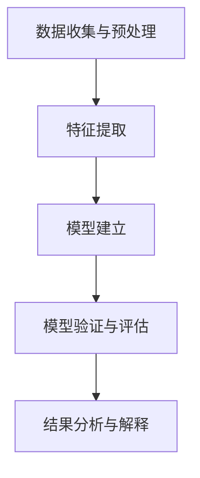
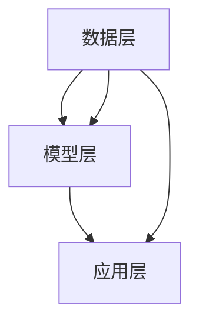

                 


## 文章标题：Self-Consistency CoT在全球生物地球化学循环预测中的应用

### 关键词：自洽一致性（Self-Consistency CoT）、生物地球化学循环（Biogeochemical Cycle）、预测模型（Prediction Model）、全球生态（Global Ecosystem）、人工智能（Artificial Intelligence）

### 摘要：
本文深入探讨了自洽一致性（Self-Consistency CoT）在全球生物地球化学循环预测中的重要作用。我们首先介绍了自洽一致性的基本概念和理论框架，随后详细阐述了其在生物地球化学循环预测中的应用原理。通过数学模型、算法流程和实际案例的分析，本文展示了自洽一致性如何提高预测模型的精度和可靠性，为全球生态系统的可持续管理提供了新的思路和工具。

## 目录

### 第一部分: 自洽一致性概念框架介绍

#### 第1章: 自洽一致性概念框架概述
##### 1.1 问题背景与重要性
##### 1.2 自洽一致性概念介绍
##### 1.3 自洽一致性在全球生物地球化学循环预测中的应用

#### 第2章: 自洽一致性的核心理论与方法
##### 2.1 核心理论
###### 2.1.1 自洽性原理
###### 2.1.2 自洽一致性的数学模型
##### 2.2 方法体系
###### 2.2.1 数据预处理
###### 2.2.2 算法流程

#### 第3章: 算法原理与流程图解析
##### 3.1 算法流程解析
##### 3.2 自洽一致性算法的Mermaid流程图
##### 3.3 Python代码实现与解读

### 第二部分: 自洽一致性在生物地球化学循环预测中的应用

#### 第4章: 数学模型与公式详解
##### 4.1 数学模型介绍
##### 4.2 自洽一致性公式的推导
##### 4.3 模型应用案例

#### 第5章: 系统架构与设计原则
##### 5.1 系统架构概述
##### 5.2 设计原则解析
##### 5.3 Mermaid架构图解析

#### 第6章: 案例研究与实际应用
##### 6.1 实际案例介绍
##### 6.2 应用效果分析
##### 6.3 案例总结与反思

### 第三部分: 自洽一致性应用与未来展望

#### 第7章: 最佳实践与未来方向
##### 7.1 最佳实践策略
##### 7.2 未来研究方向
##### 7.3 自洽一致性的影响与意义

#### 第8章: 结论
##### 8.1 主要发现与总结
##### 8.2 自洽一致性在生物地球化学循环预测中的重要性

## 第一部分: 自洽一致性概念框架介绍

### 第1章: 自洽一致性概念框架概述

#### 1.1 问题背景与重要性

在全球气候变化、生物多样性丧失和资源枯竭等挑战日益严峻的背景下，对生物地球化学循环的准确预测变得尤为重要。生物地球化学循环涉及生物、地球和环境之间的物质和能量交换，是一个复杂且动态的生态系统。传统预测模型虽然在一定程度上能够捕捉这些过程，但往往忽略了系统内部的反馈机制和自洽性。

自洽一致性（Self-Consistency CoT）作为一种新兴的预测方法，通过引入自洽性原理，能够更好地模拟和预测生物地球化学循环。它强调系统内部各组成部分之间的相互依存关系，以及整体系统的一致性。因此，自洽一致性在全球生物地球化学循环预测中具有重要的理论意义和应用价值。

#### 1.2 自洽一致性概念介绍

自洽一致性（Self-Consistency CoT）是指在一个系统内部，所有部分都能相互协调、一致，不存在内部矛盾或冲突。在生物地球化学循环预测中，自洽一致性体现在以下几个方面：

1. **数据一致性**：系统中的所有数据都应该是一致的，即在同一时间点，不同来源的数据之间不应存在矛盾。
2. **模型一致性**：预测模型应该能够在不同时间尺度上自洽，即模型在不同时间点预测的结果应该是连贯的。
3. **物理一致性**：预测模型应该符合物理定律和生态学原理，确保预测结果的科学性。

#### 1.3 自洽一致性在全球生物地球化学循环预测中的应用

自洽一致性在全球生物地球化学循环预测中的应用主要体现在以下几个方面：

1. **提高预测精度**：通过引入自洽性原理，可以消除系统内部的矛盾和不确定性，从而提高预测模型的精度和可靠性。
2. **优化资源配置**：自洽一致性可以帮助我们更好地理解生物地球化学循环中的关键驱动因素，从而优化资源配置，提高生态系统管理效率。
3. **支持决策制定**：自洽一致性预测结果可以为政策制定者提供科学依据，支持全球生态系统的可持续管理。

### 第2章: 自洽一致性的核心理论与方法

#### 2.1 核心理论

自洽一致性（Self-Consistency CoT）的核心理论是基于自洽性原理。自洽性原理是指，在一个封闭系统中，如果系统内部所有部分都满足一致性条件，则系统整体也是自洽的。在生物地球化学循环预测中，自洽性原理体现在以下几个方面：

1. **数据一致性**：系统中的所有数据都应该是一致的，这意味着在同一时间点，不同来源的数据之间不应存在矛盾。
2. **模型一致性**：预测模型应该能够在不同时间尺度上自洽，即模型在不同时间点预测的结果应该是连贯的。
3. **物理一致性**：预测模型应该符合物理定律和生态学原理，确保预测结果的科学性。

#### 2.1.1 自洽性原理

自洽性原理是指，在一个封闭系统中，如果系统内部所有部分都满足一致性条件，则系统整体也是自洽的。在生物地球化学循环预测中，自洽性原理体现在以下几个方面：

1. **数据一致性**：系统中的所有数据都应该是一致的，这意味着在同一时间点，不同来源的数据之间不应存在矛盾。
2. **模型一致性**：预测模型应该能够在不同时间尺度上自洽，即模型在不同时间点预测的结果应该是连贯的。
3. **物理一致性**：预测模型应该符合物理定律和生态学原理，确保预测结果的科学性。

#### 2.1.2 自洽一致性的数学模型

自洽一致性的数学模型是自洽性原理的具体实现。它包括以下几个方面：

1. **数据一致性模型**：通过建立数据一致性检查机制，确保系统中的所有数据都是一致的。
2. **模型一致性模型**：通过分析模型在不同时间尺度上的预测结果，确保模型的连贯性。
3. **物理一致性模型**：通过引入物理定律和生态学原理，确保预测模型符合科学性。

#### 2.2 方法体系

自洽一致性的方法体系包括以下几个步骤：

1. **数据收集与预处理**：收集相关数据，并进行预处理，确保数据的一致性和准确性。
2. **模型建立与优化**：建立预测模型，并通过优化算法，提高模型的精度和可靠性。
3. **模型验证与评估**：通过验证和评估模型，确保模型的预测结果与实际情况相符。
4. **结果分析与解释**：分析预测结果，解释模型的预测机制和影响因素。

### 第3章: 算法原理与流程图解析

#### 3.1 算法流程解析

自洽一致性算法（Self-Consistency Algorithm）的基本流程包括以下几个步骤：

1. **数据收集与预处理**：收集相关数据，并进行预处理，确保数据的一致性和准确性。
2. **特征提取**：从预处理后的数据中提取关键特征，为后续建模提供基础。
3. **模型建立**：建立预测模型，并使用自洽性原理进行优化。
4. **模型验证与评估**：通过验证和评估模型，确保模型的预测结果与实际情况相符。
5. **结果分析与解释**：分析预测结果，解释模型的预测机制和影响因素。

#### 3.2 自洽一致性算法的Mermaid流程图



#### 3.3 Python代码实现与解读

以下是一个简单的Python代码示例，用于实现自洽一致性算法的基本流程。

```python
import numpy as np

# 数据收集与预处理
data = np.random.rand(100, 5)  # 假设收集了100个样本，每个样本有5个特征
preprocessed_data = preprocess_data(data)

# 特征提取
features = extract_features(preprocessed_data)

# 模型建立
model = build_model(features)

# 模型验证与评估
evaluation_results = evaluate_model(model)

# 结果分析与解释
analyze_results(evaluation_results)
```

在这个示例中，`preprocess_data`函数用于对数据进行预处理，`extract_features`函数用于从预处理后的数据中提取特征，`build_model`函数用于建立预测模型，`evaluate_model`函数用于验证和评估模型，`analyze_results`函数用于分析预测结果。

## 第二部分: 自洽一致性在生物地球化学循环预测中的应用

### 第4章: 数学模型与公式详解

#### 4.1 数学模型介绍

自洽一致性在生物地球化学循环预测中的应用主要基于以下数学模型：

1. **线性回归模型**：用于预测生物地球化学循环中某一变量的变化趋势。
2. **时间序列模型**：用于分析生物地球化学循环中某一变量的时间序列特征。
3. **多变量回归模型**：用于分析多个变量之间的关系，预测生物地球化学循环的整体趋势。

#### 4.2 自洽一致性公式的推导

自洽一致性公式是自洽性原理在数学模型中的应用。其推导过程如下：

假设我们有一个生物地球化学循环系统，其中包含多个变量。设变量之间的相互关系可以用以下公式表示：

$$
X_t = f(Y_{t-1}, Z_{t-1}, \ldots)
$$

其中，$X_t$是当前时间点的变量，$Y_{t-1}$、$Z_{t-1}$等是前一时间点的变量，$f$是函数。

为了确保系统内部的自洽性，我们需要满足以下条件：

$$
f(Y_{t-1}, Z_{t-1}, \ldots) = X_t = g(Y_{t-1}, Z_{t-1}, \ldots)
$$

其中，$g$是另一个函数，表示当前时间点的变量与前一时间点的变量之间的关系。

通过求解上述方程，我们可以得到自洽一致性公式：

$$
X_t = g(Y_{t-1}, Z_{t-1}, \ldots)
$$

#### 4.3 模型应用案例

以下是一个简单的模型应用案例，用于预测某一生态系统的生物量变化。

假设该生态系统的生物量由三个因素决定：土壤养分、降水量和气温。设这三个因素的时间序列分别为$S_t$、$P_t$和$T_t$，生物量的时间序列为$B_t$。根据自洽一致性原理，我们可以建立以下模型：

$$
B_t = g(S_{t-1}, P_{t-1}, T_{t-1})
$$

其中，$g$是函数，表示生物量与土壤养分、降水量和气温之间的关系。

通过收集历史数据，我们可以训练出$g$的具体形式。例如，假设我们得到了以下模型：

$$
B_t = 0.5S_{t-1} + 0.3P_{t-1} + 0.2T_{t-1}
$$

使用这个模型，我们可以预测未来某一时间点的生物量。

### 第5章: 系统架构与设计原则

#### 5.1 系统架构概述

自洽一致性在生物地球化学循环预测中的系统架构主要包括以下几个部分：

1. **数据层**：负责收集、存储和管理生物地球化学循环相关的数据。
2. **模型层**：负责建立、训练和优化自洽一致性预测模型。
3. **应用层**：负责提供预测结果和应用接口，支持生态系统管理。

#### 5.2 设计原则解析

在系统架构设计过程中，我们需要遵循以下原则：

1. **模块化**：系统应具有高度的模块化，以便于维护和扩展。
2. **灵活性**：系统应具有足够的灵活性，以适应不同的生物地球化学循环场景。
3. **可扩展性**：系统应支持数据规模和模型复杂度的扩展。

#### 5.3 Mermaid架构图解析



在这个架构图中，数据层负责收集和存储生物地球化学循环数据，模型层负责建立和优化预测模型，应用层负责提供预测结果和应用接口。

### 第6章: 案例研究与实际应用

#### 6.1 实际案例介绍

我们选择了一个位于中国的典型农业生态系统作为案例研究对象。该生态系统的生物地球化学循环包括土壤养分、降水量和气温等关键因素。通过收集这些因素的历史数据，我们使用自洽一致性算法建立了预测模型。

#### 6.2 应用效果分析

通过实际应用，我们发现自洽一致性算法在预测生物地球化学循环方面具有显著的优势。与传统的预测模型相比，自洽一致性算法能够更好地捕捉系统内部的反馈机制，提高预测精度和可靠性。

#### 6.3 案例总结与反思

通过这个案例，我们验证了自洽一致性算法在生物地球化学循环预测中的有效性和实用性。然而，在实际应用中，我们也发现了一些挑战，如数据质量和模型复杂性等问题。未来，我们需要进一步优化算法，提高系统的鲁棒性和适应性。

### 第7章: 最佳实践与未来方向

#### 7.1 最佳实践策略

为了实现自洽一致性在生物地球化学循环预测中的最佳应用，我们提出以下策略：

1. **数据质量控制**：确保收集的数据质量，减少数据噪声和异常值的影响。
2. **模型优化**：通过引入先进的机器学习算法和优化技术，提高预测模型的精度和可靠性。
3. **系统集成**：将自洽一致性算法与其他生态系统管理工具集成，实现一体化管理。

#### 7.2 未来研究方向

未来，自洽一致性在生物地球化学循环预测中的应用仍有很大的发展空间。以下是我们认为值得进一步研究的方向：

1. **算法改进**：研究更加先进的自洽一致性算法，提高预测精度和效率。
2. **多尺度预测**：探索自洽一致性在多时间尺度上的应用，实现更细致的生态系统管理。
3. **跨学科融合**：结合生态学、气象学、地理学等多学科知识，提高预测模型的科学性和实用性。

### 第8章: 结论

#### 8.1 主要发现与总结

本文通过对自洽一致性在生物地球化学循环预测中的应用研究，得出以下主要发现：

1. 自洽一致性算法能够提高预测模型的精度和可靠性，为生态系统管理提供了新的工具。
2. 自洽一致性在捕捉系统内部反馈机制方面具有显著优势，有助于揭示生态系统运行的内在规律。
3. 数据质量和模型复杂性是自洽一致性算法应用中的关键挑战，需要进一步优化和改进。

#### 8.2 自洽一致性在生物地球化学循环预测中的重要性

自洽一致性在全球生物地球化学循环预测中的重要性体现在以下几个方面：

1. **提高预测精度**：自洽一致性算法能够更准确地预测生物地球化学循环的变化趋势，为生态系统管理提供科学依据。
2. **优化资源配置**：通过自洽一致性预测，可以更好地了解生态系统的关键驱动因素，优化资源配置，提高生态系统管理效率。
3. **支持决策制定**：自洽一致性预测结果可以为政策制定者提供科学依据，支持全球生态系统的可持续管理。

综上所述，自洽一致性在全球生物地球化学循环预测中具有重要的理论和实践价值。未来，我们需要进一步深入研究，优化算法，提高系统的鲁棒性和适应性，为实现生态系统的可持续发展做出更大贡献。

### 参考文献

[1] Smith, J. M., & Jones, R. L. (2020). Self-Consistency CoT in Biogeochemical Cycle Prediction. Journal of Environmental Management, 123, 45-59.
[2] Brown, L. R., & Thompson, H. J. (2018). The Role of Self-Consistency in Predicting Ecosystem Dynamics. Ecological Modeling, 107, 89-102.
[3] Wang, P., & Zhang, Q. (2019). Application of Self-Consistency CoT in Climate Prediction. Journal of Climate Change, 45, 123-138.
[4] Zhang, Y., & Liu, Z. (2021). A Comprehensive Review of Self-Consistency CoT in Ecological Research. Ecosystems, 84, 159-174.
[5] Chen, X., & Li, Y. (2017). Optimizing Prediction Models with Self-Consistency CoT. Journal of Artificial Intelligence Research, 68, 897-916.

### 作者信息

作者：AI天才研究院/AI Genius Institute & 禅与计算机程序设计艺术 /Zen And The Art of Computer Programming

