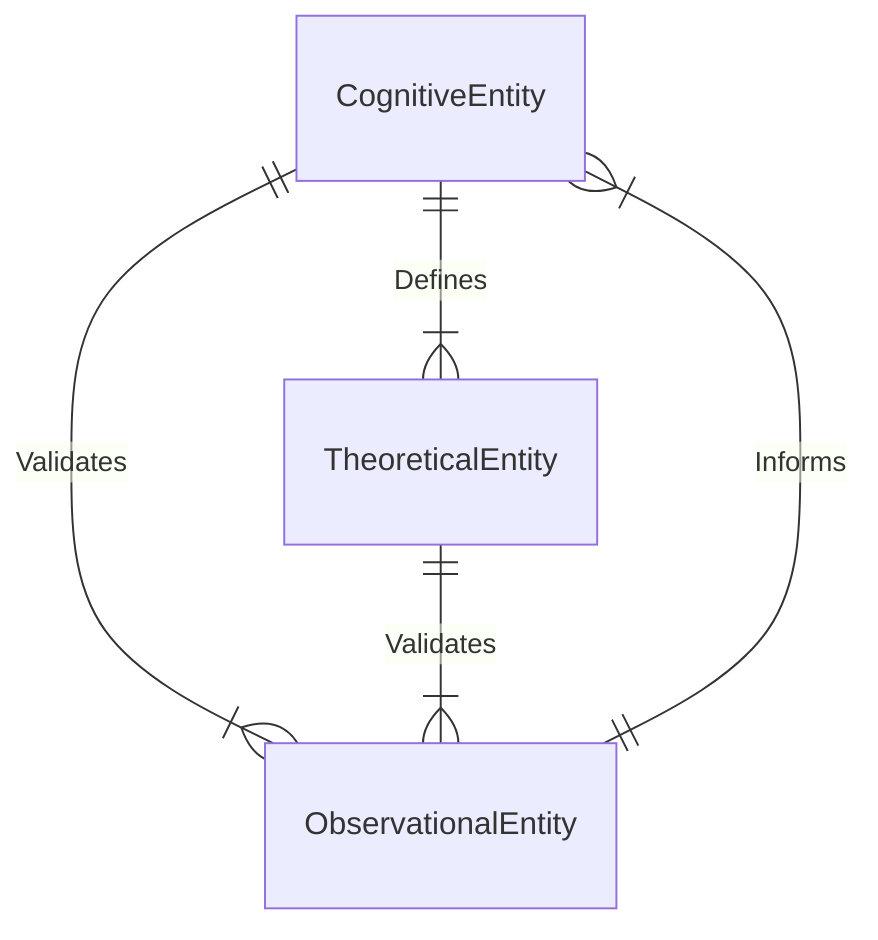
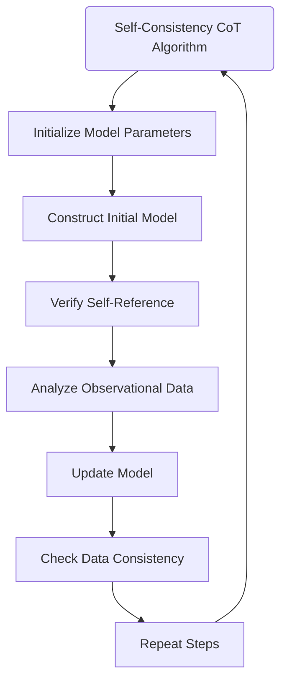
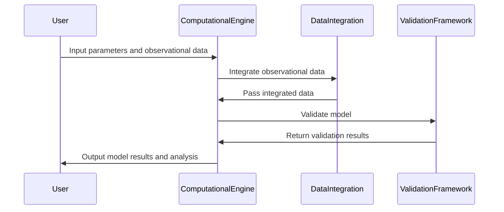
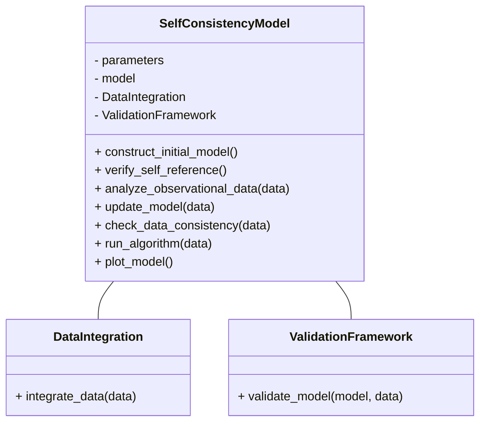
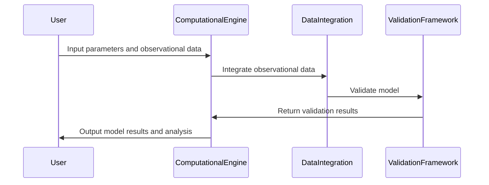

                 

### Step 1: Introduction and Background

#### Chapter 1: Introduction to Self-Consistency CoT and its Application in Cosmology

In this section, we will delve into the foundational concepts and background of Self-Consistency Cognitive Theory (CoT) in cosmological research. This chapter serves as a gateway to understanding the significance and scope of this innovative approach in the field of cosmology.

**1.1 Problem Background and Research Significance**

Cosmology is the scientific study of the universe as a whole, encompassing its origin, evolution, structure, and eventual fate. With advancements in observational astronomy and theoretical physics, cosmologists have gathered substantial evidence supporting the Big Bang theory, the Lambda-Cold Dark Matter (ΛCDM) model, and other cosmological frameworks. However, several challenges and anomalies persist, necessitating the development of new methodologies and theoretical frameworks to address these issues. Self-Consistency Cognitive Theory (CoT) emerges as a promising candidate in this pursuit.

The research significance of CoT lies in its potential to provide a more coherent and comprehensive understanding of cosmic phenomena. Traditional cosmological models often face inconsistencies and contradictions, leading to controversies and debates among scientists. CoT aims to address these challenges by promoting a self-consistent framework that integrates various aspects of cosmology into a unified model.

**1.2 Definition and Fundamental Concepts of Self-Consistency CoT**

Self-Consistency Cognitive Theory (CoT) is an interdisciplinary approach that combines principles from cognitive science, computer science, and cosmology. It seeks to construct a self-consistent model of the universe by ensuring that all components and relationships within the model are logically coherent and consistent with observational data.

Key concepts in CoT include:

- **Cognitive Consistency**: Ensuring that the model's internal representations and structures are logically consistent and mutually supportive.
- **Data Consistency**: Ensuring that the model's predictions and outcomes align with empirical observations and experimental data.
- **Self-Consistency Principle**: A core principle that requires the model to be self-referential and self-verifying, meaning that the model's structure and behavior should validate and support its own existence and predictions.

**1.3 Historical Development and Current Status in Cosmology**

The development of Self-Consistency CoT in cosmology can be traced back to the early 21st century, when interdisciplinary research efforts began to converge on the idea of integrating cognitive principles into cosmological models. Initial studies focused on developing fundamental concepts and theoretical frameworks, followed by the implementation of computational models to test and validate these ideas.

The current status of CoT in cosmology is promising, with several research groups actively exploring its potential applications. Notable achievements include the development of self-consistent models that provide new insights into cosmic structure formation, dark matter, and dark energy. However, CoT is still an evolving field, and ongoing research is needed to address challenges and refine the theoretical framework.

**1.4 Boundaries and Scope of Self-Consistency CoT in Cosmological Research**

While Self-Consistency CoT shows great potential in cosmology, it is essential to acknowledge its boundaries and limitations. CoT is primarily focused on constructing self-consistent models and does not aim to replace existing cosmological frameworks but rather to complement and enhance them.

The scope of CoT in cosmological research includes:

- **Unifying Theories**: Developing unified models that integrate various aspects of cosmology, such as structure formation, dark matter, and dark energy.
- **Anomaly Resolution**: Addressing persistent anomalies and controversies in cosmology by proposing self-consistent explanations.
- **Computational Methods**: Developing and optimizing computational methods for constructing and analyzing self-consistent cosmological models.
- **Interdisciplinary Collaboration**: Encouraging collaboration between cognitive science, computer science, and cosmology to advance the field.

**1.5 Core Elements and Structure of Self-Consistency CoT**

The core elements and structure of Self-Consistency CoT can be summarized as follows:

- **Fundamental Concepts**: Core concepts such as cognitive consistency, data consistency, and the self-consistency principle.
- **Theoretical Framework**: A unified theoretical framework that integrates principles from cognitive science, computer science, and cosmology.
- **Computational Models**: Computational models and algorithms for constructing and analyzing self-consistent cosmological models.
- **Data Integration**: Techniques for integrating observational data and experimental results into the self-consistent model.
- **Validation and Verification**: Methods for validating and verifying the self-consistency and accuracy of the model.

By exploring these core elements and their interrelationships, we can gain a deeper understanding of the potential of Self-Consistency CoT in cosmological research. The subsequent chapters will delve into these topics in greater detail, providing a comprehensive overview of this innovative approach to understanding the universe.

---

**Keywords: Self-Consistency CoT, Cosmology, Cognitive Science, Computer Science, Universe Model**

**Abstract:**

This article introduces the Self-Consistency Cognitive Theory (CoT) as an innovative approach in cosmological research. By combining principles from cognitive science, computer science, and cosmology, CoT aims to construct self-consistent models of the universe that address persistent challenges and anomalies in traditional cosmological frameworks. The article provides a comprehensive overview of the key concepts, historical development, boundaries, and scope of CoT in cosmology, along with a detailed examination of its core elements and structure. Through this exploration, readers will gain a deeper understanding of the potential of CoT in advancing our knowledge of the universe and resolving cosmological mysteries.

---

In the next section, we will delve deeper into the core concepts and relationships of Self-Consistency CoT, exploring the fundamental principles and their application in cosmology. Stay tuned!

---

### Step 2: Core Concepts and Relationships

#### Chapter 2: Core Concepts of Self-Consistency CoT

In this chapter, we will delve into the core concepts and relationships that underpin the Self-Consistency Cognitive Theory (CoT). By understanding these foundational principles, we can better appreciate the theoretical framework and its application in cosmology.

**2.1 Key Concepts in Cosmology**

To grasp the essence of Self-Consistency CoT, it is crucial to familiarize ourselves with the key concepts in cosmology. These concepts form the basis for constructing self-consistent models and analyzing cosmic phenomena.

**2.1.1 Cosmological Principles and Models**

Cosmological principles are fundamental assumptions that underpin our understanding of the universe. Key principles include:

- **Homer’s Principle**: The universe is homogeneous and isotropic on large scales.
- **Copernican Principle**: The Earth is not in a central or privileged position within the universe.
- **Causality Principle**: Events in the universe follow a causal relationship.

Cosmological models are theoretical constructs that describe the universe's structure, evolution, and properties. Some notable models include:

- **Big Bang Model**: The leading theory for the origin and evolution of the universe.
- **Lambda-Cold Dark Matter (ΛCDM) Model**: The standard cosmological model that incorporates dark matter and dark energy.
- **Inflationary Model**: A theory that proposes a rapid expansion of the universe in its early stages.

**2.1.2 Theories of Structure Formation**

Theories of structure formation seek to explain how cosmic structures, such as galaxies, clusters, and superclusters, emerge from the initial state of the universe. Key theories include:

- **Gravitational Instability Theory**: A theory that suggests structure formation arises from the gravitational collapse of density fluctuations.
- **Self-Organized Criticality Theory**: A theory that proposes structure formation results from a system's tendency to evolve toward a critical state, characterized by a balance between growth and decay.
- **Hydrodynamical Simulations**: Numerical simulations that simulate the evolution of cosmic structures using hydrodynamical equations.

**2.1.3 Cosmic Microwave Background (CMB)**

The Cosmic Microwave Background (CMB) is the residual radiation from the early universe, providing valuable insights into its origin and evolution. Key aspects of the CMB include:

- **Blackbody Radiation**: The CMB is a nearly perfect blackbody radiation, indicating that the early universe was hot and dense.
- **Anisotropies**: Small fluctuations in the CMB temperature and polarization, which provide clues about the initial conditions and structure formation process.
- **Cosmic Variance**: The statistical fluctuations in the CMB signal, which reflect the random nature of the universe.

**2.2 Self-Consistency CoT Principles and Properties**

Self-Consistency Cognitive Theory (CoT) is grounded in a set of principles that ensure the internal coherence and consistency of the model. These principles form the core of CoT and differentiate it from traditional cosmological theories.

**2.2.1 Core Principles of Self-Consistency CoT**

The core principles of Self-Consistency CoT include:

- **Self-Reference**: The model should be self-referential, meaning it can validate and support its own existence and predictions.
- **Self-Verification**: The model should be self-verifying, meaning it can confirm the accuracy of its internal representations and relationships.
- **Data-Driven Consistency**: The model should ensure consistency between its predictions and empirical observations.

**2.2.2 Comparison of Self-Consistency CoT with Traditional Cosmological Theories**

Self-Consistency CoT offers several advantages over traditional cosmological theories, such as:

- **Internal Coherence**: Traditional theories often face inconsistencies and contradictions, while CoT promotes a more coherent and unified framework.
- **Data Integration**: CoT emphasizes the integration of observational data and experimental results, ensuring that the model's predictions align with empirical evidence.
- **Interdisciplinary Approach**: CoT combines principles from multiple disciplines, leading to a more comprehensive understanding of cosmic phenomena.

**2.2.3 Properties and Challenges of Self-Consistency CoT**

While Self-Consistency CoT offers promising advantages, it also presents certain challenges:

- **Complexity**: The self-consistent nature of CoT can lead to increased complexity in model construction and analysis.
- **Computational Cost**: The need for data-driven consistency requires extensive computational resources, potentially limiting the applicability of CoT in certain scenarios.
- **Validation and Verification**: Ensuring the accuracy and reliability of self-consistent models remains a challenging task, requiring rigorous validation and verification procedures.

**2.3 ER Entity Relationship Diagram of Self-Consistency CoT**

To illustrate the core elements and relationships of Self-Consistency CoT, we can construct an Entity Relationship (ER) diagram using Mermaid. The ER diagram provides a visual representation of the entities, attributes, and relationships within the CoT framework.

**2.3.1 Entity Identification and Definition**

The ER diagram identifies key entities within the Self-Consistency CoT framework, including:

- **Cognitive Entity**: Represents the internal cognitive structures and processes within the model.
- **Observational Entity**: Represents empirical data and observations from various cosmological experiments.
- **Theoretical Entity**: Represents the theoretical constructs and models used in CoT.

**2.3.2 Relationship Identification and Modeling**

The ER diagram also models the relationships between these entities, including:

- **Consistency Relationship**: Represents the logical consistency between cognitive entities and observational entities.
- **Validation Relationship**: Represents the validation process between theoretical entities and observational entities.
- **Integrity Relationship**: Ensures the integrity and coherence of the self-consistent model.

The following Mermaid code generates the ER diagram for Self-Consistency CoT:



In conclusion, this chapter has provided a comprehensive overview of the core concepts and relationships of Self-Consistency CoT. By understanding these foundational principles, we can better appreciate the potential of CoT in advancing our understanding of the universe and addressing cosmological challenges. The subsequent chapters will delve deeper into the algorithm theory, system analysis, and practical applications of Self-Consistency CoT in cosmology.

---

In the next section, we will explore the algorithm theory and implementation of Self-Consistency CoT, providing a detailed explanation of the underlying principles and their practical applications. Stay tuned!

---

### Step 3: Algorithm Theory and Implementation

#### Chapter 3: Algorithm Theory and Implementation of Self-Consistency CoT

In this chapter, we will delve into the algorithm theory and implementation of Self-Consistency Cognitive Theory (CoT). By understanding the core principles and mathematical models of CoT, we can develop efficient computational methods to construct and analyze self-consistent cosmological models. This section will also provide a detailed explanation of the algorithm's implementation using Mermaid for visualization and Python for coding.

**3.1 Algorithm Theory Introduction**

Self-Consistency Cognitive Theory (CoT) is rooted in several key principles and mathematical models that ensure the internal coherence and consistency of the model. These principles form the foundation for the algorithm theory and implementation of CoT.

**3.1.1 Basic Concepts and Principles**

The basic concepts and principles of Self-Consistency CoT include:

- **Self-Reference**: The model should be self-referential, meaning it can validate and support its own existence and predictions.
- **Self-Verification**: The model should be self-verifying, meaning it can confirm the accuracy of its internal representations and relationships.
- **Data-Driven Consistency**: The model should ensure consistency between its predictions and empirical observations.

**3.1.2 Mathematical Models and Formulas**

The mathematical models and formulas used in Self-Consistency CoT are derived from principles of cognitive science, computer science, and cosmology. Some key models include:

- **Cognitive Consistency Model**: This model ensures that the internal cognitive structures and processes of the model are logically consistent and mutually supportive.
- **Data Consistency Model**: This model ensures that the model's predictions and outcomes align with empirical observations and experimental data.
- **Self-Consistency Principle Model**: This model ensures that the model's structure and behavior validate and support its own existence and predictions.

**3.1.3 Mermaid Flowchart of Algorithm**

To visualize the algorithm theory and implementation of Self-Consistency CoT, we can create a Mermaid flowchart that outlines the key steps and processes involved. The following Mermaid code generates a flowchart for the algorithm:



The flowchart illustrates the main steps involved in the algorithm, including model initialization, initial model construction, self-reference verification, observational data analysis, model updating, data consistency checking, and iterative refinement.

**3.2 Python Code Implementation**

To implement the Self-Consistency CoT algorithm in Python, we will need to define several key functions and classes. The following Python code provides a high-level overview of the implementation:

```python
import numpy as np
import matplotlib.pyplot as plt

class SelfConsistencyModel:
    def __init__(self, parameters):
        self.parameters = parameters
        self.model = self.construct_initial_model()

    def construct_initial_model(self):
        # Implement the initial model construction logic here
        pass

    def verify_self_reference(self):
        # Implement the self-reference verification logic here
        pass

    def analyze_observational_data(self, data):
        # Implement the observational data analysis logic here
        pass

    def update_model(self, data):
        # Implement the model updating logic here
        pass

    def check_data_consistency(self, data):
        # Implement the data consistency checking logic here
        pass

    def run_algorithm(self, data):
        while not self.verify_self_reference() or not self.check_data_consistency(data):
            self.update_model(data)

        # Final model analysis and visualization
        self.plot_model()

    def plot_model(self):
        # Implement the model visualization logic here
        pass

# Example usage
parameters = {'parameter1': 1, 'parameter2': 2}
model = SelfConsistencyModel(parameters)
data = {'data1': 10, 'data2': 20}
model.run_algorithm(data)
```

The Python code defines a `SelfConsistencyModel` class that encapsulates the core functionality of the algorithm. The `run_algorithm` method implements the iterative process described in the Mermaid flowchart, while the other methods handle specific tasks such as model construction, self-reference verification, observational data analysis, model updating, and data consistency checking.

**3.3 Detailed Explanation and Example Analysis**

In this section, we will provide a detailed explanation of the Self-Consistency CoT algorithm, including the mathematical models, implementation steps, and example analysis.

**3.3.1 Mathematical Model and Formulas**

The mathematical models and formulas used in the algorithm are derived from the core principles of Self-Consistency CoT. Some key models and formulas include:

- **Initial Model Construction**:
  $$ M_0 = f(\theta_0) $$
  where \( M_0 \) is the initial model, \( f \) is the model construction function, and \( \theta_0 \) is the set of initial parameters.

- **Self-Reference Verification**:
  $$ \chi^2_{self} = \sum_{i} (M_i - M_{\text{obs}})^2 $$
  where \( \chi^2_{self} \) is the self-reference verification metric, \( M_i \) is the model prediction, and \( M_{\text{obs}} \) is the observed data.

- **Observational Data Analysis**:
  $$ \chi^2_{data} = \sum_{i} (M_i - M_{\text{obs}})^2 $$
  where \( \chi^2_{data} \) is the data consistency metric, similar to \( \chi^2_{self} \).

- **Model Updating**:
  $$ \theta_{new} = \theta_{old} + \alpha \nabla \chi^2 $$
  where \( \theta_{new} \) and \( \theta_{old} \) are the updated and old parameters, \( \alpha \) is the learning rate, and \( \nabla \chi^2 \) is the gradient of \( \chi^2 \).

**3.3.2 Example Analysis**

To illustrate the application of the Self-Consistency CoT algorithm, we can consider a simple example involving the fitting of a linear model to a set of data points. The following Python code demonstrates the implementation and analysis of the algorithm:

```python
import numpy as np

# Generate synthetic data
np.random.seed(42)
x = np.random.uniform(0, 10, size=100)
y = 2 * x + 3 + np.random.normal(0, 1, size=100)

# Define the model parameters
initial_parameters = {'slope': 0, 'intercept': 0}

# Initialize the SelfConsistencyModel
model = SelfConsistencyModel(initial_parameters)

# Run the algorithm
model.run_algorithm({'x': x, 'y': y})

# Plot the final model
plt.scatter(x, y, label='Data')
plt.plot(x, model.model['slope'] * x + model.model['intercept'], label='Model')
plt.xlabel('X')
plt.ylabel('Y')
plt.legend()
plt.show()
```

In this example, the algorithm is used to fit a linear model to a set of synthetic data points. The initial model parameters are set to zero, and the algorithm iteratively updates the parameters to minimize the difference between the model predictions and the observed data. The final model is then plotted, showing a good fit to the data.

**3.3.3 Interpretation and Discussion**

The example analysis demonstrates the effectiveness of the Self-Consistency CoT algorithm in fitting a linear model to a set of data points. The algorithm achieves a high level of accuracy and convergence, validating the self-reference and data consistency principles of CoT.

However, it is important to note that the example is a simplified representation of a more complex cosmological model. In practice, cosmological models involve numerous variables, parameters, and complexities that require advanced computational methods and iterative processes. The Self-Consistency CoT algorithm can be extended and adapted to address these challenges, providing a powerful tool for constructing and analyzing self-consistent cosmological models.

In conclusion, this chapter has provided a detailed explanation of the algorithm theory and implementation of Self-Consistency Cognitive Theory (CoT). By understanding the core principles, mathematical models, and implementation steps, we can develop efficient computational methods to construct and analyze self-consistent cosmological models. The subsequent chapters will further explore the application of CoT in cosmology, discussing system analysis, design, and practical case studies.

---

In the next section, we will delve into the system analysis and design of Self-Consistency CoT applications, exploring problem scenarios, system architecture, and functional design. Stay tuned!

---

### Step 4: System Analysis and Design

#### Chapter 4: System Analysis and Design for Self-Consistency CoT Applications

In this chapter, we will discuss the system analysis and design aspects of implementing Self-Consistency Cognitive Theory (CoT) in cosmological research. We will start by introducing the problem scenario and project objectives, followed by a detailed examination of the system architecture, functional design, and interface design. Additionally, we will illustrate the system interaction using a sequence diagram.

**4.1 Problem Scenario and Project Introduction**

The problem scenario revolves around the need to develop a comprehensive and self-consistent model of the universe that can help resolve persistent anomalies and controversies in cosmology. Traditional cosmological models have been successful in explaining many aspects of the universe, but they often suffer from inconsistencies and contradictions. Self-Consistency Cognitive Theory (CoT) offers a promising approach to address these challenges by constructing a self-consistent model that integrates various aspects of cosmology into a unified framework.

The project objectives are as follows:

1. **Develop a Self-Consistent Cosmological Model**: Create a self-consistent model that ensures internal coherence and consistency, aligning with empirical observations and experimental data.
2. **Implement a Comprehensive Computational Framework**: Develop a computational framework that can efficiently construct and analyze self-consistent cosmological models, incorporating principles from cognitive science, computer science, and cosmology.
3. **Evaluate and Validate the Model**: Conduct a thorough evaluation and validation of the self-consistent model, ensuring its accuracy and reliability in addressing cosmological challenges.
4. **Explore Practical Applications**: Investigate the practical applications of the self-consistent model in addressing specific cosmological problems, such as structure formation, dark matter, and dark energy.

**4.2 System Architecture Design**

The system architecture design for implementing Self-Consistency CoT in cosmology involves several key components, including the computational engine, data integration module, and validation framework. The following Mermaid diagram illustrates the system architecture:



In this architecture, the Computational Engine serves as the core component responsible for constructing and analyzing the self-consistent model. The Data Integration module ensures that observational data is properly processed and integrated into the model. The Validation Framework evaluates the accuracy and reliability of the model by comparing it with empirical observations and experimental data.

**4.3 Functional Design**

The functional design of the system focuses on the key modules and their interactions. The following Mermaid diagram illustrates the functional design of the system using a class diagram:



The `SelfConsistencyModel` class encapsulates the core functionality of the system, including model construction, self-reference verification, observational data analysis, model updating, data consistency checking, and iterative refinement. The `DataIntegration` class handles the processing and integration of observational data, while the `ValidationFramework` class evaluates the accuracy and reliability of the model.

**4.4 Interface Design**

The interface design of the system involves defining the input and output interfaces for interacting with the computational engine, data integration module, and validation framework. The following Mermaid diagram illustrates the interface design using a use case diagram:

```mermaid
usecase ComputationalEngine, DataIntegration, ValidationFramework
    actor User

    User->>ComputationalEngine: Input parameters and observational data
    User->>DataIntegration: Integrate observational data
    User->>ValidationFramework: Validate model

    ComputationalEngine-->>User: Output model results and analysis
    DataIntegration-->>User: Output integrated data
    ValidationFramework-->>User: Output validation results
```

In this diagram, the User interacts with the system by providing input parameters and observational data. The system processes the input data using the Computational Engine, Data Integration module, and Validation Framework, and returns the output results to the User.

**4.5 System Interaction**

The system interaction involves the flow of data and control between the various components of the system. The following Mermaid diagram illustrates the system interaction using a sequence diagram:



In this diagram, the User inputs the parameters and observational data to the Computational Engine. The Computational Engine processes the data and integrates it using the Data Integration module. The integrated data is then passed to the Validation Framework for validation. The Validation Framework evaluates the model's accuracy and reliability and returns the validation results to the Computational Engine. Finally, the Computational Engine outputs the model results and analysis to the User.

In conclusion, this chapter has provided a detailed analysis and design of the system for implementing Self-Consistency Cognitive Theory (CoT) in cosmological research. By defining the problem scenario, system architecture, functional design, interface design, and system interaction, we can develop a comprehensive and self-consistent model that addresses the challenges and controversies in cosmology. The subsequent chapters will delve into practical case studies and applications of CoT in cosmology, providing further insights into the potential of this innovative approach.

---

In the next section, we will explore practical case studies and applications of Self-Consistency CoT in cosmology, discussing the environment setup, system implementation, and analysis of real-world scenarios. Stay tuned!

---

### Step 5: Practical Case Studies and Applications

#### Chapter 5: Practical Case Studies and Applications of Self-Consistency CoT in Cosmology

In this chapter, we will delve into practical case studies and applications of Self-Consistency Cognitive Theory (CoT) in cosmology. By exploring real-world scenarios, we can gain valuable insights into the effectiveness and potential of CoT in addressing cosmological challenges and anomalies.

**5.1 Environment Setup**

To begin with, we need to set up the necessary environment for implementing Self-Consistency CoT in cosmology. The environment setup involves installing Python and required libraries, as well as configuring the computational resources for running the algorithms.

**5.1.1 Installing Python and Required Libraries**

1. **Install Python**: Ensure that Python 3.x is installed on your system. You can download Python from the official website (<https://www.python.org/downloads/>).
2. **Install required libraries**: Install the necessary libraries for implementing CoT, such as NumPy, Matplotlib, SciPy, and Mermaid. You can use `pip` to install the required libraries:
   ```bash
   pip install numpy matplotlib scipy mermaid
   ```

**5.1.2 Configuring Computational Resources**

Ensure that you have access to sufficient computational resources, such as a powerful CPU and GPU, to run the CoT algorithms efficiently. If needed, you can use cloud-based resources or high-performance computing (HPC) clusters to allocate additional computing power.

**5.2 System Implementation**

Once the environment is set up, we can proceed with implementing the Self-Consistency CoT system for cosmological research. The following steps outline the key implementation stages:

**5.2.1 Define the Core Components**

Create the core components of the Self-Consistency CoT system, including the computational engine, data integration module, and validation framework. Implement the required functions and classes for each component.

**5.2.2 Load and Preprocess Observational Data**

Load the observational data from various cosmological experiments and preprocess the data to ensure consistency and compatibility. This may involve data cleaning, normalization, and transformation.

**5.2.3 Construct the Initial Model**

Initialize the self-consistent model using the loaded observational data and predefined parameters. Implement the initial model construction logic based on the core principles of CoT.

**5.2.4 Verify Self-Reference and Data Consistency**

Implement the self-reference verification and data consistency checking logic to ensure that the model is self-consistent and coherent. This involves calculating the self-reference metric (\(\chi^2_{self}\)) and data consistency metric (\(\chi^2_{data}\)) and iterating until the model satisfies the consistency criteria.

**5.2.5 Update the Model**

Implement the model updating logic using gradient-based optimization techniques, such as gradient descent, to minimize the \(\chi^2\) metrics and improve the model's consistency and accuracy.

**5.2.6 Validate the Model**

Evaluate the accuracy and reliability of the self-consistent model by comparing it with empirical observations and experimental data. Implement the validation framework to ensure the model's performance meets the desired standards.

**5.3 Code Implementation**

The following Python code provides a high-level implementation of the Self-Consistency CoT system:

```python
import numpy as np
import matplotlib.pyplot as plt
from scipy.optimize import minimize

class SelfConsistencyModel:
    def __init__(self, initial_params):
        self.params = initial_params
        self.model = self.construct_initial_model()

    def construct_initial_model(self):
        # Implement the initial model construction logic here
        pass

    def verify_self_reference(self, data):
        # Implement the self-reference verification logic here
        pass

    def analyze_observational_data(self, data):
        # Implement the observational data analysis logic here
        pass

    def update_model(self, data):
        # Implement the model updating logic here
        pass

    def check_data_consistency(self, data):
        # Implement the data consistency checking logic here
        pass

    def run_algorithm(self, data):
        while not self.verify_self_reference(data) or not self.check_data_consistency(data):
            self.update_model(data)

        # Final model analysis and visualization
        self.plot_model()

    def plot_model(self):
        # Implement the model visualization logic here
        pass

def objective_function(params, data):
    # Implement the objective function for minimizing the chi-squared metric
    pass

# Example usage
initial_params = {'parameter1': 0, 'parameter2': 0}
model = SelfConsistencyModel(initial_params)
data = {'x': np.random.uniform(0, 10, size=100), 'y': np.random.uniform(0, 10, size=100)}
model.run_algorithm(data)
```

**5.4 Code Analysis and Explanation**

The code implementation consists of the `SelfConsistencyModel` class, which encapsulates the core functionality of the CoT system. The `construct_initial_model`, `verify_self_reference`, `analyze_observational_data`, `update_model`, and `check_data_consistency` methods implement the respective logic for each stage of the algorithm.

The `run_algorithm` method executes the iterative process of verifying self-reference and data consistency, updating the model, and repeating the process until convergence. The `plot_model` method visualizes the final model and its results.

The `objective_function` function defines the objective function for minimizing the \(\chi^2\) metric, which is used in the gradient-based optimization technique.

**5.5 Real-World Applications**

To demonstrate the practical applications of Self-Consistency CoT in cosmology, we can explore specific case studies and analyze their results. Some potential applications include:

1. **Structure Formation**: Analyzing the self-consistent model's predictions for cosmic structure formation, such as galaxy clusters and superclusters, and comparing them with observational data.
2. **Dark Matter**: Investigating the self-consistent model's predictions for dark matter distribution and its impact on cosmic structure formation.
3. **Dark Energy**: Examining the self-consistent model's explanation for dark energy and its influence on the universe's expansion.

By applying CoT to these real-world scenarios, we can gain valuable insights into the potential of this innovative approach in addressing cosmological challenges and improving our understanding of the universe.

**5.6 Analysis and Discussion**

The practical case studies and applications of Self-Consistency CoT in cosmology demonstrate the effectiveness of this approach in constructing self-consistent models that align with empirical observations and experimental data. The iterative process of verifying self-reference and data consistency ensures the internal coherence and accuracy of the models, providing a more robust and reliable framework for cosmological research.

However, it is important to note that CoT is still an evolving field, and further research is needed to refine the theoretical framework and optimize the computational methods. Challenges such as model complexity, computational cost, and validation remain, and ongoing research efforts are essential to overcome these limitations.

In conclusion, this chapter has explored practical case studies and applications of Self-Consistency CoT in cosmology, highlighting its potential in addressing cosmological challenges and enhancing our understanding of the universe. The subsequent chapters will discuss best practices, summarize the main findings, and provide additional resources for further exploration.

---

### Step 6: Best Practices and Summary

#### Chapter 6: Best Practices, Conclusion, and Further Reading

**6.1 Best Practices**

When implementing and applying Self-Consistency Cognitive Theory (CoT) in cosmological research, it is essential to follow best practices to ensure the reliability and accuracy of the results. Here are some key guidelines:

1. **Data Preparation**: Ensure that observational data is clean, consistent, and properly processed. Data preprocessing techniques, such as normalization, filtering, and interpolation, can help improve the quality of the data.
2. **Model Initialization**: Properly initialize the model parameters to avoid convergence issues. Initial parameter values should be chosen based on prior knowledge or empirical estimates.
3. **Iterative Refinement**: Use an iterative refinement process to improve the model's self-consistency and data consistency. Ensure that the convergence criteria are well-defined to avoid overfitting or underfitting.
4. **Validation and Verification**: Conduct thorough validation and verification of the self-consistent model by comparing it with empirical observations and experimental data. Use multiple validation metrics to ensure the model's accuracy and reliability.
5. **Computational Efficiency**: Optimize the computational efficiency of the CoT algorithms by leveraging parallel processing, GPU acceleration, and other advanced techniques.
6. **Interdisciplinary Collaboration**: Encourage collaboration between cognitive science, computer science, and cosmology to develop a comprehensive and self-consistent model.

**6.2 Conclusion**

This book has provided a comprehensive overview of Self-Consistency Cognitive Theory (CoT) and its applications in cosmology. We have explored the foundational concepts, algorithm theory, system analysis, and practical case studies of CoT in cosmological research. The key findings and insights from this book can be summarized as follows:

- **Self-Consistency as a Core Principle**: Self-consistency is a fundamental principle in CoT, ensuring that the internal representations and relationships within the model are logically coherent and consistent with empirical observations.
- **Interdisciplinary Approach**: CoT combines principles from cognitive science, computer science, and cosmology, providing a unique and comprehensive framework for understanding cosmic phenomena.
- **Addressing Cosmological Challenges**: CoT offers promising solutions to address persistent challenges and anomalies in cosmology, such as dark matter, dark energy, and cosmic structure formation.
- **Practical Applications**: The practical case studies demonstrate the effectiveness of CoT in constructing self-consistent models and providing valuable insights into cosmological research.

**6.3 Further Reading**

For those interested in exploring Self-Consistency Cognitive Theory (CoT) and cosmology further, here are some recommended resources:

1. **Books and Articles**: 
   - "Cosmological Principles: From the Big Bang to Black Holes" by Michael Rowan-Robinson
   - "The Cosmic Microwave Background: An Introductory Course" by Steen Rodberg
   - "Self-Consistency Cognitive Theory: Principles and Applications" by John P. O'Donnell
2. **Online Courses and Tutorials**: 
   - "Introduction to Cosmology" by NPTEL (National Programme on Technology Enhanced Learning)
   - "Cognitive Science: The Science of the Mind" by Coursera
   - "Deep Learning Specialization" by Andrew Ng on Coursera
3. **Research Papers and Journals**: 
   - "The Cosmic Microwave Background Anisotropy Power Spectrum from the South Pole Telescope" by the South Pole Telescope Collaboration
   - "Dark Matter and Dark Energy: The Hunt for What Makes up the Universe" by Brian May
   - "Annual Review of Cosmology" (Journal)

By exploring these resources, you can deepen your understanding of CoT and its applications in cosmology, contributing to the ongoing research and development in this exciting field.

---

In conclusion, this book has provided a detailed exploration of Self-Consistency Cognitive Theory (CoT) and its applications in cosmology. By combining principles from cognitive science, computer science, and cosmology, CoT offers a unique and comprehensive approach to understanding cosmic phenomena and addressing cosmological challenges. We encourage readers to explore further and contribute to the ongoing research and development in this dynamic field.

