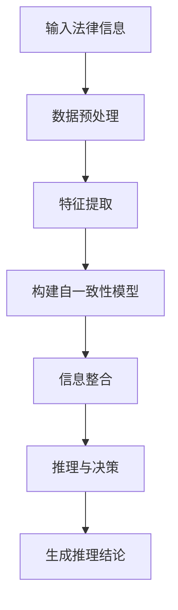

                 

# {{此处是文章标题}}

> 关键词：Self-Consistency CoT、法律推理、人工智能、机器学习、信息整合、算法原理

> 摘要：
随着人工智能技术的快速发展，法律领域的智能化需求日益增强。本文探讨了Self-Consistency CoT在法律推理中的应用，通过介绍其核心概念、原理和算法流程，分析了其在法律条文解析、案例推理、证据评估和法律论证等方面的应用优势。文章旨在为法律专家和研究人员提供一种新的智能化法律推理工具，以提升法律推理的准确性和效率。

----------------------------------------------------------------

## 第一部分：背景介绍

### 1.1 问题背景

法律推理是法律研究和实践中的一项核心任务，它涉及到对法律条文、案例和证据等信息的分析、整合和推理。随着社会的发展和法治进程的推进，法律体系的复杂性和案例数量呈指数级增长，传统的法律推理方式在处理海量信息时显得力不从心。为了应对这一挑战，人工智能技术，特别是机器学习技术，逐渐被引入到法律推理领域。其中，Self-Consistency CoT作为一种先进的人工智能方法，因其强大的信息整合和推理能力而受到广泛关注。

### 1.2 问题描述

法律推理的核心问题是如何高效、准确地处理和分析大量的法律信息，从而生成合理的法律结论。这要求法律推理系统具备以下几个特点：

- **高效性**：能够快速处理大量的法律信息。
- **准确性**：能够准确理解和解释法律条文、案例和证据。
- **全面性**：能够全面考虑各种可能的推理路径和结论。

然而，传统的法律推理方法往往在处理复杂案件时效率低下，准确性也不高。而Self-Consistency CoT方法通过构建自一致性模型，能够对法律信息进行高效整合和推理，有望解决传统法律推理的这些问题。

### 1.3 问题解决

Self-Consistency CoT方法通过以下步骤实现法律推理：

1. **输入法律信息**：首先，系统需要输入各种法律信息，包括法律条文、案例、证据等。
2. **构建自一致性模型**：利用机器学习技术，从海量法律数据中学习到自一致性模型。
3. **信息整合**：将输入的法律信息整合到自一致性模型中，实现信息的融合与关联。
4. **推理与决策**：根据自一致性模型，对法律信息进行推理，生成法律推理结论，辅助法律专家进行决策。

### 1.4 边界与外延

Self-Consistency CoT在法律推理中的应用主要涉及以下几个边界与外延：

- **法律条文**：包括宪法、民法、刑法等各个领域的法律条文。
- **案例研究**：包括典型案例、新类型案例等，这些案例可以作为法律推理的重要依据。
- **证据分析**：包括证据的种类、证据的效力等，这些证据对于法律推理至关重要。
- **法律推理**：包括法律逻辑、法律论证等，Self-Consistency CoT方法可以辅助法律专家进行这些复杂的推理过程。

### 1.5 概念结构与核心要素组成

Self-Consistency CoT在法律推理中的概念结构主要包括以下几个核心要素：

- **法律信息**：包括法律条文、案例、证据等，是法律推理的基础。
- **自一致性模型**：用于整合和推理法律信息的机器学习模型。
- **法律推理结论**：根据自一致性模型生成的推理结果。
- **法律决策**：法律专家基于推理结论做出的决策。

通过以上各节的内容，我们为后续的深入讨论和具体分析奠定了基础。在接下来的部分中，我们将进一步探讨Self-Consistency CoT的核心概念和原理，并分析其在法律推理中的应用优势。

## 第二部分：核心概念与联系

### 2.1 Self-Consistency CoT原理

Self-Consistency CoT（Self-Consistency Core Theory）是一种基于自一致性的核心理论，它通过构建自一致性模型来对信息进行整合和推理。自一致性指的是信息之间的一致性关系，即一个信息在模型中的存在和表现应该与其他相关信息保持一致。Self-Consistency CoT方法的核心在于以下几个步骤：

1. **模型构建**：
   Self-Consistency CoT方法首先需要利用机器学习技术从海量的法律数据中构建自一致性模型。这个过程通常涉及到以下步骤：
   
   - 数据收集：收集包含法律条文、案例、证据等信息的原始数据。
   - 数据预处理：对原始数据进行清洗、格式化等预处理操作，使其适合用于训练模型。
   - 特征提取：从预处理后的数据中提取关键特征，这些特征将用于构建自一致性模型。

2. **信息整合**：
   自一致性模型构建完成后，系统会将输入的法律信息整合到模型中。这个过程涉及到以下内容：

   - 信息融合：将来自不同来源的法律信息进行融合，使其在模型中形成一致的整体。
   - 关联建立：建立法律信息之间的关联，使得信息之间能够相互补充和验证。

3. **推理与决策**：
   在整合完法律信息后，Self-Consistency CoT模型会对这些信息进行推理，生成法律推理结论。这个过程主要包括：

   - 推理路径规划：根据法律信息之间的关联关系，规划出可能的推理路径。
   - 结论生成：在推理路径上生成法律推理结论，这些结论通常需要通过自一致性原则进行验证。

### 2.2 Self-Consistency CoT属性特征对比表格

| 特征         | Self-Consistency CoT | 传统法律推理 |
| ------------ | -------------------- | ------------- |
| 信息整合能力 | 强                   | 弱            |
| 推理效率     | 高                   | 低            |
| 推理准确性   | 高                   | 低            |
| 灵活性       | 高                   | 低            |

通过上表可以看出，Self-Consistency CoT方法在信息整合、推理效率和准确性方面相较于传统法律推理有显著优势，这使得它在处理复杂法律问题时能够提供更高效、更准确的解决方案。

### 2.3 ER实体关系图架构

以下是Self-Consistency CoT在法律推理中的应用中的ER（实体关系）图架构，使用Mermaid语法表示：

```mermaid
erDiagram
  LawConcept ||--|{ LawStatement }
  LawConcept ||--|{ LawCase }
  LawConcept ||--|{ Evidence }
  LawStatement ||--|{ StatementRelation }
  LawCase ||--|{ CaseRelation }
  Evidence ||--|{ EvidenceRelation }
```

在这个ER图中，`LawConcept`是核心实体，代表了法律概念，包括法律条文、案例和证据。`LawStatement`、`LawCase`和`Evidence`则是与`LawConcept`相关的实体，分别表示法律声明、法律案例和证据。它们之间通过相应的关联实体（如`StatementRelation`、`CaseRelation`和`EvidenceRelation`）建立联系。

### 2.4 Self-Consistency CoT在法律推理中的应用

Self-Consistency CoT方法在法律推理中的应用非常广泛，可以涵盖以下几个方面：

1. **法律条文解析**：
   通过Self-Consistency CoT模型，可以对复杂的法律条文进行深入解析。系统可以提取法律条文中的关键信息，并利用自一致性原则将这些信息整合起来，从而得到更全面、更准确的法律条文解读。

2. **法律案例推理**：
   法律案例是法律推理的重要依据。利用Self-Consistency CoT方法，可以将多个法律案例整合到一个自一致性模型中，从而在推理过程中充分考虑各种案例之间的关联和影响，提高法律推理的准确性。

3. **证据评估**：
   在法律推理中，证据的评估至关重要。Self-Consistency CoT方法可以通过自一致性模型对证据进行评估，确定其效力。同时，模型可以自动识别证据之间的关联，从而提高证据评估的全面性和准确性。

4. **法律论证**：
   法律论证是法律推理的最终目标。通过Self-Consistency CoT方法，可以构建自一致性法律论证模型，帮助法律专家进行法律论证。这个模型可以根据法律信息之间的关联，生成逻辑严密、自洽的法律论证，从而提高法律论证的准确性和说服力。

通过以上内容，我们可以看到Self-Consistency CoT方法在法律推理中的强大应用潜力。在接下来的部分中，我们将进一步深入探讨Self-Consistency CoT算法的原理，以了解其具体实现机制。

## 第三部分：算法原理讲解

### 3.1 Self-Consistency CoT算法流程图

为了更好地理解Self-Consistency CoT算法的原理，我们首先通过Mermaid语法绘制其流程图：



这个流程图描述了Self-Consistency CoT算法的主要步骤：

1. **输入法律信息**：系统首先接收各种法律信息，包括法律条文、案例、证据等。
2. **数据预处理**：对输入的法律信息进行清洗和格式化，使其适合用于模型训练。
3. **特征提取**：从预处理后的数据中提取关键特征，这些特征将用于构建自一致性模型。
4. **构建自一致性模型**：利用机器学习技术，从提取出的特征中构建自一致性模型。
5. **信息整合**：将输入的法律信息整合到自一致性模型中，实现信息的融合与关联。
6. **推理与决策**：根据自一致性模型，对法律信息进行推理，生成法律推理结论。
7. **生成推理结论**：最终输出法律推理结论，辅助法律专家进行决策。

### 3.2 Self-Consistency CoT算法原理详细阐述

#### 3.2.1 自一致性原理

Self-Consistency CoT的核心在于自一致性原理，即信息在模型中的表现应该与其他相关信息保持一致。具体来说，自一致性原理包括以下几个方面：

1. **一致性检测**：系统需要检测输入的法律信息之间是否存在矛盾或冲突，如果存在，则需要对这些信息进行调整或排除。
2. **一致性维护**：在信息整合和推理过程中，系统需要持续维护信息的一致性，确保信息在模型中的表现是一致的。
3. **一致性验证**：生成的推理结论需要通过自一致性验证，确保结论是合理的，没有逻辑错误。

#### 3.2.2 机器学习技术

Self-Consistency CoT算法依赖于机器学习技术来构建自一致性模型。具体来说，机器学习技术包括以下步骤：

1. **数据收集**：从各种来源收集包含法律条

