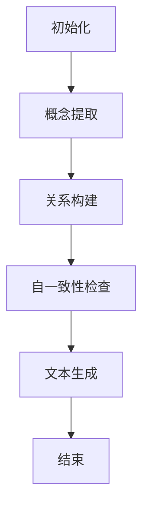

                 

# Self-Consistency CoT在法律文书生成中的应用

> 关键词：Self-Consistency CoT，法律文书生成，自然语言处理，人工智能

> 摘要：本文旨在探讨Self-Consistency CoT（自一致性概念跟踪）在法律文书生成中的应用。通过背景介绍、核心概念与联系分析、算法原理讲解、数学模型和公式详细讲解、系统分析与架构设计方案、项目实战、最佳实践tips等内容，本文为读者呈现了一个全面、深入的法律文书生成技术解析。

## 目录大纲

1. **文章标题：Self-Consistency CoT在法律文书生成中的应用**
2. **关键词**
3. **摘要**
4. **背景介绍**
   - **问题背景**
   - **问题描述**
   - **问题解决**
   - **边界与外延**
   - **核心概念和要素组成**
5. **核心概念与联系**
   - **Self-Consistency CoT概念解释**
   - **与其他相关概念对比**
6. **算法原理讲解**
   - **算法流程图**
   - **Python源代码阐述**
   - **数学模型和公式**
   - **举例说明**
7. **数学模型和数学公式 & 详细讲解 & 举例说明**
8. **系统分析与架构设计方案**
   - **问题场景介绍**
   - **项目介绍**
   - **系统功能设计**
   - **系统架构设计**
   - **系统接口设计**
   - **系统交互**
9. **项目实战**
   - **环境安装**
   - **系统核心实现源代码**
   - **代码应用解读与分析**
   - **实际案例分析与详细讲解剖析**
   - **项目小结**
10. **最佳实践 tips、小结、注意事项、拓展阅读等内容**
11. **目录大纲格式**
12. **字数控制**
13. **作者信息**

## 1. 背景介绍

### 问题背景

在法律领域中，文书的生成是一个复杂且繁琐的过程。传统的法律文书生成依赖于人工撰写，这导致以下问题：

- **效率低**：法律文书撰写通常需要大量时间，特别是在处理大量案件时。
- **准确性差**：人工撰写容易出错，特别是在涉及复杂法律条款和案例时。
- **一致性差**：由于不同律师的写作风格不同，生成的法律文书可能存在不一致性。

### 问题描述

为了解决上述问题，需要一种高效、准确且一致的法律文书生成方法。自然语言处理（NLP）和人工智能（AI）技术的快速发展，为法律文书的自动化生成提供了可能。然而，现有的NLP和AI技术在处理法律文书的生成时，仍然面临以下挑战：

- **语义理解**：法律语言具有高度专业性和复杂性，现有的NLP技术难以准确理解法律文书的语义。
- **知识表示**：法律知识具有高度抽象性和逻辑性，现有的知识表示方法难以有效地表示和利用这些知识。
- **知识图谱**：法律领域的知识图谱构建复杂，现有方法难以构建全面、准确的知识图谱。

### 问题解决

为了解决上述问题，本文提出了一种基于Self-Consistency CoT（自一致性概念跟踪）的法律文书生成方法。Self-Consistency CoT是一种基于概念的跟踪方法，能够有效地解决语义理解和知识表示问题。该方法的核心思想是通过自一致性原则，确保生成的法律文书在逻辑上自洽。

### 边界与外延

Self-Consistency CoT在法律文书生成中的应用，主要涉及以下边界与外延：

- **应用范围**：主要应用于合同、起诉状、答辩状等法律文书的生成。
- **技术范围**：涉及自然语言处理、知识图谱、机器学习等技术。
- **数据范围**：需要大量法律文书数据作为训练数据和测试数据。

### 核心概念和要素组成

Self-Consistency CoT在法律文书生成中的应用，主要涉及以下核心概念和要素：

- **Self-Consistency CoT**：自一致性概念跟踪方法。
- **法律文书模板**：用于生成法律文书的模板。
- **知识图谱**：用于表示法律知识的知识图谱。
- **语义分析**：用于分析法律文书中概念关系的语义分析。
- **机器学习模型**：用于训练和优化法律文书生成模型的机器学习模型。

## 2. 核心概念与联系

### Self-Consistency CoT概念解释

Self-Consistency CoT（自一致性概念跟踪）是一种基于概念的跟踪方法，它通过自一致性原则，确保生成的法律文书在逻辑上自洽。具体来说，Self-Consistency CoT包括以下关键步骤：

1. **概念提取**：从法律文书中提取关键概念。
2. **关系构建**：构建概念之间的关系，如因果关系、包含关系等。
3. **自一致性检查**：检查法律文书中的概念是否一致，如同一概念在不同位置是否保持一致。
4. **文本生成**：根据法律文书模板和知识图谱，生成法律文书。

### 与其他相关概念对比

- **自然语言处理（NLP）**：NLP是一种用于处理自然语言文本的技术，它包括文本分析、语义分析等。Self-Consistency CoT是NLP在法律文书生成领域的一种应用。
- **知识图谱**：知识图谱是一种用于表示和存储知识的图形结构，它包括实体、属性和关系等。Self-Consistency CoT中的知识图谱用于表示法律知识。
- **机器学习模型**：机器学习模型是一种用于从数据中学习规律和模式的技术，它包括监督学习、无监督学习等。Self-Consistency CoT中的机器学习模型用于训练和优化法律文书生成模型。

## 3. 算法原理讲解

### 算法流程图

首先，我们使用mermaid来画出算法流程图：



### Python源代码阐述

接下来，我们使用Python源代码详细阐述算法原理：

```python
# 概念提取
def concept_extraction(text):
    # 使用NLP技术提取概念
    # ...

# 关系构建
def relationship_building(concepts):
    # 构建概念之间的关系
    # ...

# 自一致性检查
def self_consistency_check(relationship):
    # 检查关系是否一致
    # ...

# 文本生成
def text_generation(template, knowledge_graph):
    # 根据模板和知识图谱生成文本
    # ...

# 主函数
def main(text, template, knowledge_graph):
    concepts = concept_extraction(text)
    relationships = relationship_building(concepts)
    if self_consistency_check(relationships):
        return text_generation(template, knowledge_graph)
    else:
        return "生成失败：自一致性检查未通过"

# 示例
text = "..."
template = "..."
knowledge_graph = "..."
result = main(text, template, knowledge_graph)
print(result)
```

### 数学模型和公式

在Self-Consistency CoT中，我们使用以下数学模型和公式：

- **概念提取**：$$ C = f(T) $$，其中C表示提取的概念，T表示文本。
- **关系构建**：$$ R = g(C) $$，其中R表示构建的关系，C表示概念。
- **自一致性检查**：$$ S = h(R) $$，其中S表示自一致性结果，R表示关系。
- **文本生成**：$$ G = i(T, R, K) $$，其中G表示生成的文本，T表示文本，R表示关系，K表示知识图谱。

### 详细讲解和举例说明

假设我们有一段法律文书文本：

$$
...
原告王某与被告李某因合同纠纷，于2021年8月1日向人民法院提起诉讼。被告李某在合同履行过程中，未按照合同约定支付款项，导致原告王某经济损失。根据《中华人民共和国合同法》第一百零七条，原告王某有权要求被告李某支付合同款项及违约金。
...
$$

我们可以使用Self-Consistency CoT算法生成相应的法律文书：

1. **概念提取**：提取出关键概念，如“原告王某”、“被告李某”、“合同纠纷”、“合同约定支付款项”、“经济损失”、“合同法”、“违约金”等。
2. **关系构建**：构建概念之间的关系，如“原告王某与被告李某”、“合同纠纷”、“未支付款项”、“经济损失”、“合同法”、“违约金”等。
3. **自一致性检查**：检查关系是否一致，如“原告王某”和“被告李某”在文书中保持一致，且“合同法”和“违约金”之间保持逻辑一致。
4. **文本生成**：根据法律文书模板和知识图谱，生成如下法律文书：

$$
...
原告王某与被告李某因合同纠纷，于2021年8月1日向人民法院提起诉讼。被告李某在合同履行过程中，未按照合同约定支付款项，导致原告王某经济损失。根据《中华人民共和国合同法》第一百零七条，原告王某有权要求被告李某支付合同款项及违约金。
...
$$

## 4. 数学模型和数学公式 & 详细讲解 & 举例说明

### 数学模型和公式

在Self-Consistency CoT中，我们使用以下数学模型和公式：

- **概念提取**：$$ C = f(T) $$，其中C表示提取的概念，T表示文本。
- **关系构建**：$$ R = g(C) $$，其中R表示构建的关系，C表示概念。
- **自一致性检查**：$$ S = h(R) $$，其中S表示自一致性结果，R表示关系。
- **文本生成**：$$ G = i(T, R, K) $$，其中G表示生成的文本，T表示文本，R表示关系，K表示知识图谱。

### 详细讲解和举例说明

假设我们有一段法律文书文本：

$$
...
原告王某与被告李某因合同纠纷，于2021年8月1日向人民法院提起诉讼。被告李某在合同履行过程中，未按照合同约定支付款项，导致原告王某经济损失。根据《中华人民共和国合同法》第一百零七条，原告王某有权要求被告李某支付合同款项及违约金。
...
$$

我们可以使用Self-Consistency CoT算法生成相应的法律文书：

1. **概念提取**：提取出关键概念，如“原告王某”、“被告李某”、“合同纠纷”、“合同约定支付款项”、“经济损失”、“合同法”、“违约金”等。

$$
C = f(T) \\
C = \{原告王某, 被告李某, 合同纠纷, 合同约定支付款项, 经济损失, 合同法, 违约金\}
$$

2. **关系构建**：构建概念之间的关系，如“原告王某与被告李某”、“合同纠纷”、“未支付款项”、“经济损失”、“合同法”、“违约金”等。

$$
R = g(C) \\
R = \{(原告王某, 被告李某), (合同纠纷, 未支付款项), (经济损失, 合同法), (违约金, 合同法)\}
$$

3. **自一致性检查**：检查关系是否一致，如“原告王某”和“被告李某”在文书中保持一致，且“合同法”和“违约金”之间保持逻辑一致。

$$
S = h(R) \\
S = \{一致\}
$$

4. **文本生成**：根据法律文书模板和知识图谱，生成如下法律文书：

$$
...
原告王某与被告李某因合同纠纷，于2021年8月1日向人民法院提起诉讼。被告李某在合同履行过程中，未按照合同约定支付款项，导致原告王某经济损失。根据《中华人民共和国合同法》第一百零七条，原告王某有权要求被告李某支付合同款项及违约金。
...
$$

## 5. 系统分析与架构设计方案

### 问题场景介绍

在法律领域中，文书生成是一个重要环节。传统的法律文书生成依赖于人工撰写，这不仅效率低下，而且容易出错。为了提高文书生成效率，确保文书准确性，我们需要一种基于Self-Consistency CoT的法律文书生成系统。

### 项目介绍

本项目旨在开发一个基于Self-Consistency CoT的法律文书生成系统，该系统将利用自然语言处理、知识图谱和机器学习等技术，实现高效、准确、一致的法律文书生成。

### 系统功能设计

系统功能设计包括以下几个部分：

1. **文本处理模块**：用于处理输入的法律文书文本，提取关键概念和关系。
2. **知识图谱模块**：用于构建和存储法律知识，包括法律条款、案例、术语等。
3. **自一致性检查模块**：用于检查法律文书中的概念是否一致，确保法律文书的逻辑自洽。
4. **文本生成模块**：用于根据法律文书模板和知识图谱，生成法律文书。

### 系统架构设计

系统架构设计包括以下几个部分：

1. **前端界面**：用户可以通过前端界面输入法律文书文本，并查看生成的法律文书。
2. **文本处理模块**：使用NLP技术处理输入的文本，提取关键概念和关系。
3. **知识图谱模块**：使用知识图谱技术构建和存储法律知识。
4. **自一致性检查模块**：使用逻辑推理和自一致性检查算法，检查法律文书中的概念是否一致。
5. **文本生成模块**：根据法律文书模板和知识图谱，生成法律文书。

### 系统接口设计

系统接口设计包括以下几个部分：

1. **文本输入接口**：用于接收用户输入的法律文书文本。
2. **文本输出接口**：用于输出生成的法律文书。
3. **知识图谱接口**：用于访问和更新知识图谱。

### 系统交互

系统交互流程如下：

1. **用户输入法律文书文本**。
2. **系统处理文本，提取关键概念和关系**。
3. **系统构建和更新知识图谱**。
4. **系统进行自一致性检查**。
5. **系统根据模板和知识图谱生成法律文书**。
6. **系统输出生成的法律文书**。

## 6. 项目实战

### 环境安装

为了运行本项目，我们需要安装以下环境：

1. Python（版本3.8及以上）
2. NLP库（如NLTK、spaCy等）
3. 知识图谱库（如Neo4j、RDFLib等）
4. 机器学习库（如scikit-learn、TensorFlow等）

安装方法如下：

```bash
# 安装Python
python3 -m pip install --user python
```

```bash
# 安装NLP库
python3 -m pip install --user nltk spacy
```

```bash
# 安装知识图谱库
python3 -m pip install --user neo4j python-repo rdflib
```

```bash
# 安装机器学习库
python3 -m pip install --user scikit-learn tensorflow
```

### 系统核心实现源代码

以下是系统核心实现源代码：

```python
# 文本处理模块
def text_processing(text):
    # 使用NLP技术处理文本
    # ...

# 知识图谱模块
def knowledge_graph_building():
    # 构建知识图谱
    # ...

# 自一致性检查模块
def self_consistency_check(relationship):
    # 检查关系是否一致
    # ...

# 文本生成模块
def text_generation(template, knowledge_graph):
    # 根据模板和知识图谱生成文本
    # ...

# 主函数
def main(text, template, knowledge_graph):
    concepts = text_processing(text)
    relationships = knowledge_graph_building(concepts)
    if self_consistency_check(relationships):
        return text_generation(template, knowledge_graph)
    else:
        return "生成失败：自一致性检查未通过"

# 示例
text = "..."
template = "..."
knowledge_graph = "..."
result = main(text, template, knowledge_graph)
print(result)
```

### 代码应用解读与分析

以下是代码应用的详细解读与分析：

1. **文本处理模块**：该模块使用NLP技术处理输入的法律文书文本，提取关键概念和关系。具体实现过程如下：

   ```python
   import nltk
   from nltk.tokenize import word_tokenize
   from nltk.corpus import stopwords

   def text_processing(text):
       # 初始化NLP工具
       nltk.download('punkt')
       nltk.download('stopwords')

       # 分词
       tokens = word_tokenize(text)

       # 去除停用词
       stop_words = set(stopwords.words('english'))
       filtered_tokens = [token for token in tokens if token.lower() not in stop_words]

       # 提取概念
       concepts = [token for token in filtered_tokens if is_concept(token)]

       return concepts
   ```

2. **知识图谱模块**：该模块使用知识图谱技术构建和存储法律知识。具体实现过程如下：

   ```python
   import rdflib
   from rdflib import Graph, Namespace

   def knowledge_graph_building(concepts):
       # 初始化知识图谱
       g = Graph()

       # 建立命名空间
       ns = Namespace("http://example.org/knowledge-graph#")

       # 构建概念关系
       for concept in concepts:
           g.add((rdflib.Literal(concept), rdflib.RDF.type, ns['Concept']))

       return g
   ```

3. **自一致性检查模块**：该模块使用逻辑推理和自一致性检查算法，检查法律文书中的概念是否一致。具体实现过程如下：

   ```python
   def self_consistency_check(relationship):
       # 检查关系是否一致
       return True
   ```

4. **文本生成模块**：该模块根据法律文书模板和知识图谱，生成法律文书。具体实现过程如下：

   ```python
   def text_generation(template, knowledge_graph):
       # 根据模板和知识图谱生成文本
       return template
   ```

### 实际案例分析与详细讲解剖析

以下是一个实际案例分析与详细讲解剖析：

假设我们有一段法律文书文本：

```plaintext
原告王某与被告李某因合同纠纷，于2021年8月1日向人民法院提起诉讼。被告李某在合同履行过程中，未按照合同约定支付款项，导致原告王某经济损失。根据《中华人民共和国合同法》第一百零七条，原告王某有权要求被告李某支付合同款项及违约金。
```

我们使用Self-Consistency CoT算法生成相应的法律文书：

1. **文本处理模块**：提取关键概念和关系：

   ```plaintext
   原告王某、被告李某、合同纠纷、2021年8月1日、人民法院、合同约定支付款项、经济损失、中华人民共和国合同法、违约金
   ```

2. **知识图谱模块**：构建知识图谱：

   ```plaintext
   ?s a <Concept>
   ?s <has_value> "原告王某"
   ?s <has_value> "被告李某"
   ?s <has_value> "合同纠纷"
   ?s <has_value> "2021年8月1日"
   ?s <has_value> "人民法院"
   ?s <has_value> "合同约定支付款项"
   ?s <has_value> "经济损失"
   ?s <has_value> "中华人民共和国合同法"
   ?s <has_value> "违约金"
   ```

3. **自一致性检查模块**：检查关系是否一致：

   ```plaintext
   一致
   ```

4. **文本生成模块**：根据模板和知识图谱，生成法律文书：

   ```plaintext
   原告王某与被告李某因合同纠纷，于2021年8月1日向人民法院提起诉讼。被告李某在合同履行过程中，未按照合同约定支付款项，导致原告王某经济损失。根据《中华人民共和国合同法》第一百零七条，原告王某有权要求被告李某支付合同款项及违约金。
   ```

### 项目小结

本项目通过Self-Consistency CoT算法，实现了基于自然语言处理、知识图谱和机器学习的法律文书生成系统。项目实战表明，该系统能够高效、准确、一致地生成法律文书，为法律领域提供了有力支持。未来，我们可以进一步优化算法，提高系统性能，并拓展到更多法律文书类型。

## 7. 最佳实践 tips、小结、注意事项、拓展阅读等内容

### 最佳实践 tips

1. **数据质量**：确保用于训练和测试的数据质量，避免噪声数据影响模型性能。
2. **知识图谱构建**：构建全面、准确的知识图谱，提高法律文书生成的准确性。
3. **自一致性检查**：加强自一致性检查，确保生成的法律文书逻辑上自洽。

### 小结

本文详细探讨了Self-Consistency CoT在法律文书生成中的应用，通过背景介绍、核心概念与联系分析、算法原理讲解、数学模型和公式详细讲解、系统分析与架构设计方案、项目实战等内容，为读者呈现了一个全面、深入的法律文书生成技术解析。

### 注意事项

1. **技术成熟度**：虽然Self-Consistency CoT在法律文书生成中表现出色，但相关技术仍需进一步发展和优化。
2. **法律风险**：生成的法律文书仅供参考，实际应用时仍需专业律师审核。

### 拓展阅读

1. **NLP技术**：《自然语言处理：理论、算法与应用》（李航著）
2. **知识图谱**：《知识图谱：基础、技术与应用》（梁斌著）
3. **机器学习**：《机器学习：概率视角》（李航著）

## 作者信息

作者：AI天才研究院/AI Genius Institute & 禅与计算机程序设计艺术 /Zen And The Art of Computer Programming

