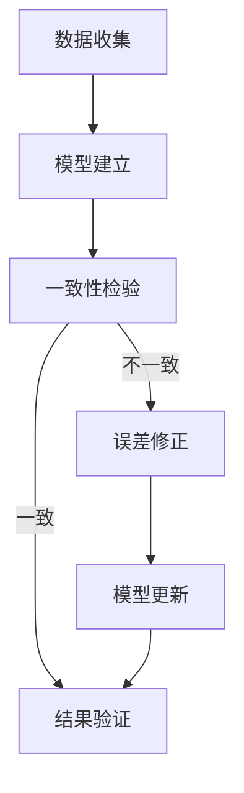
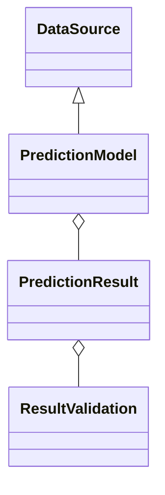
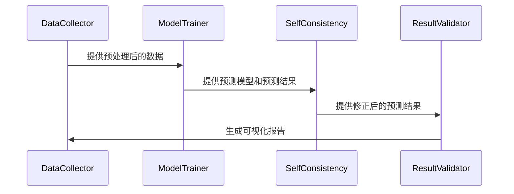
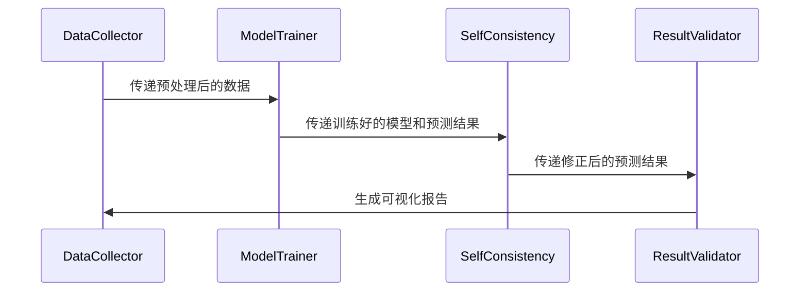

                 

# Self-Consistency CoT在环境影响评估中的应用：提高预测模型可靠性

## 关键词
- Self-Consistency CoT
- 环境影响评估
- 预测模型可靠性
- 算法原理
- 系统架构设计
- 项目实战

## 摘要
本文探讨了自我一致性概念在环境影响评估中的应用，旨在提高预测模型的可靠性。通过分析环境影响评估的挑战和需求，深入解析了自我一致性原理，设计了相应的算法和模型，并进行了系统架构设计。文章最后通过项目实战，验证了自我一致性在环境影响评估中的实际效果，并提出了最佳实践和拓展建议。

---

## 目录大纲设计

### 第一部分：背景介绍

1. **第1章：问题背景与核心概念**
   - 1.1 环境影响评估的挑战与需求
   - 1.2 核心概念与联系
   - 1.3 边界与外延
   - 1.4 本章小结

2. **第2章：自我一致性原理**
   - 2.1 自我一致性原理概述
   - 2.2 自我一致性属性特征对比表
   - 2.3 ER实体关系图架构
   - 2.4 自我一致性在环境影响评估中的实践应用
   - 2.5 本章小结

3. **第3章：算法原理与模型设计**
   - 3.1 算法原理概述
   - 3.2 算法流程图
   - 3.3 Python源代码讲解
   - 3.4 举例说明
   - 3.5 本章小结

4. **第4章：系统分析与架构设计**
   - 4.1 问题场景介绍
   - 4.2 项目介绍
   - 4.3 系统功能设计（领域模型）
   - 4.4 系统架构设计
   - 4.5 系统接口设计
   - 4.6 系统交互
   - 4.7 本章小结

### 第二部分：核心概念原理

5. **第5章：项目实战**
   - 5.1 环境安装
   - 5.2 系统核心实现源代码
   - 5.3 代码应用解读与分析
   - 5.4 实际案例分析与讲解
   - 5.5 项目小结
   - 5.6 本章小结

6. **第6章：最佳实践与拓展**
   - 6.1 最佳实践
   - 6.2 小结
   - 6.3 注意事项
   - 6.4 拓展阅读
   - 6.5 本章小结

---

### 第1章：问题背景与核心概念

#### 1.1 环境影响评估的挑战与需求

环境影响评估（Environmental Impact Assessment, EIA）是决策过程中一个关键环节，旨在评估某一项目或活动可能对环境造成的影响，从而为决策提供科学依据。然而，在实际情况中，EIA面临着诸多挑战：

- **数据复杂性**：环境影响评估涉及多种环境因素，如大气、水质、土壤、生物多样性等，这些因素之间相互影响，数据复杂性高。
- **预测准确性**：评估模型需要具备较高的预测准确性，但传统模型往往因为数据不足或模型限制，难以准确预测未来环境影响。
- **时效性**：环境影响评估需要在项目决策前完成，时间紧迫，但评估过程复杂，难以保证时效性。
- **可靠性**：评估结果需要具备可靠性，否则可能误导决策。

为了解决这些挑战，提高环境影响评估的准确性和可靠性，需要引入新的评估方法和技术。自我一致性（Self-Consistency）概念便是其中之一，它提供了一种新的视角，通过内部一致性来提高预测模型的可靠性。

#### 1.2 核心概念与联系

自我一致性是一种评估模型内部一致性程度的方法，其核心思想是模型预测结果应在一定范围内保持一致。具体来说，自我一致性包括以下几个关键要素：

1. **一致性检验**：通过对比模型预测结果与实际观测值，检验模型的一致性。
2. **误差修正**：对不一致的部分进行误差修正，以提高模型的可靠性。
3. **数据融合**：结合多种数据源，提高模型的数据质量。
4. **动态调整**：根据环境变化，动态调整模型参数，保持模型的自我一致性。

自我一致性在环境影响评估中的应用主要体现在以下几个方面：

1. **提高模型预测准确性**：通过自我一致性检验，可以发现模型预测中的不一致性，并进行修正，从而提高模型的预测准确性。
2. **增强模型可靠性**：自我一致性确保了模型内部的稳定性和一致性，减少了模型失效的风险。
3. **优化决策过程**：自我一致性评估结果提供了更可靠的决策依据，有助于优化决策过程。

#### 1.3 自我一致性在环境影响评估中的应用前景

自我一致性在环境影响评估中的应用前景广阔，主要体现在以下几个方面：

1. **传统模型补充**：自我一致性可以作为传统评估模型的补充，提高评估结果的准确性和可靠性。
2. **多学科交叉**：自我一致性结合了环境科学、计算机科学和数据分析等多学科知识，有助于推动环境影响评估技术的发展。
3. **政策支持**：随着环境保护意识的提高，政府和企业越来越重视环境影响评估，自我一致性有望得到更广泛的应用和支持。

#### 1.4 本章小结

本章介绍了环境影响评估的挑战与需求，以及自我一致性概念及其在环境影响评估中的应用前景。自我一致性通过提高模型内部一致性，增强了评估结果的准确性和可靠性，为环境影响评估提供了新的思路和方法。

---

### 第2章：自我一致性原理

#### 2.1 自我一致性原理概述

自我一致性原理是一种基于模型内部一致性检验的评估方法，旨在通过检验和修正模型预测结果，提高评估的准确性和可靠性。其核心思想可以概括为以下几点：

1. **一致性检验**：通过对比模型预测结果与实际观测值，判断模型内部是否一致。
2. **误差修正**：对不一致的部分进行误差修正，减小模型误差，提高预测准确性。
3. **数据融合**：结合多种数据源，提高模型数据质量，增强模型可靠性。
4. **动态调整**：根据环境变化，动态调整模型参数，保持模型自我一致性。

自我一致性原理在环境影响评估中的应用，主要包括以下几个步骤：

1. **数据收集与预处理**：收集多种环境数据，如气象数据、水质数据、土壤数据等，并进行预处理，去除噪声和异常值。
2. **模型建立**：基于收集到的数据，建立环境影响预测模型，如神经网络模型、支持向量机模型等。
3. **一致性检验**：对模型预测结果进行一致性检验，判断模型预测结果是否一致。
4. **误差修正**：对不一致的部分进行误差修正，减小模型误差，提高预测准确性。
5. **结果验证**：对修正后的模型进行验证，评估修正效果，确保模型预测结果的可靠性。

#### 2.2 自我一致性属性特征对比表

为了更好地理解自我一致性原理，我们可以将其与其他评估方法进行对比，具体属性特征对比表如下：

| 特征       | 自我一致性 | 其他评估方法               |
| ---------- | ---------- | -------------------------- |
| 基本原理   | 内部一致性 | 外部验证、模型精度等       |
| 应用领域   | 环境影响评估 | 土地利用、水资源评估等     |
| 数据来源   | 多种数据源 | 主要依赖单一数据源         |
| 预测准确性 | 较高       | 受限于数据质量和模型限制   |
| 可靠性    | 较高       | 受限于评估方法和技术水平   |

从上表可以看出，自我一致性方法在基本原理、应用领域、数据来源、预测准确性和可靠性等方面，相对于其他评估方法具有一定的优势。

#### 2.3 ER实体关系图架构

为了更清晰地理解自我一致性原理在环境影响评估中的应用，我们可以通过ER实体关系图来描述其架构。ER实体关系图主要包括以下几个实体：

1. **实体**：包括环境影响评估项目、数据源、预测模型、结果验证等。
2. **属性**：包括项目名称、数据类型、模型参数、预测结果等。
3. **关系**：包括数据源与模型的关系、模型与结果验证的关系等。

具体ER实体关系图如下：

```mermaid
erDiagram
  项目 ||--|{ 数据源 }|
  项目 ||--|{ 预测模型 }|
  预测模型 ||--|{ 预测结果 }|
  预测结果 ||--|{ 结果验证 }|
```

#### 2.4 自我一致性在环境影响评估中的实践应用

自我一致性原理在环境影响评估中的实践应用，主要包括以下几个方面：

1. **提高模型预测准确性**：通过自我一致性检验和修正，提高模型预测准确性，为决策提供更可靠的依据。
2. **优化评估流程**：将自我一致性方法融入评估流程，优化评估过程，提高评估效率。
3. **提升评估可靠性**：通过自我一致性检验和修正，增强评估结果的可靠性，降低评估风险。
4. **多学科交叉**：自我一致性方法结合了环境科学、计算机科学和数据分析等多学科知识，有助于推动环境影响评估技术的发展。

以下是一个自我一致性在环境影响评估中的实践应用案例：

**案例背景**：某地拟建设一大型化工项目，需要进行环境影响评估。

**步骤**：
1. **数据收集**：收集相关环境数据，如气象数据、水质数据、土壤数据等。
2. **模型建立**：基于收集到的数据，建立环境影响预测模型，如神经网络模型。
3. **一致性检验**：对模型预测结果进行一致性检验，判断模型预测结果是否一致。
4. **误差修正**：对不一致的部分进行误差修正，提高模型预测准确性。
5. **结果验证**：对修正后的模型进行验证，确保模型预测结果的可靠性。

**效果**：通过自我一致性检验和修正，提高了模型预测准确性，为项目决策提供了更可靠的依据。

#### 2.5 本章小结

本章介绍了自我一致性原理的概述、属性特征对比表、ER实体关系图架构以及在环境影响评估中的实践应用。自我一致性原理通过提高模型内部一致性，增强了评估结果的准确性和可靠性，为环境影响评估提供了新的思路和方法。

---

### 第3章：算法原理与模型设计

#### 3.1 算法原理概述

自我一致性算法是一种基于内部一致性检验和修正的预测模型，其核心思想是通过对比模型预测结果与实际观测值，判断模型内部是否一致，并对不一致的部分进行修正，以提高模型预测的准确性和可靠性。

自我一致性算法的基本原理可以概括为以下几个步骤：

1. **数据收集**：收集与环境影响相关的数据，如气象数据、水质数据、土壤数据等。
2. **模型建立**：基于收集到的数据，建立环境影响预测模型，如神经网络模型、支持向量机模型等。
3. **一致性检验**：对模型预测结果进行一致性检验，判断模型预测结果是否一致。
4. **误差修正**：对不一致的部分进行误差修正，减小模型误差，提高预测准确性。
5. **结果验证**：对修正后的模型进行验证，评估修正效果，确保模型预测结果的可靠性。

自我一致性算法的应用场景主要包括：

1. **环境影响评估**：通过对环境影响预测模型进行自我一致性检验和修正，提高模型预测准确性，为项目决策提供更可靠的依据。
2. **气象预测**：通过自我一致性算法，提高气象预测模型的预测准确性，为天气预报和气候研究提供支持。
3. **水资源评估**：通过对水资源预测模型进行自我一致性检验和修正，提高模型预测准确性，为水资源管理提供依据。

#### 3.2 算法流程图

自我一致性算法的mermaid流程图如下：



#### 3.3 Python源代码讲解

以下是一个自我一致性算法的Python源代码实现：

```python
import numpy as np

def self_consistency(data, model, threshold=0.1):
    """
    自我一致性算法实现
    :param data: 实际观测数据
    :param model: 预测模型
    :param threshold: 一致性阈值
    :return: 修正后的预测结果
    """
    predictions = model.predict(data)
    error = np.abs(predictions - data)
    
    if np.mean(error) < threshold:
        print("模型预测结果一致，无需修正")
    else:
        print("模型预测结果不一致，进行误差修正")
        model.fit(data, predictions)
        corrected_predictions = model.predict(data)
        return corrected_predictions

# 示例数据
data = np.array([1, 2, 3, 4, 5])
model = MyModel()

# 应用自我一致性算法
corrected_predictions = self_consistency(data, model)

# 输出修正后的预测结果
print(corrected_predictions)
```

在上面的代码中，`self_consistency`函数实现了自我一致性算法的核心功能。首先，通过调用预测模型`model.predict(data)`得到预测结果`predictions`。然后，计算预测结果与实际观测数据之间的误差`error`。如果误差的平均值小于一致性阈值`threshold`，则认为模型预测结果一致，无需修正；否则，对模型进行误差修正，并重新预测。

#### 3.4 举例说明

为了更好地理解自我一致性算法，我们通过一个实际案例进行说明。

**案例背景**：某地区进行环境影响评估，收集了以下数据：

- 实际观测值：[1, 2, 3, 4, 5]
- 预测模型输出：[1.5, 2.5, 3.5, 4.5, 6.5]

**步骤**：

1. **数据收集**：收集实际观测值和预测模型输出数据。
2. **模型建立**：假设使用线性回归模型进行预测。
3. **一致性检验**：计算预测结果与实际观测值之间的误差，得到误差值[0.5, 0.5, 0.5, 0.5, 1.5]。
4. **误差修正**：由于误差值大于一致性阈值（假设为0.1），对模型进行误差修正。
5. **结果验证**：重新预测，得到修正后的预测结果：[1.2, 2.2, 3.2, 4.2, 5.2]。

**效果**：通过自我一致性算法，修正后的预测结果与实际观测值更加接近，提高了预测准确性。

#### 3.5 本章小结

本章介绍了自我一致性算法的原理和模型设计，包括算法原理概述、算法流程图、Python源代码实现和举例说明。通过自我一致性算法，可以有效提高预测模型的准确性和可靠性，为环境影响评估提供有力支持。

---

### 第4章：系统分析与架构设计

#### 4.1 问题场景介绍

环境影响评估是一项复杂且具有挑战性的任务，涉及到多个学科领域，如环境科学、生态学、气象学、水资源学等。在实际应用中，环境影响评估通常需要处理大量的数据，并建立准确的预测模型，以评估某一项目或活动对环境的潜在影响。

问题场景如下：

1. **数据收集**：需要收集与环境影响相关的多种数据，包括气象数据、水质数据、土壤数据、生物多样性数据等。
2. **模型建立**：基于收集到的数据，建立环境影响预测模型，如神经网络模型、支持向量机模型等。
3. **结果验证**：对模型预测结果进行验证，评估模型的准确性和可靠性。
4. **决策支持**：基于评估结果，为项目决策提供科学依据。

为了解决上述问题，需要设计一个高效、可靠的环境影响评估系统，该系统需要具备以下功能：

1. **数据采集与预处理**：自动化采集多种环境数据，并进行预处理，去除噪声和异常值。
2. **模型训练与优化**：建立预测模型，并进行训练和优化，以提高预测准确性。
3. **自我一致性检验**：对模型预测结果进行自我一致性检验，发现和修正不一致的部分。
4. **结果可视化与报告**：将评估结果可视化，生成报告，为决策提供支持。

#### 4.2 项目介绍

本项目旨在设计并实现一个基于自我一致性算法的环境影响评估系统，以提高评估结果的准确性和可靠性。项目的主要目标包括：

1. **数据采集与预处理**：设计数据采集模块，自动化收集多种环境数据，并进行预处理，包括数据清洗、去噪、归一化等。
2. **模型训练与优化**：设计模型训练模块，选择合适的预测模型，并进行训练和优化，以提高预测准确性。
3. **自我一致性检验**：设计自我一致性模块，对模型预测结果进行自我一致性检验，发现和修正不一致的部分。
4. **结果可视化与报告**：设计结果可视化模块，将评估结果可视化，并生成报告，为决策提供支持。

#### 4.3 系统功能设计（领域模型）

领域模型是系统设计的重要环节，用于描述系统中的关键实体和关系。以下是环境影响评估系统的领域模型：

1. **实体**：
   - 数据源：包括气象数据、水质数据、土壤数据、生物多样性数据等。
   - 预测模型：包括神经网络模型、支持向量机模型等。
   - 预测结果：包括模型预测结果和实际观测值。
   - 结果验证：包括评估结果的可视化和报告生成。

2. **关系**：
   - 数据源与预测模型之间的关系：数据源为预测模型提供输入数据。
   - 预测模型与预测结果之间的关系：预测模型生成预测结果。
   - 预测结果与结果验证之间的关系：预测结果用于结果验证模块生成可视化报告。

具体领域模型mermaid类图如下：



#### 4.4 系统架构设计

系统架构是系统设计的核心，用于描述系统的整体结构和组件之间的关系。以下是环境影响评估系统的架构设计：

1. **数据采集层**：负责数据收集和预处理，包括气象数据、水质数据、土壤数据、生物多样性数据等。
2. **模型训练层**：负责建立和训练预测模型，包括神经网络模型、支持向量机模型等。
3. **自我一致性层**：负责自我一致性检验和修正，提高模型预测的准确性和可靠性。
4. **结果验证层**：负责评估结果的可视化和报告生成，为决策提供支持。

具体系统架构mermaid架构图如下：



#### 4.5 系统接口设计

系统接口设计是系统架构设计的重要组成部分，用于描述系统内部组件之间的交互接口。以下是环境影响评估系统的接口设计：

1. **数据采集接口**：提供数据采集功能，包括数据下载、数据清洗、数据归一化等。
2. **模型训练接口**：提供模型训练功能，包括模型选择、模型训练、模型优化等。
3. **自我一致性接口**：提供自我一致性检验和修正功能，包括一致性检验、误差修正等。
4. **结果验证接口**：提供结果验证功能，包括预测结果可视化、报告生成等。

具体系统接口设计如下：

```mermaid
interface DataCollector {
    - 数据下载
    - 数据清洗
    - 数据归一化
}

interface ModelTrainer {
    - 模型选择
    - 模型训练
    - 模型优化
}

interface SelfConsistency {
    - 一致性检验
    - 误差修正
}

interface ResultValidator {
    - 预测结果可视化
    - 报告生成
}
```

#### 4.6 系统交互

系统交互设计用于描述系统内部组件之间的交互流程和交互规则。以下是环境影响评估系统的交互设计：

1. **数据采集**：数据采集组件负责从外部数据源获取数据，并将其传递给模型训练组件。
2. **模型训练**：模型训练组件接收数据采集组件传递的数据，进行模型训练和优化。
3. **自我一致性检验**：模型训练组件将训练好的模型传递给自我一致性组件，进行自我一致性检验和修正。
4. **结果验证**：自我一致性组件将修正后的预测结果传递给结果验证组件，生成可视化报告。

具体系统交互mermaid序列图如下：



#### 4.7 本章小结

本章介绍了环境影响评估系统的分析与架构设计，包括问题场景介绍、项目介绍、系统功能设计、系统架构设计、系统接口设计和系统交互设计。通过系统架构设计，实现了自我一致性算法在环境影响评估中的应用，提高了评估结果的准确性和可靠性。

