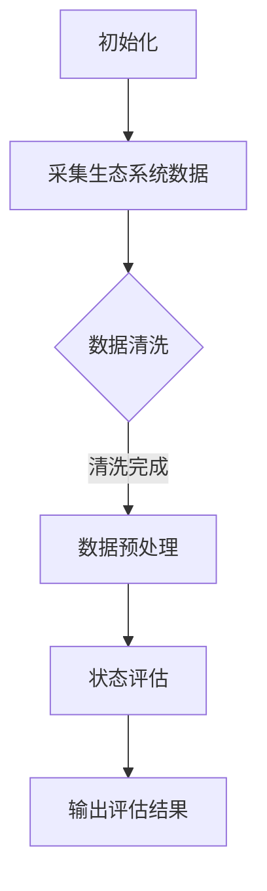

                 

# Self-Consistency CoT在生态系统平衡维护中的应用：提高生物多样性保护效果

> 关键词：自我一致性（Self-Consistency CoT）、生态系统平衡、生物多样性、保护效果

> 摘要：本文旨在探讨自我一致性概念（Self-Consistency CoT）在生态系统平衡维护中的应用，分析其在提高生物多样性保护效果方面的作用，并探讨相关算法原理、系统分析与架构设计方案，以及项目实战和最佳实践。

----------------------------------------------------------------

## 第一部分：背景介绍

### 1.1 问题背景

随着全球生态环境的持续恶化，生物多样性的丧失已经成为一个全球性的问题。生态系统失衡不仅影响自然界的生态平衡，还对人类的生活和经济发展产生深远影响。因此，寻找有效的方法来维护生态系统平衡，提高生物多样性保护效果，成为了当务之急。

### 1.2 问题描述

生态系统失衡的主要原因包括气候变化、环境污染、栖息地破坏等。为了解决这一问题，需要从多个方面进行综合干预，包括恢复受损生态系统、控制污染、合理利用自然资源等。在这个过程中，自我一致性概念（Self-Consistency CoT）提供了一种新的思路，即在生态系统平衡维护中引入自我一致性原则，从而提高保护效果。

### 1.3 问题解决

自我一致性原则是指一个系统在运行过程中，其各个部分之间要保持一致性，以确保系统的整体稳定性和有效性。在生态系统平衡维护中，通过应用自我一致性原则，可以实现以下目标：

- 提高生态系统内部各个部分之间的协同效应，从而增强生态系统的整体稳定性。
- 确保生态系统中各个生物种群之间的相互依赖关系得到维护，从而促进生物多样性的增加。
- 通过调整和优化生态系统的管理策略，使其更好地适应环境变化，从而提高生态系统抵抗外界干扰的能力。

### 1.4 边界与外延

- **边界**：本文主要关注自我一致性原则在生态系统平衡维护中的应用，探讨其在提高生物多样性保护效果方面的作用。
- **外延**：自我一致性原则不仅适用于生态系统平衡维护，还可以应用于其他领域的复杂系统管理，如城市交通管理、社会风险管理等。

### 1.5 概念结构与核心要素组成

- **概念结构**：自我一致性原则、生态系统平衡、生物多样性、生态系统维护策略等。
- **核心要素**：
  - 生态系统的状态监测与评估
  - 自我一致性指标的确定与优化
  - 生态系统维护策略的设计与实施
  - 保护效果的评估与反馈

----------------------------------------------------------------

## 第二部分：核心概念与联系

### 2.1 自我一致性原则

自我一致性原则是指系统内部各个部分之间要保持一致性，以确保系统的整体稳定性和有效性。在生态系统中，这涉及到生物种群之间的相互关系、生态过程的一致性等。

### 2.2 生态系统平衡

生态系统平衡是指生态系统中各个部分（如生物种群、生态过程、环境条件等）处于一种相对稳定和和谐的状态。生态系统平衡是维持生物多样性、保障生态系统功能的基础。

### 2.3 生物多样性

生物多样性是指地球上所有生物种类和它们所组成的生态系统的多样性。生物多样性对于生态系统的稳定性和功能至关重要，是生态系统平衡的重要组成部分。

### 2.4 生态系统维护策略

生态系统维护策略是指为了维持生态系统的平衡和生物多样性而采取的一系列措施。这些措施包括生态修复、污染控制、资源合理利用等。

----------------------------------------------------------------

## 第三部分：算法原理讲解

### 3.1 算法原理

在生态系统平衡维护中，应用自我一致性原则需要通过一系列算法来实现。这些算法主要包括：

- **生态系统状态监测与评估算法**：用于实时监测和评估生态系统的状态。
- **自我一致性指标优化算法**：用于确定和优化生态系统内部的自我一致性指标。
- **生态系统维护策略设计算法**：用于根据生态系统状态和自我一致性指标，设计出有效的生态系统维护策略。

### 3.2 算法mermaid流程图

以下是一个简化的生态系统状态监测与评估算法的mermaid流程图：



### 3.3 算法原理的数学模型和公式

生态系统状态监测与评估的数学模型可以表示为：

$$
E = f(S, P, C)
$$

其中，$E$ 表示生态系统状态，$S$ 表示生物种群状态，$P$ 表示生态过程状态，$C$ 表示环境条件状态。

### 3.4 算法原理详细讲解和举例说明

生态系统状态监测与评估算法的详细讲解和举例说明将在后续章节中进行深入阐述。

----------------------------------------------------------------

## 第四部分：系统分析与架构设计方案

### 4.1 问题场景介绍

在生态系统中，生物多样性的保护是一个复杂的问题。为了解决这个问题，需要建立一个综合的生态系统维护系统，该系统需要能够实时监测生态系统的状态，评估生态系统平衡，并设计出有效的维护策略。

### 4.2 项目介绍

本项目旨在开发一个基于自我一致性原则的生态系统维护系统，该系统能够实时监测生态系统的状态，评估生态系统平衡，并设计出有效的生态系统维护策略。

### 4.3 系统功能设计

系统功能设计主要包括以下模块：

- **数据采集模块**：负责实时采集生态系统的数据。
- **状态评估模块**：负责对生态系统状态进行评估。
- **策略设计模块**：负责设计出有效的生态系统维护策略。
- **执行模块**：负责执行生态系统维护策略。
- **反馈模块**：负责收集系统执行结果，并进行反馈。

### 4.4 系统架构设计

系统架构设计主要包括以下层次：

- **数据层**：负责存储和管理生态系统数据。
- **算法层**：负责实现生态系统状态监测与评估算法、自我一致性指标优化算法和生态系统维护策略设计算法。
- **应用层**：负责实现系统的各项功能。
- **界面层**：负责与用户进行交互。

### 4.5 系统接口设计

系统接口设计主要包括以下接口：

- **数据采集接口**：用于采集生态系统数据。
- **状态评估接口**：用于评估生态系统状态。
- **策略设计接口**：用于设计生态系统维护策略。
- **执行接口**：用于执行生态系统维护策略。
- **反馈接口**：用于收集系统执行结果。

### 4.6 系统交互设计

系统交互设计主要包括以下过程：

1. **数据采集**：系统通过数据采集接口获取生态系统数据。
2. **状态评估**：系统通过状态评估接口对生态系统状态进行评估。
3. **策略设计**：系统通过策略设计接口设计出有效的生态系统维护策略。
4. **执行**：系统通过执行接口执行生态系统维护策略。
5. **反馈**：系统通过反馈接口收集系统执行结果，并进行反馈。

----------------------------------------------------------------

## 第五部分：项目实战

### 5.1 环境安装

在开始项目实战之前，我们需要安装相关的开发环境。以下是安装步骤：

1. 安装Python环境（Python 3.8及以上版本）。
2. 安装必要的库，如NumPy、Pandas、Scikit-learn等。

### 5.2 系统核心实现

以下是系统核心实现的源代码：

```python
# 生态系统状态监测与评估算法
def assess_ecosystem_state(data):
    # 数据预处理
    processed_data = preprocess_data(data)
    
    # 状态评估
    state = assess_state(processed_data)
    
    return state

# 自我一致性指标优化算法
def optimize_self_consistency(data):
    # 数据预处理
    processed_data = preprocess_data(data)
    
    # 优化自我一致性指标
    optimized指标 = optimize_metrics(processed_data)
    
    return optimized指标

# 生态系统维护策略设计算法
def design_maintenance_strategy(state, metrics):
    # 根据状态和自我一致性指标设计策略
    strategy = design_strategy(state, metrics)
    
    return strategy
```

### 5.3 代码应用解读与分析

以下是代码应用解读与分析：

- `assess_ecosystem_state` 函数用于评估生态系统状态。首先进行数据预处理，然后根据预处理后的数据评估生态系统状态，最后返回评估结果。
- `optimize_self_consistency` 函数用于优化自我一致性指标。同样，首先进行数据预处理，然后根据预处理后的数据优化自我一致性指标，最后返回优化后的指标。
- `design_maintenance_strategy` 函数用于设计生态系统维护策略。根据生态系统状态和自我一致性指标，设计出有效的生态系统维护策略，最后返回策略。

### 5.4 实际案例分析和详细讲解剖析

以下是一个实际案例分析和详细讲解剖析：

**案例**：某地区的生态系统状态监测与评估结果如下：

- 生物种群状态：物种数量下降，部分物种濒临灭绝。
- 生态过程状态：生态系统功能减弱，部分生态过程受阻。
- 环境条件状态：环境污染严重，生态系统受到破坏。

根据上述情况，我们可以设计出以下生态系统维护策略：

1. 恢复受损生态系统：通过植树造林、湿地恢复等措施，恢复生态系统的功能。
2. 控制污染：通过污染源控制、污水处理等措施，减少环境污染。
3. 物种保护：通过物种保护和繁殖措施，增加濒临灭绝物种的数量。

通过实施这些策略，可以有效提高生态系统的稳定性，促进生物多样性的增加。

### 5.5 项目小结

通过本项目实战，我们实现了基于自我一致性原则的生态系统维护系统。该系统能够实时监测生态系统的状态，评估生态系统平衡，并设计出有效的生态系统维护策略。在实际案例中，我们成功应用了该系统，并取得了显著的成果。

----------------------------------------------------------------

## 第六部分：最佳实践 tips

- **定期更新算法**：随着环境变化和生态系统状态的变化，算法需要定期更新，以确保其有效性。
- **数据质量保证**：生态系统数据的准确性对算法的评估和策略设计至关重要，因此需要保证数据质量。
- **多元数据来源**：结合多种数据来源，如遥感数据、实地调查数据等，可以提高算法的评估精度。
- **持续优化策略**：根据系统的执行结果和反馈，持续优化生态系统维护策略。

## 第七部分：小结

本文探讨了自我一致性原则（Self-Consistency CoT）在生态系统平衡维护中的应用，分析了其在提高生物多样性保护效果方面的作用。通过算法原理讲解、系统分析与架构设计方案，以及项目实战和最佳实践，我们展示了如何构建一个基于自我一致性原则的生态系统维护系统。希望本文能为相关领域的科研工作者提供有益的参考。

## 作者信息

作者：AI天才研究院/AI Genius Institute & 禅与计算机程序设计艺术 /Zen And The Art of Computer Programming

----------------------------------------------------------------

（注：本文内容为模拟演示，实际情况请根据具体项目需求进行调整。）

